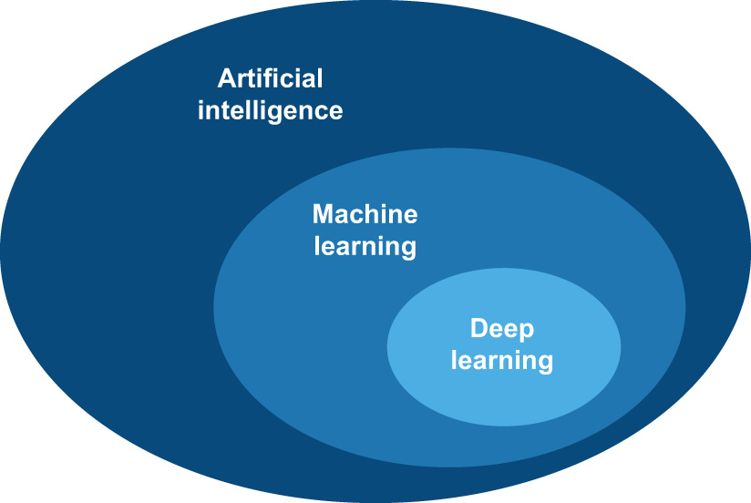
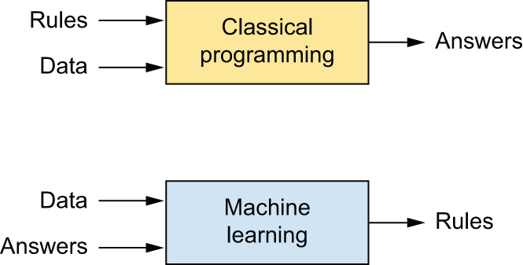
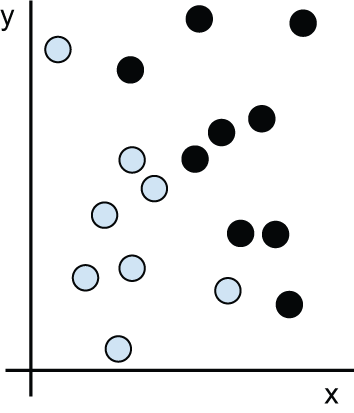
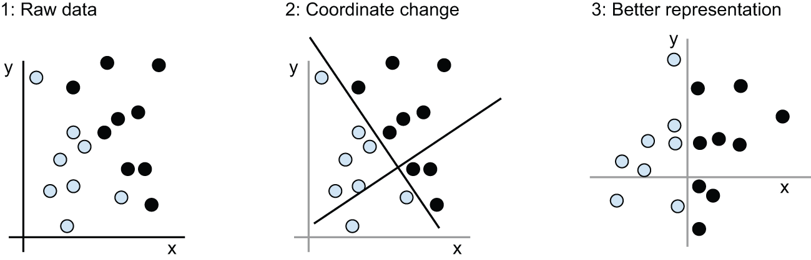
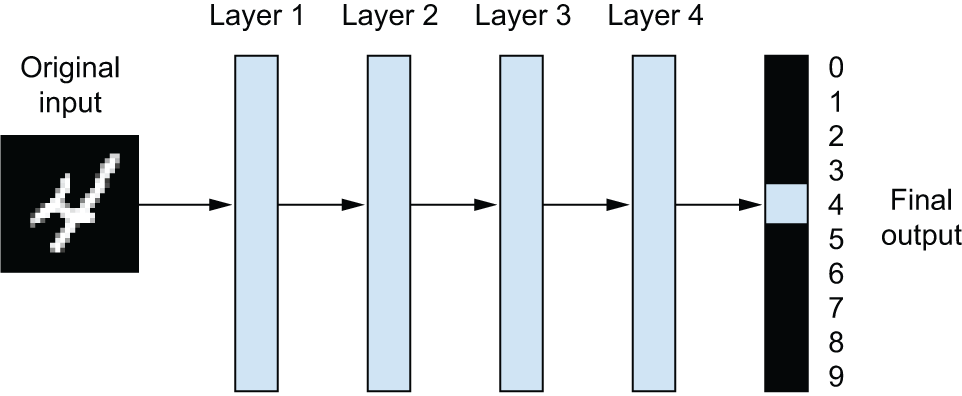
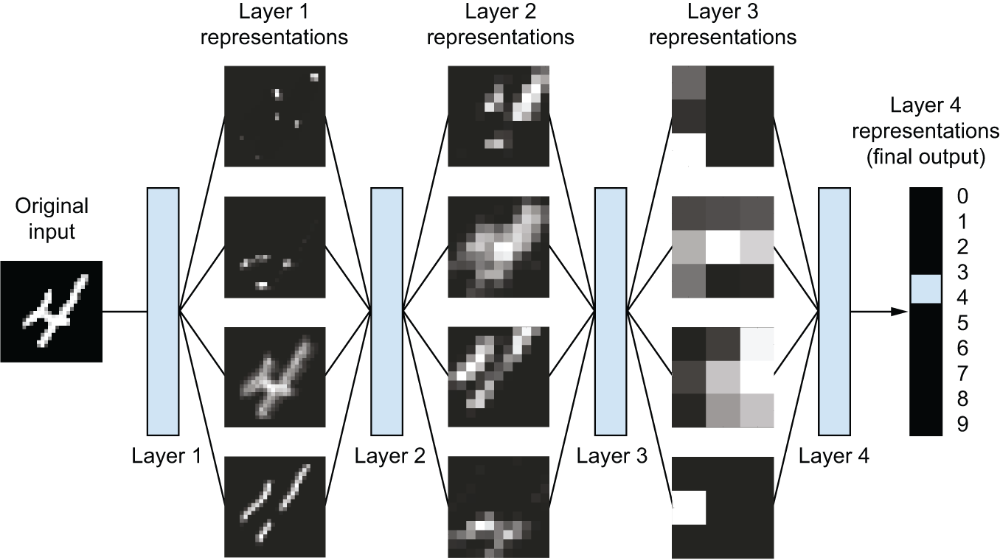
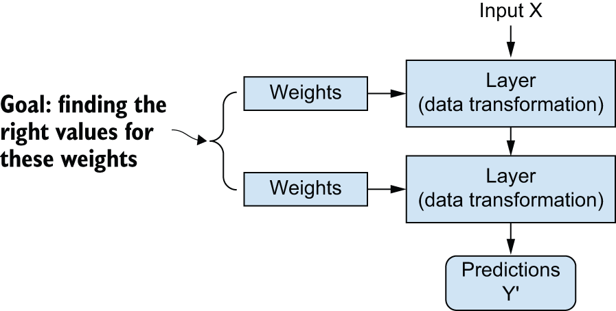
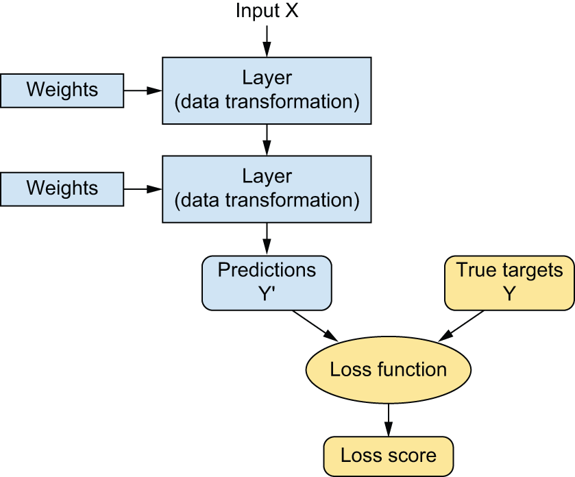
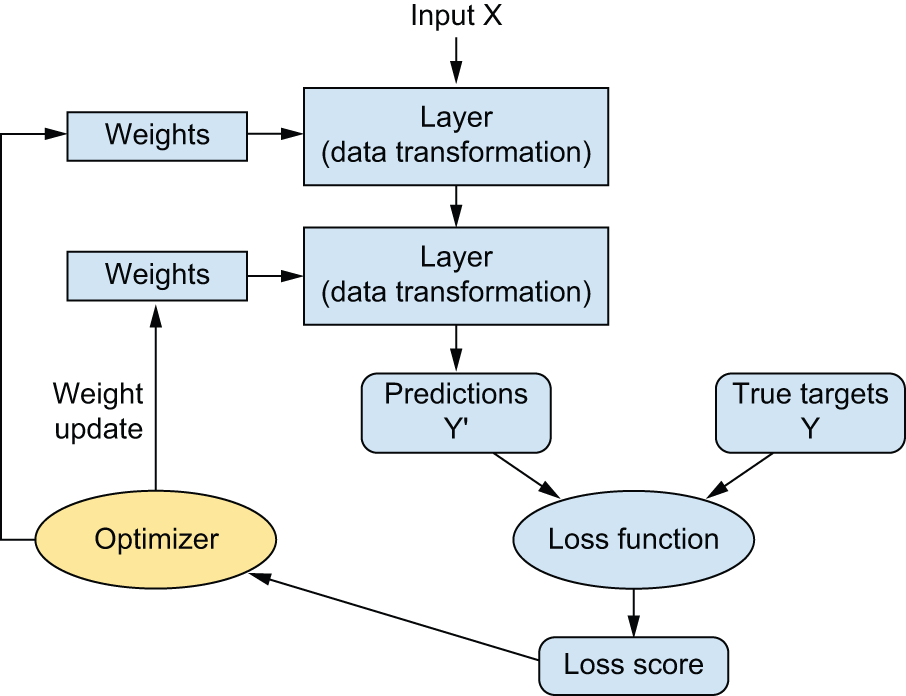

<!-- tabs:start -->

#### **Tiếng Anh (English)**

# Chapter 1: What is deep learning?

This chapter covers

* High-level definitions of fundamental concepts
* A soft introduction to the principles behind machine learning
* Deep learning’s rising popularity and future potential

Over the past decade, artificial intelligence (AI) has been a subject of
intense media hype. Machine learning, deep learning, and AI come up in countless
articles, often outside of technology-minded publications. We’re promised a
future of intelligent chatbots, self-driving cars, and virtual assistants —
a future sometimes painted in a grim light and other times as utopian, where
human jobs will be scarce and most economic activity will be handled by robots
or AI agents. For a practitioner of machine
learning, it’s important to be able to recognize the signal amid the noise, so that
you can tell world-changing developments from overhyped press releases.
Our future is at stake, and it’s one in which you have an active role to
play: after reading this book, you’ll be one of those who can develop these AI systems.
So let’s tackle these questions: What has deep learning achieved so far?
How significant is it? Where are we headed next? Should you believe the hype?

## Artificial intelligence, machine learning, and deep learning

First, we need to define clearly what we’re talking about when we mention AI.
What are artificial intelligence, machine learning, and deep learning (figure 1.1)?
How do they relate to each other?

[Figure 1.1](#figure-1-1): Artificial intelligence, machine learning, and deep learning

## Artificial intelligence

Artificial intelligence was born in the 1950s, when a handful of pioneers from
the nascent field of computer science started asking whether computers could be
made to “think” — a question whose ramifications we’re still exploring today.

While many of the underlying ideas had been brewing in the years and even
decades prior, “artificial intelligence” finally crystallized as a field of
research in 1956, when John McCarthy, then a young Assistant Professor of
Mathematics at Dartmouth College, organized a summer workshop under the
following proposal:

> The study is to proceed on the basis of the conjecture
> that every aspect of learning or any other feature of intelligence can
> in principle be so precisely described that a machine can be made to
> simulate it. An attempt will be made to find how to make machines use language,
> form abstractions and concepts, solve kinds of problems now reserved for humans,
> and improve themselves. We think that a significant advance can be made in one
> or more of these problems if a carefully selected group of scientists work on it
> together for a summer.

At the end of the summer, the workshop concluded without having fully solved
the riddle it set out to investigate. Nevertheless, it was attended by many
people who would move on to become pioneers in the field, and it set in motion
an intellectual revolution that is still ongoing to this day.

Concisely, AI can be described as
*the effort to automate intellectual tasks normally performed by humans*.
As such, AI is a general field that encompasses machine learning and
deep learning, but that also includes many more approaches
that may not involve any learning.
Consider that until the 1980s, most AI textbooks didn’t
mention “learning” at all! Early chess programs, for instance, only involved
hardcoded rules crafted by programmers and didn’t qualify as machine learning.
In fact, for a fairly long time, most experts believed that human-level
artificial intelligence could be achieved by having programmers handcraft a
sufficiently large set of explicit rules for manipulating knowledge stored in
explicit databases. This approach is known as *symbolic AI*.
It was the dominant paradigm in AI from the 1950s to the late 1980s, and
it reached its peak popularity during the *expert systems* boom of the 1980s.

Although symbolic AI proved suitable to solve well-defined, logical problems,
such as playing chess, it turned out to be intractable to figure out explicit
rules for solving more complex, fuzzy problems, such as image classification,
speech recognition, or natural language translation. A new approach arose to
take symbolic AI’s place: *machine learning*.

## Machine learning

In Victorian England, Lady Ada Lovelace was a friend and collaborator of
Charles Babbage, the inventor of the Analytical Engine: the first-known
general-purpose mechanical computer. Although visionary and far ahead of its
time, the Analytical Engine wasn’t meant as a general-purpose computer when it
was designed in the 1830s and 1840s, because the concept of general-purpose
computation was yet to be invented. It was merely meant as a way to use
mechanical operations to automate certain computations from the field of
mathematical analysis — hence, the name Analytical Engine. As such,
it was the intellectual descendant of earlier attempts at encoding mathematical
operations in gear form, such as the Pascaline, or Leibniz’s step reckoner, a
refined version of the Pascaline. Designed by Blaise Pascal in 1642
(at age 19!), the Pascaline was the world’s first mechanical
calculator — it could add, subtract, multiply, or even divide digits.

In 1843, Ada Lovelace remarked on the invention of the Analytical Engine:

> The Analytical Engine has no pretensions whatever to originate anything.
> It can do whatever we know how to order it to perform…
> Its province is to assist us in making available what
> we’re already acquainted with.

Even with 182 years of historical perspective, Lady Lovelace’s observation
remains arresting. Could a general-purpose computer “originate” anything,
or would it always be bound to dully execute processes we humans fully
understand? Could it ever be capable of any original thought?
Could it learn from experience? Could it show creativity?

Her remark was later quoted by AI pioneer Alan Turing as “Lady Lovelace’s
objection” in his landmark 1950 paper “Computing Machinery and Intelligence,”
[[1]](#footnote-1)
which introduced the *Turing test*[[2]](#footnote-2)
as well as key concepts that would come to shape AI.
Turing was of the opinion — highly provocative at the time —
that computers could, in principle, be made to emulate all aspects
of human intelligence.

The usual way to make a computer do useful work is to have a human programmer
write down rules — a computer program — to be followed to turn input data into
appropriate answers, just like Lady Lovelace writing down step-by-step
instructions for the Analytical Engine to perform. Machine learning turns this
around: the machine looks at the input data and the corresponding answers, and
figures out what the rules should be (figure 1.2).

[Figure 1.2](#figure-1-2): Machine learning: a new programming paradigm

A machine learning system is *trained* rather than explicitly programmed. It’s
presented with many examples relevant to a task, and it finds statistical
structure in these examples that eventually allows the system to come up with
rules for automating the task. For instance, if you wished to automate the task
of tagging your vacation pictures, you could present a machine learning system
with many examples of pictures already tagged by humans, and the system would
learn statistical rules for associating specific pictures to specific tags like
“landscape” or “food.”

Although machine learning only started to flourish in the 1990s,
it has quickly become the most popular and most successful subfield of AI,
a trend driven by the availability of faster hardware and larger datasets.
Machine learning is related to mathematical statistics, but it differs
from statistics in several important ways — in the same sense that
medicine is related to chemistry but cannot be reduced to chemistry, as medicine
deals with its own distinct systems with their own distinct properties.
Unlike statistics, machine learning tends to deal with large, complex datasets
(such as a dataset of millions of images, each consisting of tens of thousands
of pixels) for which classical statistical analysis such as Bayesian analysis
would be impractical. As a result, machine learning, and especially deep
learning, exhibits comparatively little mathematical theory — maybe too
little — and is fundamentally an engineering discipline.
Unlike theoretical physics or mathematics, machine learning is a very hands-on
field driven by empirical findings and deeply reliant on advances in software
and hardware.

## Learning rules and representations from data

To define *deep learning* and understand the difference between deep learning
and other machine learning approaches, first we need some idea of what
machine learning algorithms do. We just stated that machine learning discovers
rules to execute a data processing task, given examples of what’s expected.
So, to do machine learning, we need three things:

* *Input data points*  — For instance, if the task is speech recognition,
  these data points could be sound files of people speaking.
  If the task is image tagging, they could be pictures.

* *Examples of the expected output*  — In a speech-recognition task,
  these could be human-generated transcripts of sound files.
  In an image task, expected outputs could be tags such as
  “dog,” “cat,” and so on.

* *A way to measure whether the algorithm is doing a good job*  — This is
  necessary to determine the distance between the algorithm’s
  current output and its expected output. The measurement is used as a
  feedback signal to adjust the way the algorithm works. This adjustment step
  is what we call *learning*.

A machine learning model transforms its input data into meaningful outputs,
a process that is “learned” from exposure to known examples
of inputs and outputs. Therefore, the central problem in machine learning
and deep learning is to *meaningfully transform data*:
in other words, to learn useful *representations* of the input data at hand
— representations that get us closer to the expected output.

Before we go any further, what’s a representation? At its core, it’s a different
way to look at data to represent or encode data.
For instance, a color image can be encoded in the RGB format (red-green-blue)
or in the HSV format (hue-saturation-value): these are two different
representations of the same data. Some tasks that may be difficult with one
representation can become easy with another. For example, the task
“Select all red pixels in the image” is simpler in the RGB format, whereas
“Make the image less saturated” is simpler in the HSV format.
Machine learning models are all about finding appropriate representations for
their input data — transformations of the data that make it more amenable to
the task at hand.

Let’s make this concrete. Consider an x-axis, a y-axis, and some points
represented by their coordinates in the (x, y) system, as shown in figure 1.3.

[Figure 1.3](#figure-1-3): Some sample data

As you can see, we have a few white points and a few black points.
Let’s say we want to develop an algorithm that can take a point’s (x, y)
coordinates and output whether that point is likely black or white.
In this case,

* The inputs are the coordinates of our points.

* The expected outputs are the colors of our points.

* A way to measure whether our algorithm is doing a good job could be,
  for instance, the percentage of points that are being correctly classified.

What we need here is a new representation of our data that cleanly separates
the white points from the black points. One transformation we could use,
among many other possibilities, would be a coordinate change, illustrated
in figure 1.4.

[Figure 1.4](#figure-1-4): Coordinate change

In this new coordinate system, the coordinates of our points can be said to be a
new representation of our data. And it’s a good one! With this representation,
the black/white classification problem can be expressed as a simple rule:
“Black points are such that x > 0,” or “White points are such that x < 0.”
This new representation, combined with this simple rule, neatly
solves the classification problem.

In this case, we defined the coordinate change by hand: we used our
human intelligence to come up with our own appropriate representation
of the data. This is fine for such an extremely simple problem,
but could you do the same if the task were
to classify images of handwritten digits? Could you write down explicit,
computer-executable image transformations that would illuminate the difference
between a 6 and an 8, between a 1 and a 7, across all kinds of
different handwritings?

This is possible to an extent. Rules based on representations of
digits such as “counting the number of closed loops” or vertical and horizontal pixel
histograms can do a decent job at telling apart
handwritten digits. But finding such useful representations
by hand is hard work, and as you can imagine the resulting rule-based system
would be brittle and a nightmare to maintain.
Every time you would come across a new example of handwriting that would break
your carefully thought-out rules, you would have to add new data transformations
and new rules, while taking into account their interaction with every previous
rule.

You’re probably thinking, if this process is so painful,
could we automate it? What if we tried systematically searching for different
sets of automatically generated representations of the data and rules based
on them, identifying good ones using
the percentage of digits being correctly classified in some development dataset as feedback?
We would then be doing machine learning. *Learning*, in the context of machine
learning, describes an automatic search process for data transformations that
produce useful representations of some data, guided by some feedback signal
— representations that are amenable to simpler rules solving the task at hand.

These transformations can be coordinate changes (like in our
2D coordinates classification example) or a histogram of pixels and
counting loops (like in our digits classification example), but they could
also be linear projections, translations, and nonlinear operations (such as
“Select all points such that x > 0”), and so on. Machine learning algorithms
aren’t usually creative in finding these transformations; they’re merely
searching through a predefined set of operations, called a *hypothesis space*.
For instance, the space of all possible coordinate changes would be our
hypothesis space in the 2D coordinates classification example.

So that’s what machine learning is, concisely: searching for useful
representations and rules over some input data, within a predefined
space of possibilities, using guidance from a feedback signal.
This simple idea allows us to solve a
remarkably broad range of intellectual tasks, from autonomous driving
to natural language question-answering.

Now that you understand what we mean by *learning*, let’s take a look at what
makes *deep learning* special.

## The “deep” in “deep learning”

Deep learning is a specific subfield of machine learning; it’s a new take on learning
representations from data, which emphasizes learning successive layers of
increasingly meaningful representations. The “deep” in “deep learning” isn’t a
reference to any kind of deeper understanding achieved by the approach;
rather, it stands for this idea of successive layers of representations.
How many layers contribute to a model of the data is called the *depth* of
the model. Other appropriate names for the field could have
been *layered representations learning* or
*hierarchical representations learning*. Modern deep learning often involves
tens or even hundreds of successive layers of representations, and they’re all
learned automatically from exposure to training data. Meanwhile,
other approaches to machine learning tend to focus on learning only
one or two layers of representations of the data (say, taking a pixel histogram
and then applying a classification rule);
hence, they’re sometimes called *shallow learning*.

In deep learning, these layered representations are
learned via models called *neural networks*, structured in literal layers
stacked on top of each other. The term *neural network* is a reference to
neurobiology, but although some of the central concepts in deep learning
were developed in part by drawing inspiration from our understanding
of the brain (in particular, the visual cortex),
deep learning models are not models of the brain.
There’s no evidence that the brain implements anything like the learning
mechanisms used in modern deep learning models.
You may come across pop science articles proclaiming that
deep learning works like the brain or is modeled after the brain,
but that isn’t the case. It would be confusing and counterproductive
for newcomers to the field to think of deep learning as being in any way
related to neurobiology; you don’t need that shroud of “just like our minds”
mystique and mystery, and you may as well forget anything you may have read
about hypothetical links between deep learning and biology.
For our purposes, deep learning is a mathematical framework for learning
representations from data.

What do the representations learned by a deep learning algorithm look like?
Let’s examine how a network several layers deep (see figure 1.5)
transforms an image of a digit to recognize what digit it is.

[Figure 1.5](#figure-1-5): A deep neural network for digit classification

As you can see in figure 1.6, the network transforms the digit image into
representations that are increasingly different from the original image and
increasingly informative about the final result.
You can think of a deep network as a multistage *information-distillation*
process, where information goes through successive filters and comes out
increasingly *purified* (that is, useful with regard to some task).

[Figure 1.6](#figure-1-6): Deep representations learned by a digit-classification model

So that’s what deep learning is, technically: a multistage way to learn data
representations. It’s a simple idea, but, as it turns out,
very simple mechanisms, sufficiently scaled, can end up looking like magic.

## Understanding how deep learning works, in three figures

At this point, you know that machine learning is about mapping inputs
(such as images) to targets (such as the label “cat”), which is done by
observing many examples of inputs and targets. You also know that deep neural
networks do this input-to-target mapping via a deep sequence of simple data
transformations (layers) and that these data transformations are learned
by exposure to examples. Now let’s look at how this learning happens,
concretely.

The specification of what a layer does to its input data is stored
in the layer’s *weights*, which in essence are a bunch of numbers.
In technical terms, we’d say that the transformation implemented by a layer
is *parameterized* by its weights (see figure 1.7).
(Weights are also sometimes called the parameters of a layer.)
In this context, *learning* means finding a set of values for the weights
of all layers in a network, such that the network will correctly map example
inputs to their associated targets. But here’s the thing:
a deep neural network can contain tens of millions of parameters.
Finding the correct value for all of them may seem like a daunting task,
especially given that modifying the value of one parameter will affect the
behavior of all the others!

[Figure 1.7](#figure-1-7): A neural network is parameterized by its weights.

To control something, first you need to be able to observe it.
To control the output of a neural network, you need to be able to measure how
far this output is from what you expected. This is the job of
the *loss function* of the network, also sometimes called the
*objective function* or *cost function*. The loss function takes the predictions
of the network and the true target (what you wanted the network to output)
and computes a distance score, capturing how well the network has done on
this specific example (see figure 1.8).

[Figure 1.8](#figure-1-8): A loss function measures the quality of the network’s output.

The fundamental trick in deep learning is to use this score as a feedback
signal to adjust the value of the weights a little, in a direction that will
lower the loss score for the current example (see figure 1.9).
This adjustment is the job of the *optimizer*, which implements what’s called
the *Backpropagation* algorithm: the central algorithm in deep learning.
The next chapter explains in more detail how backpropagation works.

[Figure 1.9](#figure-1-9): The loss score is used as a feedback signal to adjust the weights.

Initially, the weights of the network are assigned random values,
so the network merely implements a series of random transformations.
Naturally, its output is far from what it should ideally be, and the loss score
is accordingly very high. But with every example the network processes,
the weights are adjusted a little in the correct direction,
and the loss score decreases. This is the *training loop*, which,
repeated a sufficient number of times
(typically tens of passes over thousands of examples),
yields weight values that minimize the loss function.
A network with a minimal loss is one for which the outputs are as
close as they can be to the targets: a trained network.
Once again, it’s a simple mechanism that, once scaled, ends up looking
like magic.

## What makes deep learning different

Is there anything special about deep neural networks that makes them the “right”
approach for companies to invest in and for researchers to flock to?
Will we still be using deep neural networks in 20 years?

Deep learning has several properties that justify its status as an AI
revolution, and it’s here to stay. We may not be using neural networks many
decades from now, but whatever we use will directly inherit from modern
deep learning and its core concepts. These important properties can be broadly
sorted into three categories:

* *Simplicity*  — Deep learning makes problem solving much easier, because it
  automates what used to be the most crucial step in a machine learning workflow:
  feature engineering. Previous machine learning techniques — shallow learning — only involved
  transforming the input data into one or two successive representation spaces,
  which wasn’t expressive enough for most problems.
  As such, humans had to go to great lengths to make the initial input data more
  amenable to processing by these methods: they had to manually
  engineer good representations for their data. This is called
  *feature engineering*. Deep learning, on the other hand, completely
  automates this step: with deep learning, you learn all features in one pass
  rather than having to engineer them yourself. This has greatly simplified
  machine learning workflows, often replacing sophisticated multistage
  pipelines with a single, simple, end-to-end deep learning model.

* *Scalability*  — Deep learning is highly amenable to parallelization on
  GPUs or more specialized machine learning hardware, so it can take full advantage of Moore’s law. In addition,
  deep learning models are trained by iterating over small batches of data,
  allowing them to be trained on datasets of arbitrary size.
  (The only bottleneck is the amount of parallel computational power available,
  which, thanks to Moore’s law, is a fast-moving barrier.)

* *Versatility and reusability*  — Unlike many prior machine learning
  approaches, deep learning models can be trained on additional data without
  restarting from scratch, making them viable for continuous online learning — an
  important property for very large production models. Furthermore,
  trained deep learning models are repurposable and thus reusable:
  this is the big idea behind “foundation models” — large models
  trained on humongous amounts of data, which can be used across many new tasks
  with little retraining, or even none at all.

## The age of generative AI

Perhaps the most well-known example of deep learning today is the recent wave of
generative AI applications — chatbot assistants like ChatGPT, Gemini, and Claude, as well as image generation services like Midjourney.
These applications have captured the public imagination with their ability to produce informative or even creative
content in response to simple prompts, blurring the lines between human and machine creativity.

Generative AI is powered by very large “foundation models” that learn to *reconstruct* the text and image content fed into them —
reconstruct a sharp image from a noisy version, predict the next word in a sentence, and so on.
This means that the *targets* from figure 1.8 are taken from the input itself.
This is referred to as *self-supervised learning*, and it enables those models to use vast amounts of unlabeled data.
Doing away with the manual data annotations that bottlenecked previous brands of machine learning
has unlocked a level of scale never seen before —
some of these foundation models have hundreds of billions of parameters and are trained on over 1 petabyte of data,
at the cost of tens of millions of dollars.

These foundation models operate as a kind of fuzzy database of human knowledge,
making them amenable to a very wide range of applications without needing special-purpose
programming or retraining. Because they’ve already memorized so much,
they can solve new problems merely via *prompting* —
querying the knowledge representations they’ve learned and returning
the output most likely to be associated with your prompt.

Generative AI only rose to mainstream awareness in 2022, but it
has a long history — the earliest experiments with text generation date back to the
1990s. The first edition of this book, released in 2017, already had a hefty chapter titled “Generative AI”
that explored the text generation and image generation techniques of the time,
while promising the then-outlandish notion that, “soon,”
much of the cultural content we consume would be created with the help of AI.

## What deep learning has achieved so far

Over the past decade, deep learning has achieved nothing short of a technological revolution,
starting with remarkable results on perceptual tasks
from 2013 to 2017, then making fast progress on
natural language processing tasks from 2017 to 2022, and culminating with a
wave of transformative generative AI applications from 2022 to now.

Deep learning has enabled major breakthroughs, all in extremely challenging
problems that had long eluded machines:

* Fluent and highly versatile chatbots such as ChatGPT and Gemini
* Programming assistants like GitHub Copilot
* Photorealistic image generation
* Human-level image classification
* Human-level speech transcription
* Human-level handwriting transcription and printed text transcription
* Dramatically improved machine translation
* Dramatically improved text-to-speech conversion
* Human-level autonomous driving, already deployed to the public in Phoenix, San Francisco, Los Angeles, and Austin as of 2025
* Improved recommender systems, as used by YouTube, Netflix, or Spotify
* Superhuman Go, Chess, and Poker playing

We’re still exploring the full extent of what deep learning can do.
We’ve started applying it with great success
to a wide variety of problems that were thought to be
impossible to solve just a few years ago — automatically transcribing the
tens of thousands of ancient manuscripts held in the Vatican Secret Archive,
detecting and classifying plant diseases in fields using a simple smartphone,
assisting oncologists or radiologists with interpreting medical imaging data,
predicting natural disasters such as floods, hurricanes, and even earthquakes.
With every milestone, we’re getting closer to an age
where deep learning assists us in every activity and every
field of human endeavor —
science, medicine, manufacturing, energy, transportation,
software development, agriculture, and even artistic creation.

## Beware of the short-term hype

This seemingly unstoppable string of successes has led to a wave of intense hype,
some of which is somewhat grounded, but most of which is just fancy fairy tales.
In early 2023, soon after the release of GPT-4 by OpenAI, many pundits were claiming
that “no one needed to work anymore” and that mass unemployment would be coming within a year,
or that economic productivity would soon shoot up by 10× to 100×. Of course, two years later, none
of this has come to pass — the unemployment rate in the US remains low, while
productivity metrics are far from the promised explosion. Don’t misunderstand: the impact of AI
— in particular, generative AI — is already considerable,
and it is growing remarkably fast. As of mid-2025, generative AI was generating tens of billions of dollars in revenue per year,
which is extremely impressive for an industry that did not exist two years prior! But it doesn’t yet make much of a dent
in the overall economy and pales in comparison to the absolutely unbridled promises we were inundated with at its onset.

While discussions about unemployment and 100× productivity gains triggered by AI are already stirring anxieties,
there’s an even more sensational side to the AI hype.
This side proclaims the imminent arrival of human-level general intelligence (AGI), or even “superintelligence” far surpassing human capabilities.
These claims are fueling fears beyond economic disruption — the human species itself might be in danger of being replaced by our digital creations.

It might be tempting for those new to the field to assume that it is
the practical successes of generative AI that caused the belief in near-term AGI, but that is actually backward.
The claims of near-term AGI came first, and they significantly contributed to the rise of generative AI.
As early as 2013, there were fears among tech elites that AGI might be coming within a few years.
Back then, the idea was that DeepMind, a London AI research startup acquired by Google,
was on track to achieve it. This belief was the impetus behind the founding of OpenAI in 2015, which initially
aimed to be an open source counterweight to DeepMind. OpenAI played a critical role in kick-starting generative AI,
so in a peculiar twist, it was the belief in near-term AGI that fueled the ascent of generative AI, not the other way around.
In 2016, OpenAI’s recruiting pitch was that it would
achieve AGI by 2020! To be fair, though, only a minority of people in the tech industry believed in such an optimistic timeline back then.
By early 2023, however, a significant fraction of engineers in the San Francisco Bay Area seemed convinced
that AGI would be coming within the following couple of years.

It’s crucial to approach such claims with a healthy dose of skepticism.
Despite its name, today’s “artificial intelligence” is more accurately described as “cognitive automation” — the encoding and operationalization of human skills and knowledge. AI excels at solving problems with narrowly defined requirements or those where ample precise examples are available. It’s about enhancing the capabilities of computers, not about replicating human minds.

To be clear, cognitive automation is incredibly useful. But intelligence — cognitive autonomy — is a different creature altogether.
Think of it this way: AI is like a cartoon character, while intelligence is like a living being. A cartoon, no matter how realistic, can only act out the scenes it was drawn for. A living being, on the other hand, can adapt to the unexpected.

“If the cartoon is drawn with sufficient realism and covers sufficiently many scenes, what’s the difference?” you may ask. If a large language model can output a sufficiently human-sounding answer when asked a question, does it matter if it possesses true cognitive autonomy?
The key difference is adaptability. Intelligence is the ability to face the unknown, adapt to it, and learn from it. Automation, even at its best, can only handle situations it’s been trained on or programmed for. That’s why creating robust automation is so challenging — it requires accounting for every possible scenario.

So don’t worry about AI suddenly becoming self-aware and taking over humanity. Today’s technology simply isn’t headed in that direction. Even with significant advancements, AI will remain a sophisticated tool, not a sentient being. It’s like expecting a better clock to lead to time travel — they’re just different things altogether.

## Summer can turn to winter

The danger of inflated short-term expectations is that when technology inevitably falls short,
research investment could dry up, slowing progress for a long time.
This has happened before. Twice in the past, AI went through a cycle of
intense optimism followed by disappointment and skepticism, with a dearth
of funding as a result. It started with symbolic AI in the 1960s.
In those early days, projections about AI were flying high.
One of the best-known pioneers and proponents of the symbolic AI approach was
Marvin Minsky, who claimed in 1967,
“Within a generation . . . the problem of creating ‘artificial intelligence’
will substantially be solved.” Three years later, in 1970,
he made a more precisely quantified prediction:
“In from three to eight years we will have a machine with the
general intelligence of an average human being.”
In 2025, such an achievement still appears to be far in the future — so far
that we have no way to predict how long it will take — but in the 1960s and
early 1970s, several experts believed it to be right around the corner
(as do many people today). A few years later, as these high expectations
failed to materialize, researchers and government funds turned away from the
field, marking the start of the first *AI winter*
(a reference to a nuclear winter, because this was shortly after the height
of the Cold War).

It wouldn’t be the last one. In the 1980s, a new take on symbolic AI,
*expert systems*, started gathering steam among large companies.
A few initial success stories triggered a wave of investment,
with corporations around the world starting their own in-house AI
departments to develop expert systems. Around 1985, companies were spending
over $1 billion each year on the technology; but by the early 1990s,
these systems had proven expensive to maintain, difficult to scale,
and limited in scope, and interest died down. Thus began the second AI winter.
We may be currently witnessing the third cycle of AI hype and disappointment —
and we’re still in the phase of intense optimism.

My current view is that we’re unlikely to see a full-scale retreat away from AI research
like we saw in the 1990s. If there is a winter, it should be very mild.
AI has already demonstrated its world-changing value. However, it
seems inevitable that some air will need to be let out of the 2023–2024 AI bubble.
Currently, AI investment, primarily in data centers and GPUs, surpasses $100 billion annually,
while revenue generation lags significantly, closer to $10 billion.
AI is currently being judged by executives and investors not by what it has accomplished,
but by what we are told it might soon become able to do — much of which will durably stay out of reach of
existing technologies. Something will have to give.
But what will happen precisely as the AI bubble deflates is still up in the air.

## The promise of AI

Although we may have unrealistic short-term expectations for AI,
the long-term picture is looking bright. We’re only getting started
in applying deep learning to many important problems for which it could
prove transformative, from medical diagnoses to digital assistants.

In 2017, in this very book, I wrote:

> Right now, it may seem hard to believe that AI could have a large impact
> on our world, because it isn’t yet widely deployed — much as, back in 1995,
> it would have been difficult to believe in the future impact of the internet.
> Back then, most people didn’t see how the internet was relevant to them and
> how it was going to change their lives. The same is true for deep learning
> and AI today. But make no mistake: AI is coming. In a not-so-distant future,
> AI will be your assistant, even your friend; it will answer your questions,
> help educate your kids, and watch over your health. It will deliver your
> groceries to your door and drive you from point A to point B. It will be
> your interface to an increasingly complex and information-intensive world.
> And, even more important, AI will help humanity as a whole move forward,
> by assisting human scientists in new breakthrough discoveries across all
> scientific fields, from genomics to mathematics.

Fast-forwarding to 2025, most of these things have either come true or
are on the verge of coming true — and this is just the beginning:

* Tens of millions of people are using AI chatbots like ChatGPT, Gemini, and Claude as assistants on a daily basis.
  In fact, question-answering and “educating your kids” (homework assistance) have turned out to be the top applications of these chatbots!
  For many people, AI is already the go-to interface to the world’s information.
* Hundreds of thousands of people interact with AI “friends” in applications such as Character.ai.
* Fully autonomous driving is already deployed at scale in cities like Phoenix, San Francisco, Los Angeles, and Austin.
* AI is making major strides toward helping accelerate science. The AlphaFold model from DeepMind is helping biologists
  predict protein structures with unprecedented accuracy. Renowned mathematician Terence Tao believes that by around 2026,
  AI could become a reliable co-author in mathematical research and other fields when used appropriately.

The AI revolution, once a distant vision, is now rapidly unfolding before our eyes.
On the way, we may face a few setbacks — in much
the same way the internet industry was overhyped in 1998–1999 and suffered
from a crash that dried up investment throughout the early 2000s.
But we’ll get there eventually. AI will end up being applied to nearly
every process that makes up our society and our daily lives,
much like the internet is today.

Don’t believe the short-term hype, but do believe in the long-term
vision. It may take a while for AI to be deployed to its true potential —
a potential the full extent of which no one has yet dared to dream —
but AI is coming, and it will transform our world in a fantastic way.

#### **Tiếng Việt (Vietnamese)**

# Chương 1: Học sâu là gì?

Chương này bao gồm

* Định nghĩa cấp cao của các khái niệm cơ bản
* Giới thiệu ngắn gọn về các nguyên tắc đằng sau học máy
* Học sâu ngày càng phổ biến và tiềm năng trong tương lai

Trong thập kỷ qua, trí tuệ nhân tạo (AI) đã trở thành chủ đề được truyền thông thổi phồng mạnh mẽ. Học máy, học sâu và AI xuất hiện trong vô số bài viết, thường nằm ngoài các ấn phẩm liên quan đến công nghệ. Chúng ta được hứa hẹn về một tương lai của chatbot thông minh, ô tô tự lái và trợ lý ảo - một tương lai đôi khi được vẽ ra một cách u ám và đôi khi lại là điều không tưởng, nơi việc làm của con người sẽ khan hiếm và hầu hết hoạt động kinh tế sẽ được xử lý bởi robot hoặc tác nhân AI. Đối với người thực hành học máy, điều quan trọng là có thể nhận ra tín hiệu giữa tiếng ồn để bạn có thể nhận biết những diễn biến đang thay đổi thế giới từ các thông cáo báo chí được cường điệu hóa quá mức. Tương lai của chúng ta đang bị đe dọa và đó là tương lai mà bạn đóng vai trò tích cực: sau khi đọc cuốn sách này, bạn sẽ là một trong những người có thể phát triển các hệ thống AI này. Vì vậy, hãy giải quyết những câu hỏi sau: Deep learning đã đạt được những gì cho đến nay? Nó quan trọng thế nào? Tiếp theo chúng ta sẽ đi đâu? Bạn có nên tin vào sự cường điệu?

## Trí tuệ nhân tạo, học máy và học sâu

Đầu tiên, chúng ta cần xác định rõ ràng điều mình đang nói đến khi nhắc đến AI. Trí tuệ nhân tạo, học máy và học sâu là gì (hình 1.1)? Chúng liên hệ với nhau như thế nào?

[Figure 1.1](#figure-1-1): Artificial intelligence, machine learning, and deep learning

## Trí tuệ nhân tạo

Trí tuệ nhân tạo ra đời vào những năm 1950, khi một số nhà tiên phong trong lĩnh vực khoa học máy tính còn non trẻ bắt đầu đặt câu hỏi liệu máy tính có thể được tạo ra để “suy nghĩ” hay không - một câu hỏi mà chúng ta vẫn đang khám phá cho đến ngày nay.

Trong khi nhiều ý tưởng cơ bản đã được hình thành trong nhiều năm và thậm chí nhiều thập kỷ trước, “trí tuệ nhân tạo” cuối cùng đã được kết tinh thành một lĩnh vực nghiên cứu vào năm 1956, khi John McCarthy, khi đó là Trợ lý Giáo sư Toán học trẻ tại Đại học Dartmouth, đã tổ chức một hội thảo mùa hè theo đề xuất sau:

> Nghiên cứu sẽ được tiến hành trên cơ sở phỏng đoán
> rằng mọi khía cạnh của việc học tập hoặc bất kỳ đặc điểm nào khác của trí thông minh đều có thể
> về nguyên tắc phải được mô tả chính xác đến mức một cỗ máy có thể được chế tạo để
> mô phỏng nó. Một nỗ lực sẽ được thực hiện để tìm cách làm cho máy móc sử dụng ngôn ngữ,
> hình thành các khái niệm và trừu tượng, giải quyết các loại vấn đề hiện chỉ dành riêng cho con người,
> và hoàn thiện bản thân. Chúng tôi nghĩ rằng có thể đạt được tiến bộ đáng kể chỉ bằng một
> hoặc nhiều vấn đề hơn nếu một nhóm các nhà khoa học được lựa chọn cẩn thận nghiên cứu nó
> bên nhau suốt một mùa hè.

Vào cuối mùa hè, hội thảo kết thúc mà vẫn chưa giải được hoàn toàn câu đố mà nó đặt ra để điều tra. Tuy nhiên, nó đã có sự tham gia của nhiều người, những người sẽ trở thành người tiên phong trong lĩnh vực này và nó đã khởi động một cuộc cách mạng trí tuệ vẫn đang tiếp diễn cho đến ngày nay.

Nói một cách ngắn gọn, AI có thể được mô tả là *nỗ lực tự động hóa các nhiệm vụ trí tuệ thường được con người thực hiện*. Như vậy, AI là một lĩnh vực chung bao gồm học máy và học sâu, nhưng cũng bao gồm nhiều cách tiếp cận khác có thể không liên quan đến bất kỳ việc học nào. Hãy xem xét điều đó cho đến những năm 1980, hầu hết các sách giáo khoa về AI đều không hề đề cập đến “việc học”! Ví dụ: các chương trình cờ vua ban đầu chỉ liên quan đến các quy tắc được mã hóa cứng do các lập trình viên tạo ra và không đủ tiêu chuẩn là học máy. Trên thực tế, trong một thời gian khá dài, hầu hết các chuyên gia đều tin rằng trí tuệ nhân tạo ở cấp độ con người có thể đạt được bằng cách yêu cầu các lập trình viên tạo ra một bộ quy tắc rõ ràng đủ lớn để thao tác kiến ​​thức được lưu trữ trong cơ sở dữ liệu rõ ràng. Cách tiếp cận này được gọi là *AI tượng trưng*. Đó là mô hình thống trị về AI từ những năm 1950 đến cuối những năm 1980 và nó đạt đến mức độ phổ biến cao nhất trong thời kỳ bùng nổ *hệ thống chuyên gia* những năm 1980.

Mặc dù AI biểu tượng tỏ ra phù hợp để giải quyết các vấn đề logic, được xác định rõ ràng, chẳng hạn như chơi cờ, nhưng hóa ra lại rất khó để tìm ra các quy tắc rõ ràng để giải quyết các vấn đề phức tạp, mờ hơn, chẳng hạn như phân loại hình ảnh, nhận dạng giọng nói hoặc dịch ngôn ngữ tự nhiên. Một cách tiếp cận mới đã nảy sinh để thay thế vị trí của AI mang tính biểu tượng: *học máy*.

## Học máy

Ở nước Anh thời Victoria, Lady Ada Lovelace là bạn và cộng tác viên của Charles Babbage, người phát minh ra Công cụ phân tích: chiếc máy tính cơ đa năng đầu tiên được biết đến. Mặc dù có tầm nhìn xa và đi trước thời đại, Công cụ phân tích không được coi là một máy tính đa năng khi nó được thiết kế vào những năm 1830 và 1840, bởi vì khái niệm tính toán cho mục đích chung vẫn chưa được phát minh. Nó chỉ đơn thuần là một cách sử dụng các hoạt động cơ học để tự động hóa một số tính toán nhất định từ lĩnh vực phân tích toán học - do đó có tên là Công cụ phân tích. Như vậy, nó là hậu duệ trí tuệ của những nỗ lực trước đó trong việc mã hóa các phép toán ở dạng bánh răng, chẳng hạn như Pascaline, hay máy tính bước của Leibniz, một phiên bản cải tiến của Pascaline. Được thiết kế bởi Blaise Pascal vào năm 1642 (ở tuổi 19!), Pascaline là máy tính cơ học đầu tiên trên thế giới - nó có thể cộng, trừ, nhân hoặc thậm chí chia các chữ số.

Năm 1843, Ada Lovelace nhận xét về việc phát minh ra Máy phân tích:

> Công cụ phân tích không có ý định tạo ra bất cứ thứ gì.
> Nó có thể làm bất cứ điều gì chúng ta biết cách ra lệnh cho nó thực hiện…
> Nhiệm vụ của nó là hỗ trợ chúng tôi cung cấp những gì
> chúng ta đã quen rồi.

Ngay cả với quan điểm lịch sử kéo dài 182 năm, nhận xét của Quý bà Lovelace vẫn rất thu hút. Liệu một chiếc máy tính đa năng có thể “tạo ra” bất cứ thứ gì hay nó sẽ luôn bị ràng buộc phải thực hiện một cách chậm chạp các quy trình mà con người chúng ta hoàn toàn hiểu được? Nó có thể có khả năng của bất kỳ suy nghĩ ban đầu nào không? Nó có thể rút kinh nghiệm được không? Nó có thể thể hiện sự sáng tạo?

Nhận xét của bà sau đó được nhà tiên phong về AI Alan Turing trích dẫn là “sự phản đối của Lady Lovelace” trong bài báo mang tính bước ngoặt năm 1950 của ông “Máy tính và trí thông minh”, [[1]](#footnote-1) giới thiệu *Turing test*[[2]](#footnote-2) cũng như các khái niệm chính sẽ hình thành nên AI. Turing có quan điểm - rất khiêu khích vào thời điểm đó - rằng về nguyên tắc, máy tính có thể được tạo ra để mô phỏng mọi khía cạnh của trí thông minh con người.

Cách thông thường để làm cho máy tính thực hiện công việc hữu ích là yêu cầu lập trình viên viết ra các quy tắc - một chương trình máy tính - để tuân theo nhằm biến dữ liệu đầu vào thành câu trả lời thích hợp, giống như Lady Lovelace viết ra các hướng dẫn từng bước để Công cụ phân tích thực hiện. Học máy giải quyết vấn đề này: máy xem dữ liệu đầu vào và các câu trả lời tương ứng, đồng thời tìm ra các quy tắc nên là gì (hình 1.2).

[Figure 1.2](#figure-1-2): Machine learning: a new programming paradigm

Hệ thống máy học được *đào tạo* thay vì được lập trình rõ ràng. Nó đưa ra nhiều ví dụ liên quan đến một nhiệm vụ và tìm thấy cấu trúc thống kê trong các ví dụ này mà cuối cùng cho phép hệ thống đưa ra các quy tắc để tự động hóa nhiệm vụ. Ví dụ: nếu bạn muốn tự động hóa tác vụ gắn thẻ cho các bức ảnh về kỳ nghỉ của mình, bạn có thể trình bày một hệ thống máy học với nhiều ví dụ về các bức ảnh đã được con người gắn thẻ và hệ thống sẽ tìm hiểu các quy tắc thống kê để liên kết các bức ảnh cụ thể với các thẻ cụ thể như “phong cảnh” hoặc “thực phẩm”.

Mặc dù học máy chỉ bắt đầu phát triển vào những năm 1990 nhưng nó đã nhanh chóng trở thành trường con phổ biến nhất và thành công nhất của AI, một xu hướng được thúc đẩy bởi sự sẵn có của phần cứng nhanh hơn và bộ dữ liệu lớn hơn. Học máy có liên quan đến thống kê toán học, nhưng nó khác với thống kê ở một số điểm quan trọng - theo cùng một nghĩa là y học có liên quan đến hóa học nhưng không thể quy giản thành hóa học, vì y học xử lý các hệ thống riêng biệt với các đặc tính riêng biệt của chúng. Không giống như thống kê, học máy có xu hướng xử lý các tập dữ liệu lớn, phức tạp (chẳng hạn như tập dữ liệu gồm hàng triệu hình ảnh, mỗi hình ảnh bao gồm hàng chục nghìn pixel) mà phân tích thống kê cổ điển như phân tích Bayesian sẽ không thực tế. Kết quả là, học máy, và đặc biệt là học sâu, thể hiện tương đối ít lý thuyết toán học - có thể là quá ít - và về cơ bản là một ngành kỹ thuật. Không giống như vật lý lý thuyết hay toán học, học máy là một lĩnh vực mang tính thực hành cao được thúc đẩy bởi những phát hiện thực nghiệm và phụ thuộc sâu sắc vào những tiến bộ trong phần mềm và phần cứng.

## Học các quy tắc và biểu diễn từ dữ liệu

Để định nghĩa *học sâu* và hiểu sự khác biệt giữa học sâu và các phương pháp học máy khác, trước tiên chúng ta cần một số ý tưởng về chức năng của thuật toán học máy. Chúng tôi vừa tuyên bố rằng học máy phát hiện ra các quy tắc để thực hiện tác vụ xử lý dữ liệu, đưa ra các ví dụ về những gì được mong đợi. Vì vậy, để thực hiện học máy, chúng ta cần ba điều:

* *Điểm dữ liệu đầu vào*  — Ví dụ: nếu tác vụ là nhận dạng giọng nói,
những điểm dữ liệu này có thể là tập tin âm thanh của người đang nói.
Nếu nhiệm vụ là gắn thẻ hình ảnh, chúng có thể là hình ảnh.

* *Ví dụ về kết quả đầu ra dự kiến*  — Trong tác vụ nhận dạng giọng nói,
đây có thể là bản ghi âm của các tệp âm thanh do con người tạo ra.
Trong một tác vụ hình ảnh, kết quả đầu ra dự kiến ​​có thể là các thẻ như
“chó”, “mèo”, v.v.

* *Một cách để đo lường xem thuật toán có hoạt động tốt hay không*  — Đây là
cần thiết để xác định khoảng cách giữa các thuật toán
sản lượng hiện tại và sản lượng dự kiến ​​của nó. Phép đo được sử dụng như một
tín hiệu phản hồi để điều chỉnh cách thức hoạt động của thuật toán. Bước điều chỉnh này
là những gì chúng tôi gọi là *học tập*.

Mô hình học máy chuyển đổi dữ liệu đầu vào của nó thành đầu ra có ý nghĩa, một quá trình được “học” từ việc tiếp xúc với các ví dụ đã biết về đầu vào và đầu ra. Do đó, vấn đề trọng tâm trong học máy và học sâu là *chuyển đổi dữ liệu một cách có ý nghĩa*: nói cách khác, tìm hiểu *các cách biểu diễn* hữu ích của dữ liệu đầu vào trong tầm tay — các cách biểu diễn giúp chúng ta tiến gần hơn đến kết quả đầu ra mong đợi.

Trước khi chúng ta đi xa hơn, đại diện là gì? Về cốt lõi, đó là một cách khác để xem dữ liệu để biểu diễn hoặc mã hóa dữ liệu. Ví dụ: một hình ảnh màu có thể được mã hóa ở định dạng RGB (đỏ-lục-xanh) hoặc ở định dạng HSV (giá trị độ bão hòa màu sắc): đây là hai cách biểu diễn khác nhau của cùng một dữ liệu. Một số nhiệm vụ có thể khó khăn với cách biểu diễn này có thể trở nên dễ dàng với cách biểu diễn khác. Ví dụ: tác vụ “Chọn tất cả các pixel màu đỏ trong hình ảnh” đơn giản hơn ở định dạng RGB, trong khi “Làm cho hình ảnh ít bão hòa hơn” lại đơn giản hơn ở định dạng HSV. Các mô hình học máy đều tập trung vào việc tìm kiếm các cách trình bày phù hợp cho dữ liệu đầu vào của chúng - các phép biến đổi dữ liệu giúp dữ liệu phù hợp hơn với nhiệm vụ hiện tại.

Hãy làm cho điều này trở nên cụ thể. Xét trục x, trục y và một số điểm được biểu thị bằng tọa độ của chúng trong hệ (x, y), như trong hình 1.3.

[Figure 1.3](#figure-1-3): Some sample data

Như bạn có thể thấy, chúng ta có một vài điểm trắng và một vài điểm đen. Giả sử chúng ta muốn phát triển một thuật toán có thể lấy tọa độ (x, y) của một điểm và đưa ra kết quả xem điểm đó có thể là đen hay trắng. Trong trường hợp này,

* Đầu vào là tọa độ của các điểm của chúng tôi.

* Kết quả đầu ra dự kiến ​​​​là màu sắc của các điểm của chúng tôi.

* Một cách để đo lường xem thuật toán của chúng tôi có hoạt động tốt hay không có thể là:
ví dụ: tỷ lệ phần trăm điểm được phân loại chính xác.

Những gì chúng ta cần ở đây là một cách thể hiện mới cho dữ liệu của chúng ta để phân biệt rõ ràng các điểm trắng với các điểm đen. Một phép biến đổi mà chúng ta có thể sử dụng, trong số nhiều khả năng khác, sẽ là phép biến đổi tọa độ, được minh họa trong hình 1.4.

[Figure 1.4](#figure-1-4): Coordinate change

Trong hệ tọa độ mới này, tọa độ các điểm của chúng tôi có thể được coi là cách thể hiện mới cho dữ liệu của chúng tôi. Và đó là một điều tốt! Với cách biểu diễn này, vấn đề phân loại đen/trắng có thể được biểu diễn dưới dạng một quy tắc đơn giản: “Điểm đen sao cho x > 0” hoặc “Điểm trắng sao cho x < 0”. Cách biểu diễn mới này, kết hợp với quy tắc đơn giản này, sẽ giải quyết gọn gàng vấn đề phân loại.

Trong trường hợp này, chúng tôi đã xác định sự thay đổi tọa độ bằng tay: chúng tôi sử dụng trí thông minh của con người để đưa ra cách trình bày dữ liệu phù hợp của riêng mình. Điều này phù hợp với một vấn đề cực kỳ đơn giản như vậy, nhưng bạn có thể làm được điều tương tự nếu nhiệm vụ là phân loại hình ảnh của các chữ số viết tay không? Bạn có thể viết ra các phép biến đổi hình ảnh rõ ràng, có thể thực hiện được trên máy tính để làm sáng tỏ sự khác biệt giữa số 6 và số 8, giữa số 1 và số 7, trên tất cả các loại chữ viết tay khác nhau không?

Điều này có thể xảy ra ở một mức độ nào đó. Các quy tắc dựa trên cách biểu diễn các chữ số, chẳng hạn như “đếm số vòng lặp khép kín” hoặc biểu đồ pixel dọc và ngang có thể thực hiện tốt công việc phân biệt các chữ số viết tay. Nhưng việc tìm kiếm các cách biểu diễn hữu ích như vậy bằng tay là một công việc khó khăn và như bạn có thể tưởng tượng, hệ thống dựa trên quy tắc thu được sẽ dễ vỡ và là một cơn ác mộng để duy trì. Mỗi khi bạn gặp một ví dụ mới về chữ viết tay có thể phá vỡ các quy tắc đã được suy nghĩ cẩn thận của bạn, bạn sẽ phải thêm các phép biến đổi dữ liệu mới và các quy tắc mới, đồng thời tính đến sự tương tác của chúng với mọi quy tắc trước đó.

Có lẽ bạn đang nghĩ, nếu quá trình này phức tạp đến vậy, liệu chúng ta có thể tự động hóa nó không? Điều gì sẽ xảy ra nếu chúng ta cố gắng tìm kiếm một cách có hệ thống các tập hợp dữ liệu và quy tắc được tạo tự động khác nhau dựa trên chúng, xác định những tập hợp tốt bằng cách sử dụng phần trăm chữ số được phân loại chính xác trong một số tập dữ liệu phát triển làm phản hồi? Sau đó chúng tôi sẽ thực hiện học máy. *Học tập*, trong bối cảnh học máy, mô tả một quy trình tìm kiếm tự động cho các phép biến đổi dữ liệu tạo ra các cách trình bày hữu ích cho một số dữ liệu, được hướng dẫn bởi một số tín hiệu phản hồi — các cách trình bày có thể tuân theo các quy tắc đơn giản hơn để giải quyết nhiệm vụ trước mắt.

Các phép biến đổi này có thể là các thay đổi tọa độ (như trong ví dụ phân loại tọa độ 2D của chúng tôi) hoặc biểu đồ pixel và vòng đếm (như trong ví dụ phân loại chữ số của chúng tôi), nhưng chúng cũng có thể là các phép chiếu tuyến tính, phép dịch và các phép toán phi tuyến (chẳng hạn như “Chọn tất cả các điểm sao cho x > 0”), v.v. Các thuật toán học máy thường không sáng tạo trong việc tìm ra những biến đổi này; họ chỉ đang tìm kiếm thông qua một tập hợp các phép toán được xác định trước, được gọi là *không gian giả thuyết*. Ví dụ: không gian của tất cả các thay đổi tọa độ có thể có sẽ là không gian giả thuyết của chúng tôi trong ví dụ phân loại tọa độ 2D.

Vì vậy, đó chính xác là học máy: tìm kiếm các biểu diễn và quy tắc hữu ích đối với một số dữ liệu đầu vào, trong không gian khả năng được xác định trước, sử dụng hướng dẫn từ tín hiệu phản hồi. Ý tưởng đơn giản này cho phép chúng tôi giải quyết một loạt các nhiệm vụ trí tuệ rất rộng, từ lái xe tự động đến trả lời câu hỏi bằng ngôn ngữ tự nhiên.

Bây giờ bạn đã hiểu ý của chúng tôi khi nói *học*, hãy cùng xem điều gì làm cho *học sâu* trở nên đặc biệt.

## Sự “sâu” trong “học sâu”

Học sâu là một trường con cụ thể của học máy; đó là một cách mới để học cách biểu diễn từ dữ liệu, trong đó nhấn mạnh đến việc học các lớp biểu diễn liên tiếp ngày càng có ý nghĩa. Từ “sâu” trong “học sâu” không ám chỉ đến bất kỳ loại hiểu biết sâu sắc nào đạt được bằng cách tiếp cận này; đúng hơn, nó đại diện cho ý tưởng về các lớp biểu diễn liên tiếp. Có bao nhiêu lớp đóng góp vào một mô hình dữ liệu được gọi là *độ sâu* của mô hình. Các tên thích hợp khác cho trường này có thể là *học cách biểu diễn theo lớp* hoặc *học cách biểu diễn theo cấp bậc*. Học sâu hiện đại thường bao gồm hàng chục hoặc thậm chí hàng trăm lớp biểu diễn liên tiếp và tất cả chúng đều được học tự động khi tiếp xúc với dữ liệu huấn luyện. Trong khi đó, các cách tiếp cận khác đối với học máy có xu hướng chỉ tập trung vào việc học một hoặc hai lớp biểu diễn dữ liệu (ví dụ: lấy biểu đồ pixel và sau đó áp dụng quy tắc phân loại); do đó, đôi khi chúng được gọi là *học nông cạn*.

Trong học sâu, các cách biểu diễn theo lớp này được học thông qua các mô hình có tên là *mạng thần kinh*, được cấu trúc theo các lớp chữ xếp chồng lên nhau. Thuật ngữ *mạng lưới thần kinh* là tham chiếu đến sinh học thần kinh, nhưng mặc dù một số khái niệm trọng tâm trong học sâu được phát triển một phần bằng cách lấy cảm hứng từ sự hiểu biết của chúng ta về não bộ (đặc biệt là vỏ não thị giác), các mô hình học sâu không phải là mô hình của não. Không có bằng chứng nào cho thấy bộ não thực hiện bất cứ điều gì giống như cơ chế học tập được sử dụng trong các mô hình học sâu hiện đại. Bạn có thể bắt gặp các bài báo khoa học đại chúng tuyên bố rằng học sâu hoạt động giống như bộ não hoặc được mô phỏng theo bộ não, nhưng thực tế không phải vậy. Sẽ gây nhầm lẫn và phản tác dụng nếu những người mới tham gia vào lĩnh vực này nghĩ rằng học sâu có liên quan đến sinh học thần kinh theo bất kỳ cách nào; bạn không cần tấm màn bí ẩn và bí ẩn “giống như tâm trí của chúng ta”, và bạn cũng có thể quên bất cứ điều gì bạn có thể đã đọc về mối liên hệ giả thuyết giữa học sâu và sinh học. Đối với mục đích của chúng tôi, học sâu là một khung toán học để học các biểu diễn từ dữ liệu.

Các biểu diễn được học bằng thuật toán học sâu trông như thế nào? Chúng ta hãy xem xét cách một mạng sâu nhiều lớp (xem hình 1.5) biến đổi hình ảnh của một chữ số để nhận ra đó là chữ số nào.

[Figure 1.5](#figure-1-5): A deep neural network for digit classification

Như bạn có thể thấy trong hình 1.6, mạng chuyển đổi hình ảnh số thành các biểu diễn ngày càng khác với hình ảnh gốc và ngày càng có nhiều thông tin về kết quả cuối cùng. Bạn có thể coi mạng sâu là một quá trình *chắt lọc thông tin* nhiều giai đoạn, trong đó thông tin đi qua các bộ lọc liên tiếp và xuất ra ngày càng *được tinh lọc* (nghĩa là hữu ích đối với một số nhiệm vụ).

[Figure 1.6](#figure-1-6): Deep representations learned by a digit-classification model

Vì vậy, về mặt kỹ thuật, học sâu chính là: một cách nhiều giai đoạn để học cách biểu diễn dữ liệu. Đó là một ý tưởng đơn giản, nhưng hóa ra, những cơ chế rất đơn giản, với quy mô vừa đủ, có thể trông giống như phép thuật.

## Hiểu cách thức hoạt động của deep learning, qua ba hình

Tại thời điểm này, bạn đã biết rằng học máy là ánh xạ đầu vào (chẳng hạn như hình ảnh) tới mục tiêu (chẳng hạn như nhãn “mèo”), việc này được thực hiện bằng cách quan sát nhiều ví dụ về đầu vào và mục tiêu. Bạn cũng biết rằng mạng nơ-ron sâu thực hiện việc ánh xạ đầu vào tới mục tiêu này thông qua một chuỗi sâu các phép biến đổi dữ liệu đơn giản (lớp) và rằng các phép biến đổi dữ liệu này được học bằng cách tiếp xúc với các ví dụ. Bây giờ chúng ta hãy xem việc học này diễn ra như thế nào một cách cụ thể.

Thông số kỹ thuật về những gì một lớp thực hiện đối với dữ liệu đầu vào của nó được lưu trữ trong *trọng số* của lớp, về bản chất là một loạt các số. Về mặt kỹ thuật, chúng tôi muốn nói rằng phép chuyển đổi được thực hiện bởi một lớp được *tham số hóa* theo trọng số của nó (xem hình 1.7). (Trọng số đôi khi còn được gọi là tham số của một lớp.) Trong ngữ cảnh này, *học* có nghĩa là tìm một tập hợp các giá trị cho trọng số của tất cả các lớp trong mạng, sao cho mạng sẽ ánh xạ chính xác các đầu vào mẫu tới các mục tiêu liên quan của chúng. Nhưng vấn đề là thế này: một mạng lưới thần kinh sâu có thể chứa hàng chục triệu tham số. Việc tìm giá trị chính xác cho tất cả các tham số này có vẻ như là một nhiệm vụ khó khăn, đặc biệt khi việc sửa đổi giá trị của một tham số sẽ ảnh hưởng đến hành vi của tất cả các tham số khác!

[Figure 1.7](#figure-1-7): A neural network is parameterized by its weights.

Để kiểm soát một cái gì đó, trước tiên bạn cần có khả năng quan sát nó. Để kiểm soát đầu ra của mạng nơ-ron, bạn cần có khả năng đo lường đầu ra này khác với những gì bạn mong đợi bao xa. Đây là công việc của *hàm mất mát* của mạng, đôi khi còn được gọi là *hàm mục tiêu* hoặc *hàm chi phí*. Hàm mất mát lấy các dự đoán của mạng và mục tiêu thực sự (những gì bạn muốn mạng xuất ra) và tính điểm khoảng cách, ghi lại mức độ hoạt động của mạng trên ví dụ cụ thể này (xem hình 1.8).

[Figure 1.8](#figure-1-8): A loss function measures the quality of the network’s output.

Thủ thuật cơ bản trong deep learning là sử dụng điểm này làm tín hiệu phản hồi để điều chỉnh giá trị của trọng số một chút, theo hướng làm giảm điểm mất mát cho ví dụ hiện tại (xem hình 1.9). Việc điều chỉnh này là công việc của *trình tối ưu hóa*, thực hiện thuật toán *lan truyền ngược*: thuật toán trung tâm trong học sâu. Chương tiếp theo sẽ giải thích chi tiết hơn về cách thức hoạt động của lan truyền ngược.

[Figure 1.9](#figure-1-9): The loss score is used as a feedback signal to adjust the weights.

Ban đầu, các trọng số của mạng được gán các giá trị ngẫu nhiên, do đó mạng chỉ thực hiện một loạt các phép biến đổi ngẫu nhiên. Đương nhiên, sản lượng của nó khác xa so với mức lý tưởng và tỷ lệ tổn thất theo đó là rất cao. Nhưng với mỗi ví dụ mà mạng xử lý, các trọng số được điều chỉnh một chút theo đúng hướng và điểm mất mát sẽ giảm xuống. Đây là *vòng huấn luyện*, được lặp lại đủ số lần (thường là hàng chục lần vượt qua hàng nghìn ví dụ), mang lại các giá trị trọng số giúp giảm thiểu hàm mất mát. Mạng có tổn hao tối thiểu là mạng có đầu ra gần với mục tiêu nhất có thể: mạng đã được huấn luyện. Một lần nữa, đó là một cơ chế đơn giản, khi được thu nhỏ lại sẽ trông giống như một phép thuật.

## Điều gì làm cho deep learning trở nên khác biệt

Có điều gì đặc biệt về mạng lưới thần kinh sâu khiến chúng trở thành phương pháp tiếp cận “phù hợp” để các công ty đầu tư và để các nhà nghiên cứu đổ xô vào không? Liệu chúng ta có còn sử dụng mạng lưới thần kinh sâu sau 20 năm nữa không?

Học sâu có một số đặc tính chứng minh vị thế của nó như một cuộc cách mạng AI và nó sẽ tiếp tục tồn tại. Chúng ta có thể không sử dụng mạng lưới thần kinh trong nhiều thập kỷ kể từ bây giờ, nhưng bất cứ điều gì chúng ta sử dụng sẽ kế thừa trực tiếp từ học sâu hiện đại và các khái niệm cốt lõi của nó. Những thuộc tính quan trọng này có thể được chia thành ba loại:

* *Đơn giản*  — Học sâu giúp giải quyết vấn đề dễ dàng hơn nhiều vì nó
tự động hóa những gì từng là bước quan trọng nhất trong quy trình học máy:
kỹ thuật tính năng. Các kỹ thuật học máy trước đây - học nông - chỉ liên quan
chuyển đổi dữ liệu đầu vào thành một hoặc hai không gian biểu diễn liên tiếp,
không đủ biểu cảm cho hầu hết các vấn đề.
Do đó, con người đã phải nỗ lực rất nhiều để làm cho dữ liệu đầu vào ban đầu trở nên chính xác hơn.
có thể xử lý bằng các phương pháp này: họ phải thực hiện thủ công
thiết kế các cách trình bày tốt cho dữ liệu của họ. Đây được gọi là
*kỹ thuật tính năng*. Mặt khác, học sâu hoàn toàn
tự động hóa bước này: với deep learning, bạn tìm hiểu tất cả các tính năng chỉ trong một lần
thay vì phải tự mình thiết kế chúng. Điều này đã đơn giản hóa rất nhiều
quy trình học máy, thường thay thế nhiều tầng phức tạp
quy trình với một mô hình deep learning duy nhất, đơn giản, toàn diện.

* *Khả năng mở rộng*  — Học sâu có khả năng tuân thủ song song trên
GPU hoặc phần cứng máy học chuyên dụng hơn nên có thể tận dụng tối đa định luật Moore. Ngoài ra,
các mô hình học sâu được đào tạo bằng cách lặp lại các lô dữ liệu nhỏ,
cho phép họ được đào tạo trên các tập dữ liệu có kích thước tùy ý.
(Nút thắt cổ chai duy nhất là lượng sức mạnh tính toán song song sẵn có,
mà theo định luật Moore, nó là một rào cản chuyển động nhanh.)

* *Tính linh hoạt và khả năng sử dụng lại*  — Không giống như nhiều công nghệ học máy trước đây
tiếp cận, các mô hình deep learning có thể được huấn luyện trên dữ liệu bổ sung mà không cần
khởi động lại từ đầu, làm cho chúng khả thi cho việc học trực tuyến liên tục — một
tài sản quan trọng cho các mô hình sản xuất rất lớn. Hơn nữa,
các mô hình học sâu được đào tạo có thể tái sử dụng và do đó có thể tái sử dụng:
đây là ý tưởng lớn đằng sau “mô hình nền tảng” - mô hình lớn
được đào tạo về lượng dữ liệu khổng lồ, có thể được sử dụng trong nhiều nhiệm vụ mới
với rất ít đào tạo lại, hoặc thậm chí không đào tạo lại gì cả.

## Thời đại của AI sáng tạo

Có lẽ ví dụ nổi tiếng nhất về học sâu ngày nay là làn sóng ứng dụng AI tổng hợp gần đây - trợ lý chatbot như ChatGPT, Gemini và Claude, cũng như các dịch vụ tạo hình ảnh như Midjourney. Những ứng dụng này đã thu hút trí tưởng tượng của công chúng nhờ khả năng tạo ra nội dung mang tính thông tin hoặc thậm chí sáng tạo để đáp ứng những lời nhắc đơn giản, làm mờ đi ranh giới giữa khả năng sáng tạo của con người và máy móc.

AI sáng tạo được hỗ trợ bởi các “mô hình nền tảng” rất lớn học cách *tái tạo* nội dung văn bản và hình ảnh được đưa vào chúng — tái tạo lại hình ảnh sắc nét từ một phiên bản ồn ào, dự đoán từ tiếp theo trong câu, v.v. Điều này có nghĩa là *mục tiêu* từ hình 1.8 được lấy từ chính đầu vào. Điều này được gọi là *học tự giám sát* và nó cho phép các mô hình đó sử dụng lượng lớn dữ liệu chưa được gắn nhãn. Việc loại bỏ các chú thích dữ liệu thủ công vốn gây tắc nghẽn cho các thương hiệu học máy trước đây đã mở ra một mức độ quy mô chưa từng thấy trước đây — một số mô hình nền tảng này có hàng trăm tỷ tham số và được đào tạo trên hơn 1 petabyte dữ liệu, với chi phí hàng chục triệu đô la.

Các mô hình nền tảng này hoạt động như một loại cơ sở dữ liệu mờ về kiến ​​thức của con người, khiến chúng có thể phù hợp với rất nhiều ứng dụng mà không cần lập trình hoặc đào tạo lại cho mục đích đặc biệt. Bởi vì họ đã ghi nhớ rất nhiều nên họ có thể giải quyết các vấn đề mới chỉ bằng cách *nhắc nhở* — truy vấn các biểu diễn kiến ​​thức mà họ đã học và trả về kết quả có nhiều khả năng liên quan đến lời nhắc của bạn nhất.

AI sáng tạo chỉ mới được phổ biến rộng rãi vào năm 2022, nhưng nó đã có lịch sử lâu đời — những thử nghiệm sớm nhất về tạo văn bản có từ những năm 1990. Ấn bản đầu tiên của cuốn sách này, được phát hành vào năm 2017, đã có một chương dày đặc có tựa đề “Generative AI” khám phá các kỹ thuật tạo văn bản và tạo hình ảnh vào thời điểm đó, đồng thời hứa hẹn quan điểm kỳ lạ lúc bấy giờ rằng, “sớm thôi”, phần lớn nội dung văn hóa mà chúng ta tiêu thụ sẽ được tạo ra với sự trợ giúp của AI.

## Học sâu đã đạt được những gì cho đến nay

Trong thập kỷ qua, học sâu đã đạt được một cuộc cách mạng công nghệ, bắt đầu với những kết quả đáng chú ý trong các nhiệm vụ nhận thức từ năm 2013 đến 2017, sau đó đạt được tiến bộ nhanh chóng trong các nhiệm vụ xử lý ngôn ngữ tự nhiên từ năm 2017 đến năm 2022 và đỉnh cao là làn sóng ứng dụng AI có khả năng biến đổi từ năm 2022 đến nay.

Học sâu đã tạo ra những đột phá lớn, tất cả đều giải quyết những vấn đề cực kỳ khó khăn mà máy móc đã bỏ qua từ lâu:

* Các chatbot thông thạo và có tính linh hoạt cao như ChatGPT và Gemini
* Trợ lý lập trình như GitHub Copilot
* Tạo hình ảnh quang học
* Phân loại hình ảnh ở cấp độ con người
* Phiên âm giọng nói ở cấp độ con người
* Phiên âm chữ viết tay cấp độ con người và phiên âm văn bản in
* Bản dịch máy được cải thiện đáng kể
* Chuyển đổi văn bản thành giọng nói được cải thiện đáng kể
* Lái xe tự động ở cấp độ con người, đã được triển khai cho công chúng ở Phoenix, San Francisco, Los Angeles và Austin kể từ năm 2025
* Hệ thống đề xuất được cải tiến, được YouTube, Netflix hoặc Spotify sử dụng
* Chơi cờ vây, cờ vua và chơi bài siêu phàm

Chúng tôi vẫn đang khám phá toàn bộ những gì học sâu có thể làm. Chúng tôi đã bắt đầu áp dụng nó rất thành công cho nhiều vấn đề được cho là không thể giải quyết chỉ cách đây vài năm — tự động sao chép hàng chục nghìn bản thảo cổ được lưu giữ trong Kho lưu trữ bí mật Vatican, phát hiện và phân loại bệnh thực vật trên các cánh đồng bằng điện thoại thông minh đơn giản, hỗ trợ các bác sĩ ung thư hoặc bác sĩ X quang diễn giải dữ liệu hình ảnh y tế, dự đoán các thảm họa thiên nhiên như lũ lụt, bão và thậm chí cả động đất. Với mỗi cột mốc quan trọng, chúng ta đang tiến gần hơn đến thời đại mà học sâu hỗ trợ chúng ta trong mọi hoạt động và mọi lĩnh vực nỗ lực của con người - khoa học, y học, sản xuất, năng lượng, giao thông vận tải, phát triển phần mềm, nông nghiệp và thậm chí cả sáng tạo nghệ thuật.

## Cẩn thận với sự cường điệu ngắn hạn

Chuỗi thành công dường như không thể ngăn cản này đã dẫn đến một làn sóng cường điệu mãnh liệt, một số trong đó có phần có căn cứ, nhưng hầu hết chỉ là những câu chuyện cổ tích hư cấu. Vào đầu năm 2023, ngay sau khi OpenAI phát hành GPT-4, nhiều chuyên gia đã tuyên bố rằng “không ai cần phải làm việc nữa” và tình trạng thất nghiệp hàng loạt sẽ xảy ra trong vòng một năm hoặc năng suất kinh tế sẽ sớm tăng từ 10 × đến 100 ×. Tất nhiên, hai năm sau, điều này không thành hiện thực - tỷ lệ thất nghiệp ở Mỹ vẫn ở mức thấp, trong khi các chỉ số năng suất còn lâu mới đạt được mức bùng nổ như đã hứa. Đừng hiểu lầm: tác động của AI - đặc biệt là AI tạo sinh - vốn đã rất đáng kể và nó đang phát triển nhanh chóng đáng kể. Tính đến giữa năm 2025, AI sáng tạo đã tạo ra doanh thu hàng chục tỷ đô la mỗi năm, một con số cực kỳ ấn tượng đối với một ngành chưa tồn tại hai năm trước đó! Nhưng nó vẫn chưa gây ảnh hưởng nhiều đến nền kinh tế tổng thể và mờ nhạt so với những lời hứa tuyệt đối không thể kiềm chế mà chúng ta đã tràn ngập khi bắt đầu.

Trong khi các cuộc thảo luận về tình trạng thất nghiệp và mức tăng năng suất gấp 100 lần nhờ AI đã gây ra lo lắng, thì sự cường điệu về AI thậm chí còn có một khía cạnh giật gân hơn. Bên này tuyên bố sắp xuất hiện trí thông minh tổng hợp cấp độ con người (AGI), hay thậm chí là “siêu trí tuệ” vượt xa khả năng của con người. Những tuyên bố này đang làm dấy lên những lo ngại ngoài sự gián đoạn kinh tế - bản thân loài người có thể có nguy cơ bị thay thế bởi những sáng tạo kỹ thuật số của chúng ta.

Những người mới tham gia lĩnh vực này có thể dễ dàng cho rằng chính những thành công thực tế của AI tạo ra đã tạo nên niềm tin vào AGI trong thời gian ngắn, nhưng điều đó thực sự là lạc hậu. Những tuyên bố về AGI ngắn hạn được đưa ra đầu tiên và chúng góp phần đáng kể vào sự phát triển của AI thế hệ. Ngay từ năm 2013, giới tinh hoa công nghệ đã lo ngại rằng AGI có thể xuất hiện trong vòng vài năm tới. Vào thời điểm đó, ý tưởng là DeepMind, một công ty khởi nghiệp nghiên cứu AI ở London được Google mua lại, đang trên đà đạt được điều đó. Niềm tin này là động lực đằng sau việc thành lập OpenAI vào năm 2015, ban đầu nhằm mục đích trở thành đối trọng nguồn mở với DeepMind. OpenAI đóng một vai trò quan trọng trong việc khởi đầu cho AI thế hệ, do đó, trong một bước ngoặt đặc biệt, chính niềm tin vào AGI trong thời gian ngắn đã thúc đẩy sự phát triển của AI thế hệ chứ không phải ngược lại. Năm 2016, mục tiêu tuyển dụng của OpenAI là nó sẽ đạt được AGI vào năm 2020! Tuy nhiên, công bằng mà nói, hồi đó chỉ có một số ít người trong ngành công nghệ tin vào mốc thời gian lạc quan như vậy. Tuy nhiên, đến đầu năm 2023, một bộ phận đáng kể các kỹ sư ở Khu vực Vịnh San Francisco dường như bị thuyết phục rằng AGI sẽ ra mắt trong vài năm tới.

Điều quan trọng là phải tiếp cận những tuyên bố như vậy với một thái độ hoài nghi lành mạnh. Bất chấp tên gọi của nó, “trí tuệ nhân tạo” ngày nay được mô tả chính xác hơn là “tự động hóa nhận thức” - mã hóa và vận hành các kỹ năng và kiến ​​thức của con người. AI vượt trội trong việc giải quyết các vấn đề với các yêu cầu được xác định hẹp hoặc những vấn đề có sẵn nhiều ví dụ chính xác. Đó là việc nâng cao khả năng của máy tính chứ không phải việc tái tạo trí tuệ con người.

Nói rõ hơn, tự động hóa nhận thức cực kỳ hữu ích. Nhưng trí thông minh - quyền tự chủ về nhận thức - hoàn toàn là một sinh vật khác. Hãy nghĩ theo cách này: AI giống như một nhân vật hoạt hình, trong khi trí thông minh giống như một sinh vật sống. Một bộ phim hoạt hình, dù thực tế đến đâu, cũng chỉ có thể diễn những cảnh mà nó được vẽ ra. Mặt khác, một sinh vật sống có thể thích nghi với những điều bất ngờ.

“Nếu phim hoạt hình được vẽ đủ chân thực và bao gồm đủ nhiều cảnh thì có gì khác biệt?” bạn có thể hỏi. Nếu một mô hình ngôn ngữ lớn có thể đưa ra một câu trả lời đủ giống con người khi được hỏi một câu hỏi, thì liệu nó có sở hữu quyền tự chủ nhận thức thực sự hay không? Sự khác biệt chính là khả năng thích ứng. Trí thông minh là khả năng đối mặt với những điều chưa biết, thích ứng với nó và học hỏi từ nó. Tự động hóa, ngay cả ở mức tốt nhất, cũng chỉ có thể xử lý các tình huống mà nó đã được đào tạo hoặc lập trình. Đó là lý do tại sao việc tạo ra sự tự động hóa mạnh mẽ lại rất khó khăn — nó đòi hỏi phải tính toán mọi tình huống có thể xảy ra.

Vì vậy, đừng lo lắng về việc AI đột nhiên có khả năng tự nhận thức và chiếm lĩnh nhân loại. Công nghệ ngày nay đơn giản là không đi theo hướng đó. Ngay cả với những tiến bộ đáng kể, AI sẽ vẫn là một công cụ tinh vi chứ không phải một sinh vật có tri giác. Nó giống như việc mong đợi một chiếc đồng hồ tốt hơn sẽ dẫn đến việc du hành thời gian - chúng hoàn toàn là những thứ khác nhau.

## Mùa hè có thể chuyển sang mùa đông

Nguy cơ của những kỳ vọng ngắn hạn bị thổi phồng là khi công nghệ không thể tránh khỏi thiếu hụt, đầu tư nghiên cứu có thể cạn kiệt, làm chậm tiến độ trong một thời gian dài. Điều này đã xảy ra trước đây. Hai lần trước đây, AI đã trải qua một chu kỳ lạc quan mãnh liệt, sau đó là sự thất vọng và hoài nghi, dẫn đến tình trạng thiếu vốn. Nó bắt đầu với AI mang tính biểu tượng vào những năm 1960. Trong những ngày đầu đó, những dự đoán về AI rất cao. Một trong những người tiên phong và ủng hộ nổi tiếng nhất của phương pháp tiếp cận AI mang tính biểu tượng là Marvin Minsky, người đã tuyên bố vào năm 1967, “Trong vòng một thế hệ... vấn đề tạo ra ‘trí tuệ nhân tạo’ về cơ bản sẽ được giải quyết.” Ba năm sau, vào năm 1970, ông đưa ra một dự đoán định lượng chính xác hơn: “Trong vòng ba đến tám năm nữa, chúng ta sẽ có một cỗ máy có trí thông minh chung của một con người bình thường”. Vào năm 2025, thành tựu như vậy dường như vẫn còn rất xa trong tương lai - cho đến nay chúng ta không có cách nào dự đoán được sẽ mất bao lâu - nhưng vào những năm 1960 và đầu những năm 1970, một số chuyên gia tin rằng nó sắp đến gần (nhiều người ngày nay cũng vậy). Một vài năm sau, khi những kỳ vọng cao này không thành hiện thực, các nhà nghiên cứu và quỹ chính phủ đã quay lưng lại với lĩnh vực này, đánh dấu sự khởi đầu của *mùa đông AI* đầu tiên (ám chỉ mùa đông hạt nhân, vì thời điểm này diễn ra ngay sau đỉnh cao của Chiến tranh Lạnh).

Nó sẽ không phải là cái cuối cùng. Vào những năm 1980, một xu hướng mới về AI mang tính biểu tượng, *hệ thống chuyên gia*, đã bắt đầu thu hút sự chú ý của các công ty lớn. Một số câu chuyện thành công ban đầu đã kích hoạt một làn sóng đầu tư, với việc các tập đoàn trên khắp thế giới thành lập bộ phận AI nội bộ của riêng họ để phát triển hệ thống chuyên gia. Khoảng năm 1985, các công ty chi hơn 1 tỷ USD mỗi năm cho công nghệ này; nhưng đến đầu những năm 1990, những hệ thống này đã tỏ ra tốn kém để bảo trì, khó mở rộng quy mô, phạm vi hạn chế và sự quan tâm cũng giảm dần. Thế là bắt đầu mùa đông AI thứ hai. Hiện tại, chúng ta có thể đang chứng kiến ​​chu kỳ thứ ba của sự cường điệu và thất vọng về AI - và chúng ta vẫn đang trong giai đoạn lạc quan mãnh liệt.

Quan điểm hiện tại của tôi là chúng ta khó có thể chứng kiến ​​sự rút lui hoàn toàn khỏi nghiên cứu AI như chúng ta đã thấy vào những năm 1990. Nếu có mùa đông thì trời sẽ rất ôn hòa. AI đã chứng tỏ giá trị thay đổi thế giới của nó. Tuy nhiên, có vẻ như không thể tránh khỏi việc phải thoát ra khỏi bong bóng AI 2023–2024. Hiện tại, đầu tư vào AI, chủ yếu vào trung tâm dữ liệu và GPU, vượt 100 tỷ USD hàng năm, trong khi việc tạo doanh thu lại chậm lại đáng kể, chỉ gần 10 tỷ USD. AI hiện đang được các giám đốc điều hành và nhà đầu tư đánh giá không phải bởi những gì nó đã đạt được mà bởi những gì chúng ta được biết rằng nó có thể sớm làm được - phần lớn trong số đó sẽ vĩnh viễn nằm ngoài tầm với của các công nghệ hiện có. Một cái gì đó sẽ phải cho đi. Nhưng điều gì sẽ xảy ra chính xác khi bong bóng AI xì hơi vẫn còn chưa rõ ràng.

## Lời hứa của AI

Mặc dù chúng ta có thể có những kỳ vọng ngắn hạn không thực tế đối với AI, nhưng bức tranh dài hạn có vẻ tươi sáng. Chúng tôi chỉ mới bắt đầu áp dụng deep learning cho nhiều vấn đề quan trọng mà nó có thể mang lại sự biến đổi, từ chẩn đoán y tế đến trợ lý kỹ thuật số.

Vào năm 2017, trong chính cuốn sách này, tôi đã viết:

> Hiện tại, có vẻ khó tin rằng AI có thể có tác động lớn
> trên thế giới của chúng ta, bởi vì nó chưa được triển khai rộng rãi - giống như hồi năm 1995,
> sẽ rất khó để tin vào tác động trong tương lai của Internet.
> Hồi đó, hầu hết mọi người không thấy Internet có liên quan đến họ như thế nào và
> nó sẽ thay đổi cuộc sống của họ như thế nào. Điều này cũng đúng với học sâu
> và AI ngày nay. Nhưng đừng nhầm lẫn: AI đang đến. Trong một tương lai không xa,
> AI sẽ là trợ lý, thậm chí là bạn của bạn; nó sẽ trả lời câu hỏi của bạn,
> giúp giáo dục con bạn và theo dõi sức khỏe của bạn. Nó sẽ cung cấp cho bạn
> cửa hàng tạp hóa đến tận nhà và chở bạn từ điểm A đến điểm B. Nó sẽ là
> giao diện của bạn với một thế giới ngày càng phức tạp và nhiều thông tin.
> Và quan trọng hơn nữa, AI sẽ giúp nhân loại nói chung tiến lên phía trước,
> bằng cách hỗ trợ các nhà khoa học của con người trong những khám phá đột phá mới trên tất cả
> lĩnh vực khoa học, từ gen đến toán học.

Chuyển nhanh đến năm 2025, hầu hết những điều này đã trở thành hiện thực hoặc sắp trở thành hiện thực - và đây mới chỉ là khởi đầu:

* Hàng chục triệu người đang sử dụng các chatbot AI như ChatGPT, Gemini và Claude làm trợ lý hàng ngày.
Trên thực tế, việc trả lời câu hỏi và “giáo dục con bạn” (hỗ trợ bài tập về nhà) hóa ra lại là những ứng dụng hàng đầu của những chatbot này!
Đối với nhiều người, AI đã là giao diện tiếp cận thông tin của thế giới.
* Hàng trăm nghìn người tương tác với “những người bạn” AI trong các ứng dụng như Character.ai.
* Lái xe tự động hoàn toàn đã được triển khai trên quy mô lớn ở các thành phố như Phoenix, San Francisco, Los Angeles và Austin.
* AI đang có những bước tiến lớn trong việc giúp thúc đẩy khoa học. Mô hình AlphaFold của DeepMind đang giúp các nhà sinh vật học
dự đoán cấu trúc protein với độ chính xác chưa từng có. Nhà toán học nổi tiếng Terence Tao tin rằng vào khoảng năm 2026,
AI có thể trở thành đồng tác giả đáng tin cậy trong nghiên cứu toán học và các lĩnh vực khác khi được sử dụng phù hợp.

Cuộc cách mạng AI, từng là một tầm nhìn xa vời, giờ đây đang nhanh chóng mở ra trước mắt chúng ta. Trên đường đi, chúng ta có thể phải đối mặt với một số trở ngại - giống như cách ngành công nghiệp Internet đã bị thổi phồng quá mức vào năm 1998–1999 và phải chịu một cuộc khủng hoảng khiến đầu tư cạn kiệt trong suốt đầu những năm 2000. Nhưng cuối cùng chúng ta sẽ đến đó. AI cuối cùng sẽ được áp dụng cho hầu hết mọi quy trình tạo nên xã hội và cuộc sống hàng ngày của chúng ta, giống như Internet ngày nay.

Đừng tin vào sự cường điệu ngắn hạn mà hãy tin vào tầm nhìn dài hạn. Có thể phải mất một thời gian nữa AI mới có thể phát huy hết tiềm năng thực sự của nó - một tiềm năng mà chưa ai dám mơ tới - nhưng AI đang đến và nó sẽ biến đổi thế giới của chúng ta một cách tuyệt vời.

#### **Slide**

  <iframe src="TaiLieu/slideDL/Chapter01.pdf#view=FitH" width="100%" height="100%" style="border: none;"></iframe>

#### ** 🎥 Video **

<iframe src="TaiLieu/Video/Chapter_01/index.html" width="100%" height="600px" style="border: none; border-radius: 8px; box-shadow: 0 4px 12px rgba(0,0,0,0.1);" allowfullscreen></iframe>

<!-- tabs:end -->
