<!-- tabs:start -->

#### **Tiếng Anh (English)**

# Chapter 2: The mathematical building blocks of neural networks

This chapter covers

* A first example of a neural network
* Tensors and tensor operations
* How neural networks learn via backpropagation and gradient descent

Understanding deep learning requires familiarity with many simple mathematical
concepts: *tensors*, *tensor operations*, *differentiation*, *gradient descent*,
and so on. Our goal in this chapter will be to build up your intuition about these
notions without getting overly technical. In particular, we’ll steer away
from mathematical notation, which can introduce unnecessary barriers for those without
any mathematics background, and isn’t necessary to explain things well. The
most precise, unambiguous description of a mathematical operation
is its executable code.

To provide sufficient context for introducing tensors and gradient descent,
we’ll begin the chapter with a practical example of a neural network.
Then we’ll go over every new concept that’s been introduced, point by point.
Keep in mind that these concepts will be essential for you to understand
the practical examples that will come in the following chapters!

After reading this chapter, you’ll have an intuitive understanding of the
mathematical theory behind deep learning, and you’ll be ready to start diving
into modern deep learning frameworks, in chapter 3.

Running the code in this book

This book is full of runnable Python code. Each chapter is paired with a
*Jupyter notebook* that contains all of the code from the chapter. A Jupyter
notebook is a live Python scratch pad of sorts, where you can interactively run
code, graph data, view images, and a lot more. You will gain a lot more
practical knowledge from this book if you run and experiment with the code as
you read.

By far the easiest way to set up a deep learning environment to run these
notebooks is *Google Colaboratory* (or Colab for short), a hosted environment
for Jupyter notebooks that has become the industry standard for ML practitioners.
With Colab, you can run the code for this book interactively in the browser,
connecting to cloud runtimes with configurable hardware. By default, the
notebooks in this book will run on Colab’s free GPU runtime.

If you would like, you can also run these notebooks locally on your own machine.
A GPU is recommended, especially as you get to the larger and more compute-intensive
models later in this book.

Instructions for running locally and on Colab, along with the code,
can be found at <https://github.com/fchollet/deep-learning-with-python-notebooks>.

## A first look at a neural network

Let’s look at a concrete example of a neural network that uses the machine
learning library *Keras* to learn to classify handwritten digits. We will use
Keras extensively throughout this book. It’s a simple, high-level library that
will allow us to stay focused on the concepts we would like to cover.

Unless you already have experience with Keras or similar libraries, you won’t
understand everything about this first example right away. That’s fine. In a few
sections, we’ll review each element in the example and explain it in detail.
So don’t worry if some steps seem arbitrary or look like magic to you! We’ve got
to start somewhere.

The problem we’re trying to solve here is to classify grayscale images
of handwritten digits (28 × 28 pixels) into their 10 categories (0 through 9).
We’ll use the MNIST dataset, a classic in the machine learning community,
which has been around almost as long as the field itself and has been
intensively studied. It’s a set of 60,000 training images, plus 10,000 test
images, assembled by the National Institute of Standards and Technology
(the NIST in MNIST) in the 1980s. You can think of “solving” MNIST
as the “Hello World” of deep learning — it’s what you do to verify
that your algorithms are working as expected. As you become a machine learning
practitioner, you’ll see MNIST come up over and over again,
in scientific papers, blog posts, and so on. You can see some MNIST samples
in figure 2.1.

In machine learning, a *category* in a classification problem is
called a *class*. Data points are called *samples*.
The class associated with a specific sample is called a *label*.


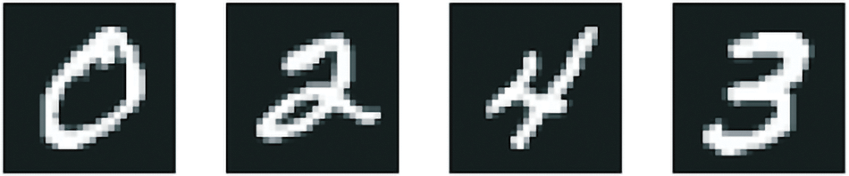


[Figure 2.1](#figure-2-1): MNIST sample digits

The MNIST dataset comes preloaded in Keras, in the form of a set of four
NumPy arrays.

```python
from keras.datasets import mnist

(train_images, train_labels), (test_images, test_labels) = mnist.load_data()
```

[Listing 2.1](#listing-2-1): Loading the MNIST dataset in Keras

`train_images` and `train_labels` form the training set,
the data that the model will learn from. The model will then be tested
on the test set, `test_images` and `test_labels`.
The images are encoded as NumPy arrays, and the labels are an array of digits,
ranging from 0 to 9. The images and labels have a one-to-one correspondence.

NumPy is a highly popular Python library for numerical computation.
You will see it pop up frequently in your machine learning journey.
It is rarely used to implement modern machine learning algorithms,
due to lacking GPU and *autodifferentiation* support,
but NumPy arrays are often used as a numerical data exchange
format — like here, for MNIST digits and their labels.

Let’s look at the training data:

```python
>>> train_images.shape
(60000, 28, 28)
>>> len(train_labels)
60000
>>> train_labels
array([5, 0, 4, ..., 5, 6, 8], dtype=uint8)
```

And here’s the test data:

```python
>>> test_images.shape
(10000, 28, 28)
>>> len(test_labels)
10000
>>> test_labels
array([7, 2, 1, ..., 4, 5, 6], dtype=uint8)
```

The workflow will be as follows. First, we’ll feed the neural network the
training data, `train_images` and `train_labels`. The network will then learn
to associate images and labels. Finally, we’ll ask the network to produce
predictions for `test_images`, and we’ll verify whether these predictions
match the labels from `test_labels`.

Let’s build the network — again, remember that you aren’t expected to
understand everything about this example yet.

```python
import keras
from keras import layers

model = keras.Sequential(
    [
        layers.Dense(512, activation="relu"),
        layers.Dense(10, activation="softmax"),
    ]
)
```

[Listing 2.2](#listing-2-2): The network architecture

The core building block of neural networks is the *layer*. You can think of a
layer as a filter for data: some data goes in, and
it comes out in a more useful form. Specifically, layers extract
*representations* out of the data fed into them — hopefully,
representations that are more meaningful for the problem at hand.
Most of deep learning consists of chaining together simple layers that will
implement a form of progressive *data distillation*.
A deep learning model is like a sieve for data processing,
made of a succession of increasingly refined data filters — the layers.

Here, our model consists of a sequence of two `Dense` layers, which
are densely connected (also called *fully connected*) neural layers.
The second (and last) layer is a 10-way *`softmax` classification* layer,
which means it will return an array of 10 probability scores (summing to 1).
Each score will be the probability that the current digit image belongs
to one of our 10 digit classes.

To make the model ready for training, we need to pick three more things,
as part of the *compilation* step:

* *A loss function* — How the model will be able to measure its
  performance on the training data and thus how it will be able to steer
  itself in the right direction.

* *An optimizer* — The mechanism through which the model will
  update itself based on the training data it sees, to improve
  its performance.

* *Metrics to monitor during training and testing* — Here, we’ll only care
  about accuracy (the fraction of the images that were correctly classified).

The exact purpose of the loss function and the optimizer will be made clear
throughout the next two chapters.

```python
model.compile(
    optimizer="adam",
    loss="sparse_categorical_crossentropy",
    metrics=["accuracy"],
)
```

[Listing 2.3](#listing-2-3): The compilation step

Before training, we’ll *preprocess* the data by reshaping it into the shape the
model expects and scaling it so that all values are in the `[0, 1]` interval.
Previously, our training images were stored in an array of
shape `(60000, 28, 28)` of type `uint8` with values in the `[0, 255]` interval.
We transform it into a `float32` array of shape `(60000, 28 * 28)`
with values between `0` and `1`.

```python
train_images = train_images.reshape((60000, 28 * 28))
train_images = train_images.astype("float32") / 255
test_images = test_images.reshape((10000, 28 * 28))
test_images = test_images.astype("float32") / 255
```

[Listing 2.4](#listing-2-4): Preparing the image data

We’re now ready to train the model, which in Keras is done via a call
to the model’s `fit()` method — we *fit* the model to its training data.

```python
model.fit(train_images, train_labels, epochs=5, batch_size=128)
```

[Listing 2.5](#listing-2-5): “Fitting” the model

Two quantities are displayed during training: the loss of the model over
the training data and the accuracy of the model over the training data.
We quickly reach an accuracy of 0.989 (98.9%) on the training data.

Now that we have a trained model, we can use it to predict class probabilities
for *new* digits — images that weren’t part of the training data, like those
from the test set.

```python
>>> test_digits = test_images[0:10]
>>> predictions = model.predict(test_digits)
>>> predictions[0]
array([1.0726176e-10, 1.6918376e-10, 6.1314843e-08, 8.4106023e-06,
       2.9967067e-11, 3.0331331e-09, 8.3651971e-14, 9.9999106e-01,
       2.6657624e-08, 3.8127661e-07], dtype=float32)
```

[Listing 2.6](#listing-2-6): Using the model to make predictions

Each number of index `i` in that array corresponds to the probability that
digit image `test_digits[0]` belong to class `i`.

This first test digit has the highest probability score (0.99999106, almost 1)
at index 7, so according to our model, it must be a 7:

```python
>>> predictions[0].argmax()
7
>>> predictions[0][7]
0.99999106
```

We can check that the test label agrees:

```python
>>> test_labels[0]
7
```

On average, how good is our model at classifying such never-before-seen digits?
Let’s check by computing average accuracy over the entire test set.

```python
>>> test_loss, test_acc = model.evaluate(test_images, test_labels)
>>> print(f"test_acc: {test_acc}")
test_acc: 0.9785
```

[Listing 2.7](#listing-2-7): Evaluating the model on new data

The test set accuracy turns out to be 97.8% — that’s almost double the error
rate of the training set (at 98.9% accuracy). This gap between training accuracy and
test accuracy is an example of *overfitting*: the fact that machine learning
models tend to perform worse on new data than on their training data.
Overfitting is a central topic in chapter 5.

This concludes our first example. You just saw how you can build
and train a neural network to classify handwritten digits in less
than 15 lines of Python code. In this chapter and the next, we’ll go into detail
about every moving piece we just previewed and clarify what’s going
on behind the scenes. You’ll learn about tensors, the data-storing objects
going into the model; tensor operations, which layers are made of;
and gradient descent, which allows your model to learn from
its training examples.

## Data representations for neural networks

In the previous example, we started from data stored in multidimensional
NumPy arrays, also called *tensors*. In general, all current
machine learning systems use tensors as their basic data structure.
Tensors are fundamental to the field — so fundamental that the TensorFlow framework
was named after them. So what’s a tensor?

At its core, a tensor is a container for data — usually numerical data.
So it’s a container for numbers. You may already be familiar with matrices,
which are rank-2 tensors: tensors are a generalization of matrices to an arbitrary
number of dimensions (note that in the context of tensors, a dimension is
often called an *axis*).

Going over the details of tensors might seem a bit abstract at first. But it’s
well worth it — manipulating tensors will be the bread and butter of any
machine learning code you ever write.

### Scalars (rank-0 tensors)

A tensor that contains only one number is called
a *scalar* (or scalar tensor, rank-0 tensor, or 0D tensor).
In NumPy, a `float32` or `float64` number is a scalar tensor (or scalar array).
You can display the number of axes of a NumPy tensor via
the `ndim` attribute; a scalar tensor has 0 axes (`ndim == 0`).
The number of axes of a tensor is also called its *rank*.
Here’s a NumPy scalar:

```python
>>> import numpy as np
>>> x = np.array(12)
>>> x
array(12)
>>> x.ndim
0
```

### Vectors (rank-1 tensors)

An array of numbers is called a vector (or rank-1 tensor or 1D tensor). A rank-1
tensor has exactly one axis. The following is a NumPy vector:

```python
>>> x = np.array([12, 3, 6, 14, 7])
>>> x
array([12, 3, 6, 14, 7])
>>> x.ndim
1
```

This vector has five entries and so is called a *5-dimensional vector*.
Don’t confuse a 5D vector with a 5D tensor! A 5D vector has only one axis
and has five dimensions along its axis, whereas a 5D tensor has five axes
(and may have any number of dimensions along each axis).
*Dimensionality* can denote either the number of entries along a specific axis
(as in the case of our 5D vector) or the number of axes in a tensor
(such as a 5D tensor), which can be confusing at times.
In the latter case, it’s technically more correct to talk about a
*tensor of rank 5* (the rank of a tensor being the number of axes),
but the ambiguous notation *5D tensor* is common regardless.

### Matrices (rank-2 tensors)

An array of vectors is a *matrix* (or rank-2 tensor or 2D tensor).
A matrix has two axes (often referred to as *rows* and *columns*).
You can visually interpret a matrix as a rectangular grid of numbers.
This is a NumPy matrix:

```python
>>> x = np.array([[5, 78, 2, 34, 0],
...               [6, 79, 3, 35, 1],
...               [7, 80, 4, 36, 2]])
>>> x.ndim
2
```

The entries from the first axis are called the *rows*, and the entries
from the second axis are called the *columns*. In the previous example,
`[5, 78, 2, 34, 0]` is the first row of `x`,
and `[5, 6, 7]` is the first column.

### Rank-3 tensors and higher-rank tensors

If you pack such matrices in a new array, you obtain a rank-3 tensor
(or 3D tensor), which you can visually interpret as a cube of numbers.
The following is a NumPy rank-3 tensor:

```python
>>> x = np.array([[[5, 78, 2, 34, 0],
...                [6, 79, 3, 35, 1],
...                [7, 80, 4, 36, 2]],
...               [[5, 78, 2, 34, 0],
...                [6, 79, 3, 35, 1],
...                [7, 80, 4, 36, 2]],
...               [[5, 78, 2, 34, 0],
...                [6, 79, 3, 35, 1],
...                [7, 80, 4, 36, 2]]])
>>> x.ndim
3
```

By packing rank-3 tensors in an array, you can create a rank-4 tensor, and so on.
In deep learning, you’ll generally manipulate tensors with ranks 0 to 4,
although you may go up to 5 if you process video data.

### Key attributes

A tensor is defined by three key attributes:

* *Number of axes (rank)* — For instance, a rank-3 tensor has three axes,
  and a matrix has two axes. This is also called the tensor’s `ndim` in Python
  libraries such as NumPy, JAX, TensorFlow, and PyTorch.

* *Shape* — This is a tuple of integers that describes how many dimensions
  the tensor has along each axis. For instance, the previous matrix example has
  shape `(3, 5)`, and the rank-3 tensor example has shape `(3, 3, 5)`.
  A vector has a shape with a single element, such as `(5,)`,
  whereas a scalar has an empty shape, `()`.

* *Data type (usually called `dtype` in Python libraries)* —
  This is the type of the data contained in the tensor;
  for instance, a tensor’s type could be `float16`, `float32`, `float64`, `uint8`, `bool`,
  and so on. In TensorFlow, you are also likely to come across `string` tensors.

To make this more concrete, let’s look back at the data we processed
in the MNIST example. First, we load the MNIST dataset:

```python
from keras.datasets import mnist

(train_images, train_labels), (test_images, test_labels) = mnist.load_data()
```

Next, we display the number of axes of the tensor `train_images`,
the `ndim` attribute:

```python
>>> train_images.ndim
3
```

Here’s its shape:

```python
>>> train_images.shape
(60000, 28, 28)
```

And this is its data type, the `dtype` attribute:

```python
>>> train_images.dtype
uint8
```

So what we have here is a rank-3 tensor of 8-bit integers.
More precisely, it’s an array of 60,000 matrices of 28 × 28 integers.
Each such matrix is a grayscale image, with coefficients between 0 and 255.

Let’s display the fourth digit in this rank-3 tensor, using the library Matplotlib
(part of the standard scientific Python suite); see figure 2.2.

```python
import matplotlib.pyplot as plt

digit = train_images[4]
plt.imshow(digit, cmap=plt.cm.binary)
plt.show()
```

[Listing 2.8](#listing-2-8): Displaying the fourth digit


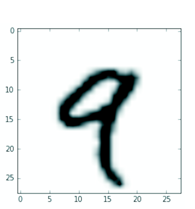


[Figure 2.2](#figure-2-2): The fourth sample in our dataset

Naturally, the corresponding label is just the integer 9:

```python
>>> train_labels[4]
9
```

### Manipulating tensors in NumPy

In the previous example,
we selected a specific digit alongside the first axis using the syntax
`train_images[i]`. Selecting specific elements in a tensor is called
*tensor slicing*. Let’s look at the tensor-slicing operations you can do on
NumPy arrays.

The following example selects digits #10 to #100 (#100 isn’t included)
and puts them in an array of shape `(90, 28, 28)`:

```python
>>> my_slice = train_images[10:100]
>>> my_slice.shape
(90, 28, 28)
```

It’s equivalent to this more detailed notation,
which specifies a start index and stop index for the
slice along each tensor axis. Note that `:` is equivalent to selecting
the entire axis:

```python
>>> # Equivalent to the previous example
>>> my_slice = train_images[10:100, :, :]
>>> my_slice.shape
(90, 28, 28)
>>> # Also equivalent to the previous example
>>> my_slice = train_images[10:100, 0:28, 0:28]
>>> my_slice.shape
(90, 28, 28)
```

In general, you may select slices between any two indices along each tensor axis.
For instance, to select 14 × 14 pixels in the bottom-right corner
of all images, you would do this:

```python
my_slice = train_images[:, 14:, 14:]
```

It’s also possible to use negative indices. Much like negative indices
in Python lists, they indicate a position relative
to the end of the current axis.
To crop the images to patches of 14 × 14 pixels centered in the middle,
do this:

```python
my_slice = train_images[:, 7:-7, 7:-7]
```

### The notion of data batches

In general, the first axis (axis 0, because indexing starts at 0)
in all data tensors you’ll come across in deep learning will be the *samples axis*.
In the MNIST example, “samples” are images of digits.

In addition, deep learning models don’t process an entire dataset at once;
rather, they break the data into small “batches,” or groups of samples with a
fixed size.
Concretely, here’s one batch of our MNIST digits, with a batch size of 128:

```python
batch = train_images[:128]
```

And here’s the next batch:

```python
batch = train_images[128:256]
```

And the `n`th batch:

```python
n = 3
batch = train_images[128 * n : 128 * (n + 1)]
```

When considering such a batch tensor, the first axis (axis 0) is
called the *batch axis* (or *batch dimension*).
You’ll frequently encounter this term when using Keras
and other deep learning libraries.

### Real-world examples of data tensors

Let’s make data tensors more concrete with a few examples similar
to what you’ll encounter later. The data you’ll manipulate will almost
always fall into one of the following categories:

* *Vector data* — Rank-2 tensors of shape `(samples, features)`, where each
  sample is a vector of numerical attributes (“features”)
* *Timeseries data or sequence data* — Rank-3 tensors of shape `(samples, timesteps, features)`,
  where each sample is a sequence (of length `timesteps`) of feature vectors
* *Images* — Rank-4 tensors of shape `(samples, height, width, channels)`,
  where each sample is a 2D grid of pixels, and each pixel is represented by a vector of values (“channels”)
* *Video* — Rank-5 tensors of shape `(samples, frames, height, width, channels)`,
  where each sample is a sequence (of length `frames`) of images

#### Vector data

Vector data is one of the most common cases. In such a dataset, each single data point
can be encoded as a vector, and thus a batch of data will be encoded
as a rank-2 tensor (that is, an array of vectors),
where the first axis is the *samples axis* and the second axis
is the *features axis*.

Let’s take a look at two examples:

* An actuarial dataset of people, where we consider each person’s age, gender,
  and income. Each person can be characterized as a vector of three values,
  and thus an entire dataset of 100,000 people can be stored in a rank-2 tensor
  of shape `(100000, 3)`.

* A dataset of text documents, where we represent each document by the counts
  of how many times each word appears in it
  (out of a dictionary of 20,000 common words).
  Each document can be encoded as a vector of 20,000 values
  (one count per word in the dictionary), and thus an entire dataset of
  500 documents can be stored in a tensor of shape `(500, 20000)`.

#### Timeseries data or sequence data

Whenever time matters in your data (or the notion of sequence order),
it makes sense to store it in a rank-3 tensor with an explicit time axis.
Each sample can be encoded as a sequence of vectors (a rank-2 tensor),
and thus a batch of data will be encoded as a rank-3 tensor (see figure 2.3).

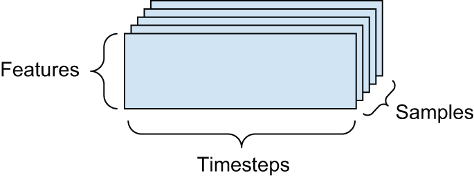


[Figure 2.3](#figure-2-3): A rank-3 timeseries data tensor

The time axis is always the second axis (axis of index 1), by convention.
Let’s look at a few examples:

* *A dataset of stock prices* — Every minute, we store the current price
  of the stock, the highest price in the past minute, and the lowest price
  in the past minute. Thus every minute is encoded as a 3D vector,
  an entire day of trading is encoded as a matrix of shape `(390, 3)`
  (there are 390 minutes in a trading day), and 250 days’ worth of data
  can be stored in a rank-3 tensor of shape `(250, 390, 3)`.
  Here, each sample would be one day’s worth of data.

* *A dataset of tweets, where we encode each tweet as a sequence of 280 characters
  out of an alphabet of 128 unique characters* — In this setting, each character
  can be encoded as a binary vector of size 128
  (an all-zeros vector except for a 1 entry at
  the index corresponding to the character).
  Then each tweet can be encoded as a rank-2 tensor of shape `(280, 128)`,
  and a dataset of 1 million tweets can be stored in a tensor
  of shape `(1000000, 280, 128)`.

#### Image data

Images typically have three dimensions: height, width, and color depth.
Although grayscale images (like our MNIST digits) have only a single color
channel and could thus be stored in rank-2 tensors, by convention image tensors
are always rank-3, with a one-dimensional color channel for grayscale images.
A batch of 128 grayscale images of size 256 × 256 could thus be stored
in a tensor of shape `(128, 256, 256, 1)`, and a batch of 128 color images
could be stored in a tensor of shape `(128, 256, 256, 3)` (see figure 2.4).

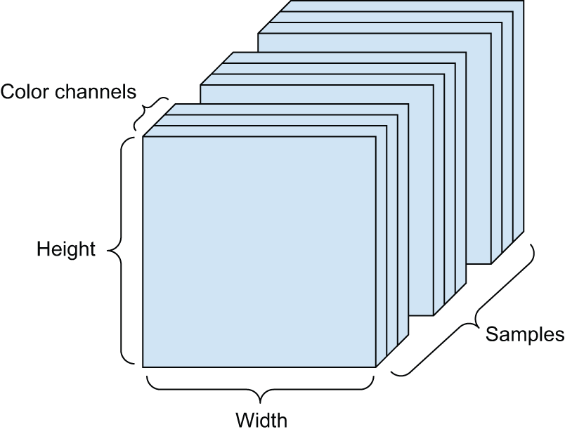


[Figure 2.4](#figure-2-4): A rank-4 image data tensor

There are two conventions for the shapes of image tensors:
the *channels-last* convention (which is standard in JAX and TensorFlow, as well as most other
deep learning tools out there) and the *channels-first* convention (which is standard in PyTorch).

The channels-last convention places the color-depth axis at the end:
`(samples, height, width, color_depth)`. Meanwhile, the channels-first
convention places the color depth axis right after the batch axis:
`(samples, color_depth, height, width)`. With the channels-first convention,
the previous examples would become `(128, 1, 256, 256)`
and `(128, 3, 256, 256)`. The Keras API provides support for both formats.

#### Video data

Video data is one of the few types of real-world data for which you’ll
need rank-5 tensors. A video can be understood as a sequence of frames,
each frame being a color image. Because each frame can be stored
in a rank-3 tensor `(height, width, color_depth)`, a sequence of frames
can be stored in a rank-4 tensor `(frames, height, width, color_depth)`,
and thus a batch of different videos can be stored in a rank-5 tensor
of shape `(samples, frames, height, width, color_depth)`.

For instance, a 60-second, 144 × 256 YouTube video clip sampled at
4 frames per second would have 240 frames. A batch of four such video clips
would be stored in a tensor of shape `(4, 240, 144, 256, 3)`.
That’s a total of 106,168,320 values! If the `dtype` of the tensor
was `float32`, then each value would be stored in 32 bits, so the tensor
would represent 425 MB. Heavy! Videos you encounter in real life
are much lighter because they aren’t stored in `float32` and they’re
typically compressed by a large factor (such as the MPEG format).

## The gears of neural networks: Tensor operations

Just like any computer program can be ultimately reduced to a small set of
binary operations on binary inputs (`AND`, `OR`, `NOR`, and so on),
all transformations learned by deep neural networks can be reduced
to a handful of *tensor operations* (or *tensor functions*)
applied to tensors of numeric data.
For instance, it’s possible to add tensors, multiply tensors, and so on.

In our initial example, we were building our model by stacking `Dense` layers
on top of each other. A Keras layer instance looks like this:

```python
keras.layers.Dense(512, activation="relu")
```

This layer can be interpreted as a function, which takes as input a matrix
and returns another matrix — a new representation for the input tensor.
Specifically, the function is as follows (where `W` is a matrix and `b`
is a vector, both attributes of the layer):

```python
output = relu(matmul(input, W) + b)
```

Let’s unpack this. We have three tensor operations here:

* A tensor product (`matmul`) between the input tensor and a tensor named `W`.
* An addition (`+`) between the resulting matrix and a vector `b`.
* A `relu` operation: `relu(x)` is `max(x, 0)`. `"relu"` stands for “REctified Linear Unit.”

Although this section deals entirely with linear algebra expressions,
you won’t find any mathematical notation in this book. I’ve found that mathematical
concepts can be more readily mastered by programmers with no mathematical
background if they’re expressed as short Python snippets instead of mathematical
equations. So we’ll use NumPy code throughout.

### Element-wise operations

The `relu` operation and addition are element-wise operations: operations
that are applied independently to each entry in the tensors being considered.
This means these operations are highly amenable to massively parallel
implementations (*vectorized* implementations, a term that comes from
the *vector processor* supercomputer architecture from the 1970–1990 period).
If you want to write a naive Python implementation of an element-wise operation,
you use a `for` loop, as in this naive implementation of an element-wise `relu`
operation:

```python
def naive_relu(x):
    # x is a rank-2 NumPy tensor.
    assert len(x.shape) == 2
    # Avoids overwriting the input tensor
    x = x.copy()
    for i in range(x.shape[0]):
        for j in range(x.shape[1]):
            x[i, j] = max(x[i, j], 0)
    return x
```

You could do the same for addition:

```python
def naive_add(x, y):
    # x and y are rank-2 NumPy tensors.
    assert len(x.shape) == 2
    assert x.shape == y.shape
    # Avoids overwriting the input tensor
    x = x.copy()
    for i in range(x.shape[0]):
        for j in range(x.shape[1]):
            x[i, j] += y[i, j]
    return x
```

On the same principle, you can do element-wise multiplication, subtraction,
and so on.

In practice, when dealing with NumPy arrays, these operations are available
as well-optimized built-in NumPy functions, which themselves delegate the
heavy lifting to a Basic Linear Algebra Subprograms (BLAS) implementation.
BLAS are low-level, highly parallel, efficient tensor-manipulation routines
that are typically implemented in Fortran or C.

So, in NumPy, you can do the following element-wise operation, and it will
be blazing fast:

```python
import numpy as np

# Element-wise addition
z = x + y
# Element-wise relu
z = np.maximum(z, 0.0)
```

Let’s actually time the difference:

```python
import time

x = np.random.random((20, 100))
y = np.random.random((20, 100))

t0 = time.time()
for _ in range(1000):
    z = x + y
    z = np.maximum(z, 0.0)
print("Took: {0:.2f} s".format(time.time() - t0))
```

This takes 0.02 seconds. Meanwhile, the naive version takes a stunning 2.45 seconds:

```python
t0 = time.time()
for _ in range(1000):
    z = naive_add(x, y)
    z = naive_relu(z)
print("Took: {0:.2f} s".format(time.time() - t0))
```

Likewise, when running JAX/TensorFlow/PyTorch code on a GPU,
element-wise operations are executed via fully vectorized CUDA implementations
that can best utilize the highly parallel GPU chip architecture.

### Broadcasting

Our earlier naive implementation of `naive_add` only supports the addition
of rank-2 tensors with identical shapes. But in the `Dense` layer
introduced earlier, we added a rank-2 tensor with a vector. What happens with
addition when the shapes of the two tensors being added differ?

When possible, and if there’s no ambiguity, the smaller tensor will be
*broadcast* to match the shape of the larger tensor. Broadcasting consists of
two steps:

* Axes (called *broadcast axes*) are added to the smaller tensor to match
  the `ndim` of the larger tensor.
* The smaller tensor is repeated alongside these new axes to match the
  full shape of the larger tensor.

Let’s look at a concrete example. Consider `X` with shape `(32, 10)` and `y`
with shape `(10,)`:

```python
import numpy as np

# X is a random matrix with shape (32, 10).
X = np.random.random((32, 10))
# y is a random vector with shape (10,).
y = np.random.random((10,))
```

First, we add an empty first axis to `y`, whose shape
becomes `(1, 10)`:

```python
# The shape of y is now (1, 10).
y = np.expand_dims(y, axis=0)
```

Then, we repeat `y` 32 times alongside this new axis,
so that we end up with a tensor `Y` with shape `(32, 10)`, where `Y[i, :] == y`
for `i` in `range(0, 32)`:

```python
# Repeat y 32 times along axis 0 to obtain Y with shape (32, 10).
Y = np.tile(y, (32, 1))
```

At this point, we can add `X` and `Y`
because they have the same shape.

In terms of implementation, no new rank-2 tensor is created because that would
be terribly inefficient. The repetition operation is entirely virtual:
it happens at the algorithmic level rather than at the memory level.
But thinking of the vector being repeated 32 times alongside a new axis
is a helpful mental model. Here’s what a naive implementation would look like:

```python
def naive_add_matrix_and_vector(x, y):
    # x is a rank-2 NumPy tensor.
    assert len(x.shape) == 2
    # y is a NumPy vector.
    assert len(y.shape) == 1
    assert x.shape[1] == y.shape[0]
    # Avoids overwriting the input tensor
    x = x.copy()
    for i in range(x.shape[0]):
        for j in range(x.shape[1]):
            x[i, j] += y[j]
    return x
```

With broadcasting, you can generally apply two-tensor element-wise operations
if one tensor has shape `(a, b, … n, n + 1, … m)` and the other has shape
`(n, n + 1, … m)`. The broadcasting will then automatically happen
for axes `a` through `n - 1`.

The following example applies the element-wise `maximum` operation
to two tensors of different shapes via broadcasting:

```python
import numpy as np

# x is a random tensor with shape (64, 3, 32, 10).
x = np.random.random((64, 3, 32, 10))
# y is a random tensor with shape (32, 10).
y = np.random.random((32, 10))
# The output z has shape (64, 3, 32, 10) like x.
z = np.maximum(x, y)
```

### Tensor product

The *tensor product*, also called *dot product* or *matmul*
(short for “matrix multiplication”) is one of the most common,
most useful tensor operations.

In NumPy, a tensor product is done using the `np.matmul` function, and in
Keras, with the `keras.ops.matmul` function. Its shorthand is the `@` operator in Python:

```python
x = np.random.random((32,))
y = np.random.random((32,))

# Takes the product between x and y
z = np.matmul(x, y)
# This is equivalent.
z = x @ y
```

In mathematical notation, you’d note the operation with a dot (•)
(hence the name “dot product”):

```python
z = x • y
```

Mathematically, what does the `matmul` operation do? Let’s start with
the product of two vectors `x` and `y`. It’s computed as follows:

```python
def naive_vector_product(x, y):
    # x and y are NumPy vectors.
    assert len(x.shape) == 1
    assert len(y.shape) == 1
    assert x.shape[0] == y.shape[0]
    z = 0.0
    for i in range(x.shape[0]):
        z += x[i] * y[i]
    return z
```

You’ll have noticed that the product between two vectors is a scalar
and that only vectors with the same number of elements are compatible
for this operation.

You can also take the product between a matrix `x` and a vector `y`,
which returns a vector where the coefficients are the products between
`y` and the rows of `x`. You implement it as follows:

```python
def naive_matrix_vector_product(x, y):
    # x is a NumPy matrix.
    assert len(x.shape) == 2
    # y is a NumPy vector.
    assert len(y.shape) == 1
    # The 1st dimension of x must equal the 0th dimension of y!
    assert x.shape[1] == y.shape[0]
    # This operation returns a vector of 0s with as many rows as x.
    z = np.zeros(x.shape[0])
    for i in range(x.shape[0]):
        for j in range(x.shape[1]):
            z[i] += x[i, j] * y[j]
    return z
```

You could also reuse the code we wrote previously, which highlights the
relationship between a matrix-vector product and a vector product:

```python
def naive_matrix_vector_product(x, y):
    z = np.zeros(x.shape[0])
    for i in range(x.shape[0]):
        z[i] = naive_vector_product(x[i, :], y)
    return z
```

Note that as soon as one of the two tensors has an `ndim` greater than 1,
`matmul` is no longer *symmetric*, which is to say that `matmul(x, y)` isn’t
the same as `matmul(y, x)`.

Of course, a tensor product generalizes to tensors with an arbitrary number
of axes. The most common applications may be the product between
two matrices. You can take the product of two matrices `x` and `y`
(`matmul(x, y)`) if and only if `x.shape[1] == y.shape[0]`.
The result is a matrix with shape `(x.shape[0], y.shape[1])`,
where the coefficients are the vector products between the rows of `x`
and the columns of `y`. Here’s the naive implementation:

```python
def naive_matrix_product(x, y):
    # x and y are NumPy matrices.
    assert len(x.shape) == 2
    assert len(y.shape) == 2
    # The 1st dimension of x must equal the 0th dimension of y!
    assert x.shape[1] == y.shape[0]
    # This operation returns a matrix of 0s with a specific shape.
    z = np.zeros((x.shape[0], y.shape[1]))
    # Iterates over the rows of x ...
    for i in range(x.shape[0]):
        # ... and over the columns of y.
        for j in range(y.shape[1]):
            row_x = x[i, :]
            column_y = y[:, j]
            z[i, j] = naive_vector_product(row_x, column_y)
    return z
```

To understand vector product shape compatibility, it helps to visualize the input
and output tensors by aligning them as shown in figure 2.5.

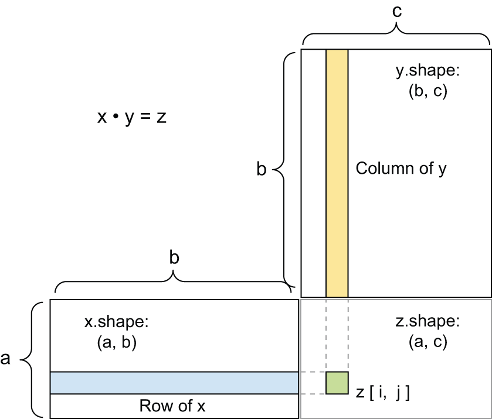


[Figure 2.5](#figure-2-5): Matrix product box diagram

`x`, `y`, and `z` are pictured as rectangles (literal boxes of coefficients).
Because the rows of `x` and the columns of `y` must have the same size,
it follows that the width of `x` must match the height of `y`.
If you go on to develop new machine learning algorithms,
you’ll likely be drawing such diagrams often.

More generally, you can take the product between higher-dimensional
tensors, following the same rules for shape compatibility as outlined
earlier for the 2D case:

```python
(a, b, c, d) • (d,) -> (a, b, c)
(a, b, c, d) • (d, e) -> (a, b, c, e)
```

And so on.

### Tensor reshaping

A third type of tensor operation
that’s essential to understand is *tensor reshaping*. Although it wasn’t
used in the `Dense` layers in our first neural network example,
we used it when we preprocessed the digits data before feeding it
into our model:

```python
train_images = train_images.reshape((60000, 28 * 28))
```

Reshaping a tensor means rearranging its rows and columns to match
a target shape. Naturally, the reshaped tensor has the same total number
of coefficients as the initial tensor. Reshaping is best understood via
simple examples:

```python
>>> x = np.array([[0., 1.],
...               [2., 3.],
...               [4., 5.]])
>>> x.shape
(3, 2)
>>> x = x.reshape((6, 1))
>>> x
array([[ 0.],
       [ 1.],
       [ 2.],
       [ 3.],
       [ 4.],
       [ 5.]])
>>> x = x.reshape((2, 3))
>>> x
array([[ 0.,  1.,  2.],
       [ 3.,  4.,  5.]])
```

A special case of reshaping that’s commonly encountered is *transposition*.
*Transposing* a matrix means exchanging its rows and its columns,
so that `x[i, :]` becomes `x[:, i]`:

```python
>>> # Creates an all-zeros matrix of shape (300, 20)
>>> x = np.zeros((300, 20))
>>> x = np.transpose(x)
>>> x.shape
(20, 300)
```

### Geometric interpretation of tensor operations

Because the contents of the tensors manipulated by tensor operations
can be interpreted as coordinates of points in some geometric space,
all tensor operations have a geometric interpretation. For instance,
let’s consider addition. We’ll start with the following vector:

```python
A = [0.5, 1]
```

It’s a point in a 2D space (see figure 2.6). It’s common to picture
a vector as an arrow linking the origin to the point, as shown in figure 2.7.

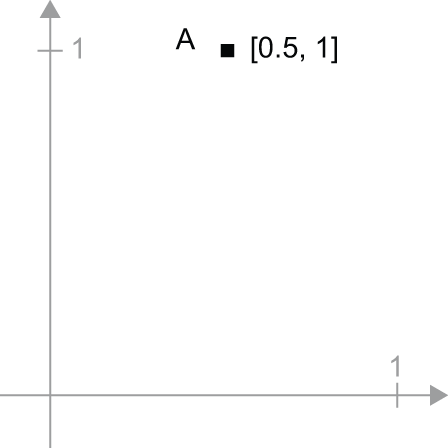


[Figure 2.6](#figure-2-6): A point in a 2D space


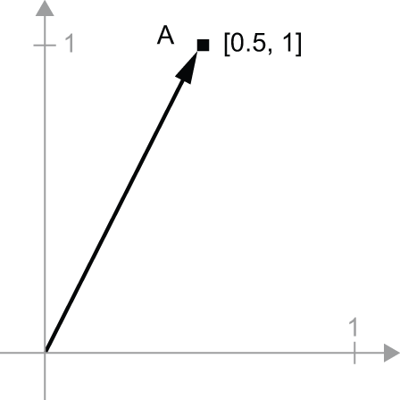


[Figure 2.7](#figure-2-7): A point in a 2D space pictured as an arrow

Let’s consider a new point, `B = [1, 0.25]`, which we’ll add to the
previous one. This is done geometrically by chaining together the vector arrows,
with the resulting location being the vector representing the sum of
the previous two vectors (see figure 2.8). As you can see, adding a vector `B`
to a vector `A` represents the action of copying point `A` in new location, whose
distance and direction from the original point `A` is determined by the vector `B`.
If you apply the same vector addition to a group of points in the plane (an “object”),
you would be creating a copy of the entire object in a new location (see figure 2.9).
Tensor addition thus represents
the action of *translating an object* (moving the object without distorting it)
by a certain amount in a certain direction.

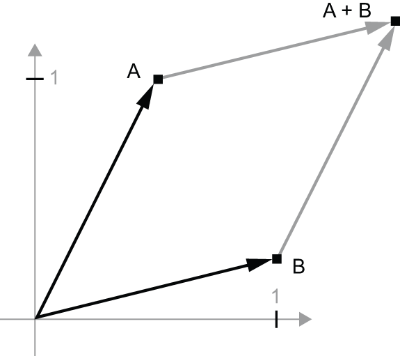


[Figure 2.8](#figure-2-8): Geometric interpretation of the sum of two vectors

In general, elementary geometric operations, such as translation,
rotation, scaling, skewing, and so on, can be expressed as tensor operations.
Here are a few examples:

* *Translation* — As you just saw, adding a vector to a point will
  move this point by a fixed amount in a fixed direction.
  Applied to a set of points (such as a 2D object),
  this is called a “translation” (see figure 2.9).

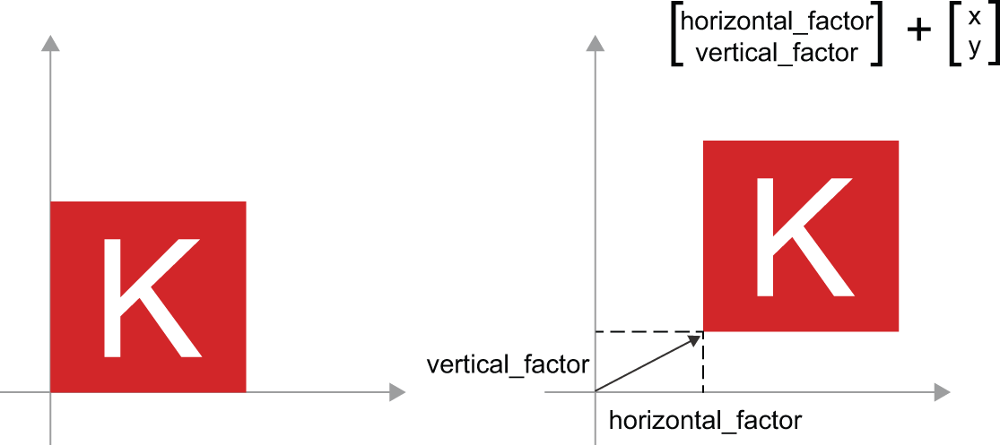


[Figure 2.9](#figure-2-9): 2D translation as a vector addition

* *Rotation* — A counterclockwise rotation of a 2D vector by an angle theta (see figure 2.10)
  can be achieved via a product with a 2 × 2 matrix
  `R = [[cos(theta), -sin(theta)], [sin(theta), cos(theta)]]`.

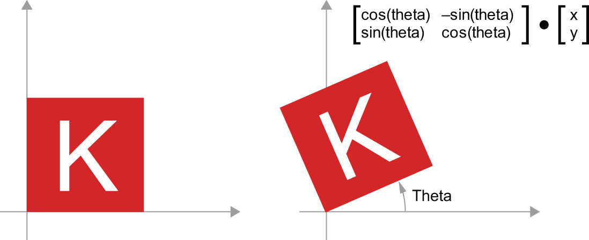


[Figure 2.10](#figure-2-10): 2D rotation (counterclockwise) as a matrix product

* *Scaling* — A vertical and horizontal scaling of the image (see figure 2.11)
  can be achieved via a product with a 2 × 2 matrix
  `S = [[horizontal_factor, 0], [0, vertical_factor]]` (note that such a matrix
  is called a “diagonal matrix” because it only has non-zero coefficients
  in its “diagonal,” going from the top left to the bottom right).

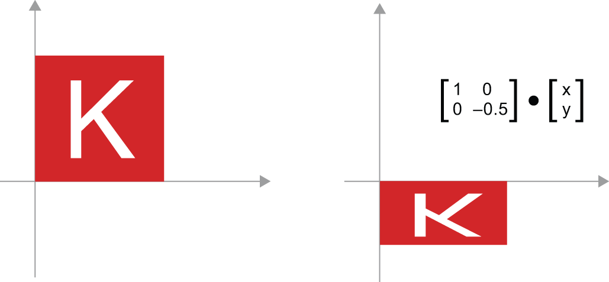


[Figure 2.11](#figure-2-11): 2D scaling as a matrix product

* *Linear transform* — A product with an arbitrary matrix implements a
  linear transform. Note that *scaling* and *rotation*, seen previously,
  are, by definition, linear transforms.

* *Affine transform* — An affine transform (see figure 2.12)
  is the combination of a linear transform (achieved via a matrix product)
  and a translation (achieved via a vector addition).
  As you have probably recognized, that’s exactly the `y = W @ x + b` computation
  implemented by the `Dense` layer! A `Dense` layer without an activation function
  is an affine layer.

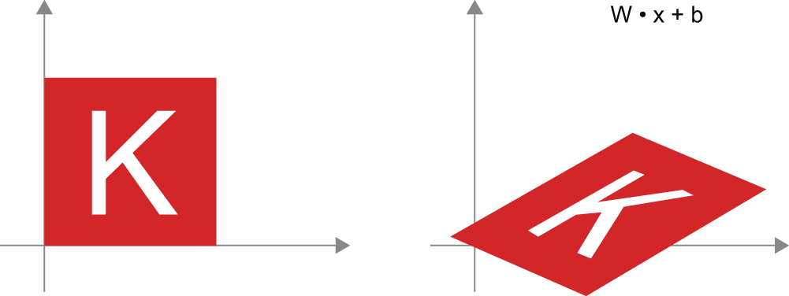


[Figure 2.12](#figure-2-12): Affine transform in the plane

* *`Dense` layer with `relu` activation* — An important observation about affine
  transforms is that if you apply many of them repeatedly,
  you still end up with an affine transform (so you could just have
  applied that one affine transform in the first place). Let’s try it with two:
  `affine2(affine1(x)) = W2 @ (W1 @ x + b1) + b2 = (W2 @ W1) @ x + (W2 @ b1 + b2)`.
  That’s an affine transform where the linear part is the matrix `W2 @ W1` and the
  translation part is the vector `W2 @ b1 + b2`. As a consequence, a multilayer
  neural network made entirely of `Dense` layers without activations would be
  equivalent to a single `Dense` layer. This “deep” neural network would just
  be a linear model in disguise!
  This is why we need activation functions, like `relu` (seen in action
  in figure 2.13). Thanks to activation functions,
  a chain of `Dense` layers can be made to implement very complex,
  nonlinear geometric transformation, resulting in very rich hypothesis spaces
  for your deep neural networks.
  We cover this idea in more detail in the next chapter.

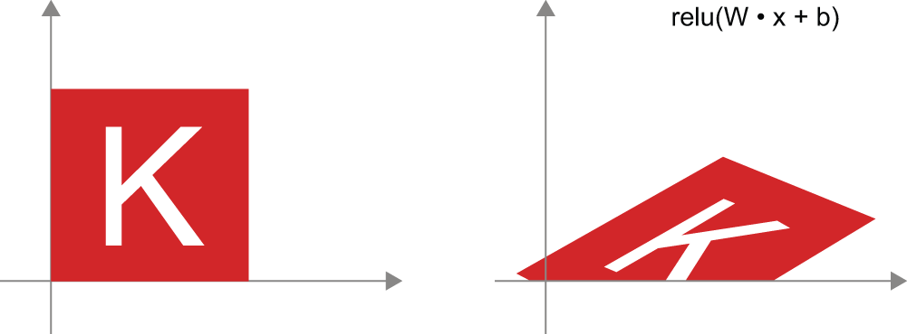


[Figure 2.13](#figure-2-13): Affine transform followed by `relu` activation

### A geometric interpretation of deep learning

You just learned that neural networks consist entirely of chains of
tensor operations and that all of these tensor operations are just simple
geometric transformations of the input data. It follows that you can interpret
a neural network as a very complex geometric transformation in a
high-dimensional space, implemented via a series of simple steps.

In 3D, the following mental image may prove useful. Imagine two sheets of
colored paper: one red and one blue. Put one on top of the other.
Now crumple them together into a small ball. That crumpled paper ball
is your input data, and each sheet of paper is a class of data in
a classification problem. What a neural network
is meant to do is figure out a
transformation of the paper ball that would uncrumple it to make the
two classes cleanly separable again (see figure 2.14). With deep learning, this would be
implemented as a series of simple transformations of the 3D space,
such as those you could apply on the paper ball with your fingers,
one movement at a time.


[Figure 2.14](#figure-2-14): Uncrumpling a complicated manifold of data

Uncrumpling paper balls is what machine learning is about: finding neat
representations for complex, highly folded data *manifolds* in high-dimensional
spaces (a manifold is a continuous surface, like our crumpled sheet of paper).
At this point, you should have a pretty good intuition
as to why deep learning excels at this:
it takes the approach of incrementally decomposing a complicated geometric
transformation into a long chain of elementary ones, which is pretty much
the strategy a human would follow to uncrumple a paper ball. Each layer in a
deep network applies a transformation that disentangles the data a little —
and a deep stack of layers makes tractable an extremely
complicated disentanglement process.

## The engine of neural networks: Gradient-based optimization

As you saw in the previous section, each neural layer from our first model
example transforms its input data as follows:

```python
output = relu(matmul(input, W) + b)
```

In this expression, `W` and `b` are tensors that are attributes of the layer.
They’re called the *weights* or *trainable parameters* of the layer
(the `kernel` and `bias` attributes, respectively). These weights contain the
information learned by the model from exposure to training data.

Initially, these weight matrices are filled with small random values
(a step called *random initialization*). Of course, there’s no reason to
expect that `relu(matmul(input, W) + b)`, when `W` and `b` are random,
will yield any useful representations. The resulting representations are
meaningless — but they’re a starting point. What comes next is to gradually
adjust these weights, based on a feedback signal. This gradual adjustment,
also called *training*, is basically the learning that machine learning
is all about.

This happens within what’s called a *training loop*, which works as follows.
Repeat these steps in a loop, until the loss seems sufficiently low:

1. Draw a batch of training samples `x` and corresponding targets `y_true`.
2. Run the model on `x` (a step called the *forward pass*) to obtain
   predictions `y_pred`.
3. Compute the loss of the model on the batch, a measure of the mismatch
   between `y_pred` and `y_true`.
4. Update all weights of the model in a way that slightly reduces the loss
   on this batch.

You’ll eventually end up with a model that has a very low loss on its
training data: a low mismatch between predictions `y_pred` and expected targets
`y_true`. The model has “learned” to map its inputs to correct targets.
From afar, it may look like magic, but when you reduce it to elementary steps,
it turns out to be simple.

Step 1 sounds easy enough — it’s just I/O code. Steps 2 and 3 are merely
the application of a handful of tensor operations, so you could implement
these steps purely from what you learned in the previous section.
The difficult part is step 4: updating the model’s weights.
Given an individual weight coefficient in the model, how can you compute
whether the coefficient should be increased or decreased, and by how much?

One naive solution would be to freeze all weights in the model except
the one scalar coefficient being considered and try different values
for this coefficient. Let’s say the initial value of the coefficient is 0.3.
After the forward pass on a batch of data, the loss of the model on the batch
is 0.5. If you change the coefficient’s value to 0.35 and rerun
the forward pass, the loss increases to 0.6. But if you lower the coefficient
to 0.25, the loss falls to 0.4. In this case, it seems that updating
the coefficient by –0.05 would contribute to minimizing the loss.
This would have to be repeated for all coefficients in the model.

But such an approach would be horribly inefficient because you’d need to
compute two forward passes (which are expensive)
for every individual coefficient
(of which there are many, usually at least a few thousands and potentially up to billions).
Thankfully, there’s a much better approach: *gradient descent*.

Gradient descent is the optimization technique that powers modern neural networks.
Here’s the gist of it. All of the functions used in
our models (such as `matmul` or `+`)
transform their input in a smooth and continuous way: if you look at `z = x + y`,
for instance,
a small change in `y` only results in a small change in `z`, and if you know the
direction of the change in `y`, you can infer the direction of the change in `z`.
Mathematically, you’d say these functions are *differentiable*. If you chain
together such functions, the bigger function you obtain is still differentiable.
In particular, this applies to the function that maps the model’s coefficients
to the loss of the model on a batch of data:
a small change of the model’s coefficients
results in a small, predictable change of the loss value. This enables you to
use a mathematical operator called the *gradient*
to describe how the loss varies as you move the model’s coefficients
in different directions. If you compute this gradient, you can use it to move
the coefficients (all at once in a single update, rather than one at a time)
in a direction that decreases the loss.

If you already know what *differentiable* means and what a *gradient* is, you
can skip the next two sections. Otherwise, the following will help you
understand these concepts.

### What’s a derivative?

Consider a continuous, smooth function `f(x) = y`, mapping a number `x`
to a new number `y`. We can use the function in figure 2.15 as an example.

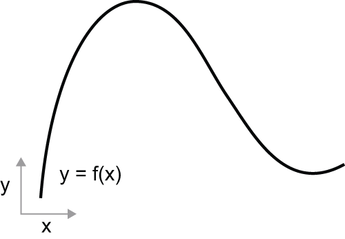


[Figure 2.15](#figure-2-15): A continuous, smooth function

Because the function is *continuous*, a small change
in `x` can only result in a small change in `y` — that’s the intuition behind
*continuity*. Let’s say you increase `x` by a small factor `epsilon_x`:
this results in a small `epsilon_y` change to `y`, as shown in figure 2.16.

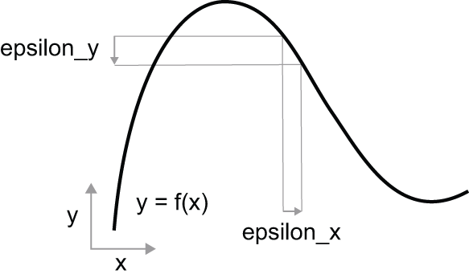


[Figure 2.16](#figure-2-16): With a continuous function, a small change in `x` results in a small change in `y`.

In addition, because the function is *smooth*
(its curve doesn’t have any abrupt angles), when `epsilon_x` is small enough,
around a certain point `p`, it’s possible to approximate `f` as
a linear function of slope `a`, so that `epsilon_y` becomes `a * epsilon_x`:

```python
f(x + epsilon_x) = y + a * epsilon_x
```

Obviously, this linear approximation is valid only when `x`
is close enough to `p`.

The slope `a` is called the *derivative* of `f` in `p`. If `a` is negative,
it means a small increase in `x` around `p` will result in a decrease of `f(x)`,
as shown in figure 2.17, and if `a` is positive, a small increase in `x`
will result in an increase of `f(x)`. Further, the absolute value of `a`
(the *magnitude* of the derivative) tells you how quickly this increase or
decrease will happen.

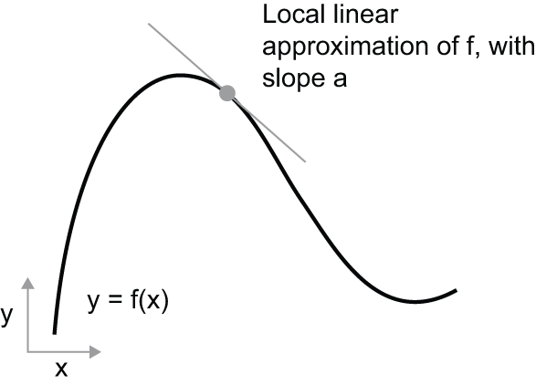


[Figure 2.17](#figure-2-17): Derivative of `f` in `p`

For every differentiable function `f(x)` (*differentiable* means
“can be derived”: for example, smooth, continuous functions can be derived),
there exists a derivative function `f'(x)` that maps values of `x` to the
slope of the local linear approximation of `f` in those points. For instance,
the derivative of `cos(x)` is `-sin(x)`, the derivative of
`f(x) = a * x` is `f'(x) = a`, and so on.

Being able to derive functions is a very powerful tool when it comes to
*optimization*, the task of finding values of `x` that minimize the value of `f(x)`.
If you’re trying to update `x` by a factor `epsilon_x`
to minimize `f(x)` and you know the derivative of `f`,
then your job is done: the derivative completely describes how `f(x)`
evolves as you change `x`. If you want to reduce the value of `f(x)`, you just
need to move `x` a little in the opposite direction from the derivative.

### Derivative of a tensor operation: The gradient

The function we were just looking at turned a scalar value `x` into another scalar
value `y`: you could plot it as a curve in a 2D plane. Now, imagine a function that turns
a tuple of scalars `(x, y)` into a scalar value `z`: that would be a vector operation.
You could plot it as a 2D *surface* in a 3D space (indexed by coordinates `x, y, z`).
Likewise, you can imagine functions that take as input matrices, functions that
take as input rank-3 tensors, etc.

The concept of derivation can be applied to
any such function, as long as the surfaces they describe are continuous and smooth.
The derivative of a tensor operation (or tensor function)
is called a *gradient*. Gradients are just the generalization
of the concept of derivatives to functions that take tensors as inputs. Remember
how, for a scalar function, the derivative represents the *local slope* of the curve
of the function? In just the same way, the gradient of a tensor function represents the
*curvature* of the multidimensional surface described by the function.
It characterizes how the output of the function varies when its input parameters vary.

Let’s look at an example grounded in machine learning. Consider

* An input vector `x` (a sample in a dataset)
* A matrix `W` (the weights of a model)
* A target `y_true` (what the model should learn to associated to `x`)
* A loss function `loss` (meant to measure the gap between the model’s current predictions and `y_true`).

You can use `W` to compute a target candidate `y_pred` and then compute the
loss, or mismatch, between the target candidate `y_pred` and the target `y_true`:

```python
# We use the model weights W to make a prediction for x.
y_pred = matmul(x, W)
# We estimate how far off the prediction was.
loss_value = loss(y_pred, y_true)
```

Now, we’d like to use gradients to figure out how
to update `W` to make `loss_value` smaller. How do we do that?

Given fixed inputs `x` and `y_true`, the previous operations can be interpreted as
a function mapping values of `W` (the model’s weights) to loss values:

```python
# f describes the curve (or high-dimensional surface) formed by loss
# values when W varies.
loss_value = f(W)
```

Let’s say the current value of `W` is `W0`. Then the derivative of `f`
in the point `W0` is a tensor `grad(loss_value, W0)`, with the same shape as `W`,
where each coefficient `grad(loss_value, W0)[i, j]` indicates the direction and
magnitude of the change in `loss_value` you observe when modifying `W0[i, j]`.
That tensor `grad(loss_value, W0)` is the gradient of the function
`f(W) = loss_value` in `W0`, also called “gradient of `loss_value` with respect
to `W` around `W0`.”

The tensor operation `grad(f(W), W)`
(which takes as input a matrix `W`)
can be expressed as a combination of scalar functions
`grad_ij(f(W), w_ij)`, each
of which would return the derivative of `loss_value = f(W)` with respect to the
coefficient `W[i, j]` of `W`, assuming all other coefficients are constant.
`grad_ij` is called the *partial derivative* of `f` with respect to `W[i, j]`.

Concretely, what does `grad(loss_value, W0)` represent?
You saw earlier that the derivative
of a function `f(x)` of a single coefficient
can be interpreted as the slope of the curve of `f`. Likewise,
`grad(loss_value, W0)`
can be interpreted as the tensor describing the *curvature*
of `loss_value = f(W)` around `W0`. Each partial derivative describes the
curvature of `f` in a specific direction.

We just saw how for a function `f(x)`, you can reduce the value of `f(x)` by moving `x` a little
in the opposite direction from the derivative. In much the same way, with a
function `f(W)` of a tensor, you can reduce `loss_value = f(W)` by moving `W`
in the opposite direction from the gradient, such as an update of
`W1 = W0 - step * grad(f(W0), W0)` where `step` is a small scaling factor. That means going against
the curvature, which intuitively should put you lower on the curve.
Note that the scaling factor `step` is needed because `grad(loss_value, W0)`
only approximates the curvature when you’re close to `W0`,
so you don’t want to get too far from `W0`.

### Stochastic gradient descent

Given a differentiable function,
it’s theoretically possible to find its minimum analytically: it’s known that
a function’s minimum is a point where the derivative is 0, so all you have
to do is find all the points where the derivative goes to 0 and check
for which of these points the function has the lowest value.

Applied to a neural network, that means finding analytically the combination
of weight values that yields the smallest possible loss function. This can
be done by solving the equation `grad(f(W), W) = 0` for `W`. This is a
polynomial equation of `N` variables, where `N` is the number of coefficients
in the model. Although it would be possible to solve such an equation
for `N = 2` or `N = 3`, doing so is intractable for real neural networks,
where the number of parameters is never less than a few thousand
and can sometimes be in the billions.

Instead, you can use the four-step algorithm outlined at the beginning of
this section: modify the parameters little by little based on the current
loss value on a random batch of data. Because you’re dealing with a
differentiable function, you can compute its gradient, which gives
you an efficient way to implement step 4. If you update the weights
in the opposite direction from the gradient, the loss will be a little
less every time:

1. Draw a batch of training samples `x` and corresponding targets `y_true`.
2. Run the model on `x` to obtain predictions `y_pred`
   (this is called the *forward pass*).
3. Compute the loss of the model on the batch, a measure of the
   mismatch between `y_pred` and `y_true`.
4. Compute the gradient of the loss with regard to the model’s
   parameters (this is called the *backward pass*).
5. Move the parameters a little in the opposite direction from the gradient —
   for example, `W -= learning_rate * gradient` —
   thus reducing the loss on the batch a bit. The *learning rate* (`learning_rate`
   here) would be a scalar factor modulating the “speed” of the
   gradient descent process.

Easy enough! What we just described is called
*mini-batch stochastic gradient descent* (mini-batch SGD).
The term *stochastic* refers to the fact that each batch of data is drawn
at random (*stochastic* is a scientific synonym of *random*).
Figure 2.18 illustrates what happens in 1D, when the model has only
one parameter and you have only one training sample.

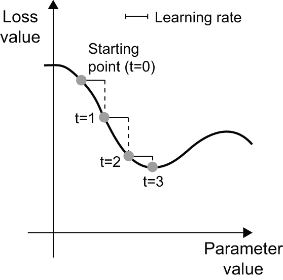


[Figure 2.18](#figure-2-18): SGD down a 1D loss curve (one learnable parameter)

We can see intuitively that it’s important to pick a reasonable value
for the `learning_rate` factor. If it’s too small, the descent down the curve will
take many iterations, and it could get stuck in a local minimum.
If `learning_rate` is too large, your updates may end up taking you to completely
random locations on the curve.

Note that a variant of the mini-batch SGD algorithm would be to draw
a single sample and target at each iteration, rather than drawing
a batch of data. This would be *true* SGD (as opposed to *mini-batch* SGD).
Alternatively, going to the opposite extreme, you could run every step
on *all* data available, which is called *batch gradient descent*.
Each update would then be more accurate, but far more expensive.
The efficient compromise between these two extremes is to use mini-batches
of reasonable size.

Although figure 2.18 illustrates gradient descent in a 1D parameter space,
in practice, you’ll use gradient descent in highly dimensional spaces:
every weight coefficient in a neural network is a free dimension in the space,
and there may be tens of thousands or even millions of them. To help you
build intuition about loss surfaces, you can also visualize gradient
descent along a 2D loss surface, as shown in figure 2.19. But you can’t
possibly visualize what the actual process of training a neural network
looks like — you can’t represent a 1,000,000-dimensional space in a way
that makes sense to humans. As such, it’s good to keep in mind that the
intuitions you develop through these low-dimensional representations
may not always be accurate in practice. This has historically been
a source of issues in the world of deep learning research.

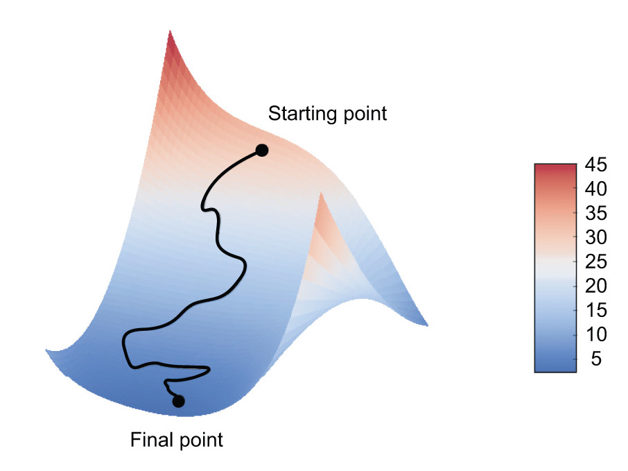


[Figure 2.19](#figure-2-19): Gradient descent down a 2D loss surface (two learnable parameters)

Additionally, there exist multiple variants of SGD that differ by taking
into account previous weight updates when computing the next weight update,
rather than just looking at the current value of the gradients. There is,
for instance, SGD with momentum, as well as Adagrad, RMSprop,
and several others. Such variants are known as *optimization methods* or
*optimizers*. In particular, the concept of *momentum*, which is used
in many of these variants, deserves your attention. Momentum addresses
two issues with SGD: convergence speed and local minima. Consider figure 2.20,
which shows the curve of a loss as a function of a model parameter.

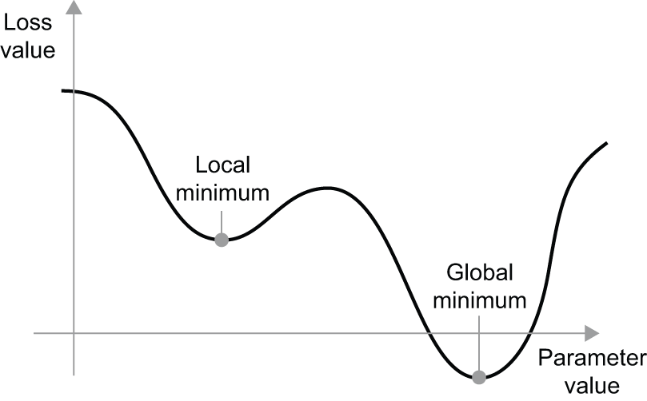


[Figure 2.20](#figure-2-20): A local minimum and a global minimum

As you can see, around a certain parameter value, there is a *local minimum*:
around that point, moving left would result in the loss increasing,
but so would moving right. If the parameter under consideration were
being optimized via SGD with a small learning rate, then the optimization
process would get stuck at the local minimum instead of making its way to
the global minimum.

You can avoid such issues by using momentum, which draws inspiration
from physics. A useful mental image here is to think of the optimization
process as a small ball rolling down the loss curve. If it has enough momentum,
the ball won’t get stuck in a ravine and will end up at the global minimum.
Momentum is implemented by moving the ball at each step based not only
on the current slope value (current acceleration) but also on the
current velocity (resulting from past acceleration). In practice, this means
updating the parameter `w` based not only on the current gradient value but
also on the previous parameter update, such as in this naive implementation:

```python
past_velocity = 0.0
# Constant momentum factor
momentum = 0.1
# Optimization loop
while loss > 0.01:
    w, loss, gradient = get_current_parameters()
    velocity = past_velocity * momentum - learning_rate * gradient
    w = w + momentum * velocity - learning_rate * gradient
    past_velocity = velocity
    update_parameter(w)
```

### Chaining derivatives: The Backpropagation algorithm

In the previously discussed algorithm, we casually assumed that because a function is
differentiable, we can easily compute its gradient. But is that true? How can we
compute the gradient of complex expressions in practice?
In our two-layer network example, how can we get the gradient of the loss with
regard to the weights? That’s where the *Backpropagation algorithm* comes in.

#### The chain rule

Backpropagation is a way to use the derivative of simple operations
(such as addition, `relu`, or tensor product) to easily compute the gradient
of arbitrarily complex combinations of these atomic operations.
Crucially, a neural network consists of many tensor operations
chained together, each of which has a simple, known derivative. For instance,
the model from our first example can be expressed as a function
parameterized by the variables `W1`, `b1`, `W2`, and `b2`
(belonging to the first and second `Dense` layers, respectively), involving
the atomic operations `matmul`, `relu`, `softmax`, and `+`, as well as our
loss function, `loss`, which are all easily differentiable:

```python
loss_value = loss(
    y_true,
    softmax(matmul(relu(matmul(inputs, W1) + b1), W2) + b2),
)
```

Calculus tells us that such a chain of functions can be derived using
the following identity, called the *chain rule*.
Consider two functions `f` and `g`, as well as the composed function
`fg` such that `y = fg(x) == f(g(x))`:

```python
def fg(x):
    x1 = g(x)
    y = f(x1)
    return y
```

Then the chain rule states that `grad(y, x) == grad(y, x1) * grad(x1, x)`.
This enables you to compute the derivative of `fg` as long as you know
the derivatives of `f` and `g`.
The chain rule is named like this because when you add more intermediate
functions, it starts looking like a chain:

```python
def fghj(x):
    x1 = j(x)
    x2 = h(x1)
    x3 = g(x2)
    y = f(x3)
    return y

grad(y, x) == grad(y, x3) * grad(x3, x2) * grad(x2, x1) * grad(x1, x)
```

Applying the chain rule to the computation of the gradient values of a
neural network gives rise to an algorithm called *backpropagation*.
Let’s see how that works, concretely.

#### Automatic differentiation with computation graphs

A useful way to think about backpropagation is in terms of *computation graphs*.
A computation graph is the data structure at the heart of the deep learning revolution.
It’s a directed acyclic graph of operations — in our case, tensor operations.
For instance, figure 2.21 is the graph representation of our first model.

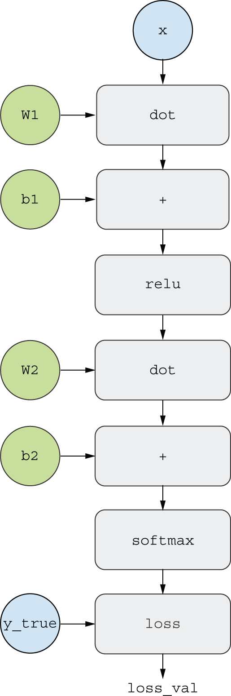


[Figure 2.21](#figure-2-21): The computation graph representation of our two-layer model

Computation graphs have been an extremely successful abstraction in
computer science because they enable us to *treat computation as data*:
a computable expression is encoded as a machine-readable data structure
that can be used as the input or output of another program. For instance,
you could imagine a program that receives a computation graph and returns
a new computation graph that implements a large-scale distributed version
of the same computation — this would mean that you could distribute
any computation without having to write the distribution logic yourself. Or
imagine ... a program that receives a computation graph and can automatically
generate the derivative of the expression it represents. It’s much easier to do
these things if your computation is expressed as an explicit graph
data structure rather than, say, lines of ASCII characters in a `.py` file.

To explain backpropagation clearly,
let’s look at a really basic example of a computation graph.
We’ll consider a simplified version of the graph in figure 2.21, where we only have one
linear layer and where all variables are scalar, shown in figure 2.22. We’ll take two scalar variables
`w`, `b`, a scalar input `x`,
and apply some operations to them to combine into an output `y`. Finally,
we’ll apply an absolute value error loss function:
`loss_val = abs(y_true - y)`. Since we want to update `w` and `b` in a way
that would minimize `loss_val`, we are interested in computing
`grad(loss_val, b)` and `grad(loss_val, w)`.

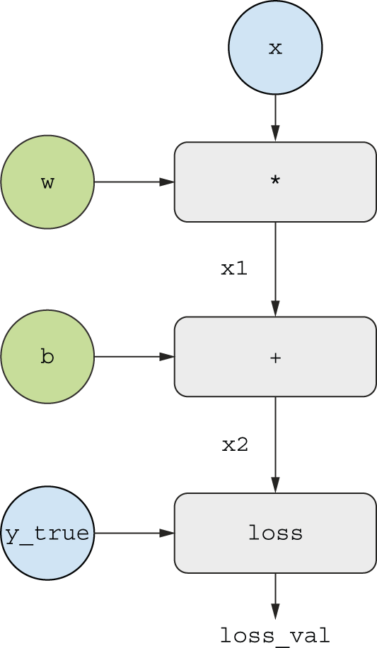


[Figure 2.22](#figure-2-22): A basic example of a computation graph

Let’s set concrete values for the “input nodes” in the graph —
that is, the input `x`, the target `y_true`, `w` and `b` (figure 2.23).
We propagate these values to all nodes in the graph, from top to bottom,
until we reach `loss_val`. This is the *forward pass*.

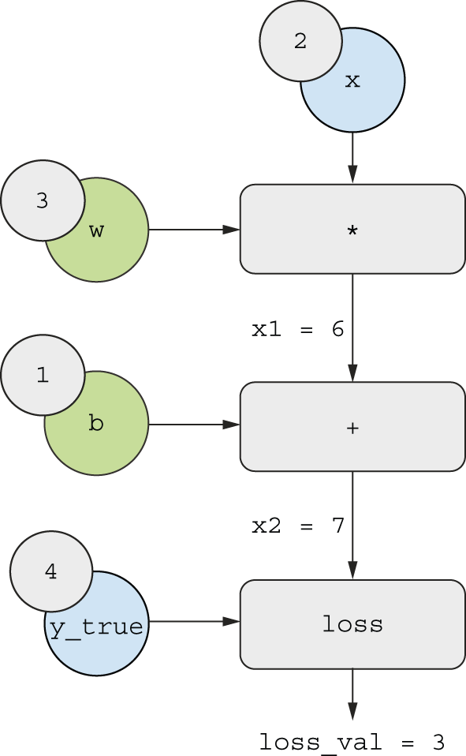


[Figure 2.23](#figure-2-23): Running a forward pass

Now let’s “reverse” the graph: for each edge in the graph going from `A`
to `B`, we will create an opposite edge from `B` to `A`, and ask, “How much does
`B` vary when `A` varies?” That is, what is `grad(B, A)`? We’ll annotate
each inverted edge with this value (figure 2.24).
This backward graph represents the *backward pass*.

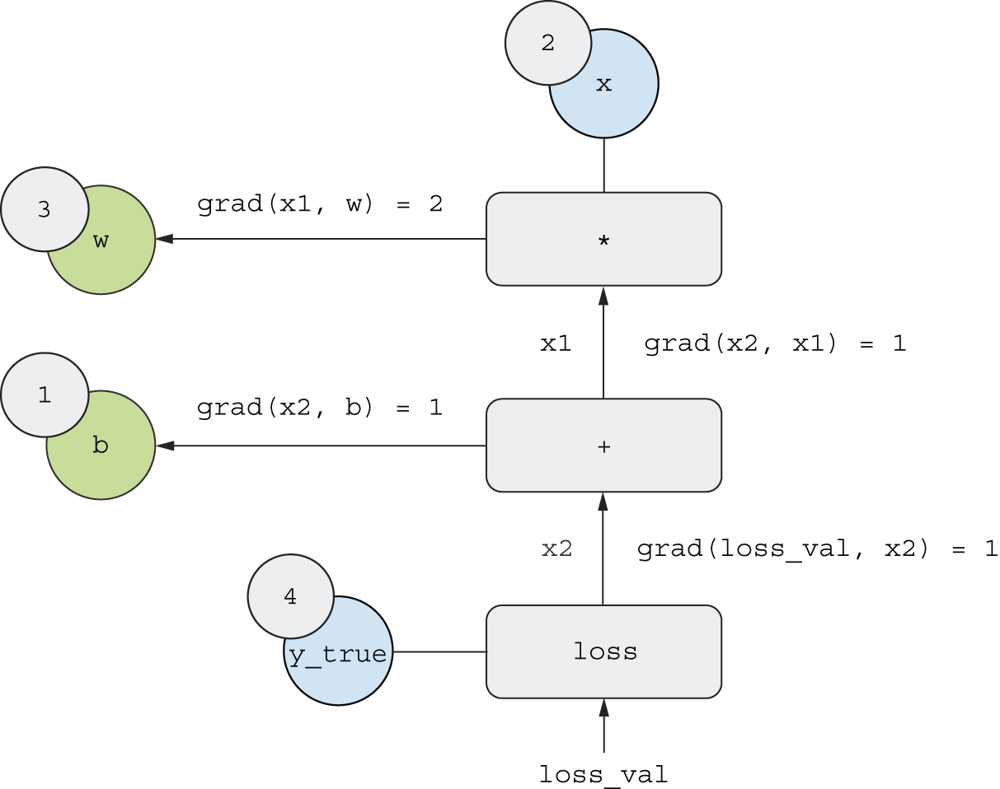


[Figure 2.24](#figure-2-24): Running a backward pass

We have

* `grad(loss_val, x2) = 1` because as `x2` varies by an amount epsilon,
  `loss_val = abs(4 - x2)` varies by the same amount.
* `grad(x2, x1) = 1` because as `x1` varies by an amount epsilon,
  `x2 = x1 + b = x1 + 1` varies by the same amount.
* `grad(x2, b) = 1` because as `b` varies by an amount epsilon,
  `x2 = x1 + b = 6 + b` varies by the same amount.
* `grad(x1, w) = 2` because as `w` varies by an amount epsilon,
  `x1 = x * w = 2 * w` varies by `2 * epsilon`.

What the chain rule says about this backward graph is that you can obtain
the derivative of a node with respect to another node by
*multiplying the derivatives for each edge along the path linking the two nodes*.
For instance,
`grad(loss_val, w) = grad(loss_val, x2) * grad(x2, x1) * grad(x1, w)`.

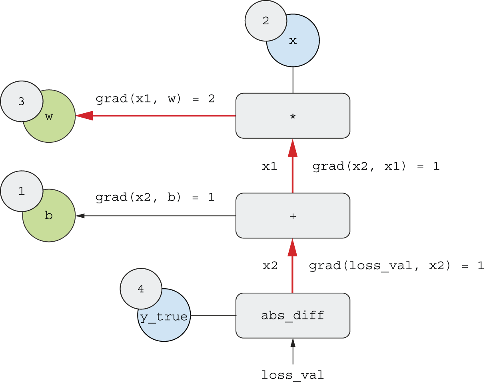


[Figure 2.25](#figure-2-25): Path from `loss_val` to `w` in the backward graph

By applying the chain rule to our graph, we obtain what we were looking for:

* `grad(loss_val, w) = 1 * 1 * 2 = 2`
* `grad(loss_val, b) = 1 * 1 = 1`

If there are multiple paths linking the two nodes of interest `a`, `b`
in the backward graph, we would obtain `grad(b, a)` by summing
the contributions of all the paths.

And with that, you just saw backpropagation in action!
Backpropagation is simply the application of the chain rule to a
computation graph. There’s nothing more to it.
Backpropagation starts with the final loss value and works backward from
the top layers to the bottom layers, computing the contribution that each
parameter had in the loss value. That’s where the name “backpropagation”
comes from: we “back propagate” the loss contributions of different nodes
in a computation graph.

Nowadays, people implement neural networks in modern
frameworks that are capable of *automatic differentiation*, such as JAX, TensorFlow, and PyTorch.
Automatic differentiation is implemented with the
kind of computation graph previously presented. Automatic differentiation makes
it possible to retrieve the gradients of arbitrary compositions of
differentiable tensor operations without doing any extra work besides
writing down the forward pass. When I wrote my first neural networks in C in the
2000s, I had to write my gradients by hand. Now, thanks to modern automatic
differentiation tools, you’ll never have to implement backpropagation yourself.
Consider yourself lucky!

## Looking back at our first example

You’re nearing the end of this chapter, and you should now have a general
understanding of what’s going on behind the scenes in a neural network.
What was a magical black box at the start of the chapter has turned into
a clearer picture, as illustrated in figure 2.26: the model,
composed of layers that are chained together, maps the input data to
predictions. The loss function then compares these predictions to the targets,
producing a loss value: a measure of how well the model’s predictions match
what was expected. The optimizer uses this loss value to update the model’s
weights.

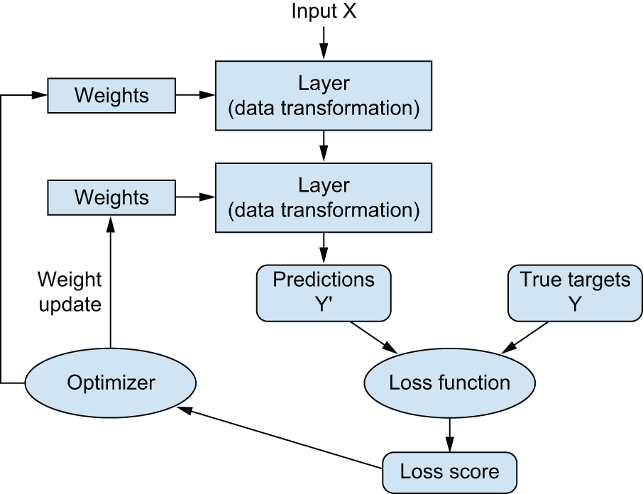


[Figure 2.26](#figure-2-26): Relationship between the network, layers, loss function, and optimizer

Let’s go back to the first example and review each piece of it in the light of
what you’ve learned in the previous sections.

This was the input data:

```python
(train_images, train_labels), (test_images, test_labels) = mnist.load_data()
train_images = train_images.reshape((60000, 28 * 28))
train_images = train_images.astype("float32") / 255
test_images = test_images.reshape((10000, 28 * 28))
test_images = test_images.astype("float32") / 255
```

Now you understand that the input images are stored in NumPy tensors,
which are here formatted as `float32` tensors of shape `(60000, 784)`
(training data) and `(10000, 784)` (test data), respectively.

This was our model:

```python
model = keras.Sequential(
    [
        layers.Dense(512, activation="relu"),
        layers.Dense(10, activation="softmax"),
    ]
)
```

Now you understand that this model consists of a chain of two `Dense` layers,
that each layer applies a few simple tensor operations to the input data,
and that these operations involve weight tensors. Weight tensors, which
are attributes of the layers, are where the *knowledge* of the model persists.

This was the model-compilation step:

```python
model.compile(
    optimizer="adam",
    loss="sparse_categorical_crossentropy",
    metrics=["accuracy"],
)
```

Now you understand that `"sparse_categorical_crossentropy"` is the loss function
that’s used as a feedback signal for learning the weight tensors, which
the training phase will attempt to minimize. You also know that this reduction
of the loss happens via mini-batch stochastic gradient descent.
The exact rules governing a specific use of gradient descent are defined
by the `"adam"` optimizer passed as the first argument.

Finally, this was the training loop:

```python
model.fit(
    train_images,
    train_labels,
    epochs=5,
    batch_size=128,
)
```

Now you understand what happens when you call `fit`: the model will start
to iterate on the training data in mini-batches of 128 samples,
5 times over (each iteration over all the training data is called an *epoch*).
For each batch, the model will compute the gradient of the loss
with regard to the weights (using the Backpropagation algorithm, which derives
from the chain rule in calculus) and move the weights in the direction
that will reduce the value of the loss for this batch.

After these 5 epochs, the model will have performed 2,345 gradient updates
(469 per epoch), and the loss of the model will be sufficiently low that
the model will be capable of classifying handwritten digits
with high accuracy.

At this point, you already know most of what there is to know
about neural networks. Let’s prove it by reimplementing a simplified version
of that first example step by step, using only low-level operations.

### Reimplementing our first example from scratch

What’s better to demonstrate full, unambiguous understanding than to implement
everything from scratch? Of course, what “from scratch” means here is relative:
we won’t reimplement basic tensor operations,
and we won’t implement backpropagation.
But we’ll go to such a low level that each computation step will be made explicit.

Don’t worry if you don’t understand every little detail in this example just yet.
The next chapter will dive in more detail into the Keras API. For now,
just try to follow the gist of what’s going on — the intent of this example is
to help crystallize your understanding of the mathematics of deep learning using
a concrete implementation. Let’s go!

#### A simple Dense class

You’ve learned earlier that the `Dense` layer implements the following
input transformation, where `W` and `b` are model parameters, and `activation`
is an element-wise function (usually `relu`):

```python
output = activation(matmul(input, W) + b)
```

Let’s implement a simple Python class `NaiveDense` that creates two Keras
variables `W` and `b`, and exposes a `__call__()` method
that applies the previous transformation:

```python
# keras.ops is where you will find all the tensor operations you need.
import keras
from keras import ops

class NaiveDense:
    def __init__(self, input_size, output_size, activation=None):
        self.activation = activation
        self.W = keras.Variable(
            # Creates a matrix W of shape (input_size, output_size),
            # initialized with random values drawn from a uniform
            # distribution
            shape=(input_size, output_size), initializer="uniform"
        )
        # Creates a vector b of shape (output_size,), initialized with
        # zeros
        self.b = keras.Variable(shape=(output_size,), initializer="zeros")

    # Applies the forward pass
    def __call__(self, inputs):
        x = ops.matmul(inputs, self.W)
        x = x + self.b
        if self.activation is not None:
            x = self.activation(x)
        return x

    @property
    # The convenience method for retrieving the layer's weights
    def weights(self):
        return [self.W, self.b]
```

#### A simple Sequential class

Now, let’s create a `NaiveSequential` class to chain these layers. It wraps a list
of layers and exposes a `__call__()` method that simply calls the underlying
layers on the inputs, in order. It also features a `weights` property to easily
keep track of the layers’ parameters:

```python
class NaiveSequential:
    def __init__(self, layers):
        self.layers = layers

    def __call__(self, inputs):
        x = inputs
        for layer in self.layers:
            x = layer(x)
        return x

    @property
    def weights(self):
        weights = []
        for layer in self.layers:
            weights += layer.weights
        return weights
```

Using this `NaiveDense` class and this `NaiveSequential` class, we can create
a mock Keras model:

```python
model = NaiveSequential(
    [
        NaiveDense(input_size=28 * 28, output_size=512, activation=ops.relu),
        NaiveDense(input_size=512, output_size=10, activation=ops.softmax),
    ]
)
assert len(model.weights) == 4
```

#### A batch generator

Next, we need a way to iterate over the MNIST data in mini-batches. This is easy:

```python
import math

class BatchGenerator:
    def __init__(self, images, labels, batch_size=128):
        assert len(images) == len(labels)
        self.index = 0
        self.images = images
        self.labels = labels
        self.batch_size = batch_size
        self.num_batches = math.ceil(len(images) / batch_size)

    def next(self):
        images = self.images[self.index : self.index + self.batch_size]
        labels = self.labels[self.index : self.index + self.batch_size]
        self.index += self.batch_size
        return images, labels
```

### Running one training step

The most difficult part of the process is the “training step”: updating
the weights of the model after running it on one batch of data. We need to

* Compute the predictions of the model for the images in the batch
* Compute the loss value for these predictions given the actual labels
* Compute the gradient of the loss with regard to the model’s weights
* Move the weights by a small amount in the direction opposite to the gradient

```python
def one_training_step(model, images_batch, labels_batch):
    # Runs the "forward pass"
    predictions = model(images_batch)
    loss = ops.sparse_categorical_crossentropy(labels_batch, predictions)
    average_loss = ops.mean(loss)
    # Computes the gradient of the loss with regard to the weights. The
    # output, gradients, is a list where each entry corresponds to a
    # weight from the model.weights list. We haven't defined this
    # function yet!
    gradients = get_gradients_of_loss_wrt_weights(loss, model.weights)
    # Updates the weights using the gradients. We haven't defined this
    # function yet!
    update_weights(gradients, model.weights)
    return loss
```

[Listing 2.9](#listing-2-9): A single step of training

#### The weight update step

As you already know, the purpose of the “weight update” step
(represented by the `update_weights()` function) is to
move the weights by “a bit” in a direction that will reduce the loss on this
batch. The magnitude of the move is determined by the “learning rate,” typically
a small quantity. The simplest way to implement this `update_weights()` function
is to subtract `gradient * learning_rate` from each weight:

```python
learning_rate = 1e-3

def update_weights(gradients, weights):
    for g, w in zip(gradients, weights):
        # Assigns a new value to the variable, in place
        w.assign(w - g * learning_rate)
```

In practice, you will almost never implement a weight update step like this by
hand. Instead, you would use an `Optimizer` instance from Keras — like this:

```python
from keras import optimizers

optimizer = optimizers.SGD(learning_rate=1e-3)

def update_weights(gradients, weights):
    optimizer.apply_gradients(zip(gradients, weights))
```

#### Gradient computation

Now, there’s just one thing we’re still missing: gradient computation
(represented by the `get_gradients_of_loss_wrt_weights()` function in listing 2.9). In the previous section,
we outlined how we could use the chain rule to obtain the gradients of a chain of functions
given their individual derivatives, a process known as backpropagation. We could reimplement
backpropagation from scratch here, but that would be rather cumbersome, especially since
we’re using a `softmax` operation and a crossentropy loss, which have fairly verbose derivatives.

Instead, we can rely on the automatic differentiation mechanism that’s built into one of the low-level
frameworks supported by Keras, such as TensorFlow, JAX, or PyTorch. For the sake of the example, let’s go with
TensorFlow here. You’ll learn more about TensorFlow, JAX, and PyTorch in the next chapter.

The API through which you can use TensorFlow’s
automatic differentiation capabilities is the `tf.GradientTape` object.
It’s a Python scope that will “record” the tensor operations that run
inside it, in the form of a computation graph (sometimes called a *tape*).
This graph can then be used to retrieve the gradient
of any scalar value with respect to any set of input values:

```python
import tensorflow as tf

# Instantiates a scalar tensor with value 0
x = tf.zeros(shape=())
# Opens a GradientTape scope
with tf.GradientTape() as tape:
    # Inside the scope, applies some tensor operations to our variable
    y = 2 * x + 3
# Uses the tape to retrieve the gradient of the output y with respect
# to our variable x
grad_of_y_wrt_x = tape.gradient(y, x)
```

Let’s rewrite our function `one_training_step()` using the TensorFlow `GradientTape`
(skipping the need for a separate `get_gradients_of_loss_wrt_weights()` function):

```python
def one_training_step(model, images_batch, labels_batch):
    with tf.GradientTape() as tape:
        predictions = model(images_batch)
        loss = ops.sparse_categorical_crossentropy(labels_batch, predictions)
        average_loss = ops.mean(loss)
    gradients = tape.gradient(average_loss, model.weights)
    update_weights(gradients, model.weights)
    return average_loss
```

Now that our per-batch training step is ready, we can move on to implementing
an entire epoch of training.

### The full training loop

An epoch of training simply consists of the repetition of the training step
for each batch in the training data, and the full training loop is simply
the repetition of one epoch:

```python
def fit(model, images, labels, epochs, batch_size=128):
    for epoch_counter in range(epochs):
        print(f"Epoch {epoch_counter}")
        batch_generator = BatchGenerator(images, labels)
        for batch_counter in range(batch_generator.num_batches):
            images_batch, labels_batch = batch_generator.next()
            loss = one_training_step(model, images_batch, labels_batch)
            if batch_counter % 100 == 0:
                print(f"loss at batch {batch_counter}: {loss:.2f}")
```

Let’s test-drive it:

```python
from keras.datasets import mnist

(train_images, train_labels), (test_images, test_labels) = mnist.load_data()

train_images = train_images.reshape((60000, 28 * 28))
train_images = train_images.astype("float32") / 255
test_images = test_images.reshape((10000, 28 * 28))
test_images = test_images.astype("float32") / 255

fit(model, train_images, train_labels, epochs=10, batch_size=128)
```

### Evaluating the model

We can evaluate the model by taking the `argmax` of its predictions
over the test images, and comparing it to the expected labels:

```python
>>> predictions = model(test_images)
>>> predicted_labels = ops.argmax(predictions, axis=1)
>>> matches = predicted_labels == test_labels
>>> f"accuracy: {ops.mean(matches):.2f}"
accuracy: 0.83
```

All done! As you can see, it’s quite a bit of work to do “by hand” what you
can do in a few lines of Keras code. But because you’ve gone through these
steps, you should now have a crystal-clear understanding of what goes on inside
a neural network when you call `fit()`. Having this low-level mental model
of what your code is doing behind the scenes will make you better able to
take advantage of the high-level features of the Keras API.

## Summary

* *Tensors* form the foundation of modern machine learning systems. They come in
  various flavors of `dtype`, `rank`, and `shape`.

* You can manipulate numerical tensors via *tensor operations*
  (such as addition, tensor product, or element-wise multiplication),
  which can be interpreted as encoding geometric transformations. In
  general, everything in deep learning is amenable to a geometric interpretation.

* Deep learning models consist of chains of simple tensor operations, parameterized
  by *weights*, which are themselves tensors. The weights of a model are where
  its “knowledge” is stored.

* *Learning* means finding a set of values for the model’s weights
  that minimizes a *loss function* for a given set of training data samples
  and their corresponding targets.

* Learning happens by drawing random batches of data samples and their targets
  and computing the gradient of the model parameters with respect to the loss
  on the batch. The model parameters are then moved a bit
  (the magnitude of the move is defined by the learning rate)
  in the opposite direction from the gradient.
  This is called *mini-batch gradient descent*.

* The entire learning process is made possible by the fact that all tensor
  operations in neural networks are differentiable, and thus
  it’s possible to apply the chain rule of derivation to find the gradient
  function mapping the current parameters and current batch
  of data to a gradient value. This is called *backpropagation*.

* Two key concepts you’ll see frequently in future chapters are *loss* and
  *optimizers*. These are the two things you need to define before you begin
  feeding data into a model:
  + The *loss* is the quantity you’ll attempt to minimize during training,
    so it should represent a measure of success for the task you’re trying to solve.
  + The *optimizer* specifies the exact way in which the gradient of the loss
    will be used to update parameters:
    for instance, it could be the RMSProp optimizer, SGD with momentum, and so on.

#### **Tiếng Việt (Vietnamese)**

# Chương 2: Các khối xây dựng toán học của mạng lưới thần kinh

Chương này bao gồm

* Ví dụ đầu tiên về mạng nơ-ron
* Tensor và các phép toán tensor
* Mạng lưới thần kinh học như thế nào thông qua lan truyền ngược và giảm độ dốc

Để hiểu deep learning đòi hỏi phải làm quen với nhiều khái niệm toán học đơn giản: *tensor*, *các phép toán tensor*, *vi phân*, *giảm độ dốc*, v.v. Mục tiêu của chúng tôi trong chương này là xây dựng trực giác của bạn về những khái niệm này mà không cần quá chú trọng đến kỹ thuật. Đặc biệt, chúng tôi sẽ tránh xa các ký hiệu toán học, vốn có thể tạo ra những rào cản không cần thiết đối với những người không có nền tảng toán học và không cần thiết để giải thích rõ ràng mọi thứ. Mô tả chính xác, rõ ràng nhất của một phép toán là mã thực thi của nó.

Để cung cấp đủ bối cảnh cho việc giới thiệu các tensor và độ dốc giảm dần, chúng ta sẽ bắt đầu chương này với một ví dụ thực tế về mạng nơ-ron. Sau đó, chúng ta sẽ xem xét từng khái niệm mới được giới thiệu. Hãy nhớ rằng những khái niệm này sẽ rất cần thiết để bạn hiểu được các ví dụ thực tế sẽ có trong các chương sau!

Sau khi đọc chương này, bạn sẽ có hiểu biết trực quan về lý thuyết toán học đằng sau học sâu và bạn sẽ sẵn sàng bắt đầu đi sâu vào các khuôn khổ học sâu hiện đại, trong chương 3.

Chạy mã trong cuốn sách này

Cuốn sách này chứa đầy mã Python có thể chạy được. Mỗi chương được ghép nối với một *sổ tay Jupyter* chứa tất cả mã từ chương đó. Sổ ghi chép Jupyter là một loại sổ ghi chép Python trực tiếp, nơi bạn có thể chạy mã, dữ liệu biểu đồ, xem hình ảnh một cách tương tác, v.v. Bạn sẽ thu được nhiều kiến ​​thức thực tế hơn từ cuốn sách này nếu bạn chạy và thử nghiệm mã khi đọc.

Cho đến nay, cách dễ dàng nhất để thiết lập môi trường deep learning để chạy các sổ ghi chép này là *Google Colaboratory* (hay gọi tắt là Colab), một môi trường lưu trữ dành cho sổ ghi chép Jupyter đã trở thành tiêu chuẩn ngành cho những người thực hành ML. Với Colab, bạn có thể chạy mã cho cuốn sách này một cách tương tác trong trình duyệt, kết nối với thời gian chạy trên đám mây bằng phần cứng có thể định cấu hình. Theo mặc định, sổ ghi chép trong cuốn sách này sẽ chạy trên thời gian chạy GPU miễn phí của Colab.

Nếu muốn, bạn cũng có thể chạy cục bộ những sổ ghi chép này trên máy của chính mình. Nên sử dụng GPU, đặc biệt khi bạn tiếp cận các mô hình lớn hơn và có tính toán chuyên sâu hơn ở phần sau của cuốn sách này.

Bạn có thể tìm thấy hướng dẫn chạy cục bộ và trên Colab, cùng với mã tại <https://github.com/fchollet/deep-learning-with-python-notebooks>.

## Cái nhìn đầu tiên về mạng lưới thần kinh

Hãy xem một ví dụ cụ thể về mạng thần kinh sử dụng thư viện máy học *Keras* để học cách phân loại các chữ số viết tay. Chúng tôi sẽ sử dụng Keras rộng rãi trong suốt cuốn sách này. Đó là một thư viện cấp cao, đơn giản cho phép chúng tôi tập trung vào các khái niệm mà chúng tôi muốn đề cập.

Trừ khi bạn đã có kinh nghiệm với Keras hoặc các thư viện tương tự, bạn sẽ không hiểu mọi thứ về ví dụ đầu tiên này ngay lập tức. Điều đó ổn thôi. Trong một số phần, chúng ta sẽ xem xét từng phần tử trong ví dụ và giải thích chi tiết. Vì vậy, đừng lo lắng nếu một số bước có vẻ tùy tiện hoặc giống như phép thuật đối với bạn! Chúng ta phải bắt đầu từ đâu đó.

Vấn đề chúng tôi đang cố gắng giải quyết ở đây là phân loại hình ảnh thang độ xám của các chữ số viết tay (28 × 28 pixel) thành 10 loại (0 đến 9). Chúng ta sẽ sử dụng bộ dữ liệu MNIST, một bộ dữ liệu cổ điển trong cộng đồng máy học, đã tồn tại gần như lâu đời trong lĩnh vực này và đã được nghiên cứu chuyên sâu. Đó là một bộ gồm 60.000 hình ảnh huấn luyện, cộng với 10.000 hình ảnh thử nghiệm, do Viện Tiêu chuẩn và Công nghệ Quốc gia (NIST in MNIST) tập hợp vào những năm 1980. Bạn có thể coi việc “giải quyết” MNIST giống như “Xin chào thế giới” của học sâu - đó là những gì bạn làm để xác minh rằng thuật toán của bạn đang hoạt động như mong đợi. Khi trở thành người thực hành học máy, bạn sẽ thấy MNIST xuất hiện nhiều lần trong các bài báo khoa học, bài đăng trên blog, v.v. Bạn có thể xem một số mẫu MNIST trong hình 2.1.

Trong học máy, *danh mục* trong bài toán phân loại được gọi là *lớp*. Điểm dữ liệu được gọi là *mẫu*. Lớp được liên kết với một mẫu cụ thể được gọi là *nhãn*.


[Figure 2.1](#figure-2-1): MNIST sample digits

Bộ dữ liệu MNIST được tải sẵn trong Keras, dưới dạng một bộ bốn mảng NumPy.

```python
from keras.datasets import mnist

(train_images, train_labels), (test_images, test_labels) = mnist.load_data()
```

[Liệt kê 2.1](#listing-2-1): Đang tải tập dữ liệu MNIST trong Keras

`train_images` và `train_labels` tạo thành tập huấn luyện, dữ liệu mà mô hình sẽ học từ đó. Sau đó, mô hình sẽ được kiểm tra trên tập kiểm tra, `test_images` và `test_labels`. Hình ảnh được mã hóa dưới dạng mảng NumPy và nhãn là một mảng chữ số, nằm trong khoảng từ 0 đến 9. Hình ảnh và nhãn có sự tương ứng một-một.

NumPy là một thư viện Python rất phổ biến để tính toán số. Bạn sẽ thấy nó xuất hiện thường xuyên trong hành trình học máy của mình. Nó hiếm khi được sử dụng để triển khai các thuật toán học máy hiện đại do thiếu hỗ trợ GPU và *tự động phân biệt*, nhưng mảng NumPy thường được sử dụng làm định dạng trao đổi dữ liệu số — như ở đây, cho các chữ số MNIST và nhãn của chúng.

Hãy xem dữ liệu đào tạo:

```python
>>> train_images.shape
(60000, 28, 28)
>>> len(train_labels)
60000
>>> train_labels
array([5, 0, 4, ..., 5, 6, 8], dtype=uint8)
```

Và đây là dữ liệu thử nghiệm:

```python
>>> test_images.shape
(10000, 28, 28)
>>> len(test_labels)
10000
>>> test_labels
array([7, 2, 1, ..., 4, 5, 6], dtype=uint8)
```

Quy trình làm việc sẽ như sau. Đầu tiên, chúng ta sẽ cung cấp cho mạng lưới thần kinh dữ liệu huấn luyện, `train_images` và `train_labels`. Mạng sau đó sẽ học cách liên kết hình ảnh và nhãn. Cuối cùng, chúng tôi sẽ yêu cầu mạng tạo dự đoán cho `test_images` và chúng tôi sẽ xác minh xem những dự đoán này có khớp với nhãn từ `test_labels` hay không.

Hãy xây dựng mạng lưới - một lần nữa, hãy nhớ rằng bạn chưa cần phải hiểu mọi thứ về ví dụ này.

```python
import keras
from keras import layers

model = keras.Sequential(
    [
        layers.Dense(512, activation="relu"),
        layers.Dense(10, activation="softmax"),
    ]
)
```

[Liệt kê 2.2](#listing-2-2): Kiến trúc mạng

Khối xây dựng cốt lõi của mạng nơ-ron là *lớp*. Bạn có thể coi lớp như một bộ lọc dữ liệu: một số dữ liệu được đưa vào và xuất hiện ở dạng hữu ích hơn. Cụ thể, các lớp trích xuất *các biểu diễn* từ dữ liệu được cung cấp vào chúng - hy vọng rằng các biểu diễn đó có ý nghĩa hơn cho vấn đề hiện tại. Hầu hết học sâu bao gồm việc xâu chuỗi các lớp đơn giản lại với nhau để thực hiện một hình thức *chưng cất dữ liệu* lũy tiến. Mô hình học sâu giống như một cái sàng để xử lý dữ liệu, được tạo thành từ một chuỗi các bộ lọc dữ liệu ngày càng tinh tế hơn - các lớp.

Ở đây, mô hình của chúng tôi bao gồm một chuỗi gồm hai lớp `Dense`, được kết nối dày đặc (còn gọi là *được kết nối đầy đủ*). Lớp thứ hai (và cuối cùng) là lớp *`softmax` phân loại* 10 chiều, có nghĩa là nó sẽ trả về một mảng gồm 10 điểm xác suất (tổng cộng là 1). Mỗi điểm sẽ là xác suất để hình ảnh chữ số hiện tại thuộc về một trong các lớp 10 chữ số của chúng tôi.

Để làm cho mô hình sẵn sàng cho việc đào tạo, chúng ta cần chọn thêm ba thứ nữa, như một phần của bước *biên dịch*:

* *Một hàm mất mát* — Làm thế nào mô hình có thể đo lường được nó
hiệu suất trên dữ liệu đào tạo và do đó làm thế nào nó có thể điều khiển
bản thân nó đi đúng hướng.

* *Trình tối ưu hóa* — Cơ chế mà qua đó mô hình sẽ
tự cập nhật dựa trên dữ liệu đào tạo mà nó nhìn thấy, để cải thiện
hiệu suất của nó.

* *Các số liệu cần theo dõi trong quá trình đào tạo và kiểm tra* — Ở đây, chúng tôi chỉ quan tâm
về độ chính xác (tỷ lệ hình ảnh được phân loại chính xác).

Mục đích chính xác của hàm mất mát và trình tối ưu hóa sẽ được làm rõ trong hai chương tiếp theo.

```python
model.compile(
    optimizer="adam",
    loss="sparse_categorical_crossentropy",
    metrics=["accuracy"],
)
```

[Liệt kê 2.3](#listing-2-3): Bước biên dịch

Trước khi đào tạo, chúng tôi sẽ *xử lý trước* dữ liệu bằng cách định hình lại dữ liệu thành hình dạng mà mô hình mong đợi và điều chỉnh tỷ lệ sao cho tất cả các giá trị đều nằm trong khoảng `[0, 1]`. Trước đây, hình ảnh đào tạo của chúng tôi được lưu trữ trong một mảng có hình dạng `(60000, 28, 28)` thuộc loại `uint8` với các giá trị trong khoảng `[0, 255]`. Chúng tôi chuyển đổi nó thành một mảng `float32` có hình dạng `(60000, 28 * 28)` với các giá trị nằm trong khoảng `0` và `1`.

```python
train_images = train_images.reshape((60000, 28 * 28))
train_images = train_images.astype("float32") / 255
test_images = test_images.reshape((10000, 28 * 28))
test_images = test_images.astype("float32") / 255
```

[Liệt kê 2.4](#listing-2-4): Chuẩn bị dữ liệu hình ảnh

Bây giờ chúng tôi đã sẵn sàng huấn luyện mô hình, việc này trong Keras được thực hiện thông qua lệnh gọi phương thức `fit()` của mô hình - chúng tôi *điều chỉnh* mô hình cho phù hợp với dữ liệu huấn luyện của nó.

```python
model.fit(train_images, train_labels, epochs=5, batch_size=128)
```

[Liệt kê 2.5](#listing-2-5): “Lắp” mô hình

Hai đại lượng được hiển thị trong quá trình huấn luyện: sự mất mát của mô hình trên dữ liệu huấn luyện và độ chính xác của mô hình trên dữ liệu huấn luyện. Chúng tôi nhanh chóng đạt được độ chính xác 0,989 (98,9%) trên dữ liệu huấn luyện.

Bây giờ chúng ta đã có một mô hình được huấn luyện, chúng ta có thể sử dụng nó để dự đoán xác suất của lớp cho các chữ số *mới* — những hình ảnh không thuộc dữ liệu huấn luyện, giống như những hình ảnh trong tập kiểm tra.

```python
>>> test_digits = test_images[0:10]
>>> predictions = model.predict(test_digits)
>>> predictions[0]
array([1.0726176e-10, 1.6918376e-10, 6.1314843e-08, 8.4106023e-06,
       2.9967067e-11, 3.0331331e-09, 8.3651971e-14, 9.9999106e-01,
       2.6657624e-08, 3.8127661e-07], dtype=float32)
```

[Liệt kê 2.6](#listing-2-6): Sử dụng mô hình để đưa ra dự đoán

Mỗi số chỉ mục `i` trong mảng đó tương ứng với xác suất ảnh chữ số `test_digits[0]` thuộc lớp `i`.

Chữ số kiểm tra đầu tiên này có điểm xác suất cao nhất (0,99999106, gần như 1) ở chỉ số 7, vì vậy theo mô hình của chúng tôi, nó phải là 7:

```python
>>> predictions[0].argmax()
7
>>> predictions[0][7]
0.99999106
```

Chúng tôi có thể kiểm tra xem nhãn thử nghiệm có đồng ý không:

```python
>>> test_labels[0]
7
```

Trung bình, mô hình của chúng tôi phân loại các chữ số chưa từng thấy như vậy tốt đến mức nào? Hãy kiểm tra bằng cách tính độ chính xác trung bình trên toàn bộ tập kiểm tra.

```python
>>> test_loss, test_acc = model.evaluate(test_images, test_labels)
>>> print(f"test_acc: {test_acc}")
test_acc: 0.9785
```

[Liệt kê 2.7](#listing-2-7): Đánh giá mô hình trên dữ liệu mới

Độ chính xác của tập kiểm tra hóa ra là 97,8% - gần gấp đôi tỷ lệ lỗi của tập huấn luyện (với độ chính xác 98,9%). Khoảng cách giữa độ chính xác của quá trình đào tạo và độ chính xác của kiểm tra là một ví dụ về *trang bị quá mức*: thực tế là các mô hình học máy có xu hướng hoạt động kém hơn trên dữ liệu mới so với dữ liệu đào tạo của chúng. Overfitting là chủ đề trọng tâm trong chương 5.

Điều này kết thúc ví dụ đầu tiên của chúng tôi. Bạn vừa thấy cách có thể xây dựng và huấn luyện mạng nơ-ron để phân loại các chữ số viết tay trong chưa đầy 15 dòng mã Python. Trong chương này và chương tiếp theo, chúng ta sẽ đi vào chi tiết về từng phần chuyển động mà chúng ta vừa xem trước và làm rõ những gì đang diễn ra ở hậu trường. Bạn sẽ tìm hiểu về tensor, các đối tượng lưu trữ dữ liệu đi vào mô hình; các phép toán tensor, các lớp được tạo thành từ đâu; và giảm độ dốc, cho phép mô hình của bạn học hỏi từ các ví dụ huấn luyện của nó.

## Biểu diễn dữ liệu cho mạng lưới thần kinh

Trong ví dụ trước, chúng ta bắt đầu từ dữ liệu được lưu trữ trong mảng NumPy đa chiều, còn được gọi là *tensors*. Nhìn chung, tất cả các hệ thống máy học hiện tại đều sử dụng tensor làm cấu trúc dữ liệu cơ bản. Tensor là nền tảng của lĩnh vực này — cơ bản đến mức khung TensorFlow được đặt theo tên của chúng. Vậy tensor là gì?

Về cốt lõi, tensor là nơi chứa dữ liệu - thường là dữ liệu số. Vì vậy, nó là nơi chứa các con số. Có thể bạn đã quen thuộc với ma trận, là các tensor cấp 2: tensor là dạng tổng quát hóa của ma trận thành một số chiều tùy ý (lưu ý rằng trong ngữ cảnh của tensor, một chiều thường được gọi là *trục*).

Lúc đầu, việc xem xét chi tiết các tensor có vẻ hơi trừu tượng. Nhưng điều đó rất đáng giá - việc thao tác các tensor sẽ là cốt lõi của bất kỳ mã học máy nào bạn từng viết.

### Vô hướng (tensor cấp 0)

Một tensor chỉ chứa một số được gọi là *scalar* (hoặc tensor vô hướng, tensor hạng 0 hoặc tensor 0D). Trong NumPy, số `float32` hoặc `float64` là một tensor vô hướng (hoặc mảng vô hướng). Bạn có thể hiển thị số trục của một tenxơ NumPy thông qua thuộc tính `ndim`; một tensor vô hướng có 0 trục (`ndim == 0`). Số trục của một tensor còn được gọi là *cấp* của nó. Đây là một vô hướng NumPy:

```python
>>> import numpy as np
>>> x = np.array(12)
>>> x
array(12)
>>> x.ndim
0
```

### Các vectơ (tensor hạng 1)

Một mảng số được gọi là vectơ (hoặc tensor hạng 1 hoặc tensor 1D). Tenxơ hạng 1 có đúng một trục. Sau đây là một vectơ NumPy:

```python
>>> x = np.array([12, 3, 6, 14, 7])
>>> x
array([12, 3, 6, 14, 7])
>>> x.ndim
1
```

Vectơ này có năm mục và do đó được gọi là *vectơ 5 chiều*. Đừng nhầm lẫn vectơ 5D với tensor 5D! Vectơ 5D chỉ có một trục và có năm chiều dọc theo trục của nó, trong khi một tensor 5D có năm trục (và có thể có bất kỳ số chiều nào dọc theo mỗi trục). *Thứ nguyên* có thể biểu thị số lượng mục dọc theo một trục cụ thể (như trong trường hợp vectơ 5D của chúng tôi) hoặc số trục trong một tensor (chẳng hạn như tensor 5D), điều này đôi khi có thể gây nhầm lẫn. Trong trường hợp thứ hai, về mặt kỹ thuật sẽ đúng hơn khi nói về *tensor hạng 5* (thứ hạng của tensor là số trục), nhưng ký hiệu mơ hồ *tenxơ 5D* vẫn phổ biến.

### Ma trận (tensor bậc 2)

Một mảng vectơ là một *ma trận* (hoặc tensor hạng 2 hoặc tensor 2D). Ma trận có hai trục (thường được gọi là *hàng* và *cột*). Bạn có thể diễn giải ma trận một cách trực quan dưới dạng một lưới số hình chữ nhật. Đây là ma trận NumPy:

```python
>>> x = np.array([[5, 78, 2, 34, 0],
...               [6, 79, 3, 35, 1],
...               [7, 80, 4, 36, 2]])
>>> x.ndim
2
```

Các mục nhập từ trục đầu tiên được gọi là *hàng* và các mục nhập từ trục thứ hai được gọi là *cột*. Trong ví dụ trước, `[5, 78, 2, 34, 0]` là hàng đầu tiên của `x` và `[5, 6, 7]` là cột đầu tiên.

### Tensor cấp 3 và tensor cấp cao hơn

Nếu bạn đóng gói các ma trận như vậy vào một mảng mới, bạn sẽ thu được một tensor cấp 3 (hoặc tensor 3D), mà bạn có thể diễn giải một cách trực quan dưới dạng một khối số. Sau đây là tenxơ cấp 3 NumPy:

```python
>>> x = np.array([[[5, 78, 2, 34, 0],
...                [6, 79, 3, 35, 1],
...                [7, 80, 4, 36, 2]],
...               [[5, 78, 2, 34, 0],
...                [6, 79, 3, 35, 1],
...                [7, 80, 4, 36, 2]],
...               [[5, 78, 2, 34, 0],
...                [6, 79, 3, 35, 1],
...                [7, 80, 4, 36, 2]]])
>>> x.ndim
3
```

Bằng cách đóng gói các tensor hạng 3 trong một mảng, bạn có thể tạo ra một tensor hạng 4, v.v. Trong học sâu, bạn thường thao tác các tensor với cấp độ từ 0 đến 4, mặc dù bạn có thể tăng lên cấp độ 5 nếu xử lý dữ liệu video.

### Thuộc tính chính

Một tensor được xác định bởi ba thuộc tính chính:

* *Số trục (thứ hạng)* — Ví dụ: một tenxơ hạng 3 có ba trục,
và một ma trận có hai trục. Cái này còn được gọi là `ndim` của tensor trong Python
các thư viện như NumPy, JAX, TensorFlow và PyTorch.

* *Hình dạng* — Đây là một bộ số nguyên mô tả số chiều
tensor có dọc theo mỗi trục. Chẳng hạn, ví dụ ma trận trước có
hình dạng `(3, 5)` và ví dụ tensor cấp 3 có hình dạng `(3, 3, 5)`.
Một vectơ có hình dạng với một phần tử duy nhất, chẳng hạn như `(5,)`,
trong khi đại lượng vô hướng có hình trống, `()`.

* *Loại dữ liệu (thường được gọi là `dtype` trong thư viện Python)* —
Đây là loại dữ liệu chứa trong tensor;
Ví dụ: kiểu của tensor có thể là `float16`, `float32`, `float64`, `uint8`, `bool`,
và vân vân. Trong TensorFlow, bạn cũng có thể gặp các tensor `string`.

Để làm cho điều này cụ thể hơn, hãy xem lại dữ liệu chúng tôi đã xử lý trong ví dụ MNIST. Đầu tiên, chúng tôi tải tập dữ liệu MNIST:

```python
from keras.datasets import mnist

(train_images, train_labels), (test_images, test_labels) = mnist.load_data()
```

Tiếp theo, chúng ta hiển thị số trục của tensor `train_images`, thuộc tính `ndim`:

```python
>>> train_images.ndim
3
```

Đây là hình dạng của nó:

```python
>>> train_images.shape
(60000, 28, 28)
```

Và đây là kiểu dữ liệu của nó, thuộc tính `dtype`:

```python
>>> train_images.dtype
uint8
```

Vì vậy, những gì chúng ta có ở đây là một tenxơ hạng 3 gồm các số nguyên 8 bit. Chính xác hơn, đó là một mảng gồm 60.000 ma trận số nguyên 28 × 28. Mỗi ma trận như vậy là một ảnh thang độ xám, có hệ số từ 0 đến 255.

Hãy hiển thị chữ số thứ tư trong tensor hạng 3 này, bằng cách sử dụng thư viện Matplotlib (một phần của bộ Python khoa học tiêu chuẩn); xem hình 2.2.

```python
import matplotlib.pyplot as plt

digit = train_images[4]
plt.imshow(digit, cmap=plt.cm.binary)
plt.show()
```

[Liệt kê 2.8](#listing-2-8): Hiển thị chữ số thứ tư


[Figure 2.2](#figure-2-2): The fourth sample in our dataset

Đương nhiên, nhãn tương ứng chỉ là số nguyên 9:

```python
>>> train_labels[4]
9
```

### Thao tác với tensor trong NumPy

Trong ví dụ trước, chúng tôi đã chọn một chữ số cụ thể dọc theo trục đầu tiên bằng cú pháp `train_images[i]`. Việc chọn các phần tử cụ thể trong một tensor được gọi là *cắt tensor*. Hãy xem các thao tác cắt tensor mà bạn có thể thực hiện trên mảng NumPy.

Ví dụ sau chọn các chữ số từ #10 đến #100 (không bao gồm #100) và đặt chúng vào một mảng có hình dạng `(90, 28, 28)`:

```python
>>> my_slice = train_images[10:100]
>>> my_slice.shape
(90, 28, 28)
```

Nó tương đương với ký hiệu chi tiết hơn này, trong đó chỉ định chỉ mục bắt đầu và chỉ mục dừng cho lát cắt dọc theo mỗi trục tensor. Lưu ý rằng `:` tương đương với việc chọn toàn bộ trục:

```python
>>> # Equivalent to the previous example
>>> my_slice = train_images[10:100, :, :]
>>> my_slice.shape
(90, 28, 28)
>>> # Also equivalent to the previous example
>>> my_slice = train_images[10:100, 0:28, 0:28]
>>> my_slice.shape
(90, 28, 28)
```

Nói chung, bạn có thể chọn các lát cắt giữa hai chỉ số bất kỳ dọc theo mỗi trục tensor. Ví dụ: để chọn 14 × 14 pixel ở góc dưới bên phải của tất cả hình ảnh, bạn sẽ làm như sau:

```python
my_slice = train_images[:, 14:, 14:]
```

Cũng có thể sử dụng các chỉ số tiêu cực. Giống như các chỉ số âm trong danh sách Python, chúng biểu thị vị trí tương đối so với điểm cuối của trục hiện tại. Để cắt hình ảnh thành các mảng có kích thước 14 × 14 pixel ở giữa, hãy thực hiện việc này:

```python
my_slice = train_images[:, 7:-7, 7:-7]
```

### Khái niệm về tập dữ liệu

Nói chung, trục đầu tiên (trục 0, vì quá trình lập chỉ mục bắt đầu từ 0) trong tất cả các tensor dữ liệu mà bạn sẽ gặp trong học sâu sẽ là *trục mẫu*. Trong ví dụ MNIST, “mẫu” là hình ảnh của các chữ số.

Ngoài ra, các mô hình học sâu không xử lý toàn bộ tập dữ liệu cùng một lúc; thay vào đó, họ chia dữ liệu thành các “đợt” nhỏ hoặc nhóm mẫu có kích thước cố định. Cụ thể, đây là một lô chữ số MNIST của chúng tôi, với kích thước lô là 128:

```python
batch = train_images[:128]
```

Và đây là đợt tiếp theo:

```python
batch = train_images[128:256]
```

Và đợt thứ n:

```python
n = 3
batch = train_images[128 * n : 128 * (n + 1)]
```

Khi xem xét một tenxơ lô như vậy, trục đầu tiên (trục 0) được gọi là *trục lô* (hoặc *thứ nguyên lô*). Bạn sẽ thường xuyên gặp thuật ngữ này khi sử dụng Keras và các thư viện deep learning khác.

### Ví dụ thực tế về tensor dữ liệu

Hãy làm cho tensor dữ liệu trở nên cụ thể hơn bằng một vài ví dụ tương tự với những gì bạn sẽ gặp sau này. Dữ liệu bạn sẽ thao tác hầu như sẽ luôn thuộc một trong các loại sau:

* *Dữ liệu vectơ* — Tenxơ cấp 2 có hình dạng `(mẫu, đặc điểm)`, trong đó mỗi tenxơ
mẫu là một vectơ của các thuộc tính số (“đặc điểm”)
* *Dữ liệu chuỗi thời gian hoặc dữ liệu chuỗi* — Tenxơ cấp 3 có hình dạng `(mẫu, dấu thời gian, tính năng)`,
trong đó mỗi mẫu là một chuỗi (có độ dài `timesteps`) của vectơ đặc trưng
* *Hình ảnh* — Tenxơ cấp 4 của hình dạng `(mẫu, chiều cao, chiều rộng, kênh)`,
trong đó mỗi mẫu là một lưới pixel 2D và mỗi pixel được biểu thị bằng một vectơ giá trị (“kênh”)
* *Video* — Tenxơ cấp 5 của hình dạng `(mẫu, khung, chiều cao, chiều rộng, kênh)`,
trong đó mỗi mẫu là một chuỗi (có độ dài `khung`) hình ảnh

#### Dữ liệu vectơ

Dữ liệu vector là một trong những trường hợp phổ biến nhất. Trong tập dữ liệu như vậy, mỗi điểm dữ liệu có thể được mã hóa dưới dạng vectơ và do đó, một loạt dữ liệu sẽ được mã hóa dưới dạng tenxơ cấp 2 (nghĩa là một mảng vectơ), trong đó trục đầu tiên là *trục mẫu* và trục thứ hai là *trục tính năng*.

Chúng ta hãy xem hai ví dụ:

* Một tập dữ liệu thống kê về con người, trong đó chúng tôi xem xét độ tuổi, giới tính,
và thu nhập. Mỗi người có thể được mô tả như một vectơ có ba giá trị,
và do đó toàn bộ tập dữ liệu của 100.000 người có thể được lưu trữ trong tensor hạng 2
có hình dạng `(100000, 3)`.

* Một tập dữ liệu gồm các tài liệu văn bản, trong đó chúng tôi biểu thị từng tài liệu theo số lượng
về số lần mỗi từ xuất hiện trong đó
(trong từ điển gồm 20.000 từ thông dụng).
Mỗi tài liệu có thể được mã hóa dưới dạng vectơ 20.000 giá trị
(một lần đếm cho mỗi từ trong từ điển), và do đó toàn bộ tập dữ liệu của
500 tài liệu có thể được lưu trữ trong một tenxơ có hình dạng `(500, 20000)`.

#### Dữ liệu chuỗi thời gian hoặc dữ liệu trình tự

Bất cứ khi nào thời gian quan trọng trong dữ liệu của bạn (hoặc khái niệm về thứ tự chuỗi), bạn nên lưu trữ dữ liệu đó trong một tenxơ cấp 3 với trục thời gian rõ ràng. Mỗi mẫu có thể được mã hóa dưới dạng một chuỗi vectơ (tenxơ hạng 2) và do đó, một loạt dữ liệu sẽ được mã hóa dưới dạng tenxơ hạng 3 (xem hình 2.3).


[Figure 2.3](#figure-2-3): A rank-3 timeseries data tensor

Trục thời gian luôn là trục thứ hai (trục chỉ số 1), theo quy ước. Hãy xem xét một vài ví dụ:

* *Bộ dữ liệu về giá cổ phiếu* — Mỗi phút, chúng tôi lưu trữ giá hiện tại
của cổ phiếu, giá cao nhất trong phút qua và giá thấp nhất
trong phút vừa qua. Do đó, mỗi phút được mã hóa dưới dạng vectơ 3D,
cả ngày giao dịch được mã hóa dưới dạng ma trận có hình dạng `(390, 3)`
(có 390 phút trong một ngày giao dịch) và dữ liệu có giá trị trong 250 ngày
có thể được lưu trữ trong một tenxơ bậc 3 có hình dạng `(250, 390, 3)`.
Ở đây, mỗi mẫu sẽ có giá trị dữ liệu trong một ngày.

* *Một tập dữ liệu gồm các tweet, trong đó chúng tôi mã hóa mỗi tweet dưới dạng một chuỗi gồm 280 ký tự
trong bảng chữ cái gồm 128 ký tự duy nhất* — Trong cài đặt này, mỗi ký tự
có thể được mã hóa dưới dạng vectơ nhị phân có kích thước 128
(một vectơ toàn số 0 ngoại trừ mục nhập 1 tại
chỉ số tương ứng với ký tự).
Sau đó, mỗi tweet có thể được mã hóa dưới dạng tenxơ cấp 2 có hình dạng `(280, 128)`,
và tập dữ liệu gồm 1 triệu tweet có thể được lưu trữ trong một tensor
có hình dạng `(1000000, 280, 128)`.

#### Dữ liệu hình ảnh

Hình ảnh thường có ba chiều: chiều cao, chiều rộng và độ sâu màu. Mặc dù hình ảnh thang độ xám (như chữ số MNIST của chúng tôi) chỉ có một kênh màu duy nhất và do đó có thể được lưu trữ ở các tensor cấp 2, nhưng theo quy ước, tenxơ hình ảnh luôn ở cấp 3, với kênh màu một chiều cho hình ảnh thang độ xám. Do đó, một lô 128 ảnh thang độ xám có kích thước 256 × 256 có thể được lưu trữ trong một tenxơ có hình dạng `(128, 256, 256, 1)` và một lô gồm 128 ảnh màu có thể được lưu trữ trong một tenxơ có hình dạng `(128, 256, 256, 3)` (xem hình 2.4).


[Figure 2.4](#figure-2-4): A rank-4 image data tensor

Có hai quy ước về hình dạng của tensor hình ảnh: quy ước *channels-last* (là tiêu chuẩn trong JAX và TensorFlow, cũng như hầu hết các công cụ deep learning khác hiện có) và quy ước *channels-first* (là tiêu chuẩn trong PyTorch).

Quy ước cuối cùng của kênh đặt trục độ sâu màu ở cuối: `(mẫu, chiều cao, chiều rộng, color_deep)`. Trong khi đó, quy ước ưu tiên kênh đặt trục độ sâu màu ngay sau trục lô: `(mẫu, color_deep, chiều cao, chiều rộng)`. Với quy ước ưu tiên kênh, các ví dụ trước đó sẽ trở thành `(128, 1, 256, 256)` và `(128, 3, 256, 256)`. API Keras cung cấp hỗ trợ cho cả hai định dạng.

#### Dữ liệu video

Dữ liệu video là một trong số ít loại dữ liệu trong thế giới thực mà bạn cần có tensor cấp 5. Một video có thể được hiểu là một chuỗi các khung hình, mỗi khung hình là một hình ảnh màu. Bởi vì mỗi khung hình có thể được lưu trữ trong một tenxơ cấp 3 `(chiều cao, chiều rộng, màu_độ sâu)`, nên một chuỗi các khung có thể được lưu trữ trong một tenxơ cấp 4 `(khung, chiều cao, chiều rộng, màu_độ sâu)`, và do đó, một loạt video khác nhau có thể được lưu trữ trong một tenxơ cấp 5 có hình dạng `(mẫu, khung, chiều cao, chiều rộng, màu_độ sâu)`.

Ví dụ: một video clip YouTube dài 60 giây, 144 × 256 được lấy mẫu ở 4 khung hình mỗi giây sẽ có 240 khung hình. Một loạt bốn video clip như vậy sẽ được lưu trữ trong một tensor có hình dạng `(4, 240, 144, 256, 3)`. Đó là tổng cộng 106.168.320 giá trị! Nếu `dtype` của tensor là `float32` thì mỗi giá trị sẽ được lưu trữ trong 32 bit, do đó tensor sẽ đại diện cho 425 MB. Nặng! Các video bạn gặp trong đời thực nhẹ hơn nhiều vì chúng không được lưu trữ trong `float32` và chúng thường được nén bởi một hệ số lớn (chẳng hạn như định dạng MPEG).

## Các bánh răng của mạng lưới thần kinh: Hoạt động của tensor

Giống như bất kỳ chương trình máy tính nào cuối cùng cũng có thể được rút gọn thành một tập hợp nhỏ các phép toán nhị phân trên đầu vào nhị phân (`AND`, `OR`, `NOR`, v.v.), tất cả các phép biến đổi mà mạng thần kinh sâu học được có thể được rút gọn thành một số *phép toán tensor* (hoặc *hàm tensor*) áp dụng cho các tensor của dữ liệu số. Ví dụ: có thể cộng các tensor, nhân tensor, v.v.

Trong ví dụ ban đầu của chúng tôi, chúng tôi đã xây dựng mô hình của mình bằng cách xếp chồng các lớp `Dense` lên nhau. Một phiên bản lớp Keras trông như thế này:

```python
keras.layers.Dense(512, activation="relu")
```

Lớp này có thể được hiểu là một hàm, lấy đầu vào là ma trận và trả về một ma trận khác - một biểu diễn mới cho tensor đầu vào. Cụ thể, hàm như sau (trong đó `W` là ma trận và `b` là một vectơ, cả hai thuộc tính của lớp):

```python
output = relu(matmul(input, W) + b)
```

Hãy giải nén cái này. Chúng ta có ba phép toán tensor ở đây:

* Tích tensor (`matmul`) giữa tensor đầu vào và tensor có tên `W`.
* Phép cộng (`+`) giữa ma trận kết quả và vectơ `b`.
* Một phép toán `relu`: `relu(x)` là `max(x, 0)`. `"relu"` là viết tắt của “Đơn vị tuyến tính được chỉnh sửa.”

Mặc dù phần này đề cập hoàn toàn đến các biểu thức đại số tuyến tính nhưng bạn sẽ không tìm thấy bất kỳ ký hiệu toán học nào trong cuốn sách này. Tôi nhận thấy rằng các lập trình viên không có nền tảng toán học có thể dễ dàng nắm vững các khái niệm toán học hơn nếu chúng được biểu thị dưới dạng các đoạn mã Python ngắn thay vì các phương trình toán học. Vì vậy, chúng tôi sẽ sử dụng mã NumPy xuyên suốt.

### Hoạt động theo yếu tố

Phép toán `relu` và phép cộng là các phép toán theo phần tử: các phép toán được áp dụng độc lập cho từng mục trong tensor đang được xem xét. Điều này có nghĩa là các hoạt động này rất phù hợp với việc triển khai song song hàng loạt (triển khai *vectorized*, một thuật ngữ xuất phát từ kiến ​​trúc siêu máy tính *bộ xử lý vector* từ giai đoạn 1970–1990). Nếu bạn muốn viết một bản triển khai Python đơn giản của một thao tác theo phần tử, bạn sử dụng vòng lặp `for`, như trong cách triển khai đơn giản này của một thao tác `relu` theo phần tử:

```python
def naive_relu(x):
    # x is a rank-2 NumPy tensor.
    assert len(x.shape) == 2
    # Avoids overwriting the input tensor
    x = x.copy()
    for i in range(x.shape[0]):
        for j in range(x.shape[1]):
            x[i, j] = max(x[i, j], 0)
    return x
```

Bạn có thể làm tương tự để bổ sung:

```python
def naive_add(x, y):
    # x and y are rank-2 NumPy tensors.
    assert len(x.shape) == 2
    assert x.shape == y.shape
    # Avoids overwriting the input tensor
    x = x.copy()
    for i in range(x.shape[0]):
        for j in range(x.shape[1]):
            x[i, j] += y[i, j]
    return x
```

Theo nguyên tắc tương tự, bạn có thể thực hiện phép nhân, phép trừ theo từng phần tử, v.v.

Trong thực tế, khi xử lý mảng NumPy, các thao tác này có sẵn dưới dạng các hàm NumPy tích hợp được tối ưu hóa tốt, chính các hàm này giao phó công việc nặng nhọc cho việc triển khai Chương trình con đại số tuyến tính cơ bản (BLAS). BLAS là các quy trình thao tác tensor hiệu quả, song song cao, cấp độ thấp thường được triển khai trong Fortran hoặc C.

Vì vậy, trong NumPy, bạn có thể thực hiện thao tác theo từng phần tử sau đây và nó sẽ hoạt động rất nhanh:

```python
import numpy as np

# Element-wise addition
z = x + y
# Element-wise relu
z = np.maximum(z, 0.0)
```

Hãy thực sự tính toán thời gian chênh lệch:

```python
import time

x = np.random.random((20, 100))
y = np.random.random((20, 100))

t0 = time.time()
for _ in range(1000):
    z = x + y
    z = np.maximum(z, 0.0)
print("Took: {0:.2f} s".format(time.time() - t0))
```

Quá trình này mất 0,02 giây. Trong khi đó, phiên bản ngây thơ mất 2,45 giây tuyệt đẹp:

```python
t0 = time.time()
for _ in range(1000):
    z = naive_add(x, y)
    z = naive_relu(z)
print("Took: {0:.2f} s".format(time.time() - t0))
```

Tương tự như vậy, khi chạy mã JAX/TensorFlow/PyTorch trên GPU, các hoạt động theo từng phần tử được thực thi thông qua việc triển khai CUDA được vector hóa hoàn toàn để có thể sử dụng tốt nhất kiến ​​trúc chip GPU song song cao.

### Phát sóng

Việc triển khai `naive_add` ngây thơ trước đây của chúng tôi chỉ hỗ trợ việc bổ sung các tensor hạng 2 có hình dạng giống hệt nhau. Nhưng trong lớp `Dense` được giới thiệu trước đó, chúng tôi đã thêm một tenxơ cấp 2 có vectơ. Điều gì xảy ra với phép cộng khi hình dạng của hai tensor được cộng khác nhau?

Khi có thể và nếu không có sự mơ hồ, tensor nhỏ hơn sẽ được *phát* để khớp với hình dạng của tensor lớn hơn. Phát sóng bao gồm hai bước:

* Các trục (được gọi là *trục phát sóng*) được thêm vào tensor nhỏ hơn để khớp với
`ndim` của tensor lớn hơn.
* Tenxor nhỏ hơn được lặp lại dọc theo các trục mới này để phù hợp với
hình dạng đầy đủ của tensor lớn hơn.

Hãy xem một ví dụ cụ thể. Xét `X` có hình `(32, 10)` và `y` có hình `(10,)`:

```python
import numpy as np

# X is a random matrix with shape (32, 10).
X = np.random.random((32, 10))
# y is a random vector with shape (10,).
y = np.random.random((10,))
```

Đầu tiên, chúng ta thêm trục đầu tiên trống vào `y`, có hình dạng trở thành `(1, 10)`:

```python
# The shape of y is now (1, 10).
y = np.expand_dims(y, axis=0)
```

Sau đó, chúng ta lặp lại `y` 32 lần dọc theo trục mới này, để kết thúc bằng một tenxơ `Y` có hình dạng `(32, 10)`, trong đó `Y[i, :] == y` cho `i` trong `range(0, 32)`:

```python
# Repeat y 32 times along axis 0 to obtain Y with shape (32, 10).
Y = np.tile(y, (32, 1))
```

Tại thời điểm này, chúng ta có thể thêm `X` và `Y` vì chúng có hình dạng giống nhau.

Về mặt triển khai, không có tenxơ cấp 2 mới nào được tạo ra vì điều đó sẽ cực kỳ kém hiệu quả. Hoạt động lặp lại hoàn toàn ảo: nó xảy ra ở cấp độ thuật toán chứ không phải ở cấp độ bộ nhớ. Nhưng nghĩ đến việc vectơ được lặp lại 32 lần dọc theo một trục mới là một mô hình tinh thần hữu ích. Đây là cách triển khai đơn giản:

```python
def naive_add_matrix_and_vector(x, y):
    # x is a rank-2 NumPy tensor.
    assert len(x.shape) == 2
    # y is a NumPy vector.
    assert len(y.shape) == 1
    assert x.shape[1] == y.shape[0]
    # Avoids overwriting the input tensor
    x = x.copy()
    for i in range(x.shape[0]):
        for j in range(x.shape[1]):
            x[i, j] += y[j]
    return x
```

Với việc phát sóng, bạn thường có thể áp dụng các phép toán theo phần tử hai tensor nếu một tensor có hình dạng `(a, b, … n, n + 1, … m)` và cái còn lại có hình dạng `(n, n + 1, … m)`. Sau đó, việc phát sóng sẽ tự động diễn ra đối với các trục `a` đến `n - 1`.

Ví dụ sau đây áp dụng thao tác `tối đa` theo phần tử cho hai tensor có hình dạng khác nhau thông qua việc phát sóng:

```python
import numpy as np

# x is a random tensor with shape (64, 3, 32, 10).
x = np.random.random((64, 3, 32, 10))
# y is a random tensor with shape (32, 10).
y = np.random.random((32, 10))
# The output z has shape (64, 3, 32, 10) like x.
z = np.maximum(x, y)
```

### Sản phẩm tensor

* Tích tensor*, còn được gọi là *tích số chấm* hoặc *matmul* (viết tắt của “phép nhân ma trận”) là một trong những phép toán tensor phổ biến nhất, hữu ích nhất.

Trong NumPy, tích tensor được thực hiện bằng cách sử dụng hàm `np.matmul` và trong Keras, với hàm `keras.ops.matmul`. Viết tắt của nó là toán tử `@` trong Python:

```python
x = np.random.random((32,))
y = np.random.random((32,))

# Takes the product between x and y
z = np.matmul(x, y)
# This is equivalent.
z = x @ y
```

Trong ký hiệu toán học, bạn sẽ ghi chú phép toán bằng dấu chấm (^) (do đó có tên là “tích số chấm”):

```python
z = x • y
```

Về mặt toán học, phép toán `matmul` làm gì? Hãy bắt đầu với tích của hai vectơ `x` và `y`. Nó được tính như sau:

```python
def naive_vector_product(x, y):
    # x and y are NumPy vectors.
    assert len(x.shape) == 1
    assert len(y.shape) == 1
    assert x.shape[0] == y.shape[0]
    z = 0.0
    for i in range(x.shape[0]):
        z += x[i] * y[i]
    return z
```

Bạn sẽ nhận thấy rằng tích giữa hai vectơ là vô hướng và chỉ các vectơ có cùng số phần tử mới tương thích với phép toán này.

Bạn cũng có thể lấy tích giữa ma trận `x` và vectơ `y`, trả về một vectơ trong đó các hệ số là tích giữa `y` và các hàng `x`. Bạn thực hiện nó như sau:

```python
def naive_matrix_vector_product(x, y):
    # x is a NumPy matrix.
    assert len(x.shape) == 2
    # y is a NumPy vector.
    assert len(y.shape) == 1
    # The 1st dimension of x must equal the 0th dimension of y!
    assert x.shape[1] == y.shape[0]
    # This operation returns a vector of 0s with as many rows as x.
    z = np.zeros(x.shape[0])
    for i in range(x.shape[0]):
        for j in range(x.shape[1]):
            z[i] += x[i, j] * y[j]
    return z
```

Bạn cũng có thể sử dụng lại mã mà chúng tôi đã viết trước đó, trong đó nêu bật mối quan hệ giữa tích vectơ ma trận và tích vectơ:

```python
def naive_matrix_vector_product(x, y):
    z = np.zeros(x.shape[0])
    for i in range(x.shape[0]):
        z[i] = naive_vector_product(x[i, :], y)
    return z
```

Lưu ý rằng ngay khi một trong hai tensor có `ndim` lớn hơn 1, `matmul` không còn *đối xứng*, nghĩa là `matmul(x, y)` không giống với `matmul(y, x)`.

Tất nhiên, tích tensor tổng quát hóa thành tensor với số trục tùy ý. Các ứng dụng phổ biến nhất có thể là tích giữa hai ma trận. Bạn có thể lấy tích của hai ma trận `x` và `y` (`matmul(x, y)`) khi và chỉ khi `x.shape[1] == y.shape[0]`. Kết quả là một ma trận có hình dạng `(x.shape[0], y.shape[1])`, trong đó các hệ số là tích vectơ giữa các hàng `x` và các cột của `y`. Đây là cách thực hiện ngây thơ:

```python
def naive_matrix_product(x, y):
    # x and y are NumPy matrices.
    assert len(x.shape) == 2
    assert len(y.shape) == 2
    # The 1st dimension of x must equal the 0th dimension of y!
    assert x.shape[1] == y.shape[0]
    # This operation returns a matrix of 0s with a specific shape.
    z = np.zeros((x.shape[0], y.shape[1]))
    # Iterates over the rows of x ...
    for i in range(x.shape[0]):
        # ... and over the columns of y.
        for j in range(y.shape[1]):
            row_x = x[i, :]
            column_y = y[:, j]
            z[i, j] = naive_vector_product(row_x, column_y)
    return z
```

Để hiểu khả năng tương thích của hình dạng sản phẩm vector, nó giúp hình dung các tensor đầu vào và đầu ra bằng cách căn chỉnh chúng như trong hình 2.5.


[Figure 2.5](#figure-2-5): Matrix product box diagram

`x`, `y` và `z` được hiển thị dưới dạng hình chữ nhật (hộp hệ số theo nghĩa đen). Bởi vì các hàng của `x` và các cột của `y` phải có cùng kích thước, nên chiều rộng của `x` phải khớp với chiều cao của `y`. Nếu bạn tiếp tục phát triển các thuật toán học máy mới, bạn có thể sẽ thường xuyên vẽ những sơ đồ như vậy.

Tổng quát hơn, bạn có thể lấy tích giữa các tensor có chiều cao hơn, tuân theo các quy tắc tương tự về khả năng tương thích hình dạng như đã nêu trước đó đối với trường hợp 2D:

```python
(a, b, c, d) • (d,) -> (a, b, c)
(a, b, c, d) • (d, e) -> (a, b, c, e)
```

Và vân vân.

### Định hình lại Tenor

Loại hoạt động tensor thứ ba cần phải hiểu là *định hình lại tensor*. Mặc dù nó không được sử dụng trong các lớp `Dense` trong ví dụ về mạng thần kinh đầu tiên của chúng tôi, nhưng chúng tôi đã sử dụng nó khi xử lý trước dữ liệu chữ số trước khi đưa nó vào mô hình của mình:

```python
train_images = train_images.reshape((60000, 28 * 28))
```

Định hình lại một tensor có nghĩa là sắp xếp lại các hàng và cột của nó để phù hợp với hình dạng mục tiêu. Đương nhiên, tensor được định hình lại có tổng số hệ số giống như tensor ban đầu. Việc định hình lại được hiểu rõ nhất qua các ví dụ đơn giản:

```python
>>> x = np.array([[0., 1.],
...               [2., 3.],
...               [4., 5.]])
>>> x.shape
(3, 2)
>>> x = x.reshape((6, 1))
>>> x
array([[ 0.],
       [ 1.],
       [ 2.],
       [ 3.],
       [ 4.],
       [ 5.]])
>>> x = x.reshape((2, 3))
>>> x
array([[ 0.,  1.,  2.],
       [ 3.,  4.,  5.]])
```

Một trường hợp đặc biệt của việc định hình lại thường gặp là *chuyển vị*. *Chuyển đổi* một ma trận có nghĩa là hoán đổi các hàng và cột của nó, sao cho `x[i, :]` trở thành `x[:, i]`:

```python
>>> # Creates an all-zeros matrix of shape (300, 20)
>>> x = np.zeros((300, 20))
>>> x = np.transpose(x)
>>> x.shape
(20, 300)
```

### Giải thích hình học của các hoạt động tensor

Bởi vì nội dung của các tensor được điều khiển bởi các phép toán tensor có thể được hiểu là tọa độ của các điểm trong một không gian hình học nào đó, nên tất cả các phép toán tensor đều có cách diễn giải hình học. Ví dụ, hãy xem xét phép cộng. Chúng ta sẽ bắt đầu với vectơ sau:

```python
A = [0.5, 1]
```

Đó là một điểm trong không gian 2D (xem hình 2.6). Người ta thường hình dung một vectơ như một mũi tên nối điểm gốc với điểm, như trong hình 2.7.


[Figure 2.6](#figure-2-6): A point in a 2D space


[Figure 2.7](#figure-2-7): A point in a 2D space pictured as an arrow

Hãy xem xét một điểm mới, `B = [1, 0,25]`, điểm này chúng ta sẽ thêm vào điểm trước đó. Điều này được thực hiện về mặt hình học bằng cách xâu chuỗi các mũi tên vectơ lại với nhau, với vị trí kết quả là vectơ biểu thị tổng của hai vectơ trước đó (xem hình 2.8). Như bạn có thể thấy, việc thêm vectơ `B` vào vectơ `A` biểu thị hành động sao chép điểm `A` ở vị trí mới, có khoảng cách và hướng từ điểm ban đầu `A` được xác định bởi vectơ `B`. Nếu bạn áp dụng phép cộng vectơ tương tự cho một nhóm điểm trong mặt phẳng (“đối tượng”), bạn sẽ tạo một bản sao của toàn bộ đối tượng ở một vị trí mới (xem hình 2.9). Do đó, phép cộng tensor thể hiện hành động *dịch một đối tượng* (di chuyển đối tượng mà không làm biến dạng nó) theo một lượng nhất định theo một hướng nhất định.


[Figure 2.8](#figure-2-8): Geometric interpretation of the sum of two vectors

Nói chung, các phép toán hình học cơ bản, chẳng hạn như dịch chuyển, xoay, chia tỷ lệ, nghiêng, v.v., có thể được biểu diễn dưới dạng các phép toán tenxơ. Dưới đây là một vài ví dụ:

* *Dịch* — Như bạn vừa thấy, việc thêm vectơ vào một điểm sẽ
di chuyển điểm này một khoảng cố định theo một hướng cố định.
Áp dụng cho một tập hợp các điểm (chẳng hạn như đối tượng 2D),
đây được gọi là “bản dịch” (xem hình 2.9).


[Figure 2.9](#figure-2-9): 2D translation as a vector addition

* *Xoay* — Xoay ngược chiều kim đồng hồ của vectơ 2D theo một góc theta (xem hình 2.10)
có thể đạt được thông qua một sản phẩm có ma trận 2 × 2
`R = [[cos(theta), -sin(theta)], [sin(theta), cos(theta)]]`.


[Figure 2.10](#figure-2-10): 2D rotation (counterclockwise) as a matrix product

* *Chia tỷ lệ* — Tỷ lệ hình ảnh theo chiều dọc và chiều ngang (xem hình 2.11)
có thể đạt được thông qua một sản phẩm có ma trận 2 × 2
`S = [[horizontal_factor, 0], [0, Vertical_factor]]` (lưu ý rằng ma trận như vậy
được gọi là “ma trận đường chéo” vì nó chỉ có các hệ số khác 0
theo “đường chéo” của nó, đi từ trên cùng bên trái đến dưới cùng bên phải).


[Figure 2.11](#figure-2-11): 2D scaling as a matrix product

* *Biến đổi tuyến tính* — Một sản phẩm có ma trận tùy ý thực hiện một
biến đổi tuyến tính. Lưu ý rằng *tỷ lệ* và *xoay*, đã thấy trước đây,
theo định nghĩa là các phép biến đổi tuyến tính.

* *Biến đổi affine* — Biến đổi affine (xem hình 2.12)
là sự kết hợp của một phép biến đổi tuyến tính (đạt được thông qua tích ma trận)
và một bản dịch (đạt được thông qua phép cộng vectơ).
Như bạn có thể đã nhận ra, đó chính xác là phép tính `y = W @ x + b`
được thực hiện bởi lớp `Dense`! Lớp `Dày đặc` không có chức năng kích hoạt
là lớp affine.


[Figure 2.12](#figure-2-12): Affine transform in the plane

* *`Lớp dày đặc` có kích hoạt `relu`* — Một quan sát quan trọng về affine
biến đổi là nếu bạn áp dụng nhiều lần trong số chúng,
bạn vẫn kết thúc với một phép biến đổi affine (vì vậy bạn chỉ cần có
đã áp dụng một phép biến đổi affine đó ngay từ đầu). Hãy thử với hai:
`affine2(affine1(x)) = W2 @ (W1 @ x + b1) + b2 = (W2 @ W1) @ x + (W2 @ b1 + b2)`.
Đó là một phép biến đổi affine trong đó phần tuyến tính là ma trận `W2 @ W1` và
phần dịch là vector `W2@b1 + b2`. Kết quả là, một lớp đa lớp
mạng lưới thần kinh được tạo hoàn toàn bằng các lớp `Dense` mà không kích hoạt sẽ
tương đương với một lớp `Dense` duy nhất. Mạng lưới thần kinh “sâu” này sẽ chỉ
hãy là một mô hình tuyến tính được ngụy trang!
Đây là lý do tại sao chúng ta cần các hàm kích hoạt, như `relu` (được thấy trong thực tế
trong hình 2.13). Nhờ chức năng kích hoạt,
một chuỗi các lớp `Dense` có thể được tạo ra để triển khai rất phức tạp,
phép biến đổi hình học phi tuyến, dẫn đến không gian giả thuyết rất phong phú
cho mạng lưới thần kinh sâu sắc của bạn.
Chúng tôi đề cập đến ý tưởng này chi tiết hơn trong chương tiếp theo.


[Figure 2.13](#figure-2-13): Affine transform followed by `relu` activation

### Giải thích hình học của học sâu

Bạn vừa biết rằng mạng lưới thần kinh bao gồm toàn bộ chuỗi các phép toán tensor và tất cả các phép toán tensor này chỉ là các phép biến đổi hình học đơn giản của dữ liệu đầu vào. Theo đó, bạn có thể hiểu mạng lưới thần kinh là một phép biến đổi hình học rất phức tạp trong không gian nhiều chiều, được thực hiện thông qua một loạt các bước đơn giản.

Trong không gian 3D, hình ảnh tinh thần sau đây có thể hữu ích. Hãy tưởng tượng hai tờ giấy màu: một màu đỏ và một màu xanh. Đặt cái này lên trên cái kia. Bây giờ vò chúng lại với nhau thành một quả bóng nhỏ. Quả bóng giấy nhàu nát đó chính là dữ liệu đầu vào của bạn, và mỗi tờ giấy là một lớp dữ liệu trong bài toán phân loại. Mục đích của mạng lưới thần kinh là tìm ra một phép biến đổi của quả bóng giấy để làm cho nó không bị nhàu nát để làm cho hai lớp có thể phân tách rõ ràng một lần nữa (xem hình 2.14). Với học sâu, điều này sẽ được triển khai dưới dạng một loạt các phép biến đổi đơn giản của không gian 3D, chẳng hạn như những phép biến đổi bạn có thể áp dụng trên quả bóng giấy bằng ngón tay của mình, mỗi lần một chuyển động.


[Figure 2.14](#figure-2-14): Uncrumpling a complicated manifold of data

Các quả bóng giấy không bị nhàu nát là nội dung của máy học: tìm cách biểu diễn gọn gàng cho các *đa tạp* dữ liệu phức tạp, có độ gấp cao trong không gian nhiều chiều (đa tạp là một bề mặt liên tục, giống như tờ giấy nhàu nát của chúng ta). Tại thời điểm này, bạn nên có một trực giác khá tốt về lý do tại sao deep learning lại vượt trội ở lĩnh vực này: nó sử dụng phương pháp phân hủy dần dần một phép biến đổi hình học phức tạp thành một chuỗi dài các biến đổi cơ bản, gần như là chiến lược mà con người sẽ tuân theo để làm phẳng một quả bóng giấy. Mỗi lớp trong mạng sâu áp dụng một phép biến đổi để tách dữ liệu ra một chút - và việc xếp chồng các lớp sâu khiến cho quá trình gỡ rối cực kỳ phức tạp trở nên dễ dàng thực hiện.

## Công cụ của mạng lưới thần kinh: Tối ưu hóa dựa trên độ dốc

Như bạn đã thấy trong phần trước, mỗi lớp thần kinh từ ví dụ mô hình đầu tiên của chúng tôi sẽ biến đổi dữ liệu đầu vào của nó như sau:

```python
output = relu(matmul(input, W) + b)
```

Trong biểu thức này, `W` và `b` là các tensor là thuộc tính của lớp. Chúng được gọi là *trọng số* hoặc *tham số có thể huấn luyện* của lớp (tương ứng là thuộc tính `kernel` và `bias`). Các trọng số này chứa thông tin mà mô hình đã học được khi tiếp xúc với dữ liệu huấn luyện.

Ban đầu, các ma trận trọng số này chứa đầy các giá trị ngẫu nhiên nhỏ (bước này được gọi là *khởi tạo ngẫu nhiên*). Tất nhiên, không có lý do gì để mong đợi rằng `relu(matmul(input, W) + b)`, khi `W` và `b` là ngẫu nhiên, sẽ mang lại bất kỳ biểu diễn hữu ích nào. Các biểu diễn thu được là vô nghĩa - nhưng chúng là điểm khởi đầu. Điều tiếp theo là điều chỉnh dần dần các trọng số này dựa trên tín hiệu phản hồi. Sự điều chỉnh dần dần này, còn được gọi là *đào tạo*, về cơ bản là quá trình học tập mà máy học hướng tới.

Điều này xảy ra trong cái được gọi là *vòng lặp đào tạo*, hoạt động như sau. Lặp lại các bước này trong một vòng lặp cho đến khi tổn thất có vẻ đủ thấp:

1. Vẽ một loạt mẫu huấn luyện `x` và các mục tiêu tương ứng `y_true`. 2. Chạy mô hình trên `x` (một bước được gọi là *chuyển tiếp*) để thu được dự đoán `y_pred`. 3. Tính toán độ mất của mô hình trên lô, thước đo độ không khớp giữa `y_pred` và `y_true`. 4. Cập nhật tất cả trọng số của mô hình theo cách giảm nhẹ tổn thất trong lô này.

Cuối cùng, bạn sẽ thu được một mô hình có mức tổn thất dữ liệu huấn luyện rất thấp: mức độ không khớp thấp giữa dự đoán `y_pred` và mục tiêu dự kiến ​​`y_true`. Mô hình đã “học” cách ánh xạ đầu vào của nó tới các mục tiêu chính xác. Nhìn xa thì có vẻ như ảo thuật nhưng khi rút gọn lại thành những bước cơ bản thì lại trở nên đơn giản.

Bước 1 nghe có vẻ dễ dàng — đó chỉ là mã I/O. Bước 2 và 3 chỉ đơn thuần là áp dụng một số phép toán tensor, vì vậy bạn có thể thực hiện các bước này hoàn toàn dựa trên những gì bạn đã học ở phần trước. Phần khó khăn nhất là bước 4: cập nhật trọng số của mô hình. Với một hệ số trọng số riêng lẻ trong mô hình, làm thế nào bạn có thể tính toán xem hệ số này nên tăng hay giảm và tăng bao nhiêu?

Một giải pháp đơn giản là cố định tất cả các trọng số trong mô hình ngoại trừ một hệ số vô hướng đang được xem xét và thử các giá trị khác nhau cho hệ số này. Giả sử giá trị ban đầu của hệ số là 0,3. Sau khi chuyển tiếp một lô dữ liệu, độ mất của mô hình trên lô đó là 0,5. Nếu bạn thay đổi giá trị của hệ số thành 0,35 và chạy lại lượt chuyển tiếp, tổn thất sẽ tăng lên 0,6. Nhưng nếu bạn hạ hệ số xuống 0,25 thì tổn thất sẽ giảm xuống 0,4. Trong trường hợp này, có vẻ như việc cập nhật hệ số lên –0,05 sẽ góp phần giảm thiểu tổn thất. Điều này sẽ phải được lặp lại cho tất cả các hệ số trong mô hình.

Nhưng cách tiếp cận như vậy sẽ cực kỳ kém hiệu quả vì bạn cần tính hai lần chuyển tiếp (rất tốn kém) cho mỗi hệ số riêng lẻ (trong đó có rất nhiều, thường ít nhất là vài nghìn và có khả năng lên tới hàng tỷ). Rất may, có một cách tiếp cận tốt hơn nhiều: *giảm độ dốc*.

Giảm dần độ dốc là kỹ thuật tối ưu hóa hỗ trợ các mạng thần kinh hiện đại. Đây là ý chính của nó. Tất cả các hàm được sử dụng trong mô hình của chúng tôi (chẳng hạn như `matmul` hoặc `+`) biến đổi đầu vào của chúng một cách trơn tru và liên tục: ví dụ: nếu bạn nhìn vào `z = x + y`, một thay đổi nhỏ trong `y` chỉ dẫn đến một thay đổi nhỏ trong `z` và nếu bạn biết hướng thay đổi trong `y`, bạn có thể suy ra hướng thay đổi trong `z`. Về mặt toán học, bạn sẽ nói những hàm này *có khả vi*. Nếu bạn xâu chuỗi các hàm như vậy lại với nhau thì hàm lớn hơn mà bạn thu được vẫn khả vi. Đặc biệt, điều này áp dụng cho hàm ánh xạ các hệ số của mô hình tới sự mất mát của mô hình trên một loạt dữ liệu: một sự thay đổi nhỏ trong các hệ số của mô hình sẽ dẫn đến một sự thay đổi nhỏ, có thể dự đoán được của giá trị tổn thất. Điều này cho phép bạn sử dụng toán tử được gọi là *gradient* để mô tả mức tổn thất thay đổi như thế nào khi bạn di chuyển các hệ số của mô hình theo các hướng khác nhau. Nếu bạn tính toán độ dốc này, bạn có thể sử dụng nó để di chuyển các hệ số (tất cả cùng một lúc trong một lần cập nhật, thay vì từng lần một) theo hướng giảm tổn thất.

Nếu bạn đã biết *có thể phân biệt* nghĩa là gì và *độ chuyển màu* là gì, bạn có thể bỏ qua hai phần tiếp theo. Nếu không, phần sau đây sẽ giúp bạn hiểu những khái niệm này.

### Công cụ phái sinh là gì?

Xét một hàm trơn, liên tục `f(x) = y`, ánh xạ một số `x` thành một số mới `y`. Chúng ta có thể sử dụng hàm trong hình 2.15 làm ví dụ.


[Figure 2.15](#figure-2-15): A continuous, smooth function

Bởi vì hàm này là *liên tục*, nên một thay đổi nhỏ trong `x` chỉ có thể dẫn đến một thay đổi nhỏ trong `y` — đó là trực giác đằng sau *tính liên tục*. Giả sử bạn tăng `x` lên một hệ số nhỏ `epsilon_x`: điều này dẫn đến một thay đổi nhỏ `epsilon_y` thành `y`, như được hiển thị trong hình 2.16.


[Figure 2.16](#figure-2-16): With a continuous function, a small change in `x` results in a small change in `y`.

Ngoài ra, vì hàm này *trơn* (đường cong của nó không có bất kỳ góc đột ngột nào), khi `epsilon_x` đủ nhỏ, xung quanh một điểm `p` nhất định, nên có thể ước chừng `f` là hàm tuyến tính của độ dốc `a`, sao cho `epsilon_y` trở thành `a * epsilon_x`:

```python
f(x + epsilon_x) = y + a * epsilon_x
```

Rõ ràng, phép tính gần đúng tuyến tính này chỉ hợp lệ khi `x` đủ gần với `p`.

Độ dốc `a` được gọi là *đạo hàm* của `f` trong `p`. Nếu `a` âm, điều đó có nghĩa là một sự gia tăng nhỏ của `x` xung quanh `p` sẽ dẫn đến sự giảm `f(x)`, như thể hiện trong hình 2.17, và nếu `a` dương, một sự gia tăng nhỏ trong `x` sẽ dẫn đến sự gia tăng `f(x)`. Hơn nữa, giá trị tuyệt đối của `a` (*độ lớn* của đạo hàm) cho bạn biết mức độ tăng hoặc giảm này sẽ diễn ra nhanh như thế nào.


[Figure 2.17](#figure-2-17): Derivative of `f` in `p`

Đối với mọi hàm khả vi `f(x)` (*khả vi* có nghĩa là “có thể dẫn xuất”: ví dụ: các hàm trơn, liên tục có thể được dẫn xuất), tồn tại một hàm đạo hàm `f'(x)` ánh xạ các giá trị của `x` tới độ dốc của xấp xỉ tuyến tính cục bộ của `f` tại các điểm đó. Ví dụ: đạo hàm của `cos(x)` là `-sin(x)`, đạo hàm của `f(x) = a * x` là `f'(x) = a`, v.v.

Khả năng suy ra các hàm là một công cụ rất mạnh khi nói đến *tối ưu hóa*, nhiệm vụ tìm các giá trị của `x` làm giảm thiểu giá trị của `f(x)`. Nếu bạn đang cố cập nhật `x` theo hệ số `epsilon_x` để giảm thiểu `f(x)` và bạn biết đạo hàm của `f`, thì công việc của bạn đã hoàn thành: đạo hàm mô tả hoàn toàn cách `f(x)` phát triển khi bạn thay đổi `x`. Nếu muốn giảm giá trị của `f(x)`, bạn chỉ cần di chuyển `x` một chút theo hướng ngược lại với đạo hàm.

### Đạo hàm của phép toán tensor: Độ dốc

Hàm chúng ta vừa xem xét đã biến một giá trị vô hướng `x` thành một giá trị vô hướng `y` khác: bạn có thể vẽ nó dưới dạng một đường cong trong mặt phẳng 2D. Bây giờ, hãy tưởng tượng một hàm biến một bộ các giá trị vô hướng `(x, y)` thành giá trị vô hướng `z`: đó sẽ là một phép toán vectơ. Bạn có thể vẽ biểu đồ dưới dạng 2D *bề mặt* trong không gian 3D (được lập chỉ mục theo tọa độ `x, y, z`). Tương tự như vậy, bạn có thể tưởng tượng các hàm lấy làm ma trận đầu vào, các hàm lấy làm tensor cấp 3 đầu vào, v.v.

Khái niệm đạo hàm có thể được áp dụng cho bất kỳ hàm nào như vậy, miễn là các bề mặt mà chúng mô tả là liên tục và nhẵn. Đạo hàm của phép toán tensor (hoặc hàm tensor) được gọi là *gradient*. Độ dốc chỉ là sự khái quát hóa khái niệm đạo hàm cho các hàm lấy tensor làm đầu vào. Hãy nhớ rằng, đối với hàm vô hướng, đạo hàm biểu thị *độ dốc cục bộ* của đường cong của hàm số? Theo cách tương tự, độ dốc của hàm tensor biểu thị *độ cong* của bề mặt đa chiều được mô tả bởi hàm. Nó mô tả cách đầu ra của hàm thay đổi khi các tham số đầu vào của nó thay đổi.

Hãy xem một ví dụ dựa trên học máy. Coi như

* Một vectơ đầu vào `x` (một mẫu trong tập dữ liệu)
* Ma trận `W` (trọng số của mô hình)
* Mục tiêu `y_true` (mô hình nên học cách liên kết với `x`)
* Hàm mất mát `loss` (có nghĩa là đo khoảng cách giữa dự đoán hiện tại của mô hình và `y_true`).

Bạn có thể sử dụng `W` để tính toán ứng viên mục tiêu `y_pred` và sau đó tính toán mức mất hoặc không khớp giữa ứng viên mục tiêu `y_pred` và mục tiêu `y_true`:

```python
# We use the model weights W to make a prediction for x.
y_pred = matmul(x, W)
# We estimate how far off the prediction was.
loss_value = loss(y_pred, y_true)
```

Bây giờ, chúng tôi muốn sử dụng độ dốc để tìm ra cách cập nhật `W` để làm cho `loss_value` nhỏ hơn. Chúng ta làm điều đó bằng cách nào?

Với đầu vào cố định `x` và `y_true`, các thao tác trước đó có thể được hiểu là hàm ánh xạ các giá trị của `W` (trọng số của mô hình) thành các giá trị mất mát:

```python
# f describes the curve (or high-dimensional surface) formed by loss
# values when W varies.
loss_value = f(W)
```

Giả sử giá trị hiện tại của `W` là `W0`. Khi đó đạo hàm của `f` trong điểm `W0` là một tenxơ `grad(loss_value, W0)`, có hình dạng giống như `W`, trong đó mỗi hệ số `grad(loss_value, W0)[i, j]` biểu thị hướng và độ lớn của sự thay đổi trong `loss_value` mà bạn quan sát được khi sửa đổi `W0[i, j]`. Tenxơ `grad(loss_value, W0)` đó là độ dốc của hàm `f(W) = loss_value` trong `W0`, còn được gọi là “độ dốc của `loss_value` đối với `W` xung quanh `W0`.”

Phép toán tensor `grad(f(W), W)` (lấy đầu vào là ma trận `W`) có thể được biểu thị dưới dạng kết hợp của các hàm vô hướng `grad_ij(f(W), w_ij)`, mỗi hàm sẽ trả về đạo hàm của `loss_value = f(W)` đối với hệ số `W[i, j]` của `W`, giả sử tất cả các hệ số khác không đổi. `grad_ij` được gọi là *đạo hàm riêng* của `f` đối với `W[i, j]`.

Cụ thể thì `grad(loss_value, W0)` đại diện cho điều gì? Bạn đã thấy trước đó rằng đạo hàm của hàm `f(x)` của một hệ số duy nhất có thể được hiểu là độ dốc của đường cong `f`. Tương tự, `grad(loss_value, W0)` có thể được hiểu là tensor mô tả *độ cong* của `loss_value = f(W)` xung quanh `W0`. Mỗi đạo hàm riêng mô tả độ cong của `f` theo một hướng cụ thể.

Chúng ta vừa thấy cách đối với hàm `f(x)`, bạn có thể giảm giá trị của `f(x)` bằng cách di chuyển `x` một chút theo hướng ngược lại với đạo hàm. Theo cách tương tự, với hàm `f(W)` của một tensor, bạn có thể giảm `loss_value = f(W)` bằng cách di chuyển `W` theo hướng ngược lại với gradient, chẳng hạn như cập nhật `W1 = W0 - step * grad(f(W0), W0)` trong đó `step` là một hệ số tỷ lệ nhỏ. Điều đó có nghĩa là đi ngược lại với độ cong, điều này theo trực giác sẽ khiến bạn ở vị trí thấp hơn trên đường cong. Lưu ý rằng hệ số tỷ lệ `bước` là cần thiết vì `grad(loss_value, W0)` chỉ xấp xỉ độ cong khi bạn ở gần `W0`, vì vậy bạn không muốn đi quá xa `W0`.

### Giảm dần độ dốc ngẫu nhiên

Cho một hàm khả vi, về mặt lý thuyết có thể tìm cực tiểu của nó bằng phương pháp phân tích: người ta biết rằng cực tiểu của hàm là điểm có đạo hàm bằng 0, vì vậy tất cả những gì bạn phải làm là tìm tất cả các điểm mà đạo hàm tiến đến 0 và kiểm tra xem điểm nào trong số này hàm có giá trị thấp nhất.

Áp dụng cho mạng lưới thần kinh, điều đó có nghĩa là tìm kiếm một cách phân tích sự kết hợp của các giá trị trọng số mang lại hàm mất mát nhỏ nhất có thể. Điều này có thể được thực hiện bằng cách giải phương trình `grad(f(W), W) = 0` cho `W`. Đây là phương trình đa thức của `N` biến, trong đó `N` là số hệ số trong mô hình. Mặc dù có thể giải phương trình như vậy cho `N = 2` hoặc `N = 3`, nhưng làm như vậy là khó đối với các mạng thần kinh thực, trong đó số lượng tham số không bao giờ ít hơn vài nghìn và đôi khi có thể lên tới hàng tỷ.

Thay vào đó, bạn có thể sử dụng thuật toán bốn bước được nêu ở đầu phần này: sửa đổi từng chút một các tham số dựa trên giá trị tổn thất hiện tại trên một lô dữ liệu ngẫu nhiên. Bởi vì bạn đang xử lý một hàm khả vi, bạn có thể tính toán độ dốc của nó, điều này mang lại cho bạn một cách hiệu quả để thực hiện bước 4. Nếu bạn cập nhật các trọng số theo hướng ngược lại với độ dốc, thì tổn thất sẽ ít hơn một chút mỗi lần:

1. Vẽ một loạt mẫu huấn luyện `x` và các mục tiêu tương ứng `y_true`. 2. Chạy mô hình trên `x` để thu được dự đoán `y_pred` (điều này được gọi là *chuyển tiếp*). 3. Tính toán độ mất của mô hình trên lô, thước đo độ không khớp giữa `y_pred` và `y_true`. 4. Tính toán độ dốc của tổn thất theo các tham số của mô hình (điều này được gọi là *chuyển ngược*). 5. Di chuyển các tham số một chút theo hướng ngược lại với gradient — ví dụ: `W -= learning_rate * gradient` — do đó giảm tổn thất trên lô một chút. *tốc độ học tập* (`learning_rate` ở đây) sẽ là hệ số vô hướng điều chỉnh “tốc độ” của quá trình giảm độ dốc.

Đủ dễ dàng! Những gì chúng tôi vừa mô tả được gọi là *giảm độ dốc ngẫu nhiên theo lô nhỏ* (SGD lô nhỏ). Thuật ngữ *ngẫu nhiên* đề cập đến thực tế là mỗi lô dữ liệu được rút ngẫu nhiên (*ngẫu nhiên* là từ đồng nghĩa khoa học của *ngẫu nhiên*). Hình 2.18 minh họa điều gì xảy ra trong 1D, khi mô hình chỉ có một tham số và bạn chỉ có một mẫu huấn luyện.


[Figure 2.18](#figure-2-18): SGD down a 1D loss curve (one learnable parameter)

Bằng trực giác, chúng ta có thể thấy rằng điều quan trọng là phải chọn một giá trị hợp lý cho hệ số `tỷ lệ học tập`. Nếu nó quá nhỏ, việc đi xuống đường cong sẽ mất nhiều lần lặp lại và nó có thể bị kẹt ở mức tối thiểu cục bộ. Nếu `learning_rate` quá lớn, các cập nhật của bạn có thể đưa bạn đến các vị trí hoàn toàn ngẫu nhiên trên đường cong.

Lưu ý rằng một biến thể của thuật toán SGD lô nhỏ sẽ là vẽ một mẫu và mục tiêu duy nhất ở mỗi lần lặp, thay vì vẽ một loạt dữ liệu. Đây sẽ là *đúng* SGD (ngược lại với *lô nhỏ* SGD). Ngoài ra, đi theo hướng ngược lại, bạn có thể chạy từng bước trên *tất cả* dữ liệu có sẵn, được gọi là *giảm độ dốc hàng loạt*. Mỗi bản cập nhật sau đó sẽ chính xác hơn nhưng đắt hơn nhiều. Sự thỏa hiệp hiệu quả giữa hai thái cực này là sử dụng các lô nhỏ có quy mô hợp lý.

Mặc dù hình 2.18 minh họa việc giảm độ dốc trong không gian tham số 1D, nhưng trong thực tế, bạn sẽ sử dụng việc giảm độ dốc trong không gian có nhiều chiều: mọi hệ số trọng số trong mạng nơ-ron là một chiều tự do trong không gian và có thể có hàng chục nghìn hoặc thậm chí hàng triệu chiều đó. Để giúp bạn xây dựng trực quan về các bề mặt mất mát, bạn cũng có thể trực quan hóa độ dốc giảm dần dọc theo bề mặt mất mát 2D, như trong hình 2.19. Nhưng bạn không thể hình dung được quá trình đào tạo mạng lưới thần kinh thực tế trông như thế nào - bạn không thể biểu diễn một không gian 1.000.000 chiều theo cách có ý nghĩa đối với con người. Vì vậy, bạn nên nhớ rằng trực giác mà bạn phát triển thông qua các biểu diễn chiều thấp này có thể không phải lúc nào cũng chính xác trong thực tế. Điều này trước đây từng là nguồn gốc của các vấn đề trong thế giới nghiên cứu học sâu.


[Figure 2.19](#figure-2-19): Gradient descent down a 2D loss surface (two learnable parameters)

Ngoài ra, còn tồn tại nhiều biến thể của SGD khác nhau bằng cách tính đến các cập nhật trọng lượng trước đó khi tính toán cập nhật trọng số tiếp theo, thay vì chỉ nhìn vào giá trị hiện tại của độ dốc. Ví dụ: có SGD có động lượng, cũng như Adagrad, RMSprop và một số loại khác. Các biến thể như vậy được gọi là *phương pháp tối ưu hóa* hoặc *trình tối ưu hóa*. Đặc biệt, khái niệm *động lượng*, được sử dụng trong nhiều biến thể này, đáng được bạn chú ý. Động lượng giải quyết hai vấn đề với SGD: tốc độ hội tụ và cực tiểu cục bộ. Hãy xem hình 2.20, biểu thị đường cong tổn thất là hàm của tham số mô hình.


[Figure 2.20](#figure-2-20): A local minimum and a global minimum

Như bạn có thể thấy, xung quanh một giá trị thông số nhất định sẽ có một *mức tối thiểu cục bộ*: xung quanh điểm đó, di chuyển sang trái sẽ dẫn đến tổn thất tăng lên, nhưng di chuyển sang phải cũng vậy. Nếu tham số đang được xem xét đang được tối ưu hóa thông qua SGD với tốc độ học tập nhỏ thì quá trình tối ưu hóa sẽ bị kẹt ở mức tối thiểu cục bộ thay vì đạt đến mức tối thiểu toàn cầu.

Bạn có thể tránh những vấn đề như vậy bằng cách sử dụng động lượng, lấy cảm hứng từ vật lý. Một hình ảnh tinh thần hữu ích ở đây là hãy coi quá trình tối ưu hóa như một quả bóng nhỏ lăn xuống đường cong tổn thất. Nếu nó có đủ động lượng, quả bóng sẽ không bị mắc kẹt trong khe núi và sẽ dừng lại ở mức tối thiểu toàn cầu. Động lượng được thực hiện bằng cách di chuyển quả bóng ở mỗi bước không chỉ dựa trên giá trị độ dốc hiện tại (gia tốc hiện tại) mà còn dựa trên vận tốc hiện tại (do gia tốc trong quá khứ). Trong thực tế, điều này có nghĩa là cập nhật tham số `w` không chỉ dựa trên giá trị gradient hiện tại mà còn dựa trên cập nhật tham số trước đó, chẳng hạn như trong cách triển khai đơn giản này:

```python
past_velocity = 0.0
# Constant momentum factor
momentum = 0.1
# Optimization loop
while loss > 0.01:
    w, loss, gradient = get_current_parameters()
    velocity = past_velocity * momentum - learning_rate * gradient
    w = w + momentum * velocity - learning_rate * gradient
    past_velocity = velocity
    update_parameter(w)
```

### Chuỗi dẫn xuất: Thuật toán lan truyền ngược

Trong thuật toán đã thảo luận trước đó, chúng ta đã giả định một cách ngẫu nhiên rằng vì một hàm khả vi nên chúng ta có thể dễ dàng tính toán độ dốc của nó. Nhưng điều đó có đúng không? Làm thế nào chúng ta có thể tính toán độ dốc của các biểu thức phức tạp trong thực tế? Trong ví dụ về mạng hai lớp của chúng ta, làm cách nào chúng ta có thể nhận được độ dốc của tổn thất theo trọng số? Đó là lúc *thuật toán lan truyền ngược* phát huy tác dụng.

#### Quy tắc dây chuyền

Lan truyền ngược là một cách sử dụng đạo hàm của các phép toán đơn giản (chẳng hạn như phép cộng, `relu` hoặc tích tensor) để dễ dàng tính toán gradient của các tổ hợp phức tạp tùy ý của các phép toán nguyên tử này. Điều quan trọng là mạng lưới thần kinh bao gồm nhiều phép toán tensor được xâu chuỗi lại với nhau, mỗi phép toán đều có một đạo hàm đơn giản đã biết. Ví dụ: mô hình từ ví dụ đầu tiên của chúng tôi có thể được biểu thị dưới dạng hàm được tham số hóa bởi các biến `W1`, `b1`, `W2` và `b2` (thuộc lớp `Dense` thứ nhất và thứ hai, tương ứng), liên quan đến các phép toán nguyên tử `matmul`, `relu`, `softmax` và `+`, cũng như hàm mất mát của chúng tôi, `loss`, tất cả đều dễ dàng phân biệt được:

```python
loss_value = loss(
    y_true,
    softmax(matmul(relu(matmul(inputs, W1) + b1), W2) + b2),
)
```

Giải tích cho chúng ta biết rằng một chuỗi hàm như vậy có thể được suy ra bằng cách sử dụng đồng thức sau đây, được gọi là *quy tắc chuỗi*. Hãy xem xét hai hàm `f` và `g`, cũng như hàm tổng hợp `fg` sao cho `y = fg(x) == f(g(x))`:

```python
def fg(x):
    x1 = g(x)
    y = f(x1)
    return y
```

Sau đó, quy tắc dây chuyền nêu rõ rằng `grad(y, x) == grad(y, x1) * grad(x1, x)`. Điều này cho phép bạn tính đạo hàm của `fg` miễn là bạn biết đạo hàm của `f` và `g`. Quy tắc chuỗi được đặt tên như thế này vì khi bạn thêm nhiều hàm trung gian hơn, nó sẽ bắt đầu trông giống như một chuỗi:

```python
def fghj(x):
    x1 = j(x)
    x2 = h(x1)
    x3 = g(x2)
    y = f(x3)
    return y

grad(y, x) == grad(y, x3) * grad(x3, x2) * grad(x2, x1) * grad(x1, x)
```

Việc áp dụng quy tắc chuỗi để tính toán các giá trị gradient của mạng nơ-ron sẽ tạo ra một thuật toán có tên là *lan truyền ngược*. Hãy xem nó hoạt động như thế nào, cụ thể.

#### Tự động phân biệt với đồ thị tính toán

Một cách hữu ích để suy nghĩ về lan truyền ngược là sử dụng *đồ thị tính toán*. Biểu đồ tính toán là cấu trúc dữ liệu trung tâm của cuộc cách mạng học sâu. Đó là một biểu đồ hoạt động theo chu kỳ có hướng - trong trường hợp của chúng tôi là các hoạt động tensor. Ví dụ, hình 2.21 là biểu diễn đồ thị của mô hình đầu tiên của chúng tôi.


[Figure 2.21](#figure-2-21): The computation graph representation of our two-layer model

Đồ thị tính toán là một sự trừu tượng cực kỳ thành công trong khoa học máy tính vì chúng cho phép chúng ta *coi tính toán dưới dạng dữ liệu*: một biểu thức tính toán được mã hóa dưới dạng cấu trúc dữ liệu máy đọc được và có thể được sử dụng làm đầu vào hoặc đầu ra của một chương trình khác. Ví dụ: bạn có thể tưởng tượng một chương trình nhận biểu đồ tính toán và trả về biểu đồ tính toán mới triển khai phiên bản phân tán quy mô lớn của cùng một phép tính - điều này có nghĩa là bạn có thể phân phối bất kỳ tính toán nào mà không cần phải tự viết logic phân phối. Hoặc hãy tưởng tượng ... một chương trình nhận biểu đồ tính toán và có thể tự động tạo đạo hàm của biểu thức mà nó đại diện. Sẽ dễ dàng hơn nhiều để thực hiện những điều này nếu tính toán của bạn được biểu thị dưới dạng cấu trúc dữ liệu biểu đồ rõ ràng thay vì các dòng ký tự ASCII trong tệp `.py`.

Để giải thích rõ ràng về lan truyền ngược, chúng ta hãy xem một ví dụ thực sự cơ bản về biểu đồ tính toán. Chúng ta sẽ xem xét một phiên bản đơn giản của biểu đồ trong hình 2.21, trong đó chúng ta chỉ có một lớp tuyến tính và tất cả các biến đều là vô hướng, được hiển thị trong hình 2.22. Chúng ta sẽ lấy hai biến vô hướng `w`, `b`, một đầu vào vô hướng `x` và áp dụng một số thao tác cho chúng để kết hợp thành một đầu ra `y`. Cuối cùng, chúng ta sẽ áp dụng hàm mất giá trị tuyệt đối do lỗi: `loss_val = abs(y_true - y)`. Vì chúng tôi muốn cập nhật `w` và `b` theo cách giảm thiểu `loss_val`, nên chúng tôi quan tâm đến việc tính toán `grad(loss_val, b)` và `grad(loss_val, w)`.


[Figure 2.22](#figure-2-22): A basic example of a computation graph

Hãy đặt các giá trị cụ thể cho “nút đầu vào” trong biểu đồ - nghĩa là đầu vào `x`, mục tiêu `y_true`, `w` và `b` (hình 2.23). Chúng tôi truyền các giá trị này đến tất cả các nút trong biểu đồ, từ trên xuống dưới, cho đến khi đạt `loss_val`. Đây là *chuyển tiếp*.


[Figure 2.23](#figure-2-23): Running a forward pass

Bây giờ, hãy “đảo ngược” biểu đồ: đối với mỗi cạnh trong biểu đồ đi từ `A` đến `B`, chúng ta sẽ tạo một cạnh đối diện từ `B` đến `A` và hỏi: "`B` thay đổi bao nhiêu khi `A` thay đổi?" Tức là `grad(B, A)` là gì? Chúng ta sẽ chú thích từng cạnh đảo ngược bằng giá trị này (hình 2.24). Biểu đồ lùi này thể hiện *đường chuyền ngược*.


[Figure 2.24](#figure-2-24): Running a backward pass

chúng tôi có

* `grad(loss_val, x2) = 1` vì `x2` thay đổi theo một lượng epsilon,
`loss_val = abs(4 - x2)` thay đổi theo cùng một lượng.
* `grad(x2, x1) = 1` vì `x1` thay đổi theo một lượng epsilon,
`x2 = x1 + b = x1 + 1` thay đổi theo cùng một lượng.
* `grad(x2, b) = 1` vì `b` thay đổi theo một lượng epsilon,
`x2 = x1 + b = 6 + b` thay đổi theo cùng một lượng.
* `grad(x1, w) = 2` vì `w` thay đổi theo một lượng epsilon,
`x1 = x * w = 2 * w` thay đổi theo `2 * epsilon`.

Quy tắc dây chuyền nói gì về biểu đồ lùi này là bạn có thể thu được đạo hàm của một nút đối với một nút khác bằng cách *nhân đạo hàm cho mỗi cạnh dọc theo đường dẫn nối hai nút*. Ví dụ: `grad(loss_val, w) = grad(loss_val, x2) * grad(x2, x1) * grad(x1, w)`.


[Figure 2.25](#figure-2-25): Path from `loss_val` to `w` in the backward graph

Bằng cách áp dụng quy tắc dây chuyền vào biểu đồ của mình, chúng tôi có được những gì mình đang tìm kiếm:

* `grad(loss_val, w) = 1 * 1 * 2 = 2`
* `grad(loss_val, b) = 1 * 1 = 1`

Nếu có nhiều đường dẫn liên kết hai nút quan tâm `a`, `b` trong biểu đồ ngược, chúng ta sẽ thu được `grad(b, a)` bằng cách tính tổng đóng góp của tất cả các đường dẫn.

Và với điều đó, bạn vừa thấy hoạt động lan truyền ngược! Lan truyền ngược đơn giản là việc áp dụng quy tắc dây chuyền vào biểu đồ tính toán. Không có gì hơn với nó. Lan truyền ngược bắt đầu với giá trị tổn thất cuối cùng và hoạt động ngược từ lớp trên cùng xuống lớp dưới cùng, tính toán mức đóng góp của mỗi tham số trong giá trị tổn thất. Đó là nguồn gốc của cái tên “lan truyền ngược”: chúng tôi “truyền ngược” phần đóng góp tổn thất của các nút khác nhau trong biểu đồ tính toán.

Ngày nay, mọi người triển khai mạng lưới thần kinh trong các khung hiện đại có khả năng *phân biệt tự động*, chẳng hạn như JAX, TensorFlow và PyTorch. Tự động phân biệt được thực hiện với loại biểu đồ tính toán đã trình bày trước đó. Tính vi phân tự động giúp có thể truy xuất độ dốc của các thành phần tùy ý của các phép toán tensor khả vi mà không cần thực hiện thêm bất kỳ công việc nào ngoài việc ghi lại đường chuyển tiếp. Khi tôi viết mạng nơ-ron đầu tiên của mình bằng C vào những năm 2000, tôi phải viết gradient bằng tay. Giờ đây, nhờ các công cụ phân biệt tự động hiện đại, bạn sẽ không bao giờ phải tự mình thực hiện lan truyền ngược. Hãy coi mình là người may mắn!

## Nhìn lại ví dụ đầu tiên của chúng tôi

Bạn sắp kết thúc chương này và bây giờ bạn đã có hiểu biết chung về những gì đang diễn ra đằng sau hậu trường trong mạng lưới thần kinh. Chiếc hộp đen huyền diệu ở đầu chương đã trở thành một bức tranh rõ ràng hơn, như được minh họa trong hình 2.26: mô hình, bao gồm các lớp được xâu chuỗi lại với nhau, ánh xạ dữ liệu đầu vào tới các dự đoán. Sau đó, hàm mất mát sẽ so sánh các dự đoán này với các mục tiêu, tạo ra giá trị tổn thất: thước đo mức độ phù hợp của các dự đoán của mô hình với những gì được mong đợi. Trình tối ưu hóa sử dụng giá trị tổn thất này để cập nhật trọng số của mô hình.


[Figure 2.26](#figure-2-26): Relationship between the network, layers, loss function, and optimizer

Hãy quay lại ví dụ đầu tiên và xem lại từng phần của nó dựa trên những gì bạn đã học được trong các phần trước.

Đây là dữ liệu đầu vào:

```python
(train_images, train_labels), (test_images, test_labels) = mnist.load_data()
train_images = train_images.reshape((60000, 28 * 28))
train_images = train_images.astype("float32") / 255
test_images = test_images.reshape((10000, 28 * 28))
test_images = test_images.astype("float32") / 255
```

Bây giờ bạn đã hiểu rằng hình ảnh đầu vào được lưu trữ trong các tensor NumPy, ở đây được định dạng lần lượt là `float32` tensor có hình dạng `(60000, 784)` (dữ liệu huấn luyện) và `(10000, 784)` (dữ liệu thử nghiệm).

Đây là mô hình của chúng tôi:

```python
model = keras.Sequential(
    [
        layers.Dense(512, activation="relu"),
        layers.Dense(10, activation="softmax"),
    ]
)
```

Bây giờ bạn hiểu rằng mô hình này bao gồm một chuỗi gồm hai lớp `Dense`, mỗi lớp áp dụng một số phép toán tensor đơn giản cho dữ liệu đầu vào và các phép toán này liên quan đến tensor trọng số. Các tensor trọng số, là thuộc tính của các lớp, là nơi duy trì *kiến thức* về mô hình.

Đây là bước biên dịch mô hình:

```python
model.compile(
    optimizer="adam",
    loss="sparse_categorical_crossentropy",
    metrics=["accuracy"],
)
```

Bây giờ bạn đã hiểu rằng `"sparse_categorical_crossentropy"` là hàm mất mát được sử dụng làm tín hiệu phản hồi để tìm hiểu các tensor trọng số mà giai đoạn huấn luyện sẽ cố gắng giảm thiểu. Bạn cũng biết rằng việc giảm tổn thất này xảy ra thông qua việc giảm độ dốc ngẫu nhiên theo lô nhỏ. Các quy tắc chính xác chi phối việc sử dụng cụ thể việc giảm độ dốc được xác định bởi trình tối ưu hóa `"adam"` được truyền làm đối số đầu tiên.

Cuối cùng, đây là vòng đào tạo:

```python
model.fit(
    train_images,
    train_labels,
    epochs=5,
    batch_size=128,
)
```

Bây giờ bạn đã hiểu điều gì xảy ra khi bạn gọi `fit`: mô hình sẽ bắt đầu lặp lại dữ liệu huấn luyện theo lô nhỏ gồm 128 mẫu, lặp lại 5 lần (mỗi lần lặp trên tất cả dữ liệu huấn luyện được gọi là một *epoch*). Đối với mỗi lô, mô hình sẽ tính toán độ dốc của tổn thất liên quan đến các trọng số (sử dụng thuật toán Lan truyền ngược, xuất phát từ quy tắc chuỗi trong phép tính) và di chuyển các trọng số theo hướng sẽ làm giảm giá trị tổn thất cho lô này.

Sau 5 kỷ nguyên này, mô hình sẽ thực hiện 2.345 lần cập nhật độ dốc (469 mỗi kỷ nguyên) và độ mất mát của mô hình sẽ đủ thấp để mô hình có khả năng phân loại các chữ số viết tay với độ chính xác cao.

Tại thời điểm này, bạn đã biết hầu hết những điều cần biết về mạng lưới thần kinh. Hãy chứng minh điều đó bằng cách từng bước triển khai lại phiên bản đơn giản của ví dụ đầu tiên đó, chỉ sử dụng các thao tác cấp thấp.

### Thực hiện lại ví dụ đầu tiên của chúng tôi từ đầu

Còn gì tốt hơn để thể hiện sự hiểu biết đầy đủ, rõ ràng hơn là thực hiện mọi thứ từ đầu? Tất nhiên, ý nghĩa “từ đầu” ở đây chỉ mang tính tương đối: chúng tôi sẽ không triển khai lại các phép toán tensor cơ bản và chúng tôi sẽ không triển khai lan truyền ngược. Nhưng chúng ta sẽ đi tới mức thấp đến mức mỗi bước tính toán sẽ được trình bày rõ ràng.

Đừng lo lắng nếu bạn chưa hiểu từng chi tiết nhỏ trong ví dụ này. Chương tiếp theo sẽ đi sâu vào chi tiết hơn về API Keras. Hiện tại, bạn chỉ cần cố gắng theo dõi ý chính của những gì đang diễn ra - mục đích của ví dụ này là giúp bạn đúc kết hiểu biết của bạn về toán học của deep learning bằng cách triển khai cụ thể. Đi thôi!

#### Một lớp dày đặc đơn giản

Bạn đã biết trước đó rằng lớp `Dense` triển khai phép chuyển đổi đầu vào sau, trong đó `W` và `b` là các tham số mô hình và `activation` là một hàm theo phần tử (thường là `relu`):

```python
output = activation(matmul(input, W) + b)
```

Hãy triển khai một lớp Python đơn giản `NaiveDense` tạo ra hai biến Keras `W` và `b`, đồng thời hiển thị phương thức `__call__()` áp dụng phép biến đổi trước đó:

```python
# keras.ops is where you will find all the tensor operations you need.
import keras
from keras import ops

class NaiveDense:
    def __init__(self, input_size, output_size, activation=None):
        self.activation = activation
        self.W = keras.Variable(
            # Creates a matrix W of shape (input_size, output_size),
            # initialized with random values drawn from a uniform
            # distribution
            shape=(input_size, output_size), initializer="uniform"
        )
        # Creates a vector b of shape (output_size,), initialized with
        # zeros
        self.b = keras.Variable(shape=(output_size,), initializer="zeros")

    # Applies the forward pass
    def __call__(self, inputs):
        x = ops.matmul(inputs, self.W)
        x = x + self.b
        if self.activation is not None:
            x = self.activation(x)
        return x

    @property
    # The convenience method for retrieving the layer's weights
    def weights(self):
        return [self.W, self.b]
```

#### Một lớp tuần tự đơn giản

Bây giờ, hãy tạo một lớp `NaiveSequential` để xâu chuỗi các lớp này. Nó bao bọc một danh sách các lớp và hiển thị một phương thức `__call__()` chỉ đơn giản gọi các lớp bên dưới trên đầu vào theo thứ tự. Nó cũng có thuộc tính `weights` để dễ dàng theo dõi các tham số của lớp:

```python
class NaiveSequential:
    def __init__(self, layers):
        self.layers = layers

    def __call__(self, inputs):
        x = inputs
        for layer in self.layers:
            x = layer(x)
        return x

    @property
    def weights(self):
        weights = []
        for layer in self.layers:
            weights += layer.weights
        return weights
```

Sử dụng lớp `NaiveDense` này và lớp `NaiveSequential` này, chúng ta có thể tạo một mô hình Keras giả:

```python
model = NaiveSequential(
    [
        NaiveDense(input_size=28 * 28, output_size=512, activation=ops.relu),
        NaiveDense(input_size=512, output_size=10, activation=ops.softmax),
    ]
)
assert len(model.weights) == 4
```

#### Máy phát điện hàng loạt

Tiếp theo, chúng ta cần một cách để lặp lại dữ liệu MNIST theo từng đợt nhỏ. Điều này thật dễ dàng:

```python
import math

class BatchGenerator:
    def __init__(self, images, labels, batch_size=128):
        assert len(images) == len(labels)
        self.index = 0
        self.images = images
        self.labels = labels
        self.batch_size = batch_size
        self.num_batches = math.ceil(len(images) / batch_size)

    def next(self):
        images = self.images[self.index : self.index + self.batch_size]
        labels = self.labels[self.index : self.index + self.batch_size]
        self.index += self.batch_size
        return images, labels
```

### Chạy một bước đào tạo

Phần khó khăn nhất của quy trình là “bước huấn luyện”: cập nhật trọng số của mô hình sau khi chạy nó trên một loạt dữ liệu. Chúng ta cần phải

* Tính toán các dự đoán của mô hình cho các hình ảnh trong lô
* Tính giá trị tổn thất cho những dự đoán này dựa trên nhãn thực tế
* Tính toán độ dốc của tổn thất theo trọng số của mô hình
* Di chuyển các trọng số một lượng nhỏ theo hướng ngược lại với gradient

```python
def one_training_step(model, images_batch, labels_batch):
    # Runs the "forward pass"
    predictions = model(images_batch)
    loss = ops.sparse_categorical_crossentropy(labels_batch, predictions)
    average_loss = ops.mean(loss)
    # Computes the gradient of the loss with regard to the weights. The
    # output, gradients, is a list where each entry corresponds to a
    # weight from the model.weights list. We haven't defined this
    # function yet!
    gradients = get_gradients_of_loss_wrt_weights(loss, model.weights)
    # Updates the weights using the gradients. We haven't defined this
    # function yet!
    update_weights(gradients, model.weights)
    return loss
```

[Liệt kê 2.9](#listing-2-9): Một bước huấn luyện duy nhất

#### Bước cập nhật cân nặng

Như bạn đã biết, mục đích của bước “cập nhật trọng lượng” (được biểu thị bằng hàm `update_weights()`) là di chuyển các trọng số “một chút” theo hướng sẽ giảm tổn thất cho lô này. Độ lớn của sự dịch chuyển được xác định bởi “tốc độ học tập”, thường là một lượng nhỏ. Cách đơn giản nhất để triển khai hàm `update_weights()` này là trừ `gradient * learning_rate` khỏi mỗi trọng số:

```python
learning_rate = 1e-3

def update_weights(gradients, weights):
    for g, w in zip(gradients, weights):
        # Assigns a new value to the variable, in place
        w.assign(w - g * learning_rate)
```

Trong thực tế, bạn hầu như sẽ không bao giờ thực hiện bước cập nhật trọng lượng như thế này bằng tay. Thay vào đó, bạn sẽ sử dụng phiên bản `Optimizer` từ Keras — như thế này:

```python
from keras import optimizers

optimizer = optimizers.SGD(learning_rate=1e-3)

def update_weights(gradients, weights):
    optimizer.apply_gradients(zip(gradients, weights))
```

#### Tính toán độ dốc

Bây giờ, chúng tôi vẫn còn thiếu một thứ: tính toán độ dốc (được biểu thị bằng hàm `get_gradients_of_loss_wrt_weights()` trong danh sách 2.9). Trong phần trước, chúng ta đã phác thảo cách sử dụng quy tắc dây chuyền để thu được gradient của một chuỗi các hàm dựa trên đạo hàm riêng của chúng, một quá trình được gọi là lan truyền ngược. Chúng tôi có thể triển khai lại quá trình truyền ngược từ đầu, nhưng điều đó sẽ khá phức tạp, đặc biệt là vì chúng tôi đang sử dụng thao tác `softmax` và mất mát entropy chéo, có dẫn xuất khá dài dòng.

Thay vào đó, chúng ta có thể dựa vào cơ chế phân biệt tự động được tích hợp trong một trong các khung cấp thấp được Keras hỗ trợ, chẳng hạn như TensorFlow, JAX hoặc PyTorch. Để làm ví dụ, chúng ta hãy sử dụng TensorFlow tại đây. Bạn sẽ tìm hiểu thêm về TensorFlow, JAX và PyTorch trong chương tiếp theo.

API mà qua đó bạn có thể sử dụng khả năng phân biệt tự động của TensorFlow là đối tượng `tf.GradientTape`. Đó là một phạm vi Python sẽ "ghi lại" các phép toán tensor chạy bên trong nó, dưới dạng biểu đồ tính toán (đôi khi được gọi là *băng*). Sau đó, biểu đồ này có thể được sử dụng để truy xuất độ dốc của bất kỳ giá trị vô hướng nào đối với bất kỳ tập hợp giá trị đầu vào nào:

```python
import tensorflow as tf

# Instantiates a scalar tensor with value 0
x = tf.zeros(shape=())
# Opens a GradientTape scope
with tf.GradientTape() as tape:
    # Inside the scope, applies some tensor operations to our variable
    y = 2 * x + 3
# Uses the tape to retrieve the gradient of the output y with respect
# to our variable x
grad_of_y_wrt_x = tape.gradient(y, x)
```

Hãy viết lại hàm `one_training_step()` của chúng ta bằng cách sử dụng TensorFlow `GradientTape` (bỏ qua nhu cầu về một hàm `get_gradients_of_loss_wrt_weights()` riêng biệt):

```python
def one_training_step(model, images_batch, labels_batch):
    with tf.GradientTape() as tape:
        predictions = model(images_batch)
        loss = ops.sparse_categorical_crossentropy(labels_batch, predictions)
        average_loss = ops.mean(loss)
    gradients = tape.gradient(average_loss, model.weights)
    update_weights(gradients, model.weights)
    return average_loss
```

Bây giờ bước đào tạo theo đợt của chúng tôi đã sẵn sàng, chúng tôi có thể chuyển sang triển khai toàn bộ giai đoạn đào tạo.

### Vòng đào tạo đầy đủ

Một kỷ nguyên huấn luyện chỉ đơn giản bao gồm việc lặp lại bước huấn luyện cho từng đợt trong dữ liệu huấn luyện và vòng lặp huấn luyện đầy đủ chỉ đơn giản là sự lặp lại của một kỷ nguyên:

```python
def fit(model, images, labels, epochs, batch_size=128):
    for epoch_counter in range(epochs):
        print(f"Epoch {epoch_counter}")
        batch_generator = BatchGenerator(images, labels)
        for batch_counter in range(batch_generator.num_batches):
            images_batch, labels_batch = batch_generator.next()
            loss = one_training_step(model, images_batch, labels_batch)
            if batch_counter % 100 == 0:
                print(f"loss at batch {batch_counter}: {loss:.2f}")
```

Hãy lái thử nó:

```python
from keras.datasets import mnist

(train_images, train_labels), (test_images, test_labels) = mnist.load_data()

train_images = train_images.reshape((60000, 28 * 28))
train_images = train_images.astype("float32") / 255
test_images = test_images.reshape((10000, 28 * 28))
test_images = test_images.astype("float32") / 255

fit(model, train_images, train_labels, epochs=10, batch_size=128)
```

### Đánh giá mô hình

Chúng ta có thể đánh giá mô hình bằng cách lấy `argmax` dự đoán của nó trên các hình ảnh thử nghiệm và so sánh nó với các nhãn dự kiến:

```python
>>> predictions = model(test_images)
>>> predicted_labels = ops.argmax(predictions, axis=1)
>>> matches = predicted_labels == test_labels
>>> f"accuracy: {ops.mean(matches):.2f}"
accuracy: 0.83
```

Tất cả đã xong! Như bạn có thể thấy, việc thực hiện “bằng tay” những gì bạn có thể làm trong một vài dòng mã Keras là khá tốn công. Nhưng vì bạn đã trải qua các bước này nên giờ đây bạn sẽ hiểu rõ ràng về những gì diễn ra bên trong mạng lưới thần kinh khi bạn gọi `fit()`. Việc có mô hình tinh thần cấp độ thấp này về những gì mã của bạn đang thực hiện ở hậu trường sẽ giúp bạn có thể tận dụng tốt hơn các tính năng cấp cao của API Keras.

## Bản tóm tắt

* *Tensor* tạo thành nền tảng của hệ thống máy học hiện đại. Họ bước vào
nhiều hương vị khác nhau của `dtype`, `rank` và `shape`.

* Bạn có thể thao tác các tensor số thông qua *các phép toán tensor*
(chẳng hạn như phép cộng, tích tensor hoặc phép nhân theo phần tử),
có thể được hiểu là mã hóa các phép biến đổi hình học. TRONG
Nhìn chung, mọi thứ trong deep learning đều có thể tuân theo cách giải thích hình học.

* Các mô hình học sâu bao gồm các chuỗi hoạt động tensor đơn giản, được tham số hóa
bởi *trọng số*, bản thân chúng cũng là các tensor. Trọng số của một mô hình là ở đâu
“kiến thức” của nó được lưu trữ.

* *Học* có nghĩa là tìm một tập hợp các giá trị cho trọng số của mô hình
giúp giảm thiểu *hàm mất* đối với một tập hợp mẫu dữ liệu huấn luyện nhất định
và các mục tiêu tương ứng của chúng.

* Quá trình học tập diễn ra bằng cách vẽ các lô mẫu dữ liệu ngẫu nhiên và mục tiêu của chúng
và tính toán độ dốc của các tham số mô hình liên quan đến tổn thất
trên lô. Các tham số mô hình sau đó được di chuyển một chút
(mức độ di chuyển được xác định bởi tốc độ học tập)
theo hướng ngược lại với gradient.
Điều này được gọi là *giảm độ dốc hàng loạt nhỏ*.

* Toàn bộ quá trình học tập được thực hiện nhờ thực tế là tất cả tensor
hoạt động trong mạng lưới thần kinh có thể khác biệt được, và do đó
có thể áp dụng quy tắc đạo hàm dây chuyền để tìm gradient
chức năng ánh xạ các tham số hiện tại và lô hiện tại
dữ liệu sang giá trị gradient. Điều này được gọi là *lan truyền ngược*.

* Hai khái niệm chính bạn sẽ thấy thường xuyên trong các chương sau là *mất mát* và
*trình tối ưu hóa*. Đây là hai điều bạn cần xác định trước khi bắt đầu
đưa dữ liệu vào mô hình:
+ *Mất* là số lượng bạn sẽ cố gắng giảm thiểu trong quá trình luyện tập,
vì vậy nó sẽ đại diện cho thước đo thành công cho nhiệm vụ mà bạn đang cố gắng giải quyết.
+ Trình tối ưu hóa * chỉ định cách chính xác mà độ dốc của tổn thất
sẽ được sử dụng để cập nhật các tham số:
chẳng hạn, nó có thể là trình tối ưu hóa RMSProp, SGD có động lượng, v.v.

#### **Slide**

<div class="pdf-container" style="margin-bottom: 20px; width: 100%; height: 85vh;">
  <iframe src="TaiLieu/slideDL/Chapter02.pdf" width="100%" height="100%" style="border: none;"></iframe>
</div>

#### ** 💻 Luyện tập **

<div class="practice-container" style="background: #f8faff; border: 1px solid #cce0ff; border-radius: 8px; padding: 20px; margin-top: 15px;">
  <h3 style="margin-top:0; color: #1a73e8; display:flex; align-items:center; gap:8px;">🚀 Bài tập Thực hành Jupyter Notebook</h3>
  <p>Dưới đây là sổ tay (notebook) chứa mã nguồn Python thực hành cho chương này. Bạn có thể mở trực tiếp trên Google Colab để chạy thử nghiệm, hoặc tải file về máy.</p>
  <ul style="list-style-type: none; padding-left: 0;">
    <li style="margin-bottom: 15px; padding: 15px; background: white; border-radius: 6px; box-shadow: 0 2px 4px rgba(0,0,0,0.05);">
      <strong style="font-size:16px;">Mathematical Building Blocks</strong><br>
      <div style="margin-top: 10px; display: flex; gap: 10px; flex-wrap: wrap;">
        <a href="https://colab.research.google.com/github/tranthanhthangbmt/WebDeepLearning_2026/blob/main/TaiLieu/NotebookJupyter/chapter02_mathematical-building-blocks.ipynb" target="_blank" style="background: #fbbc04; color: #fff; padding: 6px 14px; border-radius: 6px; text-decoration: none; font-size: 14px; font-weight: 600; box-shadow: 0 2px 4px rgba(251,188,4,0.3);">🔥 Mở trên Google Colab</a>
        <a href="TaiLieu/NotebookJupyter/chapter02_mathematical-building-blocks.ipynb" download style="background: #1a73e8; color: white; padding: 6px 14px; border-radius: 6px; text-decoration: none; font-size: 14px; font-weight: 600; box-shadow: 0 2px 4px rgba(26,115,232,0.3);">💾 Tải file .ipynb về máy</a>
      </div>
    </li>
  </ul>
</div>

<!-- tabs:end -->
