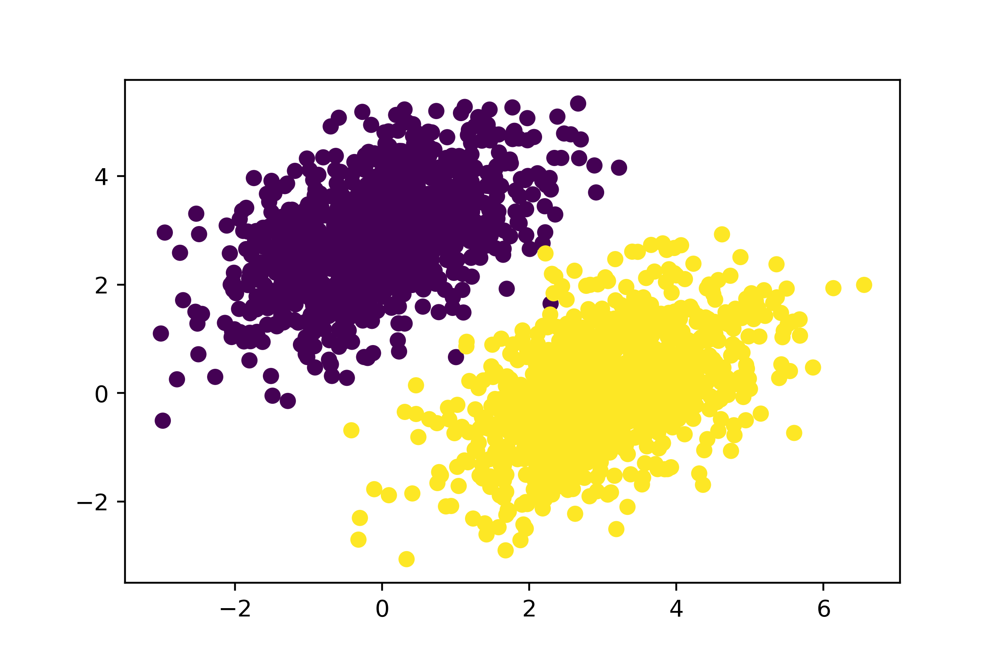
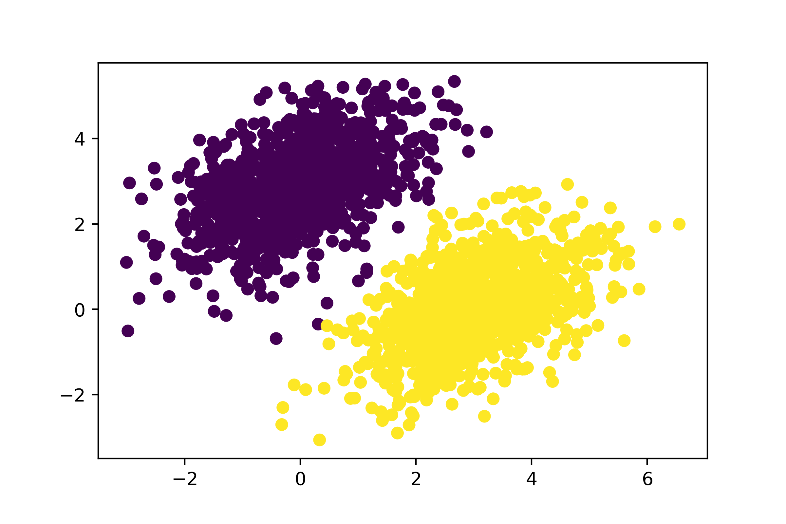
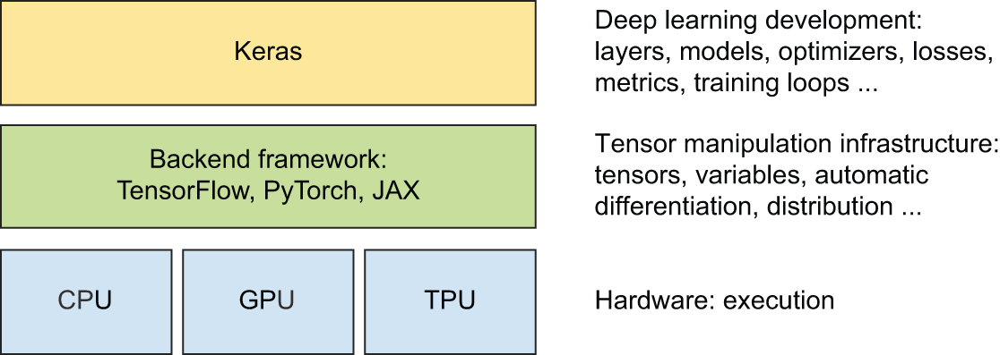
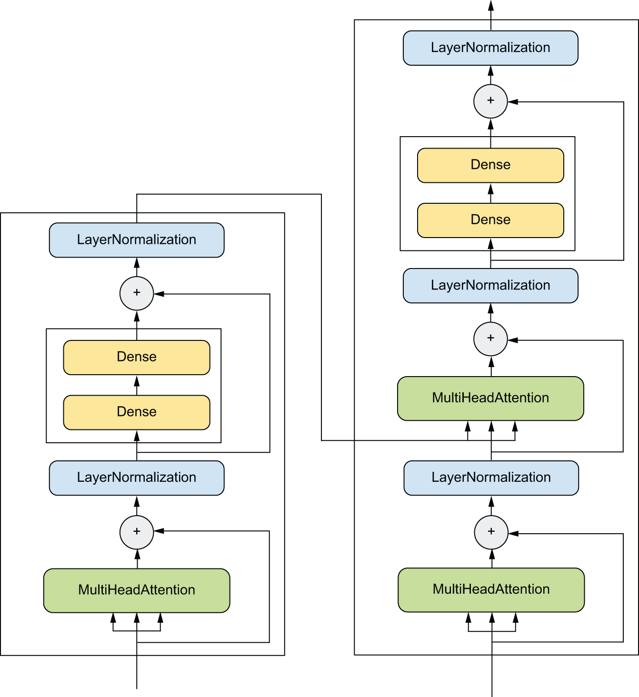

# Chapter 3: Introduction to TensorFlow, PyTorch, JAX, and Keras

This chapter covers

* A closer look at all major deep learning frameworks and their relationships
* An overview of how core deep learning concepts translate to code across
  all frameworks

This chapter is meant to give you everything you need to start doing deep
learning in practice. First, you’ll get familiar with three popular deep learning
frameworks that can be used with Keras:

* TensorFlow (<https://tensorflow.org>)
* PyTorch (<https://pytorch.org/>)
* JAX (<https://jax.readthedocs.io/>)

Then, building on top of the first contact you’ve had with Keras in chapter 2,
we’ll review the core components of neural networks and how they translate
to Keras APIs.

By the end of this chapter, you’ll be ready to move on to practical, real-world
applications — which will start with chapter 4.

## A brief history of deep learning frameworks

In the real world, you’re not going to be writing low-level code from scratch like
we did at the end of chapter 2. Instead, you’re going to use a framework.
Besides Keras, the main deep learning frameworks today are JAX, TensorFlow, and PyTorch.
This book will teach you about all four.

If you’re just getting started with deep learning,
it may seem like all these frameworks have been here forever.
In reality, they’re all quite recent, with Keras being the oldest among the four (launched in March 2015).
The ideas behind these frameworks, however, have a long history —
the first paper about automatic differentiation was published in 1964[[1]](#footnote-1)

All these frameworks combine three key features:

* A way to compute gradients for arbitrary differentiable functions (automatic differentiation)
* A way to run tensor computations on CPUs and GPUs (and possibly even on other specialized deep learning hardware)
* A way to distribute computation across multiple devices or multiple computers, such as multiple GPUs on one computer, or
  even multiple GPUs across multiple separate computers

Together, these three simple features unlock all modern deep learning.

It took a long time for the field to develop robust solutions for all three problems
and package those solutions in a reusable form. Since its inception in the 1960s and until the 2000s,
autodifferentiation had no practical applications in machine learning — folks who worked with neural networks
simply wrote their own gradient logic by hand, usually in a language like C++. Meanwhile, GPU programming was all but impossible.

Things started to slowly change in the late 2000s. First,
Python and its ecosystem were slowly rising in popularity in the scientific community, gaining traction
over MATLAB and C++. Second, NVIDIA released CUDA in 2006, unlocking the possibility of building
neural networks that could run on consumer GPUs. The initial focus on CUDA was on physics simulation
rather than machine learning, but that didn’t stop machine learning researchers from starting to implement
CUDA-based neural networks from 2009 onward. They were typically one-off implementations that ran on a single GPU
without any autodifferentiation.

The first framework to enable autodifferentiation and GPU computation to train deep learning models
was Theano, circa 2009. Theano is the conceptual ancestor of all modern deep learning tools.
It started getting good traction in the machine learning research community in 2013–2014,
after the results of the ImageNet 2012 competition ignited the world’s interest in deep learning.
Around the same time, a few other GPU-enabled deep learning libraries started gaining popularity in the computer vision world —
in particular, Torch 7 (Lua-based) and Caffe (C++-based). Keras launched in early 2015 as a higher-level,
easier-to-use deep learning library powered by Theano, and it quickly gained traction with the few thousands of people who were into deep learning
at the time.

Then in late 2015, Google launched TensorFlow, which took many of the key ideas from Theano and added support for large-scale
distributed computation. The release of TensorFlow was a watershed moment that precipitated deep learning in
the mainstream developer zeitgeist. Keras immediately added support for TensorFlow. By mid-2016, over half of all TensorFlow users
were using it through Keras.

In response to TensorFlow, Meta (named Facebook at the time) launched PyTorch about one year later, taking
ideas from Chainer (a niche but innovative framework launched in mid-2015, now long dead) and NumPy-Autograd, a CPU-only autodifferentiation
library for NumPy released by Maclaurin et al. in 2014. Meanwhile, Google released TPUs as an alternative to GPUs,
alongside XLA, a high-performance compiler developed to enable TensorFlow to run on TPUs.

A few years later, at Google, Matthew Johnson — one of the developers who worked on NumPy-Autograd — released JAX as an alternative
way to use autodifferentiation with XLA. JAX quickly gained traction with researchers thanks to its minimalistic API and
high scalability. Today, Keras, TensorFlow, PyTorch, and JAX are the top frameworks in the deep learning world.

Looking back on this chaotic history, we can ask, What’s next? Will a new framework arise tomorrow?
Will we switch to a new programming language or a new hardware platform?

If you ask me, three things today are certain:

* Python has won. Its machine learning and data science ecosystem simply has too much momentum at this point.
  There won’t be a brand new language to replace it — at least not in the next 15 years.
* We’re in a multiframework world — all four frameworks are well established and are unlikely to go anywhere in the next few years.
  It’s a good idea for you to learn a little bit about each one.
  However, it’s highly possible that *new* frameworks will gain popularity in the future,
  in addition to them; Apple’s recently released MLX could be one such example.
  In this context, using Keras is a considerable advantage: you should be able to run your existing Keras models
  on any new up-and-coming framework via a new Keras backend. Keras will keep providing future-proof stability
  to machine learning developers in the future, like it has since 2015 — back when neither TensorFlow nor PyTorch nor JAX existed.
* New chips may certainly arise in the future, alongside NVIDIA’s GPUs and Google’s TPUs.
  For instance, AMD’s GPU line likely has bright days ahead.
  But any new such chip will have to work with the existing frameworks to gain traction.
  New hardware is unlikely to disrupt your workflows.

## How these frameworks relate to each other

Keras, TensorFlow, PyTorch, and JAX don’t all have the same feature set and aren’t interchangeable.
They have some overlap, but to a large extent, they serve different roles for different use cases.
The biggest difference is between Keras and the three others. Keras is a high-level framework,
while the others are lower level. Imagine building a house. Keras is like a prefabricated building kit:
it provides a streamlined interface for setting up and training neural networks.
In contrast, TensorFlow, PyTorch, and JAX are like the raw materials used in construction.

As you saw in the previous chapters, training a neural network revolves
around the following concepts:

* *First, low-level tensor manipulation* — The infrastructure that underlies
  all modern machine learning. This translates to low-level APIs found in TensorFlow,
  PyTorch[[2]](#footnote-2), and JAX:
  + *Tensors*, including special tensors that store the network’s state (*variables*)
  + *Tensor operations* such as addition, `relu`, or `matmul`
  + *Backpropagation*, a way to compute the gradient of mathematical expressions
* *Second, high-level deep learning concepts* — This translates to Keras APIs:
  + *Layers*, which are combined into a *model*
  + A *loss function*, which defines the feedback signal used for learning
  + An *optimizer*, which determines how learning proceeds
  + *Metrics* to evaluate model performance, such as accuracy
  + A *training loop* that performs mini-batch stochastic gradient descent

Further, Keras is unique in that it isn’t a fully standalone framework. It needs a *backend engine* to run, (see figure 3.4),
much like a prefabricated house-building kit needs to source building materials from somewhere.
TensorFlow, PyTorch, and JAX can all be used as Keras backends.
In addition, Keras can run on NumPy, but since NumPy does not provide an API for gradients,
Keras workflows on NumPy are restricted to making predictions from a model — training is impossible.

Now that you have a clearer understanding of how all these frameworks came to be and how they relate
to each other, let’s dive into what it’s like to work with them. We’ll cover them in chronological order:
TensorFlow first, then PyTorch, and finally JAX.

## Introduction to TensorFlow

TensorFlow is a Python-based open source machine learning framework
developed primarily by Google. Its initial release was in November 2015,
followed by a v1 release in February 2017, and a v2 release in October 2019.
TensorFlow is heavily used in production-grade machine learning applications across the industry.

It’s important to keep in mind that TensorFlow is more than a single library.
It’s really a platform, home to a vast ecosystem of components, some
developed by Google, some developed by third parties. For instance, there’s
TFX for industry-strength machine learning workflow management,
TF-Serving for production deployment,
the TF Optimization Toolkit for model quantization and pruning,
and TFLite and MediaPipe for mobile application deployment.

Together, these components cover a very wide range of use cases,
from cutting-edge research to large-scale production applications.

### First steps with TensorFlow

Over the next paragraphs, you’ll get familiar with all the basics of TensorFlow. We’ll cover the following
key concepts:

* Tensors and variables
* Numerical operations in TensorFlow
* Computing gradients with a `GradientTape`
* Making TensorFlow functions fast by using just-in-time compilation

We’ll then conclude the introduction with an end-to-end example: a pure-TensorFlow
implementation of linear regression.

Let’s get those tensors flowing.

#### Tensors and variables in TensorFlow

To do anything in TensorFlow, we’re going to need some tensors. There are a few
different ways you can create them.

##### Constant tensors

Tensors need to be created with some initial value, so common ways to create
tensors are via `tf.ones` (equivalent to `np.ones`) and `tf.zeros` (equivalent
to `np.zeros`). You can also create a tensor from Python or NumPy values using
`tf.constant`.

```python
>>> import tensorflow as tf
>>> # Equivalent to np.ones(shape=(2, 1))
>>> tf.ones(shape=(2, 1))
tf.Tensor([[1.], [1.]], shape=(2, 1), dtype=float32)
>>> # Equivalent to np.zeros(shape=(2, 1))
>>> tf.zeros(shape=(2, 1))
tf.Tensor([[0.], [0.]], shape=(2, 1), dtype=float32)
>>> # Equivalent to np.array([1, 2, 3], dtype="float32")
>>> tf.constant([1, 2, 3], dtype="float32")
tf.Tensor([1., 2., 3.], shape=(3,), dtype=float32)
```

[Listing 3.1](#listing-3-1): All-ones or all-zeros tensors

##### Random tensors

You can also create tensors filled with random values via
one of the methods of the `tf.random` submodule (equivalent to
the `np.random` submodule).

```python
>>> # Tensor of random values drawn from a normal distribution with
>>> # mean 0 and standard deviation 1. Equivalent to
>>> # np.random.normal(size=(3, 1), loc=0., scale=1.).
>>> x = tf.random.normal(shape=(3, 1), mean=0., stddev=1.)
>>> print(x)
tf.Tensor(
[[-0.14208166]
 [-0.95319825]
 [ 1.1096532 ]], shape=(3, 1), dtype=float32)
>>> # Tensor of random values drawn from a uniform distribution between
>>> # 0 and 1. Equivalent to np.random.uniform(size=(3, 1), low=0.,
>>> # high=1.).
>>> x = tf.random.uniform(shape=(3, 1), minval=0., maxval=1.)
>>> print(x)
tf.Tensor(
[[0.33779848]
 [0.06692922]
 [0.7749394 ]], shape=(3, 1), dtype=float32)
```

[Listing 3.2](#listing-3-2): Random tensors

##### Tensor assignment and the Variable class

A significant difference between NumPy arrays and TensorFlow tensors is that
TensorFlow tensors aren’t assignable: they’re constant. For instance, in
NumPy, you can do the following.

```python
import numpy as np

x = np.ones(shape=(2, 2))
x[0, 0] = 0.0
```

[Listing 3.3](#listing-3-3): NumPy arrays are assignable

Try to do the same thing in TensorFlow: you will get an error,
`EagerTensor object does not support item assignment`.

```python
x = tf.ones(shape=(2, 2))
# This will fail, as a tensor isn't assignable.
x[0, 0] = 0.0
```

[Listing 3.4](#listing-3-4): TensorFlow tensors are not assignable

To train a model, we’ll need to update its state, which is a set of tensors.
If tensors aren’t assignable, how do we do it, then?
That’s where variables come in. `tf.Variable` is the
class meant to manage modifiable state in TensorFlow.

To create a variable, you need to provide some initial value, such as a random
tensor.

```python
>>> v = tf.Variable(initial_value=tf.random.normal(shape=(3, 1)))
>>> print(v)
array([[-0.75133973],
       [-0.4872893 ],
       [ 1.6626885 ]], dtype=float32)>
```

[Listing 3.5](#listing-3-5): Creating a `tf.Variable`

The state of a variable can be modified via its `assign` method.

```python
>>> v.assign(tf.ones((3, 1)))
array([[1.],
       [1.],
       [1.]], dtype=float32)>
```

[Listing 3.6](#listing-3-6): Assigning a value to a `Variable`

Assignment also works for a subset of the coefficients.

```python
>>> v[0, 0].assign(3.)
array([[3.],
       [1.],
       [1.]], dtype=float32)>
```

[Listing 3.7](#listing-3-7): Assigning a value to a subset of a `Variable`

Similarly, `assign_add` and `assign_sub` are efficient equivalents of
`+=` and `-=`.

```python
>>> v.assign_add(tf.ones((3, 1)))
array([[2.],
       [2.],
       [2.]], dtype=float32)>
```

[Listing 3.8](#listing-3-8): Using `assign_add`

#### Tensor operations: Doing math in TensorFlow

Just like NumPy, TensorFlow offers a large collection of tensor operations
to express mathematical formulas. Here are a few examples.

```python
a = tf.ones((2, 2))
# Takes the square, same as np.square
b = tf.square(a)
# Takes the square root, same as np.sqrt
c = tf.sqrt(a)
# Adds two tensors (element-wise)
d = b + c
# Takes the product of two tensors (see chapter 2), same as np.matmul
e = tf.matmul(a, b)
# Concatenates a and b along axis 0, same as np.concatenate
f = tf.concat((a, b), axis=0)
```

[Listing 3.9](#listing-3-9): A few basic math operations in TensorFlow

Here’s an equivalent of the `Dense` layer we saw in chapter 2:

```python
def dense(inputs, W, b):
    return tf.nn.relu(tf.matmul(inputs, W) + b)
```

#### Gradients in TensorFlow: A second look at the GradientTape API

So far, TensorFlow seems to look a lot like NumPy. But here’s something NumPy
can’t do: retrieve the gradient of any differentiable expression with respect
to any of its inputs. Just open a `GradientTape` scope, apply some computation
to one or several input tensors, and retrieve the gradient of the result with
respect to the inputs.

```python
input_var = tf.Variable(initial_value=3.0)
with tf.GradientTape() as tape:
    result = tf.square(input_var)
gradient = tape.gradient(result, input_var)
```

[Listing 3.10](#listing-3-10): Using the `GradientTape`

This is most commonly used to retrieve the gradients of the loss of a model
with respect to its weights: `gradients = tape.gradient(loss, weights)`.

In chapter 2, you saw how the `GradientTape` works on either a single
input or a list of inputs and how inputs could be either scalars
or high-dimensional tensors.

So far, you’ve only seen the case where the input tensors in `tape.gradient()`
were TensorFlow variables. It’s actually possible for these inputs
to be any arbitrary tensor. However, only *trainable variables* are being tracked
by default.
With a constant tensor, you’d have to manually mark it as being tracked,
by calling `tape.watch()` on it.

```python
input_const = tf.constant(3.0)
with tf.GradientTape() as tape:
    tape.watch(input_const)
    result = tf.square(input_const)
gradient = tape.gradient(result, input_const)
```

[Listing 3.11](#listing-3-11): Using the `GradientTape` with constant tensor inputs

Why? Because it would be too expensive to preemptively store
the information required to compute the gradient of anything with respect
to anything. To avoid wasting resources, the tape needs to know what to watch.
Trainable variables are watched by default because computing the gradient
of a loss with regard to a list of trainable variables is the most common use
case of the gradient tape.

The gradient tape is a powerful utility, even capable of computing
*second-order gradients* — that is, the gradient of a gradient.
For instance, the gradient of the position of an object with
regard to time is the speed of that object, and the second-order gradient
is its acceleration.

If you measure the position of a falling apple along a vertical axis over time,
and find that it verifies `position(time) = 4.9 * time ** 2`,
what is its acceleration? Let’s use two nested gradient tapes to find out.

```python
time = tf.Variable(0.0)
with tf.GradientTape() as outer_tape:
    with tf.GradientTape() as inner_tape:
        position = 4.9 * time**2
    speed = inner_tape.gradient(position, time)
# We use the outer tape to compute the gradient of the gradient from
# the inner tape. Naturally, the answer is 4.9 * 2 = 9.8.
acceleration = outer_tape.gradient(speed, time)
```

[Listing 3.12](#listing-3-12): Using nested gradient tapes to compute second-order gradients

#### Making TensorFlow functions fast using compilation

All the TensorFlow code you’ve written so far has been executing “eagerly.”
This means operations are executed one after the other in the Python runtime,
much like any Python code or NumPy code. Eager execution is great for debugging,
but it is typically quite slow. It can often be beneficial
to parallelize some computation, or “fuse” operations — replacing two consecutive operations,
like `matmul` followed by `relu`, with a single, more efficient operation that does the same
thing without materializing the intermediate output.

This can be achieved via *compilation*. The general idea of compilation is to take
certain functions you’ve written in Python, lift them out of Python, automatically rewrite
them into a faster and more efficient “compiled program,” and then call that program from the Python
runtime.

The main benefit of compilation is improved performance. There’s a drawback too: the code you write is no longer
the code that gets executed, which can make the debugging experience painful. Only turn on compilation after you’ve already debugged your code
in the Python runtime.

You can apply compilation to any TensorFlow function by wrapping it in a `tf.function` decorator, like this:

```python
@tf.function
def dense(inputs, W, b):
    return tf.nn.relu(tf.matmul(inputs, W) + b)
```

When you do this, any call to `dense()` is replaced with a call to a compiled program that implements
a more optimized version of the function. The first call to the function will take a bit longer, because TensorFlow
will be compiling your code. This only happens once — all subsequent calls to the same function will be fast.

TensorFlow has two compilation modes:

* First, the default one, which we refer to as “graph mode.” Any function
  decorated with `@tf.function` runs in graph mode.
* Second, compilation with XLA, a high-performance compiler for ML (it’s short
  for Accelerated Linear Algebra). You can turn it on by specifying
  `jit_compile=True`, like this:

```python
@tf.function(jit_compile=True)
def dense(inputs, W, b):
    return tf.nn.relu(tf.matmul(inputs, W) + b)
```

It is often the case that compiling a function with XLA will make it run faster than graph mode — though it takes more time to execute the function
the first time, since the compiler has more work to do.

### An end-to-end example: A linear classifier in pure TensorFlow

You know about tensors, variables, and tensor operations, and you know how to
compute gradients. That’s enough to build any TensorFlow-based machine learning model based
on gradient descent. Let’s walk through an end-to-end example to make sure everything is
crystal clear.

In a machine learning job interview, you may be asked to implement a linear
classifier from scratch: a very simple task
that serves as a filter between candidates who have some minimal machine
learning background, and those who don’t. Let’s get you past that filter,
and use your newfound knowledge of TensorFlow to implement such
a linear classifier.

First, let’s come up with some nicely linearly separable
synthetic data to work with: two classes of points in a 2D plane.

```python
import numpy as np

num_samples_per_class = 1000
negative_samples = np.random.multivariate_normal(
    # Generates the first class of points: 1,000 random 2D points with
    # specified "mean" and "covariance matrix." Intuitively, the
    # "covariance matrix" describes the shape of the point cloud, and
    # the "mean" describes its position in the plane. `cov=[[1,
    # 0.5],[0.5, 1]]` corresponds to "an oval-like point cloud oriented
    # from bottom left to top right."
    mean=[0, 3], cov=[[1, 0.5], [0.5, 1]], size=num_samples_per_class
)
positive_samples = np.random.multivariate_normal(
    # Generates the other class of points with a different mean and the
    # same covariance matrix (point cloud with a different position and
    # the same shape)
    mean=[3, 0], cov=[[1, 0.5], [0.5, 1]], size=num_samples_per_class
)
```

[Listing 3.13](#listing-3-13): Generating two classes of random points in a 2D plane

`negative_samples` and `positive_samples` are both arrays with shape `(1000, 2)`.
Let’s stack them into a single array with shape `(2000, 2)`.

```python
inputs = np.vstack((negative_samples, positive_samples)).astype(np.float32)
```

[Listing 3.14](#listing-3-14): Stacking the two classes into an array with shape `(2000, 2)`

Let’s generate the corresponding target labels, an array of 0s and 1s of
shape `(2000, 1)`, where `targets[i, 0]` is 0 if `inputs[i]` belongs to class 0
(and inversely).

```python
targets = np.vstack(
    (
        np.zeros((num_samples_per_class, 1), dtype="float32"),
        np.ones((num_samples_per_class, 1), dtype="float32"),
    )
)
```

[Listing 3.15](#listing-3-15): Generating the corresponding targets (0 and 1)

Let’s plot our data with Matplotlib, a well-known Python data visualization
library (it comes preinstalled in Colab, so no need for you to install it
yourself), as shown in figure 3.1.

```python
import matplotlib.pyplot as plt

plt.scatter(inputs[:, 0], inputs[:, 1], c=targets[:, 0])
plt.show()
```

[Listing 3.16](#listing-3-16): Plotting the two point classes





[Figure 3.1](#figure-3-1): Our synthetic data: two classes of random points in the 2D plane

Now, let’s create a linear classifier that can learn to separate these two blobs.
A linear classifier is an affine transformation (`prediction = matmul(input, W) + b`)
trained to minimize the square of the difference between predictions
and the targets.

As you’ll see, it’s actually a much simpler example
than the end-to-end example of a toy two-layer neural network from
the end of chapter 2. However, this time,
you should be able to understand everything about the code, line by line.

Let’s create our variables `W` and `b`, initialized with
random values and with zeros, respectively.

```python
# The inputs will be 2D points.
input_dim = 2
# The output predictions will be a single score per sample (close to 0
# if the sample is predicted to be in class 0, and close to 1 if the
# sample is predicted to be in class 1).
output_dim = 1
W = tf.Variable(initial_value=tf.random.uniform(shape=(input_dim, output_dim)))
b = tf.Variable(initial_value=tf.zeros(shape=(output_dim,)))
```

[Listing 3.17](#listing-3-17): Creating the linear classifier variables

Here’s our forward pass function.

```python
def model(inputs, W, b):
    return tf.matmul(inputs, W) + b
```

[Listing 3.18](#listing-3-18): The forward pass function

Because our linear classifier operates on 2D inputs, `W` is really just two
scalar coefficients: `W = [[w1], [w2]]`.
Meanwhile, `b` is a single scalar coefficient. As such, for given input point
`[x, y]`, its prediction value is
`prediction = [[w1], [w2]] • [x, y] + b = w1 * x + w2 * y + b`.

Here’s our loss function.

```python
def mean_squared_error(targets, predictions):
    # per_sample_losses will be a tensor with the same shape as targets
    # and predictions, containing per-sample loss scores.
    per_sample_losses = tf.square(targets - predictions)
    # We need to average these per-sample loss scores into a single
    # scalar loss value: reduce_mean does this.
    return tf.reduce_mean(per_sample_losses)
```

[Listing 3.19](#listing-3-19): The mean squared error loss function

Now, we move to the training step, which receives some training data and updates the
weights `W` and `b` to minimize the loss on the data.

```python
learning_rate = 0.1

# Wraps the function in a tf.function decorator to speed it up
@tf.function(jit_compile=True)
def training_step(inputs, targets, W, b):
    # Forward pass, inside of a gradient tape scope
    with tf.GradientTape() as tape:
        predictions = model(inputs, W, b)
        loss = mean_squared_error(predictions, targets)
    # Retrieves the gradient of the loss with regard to weights
    grad_loss_wrt_W, grad_loss_wrt_b = tape.gradient(loss, [W, b])
    # Updates the weights
    W.assign_sub(grad_loss_wrt_W * learning_rate)
    b.assign_sub(grad_loss_wrt_b * learning_rate)
    return loss
```

[Listing 3.20](#listing-3-20): The training-step function

For simplicity, we’ll do *batch training* instead of *mini-batch training*:
we’ll run each training step (gradient computation and weight update) on the
entire data, rather than iterate over the data in small batches. On one hand,
this means that each training step will take much longer to run, since we
compute the forward pass and the gradients for 2,000 samples at once.
On the other hand, each gradient update will be much more effective at reducing
the loss on the training data, since it will encompass information from all
training samples instead of, say, only 128 random samples.
As a result, we will need many fewer steps of training, and we should use
a larger learning rate than what we would typically use for mini-batch training
(we’ll use `learning_rate = 0.1`, as previously defined).

```python
for step in range(40):
    loss = training_step(inputs, targets, W, b)
    print(f"Loss at step {step}: {loss:.4f}")
```

[Listing 3.21](#listing-3-21): The batch training loop

After 40 steps, the training loss seems to have stabilized around 0.025.
Let’s plot how our linear model classifies the training data points, as shown in figure 3.2.
Because our targets are 0s and 1s, a given input point
will be classified as “0” if its prediction value is below 0.5,
and as “1” if it is above 0.5:

```python
predictions = model(inputs, W, b)
plt.scatter(inputs[:, 0], inputs[:, 1], c=predictions[:, 0] > 0.5)
plt.show()
```





[Figure 3.2](#figure-3-2): Our model’s predictions on the training inputs: pretty similar to the training targets

Recall that the prediction value for a given point `[x, y]` is simply
`prediction == [[w1], [w2]] • [x, y] + b == w1 * x + w2 * y + b`.
Thus, class “0” is defined as
`w1 * x + w2 * y + b < 0.5` and class “1” is defined as
`w1 * x + w2 * y + b > 0.5`. You’ll notice that what you’re looking at is
really the equation of a line in the 2D plane: `w1 * x + w2 * y + b = 0.5`.
Class 1 is above the line; class 0 is below the line.
You may be used to seeing line equations in the format `y = a * x + b`; in the same
format, our line becomes `y = - w1 / w2 * x + (0.5 - b) / w2`.

Let’s plot this line, as shown in figure 3.3:

```python
# Generates 100 regularly spaced numbers between -1 and 4, which we
# will use to plot our line
x = np.linspace(-1, 4, 100)
# This is our line's equation.
y = -W[0] / W[1] * x + (0.5 - b) / W[1]
# Plots our line (`"-r"` means "plot it as a red line")
plt.plot(x, y, "-r")
# Plots our model's predictions on the same plot
plt.scatter(inputs[:, 0], inputs[:, 1], c=predictions[:, 0] > 0.5)
```


[Figure 3.3](#figure-3-3): Our model, visualized as a line

This is really what a linear classifier is all about: finding the parameters
of a line (or, in higher-dimensional spaces, a hyperplane) neatly separating
two classes of data.

### What makes the TensorFlow approach unique

You’re now familiar with all the basic APIs that underlie TensorFlow-based workflows,
and you’re about to dive into more frameworks — in particular, PyTorch and JAX. What makes
working with TensorFlow different from working with any other framework? When should you use TensorFlow,
and when could you use something else?

If you ask us, here are the main benefits of TensorFlow:

* Thanks to graph mode and XLA compilation, it’s fast. It’s usually significantly faster than PyTorch and NumPy, though JAX is often even faster.
* It is extremely feature complete. Unique among all frameworks, it has support for string tensors as well as “ragged tensors” (tensors where different entries
  may have different dimensions — very useful for handling sequences without requiring to pad them to a shared length). It also has outstanding support for data
  preprocessing, via the highly performant `tf.data` API. `tf.data` is so good that even JAX recommends it for data preprocessing.
  Whatever you need to do, TensorFlow has a solution for it.
* Its ecosystem for production deployment is the most mature among all frameworks, especially when it comes to deploying on mobile or in the browser.

However, TensorFlow also has some noticeable flaws:

* It has a sprawling API — the flipside of being very feature complete. TensorFlow includes thousands of different operations.
* Its numerical API is occasionally inconsistent with the NumPy API, making it a bit harder to approach if you’re already familiar with NumPy.
* The popular pretrained model-sharing platform Hugging Face has less support for TensorFlow, which means that
  the latest generative AI models may not always be available in TensorFlow.

Now, let’s move on to PyTorch.

## Introduction to PyTorch

PyTorch is a Python-based open source machine learning framework developed primarily by Meta (formerly Facebook)
It was originally released in September 2016 (as a response to the release of TensorFlow),
with its 1.0 version launched in 2018, and its 2.0 version launched in 2023.
PyTorch inherits its programming style from the now-defunct Chainer framework, which was itself inspired by NumPy-Autograd.
PyTorch is used extensively in the machine learning research community.

Like TensorFlow, PyTorch is at the center of a large ecosystem of related packages, such as `torchvision`, `torchaudio`,
or the popular model-sharing platform Hugging Face.

The PyTorch API is higher level than that of TensorFlow and JAX: it includes layers and optimizers, like Keras.
These layers and optimizers are compatible with Keras workflows when you use Keras with the PyTorch backend.

### First steps with PyTorch

Over the next paragraphs, you’ll get familiar with all the basics of PyTorch. We’ll cover the following
key concepts:

* Tensors and parameters
* Numerical operations in PyTorch
* Computing gradients with the `backward()` method
* Packaging computation with the `Module` class
* Speeding up PyTorch by using compilation

We’ll conclude the introduction by reimplementing our linear regression end-to-end example in pure PyTorch.

#### Tensors and parameters in PyTorch

A first gotcha about PyTorch is that the package isn’t named `pytorch`. It’s actually named `torch`.
You’d install it via `pip install torch` and you’d import it via `import torch`.

Like in NumPy and TensorFlow, the object at the heart of the framework is the tensor. First, let’s get our hands on some PyTorch tensors.

##### Constant tensors

Here are some constant tensors.

```python
>>> import torch
>>> # Unlike in other frameworks, the shape argument is named "size"
>>> # rather than "shape."
>>> torch.ones(size=(2, 1))
tensor([[1.], [1.]])
>>> torch.zeros(size=(2, 1))
tensor([[0.], [0.]])
>>> # Unlike in other frameworks, you cannot pass dtype="float32" as a
>>> # string. The dtype argument must be a torch dtype instance.
>>> torch.tensor([1, 2, 3], dtype=torch.float32)
tensor([1., 2., 3.])
```

[Listing 3.22](#listing-3-22): All-ones or all-zeros tensors

##### Random tensors

Random tensor creation is similar to NumPy and TensorFlow, but with divergent syntax.
Consider the function `normal`: it doesn’t take a shape argument. Instead,
the mean and standard deviation should be provided as PyTorch tensors with the expected output shape.

```python
>>> # Equivalent to tf.random.normal(shape=(3, 1), mean=0., stddev=1.)
>>> torch.normal(
... mean=torch.zeros(size=(3, 1)),
... std=torch.ones(size=(3, 1)))
tensor([[-0.9613],
        [-2.0169],
        [ 0.2088]])
```

[Listing 3.23](#listing-3-23): Random tensors

As for creating a random uniform tensor, you’d do that via `torch.rand`. Unlike `np.random.uniform` or `tf.random.uniform`,
the output shape should be provided as independent arguments for each dimension, like this:

```python
>>> # Equivalent to tf.random.uniform(shape=(3, 1), minval=0.,
>>> # maxval=1.)
>>> torch.rand(3, 1)
```

##### Tensor assignment and the Parameter class

Like NumPy arrays, but unlike TensorFlow tensors, PyTorch tensors are assignable. You can do operations like this:

```python
>>> x = torch.zeros(size=(2, 1))
>>> x[0, 0] = 1.
>>> x
tensor([[1.],
        [0.]])
```

While you can just use a regular `torch.Tensor` to store the trainable state of a model,
PyTorch does provide a specialized tensor subclass for that purpose, the `torch.nn.parameter.Parameter` class.
Compared to a regular tensor, it provides semantic clarity — if you see a `Parameter`, you’ll know it’s a piece of trainable state, whereas a `Tensor`
could be anything. As a result, it enables PyTorch to automatically track and retrieve the `Parameters` you assign
to PyTorch models — similar to what Keras does with Keras `Variable` instances.

Here’s a `Parameter`.

```python
>>> x = torch.zeros(size=(2, 1))
>>> # A Parameter can only be created using a torch.Tensor value — no
>>> # NumPy arrays allowed.
>>> p = torch.nn.parameter.Parameter(data=x)
```

[Listing 3.24](#listing-3-24): Creating a PyTorch parameter

#### Tensor operations: Doing math in PyTorch

Math in PyTorch works just the same as math in NumPy or TensorFlow, although much like TensorFlow,
the PyTorch API often diverges in subtle ways from the NumPy API.

```python
a = torch.ones((2, 2))
# Takes the square, same as np.square
b = torch.square(a)
# Takes the square root, same as np.sqrt
c = torch.sqrt(a)
# Adds two tensors (element-wise)
d = b + c
# Takes the product of two tensors (see chapter 2), same as np.matmul
e = torch.matmul(a, b)
# Concatenates a and b along axis 0, same as np.concatenate
f = torch.cat((a, b), dim=0)
```

[Listing 3.25](#listing-3-25): A few basic math operations in PyTorch

Here’s a dense layer:

```python
def dense(inputs, W, b):
    return torch.nn.relu(torch.matmul(inputs, W) + b)
```

#### Computing gradients with PyTorch

There’s no explicit “gradient tape” in PyTorch. A similar mechanism does
exist: when you run any computation in PyTorch, the framework creates a one-time
computation graph (a “tape”) that records what just happened.
However, that tape is hidden from the user. The public API for using it
is at the level of tensors themselves: you can call
`tensor.backward()` to run backpropagation through all operations previously executed
that led to that tensor. Doing this will populate the `.grad` attribute of
all tensors that are tracking gradients.

```python
>>> # To compute gradients with respect to a tensor, it must be created
>>> # with requires_grad=True.
>>> input_var = torch.tensor(3.0, requires_grad=True)
>>> result = torch.square(input_var)
>>> # Calling backward() populates the "grad" attribute on all tensors
>>> # create with requires_grad=True.
>>> result.backward()
>>> gradient = input_var.grad
>>> gradient
tensor(6.)
```

[Listing 3.26](#listing-3-26): Computing a gradient with `.backward()`

If you call `backward()` multiple times in a row, the `.grad` attribute will “accumulate” gradients: each
new call will sum the new gradient with the preexisting one. For instance, in the following code,
`input_var.grad` is not the gradient of `square(input_var)` with respect to `input_var`; rather, it is the sum
of that gradient and the previously computed gradient — its value has doubled since our last code snippet:

```python
>>> result = torch.square(input_var)
>>> result.backward()
>>> # .grad will sum all gradient values from each time backward() is
>>> # called.
>>> input_var.grad
tensor(12.)
```

To reset gradients, you can just set `.grad` to `None`:

```python
>>> input_var.grad = None
```

Now let’s put this into practice!

### An end-to-end example: A linear classifier in pure PyTorch

You now know enough to rewrite our linear classifier in PyTorch. It will stay very similar to the TensorFlow one — the only major difference is how we compute the gradients.

Let’s start by creating our model variables. Don’t forget to pass `requires_grad=True` so we can compute gradients with respect to them:

```python
input_dim = 2
output_dim = 1

W = torch.rand(input_dim, output_dim, requires_grad=True)
b = torch.zeros(output_dim, requires_grad=True)
```

This is our model — no difference so far. We just went from `tf.matmul` to `torch.matmul`:

```python
def model(inputs, W, b):
    return torch.matmul(inputs, W) + b
```

This is our loss function. We just switch from `tf.square` to `torch.square` and from `tf.reduce_mean` to `torch.mean`:

```python
def mean_squared_error(targets, predictions):
    per_sample_losses = torch.square(targets - predictions)
    return torch.mean(per_sample_losses)
```

Now for the training step. Here’s how it works:

1. `loss.backward()` runs backpropagation starting from the `loss` output node and populates
   the `tensor.grad` attribute on all tensors that were involved in the computation of `loss`.
   `tensor.grad` represents the gradient of the loss with regard to that tensor.
2. We use the `.grad` attribute to recover the gradients of the loss with regard to `W` and `b`.
3. We update `W` and `b` using those gradients. Because these updates are not intended to be
   part of the backward pass, we do them inside a `torch.no_grad()` scope, which skips gradient
   computation for everything inside it.
4. We reset the contents of the `.grad` property of our `W` and `b` parameters, by setting it to `None`.
   If we didn’t do this, gradient values would accumulate across multiple calls to `training_step()`,
   resulting in invalid values:

```python
learning_rate = 0.1

def training_step(inputs, targets, W, b):
    # Forward pass
    predictions = model(inputs)
    loss = mean_squared_error(targets, predictions)
    # Computes gradients
    loss.backward()
    # Retrieves gradients
    grad_loss_wrt_W, grad_loss_wrt_b = W.grad, b.grad
    with torch.no_grad():
        # Updates weights inside a no_grad scope
        W -= grad_loss_wrt_W * learning_rate
        b -= grad_loss_wrt_b * learning_rate
    # Resets gradients
    W.grad = None
    b.grad = None
    return loss
```

This could be made even simpler — let’s see how.

#### Packaging state and computation with the Module class

PyTorch also has a higher-level, object-oriented API for performing backpropagation, which requires
relying on two new classes: the `torch.nn.Module` class and an optimizer class from
the `torch.optim` module, such as `torch.optim.SGD` (the equivalent of `keras.optimizers.SGD`).

The general idea is to define a subclass of `torch.nn.Module`, which will

* Hold some `Parameters`, to store state variables. Those are defined in the `__init__()` method.
* Implement the forward pass computation in the `forward()` method.

It should look just like the following.

```python
class LinearModel(torch.nn.Module):
    def __init__(self):
        super().__init__()
        self.W = torch.nn.Parameter(torch.rand(input_dim, output_dim))
        self.b = torch.nn.Parameter(torch.zeros(output_dim))

    def forward(self, inputs):
        return torch.matmul(inputs, self.W) + self.b
```

[Listing 3.27](#listing-3-27): Defining a `torch.nn.Module`

We can now instantiate our `LinearModel`:

```python
model = LinearModel()
```

When using an instance of `torch.nn.Module`, rather than calling the `forward()`
method directly, you’d use `__call__()` (i.e., directly call the model class on
inputs), which redirects to `forward()` but adds a few framework hooks to it:

```python
torch_inputs = torch.tensor(inputs)
output = model(torch_inputs)
```

Now, let’s get our hands on a PyTorch optimizer. To instantiate it, you will
need to provide the list of parameters that the optimizer is intended to update.
You can retrieve it from our `Module` instance via `.parameters()`:

```python
optimizer = torch.optim.SGD(model.parameters(), lr=learning_rate)
```

Using our `Module` instance and the PyTorch `SGD` optimizer, we can run a simplified training step:

```python
def training_step(inputs, targets):
    predictions = model(inputs)
    loss = mean_squared_error(targets, predictions)
    loss.backward()
    optimizer.step()
    model.zero_grad()
    return loss
```

Previously, updating the model parameters looked like this:

```python
with torch.no_grad():
    W -= grad_loss_wrt_W * learning_rate
    b -= grad_loss_wrt_b * learning_rate
```

Now we can just do `optimizer.step()`.

Similarly, previously we needed to reset parameter gradients by hand by doing `tensor.grad = None` on each one.
Now we can just do `model.zero_grad()`.

Overall, this may feel a bit confusing — somehow the loss tensor, the optimizer, and the `Module` instance
all seem to be aware of each other through some hidden background mechanism.
They’re all interacting with one another via spooky action at a distance. Don’t worry though — you
can just treat this sequence of steps (`loss.backward()` - `optimizer.step()` - `model.zero_grad()`)
as a magic incantation to be recited any time you need to write a training step function. Just make sure not to forget
`model.zero_grad()`. That would be a major bug (and it is unfortunately quite common)!

#### Making PyTorch modules fast using compilation

One last thing. Similarly to how TensorFlow lets you compile functions for better performance, PyTorch lets
you compile functions or even `Module` instances via the `torch.compile()` utility.
This API uses PyTorch’s very own compiler, named Dynamo.

Let’s try it on our linear regression `Module`:

```python
compiled_model = torch.compile(model)
```

The resulting object is intended to work identically to the original — except the forward and backward pass should run faster.

You can also use `torch.compile()` as a function decorator:

```python
@torch.compile
def dense(inputs, W, b):
    return torch.nn.relu(torch.matmul(inputs, W) + b)
```

In practice, most PyTorch code out there does not use compilation and simply runs eagerly,
as the compiler may not always work with all models and may not always result in a speedup when it does work. Unlike in TensorFlow and
Jax where compilation was built in from the inception of the library, PyTorch’s compiler is a relatively recent addition.

### What makes the PyTorch approach unique

Compared to TensorFlow and JAX, which we will cover next, what makes PyTorch
stand out? Why should you use it or not use it?

Here are PyTorch’s two key strengths:

* PyTorch code executes eagerly by default, making it easy to debug.
  Note that this is also the case for TensorFlow code and JAX code, but a big difference is that PyTorch is generally intended to be
  run eagerly at all times, whereas any serious TensorFlow or JAX project will inevitably need compilation at some point, which can significantly hurt the debugging experience.
* The popular pretrained model-sharing platform Hugging Face has first-class support for PyTorch, which
  means that any model you’d like to use is likely available in PyTorch.
  This is the primary drive behind PyTorch adoption today.

Meanwhile, there are also some downsides to using PyTorch:

* Like with TensorFlow, the PyTorch API is inconsistent with NumPy. Further, it’s also internally inconsistent. For instance, the commonly used keyword `axis` is occasionally named `dim` instead, depending on the function.
  Some pseudo-random number generation operations take a `seed` argument; others don’t. And so on.
  This can make PyTorch frustrating to learn, especially when coming from NumPy.
* Due to its focus on eager execution, PyTorch is quite slow — it’s the slowest
  of all the major frameworks by a large margin. For most models, you may see a 20% or 30% speedup with JAX.
  For some models — especially large ones — you may even see a 3× or a 5× speedup with JAX, even after using `torch.compile()`.
* While it is possible to make PyTorch code faster via `torch.compile()`, the PyTorch Dynamo compiler
  remains at this time (in 2025) quite ineffective and full of trapdoors. As a result, only a very small percentage of the
  PyTorch user base uses compilation. Perhaps this will be improved in future versions!

## Introduction to JAX

JAX is an open source library for differentiable computation, primarily developed by Google.
After its release in 2018, JAX quickly gained traction in the research community, particularly for its ability to use Google’s TPUs at scale.
Today, JAX is in use by most of the top players in the generative AI space — companies like DeepMind, Apple, Midjourney, Anthropic, Cohere, and so on.

JAX embraces a *stateless* approach to computation, meaning that functions in JAX do not maintain any persistent state. This contrasts with traditional imperative programming, where variables can hold values between function calls.

The stateless nature of JAX functions has several advantages. In particular, it enables effective automatic parallelization and distributed computation, as functions can be executed independently without the need for synchronization. The extreme scalability of JAX is essential for handling the very large-scale machine learning problems faced by companies like Google and DeepMind.

### First steps with JAX

We’ll go over the following key concepts:

* The `array` class
* Random operations in JAX
* Numerical operations in JAX
* Computing gradients via `jax.grad` and `jax.value_and_grad`
* Making JAX functions fast by leveraging just-in-time compilation

Let’s get started.

### Tensors in JAX

One of the best features of JAX is that it doesn’t try to implement its own independent, similar-to-NumPy-but-slightly-divergent
numerical API. Instead, it just implements the NumPy API, as is. It is available as the `jax.numpy` namespace, and you
will often see it imported as `jnp` for short.

Here are some JAX arrays.

```python
>>> from jax import numpy as jnp
>>> jnp.ones(shape=(2, 1))
Array([[1.],
       [1.]], dtype=float32)
>>> jnp.zeros(shape=(2, 1))
Array([[0.],
       [0.]], dtype=float32)
>>> jnp.array([1, 2, 3], dtype="float32")
Array([1., 2., 3.], dtype=float32)
```

[Listing 3.28](#listing-3-28): All-ones or all-zeros tensors

There are, however, two minor differences between `jax.numpy` and the actual NumPy API: random number generation and array assignment. Let’s take a look.

### Random number generation in JAX

The first difference between JAX and NumPy has to do with the way JAX handles random operations — what is known as “PRNG” (Pseudo-Random Number Generation) operations.
We said earlier that JAX is *stateless*, which implies that JAX code can’t rely on any hidden global state. Consider the following NumPy code.

```python
>>> np.random.normal(size=(3,))
array([-1.68856166,  0.16489586,  0.67707523])
>>> np.random.normal(size=(3,))
array([-0.73671259,  0.3053194 ,  0.84124895])
```

[Listing 3.29](#listing-3-29): Random tensors

How did the second call to `np.random.normal()` know to return a different value from the first call? That’s right — it’s a hidden piece of global state.
You can actually retrieve that global state via `np.random.get_state()` and set it via `np.random.seed(seed)`.

In a stateless framework, we can’t have any such global state. The same API call must always return the same value. As a result, in a stateless version of NumPy, you would have to rely on passing different seed arguments to your `np.random` calls to get different values.

Now, it’s often the case that your PRNG calls are going to be in functions that get called multiple times and that are intended to use different random values each time. If you don’t want to rely on any global state, this requires you to manage your seed state outside of the target function, like this:

```python
def apply_noise(x, seed):
    np.random.seed(seed)
    x = x * np.random.normal((3,))
    return x

seed = 1337
y = apply_noise(x, seed)
seed += 1
z = apply_noise(x, seed)
```

It’s basically the same in JAX. However, JAX doesn’t use integer seeds. It uses
special array structures called *keys*. You can create one from an integer value, like this:

```python
import jax

seed_key = jax.random.key(1337)
```

To force you to always provide a seed “key” to PRNG calls, all JAX PRNG-using operations take `key` (the random seed) as their first positional argument. Here’s how to use `random.normal()`:

```python
>>> seed_key = jax.random.key(0)
>>> jax.random.normal(seed_key, shape=(3,))
Array([ 1.8160863 , -0.48262316,  0.33988908], dtype=float32)
```

Two calls to `random.normal()` that receive the same seed key will always return the same value.

```python
>>> seed_key = jax.random.key(123)
>>> jax.random.normal(seed_key, shape=(3,))
Array([-0.1470326,  0.5524756,  1.648498 ], dtype=float32)
>>> jax.random.normal(seed_key, shape=(3,))
Array([-0.1470326,  0.5524756,  1.648498 ], dtype=float32)
```

[Listing 3.30](#listing-3-30): Using a random seed in Jax

If you need a new seed key, you can simply create a new one from an existing one using the `jax.random.split()` function. It is deterministic, so the same sequence of splits will always result in the same final seed key:

```python
>>> seed_key = jax.random.key(123)
>>> jax.random.normal(seed_key, shape=(3,))
Array([-0.1470326,  0.5524756,  1.648498 ], dtype=float32)
>>> # You could even split your key into multiple new keys at once!
>>> new_seed_key = jax.random.split(seed_key, num=1)[0]
>>> jax.random.normal(new_seed_key, shape=(3,))
Array([ 0.5362355, -1.1920372,  2.450225 ], dtype=float32)
```

This is definitely more work than `np.random`! But the benefits of statelessness far outweigh the costs: it makes your code *vectorizable* (i.e., the JAX compiler can automatically turn it into highly parallel code) while maintaining determinism (i.e., you can run the same code twice with the same results). That is impossible to achieve with a global PRNG state.

#### Tensor assignment

The second difference between JAX and NumPy is tensor assignment.
Like in TensorFlow, JAX arrays are not assignable in place. That’s because any sort of in-place modification would go against JAX’s stateless design.
Instead, if you need to update a tensor, you must create a new tensor with the desired value. JAX makes this easy by providing
the `at()`/`set()` API. These methods allow you to create a new tensor with an updated element at a specific index. Here’s an example of how you would update the first element of a JAX array to a new value.

```python
>>> x = jnp.array([1, 2, 3], dtype="float32")
>>> new_x = x.at[0].set(10)
```

[Listing 3.31](#listing-3-31): Modifying values in a JAX array

Simple enough!

#### Tensor operations: Doing math in JAX

Doing math in JAX looks exactly the same as it does in NumPy. No need to learn anything new this time!

```python
a = jnp.ones((2, 2))
# Takes the square
b = jnp.square(a)
# Takes the square root
c = jnp.sqrt(a)
# Adds two tensors (element-wise)
d = b + c
# Takes the product of two tensors (see chapter 2)
e = jnp.matmul(a, b)
# Multiplies two tensors (element-wise)
e *= d
```

[Listing 3.32](#listing-3-32): A few basic math operations in JAX

Here’s a dense layer:

```python
def dense(inputs, W, b):
    return jax.nn.relu(jnp.matmul(inputs, W) + b)
```

#### Computing gradients with JAX

Unlike TensorFlow and PyTorch, JAX takes a *metaprogramming* approach
to gradient computation. Metaprogramming refers to the idea of having *functions that return functions*
— you could call them “meta-functions.” In practice, JAX lets you *turn a loss-computation function into a gradient-computation function*.
So computing gradients in JAX is a three-step process:

1. Define a loss function, `compute_loss()`.
2. Call `grad_fn = jax.grad(compute_loss)` to retrieve a gradient-computation function.
3. Call `grad_fn` to retrieve the gradient values.

The loss function should verify the following properties:

* It should return a scalar loss value.
* Its first argument (which, in the following example, is also the only argument) should contain the state arrays we need gradients for.
  This argument is usually named `state`. For instance, this first argument could be a single array, a list of arrays, or a dict of arrays.

Let’s take a look at a simple example. Here’s a loss-computation function that takes a single scalar, `input_var` and returns a scalar loss
value — just the square of the input:

```python
def compute_loss(input_var):
    return jnp.square(input_var)
```

We can now call the JAX utility `jax.grad()` on this loss function.
It returns a gradient-computation function — a function that takes the
same arguments as the original loss function and returns the gradient of the loss with respect to `input_var`:

```python
grad_fn = jax.grad(compute_loss)
```

Once you’ve obtained `grad_fn()`, you can call it with the same arguments as `compute_loss()`, and it will return gradients arrays
corresponding to the first argument of `compute_loss()`. In our case, our first argument was a single array, so `grad_fn()` directly
returns the gradient of the loss with respect to that one array:

```python
input_var = jnp.array(3.0)
grad_of_loss_wrt_input_var = grad_fn(input_var)
```

#### JAX gradient-computation best practices

So far so good! Metaprogramming is a big word, but it turns out to be quite simple.
Now, in real-world use cases, there are a few more things you’ll need to take into account. Let’s take a look.

##### Returning the loss value

It’s usually the case that you don’t just need the gradient array; you also need the loss
value. It would be quite inefficient to recompute it independently outside of `grad_fn()`, so instead, you
can just configure your `grad_fn()` to also return the loss value. This is done by using the JAX utility
`jax.value_and_grad()` instead of `jax.grad()`. It works identically, but it returns a tuple of values,
where the first entry is the loss value, and the second entry is the gradient(s):

```python
grad_fn = jax.value_and_grad(compute_loss)
output, grad_of_loss_wrt_input_var = grad_fn(input_var)
```

##### Getting gradients for a complex function

Now, what if you need gradients for more than a single variable?
And what if your `compute_loss()` function has more than one input?

Let’s say your state contains three variables, `a`, `b`, and `c`, and your loss function has two inputs, `x` and `y`.
You would simply structure it like this:

```python
# state contains a, b, and c. It must be the first argument.
def compute_loss(state, x, y):
    ...
    return loss

grad_fn = jax.value_and_grad(compute_loss)
state = (a, b, c)
# grads_of_loss_wrt_state has the same structure as state.
loss, grads_of_loss_wrt_state = grad_fn(state, x, y)
```

Note that `state` doesn’t have to be a tuple — it could be a dict, a list, or any nested structure of tuples, dicts, and lists. In
JAX parlance, such a nested structure is called a *tree*.

##### Returning auxiliary outputs

Finally, what if your `compute_loss()` function needs to return more than just the loss?
Let’s say you want to return an additional value `output` that’s computed as a by-product of the loss computation.
How to get it out?

You would use the `has_aux` argument:

1. Edit the loss function to return a tuple where the first entry is the loss, and the second entry is your extra output.
2. Pass the argument `has_aux=True` to `value_and_grad()`. This tells `value_and_grad()` to return not just the gradient
   but also the “auxiliary” output(s) of `compute_loss()`, like this:

```python
def compute_loss(state, x, y):
    ...
    # Returns a tuple
    return loss, output

# Passes has_aux=True here
grad_fn = jax.value_and_grad(compute_loss, has_aux=True)
# Gets back a nested tuple
loss, (grads_of_loss_wrt_state, output) = grad_fn(state, x, y)
```

Admittedly, things are starting to be pretty convoluted at this point.
Don’t worry, though; this is about as hard as JAX gets! Almost everything else is simpler by comparison.

#### Making JAX functions fast with @jax.jit

One more thing. As a JAX user, you will frequently use the `@jax.jit` decorator, which behaves
identically to the `@tf.function(jit_compile=True)` decorator. It turns any
stateless JAX function into an XLA-compiled piece of code, typically delivering a considerable execution speedup:

```python
@jax.jit
def dense(inputs, W, b):
    return jax.nn.relu(jnp.matmul(inputs, W) + b)
```

Be mindful that you can only decorate a stateless function — any tensors that get updated by the
function should be part of its return values.

### An end-to-end example: A linear classifier in pure JAX

Now you know enough JAX to write the JAX version of our linear classifier example. There are two major differences
from the TensorFlow and PyTorch versions you’ve already seen:

* All functions we will create will be *stateless*. That means the state (the arrays `W` and `b`) will be provided
  as function arguments, and if they get modified by the function, their new value will be returned by the function.
* Gradients are computed using the JAX `value_and_grad()` utility.

Let’s get started.
The model function and the mean squared error function should look familiar:

```python
def model(inputs, W, b):
    return jnp.matmul(inputs, W) + b

def mean_squared_error(targets, predictions):
    per_sample_losses = jnp.square(targets - predictions)
    return jnp.mean(per_sample_losses)
```

To compute gradients, we need to package loss computation in
a single `compute_loss()` function. It returns the total loss as a scalar,
and it takes `state` as its first argument — a tuple of all
the tensors we need gradients for:

```python
def compute_loss(state, inputs, targets):
    W, b = state
    predictions = model(inputs, W, b)
    loss = mean_squared_error(targets, predictions)
    return loss
```

Calling `jax.value_and_grad()` on this function gives us a new
function, with the same argument as `compute_loss`, which returns
both the loss and the gradients of the loss with regard to the elements
of `state`:

```python
grad_fn = jax.value_and_grad(compute_loss)
```

Next, we can set up our training step function. It looks straightforward.
Be mindful that, unlike its TensorFlow and PyTorch equivalents, it needs
to be stateless, and so it must return the updated values of the `W` and `b`
tensors:

```python
learning_rate = 0.1

# We use the jax.jit decorator to take advantage of XLA compilation.
@jax.jit
def training_step(inputs, targets, W, b):
    # Computes the forward pass and backward pass in one go
    loss, grads = grad_fn((W, b), inputs, targets)
    grad_wrt_W, grad_wrt_b = grads
    # Updates W and b
    W = W - grad_wrt_W * learning_rate
    b = b - grad_wrt_b * learning_rate
    # Make sure to return the new values of W and b in addition to the
    # loss!
    return loss, W, b
```

Because we won’t change the `learning_rate` during our example, we can
consider it part of the function itself and not our model’s state. If we
wanted to modify our learning rate during training, we’d need to pass it through
as well.

Finally, we’re ready to run the full training loop. We initialize `W` and `b`,
and we repeatedly update them via stateless calls to `training_step()`:

```python
input_dim = 2
output_dim = 1

W = jax.numpy.array(np.random.uniform(size=(input_dim, output_dim)))
b = jax.numpy.array(np.zeros(shape=(output_dim,)))
state = (W, b)
for step in range(40):
    loss, W, b = training_step(inputs, targets, W, b)
    print(f"Loss at step {step}: {loss:.4f}")
```

That’s it! You’re now able to write a custom training loop in JAX.

### What makes the JAX approach unique

The main thing that makes JAX unique among modern machine learning frameworks is its functional, stateless philosophy. While it may seem to cause friction at first,
it is what unlocks the power of JAX — its ability to compile to extremely fast code and to scale to arbitrarily large models and arbitrarily many devices.

There’s a lot to like about JAX:

* It’s fast. For most models, it is the fastest of all frameworks you’ve seen so far.
* Its numerical API is fully consistent with NumPy, making it pleasant to learn.
* It’s the best fit for training models on TPUs, as it was developed from the ground up for XLA and TPUs.

Using JAX can also come with some amount of developer friction:

* Its use of metaprogramming and compilation can make it significantly harder to debug compared to pure eager execution.
* Low-level training loops tend to be more verbose and more difficult to write than in TensorFlow or PyTorch.

At this point, you know the basics of TensorFlow, PyTorch, and JAX, and you can use these frameworks
to implement a basic linear classifier from scratch. That’s a solid foundation to
build upon. It’s now time to move on to a more productive path to deep learning: the Keras API.

## Introduction to Keras

Keras is a deep learning API for Python that provides a convenient way to define and train
any kind of deep learning model. It was released in March 2015, with its v2 in 2017 and its v3 in 2023.

Keras users range from academic researchers, engineers, and data scientists
at both startups and large companies to graduate students and hobbyists.
Keras is used at Google, Netflix, Uber, YouTube, CERN, NASA, Yelp, Instacart,
Square, Waymo, YouTube, and thousands of smaller organizations
working on a wide range of problems across every industry.
Your YouTube recommendations originate from Keras models.
The Waymo self-driving cars rely on Keras models for processing sensor data.
Keras is also a popular framework on Kaggle, the machine learning competition website.

Because Keras has a diverse user base, it doesn’t force you to follow
a single “true” way of building and training models. Rather, it enables
a wide range of different workflows,
from the very high-level to the very low-level,
corresponding to different user profiles. For instance, you have an array
of ways to build models and an array of ways to train them,
each representing a certain tradeoff between usability and flexibility.
In chapter 7, we’ll review
in detail a good fraction of this spectrum of workflows.

### First steps with Keras

Before we get to writing Keras code, there are a few things to consider when
setting up the library before it’s imported.

#### Picking a backend framework

Keras can be used together with JAX, TensorFlow, or PyTorch. They’re the
“backend frameworks” of Keras. Through these backend frameworks,
Keras can run on top of different types of hardware
(see figure 3.4) — GPU, TPU, or plain CPU —
can be seamlessly scaled to thousands of machines, and can be deployed to a variety of platforms.




[Figure 3.4](#figure-3-4): Keras and its backends. A backend is a low-level tensor-computing platform; Keras is a high-level deep learning API.

Backend frameworks are pluggable: you can switch to a different backend framework
*after* you’ve written some Keras code. You aren’t locked into a single framework and a single
ecosystem — you can move your models from JAX to TensorFlow to PyTorch depending on your current needs.
For instance, when you develop a Keras model, you could debug it with PyTorch,
train it on TPU with JAX for maximum efficiency, and finally run inference
with the excellent tooling from the TensorFlow ecosystem.

The default backend for Keras right now is TensorFlow, so if you run `import keras` in a fresh
environment, without having configured anything, you will be running on top of TensorFlow.
There are two ways to pick a different backend:

* Set the environment variable `KERAS_BACKEND`. Before you start your `python` repl, you can
  run the following shell command to use JAX as your Keras backend: `export KERAS_BACKEND=jax`.
  Alternatively, you can add the following code snippet at the top of your Python file or notebook
  (note that it must imperatively go before the first `import keras`):

```python
import os

# Sets the environment variable from within the Python runtime
os.environ["KERAS_BACKEND"] = "jax"

# Only then should you import Keras.
import keras
```

* Edit your local Keras configuration file at `~/.keras/keras.json`. If you have already imported
  Keras once, this file has already been created with default settings.
  You can use any text editor to open and modify it — it’s a human-readable JSON file. It should look like this:

```python
{
    # Default floating-point precision. It should typically not be
    # changed.
    "floatx": "float32",
    # Default numerical fuzzing factor. It should typically not be
    # changed.
    "epsilon": 1e-07,
    # Change "tensorflow" to "jax" or "torch."
    "backend": "tensorflow",
    # This is the default image layout. We'll talk about this in
    # chapter 8.
    "image_data_format": "channels_last",
}
```


When configuring the Keras backend, you should use the string `"torch"` to refer
to the PyTorch backend, rather than the string `"pytorch"`, which would be invalid.
This is because the PyTorch package name is `torch` (as in `import torch` or `pip install torch`).

Now, you may ask, which backend should I be picking? It’s really your own choice:
all Keras code examples in the rest of the book will be compatible with all three backends.
If the need for backend-specific code arises (as in chapter 7, for instance),
I will show you all three versions — TensorFlow, PyTorch, JAX.
If you have no particular backend preference,
my personal recommendation is JAX. It’s usually the most performant backend.

Once your backend is configured, you can start actually building and training Keras models. Let’s take a look.

### Layers: The building blocks of deep learning

The fundamental data structure in
neural networks is the *layer*, to which you were introduced in chapter 2. A
layer is a data processing module that takes as input one or more tensors and
that outputs one or more tensors. Some layers are stateless, but more
frequently layers have a state: the layer’s *weights*, one or
several tensors learned with stochastic gradient descent, which together contain
the network’s *knowledge*.

Different types of layers are appropriate for different tensor formats
and different types of data processing.
For instance, simple vector data, stored in 2D
tensors of shape `(samples, features)`, is often processed by
*densely connected* layers, also called *fully connected*
or *dense* layers (the `Dense` class in Keras). Sequence data, stored in 3D
tensors of shape `(samples, timesteps, features)`, is typically processed by
*recurrent* layers, such as an `LSTM` layer, or 1D convolution layers (`Conv1D`).
Image data, stored in rank-4 tensors, is usually processed by 2D convolution
layers (`Conv2D`).

You can think of layers as the LEGO bricks of deep learning, a metaphor that is
made explicit by Keras. Building deep learning models in Keras
is done by clipping together compatible layers to form useful
data transformation pipelines.

#### The base `Layer` class in Keras

A simple API should have a single abstraction around which everything is centered.
In Keras, that’s the `Layer` class. Everything in Keras is either a `Layer` or
something that closely interacts with a `Layer`.

A `Layer` is an object that encapsulates some state (weights) and some computation
(a forward pass). The weights are typically defined in a `build()` (although they
could also be created in the constructor `__init__()`), and the computation is
defined in the `call()` method.

In the previous chapter, we implemented a `NaiveDense` class that contained
two weights `W` and `b` and applied the computation
`output = activation(matmul(input, W) + b)`. The following is what the same layer would
look like in Keras.

```python
import keras

# All Keras layers inherit from the base Layer class.
class SimpleDense(keras.Layer):
    def __init__(self, units, activation=None):
        super().__init__()
        self.units = units
        self.activation = activation

    # Weight creation takes place in the build() method.
    def build(self, input_shape):
        batch_dim, input_dim = input_shape
        # add_weight is a shortcut method for creating weights. It's
        # also possible to create standalone variables and assign them
        # as layer attributes, like self.W = keras.Variable(shape=...,
        # initializer=...).
        self.W = self.add_weight(
            shape=(input_dim, self.units), initializer="random_normal"
        )
        self.b = self.add_weight(shape=(self.units,), initializer="zeros")

    # We define the forward pass computation in the call() method.
    def call(self, inputs):
        y = keras.ops.matmul(inputs, self.W) + self.b
        if self.activation is not None:
            y = self.activation(y)
        return y
```

[Listing 3.33](#listing-3-33): A simple dense layer from scratch in Keras

In the next section, we’ll cover in detail the purpose of these `build()` and
`call()` methods. Don’t worry if you don’t understand everything just yet!

Once instantiated, a layer like this can be used just like a function, taking as
input a tensor:

```python
>>> # Instantiates our layer, defined previously
>>> my_dense = SimpleDense(units=32, activation=keras.ops.relu)
>>> # Creates some test inputs
>>> input_tensor = keras.ops.ones(shape=(2, 784))
>>> # Calls the layer on the inputs, just like a function
>>> output_tensor = my_dense(input_tensor)
>>> print(output_tensor.shape)
(2, 32)
```

Now, you’re probably wondering, why did we have to implement `call()`
and `build()`, since we ended up using our layer by plainly calling it, that is
to say, by using its `__call__` method? It’s because we want to be able to
create the state just in time. Let’s see how that works.

#### Automatic shape inference: Building layers on the fly

Just like with LEGO bricks, you can only “clip” together layers
that are *compatible*. The notion of *layer compatibility* here
refers specifically to the fact that every layer will
only accept input tensors of a certain shape and will return output tensors of
a certain shape. Consider the following example:

```python
from keras import layers

# A dense layer with 32 output units
layer = layers.Dense(32, activation="relu")
```

This layer will return a tensor whose non-batch dimension is 32. It can only be
connected to a downstream layer that expects 32-dimensional vectors as its
input.

When using Keras, you don’t have to worry about size compatibility
most of the time because the layers you add to your models are dynamically
built to match the shape of the incoming inputs. For instance, suppose you
write the following:

```python
from keras import models
from keras import layers

model = models.Sequential(
    [
        layers.Dense(32, activation="relu"),
        layers.Dense(32),
    ]
)
```

The layers didn’t receive any information about the shape of their inputs.
Instead, they automatically inferred their input shape as being the
shape of the first inputs they see.

In the toy version of a `Dense` layer that we’ve implemented in chapter 2,
we had to pass the layer’s input size explicitly
to the constructor in order to be able to create its weights.
That’s not ideal, because it would lead to
models that look like this, where each new layer needs to be made aware
of the shape of the layer before it:

```python
model = NaiveSequential(
    [
        NaiveDense(input_size=784, output_size=32, activation="relu"),
        NaiveDense(input_size=32, output_size=64, activation="relu"),
        NaiveDense(input_size=64, output_size=32, activation="relu"),
        NaiveDense(input_size=32, output_size=10, activation="softmax"),
    ]
)
```

It would be even worse when the rules used by a layer to produce its output
shape are complex. For instance, what if our layer returned outputs of shape
`(batch, input_size * 2 if input_size % 2 == 0 else input_size * 3)`?

If we were to reimplement our `NaiveDense` layer as a Keras layer capable of
automatic shape inference, it would look like the `SimpleDense` layer,
with its `build()` and `call()` methods.

In the Keras `SimpleDense`, we no longer create weights
in the constructor like in the previous example. Instead,
we create them in a dedicated state-creation method `build()`,
which receives as argument the first input shape seen by the layer.
The `build()` method is called automatically the first time the layer is called
(via its `__call__()` method). In fact, that’s why we defined the computation
in a separate `call()` method rather than in the `__call__()` method directly!
The `__call__()` method of the base layer schematically looks like this:

```python
def __call__(self, inputs):
    if not self.built:
        self.build(inputs.shape)
        self.built = True
    return self.call(inputs)
```

With automatic shape inference, our previous example becomes simple and neat:

```python
model = keras.Sequential(
    [
        SimpleDense(32, activation="relu"),
        SimpleDense(64, activation="relu"),
        SimpleDense(32, activation="relu"),
        SimpleDense(10, activation="softmax"),
    ]
)
```

Note that automatic shape inference is not the only thing that the `Layer`
class’s `__call__()` method handles. It takes care of many more things,
in particular routing between *eager* and *graph* execution,
and input masking (which we cover in chapter 14).
For now, just remember: when implementing your own layers,
put the forward pass in the `call()` method.

### From layers to models

A deep learning model is a graph of layers.
In Keras, that’s the `Model` class.
For now, you’ve only seen `Sequential` models (a subclass of `Model`),
which are simple stacks of layers, mapping a single input to a single output.
But as you move forward, you’ll be exposed to a much broader variety of network
topologies. Some common ones are

* Two-branch networks
* Multihead networks
* Residual connections

Network topology can get quite involved. For instance, figure 3.5 shows topology
of the graph of layers of a Transformer, a common architecture designed to
process text data.




[Figure 3.5](#figure-3-5): The Transformer architecture. There’s a lot going on here. Throughout the next few chapters, you’ll climb your way up to understanding it (in chapter 15).

There are generally two ways of building such models in Keras: you
can directly subclass the `Model` class, or you can use the Functional API,
which lets you do more with less code. We’ll cover both approaches in chapter 7.

The topology of a model defines a *hypothesis space*. You may remember that
in chapter 1, we described machine learning as “searching for useful
representations of some input data, within a predefined
*space of possibilities*, using guidance from a feedback signal.”
By choosing a network topology, you constrain your space of possibilities
(hypothesis space) to a specific series of tensor operations, mapping
input data to output data. What you’ll then be searching for is a good set
of values for the weight tensors involved in these tensor operations.

To learn from data, you have to make assumptions about it. These assumptions
define what can be learned. As such, the structure of your hypothesis space —
the architecture of your model — is extremely important.
It encodes the assumptions you make about your problem,
the prior knowledge that the model starts with. For instance,
if you’re working on a two-class classification problem with a model made
of a single `Dense` layer with no activation (a pure affine transformation),
you are assuming that your two classes are linearly separable.

Picking the right network architecture is more an art than a science, and
although there are some best practices and principles you can rely on, only
practice can help you become a proper neural network architect. The next few
chapters will both teach you explicit principles for building neural networks
and help you develop intuition as to what works or doesn’t work for specific
problems. You’ll build a solid intuition about what type of
model architectures work for different kinds of problems, how to build
these networks in practice, how to pick the
right learning configuration, and how to tweak a model until it yields the
results you want to see.

### The “compile” step: Configuring the learning process

Once the model architecture is defined, you still have to
choose three more things:

* *Loss function (objective function)*  — The quantity that will
  be minimized during training. It represents a measure of success for
  the task at hand.

* *Optimizer*  — Determines how the network will be updated based on the loss
  function. It implements a specific variant of stochastic gradient descent (SGD).

* *Metrics* — The measures of success you want to monitor during training and
  validation, such as classification accuracy.
  Unlike the loss, training will not optimize directly for these metrics.
  As such, metrics don’t need to be differentiable.

Once you’ve picked your loss, optimizer, and metrics, you can use the
built-in `compile()` and `fit()` methods to start training your model.
Alternatively, you can write your own custom training loops —
we cover how to do this in chapter 7. It’s a lot more work!
For now, let’s take a look at `compile()` and `fit()`.

The `compile()` method configures the training process — you’ve already been
introduced to it in your very first neural network example in chapter 2.
It takes the arguments `optimizer`, `loss`, and `metrics` (a list):

```python
# Defines a linear classifier
model = keras.Sequential([keras.layers.Dense(1)])
model.compile(
    # Specifies the optimizer by name: RMSprop (it's case-insensitive)
    optimizer="rmsprop",
    # Specifies the loss by name: mean squared error
    loss="mean_squared_error",
    # Specifies a list of metrics: in this case, only accuracy
    metrics=["accuracy"],
)
```

In the previous call to `compile()`, we passed the optimizer, loss, and metrics
as strings (such as `"rmsprop"`). These strings are actually
shortcuts that get converted to Python objects. For instance, `"rmsprop"` becomes
`keras.optimizers.RMSprop()`. Importantly, it’s also possible to specify these
arguments as object instances, like this:

```python
model.compile(
    optimizer=keras.optimizers.RMSprop(),
    loss=keras.losses.MeanSquaredError(),
    metrics=[keras.metrics.BinaryAccuracy()],
)
```

This is useful if you want to pass your own custom losses or metrics or if
you want to further configure the objects you’re using — for instance, by
passing a `learning_rate` argument to the optimizer:

```python
model.compile(
    optimizer=keras.optimizers.RMSprop(learning_rate=1e-4),
    loss=my_custom_loss,
    metrics=[my_custom_metric_1, my_custom_metric_2],
)
```

In chapter 7, we cover how to create custom losses and metrics. In general,
you won’t have to create your own losses, metrics,
or optimizers from scratch because Keras offers a wide range of built-in
options that is likely to include what you need:

* *Optimizers*
  + `SGD()` (with or without momentum)
  + `RMSprop()`
  + `Adam()`
  + Etc.
* *Losses*
  + `CategoricalCrossentropy()`
  + `SparseCategoricalCrossentropy()`
  + `BinaryCrossentropy()`
  + `MeanSquaredError()`
  + `KLDivergence()`
  + `CosineSimilarity()`
  + Etc.
* *Metrics*
  + `CategoricalAccuracy()`
  + `SparseCategoricalAccuracy()`
  + `BinaryAccuracy()`
  + `AUC()`
  + `Precision()`
  + `Recall()`
  + Etc.

Throughout this book, you’ll see concrete applications of many of these options.

### Picking a loss function

Choosing the right loss function for the right problem is extremely
important: your network will take any shortcut it can to minimize the loss.
So if the objective doesn’t fully correlate with success for the task at hand,
your network will end up doing things you may not have wanted. Imagine a
stupid, omnipotent AI trained via SGD, with this poorly chosen objective
function: “Maximize the average well-being of all humans alive.” To make its
job easier, this AI might choose to kill all humans except a few and focus on
the well-being of the remaining ones because average well-being isn’t affected
by how many humans are left. That might not be what you intended! Just
remember that all neural networks you build will be just as ruthless in
lowering their loss function, so choose the objective wisely, or you’ll have to
face unintended side effects.

Fortunately, when it comes to common problems such as classification,
regression, and sequence prediction, there are simple guidelines you can follow
to choose the correct loss. For instance, you’ll use binary crossentropy for a
two-class classification problem, categorical crossentropy for a many-class
classification problem, and so on. Only when you’re working on truly
new research problems will you have to develop your own loss functions.
In the next few chapters, we’ll detail explicitly which loss functions to
choose for a wide range of common tasks.

### Understanding the fit method

After `compile()` comes `fit()`. The `fit` method implements the training loop
itself. Its key arguments are

* The *data* (inputs and targets) to train on. It will typically be passed
  either in the form of NumPy arrays or a TensorFlow `Dataset` object. You’ll
  learn more about the `Dataset` API in the next chapters.
* The number of *epochs* to train for: how many times the training loop
  should iterate over the data passed.
* The batch size to use within each epoch of mini-batch gradient descent:
  the number of training examples considered to compute the gradients for
  one weight update step.

```python
history = model.fit(
    # The input examples, as a NumPy array
    inputs,
    # The corresponding training targets, as a NumPy array
    targets,
    # The training loop will iterate over the data 5 times.
    epochs=5,
    # The training loop will iterate over the data in batches of 128
    # examples.
    batch_size=128,
)
```

[Listing 3.34](#listing-3-34): Calling `fit` with NumPy data

The call to `fit` returns a `History` object. This object contains
a `history` field, which is a dict mapping key, such as `"loss"` or specific
metric names to the list of their per-epoch values:

```python
>>> history.history
{"binary_accuracy": [0.855, 0.9565, 0.9555, 0.95, 0.951],
 "loss": [0.6573270302042366,
  0.07434618508815766,
  0.07687718723714351,
  0.07412414988875389,
  0.07617757616937161]}
```

### Monitoring loss and metrics on validation data

The goal of machine learning is not to obtain models that perform well on the
training data, which is easy — all you have to do is follow the gradient.
The goal is to obtain models that perform well in
general, particularly on data points that the model has never encountered
before. Just because a model performs well on its training data doesn’t mean
it will perform well on data it has never seen! For
instance, it’s possible that your model could end up merely *memorizing* a
mapping between your training samples and their targets, which would be
useless for the task of predicting targets for data the model has never seen
before. We’ll go over this point in much more detail in the chapter 5.

To keep an eye on how the model does on new data, it’s standard practice
to reserve a subset of the training data as “validation data”: you won’t
be training the model on this data, but you will use it to compute a loss value
and metrics value. You do this by using the `validation_data` argument in `fit()`.
Like the training data, the validation data could be passed as NumPy arrays
or as a TensorFlow `Dataset` object.

```python
model = keras.Sequential([keras.layers.Dense(1)])
model.compile(
    optimizer=keras.optimizers.RMSprop(learning_rate=0.1),
    loss=keras.losses.MeanSquaredError(),
    metrics=[keras.metrics.BinaryAccuracy()],
)

# To avoid having samples from only one class in the validation data,
# shuffles the inputs and targets using a random indices permutation
indices_permutation = np.random.permutation(len(inputs))
shuffled_inputs = inputs[indices_permutation]
shuffled_targets = targets[indices_permutation]

# Reserves 30% of the training inputs and targets for "validation."
# (We'll exclude these samples from training and reserve them to
# compute the "validation loss" and metrics).
num_validation_samples = int(0.3 * len(inputs))
val_inputs = shuffled_inputs[:num_validation_samples]
val_targets = shuffled_targets[:num_validation_samples]
training_inputs = shuffled_inputs[num_validation_samples:]
training_targets = shuffled_targets[num_validation_samples:]
model.fit(
    # Training data, used to update the weights of the model
    training_inputs,
    training_targets,
    epochs=5,
    batch_size=16,
    # Validation data, used only to monitor the "validation loss" and
    # metrics
    validation_data=(val_inputs, val_targets),
)
```

[Listing 3.35](#listing-3-35): Using the validation data argument

The value of the loss on the validation data is called the
*validation loss*, to distinguish it from the *training loss*. Note that
it’s essential to keep the training data and validation data strictly separate:
the purpose of validation is to monitor whether what the model is learning is
actually useful on new data. If any of the validation data has been seen
by the model during training, your validation loss and metrics will be flawed.

If you want to compute the validation loss and metrics after training
is complete, you can call the `evaluate` method:

`loss_and_metrics = model.evaluate(val_inputs, val_targets, batch_size=128)`

`evaluate()` will iterate in batches (of size `batch_size`) over the data passed
and return a list of scalars, where the first entry is the validation loss
and the following entries are the validation metrics. If the model has no
metrics, only the validation loss is returned (rather than a list).

### Inference: Using a model after training

Once you’ve trained your model, you’re going to want to use it to make predictions
on new data. This is called *inference*.
To do this, a naive approach would simply be to `__call__` the model:

```python
# Takes a NumPy array or a tensor for your current backend and returns
# a tensor for your current backend
predictions = model(new_inputs)
```

However, this will process all inputs in `new_inputs` at once, which may
not be feasible if you’re looking at a lot of data (in particular, it may
require more memory than your GPU has).

A better way to do inference is to use the `predict()` method. It will iterate
over the data in small batches and return a NumPy array of predictions.
And unlike `__call__`, it can also process TensorFlow `Dataset` objects:

```python
# Takes a NumPy array or a Dataset and returns a NumPy array
predictions = model.predict(new_inputs, batch_size=128)
```

For instance, if we use `predict()` on some of our validation data with the linear
model we trained earlier, we get scalar scores that correspond to the model’s
prediction for each input sample:

```python
>>> predictions = model.predict(val_inputs, batch_size=128)
>>> print(predictions[:10])
[[0.3590725 ]
 [0.82706255]
 [0.74428225]
 [0.682058  ]
 [0.7312616 ]
 [0.6059811 ]
 [0.78046083]
 [0.025846  ]
 [0.16594526]
 [0.72068727]]
```

For now, this is all you need to know about Keras models. At this point, you
are ready to move on to solving real-world machine problems with Keras,
in the next chapter.

## Summary

* TensorFlow, PyTorch, and JAX are three popular low-level
  frameworks for numerical computation and autodifferentiation.
  They all have their own way of doing things and their own strengths and weaknesses.
* Keras is a high-level API for building and training neural networks. It can be used with either
  TensorFlow, PyTorch, or JAX — just pick the backend you like best.
* The central class of Keras is the `Layer`. A layer encapsulates some weights
  and some computation. Layers are assembled into models.
* Before you start training a model, you need to pick an optimizer, a loss,
  and some metrics, which you specify via the `model.compile()` method.
* To train a model, you can use the `fit()` method, which runs mini-batch gradient
  descent for you. You can also use it to monitor your loss and metrics on
  validation data, a set of inputs that the model doesn’t see during training.
* Once your model is trained, you can use the `model.predict()` method to generate
  predictions on new inputs.