<!-- tabs:start -->

#### **Tiếng Anh (English)**

# Chapter 4: Classification and regression

This chapter covers

* Your first examples of real-world machine learning workflows
* Handling binary and categorical classification problems
* Handling continuous regression problems

This chapter is designed to get you started with using neural networks to solve
real problems. You’ll consolidate the knowledge you gained from chapters
2 and 3, and you’ll apply what you’ve learned to three
new tasks covering the three most common use cases of neural networks —
binary classification, categorical classification, and scalar regression:

* Classifying movie reviews as positive or negative (binary classification)
* Classifying news wires by topic (categorical classification)
* Estimating the price of a house, given real estate data (scalar regression)

These examples will be your first contact with end-to-end machine learning
workflows: you’ll get introduced to data preprocessing, basic
model architecture principles, and model evaluation.

By the end of this chapter, you’ll be able to use neural networks to handle
simple classification and regression tasks
over vector data. You’ll then be ready to start building
a more principled, theory-driven understanding of machine learning in chapter 5.

Classification and regression glossary

Classification and regression involve many specialized terms. You’ve come
across some of them in earlier examples, and you’ll see more of them in future
chapters. They have precise, machine learning-specific definitions, and you
should be familiar with them:

* *Sample or input* — One data point that goes into your
  model.

* *Prediction or output* — What comes out of your model.

* *Target* — The truth. What your model should ideally have
  predicted, according to an external source of data.

* *Prediction error or loss value* — A measure of
  the distance between your model’s prediction and the target.

* *Classes* — A set of possible labels to choose from in a
  classification problem. For example, when classifying cat and dog pictures,
  “dog” and “cat” are the two classes.

* *Label* — A specific instance of a class annotation in a
  classification problem. For instance, if picture #1234 is annotated as
  containing the class “dog,” then “dog” is a label of picture #1234.

* *Ground-truth or annotations* — All targets for a dataset,
  typically collected by humans.

* *Binary classification* — A classification task
  where each input sample should be categorized into two exclusive categories.

* *Categorical classification or multiclass classification* —
  A classification task where each input sample
  should be categorized into more than two categories: for instance, classifying
  handwritten digits.

* *Multilabel classification* — A classification task where each input
  sample can be assigned multiple labels.
  For instance, a given image may contain both a cat and a dog and should be
  annotated with both the “cat” label and the “dog” label. The number of labels
  per image is usually variable.

* *Scalar regression* — A task where the target is a
  continuous scalar value. Predicting house prices is a good example: the
  different target prices form a continuous space.

* *Vector regression* — A task where the target is a
  set of continuous values: for example, a continuous vector. If you’re doing
  regression against multiple values (such as the coordinates of a bounding box
  in an image), then you’re doing vector regression.

* *Mini-batch or just batch* — A small set of samples
  (typically between 8 and 128) that are processed simultaneously by the model.
  The number of samples is often a power of 2, to facilitate memory allocation
  on GPU. When training, a mini-batch is used to compute a single
  gradient-descent update applied to the weights of the model.

## Classifying movie reviews: A binary classification example

Two-class classification, or binary classification,
is one of the most common kinds of machine learning problem.
In this example, you’ll learn to classify movie reviews as positive
or negative, based on the text content of the reviews.

### The IMDb dataset

You’ll work with the IMDb dataset: a set of 50,000 highly polarized reviews
from the Internet Movie Database. They’re split into 25,000 reviews for
training and 25,000 reviews for testing, each set consisting of 50% negative
and 50% positive reviews.

Just like the MNIST dataset, the IMDb dataset comes packaged with Keras. It
has already been preprocessed: the reviews (sequences of words) have been
turned into sequences of integers, where each integer stands for a specific
word in a dictionary. This enables us to focus on model building,
training, and evaluation. In chapter 14, you’ll learn how to process raw
text input from scratch.

The following code will load the dataset (when you run it the first time, about
80 MB of data will be downloaded to your machine).

```python
from keras.datasets import imdb

(train_data, train_labels), (test_data, test_labels) = imdb.load_data(
    num_words=10000
)
```

[Listing 4.1](#listing-4-1): Loading the IMDb dataset

The argument `num_words=10000` means you’ll only keep the top 10,000 most
frequently occurring words in the training data. Rare words will be discarded.
This allows you to work with vector data of manageable size. If we didn’t
set this limit, we’d be working with 88,585 unique words in the training data,
which is unnecessarily large. Many of these words only occur in a single sample,
and thus can’t be meaningfully used for classification.

The variables `train_data` and `test_data` are NumPy arrays of reviews; each review is
a list of word indices (encoding a sequence of words). `train_labels` and
`test_labels` are NumPy arrays of 0s and 1s, where 0
stands for *negative* and 1 stands for *positive*:

```python
>>> train_data[0]
[1, 14, 22, 16, ... 178, 32]
>>> train_labels[0]
1
```

Because you’re restricting yourself to the top 10,000 most frequent words, no
word index will exceed 10,000:

```python
>>> max([max(sequence) for sequence in train_data])
9999
```

For kicks, let’s quickly decode one of these reviews back to
English words.

```python
# word_index is a dictionary mapping words to an integer index.
word_index = imdb.get_word_index()
# Reverses it, mapping integer indices to words
reverse_word_index = dict([(value, key) for (key, value) in word_index.items()])
# Decodes the review. Note that the indices are offset by 3 because 0,
# 1, and 2 are reserved indices for "padding," "start of sequence," and
# "unknown."
decoded_review = " ".join(
    [reverse_word_index.get(i - 3, "?") for i in train_data[0]]
)
```

[Listing 4.2](#listing-4-2): Decoding reviews back to text

Let’s take a look at what we got:

```python
>>> decoded_review[:100]
? this film was just brilliant casting location scenery story direction everyone
```

Note that the leading `?` corresponds to a start token that has been prefixed to
each review.

### Preparing the data

You can’t directly feed lists of integers into a neural network.
They have all different lengths, while a neural network expects to process
contiguous batches of data. You have to turn your lists into tensors.
There are two ways to do that:

* Pad your lists so that they all have the same length, then turn them into an
  integer tensor of shape `(samples, max_length)`, and start your model with
  a layer capable of handling such integer tensors (the
  `Embedding` layer, which we’ll cover in detail later in the book).

* *Multi-hot encode* your lists to turn them into vectors of 0s and 1s
  reflecting the presence or absence of all possible words. This would mean, for
  instance, turning the sequence `[8, 5]` into a 10,000-dimensional vector that
  would be all 0s except for indices 5 and 8, which would be 1s.

Let’s go with the latter solution to vectorize the data. When done manually,
the process looks like the following.

```python
import numpy as np

def multi_hot_encode(sequences, num_classes):
    # Creates an all-zero matrix of shape (len(sequences), num_classes)
    results = np.zeros((len(sequences), num_classes))
    for i, sequence in enumerate(sequences):
        # Sets specific indices of results[i] to 1s
        results[i][sequence] = 1.0
    return results

# Vectorized training data
x_train = multi_hot_encode(train_data, num_classes=10000)
# Vectorized test data
x_test = multi_hot_encode(test_data, num_classes=10000)
```

[Listing 4.3](#listing-4-3): Encoding the integer sequences via multi-hot encoding

Here’s what the samples look like now:

```python
>>> x_train[0]
array([ 0.,  1.,  1., ...,  0.,  0.,  0.])
```

In addition to vectorizing the input sequences,
you should also vectorize their labels, which is straightforward. Our labels
are already NumPy arrays, so just convert the type from ints to floats:

```python
y_train = train_labels.astype("float32")
y_test = test_labels.astype("float32")
```

Now the data is ready to be fed into a neural network.

### Building your model

The input data is vectors, and the labels are scalars (1s and 0s): this is one
of the simplest problem setups you’ll ever encounter.
A type of model that performs well on such a problem is a plain stack of
densely connected (`Dense`) layers with `relu` activations.

There are two key architecture decisions to be made about such a stack of
`Dense` layers:

* How many layers to use
* How many units to choose for each layer

In chapter 5, you’ll learn formal principles to guide you in making these
choices. For the time being, you’ll have to trust us with the following
architecture choice:

* Two intermediate layers with 16 units each
* A third layer that will output the scalar prediction regarding the sentiment
  of the current review

Figure 4.1 shows what the model looks like. Here’s the Keras
implementation, similar to the MNIST example you saw previously.

```python
import keras
from keras import layers

model = keras.Sequential(
    [
        layers.Dense(16, activation="relu"),
        layers.Dense(16, activation="relu"),
        layers.Dense(1, activation="sigmoid"),
    ]
)
```

[Listing 4.4](#listing-4-4): Model definition


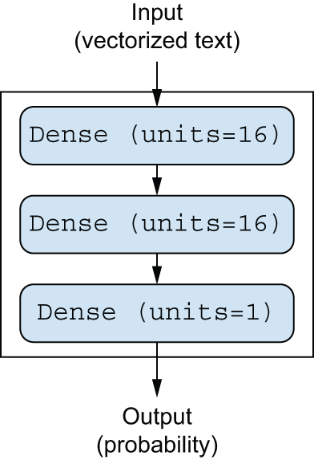


[Figure 4.1](#figure-4-1): The three-layer model

The first argument being passed to each `Dense` layer is the number
of *units* in the layer: the dimensionality of representation space of the layer.
You remember from chapters 2 and 3 that each
such `Dense` layer with a `relu` activation implements the
following chain of tensor operations:

```python
output = relu(dot(input, W) + b)
```

Having 16 units means the weight matrix `W` will have shape
`(input_dimension, 16)`: the dot product with `W` will project the input data
onto a 16-dimensional representation space (and then you’ll add the bias
vector `b` and apply the `relu` operation). You can intuitively understand the
dimensionality of your representation space as “how much freedom you’re
allowing the model to have when learning internal representations.” Having
more units (a higher-dimensional representation space) allows your
model to learn more complex representations, but it makes the model more
computationally expensive and may lead to learning unwanted patterns (patterns
that will improve performance on the training data but not on the test data).

The intermediate layers use `relu` as their activation function, and the
final layer uses a sigmoid activation to output a probability (a
score between 0 and 1, indicating how likely the review is to be positive). A `relu` (rectified linear
unit) is a function meant to zero-out
negative values (see figure 4.2), whereas a sigmoid “squashes” arbitrary
values into the `[0, 1]` interval (see figure 4.3), outputting something that
can be interpreted as a probability.

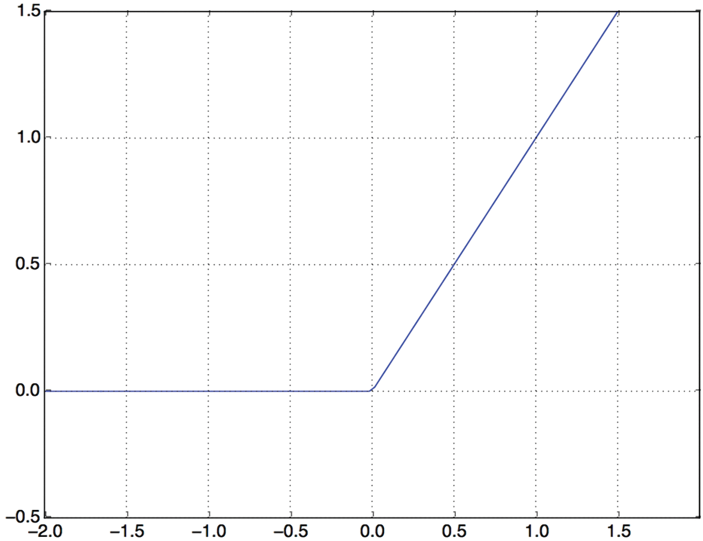


[Figure 4.2](#figure-4-2): The rectified linear unit function


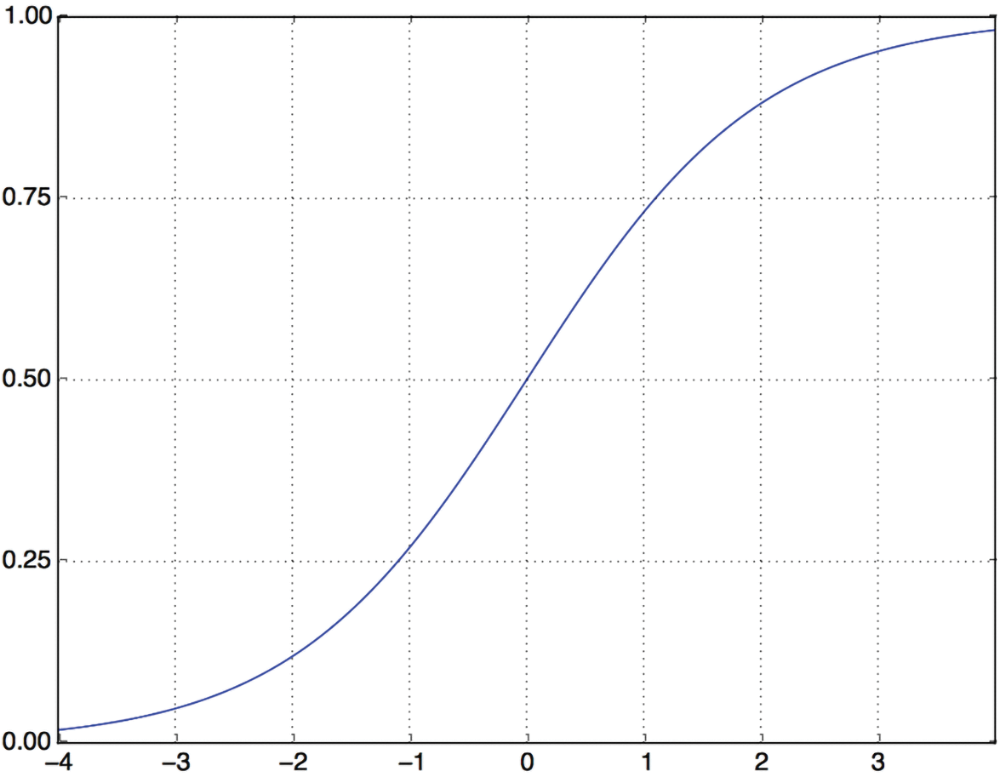


[Figure 4.3](#figure-4-3): The sigmoid function


What are activation functions, and why are they necessary?

Without an activation function like `relu` (also called a *non-linearity*),
the `Dense` layer would consist of two linear operations — a dot product and
an addition:

```python
output = dot(input, W) + b
```

So the layer could only learn *linear transformations* (affine transformations) of the input data: the
*hypothesis space* of the layer would be the set of all possible
linear transformations of the input data into a 16-dimensional space.
Such a hypothesis space is too restricted
and wouldn’t benefit from multiple layers of representations because a deep
stack of linear layers would still implement a linear operation: adding more
layers wouldn’t extend the hypothesis space (as you saw in chapter 2).

To get access to a much richer hypothesis space that would benefit
from deep representations, you need a non-linearity or activation function.
`relu` is the most popular activation function in deep learning, but there are
many other candidates, which all come with similarly strange names: `prelu`,
`elu`, and so on.

Finally, you need to choose a loss function and an optimizer. Because you’re
facing a binary classification problem and the output of your model is a
probability (you end your model with a single-unit layer with a sigmoid
activation), it’s best to use the
`binary_crossentropy` loss. It isn’t the only viable choice: you could use,
for instance, `mean_squared_error`. But crossentropy
is usually the best choice when you’re dealing with models that output
probabilities. *Crossentropy* is a quantity from the field
of information theory that measures the distance between probability
distributions or, in this case, between the ground-truth distribution and your
predictions.

As for the choice of the optimizer, we’ll go with `adam`, which is usually
a good default choice for virtually any problem.

Here’s the step where you configure the model with the `adam` optimizer and
the `binary_crossentropy` loss function. Note that
you’ll also monitor accuracy during training.

```python
model.compile(
    optimizer="adam",
    loss="binary_crossentropy",
    metrics=["accuracy"],
)
```

[Listing 4.5](#listing-4-5): Compiling the model

### Validating your approach

As you learned in chapter 3, a deep learning model should never be evaluated
on its training data — it’s standard practice to use a “validation set”
to monitor the accuracy of the model during training. Here, you’ll create a
validation set by setting apart 10,000 samples from the original training data.

You might ask, why not simply use the *test* data to evaluate the model? That seems like
it would be easier. The reason is that you’re going to want to use the results you
get on the validation set to inform your next choices to improve training —
for instance, your choice of what model size to use or how many epochs to train for.
When you start doing this,
your validation scores stop being an accurate reflection of the performance of the model
on brand-new data, since the model has been deliberately modified to perform better on the
validation data. It’s good to keep around a set of never-before-seen samples that you can
use to perform the final evaluation round in a completely unbiased way,
and that’s exactly what the test set is. We’ll talk more about this in the next chapter.

```python
x_val = x_train[:10000]
partial_x_train = x_train[10000:]
y_val = y_train[:10000]
partial_y_train = y_train[10000:]
```

[Listing 4.6](#listing-4-6): Setting aside a validation set

You’ll now train the model for 20 epochs (20 iterations over all samples in the
training data), in mini-batches of 512 samples. At the same
time, you’ll monitor loss and accuracy on the 10,000 samples that you set
apart. You do so by passing the validation data as the `validation_data` argument
to `model.fit()`.

```python
history = model.fit(
    partial_x_train,
    partial_y_train,
    epochs=20,
    batch_size=512,
    validation_data=(x_val, y_val),
)
```

[Listing 4.7](#listing-4-7): Training your model


The `validation_split` argument

Instead of manually splitting out validation data from your training data
and passing it as the `validation_data` argument, you can also use
the `validation_split` argument in `fit()`. It specifies a fraction of
the training data to use as validation data, like this:

```python
history = model.fit(
    x_train,
    y_train,
    epochs=20,
    batch_size=512,
    validation_split=0.2,
)
```

In this example, 20% of the samples in the `x_train` and `y_train` arrays
are being held out from training and used as validation data.

On CPU, this will take less than 2 seconds per epoch — training is over in 20
seconds. At the end of every epoch, there is a slight pause as the model
computes its loss and accuracy on the 10,000 samples of the validation data.

Note that the call to `model.fit()` returns a `History` object, as you’ve seen
in chapter 3. This object has a member `history`, which is a
dictionary containing data about everything that happened during training.
Let’s look at it:

```python
>>> history_dict = history.history
>>> history_dict.keys()
dict_keys(["accuracy", "loss", "val_accuracy", "val_loss"])
```

The dictionary contains four entries: one per metric that was being monitored
during training and during validation. In the following two listings, let’s use
Matplotlib to plot the training and validation loss
side by side (see figure 4.4), as well as the training and validation accuracy
(see figure 4.5). Note that your own results may vary slightly due to a
different random initialization of your model.

```python
import matplotlib.pyplot as plt

history_dict = history.history
loss_values = history_dict["loss"]
val_loss_values = history_dict["val_loss"]
epochs = range(1, len(loss_values) + 1)
# "r--" is for "dashed red line."
plt.plot(epochs, loss_values, "r--", label="Training loss")
# "b" is for "solid blue line."
plt.plot(epochs, val_loss_values, "b", label="Validation loss")
plt.title("[IMDB] Training and validation loss")
plt.xlabel("Epochs")
plt.xticks(epochs)
plt.ylabel("Loss")
plt.legend()
plt.show()
```

[Listing 4.8](#listing-4-8): Plotting the training and validation loss


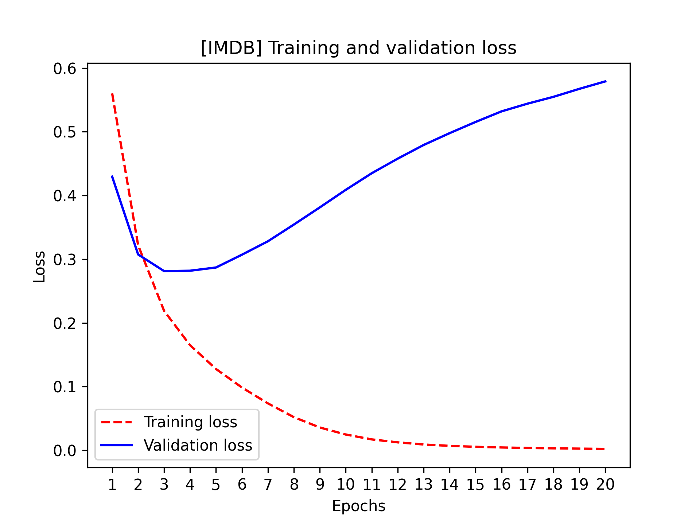


[Figure 4.4](#figure-4-4): Training and validation loss


```python
# Clears the figure
plt.clf()
acc = history_dict["accuracy"]
val_acc = history_dict["val_accuracy"]
plt.plot(epochs, acc, "r--", label="Training acc")
plt.plot(epochs, val_acc, "b", label="Validation acc")
plt.title("[IMDB] Training and validation accuracy")
plt.xlabel("Epochs")
plt.xticks(epochs)
plt.ylabel("Accuracy")
plt.legend()
plt.show()
```

[Listing 4.9](#listing-4-9): Plotting the training and validation accuracy


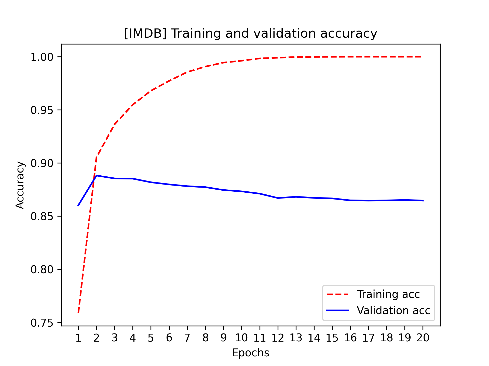


[Figure 4.5](#figure-4-5): Training and validation accuracy

As you can see, the training loss decreases with every epoch, and the training
accuracy increases with every epoch. That’s what you would expect when running
gradient-descent optimization — the quantity you’re trying to minimize should be
less with every iteration. But that isn’t the case for the validation loss and
accuracy: they seem to peak at the fourth epoch. This is an example of what we
warned against earlier: a model that performs better on the training data
isn’t necessarily a model that will do better on data it has never seen
before. In precise terms, what you’re seeing is *overfitting*: after the
fourth epoch, you’re overoptimizing on the training data, and you end up
learning representations that are specific to the training data and don’t
generalize to data outside of the training set.

In this case, to prevent overfitting, you could stop training after four
epochs. In general, you can use a range of techniques to mitigate overfitting,
which we’ll cover in chapter 5.

Let’s train a new model from scratch for four epochs and then
evaluate it on the test data.

```python
model = keras.Sequential(
    [
        layers.Dense(16, activation="relu"),
        layers.Dense(16, activation="relu"),
        layers.Dense(1, activation="sigmoid"),
    ]
)
model.compile(
    optimizer="adam",
    loss="binary_crossentropy",
    metrics=["accuracy"],
)
model.fit(x_train, y_train, epochs=4, batch_size=512)
results = model.evaluate(x_test, y_test)
```

[Listing 4.10](#listing-4-10): Training the model for four epochs

The final results are as follows:

```python
>>> results
# The first number, 0.29, is the test loss, and the second number,
# 0.88, is the test accuracy.
[0.2929924130630493, 0.88327999999999995]
```

This fairly naive approach achieves an accuracy of 88%. With state-of-the-art
approaches, you should be able to get close to 95%.

### Using a trained model to generate predictions on new data

After having trained a model, you’ll want to use it in a practical setting.
You can generate the likelihood of reviews being positive by using
the `predict` method, as you’ve learned in chapter 3:

```python
>>> model.predict(x_test)
array([[ 0.98006207]
       [ 0.99758697]
       [ 0.99975556]
       ...,
       [ 0.82167041]
       [ 0.02885115]
       [ 0.65371346]], dtype=float32)
```

As you can see, the model is confident for some samples (0.99 or more, or
0.01 or less) but less confident for others (0.6, 0.4).

### Further experiments

The following experiments will help convince you that the architecture choices
you’ve made are all fairly reasonable, although there’s still room for
improvement:

* You used two representation layers before the final classification layer.
  Try using one or three representation layers and see how doing so affects validation and test accuracy.

* Try using layers with more units or fewer units: 32 units,
  64 units, and so on.

* Try using the `mean_squared_error` loss function instead of
  `binary_crossentropy`.

* Try using the `tanh` activation (an activation that was
  popular in the early days of neural networks) instead of `relu`.

### Wrapping up

Here’s what you should take away from this example:

* You usually need to do quite a bit of preprocessing on your raw data
  to be able to feed it — as tensors — into a neural network.
  Sequences of words can be encoded as binary vectors, but there are other
  encoding options, too.

* Stacks of `Dense` layers with `relu` activations can solve a wide range of
  problems (including sentiment classification), and you’ll use them
  frequently.

* In a binary classification problem (two output classes),
  your model should end with a `Dense` layer with one unit and a `sigmoid`
  activation: the output of your model should be a scalar between 0 and 1,
  encoding a probability.

* With such a scalar sigmoid output on a binary classification problem, the
  loss function you should use is `binary_crossentropy`.

* The `adam` optimizer is generally a good enough
  choice, whatever your problem. That’s one less thing for you to worry about.

* As they get better on their training data, neural networks eventually start
  overfitting and end up obtaining increasingly worse results on data they’ve
  never seen before. Be sure to always monitor performance on data that is
  outside of the training set!

## Classifying newswires: A multiclass classification example

In the previous section, you saw how to classify vector inputs into
two mutually exclusive classes using a densely connected neural network.
But what happens when you have more than two classes?

In this section, you’ll build a model to classify Reuters newswires into 46
mutually exclusive topics. Because you have many classes, this problem is an
instance of *multiclass classification*, and because each data point should be
classified into only one category, the problem is more specifically an
instance of *single-label*,
*multiclass classification*. If each data point could belong to multiple
categories (in this case, topics), you’d be facing a *multilabel*,
*multiclass classification* problem.

### The Reuters dataset

You’ll work with the Reuters dataset, a set of short newswires and their
topics, published by Reuters in 1986. It’s a simple, widely used toy dataset
for text classification. There are 46 different topics; some topics are more
represented than others, but each topic has at least 10 examples in the
training set.

Like IMDb and MNIST, the Reuters dataset comes packaged as part of Keras. Let’s
take a look.

```python
from keras.datasets import reuters

(train_data, train_labels), (test_data, test_labels) = reuters.load_data(
    num_words=10000
)
```

[Listing 4.11](#listing-4-11): Loading the Reuters dataset

As with the IMDb dataset, the argument `num_words=10000` restricts the data to
the 10,000 most frequently occurring words found in the data.

You have 8,982 training examples and 2,246 test examples:

```python
>>> len(train_data)
8982
>>> len(test_data)
2246
```

As with the IMDb reviews, each example is a list of integers (word indices):

```python
>>> train_data[10]
[1, 245, 273, 207, 156, 53, 74, 160, 26, 14, 46, 296, 26, 39, 74, 2979,
3554, 14, 46, 4689, 4329, 86, 61, 3499, 4795, 14, 61, 451, 4329, 17, 12]
```

Here’s how you can decode it back to words, in case you’re curious.

```python
word_index = reuters.get_word_index()
reverse_word_index = dict([(value, key) for (key, value) in word_index.items()])
decoded_newswire = " ".join(
    # The indices are offset by 3 because 0, 1, and 2 are reserved
    # indices for "padding," "start of sequence," and "unknown."
    [reverse_word_index.get(i - 3, "?") for i in train_data[10]]
)
```

[Listing 4.12](#listing-4-12): Decoding newswires back to text

The label associated with an example is an integer between 0 and 45 — a topic
index:

```python
>>> train_labels[10]
3
```

### Preparing the data

You can vectorize the data with the exact same code as in the previous example.

```python
# Vectorized training data
x_train = multi_hot_encode(train_data, num_classes=10000)
# Vectorized test data
x_test = multi_hot_encode(test_data, num_classes=10000)
```

[Listing 4.13](#listing-4-13): Encoding the input data

To vectorize the labels, there are two possibilities: you can leave the labels
untouched as integers, or you can use *one-hot encoding*. One-hot encoding
is a widely used format for categorical data, also called *categorical encoding*.
In this case, one-hot encoding of the labels consists of embedding each label as
an all-zero vector with a 1 in the place of the label index. Here’s an example.

```python
def one_hot_encode(labels, num_classes=46):
    results = np.zeros((len(labels), num_classes))
    for i, label in enumerate(labels):
        results[i, label] = 1.0
    return results

# Vectorized training labels
y_train = one_hot_encode(train_labels)
# Vectorized test labels
y_test = one_hot_encode(test_labels)
```

[Listing 4.14](#listing-4-14): Encoding the labels

Note that there is a built-in way to do this in Keras:

```python
from keras.utils import to_categorical

y_train = to_categorical(train_labels)
y_test = to_categorical(test_labels)
```

### Building your model

This topic classification problem looks similar to the previous movie review
classification problem: in both cases, you’re trying to classify short
snippets of text. But there is a new constraint here: the number of output
classes has gone from 2 to 46. The dimensionality of the output space is much
larger.

In a stack of `Dense` layers like those you’ve been using, each layer can only
access information present in the output of the previous layer. If one layer
drops some information relevant to the classification problem, this
information can never be recovered by later layers: each layer can potentially
become an information bottleneck. In the previous
example, you used 16-dimensional intermediate layers, but a 16-dimensional
space may be too limited to learn to separate 46 different classes: such small
layers may act as information bottlenecks, permanently dropping relevant
information.

For this reason, you’ll use larger intermediate layers. Let’s go with 64 units.

```python
model = keras.Sequential(
    [
        layers.Dense(64, activation="relu"),
        layers.Dense(64, activation="relu"),
        layers.Dense(46, activation="softmax"),
    ]
)
```

[Listing 4.15](#listing-4-15): Model definition

There are two other things you should note about this architecture:

* You end the model with a `Dense` layer of size 46. This means for each input
  sample, the network will output a 46-dimensional vector. Each entry in this
  vector (each dimension) will encode a different output class.

* The last layer uses a `softmax` activation. You saw this pattern
  in the MNIST example. It means the model will output a *probability
  distribution* over the 46 different output
  classes — for every input sample, the model will produce a 46-dimensional
  output vector, where `output[i]` is the probability that the sample belongs to
  class `i`. The 46 scores will sum to 1.

The best loss function to use in this case is `categorical_crossentropy`. It
measures the distance between two
probability distributions — here, between the probability distribution outputted
by the model and the true distribution of the labels. By minimizing the
distance between these two distributions, you train the model to output
something as close as possible to the true labels.

Like last time, we’ll also monitor accuracy. However, accuracy is a bit of a crude metric
in this case: if the model has the correct class as its second choice for a given sample,
with an incorrect first choice, the model will still have an accuracy of zero on that sample
— even though such a model would be much better than a random guess.
A more nuanced metric in this case is top-k accuracy, such as top-3 or top-5 accuracy. It measures
whether the correct class was among the top-k predictions of the model. Let’s add top-3 accuracy
to our model.

```python
top_3_accuracy = keras.metrics.TopKCategoricalAccuracy(
    k=3, name="top_3_accuracy"
)
model.compile(
    optimizer="adam",
    loss="categorical_crossentropy",
    metrics=["accuracy", top_3_accuracy],
)
```

[Listing 4.16](#listing-4-16): Compiling the model

### Validating your approach

Let’s set apart 1,000 samples in the training data to use as a validation set.

```python
x_val = x_train[:1000]
partial_x_train = x_train[1000:]
y_val = y_train[:1000]
partial_y_train = y_train[1000:]
```

[Listing 4.17](#listing-4-17): Setting aside a validation set

Now, let’s train the model for 20 epochs.

```python
history = model.fit(
    partial_x_train,
    partial_y_train,
    epochs=20,
    batch_size=512,
    validation_data=(x_val, y_val),
)
```

[Listing 4.18](#listing-4-18): Training the model

And finally, let’s display its loss and accuracy curves (see figures 4.6 and
4.7).

```python
loss = history.history["loss"]
val_loss = history.history["val_loss"]
epochs = range(1, len(loss) + 1)
plt.plot(epochs, loss, "r--", label="Training loss")
plt.plot(epochs, val_loss, "b", label="Validation loss")
plt.title("Training and validation loss")
plt.xlabel("Epochs")
plt.xticks(epochs)
plt.ylabel("Loss")
plt.legend()
plt.show()
```

[Listing 4.19](#listing-4-19): Plotting the training and validation loss


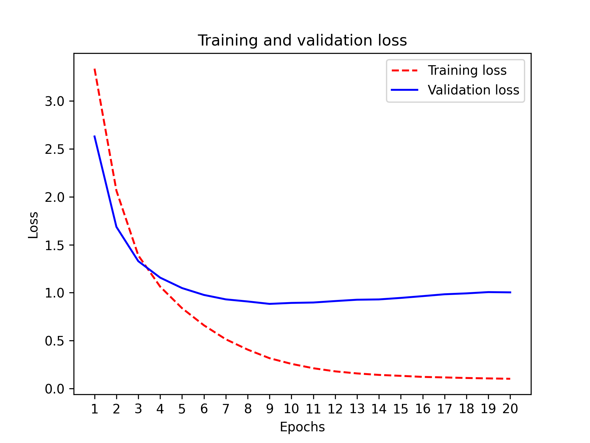


[Figure 4.6](#figure-4-6): Training and validation loss


```python
plt.clf()
acc = history.history["accuracy"]
val_acc = history.history["val_accuracy"]
plt.plot(epochs, acc, "r--", label="Training accuracy")
plt.plot(epochs, val_acc, "b", label="Validation accuracy")
plt.title("Training and validation accuracy")
plt.xlabel("Epochs")
plt.xticks(epochs)
plt.ylabel("Accuracy")
plt.legend()
plt.show()
```

[Listing 4.20](#listing-4-20): Plotting the training and validation top-3 accuracy


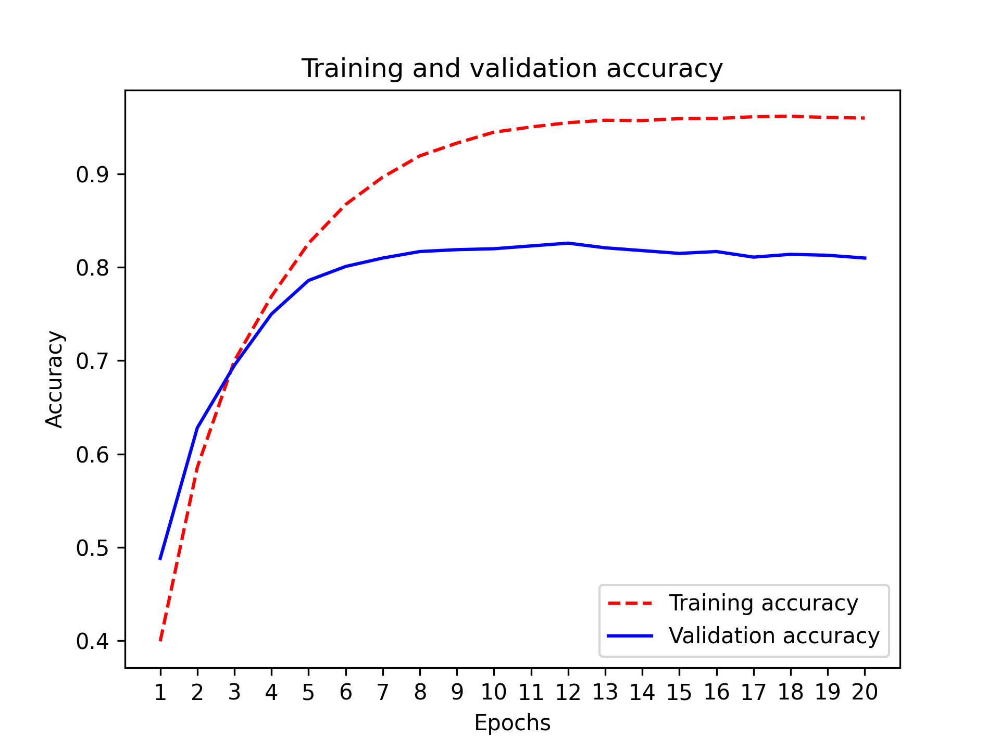


[Figure 4.7](#figure-4-7): Training and validation accuracy


```python
plt.clf()
acc = history.history["top_3_accuracy"]
val_acc = history.history["val_top_3_accuracy"]
plt.plot(epochs, acc, "r--", label="Training top-3 accuracy")
plt.plot(epochs, val_acc, "b", label="Validation top-3 accuracy")
plt.title("Training and validation top-3 accuracy")
plt.xlabel("Epochs")
plt.xticks(epochs)
plt.ylabel("Top-3 accuracy")
plt.legend()
plt.show()
```

[Listing 4.21](#listing-4-21): Plotting the training and validation top-3 accuracy


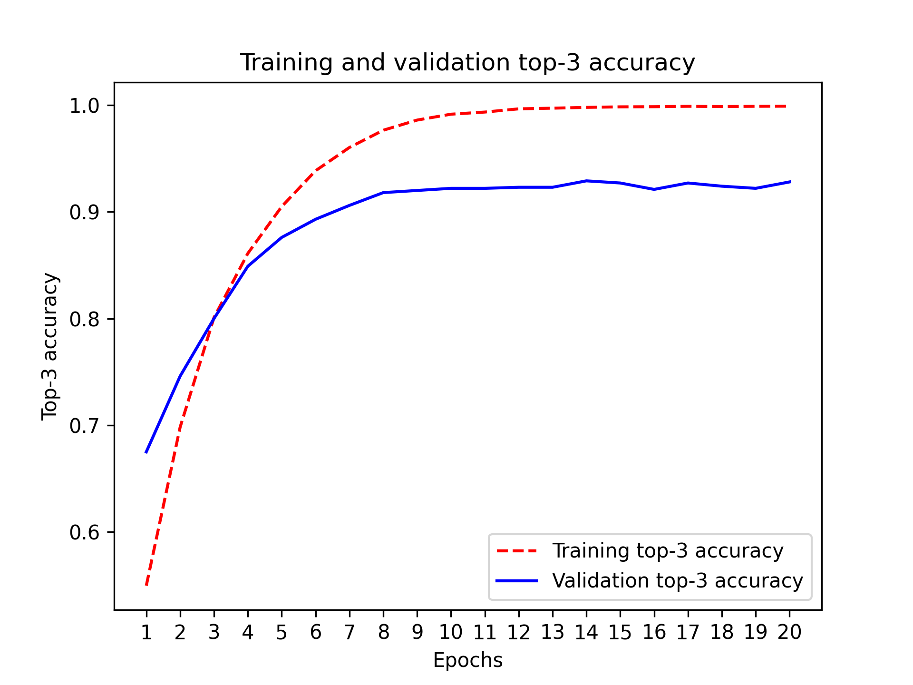


[Figure 4.8](#figure-4-8): Training and validation accuracy

The model begins to overfit after nine epochs. Let’s train a new model
from scratch for nine epochs and then evaluate it on the test set.

```python
model = keras.Sequential(
    [
        layers.Dense(64, activation="relu"),
        layers.Dense(64, activation="relu"),
        layers.Dense(46, activation="softmax"),
    ]
)
model.compile(
    optimizer="adam",
    loss="categorical_crossentropy",
    metrics=["accuracy"],
)
model.fit(
    x_train,
    y_train,
    epochs=9,
    batch_size=512,
)
results = model.evaluate(x_test, y_test)
```

[Listing 4.22](#listing-4-22): Retraining a model from scratch

Here are the final results:

```python
>>> results
[0.9565213431445807, 0.79697239536954589]
```

This approach reaches an accuracy of approximately 80%. With a balanced binary
classification problem, the accuracy reached by a purely random classifier
would be 50%. But in this case, we have 46 classes, and they may not be
equally represented. What would be the accuracy of a random baseline? We could
try quickly implementing one to check this empirically:

```python
>>> import copy
>>> test_labels_copy = copy.copy(test_labels)
>>> np.random.shuffle(test_labels_copy)
>>> hits_array = np.array(test_labels == test_labels_copy)
>>> hits_array.mean()
0.18655387355298308
```

As you can see, a random classifier would score around 19% classification
accuracy, so the results of our model seem pretty good in that light.

### Generating predictions on new data

Calling the model’s `predict` method on new samples
returns a class probability distribution over all 46 topics for each sample.
Let’s generate topic predictions for all of the test data:

```python
predictions = model.predict(x_test)
```

Each entry in “predictions” is a vector of length 46:

```python
>>> predictions[0].shape
(46,)
```

The coefficients in this vector sum to 1, as they form a
probability distribution:

```python
>>> np.sum(predictions[0])
1.0
```

The largest entry is the predicted class —
the class with the highest probability:

```python
>>> np.argmax(predictions[0])
4
```

### A different way to handle the labels and the loss

We mentioned earlier that another way to encode the labels would be to leave
them untouched as integer tensors, like this:

```python
y_train = train_labels
y_test = test_labels
```

The only thing this approach would change is the choice of the loss function.
The loss function used in listing 4.22, `categorical_crossentropy`, expects
the labels to follow a categorical
encoding. With integer labels, you should
use `sparse_categorical_crossentropy`:

```python
model.compile(
    optimizer="adam",
    loss="sparse_categorical_crossentropy",
    metrics=["accuracy"],
)
```

This new loss function is still mathematically the same as
`categorical_crossentropy`; it just has a different interface.

### The importance of having sufficiently large intermediate layers

We mentioned earlier that because the final outputs are 46-dimensional, you
should avoid intermediate layers with much fewer than 46 units. Now
let’s see what happens when you introduce an information bottleneck by having
intermediate layers that are significantly less than 46-dimensional: for
example, 4-dimensional.

```python
model = keras.Sequential(
    [
        layers.Dense(64, activation="relu"),
        layers.Dense(4, activation="relu"),
        layers.Dense(46, activation="softmax"),
    ]
)
model.compile(
    optimizer="adam",
    loss="categorical_crossentropy",
    metrics=["accuracy"],
)
model.fit(
    partial_x_train,
    partial_y_train,
    epochs=20,
    batch_size=128,
    validation_data=(x_val, y_val),
)
```

[Listing 4.23](#listing-4-23): A model with an information bottleneck

The model now peaks at approximately 71% validation accuracy, an 8% absolute drop. This
drop is mostly due to the fact that you’re trying to compress a lot of
information (enough information to recover the separation hyperplanes of 46
classes) into an intermediate space that is too low-dimensional. The model
is able to cram *most* of the necessary information into these
4-dimensional representations, but not all of it.

### Further experiments

Like in the previous example, we encourage you to try out the following experiments to
train your intuition about the kind of configuration decisions you have to make with
such models:

* Try using larger or smaller layers: 32 units, 128 units, and so on.
* You used two intermediate layers before the final softmax classification layer.
  Now try using a single intermediate layer, or three intermediate layers.

### Wrapping up

Here’s what you should take away from this example:

* If you’re trying to classify data points among *N* classes,
  your model should end with a `Dense` layer of size *N*.

* In a single-label, multiclass classification problem, your model should end
  with a `softmax` activation so that it will output a probability
  distribution over the *N* output classes.

* Categorical crossentropy is almost always the loss function you should use
  for such problems. It minimizes the distance between the probability
  distributions output by the model and the true distribution of the targets.

* There are two ways to handle labels in multiclass classification:
  + Encoding the labels via categorical encoding
    (also known as one-hot encoding) and using `categorical_crossentropy` as a
    loss function
  + Encoding the labels as integers and using the
    `sparse_categorical_crossentropy` loss function

* If you need to classify data into a large number of categories, you should
  avoid creating information bottlenecks in your
  model due to intermediate layers that are too small.

## Predicting house prices: A regression example

The two previous examples were considered classification
problems, where the goal was to predict a single discrete label of an input
data point. Another common type of machine learning problem is *regression*,
which consists of predicting a continuous value instead of a discrete label:
for instance, predicting the temperature tomorrow given meteorological data,
or predicting the time that a software project will take to complete given
its specifications.

Confusingly, logistic regression isn’t a regression algorithm —
it’s a classification algorithm.

### The California Housing Price dataset

You’ll attempt to predict the median price of homes in different areas of California,
based on data from the 1990 census.

Each data point in the dataset represents information about a “block group,”
a group of homes located in the same area. You can think of it as a district.
This dataset has two versions, the “small” version with just 600 districts,
and the “large” version with 20,640 districts. Let’s use the small version,
because real-world datasets can often be tiny, and you need to know how to handle such cases.

For each district, we know

* The longitude and latitude of the approximate geographic center of the area.
* The median age of houses in the district.
* The population of the district. The districts are pretty small: the average population is 1,425.5.
* The total number of households.
* The median income of those households.
* The total number of rooms in the district, across all homes located there. This is typically in the low thousands.
* The total number of bedrooms in the district.

That’s eight variables in total (longitude and latitude count as two variables).
The goal is to use these variables to predict the median value of the houses in the district.
Let’s get started by loading the data.

```python
from keras.datasets import california_housing

# Make sure to pass version="small" to get the right dataset.
(train_data, train_targets), (test_data, test_targets) = (
    california_housing.load_data(version="small")
)
```

[Listing 4.24](#listing-4-24): Loading the California Housing Prices dataset

Let’s look at the data:

```python
>>> train_data.shape
(480, 8)
>>> test_data.shape
(120, 8)
```

As you can see, we have 480 training samples and 120 test samples, each with
8 numerical features. The targets are the median values of homes in the district considered,
in dollars:

```python
>>> train_targets
array([252300., 146900., 290900., ..., 140500., 217100.],
      dtype=float32)
```

The prices are between $60,000 and $500,000. If that sounds cheap,
remember that this was in 1990, and these prices aren’t adjusted for
inflation.

### Preparing the data

It would be problematic to feed into a neural network values that all take
wildly different ranges. The model might be able to automatically adapt to
such heterogeneous data, but it would definitely make learning more difficult.
A widespread best practice to deal with such data is to do feature-wise
normalization: for each feature in the input data (a column in the input data
matrix), you subtract the mean of the feature and divide by the standard
deviation, so that the feature is centered around 0 and has a unit standard
deviation. This is easily done in NumPy.

```python
mean = train_data.mean(axis=0)
std = train_data.std(axis=0)
x_train = (train_data - mean) / std
x_test = (test_data - mean) / std
```

[Listing 4.25](#listing-4-25): Normalizing the data

Note that the quantities used for normalizing the test data are computed using
the training data. You should never use in your workflow any quantity computed
on the test data, even for something as simple as data normalization.

In addition, we should also scale the targets. Our normalized inputs
have their value in a small range close to 0, and our model’s weights are
initialized with small random values. This means that our model’s prediction
will also be small values when we start training.
If the targets are in the range
60,000–500,000, the model is going to need very large weight values to output those.
With a small learning rate, it would take a very long time to get there. The simplest fix
is to divide all target values by 100,000, so that the smallest target becomes 0.6, and the largest
becomes 5. We can then convert the model’s predictions back to dollar values by multiplying
them by 100,000 accordingly.

```python
y_train = train_targets / 100000
y_test = test_targets / 100000
```

[Listing 4.26](#listing-4-26): Scaling the targets

### Building your model

Because so few samples are available, you’ll use a very small model with two
intermediate layers, each with 64 units. In general, the less training data you
have, the worse overfitting will be, and using a small model is one way to
mitigate overfitting.

```python
def get_model():
    # Because you need to instantiate the same model multiple times,
    # you use a function to construct it.
    model = keras.Sequential(
        [
            layers.Dense(64, activation="relu"),
            layers.Dense(64, activation="relu"),
            layers.Dense(1),
        ]
    )
    model.compile(
        optimizer="adam",
        loss="mean_squared_error",
        metrics=["mean_absolute_error"],
    )
    return model
```

[Listing 4.27](#listing-4-27): Model definition

The model ends with a single unit and no activation: it will be a linear
layer. This is a typical setup for scalar regression
— a regression where you’re trying to predict a single continuous value.
Applying an activation function would constrain the
range the output can take; for instance, if you applied a `sigmoid` activation
function to the last layer, the model could only learn to predict values
between 0 and 1. Here, because the last layer is purely linear, the model is
free to learn to predict values in any range.

Note that you compile the model with the `mean_squared_error`
loss function — *mean squared error*, the square of the difference between the
predictions and the targets. This is a widely used loss function for
regression problems.

You’re also monitoring a new metric during training: *mean absolute error*
(MAE). It’s the absolute value of the difference between the predictions and
the targets. For instance, an MAE of 0.5 on this problem would mean your
predictions are off by $50,000 on average (remember the target scaling of factor 100,000).

### Validating your approach using K-fold validation

To evaluate your model while you keep adjusting its parameters (such as the
number of epochs used for training), you could split the data into a training
set and a validation set, as you did in the previous examples. But because you
have so few data points, the validation set would end up being very small (for
instance, about 100 examples). As a consequence, the validation scores might
change a lot depending on which data points you chose to use for validation
and which you chose for training: the validation scores might have a high
*variance* with regard to the validation split. This would prevent you from
reliably evaluating your model.

The best practice in such situations is to use *K-fold* cross-validation (see
figure 4.9). It consists of splitting the available data into *K* partitions
(typically *K* = 4 or 5), instantiating *K* identical models, and training
each one on *K* – 1 partitions while evaluating on the remaining partition.
The validation score for the model used is then the average of the *K*
validation scores obtained. In terms of code, this is straightforward.

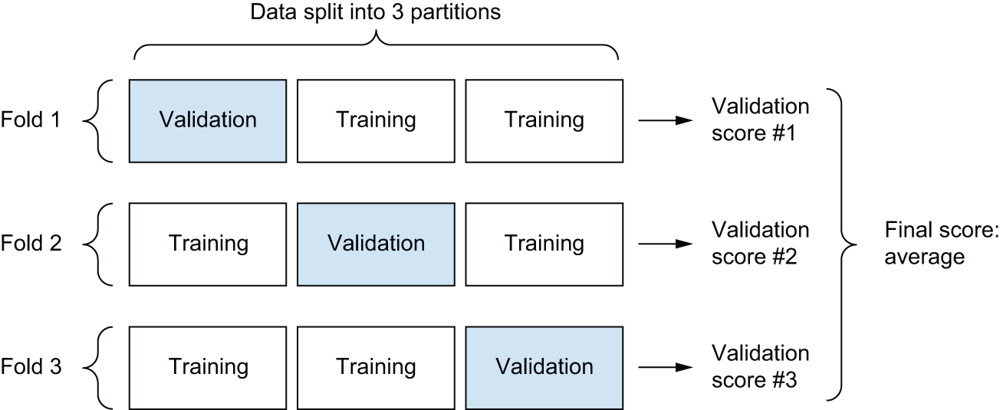


[Figure 4.9](#figure-4-9): Three-fold cross-validation


```python
k = 4
num_val_samples = len(x_train) // k
num_epochs = 50
all_scores = []
for i in range(k):
    print(f"Processing fold #{i + 1}")
    # Prepares the validation data: data from partition #k
    fold_x_val = x_train[i * num_val_samples : (i + 1) * num_val_samples]
    fold_y_val = y_train[i * num_val_samples : (i + 1) * num_val_samples]
    # Prepares the training data: data from all other partitions
    fold_x_train = np.concatenate(
        [x_train[: i * num_val_samples], x_train[(i + 1) * num_val_samples :]],
        axis=0,
    )
    fold_y_train = np.concatenate(
        [y_train[: i * num_val_samples], y_train[(i + 1) * num_val_samples :]],
        axis=0,
    )
    # Builds the Keras model (already compiled)
    model = get_model()
    # Trains the model
    model.fit(
        fold_x_train,
        fold_y_train,
        epochs=num_epochs,
        batch_size=16,
        verbose=0,
    )
    # Evaluates the model on the validation data
    scores = model.evaluate(fold_x_val, fold_y_val, verbose=0)
    val_loss, val_mae = scores
    all_scores.append(val_mae)
```

[Listing 4.28](#listing-4-28): K-fold validation

Running this with `num_epochs = 50` yields the following results:

```python
>>> [round(value, 3) for value in all_scores]
[0.298, 0.349, 0.232, 0.305]
>>> round(np.mean(all_scores), 3)
0.296
```

The different runs do indeed show meaningfully different validation scores,
from 0.232 to 0.349. The average (0.296) is a much more reliable metric than any single
score — that’s the entire point of K-fold cross-validation. In this case, you’re
off by $29,600 on average, which is significant considering that the prices
range from $60,000 to $500,000.

Let’s try training the model a bit longer: 200 epochs. To keep a record of
how well the model does at each epoch, you’ll modify the training loop to save
the per-epoch validation score log.

```python
k = 4
num_val_samples = len(x_train) // k
num_epochs = 200
all_mae_histories = []
for i in range(k):
    print(f"Processing fold #{i + 1}")
    # Prepares the validation data: data from partition #k
    fold_x_val = x_train[i * num_val_samples : (i + 1) * num_val_samples]
    fold_y_val = y_train[i * num_val_samples : (i + 1) * num_val_samples]
    # Prepares the training data: data from all other partitions
    fold_x_train = np.concatenate(
        [x_train[: i * num_val_samples], x_train[(i + 1) * num_val_samples :]],
        axis=0,
    )
    fold_y_train = np.concatenate(
        [y_train[: i * num_val_samples], y_train[(i + 1) * num_val_samples :]],
        axis=0,
    )
    # Builds the Keras model (already compiled)
    model = get_model()
    # Trains the model
    history = model.fit(
        fold_x_train,
        fold_y_train,
        validation_data=(fold_x_val, fold_y_val),
        epochs=num_epochs,
        batch_size=16,
        verbose=0,
    )
    mae_history = history.history["val_mean_absolute_error"]
    all_mae_histories.append(mae_history)
```

[Listing 4.29](#listing-4-29): Saving the validation logs at each fold

You can then compute the average of the per-epoch mean absolute error (MAE) scores for all folds.

```python
average_mae_history = [
    np.mean([x[i] for x in all_mae_histories]) for i in range(num_epochs)
]
```

[Listing 4.30](#listing-4-30): Building the history of successive mean K-fold validation scores

Let’s plot this; see figure 4.10.

```python
epochs = range(1, len(average_mae_history) + 1)
plt.plot(epochs, average_mae_history)
plt.xlabel("Epochs")
plt.ylabel("Validation MAE")
plt.show()
```

[Listing 4.31](#listing-4-31): Plotting validation scores


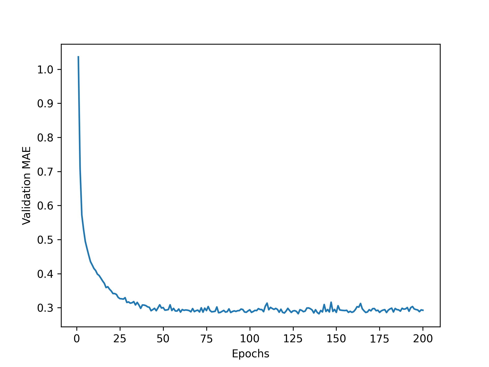


[Figure 4.10](#figure-4-10): Validation MAE by epoch

It may be a little difficult to read the plot due to a scaling issue: the
validation MAE for the first few epochs is dramatically higher than the values
that follow. Let’s omit the first 10 data points,
which are on a different scale than the rest of the curve.

```python
truncated_mae_history = average_mae_history[10:]
epochs = range(10, len(truncated_mae_history) + 10)
plt.plot(epochs, truncated_mae_history)
plt.xlabel("Epochs")
plt.ylabel("Validation MAE")
plt.show()
```

[Listing 4.32](#listing-4-32): Plotting validation scores, excluding the first 10 data points


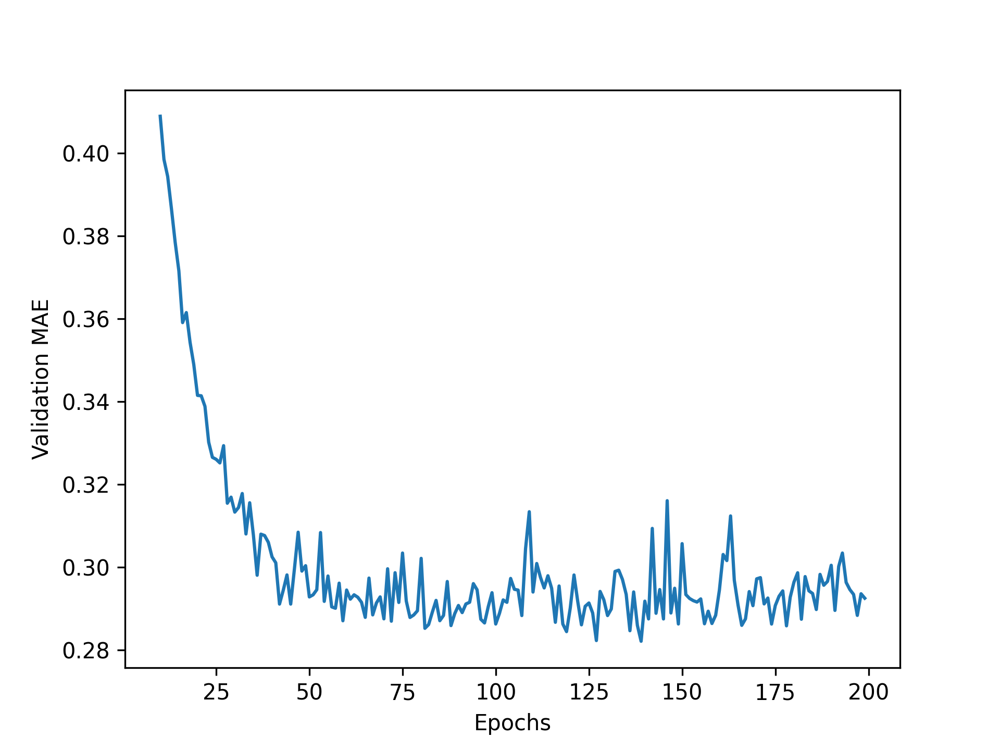


[Figure 4.11](#figure-4-11): Validation MAE by epoch, excluding the first 10 data points

According to this plot (see figure 4.11), validation MAE stops improving significantly after 120–140
epochs (this number includes the 10 epochs we omitted).
Past that point, you start overfitting.

Once you’re finished tuning other parameters of the model (in addition to the
number of epochs, you could also adjust the size of the intermediate layers),
you can train a final production model on all of the training data, with the best
parameters, and then look at its performance on the test data.

```python
# Gets a fresh, compiled model
model = get_model()
# Trains it on the entirety of the data
model.fit(x_train, y_train, epochs=130, batch_size=16, verbose=0)
test_mean_squared_error, test_mean_absolute_error = model.evaluate(
    x_test, y_test
)
```

[Listing 4.33](#listing-4-33): Training the final model

Here’s the final result:

```python
>>> round(test_mean_absolute_error, 3)
0.31
```

We’re still off by about $31,000 on average.

### Generating predictions on new data

When calling `predict()` on our binary classification model, we retrieved
a scalar score between 0 and 1 for each input sample. With our multiclass
classification model, we retrieved a probability distribution over all classes
for each sample. Now, with this scalar regression model, `predict()` returns
the model’s guess for the sample’s price in hundreds of thousands of dollars:

```python
>>> predictions = model.predict(x_test)
>>> predictions[0]
array([2.834494], dtype=float32)
```

The first district in the test set is predicted to have an average home price of about $283,000.

### Wrapping up

Here’s what you should take away from this scalar regression example:

* Regression is done using a different loss function than what we used for
  classification. Mean squared error (MSE) is a loss function
  commonly used for regression.

* Similarly, evaluation metrics to be used for regression differ from those
  used for classification; naturally, the concept of accuracy doesn’t apply for
  regression. A common regression metric is MAE.

* When features in the input data have values in different ranges, each feature
  should be scaled independently as a preprocessing step.

* When there is little data available, using K-fold validation is a great way
  to reliably evaluate a model.

* When little training data is available, it’s preferable to use a small
  model with few intermediate layers (typically only one or two), in order to avoid
  severe overfitting.

## Summary

* The three most common kinds of machine learning tasks on
  vector data are binary classification, multiclass classification, and scalar
  regression. Each task uses different loss functions:
  + `binary_crossentropy` for binary classification
  + `categorical_crossentropy` for multiclass classification
  + `mean_squared_error` for scalar regression

* You’ll usually need to preprocess raw data before feeding it into a neural
  network.

* When your data has features with different ranges, scale each feature
  independently as part of preprocessing.

* As training progresses, neural networks eventually begin to overfit and
  obtain worse results on never-before-seen data.

* If you don’t have much training data, use a small model with only one or
  two intermediate layers, to avoid severe overfitting.

* If your data is divided into many categories, you may cause information
  bottlenecks if you make the intermediate layers too small.

* When you’re working with little data, K-fold validation can help reliably
  evaluate your model.

#### **Tiếng Việt (Vietnamese)**

# Chương 4: Phân loại và hồi quy

Chương này bao gồm

* Ví dụ đầu tiên của bạn về quy trình học máy trong thế giới thực
* Xử lý các vấn đề phân loại nhị phân và phân loại
* Xử lý các vấn đề hồi quy liên tục

Chương này được thiết kế để giúp bạn bắt đầu sử dụng mạng lưới thần kinh để giải quyết các vấn đề thực tế. Bạn sẽ củng cố kiến ​​thức thu được từ chương 2 và 3, đồng thời áp dụng những gì đã học vào ba nhiệm vụ mới bao gồm ba trường hợp sử dụng phổ biến nhất của mạng thần kinh — phân loại nhị phân, phân loại phân loại và hồi quy vô hướng:

* Phân loại đánh giá phim là tích cực hay tiêu cực (phân loại nhị phân)
* Phân loại các dây tin tức theo chủ đề (phân loại theo danh mục)
* Ước tính giá một ngôi nhà, dựa trên dữ liệu bất động sản (hồi quy vô hướng)

Những ví dụ này sẽ là lần đầu tiên bạn tiếp xúc với quy trình học máy toàn diện: bạn sẽ được giới thiệu về tiền xử lý dữ liệu, nguyên tắc kiến ​​trúc mô hình cơ bản và đánh giá mô hình.

Đến cuối chương này, bạn sẽ có thể sử dụng mạng nơ-ron để xử lý các tác vụ phân loại và hồi quy đơn giản trên dữ liệu vectơ. Sau đó, bạn sẽ sẵn sàng bắt đầu xây dựng sự hiểu biết dựa trên lý thuyết và nguyên tắc hơn về học máy trong chương 5.

Thuật ngữ phân loại và hồi quy

Phân loại và hồi quy liên quan đến nhiều thuật ngữ chuyên ngành. Bạn đã gặp một số trong số chúng trong các ví dụ trước và bạn sẽ thấy nhiều hơn trong các chương sau. Chúng có các định nghĩa chính xác, dành riêng cho máy học và bạn nên làm quen với chúng:

* *Mẫu hoặc đầu vào* — Một điểm dữ liệu đi vào
người mẫu.

* *Dự đoán hoặc đầu ra* — Điều gì xảy ra từ mô hình của bạn.

* *Mục tiêu* — Sự thật. Mô hình lý tưởng của bạn nên có những gì
dự đoán, theo một nguồn dữ liệu bên ngoài.

* *Lỗi dự đoán hoặc giá trị mất mát* — Thước đo
khoảng cách giữa dự đoán của mô hình của bạn và mục tiêu.

* *Lớp* — Một tập hợp các nhãn có thể chọn trong một
vấn đề phân loại. Ví dụ: khi phân loại hình ảnh chó và mèo,
“chó” và “mèo” là hai lớp.

* *Nhãn* — Một phiên bản cụ thể của chú thích lớp trong
vấn đề phân loại. Ví dụ: nếu ảnh #1234 được chú thích là
chứa lớp “dog”, thì “dog” là nhãn của hình ảnh #1234.

* *Sự thật cơ bản hoặc chú thích* — Tất cả mục tiêu cho một tập dữ liệu,
thường được con người thu thập.

* *Phân loại nhị phân* — Nhiệm vụ phân loại
trong đó mỗi mẫu đầu vào phải được phân loại thành hai loại riêng.

* *Phân loại theo danh mục hoặc phân loại nhiều lớp* —
Một nhiệm vụ phân loại trong đó mỗi mẫu đầu vào
nên được phân loại thành nhiều hơn hai loại: ví dụ: phân loại
chữ số viết tay.

* *Phân loại nhiều nhãn* — Nhiệm vụ phân loại trong đó mỗi đầu vào
mẫu có thể được gán nhiều nhãn.
Ví dụ: một hình ảnh nhất định có thể chứa cả một con mèo và một con chó và phải
được chú thích bằng cả nhãn “mèo” và nhãn “chó”. Số lượng nhãn
mỗi hình ảnh thường thay đổi.

* *Hồi quy vô hướng* — Một nhiệm vụ trong đó mục tiêu là
giá trị vô hướng liên tục. Dự đoán giá nhà là một ví dụ điển hình:
các mức giá mục tiêu khác nhau tạo thành một không gian liên tục.

* *Hồi quy vectơ* — Một nhiệm vụ trong đó mục tiêu là một
tập hợp các giá trị liên tục: ví dụ: một vectơ liên tục. Nếu bạn đang làm
hồi quy đối với nhiều giá trị (chẳng hạn như tọa độ của hộp giới hạn
trong một hình ảnh), thì bạn đang thực hiện hồi quy vector.

* *Lô nhỏ hoặc chỉ một mẻ* — Một tập hợp mẫu nhỏ
(thường từ 8 đến 128) được mô hình xử lý đồng thời.
Số lượng mẫu thường là lũy thừa của 2, để thuận tiện cho việc phân bổ bộ nhớ
trên GPU. Khi đào tạo, một lô nhỏ được sử dụng để tính toán một
cập nhật giảm dần độ dốc được áp dụng cho trọng số của mô hình.

## Phân loại đánh giá phim: Ví dụ phân loại nhị phân

Phân loại hai lớp, hay phân loại nhị phân, là một trong những loại vấn đề học máy phổ biến nhất. Trong ví dụ này, bạn sẽ học cách phân loại các bài đánh giá phim là tích cực hay tiêu cực, dựa trên nội dung văn bản của các bài đánh giá.

### Bộ dữ liệu IMDb

Bạn sẽ làm việc với tập dữ liệu IMDb: một tập hợp gồm 50.000 bài đánh giá có tính phân cực cao từ Cơ sở dữ liệu phim trên Internet. Chúng được chia thành 25.000 đánh giá để đào tạo và 25.000 đánh giá để kiểm tra, mỗi bộ bao gồm 50% đánh giá tiêu cực và 50% đánh giá tích cực.

Giống như tập dữ liệu MNIST, tập dữ liệu IMDb được đóng gói kèm theo Keras. Nó đã được xử lý trước: các đánh giá (chuỗi từ) đã được chuyển thành chuỗi các số nguyên, trong đó mỗi số nguyên đại diện cho một từ cụ thể trong từ điển. Điều này cho phép chúng tôi tập trung vào việc xây dựng, đào tạo và đánh giá mô hình. Trong chương 14, bạn sẽ học cách xử lý văn bản nhập thô từ đầu.

Đoạn mã sau sẽ tải tập dữ liệu (khi bạn chạy nó lần đầu tiên, khoảng 80 MB dữ liệu sẽ được tải xuống máy của bạn).

```python
from keras.datasets import imdb

(train_data, train_labels), (test_data, test_labels) = imdb.load_data(
    num_words=10000
)
```

[Liệt kê 4.1](#listing-4-1): Đang tải tập dữ liệu IMDb

Đối số `num_words=10000` có nghĩa là bạn sẽ chỉ giữ 10.000 từ xuất hiện thường xuyên nhất trong dữ liệu huấn luyện. Những từ hiếm sẽ bị loại bỏ. Điều này cho phép bạn làm việc với dữ liệu vectơ có kích thước có thể quản lý được. Nếu không đặt giới hạn này, chúng tôi sẽ làm việc với 88.585 từ duy nhất trong dữ liệu huấn luyện, một lượng lớn không cần thiết. Nhiều từ trong số này chỉ xuất hiện trong một mẫu duy nhất và do đó không thể được sử dụng một cách có ý nghĩa để phân loại.

Các biến `train_data` và `test_data` là các mảng đánh giá NumPy; mỗi đánh giá là một danh sách các chỉ mục từ (mã hóa một chuỗi các từ). `train_labels` và `test_labels` là các mảng NumPy gồm 0 và 1, trong đó 0 là viết tắt của *âm* và 1 là viết tắt của *dương*:

```python
>>> train_data[0]
[1, 14, 22, 16, ... 178, 32]
>>> train_labels[0]
1
```

Vì bạn đang giới hạn bản thân trong 10.000 từ thường gặp nhất nên không có chỉ mục từ nào vượt quá 10.000:

```python
>>> max([max(sequence) for sequence in train_data])
9999
```

Để thú vị hơn, hãy nhanh chóng giải mã một trong những đánh giá này thành các từ tiếng Anh.

```python
# word_index is a dictionary mapping words to an integer index.
word_index = imdb.get_word_index()
# Reverses it, mapping integer indices to words
reverse_word_index = dict([(value, key) for (key, value) in word_index.items()])
# Decodes the review. Note that the indices are offset by 3 because 0,
# 1, and 2 are reserved indices for "padding," "start of sequence," and
# "unknown."
decoded_review = " ".join(
    [reverse_word_index.get(i - 3, "?") for i in train_data[0]]
)
```

[Liệt kê 4.2](#listing-4-2): Giải mã các bài đánh giá trở lại văn bản

Chúng ta hãy xem những gì chúng ta có:

```python
>>> decoded_review[:100]
? this film was just brilliant casting location scenery story direction everyone
```

Lưu ý rằng `?` đứng đầu tương ứng với mã thông báo bắt đầu đã được thêm tiền tố vào mỗi bài đánh giá.

### Chuẩn bị dữ liệu

Bạn không thể trực tiếp đưa danh sách các số nguyên vào mạng lưới thần kinh. Chúng có tất cả các độ dài khác nhau, trong khi mạng lưới thần kinh dự kiến ​​​​sẽ xử lý các lô dữ liệu liền kề. Bạn phải biến danh sách của mình thành tensor. Có hai cách để làm điều đó:

* Sắp xếp các danh sách của bạn sao cho chúng có cùng độ dài, sau đó biến chúng thành một
tenx nguyên có hình dạng `(mẫu, max_length)` và bắt đầu mô hình của bạn với
một lớp có khả năng xử lý các tensor số nguyên như vậy (lớp
`` Nhúng`, chúng tôi sẽ đề cập chi tiết ở phần sau của cuốn sách).

* *Mã hóa nhiều điểm* danh sách của bạn để biến chúng thành vectơ 0 và 1
phản ánh sự hiện diện hay vắng mặt của tất cả các từ có thể. Điều này có nghĩa là, đối với
Ví dụ, biến chuỗi `[8, 5]` thành một vectơ 10.000 chiều
sẽ là tất cả 0 ngoại trừ chỉ số 5 và 8, sẽ là 1.

Hãy sử dụng giải pháp thứ hai để vector hóa dữ liệu. Khi thực hiện thủ công, quá trình này trông như sau.

```python
import numpy as np

def multi_hot_encode(sequences, num_classes):
    # Creates an all-zero matrix of shape (len(sequences), num_classes)
    results = np.zeros((len(sequences), num_classes))
    for i, sequence in enumerate(sequences):
        # Sets specific indices of results[i] to 1s
        results[i][sequence] = 1.0
    return results

# Vectorized training data
x_train = multi_hot_encode(train_data, num_classes=10000)
# Vectorized test data
x_test = multi_hot_encode(test_data, num_classes=10000)
```

[Liệt kê 4.3](#listing-4-3): Mã hóa các chuỗi số nguyên thông qua mã hóa đa nóng

Đây là giao diện của các mẫu bây giờ:

```python
>>> x_train[0]
array([ 0.,  1.,  1., ...,  0.,  0.,  0.])
```

Ngoài việc vector hóa các chuỗi đầu vào, bạn cũng nên vector hóa các nhãn của chúng, việc này rất đơn giản. Nhãn của chúng tôi đã là mảng NumPy, vì vậy chỉ cần chuyển đổi kiểu từ int sang float:

```python
y_train = train_labels.astype("float32")
y_test = test_labels.astype("float32")
```

Bây giờ dữ liệu đã sẵn sàng để đưa vào mạng lưới thần kinh.

### Xây dựng mô hình của bạn

Dữ liệu đầu vào là vectơ và nhãn là số vô hướng (1 và 0): đây là một trong những cách thiết lập vấn đề đơn giản nhất mà bạn từng gặp phải. Một loại mô hình hoạt động tốt trong vấn đề như vậy là một chồng đơn giản gồm các lớp được kết nối dày đặc (`Dense`) với các kích hoạt `relu`.

Có hai quyết định kiến ​​trúc quan trọng được đưa ra đối với một chồng các lớp `Dense` như vậy:

* Sử dụng bao nhiêu lớp
* Có bao nhiêu đơn vị để chọn cho mỗi lớp

Trong chương 5, bạn sẽ học các nguyên tắc chính thức để hướng dẫn bạn đưa ra những lựa chọn này. Hiện tại, bạn sẽ phải tin tưởng chúng tôi với lựa chọn kiến ​​trúc sau:

* Hai lớp trung gian với 16 đơn vị mỗi lớp
* Lớp thứ ba sẽ đưa ra dự đoán vô hướng liên quan đến tình cảm
của đánh giá hiện tại

Hình 4.1 cho thấy mô hình trông như thế nào. Đây là cách triển khai Keras, tương tự như ví dụ MNIST mà bạn đã thấy trước đây.

```python
import keras
from keras import layers

model = keras.Sequential(
    [
        layers.Dense(16, activation="relu"),
        layers.Dense(16, activation="relu"),
        layers.Dense(1, activation="sigmoid"),
    ]
)
```

[Liệt kê 4.4](#listing-4-4): Định nghĩa mô hình


[Figure 4.1](#figure-4-1): The three-layer model

Đối số đầu tiên được truyền cho mỗi lớp `Dense` là số *đơn vị* trong lớp: chiều của không gian biểu diễn của lớp. Bạn còn nhớ ở chương 2 và 3 rằng mỗi lớp `Dense` như vậy với kích hoạt `relu` sẽ triển khai chuỗi hoạt động tensor sau:

```python
output = relu(dot(input, W) + b)
```

Có 16 đơn vị nghĩa là ma trận trọng số `W` sẽ có hình dạng `(input_dimension, 16)`: tích vô hướng với `W` sẽ chiếu dữ liệu đầu vào lên không gian biểu diễn 16 chiều (và sau đó bạn sẽ thêm vectơ thiên vị `b` và áp dụng thao tác `relu`). Bạn có thể hiểu một cách trực quan tính chiều của không gian biểu diễn của mình là “mức độ tự do mà bạn cho phép mô hình có được khi học các cách biểu diễn bên trong”. Việc có nhiều đơn vị hơn (không gian biểu diễn có chiều cao hơn) cho phép mô hình của bạn học các cách biểu diễn phức tạp hơn, nhưng nó làm cho mô hình tốn kém hơn về mặt tính toán và có thể dẫn đến việc học các mẫu không mong muốn (các mẫu sẽ cải thiện hiệu suất trên dữ liệu huấn luyện nhưng không cải thiện hiệu suất trên dữ liệu huấn luyện nhưng không cải thiện hiệu suất trên dữ liệu thử nghiệm).

Các lớp trung gian sử dụng `relu` làm hàm kích hoạt và lớp cuối cùng sử dụng kích hoạt sigmoid để đưa ra xác suất (điểm từ 0 đến 1, cho biết khả năng đánh giá là tích cực). Một `relu` (đơn vị tuyến tính được chỉnh lưu) là một hàm dùng để loại bỏ các giá trị âm (xem hình 4.2), trong khi đó một sigmoid “ép” các giá trị tùy ý vào khoảng `[0, 1]` (xem hình 4.3), xuất ra thứ gì đó có thể được hiểu là xác suất.


[Figure 4.2](#figure-4-2): The rectified linear unit function


[Figure 4.3](#figure-4-3): The sigmoid function


Chức năng kích hoạt là gì và tại sao chúng cần thiết?

Nếu không có chức năng kích hoạt như `relu` (còn được gọi là *phi tuyến tính*), lớp `Dense` sẽ bao gồm hai phép toán tuyến tính — một tích số chấm và phép cộng:

```python
output = dot(input, W) + b
```

Vì vậy, lớp chỉ có thể học *các phép biến đổi tuyến tính* (các phép biến đổi affine) của dữ liệu đầu vào: *không gian giả thuyết* của lớp sẽ là tập hợp tất cả các phép biến đổi tuyến tính có thể có của dữ liệu đầu vào thành không gian 16 chiều. Một không gian giả thuyết như vậy quá hạn chế và sẽ không được hưởng lợi từ nhiều lớp biểu diễn vì một chồng các lớp tuyến tính sâu vẫn sẽ thực hiện một phép toán tuyến tính: việc thêm nhiều lớp hơn sẽ không mở rộng không gian giả thuyết (như bạn đã thấy trong chương 2).

Để có quyền truy cập vào không gian giả thuyết phong phú hơn nhiều sẽ được hưởng lợi từ các biểu diễn sâu, bạn cần có hàm kích hoạt hoặc phi tuyến tính. `relu` là hàm kích hoạt phổ biến nhất trong học sâu, nhưng có rất nhiều ứng cử viên khác, tất cả đều có những cái tên lạ tương tự: `prelu`, `elu`, v.v.

Cuối cùng, bạn cần chọn hàm mất mát và trình tối ưu hóa. Bởi vì bạn đang gặp phải vấn đề phân loại nhị phân và đầu ra của mô hình của bạn là xác suất (bạn kết thúc mô hình của mình bằng một lớp đơn vị có kích hoạt sigmoid), nên tốt nhất bạn nên sử dụng tổn thất `binary_crossentropy`. Đó không phải là lựa chọn khả thi duy nhất: ví dụ: bạn có thể sử dụng `mean_squared_error`. Nhưng entropy chéo thường là lựa chọn tốt nhất khi bạn xử lý các mô hình đưa ra xác suất. *Crossentropy* là một đại lượng thuộc lĩnh vực lý thuyết thông tin đo khoảng cách giữa các phân bố xác suất hoặc trong trường hợp này là giữa phân bố thực tế cơ bản và dự đoán của bạn.

Đối với việc lựa chọn trình tối ưu hóa, chúng tôi sẽ chọn `adam`, đây thường là lựa chọn mặc định phù hợp cho hầu hết mọi vấn đề.

Đây là bước mà bạn định cấu hình mô hình bằng trình tối ưu hóa `adam` và hàm mất `binary_crossentropy`. Lưu ý rằng bạn cũng sẽ theo dõi độ chính xác trong quá trình đào tạo.

```python
model.compile(
    optimizer="adam",
    loss="binary_crossentropy",
    metrics=["accuracy"],
)
```

[Liệt kê 4.5](#listing-4-5): Biên dịch mô hình

### Xác thực cách tiếp cận của bạn

Như bạn đã học ở chương 3, không bao giờ nên đánh giá một mô hình học sâu trên dữ liệu huấn luyện của nó - thông lệ tiêu chuẩn là sử dụng “bộ xác thực” để theo dõi độ chính xác của mô hình trong quá trình đào tạo. Tại đây, bạn sẽ tạo một bộ xác thực bằng cách tách riêng 10.000 mẫu khỏi dữ liệu huấn luyện ban đầu.

Bạn có thể hỏi, tại sao không đơn giản sử dụng dữ liệu *kiểm tra* để đánh giá mô hình? Điều đó có vẻ như sẽ dễ dàng hơn. Lý do là bạn sẽ muốn sử dụng kết quả nhận được trên bộ xác thực để thông báo các lựa chọn tiếp theo nhằm cải thiện quá trình đào tạo - ví dụ: lựa chọn của bạn về kích thước mô hình sẽ sử dụng hoặc số lượng kỷ nguyên cần đào tạo. Khi bạn bắt đầu thực hiện việc này, điểm xác thực của bạn không còn phản ánh chính xác hiệu suất của mô hình trên dữ liệu hoàn toàn mới vì mô hình đã được sửa đổi có chủ ý để hoạt động tốt hơn trên dữ liệu xác thực. Thật tốt khi giữ lại một tập hợp các mẫu chưa từng thấy trước đây mà bạn có thể sử dụng để thực hiện vòng đánh giá cuối cùng một cách hoàn toàn không thiên vị và đó chính xác là tập hợp thử nghiệm. Chúng ta sẽ nói nhiều hơn về điều này trong chương tiếp theo.

```python
x_val = x_train[:10000]
partial_x_train = x_train[10000:]
y_val = y_train[:10000]
partial_y_train = y_train[10000:]
```

[Liệt kê 4.6](#listing-4-6): Dành một bộ xác thực

Bây giờ, bạn sẽ huấn luyện mô hình trong 20 kỷ nguyên (20 lần lặp trên tất cả các mẫu trong dữ liệu huấn luyện), theo lô nhỏ gồm 512 mẫu. Đồng thời, bạn sẽ theo dõi độ mất mát và độ chính xác trên 10.000 mẫu mà bạn đặt riêng. Bạn làm như vậy bằng cách chuyển dữ liệu xác thực dưới dạng đối số `validation_data` tới `model.fit()`.

```python
history = model.fit(
    partial_x_train,
    partial_y_train,
    epochs=20,
    batch_size=512,
    validation_data=(x_val, y_val),
)
```

[Liệt kê 4.7](#listing-4-7): Huấn luyện mô hình của bạn


Đối số `validation_split`

Thay vì tách dữ liệu xác thực khỏi dữ liệu huấn luyện của bạn theo cách thủ công và chuyển nó dưới dạng đối số `validation_data`, bạn cũng có thể sử dụng đối số `validation_split` trong `fit()`. Nó chỉ định một phần dữ liệu huấn luyện để sử dụng làm dữ liệu xác thực, như sau:

```python
history = model.fit(
    x_train,
    y_train,
    epochs=20,
    batch_size=512,
    validation_split=0.2,
)
```

Trong ví dụ này, 20% mẫu trong mảng `x_train` và `y_train` đang được loại khỏi quá trình đào tạo và được sử dụng làm dữ liệu xác thực.

Trên CPU, việc này sẽ mất ít hơn 2 giây mỗi kỷ nguyên - quá trình đào tạo sẽ kết thúc sau 20 giây. Vào cuối mỗi kỷ nguyên, sẽ có một khoảng dừng nhẹ khi mô hình tính toán mức độ mất mát và độ chính xác của nó trên 10.000 mẫu dữ liệu xác thực.

Lưu ý rằng lệnh gọi `model.fit()` trả về một đối tượng `History`, như bạn đã thấy trong chương 3. Đối tượng này có một thành viên `history`, là một từ điển chứa dữ liệu về mọi thứ xảy ra trong quá trình huấn luyện. Hãy nhìn vào nó:

```python
>>> history_dict = history.history
>>> history_dict.keys()
dict_keys(["accuracy", "loss", "val_accuracy", "val_loss"])
```

Từ điển chứa bốn mục: một mục cho mỗi số liệu đang được theo dõi trong quá trình đào tạo và trong quá trình xác thực. Trong hai danh sách sau đây, hãy sử dụng Matplotlib để vẽ biểu đồ mất mát trong quá trình đào tạo và xác thực cạnh nhau (xem hình 4.4), cũng như độ chính xác trong quá trình đào tạo và xác thực (xem hình 4.5). Lưu ý rằng kết quả của riêng bạn có thể thay đổi đôi chút do quá trình khởi tạo ngẫu nhiên khác nhau của mô hình.

```python
import matplotlib.pyplot as plt

history_dict = history.history
loss_values = history_dict["loss"]
val_loss_values = history_dict["val_loss"]
epochs = range(1, len(loss_values) + 1)
# "r--" is for "dashed red line."
plt.plot(epochs, loss_values, "r--", label="Training loss")
# "b" is for "solid blue line."
plt.plot(epochs, val_loss_values, "b", label="Validation loss")
plt.title("[IMDB] Training and validation loss")
plt.xlabel("Epochs")
plt.xticks(epochs)
plt.ylabel("Loss")
plt.legend()
plt.show()
```

[Liệt kê 4.8](#listing-4-8): Vẽ biểu đồ mất mát quá trình đào tạo và xác nhận


[Figure 4.4](#figure-4-4): Training and validation loss


```python
# Clears the figure
plt.clf()
acc = history_dict["accuracy"]
val_acc = history_dict["val_accuracy"]
plt.plot(epochs, acc, "r--", label="Training acc")
plt.plot(epochs, val_acc, "b", label="Validation acc")
plt.title("[IMDB] Training and validation accuracy")
plt.xlabel("Epochs")
plt.xticks(epochs)
plt.ylabel("Accuracy")
plt.legend()
plt.show()
```

[Liệt kê 4.9](#listing-4-9): Vẽ biểu đồ về độ chính xác trong quá trình đào tạo và xác nhận


[Figure 4.5](#figure-4-5): Training and validation accuracy

Như bạn có thể thấy, tổn thất huấn luyện giảm dần theo mỗi kỷ nguyên và độ chính xác của quá trình huấn luyện tăng lên theo mỗi kỷ nguyên. Đó là những gì bạn mong đợi khi chạy tối ưu hóa giảm dần độ dốc - số lượng bạn đang cố gắng giảm thiểu sẽ ít hơn sau mỗi lần lặp. Nhưng đó không phải là trường hợp mất xác thực và độ chính xác: chúng dường như đạt đến đỉnh điểm ở kỷ nguyên thứ tư. Đây là ví dụ về những gì chúng tôi đã cảnh báo trước đó: một mô hình hoạt động tốt hơn trên dữ liệu huấn luyện không nhất thiết là mô hình sẽ hoạt động tốt hơn trên dữ liệu mà nó chưa từng thấy trước đây. Nói một cách chính xác, những gì bạn đang thấy là *trang bị quá mức*: sau kỷ nguyên thứ tư, bạn đang tối ưu hóa quá mức dữ liệu huấn luyện và cuối cùng bạn học các cách biểu diễn dành riêng cho dữ liệu huấn luyện và không khái quát hóa dữ liệu bên ngoài tập huấn luyện.

Trong trường hợp này, để tránh tình trạng trang bị quá mức, bạn có thể ngừng luyện tập sau bốn kỷ nguyên. Nói chung, bạn có thể sử dụng nhiều kỹ thuật khác nhau để giảm thiểu tình trạng trang bị quá mức, chúng tôi sẽ đề cập đến vấn đề này trong chương 5.

Hãy huấn luyện một mô hình mới từ đầu trong bốn kỷ nguyên và sau đó đánh giá nó trên dữ liệu thử nghiệm.

```python
model = keras.Sequential(
    [
        layers.Dense(16, activation="relu"),
        layers.Dense(16, activation="relu"),
        layers.Dense(1, activation="sigmoid"),
    ]
)
model.compile(
    optimizer="adam",
    loss="binary_crossentropy",
    metrics=["accuracy"],
)
model.fit(x_train, y_train, epochs=4, batch_size=512)
results = model.evaluate(x_test, y_test)
```

[Liệt kê 4.10](#listing-4-10): Huấn luyện mô hình cho bốn kỷ nguyên

Kết quả cuối cùng như sau:

```python
>>> results
# The first number, 0.29, is the test loss, and the second number,
# 0.88, is the test accuracy.
[0.2929924130630493, 0.88327999999999995]
```

Cách tiếp cận khá ngây thơ này đạt được độ chính xác 88%. Với các phương pháp tiếp cận hiện đại, bạn sẽ có thể đạt được gần 95%.

### Sử dụng mô hình được đào tạo để tạo dự đoán về dữ liệu mới

Sau khi đào tạo một mô hình, bạn sẽ muốn sử dụng nó trong môi trường thực tế. Bạn có thể tăng khả năng đánh giá là tích cực bằng cách sử dụng phương pháp `dự đoán`, như bạn đã học ở chương 3:

```python
>>> model.predict(x_test)
array([[ 0.98006207]
       [ 0.99758697]
       [ 0.99975556]
       ...,
       [ 0.82167041]
       [ 0.02885115]
       [ 0.65371346]], dtype=float32)
```

Như bạn có thể thấy, mô hình có độ tin cậy đối với một số mẫu (0,99 trở lên hoặc 0,01 trở xuống) nhưng kém tin cậy hơn đối với các mẫu khác (0,6, 0,4).

### Các thí nghiệm tiếp theo

Các thử nghiệm sau đây sẽ giúp thuyết phục bạn rằng các lựa chọn kiến ​​trúc bạn đã thực hiện đều khá hợp lý, mặc dù vẫn còn chỗ cần cải thiện:

* Bạn đã sử dụng hai lớp biểu diễn trước lớp phân loại cuối cùng.
Hãy thử sử dụng một hoặc ba lớp biểu diễn và xem việc làm đó ảnh hưởng như thế nào đến việc xác thực và độ chính xác của bài kiểm tra.

* Hãy thử sử dụng các lớp có nhiều đơn vị hơn hoặc ít đơn vị hơn: 32 đơn vị,
64 đơn vị, v.v.

* Hãy thử sử dụng hàm mất `mean_squared_error` thay vì
`nhị phân_crossentropy`.

* Hãy thử sử dụng kích hoạt `tanh` (một kích hoạt đã được
phổ biến trong những ngày đầu của mạng lưới thần kinh) thay vì `relu`.

### Kết thúc

Đây là những gì bạn nên rút ra từ ví dụ này:

* Bạn thường cần thực hiện khá nhiều bước tiền xử lý trên dữ liệu thô của mình
để có thể đưa nó - dưới dạng tensor - vào mạng lưới thần kinh.
Chuỗi các từ có thể được mã hóa dưới dạng vectơ nhị phân, nhưng có những chuỗi khác
tùy chọn mã hóa cũng vậy.

* Ngăn xếp các lớp `Dense` với kích hoạt `relu` có thể giải quyết nhiều vấn đề
vấn đề (bao gồm phân loại tình cảm) và bạn sẽ sử dụng chúng
thường xuyên.

* Trong bài toán phân loại nhị phân (hai lớp đầu ra),
mô hình của bạn phải kết thúc bằng lớp `Dense` với một đơn vị và một `sigmoid`
kích hoạt: đầu ra của mô hình của bạn phải là vô hướng trong khoảng từ 0 đến 1,
mã hóa một xác suất

* Với đầu ra sigmoid vô hướng như vậy trong bài toán phân loại nhị phân,
hàm mất mát bạn nên sử dụng là `binary_crossentropy`.

* Trình tối ưu hóa `adam` nói chung là đủ tốt
sự lựa chọn, bất kể vấn đề của bạn là gì. Đó là một điều ít hơn để bạn phải lo lắng.

* Khi họ cải thiện dữ liệu huấn luyện của mình, mạng lưới thần kinh cuối cùng cũng bắt đầu
trang bị quá mức và cuối cùng nhận được kết quả ngày càng tồi tệ hơn trên dữ liệu mà họ đã
chưa từng thấy trước đây Hãy đảm bảo luôn theo dõi hiệu suất trên dữ liệu
bên ngoài tập huấn luyện!

## Phân loại các bản tin: Một ví dụ về phân loại nhiều lớp

Trong phần trước, bạn đã thấy cách phân loại đầu vào vectơ thành hai lớp loại trừ lẫn nhau bằng cách sử dụng mạng nơ-ron được kết nối dày đặc. Nhưng điều gì xảy ra khi bạn có nhiều hơn hai lớp?

Trong phần này, bạn sẽ xây dựng mô hình để phân loại các bản tin của Reuters thành 46 chủ đề loại trừ lẫn nhau. Vì bạn có nhiều lớp nên vấn đề này là một trường hợp của *phân loại nhiều lớp* và vì mỗi điểm dữ liệu chỉ được phân loại thành một danh mục nên vấn đề này cụ thể hơn là một trường hợp của *nhãn đơn*, *phân loại nhiều lớp*. Nếu mỗi điểm dữ liệu có thể thuộc nhiều danh mục (trong trường hợp này là chủ đề), thì bạn sẽ gặp phải vấn đề *đa nhãn*, *phân loại nhiều lớp*.

### Bộ dữ liệu của Reuters

Bạn sẽ làm việc với tập dữ liệu Reuters, một tập hợp các bản tin ngắn và chủ đề của chúng, do Reuters xuất bản năm 1986. Đây là một tập dữ liệu đồ chơi đơn giản, được sử dụng rộng rãi để phân loại văn bản. Có 46 chủ đề khác nhau; một số chủ đề được trình bày nhiều hơn những chủ đề khác, nhưng mỗi chủ đề có ít nhất 10 ví dụ trong tập huấn luyện.

Giống như IMDb và MNIST, tập dữ liệu của Reuters được đóng gói như một phần của Keras. Chúng ta hãy xem xét.

```python
from keras.datasets import reuters

(train_data, train_labels), (test_data, test_labels) = reuters.load_data(
    num_words=10000
)
```

[Danh sách 4.11](#listing-4-11): Đang tải tập dữ liệu Reuters

Giống như tập dữ liệu IMDb, đối số `num_words=10000` giới hạn dữ liệu ở 10.000 từ xuất hiện thường xuyên nhất được tìm thấy trong dữ liệu.

Bạn có 8.982 ví dụ huấn luyện và 2.246 ví dụ kiểm tra:

```python
>>> len(train_data)
8982
>>> len(test_data)
2246
```

Giống như các bài đánh giá trên IMDb, mỗi ví dụ là một danh sách các số nguyên (chỉ số từ):

```python
>>> train_data[10]
[1, 245, 273, 207, 156, 53, 74, 160, 26, 14, 46, 296, 26, 39, 74, 2979,
3554, 14, 46, 4689, 4329, 86, 61, 3499, 4795, 14, 61, 451, 4329, 17, 12]
```

Đây là cách bạn có thể giải mã nó thành từ, trong trường hợp bạn tò mò.

```python
word_index = reuters.get_word_index()
reverse_word_index = dict([(value, key) for (key, value) in word_index.items()])
decoded_newswire = " ".join(
    # The indices are offset by 3 because 0, 1, and 2 are reserved
    # indices for "padding," "start of sequence," and "unknown."
    [reverse_word_index.get(i - 3, "?") for i in train_data[10]]
)
```

[Liệt kê 4.12](#listing-4-12): Giải mã các dòng tin trở lại văn bản

Nhãn liên quan đến một ví dụ là một số nguyên từ 0 đến 45 - chỉ mục chủ đề:

```python
>>> train_labels[10]
3
```

### Chuẩn bị dữ liệu

Bạn có thể vector hóa dữ liệu với mã giống hệt như trong ví dụ trước.

```python
# Vectorized training data
x_train = multi_hot_encode(train_data, num_classes=10000)
# Vectorized test data
x_test = multi_hot_encode(test_data, num_classes=10000)
```

[Liệt kê 4.13](#listing-4-13): Mã hóa dữ liệu đầu vào

Để vector hóa các nhãn, có hai khả năng: bạn có thể giữ nguyên các nhãn ở dạng số nguyên hoặc bạn có thể sử dụng *mã hóa một lần*. Mã hóa một lần là định dạng được sử dụng rộng rãi cho dữ liệu phân loại, còn được gọi là *mã hóa phân loại*. Trong trường hợp này, mã hóa one-hot của nhãn bao gồm việc nhúng từng nhãn dưới dạng vectơ hoàn toàn bằng 0 với số 1 ở vị trí chỉ mục nhãn. Đây là một ví dụ.

```python
def one_hot_encode(labels, num_classes=46):
    results = np.zeros((len(labels), num_classes))
    for i, label in enumerate(labels):
        results[i, label] = 1.0
    return results

# Vectorized training labels
y_train = one_hot_encode(train_labels)
# Vectorized test labels
y_test = one_hot_encode(test_labels)
```

[Liệt kê 4.14](#listing-4-14): Mã hóa nhãn

Lưu ý rằng có một cách tích hợp sẵn để thực hiện việc này trong Keras:

```python
from keras.utils import to_categorical

y_train = to_categorical(train_labels)
y_test = to_categorical(test_labels)
```

### Xây dựng mô hình của bạn

Vấn đề phân loại chủ đề này trông tương tự như vấn đề phân loại đánh giá phim trước đó: trong cả hai trường hợp, bạn đang cố gắng phân loại các đoạn văn bản ngắn. Nhưng có một hạn chế mới ở đây: số lượng lớp đầu ra đã tăng từ 2 lên 46. Chiều của không gian đầu ra lớn hơn nhiều.

Trong một chồng các lớp `Dense` giống như những lớp bạn đang sử dụng, mỗi lớp chỉ có thể truy cập thông tin có trong đầu ra của lớp trước. Nếu một lớp đánh rơi một số thông tin liên quan đến vấn đề phân loại thì các lớp sau không bao giờ có thể phục hồi được thông tin này: mỗi lớp có thể trở thành một nút thắt cổ chai thông tin. Trong ví dụ trước, bạn đã sử dụng các lớp trung gian 16 chiều, nhưng không gian 16 chiều có thể quá hạn chế để học cách tách 46 lớp khác nhau: các lớp nhỏ như vậy có thể đóng vai trò là nút thắt cổ chai thông tin, vĩnh viễn loại bỏ thông tin liên quan.

Vì lý do này, bạn sẽ sử dụng các lớp trung gian lớn hơn. Hãy đi với 64 đơn vị.

```python
model = keras.Sequential(
    [
        layers.Dense(64, activation="relu"),
        layers.Dense(64, activation="relu"),
        layers.Dense(46, activation="softmax"),
    ]
)
```

[Liệt kê 4.15](#listing-4-15): Định nghĩa mô hình

Có hai điều khác bạn cần lưu ý về kiến ​​trúc này:

* Bạn kết thúc mô hình với lớp `Dense` có kích thước 46. Điều này có nghĩa là đối với mỗi đầu vào
mẫu, mạng sẽ xuất ra một vectơ 46 chiều. Mỗi mục trong này
vector (mỗi chiều) sẽ mã hóa một lớp đầu ra khác nhau.

* Lớp cuối cùng sử dụng kích hoạt `softmax`. Bạn đã thấy mẫu này
trong ví dụ MNIST. Điều đó có nghĩa là mô hình sẽ đưa ra *xác suất
phân phối* trên 46 đầu ra khác nhau
các lớp - đối với mỗi mẫu đầu vào, mô hình sẽ tạo ra một không gian 46 chiều
vectơ đầu ra, trong đó `output[i]` là xác suất mà mẫu thuộc về
lớp `i`. 46 điểm sẽ có tổng bằng 1.

Hàm mất mát tốt nhất nên sử dụng trong trường hợp này là `categorical_crossentropy`. Nó đo khoảng cách giữa hai phân bố xác suất - ở đây, giữa phân bố xác suất do mô hình đưa ra và phân bố thực sự của nhãn. Bằng cách giảm thiểu khoảng cách giữa hai phân bố này, bạn huấn luyện mô hình để xuất ra thứ gì đó gần với nhãn thực nhất có thể.

Giống như lần trước, chúng tôi cũng sẽ theo dõi độ chính xác. Tuy nhiên, độ chính xác chỉ là một thước đo thô sơ trong trường hợp này: nếu mô hình có lớp đúng là lựa chọn thứ hai cho một mẫu nhất định, với lựa chọn đầu tiên không chính xác, thì mô hình sẽ vẫn có độ chính xác bằng 0 trên mẫu đó - mặc dù mô hình như vậy sẽ tốt hơn nhiều so với phỏng đoán ngẫu nhiên. Một số liệu mang nhiều sắc thái hơn trong trường hợp này là độ chính xác top-k, chẳng hạn như độ chính xác top 3 hoặc top 5. Nó đo lường xem lớp chính xác có nằm trong số dự đoán top-k của mô hình hay không. Hãy thêm độ chính xác top 3 vào mô hình của chúng tôi.

```python
top_3_accuracy = keras.metrics.TopKCategoricalAccuracy(
    k=3, name="top_3_accuracy"
)
model.compile(
    optimizer="adam",
    loss="categorical_crossentropy",
    metrics=["accuracy", top_3_accuracy],
)
```

[Liệt kê 4.16](#listing-4-16): Biên dịch mô hình

### Xác thực cách tiếp cận của bạn

Hãy tách riêng 1.000 mẫu trong dữ liệu huấn luyện để sử dụng làm bộ xác thực.

```python
x_val = x_train[:1000]
partial_x_train = x_train[1000:]
y_val = y_train[:1000]
partial_y_train = y_train[1000:]
```

[Liệt kê 4.17](#listing-4-17): Dành một bộ xác thực

Bây giờ, hãy huấn luyện mô hình trong 20 kỷ nguyên.

```python
history = model.fit(
    partial_x_train,
    partial_y_train,
    epochs=20,
    batch_size=512,
    validation_data=(x_val, y_val),
)
```

[Liệt kê 4.18](#listing-4-18): Huấn luyện mô hình

Và cuối cùng, hãy hiển thị đường cong tổn thất và độ chính xác của nó (xem hình 4.6 và 4.7).

```python
loss = history.history["loss"]
val_loss = history.history["val_loss"]
epochs = range(1, len(loss) + 1)
plt.plot(epochs, loss, "r--", label="Training loss")
plt.plot(epochs, val_loss, "b", label="Validation loss")
plt.title("Training and validation loss")
plt.xlabel("Epochs")
plt.xticks(epochs)
plt.ylabel("Loss")
plt.legend()
plt.show()
```

[Liệt kê 4.19](#listing-4-19): Vẽ biểu đồ mất mát quá trình đào tạo và xác nhận


[Figure 4.6](#figure-4-6): Training and validation loss


```python
plt.clf()
acc = history.history["accuracy"]
val_acc = history.history["val_accuracy"]
plt.plot(epochs, acc, "r--", label="Training accuracy")
plt.plot(epochs, val_acc, "b", label="Validation accuracy")
plt.title("Training and validation accuracy")
plt.xlabel("Epochs")
plt.xticks(epochs)
plt.ylabel("Accuracy")
plt.legend()
plt.show()
```

[Danh sách 4.20](#listing-4-20): Lập biểu đồ về độ chính xác của việc đào tạo và xác nhận top 3


[Figure 4.7](#figure-4-7): Training and validation accuracy


```python
plt.clf()
acc = history.history["top_3_accuracy"]
val_acc = history.history["val_top_3_accuracy"]
plt.plot(epochs, acc, "r--", label="Training top-3 accuracy")
plt.plot(epochs, val_acc, "b", label="Validation top-3 accuracy")
plt.title("Training and validation top-3 accuracy")
plt.xlabel("Epochs")
plt.xticks(epochs)
plt.ylabel("Top-3 accuracy")
plt.legend()
plt.show()
```

[Danh sách 4.21](#listing-4-21): Vẽ biểu đồ về độ chính xác trong đào tạo và xác nhận thuộc top 3


[Figure 4.8](#figure-4-8): Training and validation accuracy

Mô hình bắt đầu quá khớp sau chín kỷ nguyên. Hãy huấn luyện một mô hình mới từ đầu trong chín kỷ nguyên và sau đó đánh giá nó trên tập kiểm tra.

```python
model = keras.Sequential(
    [
        layers.Dense(64, activation="relu"),
        layers.Dense(64, activation="relu"),
        layers.Dense(46, activation="softmax"),
    ]
)
model.compile(
    optimizer="adam",
    loss="categorical_crossentropy",
    metrics=["accuracy"],
)
model.fit(
    x_train,
    y_train,
    epochs=9,
    batch_size=512,
)
results = model.evaluate(x_test, y_test)
```

[Liệt kê 4.22](#listing-4-22): Đào tạo lại mô hình từ đầu

Dưới đây là kết quả cuối cùng:

```python
>>> results
[0.9565213431445807, 0.79697239536954589]
```

Phương pháp này đạt độ chính xác khoảng 80%. Với bài toán phân loại nhị phân cân bằng, độ chính xác mà bộ phân loại hoàn toàn ngẫu nhiên đạt được sẽ là 50%. Nhưng trong trường hợp này, chúng ta có 46 lớp và chúng có thể không được đại diện như nhau. Độ chính xác của đường cơ sở ngẫu nhiên là gì? Chúng ta có thể thử nhanh chóng triển khai một phương pháp để kiểm tra điều này bằng thực nghiệm:

```python
>>> import copy
>>> test_labels_copy = copy.copy(test_labels)
>>> np.random.shuffle(test_labels_copy)
>>> hits_array = np.array(test_labels == test_labels_copy)
>>> hits_array.mean()
0.18655387355298308
```

Như bạn có thể thấy, một bộ phân loại ngẫu nhiên sẽ đạt độ chính xác phân loại khoảng 19%, do đó, kết quả của mô hình của chúng tôi có vẻ khá tốt trong bối cảnh đó.

### Tạo dự đoán trên dữ liệu mới

Việc gọi phương thức `dự đoán` của mô hình trên các mẫu mới sẽ trả về phân bố xác suất của lớp trên tất cả 46 chủ đề cho mỗi mẫu. Hãy tạo dự đoán chủ đề cho tất cả dữ liệu thử nghiệm:

```python
predictions = model.predict(x_test)
```

Mỗi mục trong “dự đoán” là một vectơ có độ dài 46:

```python
>>> predictions[0].shape
(46,)
```

Các hệ số trong vectơ này có tổng bằng 1, vì chúng tạo thành phân bố xác suất:

```python
>>> np.sum(predictions[0])
1.0
```

Mục nhập lớn nhất là lớp được dự đoán - lớp có xác suất cao nhất:

```python
>>> np.argmax(predictions[0])
4
```

### Một cách khác để xử lý nhãn và mất mát

Chúng tôi đã đề cập trước đó rằng một cách khác để mã hóa các nhãn là giữ nguyên chúng dưới dạng các tensor số nguyên, như sau:

```python
y_train = train_labels
y_test = test_labels
```

Điều duy nhất mà cách tiếp cận này sẽ thay đổi là việc lựa chọn hàm mất mát. Hàm mất được sử dụng trong danh sách 4.22, `categorical_crossentropy`, yêu cầu các nhãn tuân theo mã hóa phân loại. Với nhãn số nguyên, bạn nên sử dụng `sparse_categorical_crossentropy`:

```python
model.compile(
    optimizer="adam",
    loss="sparse_categorical_crossentropy",
    metrics=["accuracy"],
)
```

Hàm mất mát mới này vẫn giống về mặt toán học như `categorical_crossentropy`; nó chỉ có một giao diện khác.

### Tầm quan trọng của việc có các lớp trung gian đủ lớn

Chúng tôi đã đề cập trước đó rằng vì kết quả đầu ra cuối cùng là 46 chiều nên bạn nên tránh các lớp trung gian có ít hơn 46 đơn vị. Bây giờ, hãy xem điều gì sẽ xảy ra khi bạn gây ra nút thắt cổ chai thông tin do có các lớp trung gian nhỏ hơn đáng kể so với 46 chiều: ví dụ: 4 chiều.

```python
model = keras.Sequential(
    [
        layers.Dense(64, activation="relu"),
        layers.Dense(4, activation="relu"),
        layers.Dense(46, activation="softmax"),
    ]
)
model.compile(
    optimizer="adam",
    loss="categorical_crossentropy",
    metrics=["accuracy"],
)
model.fit(
    partial_x_train,
    partial_y_train,
    epochs=20,
    batch_size=128,
    validation_data=(x_val, y_val),
)
```

[Liệt kê 4.23](#listing-4-23): Một mô hình có nút cổ chai thông tin

Mô hình hiện đạt đỉnh với độ chính xác xác thực khoảng 71%, mức giảm tuyệt đối 8%. Sự sụt giảm này chủ yếu là do bạn đang cố gắng nén nhiều thông tin (đủ thông tin để khôi phục các siêu phẳng phân tách của 46 lớp) vào một không gian trung gian có số chiều quá thấp. Mô hình có thể nhồi nhét *hầu hết* thông tin cần thiết vào các biểu diễn 4 chiều này, nhưng không phải tất cả.

### Các thí nghiệm tiếp theo

Giống như trong ví dụ trước, chúng tôi khuyến khích bạn thử các thử nghiệm sau để rèn luyện trực giác của mình về loại quyết định cấu hình mà bạn phải thực hiện với các mô hình như vậy:

* Hãy thử sử dụng các lớp lớn hơn hoặc nhỏ hơn: 32 đơn vị, 128 đơn vị, v.v.
* Bạn đã sử dụng hai lớp trung gian trước lớp phân loại softmax cuối cùng.
Bây giờ hãy thử sử dụng một lớp trung gian hoặc ba lớp trung gian.

### Kết thúc

Đây là những gì bạn nên rút ra từ ví dụ này:

* Nếu bạn đang cố gắng phân loại các điểm dữ liệu giữa các lớp *N*,
mô hình của bạn phải kết thúc bằng lớp `Dense` có kích thước *N*.

* Trong bài toán phân loại một nhãn, nhiều lớp, mô hình của bạn sẽ kết thúc
với kích hoạt `softmax` để nó tạo ra xác suất
phân phối trên các lớp đầu ra *N*.

* Entropy chéo phân loại hầu như luôn là hàm mất mát bạn nên sử dụng
cho những vấn đề như vậy. Nó giảm thiểu khoảng cách giữa xác suất
phân phối đầu ra theo mô hình và phân phối thực tế của các mục tiêu.

* Có hai cách để xử lý nhãn trong phân loại nhiều lớp:
+ Mã hóa nhãn thông qua mã hóa phân loại
(còn được gọi là mã hóa một nóng) và sử dụng `categorical_crossentropy` làm
hàm mất mát
+ Mã hóa nhãn dưới dạng số nguyên và sử dụng
hàm mất `sparse_categorical_crossentropy`

* Nếu bạn cần phân loại dữ liệu thành một số lượng lớn các danh mục, bạn nên
tránh tạo ra những nút thắt thông tin trong
mô hình do các lớp trung gian quá nhỏ.

## Dự đoán giá nhà: Ví dụ hồi quy

Hai ví dụ trước được coi là vấn đề phân loại, trong đó mục tiêu là dự đoán một nhãn riêng biệt của điểm dữ liệu đầu vào. Một loại vấn đề máy học phổ biến khác là *hồi quy*, bao gồm việc dự đoán một giá trị liên tục thay vì một nhãn rời rạc: ví dụ: dự đoán nhiệt độ vào ngày mai dựa trên dữ liệu khí tượng hoặc dự đoán thời gian mà một dự án phần mềm sẽ hoàn thành dựa trên các thông số kỹ thuật của nó.

Điều khó hiểu là hồi quy logistic không phải là thuật toán hồi quy - đó là thuật toán phân loại.

### Bộ dữ liệu Giá Nhà ở California

Bạn sẽ cố gắng dự đoán giá nhà trung bình ở các khu vực khác nhau của California, dựa trên dữ liệu từ cuộc điều tra dân số năm 1990.

Mỗi điểm dữ liệu trong tập dữ liệu thể hiện thông tin về “nhóm khối”, một nhóm nhà nằm trong cùng khu vực. Bạn có thể coi nó như một quận. Tập dữ liệu này có hai phiên bản, phiên bản “nhỏ” chỉ có 600 quận và phiên bản “lớn” với 20.640 quận. Hãy sử dụng phiên bản nhỏ vì bộ dữ liệu trong thế giới thực thường có thể rất nhỏ và bạn cần biết cách xử lý những trường hợp như vậy.

Đối với mỗi quận, chúng tôi biết

* Kinh độ và vĩ độ của trung tâm địa lý gần đúng của khu vực.
* Tuổi trung bình của nhà ở trên địa bàn huyện.
* Dân số của huyện. Các huyện có diện tích khá nhỏ: dân số trung bình là 1.425,5.
* Tổng số hộ gia đình.
* Thu nhập trung bình của các hộ gia đình đó.
* Tổng số phòng trong quận, trên tất cả các ngôi nhà nằm ở đó. Con số này thường ở mức thấp hàng nghìn.
* Tổng số phòng ngủ trên địa bàn quận.

Tổng cộng có tám biến (kinh độ và vĩ độ được tính là hai biến). Mục đích là sử dụng các biến này để dự đoán giá trị trung bình của các ngôi nhà trong quận. Hãy bắt đầu bằng cách tải dữ liệu.

```python
from keras.datasets import california_housing

# Make sure to pass version="small" to get the right dataset.
(train_data, train_targets), (test_data, test_targets) = (
    california_housing.load_data(version="small")
)
```

[Danh sách 4.24](#listing-4-24): Đang tải tập dữ liệu Giá Nhà ở California

Hãy nhìn vào dữ liệu:

```python
>>> train_data.shape
(480, 8)
>>> test_data.shape
(120, 8)
```

Như bạn có thể thấy, chúng tôi có 480 mẫu đào tạo và 120 mẫu thử nghiệm, mỗi mẫu có 8 đặc điểm số. Mục tiêu là giá trị trung bình của các ngôi nhà trong khu vực được xem xét, tính bằng đô la:

```python
>>> train_targets
array([252300., 146900., 290900., ..., 140500., 217100.],
      dtype=float32)
```

Giá từ 60.000 đến 500.000 USD. Nếu điều đó nghe có vẻ rẻ, hãy nhớ rằng đây là vào năm 1990 và những mức giá này chưa được điều chỉnh theo lạm phát.

### Chuẩn bị dữ liệu

Sẽ là vấn đề khi đưa vào một mạng lưới thần kinh các giá trị có phạm vi cực kỳ khác nhau. Mô hình có thể tự động thích ứng với dữ liệu không đồng nhất như vậy, nhưng nó chắc chắn sẽ khiến việc học trở nên khó khăn hơn. Cách thực hành tốt nhất phổ biến để xử lý dữ liệu đó là thực hiện chuẩn hóa theo tính năng: đối với mỗi tính năng trong dữ liệu đầu vào (một cột trong ma trận dữ liệu đầu vào), bạn trừ giá trị trung bình của tính năng và chia cho độ lệch chuẩn, sao cho tính năng này có tâm quanh 0 và có độ lệch chuẩn đơn vị. Điều này được thực hiện dễ dàng trong NumPy.

```python
mean = train_data.mean(axis=0)
std = train_data.std(axis=0)
x_train = (train_data - mean) / std
x_test = (test_data - mean) / std
```

[Danh sách 4.25](#listing-4-25): Chuẩn hóa dữ liệu

Lưu ý rằng số lượng được sử dụng để chuẩn hóa dữ liệu thử nghiệm được tính toán bằng dữ liệu huấn luyện. Bạn không bao giờ nên sử dụng trong quy trình làm việc của mình bất kỳ số lượng nào được tính toán trên dữ liệu thử nghiệm, ngay cả đối với những việc đơn giản như chuẩn hóa dữ liệu.

Ngoài ra, chúng ta cũng nên mở rộng quy mô các mục tiêu. Đầu vào được chuẩn hóa của chúng tôi có giá trị trong phạm vi nhỏ gần bằng 0 và trọng số của mô hình của chúng tôi được khởi tạo bằng các giá trị ngẫu nhiên nhỏ. Điều này có nghĩa là dự đoán của mô hình của chúng tôi cũng sẽ có giá trị nhỏ khi chúng tôi bắt đầu đào tạo. Nếu mục tiêu nằm trong phạm vi 60.000–500.000, thì mô hình sẽ cần các giá trị trọng số rất lớn để xuất ra các mục tiêu đó. Với tốc độ học nhỏ, sẽ mất rất nhiều thời gian để đạt được điều đó. Cách khắc phục đơn giản nhất là chia tất cả các giá trị mục tiêu cho 100.000, sao cho mục tiêu nhỏ nhất trở thành 0,6 và mục tiêu lớn nhất trở thành 5. Sau đó, chúng ta có thể chuyển đổi dự đoán của mô hình trở lại giá trị đô la bằng cách nhân chúng với 100.000 tương ứng.

```python
y_train = train_targets / 100000
y_test = test_targets / 100000
```

[Danh sách 4.26](#listing-4-26): Chia tỷ lệ mục tiêu

### Xây dựng mô hình của bạn

Vì có rất ít mẫu nên bạn sẽ sử dụng một mô hình rất nhỏ với hai lớp trung gian, mỗi lớp có 64 đơn vị. Nói chung, bạn càng có ít dữ liệu huấn luyện thì tình trạng trang bị quá mức sẽ càng tệ hơn và sử dụng một mô hình nhỏ là một cách để giảm thiểu tình trạng trang bị quá mức.

```python
def get_model():
    # Because you need to instantiate the same model multiple times,
    # you use a function to construct it.
    model = keras.Sequential(
        [
            layers.Dense(64, activation="relu"),
            layers.Dense(64, activation="relu"),
            layers.Dense(1),
        ]
    )
    model.compile(
        optimizer="adam",
        loss="mean_squared_error",
        metrics=["mean_absolute_error"],
    )
    return model
```

[Liệt kê 4.27](#listing-4-27): Định nghĩa mô hình

Mô hình kết thúc với một đơn vị duy nhất và không kích hoạt: nó sẽ là một lớp tuyến tính. Đây là một thiết lập điển hình cho hồi quy vô hướng - một hồi quy trong đó bạn đang cố gắng dự đoán một giá trị liên tục. Việc áp dụng chức năng kích hoạt sẽ hạn chế phạm vi đầu ra có thể thực hiện; chẳng hạn, nếu bạn áp dụng hàm kích hoạt `sigmoid` cho lớp cuối cùng, mô hình chỉ có thể học cách dự đoán các giá trị trong khoảng từ 0 đến 1. Ở đây, vì lớp cuối cùng hoàn toàn tuyến tính nên mô hình có thể tự do học cách dự đoán các giá trị trong bất kỳ phạm vi nào.

Lưu ý rằng bạn biên dịch mô hình với hàm mất mát `mean_squared_error` — *lỗi bình phương trung bình*, bình phương của chênh lệch giữa dự đoán và mục tiêu. Đây là hàm mất mát được sử dụng rộng rãi cho các bài toán hồi quy.

Bạn cũng đang theo dõi một chỉ số mới trong quá trình đào tạo: *lỗi tuyệt đối trung bình* (MAE). Đó là giá trị tuyệt đối của sự khác biệt giữa dự đoán và mục tiêu. Ví dụ: MAE là 0,5 trong vấn đề này có nghĩa là dự đoán của bạn trung bình sai lệch 50.000 USD (hãy nhớ tỷ lệ mục tiêu là 100.000).

### Xác thực phương pháp của bạn bằng cách sử dụng xác thực K-Fold

Để đánh giá mô hình của bạn trong khi tiếp tục điều chỉnh các tham số của nó (chẳng hạn như số kỷ nguyên được sử dụng để huấn luyện), bạn có thể chia dữ liệu thành tập huấn luyện và tập xác thực, như bạn đã làm trong các ví dụ trước. Nhưng vì bạn có quá ít điểm dữ liệu nên tập hợp xác thực sẽ rất nhỏ (ví dụ: khoảng 100 ví dụ). Do đó, điểm xác thực có thể thay đổi nhiều tùy thuộc vào điểm dữ liệu nào bạn chọn sử dụng để xác thực và điểm dữ liệu nào bạn chọn để đào tạo: điểm xác thực có thể có *phương sai* cao liên quan đến việc phân chia xác thực. Điều này sẽ ngăn cản bạn đánh giá mô hình của mình một cách đáng tin cậy.

Cách thực hành tốt nhất trong những tình huống như vậy là sử dụng xác thực chéo *K-Fold* (xem hình 4.9). Nó bao gồm việc chia dữ liệu có sẵn thành các phân vùng *K* (thường là *K* = 4 hoặc 5), khởi tạo các mô hình giống hệt *K* và huấn luyện từng mô hình trên các phân vùng *K* – 1 trong khi đánh giá trên phân vùng còn lại. Khi đó, điểm xác thực cho mô hình được sử dụng là điểm trung bình của điểm xác thực *K* thu được. Về mặt mã, điều này rất đơn giản.


[Figure 4.9](#figure-4-9): Three-fold cross-validation


```python
k = 4
num_val_samples = len(x_train) // k
num_epochs = 50
all_scores = []
for i in range(k):
    print(f"Processing fold #{i + 1}")
    # Prepares the validation data: data from partition #k
    fold_x_val = x_train[i * num_val_samples : (i + 1) * num_val_samples]
    fold_y_val = y_train[i * num_val_samples : (i + 1) * num_val_samples]
    # Prepares the training data: data from all other partitions
    fold_x_train = np.concatenate(
        [x_train[: i * num_val_samples], x_train[(i + 1) * num_val_samples :]],
        axis=0,
    )
    fold_y_train = np.concatenate(
        [y_train[: i * num_val_samples], y_train[(i + 1) * num_val_samples :]],
        axis=0,
    )
    # Builds the Keras model (already compiled)
    model = get_model()
    # Trains the model
    model.fit(
        fold_x_train,
        fold_y_train,
        epochs=num_epochs,
        batch_size=16,
        verbose=0,
    )
    # Evaluates the model on the validation data
    scores = model.evaluate(fold_x_val, fold_y_val, verbose=0)
    val_loss, val_mae = scores
    all_scores.append(val_mae)
```

[Danh sách 4.28](#listing-4-28): Xác thực K-fold

Chạy cái này với `num_epochs = 50` mang lại kết quả như sau:

```python
>>> [round(value, 3) for value in all_scores]
[0.298, 0.349, 0.232, 0.305]
>>> round(np.mean(all_scores), 3)
0.296
```

Các lần chạy khác nhau thực sự cho thấy điểm xác thực khác nhau một cách có ý nghĩa, từ 0,232 đến 0,349. Mức trung bình (0,296) là số liệu đáng tin cậy hơn nhiều so với bất kỳ điểm số đơn lẻ nào - đó là toàn bộ quan điểm của xác thực chéo K-Fold. Trong trường hợp này, bạn giảm trung bình 29.600 USD, điều này rất quan trọng khi xét đến mức giá dao động từ 60.000 USD đến 500.000 USD.

Hãy thử đào tạo mô hình lâu hơn một chút: 200 kỷ nguyên. Để ghi lại mức độ hoạt động của mô hình ở mỗi kỷ nguyên, bạn sẽ sửa đổi vòng lặp đào tạo để lưu nhật ký điểm xác thực trên mỗi kỷ nguyên.

```python
k = 4
num_val_samples = len(x_train) // k
num_epochs = 200
all_mae_histories = []
for i in range(k):
    print(f"Processing fold #{i + 1}")
    # Prepares the validation data: data from partition #k
    fold_x_val = x_train[i * num_val_samples : (i + 1) * num_val_samples]
    fold_y_val = y_train[i * num_val_samples : (i + 1) * num_val_samples]
    # Prepares the training data: data from all other partitions
    fold_x_train = np.concatenate(
        [x_train[: i * num_val_samples], x_train[(i + 1) * num_val_samples :]],
        axis=0,
    )
    fold_y_train = np.concatenate(
        [y_train[: i * num_val_samples], y_train[(i + 1) * num_val_samples :]],
        axis=0,
    )
    # Builds the Keras model (already compiled)
    model = get_model()
    # Trains the model
    history = model.fit(
        fold_x_train,
        fold_y_train,
        validation_data=(fold_x_val, fold_y_val),
        epochs=num_epochs,
        batch_size=16,
        verbose=0,
    )
    mae_history = history.history["val_mean_absolute_error"]
    all_mae_histories.append(mae_history)
```

[Danh sách 4.29](#listing-4-29): Lưu nhật ký xác thực ở mỗi lần gấp

Sau đó, bạn có thể tính điểm trung bình của lỗi tuyệt đối trung bình (MAE) trên mỗi kỷ nguyên cho tất cả các lần gấp.

```python
average_mae_history = [
    np.mean([x[i] for x in all_mae_histories]) for i in range(num_epochs)
]
```

[Danh sách 4.30](#listing-4-30): Xây dựng lịch sử của các điểm xác thực K-fold trung bình liên tiếp

Hãy vẽ sơ đồ này; xem hình 4.10.

```python
epochs = range(1, len(average_mae_history) + 1)
plt.plot(epochs, average_mae_history)
plt.xlabel("Epochs")
plt.ylabel("Validation MAE")
plt.show()
```

[Danh sách 4.31](#listing-4-31): Vẽ biểu đồ điểm xác thực


[Figure 4.10](#figure-4-10): Validation MAE by epoch

Có thể hơi khó đọc cốt truyện do vấn đề chia tỷ lệ: MAE xác thực cho một vài kỷ nguyên đầu tiên cao hơn đáng kể so với các giá trị tiếp theo. Hãy bỏ qua 10 điểm dữ liệu đầu tiên có tỷ lệ khác với phần còn lại của đường cong.

```python
truncated_mae_history = average_mae_history[10:]
epochs = range(10, len(truncated_mae_history) + 10)
plt.plot(epochs, truncated_mae_history)
plt.xlabel("Epochs")
plt.ylabel("Validation MAE")
plt.show()
```

[Danh sách 4.32](#listing-4-32): Vẽ biểu đồ điểm xác thực, loại trừ 10 điểm dữ liệu đầu tiên


[Figure 4.11](#figure-4-11): Validation MAE by epoch, excluding the first 10 data points

Theo biểu đồ này (xem hình 4.11), MAE xác thực ngừng cải thiện đáng kể sau 120–140 kỷ nguyên (con số này bao gồm 10 kỷ nguyên mà chúng tôi đã bỏ qua). Quá thời điểm đó, bạn bắt đầu trang bị quá mức.

Sau khi điều chỉnh xong các tham số khác của mô hình (ngoài số kỷ nguyên, bạn cũng có thể điều chỉnh kích thước của các lớp trung gian), bạn có thể huấn luyện mô hình sản xuất cuối cùng trên tất cả dữ liệu huấn luyện, với các tham số tốt nhất, sau đó xem hiệu suất của nó trên dữ liệu thử nghiệm.

```python
# Gets a fresh, compiled model
model = get_model()
# Trains it on the entirety of the data
model.fit(x_train, y_train, epochs=130, batch_size=16, verbose=0)
test_mean_squared_error, test_mean_absolute_error = model.evaluate(
    x_test, y_test
)
```

[Liệt kê 4.33](#listing-4-33): Huấn luyện mô hình cuối cùng

Đây là kết quả cuối cùng:

```python
>>> round(test_mean_absolute_error, 3)
0.31
```

Trung bình chúng tôi vẫn giảm khoảng 31.000 USD.

### Tạo dự đoán trên dữ liệu mới

Khi gọi `dự ​​đoán()` trên mô hình phân loại nhị phân, chúng tôi đã truy xuất điểm vô hướng trong khoảng từ 0 đến 1 cho mỗi mẫu đầu vào. Với mô hình phân loại nhiều lớp của chúng tôi, chúng tôi đã truy xuất phân bố xác suất trên tất cả các lớp cho mỗi mẫu. Bây giờ, với mô hình hồi quy vô hướng này, `predict()` trả về dự đoán của mô hình về giá của mẫu tính bằng hàng trăm nghìn đô la:

```python
>>> predictions = model.predict(x_test)
>>> predictions[0]
array([2.834494], dtype=float32)
```

Quận đầu tiên trong bộ thử nghiệm được dự đoán sẽ có giá nhà trung bình khoảng 283.000 USD.

### Kết thúc

Đây là những gì bạn nên rút ra từ ví dụ hồi quy vô hướng này:

* Hồi quy được thực hiện bằng cách sử dụng hàm mất mát khác với hàm chúng ta đã sử dụng
phân loại. Sai số bình phương trung bình (MSE) là một hàm mất mát
thường được sử dụng để hồi quy.

* Tương tự, các số liệu đánh giá được sử dụng cho hồi quy khác với các số liệu
dùng để phân loại; một cách tự nhiên, khái niệm về độ chính xác không áp dụng cho
hồi quy. Một thước đo hồi quy phổ biến là MAE.

* Khi các đặc điểm trong dữ liệu đầu vào có giá trị ở các phạm vi khác nhau, mỗi đặc điểm
nên được thu nhỏ độc lập như một bước tiền xử lý.

* Khi có sẵn ít dữ liệu, sử dụng xác thực K-Fold là một cách tuyệt vời
để đánh giá một mô hình một cách đáng tin cậy.

* Khi có ít dữ liệu huấn luyện, tốt nhất nên sử dụng một lượng nhỏ
mô hình có ít lớp trung gian (thường chỉ có một hoặc hai lớp), để tránh
trang bị quá mức nghiêm trọng.

## Bản tóm tắt

* Ba loại nhiệm vụ học máy phổ biến nhất trên
dữ liệu vectơ là phân loại nhị phân, phân loại nhiều lớp và vô hướng
hồi quy. Mỗi tác vụ sử dụng các hàm mất khác nhau:
+ `binary_crossentropy` để phân loại nhị phân
+ `categorical_crossentropy` để phân loại nhiều lớp
+ `mean_squared_error` cho hồi quy vô hướng

* Thông thường, bạn sẽ cần xử lý trước dữ liệu thô trước khi đưa dữ liệu đó vào bộ xử lý thần kinh.
mạng.

* Khi dữ liệu của bạn có các tính năng có phạm vi khác nhau, hãy chia tỷ lệ cho từng tính năng
độc lập như một phần của quá trình tiền xử lý.

* Khi quá trình đào tạo tiến triển, mạng lưới thần kinh cuối cùng bắt đầu quá phù hợp và
thu được kết quả tồi tệ hơn trên dữ liệu chưa từng thấy trước đây.

* Nếu bạn không có nhiều dữ liệu huấn luyện, hãy sử dụng mô hình nhỏ chỉ có một hoặc
hai lớp trung gian, để tránh việc trang bị quá mức nghiêm trọng.

* Nếu dữ liệu của bạn được chia thành nhiều loại, bạn có thể khiến thông tin
tắc nghẽn nếu bạn làm cho các lớp trung gian quá nhỏ.

* Khi bạn đang làm việc với ít dữ liệu, xác thực K-Fold có thể trợ giúp một cách đáng tin cậy
đánh giá mô hình của bạn

#### **Slide**

<div class="pdf-container" style="margin-bottom: 20px; width: 100%; height: 85vh;">
  <iframe src="TaiLieu/slideDL/Chapter04.pdf#view=FitH" width="100%" height="100%" style="border: none;"></iframe>
</div>

#### ** 💻 Luyện tập **

<div class="practice-container" style="background: #f8faff; border: 1px solid #cce0ff; border-radius: 8px; padding: 20px; margin-top: 15px;">
  <div style="display:flex; justify-content:space-between; align-items:center; margin-bottom: 15px;">
    <h3 style="margin:0; color: #1a73e8; display:flex; align-items:center; gap:8px;">🚀 Bài tập Thực hành Jupyter Notebook</h3>
    <div class="lang-toggle" style="display:flex; gap: 5px;">
      <button id="btn-vn" onclick="togglePracticeLang('VN')" style="opacity: 1; cursor:pointer; background:white; border:1px solid #cce0ff; border-radius:4px; padding:5px 10px; font-weight:600; box-shadow: 0 1px 3px rgba(0,0,0,0.1);">🇻🇳 VN</button>
      <button id="btn-en" onclick="togglePracticeLang('EN')" style="opacity: 0.5; cursor:pointer; background:white; border:1px solid #cce0ff; border-radius:4px; padding:5px 10px; font-weight:600; box-shadow: 0 1px 3px rgba(0,0,0,0.1);">🇬🇧 EN</button>
    </div>
  </div>
  <p style="margin-bottom: 15px;">Dưới đây là sổ tay (notebook) chứa mã nguồn Python thực hành cho chương này. Bạn có thể mở trực tiếp trên Google Colab để chạy thử nghiệm, hoặc tải file về máy.</p>
  <ul id="notebook-list-VN" style="display:block; list-style-type: none; padding-left: 0;">
    <li style="margin-bottom: 15px; padding: 15px; background: white; border-radius: 6px; box-shadow: 0 2px 4px rgba(0,0,0,0.05);">
      <strong style="font-size:16px;">Chapter04 Classification And Regression</strong><br>
      <div style="margin-top: 10px; display: flex; gap: 10px; flex-wrap: wrap;">
        <a href="https://colab.research.google.com/github/tranthanhthangbmt/WebDeepLearning_2026/blob/main/codeJupyterNotebook/deep-learning-with-python-notebooks-master/chapter04_classification_and_regression_VN.ipynb" target="_blank" style="background: #fbbc04; color: #fff; padding: 6px 14px; border-radius: 6px; text-decoration: none; font-size: 14px; font-weight: 600; box-shadow: 0 2px 4px rgba(251,188,4,0.3);">🔥 Mở trên Google Colab</a>
        <a href="codeJupyterNotebook/deep-learning-with-python-notebooks-master/chapter04_classification_and_regression_VN.ipynb" download style="background: #1a73e8; color: white; padding: 6px 14px; border-radius: 6px; text-decoration: none; font-size: 14px; font-weight: 600; box-shadow: 0 2px 4px rgba(26,115,232,0.3);">💾 Tải file .ipynb về máy</a>
      </div>
    </li>
  </ul>
  <ul id="notebook-list-EN" style="display:none; list-style-type: none; padding-left: 0;">
    <li style="margin-bottom: 15px; padding: 15px; background: white; border-radius: 6px; box-shadow: 0 2px 4px rgba(0,0,0,0.05);">
      <strong style="font-size:16px;">Chapter04 Classification And Regression</strong><br>
      <div style="margin-top: 10px; display: flex; gap: 10px; flex-wrap: wrap;">
        <a href="https://colab.research.google.com/github/tranthanhthangbmt/WebDeepLearning_2026/blob/main/codeJupyterNotebook/deep-learning-with-python-notebooks-master/chapter04_classification-and-regression_EN.ipynb" target="_blank" style="background: #fbbc04; color: #fff; padding: 6px 14px; border-radius: 6px; text-decoration: none; font-size: 14px; font-weight: 600; box-shadow: 0 2px 4px rgba(251,188,4,0.3);">🔥 Mở trên Google Colab</a>
        <a href="codeJupyterNotebook/deep-learning-with-python-notebooks-master/chapter04_classification-and-regression_EN.ipynb" download style="background: #1a73e8; color: white; padding: 6px 14px; border-radius: 6px; text-decoration: none; font-size: 14px; font-weight: 600; box-shadow: 0 2px 4px rgba(26,115,232,0.3);">💾 Tải file .ipynb về máy</a>
      </div>
    </li>
  </ul>
</div>


#### ** 🎥 Video **

<iframe src="TaiLieu/Video/Chapter_04/index.html" width="100%" height="600px" style="border: none; border-radius: 8px; box-shadow: 0 4px 12px rgba(0,0,0,0.1);" allowfullscreen></iframe>

#### ** 📝 Bài tập Trắc nghiệm **

<iframe src="quizzes/Chapter04/index.html" style="width: 100%; min-height: 700px; border: none; border-radius: 8px; box-shadow: 0 4px 12px rgba(0,0,0,0.15);"></iframe>

<!-- tabs:end -->
