<!-- tabs:start -->

#### **Tiếng Anh (English)**

# Chapter 5: Fundamentals of machine learning

This chapter covers

* Understanding the tension between generalization and optimization,
  the fundamental issue in machine learning
* Evaluation methods for machine learning models
* Best practices to improve model fitting
* Best practices to achieve better generalization

After the three practical examples in chapter 4, you should be starting to feel
familiar with how to approach classification and regression problems using
neural networks, and you’ve witnessed the central problem of machine learning:
overfitting. This chapter will formalize some of your new intuition about
machine learning into a solid conceptual framework, highlighting
the importance of accurate model evaluation and the balance between
training and generalization.

## Generalization: The goal of machine learning

In the three examples presented in chapter 4 — predicting
movie reviews, topic classification, and house-price regression —
we split the data into a training set, a validation set, and a test
set. The reason not to evaluate the models on the same data they were trained
on quickly became evident: after just a few epochs, performance on
never-before-seen data started diverging from performance on the training
data, which always improves as training progresses. The models started to
*overfit*. Overfitting happens in every machine-learning problem.

The fundamental issue in machine learning is the tension between optimization
and generalization. *Optimization* refers to the process
of adjusting a model to get the best performance possible on the training data
(the *learning* in *machine learning*), whereas *generalization* refers to how
well the trained model performs on data it has never seen before. The goal of
the game is to get good generalization, of course, but you don’t control
generalization; you can only fit the model to its training data.
If you do that *too well*, overfitting kicks in and generalization suffers.

But what causes overfitting? How can we achieve good generalization?

### Underfitting and overfitting

For all models you’ve seen in the previous chapter,
performance on the held-out validation data initially improved
as training went on and then inevitably peaked after a while.
This pattern (illustrated in figure 5.1) is universal. You’ll
see it with any model type and any dataset.

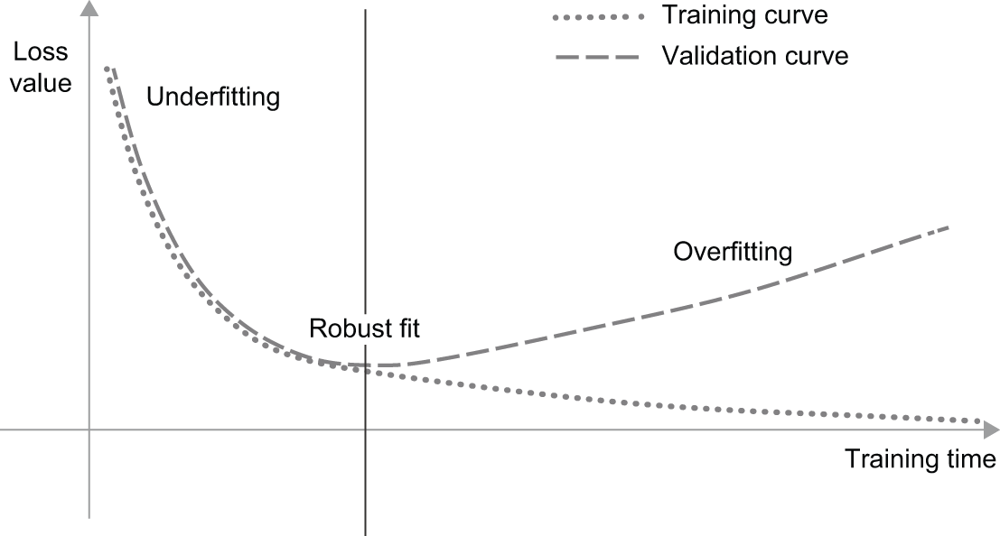


[Figure 5.1](#figure-5-1): Canonical overfitting behavior

At the beginning of training, optimization and generalization are correlated:
the lower the loss on training data, the lower the loss on test data. While
this is happening, your model is said to be *underfit*: there is still
progress to be made; the network hasn’t yet modeled all relevant patterns in
the training data. But after a certain number of iterations on the training
data, generalization stops improving, and validation metrics stall and then
begin to degrade: the model is starting to overfit. That is, it’s beginning to
learn patterns that are specific to the training data but that are misleading
or irrelevant when it comes to new data.

Overfitting is particularly likely to occur when your data is noisy, if it
involves uncertainty, or if it includes rare features.
Let’s look at concrete examples.

#### Noisy training data

In real-world datasets, it’s fairly common for some inputs to be invalid.
Perhaps a MNIST digit could be an all-black image, for instance —
or something like figure 5.2.

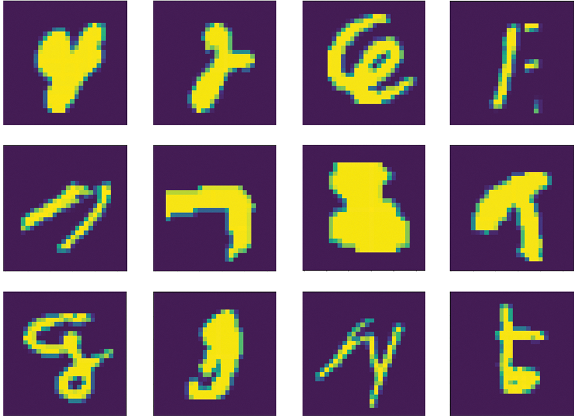


[Figure 5.2](#figure-5-2): Some pretty weird MNIST training samples

What are these? We don’t know either. But they’re all part of the MNIST
training set. What’s even worse, however, is having
perfectly valid inputs that end up mislabeled, like those shown in figure 5.3.

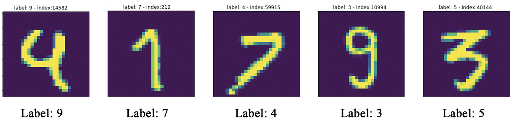


[Figure 5.3](#figure-5-3): Mislabeled MNIST training samples

If a model goes out of its way to incorporate such outliers, its generalization
performance will degrade, as shown in figure 5.4.
For instance, a 4 that looks very close to the mislabeled 4 in figure 5.3 may end
up getting classified as a 9.

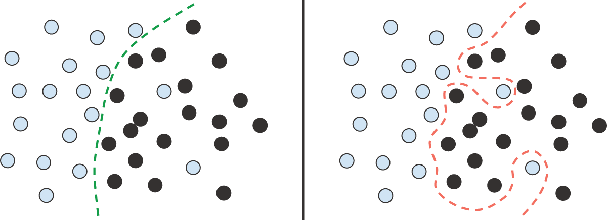


[Figure 5.4](#figure-5-4): Dealing with outliers: robust fit vs. overfitting

#### Ambiguous features

Not all data noise comes from inaccuracies — even perfectly clean and neatly
labeled data can be noisy when the problem involves uncertainty and ambiguity (see figure 5.5).
In classification tasks, it is often the case that some
regions of the input feature space are associated with multiple classes at the
same time. Let’s say you’re developing a model that takes an image of a banana
and predicts whether the banana is unripened, ripe, or rotten. These categories
have no objective boundaries, so the same picture might be classified as
either unripened or ripe by different human labelers. Similarly,
many problems involve randomness. You could use atmospheric pressure data
to predict whether it will rain tomorrow, but the exact same measurements
may be followed sometimes by rain, sometimes by a clear sky — with some probability.

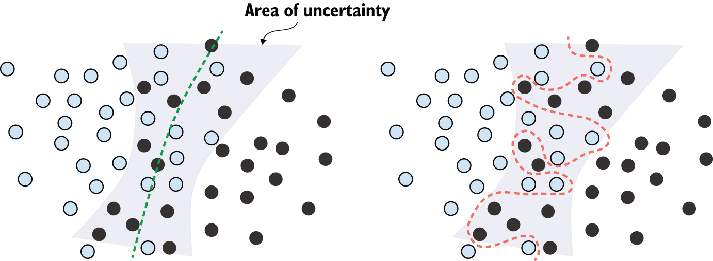


[Figure 5.5](#figure-5-5): Robust fit vs. overfitting giving an ambiguous area of the feature space

A model could overfit to such probabilistic data by being too confident about
ambiguous regions of the feature space, like in figure 5.6. A more
robust fit would ignore individual data points and look at the bigger
picture.

#### Rare features and spurious correlations

If you’ve only ever seen two orange tabby cats in your life, and they both
happened to be terribly antisocial, you might infer that orange tabby cats
are generally likely to be antisocial. That’s overfitting: if you had been
exposed to a wider variety of cats, including more orange ones,
you’d have learned that cat color is not well correlated with character.

Likewise, machine learning models trained on datasets that include rare feature
values are highly susceptible to overfitting. In a sentiment classification task,
if the word “cherimoya” (a fruit native to the Andes)
only appears in one text in the training data,
and this text happens to be negative in sentiment, a poorly regularized
model might put a very high weight on this word and always classify new texts
that mention cherimoyas as negative, whereas, objectively,
there’s nothing negative about the cherimoya.
[[1]](#footnote-1)

Importantly, a feature value doesn’t need to occur only a couple of times
to lead to spurious correlations.
Consider a word that occurs in 100 samples in your training
data, and that’s associated with a positive sentiment 54% of the time and
with a negative sentiment 46% of the time.
That difference may well be a complete statistical fluke, yet
your model is likely to learn to use that feature for its classification
task. This is one of the most common sources of overfitting.

Here’s a striking example. Take MNIST.
Create a new training set by concatenating 784 white noise dimensions
to the existing 784 dimensions of the data — so half of the data is now noise.
For comparison, also create an equivalent dataset by
concatenating 784 all-zeros dimensions. Our concatenation of meaningless
features does not at all affect the information content of the data: we’re
only adding irrelevant data points. Human classification accuracy wouldn’t be affected
by these transformations at all.

```python
from keras.datasets import mnist
import numpy as np

(train_images, train_labels), _ = mnist.load_data()
train_images = train_images.reshape((60000, 28 * 28))
train_images = train_images.astype("float32") / 255

train_images_with_noise_channels = np.concatenate(
    [train_images, np.random.random((len(train_images), 784))], axis=1
)

train_images_with_zeros_channels = np.concatenate(
    [train_images, np.zeros((len(train_images), 784))], axis=1
)
```

[Listing 5.1](#listing-5-1): Adding white noise channels or all-zeros channels to MNIST

Now, let’s train the model from chapter 2 on both of these training sets.

```python
import keras
from keras import layers

def get_model():
    model = keras.Sequential(
        [
            layers.Dense(512, activation="relu"),
            layers.Dense(10, activation="softmax"),
        ]
    )
    model.compile(
        optimizer="adam",
        loss="sparse_categorical_crossentropy",
        metrics=["accuracy"],
    )
    return model

model = get_model()
history_noise = model.fit(
    train_images_with_noise_channels,
    train_labels,
    epochs=10,
    batch_size=128,
    validation_split=0.2,
)

model = get_model()
history_zeros = model.fit(
    train_images_with_zeros_channels,
    train_labels,
    epochs=10,
    batch_size=128,
    validation_split=0.2,
)
```

[Listing 5.2](#listing-5-2): Training the same model on MNIST data with noise channels or all-zero channels

Despite the data holding the same information in both cases,
the validation accuracy of the model trained with noise channels ends up about
one percentage point lower — purely through the influence of
spurious correlations (figure 5.6). The more noise channels you might add, the further accuracy
would degrade.

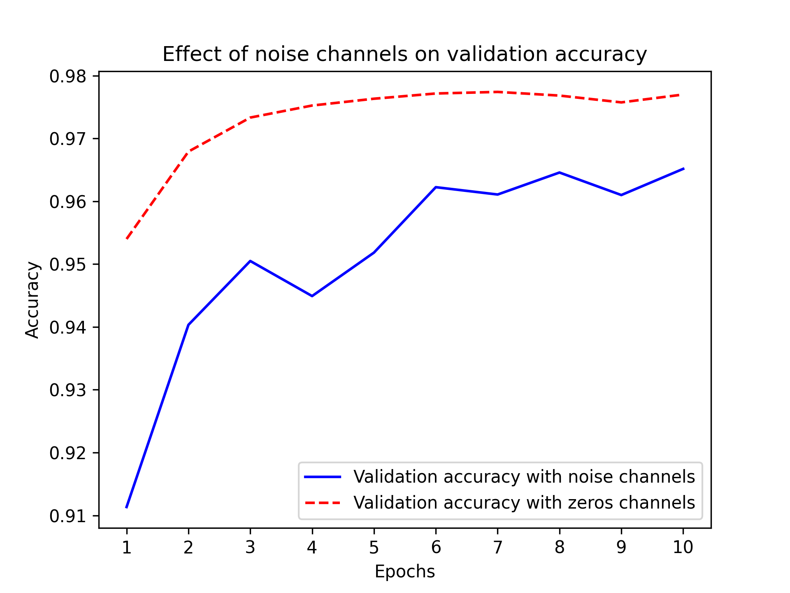


[Figure 5.6](#figure-5-6): Effect of noise channels on validation accuracy

Noisy features inevitably lead to overfitting.
As such, in cases where you aren’t
sure whether the features you have are informative or distracting,
it’s common to do *feature selection* before training. Restricting the IMDB data
to the top 10,000 most common words was a crude form of feature selection, for
instance. The typical way to do feature selection is to compute some
usefulness score for each feature available — a measure of
how informative the feature is with respect to the task, such as the
mutual information between the feature and the labels — and only keep features
that are above some threshold. Doing this would filter out the white noise
channels in the preceding example.

### The nature of generalization in deep learning

A remarkable fact about deep learning models is that they can be trained to
fit anything, as long as they have enough representational power.

Don’t believe me? Try shuffling the order of the MNIST labels and train a model on that.
Even though there is no relationship whatsoever between the inputs and
the shuffled labels, the training loss goes down just fine,
even with a relatively small model. Naturally, the validation loss does not
improve at all over time, since there is no possibility of generalization in
this setting.

```python
(train_images, train_labels), _ = mnist.load_data()
train_images = train_images.reshape((60000, 28 * 28))
train_images = train_images.astype("float32") / 255

# Copies train_labels
random_train_labels = train_labels[:]
np.random.shuffle(random_train_labels)

model = keras.Sequential(
    [
        layers.Dense(512, activation="relu"),
        layers.Dense(10, activation="softmax"),
    ]
)
model.compile(
    optimizer="rmsprop",
    loss="sparse_categorical_crossentropy",
    metrics=["accuracy"],
)
model.fit(
    train_images,
    random_train_labels,
    epochs=100,
    batch_size=128,
    validation_split=0.2,
)
```

[Listing 5.3](#listing-5-3): Fitting an MNIST model with randomly shuffled labels

In fact, you don’t even need to do this with MNIST data — you could just
generate white noise inputs and random labels. You could fit a model on that,
too, as long as it has enough parameters. It would just end up memorizing
specific inputs, much like a Python dictionary.

If this is the case, then why do deep learning models generalize at all?
Shouldn’t they just learn an ad hoc mapping between training inputs and targets,
like a fancy `dict`? What expectation can we have that this mapping will work
for new inputs?

As it turns out, the nature of generalization in deep learning
has rather little to do with deep learning models themselves
and much to do with the structure of information in the real world.
Let’s take a look at what’s really going on here.

#### The manifold hypothesis

The input to an MNIST classifier (before preprocessing)
is a 28 × 28 array of integers between 0 and 255. The total number of
possible input values is thus 256 to the power of 784 — much greater
than the number of atoms in the universe. However, very few of these inputs
would look like valid MNIST samples: actual handwritten digits only occupy
a tiny *subspace* of the parent space of all possible 28 x 28 `uint8` arrays.
What’s more, this subspace isn’t just a set of points sprinkled at random
in the parent space: it is highly structured.

First, the subspace of valid handwritten digits is *continuous*:
if you take a sample and modify it a little, it will still be
recognizable as the same handwritten digit. Further, all samples in the valid
subspace are *connected* by smooth paths that run through the subspace.
This means that if you take two random MNIST digits A and B, there exists a
sequence of “intermediate” images that morph A into B, such that two
consecutive digits are very close to each other (see figure 5.7). Perhaps
there will be a few ambiguous shapes close to the boundary between two classes,
but even these shapes would still look very digit-like.

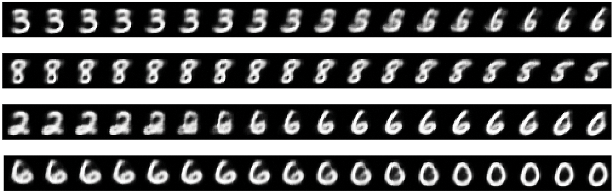


[Figure 5.7](#figure-5-7): Different MNIST digits gradually morphing into one another, showing that the space of handwritten digits forms a “manifold.” This image was generated using code from chapter 17.

In technical terms, you would say that handwritten digits form a *manifold*
within the space of possible 28 × 28 `uint8` arrays. That’s a big word, but
the concept is pretty intuitive. A manifold is a lower-dimensional subspace
of some parent space that is locally similar to a linear (Euclidean) space.
For instance, a smooth curve in the plane is a 1D manifold within a 2D space
because for every point of the curve, you can draw a tangent (the curve
can be approximated by a line in every point). A smooth surface within a 3D
space is a 2D manifold. And so on.

More generally, the *manifold hypothesis* posits that all natural data lies
on a low-dimensional manifold within the high-dimensional space where
it is encoded. That’s a pretty strong statement about the structure of
information in the universe. As far as we know, it’s accurate,
and it’s the reason why deep learning works. It’s true for MNIST digits,
as well as for human faces, tree morphology, the sounds of the human voice,
and even natural language.

The manifold hypothesis implies

* Machine learning models only have to fit relatively simple,
  low-dimensional, highly structured subspaces within their potential input space
  (latent manifolds).
* Within one of these manifolds, it’s always possible to *interpolate*
  between two inputs — that is, morph one into another via a continuous
  path along which all points fall on the manifold.

The ability to interpolate between samples is the key to
understanding generalization in deep learning.

#### Interpolation as a source of generalization

If you work with data points that can be interpolated, you can start making
sense of points you’ve never seen before by relating them to other points
that lie close on the manifold. In other words, you can make sense of
the *totality* of the space using only a *sample* of the space. You can use
interpolation to fill in the blanks.

Note that interpolation on the latent manifold is different from linear
interpolation in the parent space, as illustrated in figure 5.8.
For instance, the average of pixels between two MNIST digits is usually not a valid digit.

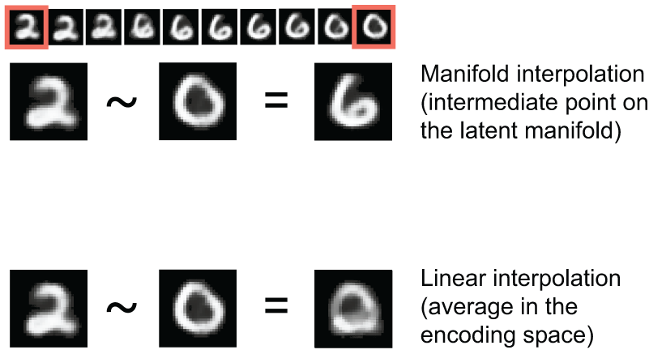


[Figure 5.8](#figure-5-8): Difference between linear interpolation and interpolation on the latent manifold. Every point on the latent manifold of digits is a valid digit, but the average of two digits usually isn’t.

Crucially, while deep learning achieves generalization via interpolation
on a learned approximation of the data manifold, it would be a mistake
to assume that interpolation is *all* there is to generalization. It’s the tip
of the iceberg. Interpolation can only help you make sense of things that are
very close to what you’ve seen before: it enables *local generalization*.
But remarkably, humans deal with extreme novelty all the time,
and they do just fine. You don’t need to be trained in advance on countless
examples of every situation you’ll ever have to encounter.
Every single one of your days is different from any day
you’ve experienced before, and different from any day experienced by anyone
since the dawn of humanity. You can switch between spending a week in NYC,
a week in Shanghai, and a week in Bangalore
without requiring thousands of lifetimes of learning and rehearsal
for each city.

Humans are capable of *extreme generalization*,
which is enabled by cognitive mechanisms other than interpolation —
abstraction, symbolic models of the world, reasoning, logic, common sense,
innate priors about the world — what we generally call *reason*, as opposed
to intuition and pattern recognition.
The latter are largely interpolative in nature, but the former isn’t. Both are
essential to intelligence. We’ll talk more about this in chapter 19.

#### Why deep learning works

Remember the crumpled paper ball metaphor from chapter 2? A sheet of paper
represents a 2D manifold within 3D space (figure 5.9). A deep learning model is a
tool for uncrumpling paper balls — that is, for disentangling
latent manifolds.


[Figure 5.9](#figure-5-9): Uncrumpling a complicated manifold of data

A deep learning model is basically a very high-dimensional curve.
The curve is smooth and continuous (with additional constraints on its structure,
originating from model architecture priors) because it needs to be differentiable.
And that curve is fitted to data points via gradient descent — smoothly and incrementally.
*By construction*, deep learning is about taking a big, complex curve — a manifold —
and incrementally adjusting its parameters until it fits some training data points.

The curve involves enough
parameters that it could fit anything. Indeed, if you let your model train for
long enough, it will effectively end up purely memorizing its training data
and won’t generalize at all. However, the data you’re fitting to isn’t made of
isolated points sparsely distributed across the underlying space.
Your data forms a highly structured, low-dimensional manifold within the input space
— that’s the manifold hypothesis. And because fitting your model curve to this data
happens gradually and smoothly over time, as gradient descent progresses,
there will be an intermediate point during training at which the model
roughly approximates the natural manifold of the data,
as you can see in figure 5.10.

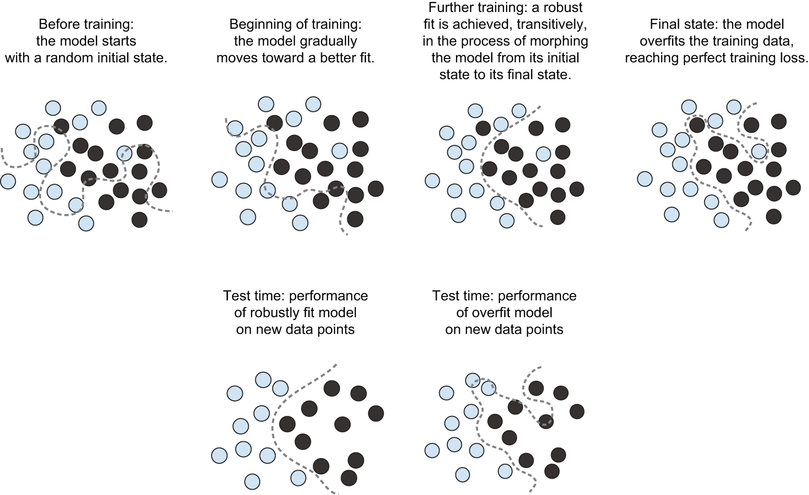


[Figure 5.10](#figure-5-10): Going from a random model to an overfit model and achieving a robust fit as an intermediate state

Moving along the curve learned by the model at
that point will come close to moving along the actual latent manifold of
the data. As such, the model will be capable of making sense of
never-before-seen inputs via interpolation between training inputs.

Besides the trivial fact that they have sufficient representational power,
there are a few properties of deep learning models that make
them particularly well suited to learning latent manifolds:

* Deep learning models implement a smooth, continuous mapping from their
  inputs to their outputs. It has to be smooth and continuous because it
  must be differentiable, by necessity (you couldn’t do gradient descent
  otherwise). This smoothness helps approximate latent manifolds,
  which follow the same properties.
* Deep learning models tend to be structured in a way that mirrors the “shape”
  of the information in their training data (via architecture priors). This
  is the case in particular for image-processing models (see chapters 8–12)
  and sequence-processing models (see chapter 13). More generally,
  deep neural networks structure their learned representations in a hierarchical
  and modular way, which echoes the way natural data is organized.

#### Training data is paramount

While deep learning is indeed well suited to manifold learning, the power to
generalize is more a consequence of the natural structure
of your data than a consequence of any property of your model. You’ll only be
able to generalize if your data forms a manifold where points can be
interpolated. The more informative and the less noisy your features are,
the better you will be able to generalize, since your input space will be
simpler and better structured. Data curation and feature engineering are
essential to generalization.

Further, because deep learning is curve fitting, for a model to perform well,
*it needs to be trained on a dense sampling of its input space*.
A “dense sampling” in this context means that the training data should densely
cover the entirety of the input data manifold (see figure 5.11). This is
especially true near decision boundaries. With a sufficiently dense sampling,
it becomes possible to make sense of new inputs by interpolating between past
training inputs, without having to use common-sense, abstract reasoning,
or external knowledge about the world — all things that machine learning models
have no access to.

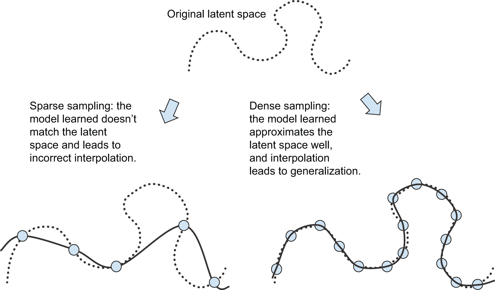


[Figure 5.11](#figure-5-11): A dense sampling of the input space is necessary to learn a model capable of accurate generalization.

As such, you should always keep in mind that the best way to improve a deep
learning model is to train it on more data or better data
(of course, adding overly noisy or inaccurate data will harm generalization).
A denser coverage of the input data manifold will yield a model that
generalizes better. You should never expect a deep learning model to perform
anything more than crude interpolation between its training samples, and thus,
you should do everything you can to make interpolation as easy as possible.
The only thing you will find in a deep learning model is what you put into it:
the priors encoded in its architecture and the data it was trained on.

When getting more data isn’t possible, the next-best solution is to modulate
the quantity of information that your model is allowed to store, or to add
constraints on the smoothness of the model curve. If a network can
only afford to memorize a small number of patterns, or very regular patterns,
the optimization process will force it to focus on the most prominent patterns,
which have a better chance of generalizing well. The process of fighting
overfitting this way is called *regularization*. We’ll review regularization
techniques in depth in section 5.4.4.

Before you can start tweaking your model to help it generalize better,
you need a way to assess how your model is currently doing. In the following
section, you’ll learn about how you can monitor generalization during
model development: model evaluation.

## Evaluating machine-learning models

You can only control what you can observe. Since your goal is to develop
models that can successfully generalize to new data, it’s essential to
be able to reliably measure the generalization power of your model.
In this section, we’ll formally introduce the different ways you can evaluate
machine learning models. You’ve already seen most of them in action in the
previous chapter.

### Training, validation, and test sets

Evaluating a model always boils down to splitting the
available data into three sets: training, validation, and test. You train on
the training data and evaluate your model on the validation data. Once your
model is ready for prime time, you test it one final time on the test data, which
is meant to be as similar as possible to production data. Then you can deploy
the model in production.

You may ask, why not have two sets: a training set and a test set? You’d train
on the training data and evaluate on the test data. Much simpler!

The reason is that developing a model always involves tuning its configuration:
for example, choosing the number of layers or the size of the layers (called
the *hyperparameters* of the model, to distinguish them
from the *parameters*, which are the network’s weights). You do
this tuning by using as a feedback signal the performance of the model on the
validation data. In essence, this tuning is a form of *learning*: a search
for a good configuration in some parameter space. As a result, tuning the
configuration of the model based on its performance on the validation set can
quickly result in *overfitting to the validation set*,
even though your model is never directly trained on it.

Central to this phenomenon is the notion of *information leaks*.
Every time you tune a hyperparameter of your model based on the
model’s performance on the validation set, some information about the
validation data leaks into the model. If you do this only once, for one
parameter, then very few bits of information will leak, and your validation
set will remain reliable to evaluate the model. But if you repeat this many
times — running one experiment, evaluating on the validation set, and modifying
your model as a result — then you’ll leak an increasingly significant amount of
information about the validation set into the model.

At the end of the day, you’ll end up with a model that performs artificially
well on the validation data because that’s what you optimized it for. You
care about performance on completely new data, not the validation data, so you
need to use a completely different, never-before-seen dataset to evaluate the
model: the test dataset. Your model shouldn’t have had access to *any*
information about the test set, even indirectly. If anything about the model
has been tuned based on test set performance, then your measure of
generalization will be flawed.

Splitting your data into training, validation, and test
sets may seem straightforward, but there are a few advanced ways to do it that
can come in handy when little data is available. Let’s review three classic
evaluation recipes: simple hold-out validation, K-fold validation, and
iterated K-fold validation with shuffling. We’ll also talk about the use
of common-sense baselines to check that your training is going somewhere.

#### Simple hold-out validation

Set apart some fraction of your data
as your test set. Train on the remaining data, and evaluate on the test set.
As you saw in the previous sections, to prevent information leaks,
you shouldn’t tune your model based on the test set, and therefore you should
*also* reserve a validation set.

Schematically, hold-out validation looks like figure
5.12. The following listing shows a simple implementation.

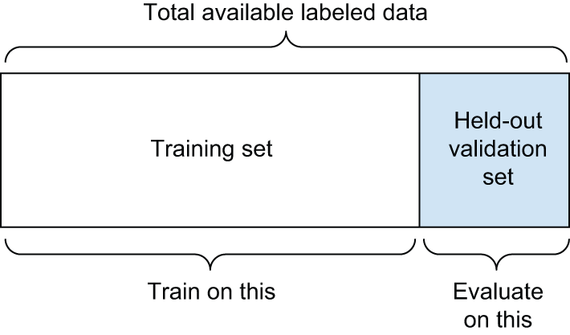


[Figure 5.12](#figure-5-12): Simple hold-out validation split


```python
num_validation_samples = 10000
# Shuffling the data is usually appropriate.
np.random.shuffle(data)
# Defines the validation set
validation_data = data[:num_validation_samples]
# Defines the training set
training_data = data[num_validation_samples:]
# Trains a model on the training data and evaluates it on the
# validation data
model = get_model()
model.fit(training_data, ...)
validation_score = model.evaluate(validation_data, ...)

# At this point, you can tune your model, retrain it, evaluate it, tune
# it again, and so on.
...

# Once you've tuned your hyperparameters, it's common to train your
# final model from scratch on all non-test data available.
model = get_model()
model.fit(
    np.concatenate([training_data, validation_data]),
    ...,
)
test_score = model.evaluate(test_data, ...)
```

[Listing 5.4](#listing-5-4): Hold-out validation (note that labels are omitted for simplicity)

This is the simplest evaluation protocol, and it suffers from one flaw: if
little data is available, then your validation and test sets may contain too
few samples to be statistically representative of the data at hand. This is
easy to recognize: if different random shuffling rounds of the data before
splitting end up yielding very different measures of model performance, then
you’re having this issue. K-fold validation and iterated K‑fold validation are
two ways to address this, as discussed next.

#### K-fold validation

With this approach, you split your data
into `K` partitions of equal size. For each partition `i`,
train a model on the remaining `K - 1` partitions and evaluate it on
partition `i`. Your final score is then the averages of the K scores obtained.
This method is helpful when the performance of your model shows significant
variance based on your train/test split. Like hold-out validation, this method
doesn’t exempt you from using a distinct validation set for model calibration.

Schematically, K-fold cross-validation looks like figure 5.13. Listing 5.6 shows
a simple implementation.

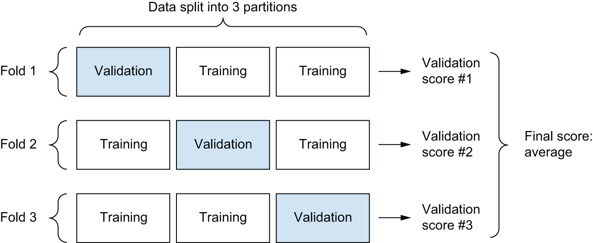


[Figure 5.13](#figure-5-13): Three-fold validation


```python
k = 3
num_validation_samples = len(data) // k
np.random.shuffle(data)
validation_scores = []
for fold in range(k):
    # Selects the validation-data partition
    validation_data = data[
        num_validation_samples * fold : num_validation_samples * (fold + 1)
    ]
    # Uses the remainder of the data as training data.
    training_data = np.concatenate(
        data[: num_validation_samples * fold],
        data[num_validation_samples * (fold + 1) :],
    )
    # Creates a brand-new instance of the model (untrained)
    model = get_model()
    model.fit(training_data, ...)
    validation_score = model.evaluate(validation_data, ...)
    validation_scores.append(validation_score)
# Validation score: average of the validation scores of the k folds
validation_score = np.average(validation_scores)
# Trains the final model on all non-test data available
model = get_model()
model.fit(data, ...)
test_score = model.evaluate(test_data, ...)
```

[Listing 5.5](#listing-5-5): K-fold cross-validation (note that labels are omitted for simplicity)

#### Iterated K-fold validation with shuffling

This one is for situations in which you have relatively little data available
and you need to evaluate your model as precisely as possible.
I’ve found it to be extremely
helpful in Kaggle competitions. It consists of applying K-fold validation
multiple times, shuffling the data every time before splitting it `K` ways.
The final score is the average of the scores obtained at each run of K-fold
validation. Note that you end up training and evaluating `P * K` models (where
`P` is the number of iterations you use), which can be very expensive.

### Beating a common-sense baseline

Besides the different evaluation protocols you have available, one last thing
you should know about is the use of common-sense baselines.

Training a deep learning model is a bit like pressing a button that launches
a rocket in a parallel world. You can’t hear it or see it. You
can’t observe the manifold learning process — it’s happening in a space with
thousands of dimensions, and even if you projected it to 3D, you couldn’t
interpret it. The only feedback you have is your validation metrics —
like an altitude meter on your invisible rocket.

A particularly important point is to be able to tell whether you’re getting off
the ground at all. What was the altitude you started at? Your model seems to
have an accuracy of 15%, is that any good? Before you start working with a
dataset, you should always pick a trivial baseline that you’ll try to
beat. If you cross that threshold, you’ll know you’re doing something right:
your model is actually using the information in the input data to make
predictions that generalize — you can keep going.
This baseline could be performance of a random classifier,
or the performance of the simplest non-machine learning technique
you can imagine.

For instance, in the MNIST digit-classification example,
a simple baseline would be a validation accuracy greater than 0.1
(random classifier); in the IMDB example, it would be a validation accuracy
greater than 0.5. In the Reuters example, it would be around 0.18–0.19,
due to class imbalance. If you have a binary classification problem
where 90% of samples belong to class A and 10% belong to class B, then a
classifier that always predicts A already achieves 0.9 in validation accuracy,
and you’ll need to do better than that.

Having a common sense baseline you can refer to is essential when you’re
getting started on a problem no one has solved before. If you can’t beat
a trivial solution, your model is worthless — perhaps you’re using the
wrong model or perhaps the problem you’re tackling can’t even be approached
with machine learning in the first place. Time to go back to the drawing board.

### Things to keep in mind about model evaluation

Keep an eye out for the following when you’re choosing an evaluation protocol:

* *Data representativeness*  — You want both your
  training set and test set to be representative of the data at hand. For
  instance, if you’re trying to classify images of digits, and you’re starting
  from an array of samples where the samples are ordered by their class, taking
  the first 80% of the array as your training set and the remaining 20% as your
  test set will result in your training set containing only classes 0–7, whereas
  your test set contains only classes 8–9. This seems like a ridiculous mistake,
  but it’s surprisingly common. For this reason, you usually should *randomly
  shuffle* your data before splitting it into training and test sets.

* *The arrow of time*  — If you’re trying to predict the
  future given the past (for example, tomorrow’s weather, stock movements, and
  so on), you should not randomly shuffle your data before splitting it because
  doing so will create a *temporal leak*: your model will
  effectively be trained on data from the future. In such situations, you should
  always make sure all data in your test set is *posterior* to the data in the
  training set.

* *Redundancy in your data*  — If some data points in
  your data appear twice (fairly common with real-world data), then shuffling
  the data and splitting it into a training set and a validation set will result
  in redundancy between the training and validation sets. In effect, you’ll be
  testing on part of your training data, which is the worst thing you can do!
  Make sure your training set and validation set are disjoint.

Having a reliable way to evaluate the performance of your
model is how you’ll be able to monitor the tension
at the heart of machine learning — between optimization and generalization,
underfitting and overfitting.

## Improving model fit

To achieve the perfect fit, you must first overfit. Since you don’t know
in advance where the boundary lies, you must cross it to find it. Thus, your
initial goal as you start working on a problem is to achieve a model that
shows some generalization power, and that is able to overfit. Once you have
such a model, you’ll focus on refining generalization by fighting overfitting.

There are three common problems you’ll encounter at this stage:

* Training doesn’t get started: your training loss doesn’t go down over time.
* Training gets started just fine, but your model doesn’t meaningfully
  generalize: you can’t beat the common-sense baseline you set.
* Training and validation loss both go down over time, and you can beat
  your baseline, but you don’t seem to be able to overfit, which indicates
  you’re still underfitting.

Let’s see how you can address these issues to achieve the first big milestone
of a machine learning project: getting a model that has some
generalization power (it can beat a trivial baseline) and is able to
overfit.

### Tuning key gradient descent parameters

Sometimes, training doesn’t get started or stalls too early.
Your loss is stuck. This is *always* something you can overcome: remember that
you can fit a model to random data. Even if nothing about your problem makes
sense, you should *still* be able to train something —
if only by memorizing the training data.

When this happens, it’s always a problem with the configuration of the
gradient descent process: your choice of optimizer, the distribution of initial
values in the weights of your model, your learning rate, or your batch size.
All these parameters are interdependent, and as such, it is usually sufficient
to tune the learning rate and the batch size while maintaining the rest of
the parameters constant.

Let’s look at a concrete example: let’s train the MNIST model from
chapter 2 with an inappropriately large learning rate, of value 1.

```python
(train_images, train_labels), _ = mnist.load_data()
train_images = train_images.reshape((60000, 28 * 28))
train_images = train_images.astype("float32") / 255

model = keras.Sequential(
    [
        layers.Dense(512, activation="relu"),
        layers.Dense(10, activation="softmax"),
    ]
)
model.compile(
    optimizer=keras.optimizers.RMSprop(learning_rate=1.0),
    loss="sparse_categorical_crossentropy",
    metrics=["accuracy"],
)
model.fit(
    train_images, train_labels, epochs=10, batch_size=128, validation_split=0.2
)
```

[Listing 5.6](#listing-5-6): Training an MNIST model with an incorrectly high learning rate

The model quickly reaches a training and validation accuracy in the 20% to 40%
range, but cannot get past that. Let’s try to lower the learning rate to
a more reasonable value of `1e-2`:

```python
model = keras.Sequential(
    [
        layers.Dense(512, activation="relu"),
        layers.Dense(10, activation="softmax"),
    ]
)
model.compile(
    optimizer=keras.optimizers.RMSprop(learning_rate=1e-2),
    loss="sparse_categorical_crossentropy",
    metrics=["accuracy"],
)
model.fit(
    train_images, train_labels, epochs=10, batch_size=128, validation_split=0.2
)
```

[Listing 5.7](#listing-5-7): The same model with a more appropriate learning rate

The model is now able to train.

If you find yourself in a similar situation, try

* Lowering or increasing the learning rate. A learning rate that is too high
  may lead to updates that vastly overshoot a proper fit,
  like in the previous example, and a learning
  rate that is too low may make training so slow that it appears to stall.
* Increasing the batch size. A batch with more samples will lead to gradients
  that are more informative and less noisy (lower variance).

You will, eventually, find a configuration that gets training started.

### Using better architecture priors

You have a model that fits, but for some reason your validation metrics
aren’t improving at all. They remain no better than what a random classifier
would achieve: your model trains, but doesn’t generalize. What’s going on?

This is perhaps the worst machine learning situation you can find yourself in.
It indicates that *something is fundamentally wrong with your approach*, and
it may not be easy to tell what. Here are some tips.

First, it may be that the input data you’re using simply doesn’t contain
sufficient information to predict your targets: the problem as formulated is
not solvable. This is what happened earlier when we tried to fit an MNIST model
where the labels were shuffled: the model would train just fine,
but validation accuracy would stay stuck at 10%,
because it was plainly impossible to generalize with such a dataset.

It may also be that the kind of model you’re using is not suited for the problem
at hand. For instance, in chapter 13, you’ll see an example of a timeseries
prediction problem where a densely connected architecture isn’t able to beat
a trivial baseline, whereas a more appropriate
recurrent architecture does manage to generalize well.
Using a model that makes the right assumptions about the problem is essential
to achieve generalization: you should use the right architecture priors.

In the following chapters, you’ll learn about the best architectures to use
for a variety of data modalities — images, text, timeseries, and so on. In
general, you should always make sure to read up on architecture
best practices for the kind of task you’re attacking —
chances are you’re not the first person to attempt it.

### Increasing model capacity

If you manage to get to a model that fits, where validation metrics are going
down, and that seems to achieve at least some level of generalization power,
congratulations: you’re almost there. Next, you need to get your model to
start overfitting.

Consider the following small model — a simple logistic regression —
trained on MNIST pixels.

```python
model = keras.Sequential([layers.Dense(10, activation="softmax")])
model.compile(
    optimizer="rmsprop",
    loss="sparse_categorical_crossentropy",
    metrics=["accuracy"],
)
history_small_model = model.fit(
    train_images, train_labels, epochs=20, batch_size=128, validation_split=0.2
)
```

[Listing 5.8](#listing-5-8): A simple logistic regression on MNIST

You get loss curves that look like this (see figure 5.14):

```python
import matplotlib.pyplot as plt

val_loss = history_small_model.history["val_loss"]
epochs = range(1, 21)
plt.plot(epochs, val_loss, "b-", label="Validation loss")
plt.title("Validation loss for a model with insufficient capacity")
plt.xlabel("Epochs")
plt.ylabel("Loss")
plt.legend()
plt.show()
```


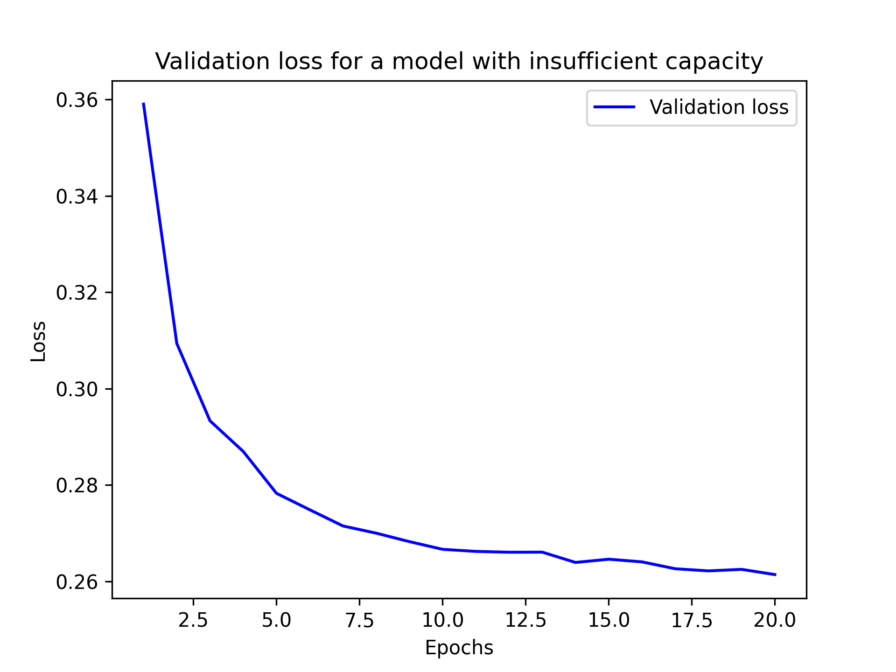


[Figure 5.14](#figure-5-14): Effect of insufficient model capacity on loss curves

Validation metrics seem to stall or to improve very slowly,
instead of peaking and reversing course. The validation loss goes
to 0.26 and just stays there. You can fit, but you can’t
clearly overfit, even after many iterations over the
training data. You’re likely to encounter similar curves often in your career.

Remember that it should always be possible to overfit. Much like the problem
“the training loss doesn’t go down,” this is an issue that can always be solved.
If you can’t seem to be able to overfit,
it’s likely a problem with the *representational power* of your
model: you’re going to need a bigger model, one with more *capacity* —
that is, able to store more information. You can increase representational
power by adding more layers, using bigger layers (layers with more parameters),
or using kinds of layers that are more appropriate for the problem at hand
(better architecture priors).

Let’s try training a bigger model, one with two intermediate layers with 128
units each:

```python
model = keras.Sequential(
    [
        layers.Dense(128, activation="relu"),
        layers.Dense(128, activation="relu"),
        layers.Dense(10, activation="softmax"),
    ]
)
model.compile(
    optimizer="rmsprop",
    loss="sparse_categorical_crossentropy",
    metrics=["accuracy"],
)
history_large_model = model.fit(
    train_images,
    train_labels,
    epochs=20,
    batch_size=128,
    validation_split=0.2,
)
```

The training curves now look exactly like they should: the model fits
fast and starts overfitting after eight epochs (see figure 5.15):

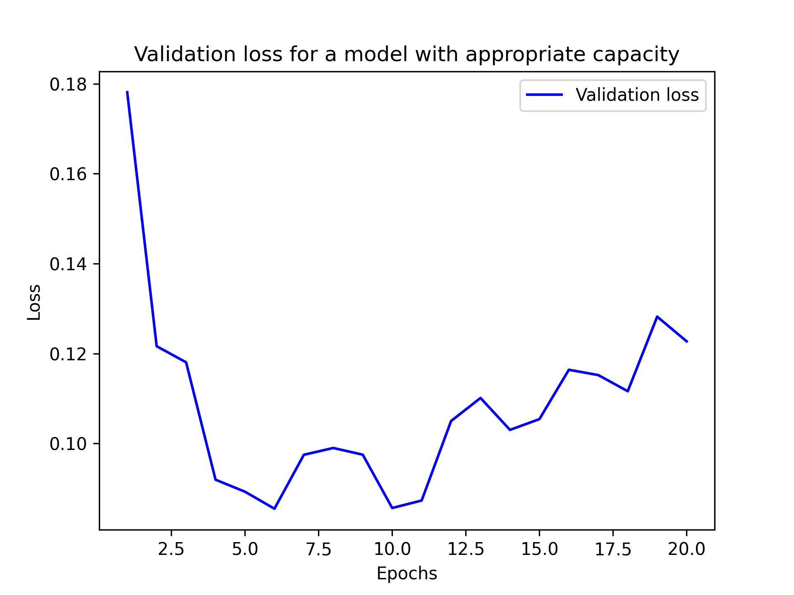


[Figure 5.15](#figure-5-15): Validation loss for a model with appropriate capacity

Note that while it is standard to work with models that are way
overparameterized for the problem at hand,
there can definitely be such a thing as *too much*
memorization capacity. You’ll know your model is too large if it starts
overfitting right away. Here’s what happens for an MNIST
model with three intermediate layers with 2,048 units each (see figure 5.16):

```python
model = keras.Sequential(
    [
        layers.Dense(2048, activation="relu"),
        layers.Dense(2048, activation="relu"),
        layers.Dense(2048, activation="relu"),
        layers.Dense(10, activation="softmax"),
    ]
)
model.compile(
    optimizer="rmsprop",
    loss="sparse_categorical_crossentropy",
    metrics=["accuracy"],
)
history_very_large_model = model.fit(
    train_images,
    train_labels,
    epochs=20,
    # When training larger models, you can reduce the batch size to
    # limit memory consumption.
    batch_size=32,
    validation_split=0.2,
)
```


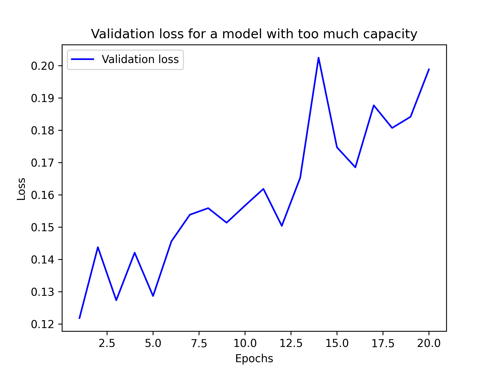


[Figure 5.16](#figure-5-16): Effect of excessive model capacity on validation loss

## Improving generalization

Once your model has shown to have some generalization power and to be able
to overfit, it’s time to switch your focus toward maximizing generalization.

### Dataset curation

You’ve already learned that generalization in deep learning originates from the
latent structure of your data. If your data makes it possible to smoothly
interpolate between samples, then you will be able to train a deep learning
model that generalizes. If your problem is overly noisy or fundamentally
discrete, like, say, list sorting, deep learning will not help you.
Deep learning is curve fitting, not magic.

As such, it is essential that you make sure that you’re working with an
appropriate dataset. Spending more effort and money on data collection almost
always yields a much greater return on investment than spending the same
on developing a better model:

* Make sure you have enough data. Remember that you need a *dense sampling*
  of the input-cross-output space. More data will yield a better model.
  Sometimes, problems that seem impossible at first
  become solvable with a larger dataset.
* Minimize labeling errors — visualize your inputs to check for anomalies,
  and proofread your labels.
* Clean your data and deal with missing values (we cover this in the next chapter).
* If you have many features and you aren’t sure which ones are actually
  useful, do feature selection.

A particularly important way you can improve the generalization potential
of your data is *feature engineering*. For most machine learning problems,
*feature engineering* is a key ingredient for success. Let’s take a look.

### Feature engineering

*Feature engineering* is the process of using your own knowledge about the data
and about the machine learning algorithm at hand (in this case, a neural
network) to make the algorithm work better by applying hardcoded (non-learned)
transformations to the data before it goes into the model. In many cases, it
isn’t reasonable to expect a machine learning model to be able to learn from
completely arbitrary data. The data needs to be presented to the model in a
way that will make the model’s job easier.

Let’s look at an intuitive example. Suppose you’re trying to develop a model
that can take as input an image of a clock and can output the time of day (see
figure 5.17). If you choose to use the raw pixels of the image as input data, then you have a
difficult machine learning problem on your hands. You’ll need a convolutional
neural network to solve it, and you’ll have to expend quite a bit of
computational resources to train the network.

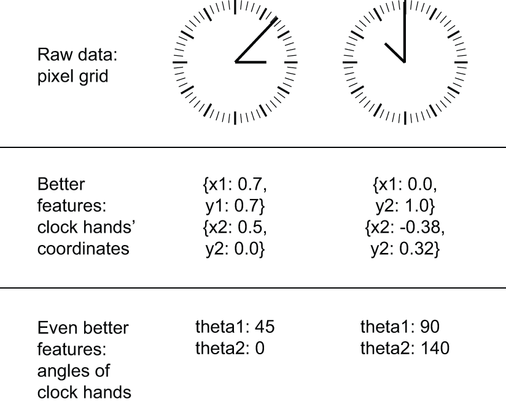


[Figure 5.17](#figure-5-17): Feature engineering for reading the time on a clock

But if you already understand the problem at a high level (you understand how
humans read time on a clock face), then you can come up with much better input
features for a machine learning algorithm: for instance, it’s easy to write a
five-line Python script to follow the black pixels of the clock hands and
output the `(x, y)` coordinates of the tip of each hand. Then a simple
machine learning algorithm can learn to associate these coordinates with the
appropriate time of day.

You can go even further: do a coordinate change and express the `(x, y)`
coordinates as polar coordinates with regard to the center of the image. Your
input will become the angle `theta` of each clock hand. At this point, your
features are making the problem so easy that no machine learning is required;
a simple rounding operation and dictionary lookup are enough to recover the
approximate time of day.

That’s the essence of feature engineering: making a problem easier by
expressing it in a simpler way. Make the latent manifold
smoother, simpler, and better organized.
It usually requires understanding the problem in depth.

Before deep learning, feature engineering used to be the most important
part of the machine learning workflow because
classical shallow algorithms didn’t have hypothesis spaces rich enough to
learn useful features by themselves. The way you presented the data to the
algorithm was absolutely critical to its success.
For instance, before convolutional neural networks became successful
on the MNIST digit-classification problem,
solutions were typically based on hardcoded features such as the number of
loops in a digit image, the height of each digit in an image, a histogram of
pixel values, and so on.

Fortunately, modern deep learning removes the need for most feature
engineering because neural networks are capable of automatically extracting
useful features from raw data. Does this mean you don’t have to worry about
feature engineering as long as you’re using deep neural networks? No, for two
reasons:

* Good features still allow you to solve problems more elegantly while
  using fewer resources. For instance, it would be ridiculous to solve the
  problem of reading a clock face using a convolutional neural network.
* Good features let you solve a problem with far less data. The ability of
  deep-learning models to learn features on their own relies on having lots of
  training data available; if you have only a few samples, then the information
  value in their features becomes critical.

### Using early stopping

In deep learning, we always use models that are vastly overparameterized:
they have way more degrees of freedom than the minimum necessary to fit to
the latent manifold of the data. This overparameterization is not an issue
because *you never fully fit a deep learning model*.
Such a fit wouldn’t generalize at all. You will always interrupt training
long before you’ve reached the minimum possible training loss.

Finding the exact point during training where you’ve reached the most
generalizable fit — the exact boundary between an underfit curve
and an overfit curve — is one of the most effective things you can do
to improve generalization.

In the examples from the previous chapter, we would start by training our
models for longer than needed to figure out the number of epochs that yielded
the best validation metrics, then we would retrain a new model for exactly
that number of epochs. This is pretty standard. However, it requires you to
do redundant work, which can sometimes be expensive. Naturally, you
could just save your model at the end of each epoch, then once you’ve found the
best epoch, reuse the closest saved model you have. In Keras, it’s
typical to do this with an `EarlyStopping` callback, which will interrupt
training as soon as validation metrics have stopped improving, while remembering
the best known model state. You’ll learn to use callbacks in chapter 7.

### Regularizing your model

*Regularization techniques* are a set of best practices that
actively impede the model’s ability to fit perfectly to the training data,
with the goal of making the model perform better during validation.
This is called “regularizing” the model because it
tends to make the model simpler, more “regular,” its curve smoother, and
more “generic” — thus less specific to the training set and better
able to generalize by more closely approximating the latent manifold
of the data. Keep in mind that “regularizing” a model is a process that should always
be guided by an accurate evaluation procedure.
You will only achieve generalization if you can measure it.

Let’s review some of the most common regularization techniques and apply them
in practice to improve the movie classification model from chapter 4.

#### Reducing the network’s size

You’ve already learned that a model that is too small will not overfit.
The simplest way to mitigate overfitting is to reduce the size of the model
(the number of learnable parameters in the model, determined by the
number of layers and the number of units per layer). If the model has limited
memorization resources, it won’t be able to simply memorize its training data.
To minimize its loss, it will have to resort to learning compressed
representations that have predictive power regarding the targets — precisely
the type of representations we’re interested in. At the same time,
keep in mind that you should use models
that have enough parameters that they don’t underfit: your model shouldn’t be
starved for memorization resources. There is a compromise to be found between
*too much capacity* and *not enough capacity*.

Unfortunately, there is no magical formula to determine the right number of
layers or the right size for each layer. You must evaluate an array of
different architectures (on your validation set, not on your test set, of
course) to find the correct model size for your data. The general
workflow to find an appropriate model size is to start with relatively few
layers and parameters and increase the size of the layers or add new layers
until you see diminishing returns with regard to validation loss.

Let’s try this on the movie-review classification model. Here’s a condensed
version of the model from chapter 4.

```python
from keras.datasets import imdb

(train_data, train_labels), _ = imdb.load_data(num_words=10000)

def vectorize_sequences(sequences, dimension=10000):
    results = np.zeros((len(sequences), dimension))
    for i, sequence in enumerate(sequences):
        results[i, sequence] = 1.0
    return results

train_data = vectorize_sequences(train_data)

model = keras.Sequential(
    [
        layers.Dense(16, activation="relu"),
        layers.Dense(16, activation="relu"),
        layers.Dense(1, activation="sigmoid"),
    ]
)
model.compile(
    optimizer="rmsprop",
    loss="binary_crossentropy",
    metrics=["accuracy"],
)
history_original = model.fit(
    train_data,
    train_labels,
    epochs=20,
    batch_size=512,
    validation_split=0.4,
)
```

[Listing 5.9](#listing-5-9): Original model

Now let’s try to replace it with this smaller model.

```python
model = keras.Sequential(
    [
        layers.Dense(4, activation="relu"),
        layers.Dense(4, activation="relu"),
        layers.Dense(1, activation="sigmoid"),
    ]
)
model.compile(
    optimizer="rmsprop",
    loss="binary_crossentropy",
    metrics=["accuracy"],
)
history_smaller_model = model.fit(
    train_data,
    train_labels,
    epochs=20,
    batch_size=512,
    validation_split=0.4,
)
```

[Listing 5.10](#listing-5-10): Version of the model with lower capacity

Figure 5.18 shows a comparison of the validation losses of the original model
and the smaller model.

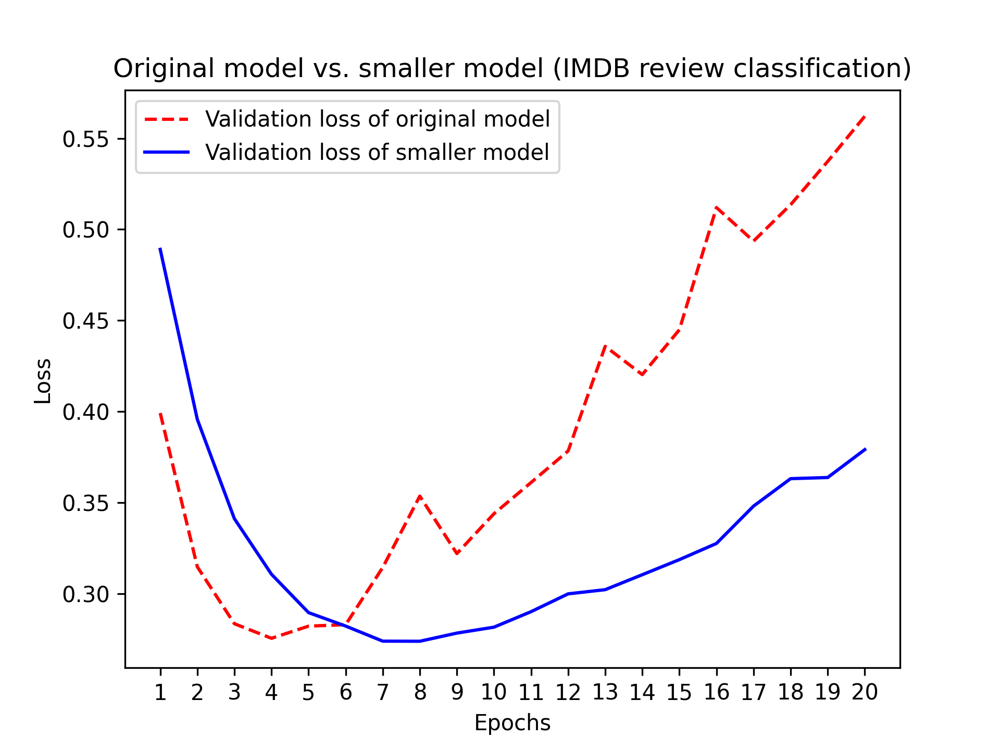


[Figure 5.18](#figure-5-18): Original model vs. smaller model on IMDb review classification

As you can see, the smaller model starts overfitting later than the reference
model (after six epochs rather than four), and its performance degrades more
slowly once it starts overfitting.

Now, let’s add to our benchmark a model that has much more capacity — far more
than the problem warrants.

```python
model = keras.Sequential(
    [
        layers.Dense(512, activation="relu"),
        layers.Dense(512, activation="relu"),
        layers.Dense(1, activation="sigmoid"),
    ]
)
model.compile(
    optimizer="rmsprop",
    loss="binary_crossentropy",
    metrics=["accuracy"],
)
history_larger_model = model.fit(
    train_data,
    train_labels,
    epochs=20,
    batch_size=512,
    validation_split=0.4,
)
```

[Listing 5.11](#listing-5-11): Version of the model with higher capacity

Figure 5.19 shows how the bigger model fares compared to the reference
model. The bigger model starts overfitting almost immediately, after just one epoch,
and it overfits much more severely. Its validation loss is also noisier.
It gets training loss near zero very quickly. The
more capacity the model has, the more quickly it can model the training data
(resulting in a low training loss), but the more susceptible it is to
overfitting (resulting in a large difference between the training and
validation loss).

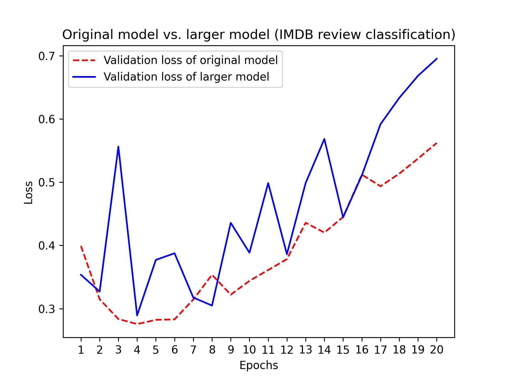


[Figure 5.19](#figure-5-19): Original model vs. much larger model on IMDB review classification

#### Adding weight regularization

You may be familiar with the principle of *Occam’s razor*: given two explanations for
something, the explanation most likely to be correct is the simplest one — the
one that makes fewer assumptions. This idea also applies to the models learned
by neural networks: given some training data and a network architecture,
multiple sets of weight values (multiple *models*) could explain the data.
Simpler models are less likely to overfit than complex ones.

A *simple model* in this context is a model where the distribution of parameter
values has less entropy (or a model with fewer parameters, as you saw in the
previous section). Thus a common way to mitigate overfitting is to put
constraints on the complexity of a model by forcing its weights to take only
small values, which makes the distribution of weight values more *regular*.
This is called *weight regularization*, and it’s done by adding to the loss
function of the model a cost associated with having large weights. This cost
comes in two flavors:

* *L1 regularization*  — The cost added is proportional
  to the *absolute value of the weight coefficients* (the *L1 norm* of the
  weights).

* *L2 regularization* — The cost added is proportional
  to the *square of the value of the weight coefficients* (the *L2 norm* of the
  weights). L2 regularization is also called *weight decay* in
  the context of neural networks. Don’t let the different name confuse you:
  weight decay is mathematically the same as L2 regularization.

In Keras, weight regularization is added by passing
*weight regularizer instances* to layers as keyword arguments.
Let’s add L2 weight regularization
to the movie review classification model.

```python
from keras.regularizers import l2

model = keras.Sequential(
    [
        layers.Dense(16, kernel_regularizer=l2(0.002), activation="relu"),
        layers.Dense(16, kernel_regularizer=l2(0.002), activation="relu"),
        layers.Dense(1, activation="sigmoid"),
    ]
)
model.compile(
    optimizer="rmsprop",
    loss="binary_crossentropy",
    metrics=["accuracy"],
)
history_l2_reg = model.fit(
    train_data,
    train_labels,
    epochs=20,
    batch_size=512,
    validation_split=0.4,
)
```

[Listing 5.12](#listing-5-12): Adding L2 weight regularization to the model

`l2(0.002)` means every coefficient in the weight matrix of the layer will add
`0.002 * weight_coefficient_value ** 2` to the total loss of the model. Note that
because this penalty is *only added at training time*, the loss for this
model will be much higher at training than at test time.

Figure 5.20 shows the effect of the L2 regularization penalty. As you can see,
the model with L2 regularization has become much more resistant to
overfitting than the reference model, even though both models have
the same number of parameters: see figure 5.20:

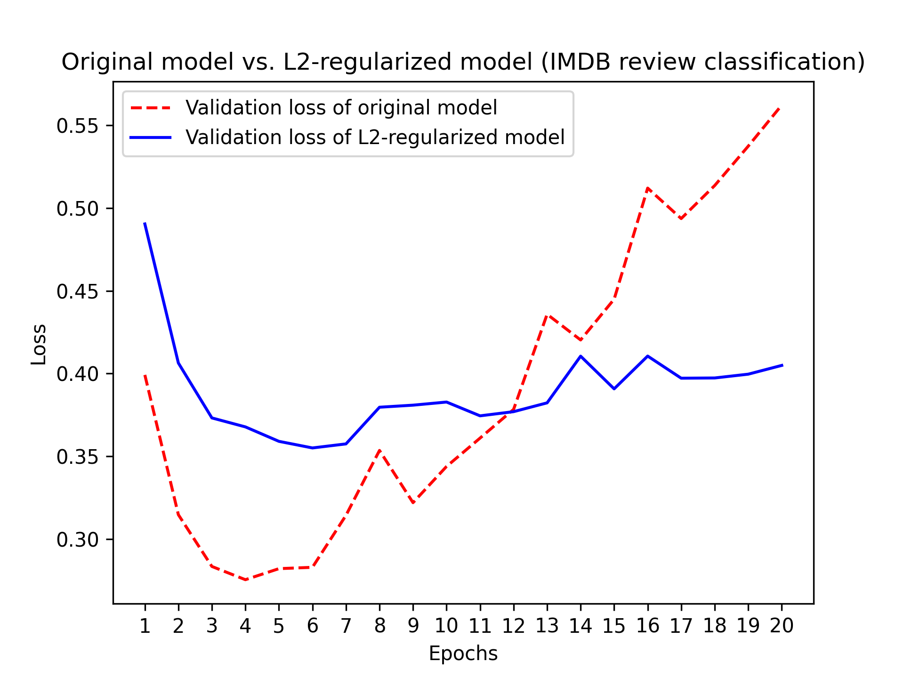


[Figure 5.20](#figure-5-20): Effect of L2 weight regularization on validation loss

As an alternative to L2 regularization, you can use one of the following Keras
weight regularizers.

```python
from keras import regularizers

# L1 regularization
regularizers.l1(0.001)
# Simultaneous L1 and L2 regularization
regularizers.l1_l2(l1=0.001, l2=0.001)
```

[Listing 5.13](#listing-5-13): Different weight regularizers available in Keras

Note that weight regularization is more typically used for smaller deep
learning models. Large deep learning models tend to be so overparameterized
that imposing constraints on weight values does not have much effect on
model capacity and generalization.
In these cases, a different regularization technique is preferred: *dropout*.

#### Adding dropout

*Dropout*, developed by
Geoff Hinton and his students at the University of Toronto, is one of the most effective and
most commonly used regularization techniques for neural networks. Dropout, applied
to a layer, consists of randomly *dropping out* (setting to zero) a number of
output features of the layer during training. Let’s say a given layer would
normally return a vector `[0.2, 0.5, 1.3, 0.8, 1.1]` for a given input sample
during training. After applying dropout, this vector will have a few zero
entries distributed at random: for example, `[0, 0.5, 1.3, 0, 1.1]`. The
*dropout rate* is the fraction of the features that are zeroed out; it’s
usually set between 0.2 and 0.5. At test time, no units are dropped out;
instead, the layer’s output values are scaled down by a factor equal to the
dropout rate, to balance for the fact that more units are active than at
training time.

Consider a NumPy matrix containing the output of a layer, `layer_output`, of
shape `(batch_size, features)`. At training time, we zero-out at random a
fraction of the values in the matrix:

```python
# At training time, drops out 50% of the units in the output
layer_output *= np.random.randint(low=0, high=2, size=layer_output.shape)
```

At test time, we scale down the output by the dropout rate. Here, we scale by
0.5 (because we previously dropped half the units):

```python
# At test time
layer_output *= 0.5
```

Note that this process can be implemented by doing both operations at training
time and leaving the output unchanged at test time, which is often the way
it’s implemented in practice (see figure 5.21):

```python
# At training time
layer_output *= np.random.randint(low=0, high=2, size=layer_output.shape)
# Note that we're scaling up rather scaling down in this case.
layer_output /= 0.5
```


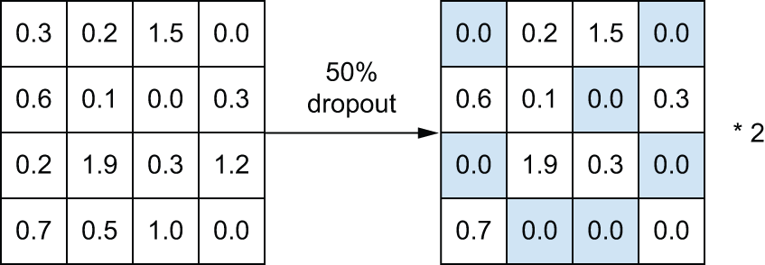


[Figure 5.21](#figure-5-21): Dropout applied to an activation matrix at training time, with rescaling happening during training. At test time, the activation matrix is unchanged.

This technique may seem strange and arbitrary. Why would this help reduce
overfitting? Hinton says he was inspired by, among other
things, a fraud-prevention mechanism used by banks:

> I went to my bank. The tellers kept changing and I asked one of them why. He said he
> didn’t know but they got moved around a lot. I figured it must be because it
> would require cooperation between employees to successfully defraud the bank.
> This made me realize that randomly removing a different subset of neurons on
> each example would prevent conspiracies and thus reduce
> overfitting.

The core idea is that introducing noise in the output
values of a layer can break up happenstance patterns that aren’t significant
(what Hinton refers to as *conspiracies*), which the model will start
memorizing if no noise is present.

In Keras, you can introduce dropout in a model via the `Dropout` layer, which
is applied to the output of the layer right before it. Let’s add two `Dropout`
layers in the IMDB model to see how well they do at reducing overfitting.

```python
model = keras.Sequential(
    [
        layers.Dense(16, activation="relu"),
        layers.Dropout(0.5),
        layers.Dense(16, activation="relu"),
        layers.Dropout(0.5),
        layers.Dense(1, activation="sigmoid"),
    ]
)
model.compile(
    optimizer="rmsprop",
    loss="binary_crossentropy",
    metrics=["accuracy"],
)
history_dropout = model.fit(
    train_data,
    train_labels,
    epochs=20,
    batch_size=512,
    validation_split=0.4,
)
```

[Listing 5.14](#listing-5-14): Adding dropout to the IMDB model

Figure 5.22 shows a plot of the results.
This is a clear improvement over the reference model.
It also seems to be working much better than L2 regularization since
the lowest validation loss reached has improved:

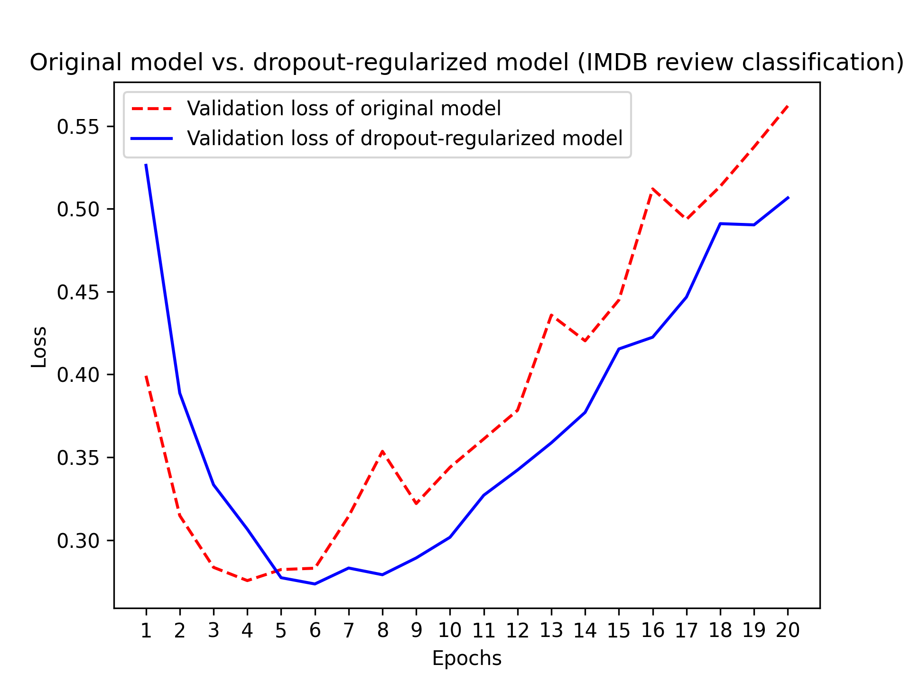


[Figure 5.22](#figure-5-22): Effect of dropout on validation loss

To recap, these are the most common ways to maximize generalization and
prevent overfitting in neural networks:

* Getting more training data, or better training data
* Developing better features
* Reducing the capacity of the model
* Adding weight regularization (for smaller models)
* Adding dropout

## Summary

* The purpose of a machine learning model is to *generalize*: to perform accurately
  on never-before-seen inputs. It’s harder than it seems.
* A deep neural network achieves generalization by learning a parametric model
  that can successfully *interpolate* between training samples. Such a model
  can be said to have learned the *latent manifold* of the training data.
  This is why deep learning models can only make sense of inputs that are
  very close to what they’ve seen during training.
* The fundamental problem in machine learning is
  *the tension between optimization and generalization*: to attain
  generalization, you must first achieve
  a good fit to the training data, but improving your model’s fit to the training
  data will inevitably start hurting generalization after a while. Every single
  deep learning best practice deals with managing this tension.
* The ability of deep learning models to generalize comes from the fact that
  they manage to learn to approximate the *latent manifold* of their data
  and can thus make sense of new inputs via interpolation.
* It’s essential to be able to accurately evaluate the generalization power of
  your model while you’re developing it. You have at your disposal an array
  of evaluation methods, from simple hold-out validation to K-fold
  cross-validation and iterated K-fold cross-validation with shuffling.
  Remember to always keep a completely separate test set for final model
  evaluation, since information leaks from your validation data to your model
  may have occurred.
* When you start working on a model, your goal is first to achieve a model that
  has some generalization power and that can overfit.
  Best practices to do this include
  tuning your learning rate and batch size, using better architecture
  priors, increasing model capacity, or simply training longer.
* As your model starts overfitting, your goal switches to improving
  generalization through *model regularization*. You can reduce your model’s
  capacity, add dropout or weight regularization, and use early stopping. And
  naturally, a larger or better dataset is always the number one way
  to help a model generalize.

#### **Tiếng Việt (Vietnamese)**

# Chương 5: Nguyên tắc cơ bản của học máy

Chương này bao gồm

* Hiểu được sự căng thẳng giữa khái quát hóa và tối ưu hóa,
vấn đề cơ bản trong học máy
* Phương pháp đánh giá mô hình học máy
* Các phương pháp hay nhất để cải thiện tính phù hợp của mô hình
* Các phương pháp hay nhất để đạt được khả năng khái quát hóa tốt hơn

Sau ba ví dụ thực tế ở chương 4, bạn sẽ bắt đầu cảm thấy quen thuộc với cách tiếp cận các vấn đề phân loại và hồi quy bằng cách sử dụng mạng thần kinh và bạn đã chứng kiến ​​vấn đề trọng tâm của học máy: trang bị quá mức. Chương này sẽ chính thức hóa một số trực giác mới của bạn về học máy thành một khung khái niệm vững chắc, nêu bật tầm quan trọng của việc đánh giá mô hình chính xác và sự cân bằng giữa đào tạo và khái quát hóa.

## Khái quát hóa: Mục tiêu của học máy

Trong ba ví dụ được trình bày ở chương 4 - dự đoán đánh giá phim, phân loại chủ đề và hồi quy giá nhà - chúng tôi chia dữ liệu thành tập huấn luyện, tập xác thực và tập kiểm tra. Lý do không đánh giá các mô hình trên cùng một dữ liệu mà chúng đã được đào tạo đã nhanh chóng trở nên rõ ràng: chỉ sau một vài kỷ nguyên, hiệu suất trên dữ liệu chưa từng thấy trước đây bắt đầu khác với hiệu suất trên dữ liệu huấn luyện, vốn luôn được cải thiện khi quá trình đào tạo diễn ra. Các mô hình bắt đầu *quá vừa vặn*. Quá khớp xảy ra trong mọi vấn đề về máy học.

Vấn đề cơ bản trong học máy là sự căng thẳng giữa tối ưu hóa và khái quát hóa. *Tối ưu hóa* đề cập đến quá trình điều chỉnh mô hình để đạt được hiệu suất tốt nhất có thể trên dữ liệu huấn luyện (*học* trong *học máy*), trong khi *khái quát hóa* đề cập đến mức độ hoạt động của mô hình được đào tạo trên dữ liệu mà nó chưa từng thấy trước đây. Tất nhiên, mục tiêu của trò chơi là đạt được khả năng khái quát hóa tốt, nhưng bạn không kiểm soát được khả năng khái quát hóa; bạn chỉ có thể điều chỉnh mô hình phù hợp với dữ liệu huấn luyện của nó. Nếu bạn làm điều đó *quá tốt*, việc trang bị quá mức sẽ phát huy tác dụng và việc khái quát hóa sẽ bị ảnh hưởng.

Nhưng điều gì gây ra tình trạng trang bị quá mức? Làm thế nào chúng ta có thể đạt được sự khái quát hóa tốt?

### Trang bị thiếu và trang bị quá mức

Đối với tất cả các mô hình bạn đã thấy trong chương trước, hiệu suất trên dữ liệu xác thực được lưu trữ ban đầu được cải thiện khi quá trình đào tạo diễn ra và sau đó chắc chắn sẽ đạt đến đỉnh điểm sau một thời gian. Mô hình này (minh họa trong hình 5.1) là phổ biến. Bạn sẽ thấy nó với bất kỳ loại mô hình và bất kỳ tập dữ liệu nào.


[Figure 5.1](#figure-5-1): Canonical overfitting behavior

Khi bắt đầu đào tạo, tối ưu hóa và khái quát hóa có mối tương quan với nhau: tổn thất trên dữ liệu huấn luyện càng thấp thì tổn thất trên dữ liệu kiểm tra càng thấp. Trong khi điều này đang xảy ra, mô hình của bạn được cho là *không phù hợp*: vẫn còn nhiều tiến bộ cần được thực hiện; mạng vẫn chưa lập mô hình hóa tất cả các mẫu có liên quan trong dữ liệu huấn luyện. Nhưng sau một số lần lặp nhất định trên dữ liệu huấn luyện, quá trình khái quát hóa sẽ ngừng cải thiện và các số liệu xác thực bị đình trệ rồi bắt đầu xuống cấp: mô hình bắt đầu quá phù hợp. Nghĩa là, nó bắt đầu học các mẫu dành riêng cho dữ liệu huấn luyện nhưng lại gây hiểu lầm hoặc không liên quan khi nói đến dữ liệu mới.

Trang bị quá mức đặc biệt có khả năng xảy ra khi dữ liệu của bạn bị nhiễu, nếu dữ liệu đó liên quan đến sự không chắc chắn hoặc nếu dữ liệu đó bao gồm các tính năng hiếm gặp. Hãy xem xét các ví dụ cụ thể.

#### Dữ liệu đào tạo ồn ào

Trong các tập dữ liệu trong thế giới thực, việc một số đầu vào không hợp lệ là điều khá phổ biến. Ví dụ, có lẽ chữ số MNIST có thể là một hình ảnh toàn màu đen - hoặc giống như hình 5.2.


[Figure 5.2](#figure-5-2): Some pretty weird MNIST training samples

Đây là những gì? Chúng tôi cũng không biết. Nhưng tất cả chúng đều là một phần của bộ huấn luyện MNIST. Tuy nhiên, điều thậm chí còn tệ hơn là có những đầu vào hoàn toàn hợp lệ nhưng cuối cùng lại bị dán nhãn sai, giống như những đầu vào được hiển thị trong Hình 5.3.


[Figure 5.3](#figure-5-3): Mislabeled MNIST training samples

Nếu một mô hình không thể kết hợp các giá trị ngoại lệ như vậy thì hiệu suất tổng quát hóa của nó sẽ giảm sút, như được minh họa trong Hình 5.4. Ví dụ: số 4 trông rất giống với số 4 bị dán nhãn sai trong hình 5.3 có thể sẽ bị phân loại là số 9.


[Figure 5.4](#figure-5-4): Dealing with outliers: robust fit vs. overfitting

#### Tính năng mơ hồ

Không phải tất cả nhiễu dữ liệu đều xuất phát từ sự thiếu chính xác - ngay cả dữ liệu được dán nhãn gọn gàng và sạch sẽ hoàn toàn cũng có thể bị nhiễu khi vấn đề liên quan đến sự không chắc chắn và mơ hồ (xem hình 5.5). Trong các nhiệm vụ phân loại, thường xảy ra trường hợp một số vùng của không gian đối tượng đầu vào được liên kết với nhiều lớp cùng một lúc. Giả sử bạn đang phát triển một mô hình chụp ảnh một quả chuối và dự đoán xem quả chuối chưa chín, chín hay thối. Các danh mục này không có ranh giới khách quan, do đó, cùng một bức tranh có thể được phân loại là chưa chín hoặc chưa chín bởi những người gắn nhãn khác nhau. Tương tự, nhiều vấn đề liên quan đến tính ngẫu nhiên. Bạn có thể sử dụng dữ liệu áp suất khí quyển để dự đoán liệu ngày mai trời có mưa hay không, nhưng các phép đo chính xác tương tự đôi khi có thể dẫn đến mưa, đôi khi là bầu trời quang đãng - với một số xác suất.


[Figure 5.5](#figure-5-5): Robust fit vs. overfitting giving an ambiguous area of the feature space

Một mô hình có thể quá phù hợp với dữ liệu xác suất như vậy do quá tự tin về các vùng không rõ ràng của không gian đặc trưng, ​​như trong hình 5.6. Sự phù hợp mạnh mẽ hơn sẽ bỏ qua các điểm dữ liệu riêng lẻ và nhìn vào bức tranh lớn hơn.

#### Các tính năng hiếm và mối tương quan giả

Nếu bạn mới chỉ nhìn thấy hai con mèo mướp màu cam trong đời và cả hai đều cực kỳ phản xã hội, thì bạn có thể suy luận rằng mèo mướp màu cam thường có xu hướng chống đối xã hội. Điều đó quá phù hợp: nếu bạn đã tiếp xúc với nhiều loại mèo hơn, bao gồm cả những con màu cam, bạn sẽ biết rằng màu sắc của mèo không tương quan nhiều với tính cách.

Tương tự như vậy, các mô hình học máy được đào tạo trên các tập dữ liệu bao gồm các giá trị tính năng hiếm rất dễ bị khớp quá mức. Trong nhiệm vụ phân loại tình cảm, nếu từ “cherimoya” (một loại trái cây có nguồn gốc từ dãy Andes) chỉ xuất hiện trong một văn bản trong dữ liệu huấn luyện và văn bản này có ý nghĩa tiêu cực về tình cảm, thì một mô hình được chính quy hóa kém có thể đặt trọng số rất cao vào từ này và luôn phân loại các văn bản mới đề cập đến cherimoyas là tiêu cực, trong khi đó, về mặt khách quan, không có gì tiêu cực về cherimoya. [[1]](#chú thích cuối trang-1)

Điều quan trọng là một giá trị đặc trưng không nhất thiết phải xuất hiện một vài lần mới có thể dẫn đến các mối tương quan giả. Hãy xem xét một từ xuất hiện trong 100 mẫu trong dữ liệu đào tạo của bạn và từ đó có liên quan đến cảm xúc tích cực trong 54% thời gian và với cảm xúc tiêu cực trong 46% thời gian. Sự khác biệt đó có thể là một sai sót thống kê hoàn chỉnh, tuy nhiên mô hình của bạn có thể sẽ học cách sử dụng tính năng đó cho nhiệm vụ phân loại của nó. Đây là một trong những nguồn phổ biến nhất của tình trạng trang bị quá mức.

Đây là một ví dụ nổi bật. Lấy MNIST. Tạo một tập huấn luyện mới bằng cách ghép 784 chiều nhiễu trắng với 784 chiều hiện có của dữ liệu - vì vậy một nửa dữ liệu hiện là nhiễu. Để so sánh, hãy tạo một tập dữ liệu tương đương bằng cách ghép 784 chiều toàn số 0. Việc ghép các tính năng vô nghĩa của chúng tôi hoàn toàn không ảnh hưởng đến nội dung thông tin của dữ liệu: chúng tôi chỉ thêm các điểm dữ liệu không liên quan. Độ chính xác trong phân loại của con người sẽ không bị ảnh hưởng bởi những biến đổi này.

```python
from keras.datasets import mnist
import numpy as np

(train_images, train_labels), _ = mnist.load_data()
train_images = train_images.reshape((60000, 28 * 28))
train_images = train_images.astype("float32") / 255

train_images_with_noise_channels = np.concatenate(
    [train_images, np.random.random((len(train_images), 784))], axis=1
)

train_images_with_zeros_channels = np.concatenate(
    [train_images, np.zeros((len(train_images), 784))], axis=1
)
```

[Danh sách 5.1](#listing-5-1): Thêm các kênh nhiễu trắng hoặc các kênh toàn số 0 vào MNIST

Bây giờ, hãy huấn luyện mô hình từ chương 2 trên cả hai tập huấn luyện này.

```python
import keras
from keras import layers

def get_model():
    model = keras.Sequential(
        [
            layers.Dense(512, activation="relu"),
            layers.Dense(10, activation="softmax"),
        ]
    )
    model.compile(
        optimizer="adam",
        loss="sparse_categorical_crossentropy",
        metrics=["accuracy"],
    )
    return model

model = get_model()
history_noise = model.fit(
    train_images_with_noise_channels,
    train_labels,
    epochs=10,
    batch_size=128,
    validation_split=0.2,
)

model = get_model()
history_zeros = model.fit(
    train_images_with_zeros_channels,
    train_labels,
    epochs=10,
    batch_size=128,
    validation_split=0.2,
)
```

[Danh sách 5.2](#listing-5-2): Huấn luyện mô hình tương tự trên dữ liệu MNIST với các kênh nhiễu hoặc các kênh hoàn toàn bằng 0

Mặc dù dữ liệu chứa thông tin giống nhau trong cả hai trường hợp, nhưng độ chính xác xác thực của mô hình được huấn luyện với các kênh nhiễu lại thấp hơn khoảng một điểm phần trăm - hoàn toàn là do ảnh hưởng của các mối tương quan giả (hình 5.6). Bạn càng thêm nhiều kênh nhiễu thì độ chính xác càng giảm.


[Figure 5.6](#figure-5-6): Effect of noise channels on validation accuracy

Các tính năng ồn ào chắc chắn sẽ dẫn đến việc trang bị quá mức. Do đó, trong trường hợp bạn không chắc chắn liệu các tính năng của mình có mang tính thông tin hay gây mất tập trung hay không, bạn nên thực hiện *lựa chọn tính năng* trước khi đào tạo. Ví dụ: việc giới hạn dữ liệu IMDB ở 10.000 từ phổ biến nhất là một hình thức lựa chọn tính năng thô thiển. Cách thông thường để thực hiện lựa chọn tính năng là tính toán một số điểm hữu ích cho từng tính năng có sẵn — thước đo mức độ thông tin của tính năng đó đối với nhiệm vụ, chẳng hạn như thông tin chung giữa tính năng và nhãn — và chỉ giữ lại các tính năng ở trên một số ngưỡng. Làm điều này sẽ lọc các kênh nhiễu trắng trong ví dụ trước.

### Bản chất của khái quát hóa trong học sâu

Một thực tế đáng chú ý về các mô hình học sâu là chúng có thể được đào tạo để phù hợp với mọi thứ, miễn là chúng có đủ sức mạnh biểu diễn.

Bạn không tin tôi à? Hãy thử xáo trộn thứ tự của các nhãn MNIST và huấn luyện mô hình theo đó. Mặc dù không có bất kỳ mối quan hệ nào giữa đầu vào và nhãn được xáo trộn, nhưng tổn thất huấn luyện vẫn giảm xuống, ngay cả với một mô hình tương đối nhỏ. Đương nhiên, việc mất xác thực không được cải thiện theo thời gian vì không có khả năng khái quát hóa trong cài đặt này.

```python
(train_images, train_labels), _ = mnist.load_data()
train_images = train_images.reshape((60000, 28 * 28))
train_images = train_images.astype("float32") / 255

# Copies train_labels
random_train_labels = train_labels[:]
np.random.shuffle(random_train_labels)

model = keras.Sequential(
    [
        layers.Dense(512, activation="relu"),
        layers.Dense(10, activation="softmax"),
    ]
)
model.compile(
    optimizer="rmsprop",
    loss="sparse_categorical_crossentropy",
    metrics=["accuracy"],
)
model.fit(
    train_images,
    random_train_labels,
    epochs=100,
    batch_size=128,
    validation_split=0.2,
)
```

[Liệt kê 5.3](#listing-5-3): Lắp mô hình MNIST với các nhãn được xáo trộn ngẫu nhiên

Trên thực tế, bạn thậm chí không cần phải làm điều này với dữ liệu MNIST - bạn chỉ có thể tạo đầu vào nhiễu trắng và nhãn ngẫu nhiên. Bạn cũng có thể lắp một mô hình vào đó, miễn là nó có đủ thông số. Cuối cùng nó sẽ ghi nhớ những thông tin đầu vào cụ thể, giống như một cuốn từ điển Python.

Nếu đúng như vậy thì tại sao các mô hình học sâu lại khái quát hóa? Không phải họ chỉ nên học cách lập bản đồ đặc biệt giữa đầu vào và mục tiêu đào tạo, giống như một `dict` ưa thích sao? Chúng ta có thể kỳ vọng gì rằng ánh xạ này sẽ hoạt động với các đầu vào mới?

Hóa ra, bản chất của khái quát hóa trong học sâu hầu như không liên quan nhiều đến bản thân các mô hình học sâu mà liên quan nhiều đến cấu trúc thông tin trong thế giới thực. Chúng ta hãy xem những gì đang thực sự xảy ra ở đây.

#### Giả thuyết đa dạng

Đầu vào của bộ phân loại MNIST (trước khi xử lý trước) là một mảng số nguyên 28 × 28 trong khoảng từ 0 đến 255. Do đó, tổng số giá trị đầu vào có thể có là 256 lũy thừa 784 - lớn hơn nhiều so với số lượng nguyên tử trong vũ trụ. Tuy nhiên, rất ít dữ liệu đầu vào trông giống như các mẫu MNIST hợp lệ: các chữ số viết tay thực tế chỉ chiếm một *không gian con* nhỏ của không gian gốc của tất cả các mảng `uint8` 28 x 28 có thể có. Hơn nữa, không gian con này không chỉ là một tập hợp các điểm được rải ngẫu nhiên trong không gian gốc: nó có cấu trúc cao.

Đầu tiên, không gian con của các chữ số viết tay hợp lệ là *liên tục*: nếu bạn lấy một mẫu và sửa đổi nó một chút, nó vẫn có thể được nhận dạng là cùng một chữ số viết tay. Hơn nữa, tất cả các mẫu trong không gian con hợp lệ đều *được kết nối* bằng các đường dẫn trơn tru chạy qua không gian con. Điều này có nghĩa là nếu bạn lấy ngẫu nhiên hai chữ số MNIST A và B, sẽ tồn tại một chuỗi các ảnh “trung gian” biến A thành B, sao cho hai chữ số liên tiếp rất gần nhau (xem hình 5.7). Có lẽ sẽ có một vài hình dạng không rõ ràng ở gần ranh giới giữa hai lớp, nhưng ngay cả những hình dạng này vẫn trông rất giống chữ số.


[Figure 5.7](#figure-5-7): Different MNIST digits gradually morphing into one another, showing that the space of handwritten digits forms a “manifold.” This image was generated using code from chapter 17.

Về mặt kỹ thuật, bạn sẽ nói rằng các chữ số viết tay tạo thành một *đa tạp* trong không gian của các mảng `uint8` 28 × 28 có thể có. Đó là một từ lớn lao, nhưng khái niệm này khá trực quan. Đa tạp là không gian con có chiều thấp hơn của một số không gian cha tương tự cục bộ với không gian tuyến tính (Euclide). Ví dụ, một đường cong trơn trong mặt phẳng là một đa tạp 1D trong không gian 2D vì với mỗi điểm của đường cong, bạn có thể vẽ một tiếp tuyến (đường cong có thể được tính gần đúng bằng một đường thẳng ở mọi điểm). Một bề mặt nhẵn trong không gian 3D là một đa tạp 2D. Và vân vân.

Tổng quát hơn, *giả thuyết đa tạp* thừa nhận rằng tất cả dữ liệu tự nhiên nằm trên một đa tạp chiều thấp trong không gian chiều cao nơi nó được mã hóa. Đó là một tuyên bố khá mạnh mẽ về cấu trúc thông tin trong vũ trụ. Theo những gì chúng tôi biết, điều đó chính xác và đó là lý do tại sao học sâu lại hoạt động. Điều này đúng với các chữ số MNIST, cũng như khuôn mặt con người, hình thái cây cối, âm thanh giọng nói con người và thậm chí cả ngôn ngữ tự nhiên.

Giả thuyết đa dạng ngụ ý

* Các mô hình học máy chỉ phải phù hợp tương đối đơn giản,
các không gian con có chiều thấp, có cấu trúc cao trong không gian đầu vào tiềm năng của chúng
(đa tạp tiềm ẩn).
* Trong một trong những đa tạp này, luôn có thể *nội suy*
giữa hai đầu vào - nghĩa là biến đổi cái này thành cái khác thông qua một liên tục
đường đi mà mọi điểm đều rơi trên đa tạp.

Khả năng nội suy giữa các mẫu là chìa khóa để hiểu khái quát hóa trong học sâu.

#### Nội suy như một nguồn khái quát hóa

Nếu bạn làm việc với các điểm dữ liệu có thể nội suy, bạn có thể bắt đầu hiểu các điểm bạn chưa từng thấy trước đây bằng cách liên hệ chúng với các điểm khác nằm gần trên đa tạp. Nói cách khác, bạn có thể hiểu *toàn bộ* không gian chỉ bằng cách sử dụng một *mẫu* không gian. Bạn có thể sử dụng phép nội suy để điền vào chỗ trống.

Lưu ý rằng phép nội suy trên đa tạp tiềm ẩn khác với phép nội suy tuyến tính trong không gian gốc, như minh họa trong hình 5.8. Ví dụ: giá trị trung bình của các pixel giữa hai chữ số MNIST thường không phải là chữ số hợp lệ.


[Figure 5.8](#figure-5-8): Difference between linear interpolation and interpolation on the latent manifold. Every point on the latent manifold of digits is a valid digit, but the average of two digits usually isn’t.

Điều quan trọng là, trong khi học sâu đạt được khả năng khái quát hóa thông qua phép nội suy trên xấp xỉ đã học của đa tạp dữ liệu, sẽ là sai lầm khi cho rằng phép nội suy là *tất cả* cần có để khái quát hóa. Đó là phần nổi của tảng băng chìm. Nội suy chỉ có thể giúp bạn hiểu những thứ rất gần với những gì bạn đã thấy trước đây: nó cho phép *khái quát hóa cục bộ*. Nhưng điều đáng chú ý là con người luôn phải đối mặt với những điều mới lạ và họ vẫn làm rất tốt. Bạn không cần phải được đào tạo trước về vô số ví dụ về mọi tình huống mà bạn sẽ gặp phải. Mỗi ngày của bạn đều khác với bất kỳ ngày nào bạn đã trải qua trước đây và khác với bất kỳ ngày nào mà bất kỳ ai đã trải qua kể từ buổi bình minh của nhân loại. Bạn có thể chuyển đổi giữa việc dành một tuần ở New York, một tuần ở Thượng Hải và một tuần ở Bangalore mà không cần phải học tập và diễn tập hàng nghìn năm ở mỗi thành phố.

Con người có khả năng *khái quát hóa cực độ*, được kích hoạt bởi các cơ chế nhận thức không phải là nội suy — trừu tượng, mô hình biểu tượng của thế giới, lý luận, logic, lẽ thường, tiên đoán bẩm sinh về thế giới — cái mà chúng ta thường gọi là *lý trí*, trái ngược với trực giác và nhận dạng khuôn mẫu. Cái sau phần lớn có tính chất nội suy, nhưng cái trước thì không. Cả hai đều cần thiết cho trí thông minh. Chúng ta sẽ nói nhiều hơn về điều này ở chương 19.

#### Tại sao học sâu lại hiệu quả

Bạn có nhớ phép ẩn dụ quả bóng giấy nhàu nát ở chương 2 không? Một tờ giấy biểu diễn một đa tạp 2D trong không gian 3D (hình 5.9). Mô hình học sâu là một công cụ để gỡ các quả bóng giấy - nghĩa là để gỡ rối các đa tạp tiềm ẩn.


[Figure 5.9](#figure-5-9): Uncrumpling a complicated manifold of data

Một mô hình học sâu về cơ bản là một đường cong có nhiều chiều. Đường cong trơn tru và liên tục (với các ràng buộc bổ sung về cấu trúc của nó, bắt nguồn từ các tiên nghiệm về kiến ​​trúc mô hình) vì nó cần phải khả vi. Và đường cong đó được khớp với các điểm dữ liệu thông qua việc giảm độ dốc - một cách mượt mà và tăng dần. *Bằng cách xây dựng*, học sâu là lấy một đường cong lớn, phức tạp — một đa tạp — và điều chỉnh tăng dần các tham số của nó cho đến khi phù hợp với một số điểm dữ liệu huấn luyện.

Đường cong bao gồm đủ thông số để có thể phù hợp với bất kỳ thứ gì. Thật vậy, nếu bạn để mô hình của mình huấn luyện đủ lâu, nó sẽ hoàn toàn ghi nhớ dữ liệu huấn luyện và sẽ không khái quát hóa chút nào. Tuy nhiên, dữ liệu bạn phù hợp không được tạo thành từ các điểm biệt lập được phân bổ thưa thớt trên không gian bên dưới. Dữ liệu của bạn tạo thành một đa tạp có cấu trúc cao, ít chiều trong không gian đầu vào - đó là giả thuyết đa tạp. Và bởi vì việc khớp đường cong mô hình của bạn với dữ liệu này diễn ra dần dần và trơn tru theo thời gian, khi độ dốc giảm dần, sẽ có một điểm trung gian trong quá trình huấn luyện mà tại đó mô hình gần giống với đa tạp tự nhiên của dữ liệu, như bạn có thể thấy trong hình 5.10.


[Figure 5.10](#figure-5-10): Going from a random model to an overfit model and achieving a robust fit as an intermediate state

Di chuyển dọc theo đường cong mà mô hình đã học tại thời điểm đó sẽ tiến gần đến việc di chuyển dọc theo đa tạp tiềm ẩn thực tế của dữ liệu. Như vậy, mô hình sẽ có khả năng hiểu được các đầu vào chưa từng thấy trước đây thông qua phép nội suy giữa các đầu vào đào tạo.

Bên cạnh thực tế tầm thường là chúng có đủ khả năng biểu diễn, còn có một số đặc tính của mô hình học sâu khiến chúng đặc biệt phù hợp với việc học các đa tạp tiềm ẩn:

* Các mô hình học sâu thực hiện ánh xạ liên tục, mượt mà từ
đầu vào thành đầu ra của họ. Nó phải trơn tru và liên tục bởi vì nó
phải khả vi, nếu cần thiết (bạn không thể thực hiện việc giảm độ dốc
nếu không thì). Sự trơn tru này giúp xấp xỉ các đa tạp tiềm ẩn,
tuân theo các tính chất giống nhau.
* Các mô hình học sâu có xu hướng được cấu trúc theo cách phản ánh “hình dạng”
của thông tin trong dữ liệu đào tạo của họ (thông qua kiến ​​trúc ưu tiên). Cái này
là trường hợp cụ thể của các mô hình xử lý hình ảnh (xem chương 8–12)
và các mô hình xử lý trình tự (xem chương 13). Tổng quát hơn,
mạng lưới thần kinh sâu cấu trúc các biểu diễn đã học của chúng theo thứ bậc
và cách mô-đun, lặp lại cách tổ chức dữ liệu tự nhiên.

#### Dữ liệu đào tạo là quan trọng nhất

Mặc dù deep learning thực sự rất phù hợp với việc học đa dạng, nhưng khả năng khái quát hóa lại là hệ quả của cấu trúc tự nhiên của dữ liệu hơn là hệ quả của bất kỳ thuộc tính nào trong mô hình của bạn. Bạn sẽ chỉ có thể khái quát hóa nếu dữ liệu của bạn tạo thành một đa tạp nơi các điểm có thể được nội suy. Các tính năng của bạn càng có nhiều thông tin và ít nhiễu thì bạn càng có khả năng khái quát hóa tốt hơn vì không gian đầu vào của bạn sẽ đơn giản hơn và có cấu trúc tốt hơn. Quản lý dữ liệu và kỹ thuật tính năng là điều cần thiết để khái quát hóa.

Hơn nữa, vì deep learning có tính chất khớp với đường cong nên để một mô hình hoạt động tốt, *nó cần được đào tạo về việc lấy mẫu dày đặc không gian đầu vào*. “Lấy mẫu dày đặc” trong ngữ cảnh này có nghĩa là dữ liệu huấn luyện phải bao phủ dày đặc toàn bộ đa tạp dữ liệu đầu vào (xem hình 5.11). Điều này đặc biệt đúng khi ở gần ranh giới quyết định. Với lượng mẫu đủ dày đặc, bạn có thể hiểu được các đầu vào mới bằng cách nội suy giữa các đầu vào đào tạo trước đây mà không cần phải sử dụng lý luận trừu tượng, thông thường hoặc kiến ​​thức bên ngoài về thế giới — tất cả những thứ mà mô hình học máy không có quyền truy cập.


[Figure 5.11](#figure-5-11): A dense sampling of the input space is necessary to learn a model capable of accurate generalization.

Vì vậy, bạn nên luôn nhớ rằng cách tốt nhất để cải thiện mô hình deep learning là huấn luyện nó trên nhiều dữ liệu hơn hoặc dữ liệu tốt hơn (tất nhiên, việc thêm dữ liệu quá ồn ào hoặc không chính xác sẽ gây hại cho việc khái quát hóa). Phạm vi bao phủ dày đặc hơn của đa tạp dữ liệu đầu vào sẽ mang lại một mô hình khái quát hóa tốt hơn. Bạn không bao giờ nên mong đợi một mô hình học sâu sẽ thực hiện bất cứ điều gì ngoài phép nội suy thô giữa các mẫu đào tạo của nó và do đó, bạn nên làm mọi thứ có thể để nội suy dễ dàng nhất có thể. Điều duy nhất bạn tìm thấy trong một mô hình deep learning là những gì bạn đưa vào nó: các thông tin ưu tiên được mã hóa trong kiến ​​trúc của nó và dữ liệu được đào tạo dựa trên đó.

Khi không thể lấy thêm dữ liệu, giải pháp tốt nhất tiếp theo là điều chỉnh lượng thông tin mà mô hình của bạn được phép lưu trữ hoặc thêm các ràng buộc về độ trơn của đường cong mô hình. Nếu mạng chỉ có khả năng ghi nhớ một số lượng nhỏ các mẫu hoặc các mẫu rất đều đặn thì quá trình tối ưu hóa sẽ buộc mạng phải tập trung vào các mẫu nổi bật nhất, có cơ hội khái quát tốt hơn. Quá trình chống lại việc trang bị quá mức theo cách này được gọi là *chính quy hóa*. Chúng tôi sẽ xem xét kỹ hơn các kỹ thuật chính quy hóa trong phần 5.4.4.

Trước khi có thể bắt đầu điều chỉnh mô hình của mình để giúp nó khái quát hóa tốt hơn, bạn cần có cách đánh giá mô hình của mình hiện đang hoạt động như thế nào. Trong phần sau, bạn sẽ tìm hiểu về cách bạn có thể giám sát việc khái quát hóa trong quá trình phát triển mô hình: đánh giá mô hình.

## Đánh giá các mô hình học máy

Bạn chỉ có thể kiểm soát những gì bạn có thể quan sát. Vì mục tiêu của bạn là phát triển các mô hình có thể khái quát hóa thành công dữ liệu mới nên điều cần thiết là có thể đo lường khả năng khái quát hóa của mô hình của bạn một cách đáng tin cậy. Trong phần này, chúng tôi sẽ chính thức giới thiệu các cách khác nhau để bạn có thể đánh giá các mô hình học máy. Bạn đã thấy hầu hết chúng hoạt động ở chương trước.

### Bộ huấn luyện, xác nhận và kiểm tra

Việc đánh giá một mô hình luôn tập trung vào việc chia dữ liệu có sẵn thành ba bộ: huấn luyện, xác nhận và kiểm tra. Bạn huấn luyện trên dữ liệu huấn luyện và đánh giá mô hình của mình trên dữ liệu xác thực. Sau khi mô hình của bạn đã sẵn sàng hoạt động, bạn sẽ thử nghiệm mô hình đó lần cuối trên dữ liệu thử nghiệm, điều này có nghĩa là nó giống với dữ liệu sản xuất nhất có thể. Sau đó, bạn có thể triển khai mô hình trong sản xuất.

Bạn có thể hỏi, tại sao không có hai bộ: tập huấn luyện và tập kiểm tra? Bạn sẽ huấn luyện dựa trên dữ liệu huấn luyện và đánh giá dữ liệu kiểm tra. Đơn giản hơn nhiều!

Lý do là việc phát triển một mô hình luôn liên quan đến việc điều chỉnh cấu hình của nó: ví dụ: chọn số lượng lớp hoặc kích thước của các lớp (được gọi là *siêu tham số* của mô hình, để phân biệt chúng với *tham số*, là trọng số của mạng). Bạn thực hiện việc điều chỉnh này bằng cách sử dụng tín hiệu phản hồi về hiệu suất của mô hình trên dữ liệu xác thực. Về bản chất, việc điều chỉnh này là một dạng *học*: tìm kiếm một cấu hình tốt trong một không gian tham số nào đó. Do đó, việc điều chỉnh cấu hình của mô hình dựa trên hiệu suất của nó trên tập xác thực có thể nhanh chóng dẫn đến *trang bị quá mức cho tập xác thực*, ngay cả khi mô hình của bạn chưa bao giờ được đào tạo trực tiếp về nó.

Trọng tâm của hiện tượng này là khái niệm *rò rỉ thông tin*. Mỗi khi bạn điều chỉnh siêu tham số của mô hình dựa trên hiệu suất của mô hình trên bộ xác thực, một số thông tin về dữ liệu xác thực sẽ bị rò rỉ vào mô hình. Nếu bạn chỉ thực hiện việc này một lần, đối với một tham số thì sẽ có rất ít thông tin bị rò rỉ và bộ xác thực của bạn sẽ vẫn đáng tin cậy để đánh giá mô hình. Nhưng nếu bạn lặp lại điều này nhiều lần - chạy một thử nghiệm, đánh giá tập hợp xác thực và kết quả là sửa đổi mô hình của bạn - thì bạn sẽ rò rỉ một lượng thông tin ngày càng quan trọng về tập hợp xác thực vào mô hình.

Vào cuối ngày, bạn sẽ có được một mô hình hoạt động tốt một cách giả tạo trên dữ liệu xác thực vì đó là mục đích bạn đã tối ưu hóa nó. Bạn quan tâm đến hiệu suất trên dữ liệu hoàn toàn mới chứ không phải dữ liệu xác thực, vì vậy, bạn cần sử dụng một tập dữ liệu hoàn toàn khác, chưa từng thấy trước đây để đánh giá mô hình: tập dữ liệu thử nghiệm. Mô hình của bạn lẽ ra không có quyền truy cập vào *bất kỳ* thông tin nào về tập kiểm tra, thậm chí là gián tiếp. Nếu bất cứ điều gì về mô hình đã được điều chỉnh dựa trên hiệu suất của tập kiểm tra thì thước đo tổng quát hóa của bạn sẽ bị sai sót.

Việc chia dữ liệu của bạn thành các tập huấn luyện, xác nhận và kiểm tra có vẻ đơn giản nhưng có một số cách nâng cao để thực hiện điều đó và có thể hữu ích khi có ít dữ liệu. Hãy cùng xem xét ba công thức đánh giá cổ điển: xác thực giữ lại đơn giản, xác thực K-Fold và xác thực K-Fold lặp lại với tính năng xáo trộn. Chúng ta cũng sẽ nói về việc sử dụng các đường cơ sở thông thường để kiểm tra xem quá trình đào tạo của bạn có đi đến đâu không.

#### Xác thực giữ đơn giản

Đặt một số phần dữ liệu của bạn làm tập thử nghiệm. Huấn luyện trên dữ liệu còn lại và đánh giá trên tập kiểm tra. Như bạn đã thấy trong các phần trước, để tránh rò rỉ thông tin, bạn không nên điều chỉnh mô hình của mình dựa trên tập kiểm tra và do đó bạn nên *cũng* đặt trước một bộ xác thực.

Về mặt sơ đồ, việc xác nhận giữ lại trông giống như hình 5.12. Danh sách sau đây cho thấy một cách thực hiện đơn giản.


[Figure 5.12](#figure-5-12): Simple hold-out validation split


```python
num_validation_samples = 10000
# Shuffling the data is usually appropriate.
np.random.shuffle(data)
# Defines the validation set
validation_data = data[:num_validation_samples]
# Defines the training set
training_data = data[num_validation_samples:]
# Trains a model on the training data and evaluates it on the
# validation data
model = get_model()
model.fit(training_data, ...)
validation_score = model.evaluate(validation_data, ...)

# At this point, you can tune your model, retrain it, evaluate it, tune
# it again, and so on.
...

# Once you've tuned your hyperparameters, it's common to train your
# final model from scratch on all non-test data available.
model = get_model()
model.fit(
    np.concatenate([training_data, validation_data]),
    ...,
)
test_score = model.evaluate(test_data, ...)
```

[Danh sách 5.4](#listing-5-4): Xác thực giữ lại (lưu ý rằng các nhãn được bỏ qua để đơn giản)

Đây là giao thức đánh giá đơn giản nhất và nó có một lỗ hổng: nếu có ít dữ liệu thì các bộ kiểm tra và xác thực của bạn có thể chứa quá ít mẫu để có thể đại diện thống kê cho dữ liệu hiện có. Điều này rất dễ nhận ra: nếu các vòng xáo trộn ngẫu nhiên khác nhau của dữ liệu trước khi phân tách mang lại những thước đo rất khác nhau về hiệu suất mô hình thì bạn đang gặp phải vấn đề này. Xác thực K-Fold và xác thực K-Fold lặp đi lặp lại là hai cách để giải quyết vấn đề này, như sẽ được thảo luận tiếp theo.

#### Xác thực K-Fold

Với phương pháp này, bạn chia dữ liệu của mình thành các phân vùng `K` có kích thước bằng nhau. Đối với mỗi phân vùng `i`, huấn luyện một mô hình trên các phân vùng `K - 1` còn lại và đánh giá nó trên phân vùng `i`. Điểm cuối cùng của bạn là điểm trung bình của điểm K đạt được. Phương pháp này hữu ích khi hiệu suất của mô hình của bạn cho thấy sự khác biệt đáng kể dựa trên sự phân chia đào tạo/kiểm tra của bạn. Giống như xác thực giữ lại, phương pháp này không miễn cho bạn sử dụng bộ xác thực riêng biệt để hiệu chỉnh mô hình.

Về mặt sơ đồ, xác thực chéo K-Fold trông giống như hình 5.13. Liệt kê 5.6 cho thấy một cách thực hiện đơn giản.


[Figure 5.13](#figure-5-13): Three-fold validation


```python
k = 3
num_validation_samples = len(data) // k
np.random.shuffle(data)
validation_scores = []
for fold in range(k):
    # Selects the validation-data partition
    validation_data = data[
        num_validation_samples * fold : num_validation_samples * (fold + 1)
    ]
    # Uses the remainder of the data as training data.
    training_data = np.concatenate(
        data[: num_validation_samples * fold],
        data[num_validation_samples * (fold + 1) :],
    )
    # Creates a brand-new instance of the model (untrained)
    model = get_model()
    model.fit(training_data, ...)
    validation_score = model.evaluate(validation_data, ...)
    validation_scores.append(validation_score)
# Validation score: average of the validation scores of the k folds
validation_score = np.average(validation_scores)
# Trains the final model on all non-test data available
model = get_model()
model.fit(data, ...)
test_score = model.evaluate(test_data, ...)
```

[Danh sách 5.5](#listing-5-5): Xác thực chéo K-Fold (lưu ý rằng các nhãn được bỏ qua để đơn giản)

#### Xác thực K-Fold lặp đi lặp lại với chức năng xáo trộn

Cái này dành cho những tình huống mà bạn có sẵn tương đối ít dữ liệu và bạn cần đánh giá mô hình của mình một cách chính xác nhất có thể. Tôi nhận thấy nó cực kỳ hữu ích trong các cuộc thi Kaggle. Nó bao gồm việc áp dụng xác thực K-Fold nhiều lần, xáo trộn dữ liệu mỗi lần trước khi chia nó theo `K`. Điểm cuối cùng là điểm trung bình của các điểm đạt được ở mỗi lần xác thực K-Fold. Lưu ý rằng bạn kết thúc việc đào tạo và đánh giá các mô hình `P * K` (trong đó `P` là số lần lặp bạn sử dụng), việc này có thể rất tốn kém.

### Đánh bại một đường cơ sở thông thường

Bên cạnh các quy trình đánh giá khác nhau mà bạn có sẵn, một điều cuối cùng bạn nên biết là việc sử dụng các đường cơ sở thông thường.

Việc đào tạo một mô hình học sâu cũng giống như việc nhấn nút phóng tên lửa vào một thế giới song song. Bạn không thể nghe hoặc nhìn thấy nó. Bạn không thể quan sát quá trình học tập đa dạng - nó diễn ra trong một không gian có hàng nghìn chiều và ngay cả khi bạn chiếu nó lên 3D, bạn cũng không thể diễn giải nó. Phản hồi duy nhất bạn có là số liệu xác thực của bạn — như máy đo độ cao trên tên lửa vô hình của bạn.

Một điểm đặc biệt quan trọng là có thể biết liệu bạn có đang tiến lên khỏi mặt đất hay không. Độ cao bạn bắt đầu ở là bao nhiêu? Mô hình của bạn dường như có độ chính xác là 15%, điều đó có tốt không? Trước khi bắt đầu làm việc với tập dữ liệu, bạn phải luôn chọn một đường cơ sở tầm thường mà bạn sẽ cố gắng vượt qua. Nếu vượt qua ngưỡng đó, bạn sẽ biết mình đang làm đúng: mô hình của bạn thực sự đang sử dụng thông tin trong dữ liệu đầu vào để đưa ra dự đoán khái quát — bạn có thể tiếp tục. Đường cơ sở này có thể là hiệu suất của một bộ phân loại ngẫu nhiên hoặc hiệu suất của kỹ thuật không học máy đơn giản nhất mà bạn có thể tưởng tượng.

Ví dụ: trong ví dụ về phân loại chữ số MNIST, đường cơ sở đơn giản sẽ có độ chính xác xác thực lớn hơn 0,1 (phân loại ngẫu nhiên); trong ví dụ IMDB, độ chính xác xác thực sẽ lớn hơn 0,5. Trong ví dụ của Reuters, nó sẽ vào khoảng 0,18–0,19, do sự mất cân bằng giai cấp. Nếu bạn gặp vấn đề về phân loại nhị phân trong đó 90% mẫu thuộc loại A và 10% thuộc loại B, thì bộ phân loại luôn dự đoán A đã đạt được độ chính xác xác thực là 0,9 và bạn sẽ cần phải làm tốt hơn thế.

Có một cơ sở thông thường mà bạn có thể tham khảo là điều cần thiết khi bạn bắt đầu giải quyết một vấn đề mà trước đây chưa ai giải quyết được. Nếu bạn không thể đánh bại một giải pháp tầm thường, thì mô hình của bạn sẽ vô giá trị - có thể bạn đang sử dụng sai mô hình hoặc có lẽ vấn đề bạn đang giải quyết thậm chí không thể tiếp cận được bằng học máy ngay từ đầu. Đã đến lúc quay lại bảng vẽ.

### Những điều cần lưu ý khi đánh giá mô hình

Hãy chú ý những điều sau khi bạn chọn một quy trình đánh giá:

* *Tính đại diện của dữ liệu*  — Bạn muốn cả
tập huấn luyện và tập kiểm tra để đại diện cho dữ liệu hiện có. Vì
Ví dụ: nếu bạn đang cố gắng phân loại hình ảnh của các chữ số và bạn đang bắt đầu
từ một loạt các mẫu trong đó các mẫu được sắp xếp theo lớp của chúng, lấy
80% đầu tiên của mảng làm tập huấn luyện của bạn và 20% còn lại làm tập huấn luyện của bạn
tập kiểm tra sẽ dẫn đến tập huấn luyện của bạn chỉ chứa các lớp 0–7, trong khi
tập kiểm tra của bạn chỉ chứa các lớp 8–9. Điều này có vẻ giống như một sai lầm buồn cười,
nhưng nó phổ biến một cách đáng ngạc nhiên. Vì lý do này, bạn thường nên *ngẫu nhiên
xáo trộn* dữ liệu của bạn trước khi chia nó thành tập huấn luyện và tập kiểm tra.

* *Mũi tên thời gian*  — Nếu bạn đang cố gắng dự đoán
tương lai dựa trên quá khứ (ví dụ: thời tiết ngày mai, biến động chứng khoán và
v.v.), bạn không nên xáo trộn ngẫu nhiên dữ liệu của mình trước khi chia tách nó vì
làm như vậy sẽ tạo ra *rò rỉ tạm thời*: mô hình của bạn sẽ
được đào tạo hiệu quả về dữ liệu từ tương lai. Trong những tình huống như vậy, bạn nên
luôn đảm bảo tất cả dữ liệu trong tập kiểm tra của bạn *sau* so với dữ liệu trong
tập huấn luyện.

* *Dự phòng trong dữ liệu của bạn*  — Nếu một số dữ liệu trỏ vào
dữ liệu của bạn xuất hiện hai lần (khá phổ biến với dữ liệu trong thế giới thực), sau đó xáo trộn
dữ liệu và chia nó thành tập huấn luyện và tập xác thực sẽ dẫn đến
dự phòng giữa tập huấn luyện và tập xác nhận. Trên thực tế, bạn sẽ
kiểm tra một phần dữ liệu huấn luyện của bạn, đó là điều tồi tệ nhất bạn có thể làm!
Đảm bảo tập huấn luyện và tập xác thực của bạn tách biệt nhau.

Có một cách đáng tin cậy để đánh giá hiệu suất của mô hình là cách bạn có thể theo dõi sự căng thẳng trong quá trình học máy — giữa tối ưu hóa và khái quát hóa, trang bị thiếu và trang bị quá mức.

## Cải thiện sự phù hợp của mô hình

Để đạt được sự phù hợp hoàn hảo, trước tiên bạn phải trang bị quá mức. Vì bạn không biết trước ranh giới nằm ở đâu nên bạn phải vượt qua nó để tìm ra nó. Do đó, mục tiêu ban đầu của bạn khi bắt đầu giải quyết một vấn đề là đạt được một mô hình thể hiện khả năng khái quát hóa nào đó và có thể phù hợp quá mức. Khi đã có một mô hình như vậy, bạn sẽ tập trung vào việc cải tiến việc khái quát hóa bằng cách chống lại việc trang bị quá mức.

Có ba vấn đề phổ biến bạn sẽ gặp phải ở giai đoạn này:

* Quá trình luyện tập không bắt đầu: mức độ mất tập luyện của bạn không giảm theo thời gian.
* Quá trình đào tạo bắt đầu tốt nhưng mô hình của bạn không có ý nghĩa
khái quát hóa: bạn không thể đánh bại đường cơ sở thông thường mà bạn đã đặt ra.
* Sự mất mát về đào tạo và xác thực đều giảm dần theo thời gian và bạn có thể đánh bại
đường cơ sở của bạn, nhưng bạn dường như không thể phù hợp quá mức, điều này cho thấy
bạn vẫn chưa đủ trang bị.

Hãy xem cách bạn có thể giải quyết những vấn đề này để đạt được cột mốc lớn đầu tiên của dự án học máy: có được một mô hình có khả năng khái quát hóa nhất định (nó có thể vượt qua mức cơ bản tầm thường) và có thể phù hợp quá mức.

### Điều chỉnh các tham số giảm độ dốc của phím

Đôi khi, quá trình đào tạo không bắt đầu hoặc bị đình trệ quá sớm. Sự mất mát của bạn bị mắc kẹt. Đây *luôn luôn* là điều bạn có thể khắc phục: hãy nhớ rằng bạn có thể điều chỉnh mô hình phù hợp với dữ liệu ngẫu nhiên. Ngay cả khi vấn đề của bạn không có ý nghĩa gì, bạn vẫn *vẫn* có thể huấn luyện điều gì đó - nếu chỉ bằng cách ghi nhớ dữ liệu huấn luyện.

Khi điều này xảy ra, luôn có vấn đề với cấu hình của quá trình giảm độ dốc: lựa chọn trình tối ưu hóa của bạn, sự phân bổ các giá trị ban đầu theo trọng số của mô hình, tốc độ học tập hoặc kích thước lô của bạn. Tất cả các tham số này phụ thuộc lẫn nhau và do đó, thường đủ để điều chỉnh tốc độ học và kích thước lô trong khi duy trì các tham số còn lại không đổi.

Hãy xem một ví dụ cụ thể: hãy huấn luyện mô hình MNIST từ chương 2 với tốc độ học lớn không phù hợp, có giá trị 1.

```python
(train_images, train_labels), _ = mnist.load_data()
train_images = train_images.reshape((60000, 28 * 28))
train_images = train_images.astype("float32") / 255

model = keras.Sequential(
    [
        layers.Dense(512, activation="relu"),
        layers.Dense(10, activation="softmax"),
    ]
)
model.compile(
    optimizer=keras.optimizers.RMSprop(learning_rate=1.0),
    loss="sparse_categorical_crossentropy",
    metrics=["accuracy"],
)
model.fit(
    train_images, train_labels, epochs=10, batch_size=128, validation_split=0.2
)
```

[Liệt kê 5.6](#listing-5-6): Huấn luyện mô hình MNIST với tốc độ học cao không chính xác

Mô hình nhanh chóng đạt được độ chính xác khi huấn luyện và xác nhận trong khoảng 20% ​​đến 40%, nhưng không thể vượt qua mức đó. Hãy thử giảm tốc độ học xuống giá trị hợp lý hơn là `1e-2`:

```python
model = keras.Sequential(
    [
        layers.Dense(512, activation="relu"),
        layers.Dense(10, activation="softmax"),
    ]
)
model.compile(
    optimizer=keras.optimizers.RMSprop(learning_rate=1e-2),
    loss="sparse_categorical_crossentropy",
    metrics=["accuracy"],
)
model.fit(
    train_images, train_labels, epochs=10, batch_size=128, validation_split=0.2
)
```

[Liệt kê 5.7](#listing-5-7): Mô hình tương tự nhưng có tốc độ học tập phù hợp hơn

Mô hình bây giờ có thể đào tạo.

Nếu bạn thấy mình rơi vào hoàn cảnh tương tự, hãy thử

* Giảm hoặc tăng tốc độ học tập. Tỷ lệ học tập quá cao
có thể dẫn đến các bản cập nhật vượt quá mức phù hợp,
giống như trong ví dụ trước và việc học
tốc độ quá thấp có thể khiến quá trình đào tạo chậm đến mức dường như bị đình trệ.
* Tăng kích thước lô. Một lô có nhiều mẫu hơn sẽ dẫn đến độ dốc
có nhiều thông tin hơn và ít ồn ào hơn (phương sai thấp hơn).

Cuối cùng, bạn sẽ tìm thấy một cấu hình để bắt đầu đào tạo.

### Sử dụng kiến ​​trúc ưu tiên tốt hơn

Bạn có một mô hình phù hợp nhưng vì lý do nào đó các chỉ số xác thực của bạn không cải thiện chút nào. Chúng vẫn không tốt hơn những gì một bộ phân loại ngẫu nhiên sẽ đạt được: mô hình của bạn huấn luyện nhưng không khái quát hóa. Chuyện gì đang xảy ra vậy?

Đây có lẽ là tình huống học máy tồi tệ nhất mà bạn có thể gặp phải. Nó cho thấy rằng *về cơ bản có điều gì đó không ổn với cách tiếp cận của bạn* và có thể không dễ để biết đó là gì. Dưới đây là một số lời khuyên.

Đầu tiên, có thể dữ liệu đầu vào bạn đang sử dụng không chứa đủ thông tin để dự đoán mục tiêu của bạn: vấn đề được đưa ra là không thể giải quyết được. Đây là điều đã xảy ra trước đó khi chúng tôi cố gắng điều chỉnh mô hình MNIST trong đó các nhãn được xáo trộn: mô hình sẽ hoạt động tốt, nhưng độ chính xác xác thực sẽ bị kẹt ở mức 10%, vì rõ ràng là không thể khái quát hóa với tập dữ liệu như vậy.

Cũng có thể loại mô hình bạn đang sử dụng không phù hợp với vấn đề hiện tại. Ví dụ, trong chương 13, bạn sẽ thấy một ví dụ về vấn đề dự đoán chuỗi thời gian trong đó một kiến ​​trúc được kết nối chặt chẽ không thể vượt qua một đường cơ sở tầm thường, trong khi một kiến ​​trúc lặp lại phù hợp hơn lại có thể khái quát hóa tốt. Việc sử dụng một mô hình đưa ra các giả định đúng về vấn đề là điều cần thiết để đạt được sự khái quát hóa: bạn nên sử dụng kiến ​​trúc tiên nghiệm phù hợp.

Trong các chương tiếp theo, bạn sẽ tìm hiểu về các kiến ​​trúc tốt nhất để sử dụng cho nhiều phương thức dữ liệu khác nhau - hình ảnh, văn bản, chuỗi thời gian, v.v. Nói chung, bạn phải luôn đảm bảo đọc các phương pháp hay nhất về kiến ​​trúc cho loại nhiệm vụ mà bạn đang thực hiện - rất có thể bạn không phải là người đầu tiên thử nó.

### Tăng công suất mô hình

Nếu bạn cố gắng đạt được một mô hình phù hợp, trong đó các số liệu xác thực đang giảm xuống và điều đó dường như đạt được ít nhất một mức độ khái quát hóa nào đó, thì xin chúc mừng: bạn đã gần đạt được mục tiêu. Tiếp theo, bạn cần làm cho mô hình của mình bắt đầu trang bị quá mức.

Hãy xem xét mô hình nhỏ sau đây - một hồi quy logistic đơn giản - được đào tạo trên các pixel MNIST.

```python
model = keras.Sequential([layers.Dense(10, activation="softmax")])
model.compile(
    optimizer="rmsprop",
    loss="sparse_categorical_crossentropy",
    metrics=["accuracy"],
)
history_small_model = model.fit(
    train_images, train_labels, epochs=20, batch_size=128, validation_split=0.2
)
```

[Danh sách 5.8](#listing-5-8): Hồi quy logistic đơn giản trên MNIST

Bạn nhận được các đường cong mất mát trông như thế này (xem hình 5.14):

```python
import matplotlib.pyplot as plt

val_loss = history_small_model.history["val_loss"]
epochs = range(1, 21)
plt.plot(epochs, val_loss, "b-", label="Validation loss")
plt.title("Validation loss for a model with insufficient capacity")
plt.xlabel("Epochs")
plt.ylabel("Loss")
plt.legend()
plt.show()
```


[Figure 5.14](#figure-5-14): Effect of insufficient model capacity on loss curves

Các số liệu xác thực dường như bị đình trệ hoặc cải thiện rất chậm, thay vì tiến trình đạt đến đỉnh điểm và đảo ngược. Mất xác thực lên tới 0,26 và chỉ giữ nguyên ở đó. Bạn có thể vừa vặn, nhưng rõ ràng là bạn không thể vừa vặn quá mức, ngay cả sau nhiều lần lặp lại dữ liệu huấn luyện. Bạn có thể thường xuyên gặp phải những đường cong tương tự trong sự nghiệp của mình.

Hãy nhớ rằng bạn luôn có thể mặc quá vừa vặn. Giống như vấn đề “mất đào tạo không giảm”, đây là vấn đề luôn có thể giải quyết được. Nếu bạn dường như không thể vừa vặn quá mức thì có thể có vấn đề với *sức mạnh đại diện* của mô hình của bạn: bạn sẽ cần một mô hình lớn hơn, một mô hình có nhiều *dung lượng* hơn — tức là có thể lưu trữ nhiều thông tin hơn. Bạn có thể tăng sức mạnh biểu diễn bằng cách thêm nhiều lớp hơn, sử dụng các lớp lớn hơn (các lớp có nhiều tham số hơn) hoặc sử dụng các loại lớp phù hợp hơn cho vấn đề hiện tại (kiến trúc ưu tiên tốt hơn).

Hãy thử đào tạo một mô hình lớn hơn, một mô hình có hai lớp trung gian với 128 đơn vị mỗi lớp:

```python
model = keras.Sequential(
    [
        layers.Dense(128, activation="relu"),
        layers.Dense(128, activation="relu"),
        layers.Dense(10, activation="softmax"),
    ]
)
model.compile(
    optimizer="rmsprop",
    loss="sparse_categorical_crossentropy",
    metrics=["accuracy"],
)
history_large_model = model.fit(
    train_images,
    train_labels,
    epochs=20,
    batch_size=128,
    validation_split=0.2,
)
```

Các đường cong huấn luyện bây giờ trông giống hệt như bình thường: mô hình khớp nhanh và bắt đầu trang bị quá mức sau tám kỷ nguyên (xem hình 5.15):


[Figure 5.15](#figure-5-15): Validation loss for a model with appropriate capacity

Lưu ý rằng mặc dù tiêu chuẩn là làm việc với các mô hình được tham số hóa quá mức cho vấn đề hiện tại, nhưng chắc chắn có thể xảy ra hiện tượng như khả năng ghi nhớ *quá nhiều*. Bạn sẽ biết mô hình của mình quá lớn nếu nó bắt đầu trang bị quá mức ngay lập tức. Đây là những gì xảy ra với mô hình MNIST có ba lớp trung gian với 2.048 đơn vị mỗi lớp (xem hình 5.16):

```python
model = keras.Sequential(
    [
        layers.Dense(2048, activation="relu"),
        layers.Dense(2048, activation="relu"),
        layers.Dense(2048, activation="relu"),
        layers.Dense(10, activation="softmax"),
    ]
)
model.compile(
    optimizer="rmsprop",
    loss="sparse_categorical_crossentropy",
    metrics=["accuracy"],
)
history_very_large_model = model.fit(
    train_images,
    train_labels,
    epochs=20,
    # When training larger models, you can reduce the batch size to
    # limit memory consumption.
    batch_size=32,
    validation_split=0.2,
)
```


[Figure 5.16](#figure-5-16): Effect of excessive model capacity on validation loss

## Cải thiện khái quát hóa

Khi mô hình của bạn đã cho thấy khả năng khái quát hóa nhất định và có thể phù hợp quá mức, đã đến lúc bạn chuyển trọng tâm sang tối đa hóa khả năng khái quát hóa.

### Quản lý tập dữ liệu

Bạn đã biết rằng tính khái quát hóa trong học sâu bắt nguồn từ cấu trúc tiềm ẩn của dữ liệu của bạn. Nếu dữ liệu của bạn có thể nội suy trơn tru giữa các mẫu thì bạn sẽ có thể đào tạo một mô hình học sâu có tính khái quát hóa. Nếu vấn đề của bạn quá ồn ào hoặc về cơ bản là rời rạc, chẳng hạn như sắp xếp danh sách, thì học sâu sẽ không giúp ích gì cho bạn. Học sâu là điều chỉnh đường cong chứ không phải phép thuật.

Vì vậy, điều cần thiết là bạn phải đảm bảo rằng bạn đang làm việc với tập dữ liệu phù hợp. Việc dành nhiều công sức và tiền bạc hơn cho việc thu thập dữ liệu hầu như luôn mang lại lợi tức đầu tư lớn hơn nhiều so với việc chi tiêu tương tự để phát triển một mô hình tốt hơn:

* Hãy chắc chắn rằng bạn có đủ dữ liệu. Hãy nhớ rằng bạn cần *lấy mẫu dày đặc*
của không gian đầu vào-đầu ra. Nhiều dữ liệu hơn sẽ mang lại một mô hình tốt hơn.
Đôi khi, những vấn đề ban đầu dường như không thể thực hiện được
có thể giải quyết được với tập dữ liệu lớn hơn.
* Giảm thiểu lỗi ghi nhãn — trực quan hóa thông tin đầu vào của bạn để kiểm tra các điểm bất thường,
và đọc lại nhãn của bạn.
* Làm sạch dữ liệu của bạn và xử lý các giá trị còn thiếu (chúng tôi sẽ đề cập đến vấn đề này trong chương tiếp theo).
* Nếu bạn có nhiều tính năng và bạn không chắc chắn tính năng nào thực sự phù hợp
hữu ích, thực hiện lựa chọn tính năng.

Một cách đặc biệt quan trọng mà bạn có thể cải thiện khả năng khái quát hóa dữ liệu của mình là *kỹ thuật tính năng*. Đối với hầu hết các vấn đề về máy học, *kỹ thuật tính năng* là thành phần then chốt để thành công. Chúng ta hãy xem xét.

### Kỹ thuật tính năng

*Kỹ thuật tính năng* là quá trình sử dụng kiến ​​thức của riêng bạn về dữ liệu và về thuật toán học máy hiện có (trong trường hợp này là mạng thần kinh) để làm cho thuật toán hoạt động tốt hơn bằng cách áp dụng các phép biến đổi được mã hóa cứng (không được học) cho dữ liệu trước khi đưa vào mô hình. Trong nhiều trường hợp, thật không hợp lý khi mong đợi một mô hình học máy có thể học từ dữ liệu hoàn toàn tùy ý. Dữ liệu cần được trình bày cho mô hình theo cách giúp công việc của mô hình trở nên dễ dàng hơn.

Hãy xem một ví dụ trực quan. Giả sử bạn đang cố gắng phát triển một mô hình có thể lấy hình ảnh đầu vào của đồng hồ và có thể xuất ra thời gian trong ngày (xem hình 5.17). Nếu bạn chọn sử dụng các pixel thô của hình ảnh làm dữ liệu đầu vào thì bạn sẽ gặp phải một vấn đề khó khăn về học máy. Bạn sẽ cần một mạng lưới thần kinh tích chập để giải quyết nó và bạn sẽ phải tiêu tốn khá nhiều tài nguyên tính toán để đào tạo mạng.


[Figure 5.17](#figure-5-17): Feature engineering for reading the time on a clock

Nhưng nếu bạn đã hiểu vấn đề ở mức độ cao (bạn hiểu cách con người đọc thời gian trên mặt đồng hồ), thì bạn có thể nghĩ ra các tính năng đầu vào tốt hơn nhiều cho thuật toán học máy: chẳng hạn, thật dễ dàng để viết một tập lệnh Python gồm 5 dòng để theo dõi các pixel màu đen của kim đồng hồ và xuất ra tọa độ `(x, y)` của đầu mỗi kim. Sau đó, một thuật toán học máy đơn giản có thể học cách liên kết các tọa độ này với thời gian thích hợp trong ngày.

Bạn có thể tiến xa hơn nữa: thực hiện thay đổi tọa độ và biểu thị tọa độ `(x, y)` dưới dạng tọa độ cực đối với tâm của hình ảnh. Dữ liệu đầu vào của bạn sẽ trở thành góc `theta` của mỗi kim đồng hồ. Tại thời điểm này, các tính năng của bạn đang làm cho vấn đề trở nên dễ dàng đến mức không cần phải học máy; một thao tác làm tròn đơn giản và tra cứu từ điển là đủ để khôi phục thời gian gần đúng trong ngày.

Đó là bản chất của kỹ thuật tính năng: làm cho vấn đề trở nên dễ dàng hơn bằng cách diễn đạt nó theo cách đơn giản hơn. Làm cho đa tạp tiềm ẩn mượt mà hơn, đơn giản hơn và được tổ chức tốt hơn. Nó thường đòi hỏi phải hiểu vấn đề một cách sâu sắc.

Trước khi học sâu, kỹ thuật tính năng từng là phần quan trọng nhất trong quy trình học máy vì các thuật toán nông cổ điển không có không gian giả thuyết đủ phong phú để tự tìm hiểu các tính năng hữu ích. Cách bạn trình bày dữ liệu cho thuật toán là vô cùng quan trọng đối với sự thành công của nó. Ví dụ: trước khi mạng nơ-ron tích chập thành công trong bài toán phân loại chữ số MNIST, các giải pháp thường dựa trên các đặc điểm được mã hóa cứng như số vòng lặp trong một hình ảnh chữ số, chiều cao của mỗi chữ số trong hình ảnh, biểu đồ giá trị pixel, v.v.

May mắn thay, học sâu hiện đại loại bỏ nhu cầu về hầu hết kỹ thuật tính năng vì mạng lưới thần kinh có khả năng tự động trích xuất các tính năng hữu ích từ dữ liệu thô. Điều này có nghĩa là bạn không phải lo lắng về kỹ thuật tính năng miễn là bạn đang sử dụng mạng lưới thần kinh sâu? Không, vì hai lý do:

* Các tính năng tốt vẫn cho phép bạn giải quyết vấn đề một cách tinh tế hơn trong khi
sử dụng ít tài nguyên hơn. Ví dụ, sẽ thật nực cười nếu giải quyết vấn đề
vấn đề đọc mặt đồng hồ bằng mạng nơ ron tích chập.
* Các tính năng tốt cho phép bạn giải quyết vấn đề với ít dữ liệu hơn. Khả năng của
các mô hình học sâu để tự học các tính năng phụ thuộc vào việc có nhiều
dữ liệu đào tạo có sẵn; nếu bạn chỉ có một vài mẫu thì thông tin
giá trị trong các tính năng của họ trở nên quan trọng.

### Sử dụng điểm dừng sớm

Trong học sâu, chúng tôi luôn sử dụng các mô hình được tham số hóa quá mức: chúng có nhiều bậc tự do hơn mức tối thiểu cần thiết để phù hợp với đa dạng tiềm ẩn của dữ liệu. Việc tham số hóa quá mức này không phải là vấn đề vì *bạn không bao giờ hoàn toàn phù hợp với mô hình học sâu*. Sự phù hợp như vậy sẽ không khái quát chút nào. Bạn sẽ luôn phải gián đoạn quá trình tập luyện rất lâu trước khi đạt đến mức mất tập luyện tối thiểu có thể.

Tìm điểm chính xác trong quá trình luyện tập mà bạn đã đạt đến độ vừa vặn tổng quát nhất - ranh giới chính xác giữa đường cong không vừa vặn và đường cong quá vừa vặn - là một trong những điều hiệu quả nhất bạn có thể làm để cải thiện khả năng khái quát hóa.

Trong các ví dụ ở chương trước, chúng ta sẽ bắt đầu bằng cách đào tạo các mô hình của mình lâu hơn mức cần thiết để tìm ra số lượng kỷ nguyên mang lại số liệu xác thực tốt nhất, sau đó chúng tôi sẽ đào tạo lại một mô hình mới cho đúng số lượng kỷ nguyên đó. Đây là tiêu chuẩn khá. Tuy nhiên, nó đòi hỏi bạn phải làm những công việc dư thừa, đôi khi có thể tốn kém. Đương nhiên, bạn chỉ có thể lưu mô hình của mình vào cuối mỗi kỷ nguyên, sau đó khi bạn đã tìm thấy kỷ nguyên tốt nhất, hãy sử dụng lại mô hình đã lưu gần nhất mà bạn có. Trong Keras, thông thường bạn nên thực hiện việc này bằng lệnh gọi lại `EarlyStopping`, lệnh này sẽ làm gián đoạn quá trình đào tạo ngay khi các số liệu xác thực ngừng cải thiện, đồng thời ghi nhớ trạng thái mô hình được biết đến nhiều nhất. Bạn sẽ học cách sử dụng lệnh gọi lại trong chương 7.

### Thường xuyên hóa mô hình của bạn

*Kỹ thuật chính quy hóa* là một tập hợp các phương pháp hay nhất chủ động cản trở khả năng của mô hình phù hợp hoàn hảo với dữ liệu huấn luyện, với mục tiêu làm cho mô hình hoạt động tốt hơn trong quá trình xác thực. Điều này được gọi là "chính quy hóa" mô hình vì nó có xu hướng làm cho mô hình đơn giản hơn, "đều đặn hơn", đường cong mượt mà hơn và "chung chung" hơn - do đó ít cụ thể hơn đối với tập huấn luyện và có khả năng khái quát hóa tốt hơn bằng cách xấp xỉ chặt chẽ hơn đa tạp tiềm ẩn của dữ liệu. Hãy nhớ rằng “chính quy hóa” một mô hình là một quá trình luôn phải được hướng dẫn bởi một quy trình đánh giá chính xác. Bạn sẽ chỉ đạt được sự khái quát hóa nếu bạn có thể đo lường được nó.

Hãy xem xét một số kỹ thuật chính quy hóa phổ biến nhất và áp dụng chúng vào thực tế để cải thiện mô hình phân loại phim từ chương 4.

#### Giảm kích thước mạng

Bạn đã biết rằng một mô hình quá nhỏ sẽ không phù hợp. Cách đơn giản nhất để giảm thiểu việc trang bị quá mức là giảm kích thước của mô hình (số lượng tham số có thể học được trong mô hình, được xác định bởi số lớp và số lượng đơn vị trên mỗi lớp). Nếu mô hình có nguồn lực ghi nhớ hạn chế, nó sẽ không thể ghi nhớ dữ liệu huấn luyện một cách đơn giản. Để giảm thiểu tổn thất, nó sẽ phải sử dụng đến việc học các biểu diễn nén có khả năng dự đoán liên quan đến mục tiêu - chính xác là loại biểu diễn mà chúng ta quan tâm. Đồng thời, hãy nhớ rằng bạn nên sử dụng các mô hình có đủ tham số mà chúng không phù hợp: mô hình của bạn không nên thiếu tài nguyên ghi nhớ. Có sự thỏa hiệp giữa *quá nhiều năng lực* và *không đủ năng lực*.

Thật không may, không có công thức kỳ diệu nào để xác định đúng số lớp hoặc kích thước phù hợp cho mỗi lớp. Bạn phải đánh giá một loạt các kiến ​​trúc khác nhau (tất nhiên là trên tập xác thực chứ không phải trên tập kiểm tra) để tìm ra kích thước mô hình chính xác cho dữ liệu của bạn. Quy trình công việc chung để tìm kích thước mô hình phù hợp là bắt đầu với tương đối ít lớp và tham số, sau đó tăng kích thước của các lớp hoặc thêm các lớp mới cho đến khi bạn thấy lợi nhuận giảm dần liên quan đến mất xác thực.

Hãy thử điều này trên mô hình phân loại đánh giá phim. Đây là phiên bản thu gọn của mô hình từ chương 4.

```python
from keras.datasets import imdb

(train_data, train_labels), _ = imdb.load_data(num_words=10000)

def vectorize_sequences(sequences, dimension=10000):
    results = np.zeros((len(sequences), dimension))
    for i, sequence in enumerate(sequences):
        results[i, sequence] = 1.0
    return results

train_data = vectorize_sequences(train_data)

model = keras.Sequential(
    [
        layers.Dense(16, activation="relu"),
        layers.Dense(16, activation="relu"),
        layers.Dense(1, activation="sigmoid"),
    ]
)
model.compile(
    optimizer="rmsprop",
    loss="binary_crossentropy",
    metrics=["accuracy"],
)
history_original = model.fit(
    train_data,
    train_labels,
    epochs=20,
    batch_size=512,
    validation_split=0.4,
)
```

[Danh sách 5.9](#listing-5-9): Mẫu gốc

Bây giờ hãy thử thay thế nó bằng mô hình nhỏ hơn này.

```python
model = keras.Sequential(
    [
        layers.Dense(4, activation="relu"),
        layers.Dense(4, activation="relu"),
        layers.Dense(1, activation="sigmoid"),
    ]
)
model.compile(
    optimizer="rmsprop",
    loss="binary_crossentropy",
    metrics=["accuracy"],
)
history_smaller_model = model.fit(
    train_data,
    train_labels,
    epochs=20,
    batch_size=512,
    validation_split=0.4,
)
```

[Danh sách 5.10](#listing-5-10): Phiên bản của mẫu có dung lượng thấp hơn

Hình 5.18 cho thấy sự so sánh tổn thất xác nhận của mô hình ban đầu và mô hình nhỏ hơn.


[Figure 5.18](#figure-5-18): Original model vs. smaller model on IMDb review classification

Như bạn có thể thấy, mô hình nhỏ hơn bắt đầu trang bị quá mức muộn hơn mô hình tham chiếu (sau sáu kỷ nguyên thay vì bốn) và hiệu suất của nó giảm chậm hơn khi bắt đầu trang bị quá mức.

Bây giờ, hãy thêm vào điểm chuẩn của chúng tôi một mô hình có công suất cao hơn nhiều - nhiều hơn mức mà vấn đề đảm bảo.

```python
model = keras.Sequential(
    [
        layers.Dense(512, activation="relu"),
        layers.Dense(512, activation="relu"),
        layers.Dense(1, activation="sigmoid"),
    ]
)
model.compile(
    optimizer="rmsprop",
    loss="binary_crossentropy",
    metrics=["accuracy"],
)
history_larger_model = model.fit(
    train_data,
    train_labels,
    epochs=20,
    batch_size=512,
    validation_split=0.4,
)
```

[Danh sách 5.11](#listing-5-11): Phiên bản của model có dung lượng cao hơn

Hình 5.19 cho thấy mô hình lớn hơn hoạt động như thế nào so với mô hình tham chiếu. Mô hình lớn hơn bắt đầu trang bị quá mức gần như ngay lập tức, chỉ sau một kỷ nguyên và nó bị trang bị quá mức nghiêm trọng hơn nhiều. Mất xác nhận của nó cũng ồn ào hơn. Nó bị mất huấn luyện gần bằng 0 rất nhanh. Mô hình càng có nhiều năng lực thì mô hình hóa dữ liệu huấn luyện càng nhanh (dẫn đến tổn thất huấn luyện thấp), nhưng càng dễ bị trang bị quá mức (dẫn đến sự khác biệt lớn giữa tổn thất huấn luyện và xác nhận).


[Figure 5.19](#figure-5-19): Original model vs. much larger model on IMDB review classification

#### Thêm quy định về cân nặng

Bạn có thể quen thuộc với nguyên tắc *dao cạo Occam*: đưa ra hai cách giải thích cho một điều gì đó, lời giải thích có nhiều khả năng đúng nhất là cách giải thích đơn giản nhất — cách giải thích đưa ra ít giả định hơn. Ý tưởng này cũng áp dụng cho các mô hình mà mạng thần kinh học được: với một số dữ liệu huấn luyện và kiến ​​trúc mạng, nhiều bộ giá trị trọng số (nhiều *mô hình*) có thể giải thích dữ liệu. Các mô hình đơn giản ít có khả năng phù hợp quá mức so với các mô hình phức tạp.

*Mô hình đơn giản* trong ngữ cảnh này là mô hình trong đó việc phân bổ các giá trị tham số có ít entropy hơn (hoặc mô hình có ít tham số hơn, như bạn đã thấy trong phần trước). Do đó, một cách phổ biến để giảm thiểu việc trang bị quá mức là đặt các hạn chế về độ phức tạp của mô hình bằng cách buộc các trọng số của nó chỉ nhận các giá trị nhỏ, điều này làm cho việc phân bổ các giá trị trọng số *đều đặn* hơn. Điều này được gọi là *chính quy hóa trọng số* và được thực hiện bằng cách thêm vào hàm mất mát của mô hình một chi phí liên quan đến việc có trọng số lớn. Chi phí này có hai loại:

* *Chính quy hóa L1*  — Chi phí gia tăng tỷ lệ thuận với
đến *giá trị tuyệt đối của hệ số trọng số* (*định mức L1* của
trọng lượng).

* *Chính quy hóa L2* — Chi phí gia tăng tỷ lệ thuận với
với *bình phương giá trị của các hệ số trọng số* (định mức *L2* của
trọng lượng). Chính quy hóa L2 còn được gọi là *giảm trọng số* trong
bối cảnh của mạng lưới thần kinh. Đừng để cái tên khác làm bạn bối rối:
sự phân rã trọng số về mặt toán học giống như sự chính quy hóa L2.

Trong Keras, việc điều chỉnh trọng số được thêm vào bằng cách chuyển *các trường hợp điều chỉnh trọng số* cho các lớp dưới dạng đối số từ khóa. Hãy thêm chính quy hóa trọng số L2 vào mô hình phân loại đánh giá phim.

```python
from keras.regularizers import l2

model = keras.Sequential(
    [
        layers.Dense(16, kernel_regularizer=l2(0.002), activation="relu"),
        layers.Dense(16, kernel_regularizer=l2(0.002), activation="relu"),
        layers.Dense(1, activation="sigmoid"),
    ]
)
model.compile(
    optimizer="rmsprop",
    loss="binary_crossentropy",
    metrics=["accuracy"],
)
history_l2_reg = model.fit(
    train_data,
    train_labels,
    epochs=20,
    batch_size=512,
    validation_split=0.4,
)
```

[Liệt kê 5.12](#listing-5-12): Thêm chính quy trọng số L2 vào mô hình

`l2(0,002)` có nghĩa là mọi hệ số trong ma trận trọng số của lớp sẽ thêm `0,002 * trọng_hệ_value ** 2` vào tổng tổn thất của mô hình. Lưu ý rằng vì hình phạt này *chỉ được thêm vào thời gian đào tạo* nên mức thiệt hại cho mô hình này khi đào tạo sẽ cao hơn nhiều so với thời điểm kiểm tra.

Hình 5.20 cho thấy tác động của hình phạt chính quy hóa L2. Như bạn có thể thấy, mô hình có chính quy L2 có khả năng chống quá mức cao hơn nhiều so với mô hình tham chiếu, mặc dù cả hai mô hình đều có cùng số lượng tham số: xem hình 5.20:


[Figure 5.20](#figure-5-20): Effect of L2 weight regularization on validation loss

Để thay thế cho việc chuẩn hóa L2, bạn có thể sử dụng một trong các công cụ điều chỉnh trọng lượng Keras sau đây.

```python
from keras import regularizers

# L1 regularization
regularizers.l1(0.001)
# Simultaneous L1 and L2 regularization
regularizers.l1_l2(l1=0.001, l2=0.001)
```

[Danh sách 5.13](#listing-5-13): Các bộ điều chỉnh trọng lượng khác nhau có sẵn trong Keras

Lưu ý rằng việc điều chỉnh trọng số thường được sử dụng cho các mô hình deep learning nhỏ hơn. Các mô hình học sâu lớn có xu hướng được tham số hóa quá mức đến mức việc áp đặt các ràng buộc lên giá trị trọng số không ảnh hưởng nhiều đến dung lượng và tính tổng quát của mô hình. Trong những trường hợp này, kỹ thuật chính quy hóa khác được ưu tiên: *dropout*.

#### Thêm học sinh bỏ học

*Dropout*, được phát triển bởi Geoff Hinton và các sinh viên của ông tại Đại học Toronto, là một trong những kỹ thuật chính quy hóa được sử dụng phổ biến nhất và hiệu quả nhất cho mạng lưới thần kinh. Loại bỏ, được áp dụng cho một lớp, bao gồm việc ngẫu nhiên *bỏ ra* (đặt về 0) một số tính năng đầu ra của lớp trong quá trình đào tạo. Giả sử một lớp nhất định thường trả về một vectơ `[0,2, 0,5, 1,3, 0,8, 1,1]` cho một mẫu đầu vào nhất định trong quá trình đào tạo. Sau khi áp dụng dropout, vectơ này sẽ có một số mục 0 được phân phối ngẫu nhiên: ví dụ: `[0, 0,5, 1,3, 0, 1,1]`. *tỷ lệ bỏ học* là phần nhỏ các tính năng bị loại bỏ; nó thường được đặt trong khoảng từ 0,2 đến 0,5. Tại thời điểm kiểm tra, không có đơn vị nào bị loại; thay vào đó, các giá trị đầu ra của lớp được thu nhỏ lại theo hệ số bằng với tỷ lệ bỏ học, để cân bằng với thực tế là có nhiều đơn vị hoạt động hơn thời gian đào tạo.

Hãy xem xét ma trận NumPy chứa đầu ra của một lớp, `layer_output`, có hình dạng `(batch_size, feature)`. Tại thời điểm đào tạo, chúng tôi loại bỏ ngẫu nhiên một phần giá trị trong ma trận:

```python
# At training time, drops out 50% of the units in the output
layer_output *= np.random.randint(low=0, high=2, size=layer_output.shape)
```

Tại thời điểm thử nghiệm, chúng tôi giảm quy mô đầu ra theo tỷ lệ bỏ học. Ở đây, chúng tôi tăng tỷ lệ lên 0,5 (vì trước đó chúng tôi đã giảm một nửa số đơn vị):

```python
# At test time
layer_output *= 0.5
```

Lưu ý rằng quy trình này có thể được triển khai bằng cách thực hiện cả hai thao tác trong thời gian đào tạo và giữ nguyên kết quả đầu ra trong thời gian thử nghiệm, đây thường là cách được triển khai trong thực tế (xem hình 5.21):

```python
# At training time
layer_output *= np.random.randint(low=0, high=2, size=layer_output.shape)
# Note that we're scaling up rather scaling down in this case.
layer_output /= 0.5
```


[Figure 5.21](#figure-5-21): Dropout applied to an activation matrix at training time, with rescaling happening during training. At test time, the activation matrix is unchanged.

Kỹ thuật này có vẻ lạ và tùy tiện. Tại sao điều này sẽ giúp giảm bớt việc trang bị quá mức? Hinton cho biết anh được truyền cảm hứng từ cơ chế chống gian lận được các ngân hàng sử dụng:

> Tôi đã đến ngân hàng của tôi. Các giao dịch viên liên tục thay đổi và tôi hỏi một trong số họ tại sao. Anh ấy nói anh ấy
> không biết nhưng họ đã di chuyển rất nhiều. Tôi đoán chắc là vì nó
> sẽ yêu cầu sự hợp tác giữa các nhân viên để lừa gạt ngân hàng thành công.
> Điều này khiến tôi nhận ra rằng việc loại bỏ ngẫu nhiên một tập hợp con tế bào thần kinh khác nhau trên
> mỗi ví dụ sẽ ngăn chặn âm mưu và do đó làm giảm
> trang bị quá mức.

Ý tưởng cốt lõi là việc đưa nhiễu vào các giá trị đầu ra của một lớp có thể phá vỡ các mẫu ngẫu nhiên không đáng kể (điều mà Hinton gọi là *âm mưu*), mà mô hình sẽ bắt đầu ghi nhớ nếu không có nhiễu.

Trong Keras, bạn có thể giới thiệu dropout trong một mô hình thông qua lớp `Dropout`, lớp này được áp dụng cho đầu ra của lớp ngay trước nó. Hãy thêm hai lớp `Dropout` trong mô hình IMDB để xem chúng hoạt động tốt như thế nào trong việc giảm trang bị quá mức.

```python
model = keras.Sequential(
    [
        layers.Dense(16, activation="relu"),
        layers.Dropout(0.5),
        layers.Dense(16, activation="relu"),
        layers.Dropout(0.5),
        layers.Dense(1, activation="sigmoid"),
    ]
)
model.compile(
    optimizer="rmsprop",
    loss="binary_crossentropy",
    metrics=["accuracy"],
)
history_dropout = model.fit(
    train_data,
    train_labels,
    epochs=20,
    batch_size=512,
    validation_split=0.4,
)
```

[Liệt kê 5.14](#listing-5-14): Thêm kết quả bỏ học vào mô hình IMDB

Hình 5.22 thể hiện sơ đồ kết quả. Đây là một cải tiến rõ ràng so với mô hình tham chiếu. Nó dường như cũng hoạt động tốt hơn nhiều so với chính quy hóa L2 vì mức độ mất xác thực thấp nhất đạt được đã được cải thiện:


[Figure 5.22](#figure-5-22): Effect of dropout on validation loss

Tóm lại, đây là những cách phổ biến nhất để tối đa hóa khả năng khái quát hóa và ngăn chặn việc trang bị quá mức trong mạng lưới thần kinh:

* Nhận thêm dữ liệu đào tạo hoặc dữ liệu đào tạo tốt hơn
* Phát triển các tính năng tốt hơn
* Giảm công suất của mô hình
* Thêm quy định trọng lượng (đối với các mẫu nhỏ hơn)
* Thêm học sinh bỏ học

## Bản tóm tắt

* Mục đích của mô hình học máy là *khái quát hóa*: thực hiện chính xác
trên những đầu vào chưa từng thấy trước đây. Nó khó hơn nó có vẻ.
* Mạng lưới thần kinh sâu đạt được khả năng khái quát hóa bằng cách học mô hình tham số
có thể *nội suy* thành công giữa các mẫu đào tạo. Một mô hình như vậy
có thể nói là đã học được *đa tạp tiềm ẩn* của dữ liệu huấn luyện.
Đây là lý do tại sao các mô hình học sâu chỉ có thể hiểu được các đầu vào
rất gần với những gì họ đã thấy trong quá trình đào tạo.
* Vấn đề cơ bản trong học máy là
*sự căng thẳng giữa tối ưu hóa và khái quát hóa*: để đạt được
khái quát hóa, trước tiên bạn phải đạt được
phù hợp tốt với dữ liệu huấn luyện nhưng cải thiện mức độ phù hợp của mô hình của bạn với dữ liệu huấn luyện
dữ liệu chắc chắn sẽ bắt đầu làm tổn hại đến việc khái quát hóa sau một thời gian. Mỗi một
phương pháp hay nhất về học sâu sẽ giải quyết vấn đề này.
* Khả năng khái quát hóa của các mô hình học sâu xuất phát từ thực tế là
họ cố gắng học cách tính gần đúng *đa tạp tiềm ẩn* của dữ liệu của họ
và do đó có thể hiểu được các đầu vào mới thông qua phép nội suy.
* Điều cần thiết là có thể đánh giá chính xác khả năng khái quát hóa của
mô hình của bạn trong khi bạn đang phát triển nó. Bạn có sẵn một mảng
của các phương pháp đánh giá, từ xác nhận giữ lại đơn giản đến K-Fold
xác thực chéo và xác thực chéo K-Fold lặp đi lặp lại với chức năng xáo trộn.
Hãy nhớ luôn giữ một bộ thử nghiệm hoàn toàn riêng biệt cho mô hình cuối cùng
đánh giá, vì thông tin bị rò rỉ từ dữ liệu xác thực đến mô hình của bạn
có thể đã xảy ra.
* Khi bạn bắt đầu làm việc trên một mô hình, mục tiêu đầu tiên của bạn là đạt được một mô hình
có một số khả năng khái quát hóa và điều đó có thể phù hợp quá mức.
Các phương pháp hay nhất để thực hiện việc này bao gồm
điều chỉnh tốc độ học tập và quy mô lô của bạn, sử dụng kiến ​​trúc tốt hơn
ưu tiên, tăng năng lực mô hình hoặc đơn giản là đào tạo lâu hơn.
* Khi mô hình của bạn bắt đầu trang bị quá mức, mục tiêu của bạn sẽ chuyển sang cải thiện
khái quát hóa thông qua *chính quy hóa mô hình*. Bạn có thể giảm mô hình của mình
năng lực, thêm việc bỏ học hoặc điều chỉnh cân nặng và sử dụng tính năng dừng sớm. Và
một cách tự nhiên, một tập dữ liệu lớn hơn hoặc tốt hơn luôn là cách số một
để giúp mô hình khái quát hóa.

#### **Slide**

<div class="pdf-container" style="margin-bottom: 20px; width: 100%; height: 85vh;">
  <iframe src="TaiLieu/slideDL/Chapter05.pdf#view=FitH" width="100%" height="100%" style="border: none;"></iframe>
</div>

#### ** 💻 Luyện tập **

<div class="practice-container" style="background: #f8faff; border: 1px solid #cce0ff; border-radius: 8px; padding: 20px; margin-top: 15px;">
  <h3 style="margin-top:0; color: #1a73e8; display:flex; align-items:center; gap:8px;">🚀 Bài tập Thực hành Jupyter Notebook</h3>
  <p>Dưới đây là sổ tay (notebook) chứa mã nguồn Python thực hành cho chương này. Bạn có thể mở trực tiếp trên Google Colab để chạy thử nghiệm, hoặc tải file về máy.</p>
  <ul style="list-style-type: none; padding-left: 0;">
    <li style="margin-bottom: 15px; padding: 15px; background: white; border-radius: 6px; box-shadow: 0 2px 4px rgba(0,0,0,0.05);">
      <strong style="font-size:16px;">Fundamentals Of Ml</strong><br>
      <div style="margin-top: 10px; display: flex; gap: 10px; flex-wrap: wrap;">
        <a href="https://colab.research.google.com/github/tranthanhthangbmt/WebDeepLearning_2026/blob/main/TaiLieu/NotebookJupyter/chapter05_fundamentals-of-ml.ipynb" target="_blank" style="background: #fbbc04; color: #fff; padding: 6px 14px; border-radius: 6px; text-decoration: none; font-size: 14px; font-weight: 600; box-shadow: 0 2px 4px rgba(251,188,4,0.3);">🔥 Mở trên Google Colab</a>
        <a href="TaiLieu/NotebookJupyter/chapter05_fundamentals-of-ml.ipynb" download style="background: #1a73e8; color: white; padding: 6px 14px; border-radius: 6px; text-decoration: none; font-size: 14px; font-weight: 600; box-shadow: 0 2px 4px rgba(26,115,232,0.3);">💾 Tải file .ipynb về máy</a>
      </div>
    </li>
  </ul>
</div>


#### ** 🎥 Video **

<iframe src="TaiLieu/Video/Chapter_05/index.html" width="100%" height="600px" style="border: none; border-radius: 8px; box-shadow: 0 4px 12px rgba(0,0,0,0.1);" allowfullscreen></iframe>

<!-- tabs:end -->
