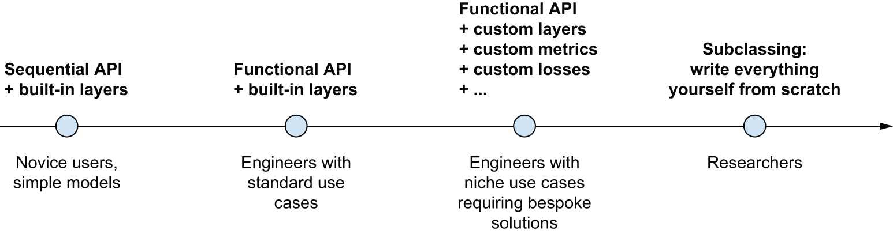
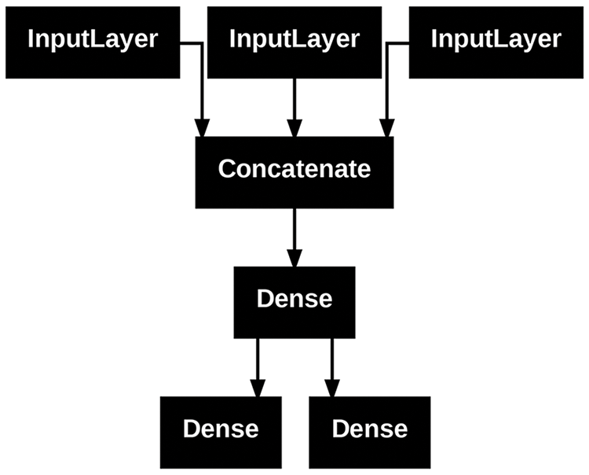
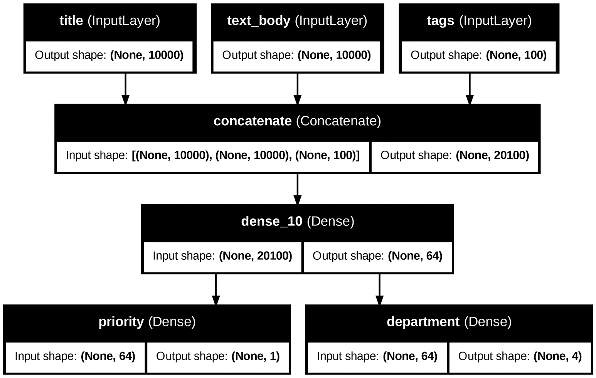
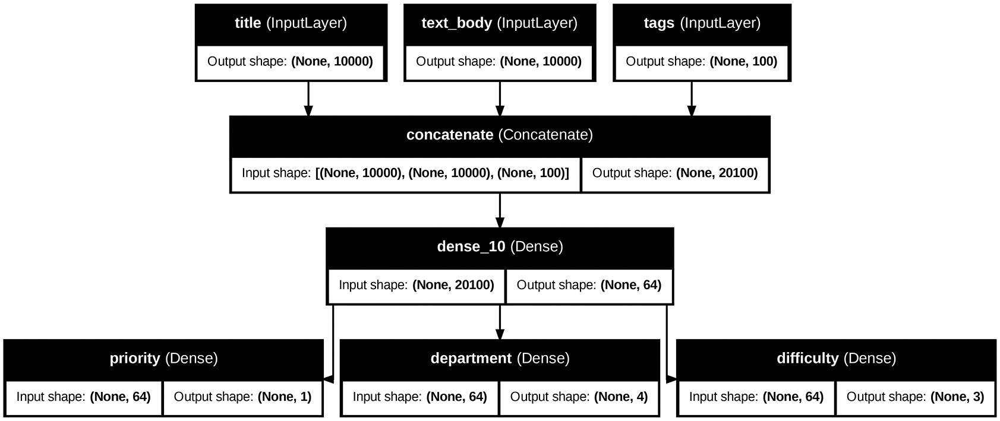
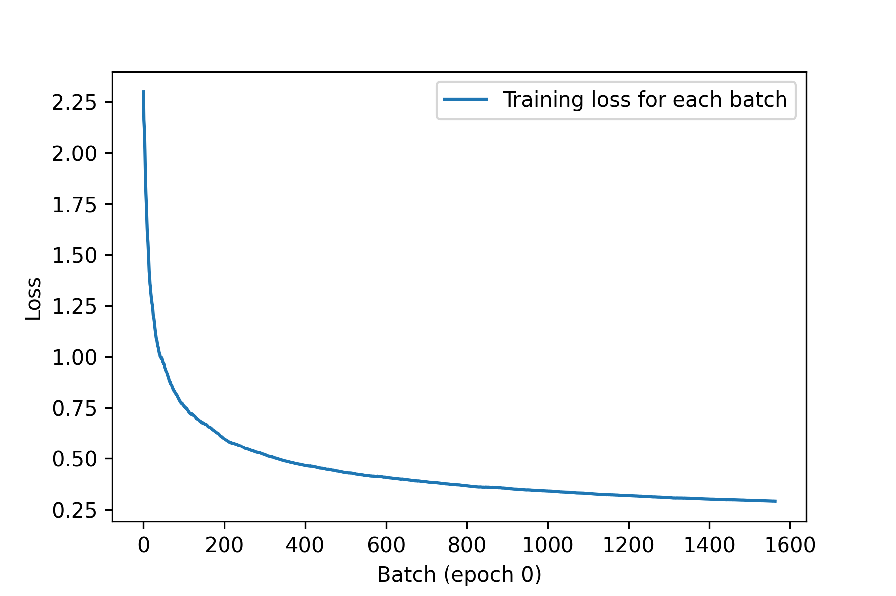
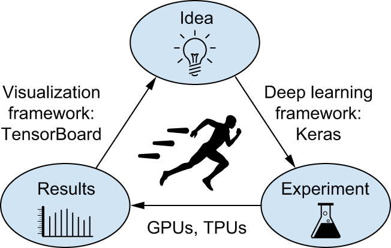
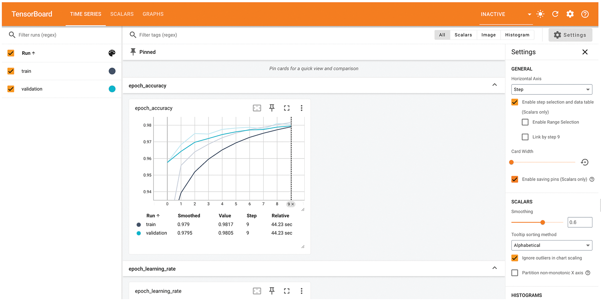

# Chapter 7: A deep dive on Keras

This chapter covers

* The different ways to create Keras models: the `Sequential` class,
  the Functional API, and model subclassing
* How to use the built-in Keras training and evaluation
  loops, including how to use custom metrics and custom losses
* Using Keras callbacks to further customize how training proceeds
* Using TensorBoard for monitoring your training and evaluation metrics over
  time
* How to write your own training and evaluation loops from scratch

You’re starting to have some amount of experience with Keras. You’re
familiar with the `Sequential` model, `Dense` layers, and built-in APIs
for training, evaluation, and inference — `compile()`, `fit()`, `evaluate()`,
and `predict()`. You’ve even learned in chapter 3 how to inherit from the
`Layer` class to create custom layers, and how to use the gradient APIs in
TensorFlow, JAX and PyTorch to implement a step-by-step training loop.

In the coming chapters, we’ll dig into computer vision, timeseries forecasting,
natural language
processing, and generative deep learning. These complex applications will
require much more than a `Sequential` architecture and the default `fit()` loop.
So let’s first turn you into a Keras expert!
In this chapter, you’ll get a complete overview of the key ways
to work with Keras APIs: everything you’re going to need to handle
the advanced deep learning use cases you’ll encounter next.

## A spectrum of workflows

The design of the Keras API is guided by the principle of
*progressive disclosure of complexity*: make it easy
to get started, yet make it possible to handle high-complexity use cases,
only requiring incremental learning at each step.
Simple use cases should be easy and approachable, and arbitrarily advanced
workflows should be *possible*: no matter how niche and complex
the thing you want to do, there should be a clear path to it,
a path that builds upon the various things you’ve learned from simpler workflows.
This means that you can grow from beginner to expert and still
use the same tools — only in different ways.

As such, there’s not a single “true” way of using Keras. Rather,
Keras offers a *spectrum of workflows*, from the very simple to the very
flexible. There are different ways to build Keras models, and different ways to
train them, answering different needs.

For instance, you have a range
of ways to build models and an array of ways to train them,
each representing a certain tradeoff between usability and flexibility.
You could be using Keras like you would use
scikit-learn — just calling `fit()` and letting the framework do its thing —
or you could be using it like NumPy —
taking full control of every little detail.

Because all these workflows are based on shared APIs, such as `Layer` and `Model`,
components from any workflow can be used in any other workflow:
they can all talk to each other. This means that everything you’re learning now as you’re getting started will
still be relevant once you’ve become an expert. You can
get started easily and then gradually dive into workflows where you’re writing
more and more logic from scratch. You won’t have to switch to an entirely
different framework as you go from student to researcher, or from data scientist
to deep learning engineer.

This philosophy is not unlike that of Python itself!
Some languages only offer one way to write programs — for instance,
object-oriented programming or functional programming. Meanwhile, Python
is a multiparadigm language: it offers a range of possible usage patterns,
which all work nicely together. This makes Python suitable for a wide range
of very different use cases: system administration, data science,
machine learning engineering, web development, or just learning how to program.
Likewise, you can think of Keras as the Python of deep learning: a user-friendly
deep learning language that offers a variety of workflows for different
user profiles.

## Different ways to build Keras models

There are three APIs for building models in Keras, as shown in figure 7.1:

* The *Sequential model* is the most approachable API — it’s basically a Python list.
  As such, it’s limited to simple stacks of layers.
* The *Functional API*, which focuses on graph-like model architectures.
  It represents a nice mid-point between usability and flexibility, and as such,
  it’s the most commonly used model-building API.
* *Model subclassing*, a low-level option where you write everything yourself
  from scratch. This is ideal if you want full control over every little thing.
  However, you won’t get access to many built-in Keras features,
  and you will be more at risk of making mistakes.




[Figure 7.1](#figure-7-1): Progressive disclosure of complexity for model building

### The Sequential model

The simplest way to build a Keras model is the `Sequential` model,
which you already know about.

```python
import keras
from keras import layers

model = keras.Sequential(
    [
        layers.Dense(64, activation="relu"),
        layers.Dense(10, activation="softmax"),
    ]
)
```

[Listing 7.1](#listing-7-1): The `Sequential` class

Note that it’s possible to build the same model incrementally via the `add()`
method, similar to the `append()` method of a Python list.

```python
model = keras.Sequential()
model.add(layers.Dense(64, activation="relu"))
model.add(layers.Dense(10, activation="softmax"))
```

[Listing 7.2](#listing-7-2): Incrementally building a `Sequential` model

You’ve seen in chapter 3 that layers only get built
(which is to say, create their weights)
when they are called for the first time.
That’s because the shape of the layers’ weights depends on the shape of their
input: until the input shape is known, they can’t be created.

As such, the previous `Sequential` model does not have any weights until you
actually call it on some data, or call its `build()` method with an input shape.

```python
>>> # At that point, the model isn't built yet.
>>> model.weights
[]
```

[Listing 7.3](#listing-7-3): Models that aren’t yet built have no weights


```python
>>> # Builds the model. Now the model will expect samples of shape
>>> # (3,). The None in the input shape signals that the batch size
>>> # could be anything.
>>> model.build(input_shape=(None, 3))
>>> # Now you can retrieve the model's weights.
>>> model.weights
[<Variable shape=(3, 64), dtype=float32, path=sequential/dense_2/kernel ...>,
 <Variable shape=(64,), dtype=float32, path=sequential/dense_2/bias ...>,
 <Variable shape=(64, 10), dtype=float32, path=sequential/dense_3/kernel ...>,
 <Variable shape=(10,), dtype=float32, path=sequential/dense_3/bias ...>>]
```

[Listing 7.4](#listing-7-4): Calling a model for the first time to build it

After the model is built, you can display its contents via the `summary()`
method, which comes in handy for debugging.

```python
>>> model.summary()
Model: "sequential_1"
┏━━━━━━━━━━━━━━━━━━━━━━━━━━━━━━━━━━━┳━━━━━━━━━━━━━━━━━━━━━━━━━━┳━━━━━━━━━━━━━━━┓
┃ Layer (type)                      ┃ Output Shape             ┃       Param # ┃
┡━━━━━━━━━━━━━━━━━━━━━━━━━━━━━━━━━━━╇━━━━━━━━━━━━━━━━━━━━━━━━━━╇━━━━━━━━━━━━━━━┩
│ dense_2 (Dense)                   │ (None, 64)               │           256 │
├───────────────────────────────────┼──────────────────────────┼───────────────┤
│ dense_3 (Dense)                   │ (None, 10)               │           650 │
└───────────────────────────────────┴──────────────────────────┴───────────────┘
 Total params: 906 (3.54 KB)
 Trainable params: 906 (3.54 KB)
 Non-trainable params: 0 (0.00 B)
```

[Listing 7.5](#listing-7-5): The summary method

As you can see, your model happens to be named `sequential_1`. You can actually
give names to everything in Keras — every model, every layer.

```python
>>> model = keras.Sequential(name="my_example_model")
>>> model.add(layers.Dense(64, activation="relu", name="my_first_layer"))
>>> model.add(layers.Dense(10, activation="softmax", name="my_last_layer"))
>>> model.build((None, 3))
>>> model.summary()
Model: "my_example_model"
┏━━━━━━━━━━━━━━━━━━━━━━━━━━━━━━━━━━━┳━━━━━━━━━━━━━━━━━━━━━━━━━━┳━━━━━━━━━━━━━━━┓
┃ Layer (type)                      ┃ Output Shape             ┃       Param # ┃
┡━━━━━━━━━━━━━━━━━━━━━━━━━━━━━━━━━━━╇━━━━━━━━━━━━━━━━━━━━━━━━━━╇━━━━━━━━━━━━━━━┩
│ my_first_layer (Dense)            │ (None, 64)               │           256 │
├───────────────────────────────────┼──────────────────────────┼───────────────┤
│ my_last_layer (Dense)             │ (None, 10)               │           650 │
└───────────────────────────────────┴──────────────────────────┴───────────────┘
 Total params: 906 (3.54 KB)
 Trainable params: 906 (3.54 KB)
 Non-trainable params: 0 (0.00 B)
```

[Listing 7.6](#listing-7-6): Naming models and layers with the `name` argument

When building a `Sequential` model incrementally, it’s useful to be
able to print a summary of what the current model looks like after you add each
layer. But you can’t print a summary until the model is built! There’s actually
a way to have your `Sequential` model get built on the fly: just declare the
shape of the model’s inputs in advance. You can do this via the `Input` class.

```python
model = keras.Sequential()
# Use an Input to declare the shape of the inputs. Note that the shape
# argument must be the shape of each sample, not the shape of one
# batch.
model.add(keras.Input(shape=(3,)))
model.add(layers.Dense(64, activation="relu"))
```

[Listing 7.7](#listing-7-7): Specifying the input shape of your model in advance

Now you can use `summary()` to follow how the output shape of your model changes
as you add more layers:

```python
>>> model.summary()
Model: "sequential_2"
┏━━━━━━━━━━━━━━━━━━━━━━━━━━━━━━━━━━━┳━━━━━━━━━━━━━━━━━━━━━━━━━━┳━━━━━━━━━━━━━━━┓
┃ Layer (type)                      ┃ Output Shape             ┃       Param # ┃
┡━━━━━━━━━━━━━━━━━━━━━━━━━━━━━━━━━━━╇━━━━━━━━━━━━━━━━━━━━━━━━━━╇━━━━━━━━━━━━━━━┩
│ dense_4 (Dense)                   │ (None, 64)               │           256 │
└───────────────────────────────────┴──────────────────────────┴───────────────┘
 Total params: 256 (1.00 KB)
 Trainable params: 256 (1.00 KB)
 Non-trainable params: 0 (0.00 B)

>>> model.add(layers.Dense(10, activation="softmax"))
>>> model.summary()
Model: "sequential_2"
┏━━━━━━━━━━━━━━━━━━━━━━━━━━━━━━━━━━━┳━━━━━━━━━━━━━━━━━━━━━━━━━━┳━━━━━━━━━━━━━━━┓
┃ Layer (type)                      ┃ Output Shape             ┃       Param # ┃
┡━━━━━━━━━━━━━━━━━━━━━━━━━━━━━━━━━━━╇━━━━━━━━━━━━━━━━━━━━━━━━━━╇━━━━━━━━━━━━━━━┩
│ dense_4 (Dense)                   │ (None, 64)               │           256 │
├───────────────────────────────────┼──────────────────────────┼───────────────┤
│ dense_5 (Dense)                   │ (None, 10)               │           650 │
└───────────────────────────────────┴──────────────────────────┴───────────────┘
 Total params: 906 (3.54 KB)
 Trainable params: 906 (3.54 KB)
 Non-trainable params: 0 (0.00 B)
```

This is a pretty common debugging workflow when dealing with layers that
transform their inputs in complex ways, such as the convolutional layers you’ll
learn about in chapter 8.

### The Functional API

The `Sequential` model is easy to use, but its applicability is
extremely limited: it can only express models with a single input and a single
output, applying one layer after the other in a sequential fashion.
In practice, it’s pretty common to encounter models with multiple inputs
(say, an image and its metadata), multiple outputs
(different things you want to predict about the data), or a nonlinear topology.

In such cases, you’d build your model using the Functional API. This is what
most Keras models you’ll encounter in the wild use. It’s fun and powerful —
it feels like playing with LEGO bricks.

#### A simple example

Let’s start with something simple: the two-layer stack we used in the previous
section. Its Functional API version looks like the following listing.

```python
inputs = keras.Input(shape=(3,), name="my_input")
features = layers.Dense(64, activation="relu")(inputs)
outputs = layers.Dense(10, activation="softmax")(features)
model = keras.Model(inputs=inputs, outputs=outputs, name="my_functional_model")
```

[Listing 7.8](#listing-7-8): A simple Functional model with two `Dense` layers

Let’s go over this step by step.
We started by declaring an `Input`
(note that you can also give names to these input objects, like everything else):

```python
inputs = keras.Input(shape=(3,), name="my_input")
```

This `inputs` object holds information about the shape and `dtype` of the data
that the model will process:

```python
>>> # The model will process batches where each sample has shape (3,).
>>> # The number of samples per batch is variable (indicated by the
>>> # None batch size).
>>> inputs.shape
(None, 3)
>>> # These batches will have dtype float32.
>>> inputs.dtype
"float32"
```

We call such an object a *symbolic tensor*. It doesn’t contain any actual data,
but it encodes the specifications of the actual tensors of data that the
model will see when you use it. It *stands for* future tensors of data.

Next, we created a layer and called it on the input:

```python
features = layers.Dense(64, activation="relu")(inputs)
```

All Keras layers can be called both on real tensors of data or on these
symbolic tensors. In the latter case, they return a new symbolic tensor,
with updated shape and dtype information:

```python
>>> features.shape
(None, 64)
```

After obtaining the final outputs, we instantiated the model by specifying
its inputs and outputs in the `Model` constructor:

```python
outputs = layers.Dense(10, activation="softmax")(features)
model = keras.Model(inputs=inputs, outputs=outputs, name="my_functional_model")
```

Here’s the summary of our model:

```python
>>> model.summary()
Model: "my_functional_model"
┏━━━━━━━━━━━━━━━━━━━━━━━━━━━━━━━━━━━┳━━━━━━━━━━━━━━━━━━━━━━━━━━┳━━━━━━━━━━━━━━━┓
┃ Layer (type)                      ┃ Output Shape             ┃       Param # ┃
┡━━━━━━━━━━━━━━━━━━━━━━━━━━━━━━━━━━━╇━━━━━━━━━━━━━━━━━━━━━━━━━━╇━━━━━━━━━━━━━━━┩
│ my_input (InputLayer)             │ (None, 3)                │             0 │
├───────────────────────────────────┼──────────────────────────┼───────────────┤
│ dense_8 (Dense)                   │ (None, 64)               │           256 │
├───────────────────────────────────┼──────────────────────────┼───────────────┤
│ dense_9 (Dense)                   │ (None, 10)               │           650 │
└───────────────────────────────────┴──────────────────────────┴───────────────┘
 Total params: 906 (3.54 KB)
 Trainable params: 906 (3.54 KB)
 Non-trainable params: 0 (0.00 B)
```

#### Multi-input, multi-output models

Unlike this toy model, most deep learning models don’t look like lists —
they look like graphs. They may, for instance, have multiple inputs
or multiple outputs.
It’s for this kind of model that the Functional API really shines.

Let’s say you’re building a system to rank customer support tickets
by priority and route them to the appropriate department. Your model has three
inputs:

* The title of the ticket (text input)
* The text body of the ticket (text input)
* Any tags added by the user (categorical input, assumed here to be multi-hot encoded)

We can encode the text inputs as arrays of 1s and 0s of size `vocabulary_size`
(see chapter 14 for detailed information about text encoding techniques).

Your model also has two outputs:

* The priority score of the ticket, a scalar between 0 and 1 (sigmoid output)
* The department that should handle the ticket (a softmax over the set of departments)

You can build this model in a few lines with the Functional API.

```python
vocabulary_size = 10000
num_tags = 100
num_departments = 4

# Defines model inputs
title = keras.Input(shape=(vocabulary_size,), name="title")
text_body = keras.Input(shape=(vocabulary_size,), name="text_body")
tags = keras.Input(shape=(num_tags,), name="tags")

# Combines input features into a single tensor, features, by
# concatenating them
features = layers.Concatenate()([title, text_body, tags])
# Applies intermediate layer to recombine input features into richer
# representations
features = layers.Dense(64, activation="relu", name="dense_features")(features)

# Defines model outputs
priority = layers.Dense(1, activation="sigmoid", name="priority")(features)
department = layers.Dense(
    num_departments, activation="softmax", name="department"
)(features)

# Creates the model by specifying its inputs and outputs
model = keras.Model(
    inputs=[title, text_body, tags],
    outputs=[priority, department],
)
```

[Listing 7.9](#listing-7-9): A multi-input, multi-output Functional model

The Functional API is a simple, LEGO-like, yet very flexible way to define
arbitrary graphs of layers like these.

#### Training a multi-input, multi-output model

You can train your model in much the same way as you would train a `Sequential` model,
by calling `fit()` with lists of input and output data.
These lists of data should respect the same order
as the inputs you passed to the `Model()` constructor.

```python
import numpy as np

num_samples = 1280

# Dummy input data
title_data = np.random.randint(0, 2, size=(num_samples, vocabulary_size))
text_body_data = np.random.randint(0, 2, size=(num_samples, vocabulary_size))
tags_data = np.random.randint(0, 2, size=(num_samples, num_tags))

# Dummy target data
priority_data = np.random.random(size=(num_samples, 1))
department_data = np.random.randint(0, num_departments, size=(num_samples, 1))

model.compile(
    optimizer="adam",
    loss=["mean_squared_error", "sparse_categorical_crossentropy"],
    metrics=[["mean_absolute_error"], ["accuracy"]],
)
model.fit(
    [title_data, text_body_data, tags_data],
    [priority_data, department_data],
    epochs=1,
)
model.evaluate(
    [title_data, text_body_data, tags_data], [priority_data, department_data]
)
priority_preds, department_preds = model.predict(
    [title_data, text_body_data, tags_data]
)
```

[Listing 7.10](#listing-7-10): Training a model by providing lists of input and target arrays

If you don’t want to rely on input order (for instance, because you have many inputs or outputs),
you can also use the names you gave to the `Input` objects and to the output layers, and
pass data via dictionaries.

```python
model.compile(
    optimizer="adam",
    loss={
        "priority": "mean_squared_error",
        "department": "sparse_categorical_crossentropy",
    },
    metrics={
        "priority": ["mean_absolute_error"],
        "department": ["accuracy"],
    },
)
model.fit(
    {"title": title_data, "text_body": text_body_data, "tags": tags_data},
    {"priority": priority_data, "department": department_data},
    epochs=1,
)
model.evaluate(
    {"title": title_data, "text_body": text_body_data, "tags": tags_data},
    {"priority": priority_data, "department": department_data},
)
priority_preds, department_preds = model.predict(
    {"title": title_data, "text_body": text_body_data, "tags": tags_data}
)
```

[Listing 7.11](#listing-7-11): Training a model by providing dicts of input and target arrays

#### The power of the Functional API: Access to layer connectivity

A Functional model is an explicit graph data structure. This makes it possible
to *inspect how layers are connected* and *reuse previous graph nodes*
(which are layer outputs) as part of new models. It also nicely fits
the “mental model” that most researchers use when thinking about a deep neural
network: a graph of layers.

This enables two important use cases: model visualization and feature extraction.
Let’s take a look.

##### Plotting layer connectivity

Let’s visualize the connectivity of the model we just defined
(the *topology* of the model). You can plot a Functional model as a graph with
the `plot_model()` utility, as shown in figure 7.2:

```python
keras.utils.plot_model(model, "ticket_classifier.png")
```





[Figure 7.2](#figure-7-2): Plot generated by `plot_model()` on our ticket classifier model

You can add to this plot the input and output shapes of each layer in the model,
as well as layer names (rather than just layer types),
which can be helpful during debugging (figure 7.3):

```python
keras.utils.plot_model(
    model,
    "ticket_classifier_with_shape_info.png",
    show_shapes=True,
    show_layer_names=True,
)
```





[Figure 7.3](#figure-7-3): Model plot with shape information added

The `None` in the tensor shapes represents the batch size: this model allows
batches of any size.

##### Feature extraction with a Functional model

Access to layer connectivity also means that you can inspect and reuse
individual nodes (layer calls) in the graph. The model property `model.layers`
provides the list of layers that make up the model,
and for each layer, you can query `layer.input` and `layer.output`.

```python
>>> model.layers
[<InputLayer name=title, built=True>,
 <InputLayer name=text_body, built=True>,
 <InputLayer name=tags, built=True>,
 <Concatenate name=concatenate, built=True>,
 <Dense name=dense_10, built=True>,
 <Dense name=priority, built=True>,
 <Dense name=department, built=True>]

>>> model.layers[3].input
[<KerasTensor shape=(None, 10000), dtype=float32, sparse=None, name=title>,
 <KerasTensor shape=(None, 10000), dtype=float32, sparse=None, name=text_body>,
 <KerasTensor shape=(None, 100), dtype=float32, sparse=None, name=tags>]

>>> model.layers[3].output
<KerasTensor shape=(None, 20100), dtype=float32, sparse=False>
```

[Listing 7.12](#listing-7-12): Retrieving the inputs or outputs of a layer in a Functional model

This enables you to do *feature extraction*: creating models that reuse intermediate
features from another model.

Let’s say you want to add another output to the model we previously defined — you
want to also predict an estimate of how long a given issue ticket will take to
resolve, a kind of difficulty rating.
You could do this via a classification layer over three categories — “quick,”
“medium,” and “difficult.” You don’t need to recreate and retrain a model from scratch!
You can just start from the intermediate features of your previous model, since you
have access to them.

```python
# layers[4] is our intermediate Dense layer.
features = model.layers[4].output
difficulty = layers.Dense(3, activation="softmax", name="difficulty")(features)

new_model = keras.Model(
    inputs=[title, text_body, tags], outputs=[priority, department, difficulty]
)
```

[Listing 7.13](#listing-7-13): Creating a new model by reusing intermediate layer outputs

Let’s plot our new model, as shown in figure 7.4:

```python
keras.utils.plot_model(
    new_model,
    "updated_ticket_classifier.png",
    show_shapes=True,
    show_layer_names=True,
)
```





[Figure 7.4](#figure-7-4): Plot of our new model

### Subclassing the Model class

The last model-building pattern you should know about is the most advanced one:
`Model` subclassing. You’ve already learned in chapter 3
how to subclass the `Layer` class to create custom layers.
Subclassing `Model` is pretty similar:

* In the `__init__` method, define the layers the model will use.
* In the `call` method, define the forward pass of the model,
  reusing the layers previously created.
* Instantiate your subclass and call it on data to create its weights.

#### Rewriting our previous example as a subclassed model

Let’s take a look at a simple example: we will reimplement the customer support
ticket management model using a `Model` subclass.

```python
class CustomerTicketModel(keras.Model):
    def __init__(self, num_departments):
        # Don't forget to call the super constructor!
        super().__init__()
        # Defines sublayers in the constructor
        self.concat_layer = layers.Concatenate()
        self.mixing_layer = layers.Dense(64, activation="relu")
        self.priority_scorer = layers.Dense(1, activation="sigmoid")
        self.department_classifier = layers.Dense(
            num_departments, activation="softmax"
        )

    # Defines the forward pass in the call() method
    def call(self, inputs):
        title = inputs["title"]
        text_body = inputs["text_body"]
        tags = inputs["tags"]

        features = self.concat_layer([title, text_body, tags])
        features = self.mixing_layer(features)
        priority = self.priority_scorer(features)
        department = self.department_classifier(features)
        return priority, department
```

[Listing 7.14](#listing-7-14): A simple subclassed model

Once you’ve defined the model, you can instantiate it. Note that it will only create its weights
the first time you call it on some data — much like `Layer` subclasses:

```python
model = CustomerTicketModel(num_departments=4)

priority, department = model(
    {"title": title_data, "text_body": text_body_data, "tags": tags_data}
)
```

So far, everything looks very similar to `Layer` subclassing, a workflow
you’ve already encountered in chapter 3. What, then, is the difference between
a `Layer` subclass and a `Model` subclass? It’s simple: a *layer* is a building
block you use to create models, and a *model* is the top-level object that you
will actually train, export for inference, etc. In short, a `Model` has a
`fit()`, `evaluate()`, and `predict()` method. Layers don’t.
Other than that, the two classes are virtually identical
(another difference is that you can *save* a model to a file on disk —
which we will cover in a few sections).

You can compile and train a `Model` subclass just like a Sequential
or Functional model:

```python
model.compile(
    optimizer="adam",
    # The structure of what you pass as the loss and metrics must match
    # exactly what gets returned by call() — since we returned a list
    # of two elements, so should loss and metrics be lists of two
    # elements.
    loss=["mean_squared_error", "sparse_categorical_crossentropy"],
    metrics=[["mean_absolute_error"], ["accuracy"]],
)
model.fit(
    # The structure of the input data must match exactly what is
    # expected by the call() method, and the structure of the target
    # data must match exactly what gets returned by the call() method.
    # Here, the input data must be a dict with three keys (title,
    # text_body, and tags) and the target data must be a list of two
    # elements.
    {"title": title_data, "text_body": text_body_data, "tags": tags_data},
    [priority_data, department_data],
    epochs=1,
)
model.evaluate(
    {"title": title_data, "text_body": text_body_data, "tags": tags_data},
    [priority_data, department_data],
)
priority_preds, department_preds = model.predict(
    {"title": title_data, "text_body": text_body_data, "tags": tags_data}
)
```

The `Model` subclassing workflow is the most flexible way to build a model: it enables
you to build models that cannot be expressed as directed acyclic graphs of layers —
imagine, for instance, a model where the `call()` method uses layers inside a `for` loop,
or even calls them recursively. Anything is possible — you’re in charge.

#### Beware: What subclassed models don’t support

This freedom comes at a cost: with subclassed models, you are responsible for more
of the model logic, which means your potential error surface is much larger.
As a result, you will have more debugging work to do.
You are developing a new Python object, not just snapping together LEGO bricks.

Functional and subclassed models are also substantially different in nature:
a Functional model is an explicit data structure — a graph of layers,
which you can view, inspect, and modify.
Meanwhile, a subclassed model is a piece of bytecode —
a Python class with a `call()` method that contains raw code.
This is the source of the subclassing workflow’s flexibility —
you can just code up whatever functionality you like —
but it introduces new limitations.

For instance, because the way layers are connected to each other
is hidden inside the body of the `call()` method, you cannot access that information.
Calling `summary()` will not display layer connectivity, and you cannot plot
the model topology via `plot_model()`. Likewise, if you have a subclassed model,
you cannot access the nodes of the graph
of layers to do feature extraction — because there is simply no graph.
Once the model is instantiated, its forward pass becomes a complete black box.

### Mixing and matching different components

Crucially, choosing one of these patterns —
the `Sequential` model, the Functional API, `Model` subclassing —
does not lock you out of the others. All models in the Keras API can
smoothly interoperate with each other, whether they’re Sequential models,
Functional models, or subclassed models written from scratch.
They’re all part of the same spectrum of workflows.
For instance, you can use a subclassed layer or model in a Functional model.

```python
class Classifier(keras.Model):
    def __init__(self, num_classes=2):
        super().__init__()
        if num_classes == 2:
            num_units = 1
            activation = "sigmoid"
        else:
            num_units = num_classes
            activation = "softmax"
        self.dense = layers.Dense(num_units, activation=activation)

    def call(self, inputs):
        return self.dense(inputs)

inputs = keras.Input(shape=(3,))
features = layers.Dense(64, activation="relu")(inputs)
outputs = Classifier(num_classes=10)(features)
model = keras.Model(inputs=inputs, outputs=outputs)
```

[Listing 7.15](#listing-7-15): Creating a Functional model that includes a subclassed model

Inversely, you can use a Functional model as part of a subclassed layer or model.

```python
inputs = keras.Input(shape=(64,))
outputs = layers.Dense(1, activation="sigmoid")(inputs)
binary_classifier = keras.Model(inputs=inputs, outputs=outputs)

class MyModel(keras.Model):
    def __init__(self, num_classes=2):
        super().__init__()
        self.dense = layers.Dense(64, activation="relu")
        self.classifier = binary_classifier

    def call(self, inputs):
        features = self.dense(inputs)
        return self.classifier(features)

model = MyModel()
```

[Listing 7.16](#listing-7-16): Creating a subclassed model that includes a Functional model

### Remember: Use the right tool for the job

You’ve learned about the spectrum of workflows for building Keras models,
from the simplest workflow — the `Sequential` model — to the most advanced one,
model subclassing. When should you use one over the other?
Each one has its pros and cons — pick the one most suitable for the job at hand.

In general, the Functional API provides you with a pretty good tradeoff between
ease of use and flexibility. It also gives you direct access to layer connectivity,
which is very powerful for use cases such as model plotting or feature extraction.
If you *can* use the Functional API — that is, if your model can be expressed as
a directed acyclic graph of layers — we recommend using it over model subclassing.

Going forward, all examples in this book will use the Functional API — simply
because all of the models we will work with are expressible as graphs of layers.
We will, however, make frequent use of subclassed layers.
In general, using Functional models
that include subclassed layers provides the best of both worlds: high development
flexibility while retaining the advantages of the Functional API.

## Using built-in training and evaluation loops

The principle of progressive disclosure of complexity — access to a spectrum
of workflows that go from dead easy to arbitrarily flexible, one step at a time
— also applies to model training. Keras provides
you with different workflows for training models — it can be as simple as calling
`fit()` on your data or as advanced as writing a new training algorithm from scratch.

You are already familiar with the `compile()`, `fit()`, `evaluate()`, `predict()`
workflow. As a reminder, it looks like the following listing.

```python
from keras.datasets import mnist

# Creates a model. (We factor this into a separate function so as to
# reuse it later.)
def get_mnist_model():
    inputs = keras.Input(shape=(28 * 28,))
    features = layers.Dense(512, activation="relu")(inputs)
    features = layers.Dropout(0.5)(features)
    outputs = layers.Dense(10, activation="softmax")(features)
    model = keras.Model(inputs, outputs)
    return model

# Loads your data, reserving some for validation
(images, labels), (test_images, test_labels) = mnist.load_data()
images = images.reshape((60000, 28 * 28)).astype("float32") / 255
test_images = test_images.reshape((10000, 28 * 28)).astype("float32") / 255
train_images, val_images = images[10000:], images[:10000]
train_labels, val_labels = labels[10000:], labels[:10000]

model = get_mnist_model()
# Compiles the model by specifying its optimizer, the loss function to
# minimize, and metrics to monitor
model.compile(
    optimizer="adam",
    loss="sparse_categorical_crossentropy",
    metrics=["accuracy"],
)
# Uses `fit()` to train the model, optionally providing validation data
# to monitor performance on unseen data
model.fit(
    train_images,
    train_labels,
    epochs=3,
    validation_data=(val_images, val_labels),
)
# Uses `evaluate()` to compute the loss and metrics on new data
test_metrics = model.evaluate(test_images, test_labels)
# Uses `predict()` to compute classification probabilities on new data
predictions = model.predict(test_images)
```

[Listing 7.17](#listing-7-17): The standard workflow: `compile()`, `fit()`, `evaluate()`, `predict()`

There are a couple of ways you can customize this simple workflow:

* By providing your own custom metrics
* By passing *callbacks* to the `fit()` method to schedule actions
  to be taken at specific points during training

Let’s take a look at these.

### Writing your own metrics

Metrics are key to measuring the performance of your model — in particular,
to measure the difference between its performance on the training data
and its performance on the test data. Commonly used metrics for classification
and regression are already part of the built-in `keras.metrics` module —
most of the time, that’s what you will use.
But if you’re doing anything out of the ordinary, you will need to be able
to write your own metrics. It’s simple!

A Keras metric is a subclass of the `keras.metrics.Metric` class. Similarly
to layers, a metric has an internal state stored in Keras variables.
Unlike layers, these variables aren’t updated via backpropagation,
so you have to write the state update logic yourself — which happens
in the `update_state()` method.
For example, here’s a simple custom metric that measures the root mean squared error (RMSE).

```python
from keras import ops

# Subclasses the Metric class
class RootMeanSquaredError(keras.metrics.Metric):
    # Defines the state variables in the constructor. Like for layers,
    # you have access to the add_weight() method.
    def __init__(self, name="rmse", **kwargs):
        super().__init__(name=name, **kwargs)
        self.mse_sum = self.add_weight(name="mse_sum", initializer="zeros")
        self.total_samples = self.add_weight(
            name="total_samples", initializer="zeros"
        )

    # Implements the state update logic in update_state(). The y_true
    # argument is the targets (or labels) for one batch, while y_pred
    # represents the corresponding predictions from the model. To match
    # our MNIST model, we expect categorical predictions and integer
    # labels. You can ignore the sample_weight argument; we won't use
    # it here.
    def update_state(self, y_true, y_pred, sample_weight=None):
        y_true = ops.one_hot(y_true, num_classes=ops.shape(y_pred)[1])
        mse = ops.sum(ops.square(y_true - y_pred))
        self.mse_sum.assign_add(mse)
        num_samples = ops.shape(y_pred)[0]
        self.total_samples.assign_add(num_samples)
```

[Listing 7.18](#listing-7-18): Implementing a custom metric by subclassing the `Metric` class

You use the `result()` method to return the current value of the metric:

```python
    def result(self):
        return ops.sqrt(self.mse_sum / self.total_samples)
```

Meanwhile, you also need to expose a way to reset the metric state without
having to reinstantiate it — this enables the same metric objects to
be used across different epochs of training or across both training and evaluation.
You do this in the `reset_state()` method:

```python
    def reset_state(self):
        self.mse_sum.assign(0.)
        self.total_samples.assign(0.)
```

Custom metrics can be used just like built-in ones. Let’s test-drive our own metric:

```python
model = get_mnist_model()
model.compile(
    optimizer="adam",
    loss="sparse_categorical_crossentropy",
    metrics=["accuracy", RootMeanSquaredError()],
)
model.fit(
    train_images,
    train_labels,
    epochs=3,
    validation_data=(val_images, val_labels),
)
test_metrics = model.evaluate(test_images, test_labels)
```

You can now see the `fit()` progress bar display the RMSE of your
model.

### Using callbacks

Launching a training run on a large dataset for tens of epochs using `model.fit()`
can be a bit like launching a paper airplane: past the initial impulse,
you don’t have any control over its trajectory or its landing spot.
If you want to avoid bad outcomes (and thus wasted paper airplanes),
it’s smarter to use, not a paper plane, but a drone that can sense its environment,
send data back to its operator, and automatically make steering decisions based
on its current state. The Keras *callbacks* API will help you
transform your call to `model.fit()` from a paper airplane into a smart,
autonomous drone that can self-introspect and dynamically take action.

A *callback* is an object (a class instance implementing specific methods)
that is passed to the model in the call to `fit()` and that is called by the model
at various points during training. It has access to all the available data about
the state of the model and its performance, and it can take action:
interrupt training, save a model, load a different weight set,
or otherwise alter the state of the model.

Here are some examples of ways you can use callbacks:

* *Model checkpointing* — Saving the current state of the model
  at different points during training.

* *Early stopping* — Interrupting training when the validation loss is
  no longer improving (and of course, saving the best model obtained during training).

* *Dynamically adjusting the value of certain parameters during training* —
  Such as the learning rate of the optimizer.

* *Logging training and validation metrics during training, or visualizing the representations learned by the model as they’re updated* —
  The `fit()` progress bar that you’re familiar with is in fact a callback!

The `keras.callbacks` module includes a number of built-in callbacks (this is not an exhaustive list):

```python
keras.callbacks.ModelCheckpoint
keras.callbacks.EarlyStopping
keras.callbacks.LearningRateScheduler
keras.callbacks.ReduceLROnPlateau
keras.callbacks.CSVLogger
```

Let’s review two of them to give you an idea of how to use them:
`EarlyStopping` and `ModelCheckpoint`.

#### The EarlyStopping and ModelCheckpoint callbacks

When you’re training a model, there are many things you can’t predict at the start.
In particular, you can’t tell how many epochs will be needed to get to an optimal
validation loss. Our examples so far have adopted the strategy of training
for enough epochs that you begin overfitting, using the first run to figure
out the optimal number of epochs, and then finally launching
a new training run from scratch using this optimal number.
Of course, this approach is wasteful. A much better way to handle this is to
stop training when you measure that the validation loss is no longer improving.
This can be achieved using the `EarlyStopping` callback.

The `EarlyStopping` callback interrupts training once a target
metric being monitored has stopped improving for a fixed number of epochs.
For instance, this callback allows you to interrupt training as soon as you
start overfitting, thus avoiding having to retrain your model for a smaller
number of epochs. This callback is typically used in
combination with `ModelCheckpoint`, which lets you continually save the model
during training (and, optionally, save only the current best model so far:
the version of the model that achieved the best performance at the end of an epoch).

```python
# Callbacks are passed to the model via the callbacks argument in
# fit(), which takes a list of callbacks. You can pass any number of
# callbacks.
callbacks_list = [
    # Interrupts training when improvement stops
    keras.callbacks.EarlyStopping(
        # Monitors the model's validation accuracy
        monitor="accuracy",
        # Interrupts training when accuracy has stopped improving for
        # more than one epoch (that is, two epochs)
        patience=1,
    ),
    # Saves the current weights after every epoch
    keras.callbacks.ModelCheckpoint(
        # Path to the destination model file
        filepath="checkpoint_path.keras",
        # These two arguments mean you won't overwrite the model file
        # unless val_loss has improved, which allows you to keep the
        # best model seen during training.
        monitor="val_loss",
        save_best_only=True,
    ),
]
model = get_mnist_model()
model.compile(
    optimizer="adam",
    loss="sparse_categorical_crossentropy",
    # You monitor accuracy, so it should be part of the model's
    # metrics.
    metrics=["accuracy"],
)
# Because the callback will monitor validation loss and validation
# accuracy, you need to pass validation_data to the call to fit().
model.fit(
    train_images,
    train_labels,
    epochs=10,
    callbacks=callbacks_list,
    validation_data=(val_images, val_labels),
)
```

[Listing 7.19](#listing-7-19): Using the `callbacks` argument in the `fit()` method

Note that you can always save models manually after training as well —
just call `model.save("my_checkpoint_path.keras")`.
To reload the model you’ve saved, use

```python
model = keras.models.load_model("checkpoint_path.keras")
```

### Writing your own callbacks

If you need to take a specific action during training that isn’t covered by
one of the built-in callbacks, you can write your own callback.
Callbacks are implemented by subclassing the class `keras.callbacks.Callback`.
You can then implement any number of the following transparently named methods,
which are called at various points during training:

```python
# Called at the start of every epoch
on_epoch_begin(epoch, logs)
# Called at the end of every epoch
on_epoch_end(epoch, logs)
# Called right before processing each batch
on_batch_begin(batch, logs)
# Called right after processing each batch
on_batch_end(batch, logs)
# Called at the start of training
on_train_begin(logs)
# Called at the end of training
on_train_end(logs)
```

These methods are all called with a `logs` argument, which is a dictionary
containing information about the previous batch, epoch, or training run:
training and validation metrics, and so on. The `on_epoch_*` and `on_batch_*`
methods also take the epoch or batch index as first argument (an integer).

Here’s a simple example callback that saves a list of per-batch loss values during training
and plots these values at the end of each epoch.

```python
from matplotlib import pyplot as plt

class LossHistory(keras.callbacks.Callback):
    def on_train_begin(self, logs):
        self.per_batch_losses = []

    def on_batch_end(self, batch, logs):
        self.per_batch_losses.append(logs.get("loss"))

    def on_epoch_end(self, epoch, logs):
        plt.clf()
        plt.plot(
            range(len(self.per_batch_losses)),
            self.per_batch_losses,
            label="Training loss for each batch",
        )
        plt.xlabel(f"Batch (epoch {epoch})")
        plt.ylabel("Loss")
        plt.legend()
        plt.savefig(f"plot_at_epoch_{epoch}", dpi=300)
        self.per_batch_losses = []
```

[Listing 7.20](#listing-7-20): Creating a custom callback by subclassing the `Callback` class

Let’s test-drive it:

```python
model = get_mnist_model()
model.compile(
    optimizer="adam",
    loss="sparse_categorical_crossentropy",
    metrics=["accuracy"],
)
model.fit(
    train_images,
    train_labels,
    epochs=10,
    callbacks=[LossHistory()],
    validation_data=(val_images, val_labels),
)
```

We get plots that look like figure 7.5.




[Figure 7.5](#figure-7-5): The output of our custom history-plotting callback

### Monitoring and visualization with TensorBoard

To do good research or develop good models, you need rich, frequent feedback
about what’s going on inside your models during your experiments.
That’s the point of running experiments: to get information about how well
a model performs — as much information as possible.
Making progress is an iterative process, a loop: you start with an idea
and express it as an experiment, attempting to validate or invalidate your idea.
You run this experiment and process the information it generates, as shown in figure 7.6.
This inspires your next idea. The more iterations of this loop you’re able to run,
the more refined and powerful your ideas become. Keras helps you go from idea
to experiment in the least possible time, and fast
GPUs can help you get from experiment to result as quickly as possible.
But what about processing the experiment results? That’s where TensorBoard comes in.




[Figure 7.6](#figure-7-6): The loop of progress

TensorBoard is a browser-based application that you can run locally. It’s
the best way to monitor everything that goes on inside your model
during training. With TensorBoard, you can

* Visually monitor metrics during training
* Visualize your model architecture
* Visualize histograms of activations and gradients
* Explore embeddings in 3D

If you’re monitoring more information than just the model’s final loss,
you can develop a clearer vision of what the model does and doesn’t do,
and you can make progress more quickly.

The easiest way to use TensorBoard with a Keras model and the `fit()` method is the
`keras.callbacks.TensorBoard` callback.
In the simplest case, just specify where you want the callback to write logs,
and you’re good to go:

```python
model = get_mnist_model()
model.compile(
    optimizer="adam",
    loss="sparse_categorical_crossentropy",
    metrics=["accuracy"],
)

tensorboard = keras.callbacks.TensorBoard(
    log_dir="/full_path_to_your_log_dir",
)
model.fit(
    train_images,
    train_labels,
    epochs=10,
    validation_data=(val_images, val_labels),
    callbacks=[tensorboard],
)
```

Once the model starts running, it will write logs at the target location.
If you are running your Python script on a local machine, you can then
launch the local TensorBoard server using the following command (note that
the `tensorboard` executable should already be available if you have
installed TensorFlow via `pip`; if not, you can install TensorBoard manually
via `pip install tensorboard`):

```python
tensorboard --logdir /full_path_to_your_log_dir
```

You can then navigate to the URL that the command returns to access the
TensorBoard interface.

If you are running your script in a Colab notebook, you can run an embedded
TensorBoard instance as part of your notebook, using the following commands:

```python
%load_ext tensorboard
%tensorboard --logdir /full_path_to_your_log_dir
```

In the TensorBoard interface, you will be able to monitor live graphs of your
training and evaluation metrics, as shown in figure 7.7.




[Figure 7.7](#figure-7-7): TensorBoard can be used for easy monitoring of training and evaluation metrics.

## Writing your own training and evaluation loops

The `fit()` workflow strikes a nice balance between ease of use and flexibility.
It’s what you will use most of the time.
However, it isn’t meant to support everything a deep learning researcher may want to do
— even with custom metrics, custom losses, and custom callbacks.

After all, the built-in `fit()` workflow is solely focused on *supervised learning*:
a setup where there are known *targets* (also called *labels* or *annotations*)
associated with your input data and where you compute your loss as a function
of these targets and the model’s predictions.
However, not every form of machine learning falls into this category.
There are other setups where no explicit targets are present,
such as *generative learning* (which we will introduce in chapter 16),
*self-supervised learning* (where targets are obtained from the inputs), or
*reinforcement learning* (where learning is driven by occasional “rewards” — much like training a dog).
And even if you’re doing regular supervised learning, as a researcher,
you may want to add some novel bells and whistles that require low-level flexibility.

Whenever you find yourself in a situation where the built-in `fit()` is not enough,
you will need to write your own custom training logic.
You’ve already seen simple examples of low-level training loops in chapters 2 and 3.
As a reminder, the contents of a typical training loop look like this:

1. Run the “forward pass” (compute the model’s output)
   to obtain a loss value for the current batch of data.
2. Retrieve the gradients of the loss with regard to the model’s weights.
3. Update the model’s weights so as to lower the loss value on the current batch of data.

These steps are repeated for as many batches as necessary. This is
essentially what `fit()` does under the hood. In this
section, you will learn to reimplement `fit()` from scratch, which will give
you all the knowledge you need to write any training algorithm you may come up with.

Let’s go over the details. Throughout the next few sections, you’ll work your way up
to writing a fully featured custom training loop in TensorFlow, PyTorch, and JAX.

### Training vs. inference

In the low-level training loop examples you’ve seen so far, step 1 (the forward
pass) was done via `predictions = model(inputs)`, and step 2 (retrieving the
gradients computed by the gradient tape) was done via a backend-specific API,
such as

* `gradients = tape.gradient(loss, model.weights)` in TensorFlow
* `loss.backward()` in PyTorch
* `jax.value_and_grad()` in JAX

In the general case, there are actually two subtleties you need to take into account.

Some Keras layers, such as the `Dropout` layer,
have different behaviors during *training* and during *inference*
(when you use them to generate predictions).
Such layers expose a `training` Boolean argument in their `call()` method.
Calling `dropout(inputs, training=True)` will drop some activation entries, while
calling `dropout(inputs, training=False)` does nothing.
By extension, Functional models and Sequential models also expose this
`training` argument in their `call()` methods. Remember to pass `training=True`
when you call a Keras model during the forward pass! Our forward pass thus
becomes `predictions = model(inputs, training=True)`.

In addition, note that when you retrieve the gradients of the weights
of your model, you should not use `model.weights`,
but rather `model.trainable_weights`. Indeed, layers and
models own two kinds of weights:

* *Trainable weights*, meant to be updated via backpropagation to minimize
  the loss of the model, such as the kernel and bias of a `Dense` layer.
* *Non-trainable weights*, which are meant to be updated during the forward pass
  by the layers that own them. For instance, if you wanted a custom layer to keep a counter
  of how many batches it has processed so far, that information would be stored
  in a non-trainable weight, and at each batch, your layer would increment the
  counter by one.

Among Keras built-in layers, the only layer that features non-trainable weights
is the `BatchNormalization` layer, which we will introduce in chapter 9.
The `BatchNormalization` layer needs non-trainable weights
to track information about the mean and standard deviation of the data that
passes through it, so as to perform an online approximation of
*feature normalization* (a concept you’ve learned about in chapters 4 and 6).

### Writing custom training step functions

Taking into account these two details, a supervised learning training step
ends up looking like this in pseudocode:

```python
def train_step(inputs, targets):
    # Runs the forward pass
    predictions = model(inputs, training=True)
    # Computes the loss for the current batch
    loss = loss_fn(targets, predictions)
    # Retrieves the gradients of the loss with regard to the model's
    # trainable weights This function doesn't actually exist!
    gradients = get_gradients_of(loss, wrt=model.trainable_weights)
    # Updates the model's trainable weights based on the gradients
    optimizer.apply(gradients, model.trainable_weights)
```

This snippet is pseudocode rather than real code because it includes an
imaginary function, `get_gradients_of()`. In reality, retrieving gradients
is done in a way that is specific to your current backend — JAX, TensorFlow, or PyTorch.

Let’s use what you learned about each framework in chapter 3 to implement a real version
of this `train_step()` function. We’ll start with TensorFlow and PyTorch because
these two make the job relatively easy, so they’re a good place to start. We’ll end with JAX,
which is quite a bit more complex.

#### A TensorFlow training step function

TensorFlow lets you write code that looks pretty much like our pseudocode snippet.
The only difference is that your forward pass should take place inside a `GradientTape`
scope. You can then use the `tape` object to retrieve the gradients:

```python
import tensorflow as tf

model = get_mnist_model()
loss_fn = keras.losses.SparseCategoricalCrossentropy()
optimizer = keras.optimizers.Adam()

def train_step(inputs, targets):
    # Opens a GradientTape
    with tf.GradientTape() as tape:
        # Runs the forward pass
        predictions = model(inputs, training=True)
        loss = loss_fn(targets, predictions)
    # Retrieves the gradients from the tape
    gradients = tape.gradient(loss, model.trainable_weights)
    # Updates the model's trainable weights based on the gradients
    optimizer.apply(gradients, model.trainable_weights)
    return loss
```

Let’s run it for a single step:

```python
batch_size = 32
inputs = train_images[:batch_size]
targets = train_labels[:batch_size]
loss = train_step(inputs, targets)
```

Easy enough! Let’s do PyTorch next.

#### A PyTorch training step function

When you use the PyTorch backend, all of your Keras layers and models inherit from the PyTorch `torch.nn.Module`
class and expose the native `Module` API. As a result, your model, its trainable weights, and your loss tensor are all aware of each other
and interact via three methods: `loss.backward()`, `weight.value.grad`, and `model.zero_grad()`.

As a reminder from chapter 3, the mental model you’ve got to keep in mind is this:

* With each forward pass, PyTorch builds up a one-time computation graph that keeps
  track of the computation that just happened.
* Calling `.backward()` on any given scalar node of this graph (like your loss) will run the graph backward
  starting from that node, automatically populating a `tensor.grad` attribute on all tensors involved (if they satisfy `requires_grad=True`),
  containing the gradient of the output node with respect to that tensor. In particular, it will populate the `grad` attribute
  of your trainable parameters.
* To clear the contents of that `tensor.grad` attribute, you should call `tensor.grad = None` on all
  your tensors. Because it would be a bit cumbersome to do this on all model variables individually,
  you can just do it at the model level via `model.zero_grad()` — the `zero_grad()` call will propagate to all variables
  tracked by the model. Clearing gradients is critical because calls to `backward()` are additive: if you don’t
  clear the gradients at each step, the gradient values will accumulate and training won’t proceed.

Let’s chain these steps:

```python
import torch

model = get_mnist_model()
loss_fn = keras.losses.SparseCategoricalCrossentropy()
optimizer = keras.optimizers.Adam()

def train_step(inputs, targets):
    # Runs the forward pass
    predictions = model(inputs, training=True)
    loss = loss_fn(targets, predictions)
    # Runs the backward pass, populating gradient values
    loss.backward()
    # Recovers the gradient associated with each trainable variable.
    # That weight.value is the PyTorch tensor that contains the
    # variable's value.
    gradients = [weight.value.grad for weight in model.trainable_weights]
    # Updates the model's trainable weights based on the gradients.
    # This must be done in a no_grad() scope.
    with torch.no_grad():
        optimizer.apply(gradients, model.trainable_weights)
    # Don't forget to clear the gradients!
    model.zero_grad()
    return loss
```

Let’s run it for a single step:

```python
batch_size = 32
inputs = train_images[:batch_size]
targets = train_labels[:batch_size]
loss = train_step(inputs, targets)
```

That wasn’t too difficult! Now, let’s move on to JAX.

#### A JAX training step function

When it comes to low-level training code, JAX tends to be the most complex
of the three backends because of its fully stateless nature. Statelessness
makes JAX highly performant and scalable, making it amenable to
compilation and automatic performance optimizations. However, writing stateless code
requires you to jump through some hoops.

Since the gradient function is obtained via metaprogramming,
you first need to define the function that returns your loss.
Further, this function needs to be stateless, so it needs to take as arguments all
the variables it’s going to be using, and it needs to return the value of any variable
it has updated. Remember those non-trainable weights that can get modified during the
forward pass? Those are the variables we need to return.

To make it easier to work with the stateless programming paradigm of JAX,
Keras models make available a stateless forward pass method:
the `stateless_call()` method. It behaves just like `__call__`, except that

* It takes as input the model’s trainable weights and non-trainable weights, in addition
  to the `inputs` and `training` arguments.
* It returns the model’s updated non-trainable weights, in addition to the model’s outputs.

It works like this:

```python
outputs, non_trainable_weights = model.stateless_call(
    trainable_weights, non_trainable_weights, inputs
)
```

We can use `stateless_call()` to implement our JAX loss function. Since the loss function
also computes updates for all non-trainable variables, we name it `compute_loss_and_updates()`:

```python
model = get_mnist_model()
loss_fn = keras.losses.SparseCategoricalCrossentropy()

# Gradients are computed for the entries in the first argument
# (trainable_variables here)
def compute_loss_and_updates(
    trainable_variables, non_trainable_variables, inputs, targets
):
    # Calls stateless_call
    outputs, non_trainable_variables = model.stateless_call(
        trainable_variables, non_trainable_variables, inputs, training=True
    )
    loss = loss_fn(targets, outputs)
    # Returns the scalar loss value and the updated non-trainable
    # weights
    return loss, non_trainable_variables
```

Once we have this `compute_loss_and_updates()` function, we can pass it
to `jax.value_and_grad` to obtain the gradient computation:

```python
import jax

grad_fn = jax.value_and_grad(fn)
loss, gradients = grad_fn(...)
```

Now, there’s just a small problem. Both `jax.grad()` and `jax.value_and_grad()`
require `fn` to return a scalar value only. Our `compute_loss_and_updates()`
function returns a scalar value as its first output, but it also returns the new value for the
non-trainable weights. Remember what you learned in chapter 3?
The solution is to pass a `has_aux` argument to `grad()` or `value_and_grad()`, like this:

```python
import jax

grad_fn = jax.value_and_grad(compute_loss_and_updates, has_aux=True)
```

You would use it like this:

```python
(loss, non_trainable_weights), gradients = grad_fn(
    trainable_variables, non_trainable_variables, inputs, targets
)
```

Okay, that was a lot of JAXiness. But now we’ve got almost everything we need to assemble
our JAX training step. We just need the last piece of the puzzle: `optimizer.apply()`.

When you wrote your first basic training step in TensorFlow at the beginning of chapter 2,
you wrote an update step function that looked like this:

```python
learning_rate = 1e-3

def update_weights(gradients, weights):
    for g, w in zip(gradients, weights):
        w.assign(w - g * learning_rate)
```

This corresponds to what the optimizer `keras.optimizers.SGD` would do. However, every other
optimizer in the Keras API is somewhat more complex than that and keeps track of auxiliary variables
that help speed up training — in particular, most optimizers use some form of *momentum*,
which you learned about in chapter 2. These extra variables get updated at each step of training,
and in the JAX world, that means that you need to get your hands on a stateless function
that takes these variables as arguments and returns their new value.

To make this easy, Keras makes available the `stateless_apply()` method on all optimizers.
It works like this:

```python
trainable_variables, optimizer_variables = optimizer.stateless_apply(
    optimizer_variables, grads, trainable_variables
)
```

Now, we have enough to assemble an end-to-end training step:

```python
optimizer = keras.optimizers.Adam()
optimizer.build(model.trainable_variables)

# The state is part of the function arguments.
def train_step(state, inputs, targets):
    # Unpacks the state
    (trainable_variables, non_trainable_variables, optimizer_variables) = state
    # Computes gradients and updates to non-trainable variables
    (loss, non_trainable_variables), grads = grad_fn(
        trainable_variables, non_trainable_variables, inputs, targets
    )
    # Updates trainable variables and optimizer variables
    trainable_variables, optimizer_variables = optimizer.stateless_apply(
        optimizer_variables, grads, trainable_variables
    )
    return loss, (
        # Returns the updated state alongside the loss
        trainable_variables,
        non_trainable_variables,
        optimizer_variables,
    )
```

Let’s run it for a single step:

```python
batch_size = 32
inputs = train_images[:batch_size]
targets = train_labels[:batch_size]

trainable_variables = [v.value for v in model.trainable_variables]
non_trainable_variables = [v.value for v in model.non_trainable_variables]
optimizer_variables = [v.value for v in optimizer.variables]

state = (trainable_variables, non_trainable_variables, optimizer_variables)
loss, state = train_step(state, inputs, targets)
```

It’s definitely a bit more work than TensorFlow and PyTorch, but the speed and scalability benefits
of JAX more than make up for it.

Next, let’s take a look at another important element of a custom training loop: *metrics*.

### Low-level usage of metrics

In a low-level training loop, you will probably want to use Keras metrics
(whether custom ones or the built-in ones). You’ve already learned about
the metrics API: simply call `update_state(y_true, y_pred)` for each
batch of targets and predictions, and then use `result()` to query the current
metric value:

```python
from keras import ops

metric = keras.metrics.SparseCategoricalAccuracy()
targets = ops.array([0, 1, 2])
predictions = ops.array([[1, 0, 0], [0, 1, 0], [0, 0, 1]])
metric.update_state(targets, predictions)
current_result = metric.result()
print(f"result: {current_result:.2f}")
```

You may also need to track the average of a scalar value, such as the model’s
loss. You can do this via the `keras.metrics.Mean` metric:

```python
values = ops.array([0, 1, 2, 3, 4])
mean_tracker = keras.metrics.Mean()
for value in values:
    mean_tracker.update_state(value)
print(f"Mean of values: {mean_tracker.result():.2f}")
```

Remember to use `metric.reset_state()` when you want to reset the current
results (at the start of a training epoch or at the start of evaluation).

Now, if you’re using JAX, state-modifying methods like `update_state()` or `reset()`
can’t be used inside a stateless function. Instead, you can use the stateless metrics API,
which is similar to the `model.stateless_call()` and `optimizer.stateless_apply()` methods
you’ve already learned about. Here’s how it works:

```python
metric = keras.metrics.SparseCategoricalAccuracy()
targets = ops.array([0, 1, 2])
predictions = ops.array([[1, 0, 0], [0, 1, 0], [0, 0, 1]])

# Gets the metric's state variables
metric_variables = metric.variables
# Gets updated values for the metric's state
metric_variables = metric.stateless_update_state(
    metric_variables, targets, predictions
)
# Computes the metric value corresponding to the current state
current_result = metric.stateless_result(metric_variables)
print(f"result: {current_result:.2f}")

# Gets blank variable values for the metric
metric_variables = metric.stateless_reset_state()
```

### Using fit() with a custom training loop

In the previous sections, we were writing our own training logic entirely from scratch.
Doing so provides you with the most flexibility, but you end up writing a lot of code,
while simultaneously missing out on many convenient features of `fit()`,
such as callbacks, performance optimizations, or built-in support for distributed training.

What if you need a custom training algorithm, but you still want to use
the power of the built-in Keras training loop?
There’s actually a middle ground between `fit()` and a training loop written from scratch:
you can provide a custom training step function and let the framework do the rest.

You can do this by overriding the `train_step()` method of the `Model` class.
This is the function that is called by `fit()` for
every batch of data. You will then be able to call `fit()` as usual — and it will be
running your own learning algorithm under the hood.

Here’s how it works:

* Create a new class that subclasses `keras.Model`.
* Override the `train_step()` method. Its contents are
  nearly identical to what we used in the previous section.
* Return a dictionary mapping metric names (including the loss) to their current
  value.

Note the following:

* This pattern does not prevent you from building models with the Functional
  API. You can do this whether you’re building `Sequential` models, Functional API
  models, or subclassed models.
* You don’t need to use a `@tf.function` or `@jax.jit` decorator
  when you override `train_step()` — the framework does it for you.

#### Customizing fit() with TensorFlow

Let’s start by coding a custom TensorFlow train step:

```python
import keras
from keras import layers

loss_fn = keras.losses.SparseCategoricalCrossentropy()
# This metric object will be used to track the average of per-batch
# losses during training and evaluation.
loss_tracker = keras.metrics.Mean(name="loss")

class CustomModel(keras.Model):
    # Overrides the train_step() method
    def train_step(self, data):
        inputs, targets = data
        with tf.GradientTape() as tape:
            # We use self(inputs, training=True) instead of
            # model(inputs, training=True) since our model is the class
            # itself.
            predictions = self(inputs, training=True)
            loss = loss_fn(targets, predictions)
        gradients = tape.gradient(loss, self.trainable_weights)
        self.optimizer.apply(gradients, self.trainable_weights)

        # Updates the loss tracker metric that tracks the average of
        # the loss
        loss_tracker.update_state(loss)
        # Returns the average loss so far by querying the loss tracker
        # metric
        return {"loss": loss_tracker.result()}

    # Listing the loss tracker metric in the model.metrics property
    # enables the model to automatically call reset_state() on it at
    # the start of each epoch and at the start of a call to evaluate()
    # — so you don't have to do it by hand. Any metric you would like
    # to reset across epochs should be listed here.
    @property
    def metrics(self):
        return [loss_tracker]
```

[Listing 7.21](#listing-7-21): Customizing `fit()`: TensorFlow version

We can now instantiate our custom model, compile it (we only pass the optimizer,
since the loss is already defined outside of the model),
and train it using `fit()` as usual.

Let’s put the model definition in its own reusable function:

```python
def get_custom_model():
    inputs = keras.Input(shape=(28 * 28,))
    features = layers.Dense(512, activation="relu")(inputs)
    features = layers.Dropout(0.5)(features)
    outputs = layers.Dense(10, activation="softmax")(features)
    model = CustomModel(inputs, outputs)
    model.compile(optimizer=keras.optimizers.Adam())
    return model
```

Let’s give it a whirl:

```python
model = get_custom_model()
model.fit(train_images, train_labels, epochs=3)
```

#### Customizing fit() with PyTorch

Next, the PyTorch version:

```python
import keras
from keras import layers

loss_fn = keras.losses.SparseCategoricalCrossentropy()
loss_tracker = keras.metrics.Mean(name="loss")

class CustomModel(keras.Model):
    def train_step(self, data):
        inputs, targets = data
        # Runs the forward pass
        predictions = self(inputs, training=True)
        loss = loss_fn(targets, predictions)

        # Retrieves the gradients
        loss.backward()
        trainable_weights = [v for v in self.trainable_weights]
        gradients = [v.value.grad for v in trainable_weights]

        with torch.no_grad():
            # Updates weights
            self.optimizer.apply(gradients, trainable_weights)

        # Updates loss tracker metric
        loss_tracker.update_state(loss)
        # Returns the average loss so far by querying the loss tracker
        # metric
        return {"loss": loss_tracker.result()}

    @property
    def metrics(self):
        return [loss_tracker]
```

Let’s try it:

```python
model = get_custom_model()
model.fit(train_images, train_labels, epochs=3)
```

#### Customizing fit() with JAX

Finally, let’s write the JAX version. First we need to define a `compute_loss_and_updates()` method,
similar to the `compute_loss_and_updates()` function we used in our custom training step example:

```python
import keras
from keras import layers

loss_fn = keras.losses.SparseCategoricalCrossentropy()

class CustomModel(keras.Model):
    def compute_loss_and_updates(
        self,
        trainable_variables,
        non_trainable_variables,
        inputs,
        targets,
        training=False,
    ):
        predictions, non_trainable_variables = self.stateless_call(
            trainable_variables,
            non_trainable_variables,
            inputs,
            training=training,
        )
        loss = loss_fn(targets, predictions)
        # Returns both the loss and the updated non-trainable variables
        return loss, non_trainable_variables
```

Note we aren’t computing a moving average of the loss like we did for the other two backends.
Instead we just return the per-batch loss value, which is less useful.
We do this to simplify metric state management in the example: the code would get very verbose if we included it (you will learn about metric management in the next section):

```python
    def train_step(self, state, data):
        # Unpacks the state. metrics_variables are part of it, although
        # we won't use them here.
        (
            trainable_variables,
            non_trainable_variables,
            optimizer_variables,
            metrics_variables,
        ) = state
        inputs, targets = data

        # Gets the gradient function
        grad_fn = jax.value_and_grad(
            self.compute_loss_and_updates, has_aux=True
        )

        # Computes gradients and updates to non-trainable variables
        (loss, non_trainable_variables), grads = grad_fn(
            trainable_variables,
            non_trainable_variables,
            inputs,
            targets,
            training=True,
        )

        # Updates trainable variables and optimizer variables
        (
            trainable_variables,
            optimizer_variables,
        ) = self.optimizer.stateless_apply(
            optimizer_variables, grads, trainable_variables
        )

        # We aren't computing a moving average of the loss, instead
        # returning the per-batch value.
        logs = {"loss": loss}
        state = (
            trainable_variables,
            non_trainable_variables,
            optimizer_variables,
            metrics_variables,
        )
        # Returns metric logs and updated state variables
        return logs, state
```

Let’s try it out:

```python
model = get_custom_model()
model.fit(train_images, train_labels, epochs=3)
```

### Handling metrics in a custom train\_step()

Finally, what about the `loss` and `metrics` that you can pass to `compile()`?
After you’ve called `compile()`, you get access to

* `self.compute_loss` — This combines the loss function you passed to `compile()`
  together with regularization losses that may be added by certain layers.
* `self.metrics` — The list of metrics you passed to `compile()`. Note
  that it also includes a metric that tracks the loss.

#### train\_step() metrics handling with TensorFlow

Here’s what it looks like with TensorFlow:

```python
import keras
from keras import layers

class CustomModel(keras.Model):
    def train_step(self, data):
        inputs, targets = data
        with tf.GradientTape() as tape:
            predictions = self(inputs, training=True)
            # Computes the loss via self.compute_loss
            loss = self.compute_loss(y=targets, y_pred=predictions)

        gradients = tape.gradient(loss, self.trainable_weights)
        self.optimizer.apply(gradients, self.trainable_weights)

        # Updates the model's metrics, including the one that tracks
        # the loss
        for metric in self.metrics:
            if metric.name == "loss":
                metric.update_state(loss)
            else:
                metric.update_state(targets, predictions)

        # Returns a dict mapping metric names to their current value
        return {m.name: m.result() for m in self.metrics}
```

Let’s try it:

```python
def get_custom_model():
    inputs = keras.Input(shape=(28 * 28,))
    features = layers.Dense(512, activation="relu")(inputs)
    features = layers.Dropout(0.5)(features)
    outputs = layers.Dense(10, activation="softmax")(features)
    model = CustomModel(inputs, outputs)
    model.compile(
        optimizer=keras.optimizers.Adam(),
        loss=keras.losses.SparseCategoricalCrossentropy(),
        metrics=[keras.metrics.SparseCategoricalAccuracy()],
    )
    return model

model = get_custom_model()
model.fit(train_images, train_labels, epochs=3)
```

#### train\_step() metrics handling with PyTorch

And here’s what it looks like with PyTorch — it’s exactly the same code change!

```python
import keras
from keras import layers

class CustomModel(keras.Model):
    def train_step(self, data):
        inputs, targets = data
        predictions = self(inputs, training=True)
        loss = self.compute_loss(y=targets, y_pred=predictions)

        loss.backward()
        trainable_weights = [v for v in self.trainable_weights]
        gradients = [v.value.grad for v in trainable_weights]

        with torch.no_grad():
            self.optimizer.apply(gradients, trainable_weights)

        for metric in self.metrics:
            if metric.name == "loss":
                metric.update_state(loss)
            else:
                metric.update_state(targets, predictions)

        return {m.name: m.result() for m in self.metrics}
```

Let’s see how it runs:

```python
def get_custom_model():
    inputs = keras.Input(shape=(28 * 28,))
    features = layers.Dense(512, activation="relu")(inputs)
    features = layers.Dropout(0.5)(features)
    outputs = layers.Dense(10, activation="softmax")(features)
    model = CustomModel(inputs, outputs)
    model.compile(
        optimizer=keras.optimizers.Adam(),
        loss=keras.losses.SparseCategoricalCrossentropy(),
        metrics=[keras.metrics.SparseCategoricalAccuracy()],
    )
    return model

model = get_custom_model()
model.fit(train_images, train_labels, epochs=3)
```

#### train\_step() metrics handling with JAX

Finally, here’s what it looks like with JAX.
To start with, you can use `compute_loss()` in your `compute_loss_and_updates()` method
to hit the loss passed to `compile()`:

```python
import keras
from keras import layers

class CustomModel(keras.Model):
    def compute_loss_and_updates(
        self,
        trainable_variables,
        non_trainable_variables,
        inputs,
        targets,
        training=False,
    ):
        predictions, non_trainable_variables = self.stateless_call(
            trainable_variables,
            non_trainable_variables,
            inputs,
            training=training,
        )
        loss = self.compute_loss(y=targets, y_pred=predictions)
        return loss, (predictions, non_trainable_variables)
```

Next up: metric management. As usual, it’s a tad more complicated
due to JAX’s statelessness requirements:

```python
    def train_step(self, state, data):
        (
            trainable_variables,
            non_trainable_variables,
            optimizer_variables,
            # Metric variables are part of the state.
            metrics_variables,
        ) = state
        inputs, targets = data

        grad_fn = jax.value_and_grad(
            self.compute_loss_and_updates, has_aux=True
        )

        (loss, (predictions, non_trainable_variables)), grads = grad_fn(
            trainable_variables,
            non_trainable_variables,
            inputs,
            targets,
            training=True,
        )
        (
            trainable_variables,
            optimizer_variables,
        ) = self.optimizer.stateless_apply(
            optimizer_variables, grads, trainable_variables
        )

        new_metrics_vars = []
        logs = {}
        # Iterates over metrics
        for metric in self.metrics:
            num_prev = len(new_metrics_vars)
            num_current = len(metric.variables)
            # Grabs the variables of the current metrics
            current_vars = metrics_variables[num_prev : num_prev + num_current]
            # Updates the metric's state
            if metric.name == "loss":
                current_vars = metric.stateless_update_state(current_vars, loss)
            else:
                current_vars = metric.stateless_update_state(
                    current_vars, targets, predictions
                )
            # Stores the results in the logs dict
            logs[metric.name] = metric.stateless_result(current_vars)
            new_metrics_vars += current_vars

        state = (
            trainable_variables,
            non_trainable_variables,
            optimizer_variables,
            # Returns the new metrics variables as part of the state
            new_metrics_vars,
        )
        return logs, state
```

That was a lot of information, but by now you know enough to use Keras
to do almost anything!

## Summary

* Keras offers a spectrum of different workflows, based on the principle of
  *progressive disclosure of complexity*. They all smoothly interoperate.
* You can build models via the `Sequential` class, via the Functional API,
  or by subclassing the `Model` class. Most of the time, you’ll be using the Functional API.
* The simplest way to train and evaluate a model is via the default `fit()` and `evaluate()` methods.
* Keras callbacks provide a simple way to monitor models during your call to `fit()`
  and automatically take action based on the state of the model.
* You can also fully control what `fit()` does by overriding the `train_step()` method,
  using APIs from your backend of choice — JAX, TensorFlow, or PyTorch.
* Beyond `fit()`, you can also write your own training loops entirely from scratch,
  in a backend-native way. This is useful for researchers implementing brand-new training algorithms.