<!-- tabs:start -->

#### **Tiếng Anh (English)**

# Chapter 8: Image classification

This chapter covers

* Understanding convolutional neural networks (ConvNets)
* Using data augmentation to mitigate overfitting
* Using a pretrained ConvNet for feature extraction
* Fine-tuning a pretrained ConvNet

Computer vision was the first big success story of deep learning.
It led to the initial rise of deep learning between 2011 and 2015.
A type of deep learning called *convolutional neural networks*
started getting remarkably good results on image classification competitions
around that time, first with Dan Ciresan winning two niche competitions
(the ICDAR 2011 Chinese character
recognition competition and the IJCNN 2011 German traffic signs recognition competition)
and then, more notably, in fall 2012, with Hinton’s group winning the high-profile ImageNet
large-scale visual recognition challenge. Many more promising results quickly started
bubbling up in other computer vision tasks.

Interestingly, these early successes weren’t quite enough to make deep learning
mainstream at the time — it took a few years. The computer vision research
community had spent many years investing in methods other than neural networks,
and it wasn’t quite ready to give up on them just because there was a new kid on the block.
In 2013 and 2014, deep learning still faced intense skepticism from many senior
computer vision researchers. It was only in 2016 that it finally became dominant.
One author remembers exhorting an ex-professor, in February 2014,
to pivot to deep learning. “It’s the next big thing!” he would say.
“Well, maybe it’s just a fad,” the professor would reply. By 2016, his entire lab was doing
deep learning. There’s no stopping an idea whose time has come.

Today, you’re constantly interacting with deep learning–based vision models —
via Google Photos, Google image search, the camera on your phone,
YouTube, OCR software, and many more.
These models are also at the heart of cutting-edge research in autonomous driving,
robotics, AI-assisted medical diagnosis, autonomous retail checkout systems,
and even autonomous farming.

This chapter introduces convolutional neural networks, also known as
*ConvNets* or *CNNs*, the type of deep-learning model that is used by most computer
vision applications. You’ll learn to apply ConvNets to image classification
problems — in particular, those involving small training datasets, which are the
most common use case if you aren’t a large tech company.

## Introduction to ConvNets

We’re about to dive into the theory of what ConvNets are
and why they have been so successful at computer vision tasks.
But first, let’s take a practical look at a simple
ConvNet example. It uses a ConvNet to classify MNIST digits, a task we
performed in chapter 2 using a densely connected network (our test accuracy
then was 97.8%). Even though the ConvNet will be basic, its accuracy will blow
out of the water that of the densely connected model from chapter 2.

The following lines of code show you what a basic ConvNet looks like. It’s a
stack of `Conv2D` and `MaxPooling2D` layers. You’ll see in a minute exactly
what they do. We’ll build the model using the Functional API,
which we introduced in the previous chapter.

```python
import keras
from keras import layers

inputs = keras.Input(shape=(28, 28, 1))
x = layers.Conv2D(filters=64, kernel_size=3, activation="relu")(inputs)
x = layers.MaxPooling2D(pool_size=2)(x)
x = layers.Conv2D(filters=128, kernel_size=3, activation="relu")(x)
x = layers.MaxPooling2D(pool_size=2)(x)
x = layers.Conv2D(filters=256, kernel_size=3, activation="relu")(x)
x = layers.GlobalAveragePooling2D()(x)
outputs = layers.Dense(10, activation="softmax")(x)
model = keras.Model(inputs=inputs, outputs=outputs)
```

[Listing 8.1](#listing-8-1): Instantiating a small ConvNet

Importantly, a ConvNet takes as input tensors of shape `(image_height,
image_width, image_channels)` (not including the batch dimension). In this
case, we’ll configure the ConvNet to process inputs of size `(28, 28, 1)`,
which is the format of MNIST images.

Let’s display the architecture of our ConvNet.

```python
>>> model.summary()
Model: "functional"
┏━━━━━━━━━━━━━━━━━━━━━━━━━━━━━━━━━━━┳━━━━━━━━━━━━━━━━━━━━━━━━━━┳━━━━━━━━━━━━━━━┓
┃ Layer (type)                      ┃ Output Shape             ┃       Param # ┃
┡━━━━━━━━━━━━━━━━━━━━━━━━━━━━━━━━━━━╇━━━━━━━━━━━━━━━━━━━━━━━━━━╇━━━━━━━━━━━━━━━┩
│ input_layer (InputLayer)          │ (None, 28, 28, 1)        │             0 │
├───────────────────────────────────┼──────────────────────────┼───────────────┤
│ conv2d (Conv2D)                   │ (None, 26, 26, 64)       │           640 │
├───────────────────────────────────┼──────────────────────────┼───────────────┤
│ max_pooling2d (MaxPooling2D)      │ (None, 13, 13, 64)       │             0 │
├───────────────────────────────────┼──────────────────────────┼───────────────┤
│ conv2d_1 (Conv2D)                 │ (None, 11, 11, 128)      │        73,856 │
├───────────────────────────────────┼──────────────────────────┼───────────────┤
│ max_pooling2d_1 (MaxPooling2D)    │ (None, 5, 5, 128)        │             0 │
├───────────────────────────────────┼──────────────────────────┼───────────────┤
│ conv2d_2 (Conv2D)                 │ (None, 3, 3, 256)        │       295,168 │
├───────────────────────────────────┼──────────────────────────┼───────────────┤
│ global_average_pooling2d          │ (None, 256)              │             0 │
│ (GlobalAveragePooling2D)          │                          │               │
├───────────────────────────────────┼──────────────────────────┼───────────────┤
│ dense (Dense)                     │ (None, 10)               │         2,570 │
└───────────────────────────────────┴──────────────────────────┴───────────────┘
 Total params: 372,234 (1.42 MB)
 Trainable params: 372,234 (1.42 MB)
 Non-trainable params: 0 (0.00 B)
```

[Listing 8.2](#listing-8-2): Displaying the model’s summary

You can see that the output of every `Conv2D` and `MaxPooling2D` layer is a 3D
tensor of shape `(height, width, channels)`. The width and height dimensions
tend to shrink as you go deeper in the model. The number of channels is
controlled by the first argument passed to the `Conv2D` layers (64, 128, or 256).

Image data formats in deep learning frameworks

Some deep learning libraries flip the location of channels in image tensors to
the first rank (notably much of the PyTorch ecosystem). Rather than passing
images with shape `(height, width, channels)` you would pass
`(channels, height, width)`.

This is purely a matter of convention, and in Keras is configurable. You can
call `keras.config.set_image_data_format("channels_first")` to change Keras’
default, or pass a `data_format` argument to any conv or pooling layer. In
general, you can leave the default as is unless you have a specific need for
`"channels_first"`.

After the last `Conv2D` layer, we end up with an output of shape
`(3, 3, 256)` — a 3 × 3 feature map of 256 channels.
The next step is to feed this output into a
densely connected classifier like those you’re already familiar with:
a stack of `Dense` layers. These classifiers process vectors, which are 1D,
whereas the current output is a rank-3 tensor. To bridge the gap, we flatten the 3D
outputs to 1D with a `GlobalAveragePooling2D` layer before adding the `Dense` layers.
This layer will take the average of each 3 × 3 feature map in the tensor of shape `(3, 3, 256)`,
resulting in an output vector of shape `(256,)`. Finally, we’ll do 10-way classification, so our last layer has 10 outputs and a
softmax activation.

Now, let’s train the ConvNet on the MNIST digits. We’ll reuse a lot of the code
from the MNIST example in chapter 2. Because we’re doing 10-way classification
with a softmax output, we’ll use the categorical crossentropy loss, and
because our labels are integers, we’ll use the sparse version,
`sparse_categorical_crossentropy`.

```python
from keras.datasets import mnist

(train_images, train_labels), (test_images, test_labels) = mnist.load_data()
train_images = train_images.reshape((60000, 28, 28, 1))
train_images = train_images.astype("float32") / 255
test_images = test_images.reshape((10000, 28, 28, 1))
test_images = test_images.astype("float32") / 255
model.compile(
    optimizer="adam",
    loss="sparse_categorical_crossentropy",
    metrics=["accuracy"],
)
model.fit(train_images, train_labels, epochs=5, batch_size=64)
```

[Listing 8.3](#listing-8-3): Training the ConvNet on MNIST images

Let’s evaluate the model on the test data.

```python
>>> test_loss, test_acc = model.evaluate(test_images, test_labels)
>>> print(f"Test accuracy: {test_acc:.3f}")
Test accuracy: 0.991
```

[Listing 8.4](#listing-8-4): Evaluating the ConvNet

Whereas the densely connected model from chapter 2 had a test accuracy of
97.8%, the basic ConvNet has a test accuracy of 99.1%: we decreased the error
rate by about 60% (relative). Not bad!

But why does this simple ConvNet work so well, compared to a densely connected
model? To answer this, let’s dive into what the `Conv2D` and
`MaxPooling2D` layers do.

### The convolution operation

The fundamental difference between a densely connected layer and a convolution
layer is this: `Dense` layers learn global patterns in their input feature space
(for example, for a MNIST digit, patterns involving all pixels),
whereas convolution layers learn local patterns (see figure 8.1):
in the case of images, patterns found in small 2D windows of the inputs.
In the previous example, these windows were all 3 × 3.

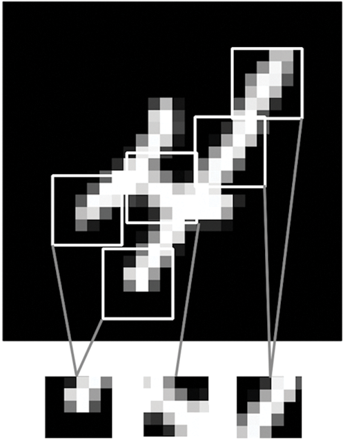


[Figure 8.1](#figure-8-1): Images can be broken into local patterns such as edges, textures, and so on.

This key characteristic gives ConvNets two interesting properties:

* *The patterns they learn are translation invariant*. After
  learning a certain pattern in the
  lower-right corner of a picture, a ConvNet can recognize it anywhere: for
  example, in the upper-left corner. A densely connected model would have to
  learn the pattern anew if it appeared at a new location. This makes ConvNets
  data efficient when processing images —
  because *the visual world is fundamentally translation invariant*.
  They need fewer training samples to
  learn representations that have generalization power.

* *They can learn spatial hierarchies of patterns (see figure 8.2)*. A first
  convolution layer will learn small local patterns such as edges, a second
  convolution layer will learn larger patterns made of the features of the first
  layers, and so on. This allows ConvNets to efficiently learn increasingly
  complex and abstract visual concepts —
  because *the visual world is fundamentally spatially hierarchical*.

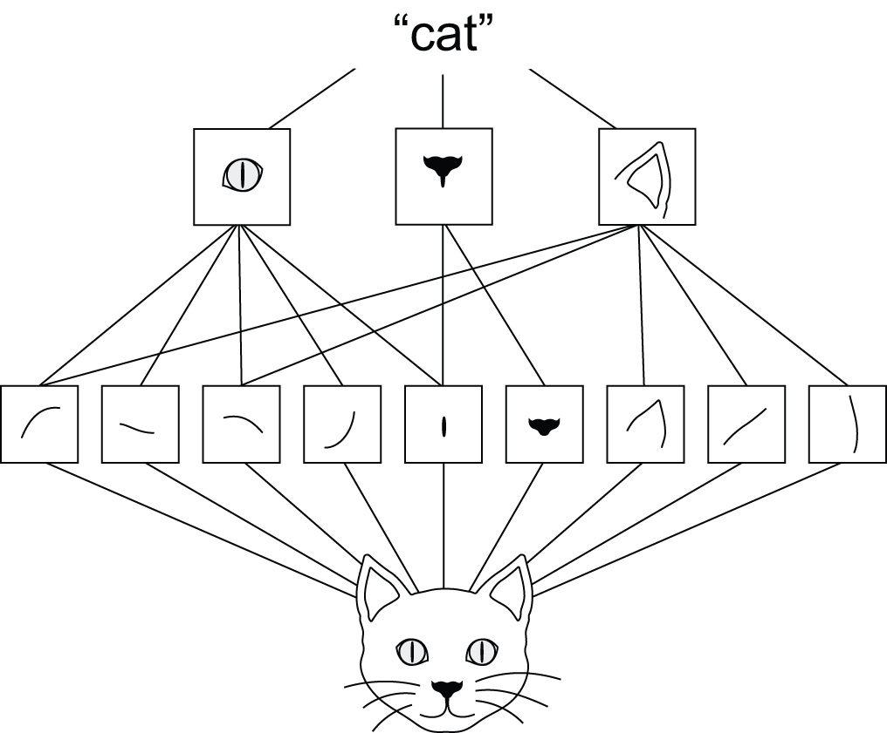


[Figure 8.2](#figure-8-2): The visual world forms a spatial hierarchy of visual modules: elementary lines or textures combine into simple objects such as eyes or ears, which combine into high-level concepts such as “cat.”

Convolutions operate over rank-3 tensors, called *feature maps*, with
two spatial axes (*height* and *width*) as well as a *depth* axis (also
called the *channels* axis). For an RGB image, the dimension of the depth axis
is 3, because the image has three color channels: red, green, and blue. For a
black-and-white picture, like the MNIST digits, the depth is 1 (levels of
gray). The convolution operation extracts patches from its input feature map
and applies the same transformation to all of these patches, producing an
*output feature map*. This output feature map is still a rank-3 tensor: it has a
width and a height. Its depth can be arbitrary because the output depth is a
parameter of the layer, and the different channels in that depth axis no
longer stand for specific colors as in RGB input; rather, they stand for
*filters*. Filters encode specific aspects of the input data: at a high level,
a single filter could encode the concept “presence of a face in the input,”
for instance.

In the MNIST example, the first convolution layer takes a feature map of size
`(28, 28, 1)` and outputs a feature map of size `(26, 26, 64)`: it computes 64
filters over its input. Each of these 64 output channels contains a 26 × 26
grid of values, which is a *response map* of the filter over the input,
indicating the response of that filter pattern at different locations in the
input (see figure 8.3).
That is what the term *feature map* means: every dimension in the depth axis is
a feature (or filter), and the rank-2 tensor `output[:, :, n]` is the 2D spatial
*map* of the response of this filter over the input.

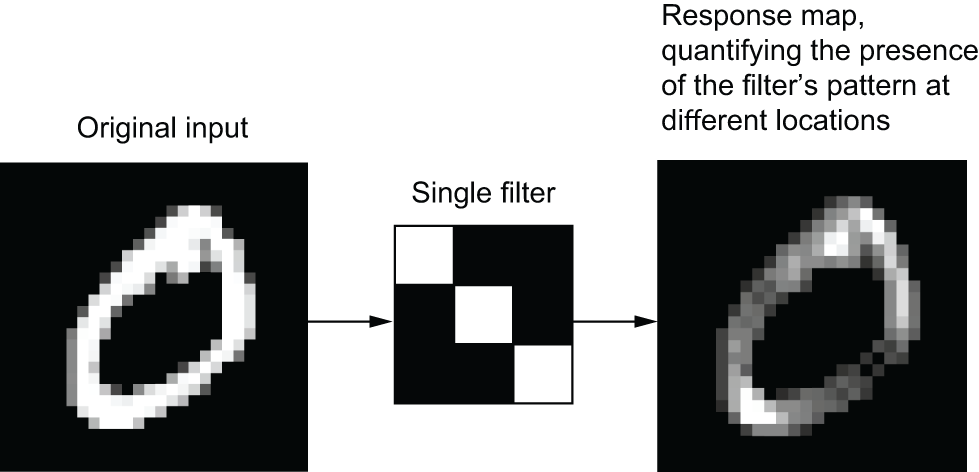


[Figure 8.3](#figure-8-3): The concept of a response map: a 2D map of the presence of a pattern at different locations in an input

Convolutions are defined by two key parameters:

* *Size of the patches extracted from the inputs*  — These are typically 3 × 3
  or 5 × 5. In the example, they were 3 × 3, which is a common choice.

* *Depth of the output feature map*  — The number of filters computed by the
  convolution. The example started with a depth of 32 and ended with a depth of
  64.

In Keras `Conv2D` layers, these parameters are the first
arguments passed to the layer:
`Conv2D(output_depth, (window_height, window_width))`.

A convolution works by *sliding* these windows of size 3 × 3 or 5 × 5 over the
3D input feature map, stopping at every possible location, and extracting the
3D patch of surrounding features of shape `(window_height, window_width, input_depth)`.
Each such 3D patch is then transformed into a 1D vector of shape `(output_depth,)`,
which is done via a tensor product
with a learned weight matrix, called the *convolution kernel* —
the same kernel is reused across every patch.
All of these vectors (one per patch) are then spatially
reassembled into a 3D output map of shape `(height, width, output_depth)`.
Every spatial location in the output feature map corresponds to the same
location in the input feature map (for example, the lower-right corner of the
output contains information about the lower-right corner of the input). For
instance, with 3 × 3 windows, the vector `output[i, j, :]` comes from the 3D
patch `input[i-1:i+1, j-1:j+1, :]`. The full process is detailed in figure 8.4.

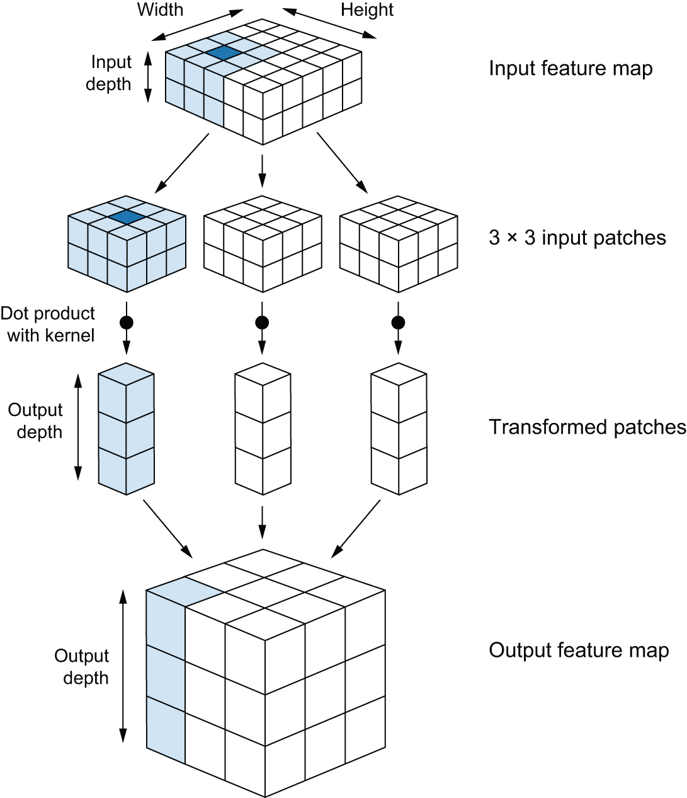


[Figure 8.4](#figure-8-4): How convolution works

Note that the output width and height may differ from the input width and
height. They may differ for two reasons:

* Border effects, which can be countered by padding the input feature map
* The use of *strides*, which we’ll define in a second

Let’s take a deeper look at these notions.

#### Understanding border effects and padding

Consider a 5 × 5 feature map (25 tiles total). There are only 9
tiles around which you can center a 3 × 3 window, forming a 3 × 3 grid (see
figure 8.5). Hence, the output feature map will be 3 × 3. It shrinks a little:
by exactly two tiles alongside each dimension, in this case. You can see this
border effect in action in the earlier example: you start with 28 × 28 inputs,
which become 26 × 26 after the first convolution layer.

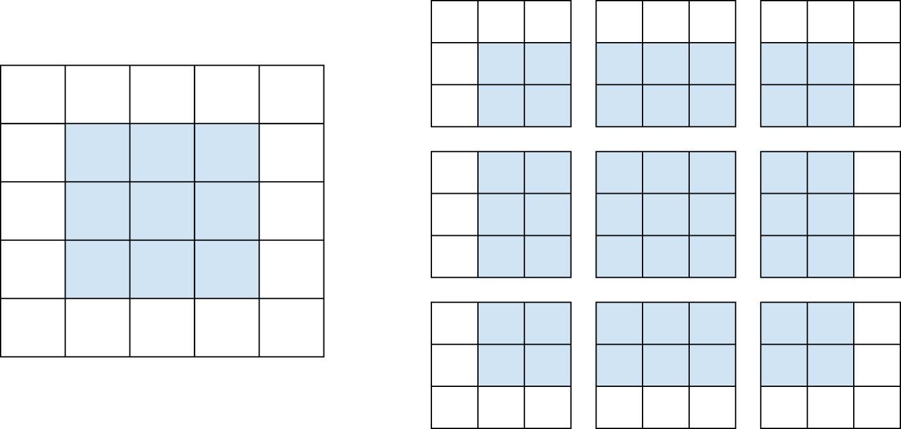


[Figure 8.5](#figure-8-5): Valid locations of 3 × 3 patches in a 5 × 5 input feature map

If you want to get an output feature map with the same spatial dimensions as
the input, you can use *padding*. Padding consists of adding an appropriate
number of rows and columns on each side of the input feature map so as to make
it possible to fit centered convolution windows around every input tile. For a 3
× 3 window, you add one column on the right, one column on the left, one row
at the top, and one row at the bottom. For a 5 × 5 window, you add two rows
(see figure 8.6).

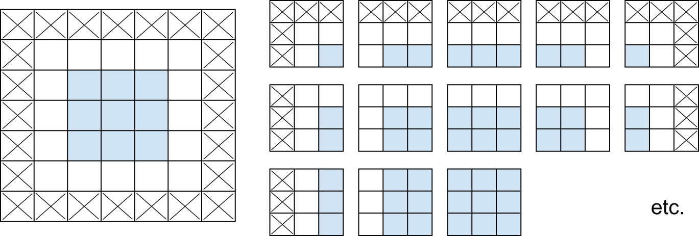


[Figure 8.6](#figure-8-6): Padding a 5 × 5 input to be able to extract 25 3 × 3 patches

In `Conv2D` layers, padding is configurable via the `padding` argument, which
takes two values: `"valid"`, which means no padding (only valid window
locations will be used); and `"same"`, which means “pad in such a way as to
have an output with the same width and height as the input.” The `padding`
argument defaults to `"valid"`.

#### Understanding convolution strides

The other factor that can influence output size is the
notion of *strides*. The description of convolution so far has assumed that
the center tiles of the convolution windows are all contiguous. But the
distance between two successive windows is a parameter of the convolution,
called its *stride*, which defaults to 1. It’s possible to
have *strided convolutions*: convolutions with a stride higher
than 1. In figure 8.7, you can see the patches extracted by a 3 × 3
convolution with stride 2 over a 5 × 5 input (without padding)

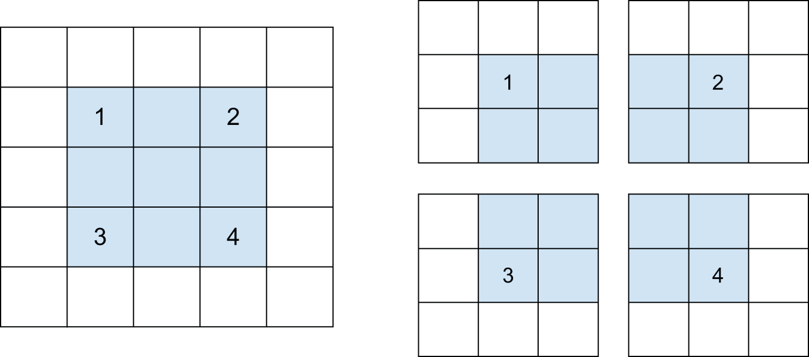


[Figure 8.7](#figure-8-7): 3 × 3 convolution patches with 2 × 2 strides

Using stride 2 means the width and height of the feature map are downsampled by
a factor of 2 (in addition to any changes induced by border effects). Strided
convolutions are rarely used in classification models, but they come in handy for
some types of models, as you will find out in the next chapter.

In classification models, instead of strides, we tend to use the
*max-pooling* operation to downsample feature maps — which you saw in action in
our first ConvNet example. Let’s look at it in more depth.

### The max-pooling operation

In the ConvNet example, you may have noticed that
the size of the feature maps is halved after every `MaxPooling2D` layer. For
instance, before the first `MaxPooling2D` layers, the
feature map is 26 × 26, but the max-pooling operation halves it to 13
× 13. That’s the role of max pooling: to aggressively downsample feature maps,
much like strided convolutions.

Max pooling consists of extracting windows from the input feature maps and
outputting the max value of each channel. It’s conceptually similar to
convolution, except that instead of transforming local patches via a learned
linear transformation (the convolution kernel), they’re transformed via a
hardcoded `max` tensor operation. A big difference from convolution is that
max pooling is usually done with 2 × 2 windows and stride 2 to
downsample the feature maps by a factor of 2. On the other hand, convolution
is typically done with 3 × 3 windows and no stride (stride 1).

Why downsample feature maps this way? Why not remove the max-pooling layers and
keep fairly large feature maps all the way up? Let’s look at this option.
Our model would then look like this.

```python
inputs = keras.Input(shape=(28, 28, 1))
x = layers.Conv2D(filters=64, kernel_size=3, activation="relu")(inputs)
x = layers.Conv2D(filters=128, kernel_size=3, activation="relu")(x)
x = layers.Conv2D(filters=256, kernel_size=3, activation="relu")(x)
x = layers.GlobalAveragePooling2D()(x)
outputs = layers.Dense(10, activation="softmax")(x)
model_no_max_pool = keras.Model(inputs=inputs, outputs=outputs)
```

[Listing 8.5](#listing-8-5): An incorrectly structured ConvNet missing its max-pooling layers

Here’s a summary of the model:

```python
>>> model_no_max_pool.summary()
Model: "functional_1"
┏━━━━━━━━━━━━━━━━━━━━━━━━━━━━━━━━━━━┳━━━━━━━━━━━━━━━━━━━━━━━━━━┳━━━━━━━━━━━━━━━┓
┃ Layer (type)                      ┃ Output Shape             ┃       Param # ┃
┡━━━━━━━━━━━━━━━━━━━━━━━━━━━━━━━━━━━╇━━━━━━━━━━━━━━━━━━━━━━━━━━╇━━━━━━━━━━━━━━━┩
│ input_layer_1 (InputLayer)        │ (None, 28, 28, 1)        │             0 │
├───────────────────────────────────┼──────────────────────────┼───────────────┤
│ conv2d_3 (Conv2D)                 │ (None, 26, 26, 64)       │           640 │
├───────────────────────────────────┼──────────────────────────┼───────────────┤
│ conv2d_4 (Conv2D)                 │ (None, 24, 24, 128)      │        73,856 │
├───────────────────────────────────┼──────────────────────────┼───────────────┤
│ conv2d_5 (Conv2D)                 │ (None, 22, 22, 256)      │       295,168 │
├───────────────────────────────────┼──────────────────────────┼───────────────┤
│ global_average_pooling2d_1        │ (None, 256)              │             0 │
│ (GlobalAveragePooling2D)          │                          │               │
├───────────────────────────────────┼──────────────────────────┼───────────────┤
│ dense_1 (Dense)                   │ (None, 10)               │         2,570 │
└───────────────────────────────────┴──────────────────────────┴───────────────┘
 Total params: 372,234 (1.42 MB)
 Trainable params: 372,234 (1.42 MB)
 Non-trainable params: 0 (0.00 B)
```

What’s wrong with this setup? Two things:

* It isn’t conducive to learning a spatial hierarchy of features. The 3 × 3
  windows in the third layer will only contain information coming from 7 × 7
  windows in the initial input. The high-level patterns learned by the ConvNet
  will still be very small with regard to the initial input, which may not be
  enough to learn to classify digits (try recognizing a digit by only looking at
  it through windows that are 7 × 7 pixels!). We need the features from the last
  convolution layer to contain information about the totality of the input.

* The final feature map has dimensions 22 × 22. That’s huge — when you take the
  average of each 22 × 22 feature map, you are going to be destroying a lot of information
  compared to when your feature maps were only 3 × 3.

In short, the reason to use downsampling is to reduce the size of the feature maps,
making the information they contain increasingly less spatially distributed and increasingly
contained in the channels, while also inducing spatial-filter hierarchies by
making successive convolution layers “look” at increasingly large windows (in
terms of the fraction of the original input image they cover).

Note that max pooling isn’t the only way you can achieve such downsampling. As
you already know, you can also use strides in the prior convolution layer. And
you can use average pooling instead of max pooling, where each local input
patch is transformed by taking the average value of each channel over the
patch, rather than the max. But max pooling tends to work better than these
alternative solutions. In a nutshell, the reason is that features tend to
encode the spatial presence of some pattern or concept over the different
tiles of the feature map (hence the term *feature map*),
and it’s more informative to look at the *maximal presence* of different
features than at their *average presence*. So the most reasonable subsampling
strategy is to first produce dense maps of features (via unstrided
convolutions) and then look at the maximal activation of the features over
small patches, rather than looking at sparser windows of the inputs (via
strided convolutions) or averaging input patches, which could cause you to
miss or dilute feature-presence information.

At this point, you should understand the basics of ConvNets — feature maps,
convolution, and max pooling — and you know how to build a small ConvNet to
solve a toy problem such as MNIST digits classification. Now let’s move on to
more useful, practical applications.

## Training a ConvNet from scratch on a small dataset

Having to train an
image-classification model using very little data is a common situation, which
you’ll likely encounter in practice if you ever do computer vision in a
professional context. A “few” samples can mean anywhere from a few hundred to
a few tens of thousands of images. As a practical example, we’ll focus on
classifying images as dogs or cats. We’ll work with a dataset containing
5,000 pictures of cats and dogs (2,500 cats, 2,500 dogs), taken from the original Kaggle dataset.
We’ll use 2,000 pictures for
training, 1,000 for validation, and 2,000 for testing.

In this section, we’ll review one basic strategy to tackle this problem:
training a new model from scratch using what little data we have. We’ll
start by naively training a small ConvNet on the 2,000 training samples,
without any regularization, to set a baseline for what can be achieved. This
will get us to a classification accuracy of about 80%. At that point, the main
issue will be overfitting. Then we’ll introduce *data augmentation*, a
powerful technique for mitigating overfitting in
computer vision. By using data augmentation, we’ll improve the model to
reach a test accuracy of about 84%.

In the next section, we’ll review two more essential techniques for applying
deep learning to small datasets: *feature extraction with a pretrained model*
and *fine-tuning a pretrained model* (which will get us to a final
accuracy of 98.5%). Together, these three strategies — training a small model from
scratch, doing feature extraction using a pretrained model, and fine-tuning a
pretrained model — will constitute your future toolbox for tackling the problem
of performing image classification with small datasets.

### The relevance of deep learning for small-data problems

What qualifies as “enough samples” to train a model is relative — relative to the
size and depth of the model you’re trying to train, for starters. It isn’t
possible to train a ConvNet to solve a complex problem with just a few tens of
samples, but a few hundred can potentially suffice if the model is small and
well regularized and the task is simple. Because ConvNets learn local,
translation-invariant features, they’re highly data efficient on perceptual
problems. Training a ConvNet from scratch on a very small image dataset will
still yield reasonable results despite a relative lack of data, without the
need for any custom feature engineering. You’ll see this in action in this
section.

What’s more, deep learning models are by nature highly repurposable: you can
take, say, an image-classification or speech-to-text model trained on a
large-scale dataset and reuse it on a significantly different problem with
only minor changes. Specifically, in the case of computer vision, many
pretrained classification models are publicly
available for download and can be used to bootstrap powerful vision models out
of very little data. This is one of the greatest strengths of deep learning:
feature reuse. You’ll explore this in the next section.

Let’s start by getting our hands on the data.

### Downloading the data

The Dogs vs. Cats
dataset that we will use isn’t packaged with Keras. It was made available by
Kaggle as part of a computer-vision competition in late 2013, back when
ConvNets weren’t mainstream. You can download the original dataset from
`www.kaggle.com/c/dogs-vs-cats/data` (you’ll need to create a Kaggle account if
you don’t already have one — don’t worry, the process is painless). You
can also use the Kaggle API to download the dataset in Colab.

Downloading a Kaggle dataset in Google Colaboratory

Kaggle makes available an easy-to-use API to programmatically download
Kaggle-hosted datasets. You can use it to download the Dogs vs. Cats dataset
to a Colab notebook, for instance. This API is available via the `kagglehub`
package, which is preinstalled on Colab.

Before we can download the dataset, we will need to do two things:

1. Go to <https://www.kaggle.com/> and sign in.
2. Go to <https://www.kaggle.com/c/dogs-vs-cats/data>, scroll down and click to Join the Competition.
3. Go to <https://www.kaggle.com/settings> and generate a Kaggle API key.

With that we are ready to download the data in our notebook. First, log in with
your Kaggle API key:

```python
import kagglehub

kagglehub.login()
```

Then, download the competition data:

```python
download_path = kagglehub.competition_download("dogs-vs-cats")
```

This downloads two new files, `train.zip` (the training data) and
`test1.zip` (the test data). We’ll only use the training data here.
Let’s unzip it:

```python
import zipfile

with zipfile.ZipFile(download_path + "/train.zip", "r") as zip_ref:
    zip_ref.extractall(".")
```

All done!

The pictures in our dataset are medium-resolution color JPEGs.
Figure 8.8 shows some examples.

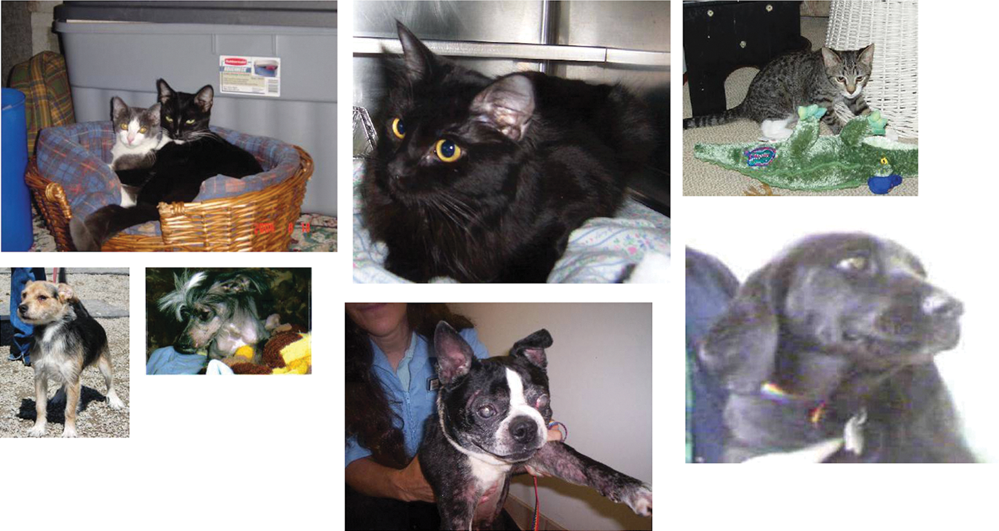


[Figure 8.8](#figure-8-8): Samples from the Dogs vs. Cats dataset. Sizes weren’t modified: the samples come in different sizes, colors, backgrounds, etc.

Unsurprisingly, the original dogs-versus-cats Kaggle competition, all the way
back in 2013, was won by entrants who used ConvNets. The best entries achieved
up to 95% accuracy. In this example, we will get fairly close to this accuracy
(in the next section), even though we will train our models on less than 10%
of the data that was available to the competitors.

This dataset contains 25,000 images of dogs and cats (12,500 from each class)
and is 543 MB (compressed). After downloading and uncompressing the data, we’ll
create a new dataset containing three subsets: a training set with 1,000
samples of each class, a validation set with 500 samples of each class, and a
test set with 1,000 samples of each class. Why do this? Because many of the
image datasets you’ll encounter in your career only contain a few thousand
samples, not tens of thousands. Having more data available would make the
problem easier — so it’s good practice to learn with a small dataset.

The subsampled dataset we will work with will have the following directory
structure:

```python
dogs_vs_cats_small/
...train/
# Contains 1,000 cat images
......cat/
# Contains 1,000 dog images
......dog/
...validation/
# Contains 500 cat images
......cat/
# Contains 500 dog images
......dog/
...test/
# Contains 1,000 cat images
......cat/
# Contains 1,000 dog images
......dog/
```

Let’s make it happen in a coupl of calls to `shutil`, a Python library for
running shell-like commands.

```python
import os, shutil, pathlib

# Path to the directory where the original dataset was uncompressed
original_dir = pathlib.Path("train")
# Directory where we will store our smaller dataset
new_base_dir = pathlib.Path("dogs_vs_cats_small")

# Utility function to copy cat (respectively, dog) images from index
# `start_index` to index `end_index` to the subdirectory
# `new_base_dir/{subset_name}/cat` (respectively, dog). "subset_name"
# will be either "train," "validation," or "test."
def make_subset(subset_name, start_index, end_index):
    for category in ("cat", "dog"):
        dir = new_base_dir / subset_name / category
        os.makedirs(dir)
        fnames = [f"{category}.{i}.jpg" for i in range(start_index, end_index)]
        for fname in fnames:
            shutil.copyfile(src=original_dir / fname, dst=dir / fname)

# Creates the training subset with the first 1,000 images of each
# category
make_subset("train", start_index=0, end_index=1000)
# Creates the validation subset with the next 500 images of each
# category
make_subset("validation", start_index=1000, end_index=1500)
# Creates the test subset with the next 1,000 images of each category
make_subset("test", start_index=1500, end_index=2500)
```

[Listing 8.6](#listing-8-6): Copying images to training, validation, and test directories

We now have 2,000 training images, 1,000 validation images, and 2,000
test images. Each split contains the same number of samples from each class:
this is a balanced binary classification problem, which means classification
accuracy will be an appropriate measure of success.

### Building your model

We will reuse the same general model structure you saw in the first example:
the ConvNet will be a stack of alternated `Conv2D` (with `relu` activation)
and `MaxPooling2D` layers.

But because we’re dealing with bigger images and a more complex problem,
we’ll make our model larger, accordingly: it will have two more `Conv2D` +
`MaxPooling2D` stages. This serves both to augment the capacity of the model
and to further reduce the size of the feature maps so they aren’t overly large
when we reach the pooling layer. Here, because we start
from inputs of size 180 × 180 pixels (a somewhat arbitrary choice),
we end up with feature maps of size 7 × 7 just before the
`GlobalAveragePooling2D` layer.

The depth of the feature maps progressively increases in the model
(from 32 to 512), whereas the size of the feature maps decreases (from 180 ×
180 to 7 × 7). This is a pattern you’ll see in almost all ConvNets.

Because we’re looking at a binary classification problem, we’ll end the
model with a single unit (a `Dense` layer of size 1) and a `sigmoid`
activation. This unit will encode the probability that the model is looking
at one class or the other.

One last small difference: we will start the model with a `Rescaling`
layer, which will rescale image inputs (whose values are originally in the
[0, 255] range) to the [0, 1] range.

```python
import keras
from keras import layers

# The model expects RGB images of size 180 x 180.
inputs = keras.Input(shape=(180, 180, 3))
# Rescales inputs to the [0, 1] range by dividing them by 255
x = layers.Rescaling(1.0 / 255)(inputs)
x = layers.Conv2D(filters=32, kernel_size=3, activation="relu")(x)
x = layers.MaxPooling2D(pool_size=2)(x)
x = layers.Conv2D(filters=64, kernel_size=3, activation="relu")(x)
x = layers.MaxPooling2D(pool_size=2)(x)
x = layers.Conv2D(filters=128, kernel_size=3, activation="relu")(x)
x = layers.MaxPooling2D(pool_size=2)(x)
x = layers.Conv2D(filters=256, kernel_size=3, activation="relu")(x)
x = layers.MaxPooling2D(pool_size=2)(x)
x = layers.Conv2D(filters=512, kernel_size=3, activation="relu")(x)
# Flattens the 3D activations with shape (height, width, 512) into 1D
# activations with shape (512,) by averaging them over spatial
# dimensions
x = layers.GlobalAveragePooling2D()(x)
outputs = layers.Dense(1, activation="sigmoid")(x)
model = keras.Model(inputs=inputs, outputs=outputs)
```

[Listing 8.7](#listing-8-7): Instantiating a small ConvNet for dogs vs. cats classification

Let’s look at how the dimensions of the feature maps change with every
successive layer:

```python
>>> model.summary()
Model: "functional_2"
┏━━━━━━━━━━━━━━━━━━━━━━━━━━━━━━━━━━━┳━━━━━━━━━━━━━━━━━━━━━━━━━━┳━━━━━━━━━━━━━━━┓
┃ Layer (type)                      ┃ Output Shape             ┃       Param # ┃
┡━━━━━━━━━━━━━━━━━━━━━━━━━━━━━━━━━━━╇━━━━━━━━━━━━━━━━━━━━━━━━━━╇━━━━━━━━━━━━━━━┩
│ input_layer_2 (InputLayer)        │ (None, 180, 180, 3)      │             0 │
├───────────────────────────────────┼──────────────────────────┼───────────────┤
│ rescaling (Rescaling)             │ (None, 180, 180, 3)      │             0 │
├───────────────────────────────────┼──────────────────────────┼───────────────┤
│ conv2d_6 (Conv2D)                 │ (None, 178, 178, 32)     │           896 │
├───────────────────────────────────┼──────────────────────────┼───────────────┤
│ max_pooling2d_2 (MaxPooling2D)    │ (None, 89, 89, 32)       │             0 │
├───────────────────────────────────┼──────────────────────────┼───────────────┤
│ conv2d_7 (Conv2D)                 │ (None, 87, 87, 64)       │        18,496 │
├───────────────────────────────────┼──────────────────────────┼───────────────┤
│ max_pooling2d_3 (MaxPooling2D)    │ (None, 43, 43, 64)       │             0 │
├───────────────────────────────────┼──────────────────────────┼───────────────┤
│ conv2d_8 (Conv2D)                 │ (None, 41, 41, 128)      │        73,856 │
├───────────────────────────────────┼──────────────────────────┼───────────────┤
│ max_pooling2d_4 (MaxPooling2D)    │ (None, 20, 20, 128)      │             0 │
├───────────────────────────────────┼──────────────────────────┼───────────────┤
│ conv2d_9 (Conv2D)                 │ (None, 18, 18, 256)      │       295,168 │
├───────────────────────────────────┼──────────────────────────┼───────────────┤
│ max_pooling2d_5 (MaxPooling2D)    │ (None, 9, 9, 256)        │             0 │
├───────────────────────────────────┼──────────────────────────┼───────────────┤
│ conv2d_10 (Conv2D)                │ (None, 7, 7, 512)        │     1,180,160 │
├───────────────────────────────────┼──────────────────────────┼───────────────┤
│ global_average_pooling2d_2        │ (None, 512)              │             0 │
│ (GlobalAveragePooling2D)          │                          │               │
├───────────────────────────────────┼──────────────────────────┼───────────────┤
│ dense_2 (Dense)                   │ (None, 1)                │           513 │
└───────────────────────────────────┴──────────────────────────┴───────────────┘
 Total params: 1,569,089 (5.99 MB)
 Trainable params: 1,569,089 (5.99 MB)
 Non-trainable params: 0 (0.00 B)
```

For the compilation step, you’ll go with the `adam` optimizer, as usual.
Because you ended the model with a single sigmoid unit, you’ll use binary
crossentropy as the loss (as a reminder, check out table 6.1 in chapter 6
for a cheat sheet on what loss function to use in various situations).

```python
model.compile(
    loss="binary_crossentropy",
    optimizer="adam",
    metrics=["accuracy"],
)
```

[Listing 8.8](#listing-8-8): Configuring the model for training

### Data preprocessing

As you know by now, data should be formatted
into appropriately preprocessed floating-point
tensors before being fed into the model. Currently, the data sits on a drive
as JPEG files, so the steps for getting it into the model are roughly as
follows:

1. Read the picture files.
2. Decode the JPEG content to RGB grids of pixels.
3. Convert these into floating-point tensors.
4. Resize them to a shared size (we’ll use 180 x 180).
5. Pack them into batches (we’ll use batches of 32 images).

This may seem a bit daunting, but fortunately Keras has utilities to take care of
these steps automatically.
In particular, Keras features the utility function
`image_dataset_from_directory`, which lets you quickly set up a data pipeline
that can automatically turn image files on disk into batches of preprocessed tensors.
This is what you’ll use here.

Calling `image_dataset_from_directory(directory)` will first
list the subdirectories of `directory` and assume each one contains images
from one of your classes. It will then index the image files in each subdirectory.
Finally, it will create and return a `tf.data.Dataset` object
configured to read these files, shuffle them, decode them to tensors,
resize them to a shared size, and pack them into batches.

```python
from keras.utils import image_dataset_from_directory

batch_size = 64
image_size = (180, 180)
train_dataset = image_dataset_from_directory(
    new_base_dir / "train", image_size=image_size, batch_size=batch_size
)
validation_dataset = image_dataset_from_directory(
    new_base_dir / "validation", image_size=image_size, batch_size=batch_size
)
test_dataset = image_dataset_from_directory(
    new_base_dir / "test", image_size=image_size, batch_size=batch_size
)
```

[Listing 8.9](#listing-8-9): Using `image_dataset_from_directory` to read images from directories

#### Understanding TensorFlow Dataset objects

TensorFlow makes available the `tf.data` API to create efficient input pipelines
for machine learning models. Its core class is `tf.data.Dataset`.

The `Dataset` class can be used for data loading and preprocessing in any framework
— not just TensorFlow. You can use it together with JAX or PyTorch.
When you use it with a Keras model, it works the same, independently of the backend
you’re currently using.

A `Dataset` object is an iterator: you can use it in a `for` loop. It will
typically return batches of input data and labels. You can pass a `Dataset`
object directly to the `fit()` method of a Keras model.

The `Dataset` class handles many key features that would otherwise be cumbersome
to implement yourself, in particular parallelization of the preprocessing logic
across multiple CPU cores, as well as asynchronous data prefetching
(preprocessing the next batch of data while the previous one is being handled
by the model, which keeps execution flowing without interruptions).

The `Dataset` class also exposes a functional-style API for modifying datasets.
Here’s a quick example: let’s create a `Dataset` instance from a NumPy array
of random numbers. We’ll consider 1,000 samples, where each sample is a vector
of size 16.

```python
import numpy as np
import tensorflow as tf

random_numbers = np.random.normal(size=(1000, 16))
# The from_tensor_slices() class method can be used to create a Dataset
# from a NumPy array or a tuple or dict of NumPy arrays.
dataset = tf.data.Dataset.from_tensor_slices(random_numbers)
```

[Listing 8.10](#listing-8-10): Instantiating a `Dataset` from a NumPy array

At first, our dataset just yields single samples.

```python
>>> for i, element in enumerate(dataset):
>>>     print(element.shape)
>>>     if i >= 2:
>>>         break
(16,)
(16,)
(16,)
```

[Listing 8.11](#listing-8-11): Iterating on a dataset

You can use the `.batch()` method to batch the data.

```python
>>> batched_dataset = dataset.batch(32)
>>> for i, element in enumerate(batched_dataset):
>>>     print(element.shape)
>>>     if i >= 2:
>>>         break
(32, 16)
(32, 16)
(32, 16)
```

[Listing 8.12](#listing-8-12): Batching a dataset

More broadly, you have access to a range of useful dataset methods, such as these:

* `.shuffle(buffer_size)` will shuffle elements within a buffer.
* `.prefetch(buffer_size)` will prefetch a buffer of elements in GPU memory
  to achieve better device utilization.
* `.map(callable)` will apply an arbitrary transformation to each element of the dataset
  (the function `callable`, expected to take as input a single element yielded by the dataset).

The method `.map(function, num_parallel_calls)` in particular is one that you will use often. Here’s an
example: let’s use it to reshape the elements in our toy dataset from shape `(16,)`
to shape `(4, 4)`.

```python
>>> reshaped_dataset = dataset.map(
...     lambda x: tf.reshape(x, (4, 4)),
...     num_parallel_calls=8)
>>> for i, element in enumerate(reshaped_dataset):
...     print(element.shape)
...     if i >= 2:
...         break
(4, 4)
(4, 4)
(4, 4)
```

[Listing 8.13](#listing-8-13): Applying a transformation to `Dataset` elements using `map()`

You’re about to see more `map()` action over the next chapters.

#### Fitting the model

Let’s look at the output of one of these `Dataset` objects: it yields batches of
180 × 180 RGB images (shape `(32, 180, 180, 3)`) and integer labels
(shape `(32,)`). There are 32 samples in each batch (the batch size).

```python
>>> for data_batch, labels_batch in train_dataset:
>>>     print("data batch shape:", data_batch.shape)
>>>     print("labels batch shape:", labels_batch.shape)
>>>     break
data batch shape: (32, 180, 180, 3)
labels batch shape: (32,)
```

[Listing 8.14](#listing-8-14): Displaying the shapes yielded by the `Dataset`

Let’s fit the model on our dataset. We use the `validation_data` argument
in `fit()` to monitor validation metrics on a separate `Dataset` object.

Note that we also use a `ModelCheckpoint` callback to save the model
after each epoch. We configure it with the path where to save the file, as
well as the arguments `save_best_only=True` and `monitor="val_loss"`: they
tell the callback to only save a new file (overwriting any previous one)
when the current value of the `val_loss` metric is lower than at any previous
time during training. This guarantees that your saved file will always
contain the state of the model corresponding to its best-performing training
epoch, in terms of its performance on the validation data.
As a result, we won’t have to retrain a new model for a lower number of epochs
if we start overfitting: we can just reload our saved file.

```python
callbacks = [
    keras.callbacks.ModelCheckpoint(
        filepath="convnet_from_scratch.keras",
        save_best_only=True,
        monitor="val_loss",
    )
]
history = model.fit(
    train_dataset,
    epochs=50,
    validation_data=validation_dataset,
    callbacks=callbacks,
)
```

[Listing 8.15](#listing-8-15): Fitting the model using a `Dataset`

Let’s plot the loss and accuracy of the model over the training and validation
data during training (see figure 8.9).

```python
import matplotlib.pyplot as plt

accuracy = history.history["accuracy"]
val_accuracy = history.history["val_accuracy"]
loss = history.history["loss"]
val_loss = history.history["val_loss"]
epochs = range(1, len(accuracy) + 1)

plt.plot(epochs, accuracy, "r--", label="Training accuracy")
plt.plot(epochs, val_accuracy, "b", label="Validation accuracy")
plt.title("Training and validation accuracy")
plt.legend()
plt.figure()

plt.plot(epochs, loss, "r--", label="Training loss")
plt.plot(epochs, val_loss, "b", label="Validation loss")
plt.title("Training and validation loss")
plt.legend()
plt.show()
```

[Listing 8.16](#listing-8-16): Displaying curves of loss and accuracy during training


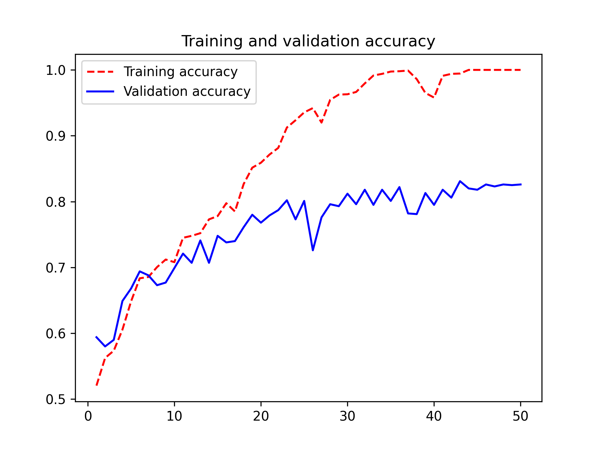
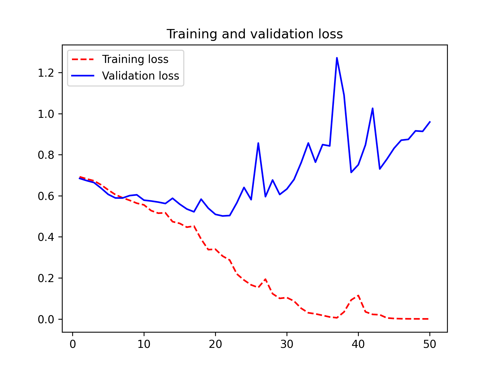


[Figure 8.9](#figure-8-9): Training and validation metrics for a simple ConvNet

These plots are characteristic of overfitting. The training accuracy increases
linearly over time, until it reaches nearly 100%, whereas the validation
accuracy peaks around 80%. The validation loss reaches its minimum after only
10 epochs and then stalls, whereas the training loss keeps decreasing
linearly as training proceeds.

Let’s check the test accuracy. We’ll reload the model from its saved file
to evaluate it as it was before it started overfitting.

```python
test_model = keras.models.load_model("convnet_from_scratch.keras")
test_loss, test_acc = test_model.evaluate(test_dataset)
print(f"Test accuracy: {test_acc:.3f}")
```

[Listing 8.17](#listing-8-17): Evaluating the model on the test set

We get a test accuracy of 78.6% (due to the randomness of neural network
initializations, you may get numbers within a few percentage points of that).

Because you have relatively few training samples (2,000), overfitting will be
your number-one concern. You already know about a number of techniques that
can help mitigate overfitting, such as dropout and weight decay (L2
regularization). We’re now going to work with a new one, specific to computer
vision and used almost universally when processing images with deep learning
models: *data augmentation*.

### Using data augmentation

Overfitting is caused by having too few samples to learn from,
rendering you unable to train a model that can generalize to new data.
Given infinite data, your model would be exposed to every possible aspect
of the data distribution at hand: you would never overfit.
Data augmentation takes the approach of generating
more training data from existing training samples, by *augmenting* the samples
via a number of random transformations that yield believable-looking images.
The goal is that at training time, your model will never see the exact same
picture twice. This helps expose the model to more aspects of the data and
generalize better.

In Keras, this can be done via *data augmentation layers*. Such layers
could be added in one of two ways:

* *At the start of the model* — *Inside* the model. In our case, the layers would
  come right before the `Rescaling` layer.
* *Inside the data pipeline* — *Outside* the model. In our case, we’d apply them to our
  `Dataset` via a `map()` call.

The main difference between these two options is that data augmentation done inside the model would be running on the GPU,
just like the rest of the model. Meanwhile, data augmentation done in the data pipeline would be running on
the CPU, typically in a parallel way on multiple CPU cores. Sometimes, there can be performance benefits to doing the former, but
the latter is usually the better option. So let’s go with that!

```python
# Defines the transformations to apply as a list
data_augmentation_layers = [
    layers.RandomFlip("horizontal"),
    layers.RandomRotation(0.1),
    layers.RandomZoom(0.2),
]

# Creates a function that applies them sequentially
def data_augmentation(images, targets):
    for layer in data_augmentation_layers:
        images = layer(images)
    return images, targets

# Maps this function into the dataset
augmented_train_dataset = train_dataset.map(
    data_augmentation, num_parallel_calls=8
)
# Enables prefetching of batches on GPU memory; important for best
# performance
augmented_train_dataset = augmented_train_dataset.prefetch(tf.data.AUTOTUNE)
```

[Listing 8.18](#listing-8-18): Defining a data augmentation stage

These are just a few of the layers available (for more, see the Keras
documentation). Let’s quickly go over this code:

* `RandomFlip("horizontal")` will apply horizontal flipping to a random 50%
  of the images that go through it.
* `RandomRotation(0.1)` will rotate the input images by a random value
  in the range [–10%, +10%] (these are fractions of a full circle — in degrees
  the range would be [–36 degrees, +36 degrees]).
* `RandomZoom(0.2)` will zoom in or out of the image by a random factor in the
  range [–20%, +20%].

Let’s look at the augmented images (see figure 8.10).

```python
plt.figure(figsize=(10, 10))
# You can use take(N) to only sample N batches from the dataset. This
# is equivalent to inserting a break in the loop after the Nth batch.
for image_batch, _ in train_dataset.take(1):
    image = image_batch[0]
    for i in range(9):
        ax = plt.subplot(3, 3, i + 1)
        augmented_image, _ = data_augmentation(image, None)
        augmented_image = keras.ops.convert_to_numpy(augmented_image)
        # Displays the first image in the output batch. For each of the
        # nine iterations, this is a different augmentation of the same
        # image.
        plt.imshow(augmented_image.astype("uint8"))
        plt.axis("off")
```

[Listing 8.19](#listing-8-19): Displaying some randomly augmented training images


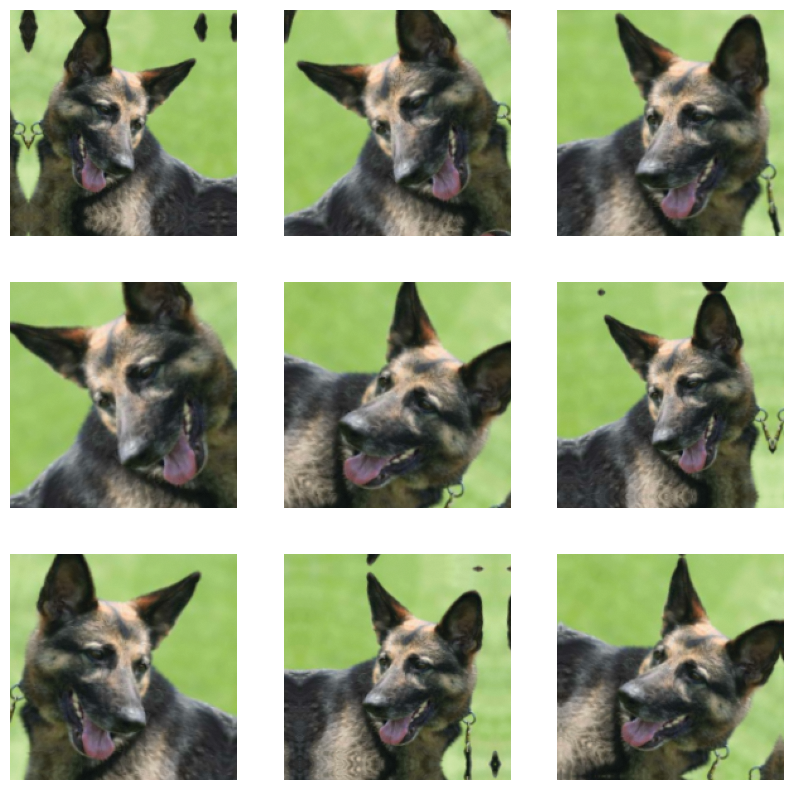


[Figure 8.10](#figure-8-10): Generating variations of a very good boy via random data augmentation

If you train a new model using this data augmentation configuration, the
model will never see the same input twice. But the inputs it sees are still
heavily intercorrelated, because they come from a small number of original
images — you can’t produce new information; you can only remix existing
information. As such, this may not be enough to completely get rid of
overfitting. To further fight overfitting, you’ll also add a `Dropout` layer
to your model, right before the densely connected
classifier.

```python
inputs = keras.Input(shape=(180, 180, 3))
x = layers.Rescaling(1.0 / 255)(inputs)
x = layers.Conv2D(filters=32, kernel_size=3, activation="relu")(x)
x = layers.MaxPooling2D(pool_size=2)(x)
x = layers.Conv2D(filters=64, kernel_size=3, activation="relu")(x)
x = layers.MaxPooling2D(pool_size=2)(x)
x = layers.Conv2D(filters=128, kernel_size=3, activation="relu")(x)
x = layers.MaxPooling2D(pool_size=2)(x)
x = layers.Conv2D(filters=256, kernel_size=3, activation="relu")(x)
x = layers.MaxPooling2D(pool_size=2)(x)
x = layers.Conv2D(filters=512, kernel_size=3, activation="relu")(x)
x = layers.GlobalAveragePooling2D()(x)
x = layers.Dropout(0.25)(x)
outputs = layers.Dense(1, activation="sigmoid")(x)
model = keras.Model(inputs=inputs, outputs=outputs)

model.compile(
    loss="binary_crossentropy",
    optimizer="adam",
    metrics=["accuracy"],
)
```

[Listing 8.20](#listing-8-20): Defining a new ConvNet that includes dropout

Let’s train the model using data augmentation and dropout. Because we expect
overfitting to occur much later during training, we will train for twice as
many epochs — 100. Note that we evaluate on images that aren’t augmented
— data augmentation is usually only performed at training time, as it is a regularization technique.

```python
callbacks = [
    keras.callbacks.ModelCheckpoint(
        filepath="convnet_from_scratch_with_augmentation.keras",
        save_best_only=True,
        monitor="val_loss",
    )
]
history = model.fit(
    augmented_train_dataset,
    # Since we expect the model to overfit slower, we train for more
    # epochs.
    epochs=100,
    validation_data=validation_dataset,
    callbacks=callbacks,
)
```

[Listing 8.21](#listing-8-21): Training the regularized ConvNet on augmented images

Let’s plot the results again; see figure 8.11. Thanks to data
augmentation and dropout, we start overfitting much later, around epochs 60–70
(compared to epoch 10 for the original model). The validation accuracy ends up
peaking above 85% — a big improvement over our first try.

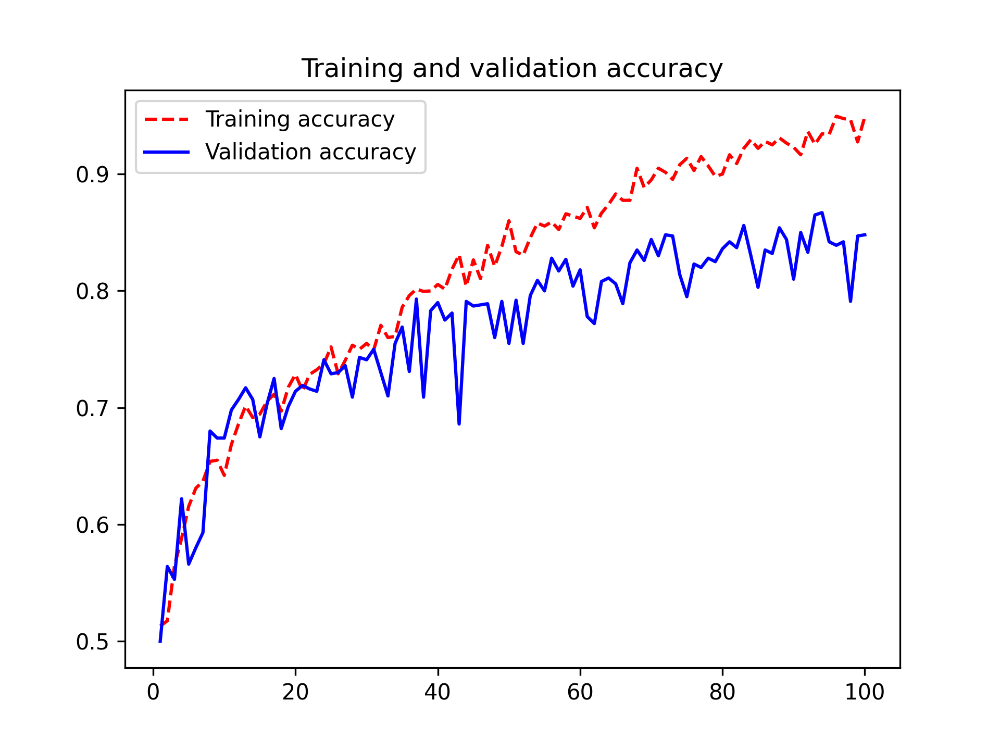
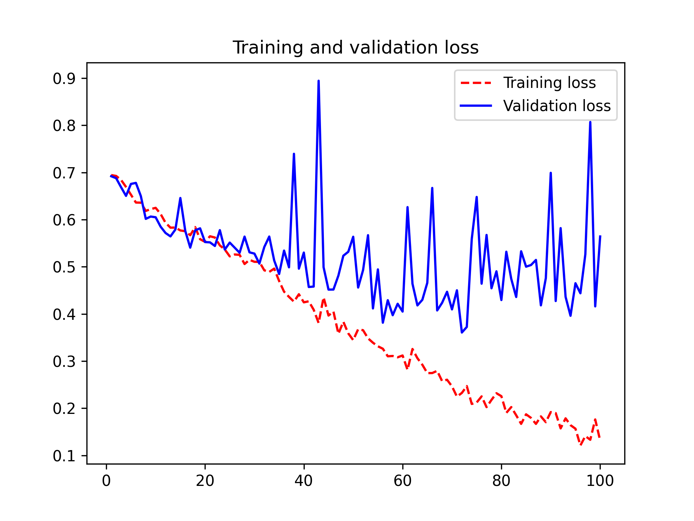


[Figure 8.11](#figure-8-11): Training and validation metrics with data augmentation

Let’s check the test accuracy.

```python
test_model = keras.models.load_model(
    "convnet_from_scratch_with_augmentation.keras"
)
test_loss, test_acc = test_model.evaluate(test_dataset)
print(f"Test accuracy: {test_acc:.3f}")
```

[Listing 8.22](#listing-8-22): Evaluating the model on the test set

We get a test accuracy of 83.9%. It’s starting to look good! If you’re using
Colab, make sure to download the saved file (`convnet_from_scratch_with_augmentation.keras`),
as we will use it for some experiments in the next chapter.

By further tuning the model’s
configuration (such as the number of filters per convolution layer or the number
of layers in the model), you may be able to get an even better accuracy,
likely up to 90%. But it would prove difficult to go any higher just by
training your own ConvNet from scratch because you have so little data to
work with. As a next step to improve your accuracy on this problem, you’ll
have to use a pretrained model, which is the focus of the next two sections.

## Using a pretrained model

A common and highly effective approach to deep
learning on small image datasets is to use a
pretrained model. A *pretrained model* is a model that
was previously trained on a large dataset, typically on a large-scale
image-classification task. If this original dataset is large enough and
general enough, then the spatial hierarchy of features learned by the
pretrained model can effectively act as a generic model of the visual world,
and hence its features can prove useful for many different computer vision
problems, even though these new problems may involve completely different
classes than those of the original task. For instance, you might train a
model on ImageNet (where classes are mostly animals and everyday objects)
and then repurpose this trained model for something as remote as identifying
furniture items in images. Such portability of learned features across
different problems is a key advantage of deep learning compared to many older,
shallow learning approaches, and it makes deep learning very effective for
small-data problems.

In this case, let’s consider a large ConvNet trained on the ImageNet dataset
(1.4 million labeled images and 1,000 different classes). ImageNet contains
many animal classes, including different species of cats and dogs, and you can
thus expect it to perform well on the dogs-versus-cats classification problem.

We’ll use the Xception architecture. This may be your first encounter with one of
these cutesy model names — Xception, ResNet, EfficientNet,
and so on; you’ll get used to them if you keep doing deep learning for computer vision because they will come up frequently. You’ll learn about the architectural
details of Xception in the next chapter.

There are two ways to use a pretrained model: *feature extraction* and
*fine-tuning*. We’ll cover both of them. Let’s start with feature extraction.

### Feature extraction with a pretrained model

Feature extraction consists of using the representations learned by
a previously trained model to extract interesting features from new samples.
These features are then run through a new classifier, which is trained from scratch.

As you saw previously, ConvNets used for image classification comprise two
parts: they start with a series of pooling and convolution layers, and they
end with a densely connected classifier. The first part is
called the *convolutional base* or *backbone* of the model. In the
case of ConvNets, feature extraction consists of taking the convolutional base
of a previously trained network, running the new data through it, and
training a new classifier on top of the output (see figure 8.12).

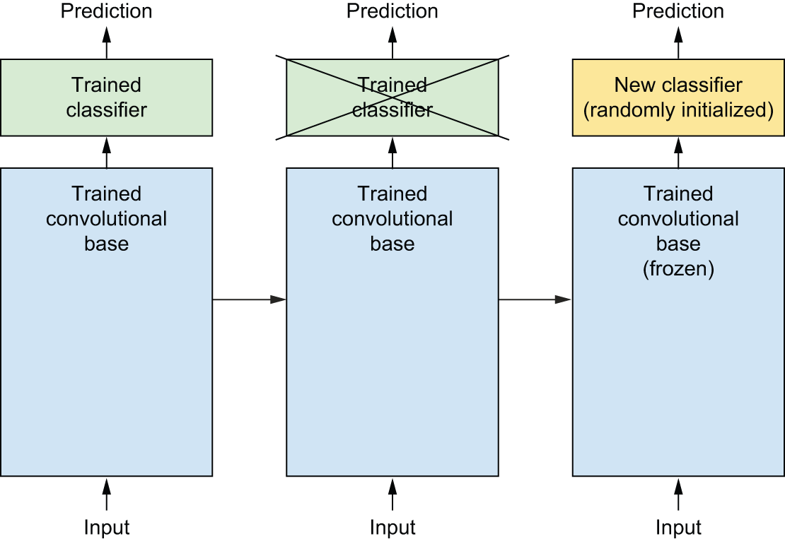


[Figure 8.12](#figure-8-12): Swapping classifiers while keeping the same convolutional base

Why only reuse the convolutional base? Could you reuse
the densely connected classifier as well? In general, doing so should be
avoided. The reason is that the representations learned by the convolutional
base are likely to be more generic and therefore more reusable: the feature
maps of a ConvNet are presence maps of generic concepts over a picture, which
is likely to be useful regardless of the computer vision problem at hand. But
the representations learned by the classifier will necessarily be specific to
the set of classes on which the model was trained — they will only contain
information about the presence probability of this or that class in the entire
picture. Additionally, representations found in densely connected layers no
longer contain any information about where objects are located in the input
image: these layers get rid of the notion of space, whereas the object
location is still described by convolutional feature maps. For problems where
object location matters, densely connected features are largely useless.

Note that the level of generality (and therefore reusability) of the
representations extracted by specific convolution layers depends on the depth
of the layer in the model. Layers that come earlier in the model extract
local, highly generic feature maps (such as visual edges, colors, and
textures), whereas layers that are higher up extract more abstract concepts
(such as “cat ear” or “dog eye”). So if your new dataset differs a lot from
the dataset on which the original model was trained, you may be better off
using only the first few layers of the model to do feature extraction, rather
than using the entire convolutional base.

In this case, because the ImageNet class set contains multiple dog and cat
classes, it’s likely to be beneficial to reuse the information contained in
the densely connected layers of the original model. But we’ll choose not to,
so we can cover the more general case where the class set of the new problem
doesn’t overlap the class set of the original model. Let’s put this in
practice by using the convolutional base of our pretrained model
to extract interesting features from cat and dog images and then
train a dogs-versus-cats classifier on top of these features.

We will use the *KerasHub* library to create all pretrained models used in
this book. KerasHub contains Keras implementations of popular pretrained model
architectures paired with pretrained weights that can be downloaded to your
machine. It contains a number of ConvNets like Xception, ResNet, EfficientNet
and MobileNet, as well as larger, generative models we will use in
the later chapters of this book. Let’s try using it to instantiate the
Xception model trained on the ImageNet dataset.

KerasHub comes as a separate package from Keras. This package is preinstalled
in Colab and Kaggle notebooks, but if you want to use it outside these
environments you can install it yourself with `pip install keras-hub`.


```python
import keras_hub

conv_base = keras_hub.models.Backbone.from_preset("xception_41_imagenet")
```

[Listing 8.23](#listing-8-23): Instantiating the Xception convolutional base

You’ll note a couple of things. First, KerasHub uses the term *backbone* to refer
to the underlying feature extractor network without the classification head
(it’s a little easier to type than “convolutional base”). It also uses a
special constructor called `from_preset()` that will download the configuration
and weights for the Xception model.

What’s that “41” in the name of the model we are using? Pretrained ConvNets are
by convention often named by how “deep” they are. In this case, the 41 means
that our Xception model has 41 trainable layers (conv and dense layers) stacked
on top of each other. It’s the “deepest” model we’ve used so far in the book
by a good margin.

There’s one more missing piece we need before we can use this model. Every
pretrained ConvNet will do some rescaling and resizing of images before
pretraining. It’s important to make sure our input images *match*; otherwise, our
model will need to relearn how to extract features from images
with a totally different input range. Rather than keep track of which pretrained
models use a `[0, 1]` input range for pixel values and which use a `[-1, 1]`
range, we can use a KerasHub layer called `ImageConverter` that will rescale our
images to match our pretrained checkpoint. It has the same special
`from_preset()` constructor as the backbone class.

```python
preprocessor = keras_hub.layers.ImageConverter.from_preset(
    "xception_41_imagenet",
    image_size=(180, 180),
)
```

[Listing 8.24](#listing-8-24): Instantiating the preprocessing paired with the Xception model

At this point, there are two ways you could proceed:

* Running the convolutional base over your dataset, recording its output to a
  NumPy array on disk, and then using this data as input to a standalone,
  densely connected classifier similar to those you saw in chapters 4 and 5.
  This solution is fast and cheap to run, because it only requires running the
  convolutional base once for every input image, and the convolutional base is
  by far the most expensive part of the pipeline. But for the same reason, this
  technique won’t allow you to use data augmentation.

* Extending the model you have (`conv_base`) by adding `Dense` layers on top
  and running the whole thing end to end on the input data. This will allow you
  to use data augmentation because every input image goes through the
  convolutional base every time it’s seen by the model. But for the same reason,
  this technique is far more expensive than the first.

We’ll cover both techniques. Let’s walk through the code required to set up the
first one: recording the output of `conv_base` on your data and using these
outputs as inputs to a new model.

#### Fast feature extraction without data augmentation

We’ll start by extracting features as NumPy arrays, by calling
the `predict()` method of the `conv_base` model on our training, validation,
and testing datasets.
Let’s iterate over our datasets to extract
the pretrained model’s features.

```python
def get_features_and_labels(dataset):
    all_features = []
    all_labels = []
    for images, labels in dataset:
        preprocessed_images = preprocessor(images)
        features = conv_base.predict(preprocessed_images, verbose=0)
        all_features.append(features)
        all_labels.append(labels)
    return np.concatenate(all_features), np.concatenate(all_labels)

train_features, train_labels = get_features_and_labels(train_dataset)
val_features, val_labels = get_features_and_labels(validation_dataset)
test_features, test_labels = get_features_and_labels(test_dataset)
```

[Listing 8.25](#listing-8-25): Extracting the image features and corresponding labels

Importantly, `predict()` only expects images, not labels, but our current
dataset yields batches that contain both images and their labels.

The extracted features are currently of shape `(samples, 6, 6, 2048)`:

```python
>>> train_features.shape
(2000, 6, 6, 2048)
```

At this point, you can define your densely connected classifier (note the use
of dropout for regularization) and train it on the data and labels that you
just recorded.

```python
inputs = keras.Input(shape=(6, 6, 2048))
# Averages spatial dimensions to flatten the feature map
x = layers.GlobalAveragePooling2D()(inputs)
x = layers.Dense(256, activation="relu")(x)
x = layers.Dropout(0.25)(x)
outputs = layers.Dense(1, activation="sigmoid")(x)
model = keras.Model(inputs, outputs)
model.compile(
    loss="binary_crossentropy",
    optimizer="adam",
    metrics=["accuracy"],
)

callbacks = [
    keras.callbacks.ModelCheckpoint(
        filepath="feature_extraction.keras",
        save_best_only=True,
        monitor="val_loss",
    )
]
history = model.fit(
    train_features,
    train_labels,
    epochs=10,
    validation_data=(val_features, val_labels),
    callbacks=callbacks,
)
```

[Listing 8.26](#listing-8-26): Defining and training the densely connected classifier

Training is very fast because you only have to deal with two `Dense` layers
— an epoch takes less than 1 second even on CPU.

Let’s look at the loss and accuracy curves during training (see figure 8.13).

```python
import matplotlib.pyplot as plt

acc = history.history["accuracy"]
val_acc = history.history["val_accuracy"]
loss = history.history["loss"]
val_loss = history.history["val_loss"]
epochs = range(1, len(acc) + 1)
plt.plot(epochs, acc, "r--", label="Training accuracy")
plt.plot(epochs, val_acc, "b", label="Validation accuracy")
plt.title("Training and validation accuracy")
plt.legend()
plt.figure()
plt.plot(epochs, loss, "r--", label="Training loss")
plt.plot(epochs, val_loss, "b", label="Validation loss")
plt.title("Training and validation loss")
plt.legend()
plt.show()
```

[Listing 8.27](#listing-8-27): Plotting the results


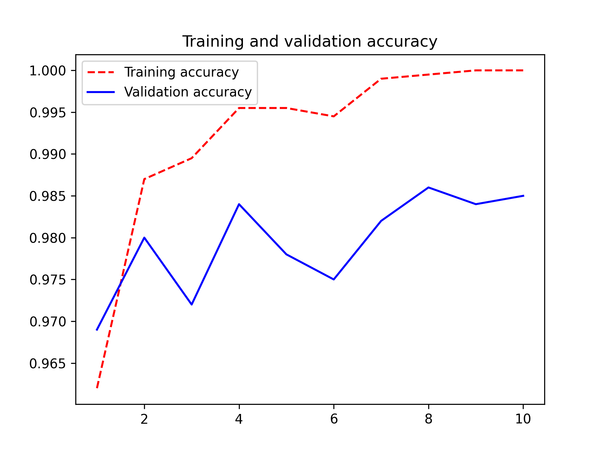
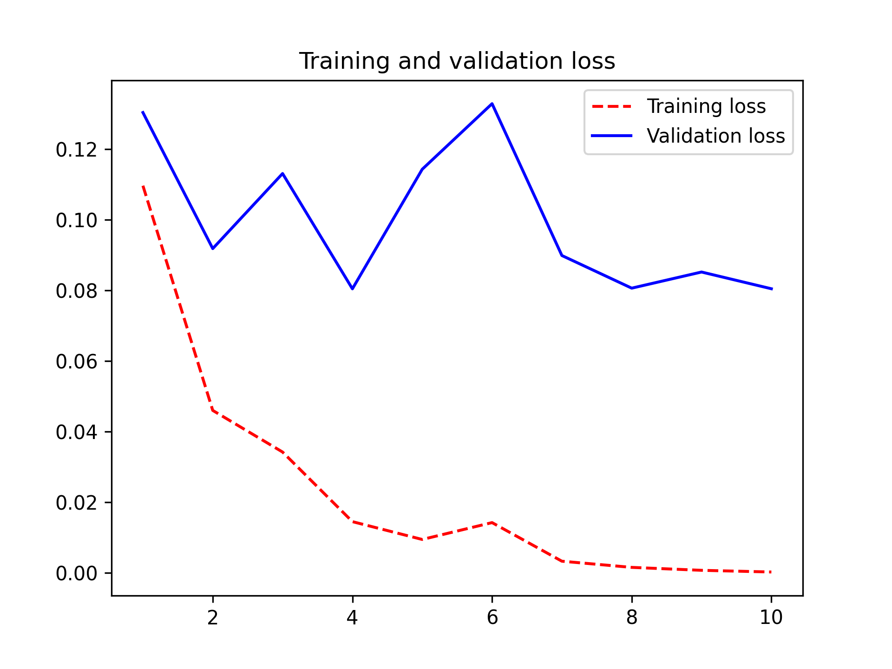


[Figure 8.13](#figure-8-13): Training and validation metrics for plain feature extraction

You reach a validation accuracy of slightly over 98% — much better than you achieved in
the previous section with the small model trained from scratch. This is a bit
of an unfair comparison, however, because ImageNet contains many dog and cat
instances, which means that our pretrained model already has the exact
knowledge required for the task at hand. This won’t always be the case when you
use pretrained features.

However, the plots also indicate that you’re overfitting almost from the start
— despite using dropout with a fairly large rate.
That’s because this technique doesn’t use data augmentation, which is essential
for preventing overfitting with small image datasets.

Let’s check the test accuracy:

```python
test_model = keras.models.load_model("feature_extraction.keras")
test_loss, test_acc = test_model.evaluate(test_features, test_labels)
print(f"Test accuracy: {test_acc:.3f}")
```

We get test accuracy of 98.1% — a very nice improvement over training a model from scratch!

#### Feature extraction together with data augmentation

Now, let’s review the second technique we mentioned for doing feature extraction,
which is much slower and more expensive but allows you to use data augmentation
during training: creating a model that chains the `conv_base` with a new dense
classifier and training it end to end on the inputs.

To do this, we will first freeze the convolutional base.
*Freezing* a layer or set of layers means preventing their weights from being
updated during training. Here, if you don’t do this, then the representations that
were previously learned by the convolutional base will be modified during training.
Because the `Dense` layers on top are randomly initialized, very large weight
updates would be propagated through the network, effectively destroying the
representations previously learned.

In Keras, you freeze a layer or model by setting its `trainable` attribute to `False`.

```python
import keras_hub

conv_base = keras_hub.models.Backbone.from_preset(
    "xception_41_imagenet",
    trainable=False,
)
```

[Listing 8.28](#listing-8-28): Creating the frozen convolutional base

Setting `trainable` to `False` empties the list of trainable weights of the layer
or model.

```python
>>> conv_base.trainable = True
>>> # The number of trainable weights before freezing the conv base
>>> len(conv_base.trainable_weights)
154
>>> conv_base.trainable = False
>>> # The number of trainable weights after freezing the conv base
>>> len(conv_base.trainable_weights)
0
```

[Listing 8.29](#listing-8-29): Printing the list of trainable weights before and after freezing

Now, we can just create a new model that chains together our frozen convolutional base
and a dense classifier, like this:

```python
inputs = keras.Input(shape=(180, 180, 3))
x = preprocessor(inputs)
x = conv_base(x)
x = layers.GlobalAveragePooling2D()(x)
x = layers.Dense(256)(x)
x = layers.Dropout(0.25)(x)
outputs = layers.Dense(1, activation="sigmoid")(x)
model = keras.Model(inputs, outputs)
model.compile(
    loss="binary_crossentropy",
    optimizer="adam",
    metrics=["accuracy"],
)
```

With this setup, only the weights from the two `Dense` layers that you added
will be trained. That’s a total of four weight tensors: two per layer (the
main weight matrix and the bias vector). Note that for these changes
to take effect, you must first compile the model. If you ever modify weight
trainability after compilation, you should then recompile the model, or these
changes will be ignored.

Let’s train our model. We’ll reuse our augmented dataset `augmented_train_dataset`.
Thanks to data augmentation, it will
take much longer for the model to start overfitting, so we can train for more
epochs — let’s do 30:

```python
callbacks = [
    keras.callbacks.ModelCheckpoint(
        filepath="feature_extraction_with_data_augmentation.keras",
        save_best_only=True,
        monitor="val_loss",
    )
]
history = model.fit(
    augmented_train_dataset,
    epochs=30,
    validation_data=validation_dataset,
    callbacks=callbacks,
)
```


This technique is expensive enough that you should only attempt it if you
have access to a GPU (such as the free GPU available in Colab) —
it’s intractable on CPU. If you can’t run your
code on GPU, then the previous technique is the way to go.

Let’s plot the results again (see figure 8.14). This model reaches a validation
accuracy of 98.2%.

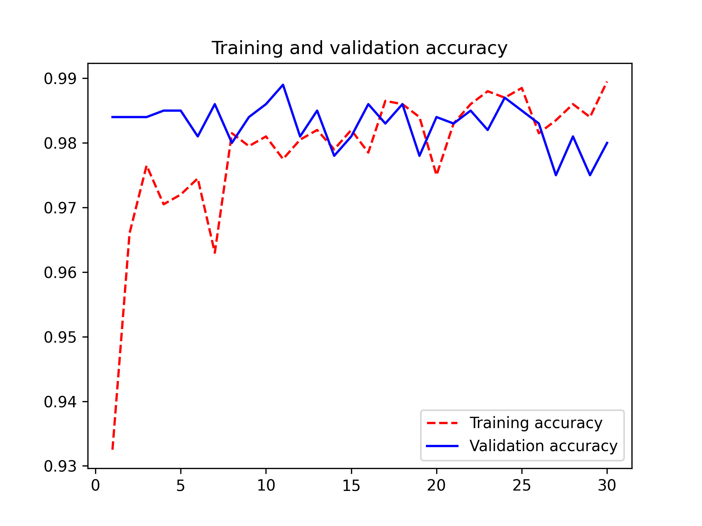
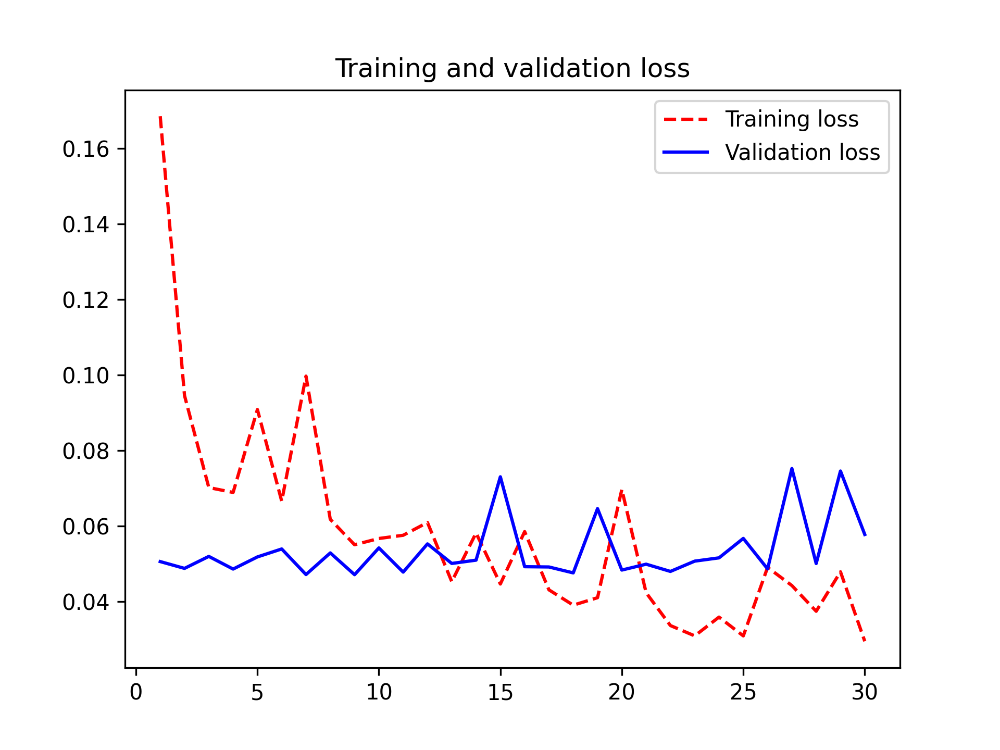


[Figure 8.14](#figure-8-14): Training and validation metrics for feature extraction with data augmentation

Let’s check the test accuracy.

```python
test_model = keras.models.load_model(
    "feature_extraction_with_data_augmentation.keras"
)
test_loss, test_acc = test_model.evaluate(test_dataset)
print(f"Test accuracy: {test_acc:.3f}")
```

[Listing 8.30](#listing-8-30): Evaluating the model on the test set

We get a test accuracy of 98.4%. This is not an improvement over the previous model,
which is a bit disappointing. This could be a sign that our data augmentation configuration
does not exactly match the distribution of the test data.
Let’s see if we can do better with our latest attempt.

### Fine-tuning a pretrained model

Another widely used technique for model
reuse, complementary to feature extraction, is *fine-tuning* (see figure
8.15). Fine-tuning consists of unfreezing the frozen
model base used for feature extraction and jointly training both the newly
added part of the model (in this case, the fully connected classifier) and
the base model. This is called *fine-tuning* because it slightly adjusts the
more abstract representations of the model being reused to make them
more relevant for the problem at hand.

We stated earlier that it’s necessary to freeze the pretrained convolution base first
to be able to train a randomly initialized classifier on top. For the
same reason, it’s only possible to fine-tune the
convolutional base once the classifier on top has already been trained. If the
classifier isn’t already trained, then the error signal propagating through
the network during training will be too large, and the representations
previously learned by the layers being fine-tuned will be destroyed. Thus, the
steps for fine-tuning a network are as follows:

1. Add your custom network on top of an already trained base network.
2. Freeze the base network.
3. Train the part you added.
4. Unfreeze the base network.
5. Jointly train both these layers and the part you added.

Note that you should not unfreeze “batch normalization” layers (`BatchNormalization`).
Batch normalization and its effect on fine-tuning is explained in the next chapter.

You already completed the first three steps when doing feature extraction.
Let’s proceed with step 4: you’ll unfreeze your `conv_base`.

Partial fine-tuning

In this case, we chose to unfreeze and fine-tune all of the Xception
convolutional base. However, when dealing with large pretrained models, you may sometimes
only unfreeze some of the top layers of the convolutional base, and leave the lower layers
frozen. You’re probably wondering, why only fine-tune some of the layers? Why the top ones specifically?
Here’s why:

* Earlier layers in the convolutional base encode more-generic, reusable
  features, whereas layers higher up encode more-specialized features. It’s more
  useful to fine-tune the more specialized features because these are the ones
  that need to be repurposed on your new problem. There would be fast-decreasing
  returns in fine-tuning lower layers.

* The more parameters you’re training, the more you’re at risk of overfitting.
  The convolutional base has 15 million parameters, so it would be risky to
  attempt to train it on your small dataset.

Thus, it can be a good strategy to fine-tune only the top three or
four layers in the convolutional base. You’d do something like this:

```python
conv_base.trainable = True
for layer in conv_base.layers[:-4]:
    layer.trainable = False
```

Let’s start fine-tuning the model using a very low learning rate. The reason for using a low
learning rate is that you want to limit the magnitude of the modifications you
make to the representations of the layers you’re fine-tuning. Updates
that are too large may harm these representations.

```python
model.compile(
    loss="binary_crossentropy",
    optimizer=keras.optimizers.Adam(learning_rate=1e-5),
    metrics=["accuracy"],
)

callbacks = [
    keras.callbacks.ModelCheckpoint(
        filepath="fine_tuning.keras",
        save_best_only=True,
        monitor="val_loss",
    )
]
history = model.fit(
    augmented_train_dataset,
    epochs=30,
    validation_data=validation_dataset,
    callbacks=callbacks,
)
```

[Listing 8.31](#listing-8-31): Fine-tuning the model

You can now finally evaluate this model on the test data (see figure 8.15):

```python
model = keras.models.load_model("fine_tuning.keras")
test_loss, test_acc = model.evaluate(test_dataset)
print(f"Test accuracy: {test_acc:.3f}")
```


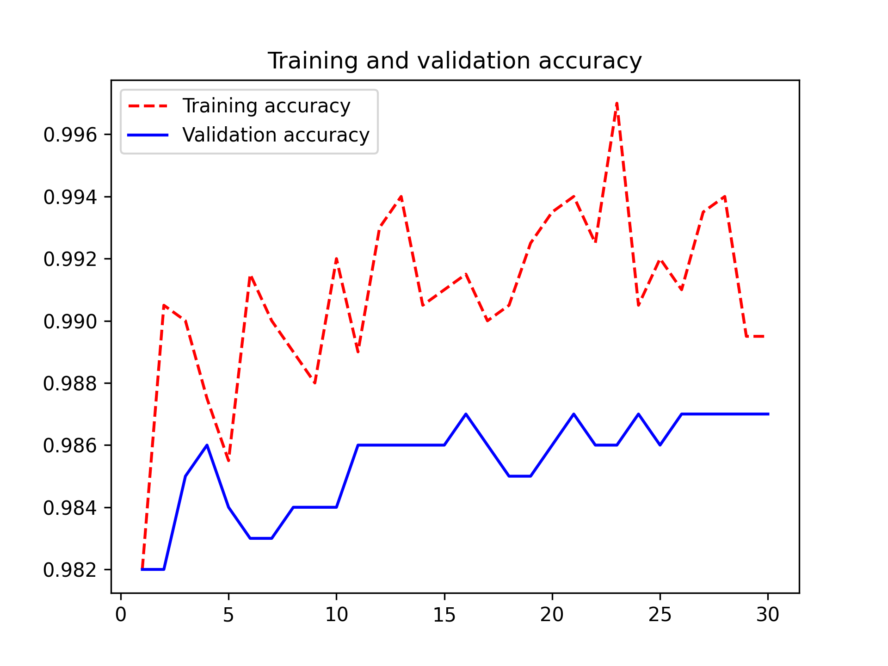
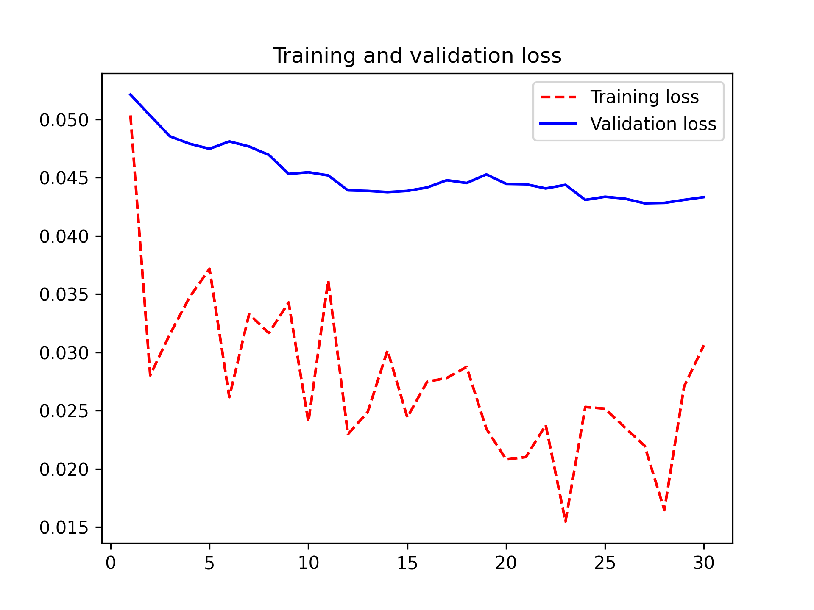


[Figure 8.15](#figure-8-15): Training and validation metrics for fine-tuning

Here, you get a test accuracy of 98.6% (again, your own results may be within half a percentage point).
In the original Kaggle competition around this dataset,
this would have been one of the top results. It’s not quite a fair
comparison, however, since you used pretrained features that already contained
prior knowledge about cats and dogs, which competitors couldn’t use at the time.

On the positive side, by using modern
deep learning techniques, you managed to reach this result using only a small
fraction of the training data that was available for the competition (about 10%).
There is a huge difference between being able to train on 20,000 samples
compared to 2,000 samples!

Now you have a solid set of tools for dealing with image-classification
problems — in particular, with small datasets.

## Summary

* ConvNets excel at computer vision tasks. It’s possible to train one from scratch, even on a very small dataset,
  with decent results.
* ConvNets work by learning a hierarchy of modular patterns and concepts to
  represent the visual world.
* On a small dataset, overfitting will be the main issue. Data augmentation is
  a powerful way to fight overfitting when you’re working with image data.
* It’s easy to reuse an existing ConvNet on a new dataset via feature
  extraction. This is a valuable technique for working with small image datasets.
* As a complement to feature extraction, you can use fine-tuning, which adapts
  to a new problem some of the representations previously learned by an existing
  model. This pushes performance a bit further.

#### **Tiếng Việt (Vietnamese)**

# Chương 8: Phân loại hình ảnh

Chương này bao gồm

* Hiểu mạng lưới thần kinh tích chập (ConvNets)
* Sử dụng tính năng tăng cường dữ liệu để giảm thiểu việc trang bị quá mức
* Sử dụng ConvNet đã được huấn luyện trước để trích xuất tính năng
* Tinh chỉnh ConvNet đã được huấn luyện trước

Thị giác máy tính là câu chuyện thành công lớn đầu tiên của học sâu. Nó dẫn đến sự phát triển ban đầu của deep learning từ năm 2011 đến năm 2015. Một loại deep learning được gọi là *mạng lưới thần kinh tích chập* bắt đầu đạt được kết quả rất tốt trong các cuộc thi phân loại hình ảnh vào khoảng thời gian đó, đầu tiên là Dan Ciresan giành chiến thắng trong hai cuộc thi thích hợp (cuộc thi nhận dạng ký tự tiếng Trung ICDAR 2011 và cuộc thi nhận dạng biển báo giao thông IJCNN 2011 của Đức) và sau đó, đáng chú ý hơn là vào mùa thu năm 2012, nhóm của Hinton đã giành được giải ImageNet nổi tiếng thách thức nhận dạng hình ảnh quy mô lớn. Nhiều kết quả hứa hẹn hơn nhanh chóng xuất hiện trong các nhiệm vụ thị giác máy tính khác.

Điều thú vị là, những thành công ban đầu này chưa đủ để khiến deep learning trở thành xu hướng phổ biến vào thời điểm đó - phải mất vài năm. Cộng đồng nghiên cứu thị giác máy tính đã dành nhiều năm đầu tư vào các phương pháp khác ngoài mạng lưới thần kinh và họ vẫn chưa sẵn sàng từ bỏ chúng chỉ vì có một thành viên mới trong nhóm. Trong năm 2013 và 2014, deep learning vẫn vấp phải sự hoài nghi gay gắt từ nhiều nhà nghiên cứu thị giác máy tính cấp cao. Chỉ đến năm 2016 nó mới trở nên thống trị. Một tác giả nhớ lại đã khuyến khích một cựu giáo sư vào tháng 2 năm 2014 chuyển sang học sâu. “Đó là điều quan trọng tiếp theo!” anh ấy sẽ nói. “Chà, có lẽ đó chỉ là mốt nhất thời thôi,” giáo sư sẽ trả lời. Đến năm 2016, toàn bộ phòng thí nghiệm của ông đã thực hiện học sâu. Không thể ngăn cản một ý tưởng đã đến lúc.

Ngày nay, bạn liên tục tương tác với các mô hình thị giác dựa trên công nghệ học sâu — thông qua Google Photos, tìm kiếm hình ảnh của Google, camera trên điện thoại, YouTube, phần mềm OCR, v.v. Những mô hình này cũng là trọng tâm của nghiên cứu tiên tiến về lái xe tự động, robot, chẩn đoán y tế được hỗ trợ bởi AI, hệ thống thanh toán bán lẻ tự động và thậm chí cả nông nghiệp tự động.

Chương này giới thiệu các mạng thần kinh tích chập, còn được gọi là *ConvNets* hoặc *CNNs*, loại mô hình học sâu được hầu hết các ứng dụng thị giác máy tính sử dụng. Bạn sẽ học cách áp dụng ConvNet cho các vấn đề phân loại hình ảnh - đặc biệt là những vấn đề liên quan đến tập dữ liệu đào tạo nhỏ, đây là trường hợp sử dụng phổ biến nhất nếu bạn không phải là một công ty công nghệ lớn.

## Giới thiệu về ConvNet

Chúng ta sắp đi sâu vào lý thuyết về ConvNet là gì và tại sao chúng lại thành công đến vậy trong các nhiệm vụ thị giác máy tính. Nhưng trước tiên, hãy xem thực tế một ví dụ ConvNet đơn giản. Nó sử dụng ConvNet để phân loại các chữ số MNIST, một nhiệm vụ mà chúng tôi đã thực hiện trong chương 2 bằng cách sử dụng mạng được kết nối dày đặc (độ chính xác trong thử nghiệm của chúng tôi khi đó là 97,8%). Mặc dù ConvNet sẽ ở mức cơ bản nhưng độ chính xác của nó sẽ vượt trội so với mô hình kết nối dày đặc ở chương 2.

Các dòng mã sau đây cho bạn thấy một ConvNet cơ bản trông như thế nào. Đó là một chồng các lớp `Conv2D` và `MaxPooling2D`. Bạn sẽ thấy trong một phút chính xác những gì họ làm. Chúng tôi sẽ xây dựng mô hình bằng API chức năng mà chúng tôi đã giới thiệu ở chương trước.

```python
import keras
from keras import layers

inputs = keras.Input(shape=(28, 28, 1))
x = layers.Conv2D(filters=64, kernel_size=3, activation="relu")(inputs)
x = layers.MaxPooling2D(pool_size=2)(x)
x = layers.Conv2D(filters=128, kernel_size=3, activation="relu")(x)
x = layers.MaxPooling2D(pool_size=2)(x)
x = layers.Conv2D(filters=256, kernel_size=3, activation="relu")(x)
x = layers.GlobalAveragePooling2D()(x)
outputs = layers.Dense(10, activation="softmax")(x)
model = keras.Model(inputs=inputs, outputs=outputs)
```

[Liệt kê 8.1](#listing-8-1): Khởi tạo một ConvNet nhỏ

Điều quan trọng là ConvNet lấy các tensor đầu vào có hình dạng `(image_height, image_width, image_channels)` (không bao gồm thứ nguyên lô). Trong trường hợp này, chúng tôi sẽ định cấu hình ConvNet để xử lý đầu vào có kích thước `(28, 28, 1)`, là định dạng của hình ảnh MNIST.

Hãy hiển thị kiến ​​trúc của ConvNet của chúng tôi.

```python
>>> model.summary()
Model: "functional"
┏━━━━━━━━━━━━━━━━━━━━━━━━━━━━━━━━━━━┳━━━━━━━━━━━━━━━━━━━━━━━━━━┳━━━━━━━━━━━━━━━┓
┃ Layer (type)                      ┃ Output Shape             ┃       Param # ┃
┡━━━━━━━━━━━━━━━━━━━━━━━━━━━━━━━━━━━╇━━━━━━━━━━━━━━━━━━━━━━━━━━╇━━━━━━━━━━━━━━━┩
│ input_layer (InputLayer)          │ (None, 28, 28, 1)        │             0 │
├───────────────────────────────────┼──────────────────────────┼───────────────┤
│ conv2d (Conv2D)                   │ (None, 26, 26, 64)       │           640 │
├───────────────────────────────────┼──────────────────────────┼───────────────┤
│ max_pooling2d (MaxPooling2D)      │ (None, 13, 13, 64)       │             0 │
├───────────────────────────────────┼──────────────────────────┼───────────────┤
│ conv2d_1 (Conv2D)                 │ (None, 11, 11, 128)      │        73,856 │
├───────────────────────────────────┼──────────────────────────┼───────────────┤
│ max_pooling2d_1 (MaxPooling2D)    │ (None, 5, 5, 128)        │             0 │
├───────────────────────────────────┼──────────────────────────┼───────────────┤
│ conv2d_2 (Conv2D)                 │ (None, 3, 3, 256)        │       295,168 │
├───────────────────────────────────┼──────────────────────────┼───────────────┤
│ global_average_pooling2d          │ (None, 256)              │             0 │
│ (GlobalAveragePooling2D)          │                          │               │
├───────────────────────────────────┼──────────────────────────┼───────────────┤
│ dense (Dense)                     │ (None, 10)               │         2,570 │
└───────────────────────────────────┴──────────────────────────┴───────────────┘
 Total params: 372,234 (1.42 MB)
 Trainable params: 372,234 (1.42 MB)
 Non-trainable params: 0 (0.00 B)
```

[Liệt kê 8.2](#listing-8-2): Hiển thị tóm tắt của mô hình

Bạn có thể thấy rằng đầu ra của mỗi lớp `Conv2D` và `MaxPooling2D` là một tenxơ 3D có hình dạng `(chiều cao, chiều rộng, kênh)`. Kích thước chiều rộng và chiều cao có xu hướng co lại khi bạn đi sâu hơn vào mô hình. Số lượng kênh được kiểm soát bởi đối số đầu tiên được truyền cho các lớp `Conv2D` (64, 128 hoặc 256).

Định dạng dữ liệu hình ảnh trong khung học sâu

Một số thư viện deep learning chuyển vị trí của các kênh trong tensor hình ảnh lên hạng đầu tiên (đặc biệt là phần lớn hệ sinh thái PyTorch). Thay vì truyền hình ảnh có hình dạng `(chiều cao, chiều rộng, kênh)`, bạn sẽ truyền `(kênh, chiều cao, chiều rộng)`.

Đây hoàn toàn là vấn đề quy ước và trong Keras có thể cấu hình được. Bạn có thể gọi `keras.config.set_image_data_format("channels_first")` để thay đổi mặc định của Keras hoặc chuyển đối số `data_format` cho bất kỳ lớp chuyển đổi hoặc lớp tổng hợp nào. Nói chung, bạn có thể giữ nguyên mặc định trừ khi bạn có nhu cầu cụ thể về `"channels_first"`.

Sau lớp `Conv2D` cuối cùng, chúng tôi kết thúc với đầu ra có hình dạng `(3, 3, 256)` - bản đồ tính năng 3 × 3 gồm 256 kênh. Bước tiếp theo là đưa kết quả đầu ra này vào một bộ phân loại được kết nối chặt chẽ giống như những bộ phân loại mà bạn đã quen thuộc: một chồng các lớp `Dense`. Các bộ phân loại này xử lý các vectơ 1D, trong khi đầu ra hiện tại là một tensor hạng 3. Để thu hẹp khoảng cách, chúng tôi làm phẳng các đầu ra 3D thành 1D với lớp `GlobalAveragePooling2D` trước khi thêm các lớp `Dense`. Lớp này sẽ lấy mức trung bình của mỗi bản đồ đặc trưng 3 × 3 trong tensor có hình dạng `(3, 3, 256)`, tạo ra một vectơ đầu ra có hình dạng `(256,)`. Cuối cùng, chúng tôi sẽ thực hiện phân loại 10 chiều, vì vậy lớp cuối cùng của chúng tôi có 10 đầu ra và kích hoạt softmax.

Bây giờ, hãy huấn luyện ConvNet trên các chữ số MNIST. Chúng ta sẽ sử dụng lại nhiều mã từ ví dụ MNIST trong chương 2. Bởi vì chúng ta đang thực hiện phân loại 10 chiều với đầu ra softmax, nên chúng ta sẽ sử dụng mất mát entropy chéo phân loại và vì nhãn của chúng ta là số nguyên nên chúng ta sẽ sử dụng phiên bản thưa thớt, `sparse_categorical_crossentropy`.

```python
from keras.datasets import mnist

(train_images, train_labels), (test_images, test_labels) = mnist.load_data()
train_images = train_images.reshape((60000, 28, 28, 1))
train_images = train_images.astype("float32") / 255
test_images = test_images.reshape((10000, 28, 28, 1))
test_images = test_images.astype("float32") / 255
model.compile(
    optimizer="adam",
    loss="sparse_categorical_crossentropy",
    metrics=["accuracy"],
)
model.fit(train_images, train_labels, epochs=5, batch_size=64)
```

[Liệt kê 8.3](#listing-8-3): Huấn luyện ConvNet trên hình ảnh MNIST

Hãy đánh giá mô hình trên dữ liệu thử nghiệm.

```python
>>> test_loss, test_acc = model.evaluate(test_images, test_labels)
>>> print(f"Test accuracy: {test_acc:.3f}")
Test accuracy: 0.991
```

[Liệt kê 8.4](#listing-8-4): Đánh giá ConvNet

Trong khi mô hình kết nối dày đặc ở chương 2 có độ chính xác kiểm tra là 97,8% thì ConvNet cơ bản có độ chính xác kiểm tra là 99,1%: chúng tôi đã giảm tỷ lệ lỗi khoảng 60% (tương đối). Không tệ!

Nhưng tại sao ConvNet đơn giản này lại hoạt động tốt như vậy so với mô hình kết nối dày đặc? Để trả lời câu hỏi này, chúng ta hãy đi sâu vào chức năng của các lớp `Conv2D` và `MaxPooling2D`.

### Hoạt động tích chập

Sự khác biệt cơ bản giữa lớp được kết nối dày đặc và lớp tích chập là: Các lớp `Dense` tìm hiểu các mẫu chung trong không gian tính năng đầu vào của chúng (ví dụ: đối với chữ số MNIST, các mẫu liên quan đến tất cả các pixel), trong khi các lớp tích chập học các mẫu cục bộ (xem hình 8.1): trong trường hợp hình ảnh, các mẫu được tìm thấy trong các cửa sổ 2D nhỏ của đầu vào. Trong ví dụ trước, các cửa sổ này đều có kích thước 3 × 3.


[Figure 8.1](#figure-8-1): Images can be broken into local patterns such as edges, textures, and so on.

Đặc điểm chính này mang lại cho ConvNets hai thuộc tính thú vị:

* *Các mẫu họ học được là bất biến khi dịch*. Sau đó
học một khuôn mẫu nhất định trong
góc dưới bên phải của hình ảnh, ConvNet có thể nhận ra nó ở bất cứ đâu: ví dụ
ví dụ ở góc trên bên trái. Một mô hình kết nối chặt chẽ sẽ phải
tìm hiểu mô hình một lần nữa nếu nó xuất hiện ở một vị trí mới. Điều này làm cho ConvNets
dữ liệu hiệu quả khi xử lý hình ảnh -
bởi vì *thế giới thị giác về cơ bản là bất biến dịch*.
Họ cần ít mẫu đào tạo hơn để
tìm hiểu các biểu diễn có khả năng khái quát hóa.

* *Họ có thể tìm hiểu các mô hình phân cấp không gian (xem hình 8.2)*. đầu tiên
lớp tích chập sẽ học các mẫu cục bộ nhỏ như các cạnh, một giây
lớp tích chập sẽ học các mẫu lớn hơn được tạo từ các tính năng của lớp đầu tiên
các lớp, v.v. Điều này cho phép ConvNets học hỏi ngày càng hiệu quả
khái niệm hình ảnh phức tạp và trừu tượng -
bởi vì *thế giới thị giác về cơ bản được phân cấp theo không gian*.


[Figure 8.2](#figure-8-2): The visual world forms a spatial hierarchy of visual modules: elementary lines or textures combine into simple objects such as eyes or ears, which combine into high-level concepts such as “cat.”

Tích chập hoạt động trên tensor cấp 3, được gọi là *bản đồ đặc trưng*, với hai trục không gian (*chiều cao* và *chiều rộng*) cũng như trục *độ sâu* (còn gọi là trục *kênh*). Đối với hình ảnh RGB, kích thước của trục độ sâu là 3, vì hình ảnh có ba kênh màu: đỏ, lục và lam. Đối với ảnh đen trắng, giống như chữ số MNIST, độ sâu là 1 (mức độ xám). Hoạt động tích chập trích xuất các bản vá từ bản đồ tính năng đầu vào của nó và áp dụng cùng một phép chuyển đổi cho tất cả các bản vá này, tạo ra một *bản đồ tính năng đầu ra*. Bản đồ tính năng đầu ra này vẫn là tensor cấp 3: nó có chiều rộng và chiều cao. Độ sâu của nó có thể tùy ý vì độ sâu đầu ra là một tham số của lớp và các kênh khác nhau trong trục độ sâu đó không còn đại diện cho các màu cụ thể như trong đầu vào RGB; đúng hơn, chúng là viết tắt của *filters*. Bộ lọc mã hóa các khía cạnh cụ thể của dữ liệu đầu vào: chẳng hạn, ở cấp độ cao, một bộ lọc duy nhất có thể mã hóa khái niệm “sự hiện diện của một khuôn mặt trong đầu vào”.

Trong ví dụ MNIST, lớp tích chập đầu tiên lấy bản đồ đặc trưng có kích thước `(28, 28, 1)` và xuất ra bản đồ đặc trưng có kích thước `(26, 26, 64)`: nó tính toán 64 bộ lọc trên đầu vào của nó. Mỗi kênh trong số 64 kênh đầu ra này chứa một lưới giá trị 26 × 26, là *bản đồ phản hồi* của bộ lọc đối với đầu vào, biểu thị phản hồi của mẫu bộ lọc đó tại các vị trí khác nhau trong đầu vào (xem hình 8.3). Đó chính là ý nghĩa của thuật ngữ *bản đồ tính năng*: mọi chiều trong trục độ sâu là một tính năng (hoặc bộ lọc) và tenxơ cấp 2 `output[:, :, n]` là *bản đồ* không gian 2D của phản hồi của bộ lọc này đối với đầu vào.


[Figure 8.3](#figure-8-3): The concept of a response map: a 2D map of the presence of a pattern at different locations in an input

Các kết cấu được xác định bởi hai tham số chính:

* *Kích thước của các bản vá được trích xuất từ ​​đầu vào*  — Chúng thường là 3 × 3
hoặc 5 × 5. Trong ví dụ, chúng là 3 × 3, đây là lựa chọn phổ biến.

* *Độ sâu của bản đồ tính năng đầu ra*  — Số lượng bộ lọc được tính toán bởi
tích chập. Ví dụ bắt đầu với độ sâu 32 và kết thúc với độ sâu
64.

Trong các lớp `Conv2D` của Keras, các tham số này là các đối số đầu tiên được truyền cho lớp: `Conv2D(output_deep, (window_height, window_width))`.

Tích chập hoạt động bằng cách *trượt* các cửa sổ có kích thước 3 × 3 hoặc 5 × 5 này trên bản đồ tính năng đầu vào 3D, dừng lại ở mọi vị trí có thể và trích xuất bản vá 3D của các tính năng xung quanh có hình dạng `(window_height, window_width, input_deep)`. Sau đó, mỗi bản vá 3D như vậy được chuyển đổi thành vectơ 1D có hình dạng `(output_deep,)`, được thực hiện thông qua tích tensor với ma trận trọng số đã học, được gọi là *nhân chập* — cùng một hạt nhân được sử dụng lại trên mọi bản vá. Tất cả các vectơ này (một vectơ trên mỗi bản vá) sau đó được tập hợp lại về mặt không gian thành bản đồ đầu ra 3D có hình dạng `(chiều cao, chiều rộng, đầu ra_độ sâu)`. Mọi vị trí không gian trong bản đồ tính năng đầu ra đều tương ứng với cùng một vị trí trong bản đồ tính năng đầu vào (ví dụ: góc dưới bên phải của đầu ra chứa thông tin về góc dưới bên phải của đầu vào). Ví dụ: với cửa sổ 3 × 3, vectơ `output[i, j, :]` xuất phát từ bản vá 3D `input[i-1:i+1, j-1:j+1, :]`. Toàn bộ quá trình được trình bày chi tiết trong hình 8.4.


[Figure 8.4](#figure-8-4): How convolution works

Lưu ý rằng chiều rộng và chiều cao đầu ra có thể khác với chiều rộng và chiều cao đầu vào. Chúng có thể khác nhau vì hai lý do:

* Hiệu ứng đường viền, có thể được khắc phục bằng cách đệm bản đồ tính năng đầu vào
* Việc sử dụng *sải bước* mà chúng ta sẽ định nghĩa sau

Chúng ta hãy nhìn sâu hơn vào những khái niệm này.

#### Hiểu hiệu ứng đường viền và phần đệm

Hãy xem xét bản đồ đặc trưng 5 × 5 (tổng cộng 25 ô). Chỉ có 9 ô xung quanh mà bạn có thể căn giữa cửa sổ 3 × 3, tạo thành lưới 3 × 3 (xem hình 8.5). Do đó, bản đồ tính năng đầu ra sẽ là 3 × 3. Nó co lại một chút: trong trường hợp này là chính xác hai ô dọc theo mỗi chiều. Bạn có thể thấy hiệu ứng đường viền này hoạt động trong ví dụ trước: bạn bắt đầu với đầu vào 28 × 28, trở thành 26 × 26 sau lớp chập đầu tiên.


[Figure 8.5](#figure-8-5): Valid locations of 3 × 3 patches in a 5 × 5 input feature map

Nếu bạn muốn có bản đồ đặc điểm đầu ra có cùng kích thước không gian với đầu vào, bạn có thể sử dụng *đệm*. Phần đệm bao gồm việc thêm số lượng hàng và cột thích hợp ở mỗi bên của bản đồ tính năng đầu vào để có thể điều chỉnh các cửa sổ tích chập ở giữa xung quanh mỗi ô đầu vào. Đối với cửa sổ 3 × 3, bạn thêm một cột ở bên phải, một cột ở bên trái, một hàng ở trên cùng và một hàng ở dưới cùng. Đối với cửa sổ 5 × 5, bạn thêm hai hàng (xem hình 8.6).


[Figure 8.6](#figure-8-6): Padding a 5 × 5 input to be able to extract 25 3 × 3 patches

Trong các lớp `Conv2D`, phần đệm có thể được định cấu hình thông qua đối số `padding`, đối số này nhận hai giá trị: `"hợp lệ"`, nghĩa là không có phần đệm (chỉ các vị trí cửa sổ hợp lệ mới được sử dụng); và `"giống nhau"`, có nghĩa là “làm sao để có đầu ra có cùng chiều rộng và chiều cao với đầu vào.” Đối số `padding` mặc định là `"hợp lệ"`.

#### Hiểu các bước tích chập

Yếu tố khác có thể ảnh hưởng đến kích thước đầu ra là khái niệm *bước tiến*. Mô tả về tích chập cho đến nay đã giả định rằng các ô trung tâm của cửa sổ tích chập đều liền kề nhau. Nhưng k


[Figure 8.7](#figure-8-7): 3 × 3 convolution patches with 2 × 2 strides

Sử dụng bước 2 có nghĩa là chiều rộng và chiều cao của bản đồ đối tượng được lấy mẫu xuống theo hệ số 2 (ngoài bất kỳ thay đổi nào do hiệu ứng đường viền gây ra). Tích chập liên tục hiếm khi được sử dụng trong các mô hình phân loại, nhưng chúng có ích cho một số loại mô hình, như bạn sẽ tìm hiểu trong chương tiếp theo.

Trong các mô hình phân loại, thay vì các bước tiến, chúng tôi có xu hướng sử dụng thao tác *tổng hợp tối đa* để lấy mẫu bản đồ đối tượng địa lý — điều mà bạn đã thấy trong ví dụ ConvNet đầu tiên của chúng tôi. Hãy nhìn vào nó sâu hơn.

### Hoạt động tổng hợp tối đa

Trong ví dụ về ConvNet, bạn có thể nhận thấy rằng kích thước của bản đồ đối tượng giảm đi một nửa sau mỗi lớp `MaxPooling2D`. Ví dụ: trước các lớp `MaxPooling2D` đầu tiên, bản đồ đối tượng địa lý là 26 × 26, nhưng hoạt động gộp tối đa giảm một nửa xuống còn 13 × 13. Đó là vai trò của việc gộp tối đa: giảm mạnh bản đồ đối tượng địa lý, giống như các kết cấu sải bước.

Nhóm tối đa bao gồm trích xuất các cửa sổ từ bản đồ tính năng đầu vào và xuất ra giá trị tối đa của mỗi kênh. Về mặt khái niệm, nó tương tự như tích chập, ngoại trừ việc thay vì chuyển đổi các bản vá cục bộ thông qua phép biến đổi tuyến tính đã học (hạt nhân tích chập), chúng được chuyển đổi thông qua thao tác tensor `max` được mã hóa cứng. Một điểm khác biệt lớn so với tích chập là việc gộp tối đa thường được thực hiện với các cửa sổ 2 × 2 và bước 2 để lấy mẫu các bản đồ đối tượng theo hệ số 2. Mặt khác, tích chập thường được thực hiện với các cửa sổ 3 × 3 và không có bước tiến (sải bước 1).

Tại sao lại lấy mẫu bản đồ đối tượng địa lý theo cách này? Tại sao không loại bỏ các lớp tổng hợp tối đa và giữ lại các bản đồ tính năng khá lớn cho đến hết? Hãy xem xét tùy chọn này. Mô hình của chúng ta sau đó sẽ trông như thế này.

```python
inputs = keras.Input(shape=(28, 28, 1))
x = layers.Conv2D(filters=64, kernel_size=3, activation="relu")(inputs)
x = layers.Conv2D(filters=128, kernel_size=3, activation="relu")(x)
x = layers.Conv2D(filters=256, kernel_size=3, activation="relu")(x)
x = layers.GlobalAveragePooling2D()(x)
outputs = layers.Dense(10, activation="softmax")(x)
model_no_max_pool = keras.Model(inputs=inputs, outputs=outputs)
```

[Danh sách 8.5](#listing-8-5): ConvNet có cấu trúc không chính xác thiếu các lớp tổng hợp tối đa của nó

Dưới đây là tóm tắt về mô hình:

```python
>>> model_no_max_pool.summary()
Model: "functional_1"
┏━━━━━━━━━━━━━━━━━━━━━━━━━━━━━━━━━━━┳━━━━━━━━━━━━━━━━━━━━━━━━━━┳━━━━━━━━━━━━━━━┓
┃ Layer (type)                      ┃ Output Shape             ┃       Param # ┃
┡━━━━━━━━━━━━━━━━━━━━━━━━━━━━━━━━━━━╇━━━━━━━━━━━━━━━━━━━━━━━━━━╇━━━━━━━━━━━━━━━┩
│ input_layer_1 (InputLayer)        │ (None, 28, 28, 1)        │             0 │
├───────────────────────────────────┼──────────────────────────┼───────────────┤
│ conv2d_3 (Conv2D)                 │ (None, 26, 26, 64)       │           640 │
├───────────────────────────────────┼──────────────────────────┼───────────────┤
│ conv2d_4 (Conv2D)                 │ (None, 24, 24, 128)      │        73,856 │
├───────────────────────────────────┼──────────────────────────┼───────────────┤
│ conv2d_5 (Conv2D)                 │ (None, 22, 22, 256)      │       295,168 │
├───────────────────────────────────┼──────────────────────────┼───────────────┤
│ global_average_pooling2d_1        │ (None, 256)              │             0 │
│ (GlobalAveragePooling2D)          │                          │               │
├───────────────────────────────────┼──────────────────────────┼───────────────┤
│ dense_1 (Dense)                   │ (None, 10)               │         2,570 │
└───────────────────────────────────┴──────────────────────────┴───────────────┘
 Total params: 372,234 (1.42 MB)
 Trainable params: 372,234 (1.42 MB)
 Non-trainable params: 0 (0.00 B)
```

Có gì sai với thiết lập này? Hai điều:

* Nó không có lợi cho việc tìm hiểu hệ thống phân cấp không gian của các tính năng. 3 × 3
các cửa sổ ở lớp thứ ba sẽ chỉ chứa thông tin đến từ 7 × 7
cửa sổ trong đầu vào ban đầu. Các mẫu cấp cao mà ConvNet đã học được
vẫn sẽ rất nhỏ so với đầu vào ban đầu, có thể không
đủ để học cách phân loại các chữ số (thử nhận biết một chữ số bằng cách chỉ nhìn vào
nó thông qua các cửa sổ có kích thước 7 × 7 pixel!). Chúng tôi cần các tính năng từ cuối cùng
lớp chập để chứa thông tin về tổng thể của đầu vào.

* Bản đồ tính năng cuối cùng có kích thước 22 × 22. Kích thước đó rất lớn — khi bạn lấy
trung bình của mỗi bản đồ đặc trưng 22 × 22, bạn sẽ phá hủy rất nhiều thông tin
so với khi bản đồ đặc trưng của bạn chỉ có kích thước 3 × 3.

Nói tóm lại, lý do sử dụng downsampling là để giảm kích thước của bản đồ đặc trưng, ​​làm cho thông tin chứa trong đó ngày càng ít phân bố về mặt không gian và ngày càng chứa nhiều trong các kênh, đồng thời tạo ra hệ thống phân cấp bộ lọc không gian bằng cách tạo ra các lớp tích chập liên tiếp “nhìn” vào các cửa sổ ngày càng lớn (xét về tỷ lệ hình ảnh đầu vào ban đầu mà chúng che phủ).

Lưu ý rằng việc gộp tối đa không phải là cách duy nhất bạn có thể đạt được tỷ lệ lấy mẫu xuống như vậy. Như bạn đã biết, bạn cũng có thể sử dụng các bước trong lớp chập trước đó. Và bạn có thể sử dụng tính năng gộp trung bình thay vì gộp tối đa, trong đó mỗi bản vá đầu vào cục bộ được chuyển đổi bằng cách lấy giá trị trung bình của từng kênh qua bản vá, thay vì giá trị tối đa. Nhưng tổng hợp tối đa có xu hướng hoạt động tốt hơn các giải pháp thay thế này. Tóm lại, lý do là các đối tượng có xu hướng mã hóa sự hiện diện không gian của một số mẫu hoặc khái niệm trên các ô khác nhau của bản đồ đối tượng (do đó có thuật ngữ *bản đồ đối tượng*) và sẽ có nhiều thông tin hơn khi xem xét *sự hiện diện tối đa* của các đối tượng địa lý khác nhau so với *sự hiện diện trung bình* của chúng. Vì vậy, chiến lược lấy mẫu con hợp lý nhất là trước tiên tạo ra các bản đồ đặc điểm dày đặc (thông qua các tích chập không được kiểm soát) và sau đó xem xét mức kích hoạt tối đa của các tính năng trên các mảng nhỏ, thay vì xem xét các cửa sổ đầu vào thưa thớt hơn (thông qua các tích chập có bước) hoặc tính trung bình các bản vá đầu vào, điều này có thể khiến bạn bỏ lỡ hoặc làm loãng thông tin về sự hiện diện của đối tượng.

Tại thời điểm này, bạn nên hiểu những kiến ​​​​thức cơ bản về ConvNets - bản đồ đặc trưng, ​​tích chập và tổng hợp tối đa - đồng thời bạn biết cách xây dựng một ConvNet nhỏ để giải quyết một vấn đề đồ chơi, chẳng hạn như phân loại chữ số MNIST. Bây giờ chúng ta hãy chuyển sang các ứng dụng thực tế, hữu ích hơn.

## Đào tạo ConvNet từ đầu trên một tập dữ liệu nhỏ

Phải đào tạo một mô hình phân loại hình ảnh bằng cách sử dụng rất ít dữ liệu là một tình huống phổ biến mà bạn có thể gặp phải trong thực tế nếu từng thực hiện thị giác máy tính trong bối cảnh chuyên nghiệp. Một “vài” mẫu có thể có nghĩa là từ vài trăm đến vài chục nghìn hình ảnh. Để làm ví dụ thực tế, chúng tôi sẽ tập trung vào việc phân loại hình ảnh là chó hoặc mèo. Chúng tôi sẽ làm việc với tập dữ liệu chứa 5.000 hình ảnh về chó và mèo (2.500 con mèo, 2.500 con chó), được lấy từ tập dữ liệu Kaggle ban đầu. Chúng tôi sẽ sử dụng 2.000 ảnh để đào tạo, 1.000 ảnh để xác thực và 2.000 ảnh để thử nghiệm.

Trong phần này, chúng ta sẽ xem xét một chiến lược cơ bản để giải quyết vấn đề này: đào tạo một mô hình mới từ đầu bằng cách sử dụng lượng dữ liệu ít ỏi mà chúng ta có. Chúng ta sẽ bắt đầu bằng cách đào tạo một ConvNet nhỏ trên 2.000 mẫu đào tạo mà không cần bất kỳ sự chuẩn hóa nào để đặt đường cơ sở cho những gì có thể đạt được. Điều này sẽ giúp chúng tôi đạt được độ chính xác phân loại khoảng 80%. Vào thời điểm đó, vấn đề chính sẽ là trang bị quá mức. Sau đó, chúng tôi sẽ giới thiệu *tăng cường dữ liệu*, một kỹ thuật mạnh mẽ để giảm thiểu việc điều chỉnh quá mức trong thị giác máy tính. Bằng cách sử dụng tính năng tăng cường dữ liệu, chúng tôi sẽ cải thiện mô hình để đạt độ chính xác kiểm tra khoảng 84%.

Trong phần tiếp theo, chúng ta sẽ xem xét hai kỹ thuật cần thiết khác để áp dụng deep learning cho các tập dữ liệu nhỏ: *trích xuất tính năng bằng mô hình được huấn luyện trước* và *tinh chỉnh mô hình được huấn luyện trước* (sẽ giúp chúng tôi đạt độ chính xác cuối cùng là 98,5%). Cùng với nhau, ba chiến lược này — đào tạo một mô hình nhỏ từ đầu, thực hiện trích xuất tính năng bằng mô hình được đào tạo trước và tinh chỉnh mô hình được đào tạo trước — sẽ tạo thành hộp công cụ trong tương lai của bạn để giải quyết vấn đề thực hiện phân loại hình ảnh với các tập dữ liệu nhỏ.

### Sự liên quan của deep learning đối với các vấn đề dữ liệu nhỏ

Đối với những người mới bắt đầu, những gì được coi là “đủ mẫu” để đào tạo một mô hình là tương đối - liên quan đến kích thước và độ sâu của mô hình mà bạn đang cố gắng đào tạo. Không thể huấn luyện một ConvNet để giải quyết một vấn đề phức tạp chỉ với vài chục mẫu, nhưng vài trăm mẫu có thể đủ nếu mô hình nhỏ, được chính quy hóa tốt và nhiệm vụ đơn giản. Vì ConvNet học các tính năng cục bộ, bất biến nên chúng có hiệu quả dữ liệu cao đối với các vấn đề về nhận thức. Việc đào tạo ConvNet từ đầu trên một tập dữ liệu hình ảnh rất nhỏ vẫn sẽ mang lại kết quả hợp lý mặc dù tương đối thiếu dữ liệu mà không cần bất kỳ kỹ thuật tính năng tùy chỉnh nào. Bạn sẽ thấy điều này hoạt động trong phần này.

Hơn nữa, về bản chất, các mô hình deep learning có khả năng tái sử dụng cao: bạn có thể sử dụng mô hình phân loại hình ảnh hoặc lời nói thành văn bản được đào tạo trên một tập dữ liệu quy mô lớn và sử dụng lại nó cho một vấn đề khác biệt đáng kể chỉ với những thay đổi nhỏ. Cụ thể, trong trường hợp thị giác máy tính, nhiều mô hình phân loại được huấn luyện trước có sẵn để tải xuống công khai và có thể được sử dụng để khởi động các mô hình thị giác mạnh mẽ từ rất ít dữ liệu. Đây là một trong những điểm mạnh nhất của deep learning: tái sử dụng tính năng. Bạn sẽ khám phá điều này trong phần tiếp theo.

Hãy bắt đầu bằng cách tiếp cận dữ liệu.

### Đang tải xuống dữ liệu

Tập dữ liệu Dogs vs. Cats mà chúng tôi sẽ sử dụng không được đóng gói cùng với Keras. Nó được Kaggle cung cấp như một phần của cuộc thi thị giác máy tính vào cuối năm 2013, khi ConvNets chưa phổ biến. Bạn có thể tải xuống tập dữ liệu gốc từ `www.kaggle.com/c/dogs-vs-cats/data` (bạn sẽ cần tạo tài khoản Kaggle nếu chưa có tài khoản — đừng lo lắng, quá trình này rất đơn giản). Bạn cũng có thể sử dụng API Kaggle để tải tập dữ liệu xuống Colab.

Đang tải xuống tập dữ liệu Kaggle trong Google Colaboratory

Kaggle cung cấp một API dễ sử dụng để tải xuống các tập dữ liệu được lưu trữ trên máy chủ Kaggle theo chương trình. Ví dụ: bạn có thể sử dụng nó để tải tập dữ liệu Dogs vs. Cats xuống sổ tay Colab. API này có sẵn thông qua gói `kagglehub` được cài đặt sẵn trên Colab.

Trước khi có thể tải xuống tập dữ liệu, chúng tôi sẽ cần thực hiện hai việc:

1. Truy cập <https://www.kaggle.com/> và đăng nhập. 2. Truy cập <https://www.kaggle.com/c/dogs-vs-cats/data>, cuộn xuống và nhấp để Tham gia Cuộc thi. 3. Truy cập <https://www.kaggle.com/settings> và tạo khóa API Kaggle.

Với điều đó, chúng tôi đã sẵn sàng tải xuống dữ liệu trong sổ ghi chép của mình. Đầu tiên, đăng nhập bằng khóa API Kaggle của bạn:

```python
import kagglehub

kagglehub.login()
```

Sau đó, tải xuống dữ liệu cuộc thi:

```python
download_path = kagglehub.competition_download("dogs-vs-cats")
```

Thao tác này sẽ tải xuống hai tệp mới, `train.zip` (dữ liệu huấn luyện) và `test1.zip` (dữ liệu thử nghiệm). Chúng tôi sẽ chỉ sử dụng dữ liệu đào tạo ở đây. Hãy giải nén nó:

```python
import zipfile

with zipfile.ZipFile(download_path + "/train.zip", "r") as zip_ref:
    zip_ref.extractall(".")
```

Tất cả đã xong!

Hình ảnh trong tập dữ liệu của chúng tôi là ảnh JPEG màu có độ phân giải trung bình. Hình 8.8 cho thấy một số ví dụ.


[Figure 8.8](#figure-8-8): Samples from the Dogs vs. Cats dataset. Sizes weren’t modified: the samples come in different sizes, colors, backgrounds, etc.

Không có gì đáng ngạc nhiên, cuộc thi Kaggle giữa chó và mèo ban đầu diễn ra từ năm 2013 đã giành chiến thắng bởi những người tham gia sử dụng ConvNets. Các mục tốt nhất đạt được độ chính xác lên tới 95%. Trong ví dụ này, chúng tôi sẽ tiến khá gần đến độ chính xác này (trong phần tiếp theo), mặc dù chúng tôi sẽ đào tạo các mô hình của mình trên ít hơn 10% dữ liệu có sẵn cho đối thủ cạnh tranh.

Tập dữ liệu này chứa 25.000 hình ảnh về chó và mèo (12.500 từ mỗi lớp) và có dung lượng 543 MB (được nén). Sau khi tải xuống và giải nén dữ liệu, chúng tôi sẽ tạo một tập dữ liệu mới chứa ba tập hợp con: tập huấn luyện với 1.000 mẫu của mỗi lớp, tập xác thực với 500 mẫu của mỗi lớp và tập kiểm tra với 1.000 mẫu của mỗi lớp. Tại sao làm điều này? Bởi vì nhiều tập dữ liệu hình ảnh bạn sẽ gặp trong sự nghiệp của mình chỉ chứa vài nghìn mẫu chứ không phải hàng chục nghìn. Việc có sẵn nhiều dữ liệu hơn sẽ giúp giải quyết vấn đề dễ dàng hơn — vì vậy, bạn nên học với một tập dữ liệu nhỏ.

Tập dữ liệu được lấy mẫu con mà chúng tôi sẽ làm việc sẽ có cấu trúc thư mục sau:

```python
dogs_vs_cats_small/
...train/
# Contains 1,000 cat images
......cat/
# Contains 1,000 dog images
......dog/
...validation/
# Contains 500 cat images
......cat/
# Contains 500 dog images
......dog/
...test/
# Contains 1,000 cat images
......cat/
# Contains 1,000 dog images
......dog/
```

Hãy thực hiện điều đó bằng một vài lệnh gọi tới `shutil`, một thư viện Python để chạy các lệnh giống shell.

```python
import os, shutil, pathlib

# Path to the directory where the original dataset was uncompressed
original_dir = pathlib.Path("train")
# Directory where we will store our smaller dataset
new_base_dir = pathlib.Path("dogs_vs_cats_small")

# Utility function to copy cat (respectively, dog) images from index
# `start_index` to index `end_index` to the subdirectory
# `new_base_dir/{subset_name}/cat` (respectively, dog). "subset_name"
# will be either "train," "validation," or "test."
def make_subset(subset_name, start_index, end_index):
    for category in ("cat", "dog"):
        dir = new_base_dir / subset_name / category
        os.makedirs(dir)
        fnames = [f"{category}.{i}.jpg" for i in range(start_index, end_index)]
        for fname in fnames:
            shutil.copyfile(src=original_dir / fname, dst=dir / fname)

# Creates the training subset with the first 1,000 images of each
# category
make_subset("train", start_index=0, end_index=1000)
# Creates the validation subset with the next 500 images of each
# category
make_subset("validation", start_index=1000, end_index=1500)
# Creates the test subset with the next 1,000 images of each category
make_subset("test", start_index=1500, end_index=2500)
```

[Danh sách 8.6](#listing-8-6): Sao chép hình ảnh vào các thư mục đào tạo, xác nhận và kiểm tra

Hiện tại chúng tôi có 2.000 hình ảnh đào tạo, 1.000 hình ảnh xác nhận và 2.000 hình ảnh thử nghiệm. Mỗi phần tách chứa cùng một số lượng mẫu từ mỗi lớp: đây là một bài toán phân loại nhị phân cân bằng, có nghĩa là độ chính xác của phân loại sẽ là thước đo thành công thích hợp.

### Xây dựng mô hình của bạn

Chúng ta sẽ sử dụng lại cấu trúc mô hình chung mà bạn đã thấy trong ví dụ đầu tiên: ConvNet sẽ là một chồng các lớp `Conv2D` (có kích hoạt `relu`) và `MaxPooling2D` xen kẽ.

Nhưng vì chúng ta đang xử lý các hình ảnh lớn hơn và một vấn đề phức tạp hơn nên chúng ta sẽ làm cho mô hình của mình lớn hơn, tương ứng: nó sẽ có thêm hai giai đoạn `Conv2D` + `MaxPooling2D`. Điều này vừa giúp tăng công suất của mô hình vừa để giảm hơn nữa kích thước của bản đồ đặc trưng để chúng không quá lớn khi chúng ta tiếp cận lớp tổng hợp. Ở đây, vì chúng tôi bắt đầu từ đầu vào có kích thước 180 × 180 pixel (một lựa chọn hơi tùy ý), nên chúng tôi kết thúc với các bản đồ đặc trưng có kích thước 7 × 7 ngay trước lớp `GlobalAveragePooling2D`.

Độ sâu của bản đồ đối tượng tăng dần trong mô hình (từ 32 lên 512), trong khi kích thước của bản đồ đối tượng giảm (từ 180 × 180 xuống 7 × 7). Đây là mẫu bạn sẽ thấy trong hầu hết các ConvNet.

Vì chúng ta đang xem xét một vấn đề phân loại nhị phân nên chúng ta sẽ kết thúc mô hình bằng một đơn vị duy nhất (lớp `Dense` có kích thước 1) và kích hoạt `sigmoid`. Đơn vị này sẽ mã hóa xác suất mà mô hình đang xem xét lớp này hay lớp khác.

Một điểm khác biệt nhỏ cuối cùng: chúng ta sẽ bắt đầu mô hình với lớp `Rescaling`, lớp này sẽ thay đổi tỷ lệ đầu vào hình ảnh (có giá trị ban đầu nằm trong phạm vi [0, 255]) thành phạm vi [0, 1].

```python
import keras
from keras import layers

# The model expects RGB images of size 180 x 180.
inputs = keras.Input(shape=(180, 180, 3))
# Rescales inputs to the [0, 1] range by dividing them by 255
x = layers.Rescaling(1.0 / 255)(inputs)
x = layers.Conv2D(filters=32, kernel_size=3, activation="relu")(x)
x = layers.MaxPooling2D(pool_size=2)(x)
x = layers.Conv2D(filters=64, kernel_size=3, activation="relu")(x)
x = layers.MaxPooling2D(pool_size=2)(x)
x = layers.Conv2D(filters=128, kernel_size=3, activation="relu")(x)
x = layers.MaxPooling2D(pool_size=2)(x)
x = layers.Conv2D(filters=256, kernel_size=3, activation="relu")(x)
x = layers.MaxPooling2D(pool_size=2)(x)
x = layers.Conv2D(filters=512, kernel_size=3, activation="relu")(x)
# Flattens the 3D activations with shape (height, width, 512) into 1D
# activations with shape (512,) by averaging them over spatial
# dimensions
x = layers.GlobalAveragePooling2D()(x)
outputs = layers.Dense(1, activation="sigmoid")(x)
model = keras.Model(inputs=inputs, outputs=outputs)
```

[Danh sách 8.7](#listing-8-7): Tạo một ConvNet nhỏ để phân loại chó và mèo

Hãy xem kích thước của bản đồ tính năng thay đổi như thế nào theo từng lớp kế tiếp:

```python
>>> model.summary()
Model: "functional_2"
┏━━━━━━━━━━━━━━━━━━━━━━━━━━━━━━━━━━━┳━━━━━━━━━━━━━━━━━━━━━━━━━━┳━━━━━━━━━━━━━━━┓
┃ Layer (type)                      ┃ Output Shape             ┃       Param # ┃
┡━━━━━━━━━━━━━━━━━━━━━━━━━━━━━━━━━━━╇━━━━━━━━━━━━━━━━━━━━━━━━━━╇━━━━━━━━━━━━━━━┩
│ input_layer_2 (InputLayer)        │ (None, 180, 180, 3)      │             0 │
├───────────────────────────────────┼──────────────────────────┼───────────────┤
│ rescaling (Rescaling)             │ (None, 180, 180, 3)      │             0 │
├───────────────────────────────────┼──────────────────────────┼───────────────┤
│ conv2d_6 (Conv2D)                 │ (None, 178, 178, 32)     │           896 │
├───────────────────────────────────┼──────────────────────────┼───────────────┤
│ max_pooling2d_2 (MaxPooling2D)    │ (None, 89, 89, 32)       │             0 │
├───────────────────────────────────┼──────────────────────────┼───────────────┤
│ conv2d_7 (Conv2D)                 │ (None, 87, 87, 64)       │        18,496 │
├───────────────────────────────────┼──────────────────────────┼───────────────┤
│ max_pooling2d_3 (MaxPooling2D)    │ (None, 43, 43, 64)       │             0 │
├───────────────────────────────────┼──────────────────────────┼───────────────┤
│ conv2d_8 (Conv2D)                 │ (None, 41, 41, 128)      │        73,856 │
├───────────────────────────────────┼──────────────────────────┼───────────────┤
│ max_pooling2d_4 (MaxPooling2D)    │ (None, 20, 20, 128)      │             0 │
├───────────────────────────────────┼──────────────────────────┼───────────────┤
│ conv2d_9 (Conv2D)                 │ (None, 18, 18, 256)      │       295,168 │
├───────────────────────────────────┼──────────────────────────┼───────────────┤
│ max_pooling2d_5 (MaxPooling2D)    │ (None, 9, 9, 256)        │             0 │
├───────────────────────────────────┼──────────────────────────┼───────────────┤
│ conv2d_10 (Conv2D)                │ (None, 7, 7, 512)        │     1,180,160 │
├───────────────────────────────────┼──────────────────────────┼───────────────┤
│ global_average_pooling2d_2        │ (None, 512)              │             0 │
│ (GlobalAveragePooling2D)          │                          │               │
├───────────────────────────────────┼──────────────────────────┼───────────────┤
│ dense_2 (Dense)                   │ (None, 1)                │           513 │
└───────────────────────────────────┴──────────────────────────┴───────────────┘
 Total params: 1,569,089 (5.99 MB)
 Trainable params: 1,569,089 (5.99 MB)
 Non-trainable params: 0 (0.00 B)
```

Đối với bước biên dịch, bạn sẽ sử dụng trình tối ưu hóa `adam` như thường lệ. Bởi vì bạn đã kết thúc mô hình với một đơn vị sigmoid duy nhất, nên bạn sẽ sử dụng entropy chéo nhị phân làm phần mất mát (xin nhắc lại, hãy xem bảng 6.1 trong chương 6 để biết bảng tóm tắt về hàm mất mát nào sẽ được sử dụng trong các tình huống khác nhau).

```python
model.compile(
    loss="binary_crossentropy",
    optimizer="adam",
    metrics=["accuracy"],
)
```

[Liệt kê 8.8](#listing-8-8): Định cấu hình mô hình để đào tạo

### Tiền xử lý dữ liệu

Như bạn đã biết, dữ liệu phải được định dạng thành các tensor dấu phẩy động được xử lý trước thích hợp trước khi đưa vào mô hình. Hiện tại, dữ liệu nằm trên ổ đĩa dưới dạng tệp JPEG, do đó, các bước để đưa dữ liệu vào mô hình gần như như sau:

1. Đọc các tập tin hình ảnh. 2. Giải mã nội dung JPEG thành lưới pixel RGB. 3. Chuyển đổi chúng thành tensor dấu phẩy động. 4. Thay đổi kích thước của chúng thành kích thước được chia sẻ (chúng tôi sẽ sử dụng 180 x 180). 5. Đóng gói chúng thành từng đợt (chúng tôi sẽ sử dụng một đợt gồm 32 hình ảnh).

Điều này có vẻ hơi khó khăn, nhưng may mắn thay, Keras có các tiện ích để tự động xử lý các bước này. Đặc biệt, Keras có chức năng tiện ích `image_dataset_from_directory`, cho phép bạn nhanh chóng thiết lập một đường dẫn dữ liệu có thể tự động biến các tệp hình ảnh trên đĩa thành các lô tensor được xử lý trước. Đây là những gì bạn sẽ sử dụng ở đây.

Việc gọi `image_dataset_from_directory(directory)` trước tiên sẽ liệt kê các thư mục con của `thư mục` và giả sử mỗi thư mục chứa hình ảnh từ một trong các lớp của bạn. Sau đó nó sẽ lập chỉ mục các tập tin hình ảnh trong mỗi thư mục con. Cuối cùng, nó sẽ tạo và trả về một đối tượng `tf.data.Dataset` được định cấu hình để đọc các tệp này, xáo trộn chúng, giải mã chúng thành tensor, thay đổi kích thước chúng thành kích thước dùng chung và đóng gói chúng thành các đợt.

```python
from keras.utils import image_dataset_from_directory

batch_size = 64
image_size = (180, 180)
train_dataset = image_dataset_from_directory(
    new_base_dir / "train", image_size=image_size, batch_size=batch_size
)
validation_dataset = image_dataset_from_directory(
    new_base_dir / "validation", image_size=image_size, batch_size=batch_size
)
test_dataset = image_dataset_from_directory(
    new_base_dir / "test", image_size=image_size, batch_size=batch_size
)
```

[Liệt kê 8.9](#listing-8-9): Sử dụng `image_dataset_from_directory` để đọc hình ảnh từ các thư mục

#### Tìm hiểu các đối tượng Bộ dữ liệu TensorFlow

TensorFlow cung cấp API `tf.data` để tạo quy trình đầu vào hiệu quả cho các mô hình học máy. Lớp cốt lõi của nó là `tf.data.Dataset`.

Lớp `Dataset` có thể được sử dụng để tải và xử lý trước dữ liệu trong bất kỳ khung công tác nào - không chỉ TensorFlow. Bạn có thể sử dụng nó cùng với JAX hoặc PyTorch. Khi bạn sử dụng nó với mô hình Keras, nó hoạt động tương tự, độc lập với chương trình phụ trợ bạn hiện đang sử dụng.

Đối tượng `Dataset` là một iterator: bạn có thể sử dụng nó trong vòng lặp `for`. Nó thường sẽ trả về các lô dữ liệu đầu vào và nhãn. Bạn có thể truyền trực tiếp một đối tượng `Dataset` sang phương thức `fit()` của mô hình Keras.

Lớp `Dataset` xử lý nhiều tính năng chính mà nếu không bạn sẽ gặp khó khăn khi tự triển khai, đặc biệt là việc song song hóa logic tiền xử lý trên nhiều lõi CPU, cũng như tìm nạp trước dữ liệu không đồng bộ (xử lý trước lô dữ liệu tiếp theo trong khi lô dữ liệu trước đó đang được mô hình xử lý, giúp quá trình thực thi diễn ra suôn sẻ mà không bị gián đoạn).

Lớp `Dataset` cũng hiển thị API kiểu chức năng để sửa đổi tập dữ liệu. Dưới đây là một ví dụ nhanh: hãy tạo một phiên bản `Bộ dữ liệu` từ một mảng số ngẫu nhiên NumPy. Chúng ta sẽ xem xét 1.000 mẫu, trong đó mỗi mẫu là một vectơ có kích thước 16.

```python
import numpy as np
import tensorflow as tf

random_numbers = np.random.normal(size=(1000, 16))
# The from_tensor_slices() class method can be used to create a Dataset
# from a NumPy array or a tuple or dict of NumPy arrays.
dataset = tf.data.Dataset.from_tensor_slices(random_numbers)
```

[Liệt kê 8.10](#listing-8-10): Khởi tạo một `Tập dữ liệu` từ một mảng NumPy

Lúc đầu, tập dữ liệu của chúng tôi chỉ mang lại các mẫu đơn lẻ.

```python
>>> for i, element in enumerate(dataset):
>>>     print(element.shape)
>>>     if i >= 2:
>>>         break
(16,)
(16,)
(16,)
```

[Danh sách 8.11](#listing-8-11): Lặp lại trên một tập dữ liệu

Bạn có thể sử dụng phương thức `.batch()` để phân nhóm dữ liệu.

```python
>>> batched_dataset = dataset.batch(32)
>>> for i, element in enumerate(batched_dataset):
>>>     print(element.shape)
>>>     if i >= 2:
>>>         break
(32, 16)
(32, 16)
(32, 16)
```

[Danh sách 8.12](#listing-8-12): Sắp xếp một tập dữ liệu

Nói rộng hơn, bạn có quyền truy cập vào một loạt các phương pháp tập dữ liệu hữu ích, chẳng hạn như:

* `.shuffle(buffer_size)` sẽ xáo trộn các phần tử trong bộ đệm.
* `.prefetch(buffer_size)` sẽ tìm nạp trước bộ đệm các phần tử trong bộ nhớ GPU
để đạt được hiệu quả sử dụng thiết bị tốt hơn.
* `.map(callable)` sẽ áp dụng một phép biến đổi tùy ý cho từng phần tử của tập dữ liệu
(hàm `có thể gọi được`, dự kiến ​​sẽ lấy một phần tử duy nhất do tập dữ liệu tạo ra làm đầu vào).

Cụ thể, phương thức `.map(function, num_parallel_calls)` là phương thức mà bạn sẽ sử dụng thường xuyên. Dưới đây là một ví dụ: hãy sử dụng nó để định hình lại các phần tử trong tập dữ liệu đồ chơi của chúng ta từ hình dạng `(16,)` sang hình dạng `(4, 4)`.

```python
>>> reshaped_dataset = dataset.map(
...     lambda x: tf.reshape(x, (4, 4)),
...     num_parallel_calls=8)
>>> for i, element in enumerate(reshaped_dataset):
...     print(element.shape)
...     if i >= 2:
...         break
(4, 4)
(4, 4)
(4, 4)
```

[Liệt kê 8.13](#listing-8-13): Áp dụng một phép biến đổi cho các phần tử `Bộ dữ liệu` bằng cách sử dụng `map()`

Bạn sắp thấy nhiều hành động `map()` hơn trong các chương tiếp theo.

#### Lắp mô hình

Hãy xem đầu ra của một trong các đối tượng `Dataset` này: nó tạo ra các lô hình ảnh 180 × 180 RGB (hình dạng `(32, 180, 180, 3)`) và nhãn số nguyên (hình dạng `(32,)`). Mỗi lô có 32 mẫu (cỡ lô).

```python
>>> for data_batch, labels_batch in train_dataset:
>>>     print("data batch shape:", data_batch.shape)
>>>     print("labels batch shape:", labels_batch.shape)
>>>     break
data batch shape: (32, 180, 180, 3)
labels batch shape: (32,)
```

[Liệt kê 8.14](#listing-8-14): Hiển thị các hình dạng do `Bộ dữ liệu` tạo ra

Hãy điều chỉnh mô hình trên tập dữ liệu của chúng tôi. Chúng tôi sử dụng đối số `validation_data` trong `fit()` để theo dõi các số liệu xác thực trên một đối tượng `Dataset` riêng biệt.

Lưu ý rằng chúng tôi cũng sử dụng lệnh gọi lại `ModelCheckpoint` để lưu mô hình sau mỗi kỷ nguyên. Chúng tôi định cấu hình nó bằng đường dẫn lưu tệp cũng như các đối số `save_best_only=True` và `monitor="val_loss"`: chúng yêu cầu lệnh gọi lại chỉ lưu tệp mới (ghi đè bất kỳ tệp nào trước đó) khi giá trị hiện tại của số liệu `val_loss` thấp hơn bất kỳ thời điểm nào trước đó trong quá trình đào tạo. Điều này đảm bảo rằng tệp đã lưu của bạn sẽ luôn chứa trạng thái của mô hình tương ứng với giai đoạn đào tạo hoạt động tốt nhất của nó, xét về hiệu suất của nó trên dữ liệu xác thực. Do đó, chúng tôi sẽ không phải đào tạo lại mô hình mới cho số lượng kỷ nguyên thấp hơn nếu chúng tôi bắt đầu trang bị quá mức: chúng tôi chỉ có thể tải lại tệp đã lưu của mình.

```python
callbacks = [
    keras.callbacks.ModelCheckpoint(
        filepath="convnet_from_scratch.keras",
        save_best_only=True,
        monitor="val_loss",
    )
]
history = model.fit(
    train_dataset,
    epochs=50,
    validation_data=validation_dataset,
    callbacks=callbacks,
)
```

[Danh sách 8.15](#listing-8-15): Điều chỉnh mô hình bằng cách sử dụng `Bộ dữ liệu`

Hãy vẽ biểu đồ độ mất và độ chính xác của mô hình đối với dữ liệu huấn luyện và xác thực trong quá trình huấn luyện (xem hình 8.9).

```python
import matplotlib.pyplot as plt

accuracy = history.history["accuracy"]
val_accuracy = history.history["val_accuracy"]
loss = history.history["loss"]
val_loss = history.history["val_loss"]
epochs = range(1, len(accuracy) + 1)

plt.plot(epochs, accuracy, "r--", label="Training accuracy")
plt.plot(epochs, val_accuracy, "b", label="Validation accuracy")
plt.title("Training and validation accuracy")
plt.legend()
plt.figure()

plt.plot(epochs, loss, "r--", label="Training loss")
plt.plot(epochs, val_loss, "b", label="Validation loss")
plt.title("Training and validation loss")
plt.legend()
plt.show()
```

[Danh sách 8.16](#listing-8-16): Hiển thị đường cong tổn thất và độ chính xác trong quá trình huấn luyện


[Figure 8.9](#figure-8-9): Training and validation metrics for a simple ConvNet

Những lô này là đặc trưng của quá mức. Độ chính xác của quá trình huấn luyện tăng tuyến tính theo thời gian cho đến khi đạt gần 100%, trong khi độ chính xác xác thực đạt mức cao nhất khoảng 80%. Tổn thất xác nhận đạt mức tối thiểu chỉ sau 10 kỷ nguyên và sau đó dừng lại, trong khi tổn thất huấn luyện tiếp tục giảm tuyến tính khi quá trình đào tạo diễn ra.

Hãy kiểm tra độ chính xác của bài kiểm tra. Chúng tôi sẽ tải lại mô hình từ tệp đã lưu để đánh giá mô hình như trước khi bắt đầu trang bị quá mức.

```python
test_model = keras.models.load_model("convnet_from_scratch.keras")
test_loss, test_acc = test_model.evaluate(test_dataset)
print(f"Test accuracy: {test_acc:.3f}")
```

[Liệt kê 8.17](#listing-8-17): Đánh giá mô hình trên tập kiểm tra

Chúng tôi nhận được độ chính xác kiểm tra là 78,6% (do tính ngẫu nhiên của việc khởi tạo mạng thần kinh, bạn có thể nhận được các con số trong khoảng một vài điểm phần trăm trong số đó).

Vì bạn có tương đối ít mẫu đào tạo (2.000), nên việc trang bị quá mức sẽ là mối quan tâm số một của bạn. Bạn đã biết về một số kỹ thuật có thể giúp giảm thiểu tình trạng trang bị quá mức, chẳng hạn như bỏ học và giảm cân (chính quy hóa L2). Bây giờ chúng ta sẽ làm việc với một phương pháp mới, dành riêng cho thị giác máy tính và được sử dụng hầu như phổ biến khi xử lý hình ảnh bằng các mô hình học sâu: *tăng cường dữ liệu*.

### Sử dụng tăng cường dữ liệu

Trang bị quá mức là do có quá ít mẫu để học hỏi, khiến bạn không thể huấn luyện một mô hình có thể khái quát hóa dữ liệu mới. Với dữ liệu vô hạn, mô hình của bạn sẽ được tiếp xúc với mọi khía cạnh có thể có của việc phân phối dữ liệu: bạn sẽ không bao giờ phù hợp quá mức. Tăng cường dữ liệu thực hiện phương pháp tạo thêm dữ liệu đào tạo từ các mẫu đào tạo hiện có, bằng cách *tăng cường* các mẫu thông qua một số phép biến đổi ngẫu nhiên mang lại hình ảnh trông đáng tin cậy. Mục tiêu là tại thời điểm đào tạo, mô hình của bạn sẽ không bao giờ nhìn thấy cùng một bức ảnh hai lần. Điều này giúp mô hình tiếp cận được nhiều khía cạnh hơn của dữ liệu và khái quát hóa tốt hơn.

Trong Keras, điều này có thể được thực hiện thông qua *các lớp tăng cường dữ liệu*. Các lớp như vậy có thể được thêm vào theo một trong hai cách:

* *Khi bắt đầu mô hình* — *Bên trong* mô hình. Trong trường hợp của chúng tôi, các lớp sẽ
đến ngay trước lớp `Rescaling`.
* *Bên trong đường dẫn dữ liệu* — *Bên ngoài* mô hình. Trong trường hợp của chúng tôi, chúng tôi sẽ áp dụng chúng cho
`Bộ dữ liệu` thông qua lệnh gọi `map()`.

Sự khác biệt chính giữa hai tùy chọn này là việc tăng cường dữ liệu được thực hiện bên trong mô hình sẽ chạy trên GPU, giống như phần còn lại của mô hình. Trong khi đó, việc tăng cường dữ liệu được thực hiện trong đường dẫn dữ liệu sẽ chạy trên CPU, thường theo cách song song trên nhiều lõi CPU. Đôi khi, việc thực hiện cái trước có thể mang lại lợi ích về hiệu suất, nhưng cái sau thường là lựa chọn tốt hơn. Vì vậy, hãy đi với điều đó!

```python
# Defines the transformations to apply as a list
data_augmentation_layers = [
    layers.RandomFlip("horizontal"),
    layers.RandomRotation(0.1),
    layers.RandomZoom(0.2),
]

# Creates a function that applies them sequentially
def data_augmentation(images, targets):
    for layer in data_augmentation_layers:
        images = layer(images)
    return images, targets

# Maps this function into the dataset
augmented_train_dataset = train_dataset.map(
    data_augmentation, num_parallel_calls=8
)
# Enables prefetching of batches on GPU memory; important for best
# performance
augmented_train_dataset = augmented_train_dataset.prefetch(tf.data.AUTOTUNE)
```

[Liệt kê 8.18](#listing-8-18): Xác định giai đoạn tăng cường dữ liệu

Đây chỉ là một vài lớp có sẵn (để biết thêm, hãy xem tài liệu Keras). Hãy nhanh chóng xem qua mã này:

* `RandomFlip("horizontal")` sẽ áp dụng tính năng lật ngang ở mức ngẫu nhiên 50%
của những hình ảnh đi qua nó.
* `RandomRotation(0.1)` sẽ xoay hình ảnh đầu vào theo một giá trị ngẫu nhiên
trong phạm vi [–10%, +10%] (đây là các phân số của một vòng tròn đầy đủ - tính bằng độ
phạm vi sẽ là [–36 độ, +36 độ]).
* `RandomZoom(0.2)` sẽ phóng to hoặc thu nhỏ hình ảnh theo hệ số ngẫu nhiên trong
phạm vi [–20%, +20%].

Hãy xem các hình ảnh được tăng cường (xem hình 8.10).

```python
plt.figure(figsize=(10, 10))
# You can use take(N) to only sample N batches from the dataset. This
# is equivalent to inserting a break in the loop after the Nth batch.
for image_batch, _ in train_dataset.take(1):
    image = image_batch[0]
    for i in range(9):
        ax = plt.subplot(3, 3, i + 1)
        augmented_image, _ = data_augmentation(image, None)
        augmented_image = keras.ops.convert_to_numpy(augmented_image)
        # Displays the first image in the output batch. For each of the
        # nine iterations, this is a different augmentation of the same
        # image.
        plt.imshow(augmented_image.astype("uint8"))
        plt.axis("off")
```

[Danh sách 8.19](#listing-8-19): Hiển thị một số hình ảnh đào tạo được tăng cường ngẫu nhiên


[Figure 8.10](#figure-8-10): Generating variations of a very good boy via random data augmentation

Nếu bạn huấn luyện một mô hình mới bằng cách sử dụng cấu hình tăng cường dữ liệu này, mô hình đó sẽ không bao giờ thấy cùng một dữ liệu đầu vào hai lần. Nhưng những thông tin đầu vào mà nó nhìn thấy vẫn có mối tương quan chặt chẽ với nhau, bởi vì chúng đến từ một số lượng nhỏ hình ảnh gốc - bạn không thể tạo ra thông tin mới; bạn chỉ có thể phối lại thông tin hiện có. Như vậy, điều này có thể không đủ để loại bỏ hoàn toàn tình trạng trang bị quá mức. Để tiếp tục chống lại tình trạng trang bị quá mức, bạn cũng sẽ thêm lớp `Dropout` vào mô hình của mình, ngay trước bộ phân loại được kết nối dày đặc.

```python
inputs = keras.Input(shape=(180, 180, 3))
x = layers.Rescaling(1.0 / 255)(inputs)
x = layers.Conv2D(filters=32, kernel_size=3, activation="relu")(x)
x = layers.MaxPooling2D(pool_size=2)(x)
x = layers.Conv2D(filters=64, kernel_size=3, activation="relu")(x)
x = layers.MaxPooling2D(pool_size=2)(x)
x = layers.Conv2D(filters=128, kernel_size=3, activation="relu")(x)
x = layers.MaxPooling2D(pool_size=2)(x)
x = layers.Conv2D(filters=256, kernel_size=3, activation="relu")(x)
x = layers.MaxPooling2D(pool_size=2)(x)
x = layers.Conv2D(filters=512, kernel_size=3, activation="relu")(x)
x = layers.GlobalAveragePooling2D()(x)
x = layers.Dropout(0.25)(x)
outputs = layers.Dense(1, activation="sigmoid")(x)
model = keras.Model(inputs=inputs, outputs=outputs)

model.compile(
    loss="binary_crossentropy",
    optimizer="adam",
    metrics=["accuracy"],
)
```

[Liệt kê 8.20](#listing-8-20): Xác định một ConvNet mới bao gồm bỏ học

Hãy huấn luyện mô hình bằng cách tăng và loại bỏ dữ liệu. Bởi vì chúng tôi dự kiến ​​việc trang bị quá mức sẽ xảy ra muộn hơn nhiều trong quá trình đào tạo, nên chúng tôi sẽ đào tạo với số kỷ nguyên nhiều gấp đôi - 100. Lưu ý rằng chúng tôi đánh giá trên các hình ảnh không được tăng cường - việc tăng cường dữ liệu thường chỉ được thực hiện trong thời gian đào tạo vì đây là một kỹ thuật chính quy hóa.

```python
callbacks = [
    keras.callbacks.ModelCheckpoint(
        filepath="convnet_from_scratch_with_augmentation.keras",
        save_best_only=True,
        monitor="val_loss",
    )
]
history = model.fit(
    augmented_train_dataset,
    # Since we expect the model to overfit slower, we train for more
    # epochs.
    epochs=100,
    validation_data=validation_dataset,
    callbacks=callbacks,
)
```

[Danh sách 8.21](#listing-8-21): Huấn luyện ConvNet được chính quy hóa trên các hình ảnh được tăng cường

Hãy vẽ lại kết quả; xem hình 8.11. Nhờ tăng cường và loại bỏ dữ liệu, chúng tôi bắt đầu trang bị quá mức muộn hơn nhiều, khoảng kỷ nguyên 60–70 (so với kỷ nguyên 10 của mô hình ban đầu). Độ chính xác xác thực đạt mức cao nhất trên 85% — một cải tiến lớn so với lần thử đầu tiên của chúng tôi.


[Figure 8.11](#figure-8-11): Training and validation metrics with data augmentation

Hãy kiểm tra độ chính xác của bài kiểm tra.

```python
test_model = keras.models.load_model(
    "convnet_from_scratch_with_augmentation.keras"
)
test_loss, test_acc = test_model.evaluate(test_dataset)
print(f"Test accuracy: {test_acc:.3f}")
```

[Liệt kê 8.22](#listing-8-22): Đánh giá mô hình trên tập kiểm tra

Chúng tôi nhận được độ chính xác thử nghiệm là 83,9%. Nó bắt đầu trông ổn rồi! Nếu bạn đang sử dụng Colab, hãy nhớ tải tệp đã lưu xuống (`convnet_from_scratch_with_augmentation.keras`) vì chúng tôi sẽ sử dụng tệp đó cho một số thử nghiệm trong chương tiếp theo.

Bằng cách điều chỉnh thêm cấu hình của mô hình (chẳng hạn như số lượng bộ lọc trên mỗi lớp tích chập hoặc số lượng lớp trong mô hình), bạn có thể đạt được độ chính xác cao hơn nữa, có thể lên tới 90%. Nhưng sẽ khó có thể tiến lên cao hơn nếu chỉ đào tạo ConvNet của riêng bạn từ đầu vì bạn có quá ít dữ liệu để làm việc. Bước tiếp theo để cải thiện độ chính xác của bạn đối với vấn đề này, bạn sẽ phải sử dụng mô hình được huấn luyện trước, đây là trọng tâm của hai phần tiếp theo.

## Sử dụng mô hình được đào tạo trước

Một cách tiếp cận phổ biến và hiệu quả cao để học sâu trên các tập dữ liệu hình ảnh nhỏ là sử dụng mô hình được huấn luyện trước. *Mô hình được đào tạo trước* là mô hình đã được đào tạo trước đây trên một tập dữ liệu lớn, thường là về nhiệm vụ phân loại hình ảnh quy mô lớn. Nếu tập dữ liệu ban đầu này đủ lớn và đủ tổng quát thì hệ thống phân cấp không gian của các tính năng được mô hình huấn luyện trước có thể hoạt động hiệu quả như một mô hình chung của thế giới thị giác và do đó các tính năng của nó có thể hữu ích cho nhiều vấn đề về thị giác máy tính khác nhau, mặc dù những vấn đề mới này có thể liên quan đến các lớp hoàn toàn khác so với nhiệm vụ ban đầu. Ví dụ: bạn có thể huấn luyện một mô hình trên ImageNet (trong đó các lớp chủ yếu là động vật và đồ vật hàng ngày), sau đó sử dụng lại mô hình đã huấn luyện này cho những việc xa xôi như xác định các món đồ nội thất trong hình ảnh. Khả năng di chuyển của các tính năng đã học qua các vấn đề khác nhau là lợi thế chính của học sâu so với nhiều phương pháp học nông cũ hơn và nó làm cho học sâu trở nên rất hiệu quả đối với các vấn đề dữ liệu nhỏ.

Trong trường hợp này, hãy xem xét một ConvNet lớn được đào tạo trên tập dữ liệu ImageNet (1,4 triệu hình ảnh được gắn nhãn và 1.000 lớp khác nhau). ImageNet chứa nhiều lớp động vật, bao gồm các loài mèo và chó khác nhau và do đó bạn có thể mong đợi nó hoạt động tốt trong vấn đề phân loại chó và mèo.

Chúng tôi sẽ sử dụng kiến ​​trúc Xception. Đây có thể là lần đầu tiên bạn gặp một trong những tên mẫu máy dễ thương này — Xception, ResNet, EfficiencyNet, v.v.; bạn sẽ quen với chúng nếu tiếp tục học sâu về thị giác máy tính vì chúng sẽ xuất hiện thường xuyên. Bạn sẽ tìm hiểu về các chi tiết kiến ​​trúc của Xception trong chương tiếp theo.

Có hai cách để sử dụng mô hình được huấn luyện trước: *trích xuất tính năng* và *tinh chỉnh*. Chúng tôi sẽ bao gồm cả hai. Hãy bắt đầu với việc trích xuất tính năng.

### Trích xuất tính năng với mô hình được huấn luyện trước

Trích xuất tính năng bao gồm việc sử dụng các biểu diễn đã học được từ mô hình đã được đào tạo trước đó để trích xuất các tính năng thú vị từ các mẫu mới. Sau đó, các tính năng này sẽ được chạy qua một bộ phân loại mới, được đào tạo từ đầu.

Như bạn đã thấy trước đây, ConvNet được sử dụng để phân loại hình ảnh bao gồm hai phần: chúng bắt đầu bằng một loạt các lớp gộp và lớp chập, và chúng kết thúc bằng một bộ phân loại được kết nối chặt chẽ. Phần đầu tiên được gọi là *cơ sở tích chập* hoặc *xương sống* của mô hình. Trong trường hợp của ConvNets, trích xuất tính năng bao gồm lấy cơ sở tích chập của mạng được đào tạo trước đó, chạy dữ liệu mới thông qua mạng đó và đào tạo bộ phân loại mới ở đầu ra (xem hình 8.12).


[Figure 8.12](#figure-8-12): Swapping classifiers while keeping the same convolutional base

Tại sao chỉ sử dụng lại cơ sở tích chập? Bạn có thể sử dụng lại bộ phân loại được kết nối chặt chẽ không? Nói chung nên tránh làm như vậy. Lý do là các biểu diễn mà cơ sở tích chập học được có thể mang tính tổng quát hơn và do đó có thể tái sử dụng nhiều hơn: các bản đồ đặc trưng của ConvNet là bản đồ hiện diện của các khái niệm chung trên một bức ảnh, có thể hữu ích bất kể vấn đề về thị giác máy tính đang xảy ra. Nhưng các biểu diễn mà bộ phân loại học được nhất thiết phải dành riêng cho tập hợp các lớp mà mô hình đã được huấn luyện - chúng sẽ chỉ chứa thông tin về xác suất hiện diện của lớp này hoặc lớp đó trong toàn bộ bức tranh. Ngoài ra, các biểu diễn được tìm thấy trong các lớp được kết nối dày đặc không còn chứa bất kỳ thông tin nào về vị trí của các đối tượng trong hình ảnh đầu vào: các lớp này loại bỏ khái niệm về không gian, trong khi vị trí đối tượng vẫn được mô tả bằng bản đồ tính năng tích chập. Đối với các vấn đề liên quan đến vị trí đối tượng, các tính năng được kết nối dày đặc phần lớn là vô dụng.

Lưu ý rằng mức độ tổng quát (và do đó có thể sử dụng lại) của các biểu diễn được trích xuất bởi các lớp tích chập cụ thể phụ thuộc vào độ sâu của lớp trong mô hình. Các lớp xuất hiện trước đó trong mô hình sẽ trích xuất các bản đồ tính năng cục bộ, có tính chung chung cao (chẳng hạn như các cạnh trực quan, màu sắc và kết cấu), trong khi các lớp ở trên sẽ trích xuất các khái niệm trừu tượng hơn (chẳng hạn như “tai mèo” hoặc “mắt chó”). Vì vậy, nếu tập dữ liệu mới của bạn khác nhiều so với tập dữ liệu mà mô hình ban đầu đã được huấn luyện, tốt hơn hết bạn chỉ nên sử dụng một vài lớp đầu tiên của mô hình để thực hiện trích xuất đặc điểm, thay vì sử dụng toàn bộ cơ sở tích chập.

Trong trường hợp này, vì tập lớp ImageNet chứa nhiều lớp chó và mèo nên việc sử dụng lại thông tin chứa trong các lớp được kết nối dày đặc của mô hình ban đầu có thể sẽ có ích. Nhưng chúng tôi sẽ chọn không làm như vậy, vì vậy chúng tôi có thể đề cập đến trường hợp tổng quát hơn trong đó tập lớp của bài toán mới không chồng lên tập lớp của mô hình ban đầu. Hãy áp dụng điều này vào thực tế bằng cách sử dụng cơ sở tích chập của mô hình được huấn luyện trước của chúng tôi để trích xuất các đặc điểm thú vị từ hình ảnh chó và mèo, sau đó huấn luyện bộ phân loại chó so với mèo dựa trên các đặc điểm này.

Chúng tôi sẽ sử dụng thư viện *KerasHub* để tạo tất cả các mô hình được huấn luyện trước được sử dụng trong cuốn sách này. KerasHub chứa các triển khai Keras của các kiến ​​trúc mô hình được huấn luyện trước phổ biến được ghép nối với các trọng số được huấn luyện trước có thể tải xuống máy của bạn. Nó chứa một số ConvNet như Xception, ResNet, EfficiencyNet và MobileNet, cũng như các mô hình tổng hợp, lớn hơn mà chúng tôi sẽ sử dụng trong các chương sau của cuốn sách này. Hãy thử sử dụng nó để khởi tạo mô hình Xception được đào tạo trên bộ dữ liệu ImageNet.

KerasHub là một gói riêng biệt với Keras. Gói này được cài đặt sẵn trong sổ tay Colab và Kaggle, nhưng nếu muốn sử dụng gói này bên ngoài những môi trường này, bạn có thể tự cài đặt gói này bằng `pip install keras-hub`.


```python
import keras_hub

conv_base = keras_hub.models.Backbone.from_preset("xception_41_imagenet")
```

[Liệt kê 8.23](#listing-8-23): Khởi tạo cơ sở tích chập Xception

Bạn sẽ lưu ý một vài điều. Đầu tiên, KerasHub sử dụng thuật ngữ *backbone* để chỉ mạng trích xuất tính năng cơ bản không có phần đầu phân loại (dễ gõ hơn một chút so với “cơ sở tích chập”). Nó cũng sử dụng một hàm tạo đặc biệt có tên `from_preset()` để tải xuống cấu hình và trọng số cho mô hình Xception.

Số “41” trong tên mẫu máy chúng ta đang sử dụng là gì? Các ConvNet được huấn luyện trước theo quy ước thường được đặt tên theo mức độ “sâu” của chúng. Trong trường hợp này, số 41 có nghĩa là mô hình Xception của chúng tôi có 41 lớp có thể huấn luyện được (lớp đối lưu và lớp dày đặc) xếp chồng lên nhau. Đó là mô hình “sâu nhất” mà chúng tôi đã sử dụng cho đến nay trong cuốn sách với kết quả khá tốt.

Còn thiếu một phần nữa mà chúng ta cần trước khi có thể sử dụng mô hình này. Mỗi ConvNet được huấn luyện trước sẽ thực hiện một số thay đổi kích thước và thay đổi kích thước hình ảnh trước khi huấn luyện trước. Điều quan trọng là đảm bảo hình ảnh đầu vào của chúng tôi *khớp*; nếu không, mô hình của chúng tôi sẽ cần phải học lại cách trích xuất các đặc điểm từ hình ảnh với phạm vi đầu vào hoàn toàn khác. Thay vì theo dõi những mô hình được huấn luyện trước nào sử dụng phạm vi đầu vào `[0, 1]` cho các giá trị pixel và mô hình nào sử dụng phạm vi `[-1, 1]`, chúng ta có thể sử dụng lớp KerasHub có tên là `ImageConverter` để thay đổi tỷ lệ hình ảnh của chúng tôi cho phù hợp với điểm kiểm tra được huấn luyện trước của chúng tôi. Nó có cùng hàm tạo `from_preset()` đặc biệt như lớp xương sống.

```python
preprocessor = keras_hub.layers.ImageConverter.from_preset(
    "xception_41_imagenet",
    image_size=(180, 180),
)
```

[Danh sách 8.24](#listing-8-24): Khởi tạo quá trình tiền xử lý được ghép nối với mô hình Xception

Tại thời điểm này, có hai cách bạn có thể tiến hành:

* Chạy cơ sở tích chập trên tập dữ liệu của bạn, ghi kết quả đầu ra của nó vào một
Mảng NumPy trên đĩa, sau đó sử dụng dữ liệu này làm đầu vào cho một mảng độc lập,
bộ phân loại được kết nối chặt chẽ tương tự như những gì bạn đã thấy trong chương 4 và 5.
Giải pháp này chạy nhanh và rẻ vì nó chỉ yêu cầu chạy
cơ sở tích chập một lần cho mỗi ảnh đầu vào, và cơ sở tích chập là
cho đến nay là phần đắt nhất của đường ống. Nhưng vì lý do tương tự, điều này
kỹ thuật sẽ không cho phép bạn sử dụng tính năng tăng cường dữ liệu.

* Mở rộng mô hình bạn có (`conv_base`) bằng cách thêm các lớp `Dense` lên trên
và chạy toàn bộ dữ liệu đầu vào. Điều này sẽ cho phép bạn
sử dụng tính năng tăng cường dữ liệu vì mọi hình ảnh đầu vào đều đi qua
cơ sở tích chập mỗi khi mô hình nhìn thấy nó. Nhưng cũng vì lý do đó,
kỹ thuật này đắt hơn nhiều so với kỹ thuật đầu tiên.

Chúng tôi sẽ đề cập đến cả hai kỹ thuật. Hãy xem qua mã cần thiết để thiết lập mã đầu tiên: ghi lại đầu ra của `conv_base` trên dữ liệu của bạn và sử dụng các đầu ra này làm đầu vào cho mô hình mới.

#### Trích xuất tính năng nhanh mà không cần tăng cường dữ liệu

Chúng ta sẽ bắt đầu bằng cách trích xuất các tính năng dưới dạng mảng NumPy, bằng cách gọi phương thức `predict()` của mô hình `conv_base` trên các tập dữ liệu đào tạo, xác thực và thử nghiệm của chúng tôi. Hãy lặp lại các tập dữ liệu của chúng tôi để trích xuất các tính năng của mô hình được huấn luyện trước.

```python
def get_features_and_labels(dataset):
    all_features = []
    all_labels = []
    for images, labels in dataset:
        preprocessed_images = preprocessor(images)
        features = conv_base.predict(preprocessed_images, verbose=0)
        all_features.append(features)
        all_labels.append(labels)
    return np.concatenate(all_features), np.concatenate(all_labels)

train_features, train_labels = get_features_and_labels(train_dataset)
val_features, val_labels = get_features_and_labels(validation_dataset)
test_features, test_labels = get_features_and_labels(test_dataset)
```

[Danh sách 8.25](#listing-8-25): Trích xuất các đặc điểm của hình ảnh và các nhãn tương ứng

Điều quan trọng là `dự đoán()` chỉ mong đợi hình ảnh chứ không phải nhãn, nhưng tập dữ liệu hiện tại của chúng tôi mang lại các lô chứa cả hình ảnh và nhãn của chúng.

Các tính năng được trích xuất hiện có dạng `(mẫu, 6, 6, 2048)`:

```python
>>> train_features.shape
(2000, 6, 6, 2048)
```

Tại thời điểm này, bạn có thể xác định bộ phân loại được kết nối chặt chẽ của mình (lưu ý việc sử dụng dropout để chính quy hóa) và huấn luyện nó dựa trên dữ liệu và nhãn mà bạn vừa ghi lại.

```python
inputs = keras.Input(shape=(6, 6, 2048))
# Averages spatial dimensions to flatten the feature map
x = layers.GlobalAveragePooling2D()(inputs)
x = layers.Dense(256, activation="relu")(x)
x = layers.Dropout(0.25)(x)
outputs = layers.Dense(1, activation="sigmoid")(x)
model = keras.Model(inputs, outputs)
model.compile(
    loss="binary_crossentropy",
    optimizer="adam",
    metrics=["accuracy"],
)

callbacks = [
    keras.callbacks.ModelCheckpoint(
        filepath="feature_extraction.keras",
        save_best_only=True,
        monitor="val_loss",
    )
]
history = model.fit(
    train_features,
    train_labels,
    epochs=10,
    validation_data=(val_features, val_labels),
    callbacks=callbacks,
)
```

[Danh sách 8.26](#listing-8-26): Xác định và huấn luyện bộ phân loại được kết nối chặt chẽ

Quá trình đào tạo diễn ra rất nhanh vì bạn chỉ phải xử lý hai lớp `Dense` — một kỷ nguyên chỉ mất chưa đến 1 giây ngay cả trên CPU.

Hãy nhìn vào đường cong tổn thất và độ chính xác trong quá trình huấn luyện (xem hình 8.13).

```python
import matplotlib.pyplot as plt

acc = history.history["accuracy"]
val_acc = history.history["val_accuracy"]
loss = history.history["loss"]
val_loss = history.history["val_loss"]
epochs = range(1, len(acc) + 1)
plt.plot(epochs, acc, "r--", label="Training accuracy")
plt.plot(epochs, val_acc, "b", label="Validation accuracy")
plt.title("Training and validation accuracy")
plt.legend()
plt.figure()
plt.plot(epochs, loss, "r--", label="Training loss")
plt.plot(epochs, val_loss, "b", label="Validation loss")
plt.title("Training and validation loss")
plt.legend()
plt.show()
```

[Liệt kê 8.27](#listing-8-27): Vẽ đồ thị kết quả


[Figure 8.13](#figure-8-13): Training and validation metrics for plain feature extraction

Bạn đạt độ chính xác xác thực trên 98% một chút — tốt hơn nhiều so với mức bạn đạt được trong phần trước với mô hình nhỏ được đào tạo từ đầu. Tuy nhiên, đây là một so sánh hơi không công bằng vì ImageNet chứa nhiều phiên bản chó và mèo, điều đó có nghĩa là mô hình được huấn luyện trước của chúng tôi đã có kiến ​​thức chính xác cần thiết cho nhiệm vụ hiện tại. Điều này không phải lúc nào cũng xảy ra khi bạn sử dụng các tính năng được đào tạo trước.

Tuy nhiên, các biểu đồ cũng chỉ ra rằng bạn gần như đã trang bị quá mức ngay từ đầu - mặc dù tỷ lệ bỏ học khá lớn. Đó là bởi vì kỹ thuật này không sử dụng tính năng tăng cường dữ liệu, điều này rất cần thiết để ngăn chặn việc trang bị quá mức các tập dữ liệu hình ảnh nhỏ.

Hãy kiểm tra độ chính xác của bài kiểm tra:

```python
test_model = keras.models.load_model("feature_extraction.keras")
test_loss, test_acc = test_model.evaluate(test_features, test_labels)
print(f"Test accuracy: {test_acc:.3f}")
```

Chúng tôi nhận được độ chính xác của bài kiểm tra là 98,1% — một cải tiến rất tốt so với việc đào tạo mô hình từ đầu!

#### Trích xuất tính năng cùng với tăng cường dữ liệu

Bây giờ, hãy xem lại kỹ thuật thứ hai mà chúng tôi đã đề cập để thực hiện trích xuất tính năng, kỹ thuật này chậm hơn và tốn kém hơn nhiều nhưng cho phép bạn sử dụng tính năng tăng cường dữ liệu trong quá trình đào tạo: tạo một mô hình xâu chuỗi `conv_base` bằng một bộ phân loại dày đặc mới và huấn luyện nó từ đầu đến cuối trên các đầu vào.

Để làm điều này, trước tiên chúng ta sẽ cố định cơ sở tích chập. *Đóng băng* một lớp hoặc một tập hợp các lớp có nghĩa là ngăn không cho trọng lượng của chúng được cập nhật trong quá trình đào tạo. Ở đây, nếu bạn không làm điều này thì các biểu diễn mà cơ sở tích chập đã học trước đó sẽ bị sửa đổi trong quá trình huấn luyện. Bởi vì các lớp `Dense` ở trên cùng được khởi tạo ngẫu nhiên, các bản cập nhật trọng số rất lớn sẽ được truyền qua mạng, phá hủy một cách hiệu quả các biểu diễn đã học trước đó.

Trong Keras, bạn cố định một lớp hoặc mô hình bằng cách đặt thuộc tính `có thể huấn luyện` của nó thành `False`.

```python
import keras_hub

conv_base = keras_hub.models.Backbone.from_preset(
    "xception_41_imagenet",
    trainable=False,
)
```

[Liệt kê 8.28](#listing-8-28): Tạo cơ sở tích chập cố định

Đặt `có thể huấn luyện` thành `False` sẽ làm trống danh sách các trọng số có thể huấn luyện của lớp hoặc mô hình.

```python
>>> conv_base.trainable = True
>>> # The number of trainable weights before freezing the conv base
>>> len(conv_base.trainable_weights)
154
>>> conv_base.trainable = False
>>> # The number of trainable weights after freezing the conv base
>>> len(conv_base.trainable_weights)
0
```

[Danh sách 8.29](#listing-8-29): In danh sách trọng lượng có thể huấn luyện trước và sau khi đóng băng

Bây giờ, chúng ta có thể tạo một mô hình mới kết hợp cơ sở tích chập đông lạnh của chúng ta và một bộ phân loại dày đặc, như thế này:

```python
inputs = keras.Input(shape=(180, 180, 3))
x = preprocessor(inputs)
x = conv_base(x)
x = layers.GlobalAveragePooling2D()(x)
x = layers.Dense(256)(x)
x = layers.Dropout(0.25)(x)
outputs = layers.Dense(1, activation="sigmoid")(x)
model = keras.Model(inputs, outputs)
model.compile(
    loss="binary_crossentropy",
    optimizer="adam",
    metrics=["accuracy"],
)
```

Với thiết lập này, chỉ các trọng số từ hai lớp `Dense` mà bạn đã thêm mới được huấn luyện. Đó là tổng cộng bốn tensor trọng số: hai tensor trên mỗi lớp (ma trận trọng số chính và vectơ thiên vị). Lưu ý rằng để những thay đổi này có hiệu lực, trước tiên bạn phải biên dịch mô hình. Nếu bạn sửa đổi khả năng huấn luyện trọng lượng sau khi biên dịch thì bạn nên biên dịch lại mô hình, nếu không những thay đổi này sẽ bị bỏ qua.

Hãy đào tạo mô hình của chúng tôi. Chúng tôi sẽ sử dụng lại tập dữ liệu tăng cường `augmented_train_dataset`. Nhờ tăng cường dữ liệu, mô hình sẽ mất nhiều thời gian hơn để bắt đầu trang bị quá mức, vì vậy chúng ta có thể đào tạo cho nhiều kỷ nguyên hơn - hãy thực hiện 30:

```python
callbacks = [
    keras.callbacks.ModelCheckpoint(
        filepath="feature_extraction_with_data_augmentation.keras",
        save_best_only=True,
        monitor="val_loss",
    )
]
history = model.fit(
    augmented_train_dataset,
    epochs=30,
    validation_data=validation_dataset,
    callbacks=callbacks,
)
```


Kỹ thuật này đắt đến mức bạn chỉ nên thử nếu có quyền truy cập vào GPU (chẳng hạn như GPU miễn phí có sẵn trong Colab) — kỹ thuật này khó thực hiện được trên CPU. Nếu bạn không thể chạy mã của mình trên GPU thì kỹ thuật trước đó là cách tốt nhất.

Hãy vẽ lại kết quả (xem hình 8.14). Mô hình này đạt độ chính xác xác nhận là 98,2%.


[Figure 8.14](#figure-8-14): Training and validation metrics for feature extraction with data augmentation

Hãy kiểm tra độ chính xác của bài kiểm tra.

```python
test_model = keras.models.load_model(
    "feature_extraction_with_data_augmentation.keras"
)
test_loss, test_acc = test_model.evaluate(test_dataset)
print(f"Test accuracy: {test_acc:.3f}")
```

[Danh sách 8.30](#listing-8-30): Đánh giá mô hình trên tập kiểm tra

Chúng tôi nhận được độ chính xác thử nghiệm là 98,4%. Đây không phải là một cải tiến so với mô hình trước đó, điều này hơi đáng thất vọng. Đây có thể là dấu hiệu cho thấy cấu hình tăng cường dữ liệu của chúng tôi không khớp chính xác với việc phân phối dữ liệu thử nghiệm. Hãy xem liệu chúng ta có thể làm tốt hơn với nỗ lực mới nhất của mình hay không.

### Tinh chỉnh mô hình được huấn luyện trước

Một kỹ thuật khác được sử dụng rộng rãi để tái sử dụng mô hình, bổ sung cho việc trích xuất đặc điểm, là *tinh chỉnh* (xem hình 8.15). Tinh chỉnh bao gồm việc giải phóng cơ sở mô hình cố định được sử dụng để trích xuất tính năng và cùng đào tạo cả phần mới được thêm vào của mô hình (trong trường hợp này là bộ phân loại được kết nối đầy đủ) và mô hình cơ sở. Điều này được gọi là *tinh chỉnh* vì nó điều chỉnh một chút các cách trình bày trừu tượng hơn của mô hình đang được sử dụng lại để làm cho chúng phù hợp hơn với vấn đề hiện tại.

Chúng tôi đã tuyên bố trước đó rằng trước tiên cần phải đóng băng cơ sở tích chập được huấn luyện trước để có thể huấn luyện một bộ phân loại được khởi tạo ngẫu nhiên ở trên cùng. Vì lý do tương tự, chỉ có thể tinh chỉnh cơ sở chập khi bộ phân loại ở trên đã được huấn luyện. Nếu bộ phân loại chưa được huấn luyện thì tín hiệu lỗi truyền qua mạng trong quá trình huấn luyện sẽ quá lớn và các biểu diễn mà các lớp được tinh chỉnh đã học trước đó sẽ bị hủy. Do đó, các bước để tinh chỉnh mạng như sau:

1. Thêm mạng tùy chỉnh của bạn lên trên mạng cơ sở đã được đào tạo. 2. Đóng băng mạng cơ sở. 3. Huấn luyện phần bạn đã thêm. 4. Giải phóng mạng cơ sở. 5. Cùng huấn luyện cả hai lớp này và phần bạn đã thêm vào.

Lưu ý rằng bạn không nên hủy đóng băng các lớp “chuẩn hóa hàng loạt” (`BatchNormalization`). Chuẩn hóa hàng loạt và ảnh hưởng của nó đến việc tinh chỉnh sẽ được giải thích trong chương tiếp theo.

Bạn đã hoàn thành ba bước đầu tiên khi thực hiện trích xuất đặc điểm. Hãy tiếp tục với bước 4: bạn sẽ giải phóng `conv_base` của mình.

Tinh chỉnh một phần

Trong trường hợp này, chúng tôi đã chọn giải phóng và tinh chỉnh tất cả cơ sở chập Xception. Tuy nhiên, khi xử lý các mô hình được huấn luyện trước lớn, đôi khi bạn chỉ có thể giải phóng một số lớp trên cùng của cơ sở tích chập và để các lớp bên dưới bị đóng băng. Có lẽ bạn đang thắc mắc, tại sao chỉ tinh chỉnh một số lớp? Tại sao lại là những cái hàng đầu cụ thể? Đây là lý do tại sao:

* Các lớp trước đó trong cơ sở tích chập mã hóa chung hơn, có thể tái sử dụng
các tính năng, trong khi các lớp cao hơn mã hóa các tính năng chuyên biệt hơn. Nó còn hơn thế nữa
hữu ích để tinh chỉnh các tính năng chuyên biệt hơn vì đây là những tính năng
cần được sử dụng lại cho vấn đề mới của bạn. Sẽ có sự giảm nhanh
trả về trong việc tinh chỉnh các lớp thấp hơn.

* Bạn càng huấn luyện nhiều thông số thì bạn càng có nguy cơ bị trang bị quá mức.
Cơ sở tích chập có 15 triệu tham số, do đó sẽ rất rủi ro khi
cố gắng huấn luyện nó trên tập dữ liệu nhỏ của bạn.

Vì vậy, có thể là một chiến lược tốt để chỉ tinh chỉnh ba hoặc bốn lớp trên cùng trong cơ sở tích chập. Bạn sẽ làm một cái gì đó như thế này:

```python
conv_base.trainable = True
for layer in conv_base.layers[:-4]:
    layer.trainable = False
```

Hãy bắt đầu tinh chỉnh mô hình bằng tỷ lệ học rất thấp. Lý do sử dụng tỷ lệ học thấp là vì bạn muốn giới hạn mức độ sửa đổi mà bạn thực hiện đối với cách thể hiện các lớp mà bạn đang tinh chỉnh. Các bản cập nhật quá lớn có thể gây hại cho các biểu diễn này.

```python
model.compile(
    loss="binary_crossentropy",
    optimizer=keras.optimizers.Adam(learning_rate=1e-5),
    metrics=["accuracy"],
)

callbacks = [
    keras.callbacks.ModelCheckpoint(
        filepath="fine_tuning.keras",
        save_best_only=True,
        monitor="val_loss",
    )
]
history = model.fit(
    augmented_train_dataset,
    epochs=30,
    validation_data=validation_dataset,
    callbacks=callbacks,
)
```

[Liệt kê 8.31](#listing-8-31): Tinh chỉnh mô hình

Cuối cùng, bạn có thể đánh giá mô hình này trên dữ liệu thử nghiệm (xem hình 8.15):

```python
model = keras.models.load_model("fine_tuning.keras")
test_loss, test_acc = model.evaluate(test_dataset)
print(f"Test accuracy: {test_acc:.3f}")
```


[Figure 8.15](#figure-8-15): Training and validation metrics for fine-tuning

Tại đây, bạn nhận được độ chính xác của bài kiểm tra là 98,6% (một lần nữa, kết quả của chính bạn có thể nằm trong nửa điểm phần trăm). Trong cuộc thi Kaggle ban đầu xung quanh tập dữ liệu này, đây có thể là một trong những kết quả hàng đầu. Tuy nhiên, đây không hẳn là một so sánh công bằng vì bạn đã sử dụng các tính năng được đào tạo trước đã chứa kiến ​​thức trước đó về chó và mèo mà các đối thủ cạnh tranh không thể sử dụng vào thời điểm đó.

Về mặt tích cực, bằng cách sử dụng các kỹ thuật học sâu hiện đại, bạn đã đạt được kết quả này chỉ bằng cách sử dụng một phần nhỏ dữ liệu đào tạo có sẵn cho cuộc thi (khoảng 10%). Có sự khác biệt rất lớn giữa việc có thể huấn luyện trên 20.000 mẫu so với 2.000 mẫu!

Giờ đây, bạn đã có một bộ công cụ vững chắc để xử lý các vấn đề về phân loại hình ảnh — đặc biệt là với các tập dữ liệu nhỏ.

## Bản tóm tắt

* ConvNets vượt trội trong các nhiệm vụ thị giác máy tính. Có thể đào tạo một cái từ đầu, ngay cả trên một tập dữ liệu rất nhỏ,
với kết quả khá.
* ConvNet hoạt động bằng cách học phân cấp các mô hình và khái niệm mô-đun để
đại diện cho thế giới thị giác.
* Trên một tập dữ liệu nhỏ, việc trang bị quá mức sẽ là vấn đề chính. Tăng cường dữ liệu là
một cách mạnh mẽ để chống lại việc trang bị quá mức khi bạn làm việc với dữ liệu hình ảnh.
* Thật dễ dàng để sử dụng lại ConvNet hiện có trên tập dữ liệu mới thông qua tính năng
khai thác. Đây là một kỹ thuật có giá trị để làm việc với các tập dữ liệu hình ảnh nhỏ.
* Để bổ sung cho việc trích xuất đặc điểm, bạn có thể sử dụng tính năng tinh chỉnh, điều chỉnh
cho một vấn đề mới, một số cách biểu diễn đã được học trước đây bởi một
người mẫu. Điều này đẩy hiệu suất đi xa hơn một chút.

#### **Slide**

<div class="pdf-container" style="margin-bottom: 20px; width: 100%; height: 85vh;">
  <iframe src="TaiLieu/slideDL/Chapter08.pdf#view=FitH" width="100%" height="100%" style="border: none;"></iframe>
</div>

#### ** 🎥 Video **

<div class="video-mobile-wrapper">
<iframe src="TaiLieu/Video/Chapter_08/index.html" width="100%" height="600px" style="border: none; border-radius: 8px; box-shadow: 0 4px 12px rgba(0,0,0,0.1);" allowfullscreen></iframe>
</div>

#### ** 📝 Bài tập Trắc nghiệm **

<iframe src="quizzes/Chapter08/index.html" style="width: 100%; min-height: 700px; border: none; border-radius: 8px; box-shadow: 0 4px 12px rgba(0,0,0,0.15);"></iframe>

#### ** 💻 Luyện tập **

<div class="practice-container" style="background: #f8faff; border: 1px solid #cce0ff; border-radius: 8px; padding: 20px; margin-top: 15px;">
  <div style="display:flex; justify-content:space-between; align-items:center; margin-bottom: 15px;">
    <h3 style="margin:0; color: #1a73e8; display:flex; align-items:center; gap:8px;">🚀 Bài tập Thực hành Jupyter Notebook</h3>
    <div class="lang-toggle" style="display:flex; gap: 5px;">
      <button id="btn-vn" onclick="togglePracticeLang('VN')" style="opacity: 1; cursor:pointer; background:white; border:1px solid #cce0ff; border-radius:4px; padding:5px 10px; font-weight:600; box-shadow: 0 1px 3px rgba(0,0,0,0.1);">🇻🇳 VN</button>
      <button id="btn-en" onclick="togglePracticeLang('EN')" style="opacity: 0.5; cursor:pointer; background:white; border:1px solid #cce0ff; border-radius:4px; padding:5px 10px; font-weight:600; box-shadow: 0 1px 3px rgba(0,0,0,0.1);">🇬🇧 EN</button>
    </div>
  </div>
  <p style="margin-bottom: 15px;">Dưới đây là sổ tay (notebook) chứa mã nguồn Python thực hành cho chương này. Bạn có thể mở trực tiếp trên Google Colab để chạy thử nghiệm, hoặc tải file về máy.</p>
  <ul id="notebook-list-VN" style="display:block; list-style-type: none; padding-left: 0;">
    <li style="margin-bottom: 15px; padding: 15px; background: white; border-radius: 6px; box-shadow: 0 2px 4px rgba(0,0,0,0.05);">
      <strong style="font-size:16px;">Chapter08 Image Classification</strong><br>
      <div style="margin-top: 10px; display: flex; gap: 10px; flex-wrap: wrap;">
        <a href="https://colab.research.google.com/github/tranthanhthangbmt/WebDeepLearning_2026/blob/main/codeJupyterNotebook/deep-learning-with-python-notebooks-master/chapter08_image_classification_VN.ipynb" target="_blank" style="background: #fbbc04; color: #fff; padding: 6px 14px; border-radius: 6px; text-decoration: none; font-size: 14px; font-weight: 600; box-shadow: 0 2px 4px rgba(251,188,4,0.3);">🔥 Mở trên Google Colab</a>
        <a href="codeJupyterNotebook/deep-learning-with-python-notebooks-master/chapter08_image_classification_VN.ipynb" download style="background: #1a73e8; color: white; padding: 6px 14px; border-radius: 6px; text-decoration: none; font-size: 14px; font-weight: 600; box-shadow: 0 2px 4px rgba(26,115,232,0.3);">💾 Tải file .ipynb về máy</a>
      </div>
    </li>
  </ul>
  <ul id="notebook-list-EN" style="display:none; list-style-type: none; padding-left: 0;">
    <li style="margin-bottom: 15px; padding: 15px; background: white; border-radius: 6px; box-shadow: 0 2px 4px rgba(0,0,0,0.05);">
      <strong style="font-size:16px;">Chapter08 Image Classification</strong><br>
      <div style="margin-top: 10px; display: flex; gap: 10px; flex-wrap: wrap;">
        <a href="https://colab.research.google.com/github/tranthanhthangbmt/WebDeepLearning_2026/blob/main/codeJupyterNotebook/deep-learning-with-python-notebooks-master/chapter08_image-classification_EN.ipynb" target="_blank" style="background: #fbbc04; color: #fff; padding: 6px 14px; border-radius: 6px; text-decoration: none; font-size: 14px; font-weight: 600; box-shadow: 0 2px 4px rgba(251,188,4,0.3);">🔥 Mở trên Google Colab</a>
        <a href="codeJupyterNotebook/deep-learning-with-python-notebooks-master/chapter08_image-classification_EN.ipynb" download style="background: #1a73e8; color: white; padding: 6px 14px; border-radius: 6px; text-decoration: none; font-size: 14px; font-weight: 600; box-shadow: 0 2px 4px rgba(26,115,232,0.3);">💾 Tải file .ipynb về máy</a>
      </div>
    </li>
  </ul>
</div>

<!-- tabs:end -->
