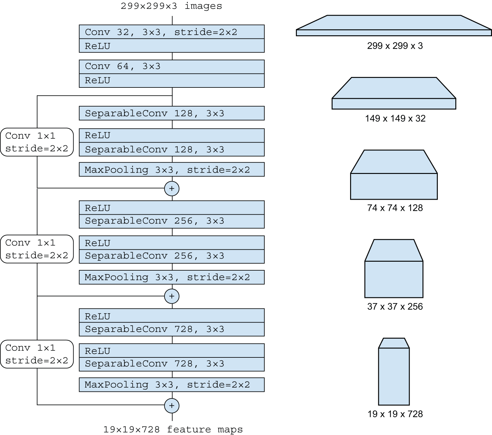
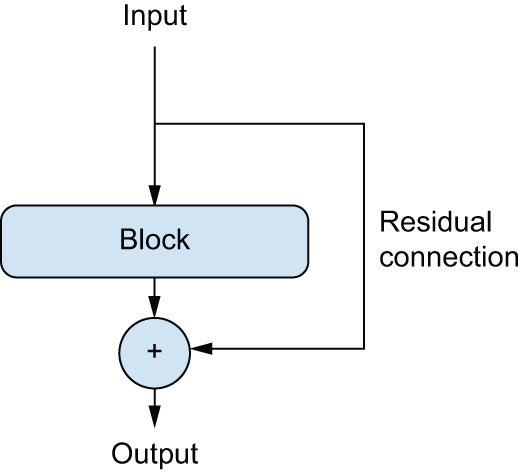
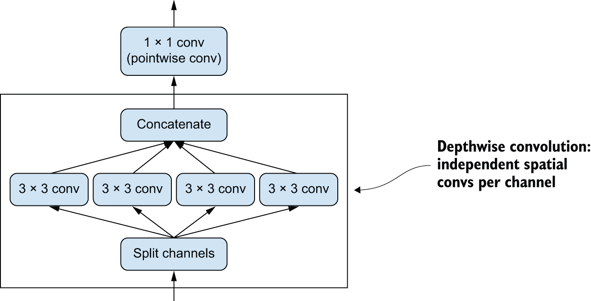
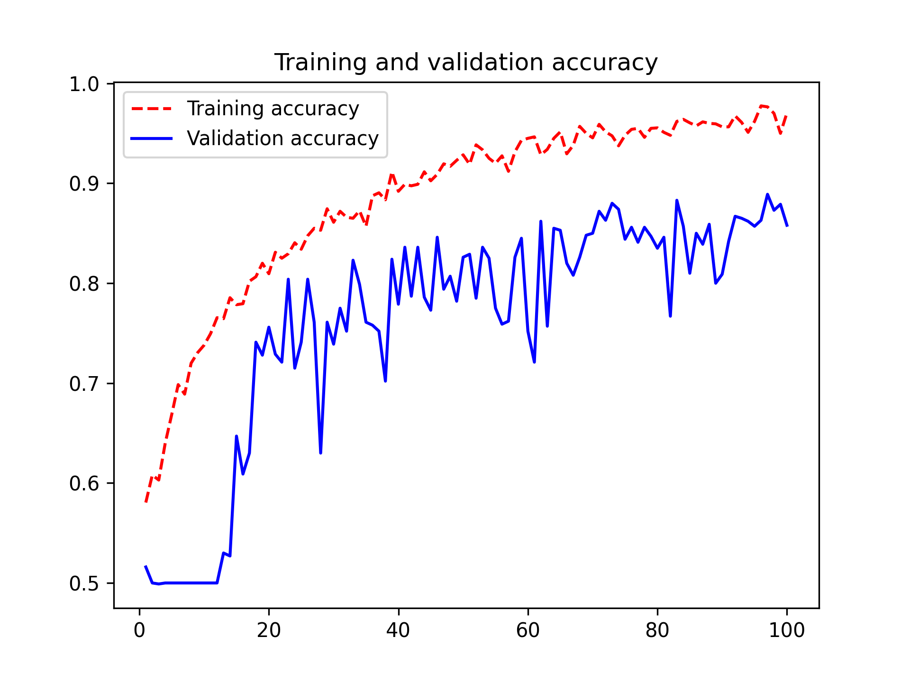
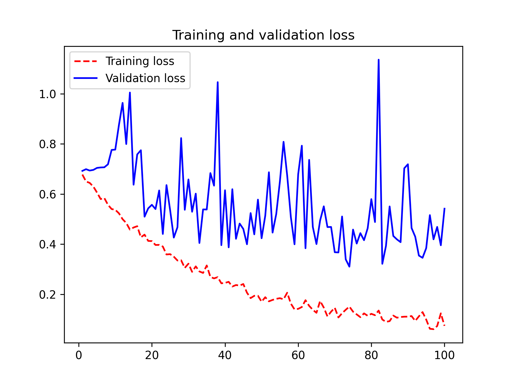

<!-- tabs:start -->

#### **Tiếng Anh (English)**

# Chapter 9: ConvNet architecture patterns

This chapter covers

* The modularity-hierarchy-reuse formula for model architecture
* An overview of standard best practices for building ConvNets:
  residual connections, batch normalization, and depthwise separable convolutions
* Ongoing design trends for computer vision models

A model’s “architecture” is the sum of the choices that went into creating it:
which layers to use, how to configure them, in what arrangement to connect them.
These choices define the *hypothesis space* of your model: the space of possible
functions that gradient descent can search over, parameterized by the model’s weights.
Like feature engineering, a good hypothesis space encodes *prior knowledge*
that you have about the problem at hand and its solution. For instance, using
convolution layers means that you know in advance that the relevant patterns
present in your input images are translation-invariant. To effectively
learn from data, you need to make assumptions about what you’re looking for.

Model architecture is often the difference between success and failure. If you
make inappropriate architecture choices, your model may be stuck with suboptimal
metrics, and no amount of training data will save it. Inversely, a good model
architecture will accelerate learning and will enable your model to make
efficient use of the training data available, reducing the need for large datasets.
A good model architecture is one that *reduces the size of the search space* or
otherwise *makes it easier to converge to a good point of the search space*.
Just like feature engineering and data curation, model architecture is all about
*making the problem simpler* for gradient descent to solve — and remember that
gradient descent is a pretty stupid search process, so it needs all the help
it can get.

Model architecture is more an art than a science. Experienced machine learning
engineers are able to intuitively cobble together high-performing models on their
first try, while beginners often struggle to create a model that trains at all.
The keyword here is *intuitively*: no one can give you a clear explanation of
what works and what doesn’t. Experts rely on pattern matching, an ability
that they acquire through extensive practical experience.
You’ll develop your own intuition throughout this book. However,
it’s not *all* about intuition either — there isn’t much in the way of actual
science, but like in any engineering discipline, there are best practices.

In the following sections, we’ll review a few essential ConvNet architecture
best practices, in particular,
*residual connections*, *batch normalization*, and *separable convolution*.
Once you master how to use them, you will be able to build highly effective
image models. We will demonstrate how to apply them on our dogs-versus-cats
classification problem.

Let’s start from the bird’s-eye view: the modularity-hierarchy-reuse (MHR)
formula for system architecture.

## Modularity, hierarchy, and reuse

If you want to make a complex system simpler, there’s a universal recipe
you can apply: just structure your amorphous soup of complexity into *modules*,
organize the modules into a *hierarchy*, and start *reusing* the same modules
in multiple places as appropriate (“reuse” is another word for *abstraction*).
That’s the modularity-hierarchy-reuse (MHR) formula (see figure 9.1), and it underlies system
architecture across pretty much every domain where the term *architecture*
is used. It’s at the heart of the organization of any system of meaningful
complexity, whether it’s a cathedral, your own body, the US Navy,
or the Keras codebase.


[Figure 9.1](#figure-9-1): Complex systems follow a hierarchical structure and are organized into distinct modules, which are reused multiple times (such as your 4 limbs, which are all variants of the same blueprint, or your 20 fingers).

If you’re a software engineer, you’re already keenly familiar with these principles:
an effective codebase is one that is modular, hierarchical, and where you don’t
reimplement the same thing twice but instead rely on reusable classes
and functions. If you factor your code by following these principles,
you could say you’re doing “software architecture.”

Deep learning itself is simply the application of this recipe to continuous optimization via
gradient descent: you take a classic optimization technique (gradient descent over a continuous
function space), and you structure the search space into modules (layers),
organized into a deep hierarchy (often just a stack, the simplest kind of hierarchy),
where you reuse whatever you can (for instance, convolutions are all about reusing
the same information in different spatial locations).

Likewise, deep learning model architecture is primarily about making clever use
of modularity, hierarchy, and reuse. You’ll notice that all popular ConvNet
architectures are not only structured into layers, they’re structured into
repeated groups of layers (called *blocks* or *modules*). For instance, Xception
architecture (used in the previous chapter) is structured into repeated
`SeparableConv` - `SeparableConv` - `MaxPooling` blocks (see figure 9.2).

Further, most ConvNets often feature pyramid-like structures (*feature hierarchies*).
Recall, for example, the progression in the number of convolution filters
we used in the first ConvNet we built in the previous chapter: 32, 64, 128.
The number of filters grows with layer depth, while the size of the feature
maps shrinks accordingly. You’ll notice the same pattern in the blocks of the
Xception model (see figure 9.2).




[Figure 9.2](#figure-9-2): The “entry flow” of the Xception architecture: note the repeated layer blocks and the gradually shrinking and deepening feature maps, going from 299 x 299 x 3 to 19 x 19 x 728.

Deeper hierarchies are intrinsically good because they encourage feature reuse
and, therefore, abstraction. In general, a deep stack of narrow layers performs
better than a shallow stack of large layers. However, there’s a limit to how
deep you can stack layers: the problem of *vanishing gradients*. This
leads us to our first essential model architecture pattern: residual connections.

On the importance of ablation studies in deep learning research

Deep learning architectures are often more *evolved* than designed — they were developed
by repeatedly trying things and selecting what seemed to work.
Much like in biological systems, if you take any complicated
experimental deep learning setup, chances are you can remove a few modules
(or replace some trained features with random ones)
with no loss of performance.

This is made worse by the incentives that deep learning
researchers face: by making a system more complex than necessary, they can
make it appear more interesting or more novel and thus increase their chances
of getting a paper through the peer review process. If you read lots of
deep learning papers, you will notice that they’re often optimized for peer review
in both style and content
in ways that actively hurt clarity of explanation and reliability of results.
For instance, mathematics in deep learning papers is rarely used for clearly formalizing
concepts or deriving unobvious results — rather, it gets used as a *signal of seriousness*,
like an expensive suit on a salesperson.

The goal of research shouldn’t be merely to publish but to *generate reliable knowledge*.
Crucially, *understanding causality* in your system is the most straightforward way to generate
reliable knowledge. And there’s a very low-effort way to look into causality:
*ablation studies*. Ablation studies consist of systematically trying to
remove parts of a system --that is, make it simpler — to identify where its performance
actually comes from. If you find that X + Y + Z gives you good results, also
try X, Y, Z, X + Y, X + Z, Y + Z and see what happens.

If you become a deep learning researcher, cut through the noise in the research process:
do ablation studies for your models. Always ask:
could there be a simpler explanation? Is this added complexity really necessary?
Why?

## Residual connections

You probably know about the game of *telephone*, also called *Chinese whispers*
in the UK and *téléphone arabe* in France,
where an initial message is whispered in the ear of a player, who then whispers
it in the ear of the next player, and so on. The final message ends up bearing little
resemblance to its original version. It’s a fun metaphor for the cumulative
errors that occur in sequential transmission over a noisy channel.

As it happens, backpropagation in a sequential deep learning model is pretty
similar to the game of telephone. You’ve got a chain of functions, like this one:

`y = f4(f3(f2(f1(x))))`

The name of the game is to adjust the parameters of each function in the chain based
on the error recorded on the output of `f4` (the loss of the model).
To adjust `f1`, you’ll need to percolate error information through `f2`, `f3`, and `f4`.
However, each successive function in the chain introduces some amount of noise
in the process. If your function chain is too deep, this noise starts
overwhelming gradient information, and backpropagation stops working. Your
model won’t train at all. This is called the *vanishing gradients* problem.

The fix is simple: just force each function in the chain to be nondestructive
— to retain a noiseless version of the information contained in the previous
input. The easiest way to implement this is called a *residual connection*.
It’s dead easy: just add the input of a layer or block of layers back to its output
(see figure 9.3). The residual connection acts as an *information shortcut*
around destructive or noisy blocks (such as blocks that contain ReLU activations or dropout layers),
enabling error gradient information from early layers to propagate noiselessly
through a deep network. This technique was introduced in 2015 with the ResNet family of
models (developed by He et al. at
Microsoft).[[1]](#footnote-1)




[Figure 9.3](#figure-9-3): A residual connection around a processing block

In practice, you’d implement a residual connection like the following listing.

```python
# Some input tensor
x = ...
# Saves a reference to the original input. This is called the residual.
residual = x
# This computation block can potentially be destructive or noisy, and
# that's fine.
x = block(x)
# Adds the original input to the layer's output. The final output will
# thus always preserve full information about the original input.
x = add([x, residual])
```

[Listing 9.1](#listing-9-1): A residual connection in pseudocode

Note that adding the input back to the output of a block implies
that the output should have the same shape as the input. This is not
the case if your block includes convolutional layers with an increased number of
filters or a max pooling layer.
In such cases, use a 1 × 1 `Conv2D` layer with no activation to linearly project the
residual to the desired output shape. You’d typically use `padding="same"`
in the convolution layers in your target block
to avoid spatial downsampling due to padding, and you’d use strides
in the residual projection to match any downsampling caused by a max pooling layer.

```python
import keras
from keras import layers

inputs = keras.Input(shape=(32, 32, 3))
x = layers.Conv2D(32, 3, activation="relu")(inputs)
# Sets aside the residual
residual = x
# This is the layer around which we create a residual connection: it
# increases the number of output filers from 32 to 64. We use
# padding="same" to avoid downsampling due to padding.
x = layers.Conv2D(64, 3, activation="relu", padding="same")(x)
# The residual only had 32 filters, so we use a 1 x 1 Conv2D to project
# it to the correct shape.
residual = layers.Conv2D(64, 1)(residual)
# Now the block output and the residual have the same shape and can be
# added.
x = layers.add([x, residual])
```

[Listing 9.2](#listing-9-2): The target block changing the number of output filters


```python
inputs = keras.Input(shape=(32, 32, 3))
x = layers.Conv2D(32, 3, activation="relu")(inputs)
# Sets aside the residual
residual = x
# This is the block of two layers around which we create a residual
# connection: it includes a 2 x 2 max pooling layer. We use
# padding="same" in both the convolution layer and the max pooling
# layer to avoid downsampling due to padding.
x = layers.Conv2D(64, 3, activation="relu", padding="same")(x)
x = layers.MaxPooling2D(2, padding="same")(x)
# We use strides=2 in the residual projection to match the downsampling
# created by the max pooling layer.
residual = layers.Conv2D(64, 1, strides=2)(residual)
# Now the block output and the residual have the same shape and can be
# added.
x = layers.add([x, residual])
```

[Listing 9.3](#listing-9-3): The target block including a max pooling layer

To make these ideas more concrete, here’s an example of a simple ConvNet structured
into a series of blocks, each made of two convolution layers and one optional
max pooling layer, with a residual connection around each block:

```python
inputs = keras.Input(shape=(32, 32, 3))
x = layers.Rescaling(1.0 / 255)(inputs)

# Utility function to apply a convolutional block with a residual
# connection, with an option to add max pooling
def residual_block(x, filters, pooling=False):
    residual = x
    x = layers.Conv2D(filters, 3, activation="relu", padding="same")(x)
    x = layers.Conv2D(filters, 3, activation="relu", padding="same")(x)
    if pooling:
        x = layers.MaxPooling2D(2, padding="same")(x)
        # If we use max pooling, we add a strided convolution to
        # project the residual to the expected shape.
        residual = layers.Conv2D(filters, 1, strides=2)(residual)
    elif filters != residual.shape[-1]:
        # If we don't use max pooling, we only project the residual if
        # the number of channels has changed.
        residual = layers.Conv2D(filters, 1)(residual)
    x = layers.add([x, residual])
    return x

# First block
x = residual_block(x, filters=32, pooling=True)
# Second block. Note the increasing filter count in each block.
x = residual_block(x, filters=64, pooling=True)
# The last block doesn't need a max pooling layer, since we will apply
# global average pooling right after it.
x = residual_block(x, filters=128, pooling=False)

x = layers.GlobalAveragePooling2D()(x)
outputs = layers.Dense(1, activation="sigmoid")(x)
model = keras.Model(inputs=inputs, outputs=outputs)
```

Let’s take a look at the model summary:

```python
>>> model.summary()
Model: "functional"
┏━━━━━━━━━━━━━━━━━━━━━━┳━━━━━━━━━━━━━━━━━━━━┳━━━━━━━━━━━━┳━━━━━━━━━━━━━━━━━━━━━┓
┃ Layer (type)         ┃ Output Shape       ┃    Param # ┃ Connected to        ┃
┡━━━━━━━━━━━━━━━━━━━━━━╇━━━━━━━━━━━━━━━━━━━━╇━━━━━━━━━━━━╇━━━━━━━━━━━━━━━━━━━━━┩
│ input_layer_2        │ (None, 32, 32, 3)  │          0 │ -                   │
│ (InputLayer)         │                    │            │                     │
├──────────────────────┼────────────────────┼────────────┼─────────────────────┤
│ rescaling (Rescaling)│ (None, 32, 32, 3)  │          0 │ input_layer_2[0][0] │
├──────────────────────┼────────────────────┼────────────┼─────────────────────┤
│ conv2d_6 (Conv2D)    │ (None, 32, 32, 32) │        896 │ rescaling[0][0]     │
├──────────────────────┼────────────────────┼────────────┼─────────────────────┤
│ conv2d_7 (Conv2D)    │ (None, 32, 32, 32) │      9,248 │ conv2d_6[0][0]      │
├──────────────────────┼────────────────────┼────────────┼─────────────────────┤
│ max_pooling2d_1      │ (None, 16, 16, 32) │          0 │ conv2d_7[0][0]      │
│ (MaxPooling2D)       │                    │            │                     │
├──────────────────────┼────────────────────┼────────────┼─────────────────────┤
│ conv2d_8 (Conv2D)    │ (None, 16, 16, 32) │        128 │ rescaling[0][0]     │
├──────────────────────┼────────────────────┼────────────┼─────────────────────┤
│ add_2 (Add)          │ (None, 16, 16, 32) │          0 │ max_pooling2d_1[0]… │
│                      │                    │            │ conv2d_8[0][0]      │
├──────────────────────┼────────────────────┼────────────┼─────────────────────┤
│ conv2d_9 (Conv2D)    │ (None, 16, 16, 64) │     18,496 │ add_2[0][0]         │
├──────────────────────┼────────────────────┼────────────┼─────────────────────┤
│ conv2d_10 (Conv2D)   │ (None, 16, 16, 64) │     36,928 │ conv2d_9[0][0]      │
├──────────────────────┼────────────────────┼────────────┼─────────────────────┤
│ max_pooling2d_2      │ (None, 8, 8, 64)   │          0 │ conv2d_10[0][0]     │
│ (MaxPooling2D)       │                    │            │                     │
├──────────────────────┼────────────────────┼────────────┼─────────────────────┤
│ conv2d_11 (Conv2D)   │ (None, 8, 8, 64)   │      2,112 │ add_2[0][0]         │
├──────────────────────┼────────────────────┼────────────┼─────────────────────┤
│ add_3 (Add)          │ (None, 8, 8, 64)   │          0 │ max_pooling2d_2[0]… │
│                      │                    │            │ conv2d_11[0][0]     │
├──────────────────────┼────────────────────┼────────────┼─────────────────────┤
│ conv2d_12 (Conv2D)   │ (None, 8, 8, 128)  │     73,856 │ add_3[0][0]         │
├──────────────────────┼────────────────────┼────────────┼─────────────────────┤
│ conv2d_13 (Conv2D)   │ (None, 8, 8, 128)  │    147,584 │ conv2d_12[0][0]     │
├──────────────────────┼────────────────────┼────────────┼─────────────────────┤
│ conv2d_14 (Conv2D)   │ (None, 8, 8, 128)  │      8,320 │ add_3[0][0]         │
├──────────────────────┼────────────────────┼────────────┼─────────────────────┤
│ add_4 (Add)          │ (None, 8, 8, 128)  │          0 │ conv2d_13[0][0],    │
│                      │                    │            │ conv2d_14[0][0]     │
├──────────────────────┼────────────────────┼────────────┼─────────────────────┤
│ global_average_pool… │ (None, 128)        │          0 │ add_4[0][0]         │
│ (GlobalAveragePooli… │                    │            │                     │
├──────────────────────┼────────────────────┼────────────┼─────────────────────┤
│ dense (Dense)        │ (None, 1)          │        129 │ global_average_poo… │
└──────────────────────┴────────────────────┴────────────┴─────────────────────┘
 Total params: 297,697 (1.14 MB)
 Trainable params: 297,697 (1.14 MB)
 Non-trainable params: 0 (0.00 B)
```

With residual connections, you can build networks of arbitrary depth,
without having to worry about vanishing gradients.
Now, let’s move on to the next essential ConvNet architecture pattern:
*batch normalization*.

## Batch normalization

*Normalization* in machine learning
is a broad category of methods that seek to make different
samples seen by a machine learning model more similar to each other,
which helps the model learn and generalize well to new data.
The most common form of data normalization is one you’ve seen several times
in this book already: centering the data on zero by subtracting the mean from the
data and giving the data a unit standard deviation by dividing the data by
its standard deviation. In effect, this makes the assumption that the data
follows a normal (or Gaussian) distribution and makes sure this distribution
is centered and scaled to unit variance:

```python
normalized_data = (data - np.mean(data, axis=...)) / np.std(data, axis=...)
```

Previous examples you saw in this book normalized data before feeding it into models.
But data normalization may be a concern after every transformation performed
by the network: even if the data entering a `Dense` or `Conv2D` network has
a 0 mean and unit variance, there’s no reason to expect a priori
that this will be the case for the data coming out. Could normalizing intermediate
activations help?

Batch normalization does just that. It’s a type of layer (`BatchNormalization` in Keras)
introduced in 2015 by Ioffe and
Szegedy;[[2]](#footnote-2)
it can adaptively normalize data even as the mean and variance change over time during training.
During training, it uses the mean and variance of the current batch of data to normalize
samples, and during inference (when a big enough batch of representative data may not
be available), it uses an exponential moving average of the
batchwise mean and variance of the data seen during training.

Although Ioffe and
Szegedy’s original paper suggested that batch normalization operates by
“reducing internal covariate shift,” no one really knows for sure why batch
normalization helps. There are various hypotheses but no certitudes.
You’ll find that this is true of many things in deep learning —
deep learning is not an exact science but a set of ever-changing, empirically derived
engineering best practices, woven together by unreliable narratives.
You will sometimes feel like the book you have in hand tells you *how*
to do something but doesn’t quite satisfactorily say *why* it works: that’s
because we know the how but we don’t know the why. Whenever a reliable
explanation is available, we make sure to mention it. Batch normalization
isn’t one of those cases.

In practice, the main effect of batch normalization appears to be that it helps
with gradient propagation — much like residual connections — and thus allows for
deeper networks. Some very deep networks can only be trained
if they include multiple `BatchNormalization` layers.
For instance, batch normalization is used liberally in many of the
advanced ConvNet architectures that come packaged with Keras,
such as ResNet50, EfficientNet, and Xception.

The `BatchNormalization` layer can be used after any layer — `Dense`, `Conv2D`,
and so on:

```python
x = ...
# Because the output of the Conv2D layer gets normalized, the layer
# doesn't need its own bias vector.
x = layers.Conv2D(32, 3, use_bias=False)(x)
x = layers.BatchNormalization()(x)
```


Both `Dense` and `Conv2D` involve a “bias vector,” a learned
variable whose purpose is to make the layer *affine* rather than purely linear.
For instance, `Conv2D` returns, schematically, `y = conv(x, kernel) + bias`,
and `Dense` returns `y = dot(x, kernel) + bias`. Because the normalization
step will take care of centering the layer’s output on zero, the bias vector
is no longer needed when using `BatchNormalization`, and the layer can be created
without it via the option `use_bias=False`. This makes the layer slightly
leaner.

Importantly, I would generally recommend placing the previous layer’s activation
*after* the batch normalization layer (although this is still a subject of debate).
So instead of doing

```python
x = layers.Conv2D(32, 3, activation="relu")(x)
x = layers.BatchNormalization()(x)
```

[Listing 9.4](#listing-9-4): How not to use batch normalization

you would actually do the following:

```python
# Note the lack of activation here.
x = layers.Conv2D(32, 3, use_bias=False)(x)
x = layers.BatchNormalization()(x)
# We place the activation after the BatchNormalization layer.
x = layers.Activation("relu")(x)
```

[Listing 9.5](#listing-9-5): How to use batch normalization

The intuitive reason why is that batch normalization will center your
inputs on zero, while your ReLU activation uses zero as a pivot for
keeping or dropping activated channels: doing normalization before the activation
maximizes the utilization of the ReLU.
That said, this ordering best practice
is not exactly critical, so if you do convolution-activation-batch normalization,
your model will still train, and you won’t necessarily see worse results.

Batch normalization has many quirks. One of the main ones relates to fine-tuning:
when fine-tuning a model that includes `BatchNormalization` layers, I recommend
leaving these layers frozen (set their `trainable` attribute to `False`). Otherwise,
they will keep updating their internal mean and variance, which can interfere
with the very small updates applied to the surrounding `Conv2D` layers.

Now, let’s take a look at the last architecture pattern in our series:
depthwise separable convolutions.

## Depthwise separable convolutions

What if we told you that there’s a layer you can use as a drop-in replacement
for `Conv2D` that will make your model smaller (fewer trainable weight parameters),
leaner (fewer floating-point operations), and cause it to perform a few
percentage points better on its task?
That is precisely what the *depthwise separable convolution* layer does
(`SeparableConv2D` in Keras). This layer performs a spatial convolution on each channel
of its input, independently, before mixing output channels via a pointwise convolution
(a 1 × 1 convolution), as shown in figure 9.4.




[Figure 9.4](#figure-9-4): Depthwise separable convolution: a depthwise convolution followed by a pointwise convolution

This is equivalent to separating the learning of spatial features and the
learning of channel-wise features. In much the same way that convolution relies
on the assumption that the patterns in images are not tied to specific locations,
depthwise separable convolution relies on the assumption that
*spatial locations* in intermediate activations are *highly correlated*,
but *different channels* are *highly independent*.
Because this assumption is generally true for the image representations learned
by deep neural networks, it serves as a useful prior that helps the model
make more efficient use of its training data. A model with stronger
priors about the structure of the information it will have to process
is a better model — as long as the priors are accurate.

Depthwise separable convolution requires significantly fewer parameters
and involves fewer computations compared to regular convolution, while
having comparable representational power. They result in smaller models that
converge faster and are less prone to overfitting. These advantages become
especially important when you’re training small models from scratch on limited data.

When it comes to larger-scale models, depthwise separable convolutions are
the basis of the Xception architecture, a high-performing ConvNet that comes
packaged with Keras. You can read more about the theoretical grounding for
depthwise separable convolutions and Xception in the paper
“Xception: Deep Learning with Depthwise Separable
Convolutions.”[[3]](#footnote-3)

The co-evolution of hardware, software, and algorithms

Consider a regular convolution operation with a 3 x 3 window, 64 input channels,
and 64 output channels. It uses 3 × 3 × 64 × 64 = 36,864 trainable parameters,
and when you apply it to an image, it runs a number of floating-point operations
that is proportional to this parameter count. Meanwhile, consider an equivalent
depthwise separable convolution: it only involves 3 × 3 × 64 + 64 × 64 = 4,672
trainable parameters and proportionally fewer floating-point operations.
This efficiency improvement only increases
as the number of filters or the size of the convolution windows gets larger.

As a result, you would expect depthwise separable convolutions to be dramatically
faster, right? Hold on. This would be true if you were writing simple
CUDA or C++ implementations of these algorithms —
in fact, you do see a meaningful speedup when running on CPU, where the underlying
implementation is parallelized C++. But in practice, you’re probably using a GPU,
and what you’re executing on it is far from a “simple” CUDA implementation: it’s a
*cuDNN kernel*, a piece of code that has been extraordinarily optimized, down to
each machine instruction. It certainly makes sense to spend a lot of effort
optimizing this code, since cuDNN convolutions on NVIDIA hardware are responsible
for many exaflops of computation every day. But a side effect of this
extreme micro-optimization is that alternative approaches have little chance
to compete on performance — even approaches that have significant intrinsic advantages,
like depthwise separable convolutions.

Despite repeated requests to NVIDIA, depthwise separable convolutions have not
benefited from nearly the same level of software and hardware
optimization as regular convolutions, and as a result
they remain only about as fast as regular convolutions, even though they’re
using quadratically fewer parameters and floating-point operations. Note, though,
that using depthwise separable convolutions remains a good idea even if it does
not result in a speedup: their lower parameter count means that you are less
at risk of overfitting, and their assumption that channels should be uncorrelated
leads to faster model convergence and more robust representations.

What is a slight inconvenience in this case can become an impassable wall in
other situations: because the entire hardware and software ecosystem of deep learning
has been micro-optimized for a very specific set of algorithms (in particular, ConvNets
trained via backpropagation), there’s an extremely high cost
to steering away from the beaten path. If you were to experiment with alternative
algorithms, such as gradient-free optimization or spiking neural networks,
the first few parallel C++ or CUDA implementations you’d come up with would be
orders of magnitude slower than a good old ConvNet — no matter how clever
and efficient your ideas were. Convincing other researchers to adopt your method
would be a tough sell, even if it were just plain better.

You could say that modern deep learning is the product of a co-evolution process
between hardware, software, and algorithms: the availability of NVIDIA GPUs and CUDA
led to the early success of backpropagation-trained ConvNets, which led NVIDIA
to optimize its hardware and software for these algorithms, which in turn
led to consolidation of the research community behind these methods. At this
point, figuring out a different path would require a multiyear reengineering
of the entire ecosystem.

## Putting it together: A mini Xception-like model

As a reminder, here are the ConvNet architecture principles you’ve learned so far:

* Your model should be organized into repeated *blocks* of layers, usually
  made of multiple convolution layers and a max pooling layer.
* The number of filters in your layers should increase as the size of the spatial
  feature maps decreases.
* Deep and narrow is better than broad and shallow.
* Introducing residual connections around blocks of layers helps you train
  deeper networks.
* It can be beneficial to introduce batch normalization layers after your convolution layers.
* It can be beneficial to replace `Conv2D` layers with `SeparableConv2D` layers,
  which are more parameter efficient.

Let’s bring all of these ideas together into a single model. Its architecture
resembles a smaller version of Xception. We’ll apply it to the dogs-versus-cats
task from last chapter. For data loading and model training,
simply reuse the exact same setup as what
we used in chapter 8, section 8.2 —
but replace the model definition with the following ConvNet:

```python
import keras

inputs = keras.Input(shape=(180, 180, 3))
# Don't forget input rescaling!
x = layers.Rescaling(1.0 / 255)(inputs)
# The assumption that underlies separable convolution, "Feature
# channels are largely independent," does not hold for RGB images! Red,
# green, and blue color channels are actually highly correlated in
# natural images. As such, the first layer in our model is a regular
# `Conv2D` layer. We'll start using `SeparableConv2D` afterward.
x = layers.Conv2D(filters=32, kernel_size=5, use_bias=False)(x)

# We apply a series of convolutional blocks with increasing feature
# depth. Each block consists of two batch-normalized depthwise
# separable convolution layers and a max pooling layer, with a residual
# connection around the entire block.
for size in [32, 64, 128, 256, 512]:
    residual = x

    x = layers.BatchNormalization()(x)
    x = layers.Activation("relu")(x)
    x = layers.SeparableConv2D(size, 3, padding="same", use_bias=False)(x)

    x = layers.BatchNormalization()(x)
    x = layers.Activation("relu")(x)
    x = layers.SeparableConv2D(size, 3, padding="same", use_bias=False)(x)

    x = layers.MaxPooling2D(3, strides=2, padding="same")(x)

    residual = layers.Conv2D(
        size, 1, strides=2, padding="same", use_bias=False
    )(residual)
    x = layers.add([x, residual])

# In the original model, we used a Flatten layer before the Dense
# layer. Here, we go with a GlobalAveragePooling2D layer.
x = layers.GlobalAveragePooling2D()(x)
# Like in the original model, we add a dropout layer for
# regularization.
x = layers.Dropout(0.5)(x)
outputs = layers.Dense(1, activation="sigmoid")(x)
model = keras.Model(inputs=inputs, outputs=outputs)
```

This ConvNet has a trainable parameter count of 721,857, significantly lower than
the 1,569,089 trainable parameters of the model from the previous chapter,
yet it achieves better results. Figure 9.5 shows the training and validation curves.





[Figure 9.5](#figure-9-5): Training and validation metrics with a Xception-like architecture

You’ll find that our new model achieves a test accuracy of 90.8% — compared to
83.9% for the previous model.
As you can see, following architecture
best practices does have an immediate, sizeable effect on model performance!

At this point, if you want to further
improve performance, you should start systematically tuning the hyperparameters
of your architecture — a topic we cover in detail in chapter 18.
We haven’t gone through this step here, so the configuration of the previous model
is purely from the best practices we outlined, plus, when it comes to gauging
model size, a small amount of intuition.

## Beyond convolution: Vision Transformers

While ConvNets have been dominating the field of computer vision since the mid-2010s,
they’ve been recently competing with an alternative architecture:
Vision Transformers (or ViTs for short). It may well be that ViTs will end up replacing
ConvNets in the long term — though, for now, ConvNets remain your best option in most cases.

You don’t yet know what Transformers are because we’ll cover them in chapter 15.
In short, the Transformer architecture was developed to process text — it’s fundamentally a sequence-processing architecture.
And Transformers are very good at it, which has led to the question: could we also use them for images?

Because ViTs are a type of Transformer,
they also process sequences: they split up an image into
a 1D sequence of patches, turn each patch into a flat vector, and process the vector sequence.
The Transformer architecture allows ViTs to capture long-range relationships between different parts of the image,
something ConvNets can sometimes struggle with.

Our general experience with Transformers is that they’re a great choice if you’re working with a massive dataset. They’re
simply better at utilizing large amounts of data. However, for smaller datasets, they tend to be suboptimal for two reasons.
First, they lack the spatial prior of ConvNets — the 2D patch-based architecture of ConvNets
incorporates more assumptions about the local structure of the visual space, making them more data efficient. Second, for ViTs to shine, they need to be really large. They end up being unwieldy for anything smaller than ImageNet.

The battle for image recognition supremacy is far from over, but ViTs have undoubtedly opened a new and exciting chapter.
You’ll probably work with this architecture in the context of large-scale generative image models — a topic we’ll cover in chapter 17.
For your small-scale image classification needs, however, ConvNets remain your best bet.

This concludes our introduction to essential ConvNet architecture best practices.
With these principles in hand, you’ll be able to develop higher-performing models
across a wide range of computer vision tasks. You’re now well on your way to
becoming a proficient computer vision practitioner. To further deepen your expertise,
there’s one last important topic we need to cover: interpreting how a
model arrives at its predictions.

## Summary

* The architecture of a deep learning model encodes key assumptions about the nature of the problem at hand.
* The modularity-hierarchy-reuse formula underpins the architecture of nearly all complex systems, including deep learning models.
* Key architecture patterns for computer vision include residual connections, batch normalization, and depthwise separable convolutions.
* Vision Transformers are an up-and-coming alternative to ConvNets for large-scale computer vision tasks.

#### **Tiếng Việt (Vietnamese)**

# Chương 9: Các mẫu kiến ​​trúc ConvNet

Chương này bao gồm

* Công thức mô-đun-phân cấp-tái sử dụng cho kiến ​​trúc mô hình
* Tổng quan về các phương pháp hay nhất tiêu chuẩn để xây dựng ConvNet:
kết nối dư, chuẩn hóa hàng loạt và các kết cấu có thể phân tách theo chiều sâu
* Xu hướng thiết kế đang diễn ra cho các mô hình thị giác máy tính

“Kiến trúc” của một mô hình là tổng hợp các lựa chọn đã tạo ra nó: sử dụng lớp nào, cách định cấu hình chúng, cách sắp xếp để kết nối chúng. Những lựa chọn này xác định *không gian giả thuyết* của mô hình của bạn: không gian của các hàm có thể có mà độ dốc giảm dần có thể tìm kiếm, được tham số hóa theo trọng số của mô hình. Giống như kỹ thuật tính năng, một không gian giả thuyết tốt sẽ mã hóa *kiến thức trước* mà bạn có về vấn đề hiện tại và giải pháp của nó. Ví dụ: sử dụng các lớp tích chập có nghĩa là bạn biết trước rằng các mẫu có liên quan có trong hình ảnh đầu vào của bạn là bất biến dịch. Để học hỏi từ dữ liệu một cách hiệu quả, bạn cần đưa ra các giả định về những gì bạn đang tìm kiếm.

Kiến trúc mô hình thường là sự khác biệt giữa thành công và thất bại. Nếu bạn đưa ra những lựa chọn kiến ​​trúc không phù hợp, mô hình của bạn có thể bị mắc kẹt với các số liệu dưới mức tối ưu và sẽ không có lượng dữ liệu đào tạo nào lưu được mô hình đó. Ngược lại, kiến ​​trúc mô hình tốt sẽ tăng tốc quá trình học tập và cho phép mô hình của bạn sử dụng hiệu quả dữ liệu huấn luyện sẵn có, giảm nhu cầu về bộ dữ liệu lớn. Kiến trúc mô hình tốt là kiến ​​trúc *giảm kích thước của không gian tìm kiếm* hoặc nói cách khác là *làm cho việc hội tụ đến một điểm phù hợp của không gian tìm kiếm trở nên dễ dàng hơn*. Cũng giống như kỹ thuật tính năng và quản lý dữ liệu, kiến ​​trúc mô hình hoàn toàn hướng tới việc *làm cho vấn đề trở nên đơn giản hơn* để giải quyết việc giảm độ dốc - và hãy nhớ rằng việc giảm độ dốc là một quá trình tìm kiếm khá ngu ngốc, vì vậy nó cần tất cả sự trợ giúp có thể nhận được.

Kiến trúc mô hình là một nghệ thuật hơn là một khoa học. Các kỹ sư máy học có kinh nghiệm có thể ghép các mô hình hiệu suất cao lại với nhau một cách trực quan trong lần thử đầu tiên, trong khi những người mới bắt đầu thường gặp khó khăn trong việc tạo ra một mô hình có thể đào tạo được. Từ khóa ở đây là *trực quan*: không ai có thể giải thích rõ ràng cho bạn điều gì hiệu quả và điều gì không. Các chuyên gia dựa vào việc so khớp mẫu, một khả năng mà họ có được nhờ kinh nghiệm thực tế sâu rộng. Bạn sẽ phát triển trực giác của riêng mình trong suốt cuốn sách này. Tuy nhiên, đó cũng không phải là *tất cả* về trực giác - không có nhiều thứ liên quan đến khoa học thực tế, nhưng giống như trong bất kỳ ngành kỹ thuật nào, đều có những phương pháp thực hành tốt nhất.

Trong các phần sau, chúng tôi sẽ xem xét một số phương pháp hay nhất về kiến ​​trúc ConvNet cần thiết, đặc biệt là *kết nối dư*, *chuẩn hóa hàng loạt* và *tích chập có thể phân tách*. Khi bạn nắm vững cách sử dụng chúng, bạn sẽ có thể xây dựng các mô hình hình ảnh có hiệu quả cao. Chúng ta sẽ trình bày cách áp dụng chúng vào bài toán phân loại chó và mèo.

Hãy bắt đầu từ cái nhìn toàn cảnh: công thức mô-đun-phân cấp-tái sử dụng (MHR) cho kiến ​​trúc hệ thống.

## Tính mô đun, phân cấp và tái sử dụng

Nếu bạn muốn làm cho một hệ thống phức tạp trở nên đơn giản hơn thì có một công thức phổ biến mà bạn có thể áp dụng: chỉ cần cấu trúc hỗn hợp phức tạp vô định hình của bạn thành *mô-đun*, sắp xếp các mô-đun thành một *hệ thống phân cấp* và bắt đầu *sử dụng lại* các mô-đun giống nhau ở nhiều nơi thích hợp (“tái sử dụng” là một từ khác của *trừu tượng*). Đó là công thức mô-đun-phân cấp-tái sử dụng (MHR) (xem hình 9.1) và nó làm nền tảng cho kiến ​​trúc hệ thống trên hầu hết mọi miền sử dụng thuật ngữ *kiến trúc*. Nó là trung tâm của việc tổ chức bất kỳ hệ thống phức tạp có ý nghĩa nào, cho dù đó là một thánh đường, cơ quan của chính bạn, Hải quân Hoa Kỳ hay cơ sở mã Keras.


[Figure 9.1](#figure-9-1): Complex systems follow a hierarchical structure and are organized into distinct modules, which are reused multiple times (such as your 4 limbs, which are all variants of the same blueprint, or your 20 fingers).

Nếu bạn là một kỹ sư phần mềm, bạn đã rất quen thuộc với những nguyên tắc này: một cơ sở mã hiệu quả là một cơ sở có tính mô-đun, phân cấp và trong đó bạn không triển khai lại cùng một thứ hai lần mà thay vào đó dựa vào các lớp và hàm có thể tái sử dụng. Nếu bạn tính toán mã của mình bằng cách tuân theo các nguyên tắc này, bạn có thể nói rằng bạn đang thực hiện “kiến trúc phần mềm”.

Bản thân học sâu chỉ đơn giản là ứng dụng công thức này để tối ưu hóa liên tục thông qua việc giảm độ dốc: bạn sử dụng một kỹ thuật tối ưu hóa cổ điển (giảm dần độ dốc trên một không gian hàm liên tục) và bạn cấu trúc không gian tìm kiếm thành các mô-đun (lớp), được tổ chức thành một hệ thống phân cấp sâu (thường chỉ là một ngăn xếp, loại phân cấp đơn giản nhất), trong đó bạn sử dụng lại bất cứ thứ gì có thể (ví dụ: các phép cuộn là về việc sử dụng lại cùng một thông tin ở các vị trí không gian khác nhau).

Tương tự như vậy, kiến ​​trúc mô hình học sâu chủ yếu là sử dụng tính mô đun, phân cấp và tái sử dụng một cách thông minh. Bạn sẽ nhận thấy rằng tất cả kiến ​​trúc ConvNet phổ biến không chỉ được cấu trúc thành các lớp mà còn được cấu trúc thành các nhóm lớp lặp lại (được gọi là *khối* hoặc *mô-đun*). Ví dụ: kiến ​​trúc Xception (được sử dụng trong chương trước) được cấu trúc thành các khối `SeparableConv` - `SeparableConv` - `MaxPooling` lặp đi lặp lại (xem hình 9.2).

Hơn nữa, hầu hết các ConvNet thường có cấu trúc giống kim tự tháp (*phân cấp tính năng*). Ví dụ, hãy nhớ lại sự tăng dần về số lượng bộ lọc tích chập mà chúng tôi đã sử dụng trong ConvNet đầu tiên mà chúng tôi đã xây dựng ở chương trước: 32, 64, 128. Số lượng bộ lọc tăng lên theo độ sâu lớp, trong khi kích thước của bản đồ tính năng sẽ giảm theo. Bạn sẽ nhận thấy mẫu tương tự trong các khối của mô hình Xception (xem hình 9.2).


[Figure 9.2](#figure-9-2): The “entry flow” of the Xception architecture: note the repeated layer blocks and the gradually shrinking and deepening feature maps, going from 299 x 299 x 3 to 19 x 19 x 728.

Hệ thống phân cấp sâu hơn về bản chất là tốt vì chúng khuyến khích việc tái sử dụng tính năng và do đó có tính trừu tượng. Nói chung, một chồng sâu gồm các lớp hẹp hoạt động tốt hơn một chồng nông gồm các lớp lớn. Tuy nhiên, có một giới hạn về độ sâu mà bạn có thể xếp chồng các lớp: vấn đề *độ dốc biến mất*. Điều này dẫn chúng ta đến mẫu kiến ​​trúc mô hình thiết yếu đầu tiên: các kết nối còn lại.

Về tầm quan trọng của nghiên cứu cắt bỏ trong nghiên cứu học sâu

Kiến trúc học sâu thường *tiến hóa* hơn so với thiết kế - chúng được phát triển bằng cách liên tục thử mọi thứ và chọn ra những gì có vẻ hiệu quả. Giống như trong các hệ thống sinh học, nếu bạn thực hiện bất kỳ thiết lập deep learning thử nghiệm phức tạp nào, rất có thể bạn có thể loại bỏ một vài mô-đun (hoặc thay thế một số tính năng đã được đào tạo bằng các tính năng ngẫu nhiên) mà không làm giảm hiệu suất.

Điều này càng trở nên tồi tệ hơn bởi những khuyến khích mà các nhà nghiên cứu deep learning phải đối mặt: bằng cách làm cho một hệ thống phức tạp hơn mức cần thiết, họ có thể làm cho nó trở nên thú vị hơn hoặc mới lạ hơn và do đó tăng cơ hội nhận được một bài báo thông qua quá trình đánh giá ngang hàng. Nếu bạn đọc nhiều bài viết về deep learning, bạn sẽ nhận thấy rằng chúng thường được tối ưu hóa để đánh giá ngang hàng cả về phong cách và nội dung theo những cách làm tổn hại nghiêm trọng đến sự rõ ràng của lời giải thích và độ tin cậy của kết quả. Ví dụ: toán học trong các bài viết về deep learning hiếm khi được sử dụng để hình thức hóa các khái niệm một cách rõ ràng hoặc đưa ra những kết quả không rõ ràng — thay vào đó, nó được sử dụng như một *tín hiệu của sự nghiêm túc*, giống như bộ đồ đắt tiền của nhân viên bán hàng.

Mục tiêu của nghiên cứu không chỉ đơn thuần là xuất bản mà là *tạo ra kiến ​​thức đáng tin cậy*. Điều quan trọng là *hiểu được quan hệ nhân quả* trong hệ thống của bạn là cách đơn giản nhất để tạo ra kiến ​​thức đáng tin cậy. Và có một cách rất tốn ít công sức để xem xét quan hệ nhân quả: *nghiên cứu cắt bỏ*. Các nghiên cứu cắt bỏ bao gồm việc cố gắng loại bỏ một cách có hệ thống các bộ phận của một hệ thống - nghĩa là làm cho nó đơn giản hơn - để xác định hiệu suất của nó thực sự đến từ đâu. Nếu bạn thấy X + Y + Z mang lại cho bạn kết quả tốt, hãy thử X, Y, Z, X + Y, X + Z, Y + Z và xem điều gì sẽ xảy ra.

Nếu bạn trở thành một nhà nghiên cứu về deep learning, hãy loại bỏ những ồn ào trong quá trình nghiên cứu: thực hiện các nghiên cứu cắt bỏ cho mô hình của bạn. Luôn hỏi: có thể có lời giải thích đơn giản hơn không? Sự phức tạp bổ sung này có thực sự cần thiết không? Tại sao?

## Kết nối dư

Bạn có thể biết về trò chơi *điện thoại*, còn được gọi là *tiếng Trung thì thầm* ở Anh và *téléphone arabe* ở Pháp, trong đó tin nhắn ban đầu được thì thầm vào tai một người chơi, sau đó người chơi này thì thầm tin nhắn đó vào tai người chơi tiếp theo, v.v. Thông điệp cuối cùng có chút giống với phiên bản gốc của nó. Đó là một phép ẩn dụ thú vị cho các lỗi tích lũy xảy ra trong quá trình truyền tuần tự qua một kênh nhiễu.

Khi điều đó xảy ra, lan truyền ngược trong mô hình deep learning tuần tự khá giống với trò chơi trên điện thoại. Bạn có một chuỗi các hàm như sau:

`y = f4(f3(f2(f1(x))))`

Tên của trò chơi là điều chỉnh các tham số của từng chức năng trong chuỗi dựa trên lỗi được ghi trên đầu ra của `f4` (mất mô hình). Để điều chỉnh `f1`, bạn cần lọc thông tin lỗi thông qua `f2`, `f3` và `f4`. Tuy nhiên, mỗi chức năng kế tiếp nhau trong chuỗi đều gây ra một số nhiễu trong quy trình. Nếu chuỗi chức năng của bạn quá sâu, nhiễu này sẽ bắt đầu lấn át thông tin độ dốc và quá trình lan truyền ngược sẽ ngừng hoạt động. Mô hình của bạn sẽ không được đào tạo chút nào. Đây được gọi là vấn đề *độ dốc biến mất*.

Cách khắc phục rất đơn giản: chỉ cần buộc mỗi chức năng trong chuỗi không bị phá hủy — để giữ lại phiên bản không gây nhiễu của thông tin có trong đầu vào trước đó. Cách dễ nhất để thực hiện điều này được gọi là *kết nối dư*. Thật dễ dàng: chỉ cần thêm đầu vào của một lớp hoặc khối lớp trở lại đầu ra của nó (xem hình 9.3). Kết nối còn lại hoạt động như một *lối tắt thông tin* xung quanh các khối gây nhiễu hoặc phá hoại (chẳng hạn như các khối chứa kích hoạt ReLU hoặc các lớp bỏ học), cho phép thông tin gradient lỗi từ các lớp đầu truyền đi một cách yên tĩnh qua mạng sâu. Kỹ thuật này được giới thiệu vào năm 2015 với dòng mô hình ResNet (được phát triển bởi He và cộng sự tại Microsoft).[[1]](#footnote-1)


[Figure 9.3](#figure-9-3): A residual connection around a processing block

Trong thực tế, bạn sẽ triển khai kết nối còn lại như danh sách sau.

```python
# Some input tensor
x = ...
# Saves a reference to the original input. This is called the residual.
residual = x
# This computation block can potentially be destructive or noisy, and
# that's fine.
x = block(x)
# Adds the original input to the layer's output. The final output will
# thus always preserve full information about the original input.
x = add([x, residual])
```

[Liệt kê 9.1](#listing-9-1): Kết nối còn lại trong mã giả

Lưu ý rằng việc thêm đầu vào trở lại đầu ra của khối ngụ ý rằng đầu ra phải có hình dạng giống như đầu vào. Đây không phải là trường hợp nếu khối của bạn bao gồm các lớp tích chập với số lượng bộ lọc tăng lên hoặc lớp tổng hợp tối đa. Trong những trường hợp như vậy, hãy sử dụng lớp `Conv2D` 1 × 1 không kích hoạt để chiếu tuyến tính phần dư tới hình dạng đầu ra mong muốn. Bạn thường sử dụng `padding="same"` trong các lớp chập trong khối mục tiêu của mình để tránh lấy mẫu xuống không gian do đệm và bạn sẽ sử dụng các bước trong phép chiếu dư để khớp với bất kỳ lấy mẫu xuống nào do lớp gộp tối đa gây ra.

```python
import keras
from keras import layers

inputs = keras.Input(shape=(32, 32, 3))
x = layers.Conv2D(32, 3, activation="relu")(inputs)
# Sets aside the residual
residual = x
# This is the layer around which we create a residual connection: it
# increases the number of output filers from 32 to 64. We use
# padding="same" to avoid downsampling due to padding.
x = layers.Conv2D(64, 3, activation="relu", padding="same")(x)
# The residual only had 32 filters, so we use a 1 x 1 Conv2D to project
# it to the correct shape.
residual = layers.Conv2D(64, 1)(residual)
# Now the block output and the residual have the same shape and can be
# added.
x = layers.add([x, residual])
```

[Liệt kê 9.2](#listing-9-2): Khối mục tiêu thay đổi số lượng bộ lọc đầu ra


```python
inputs = keras.Input(shape=(32, 32, 3))
x = layers.Conv2D(32, 3, activation="relu")(inputs)
# Sets aside the residual
residual = x
# This is the block of two layers around which we create a residual
# connection: it includes a 2 x 2 max pooling layer. We use
# padding="same" in both the convolution layer and the max pooling
# layer to avoid downsampling due to padding.
x = layers.Conv2D(64, 3, activation="relu", padding="same")(x)
x = layers.MaxPooling2D(2, padding="same")(x)
# We use strides=2 in the residual projection to match the downsampling
# created by the max pooling layer.
residual = layers.Conv2D(64, 1, strides=2)(residual)
# Now the block output and the residual have the same shape and can be
# added.
x = layers.add([x, residual])
```

[Danh sách 9.3](#listing-9-3): Khối mục tiêu bao gồm lớp tổng hợp tối đa

Để làm cho những ý tưởng này cụ thể hơn, đây là ví dụ về ConvNet đơn giản được cấu trúc thành một loạt các khối, mỗi khối được tạo thành từ hai lớp chập và một lớp gộp tối đa tùy chọn, với kết nối còn lại xung quanh mỗi khối:

```python
inputs = keras.Input(shape=(32, 32, 3))
x = layers.Rescaling(1.0 / 255)(inputs)

# Utility function to apply a convolutional block with a residual
# connection, with an option to add max pooling
def residual_block(x, filters, pooling=False):
    residual = x
    x = layers.Conv2D(filters, 3, activation="relu", padding="same")(x)
    x = layers.Conv2D(filters, 3, activation="relu", padding="same")(x)
    if pooling:
        x = layers.MaxPooling2D(2, padding="same")(x)
        # If we use max pooling, we add a strided convolution to
        # project the residual to the expected shape.
        residual = layers.Conv2D(filters, 1, strides=2)(residual)
    elif filters != residual.shape[-1]:
        # If we don't use max pooling, we only project the residual if
        # the number of channels has changed.
        residual = layers.Conv2D(filters, 1)(residual)
    x = layers.add([x, residual])
    return x

# First block
x = residual_block(x, filters=32, pooling=True)
# Second block. Note the increasing filter count in each block.
x = residual_block(x, filters=64, pooling=True)
# The last block doesn't need a max pooling layer, since we will apply
# global average pooling right after it.
x = residual_block(x, filters=128, pooling=False)

x = layers.GlobalAveragePooling2D()(x)
outputs = layers.Dense(1, activation="sigmoid")(x)
model = keras.Model(inputs=inputs, outputs=outputs)
```

Chúng ta hãy xem tóm tắt mô hình:

```python
>>> model.summary()
Model: "functional"
┏━━━━━━━━━━━━━━━━━━━━━━┳━━━━━━━━━━━━━━━━━━━━┳━━━━━━━━━━━━┳━━━━━━━━━━━━━━━━━━━━━┓
┃ Layer (type)         ┃ Output Shape       ┃    Param # ┃ Connected to        ┃
┡━━━━━━━━━━━━━━━━━━━━━━╇━━━━━━━━━━━━━━━━━━━━╇━━━━━━━━━━━━╇━━━━━━━━━━━━━━━━━━━━━┩
│ input_layer_2        │ (None, 32, 32, 3)  │          0 │ -                   │
│ (InputLayer)         │                    │            │                     │
├──────────────────────┼────────────────────┼────────────┼─────────────────────┤
│ rescaling (Rescaling)│ (None, 32, 32, 3)  │          0 │ input_layer_2[0][0] │
├──────────────────────┼────────────────────┼────────────┼─────────────────────┤
│ conv2d_6 (Conv2D)    │ (None, 32, 32, 32) │        896 │ rescaling[0][0]     │
├──────────────────────┼────────────────────┼────────────┼─────────────────────┤
│ conv2d_7 (Conv2D)    │ (None, 32, 32, 32) │      9,248 │ conv2d_6[0][0]      │
├──────────────────────┼────────────────────┼────────────┼─────────────────────┤
│ max_pooling2d_1      │ (None, 16, 16, 32) │          0 │ conv2d_7[0][0]      │
│ (MaxPooling2D)       │                    │            │                     │
├──────────────────────┼────────────────────┼────────────┼─────────────────────┤
│ conv2d_8 (Conv2D)    │ (None, 16, 16, 32) │        128 │ rescaling[0][0]     │
├──────────────────────┼────────────────────┼────────────┼─────────────────────┤
│ add_2 (Add)          │ (None, 16, 16, 32) │          0 │ max_pooling2d_1[0]… │
│                      │                    │            │ conv2d_8[0][0]      │
├──────────────────────┼────────────────────┼────────────┼─────────────────────┤
│ conv2d_9 (Conv2D)    │ (None, 16, 16, 64) │     18,496 │ add_2[0][0]         │
├──────────────────────┼────────────────────┼────────────┼─────────────────────┤
│ conv2d_10 (Conv2D)   │ (None, 16, 16, 64) │     36,928 │ conv2d_9[0][0]      │
├──────────────────────┼────────────────────┼────────────┼─────────────────────┤
│ max_pooling2d_2      │ (None, 8, 8, 64)   │          0 │ conv2d_10[0][0]     │
│ (MaxPooling2D)       │                    │            │                     │
├──────────────────────┼────────────────────┼────────────┼─────────────────────┤
│ conv2d_11 (Conv2D)   │ (None, 8, 8, 64)   │      2,112 │ add_2[0][0]         │
├──────────────────────┼────────────────────┼────────────┼─────────────────────┤
│ add_3 (Add)          │ (None, 8, 8, 64)   │          0 │ max_pooling2d_2[0]… │
│                      │                    │            │ conv2d_11[0][0]     │
├──────────────────────┼────────────────────┼────────────┼─────────────────────┤
│ conv2d_12 (Conv2D)   │ (None, 8, 8, 128)  │     73,856 │ add_3[0][0]         │
├──────────────────────┼────────────────────┼────────────┼─────────────────────┤
│ conv2d_13 (Conv2D)   │ (None, 8, 8, 128)  │    147,584 │ conv2d_12[0][0]     │
├──────────────────────┼────────────────────┼────────────┼─────────────────────┤
│ conv2d_14 (Conv2D)   │ (None, 8, 8, 128)  │      8,320 │ add_3[0][0]         │
├──────────────────────┼────────────────────┼────────────┼─────────────────────┤
│ add_4 (Add)          │ (None, 8, 8, 128)  │          0 │ conv2d_13[0][0],    │
│                      │                    │            │ conv2d_14[0][0]     │
├──────────────────────┼────────────────────┼────────────┼─────────────────────┤
│ global_average_pool… │ (None, 128)        │          0 │ add_4[0][0]         │
│ (GlobalAveragePooli… │                    │            │                     │
├──────────────────────┼────────────────────┼────────────┼─────────────────────┤
│ dense (Dense)        │ (None, 1)          │        129 │ global_average_poo… │
└──────────────────────┴────────────────────┴────────────┴─────────────────────┘
 Total params: 297,697 (1.14 MB)
 Trainable params: 297,697 (1.14 MB)
 Non-trainable params: 0 (0.00 B)
```

Với các kết nối còn lại, bạn có thể xây dựng các mạng có độ sâu tùy ý mà không phải lo lắng về việc biến mất độ dốc. Bây giờ, hãy chuyển sang mẫu kiến ​​trúc ConvNet thiết yếu tiếp theo: *chuẩn hóa hàng loạt*.

## Chuẩn hóa hàng loạt

*Chuẩn hóa* trong học máy là một loại phương pháp rộng nhằm tìm cách làm cho các mẫu khác nhau mà mô hình học máy nhìn thấy giống nhau hơn, giúp mô hình học và khái quát hóa tốt dữ liệu mới. Hình thức chuẩn hóa dữ liệu phổ biến nhất là hình thức bạn đã thấy vài lần trong cuốn sách này: căn giữa dữ liệu về 0 bằng cách trừ giá trị trung bình khỏi dữ liệu và gán cho dữ liệu một độ lệch chuẩn đơn vị bằng cách chia dữ liệu cho độ lệch chuẩn của nó. Trên thực tế, điều này đưa ra giả định rằng dữ liệu tuân theo phân phối bình thường (hoặc Gaussian) và đảm bảo phân phối này được căn giữa và chia tỷ lệ theo phương sai đơn vị:

```python
normalized_data = (data - np.mean(data, axis=...)) / np.std(data, axis=...)
```

Các ví dụ trước bạn thấy trong cuốn sách này đã chuẩn hóa dữ liệu trước khi đưa nó vào mô hình. Nhưng việc chuẩn hóa dữ liệu có thể là mối lo ngại sau mỗi lần chuyển đổi do mạng thực hiện: ngay cả khi dữ liệu vào mạng `Dense` hoặc `Conv2D` có giá trị trung bình và phương sai đơn vị là 0, thì không có lý do gì để mong đợi trước rằng điều này sẽ xảy ra đối với dữ liệu sắp ra. Việc bình thường hóa các kích hoạt trung gian có giúp ích được không?

Chuẩn hóa hàng loạt thực hiện điều đó. Đó là một loại lớp (`BatchNormalization` trong Keras) được Ioffe và Szegedy giới thiệu vào năm 2015;[[2]](#footnote-2) nó có thể chuẩn hóa dữ liệu một cách thích ứng ngay cả khi giá trị trung bình và phương sai thay đổi theo thời gian trong quá trình đào tạo. Trong quá trình đào tạo, nó sử dụng giá trị trung bình và phương sai của lô dữ liệu hiện tại để chuẩn hóa mẫu và trong quá trình suy luận (khi không có sẵn một lô dữ liệu đại diện đủ lớn), nó sử dụng trung bình động hàm mũ của giá trị trung bình theo lô và phương sai của dữ liệu nhìn thấy trong quá trình đào tạo.

Mặc dù bài báo gốc của Ioffe và Szegedy đề xuất rằng việc chuẩn hóa hàng loạt hoạt động bằng cách “giảm sự dịch chuyển đồng biến nội bộ”, nhưng không ai thực sự biết chắc chắn tại sao việc chuẩn hóa hàng loạt lại hữu ích. Có nhiều giả thuyết khác nhau nhưng không có sự chắc chắn. Bạn sẽ thấy rằng điều này đúng với nhiều điều trong học sâu - học sâu không phải là một môn khoa học chính xác mà là một tập hợp các phương pháp thực hành tốt nhất về kỹ thuật có nguồn gốc từ thực nghiệm, luôn thay đổi, được đan xen với nhau bằng những câu chuyện không đáng tin cậy. Đôi khi, bạn sẽ cảm thấy như cuốn sách bạn đang cầm trên tay chỉ cho bạn *cách* để làm điều gì đó nhưng lại không nói một cách thỏa đáng *tại sao* nó hoạt động: đó là vì chúng ta biết cách thức nhưng chúng ta không biết lý do tại sao. Bất cứ khi nào có lời giải thích đáng tin cậy, chúng tôi đảm bảo đề cập đến nó. Chuẩn hóa hàng loạt không phải là một trong những trường hợp đó.

Trong thực tế, tác dụng chính của việc chuẩn hóa hàng loạt dường như là nó giúp lan truyền độ dốc - giống như các kết nối dư - và do đó cho phép các mạng sâu hơn. Một số mạng rất sâu chỉ có thể được huấn luyện nếu chúng bao gồm nhiều lớp `BatchNormalization`. Ví dụ: chuẩn hóa hàng loạt được sử dụng rộng rãi trong nhiều kiến ​​trúc ConvNet nâng cao đi kèm với Keras, chẳng hạn như ResNet50, EffientNet và Xception.

Lớp `BatchNormalization` có thể được sử dụng sau bất kỳ lớp nào - `Dense`, `Conv2D`, v.v.

```python
x = ...
# Because the output of the Conv2D layer gets normalized, the layer
# doesn't need its own bias vector.
x = layers.Conv2D(32, 3, use_bias=False)(x)
x = layers.BatchNormalization()(x)
```


Cả `Dense` và `Conv2D` đều liên quan đến một “vectơ thiên vị”, một biến đã học có mục đích là tạo ra lớp *affine* thay vì thuần túy tuyến tính. Ví dụ: `Conv2D` trả về, theo sơ đồ, `y = conv(x, kernel) + Bias`, và `Dense` trả về `y = dot(x, kernel) + Bias`. Vì bước chuẩn hóa sẽ đảm nhiệm việc căn giữa đầu ra của lớp về 0 nên vectơ sai lệch không còn cần thiết khi sử dụng `BatchNormalization` và lớp có thể được tạo mà không cần đến nó thông qua tùy chọn `use_bias=False`. Điều này làm cho lớp mỏng hơn một chút.

Điều quan trọng là, tôi thường khuyên bạn nên đặt kích hoạt của lớp trước *sau* lớp chuẩn hóa hàng loạt (mặc dù đây vẫn là chủ đề tranh luận). Vì vậy thay vì làm

```python
x = layers.Conv2D(32, 3, activation="relu")(x)
x = layers.BatchNormalization()(x)
```

[Liệt kê 9.4](#listing-9-4): Cách không sử dụng chuẩn hóa hàng loạt

thực tế bạn sẽ làm như sau:

```python
# Note the lack of activation here.
x = layers.Conv2D(32, 3, use_bias=False)(x)
x = layers.BatchNormalization()(x)
# We place the activation after the BatchNormalization layer.
x = layers.Activation("relu")(x)
```

[Danh sách 9.5](#listing-9-5): Cách sử dụng chuẩn hóa hàng loạt

Lý do trực quan là việc chuẩn hóa hàng loạt sẽ tập trung đầu vào của bạn vào số 0, trong khi kích hoạt ReLU của bạn sử dụng số 0 làm trục để giữ hoặc loại bỏ các kênh đã kích hoạt: thực hiện chuẩn hóa trước khi kích hoạt sẽ tối đa hóa việc sử dụng ReLU. Điều đó nói lên rằng, cách thực hành tốt nhất về thứ tự này không thực sự quan trọng, vì vậy nếu bạn thực hiện chuẩn hóa theo lô kích hoạt tích chập, mô hình của bạn sẽ vẫn huấn luyện và bạn không nhất thiết phải thấy kết quả tồi tệ hơn.

Chuẩn hóa hàng loạt có nhiều điểm kỳ quặc. Một trong những vấn đề chính liên quan đến tinh chỉnh: khi tinh chỉnh một mô hình bao gồm các lớp `BatchNormalization`, tôi khuyên bạn nên để các lớp này ở trạng thái cố định (đặt thuộc tính `có thể huấn luyện` của chúng thành `False`). Nếu không, chúng sẽ tiếp tục cập nhật giá trị trung bình và phương sai bên trong, điều này có thể ảnh hưởng đến những cập nhật rất nhỏ được áp dụng cho các lớp `Conv2D` xung quanh.

Bây giờ, chúng ta hãy xem mẫu kiến ​​trúc cuối cùng trong loạt bài của chúng ta: các tích chập có thể phân tách theo chiều sâu.

## Các kết cấu có thể phân tách theo chiều sâu

Điều gì sẽ xảy ra nếu chúng tôi nói với bạn rằng có một lớp mà bạn có thể sử dụng làm lớp thay thế thả vào cho `Conv2D`. Lớp này sẽ làm cho mô hình của bạn nhỏ hơn (ít tham số trọng lượng có thể huấn luyện hơn), gọn gàng hơn (ít thao tác dấu phẩy động hơn) và khiến mô hình thực hiện nhiệm vụ tốt hơn vài điểm phần trăm? Đó chính xác là những gì lớp *tích chập có thể phân tách theo chiều sâu* thực hiện (`SeparableConv2D` trong Keras). Lớp này thực hiện phép tích chập không gian trên mỗi kênh đầu vào của nó một cách độc lập trước khi trộn các kênh đầu ra thông qua phép tích chập theo điểm (tích chập 1 × 1), như trong hình 9.4.


[Figure 9.4](#figure-9-4): Depthwise separable convolution: a depthwise convolution followed by a pointwise convolution

Điều này tương đương với việc tách việc học các đặc điểm không gian và việc học các đặc điểm theo kênh. Cũng giống như cách tích chập dựa trên giả định rằng các mẫu trong hình ảnh không bị ràng buộc với các vị trí cụ thể, tích chập có thể phân tách theo chiều sâu dựa trên giả định rằng *vị trí không gian* trong các kích hoạt trung gian là *có mối tương quan cao*, nhưng *các kênh khác nhau* *có tính độc lập cao*. Bởi vì giả định này nói chung đúng với các biểu diễn hình ảnh được học bởi mạng lưới thần kinh sâu, nên nó đóng vai trò như một ưu tiên hữu ích giúp mô hình sử dụng dữ liệu huấn luyện của nó hiệu quả hơn. Một mô hình có các thông tin tiên đoán mạnh hơn về cấu trúc thông tin mà nó sẽ phải xử lý là mô hình tốt hơn - miễn là các thông tin tiên đoán chính xác.

Tích chập có thể phân tách theo chiều sâu yêu cầu ít tham số hơn đáng kể và liên quan đến ít tính toán hơn so với tích chập thông thường, trong khi có sức mạnh biểu diễn tương đương. Chúng tạo ra các mô hình nhỏ hơn, hội tụ nhanh hơn và ít có xu hướng bị trang bị quá mức. Những lợi thế này trở nên đặc biệt quan trọng khi bạn đào tạo các mô hình nhỏ từ đầu trên lượng dữ liệu hạn chế.

Khi nói đến các mô hình có quy mô lớn hơn, các tích chập có thể phân tách theo chiều sâu là nền tảng của kiến ​​trúc Xception, một ConvNet hiệu suất cao đi kèm với Keras. Bạn có thể đọc thêm về nền tảng lý thuyết cho các tích chập có thể phân tách theo chiều sâu và Xception trong bài viết “Xception: Học sâu với các kết hợp có thể phân tách theo chiều sâu.”[[3]](#footnote-3)

Sự đồng tiến hóa của phần cứng, phần mềm và thuật toán

Hãy xem xét phép toán tích chập thông thường với cửa sổ 3 x 3, 64 kênh đầu vào và 64 kênh đầu ra. Nó sử dụng 3 × 3 × 64 × 64 = 36.864 tham số có thể huấn luyện và khi bạn áp dụng nó cho một hình ảnh, nó sẽ chạy một số phép toán dấu phẩy động tỷ lệ với số lượng tham số này. Trong khi đó, hãy xem xét một tích chập có thể phân tách theo chiều sâu tương đương: nó chỉ bao gồm 3 × 3 × 64 + 64 × 64 = 4.672 tham số có thể huấn luyện và ít phép toán dấu phẩy động hơn tương ứng. Sự cải thiện hiệu quả này chỉ tăng lên khi số lượng bộ lọc hoặc kích thước của cửa sổ tích chập ngày càng lớn.

Kết quả là, bạn có thể mong đợi các tích chập có thể phân tách theo chiều sâu sẽ nhanh hơn đáng kể, phải không? Giữ lấy. Điều này sẽ đúng nếu bạn đang viết các triển khai CUDA hoặc C++ đơn giản cho các thuật toán này — trên thực tế, bạn sẽ thấy tốc độ tăng lên đáng kể khi chạy trên CPU, trong đó việc triển khai cơ bản được song song hóa với C++. Nhưng trên thực tế, có thể bạn đang sử dụng GPU và những gì bạn đang thực thi trên đó không phải là cách triển khai CUDA “đơn giản”: đó là *nhân cuDNN*, một đoạn mã đã được tối ưu hóa đặc biệt, phù hợp với từng lệnh của máy. Chắc chắn việc dành nhiều nỗ lực để tối ưu hóa mã này là điều hợp lý, vì các cấu trúc cuDNN trên phần cứng NVIDIA chịu trách nhiệm cho nhiều exaflop tính toán mỗi ngày. Nhưng tác dụng phụ của việc tối ưu hóa vi mô cực độ này là các phương pháp thay thế có rất ít cơ hội cạnh tranh về hiệu suất - ngay cả những phương pháp tiếp cận có lợi thế nội tại đáng kể, chẳng hạn như các phép tích chập có thể phân tách theo chiều sâu.

Bất chấp các yêu cầu nhiều lần gửi tới NVIDIA, các tích chập có thể phân tách theo chiều sâu không được hưởng lợi từ mức độ tối ưu hóa phần mềm và phần cứng gần như giống như các tích chập thông thường và kết quả là chúng chỉ nhanh bằng các tích chập thông thường, mặc dù chúng sử dụng ít tham số bậc hai hơn và các phép toán dấu phẩy động. Tuy nhiên, xin lưu ý rằng việc sử dụng các tích chập có thể phân tách theo chiều sâu vẫn là một ý tưởng hay ngay cả khi nó không giúp tăng tốc: số tham số thấp hơn của chúng có nghĩa là bạn ít có nguy cơ bị trang bị quá mức và giả định của chúng rằng các kênh sẽ không tương quan sẽ dẫn đến sự hội tụ mô hình nhanh hơn và các biểu diễn mạnh mẽ hơn.

Điều bất tiện nhỏ trong trường hợp này có thể trở thành bức tường không thể vượt qua trong các tình huống khác: bởi vì toàn bộ hệ sinh thái phần cứng và phần mềm của deep learning đã được tối ưu hóa vi mô cho một bộ thuật toán rất cụ thể (đặc biệt là ConvNets được đào tạo thông qua lan truyền ngược), nên việc tránh xa con đường cũ sẽ phải trả một khoản chi phí cực kỳ cao. Nếu bạn thử nghiệm các thuật toán thay thế, chẳng hạn như tối ưu hóa không có độ dốc hoặc mạng thần kinh tăng đột biến, thì một số triển khai C++ hoặc CUDA song song đầu tiên mà bạn nghĩ ra sẽ chậm hơn rất nhiều so với một ConvNet cũ tốt - bất kể ý tưởng của bạn thông minh và hiệu quả đến mức nào. Thuyết phục các nhà nghiên cứu khác áp dụng phương pháp của bạn sẽ là một việc khó khăn, ngay cả khi nó chỉ đơn giản là tốt hơn.

Bạn có thể nói rằng học sâu hiện đại là sản phẩm của quá trình đồng tiến hóa giữa phần cứng, phần mềm và thuật toán: sự sẵn có của GPU NVIDIA và CUDA đã dẫn đến thành công ban đầu của ConvNet được đào tạo bằng phương pháp truyền ngược, khiến NVIDIA tối ưu hóa phần cứng và phần mềm cho các thuật toán này, từ đó dẫn đến sự hợp nhất của cộng đồng nghiên cứu đằng sau các phương pháp này. Tại thời điểm này, việc tìm ra một con đường khác sẽ đòi hỏi phải tái cấu trúc toàn bộ hệ sinh thái trong nhiều năm.

## Kết hợp mọi thứ lại với nhau: Một mô hình nhỏ giống như Xception

Xin nhắc lại, đây là các nguyên tắc kiến ​​trúc ConvNet mà bạn đã học được cho đến nay:

* Mô hình của bạn phải được tổ chức thành các *khối* lớp lặp lại, thường là
được tạo thành từ nhiều lớp chập và một lớp gộp tối đa.
* Số lượng bộ lọc trong các lớp của bạn sẽ tăng theo kích thước của không gian
bản đồ đặc trưng giảm.
* Sâu và hẹp tốt hơn rộng và nông.
* Giới thiệu các kết nối còn lại xung quanh các khối lớp giúp bạn luyện tập
mạng lưới sâu hơn.
* Việc giới thiệu các lớp chuẩn hóa hàng loạt sau các lớp chập của bạn có thể có ích.
* Có thể có ích khi thay thế các lớp `Conv2D` bằng các lớp `SeparableConv2D`,
đó là tham số hiệu quả hơn.

Hãy tập hợp tất cả những ý tưởng này lại thành một mô hình duy nhất. Kiến trúc của nó giống với phiên bản nhỏ hơn của Xception. Chúng ta sẽ áp dụng nó vào nhiệm vụ chó đấu với mèo ở chương trước. Để tải dữ liệu và đào tạo mô hình, chỉ cần sử dụng lại thiết lập giống hệt như những gì chúng ta đã sử dụng trong chương 8, phần 8.2 — nhưng thay thế định nghĩa mô hình bằng ConvNet sau:

```python
import keras

inputs = keras.Input(shape=(180, 180, 3))
# Don't forget input rescaling!
x = layers.Rescaling(1.0 / 255)(inputs)
# The assumption that underlies separable convolution, "Feature
# channels are largely independent," does not hold for RGB images! Red,
# green, and blue color channels are actually highly correlated in
# natural images. As such, the first layer in our model is a regular
# `Conv2D` layer. We'll start using `SeparableConv2D` afterward.
x = layers.Conv2D(filters=32, kernel_size=5, use_bias=False)(x)

# We apply a series of convolutional blocks with increasing feature
# depth. Each block consists of two batch-normalized depthwise
# separable convolution layers and a max pooling layer, with a residual
# connection around the entire block.
for size in [32, 64, 128, 256, 512]:
    residual = x

    x = layers.BatchNormalization()(x)
    x = layers.Activation("relu")(x)
    x = layers.SeparableConv2D(size, 3, padding="same", use_bias=False)(x)

    x = layers.BatchNormalization()(x)
    x = layers.Activation("relu")(x)
    x = layers.SeparableConv2D(size, 3, padding="same", use_bias=False)(x)

    x = layers.MaxPooling2D(3, strides=2, padding="same")(x)

    residual = layers.Conv2D(
        size, 1, strides=2, padding="same", use_bias=False
    )(residual)
    x = layers.add([x, residual])

# In the original model, we used a Flatten layer before the Dense
# layer. Here, we go with a GlobalAveragePooling2D layer.
x = layers.GlobalAveragePooling2D()(x)
# Like in the original model, we add a dropout layer for
# regularization.
x = layers.Dropout(0.5)(x)
outputs = layers.Dense(1, activation="sigmoid")(x)
model = keras.Model(inputs=inputs, outputs=outputs)
```

ConvNet này có số lượng tham số có thể huấn luyện là 721.857, thấp hơn đáng kể so với 1.569.089 tham số có thể huấn luyện của mô hình ở chương trước, tuy nhiên nó vẫn đạt được kết quả tốt hơn. Hình 9.5 cho thấy các đường cong huấn luyện và xác nhận.


[Figure 9.5](#figure-9-5): Training and validation metrics with a Xception-like architecture

Bạn sẽ thấy rằng mô hình mới của chúng tôi đạt được độ chính xác thử nghiệm là 90,8% — so với 83,9% của mô hình trước đó. Như bạn có thể thấy, việc tuân theo các phương pháp thực hành tốt nhất về kiến ​​trúc sẽ có tác động đáng kể và ngay lập tức đến hiệu suất của mô hình!

Tại thời điểm này, nếu muốn cải thiện hiệu suất hơn nữa, bạn nên bắt đầu điều chỉnh một cách có hệ thống các siêu tham số trong kiến ​​trúc của mình — một chủ đề mà chúng tôi đề cập chi tiết trong chương 18. Chúng tôi chưa thực hiện bước này ở đây, vì vậy cấu hình của mô hình trước đó hoàn toàn là từ các phương pháp thực hành tốt nhất mà chúng tôi đã phác thảo, cộng thêm một chút trực giác khi nói đến việc đánh giá kích thước mô hình.

## Ngoài tích chập: Vision Transformers

Mặc dù ConvNet đã thống trị lĩnh vực thị giác máy tính từ giữa những năm 2010 nhưng gần đây chúng đang phải cạnh tranh với một kiến ​​trúc thay thế: Vision Transformers (hay gọi tắt là ViT). Có thể về lâu dài ViT sẽ thay thế ConvNets — tuy nhiên, hiện tại, ConvNets vẫn là lựa chọn tốt nhất của bạn trong hầu hết các trường hợp.

Bạn vẫn chưa biết Transformers là gì vì chúng ta sẽ đề cập đến chúng trong chương 15. Nói tóm lại, kiến ​​trúc Transformer được phát triển để xử lý văn bản - về cơ bản nó là kiến ​​trúc xử lý trình tự. Và Transformers rất giỏi về việc đó, điều này dẫn đến câu hỏi: liệu chúng ta có thể sử dụng chúng cho hình ảnh không?

Vì ViT là một loại Transformer nên chúng cũng xử lý các chuỗi: chúng chia hình ảnh thành chuỗi các bản vá 1D, biến mỗi bản vá thành một vectơ phẳng và xử lý chuỗi vectơ. Kiến trúc Transformer cho phép ViT nắm bắt được mối quan hệ tầm xa giữa các phần khác nhau của hình ảnh, điều mà ConvNet đôi khi có thể gặp khó khăn.

Trải nghiệm chung của chúng tôi với Transformers là chúng là một lựa chọn tuyệt vời nếu bạn đang làm việc với một tập dữ liệu lớn. Đơn giản là họ giỏi hơn trong việc sử dụng lượng lớn dữ liệu. Tuy nhiên, đối với các tập dữ liệu nhỏ hơn, chúng có xu hướng kém tối ưu vì hai lý do. Đầu tiên, chúng thiếu tính ưu việt về mặt không gian của ConvNets - kiến ​​trúc dựa trên bản vá 2D của ConvNets kết hợp nhiều giả định hơn về cấu trúc cục bộ của không gian trực quan, giúp chúng sử dụng dữ liệu hiệu quả hơn. Thứ hai, để ViT tỏa sáng, chúng cần phải thật lớn. Cuối cùng, chúng trở nên khó sử dụng đối với bất kỳ thứ gì nhỏ hơn ImageNet.

Cuộc chiến giành ưu thế về nhận dạng hình ảnh còn lâu mới kết thúc, nhưng ViT chắc chắn đã mở ra một chương mới và thú vị. Bạn có thể sẽ làm việc với kiến ​​trúc này trong bối cảnh các mô hình hình ảnh tổng quát quy mô lớn - một chủ đề chúng tôi sẽ đề cập trong chương 17. Tuy nhiên, đối với nhu cầu phân loại hình ảnh quy mô nhỏ, ConvNets vẫn là lựa chọn tốt nhất cho bạn.

Phần này kết thúc phần giới thiệu của chúng tôi về các phương pháp hay nhất về kiến ​​trúc ConvNet thiết yếu. Với những nguyên tắc này trong tay, bạn sẽ có thể phát triển các mô hình có hiệu suất cao hơn trong nhiều nhiệm vụ thị giác máy tính. Bây giờ bạn đang trên đường trở thành một chuyên viên thị giác máy tính thành thạo. Để nâng cao kiến ​​thức chuyên môn của bạn sâu hơn, còn một chủ đề quan trọng cuối cùng mà chúng ta cần đề cập đến: diễn giải cách một mô hình đạt được dự đoán của nó.

## Bản tóm tắt

* Kiến trúc của mô hình học sâu mã hóa các giả định chính về bản chất của vấn đề hiện tại.
* Công thức mô-đun-phân cấp-tái sử dụng làm nền tảng cho kiến ​​trúc của gần như tất cả các hệ thống phức tạp, bao gồm cả các mô hình học sâu.
* Các mẫu kiến ​​trúc chính cho thị giác máy tính bao gồm các kết nối dư, chuẩn hóa hàng loạt và các tích chập có thể phân tách theo chiều sâu.
* Vision Transformers là giải pháp thay thế mới cho ConvNet cho các nhiệm vụ thị giác máy tính quy mô lớn.

#### **Slide**

<div class="pdf-container" style="margin-bottom: 20px; width: 100%; height: 85vh;">
  <iframe src="TaiLieu/slideDL/Chapter09.pdf#view=FitH" width="100%" height="100%" style="border: none;"></iframe>
</div>

#### ** 🎥 Video **

<div class="video-mobile-wrapper">
<iframe src="TaiLieu/Video/Chapter_09/index.html" width="100%" height="600px" style="border: none; border-radius: 8px; box-shadow: 0 4px 12px rgba(0,0,0,0.1);" allowfullscreen></iframe>
</div>

#### ** 📝 Bài tập Trắc nghiệm **

<iframe src="quizzes/Chapter09/index.html" style="width: 100%; min-height: 700px; border: none; border-radius: 8px; box-shadow: 0 4px 12px rgba(0,0,0,0.15);"></iframe>

#### ** 💻 Luyện tập **

<div class="practice-container" style="background: #f8faff; border: 1px solid #cce0ff; border-radius: 8px; padding: 20px; margin-top: 15px;">
  <div style="display:flex; justify-content:space-between; align-items:center; margin-bottom: 15px;">
    <h3 style="margin:0; color: #1a73e8; display:flex; align-items:center; gap:8px;">🚀 Bài tập Thực hành Jupyter Notebook</h3>
    <div class="lang-toggle" style="display:flex; gap: 5px;">
      <button id="btn-vn" onclick="togglePracticeLang('VN')" style="opacity: 1; cursor:pointer; background:white; border:1px solid #cce0ff; border-radius:4px; padding:5px 10px; font-weight:600; box-shadow: 0 1px 3px rgba(0,0,0,0.1);">🇻🇳 VN</button>
      <button id="btn-en" onclick="togglePracticeLang('EN')" style="opacity: 0.5; cursor:pointer; background:white; border:1px solid #cce0ff; border-radius:4px; padding:5px 10px; font-weight:600; box-shadow: 0 1px 3px rgba(0,0,0,0.1);">🇬🇧 EN</button>
    </div>
  </div>
  <p style="margin-bottom: 15px;">Dưới đây là sổ tay (notebook) chứa mã nguồn Python thực hành cho chương này. Bạn có thể mở trực tiếp trên Google Colab để chạy thử nghiệm, hoặc tải file về máy.</p>
  <ul id="notebook-list-VN" style="display:block; list-style-type: none; padding-left: 0;">
    <li style="margin-bottom: 15px; padding: 15px; background: white; border-radius: 6px; box-shadow: 0 2px 4px rgba(0,0,0,0.05);">
      <strong style="font-size:16px;">Chapter09 Convnet Architecture Patterns</strong><br>
      <div style="margin-top: 10px; display: flex; gap: 10px; flex-wrap: wrap;">
        <a href="https://colab.research.google.com/github/tranthanhthangbmt/WebDeepLearning_2026/blob/main/codeJupyterNotebook/deep-learning-with-python-notebooks-master/chapter09_convnet_architecture_patterns_VN.ipynb" target="_blank" style="background: #fbbc04; color: #fff; padding: 6px 14px; border-radius: 6px; text-decoration: none; font-size: 14px; font-weight: 600; box-shadow: 0 2px 4px rgba(251,188,4,0.3);">🔥 Mở trên Google Colab</a>
        <a href="codeJupyterNotebook/deep-learning-with-python-notebooks-master/chapter09_convnet_architecture_patterns_VN.ipynb" download style="background: #1a73e8; color: white; padding: 6px 14px; border-radius: 6px; text-decoration: none; font-size: 14px; font-weight: 600; box-shadow: 0 2px 4px rgba(26,115,232,0.3);">💾 Tải file .ipynb về máy</a>
      </div>
    </li>
  </ul>
  <ul id="notebook-list-EN" style="display:none; list-style-type: none; padding-left: 0;">
    <li style="margin-bottom: 15px; padding: 15px; background: white; border-radius: 6px; box-shadow: 0 2px 4px rgba(0,0,0,0.05);">
      <strong style="font-size:16px;">Chapter09 Convnet Architecture Patterns</strong><br>
      <div style="margin-top: 10px; display: flex; gap: 10px; flex-wrap: wrap;">
        <a href="https://colab.research.google.com/github/tranthanhthangbmt/WebDeepLearning_2026/blob/main/codeJupyterNotebook/deep-learning-with-python-notebooks-master/chapter09_convnet-architecture-patterns_EN.ipynb" target="_blank" style="background: #fbbc04; color: #fff; padding: 6px 14px; border-radius: 6px; text-decoration: none; font-size: 14px; font-weight: 600; box-shadow: 0 2px 4px rgba(251,188,4,0.3);">🔥 Mở trên Google Colab</a>
        <a href="codeJupyterNotebook/deep-learning-with-python-notebooks-master/chapter09_convnet-architecture-patterns_EN.ipynb" download style="background: #1a73e8; color: white; padding: 6px 14px; border-radius: 6px; text-decoration: none; font-size: 14px; font-weight: 600; box-shadow: 0 2px 4px rgba(26,115,232,0.3);">💾 Tải file .ipynb về máy</a>
      </div>
    </li>
  </ul>
</div>

<!-- tabs:end -->
