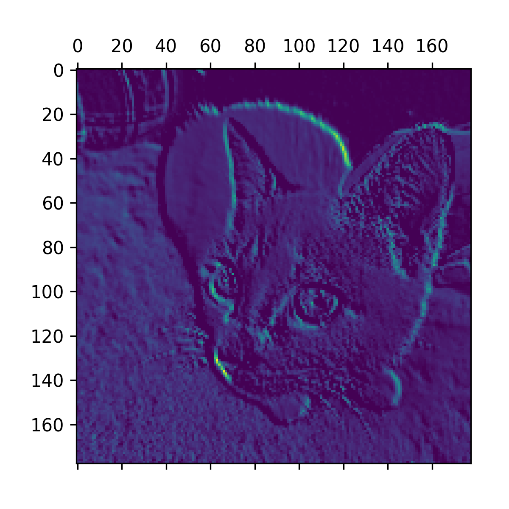
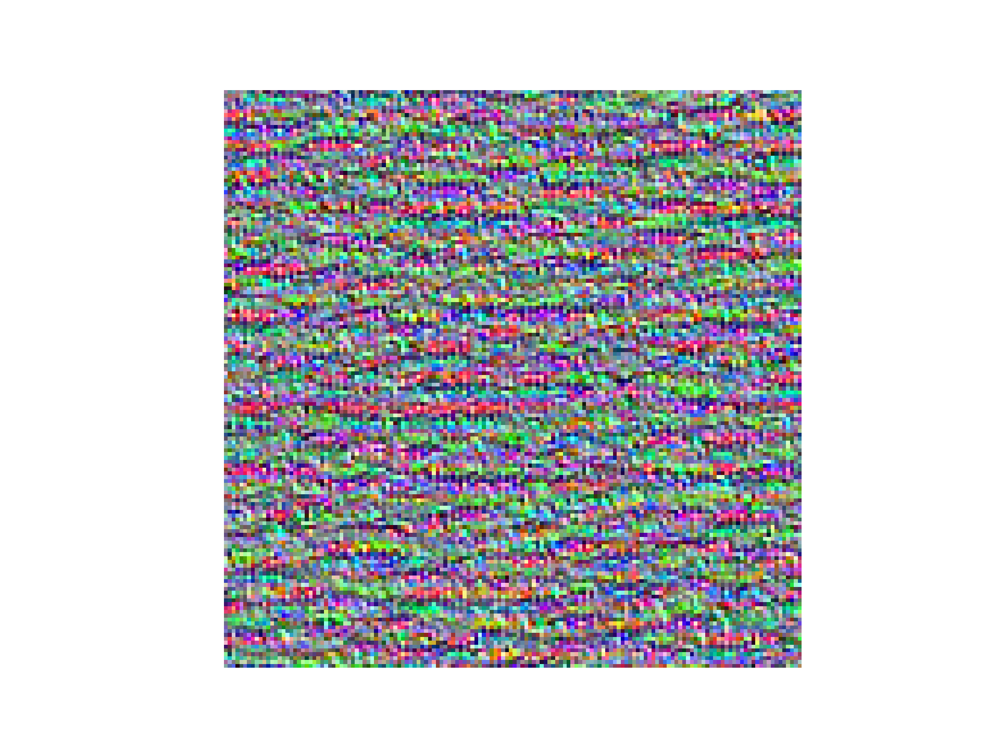
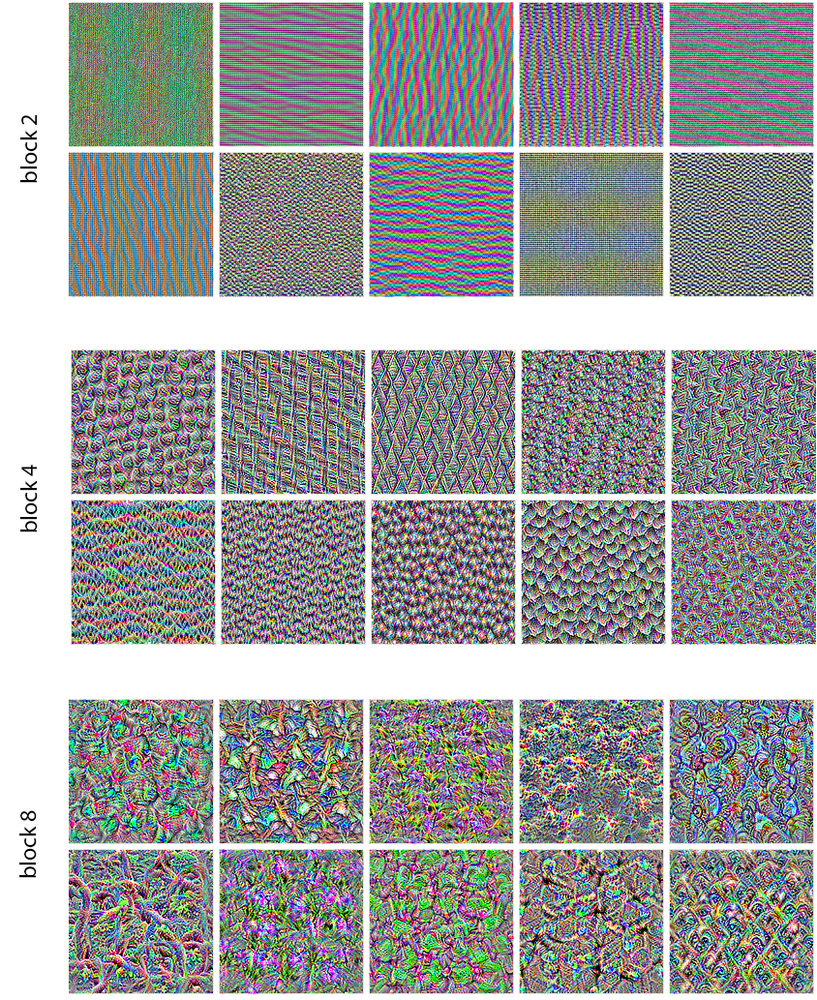
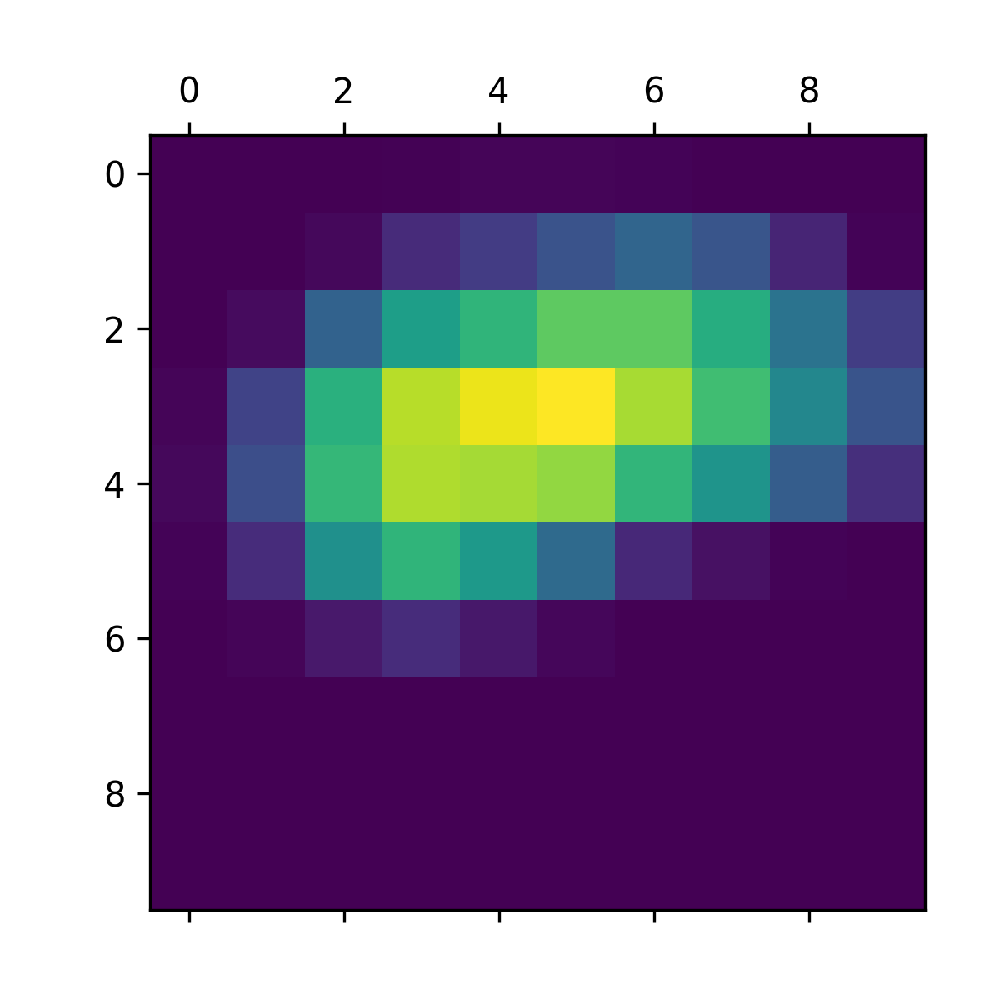

<!-- tabs:start -->

#### **Tiếng Anh (English)**

# Chapter 10: Interpreting what ConvNets learn

This chapter covers

* Interpreting how ConvNets decompose an input image
* Visualizing the filters learned by ConvNets
* Visualizing areas in an image responsible for a certain classification decision

A fundamental problem when building a computer vision
application is that of *interpretability*: *Why* did your classifier think
a particular image contained a fridge, when all you can see is a truck?
This is especially relevant to use cases where deep learning is used to complement
human expertise, such as medical imaging use cases.
This chapter will get you familiar with a range of different techniques for visualizing
what ConvNets learn and understanding the decisions they make.

It’s often said that deep learning models
are “black boxes”: they learn representations that are
difficult to extract and present in a human-readable form. Although this is
partially true for certain types of deep learning models, it’s definitely not
true for ConvNets. The representations learned by ConvNets are highly
amenable to visualization, in large part because they’re
*representations of visual concepts*. Since 2013, a wide array of techniques
has been developed for visualizing and interpreting these representations. We
won’t survey all of them, but we’ll cover three of the most accessible and
useful ones:

* *Visualizing intermediate ConvNet outputs (intermediate activations)* —
  Useful for understanding how successive ConvNet layers transform their input,
  and for getting a first idea of the meaning of individual ConvNet filters
* *Visualizing ConvNets filters* — Useful for understanding precisely what
  visual pattern or concept each filter in a ConvNet is receptive to
* *Visualizing heatmaps of class activation in an image* — Useful for
  understanding which parts of an image were identified as belonging to a given
  class, thus allowing you to localize objects in images

For the first method — activation visualization — you’ll use the small ConvNet that
you trained from scratch on the dogs-versus-cats classification problem in
chapter 8. For the next two methods, you’ll use a pretrained Xception model.

## Visualizing intermediate activations

Visualizing intermediate activations
consists of displaying the values returned by various convolution
and pooling layers in a model, given a certain input (the output of a layer
is often called its *activation*, the output of the activation
function). This gives a view into how an input is decomposed into the
different filters learned by the network. You want to visualize feature maps
with three dimensions: width, height, and depth (channels). Each channel
encodes relatively independent features, so the proper way to visualize these
feature maps is by independently plotting the contents of every channel as a
2D image. Let’s start by loading the model that you saved in section 8.2:

```python
>>> import keras
>>> model = keras.models.load_model(
...     "convnet_from_scratch_with_augmentation.keras"
... )
>>> model.summary()
Model: "functional_3"
┏━━━━━━━━━━━━━━━━━━━━━━━━━━━━━━━━━━━┳━━━━━━━━━━━━━━━━━━━━━━━━━━┳━━━━━━━━━━━━━━━┓
┃ Layer (type)                      ┃ Output Shape             ┃       Param # ┃
┡━━━━━━━━━━━━━━━━━━━━━━━━━━━━━━━━━━━╇━━━━━━━━━━━━━━━━━━━━━━━━━━╇━━━━━━━━━━━━━━━┩
│ input_layer_3 (InputLayer)        │ (None, 180, 180, 3)      │             0 │
├───────────────────────────────────┼──────────────────────────┼───────────────┤
│ rescaling_1 (Rescaling)           │ (None, 180, 180, 3)      │             0 │
├───────────────────────────────────┼──────────────────────────┼───────────────┤
│ conv2d_11 (Conv2D)                │ (None, 178, 178, 32)     │           896 │
├───────────────────────────────────┼──────────────────────────┼───────────────┤
│ max_pooling2d_6 (MaxPooling2D)    │ (None, 89, 89, 32)       │             0 │
├───────────────────────────────────┼──────────────────────────┼───────────────┤
│ conv2d_12 (Conv2D)                │ (None, 87, 87, 64)       │        18,496 │
├───────────────────────────────────┼──────────────────────────┼───────────────┤
│ max_pooling2d_7 (MaxPooling2D)    │ (None, 43, 43, 64)       │             0 │
├───────────────────────────────────┼──────────────────────────┼───────────────┤
│ conv2d_13 (Conv2D)                │ (None, 41, 41, 128)      │        73,856 │
├───────────────────────────────────┼──────────────────────────┼───────────────┤
│ max_pooling2d_8 (MaxPooling2D)    │ (None, 20, 20, 128)      │             0 │
├───────────────────────────────────┼──────────────────────────┼───────────────┤
│ conv2d_14 (Conv2D)                │ (None, 18, 18, 256)      │       295,168 │
├───────────────────────────────────┼──────────────────────────┼───────────────┤
│ max_pooling2d_9 (MaxPooling2D)    │ (None, 9, 9, 256)        │             0 │
├───────────────────────────────────┼──────────────────────────┼───────────────┤
│ conv2d_15 (Conv2D)                │ (None, 7, 7, 512)        │     1,180,160 │
├───────────────────────────────────┼──────────────────────────┼───────────────┤
│ global_average_pooling2d_3        │ (None, 512)              │             0 │
│ (GlobalAveragePooling2D)          │                          │               │
├───────────────────────────────────┼──────────────────────────┼───────────────┤
│ dropout (Dropout)                 │ (None, 512)              │             0 │
├───────────────────────────────────┼──────────────────────────┼───────────────┤
│ dense_3 (Dense)                   │ (None, 1)                │           513 │
└───────────────────────────────────┴──────────────────────────┴───────────────┘
 Total params: 4,707,269 (17.96 MB)
 Trainable params: 1,569,089 (5.99 MB)
 Non-trainable params: 0 (0.00 B)
 Optimizer params: 3,138,180 (11.97 MB)
```

Next, you’ll get an input image — a picture of a cat, not part of the images the
network was trained on.

```python
import keras
import numpy as np

# Downloads a test image
img_path = keras.utils.get_file(
    fname="cat.jpg", origin="https://img-datasets.s3.amazonaws.com/cat.jpg"
)

def get_img_array(img_path, target_size):
    # Opens the image file and resizes it
    img = keras.utils.load_img(img_path, target_size=target_size)
    # Turns the image into a float32 NumPy array of shape (180, 180, 3)
    array = keras.utils.img_to_array(img)
    # We add a dimension to transform our array into a "batch" of a
    # single sample. Its shape is now (1, 180, 180, 3).
    array = np.expand_dims(array, axis=0)
    return array

img_tensor = get_img_array(img_path, target_size=(180, 180))
```

[Listing 10.1](#listing-10-1): Preprocessing a single image

Let’s display the picture (see figure 10.1).

```python
import matplotlib.pyplot as plt

plt.axis("off")
plt.imshow(img_tensor[0].astype("uint8"))
plt.show()
```

[Listing 10.2](#listing-10-2): Displaying the test picture


[Figure 10.1](#figure-10-1): The test cat picture

To extract the feature maps you want to look at, you’ll create a Keras
model that takes batches of images as input and outputs the activations of
all convolution and pooling layers.

```python
from keras import layers

layer_outputs = []
layer_names = []
# Extracts the outputs of all Conv2D and MaxPooling2D layers and put
# them in a list
for layer in model.layers:
    if isinstance(layer, (layers.Conv2D, layers.MaxPooling2D)):
        layer_outputs.append(layer.output)
        # Saves the layer names for later
        layer_names.append(layer.name)
# Creates a model that will return these outputs, given the model input
activation_model = keras.Model(inputs=model.input, outputs=layer_outputs)
```

[Listing 10.3](#listing-10-3): Instantiating a model that returns layer activations

When fed an image input, this model returns the values of the layer activations
in the original model, as a list.
This is the first time you’ve encountered a
multi-output model in this book in practice since you learned about them in chapter 7:
until now, the models you’ve seen have had exactly one input and one output.
This one has one input and nine outputs — one output per layer activation.

```python
# Returns a list of nine NumPy arrays — one array per layer activation
activations = activation_model.predict(img_tensor)
```

[Listing 10.4](#listing-10-4): Using the model to compute layer activations

For instance, this is the activation of the first convolution layer for the cat
image input:

```python
>>> first_layer_activation = activations[0]
>>> print(first_layer_activation.shape)
(1, 178, 178, 32)
```

It’s a 178 × 178 feature map with 32 channels. Let’s try plotting the sixth
channel of the activation of the first layer of the original model (see figure
10.2).

```python
import matplotlib.pyplot as plt

plt.matshow(first_layer_activation[0, :, :, 5], cmap="viridis")
```

[Listing 10.5](#listing-10-5): Visualizing the sixth channel





[Figure 10.2](#figure-10-2): Sixth channel of the activation of the first layer on the test cat picture

This channel appears to encode a diagonal edge detector,
but note that your own channels may vary because
the specific filters learned by convolution layers aren’t deterministic.

Now let’s plot a complete visualization of all the activations in
the network (see figure 10.3). We’ll extract and plot every channel in each
of the layer activations, and we’ll stack the results in one big grid,
with channels stacked side by side.

```python
images_per_row = 16
# Iterates over the activations (and the names of the corresponding
# layers)
for layer_name, layer_activation in zip(layer_names, activations):
    # The layer activation has shape (1, size, size, n_features).
    n_features = layer_activation.shape[-1]
    size = layer_activation.shape[1]
    n_cols = n_features // images_per_row
    # Prepares an empty grid for displaying all the channels in this
    # activation
    display_grid = np.zeros(
        ((size + 1) * n_cols - 1, images_per_row * (size + 1) - 1)
    )
    for col in range(n_cols):
        for row in range(images_per_row):
            channel_index = col * images_per_row + row
            # This is a single channel (or feature).
            channel_image = layer_activation[0, :, :, channel_index].copy()
            # Normalizes channel values within the [0, 255] range.
            # All-zero channels are kept at zero.
            if channel_image.sum() != 0:
                channel_image -= channel_image.mean()
                channel_image /= channel_image.std()
                channel_image *= 64
                channel_image += 128
            channel_image = np.clip(channel_image, 0, 255).astype("uint8")
            # Places the channel matrix in the empty grid we prepared
            display_grid[
                col * (size + 1) : (col + 1) * size + col,
                row * (size + 1) : (row + 1) * size + row,
            ] = channel_image
    # Displays the grid for the layer
    scale = 1.0 / size
    plt.figure(
        figsize=(scale * display_grid.shape[1], scale * display_grid.shape[0])
    )
    plt.title(layer_name)
    plt.grid(False)
    plt.axis("off")
    plt.imshow(display_grid, aspect="auto", cmap="viridis")
```

[Listing 10.6](#listing-10-6): Visualizing every channel in every intermediate activation


[Figure 10.3](#figure-10-3): Every channel of every layer activation on the test cat picture

There are a few things to note here:

* The first layer acts as a collection of various edge detectors. At that
  stage, the activations retain almost all of the information present in the
  initial picture.
* As you go higher, the activations become increasingly abstract and less
  visually interpretable. They begin to encode higher-level concepts such as
  “cat ear” and “cat eye.” Higher representations carry increasingly less
  information about the visual contents of the image and increasingly more
  information related to the class of the image.
* The sparsity of the activations increases with the depth of the layer: in the
  first layer, all filters are activated by the input image, but in the
  following layers, more and more filters are blank. This means the pattern
  encoded by the filter isn’t found in the input image.

We have just observed an important universal characteristic of the
representations learned by deep neural networks: the features extracted by a
layer become increasingly abstract with the depth of the layer. The
activations of higher layers carry less and less information about the
specific input being seen and more and more information about the target (in
this case, the class of the image: cat or dog). A deep neural network
effectively acts as an *information distillation pipeline*,
with raw data going in (in this case, RGB pictures)
and being repeatedly transformed so that irrelevant information is filtered
out (for example, the specific visual appearance of the image) and useful
information is magnified and refined (for example, the class of the image).

This is analogous to the way humans and animals perceive the world: after
observing a scene for a few seconds, a human can remember which abstract
objects were present in it (bicycle, tree) but can’t remember the specific
appearance of these objects. In fact, if you tried to draw a generic bicycle
from memory, chances are you couldn’t get it even remotely right, even though
you’ve seen thousands of bicycles in your lifetime (see, for example, figure
10.4). Try it right now: this effect is absolutely real. Your brain has learned
to completely abstract its visual input — to transform it into high-level visual
concepts while filtering out irrelevant visual details — making it tremendously
difficult to remember how things around you look.


[Figure 10.4](#figure-10-4): Left: Attempts to draw a bicycle from memory. Right: What a schematic bicycle should look like.

## Visualizing ConvNet filters

Another easy way to inspect the filters
learned by ConvNets is to display the visual pattern that each filter is meant
to respond to. This can be done with *gradient ascent in input space*,
applying *gradient descent* to the value of the input image of a
ConvNet so as to *maximize* the response of a specific filter, starting from a
blank input image. The resulting input image will be one that the chosen
filter is maximally responsive to.

Let’s try this with the filters of the Xception model. The process is simple:
we’ll build a loss function that maximizes the value of a given filter in a
given convolution layer, and then we’ll use stochastic gradient descent to
adjust the values of the input image so as to maximize this activation value.
This will be your second example of a low-level gradient descent loop (the first
one was in chapter 2). We will show it for TensorFlow, PyTorch, and Jax.

First, let’s instantiate the Xception model trained on the ImageNet dataset.
We can once again use the KerasHub library, exactly as we did in chapter 8.

```python
import keras_hub

# Instantiates the feature extractor network from pretrained weights
model = keras_hub.models.Backbone.from_preset(
    "xception_41_imagenet",
)
# Loads the matching preprocessing to scale our input images
preprocessor = keras_hub.layers.ImageConverter.from_preset(
    "xception_41_imagenet",
    image_size=(180, 180),
)
```

[Listing 10.7](#listing-10-7): Instantiating the Xception convolutional base

We’re interested in the convolutional layers of the model — the `Conv2D`
and `SeparableConv2D` layers. We’ll need to know their names so we can
retrieve their outputs. Let’s print their names, in order of depth.

```python
for layer in model.layers:
    if isinstance(layer, (keras.layers.Conv2D, keras.layers.SeparableConv2D)):
        print(layer.name)
```

[Listing 10.8](#listing-10-8): Printing the names of all convolutional layers in Xception

You’ll notice that the `SeparableConv2D` layers here are all named something like
`block6_sepconv1`, `block7_sepconv2`, etc. — Xception is structured into blocks,
each containing several convolutional layers.

Now let’s create a second model that returns the output of a specific layer
— a “feature extractor” model.
Because our model is a Functional API model,
it is inspectable: you can query the `output` of one of its layers and reuse
it in a new model. No need to copy the entire Xception code.

```python
# You could replace this with the name of any layer in the Xception
# convolutional base.
layer_name = "block3_sepconv1"
# This is the layer object we're interested in.
layer = model.get_layer(name=layer_name)
# We use model.input and layer.output to create a model that, given an
# input image, returns the output of our target layer.
feature_extractor = keras.Model(inputs=model.input, outputs=layer.output)
```

[Listing 10.9](#listing-10-9): A feature extractor model returning a specific output

To use this model, we can simply call it on some input data, but we should be
careful to apply our model-specific image preprocessing so that our images
are scaled to the same range as the Xception pretraining data.

```python
activation = feature_extractor(preprocessor(img_tensor))
```

[Listing 10.10](#listing-10-10): Using the feature extractor

Let’s use our feature extractor model to define a function that returns a
scalar value quantifying how much a given input image “activates” a given
filter in the layer. This is the loss function that we’ll maximize
during the gradient ascent process:

```python
from keras import ops

# The loss function takes an image tensor and the index of the filter
# we consider (an integer).
def compute_loss(image, filter_index):
    activation = feature_extractor(image)
    # We avoid border artifacts by only involving nonborder pixels in
    # the loss: we discard the first 2 pixels along the sides of the
    # activation.
    filter_activation = activation[:, 2:-2, 2:-2, filter_index]
    # Returns the mean of the activation values for the filter
    return ops.mean(filter_activation)
```


The difference between `model.predict(x)` and `model(x)`

In the previous chapter, we used `predict(x)` for feature extraction.
Here, we’re using `model(x)`. What gives?

Both `y = model.predict(x)` and `y = model(x)` (where `x` is an array of input data)
mean “run the model on `x` and retrieve the output `y`.” Yet, they aren’t exactly
the same thing.

`predict()` loops over the data in batches
(in fact, you can specify the batch size via `predict(x, batch_size=64)`)
and extracts the NumPy value of the outputs. It’s schematically equivalent to

```python
def predict(x):
    y_batches = []
    for x_batch in get_batches(x):
        y_batch = model(x).numpy()
        y_batches.append(y_batch)
    return np.concatenate(y_batches)
```

This means that `predict()` calls can scale to very large arrays. Meanwhile,
`model(x)` happens in-memory and doesn’t scale.
On the other hand, `predict()` is not differentiable: TensorFlow, PyTorch,
and JAX cannot backpropagate through it.

You should use `model(x)` when you need to retrieve the gradients of the model call.
And you should use `predict()` if you just need the output value. In other words,
always use `predict()`, unless you’re in the middle of writing a low-level gradient
descent loop (as we are now).

A non-obvious trick to help the gradient-ascent process go smoothly is
to normalize the gradient tensor by dividing it by its L2 norm (the square
root of the sum of the squares of the values in the tensor). This ensures
that the magnitude of the updates done to the input image is always within the
same range.

Let’s set up the gradient ascent step function. Anything that involves
gradients requires calling backend-level APIs, such as `GradientTape` in TensorFlow,
`.backward()` in PyTorch, and `jax.grad()` in JAX. Let’s line up all the code snippets for
each of the three backends, starting with TensorFlow.

### Gradient ascent in TensorFlow

For TensorFlow, we can just open a `GradientTape` scope and compute the loss
inside of it to retrieve the gradients we need. We’ll use a `@tf.function`
decorator to speed up computation:

```python
import tensorflow as tf

@tf.function
def gradient_ascent_step(image, filter_index, learning_rate):
    with tf.GradientTape() as tape:
        # Explicitly watches the image tensor, since it isn't a
        # TensorFlow Variable (only Variables are automatically watched
        # in a gradient tape)
        tape.watch(image)
        # Computes the loss scalar, indicating how much the current
        # image activates the filter
        loss = compute_loss(image, filter_index)
    # Computes the gradients of the loss with respect to the image
    grads = tape.gradient(loss, image)
    # Applies the "gradient normalization trick"
    grads = ops.normalize(grads)
    # Moves the image a little bit in a direction that activates our
    # target filter more strongly
    image += learning_rate * grads
    # Returns the updated image, so we can run the step function in a
    # loop
    return image
```

[Listing 10.11](#listing-10-11): Loss maximization via stochastic gradient ascent: TensorFlow

### Gradient ascent in PyTorch

In the case of PyTorch, we use `loss.backward()` and `image.grad` to obtain
the gradients of the loss with respect to the input image, like this.

```python
import torch

def gradient_ascent_step(image, filter_index, learning_rate):
    # Creates a copy of "image" that we can get gradients for.
    image = image.clone().detach().requires_grad_(True)
    loss = compute_loss(image, filter_index)
    loss.backward()
    grads = image.grad
    grads = ops.normalize(grads)
    image = image + learning_rate * grads
    return image
```

[Listing 10.12](#listing-10-12): Loss maximization via stochastic gradient ascent: PyTorch

No need to reset the gradients since the image tensor is recreated at each iteration.

### Gradient ascent in JAX

In the case of JAX, we use `jax.grad()` to obtain a function that returns the
gradients of the loss with respect to the input image.

```python
import jax

grad_fn = jax.grad(compute_loss)

@jax.jit
def gradient_ascent_step(image, filter_index, learning_rate):
    grads = grad_fn(image, filter_index)
    grads = ops.normalize(grads)
    image += learning_rate * grads
    return image
```

[Listing 10.13](#listing-10-13): Loss maximization via stochastic gradient ascent: JAX

### The filter visualization loop

Now you have all the pieces. Let’s put them together into a Python function
that takes a filter index as input and returns a
tensor representing the pattern that maximizes the activation of the specified
filter in our target layer.

```python
img_width = 200
img_height = 200

def generate_filter_pattern(filter_index):
    # The number of gradient ascent steps to apply
    iterations = 30
    # The amplitude of a single step
    learning_rate = 10.0
    image = keras.random.uniform(
        # Initialize an image tensor with random values. (The Xception
        # model expects input values in the [0, 1] range, so here we
        # pick a range centered on 0.5.)
        minval=0.4, maxval=0.6, shape=(1, img_width, img_height, 3)
    )
    # Repeatedly updates the values of the image tensor to maximize our
    # loss function
    for i in range(iterations):
        image = gradient_ascent_step(image, filter_index, learning_rate)
    return image[0]
```

[Listing 10.14](#listing-10-14): Function to generate filter visualizations

The resulting image tensor is a floating-point array of shape `(200, 200,
3)`, with values that may not be integers within `[0, 255]`. Hence, you need to
post-process this tensor to turn it into a displayable image. You do so with
the following straightforward utility function.

```python
def deprocess_image(image):
    # Normalizes image values within the [0, 255] range
    image -= ops.mean(image)
    image /= ops.std(image)
    image *= 64
    image += 128
    image = ops.clip(image, 0, 255)
    # Center crop to avoid border artifacts
    image = image[25:-25, 25:-25, :]
    image = ops.cast(image, dtype="uint8")
    return ops.convert_to_numpy(image)
```

[Listing 10.15](#listing-10-15): Utility function to convert a tensor into a valid image

Let’s try it (see figure 10.5):

```python
>>> plt.axis("off")
>>> plt.imshow(deprocess_image(generate_filter_pattern(filter_index=2)))
```





[Figure 10.5](#figure-10-5): Pattern that the second channel in layer `block3_sepconv1` responds to maximally

It seems that filter 2 in layer `block3_sepconv1` is responsive to a horizontal
lines pattern, somewhat water-like or fur-like.

Now the fun part: you can start visualizing every filter in the layer —
and even every filter in every layer in the model (see figure 10.6).

```python
# Generates and saves visualizations for the first 64 filters in the
# layer
all_images = []
for filter_index in range(64):
    print(f"Processing filter {filter_index}")
    image = deprocess_image(generate_filter_pattern(filter_index))
    all_images.append(image)

# Prepares a blank canvas for us to paste filter visualizations
margin = 5
n = 8
box_width = img_width - 25 * 2
box_height = img_height - 25 * 2
full_width = n * box_width + (n - 1) * margin
full_height = n * box_height + (n - 1) * margin
stitched_filters = np.zeros((full_width, full_height, 3))

# Fills the picture with our saved filters
for i in range(n):
    for j in range(n):
        image = all_images[i * n + j]
        stitched_filters[
            (box_width + margin) * i : (box_width + margin) * i + box_width,
            (box_height + margin) * j : (box_height + margin) * j + box_height,
            :,
        ] = image

# Saves the canvas to disk
keras.utils.save_img(f"filters_for_layer_{layer_name}.png", stitched_filters)
```

[Listing 10.16](#listing-10-16): Generating a grid of all filter response patterns





[Figure 10.6](#figure-10-6): Some filter patterns for layers `block2_sepconv1`, `block4_sepconv1`, and `block8_sepconv1`

These filter visualizations tell you a lot about how
ConvNet layers see the world: each layer in a ConvNet learns a collection of
filters such that their inputs can be expressed as a combination of the
filters. This is similar to how the Fourier transform decomposes signals onto
a bank of cosine functions. The filters in these ConvNet filter banks get
increasingly complex and refined as you go higher in the model:

* The filters from the first layers in the model encode simple
  directional edges and colors (or colored edges, in some cases).
* The filters from layers a bit further up the stack, such as `block4_sepconv1`,
  encode simple textures made from combinations of edges and colors.
* The filters in higher layers begin to resemble textures found in natural
  images: feathers, eyes, leaves, and so on.

## Visualizing heatmaps of class activation

Here’s one last visualization technique —
one that is useful for understanding which parts of a
given image led a ConvNet to its final classification decision. This is
helpful for “debugging” the decision process of a ConvNet, particularly in the
case of a classification mistake (a problem domain called *model interpretability*).
It can also allow you to locate specific objects in an image.

This general category of techniques is called *class activation map* (CAM)
visualization, and it consists of producing
heatmaps of class activation over input images. A class activation heatmap is
a 2D grid of scores associated with a specific output class, computed for
every location in any input image, indicating how important each location is
with respect to the class under consideration. For instance, given an image
fed into a dogs-versus-cats ConvNet, CAM visualization would allow you to generate
a heatmap for the class “cat,” indicating how cat-like different parts of the
image are, and also a heatmap for the class “dog,” indicating how dog-like
parts of the image are.
The specific implementation we’ll use is the one described in Selvaraju et al.[[1]](#footnote-1)

Grad-CAM consists of taking
the output feature map of a convolution layer, given an input image, and
weighting every channel in that feature map by the gradient of the class with
respect to the channel. Intuitively, one way to understand this trick is that
you’re weighting a spatial map of “how intensely the input image activates
different channels” by “how important each channel is with regard to the
class,” resulting in a spatial map of “how intensely the input image activates
the class.”

Let’s demonstrate this technique using the pretrained Xception model. Consider
the image of two African elephants shown in figure 10.7, possibly a mother and
her calf, strolling in the savanna. We can start by downloading this image and converting it to a NumPy array, as shown in figure 10.7.


[Figure 10.7](#figure-10-7): Test picture of African elephants


```python
# Downloads the image and stores it locally under the path img_path
img_path = keras.utils.get_file(
    fname="elephant.jpg",
    origin="https://img-datasets.s3.amazonaws.com/elephant.jpg",
)
# Returns a Python Imaging Library (PIL) image
img = keras.utils.load_img(img_path)
img_array = np.expand_dims(img, axis=0)
```

[Listing 10.17](#listing-10-17): Preprocessing an input image for Xception

So far, we have only used KerasHub to instantiate a pretrained feature extractor
network using the backbone class. For Grad-CAM, we need the entire
Xception model including the classification head — recall that Xception was
trained on the ImageNet dataset with ~1 million labeled images belonging to
1,000 different classes.

KerasHub provides a high-level *task* API for common end-to-end workflows like
image classification, text classification, image generation, and so on. A task
wraps preprocessing, a feature extraction network, and a task-specific head into
a single class that is easy to use. Let’s try it out:

```python
>>> model = keras_hub.models.ImageClassifier.from_preset(
...    "xception_41_imagenet",
...    # We can configure the final activation of the classifier. Here,
...    # we use a softmax activation so our outputs are probabilities.
...    activation="softmax",
... )
>>> preds = model.predict(img_array)
>>> # ImageNet has 1,000 classes, so each prediction from our
>>> # classifier has 1,000 entries.
>>> preds.shape
(1, 1000)
>>> keras_hub.utils.decode_imagenet_predictions(preds)
[[("African_elephant", 0.90331),
  ("tusker", 0.05487),
  ("Indian_elephant", 0.01637),
  ("triceratops", 0.00029),
  ("Mexican_hairless", 0.00018)]]
```

The top five classes predicted for this image are as follows:

* African elephant (with 90% probability)
* Tusker (with 5% probability)
* Indian elephant (with 2% probability)
* Triceratops and Mexican hairless dog with less than 0.1% probability

The network has recognized the image as containing an undetermined quantity of
African elephants. The entry in the prediction vector that was maximally
activated is the one corresponding to the “African elephant” class, at index
386:

```python
>>> np.argmax(preds[0])
386
```

To visualize which parts of the image are the most African elephant–like, let’s
set up the Grad-CAM process.

You will note that we didn’t need to preprocess our image before calling the
task model. That’s because the KerasHub `ImageClassifier` is preprocessing inputs
for us as part of `predict()`. Let’s preprocess the image ourselves so
we can use the preprocessed inputs directly:

```python
# KerasHub tasks like ImageClassifier have a preprocessor layer.
img_array = model.preprocessor(img_array)
```

First, we create a model that maps the input image to the activations
of the last convolutional layer.

```python
last_conv_layer_name = "block14_sepconv2_act"
last_conv_layer = model.backbone.get_layer(last_conv_layer_name)
last_conv_layer_model = keras.Model(model.inputs, last_conv_layer.output)
```

[Listing 10.18](#listing-10-18): Returning the last convolutional output

Second, we create a model that maps the activations of the last convolutional
layer to the final class predictions.

```python
classifier_input = last_conv_layer.output
x = classifier_input
for layer_name in ["pooler", "predictions"]:
    x = model.get_layer(layer_name)(x)
classifier_model = keras.Model(classifier_input, x)
```

[Listing 10.19](#listing-10-19): Going from the last convolutional output to final predictions

Then, we compute the gradient of the top predicted class for our input image
with respect to the activations of the last convolution layer.
Once again, having to compute gradients means we have to use backend APIs.

### Getting the gradient of the top class: TensorFlow version

Let’s start with the TensorFlow version, once again using `GradientTape`.

```python
import tensorflow as tf

def get_top_class_gradients(img_array):
    # Computes activations of the last conv layer and makes the tape
    # watch it
    last_conv_layer_output = last_conv_layer_model(img_array)
    with tf.GradientTape() as tape:
        tape.watch(last_conv_layer_output)
        preds = classifier_model(last_conv_layer_output)
        top_pred_index = ops.argmax(preds[0])
        # Retrieves the activation channel corresponding to the top
        # predicted class
        top_class_channel = preds[:, top_pred_index]

    # Gets the gradient of the top predicted class with regard to the
    # output feature map of the last convolutional layer
    grads = tape.gradient(top_class_channel, last_conv_layer_output)
    return grads, last_conv_layer_output

grads, last_conv_layer_output = get_top_class_gradients(img_array)
grads = ops.convert_to_numpy(grads)
last_conv_layer_output = ops.convert_to_numpy(last_conv_layer_output)
```

[Listing 10.20](#listing-10-20): Computing the top class gradients with TensorFlow

### Getting the gradient of the top class: PyTorch version

Next, here’s the PyTorch version, using `.backward()` and `.grad`.

```python
def get_top_class_gradients(img_array):
    # Computes activations of the last conv layer
    last_conv_layer_output = last_conv_layer_model(img_array)
    # Creates a copy of last_conv_layer_output that we can get
    # gradients for
    last_conv_layer_output = (
        last_conv_layer_output.clone().detach().requires_grad_(True)
    )
    # Retrieves the activation channel corresponding to the top
    # predicted class
    preds = classifier_model(last_conv_layer_output)
    top_pred_index = ops.argmax(preds[0])
    top_class_channel = preds[:, top_pred_index]
    # Gets the gradient of the top predicted class with regard to the
    # output feature map of the last convolutional layer
    top_class_channel.backward()
    grads = last_conv_layer_output.grad
    return grads, last_conv_layer_output

grads, last_conv_layer_output = get_top_class_gradients(img_array)
grads = ops.convert_to_numpy(grads)
last_conv_layer_output = ops.convert_to_numpy(last_conv_layer_output)
```

[Listing 10.21](#listing-10-21): Computing the top class gradients with PyTorch

### Getting the gradient of the top class: JAX version

Finally, let’s do JAX. We define a separate loss computation function
that takes the final layer’s output and returns the activation channel corresponding
to the top predicted class. We use this activation value as our loss,
allowing us to compute the gradient.

```python
import jax

# Defines a separate loss function
def loss_fn(last_conv_layer_output):
    preds = classifier_model(last_conv_layer_output)
    top_pred_index = ops.argmax(preds[0])
    top_class_channel = preds[:, top_pred_index]
    # Returns the activation value of the top-class channel
    return top_class_channel[0]

# Creates a gradient function
grad_fn = jax.grad(loss_fn)

def get_top_class_gradients(img_array):
    last_conv_layer_output = last_conv_layer_model(img_array)
    # Now  retrieving the gradient of the top-class channel is just a
    # matter of calling the gradient function!
    grads = grad_fn(last_conv_layer_output)
    return grads, last_conv_layer_output

grads, last_conv_layer_output = get_top_class_gradients(img_array)
grads = ops.convert_to_numpy(grads)
last_conv_layer_output = ops.convert_to_numpy(last_conv_layer_output)
```

[Listing 10.22](#listing-10-22): Computing the top class gradients with Jax

### Displaying the class activation heatmap

Now, we apply pooling and importance weighting to the gradient tensor
to obtain our heatmap of class activation.

```python
# This is a vector where each entry is the mean intensity of the
# gradient for a given channel. It quantifies the importance of each
# channel with regard to the top predicted class.
pooled_grads = np.mean(grads, axis=(0, 1, 2))
last_conv_layer_output = last_conv_layer_output[0].copy()
# Multiplies each channel in the output of the last convolutional layer
# by how important this channel is
for i in range(pooled_grads.shape[-1]):
    last_conv_layer_output[:, :, i] *= pooled_grads[i]
# The channel-wise mean of the resulting feature map is our heatmap of
# class activation.
heatmap = np.mean(last_conv_layer_output, axis=-1)
```

[Listing 10.23](#listing-10-23): Gradient pooling and channel importance weighting

For visualization purposes, you’ll also normalize the heatmap between 0 and 1.
The result is shown in figure 10.8.

```python
heatmap = np.maximum(heatmap, 0)
heatmap /= np.max(heatmap)
plt.matshow(heatmap)
```

[Listing 10.24](#listing-10-24): Heatmap post-processing





[Figure 10.8](#figure-10-8): Standalone class activation heatmap

Finally, let’s generate an image that superimposes the original
image on the heatmap you just obtained (see figure 10.9).

```python
import matplotlib.cm as cm

# Loads the original image
img = keras.utils.load_img(img_path)
img = keras.utils.img_to_array(img)

# Rescales the heatmap to the range 0–255
heatmap = np.uint8(255 * heatmap)

# Uses the "jet" colormap to recolorize the heatmap
jet = cm.get_cmap("jet")
jet_colors = jet(np.arange(256))[:, :3]
jet_heatmap = jet_colors[heatmap]

# Creates an image that contains the recolorized heatmap
jet_heatmap = keras.utils.array_to_img(jet_heatmap)
jet_heatmap = jet_heatmap.resize((img.shape[1], img.shape[0]))
jet_heatmap = keras.utils.img_to_array(jet_heatmap)

# Superimposes the heatmap and the original image, with the heatmap at
# 40% opacity
superimposed_img = jet_heatmap * 0.4 + img
superimposed_img = keras.utils.array_to_img(superimposed_img)

# Shows the superimposed image
plt.imshow(superimposed_img)
```

[Listing 10.25](#listing-10-25): Superimposing the heatmap with the original picture


[Figure 10.9](#figure-10-9): African elephant class activation heatmap over the test picture

This visualization technique answers two important questions:

* Why did the network think this image contained an African elephant?
* Where is the African elephant located in the picture?

In particular, it’s interesting to note that the ears of the elephant calf are
strongly activated: this is probably how the network can tell the difference
between African and Indian elephants.

## Summary

* ConvNets process images by applying a set of learned filters. Filters from earlier layers detect edges and basic textures, while filters from later layers detect increasingly abstract concepts.
* You can visualize both the pattern that a filter detects and a filter’s response map across an image.
* You can use the Grad-CAM technique to visualize what area(s) in an image were responsible for a classifier’s decision.
* Together, these techniques make ConvNets highly interpretable.

#### **Tiếng Việt (Vietnamese)**

# Chương 10: Diễn giải những gì ConvNet học được

Chương này bao gồm

* Giải thích cách ConvNet phân tách hình ảnh đầu vào
* Trực quan hóa các bộ lọc mà ConvNets đã học
* Trực quan hóa các khu vực trong hình ảnh chịu trách nhiệm cho một quyết định phân loại nhất định

Vấn đề cơ bản khi xây dựng ứng dụng thị giác máy tính là *khả năng diễn giải*: *Tại sao* bộ phân loại của bạn nghĩ rằng một hình ảnh cụ thể chứa một chiếc tủ lạnh, trong khi tất cả những gì bạn có thể thấy là một chiếc xe tải? Điều này đặc biệt phù hợp với các trường hợp sử dụng học sâu để bổ sung kiến ​​thức chuyên môn của con người, chẳng hạn như các trường hợp sử dụng hình ảnh y tế. Chương này sẽ giúp bạn làm quen với một loạt các kỹ thuật khác nhau để hình dung những gì ConvNet học và hiểu các quyết định mà chúng đưa ra.

Người ta thường nói rằng các mô hình học sâu là “hộp đen”: chúng học các cách biểu diễn khó trích xuất và trình bày ở dạng con người có thể đọc được. Mặc dù điều này đúng một phần với một số loại mô hình học sâu nhất định, nhưng nó chắc chắn không đúng với ConvNets. Các cách trình bày mà ConvNets học được có khả năng trực quan hóa cao, phần lớn vì chúng là *các cách trình bày của các khái niệm trực quan*. Kể từ năm 2013, một loạt các kỹ thuật đã được phát triển để trực quan hóa và diễn giải các cách biểu diễn này. Chúng tôi sẽ không khảo sát tất cả chúng, nhưng chúng tôi sẽ đề cập đến ba trong số những thứ hữu ích và dễ tiếp cận nhất:

* *Hình dung các đầu ra ConvNet trung gian (kích hoạt trung gian)* —
Hữu ích để hiểu cách các lớp ConvNet kế tiếp biến đổi đầu vào của chúng,
và để có được ý tưởng đầu tiên về ý nghĩa của các bộ lọc ConvNet riêng lẻ
* *Trực quan hóa các bộ lọc ConvNets* — Hữu ích để hiểu chính xác những gì
mẫu hoặc khái niệm trực quan mà mỗi bộ lọc trong ConvNet đều có thể tiếp thu được
* *Hiển thị bản đồ nhiệt kích hoạt lớp trong hình ảnh* — Hữu ích cho
hiểu phần nào của hình ảnh được xác định là thuộc về một hình ảnh nhất định
lớp, do đó cho phép bạn bản địa hóa các đối tượng trong hình ảnh

Đối với phương pháp đầu tiên — trực quan hóa kích hoạt — bạn sẽ sử dụng ConvNet nhỏ mà bạn đã đào tạo từ đầu về vấn đề phân loại chó và mèo trong chương 8. Đối với hai phương pháp tiếp theo, bạn sẽ sử dụng mô hình Xception đã được huấn luyện trước.

## Trực quan hóa kích hoạt trung gian

Trực quan hóa các kích hoạt trung gian bao gồm hiển thị các giá trị được trả về bởi các lớp tích chập và gộp khác nhau trong một mô hình, với một đầu vào nhất định (đầu ra của một lớp thường được gọi là *kích hoạt*, đầu ra của hàm kích hoạt). Điều này cung cấp cái nhìn về cách phân tách đầu vào thành các bộ lọc khác nhau mà mạng đã học được. Bạn muốn trực quan hóa bản đồ đặc điểm với ba chiều: chiều rộng, chiều cao và chiều sâu (kênh). Mỗi kênh mã hóa các đối tượng tương đối độc lập, do đó, cách thích hợp để trực quan hóa các bản đồ đối tượng này là vẽ đồ thị độc lập nội dung của mỗi kênh dưới dạng hình ảnh 2D. Hãy bắt đầu bằng cách tải mô hình mà bạn đã lưu trong phần 8.2:

```python
>>> import keras
>>> model = keras.models.load_model(
...     "convnet_from_scratch_with_augmentation.keras"
... )
>>> model.summary()
Model: "functional_3"
┏━━━━━━━━━━━━━━━━━━━━━━━━━━━━━━━━━━━┳━━━━━━━━━━━━━━━━━━━━━━━━━━┳━━━━━━━━━━━━━━━┓
┃ Layer (type)                      ┃ Output Shape             ┃       Param # ┃
┡━━━━━━━━━━━━━━━━━━━━━━━━━━━━━━━━━━━╇━━━━━━━━━━━━━━━━━━━━━━━━━━╇━━━━━━━━━━━━━━━┩
│ input_layer_3 (InputLayer)        │ (None, 180, 180, 3)      │             0 │
├───────────────────────────────────┼──────────────────────────┼───────────────┤
│ rescaling_1 (Rescaling)           │ (None, 180, 180, 3)      │             0 │
├───────────────────────────────────┼──────────────────────────┼───────────────┤
│ conv2d_11 (Conv2D)                │ (None, 178, 178, 32)     │           896 │
├───────────────────────────────────┼──────────────────────────┼───────────────┤
│ max_pooling2d_6 (MaxPooling2D)    │ (None, 89, 89, 32)       │             0 │
├───────────────────────────────────┼──────────────────────────┼───────────────┤
│ conv2d_12 (Conv2D)                │ (None, 87, 87, 64)       │        18,496 │
├───────────────────────────────────┼──────────────────────────┼───────────────┤
│ max_pooling2d_7 (MaxPooling2D)    │ (None, 43, 43, 64)       │             0 │
├───────────────────────────────────┼──────────────────────────┼───────────────┤
│ conv2d_13 (Conv2D)                │ (None, 41, 41, 128)      │        73,856 │
├───────────────────────────────────┼──────────────────────────┼───────────────┤
│ max_pooling2d_8 (MaxPooling2D)    │ (None, 20, 20, 128)      │             0 │
├───────────────────────────────────┼──────────────────────────┼───────────────┤
│ conv2d_14 (Conv2D)                │ (None, 18, 18, 256)      │       295,168 │
├───────────────────────────────────┼──────────────────────────┼───────────────┤
│ max_pooling2d_9 (MaxPooling2D)    │ (None, 9, 9, 256)        │             0 │
├───────────────────────────────────┼──────────────────────────┼───────────────┤
│ conv2d_15 (Conv2D)                │ (None, 7, 7, 512)        │     1,180,160 │
├───────────────────────────────────┼──────────────────────────┼───────────────┤
│ global_average_pooling2d_3        │ (None, 512)              │             0 │
│ (GlobalAveragePooling2D)          │                          │               │
├───────────────────────────────────┼──────────────────────────┼───────────────┤
│ dropout (Dropout)                 │ (None, 512)              │             0 │
├───────────────────────────────────┼──────────────────────────┼───────────────┤
│ dense_3 (Dense)                   │ (None, 1)                │           513 │
└───────────────────────────────────┴──────────────────────────┴───────────────┘
 Total params: 4,707,269 (17.96 MB)
 Trainable params: 1,569,089 (5.99 MB)
 Non-trainable params: 0 (0.00 B)
 Optimizer params: 3,138,180 (11.97 MB)
```

Tiếp theo, bạn sẽ nhận được hình ảnh đầu vào - hình ảnh của một con mèo, không phải một phần hình ảnh mà mạng đã được huấn luyện.

```python
import keras
import numpy as np

# Downloads a test image
img_path = keras.utils.get_file(
    fname="cat.jpg", origin="https://img-datasets.s3.amazonaws.com/cat.jpg"
)

def get_img_array(img_path, target_size):
    # Opens the image file and resizes it
    img = keras.utils.load_img(img_path, target_size=target_size)
    # Turns the image into a float32 NumPy array of shape (180, 180, 3)
    array = keras.utils.img_to_array(img)
    # We add a dimension to transform our array into a "batch" of a
    # single sample. Its shape is now (1, 180, 180, 3).
    array = np.expand_dims(array, axis=0)
    return array

img_tensor = get_img_array(img_path, target_size=(180, 180))
```

[Liệt kê 10.1](#listing-10-1): Xử lý trước một hình ảnh

Hãy hiển thị hình ảnh (xem hình 10.1).

```python
import matplotlib.pyplot as plt

plt.axis("off")
plt.imshow(img_tensor[0].astype("uint8"))
plt.show()
```

[Liệt kê 10.2](#listing-10-2): Hiển thị ảnh thử nghiệm


[Figure 10.1](#figure-10-1): The test cat picture

Để trích xuất các bản đồ tính năng mà bạn muốn xem, bạn sẽ tạo một mô hình Keras lấy hàng loạt hình ảnh làm đầu vào và đưa ra các kích hoạt của tất cả các lớp tích chập và gộp.

```python
from keras import layers

layer_outputs = []
layer_names = []
# Extracts the outputs of all Conv2D and MaxPooling2D layers and put
# them in a list
for layer in model.layers:
    if isinstance(layer, (layers.Conv2D, layers.MaxPooling2D)):
        layer_outputs.append(layer.output)
        # Saves the layer names for later
        layer_names.append(layer.name)
# Creates a model that will return these outputs, given the model input
activation_model = keras.Model(inputs=model.input, outputs=layer_outputs)
```

[Liệt kê 10.3](#listing-10-3): Khởi tạo một mô hình trả về các kích hoạt lớp

Khi được cung cấp đầu vào hình ảnh, mô hình này trả về các giá trị kích hoạt lớp trong mô hình ban đầu dưới dạng danh sách. Đây là lần đầu tiên bạn gặp một mô hình nhiều đầu ra trong cuốn sách này trong thực tế kể từ khi bạn tìm hiểu về chúng ở chương 7: cho đến nay, các mô hình bạn đã thấy đều có chính xác một đầu vào và một đầu ra. Cái này có một đầu vào và chín đầu ra - một đầu ra cho mỗi lớp kích hoạt.

```python
# Returns a list of nine NumPy arrays — one array per layer activation
activations = activation_model.predict(img_tensor)
```

[Danh sách 10.4](#listing-10-4): Sử dụng mô hình để tính toán kích hoạt lớp

Ví dụ: đây là lần kích hoạt lớp chập đầu tiên cho đầu vào hình ảnh con mèo:

```python
>>> first_layer_activation = activations[0]
>>> print(first_layer_activation.shape)
(1, 178, 178, 32)
```

Đó là bản đồ đặc trưng 178 × 178 với 32 kênh. Hãy thử vẽ đồ thị kênh thứ sáu của quá trình kích hoạt lớp đầu tiên của mô hình ban đầu (xem hình 10.2).

```python
import matplotlib.pyplot as plt

plt.matshow(first_layer_activation[0, :, :, 5], cmap="viridis")
```

[Danh sách 10.5](#listing-10-5): Trực quan hóa kênh thứ sáu


[Figure 10.2](#figure-10-2): Sixth channel of the activation of the first layer on the test cat picture

Kênh này dường như mã hóa bộ phát hiện cạnh chéo, nhưng lưu ý rằng các kênh của riêng bạn có thể thay đổi do các bộ lọc cụ thể mà lớp tích chập học được không mang tính quyết định.

Bây giờ hãy vẽ đồ thị trực quan hóa đầy đủ tất cả các kích hoạt trong mạng (xem hình 10.3). Chúng tôi sẽ trích xuất và vẽ sơ đồ mọi kênh trong mỗi lần kích hoạt lớp và chúng tôi sẽ xếp các kết quả vào một lưới lớn, với các kênh được xếp chồng lên nhau.

```python
images_per_row = 16
# Iterates over the activations (and the names of the corresponding
# layers)
for layer_name, layer_activation in zip(layer_names, activations):
    # The layer activation has shape (1, size, size, n_features).
    n_features = layer_activation.shape[-1]
    size = layer_activation.shape[1]
    n_cols = n_features // images_per_row
    # Prepares an empty grid for displaying all the channels in this
    # activation
    display_grid = np.zeros(
        ((size + 1) * n_cols - 1, images_per_row * (size + 1) - 1)
    )
    for col in range(n_cols):
        for row in range(images_per_row):
            channel_index = col * images_per_row + row
            # This is a single channel (or feature).
            channel_image = layer_activation[0, :, :, channel_index].copy()
            # Normalizes channel values within the [0, 255] range.
            # All-zero channels are kept at zero.
            if channel_image.sum() != 0:
                channel_image -= channel_image.mean()
                channel_image /= channel_image.std()
                channel_image *= 64
                channel_image += 128
            channel_image = np.clip(channel_image, 0, 255).astype("uint8")
            # Places the channel matrix in the empty grid we prepared
            display_grid[
                col * (size + 1) : (col + 1) * size + col,
                row * (size + 1) : (row + 1) * size + row,
            ] = channel_image
    # Displays the grid for the layer
    scale = 1.0 / size
    plt.figure(
        figsize=(scale * display_grid.shape[1], scale * display_grid.shape[0])
    )
    plt.title(layer_name)
    plt.grid(False)
    plt.axis("off")
    plt.imshow(display_grid, aspect="auto", cmap="viridis")
```

[Danh sách 10.6](#listing-10-6): Trực quan hóa mọi kênh trong mỗi lần kích hoạt trung gian


[Figure 10.3](#figure-10-3): Every channel of every layer activation on the test cat picture

Có một số điều cần lưu ý ở đây:

* Lớp đầu tiên hoạt động như một tập hợp các máy dò cạnh khác nhau. Lúc đó
giai đoạn này, các kích hoạt sẽ giữ lại gần như tất cả thông tin có trong
hình ảnh ban đầu.
* Khi bạn lên cao hơn, các kích hoạt ngày càng trở nên trừu tượng và ít hơn
có thể giải thích trực quan. Họ bắt đầu mã hóa các khái niệm cấp cao hơn như
“tai mèo” và “mắt mèo”. Các đại diện cao hơn ngày càng mang ít hơn
thông tin về nội dung trực quan của hình ảnh và ngày càng nhiều thông tin hơn
thông tin liên quan đến lớp của hình ảnh.
* Độ thưa thớt của các kích hoạt tăng theo độ sâu của lớp: trong
lớp đầu tiên, tất cả các bộ lọc được kích hoạt bởi hình ảnh đầu vào, nhưng ở lớp
các lớp tiếp theo, ngày càng có nhiều bộ lọc trống. Điều này có nghĩa là mẫu
không được tìm thấy bởi bộ lọc trong hình ảnh đầu vào.

Chúng ta vừa quan sát thấy một đặc điểm phổ quát quan trọng của các biểu diễn được học bởi mạng lưới thần kinh sâu: các đặc điểm được một lớp trích xuất ngày càng trở nên trừu tượng theo độ sâu của lớp. Việc kích hoạt các lớp cao hơn ngày càng mang ít thông tin hơn về đầu vào cụ thể được nhìn thấy và ngày càng có nhiều thông tin hơn về mục tiêu (trong trường hợp này là lớp của hình ảnh: mèo hoặc chó). Mạng lưới thần kinh sâu hoạt động hiệu quả như một *đường dẫn chắt lọc thông tin*, với dữ liệu thô đi vào (trong trường hợp này là hình ảnh RGB) và được chuyển đổi nhiều lần để lọc ra thông tin không liên quan (ví dụ: hình thức trực quan cụ thể của hình ảnh) và thông tin hữu ích được phóng to và tinh chỉnh (ví dụ: loại hình ảnh).

Điều này tương tự như cách con người và động vật nhận thức thế giới: sau khi quan sát một cảnh trong vài giây, con người có thể nhớ những vật thể trừu tượng nào hiện diện trong đó (xe đạp, cây cối) nhưng không thể nhớ hình dáng cụ thể của những vật thể này. Trên thực tế, nếu bạn cố gắng vẽ một chiếc xe đạp thông thường từ trí nhớ, rất có thể bạn không thể vẽ nó đúng dù chỉ một chút, mặc dù bạn đã nhìn thấy hàng nghìn chiếc xe đạp trong đời (ví dụ, hãy xem hình 10.4). Hãy thử ngay bây giờ: hiệu ứng này hoàn toàn có thật. Bộ não của bạn đã học cách trừu tượng hóa hoàn toàn thông tin đầu vào trực quan - biến nó thành các khái niệm hình ảnh cấp cao đồng thời lọc ra các chi tiết hình ảnh không liên quan - khiến việc nhớ mọi thứ xung quanh bạn trông như thế nào là vô cùng khó khăn.


[Figure 10.4](#figure-10-4): Left: Attempts to draw a bicycle from memory. Right: What a schematic bicycle should look like.

## Trực quan hóa bộ lọc ConvNet

Một cách dễ dàng khác để kiểm tra các bộ lọc mà ConvNets đã học là hiển thị mẫu trực quan mà mỗi bộ lọc nhằm đáp ứng. Điều này có thể được thực hiện bằng *tăng dần độ dốc trong không gian đầu vào*, áp dụng *giảm dần độ dốc* cho giá trị của hình ảnh đầu vào của ConvNet để *tối đa hóa* phản hồi của một bộ lọc cụ thể, bắt đầu từ một hình ảnh đầu vào trống. Hình ảnh đầu vào thu được sẽ là hình ảnh mà bộ lọc được chọn có khả năng đáp ứng tối đa.

Hãy thử điều này với các bộ lọc của mô hình Xception. Quá trình này rất đơn giản: chúng tôi sẽ xây dựng hàm mất mát giúp tối đa hóa giá trị của một bộ lọc nhất định trong một lớp tích chập nhất định và sau đó chúng tôi sẽ sử dụng phương pháp giảm độ dốc ngẫu nhiên để điều chỉnh các giá trị của hình ảnh đầu vào nhằm tối đa hóa giá trị kích hoạt này. Đây sẽ là ví dụ thứ hai của bạn về vòng lặp giảm độ dốc ở mức độ thấp (ví dụ đầu tiên ở chương 2). Chúng tôi sẽ hiển thị nó cho TensorFlow, PyTorch và Jax.

Trước tiên, hãy khởi tạo mô hình Xception được đào tạo trên bộ dữ liệu ImageNet. Một lần nữa chúng ta có thể sử dụng thư viện KerasHub, chính xác như chúng ta đã làm trong chương 8.

```python
import keras_hub

# Instantiates the feature extractor network from pretrained weights
model = keras_hub.models.Backbone.from_preset(
    "xception_41_imagenet",
)
# Loads the matching preprocessing to scale our input images
preprocessor = keras_hub.layers.ImageConverter.from_preset(
    "xception_41_imagenet",
    image_size=(180, 180),
)
```

[Liệt kê 10.7](#listing-10-7): Khởi tạo cơ sở tích chập Xception

Chúng tôi quan tâm đến các lớp chập của mô hình - các lớp `Conv2D` và `SeparableConv2D`. Chúng ta cần biết tên của chúng để có thể truy xuất kết quả đầu ra của chúng. Hãy in tên của họ theo thứ tự độ sâu.

```python
for layer in model.layers:
    if isinstance(layer, (keras.layers.Conv2D, keras.layers.SeparableConv2D)):
        print(layer.name)
```

[Danh sách 10.8](#listing-10-8): In tên của tất cả các lớp chập trong Xception

Bạn sẽ nhận thấy rằng các lớp `SeparableConv2D` ở đây đều được đặt tên giống như `block6_sepconv1`, `block7_sepconv2`, v.v. — Xception được cấu trúc thành các khối, mỗi lớp chứa một số lớp chập.

Bây giờ, hãy tạo một mô hình thứ hai trả về đầu ra của một lớp cụ thể - mô hình “trình trích xuất tính năng”. Vì mô hình của chúng tôi là mô hình API chức năng nên có thể kiểm tra được: bạn có thể truy vấn `đầu ra` của một trong các lớp của nó và sử dụng lại nó trong một mô hình mới. Không cần sao chép toàn bộ mã Xception.

```python
# You could replace this with the name of any layer in the Xception
# convolutional base.
layer_name = "block3_sepconv1"
# This is the layer object we're interested in.
layer = model.get_layer(name=layer_name)
# We use model.input and layer.output to create a model that, given an
# input image, returns the output of our target layer.
feature_extractor = keras.Model(inputs=model.input, outputs=layer.output)
```

[Liệt kê 10.9](#listing-10-9): Một mô hình trích xuất tính năng trả về một đầu ra cụ thể

Để sử dụng mô hình này, chúng ta có thể chỉ cần gọi nó trên một số dữ liệu đầu vào, nhưng chúng ta nên cẩn thận áp dụng quá trình xử lý trước hình ảnh dành riêng cho mô hình của mình để hình ảnh của chúng ta được chia tỷ lệ theo cùng phạm vi với dữ liệu tiền huấn luyện Xception.

```python
activation = feature_extractor(preprocessor(img_tensor))
```

[Danh sách 10.10](#listing-10-10): Sử dụng trình trích xuất tính năng

Hãy sử dụng mô hình trích xuất tính năng của chúng tôi để xác định hàm trả về giá trị vô hướng định lượng mức độ mà một hình ảnh đầu vào nhất định “kích hoạt” một bộ lọc nhất định trong lớp. Đây là hàm mất mát mà chúng tôi sẽ tối đa hóa trong quá trình tăng độ dốc:

```python
from keras import ops

# The loss function takes an image tensor and the index of the filter
# we consider (an integer).
def compute_loss(image, filter_index):
    activation = feature_extractor(image)
    # We avoid border artifacts by only involving nonborder pixels in
    # the loss: we discard the first 2 pixels along the sides of the
    # activation.
    filter_activation = activation[:, 2:-2, 2:-2, filter_index]
    # Returns the mean of the activation values for the filter
    return ops.mean(filter_activation)
```


Sự khác biệt giữa `model.predict(x)` và `model(x)`

Trong chương trước, chúng ta đã sử dụng `dự đoán (x)` để trích xuất tính năng. Ở đây, chúng tôi đang sử dụng `model(x)`. Cái gì mang lại?

Cả `y = model.predict(x)` và `y = model(x)` (trong đó `x` là một mảng dữ liệu đầu vào) có nghĩa là “chạy mô hình trên `x` và truy xuất đầu ra `y`.” Tuy nhiên, chúng không hoàn toàn giống nhau.

`predict()` lặp lại dữ liệu theo lô (trên thực tế, bạn có thể chỉ định kích thước lô thông qua `predict(x, batch_size=64)`) và trích xuất giá trị NumPy của kết quả đầu ra. Về mặt sơ đồ nó tương đương với

```python
def predict(x):
    y_batches = []
    for x_batch in get_batches(x):
        y_batch = model(x).numpy()
        y_batches.append(y_batch)
    return np.concatenate(y_batches)
```

Điều này có nghĩa là lệnh gọi `predict()` có thể mở rộng thành các mảng rất lớn. Trong khi đó, `model(x)` xảy ra trong bộ nhớ và không mở rộng quy mô. Mặt khác, `predict()` không thể phân biệt được: TensorFlow, PyTorch và JAX không thể truyền ngược qua nó.

Bạn nên sử dụng `model(x)` khi bạn cần truy xuất độ dốc của lệnh gọi mô hình. Và bạn nên sử dụng `predict()` nếu bạn chỉ cần giá trị đầu ra. Nói cách khác, hãy luôn sử dụng `predict()`, trừ khi bạn đang viết một vòng lặp giảm độ dốc ở mức độ thấp (như chúng ta hiện tại).

Một thủ thuật không rõ ràng để giúp quá trình tăng độ dốc diễn ra suôn sẻ là chuẩn hóa tenxơ gradient bằng cách chia nó cho định mức L2 của nó (căn bậc hai của tổng bình phương của các giá trị trong tenxơ). Điều này đảm bảo rằng mức độ cập nhật được thực hiện đối với hình ảnh đầu vào luôn nằm trong cùng một phạm vi.

Hãy thiết lập chức năng bước tăng dần độ dốc. Bất cứ điều gì liên quan đến độ dốc đều yêu cầu gọi các API cấp phụ trợ, chẳng hạn như `GradientTape` trong TensorFlow, `.backward()` trong PyTorch và `jax.grad()` trong JAX. Hãy sắp xếp tất cả các đoạn mã cho từng phần trong số ba phần phụ trợ, bắt đầu với TensorFlow.

### Tăng dần độ dốc trong TensorFlow

Đối với TensorFlow, chúng ta chỉ cần mở phạm vi `GradientTape` và tính toán tổn thất bên trong phạm vi đó để truy xuất độ dốc mà chúng ta cần. Chúng tôi sẽ sử dụng trình trang trí `@tf.function` để tăng tốc độ tính toán:

```python
import tensorflow as tf

@tf.function
def gradient_ascent_step(image, filter_index, learning_rate):
    with tf.GradientTape() as tape:
        # Explicitly watches the image tensor, since it isn't a
        # TensorFlow Variable (only Variables are automatically watched
        # in a gradient tape)
        tape.watch(image)
        # Computes the loss scalar, indicating how much the current
        # image activates the filter
        loss = compute_loss(image, filter_index)
    # Computes the gradients of the loss with respect to the image
    grads = tape.gradient(loss, image)
    # Applies the "gradient normalization trick"
    grads = ops.normalize(grads)
    # Moves the image a little bit in a direction that activates our
    # target filter more strongly
    image += learning_rate * grads
    # Returns the updated image, so we can run the step function in a
    # loop
    return image
```

[Danh sách 10.11](#listing-10-11): Tối đa hóa tổn thất thông qua việc tăng độ dốc ngẫu nhiên: TensorFlow

### Tăng dần độ dốc trong PyTorch

Trong trường hợp của PyTorch, chúng tôi sử dụng `loss.backward()` và `image.grad` để thu được độ dốc của độ mất đối với hình ảnh đầu vào, như thế này.

```python
import torch

def gradient_ascent_step(image, filter_index, learning_rate):
    # Creates a copy of "image" that we can get gradients for.
    image = image.clone().detach().requires_grad_(True)
    loss = compute_loss(image, filter_index)
    loss.backward()
    grads = image.grad
    grads = ops.normalize(grads)
    image = image + learning_rate * grads
    return image
```

[Danh sách 10.12](#listing-10-12): Tối đa hóa tổn thất thông qua việc tăng độ dốc ngẫu nhiên: PyTorch

Không cần thiết lập lại độ dốc vì tensor hình ảnh được tạo lại ở mỗi lần lặp.

### Độ dốc tăng dần trong JAX

Trong trường hợp JAX, chúng tôi sử dụng `jax.grad()` để lấy một hàm trả về độ dốc của phần bị mất đối với hình ảnh đầu vào.

```python
import jax

grad_fn = jax.grad(compute_loss)

@jax.jit
def gradient_ascent_step(image, filter_index, learning_rate):
    grads = grad_fn(image, filter_index)
    grads = ops.normalize(grads)
    image += learning_rate * grads
    return image
```

[Danh sách 10.13](#listing-10-13): Tối đa hóa tổn thất thông qua việc tăng độ dốc ngẫu nhiên: JAX

### Vòng lặp hiển thị bộ lọc

Bây giờ bạn có tất cả các mảnh. Hãy đặt chúng lại với nhau thành một hàm Python lấy chỉ mục bộ lọc làm đầu vào và trả về một tensor biểu thị mẫu giúp tối đa hóa việc kích hoạt bộ lọc đã chỉ định trong lớp mục tiêu của chúng ta.

```python
img_width = 200
img_height = 200

def generate_filter_pattern(filter_index):
    # The number of gradient ascent steps to apply
    iterations = 30
    # The amplitude of a single step
    learning_rate = 10.0
    image = keras.random.uniform(
        # Initialize an image tensor with random values. (The Xception
        # model expects input values in the [0, 1] range, so here we
        # pick a range centered on 0.5.)
        minval=0.4, maxval=0.6, shape=(1, img_width, img_height, 3)
    )
    # Repeatedly updates the values of the image tensor to maximize our
    # loss function
    for i in range(iterations):
        image = gradient_ascent_step(image, filter_index, learning_rate)
    return image[0]
```

[Danh sách 10.14](#listing-10-14): Hàm tạo trực quan hóa bộ lọc

Tenxor hình ảnh thu được là một mảng dấu phẩy động có hình dạng `(200, 200, 3)`, với các giá trị có thể không phải là số nguyên trong `[0, 255]`. Do đó, bạn cần xử lý hậu kỳ tensor này để biến nó thành hình ảnh có thể hiển thị. Bạn làm như vậy với chức năng tiện ích đơn giản sau đây.

```python
def deprocess_image(image):
    # Normalizes image values within the [0, 255] range
    image -= ops.mean(image)
    image /= ops.std(image)
    image *= 64
    image += 128
    image = ops.clip(image, 0, 255)
    # Center crop to avoid border artifacts
    image = image[25:-25, 25:-25, :]
    image = ops.cast(image, dtype="uint8")
    return ops.convert_to_numpy(image)
```

[Liệt kê 10.15](#listing-10-15): Hàm tiện ích để chuyển đổi một tensor thành một hình ảnh hợp lệ

Hãy thử xem (xem hình 10.5):

```python
>>> plt.axis("off")
>>> plt.imshow(deprocess_image(generate_filter_pattern(filter_index=2)))
```


[Figure 10.5](#figure-10-5): Pattern that the second channel in layer `block3_sepconv1` responds to maximally

Có vẻ như bộ lọc 2 trong lớp `block3_sepconv1` đáp ứng với mẫu đường ngang, hơi giống nước hoặc giống lông thú.

Bây giờ là phần thú vị: bạn có thể bắt đầu trực quan hóa mọi bộ lọc trong lớp - và thậm chí mọi bộ lọc trong mọi lớp trong mô hình (xem hình 10.6).

```python
# Generates and saves visualizations for the first 64 filters in the
# layer
all_images = []
for filter_index in range(64):
    print(f"Processing filter {filter_index}")
    image = deprocess_image(generate_filter_pattern(filter_index))
    all_images.append(image)

# Prepares a blank canvas for us to paste filter visualizations
margin = 5
n = 8
box_width = img_width - 25 * 2
box_height = img_height - 25 * 2
full_width = n * box_width + (n - 1) * margin
full_height = n * box_height + (n - 1) * margin
stitched_filters = np.zeros((full_width, full_height, 3))

# Fills the picture with our saved filters
for i in range(n):
    for j in range(n):
        image = all_images[i * n + j]
        stitched_filters[
            (box_width + margin) * i : (box_width + margin) * i + box_width,
            (box_height + margin) * j : (box_height + margin) * j + box_height,
            :,
        ] = image

# Saves the canvas to disk
keras.utils.save_img(f"filters_for_layer_{layer_name}.png", stitched_filters)
```

[Danh sách 10.16](#listing-10-16): Tạo một lưới gồm tất cả các mẫu phản hồi của bộ lọc


[Figure 10.6](#figure-10-6): Some filter patterns for layers `block2_sepconv1`, `block4_sepconv1`, and `block8_sepconv1`

Những hình ảnh trực quan hóa bộ lọc này cho bạn biết nhiều điều về cách các lớp ConvNet nhìn thế giới: mỗi lớp trong ConvNet tìm hiểu một tập hợp các bộ lọc sao cho đầu vào của chúng có thể được biểu thị dưới dạng kết hợp các bộ lọc. Điều này tương tự như cách biến đổi Fourier phân tách tín hiệu thành một dãy hàm cosine. Các bộ lọc trong các ngân hàng bộ lọc ConvNet này ngày càng phức tạp và tinh tế khi bạn tiến lên cao hơn trong mô hình:

* Các bộ lọc từ các lớp đầu tiên trong mô hình mã hóa đơn giản
các cạnh định hướng và màu sắc (hoặc các cạnh màu, trong một số trường hợp).
* Các bộ lọc từ các lớp cao hơn một chút trong ngăn xếp, chẳng hạn như `block4_sepconv1`,
mã hóa các kết cấu đơn giản được tạo từ sự kết hợp của các cạnh và màu sắc.
* Các bộ lọc ở các lớp cao hơn bắt đầu giống với kết cấu được tìm thấy trong tự nhiên
hình ảnh: lông, mắt, lá, vân vân.

## Trực quan hóa bản đồ nhiệt của quá trình kích hoạt lớp

Đây là một kỹ thuật trực quan hóa cuối cùng - một kỹ thuật hữu ích để hiểu phần nào của một hình ảnh nhất định đã dẫn ConvNet đến quyết định phân loại cuối cùng. Điều này hữu ích cho việc "gỡ lỗi" quy trình quyết định của ConvNet, đặc biệt trong trường hợp có lỗi phân loại (miền vấn đề được gọi là *khả năng diễn giải mô hình*). Nó cũng có thể cho phép bạn định vị các đối tượng cụ thể trong một hình ảnh.

Loại kỹ thuật chung này được gọi là trực quan hóa *bản đồ kích hoạt lớp* (CAM) và nó bao gồm việc tạo ra các bản đồ nhiệt về kích hoạt lớp trên các hình ảnh đầu vào. Bản đồ nhiệt kích hoạt lớp là một lưới điểm 2D được liên kết với một lớp đầu ra cụ thể, được tính toán cho mọi vị trí trong bất kỳ hình ảnh đầu vào nào, cho biết tầm quan trọng của mỗi vị trí đối với lớp đang được xem xét. Ví dụ: với một hình ảnh được đưa vào ConvNet giữa chó và mèo, trực quan hóa CAM sẽ cho phép bạn tạo bản đồ nhiệt cho lớp “mèo”, cho biết các phần khác nhau của hình ảnh giống mèo như thế nào và cũng là bản đồ nhiệt cho lớp “chó”, cho biết các phần giống chó của hình ảnh như thế nào. Cách triển khai cụ thể mà chúng tôi sẽ sử dụng là cách được mô tả trong Selvaraju và cộng sự.[[1]](#footnote-1)

Grad-CAM bao gồm lấy bản đồ tính năng đầu ra của lớp tích chập, cho một hình ảnh đầu vào và tính trọng số của mọi kênh trong bản đồ tính năng đó theo độ dốc của lớp đối với kênh. Theo trực giác, một cách để hiểu thủ thuật này là bạn đang đánh giá bản đồ không gian về “mức độ hình ảnh đầu vào kích hoạt các kênh khác nhau” theo “mức độ quan trọng của mỗi kênh đối với lớp”, dẫn đến một bản đồ không gian về “mức độ hình ảnh đầu vào kích hoạt lớp đó”.

Hãy trình diễn kỹ thuật này bằng mô hình Xception đã được huấn luyện trước. Hãy xem xét hình ảnh hai con voi châu Phi trong hình 10.7, có thể là voi mẹ và voi con đang đi dạo trên thảo nguyên. Chúng ta có thể bắt đầu bằng cách tải xuống hình ảnh này và chuyển đổi nó thành mảng NumPy, như trong hình 10.7.


[Figure 10.7](#figure-10-7): Test picture of African elephants


```python
# Downloads the image and stores it locally under the path img_path
img_path = keras.utils.get_file(
    fname="elephant.jpg",
    origin="https://img-datasets.s3.amazonaws.com/elephant.jpg",
)
# Returns a Python Imaging Library (PIL) image
img = keras.utils.load_img(img_path)
img_array = np.expand_dims(img, axis=0)
```

[Danh sách 10.17](#listing-10-17): Xử lý trước hình ảnh đầu vào cho Xception

Cho đến nay, chúng tôi chỉ sử dụng KerasHub để khởi tạo mạng trích xuất tính năng được huấn luyện trước bằng cách sử dụng lớp xương sống. Đối với Grad-CAM, chúng tôi cần toàn bộ mô hình Xception bao gồm cả phần đầu phân loại - hãy nhớ rằng Xception đã được đào tạo trên tập dữ liệu ImageNet với ~1 triệu hình ảnh được gắn nhãn thuộc 1.000 lớp khác nhau.

KerasHub cung cấp API *tác vụ* cấp cao cho các quy trình công việc chung từ đầu đến cuối như phân loại hình ảnh, phân loại văn bản, tạo hình ảnh, v.v. Một tác vụ kết hợp quá trình tiền xử lý, mạng trích xuất tính năng và phần đầu dành riêng cho nhiệm vụ vào một lớp duy nhất dễ sử dụng. Hãy thử nó:

```python
>>> model = keras_hub.models.ImageClassifier.from_preset(
...    "xception_41_imagenet",
...    # We can configure the final activation of the classifier. Here,
...    # we use a softmax activation so our outputs are probabilities.
...    activation="softmax",
... )
>>> preds = model.predict(img_array)
>>> # ImageNet has 1,000 classes, so each prediction from our
>>> # classifier has 1,000 entries.
>>> preds.shape
(1, 1000)
>>> keras_hub.utils.decode_imagenet_predictions(preds)
[[("African_elephant", 0.90331),
  ("tusker", 0.05487),
  ("Indian_elephant", 0.01637),
  ("triceratops", 0.00029),
  ("Mexican_hairless", 0.00018)]]
```

Năm lớp hàng đầu được dự đoán cho hình ảnh này như sau:

* Voi châu Phi (với xác suất 90%)
* Tusker (với xác suất 5%)
* Voi Ấn Độ (với xác suất 2%)
* Triceratops và chó không lông Mexico với xác suất dưới 0,1%

Mạng đã nhận ra hình ảnh này có chứa số lượng voi châu Phi không xác định. Mục trong vectơ dự đoán được kích hoạt tối đa là mục tương ứng với lớp “voi châu Phi”, ở chỉ số 386:

```python
>>> np.argmax(preds[0])
386
```

Để hình dung phần nào của hình ảnh giống voi châu Phi nhất, hãy thiết lập quy trình Grad-CAM.

Bạn sẽ lưu ý rằng chúng tôi không cần xử lý trước hình ảnh của mình trước khi gọi mô hình nhiệm vụ. Đó là vì KerasHub `ImageClassifier` đang xử lý trước dữ liệu đầu vào cho chúng ta như một phần của `predict()`. Hãy tự xử lý trước hình ảnh để có thể sử dụng trực tiếp các đầu vào được xử lý trước:

```python
# KerasHub tasks like ImageClassifier have a preprocessor layer.
img_array = model.preprocessor(img_array)
```

Đầu tiên, chúng tôi tạo một mô hình ánh xạ hình ảnh đầu vào tới các kích hoạt của lớp chập cuối cùng.

```python
last_conv_layer_name = "block14_sepconv2_act"
last_conv_layer = model.backbone.get_layer(last_conv_layer_name)
last_conv_layer_model = keras.Model(model.inputs, last_conv_layer.output)
```

[Liệt kê 10.18](#listing-10-18): Trả về kết quả tích chập cuối cùng

Thứ hai, chúng tôi tạo ra một mô hình ánh xạ các hoạt động của lớp tích chập cuối cùng tới các dự đoán của lớp cuối cùng.

```python
classifier_input = last_conv_layer.output
x = classifier_input
for layer_name in ["pooler", "predictions"]:
    x = model.get_layer(layer_name)(x)
classifier_model = keras.Model(classifier_input, x)
```

[Danh sách 10.19](#listing-10-19): Đi từ đầu ra tích chập cuối cùng đến dự đoán cuối cùng

Sau đó, chúng tôi tính toán độ dốc của lớp được dự đoán hàng đầu cho hình ảnh đầu vào của chúng tôi liên quan đến việc kích hoạt lớp chập cuối cùng. Một lần nữa, việc phải tính toán độ dốc có nghĩa là chúng ta phải sử dụng các API phụ trợ.

### Lấy gradient của lớp trên cùng: Phiên bản TensorFlow

Hãy bắt đầu với phiên bản TensorFlow, một lần nữa sử dụng `GradientTape`.

```python
import tensorflow as tf

def get_top_class_gradients(img_array):
    # Computes activations of the last conv layer and makes the tape
    # watch it
    last_conv_layer_output = last_conv_layer_model(img_array)
    with tf.GradientTape() as tape:
        tape.watch(last_conv_layer_output)
        preds = classifier_model(last_conv_layer_output)
        top_pred_index = ops.argmax(preds[0])
        # Retrieves the activation channel corresponding to the top
        # predicted class
        top_class_channel = preds[:, top_pred_index]

    # Gets the gradient of the top predicted class with regard to the
    # output feature map of the last convolutional layer
    grads = tape.gradient(top_class_channel, last_conv_layer_output)
    return grads, last_conv_layer_output

grads, last_conv_layer_output = get_top_class_gradients(img_array)
grads = ops.convert_to_numpy(grads)
last_conv_layer_output = ops.convert_to_numpy(last_conv_layer_output)
```

[Danh sách 10.20](#listing-10-20): Tính toán gradient lớp cao nhất bằng TensorFlow

### Lấy gradient của lớp trên cùng: phiên bản PyTorch

Tiếp theo, đây là phiên bản PyTorch, sử dụng `.backward()` và `.grad`.

```python
def get_top_class_gradients(img_array):
    # Computes activations of the last conv layer
    last_conv_layer_output = last_conv_layer_model(img_array)
    # Creates a copy of last_conv_layer_output that we can get
    # gradients for
    last_conv_layer_output = (
        last_conv_layer_output.clone().detach().requires_grad_(True)
    )
    # Retrieves the activation channel corresponding to the top
    # predicted class
    preds = classifier_model(last_conv_layer_output)
    top_pred_index = ops.argmax(preds[0])
    top_class_channel = preds[:, top_pred_index]
    # Gets the gradient of the top predicted class with regard to the
    # output feature map of the last convolutional layer
    top_class_channel.backward()
    grads = last_conv_layer_output.grad
    return grads, last_conv_layer_output

grads, last_conv_layer_output = get_top_class_gradients(img_array)
grads = ops.convert_to_numpy(grads)
last_conv_layer_output = ops.convert_to_numpy(last_conv_layer_output)
```

[Danh sách 10.21](#listing-10-21): Tính toán gradient lớp cao nhất bằng PyTorch

### Lấy gradient của lớp trên cùng: phiên bản JAX

Cuối cùng, hãy làm JAX. Chúng tôi xác định một hàm tính toán tổn thất riêng biệt lấy đầu ra của lớp cuối cùng và trả về kênh kích hoạt tương ứng với lớp được dự đoán hàng đầu. Chúng tôi sử dụng giá trị kích hoạt này làm tổn thất, cho phép chúng tôi tính toán độ dốc.

```python
import jax

# Defines a separate loss function
def loss_fn(last_conv_layer_output):
    preds = classifier_model(last_conv_layer_output)
    top_pred_index = ops.argmax(preds[0])
    top_class_channel = preds[:, top_pred_index]
    # Returns the activation value of the top-class channel
    return top_class_channel[0]

# Creates a gradient function
grad_fn = jax.grad(loss_fn)

def get_top_class_gradients(img_array):
    last_conv_layer_output = last_conv_layer_model(img_array)
    # Now  retrieving the gradient of the top-class channel is just a
    # matter of calling the gradient function!
    grads = grad_fn(last_conv_layer_output)
    return grads, last_conv_layer_output

grads, last_conv_layer_output = get_top_class_gradients(img_array)
grads = ops.convert_to_numpy(grads)
last_conv_layer_output = ops.convert_to_numpy(last_conv_layer_output)
```

[Liệt kê 10.22](#listing-10-22): Tính toán gradient lớp cao nhất bằng Jax

### Hiển thị bản đồ nhiệt kích hoạt lớp

Bây giờ, chúng tôi áp dụng tính năng tổng hợp và tính trọng số quan trọng cho tensor gradient để có được bản đồ nhiệt về kích hoạt lớp.

```python
# This is a vector where each entry is the mean intensity of the
# gradient for a given channel. It quantifies the importance of each
# channel with regard to the top predicted class.
pooled_grads = np.mean(grads, axis=(0, 1, 2))
last_conv_layer_output = last_conv_layer_output[0].copy()
# Multiplies each channel in the output of the last convolutional layer
# by how important this channel is
for i in range(pooled_grads.shape[-1]):
    last_conv_layer_output[:, :, i] *= pooled_grads[i]
# The channel-wise mean of the resulting feature map is our heatmap of
# class activation.
heatmap = np.mean(last_conv_layer_output, axis=-1)
```

[Danh sách 10.23](#listing-10-23): Tổng hợp gradient và tính trọng số tầm quan trọng của kênh

Vì mục đích trực quan hóa, bạn cũng sẽ chuẩn hóa bản đồ nhiệt trong khoảng từ 0 đến 1. Kết quả được hiển thị trong hình 10.8.

```python
heatmap = np.maximum(heatmap, 0)
heatmap /= np.max(heatmap)
plt.matshow(heatmap)
```

[Danh sách 10.24](#listing-10-24): Xử lý hậu kỳ bản đồ nhiệt


[Figure 10.8](#figure-10-8): Standalone class activation heatmap

Cuối cùng, hãy tạo một hình ảnh chồng hình ảnh gốc lên bản đồ nhiệt bạn vừa thu được (xem hình 10.9).

```python
import matplotlib.cm as cm

# Loads the original image
img = keras.utils.load_img(img_path)
img = keras.utils.img_to_array(img)

# Rescales the heatmap to the range 0–255
heatmap = np.uint8(255 * heatmap)

# Uses the "jet" colormap to recolorize the heatmap
jet = cm.get_cmap("jet")
jet_colors = jet(np.arange(256))[:, :3]
jet_heatmap = jet_colors[heatmap]

# Creates an image that contains the recolorized heatmap
jet_heatmap = keras.utils.array_to_img(jet_heatmap)
jet_heatmap = jet_heatmap.resize((img.shape[1], img.shape[0]))
jet_heatmap = keras.utils.img_to_array(jet_heatmap)

# Superimposes the heatmap and the original image, with the heatmap at
# 40% opacity
superimposed_img = jet_heatmap * 0.4 + img
superimposed_img = keras.utils.array_to_img(superimposed_img)

# Shows the superimposed image
plt.imshow(superimposed_img)
```

[Danh sách 10.25](#listing-10-25): Xếp chồng bản đồ nhiệt với ảnh gốc


[Figure 10.9](#figure-10-9): African elephant class activation heatmap over the test picture

Kỹ thuật hình dung này trả lời hai câu hỏi quan trọng:

* Tại sao mạng lại cho rằng hình ảnh này có một con voi châu Phi?
* Con voi châu Phi nằm ở đâu trong hình?

Đặc biệt, thật thú vị khi lưu ý rằng tai của voi con được kích hoạt mạnh: đây có lẽ là cách mạng có thể phân biệt sự khác biệt giữa voi châu Phi và voi Ấn Độ.

## Bản tóm tắt

* ConvNets xử lý hình ảnh bằng cách áp dụng một tập hợp các bộ lọc đã học. Bộ lọc từ các lớp trước sẽ phát hiện các cạnh và kết cấu cơ bản, trong khi các bộ lọc từ các lớp sau sẽ phát hiện các khái niệm ngày càng trừu tượng.
* Bạn có thể hình dung cả mẫu mà bộ lọc phát hiện và bản đồ phản hồi của bộ lọc trên hình ảnh.
* Bạn có thể sử dụng kỹ thuật Grad-CAM để trực quan hóa (các) khu vực nào trong hình ảnh chịu trách nhiệm đưa ra quyết định của bộ phân loại.
* Cùng với nhau, những kỹ thuật này làm cho ConvNet có khả năng diễn giải cao.

#### **Slide**

<div class="pdf-container" style="margin-bottom: 20px; width: 100%; height: 85vh;">
  <iframe src="TaiLieu/slideDL/Chapter10.pdf#view=FitH" width="100%" height="100%" style="border: none;"></iframe>
</div>

#### ** 💻 Luyện tập **

<div class="practice-container" style="background: #f8faff; border: 1px solid #cce0ff; border-radius: 8px; padding: 20px; margin-top: 15px;">
  <h3 style="margin-top:0; color: #1a73e8; display:flex; align-items:center; gap:8px;">🚀 Bài tập Thực hành Jupyter Notebook</h3>
  <p>Dưới đây là sổ tay (notebook) chứa mã nguồn Python thực hành cho chương này. Bạn có thể mở trực tiếp trên Google Colab để chạy thử nghiệm, hoặc tải file về máy.</p>
  <ul style="list-style-type: none; padding-left: 0;">
    <li style="margin-bottom: 15px; padding: 15px; background: white; border-radius: 6px; box-shadow: 0 2px 4px rgba(0,0,0,0.05);">
      <strong style="font-size:16px;">Interpreting What Convnets Learn</strong><br>
      <div style="margin-top: 10px; display: flex; gap: 10px; flex-wrap: wrap;">
        <a href="https://colab.research.google.com/github/tranthanhthangbmt/WebDeepLearning_2026/blob/main/TaiLieu/NotebookJupyter/chapter10_interpreting-what-convnets-learn.ipynb" target="_blank" style="background: #fbbc04; color: #fff; padding: 6px 14px; border-radius: 6px; text-decoration: none; font-size: 14px; font-weight: 600; box-shadow: 0 2px 4px rgba(251,188,4,0.3);">🔥 Mở trên Google Colab</a>
        <a href="TaiLieu/NotebookJupyter/chapter10_interpreting-what-convnets-learn.ipynb" download style="background: #1a73e8; color: white; padding: 6px 14px; border-radius: 6px; text-decoration: none; font-size: 14px; font-weight: 600; box-shadow: 0 2px 4px rgba(26,115,232,0.3);">💾 Tải file .ipynb về máy</a>
      </div>
    </li>
  </ul>
</div>


#### ** 🎥 Video **

<iframe src="TaiLieu/Video/Chapter_10/index.html" width="100%" height="600px" style="border: none; border-radius: 8px; box-shadow: 0 4px 12px rgba(0,0,0,0.1);" allowfullscreen></iframe>

<!-- tabs:end -->
