<!-- tabs:start -->

#### **Tiếng Anh (English)**

# Chapter 11: Image segmentation

This chapter covers

* The different branches of computer vision: image classification,
  image segmentation, and object detection
* Building a segmentation model from scratch
* Using the pretrained Segment Anything Model

Chapter 8 gave you a first introduction to deep learning for computer vision
via a simple use case: binary image classification.
But there’s more to computer vision than image classification!
This chapter dives deeper into another essential computer vision application — image segmentation.

## Computer vision tasks

So far, we’ve focused on image classification models: an image goes in, a label
comes out. “This image likely contains a cat; this other one likely contains a dog.”
But image classification is only one of several possible applications of deep
learning in computer vision. In general, there are three essential computer
vision tasks you need to know about:

* *Image classification*, where the goal is to assign one or more labels to an image.
  It may be either single-label classification
  (meaning categories are mutually exclusive) or
  multilabel classification
  (tagging all categories that an image belongs to, as shown in figure 11.1).
  For example, when you search for a keyword on the Google Photos app, behind the scenes
  you’re querying a very large multilabel classification model — one with over
  20,000 different classes, trained on millions of images.
* *Image segmentation*, where the goal is to “segment” or “partition” an image
  into different areas, with each area usually representing a category
  (as shown in figure 11.1). For instance, when Zoom or Google Meet displays a
  custom background behind you in a video call, it’s using an image segmentation
  model to distinguish your face from what’s behind it, with pixel-level precision.
* *Object detection*, where the goal is to draw rectangles (called *bounding boxes*)
  around objects of interest in an image and associate each rectangle with a class.
  A self-driving car could use an object detection model to monitor cars, pedestrians,
  and signs in view of its cameras, for instance.

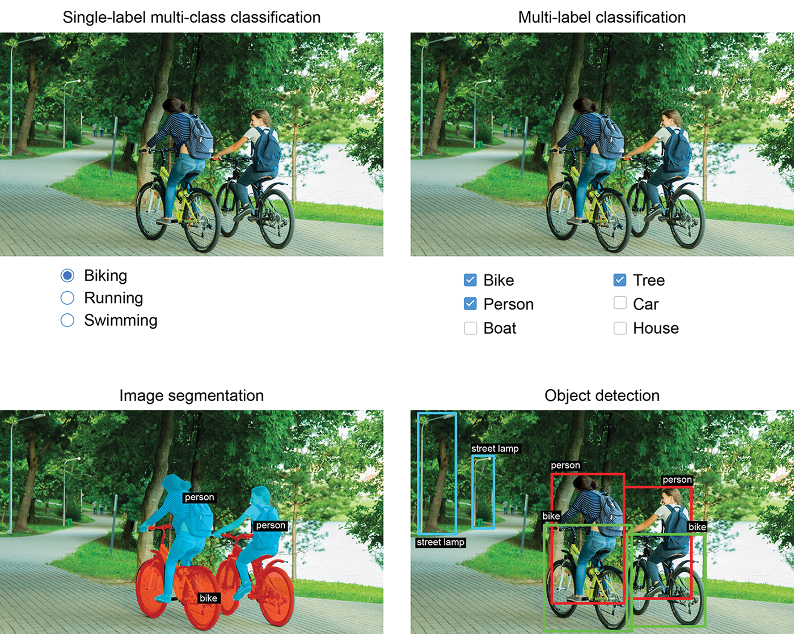


[Figure 11.1](#figure-11-1): The three main computer vision tasks: classification, segmentation, and detection

Deep learning for computer vision also encompasses a number of somewhat more niche tasks
besides these three, such as image similarity scoring (estimating how visually similar two
images are), keypoint detection
(pinpointing attributes of interest in an image, such as facial features),
pose estimation, 3D mesh estimation, depth estimation, and so on.
But to start with, image classification, image segmentation,
and object detection form the foundation that every machine learning engineer
should be familiar with. Almost all computer vision applications boil down to one of these three.

You’ve seen image classification in action in Chapter 8.
Next, let’s dive into image segmentation. It’s a very useful and very versatile
technique, and you can straightforwardly approach it with what you’ve already learned so far.
Then, in the next chapter, you’ll learn about object detection in detail.

### Types of image segmentation

Image segmentation with deep learning is about using a model to assign a class
to each pixel in an image, thus *segmenting* the image into different zones
(such as “background” and “foreground” or “road,” “car,” and “sidewalk”).
This general category of techniques can be used to power a considerable variety of
valuable applications in image and video editing, autonomous driving, robotics,
medical imaging, and so on.

There are three different flavors of image segmentation that you should know about:

* *Semantic segmentation*, where each pixel is independently classified into
  a semantic category, like “cat.” If there are two cats in the image,
  the corresponding pixels are all mapped to the same generic “cat” category
  (see figure 11.2).
* *Instance segmentation*, which seeks to parse out individual object instances.
  In an image with two cats in it, instance segmentation would distinguish
  between pixels belonging to “cat 1” and pixels belonging to “cat 2” (see figure 11.2).
* *Panoptic segmentation*, which combines semantic segmentation and instance
  segmentation by assigning to each pixel in an image
  both a semantic label (like “cat”) and an instance label (like “cat 2”). This
  is the most informative of all three segmentation types.

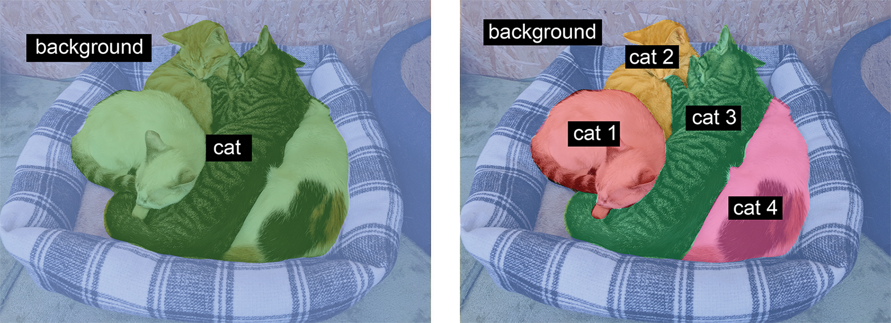


[Figure 11.2](#figure-11-2): Semantic segmentation vs. instance segmentation

To get more familiar with segmentation, let’s get started with training
a small segmentation model from scratch on your own data.

## Training a segmentation model from scratch

In this first example, we’ll focus on semantic segmentation. We’ll be looking
once again at images of cats and dogs, and this time we’ll be learning to
tell apart the main subject and its background.

### Downloading a segmentation dataset

We’ll work with the Oxford-IIIT Pets dataset (<https://www.robots.ox.ac.uk/~vgg/data/pets/>),
which contains 7,390 pictures of various breeds of cats and dogs, together with
foreground-background *segmentation masks* for each picture. A segmentation mask
is the image segmentation equivalent of a label: it’s an image the same size as the input
image, with a single color channel where each integer value corresponds to the
class of the corresponding pixel in the input image. In our case, the pixels of
our segmentation masks can take one of three integer values:

* 1 (foreground)
* 2 (background)
* 3 (contour)

Let’s start by downloading and uncompressing our dataset, using the `wget` and `tar`
shell utilities:

```python
!wget http://www.robots.ox.ac.uk/~vgg/data/pets/data/images.tar.gz
!wget http://www.robots.ox.ac.uk/~vgg/data/pets/data/annotations.tar.gz
!tar -xf images.tar.gz
!tar -xf annotations.tar.gz
```

The input pictures are stored as JPG files in the `images/` folder
(such as `images/Abyssinian_1.jpg`), and the corresponding segmentation mask
is stored as a PNG file with the same name in the `annotations/trimaps/` folder
(such as `annotations/trimaps/Abyssinian_1.png`).

Let’s prepare the list of input file paths, as well as the list of the
corresponding mask file paths:

```python
import pathlib

input_dir = pathlib.Path("images")
target_dir = pathlib.Path("annotations/trimaps")

input_img_paths = sorted(input_dir.glob("*.jpg"))
# Ignores some spurious files in the trimaps directory that start with
# a "."
target_paths = sorted(target_dir.glob("[!.]*.png"))
```

Now, what does one of these inputs and its mask look like? Let’s take a quick look (see figure 11.3).

```python
import matplotlib.pyplot as plt
from keras.utils import load_img, img_to_array, array_to_img

plt.axis("off")
# Displays input image number 9
plt.imshow(load_img(input_img_paths[9]))
```


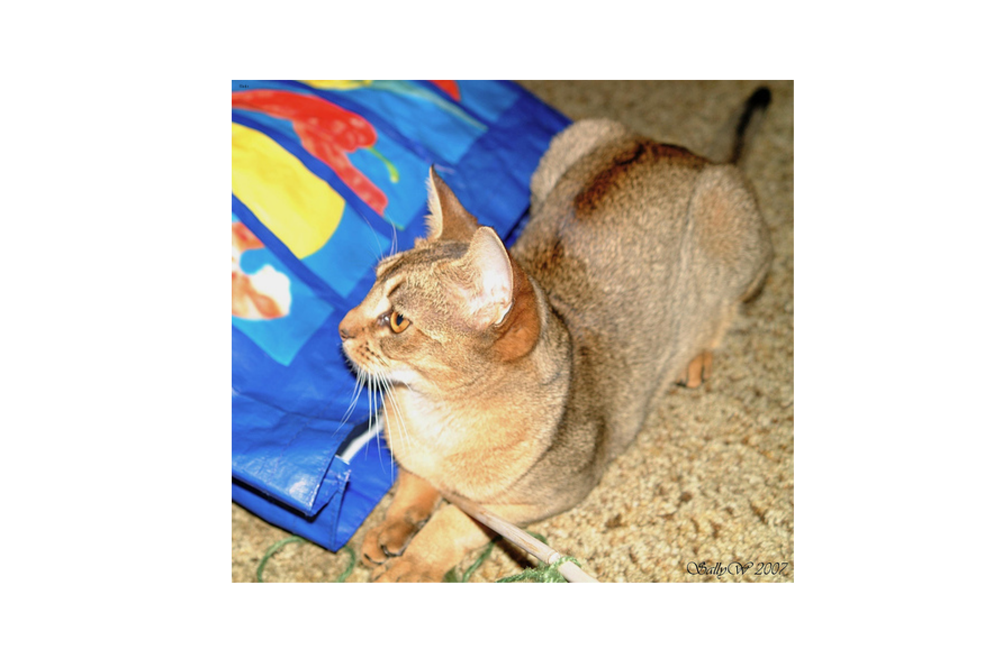


[Figure 11.3](#figure-11-3): An example image

Let’s look at its target mask as well (see figure 11.4):

```python
def display_target(target_array):
    # The original labels are 1, 2, and 3. We subtract 1 so that the
    # labels range from 0 to 2, and then we multiply by 127 so that the
    # labels become 0 (black), 127 (gray), 254 (near-white).
    normalized_array = (target_array.astype("uint8") - 1) * 127
    plt.axis("off")
    plt.imshow(normalized_array[:, :, 0])

# We use color_mode='grayscale' so that the image we load is treated as
# having a single color channel.
img = img_to_array(load_img(target_paths[9], color_mode="grayscale"))
display_target(img)
```


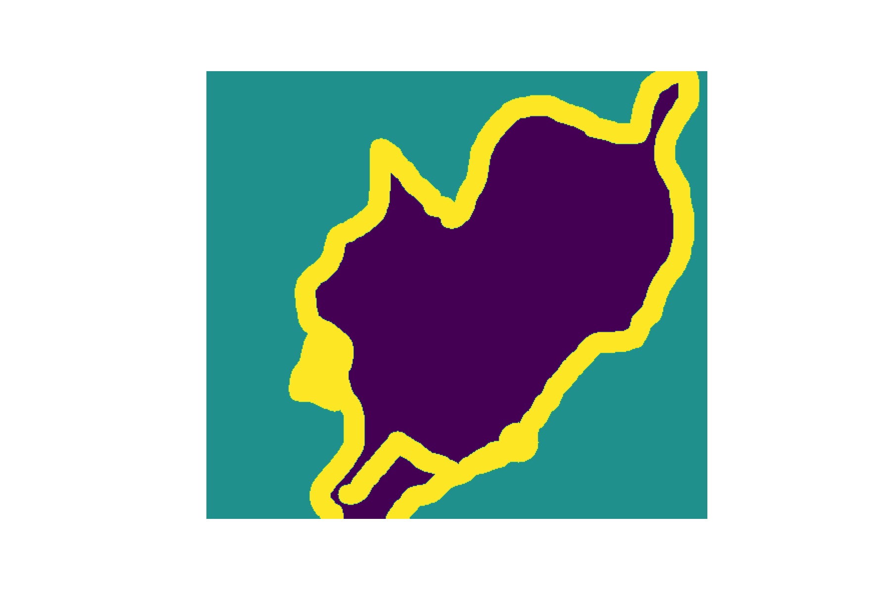


[Figure 11.4](#figure-11-4): The corresponding target mask

Next, let’s load our inputs and targets into two NumPy arrays. Since the
dataset is very small, we can load everything into memory:

```python
import numpy as np
import random

# We resize everything to 200 x 200 for this example.
img_size = (200, 200)
# Total number of samples in the data
num_imgs = len(input_img_paths)

# Shuffles the file paths (they were originally sorted by breed). We
# use the same seed (1337) in both statements to ensure that the input
# paths and target paths stay in the same order.
random.Random(1337).shuffle(input_img_paths)
random.Random(1337).shuffle(target_paths)

def path_to_input_image(path):
    return img_to_array(load_img(path, target_size=img_size))

def path_to_target(path):
    img = img_to_array(
        load_img(path, target_size=img_size, color_mode="grayscale")
    )
    # Subtracts 1 so that our labels become 0, 1, and 2
    img = img.astype("uint8") - 1
    return img

# Loads all images in the input_imgs float32 array and their masks in
# the targets uint8 array (same order). The inputs have three channels
# (RGB values), and the targets have a single channel (which contains
# integer labels).
input_imgs = np.zeros((num_imgs,) + img_size + (3,), dtype="float32")
targets = np.zeros((num_imgs,) + img_size + (1,), dtype="uint8")
for i in range(num_imgs):
    input_imgs[i] = path_to_input_image(input_img_paths[i])
    targets[i] = path_to_target(target_paths[i])
```

As always, let’s split the arrays into a training and a validation set:

```python
# Reserves 1,000 samples for validation
num_val_samples = 1000
# Splits the data into a training and a validation set
train_input_imgs = input_imgs[:-num_val_samples]
train_targets = targets[:-num_val_samples]
val_input_imgs = input_imgs[-num_val_samples:]
val_targets = targets[-num_val_samples:]
```

### Building and training the segmentation model

Now, it’s time to define our model:

```python
import keras
from keras.layers import Rescaling, Conv2D, Conv2DTranspose

def get_model(img_size, num_classes):
    inputs = keras.Input(shape=img_size + (3,))
    # Don't forget to rescale input images to the [0–1] range.
    x = Rescaling(1.0 / 255)(inputs)

    # We use padding="same" everywhere to avoid the influence of border
    # padding on feature map size.
    x = Conv2D(64, 3, strides=2, activation="relu", padding="same")(x)
    x = Conv2D(64, 3, activation="relu", padding="same")(x)
    x = Conv2D(128, 3, strides=2, activation="relu", padding="same")(x)
    x = Conv2D(128, 3, activation="relu", padding="same")(x)
    x = Conv2D(256, 3, strides=2, padding="same", activation="relu")(x)
    x = Conv2D(256, 3, activation="relu", padding="same")(x)

    x = Conv2DTranspose(256, 3, activation="relu", padding="same")(x)
    x = Conv2DTranspose(256, 3, strides=2, activation="relu", padding="same")(x)
    x = Conv2DTranspose(128, 3, activation="relu", padding="same")(x)
    x = Conv2DTranspose(128, 3, strides=2, activation="relu", padding="same")(x)
    x = Conv2DTranspose(64, 3, activation="relu", padding="same")(x)
    x = Conv2DTranspose(64, 3, strides=2, activation="relu", padding="same")(x)

    # We end the model with a per-pixel three-way softmax to classify
    # each output pixel into one of our three categories.
    outputs = Conv2D(num_classes, 3, activation="softmax", padding="same")(x)

    return keras.Model(inputs, outputs)

model = get_model(img_size=img_size, num_classes=3)
```

The first half of the model closely resembles the kind of ConvNet you’d use for image
classification: a stack of `Conv2D` layers, with gradually increasing filter sizes.
We downsample our images three times by a factor of
two each — ending up with activations of size
`(25, 25, 256)`. The purpose of this first half is to encode the images into
smaller feature maps, where each spatial location (or “pixel”) contains
information about a large spatial chunk of the original image. You can understand
it as a kind of compression.

One important difference between the first half of this model and the classification models
you’ve seen before is the way we do downsampling: in the classification ConvNets
from chapter 8, we used `MaxPooling2D` layers to downsample feature maps.
Here, we downsample by adding *strides* to every other convolution layer (if you
don’t remember the details of how convolution strides work, see
chapter 8, section 8.1.1). We do this because,
in the case of image segmentation, we care a lot about the spatial location of
information in the image since we need to produce per-pixel target masks as
output of the model. When you do 2 × 2 max pooling, you are completely destroying
location information within each pooling window: you return one scalar value
per window, with zero knowledge of which of the four locations in the windows
the value came from.

So, while max pooling layers perform well for
classification tasks, they would hurt us quite a bit for a segmentation task.
Meanwhile, strided convolutions do a better job at downsampling feature maps
while retaining location information. Throughout this book, you’ll notice that
we tend to use strides instead of max pooling in any model that cares about
feature location, such as the generative models in chapter 17.

The second half of the model is a stack of `Conv2DTranspose` layers. What are those?
Well, the output of the first half of the model is a feature map of shape `(25, 25, 256)`,
but we want our final output to predict a class for each pixel, matching the original
spatial dimensions. The final model output will have shape `(200, 200, num_classes)`,
which is `(200, 200, 3)` here. Therefore, we need to apply a kind of *inverse* of the
transformations we’ve applied so far, something that will *upsample* the feature
maps instead of downsampling them. That’s the purpose of the `Conv2DTranspose` layer:
you can think of it as a kind of convolution layer that *learns to upsample*.
If you have an input of shape `(100, 100, 64)` and you run it
through the layer `Conv2D(128, 3, strides=2, padding="same")`, you get an
output of shape `(50, 50, 128)`. If you run this output through the layer
`Conv2DTranspose(64, 3, strides=2, padding="same")`, you get back an output
of shape `(100, 100, 64)`, the same as the original. So after compressing
our inputs into feature maps of shape `(25, 25, 256)` via a stack of `Conv2D`
layers, we can simply apply the corresponding sequence of `Conv2DTranspose`
layers followed by a final `Conv2D` layer to produce outputs of shape `(200, 200, 3)`.

To evaluate the model, we’ll use a metric named
*Intersection over Union* (IoU). It’s a measure of the match between the ground truth
segmentation masks and the predicted masks. It can be computed separately for each class or averaged over multiple classes. Here’s how it works:

1. Compute the *intersection* between the masks, the area where the prediction and ground truth overlap.
2. Compute the *union* of the masks, the total area covered by both masks combined. This is the whole space we’re interested in — the target object and any extra bits your model might have included by mistake.
3. Divide the intersection area by the union area to get the IoU. It’s a number between 0 and 1, where 1 denotes a perfect match, and 0 denotes a complete miss.

We can simply use a built-in Keras metric rather than building this ourselves:

```python
foreground_iou = keras.metrics.IoU(
    # Specifies the total number of classes
    num_classes=3,
    # Specifies the class to compute IoU for (0 = foreground)
    target_class_ids=(0,),
    name="foreground_iou",
    # Our targets are sparse (integer class IDs).
    sparse_y_true=True,
    # But our model's predictions are a dense softmax!
    sparse_y_pred=False,
)
```

We can now compile and fit our model:

```python
model.compile(
    optimizer="adam",
    loss="sparse_categorical_crossentropy",
    metrics=[foreground_iou],
)
callbacks = [
    keras.callbacks.ModelCheckpoint(
        "oxford_segmentation.keras",
        save_best_only=True,
    ),
]
history = model.fit(
    train_input_imgs,
    train_targets,
    epochs=50,
    callbacks=callbacks,
    batch_size=64,
    validation_data=(val_input_imgs, val_targets),
)
```

Let’s display our training and validation loss (see figure 11.5):

```python
epochs = range(1, len(history.history["loss"]) + 1)
loss = history.history["loss"]
val_loss = history.history["val_loss"]
plt.figure()
plt.plot(epochs, loss, "r--", label="Training loss")
plt.plot(epochs, val_loss, "b", label="Validation loss")
plt.title("Training and validation loss")
plt.legend()
```


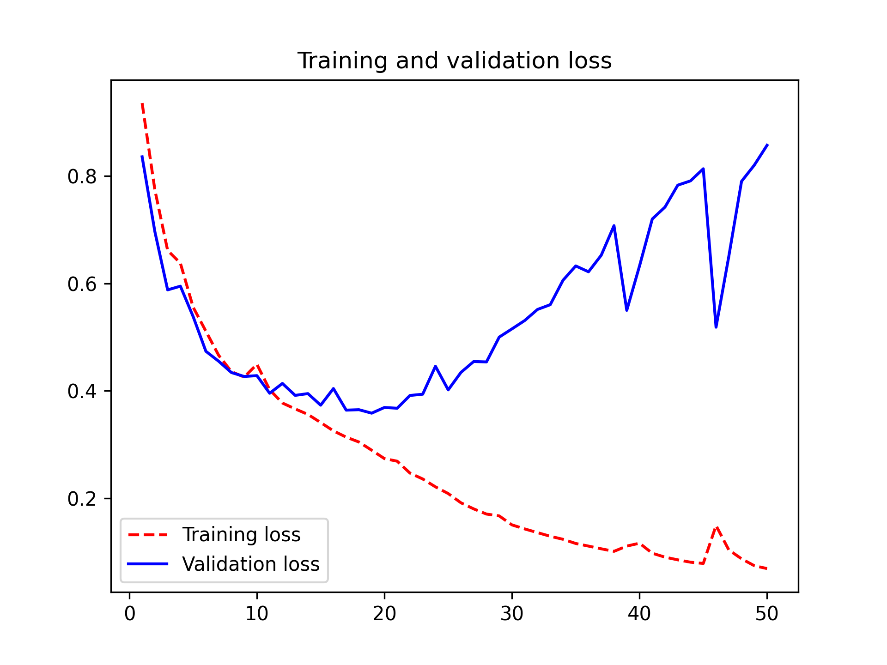


[Figure 11.5](#figure-11-5): Displaying training and validation loss curves

You can see that we start overfitting midway, around epoch 25. Let’s reload
our best-performing model according to validation loss and demonstrate
how to use it to predict a segmentation mask (see figure 11.6):

```python
model = keras.models.load_model("oxford_segmentation.keras")

i = 4
test_image = val_input_imgs[i]
plt.axis("off")
plt.imshow(array_to_img(test_image))

mask = model.predict(np.expand_dims(test_image, 0))[0]

# Utility to display a model's prediction
def display_mask(pred):
    mask = np.argmax(pred, axis=-1)
    mask *= 127
    plt.axis("off")
    plt.imshow(mask)

display_mask(mask)
```


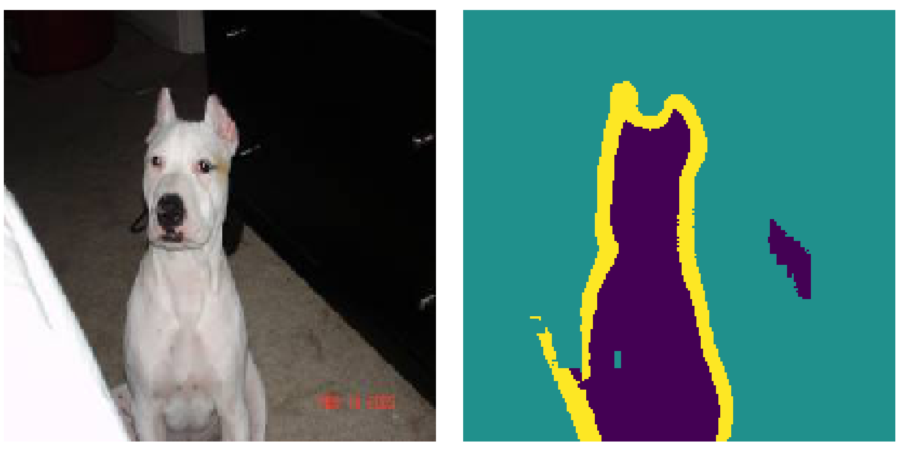


[Figure 11.6](#figure-11-6): A test image and its predicted segmentation mask

There are a couple of small artifacts in our predicted mask, caused by geometric shapes
in the foreground and background. Nevertheless, our model appears to work nicely.

## Using a pretrained segmentation model

In the image classification example from chapter 8, you saw how using a
pretrained model could significantly boost your accuracy — especially when you
only have a few samples to train on. Image segmentation is no different.

The *Segment Anything Model*,[[1]](#footnote-1) or SAM for short, is a powerful pretrained
segmentation model you can use for, well, almost anything. It was developed by
Meta AI and released in April 2023. It was trained on 11 million images and
their segmentation masks, covering over 1 billion object instances. This
massive amount of training data provides the model with built-in knowledge of
virtually any object that appears in natural images.

The main innovation of SAM is that it’s not limited to a
predefined set of object classes. You can use it for segmenting new objects
simply by providing an example of what you’re looking for. You don’t even need
to fine-tune the model first. Let’s see how that works.

### Downloading the Segment Anything Model

First, let’s instantiate SAM and download its weights.
Once again, we can use the KerasHub package to use this pretrained model without
needing to implement it ourselves from scratch.

Remember the `ImageClassifier` task we used in the previous chapter? We can use another
KerasHub task `ImageSegmenter` for wrapping pretrained image segmentation models
into a high-level model with standard inputs and outputs. Here, we’ll use the
`sam_huge_sa1b` pretrained model, where `sam` stands for the model, `huge`
refers to the number of parameters in the model, and `sa1b` stands for the SA-1B
dataset released along with the model, with 1 billion annotated masks. Let’s
download it now:

```python
import keras_hub

model = keras_hub.models.ImageSegmenter.from_preset("sam_huge_sa1b")
```

One thing we can note off the bat is that our model is, indeed, huge:

```python
>>> model.count_params()
641090864
```

At 641 million parameters, SAM is the largest model we have used so far in
this book. The trend of pretrained models getting larger and larger and using more
and more data will be discussed in more detail in chapter 16.

### How Segment Anything works

Before we try running some segmentation with the model, let’s talk a little more
about how SAM works. Much of the capability of the model comes from the
scale of the pretraining dataset. Meta developed the SA-1B dataset along with
the model, where the partially trained model was used to assist with the data
labeling process. That is, the dataset and model were developed together in
a feedback loop of sorts.

The goal with the SA-1B dataset is to create fully segmented images, where every
object in an image is given a unique segmentation mask. See figure 11.7 as an
example. Each image in the dataset has ~100 masks on average, and some images
have over 500 individually masked objects. This was done through a pipeline of
increasingly automated data collection. At first, human experts manually
segmented a small example dataset of images, which was used to train an initial
model. This model was used to help drive a semiautomated stage of data
collection, where images were first segmented by SAM and improved by human
correction and further annotation.

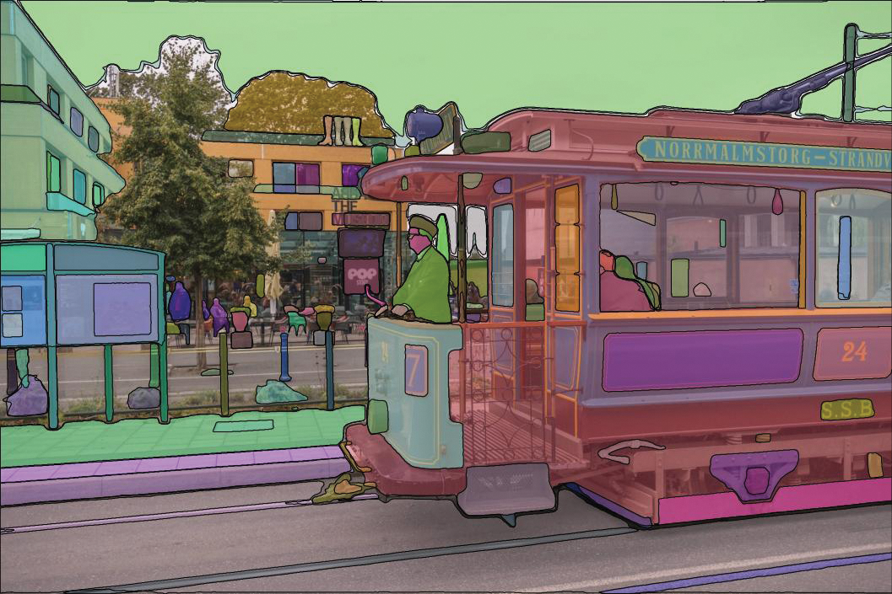


[Figure 11.7](#figure-11-7): An example image from the SA-1B dataset

The model is trained on `(image, prompt, mask)` triples. `image` and `prompt`
are the model inputs. The image can be any input image, and the prompt can take a
couple of forms:

* A point inside the object to mask
* A box around the object to mask

Given the `image` and `prompt` input, the model is expected to produce an
accurate predicted mask for the object indicated by the prompt, which is
compared with a ground truth `mask` label.

The model consists of a few separate components. An image encoder similar to
the Xception model we used in previous chapters, will take an input
image and output a much smaller image embedding. This is something we already
know how to build.

Next, we add a prompt encoder, which is responsible for mapping prompts in any of
the previously mentioned forms to an embedded vector, and a mask decoder, which takes in
both the image embedding and prompt embedding and outputs a few possible
predicted masks. We won’t get into the details of the prompt encoder and mask
decoder here, as they use some modeling techniques we won’t see until later
chapters. We can compare these predicted masks with our ground truth mask much like we did in
the earlier section of this chapter (see figure 11.8).

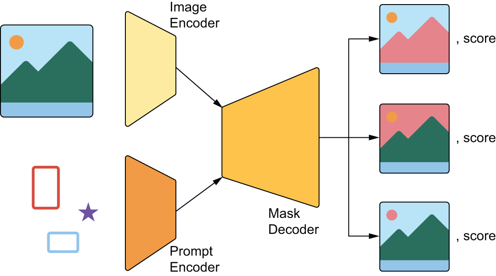


[Figure 11.8](#figure-11-8): The Segment Anything high-level architecture overview

All of these subcomponents are trained simultaneously by forming batches of new
`(image, prompt, mask)` triples to train on from the SA-1B image and mask data.
The process here is actually quite simple. For a given input image, choose a
random mask in the input. Next, randomly choose whether to create a box prompt
or a point prompt. To create a point prompt, choose a random pixel inside the
mask label. To create a box prompt, draw a box around all points inside
the mask label. We can repeat this process indefinitely, sampling a number of
`(image, prompt, mask)` triples from each image input.

### Preparing a test image

Let’s make this a little more concrete by trying the model out. We can start by
loading a test image for our segmentation work. We’ll use a picture of a bowl of
fruits (see figure 11.9):

```python
# Downloads the image and returns the local file path
path = keras.utils.get_file(
    origin="https://s3.amazonaws.com/keras.io/img/book/fruits.jpg"
)
# Loads the image as a Python Imaging Library (PIL) object
pil_image = keras.utils.load_img(path)
# Turns the PIL object into a NumPy matrix
image_array = keras.utils.img_to_array(pil_image)

# Displays the NumPy matrix
plt.imshow(image_array.astype("uint8"))
plt.axis("off")
plt.show()
```


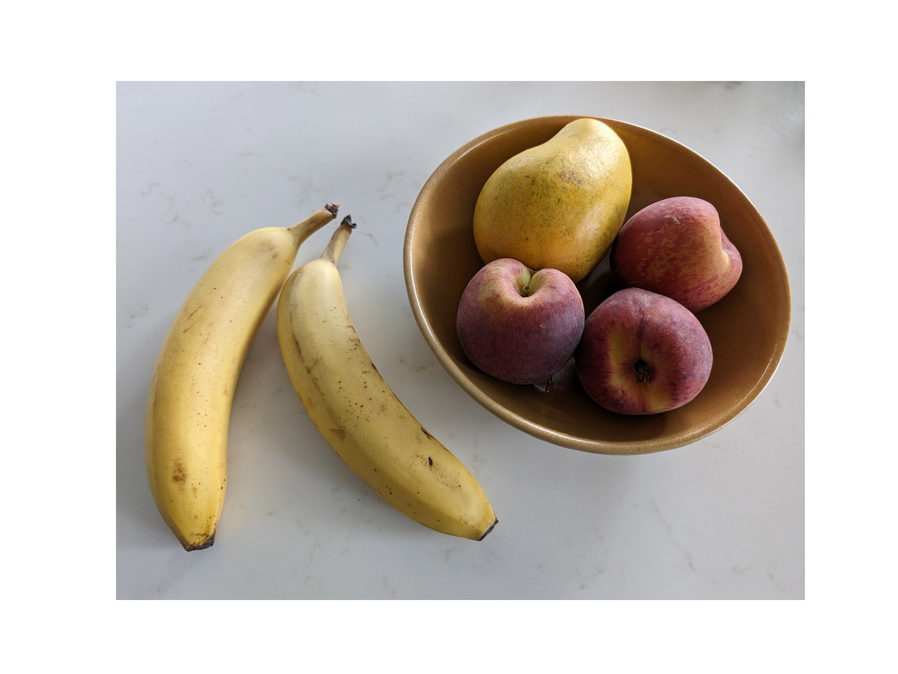


[Figure 11.9](#figure-11-9): Our test image

SAM expects inputs that are 1024 × 1024. However, forcibly resizing arbitrary images
to 1024 × 1024 would distort their aspect ratio — for instance, our image isn’t square.
It’s better to first resize the image so that its longest side becomes 1,024 pixels long and then pad
the remaining pixels with a filler value, such as 0. We can achieve this with the `pad_to_aspect_ratio`
argument in the `keras.ops.image.resize()` operation, like this:

```python
from keras import ops

image_size = (1024, 1024)

def resize_and_pad(x):
    return ops.image.resize(x, image_size, pad_to_aspect_ratio=True)

image = resize_and_pad(image_array)
```

Next, let’s define a few utilities that will come in handy when using the model.
We’re going to need to

* Display images.
* Display segmentation masks overlaid on an image.
* Highlight specific points on an image.
* Display boxes overlaid on an image.

All our utilities take a Matplotlib `axis` object (noted `ax`) so that they can all write to the same figure:

```python
import matplotlib.pyplot as plt
from keras import ops

def show_image(image, ax):
    ax.imshow(ops.convert_to_numpy(image).astype("uint8"))

def show_mask(mask, ax):
    color = np.array([30 / 255, 144 / 255, 255 / 255, 0.6])
    h, w, _ = mask.shape
    mask_image = mask.reshape(h, w, 1) * color.reshape(1, 1, -1)
    ax.imshow(mask_image)

def show_points(points, ax):
    x, y = points[:, 0], points[:, 1]
    ax.scatter(x, y, c="green", marker="*", s=375, ec="white", lw=1.25)

def show_box(box, ax):
    box = box.reshape(-1)
    x0, y0 = box[0], box[1]
    w, h = box[2] - box[0], box[3] - box[1]
    ax.add_patch(plt.Rectangle((x0, y0), w, h, ec="red", fc="none", lw=2))
```

### Prompting the model with a target point

To use SAM, you need to prompt it. This means we need one of the following:

* *Point prompts* — Select a point in an image and let the model segment the object that the point belongs to.
* *Box prompts* — Draw an approximate box around an object (it does not need to be particularly precise) and let the model segment the object in the box.

Let’s start with a point prompt.
Points are labeled, with 1 indicating the foreground (the object you want to
segment) and 0 indicating the background (everything around the object). In
ambiguous cases, to improve your results, you could pass multiple labeled points,
instead of a single point, to refine your definition of what should be included
(points labeled 1) and what should be excluded (points labeled 0).

We try a single foreground point (see figure 11.10). Here’s a test point:

```python
import numpy as np

# Coordinates of our point
input_point = np.array([[580, 450]])
# 1 means foreground, and 0 means background.
input_label = np.array([1])

plt.figure(figsize=(10, 10))
# "gca" means "get current axis" — the current figure.
show_image(image, plt.gca())
show_points(input_point, plt.gca())
plt.show()
```


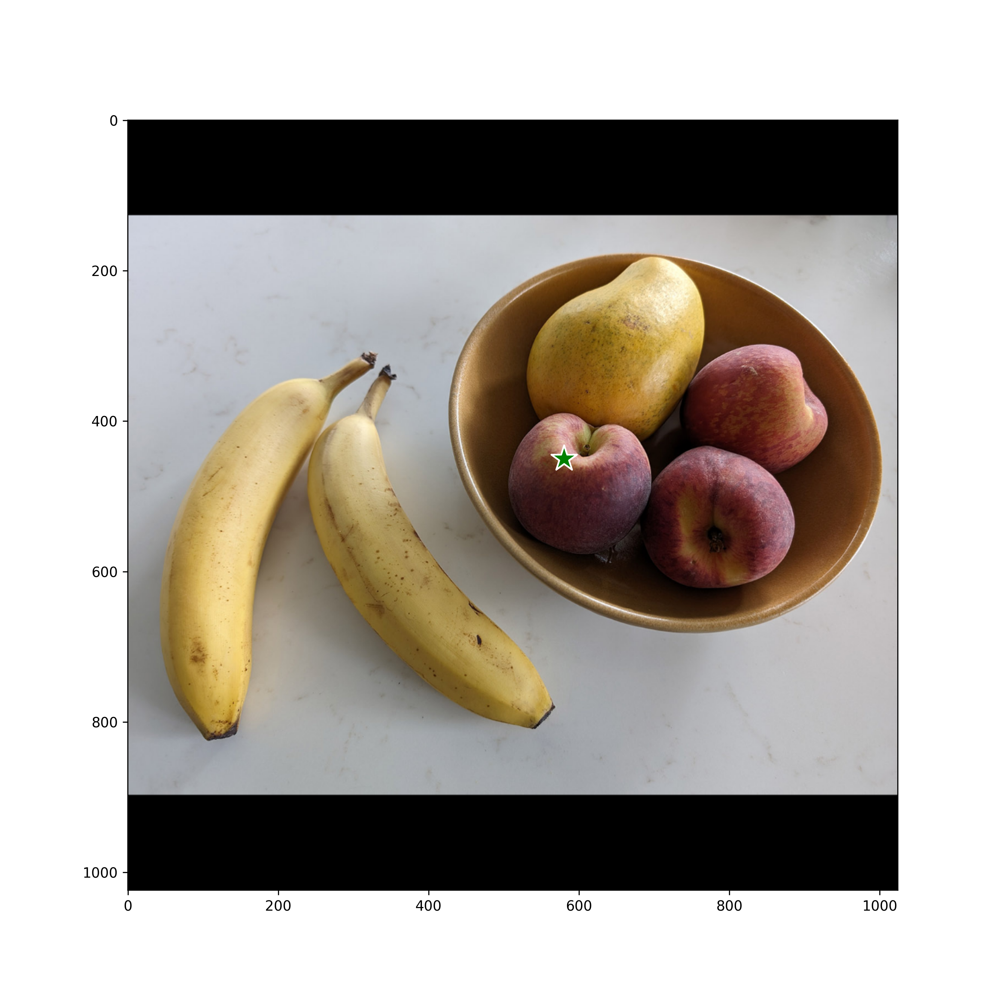


[Figure 11.10](#figure-11-10): A prompt point, landing on a peach

Let’s prompt SAM with it:

```python
outputs = model.predict(
    {
        "images": ops.expand_dims(image, axis=0),
        "points": ops.expand_dims(input_point, axis=0),
        "labels": ops.expand_dims(input_label, axis=0),
    }
)
```

The return value `outputs` has a `"masks"` field which contains four 256 × 256 candidate masks for the target object,
ranked by decreasing match quality. The quality scores of the masks are available under the `"iou_pred"` field as part of the model’s output:

```python
>>> outputs["masks"].shape
(1, 4, 256, 256)
```

Let’s overlay the first mask on the image (see figure 11.11):

```python
def get_mask(sam_outputs, index=0):
    mask = sam_outputs["masks"][0][index]
    mask = np.expand_dims(mask, axis=-1)
    mask = resize_and_pad(mask)
    return ops.convert_to_numpy(mask) > 0.0

mask = get_mask(outputs, index=0)

plt.figure(figsize=(10, 10))
show_image(image, plt.gca())
show_mask(mask, plt.gca())
show_points(input_point, plt.gca())
plt.show()
```


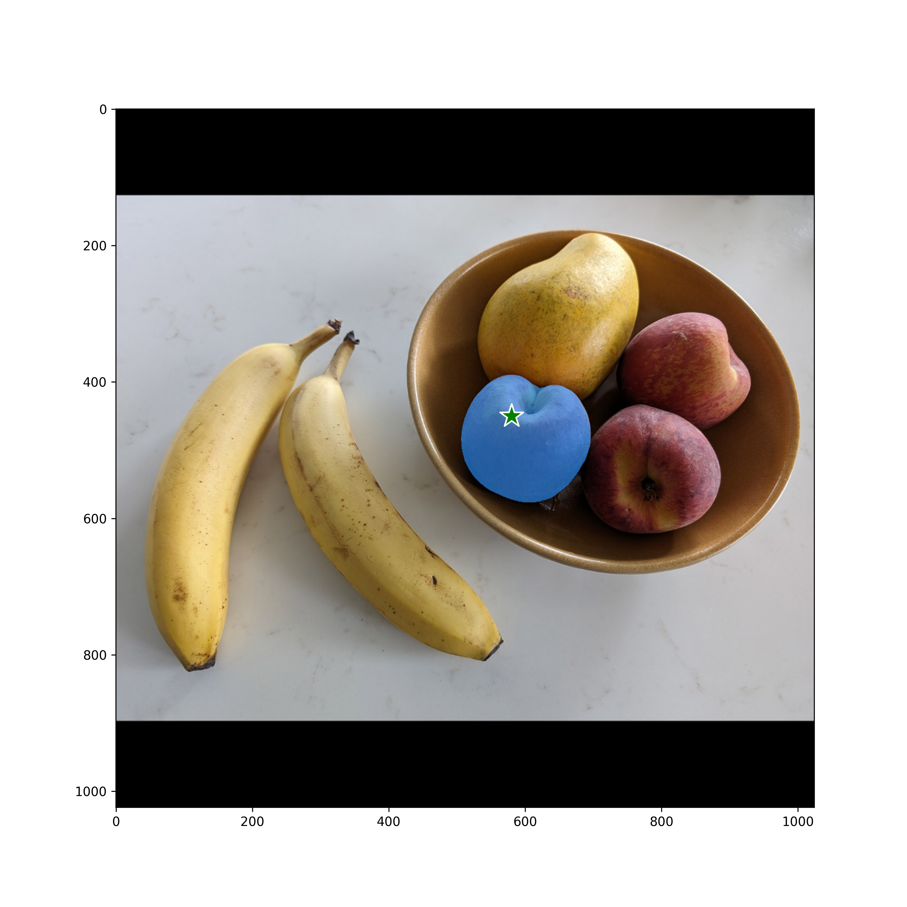


[Figure 11.11](#figure-11-11): Segmented peach

Pretty good!

Next, let’s try a banana. We’ll prompt the model with coordinates `(300, 550)`,
which land on the second banana from the left (see figure 11.12):

```python
input_point = np.array([[300, 550]])
input_label = np.array([1])

outputs = model.predict(
    {
        "images": ops.expand_dims(image, axis=0),
        "points": ops.expand_dims(input_point, axis=0),
        "labels": ops.expand_dims(input_label, axis=0),
    }
)
mask = get_mask(outputs, index=0)

plt.figure(figsize=(10, 10))
show_image(image, plt.gca())
show_mask(mask, plt.gca())
show_points(input_point, plt.gca())
plt.show()
```


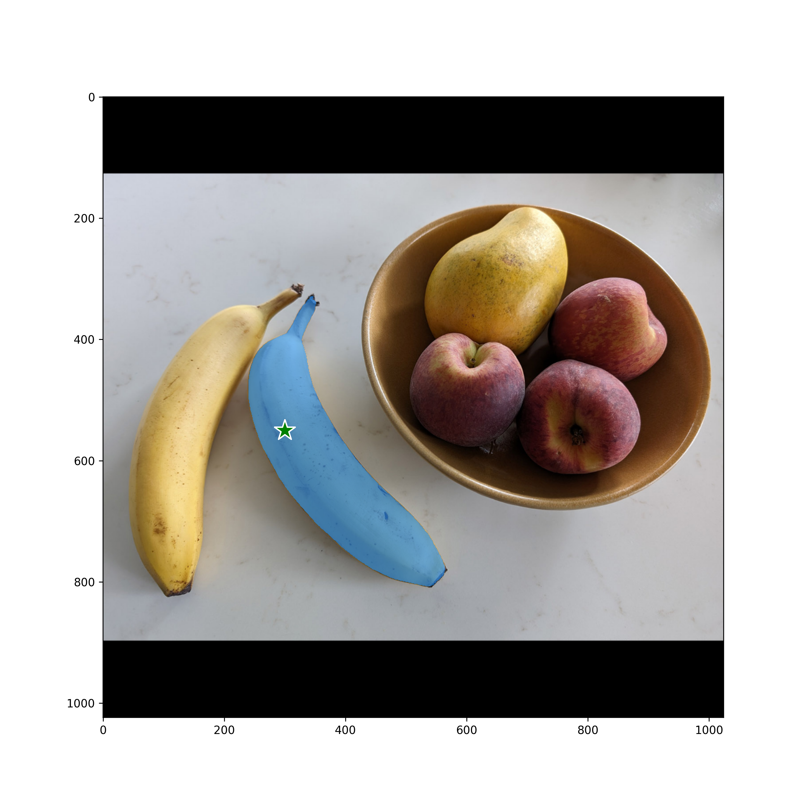


[Figure 11.12](#figure-11-12): Segmented banana

Now, what about the other mask candidates? Those can come in handy for ambiguous prompts. Let’s try to plot the other three masks (see figure 11.13):

```python
fig, axes = plt.subplots(1, 3, figsize=(20, 60))
masks = outputs["masks"][0][1:]
for i, mask in enumerate(masks):
    show_image(image, axes[i])
    show_points(input_point, axes[i])
    mask = get_mask(outputs, index=i + 1)
    show_mask(mask, axes[i])
    axes[i].set_title(f"Mask {i + 1}", fontsize=16)
    axes[i].axis("off")
plt.show()
```


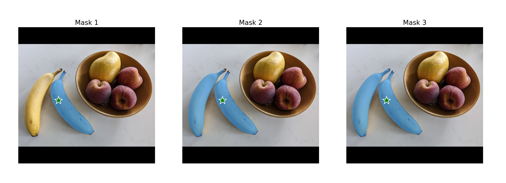


[Figure 11.13](#figure-11-13): Alternative segmentation masks for the banana prompt

As you can see here, an alternative segmentation found by the model includes both bananas.

### Prompting the model with a target box

Besides providing one or more target points, you can also provide boxes approximating the location of the object to segment.
These boxes should be passed via the coordinates of their top-left and bottom-right corners. Here’s a box around the mango (see figure 11.14):

```python
input_box = np.array(
    [
        # Top-left corner
        [520, 180],
        # Bottom-right corner
        [770, 420],
    ]
)

plt.figure(figsize=(10, 10))
show_image(image, plt.gca())
show_box(input_box, plt.gca())
plt.show()
```


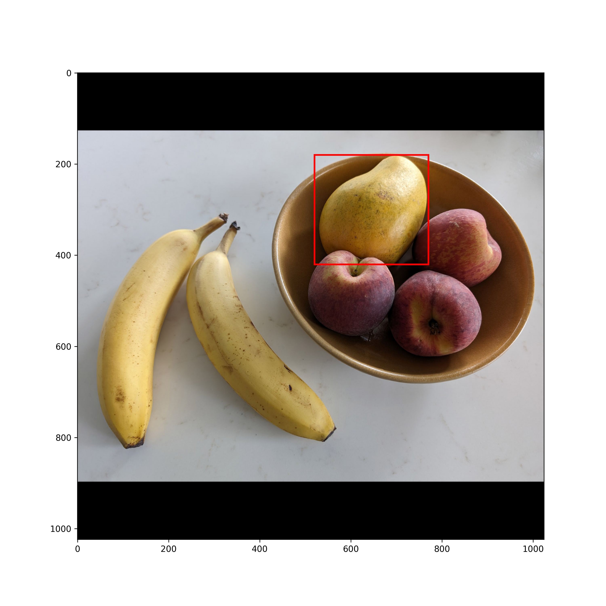


[Figure 11.14](#figure-11-14): Box prompt around the mango

Let’s prompt SAM with it (see figure 11.15):

```python
outputs = model.predict(
    {
        "images": ops.expand_dims(image, axis=0),
        "boxes": ops.expand_dims(input_box, axis=(0, 1)),
    }
)
mask = get_mask(outputs, 0)
plt.figure(figsize=(10, 10))
show_image(image, plt.gca())
show_mask(mask, plt.gca())
show_box(input_box, plt.gca())
plt.show()
```


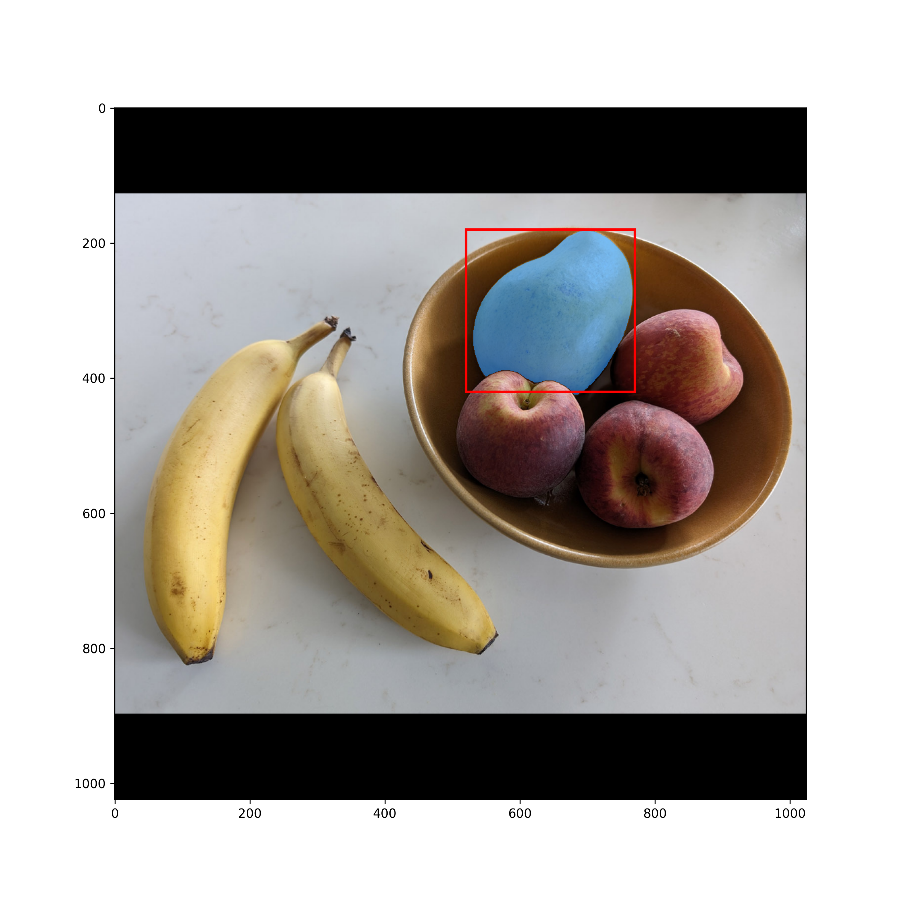


[Figure 11.15](#figure-11-15): Segmented mango

SAM can be a powerful tool to quickly create large datasets of images annotated with segmentation masks.

## Summary

* Image segmentation is one of the main categories of computer vision tasks. It consists
  of computing segmentation masks that describe the contents of an image at the pixel level.
* To build your own segmentation model, use a stack of strided `Conv2D` layers to “compress”
  the input image into a smaller feature map, followed by a stack of corresponding `Conv2DTranspose`
  layers to “expand” the feature map into a segmentation mask the same size as the input image.
* You can also use a pretrained segmentation model. Segment Anything, included in KerasHub, is a powerful model that supports
  image prompting, text prompting, point prompting, and box prompting.

#### **Tiếng Việt (Vietnamese)**

# Chương 11: Phân đoạn hình ảnh

Chương này bao gồm

* Các nhánh khác nhau của thị giác máy tính: phân loại hình ảnh,
phân đoạn hình ảnh và phát hiện đối tượng
* Xây dựng mô hình phân khúc từ đầu
* Sử dụng Mô hình phân đoạn bất kỳ được đào tạo trước

Chương 8 đã giới thiệu cho bạn lần đầu tiên về deep learning cho thị giác máy tính thông qua một trường hợp sử dụng đơn giản: phân loại hình ảnh nhị phân. Nhưng thị giác máy tính còn có nhiều thứ hơn là phân loại hình ảnh! Chương này đi sâu hơn vào một ứng dụng thị giác máy tính thiết yếu khác - phân đoạn hình ảnh.

## Nhiệm vụ thị giác máy tính

Cho đến nay, chúng tôi đã tập trung vào các mô hình phân loại hình ảnh: hình ảnh được đưa vào, nhãn xuất hiện. “Hình ảnh này có thể có một con mèo; hình ảnh kia có thể có một con chó.” Nhưng phân loại hình ảnh chỉ là một trong nhiều ứng dụng có thể có của deep learning trong thị giác máy tính. Nói chung, có ba nhiệm vụ thị giác máy tính cần thiết mà bạn cần biết:

* *Phân loại hình ảnh*, trong đó mục tiêu là gán một hoặc nhiều nhãn cho hình ảnh.
Nó có thể là phân loại nhãn đơn
(có nghĩa là các danh mục loại trừ lẫn nhau) hoặc
phân loại đa nhãn
(gắn thẻ tất cả các danh mục mà hình ảnh thuộc về, như trong hình 11.1).
Ví dụ: khi bạn tìm kiếm một từ khóa trên ứng dụng Google Photos, hậu trường
bạn đang truy vấn một mô hình phân loại nhiều nhãn rất lớn — một mô hình có hơn
20.000 lớp khác nhau, được đào tạo trên hàng triệu hình ảnh.
* *Phân đoạn hình ảnh*, trong đó mục tiêu là “phân đoạn” hoặc “phân vùng” một hình ảnh
thành các khu vực khác nhau, mỗi khu vực thường đại diện cho một danh mục
(như thể hiện trong hình 11.1). Ví dụ: khi Zoom hoặc Google Meet hiển thị
nền tùy chỉnh phía sau bạn trong cuộc gọi điện video, đó là sử dụng phân đoạn hình ảnh
mô hình để phân biệt khuôn mặt của bạn với những gì đằng sau nó, với độ chính xác ở mức pixel.
* *Phát hiện đối tượng*, trong đó mục tiêu là vẽ hình chữ nhật (được gọi là *hộp giới hạn*)
xung quanh các đối tượng quan tâm trong một hình ảnh và liên kết mỗi hình chữ nhật với một lớp.
Xe tự lái có thể sử dụng mô hình phát hiện vật thể để giám sát ô tô, người đi bộ,
và các biển báo trước camera của nó chẳng hạn.


[Figure 11.1](#figure-11-1): The three main computer vision tasks: classification, segmentation, and detection

Học sâu cho thị giác máy tính cũng bao gồm một số nhiệm vụ thích hợp hơn ngoài ba nhiệm vụ này, chẳng hạn như chấm điểm độ tương tự của hình ảnh (ước tính mức độ giống nhau về mặt hình ảnh của hai hình ảnh), phát hiện điểm chính (xác định các thuộc tính quan tâm trong một hình ảnh, chẳng hạn như đặc điểm khuôn mặt), ước tính tư thế, ước tính lưới 3D, ước tính độ sâu, v.v. Nhưng trước hết, phân loại hình ảnh, phân đoạn hình ảnh và phát hiện đối tượng là nền tảng mà mọi kỹ sư học máy đều phải làm quen. Hầu như tất cả các ứng dụng thị giác máy tính đều tập trung vào một trong ba ứng dụng này.

Bạn đã thấy cách phân loại hình ảnh trong Chương 8. Tiếp theo, hãy đi sâu vào phân đoạn hình ảnh. Đây là một kỹ thuật rất hữu ích và rất linh hoạt và bạn có thể tiếp cận nó một cách dễ dàng với những gì bạn đã học được cho đến nay. Sau đó, trong chương tiếp theo, bạn sẽ tìm hiểu chi tiết về phát hiện đối tượng.

### Các loại phân đoạn hình ảnh

Phân đoạn hình ảnh bằng học sâu là sử dụng mô hình để gán một lớp cho từng pixel trong hình ảnh, do đó *phân đoạn* hình ảnh thành các vùng khác nhau (chẳng hạn như “nền” và “tiền cảnh” hoặc “đường”, “ô tô” và “vỉa hè”). Loại kỹ thuật chung này có thể được sử dụng để cung cấp nhiều ứng dụng có giá trị trong chỉnh sửa hình ảnh và video, lái xe tự động, robot, hình ảnh y tế, v.v.

Có ba cách phân đoạn hình ảnh khác nhau mà bạn nên biết:

* *Phân đoạn theo ngữ nghĩa*, trong đó mỗi pixel được phân loại độc lập thành
một phạm trù ngữ nghĩa, chẳng hạn như “mèo”. Nếu có hai con mèo trong hình ảnh,
tất cả các pixel tương ứng đều được ánh xạ tới cùng một danh mục “mèo” chung
(xem hình 11.2).
* *Phân đoạn phiên bản*, tìm cách phân tích các phiên bản đối tượng riêng lẻ.
Trong một hình ảnh có hai con mèo, việc phân đoạn đối tượng sẽ phân biệt
giữa các pixel thuộc “cat 1” và các pixel thuộc “cat 2” (xem hình 11.2).
* *Phân đoạn toàn cảnh*, kết hợp phân đoạn theo ngữ nghĩa và thực thể
phân đoạn bằng cách gán cho từng pixel trong ảnh
cả nhãn ngữ nghĩa (như “cat”) và nhãn phiên bản (như “cat 2”). Cái này
là thông tin hữu ích nhất trong cả ba loại phân khúc.


[Figure 11.2](#figure-11-2): Semantic segmentation vs. instance segmentation

Để làm quen hơn với phân đoạn, hãy bắt đầu đào tạo mô hình phân đoạn nhỏ từ đầu trên dữ liệu của riêng bạn.

## Đào tạo mô hình phân đoạn từ đầu

Trong ví dụ đầu tiên này, chúng tôi sẽ tập trung vào phân đoạn theo ngữ nghĩa. Chúng ta sẽ xem lại hình ảnh chó và mèo một lần nữa và lần này chúng ta sẽ học cách phân biệt chủ đề chính và bối cảnh của nó.

### Đang tải xuống tập dữ liệu phân đoạn

Chúng tôi sẽ làm việc với tập dữ liệu Oxford-IIIT Pets (<https://www.robots.ox.ac.uk/~vgg/data/pets/>), chứa 7.390 hình ảnh về nhiều giống chó và mèo khác nhau, cùng với *mặt nạ phân đoạn* nền trước cho mỗi hình ảnh. Mặt nạ phân đoạn là phân đoạn hình ảnh tương đương với nhãn: đó là hình ảnh có cùng kích thước với hình ảnh đầu vào, với một kênh màu duy nhất trong đó mỗi giá trị số nguyên tương ứng với loại pixel tương ứng trong hình ảnh đầu vào. Trong trường hợp của chúng tôi, các pixel của mặt nạ phân đoạn của chúng tôi có thể nhận một trong ba giá trị số nguyên:

* 1 (tiền cảnh)
* 2 (nền)
* 3 (đường viền)

Hãy bắt đầu bằng cách tải xuống và giải nén tập dữ liệu của chúng tôi, sử dụng tiện ích shell `wget` và `tar`:

```python
!wget http://www.robots.ox.ac.uk/~vgg/data/pets/data/images.tar.gz
!wget http://www.robots.ox.ac.uk/~vgg/data/pets/data/annotations.tar.gz
!tar -xf images.tar.gz
!tar -xf annotations.tar.gz
```

Hình ảnh đầu vào được lưu trữ dưới dạng tệp JPG trong thư mục `images/` (chẳng hạn như `images/Abyssinian_1.jpg`) và mặt nạ phân đoạn tương ứng được lưu trữ dưới dạng tệp PNG có cùng tên trong thư mục `annotations/trimaps/` (chẳng hạn như `annotations/trimaps/Abyssinian_1.png`).

Hãy chuẩn bị danh sách các đường dẫn tệp đầu vào, cũng như danh sách các đường dẫn tệp mặt nạ tương ứng:

```python
import pathlib

input_dir = pathlib.Path("images")
target_dir = pathlib.Path("annotations/trimaps")

input_img_paths = sorted(input_dir.glob("*.jpg"))
# Ignores some spurious files in the trimaps directory that start with
# a "."
target_paths = sorted(target_dir.glob("[!.]*.png"))
```

Bây giờ, một trong những đầu vào này và mặt nạ của nó trông như thế nào? Chúng ta hãy xem nhanh (xem hình 11.3).

```python
import matplotlib.pyplot as plt
from keras.utils import load_img, img_to_array, array_to_img

plt.axis("off")
# Displays input image number 9
plt.imshow(load_img(input_img_paths[9]))
```


[Figure 11.3](#figure-11-3): An example image

Chúng ta hãy nhìn vào mặt nạ mục tiêu của nó (xem hình 11.4):

```python
def display_target(target_array):
    # The original labels are 1, 2, and 3. We subtract 1 so that the
    # labels range from 0 to 2, and then we multiply by 127 so that the
    # labels become 0 (black), 127 (gray), 254 (near-white).
    normalized_array = (target_array.astype("uint8") - 1) * 127
    plt.axis("off")
    plt.imshow(normalized_array[:, :, 0])

# We use color_mode='grayscale' so that the image we load is treated as
# having a single color channel.
img = img_to_array(load_img(target_paths[9], color_mode="grayscale"))
display_target(img)
```


[Figure 11.4](#figure-11-4): The corresponding target mask

Tiếp theo, hãy tải đầu vào và mục tiêu của chúng ta vào hai mảng NumPy. Vì tập dữ liệu rất nhỏ nên chúng ta có thể tải mọi thứ vào bộ nhớ:

```python
import numpy as np
import random

# We resize everything to 200 x 200 for this example.
img_size = (200, 200)
# Total number of samples in the data
num_imgs = len(input_img_paths)

# Shuffles the file paths (they were originally sorted by breed). We
# use the same seed (1337) in both statements to ensure that the input
# paths and target paths stay in the same order.
random.Random(1337).shuffle(input_img_paths)
random.Random(1337).shuffle(target_paths)

def path_to_input_image(path):
    return img_to_array(load_img(path, target_size=img_size))

def path_to_target(path):
    img = img_to_array(
        load_img(path, target_size=img_size, color_mode="grayscale")
    )
    # Subtracts 1 so that our labels become 0, 1, and 2
    img = img.astype("uint8") - 1
    return img

# Loads all images in the input_imgs float32 array and their masks in
# the targets uint8 array (same order). The inputs have three channels
# (RGB values), and the targets have a single channel (which contains
# integer labels).
input_imgs = np.zeros((num_imgs,) + img_size + (3,), dtype="float32")
targets = np.zeros((num_imgs,) + img_size + (1,), dtype="uint8")
for i in range(num_imgs):
    input_imgs[i] = path_to_input_image(input_img_paths[i])
    targets[i] = path_to_target(target_paths[i])
```

Như mọi khi, hãy chia các mảng thành tập huấn luyện và tập xác thực:

```python
# Reserves 1,000 samples for validation
num_val_samples = 1000
# Splits the data into a training and a validation set
train_input_imgs = input_imgs[:-num_val_samples]
train_targets = targets[:-num_val_samples]
val_input_imgs = input_imgs[-num_val_samples:]
val_targets = targets[-num_val_samples:]
```

### Xây dựng và huấn luyện mô hình phân đoạn

Bây giờ là lúc xác định mô hình của chúng ta:

```python
import keras
from keras.layers import Rescaling, Conv2D, Conv2DTranspose

def get_model(img_size, num_classes):
    inputs = keras.Input(shape=img_size + (3,))
    # Don't forget to rescale input images to the [0–1] range.
    x = Rescaling(1.0 / 255)(inputs)

    # We use padding="same" everywhere to avoid the influence of border
    # padding on feature map size.
    x = Conv2D(64, 3, strides=2, activation="relu", padding="same")(x)
    x = Conv2D(64, 3, activation="relu", padding="same")(x)
    x = Conv2D(128, 3, strides=2, activation="relu", padding="same")(x)
    x = Conv2D(128, 3, activation="relu", padding="same")(x)
    x = Conv2D(256, 3, strides=2, padding="same", activation="relu")(x)
    x = Conv2D(256, 3, activation="relu", padding="same")(x)

    x = Conv2DTranspose(256, 3, activation="relu", padding="same")(x)
    x = Conv2DTranspose(256, 3, strides=2, activation="relu", padding="same")(x)
    x = Conv2DTranspose(128, 3, activation="relu", padding="same")(x)
    x = Conv2DTranspose(128, 3, strides=2, activation="relu", padding="same")(x)
    x = Conv2DTranspose(64, 3, activation="relu", padding="same")(x)
    x = Conv2DTranspose(64, 3, strides=2, activation="relu", padding="same")(x)

    # We end the model with a per-pixel three-way softmax to classify
    # each output pixel into one of our three categories.
    outputs = Conv2D(num_classes, 3, activation="softmax", padding="same")(x)

    return keras.Model(inputs, outputs)

model = get_model(img_size=img_size, num_classes=3)
```

Nửa đầu của mô hình gần giống với loại ConvNet mà bạn sử dụng để phân loại hình ảnh: một chồng các lớp `Conv2D`, với kích thước bộ lọc tăng dần. Chúng tôi giảm mẫu hình ảnh của mình ba lần theo hệ số hai mỗi lần - kết thúc bằng kích hoạt kích thước `(25, 25, 256)`. Mục đích của nửa đầu này là mã hóa hình ảnh thành các bản đồ đặc trưng nhỏ hơn, trong đó mỗi vị trí không gian (hoặc “pixel”) chứa thông tin về một đoạn không gian lớn của hình ảnh gốc. Bạn có thể hiểu nó như một kiểu nén.

Một điểm khác biệt quan trọng giữa nửa đầu của mô hình này và các mô hình phân loại mà bạn đã thấy trước đây là cách chúng tôi thực hiện lấy mẫu xuống: trong ConvNet phân loại từ chương 8, chúng tôi đã sử dụng các lớp `MaxPooling2D` để lấy mẫu bản đồ đối tượng. Ở đây, chúng tôi lấy mẫu xuống bằng cách thêm *sải bước* vào mọi lớp tích chập khác (nếu bạn không nhớ chi tiết về cách hoạt động của các bước tích chập, hãy xem chương 8, phần 8.1.1). Chúng tôi làm điều này bởi vì, trong trường hợp phân đoạn hình ảnh, chúng tôi quan tâm rất nhiều đến vị trí không gian của thông tin trong hình ảnh vì chúng tôi cần tạo mặt nạ mục tiêu cho mỗi pixel làm đầu ra của mô hình. Khi bạn thực hiện tổng hợp tối đa 2 × 2, bạn đang hủy hoàn toàn thông tin vị trí trong mỗi cửa sổ tổng hợp: bạn trả về một giá trị vô hướng cho mỗi cửa sổ mà không biết giá trị đó đến từ vị trí nào trong số bốn vị trí trong cửa sổ.

Vì vậy, mặc dù các lớp gộp tối đa hoạt động tốt cho các nhiệm vụ phân loại, nhưng chúng sẽ gây tổn hại khá nhiều cho chúng tôi đối với nhiệm vụ phân đoạn. Trong khi đó, các tổ hợp sải chân thực hiện công việc thu nhỏ bản đồ đối tượng tốt hơn trong khi vẫn giữ được thông tin vị trí. Trong suốt cuốn sách này, bạn sẽ nhận thấy rằng chúng ta có xu hướng sử dụng các bước thay vì gộp tối đa trong bất kỳ mô hình nào quan tâm đến vị trí đối tượng, chẳng hạn như các mô hình tổng quát trong chương 17.

Nửa sau của mô hình là một chồng các lớp `Conv2DTranspose`. Đó là những gì? Chà, đầu ra của nửa đầu của mô hình là một bản đồ đặc trưng có hình dạng `(25, 25, 256)`, nhưng chúng tôi muốn đầu ra cuối cùng của mình dự đoán một lớp cho mỗi pixel, khớp với kích thước không gian ban đầu. Đầu ra của mô hình cuối cùng sẽ có dạng `(200, 200, num_classes)`, chính là `(200, 200, 3)` ở đây. Do đó, chúng ta cần áp dụng một loại *nghịch đảo* của các phép biến đổi mà chúng ta đã áp dụng cho đến nay, thứ gì đó sẽ *nâng cấp* bản đồ đối tượng thay vì lấy mẫu xuống chúng. Đó là mục đích của lớp `Conv2DTranspose`: bạn có thể coi nó như một loại lớp chập *học cách lấy mẫu*. Nếu bạn có đầu vào có hình dạng `(100, 100, 64)` và chạy nó qua lớp `Conv2D(128, 3, sải bước=2, đệm="same")`, bạn sẽ nhận được đầu ra có hình dạng `(50, 50, 128)`. Nếu bạn chạy kết quả đầu ra này qua lớp `Conv2DTranspose(64, 3, sải bước=2, đệm="same")`, bạn sẽ nhận được kết quả đầu ra có hình dạng `(100, 100, 64)`, giống như bản gốc. Vì vậy, sau khi nén đầu vào của chúng ta thành các bản đồ đặc trưng có hình dạng `(25, 25, 256)` thông qua một chồng các lớp `Conv2D`, chúng ta có thể chỉ cần áp dụng trình tự tương ứng của các lớp `Conv2DTranspose`, sau đó là lớp `Conv2D` cuối cùng để tạo ra đầu ra có hình dạng `(200, 200, 3)`.

Để đánh giá mô hình, chúng tôi sẽ sử dụng số liệu có tên *Giao nhau trên Union* (IoU). Đó là thước đo mức độ phù hợp giữa mặt nạ phân đoạn sự thật trên mặt đất và mặt nạ dự đoán. Nó có thể được tính riêng cho từng lớp hoặc tính trung bình cho nhiều lớp. Đây là cách nó hoạt động:

1. Tính toán *giao điểm* giữa các mặt nạ, khu vực mà dự đoán và sự thật cơ bản chồng lên nhau. 2. Tính toán *sự kết hợp* của các mặt nạ, tổng diện tích được bao phủ bởi cả hai mặt nạ cộng lại. Đây là toàn bộ không gian mà chúng tôi quan tâm - đối tượng mục tiêu và bất kỳ bit bổ sung nào mà mô hình của bạn có thể đã đưa vào do nhầm lẫn. 3. Chia diện tích giao lộ cho diện tích đoàn kết để lấy IoU. Đó là một số từ 0 đến 1, trong đó 1 biểu thị sự trùng khớp hoàn hảo và 0 biểu thị sự sai sót hoàn toàn.

Chúng ta có thể chỉ cần sử dụng số liệu Keras tích hợp thay vì tự mình xây dựng số liệu này:

```python
foreground_iou = keras.metrics.IoU(
    # Specifies the total number of classes
    num_classes=3,
    # Specifies the class to compute IoU for (0 = foreground)
    target_class_ids=(0,),
    name="foreground_iou",
    # Our targets are sparse (integer class IDs).
    sparse_y_true=True,
    # But our model's predictions are a dense softmax!
    sparse_y_pred=False,
)
```

Bây giờ chúng ta có thể biên dịch và điều chỉnh mô hình của mình:

```python
model.compile(
    optimizer="adam",
    loss="sparse_categorical_crossentropy",
    metrics=[foreground_iou],
)
callbacks = [
    keras.callbacks.ModelCheckpoint(
        "oxford_segmentation.keras",
        save_best_only=True,
    ),
]
history = model.fit(
    train_input_imgs,
    train_targets,
    epochs=50,
    callbacks=callbacks,
    batch_size=64,
    validation_data=(val_input_imgs, val_targets),
)
```

Hãy hiển thị tổn thất đào tạo và xác nhận của chúng tôi (xem hình 11.5):

```python
epochs = range(1, len(history.history["loss"]) + 1)
loss = history.history["loss"]
val_loss = history.history["val_loss"]
plt.figure()
plt.plot(epochs, loss, "r--", label="Training loss")
plt.plot(epochs, val_loss, "b", label="Validation loss")
plt.title("Training and validation loss")
plt.legend()
```


[Figure 11.5](#figure-11-5): Displaying training and validation loss curves

Bạn có thể thấy rằng chúng tôi bắt đầu trang bị quá mức giữa chừng, khoảng kỷ nguyên 25. Hãy tải lại mô hình hoạt động tốt nhất của chúng tôi theo mức độ mất xác thực và trình bày cách sử dụng nó để dự đoán mặt nạ phân đoạn (xem hình 11.6):

```python
model = keras.models.load_model("oxford_segmentation.keras")

i = 4
test_image = val_input_imgs[i]
plt.axis("off")
plt.imshow(array_to_img(test_image))

mask = model.predict(np.expand_dims(test_image, 0))[0]

# Utility to display a model's prediction
def display_mask(pred):
    mask = np.argmax(pred, axis=-1)
    mask *= 127
    plt.axis("off")
    plt.imshow(mask)

display_mask(mask)
```


[Figure 11.6](#figure-11-6): A test image and its predicted segmentation mask

Có một số hiện vật nhỏ trong mặt nạ dự đoán của chúng tôi, gây ra bởi các hình dạng hình học ở nền trước và nền sau. Tuy nhiên, mô hình của chúng tôi có vẻ hoạt động tốt.

## Sử dụng mô hình phân đoạn được huấn luyện trước

Trong ví dụ về phân loại hình ảnh ở chương 8, bạn đã thấy việc sử dụng mô hình được huấn luyện trước có thể tăng đáng kể độ chính xác của mình như thế nào — đặc biệt là khi bạn chỉ có một vài mẫu để huấn luyện. Phân đoạn hình ảnh cũng không khác.

*Mô hình phân đoạn bất kỳ*,[[1]](#footnote-1) hay viết tắt là SAM, là một mô hình phân đoạn được huấn luyện trước mạnh mẽ mà bạn có thể sử dụng cho hầu hết mọi thứ. Nó được phát triển bởi Meta AI và phát hành vào tháng 4 năm 2023. Nó được đào tạo trên 11 triệu hình ảnh và mặt nạ phân đoạn của chúng, bao gồm hơn 1 tỷ phiên bản đối tượng. Lượng dữ liệu huấn luyện khổng lồ này cung cấp cho mô hình kiến ​​thức tích hợp về hầu hết mọi đối tượng xuất hiện trong hình ảnh tự nhiên.

Sự đổi mới chính của SAM là nó không giới hạn ở một tập hợp các lớp đối tượng được xác định trước. Bạn có thể sử dụng nó để phân đoạn các đối tượng mới chỉ bằng cách cung cấp ví dụ về những gì bạn đang tìm kiếm. Bạn thậm chí không cần phải tinh chỉnh mô hình trước. Hãy xem nó hoạt động như thế nào.

### Tải xuống mô hình phân đoạn bất kỳ

Đầu tiên, hãy khởi tạo SAM và tải trọng số của nó xuống. Một lần nữa, chúng ta có thể sử dụng gói KerasHub để sử dụng mô hình được đào tạo trước này mà không cần phải tự mình triển khai từ đầu.

Bạn còn nhớ tác vụ `ImageClassifier` mà chúng ta đã sử dụng ở chương trước không? Chúng ta có thể sử dụng một tác vụ khác của KerasHub, `ImageSegmenter` để gói các mô hình phân đoạn hình ảnh đã được huấn luyện trước vào một mô hình cấp cao với đầu vào và đầu ra tiêu chuẩn. Ở đây, chúng ta sẽ sử dụng mô hình được huấn luyện trước `sam_huge_sa1b`, trong đó `sam` là viết tắt của mô hình, `huge` đề cập đến số lượng tham số trong mô hình và `sa1b` là viết tắt của tập dữ liệu SA-1B được phát hành cùng với mô hình, với 1 tỷ mặt nạ được chú thích. Hãy tải xuống ngay bây giờ:

```python
import keras_hub

model = keras_hub.models.ImageSegmenter.from_preset("sam_huge_sa1b")
```

Một điều chúng tôi có thể lưu ý ngay lập tức là mô hình của chúng tôi thực sự rất lớn:

```python
>>> model.count_params()
641090864
```

Với 641 triệu tham số, SAM là mô hình lớn nhất mà chúng tôi đã sử dụng trong cuốn sách này. Xu hướng các mô hình được huấn luyện trước ngày càng lớn hơn và sử dụng ngày càng nhiều dữ liệu sẽ được thảo luận chi tiết hơn trong chương 16.

### Cách phân đoạn mọi thứ hoạt động

Trước khi thử chạy một số phân đoạn với mô hình, hãy nói thêm một chút về cách hoạt động của SAM. Phần lớn khả năng của mô hình đến từ quy mô của tập dữ liệu tiền huấn luyện. Meta đã phát triển tập dữ liệu SA-1B cùng với mô hình, trong đó mô hình được đào tạo một phần được sử dụng để hỗ trợ quá trình ghi nhãn dữ liệu. Nghĩa là, tập dữ liệu và mô hình được phát triển cùng nhau theo một loại vòng phản hồi.

Mục tiêu của bộ dữ liệu SA-1B là tạo ra các hình ảnh được phân đoạn đầy đủ, trong đó mọi đối tượng trong hình ảnh đều có một mặt nạ phân đoạn duy nhất. Xem hình 11.7 làm ví dụ. Mỗi hình ảnh trong tập dữ liệu có trung bình ~100 mặt nạ và một số hình ảnh có hơn 500 đối tượng được che dấu riêng lẻ. Điều này được thực hiện thông qua một hệ thống thu thập dữ liệu ngày càng tự động. Lúc đầu, các chuyên gia về con người đã phân đoạn thủ công một tập dữ liệu mẫu nhỏ gồm các hình ảnh, được sử dụng để huấn luyện mô hình ban đầu. Mô hình này được sử dụng để giúp thúc đẩy giai đoạn thu thập dữ liệu bán tự động, trong đó hình ảnh được SAM phân đoạn lần đầu tiên và được cải thiện nhờ sự chỉnh sửa của con người và chú thích thêm.


[Figure 11.7](#figure-11-7): An example image from the SA-1B dataset

Mô hình được huấn luyện trên bộ ba `(hình ảnh, dấu nhắc, mặt nạ)`. `hình ảnh` và `lời nhắc` là đầu vào của mô hình. Hình ảnh có thể là bất kỳ hình ảnh đầu vào nào và lời nhắc có thể có một số dạng:

* Một điểm bên trong đối tượng cần che dấu
* Một hộp xung quanh đối tượng để che dấu

Với đầu vào `hình ảnh` và `lời nhắc`, mô hình dự kiến ​​sẽ tạo ra một mặt nạ dự đoán chính xác cho đối tượng được biểu thị bằng lời nhắc, được so sánh với nhãn `mặt nạ` thực tế.

Mô hình bao gồm một vài thành phần riêng biệt. Một bộ mã hóa hình ảnh tương tự như mô hình Xception mà chúng ta đã sử dụng trong các chương trước, sẽ lấy hình ảnh đầu vào và xuất ra một hình ảnh nhúng nhỏ hơn nhiều. Đây là thứ mà chúng tôi đã biết cách xây dựng.

Tiếp theo, chúng tôi thêm một bộ mã hóa lời nhắc, chịu trách nhiệm ánh xạ các lời nhắc ở bất kỳ dạng nào được đề cập trước đó vào một vectơ được nhúng và một bộ giải mã mặt nạ, đảm nhận cả chức năng nhúng hình ảnh và nhúng lời nhắc và xuất ra một số mặt nạ được dự đoán có thể có. Chúng ta sẽ không đi sâu vào chi tiết về bộ mã hóa dấu nhắc và bộ giải mã mặt nạ ở đây vì chúng sử dụng một số kỹ thuật lập mô hình mà chúng ta sẽ không thấy cho đến các chương sau. Chúng ta có thể so sánh những mặt nạ được dự đoán này với mặt nạ sự thật thực tế giống như chúng ta đã làm trong phần trước của chương này (xem hình 11.8).


[Figure 11.8](#figure-11-8): The Segment Anything high-level architecture overview

Tất cả các thành phần phụ này đều được huấn luyện đồng thời bằng cách hình thành các lô bộ ba `(hình ảnh, dấu nhắc, mặt nạ)` mới để huấn luyện từ dữ liệu mặt nạ và hình ảnh SA-1B. Quá trình ở đây thực sự khá đơn giản. Đối với một hình ảnh đầu vào nhất định, hãy chọn một mặt nạ ngẫu nhiên trong đầu vào. Tiếp theo, chọn ngẫu nhiên xem nên tạo dấu nhắc hộp hay dấu nhắc điểm. Để tạo dấu nhắc điểm, hãy chọn một pixel ngẫu nhiên bên trong nhãn mặt nạ. Để tạo dấu nhắc hộp, hãy vẽ một hộp xung quanh tất cả các điểm bên trong nhãn mặt nạ. Chúng tôi có thể lặp lại quá trình này vô thời hạn, lấy mẫu một số bộ ba `(hình ảnh, dấu nhắc, mặt nạ)` từ mỗi đầu vào hình ảnh.

### Chuẩn bị hình ảnh thử nghiệm

Hãy làm điều này cụ thể hơn một chút bằng cách thử mô hình. Chúng ta có thể bắt đầu bằng cách tải hình ảnh thử nghiệm cho công việc phân đoạn của mình. Chúng ta sẽ sử dụng hình ảnh một bát trái cây (xem hình 11.9):

```python
# Downloads the image and returns the local file path
path = keras.utils.get_file(
    origin="https://s3.amazonaws.com/keras.io/img/book/fruits.jpg"
)
# Loads the image as a Python Imaging Library (PIL) object
pil_image = keras.utils.load_img(path)
# Turns the PIL object into a NumPy matrix
image_array = keras.utils.img_to_array(pil_image)

# Displays the NumPy matrix
plt.imshow(image_array.astype("uint8"))
plt.axis("off")
plt.show()
```


[Figure 11.9](#figure-11-9): Our test image

SAM dự kiến ​​đầu vào có kích thước 1024 × 1024. Tuy nhiên, việc buộc thay đổi kích thước hình ảnh tùy ý thành 1024 × 1024 sẽ làm biến dạng tỷ lệ khung hình của chúng — ví dụ: hình ảnh của chúng tôi không phải là hình vuông. Tốt hơn hết là trước tiên bạn nên thay đổi kích thước hình ảnh sao cho cạnh dài nhất của nó dài 1.024 pixel, sau đó đệm các pixel còn lại bằng giá trị lấp đầy, chẳng hạn như 0. Chúng ta có thể đạt được điều này bằng đối số `pad_to_aspect_ratio` trong thao tác `keras.ops.image.resize()`, như thế này:

```python
from keras import ops

image_size = (1024, 1024)

def resize_and_pad(x):
    return ops.image.resize(x, image_size, pad_to_aspect_ratio=True)

image = resize_and_pad(image_array)
```

Tiếp theo, hãy xác định một số tiện ích sẽ có ích khi sử dụng mô hình. Chúng ta sẽ cần phải

* Hiển thị hình ảnh.
* Hiển thị mặt nạ phân đoạn được phủ trên hình ảnh.
* Làm nổi bật các điểm cụ thể trên hình ảnh.
* Hiển thị các hộp được phủ trên một hình ảnh.

Tất cả các tiện ích của chúng tôi đều lấy một đối tượng `axis` của Matplotlib (được ghi chú là `ax`) để tất cả chúng có thể ghi vào cùng một hình:

```python
import matplotlib.pyplot as plt
from keras import ops

def show_image(image, ax):
    ax.imshow(ops.convert_to_numpy(image).astype("uint8"))

def show_mask(mask, ax):
    color = np.array([30 / 255, 144 / 255, 255 / 255, 0.6])
    h, w, _ = mask.shape
    mask_image = mask.reshape(h, w, 1) * color.reshape(1, 1, -1)
    ax.imshow(mask_image)

def show_points(points, ax):
    x, y = points[:, 0], points[:, 1]
    ax.scatter(x, y, c="green", marker="*", s=375, ec="white", lw=1.25)

def show_box(box, ax):
    box = box.reshape(-1)
    x0, y0 = box[0], box[1]
    w, h = box[2] - box[0], box[3] - box[1]
    ax.add_patch(plt.Rectangle((x0, y0), w, h, ec="red", fc="none", lw=2))
```

### Nhắc mô hình bằng điểm mục tiêu

Để sử dụng SAM, bạn cần nhắc nó. Điều này có nghĩa là chúng ta cần một trong những điều sau đây:

* *Lời nhắc về điểm* — Chọn một điểm trong hình ảnh và để mô hình phân đoạn đối tượng chứa điểm đó.
* *Lời nhắc về hộp* — Vẽ một hộp gần đúng xung quanh một đối tượng (không cần phải chính xác đặc biệt) và để mô hình phân đoạn đối tượng trong hộp.

Hãy bắt đầu với một dấu nhắc điểm. Các điểm được gắn nhãn, với 1 biểu thị tiền cảnh (đối tượng bạn muốn phân đoạn) và 0 biểu thị hậu cảnh (mọi thứ xung quanh đối tượng). Trong những trường hợp không rõ ràng, để cải thiện kết quả của mình, bạn có thể chuyển nhiều điểm được gắn nhãn, thay vì một điểm duy nhất, để tinh chỉnh định nghĩa của bạn về những gì nên được đưa vào (các điểm được gắn nhãn 1) và những gì nên được loại trừ (các điểm được gắn nhãn 0).

Chúng tôi thử một điểm tiền cảnh duy nhất (xem hình 11.10). Đây là một điểm kiểm tra:

```python
import numpy as np

# Coordinates of our point
input_point = np.array([[580, 450]])
# 1 means foreground, and 0 means background.
input_label = np.array([1])

plt.figure(figsize=(10, 10))
# "gca" means "get current axis" — the current figure.
show_image(image, plt.gca())
show_points(input_point, plt.gca())
plt.show()
```


[Figure 11.10](#figure-11-10): A prompt point, landing on a peach

Hãy nhắc SAM với nó:

```python
outputs = model.predict(
    {
        "images": ops.expand_dims(image, axis=0),
        "points": ops.expand_dims(input_point, axis=0),
        "labels": ops.expand_dims(input_label, axis=0),
    }
)
```

Giá trị trả về `đầu ra` có trường `"mặt nạ"` chứa bốn mặt nạ ứng viên 256 × 256 cho đối tượng mục tiêu, được xếp hạng theo chất lượng so khớp giảm dần. Điểm chất lượng của mặt nạ có sẵn trong trường `"iou_pred"` như một phần đầu ra của mô hình:

```python
>>> outputs["masks"].shape
(1, 4, 256, 256)
```

Hãy phủ mặt nạ đầu tiên lên hình ảnh (xem hình 11.11):

```python
def get_mask(sam_outputs, index=0):
    mask = sam_outputs["masks"][0][index]
    mask = np.expand_dims(mask, axis=-1)
    mask = resize_and_pad(mask)
    return ops.convert_to_numpy(mask) > 0.0

mask = get_mask(outputs, index=0)

plt.figure(figsize=(10, 10))
show_image(image, plt.gca())
show_mask(mask, plt.gca())
show_points(input_point, plt.gca())
plt.show()
```


[Figure 11.11](#figure-11-11): Segmented peach

Khá tốt!

Tiếp theo, hãy thử ăn một quả chuối. Chúng ta sẽ nhắc mô hình với tọa độ `(300, 550)`, nằm trên quả chuối thứ hai từ bên trái (xem hình 11.12):

```python
input_point = np.array([[300, 550]])
input_label = np.array([1])

outputs = model.predict(
    {
        "images": ops.expand_dims(image, axis=0),
        "points": ops.expand_dims(input_point, axis=0),
        "labels": ops.expand_dims(input_label, axis=0),
    }
)
mask = get_mask(outputs, index=0)

plt.figure(figsize=(10, 10))
show_image(image, plt.gca())
show_mask(mask, plt.gca())
show_points(input_point, plt.gca())
plt.show()
```


[Figure 11.12](#figure-11-12): Segmented banana

Bây giờ, còn những ứng cử viên đeo mặt nạ khác thì sao? Những điều đó có thể có ích cho những lời nhắc mơ hồ. Hãy thử vẽ ba mặt nạ còn lại (xem hình 11.13):

```python
fig, axes = plt.subplots(1, 3, figsize=(20, 60))
masks = outputs["masks"][0][1:]
for i, mask in enumerate(masks):
    show_image(image, axes[i])
    show_points(input_point, axes[i])
    mask = get_mask(outputs, index=i + 1)
    show_mask(mask, axes[i])
    axes[i].set_title(f"Mask {i + 1}", fontsize=16)
    axes[i].axis("off")
plt.show()
```


[Figure 11.13](#figure-11-13): Alternative segmentation masks for the banana prompt

Như bạn có thể thấy ở đây, một phân khúc thay thế được mô hình tìm thấy bao gồm cả hai quả chuối.

### Nhắc mô hình bằng hộp mục tiêu

Bên cạnh việc cung cấp một hoặc nhiều điểm mục tiêu, bạn cũng có thể cung cấp các hộp gần đúng vị trí của đối tượng cần phân đoạn. Các hộp này phải được chuyển qua tọa độ của góc trên bên trái và góc dưới bên phải của chúng. Đây là một chiếc hộp bao quanh quả xoài (xem hình 11.14):

```python
input_box = np.array(
    [
        # Top-left corner
        [520, 180],
        # Bottom-right corner
        [770, 420],
    ]
)

plt.figure(figsize=(10, 10))
show_image(image, plt.gca())
show_box(input_box, plt.gca())
plt.show()
```


[Figure 11.14](#figure-11-14): Box prompt around the mango

Hãy nhắc SAM với nó (xem hình 11.15):

```python
outputs = model.predict(
    {
        "images": ops.expand_dims(image, axis=0),
        "boxes": ops.expand_dims(input_box, axis=(0, 1)),
    }
)
mask = get_mask(outputs, 0)
plt.figure(figsize=(10, 10))
show_image(image, plt.gca())
show_mask(mask, plt.gca())
show_box(input_box, plt.gca())
plt.show()
```


[Figure 11.15](#figure-11-15): Segmented mango

SAM có thể là một công cụ mạnh mẽ để nhanh chóng tạo ra các tập dữ liệu lớn về hình ảnh được chú thích bằng mặt nạ phân đoạn.

## Bản tóm tắt

* Phân đoạn hình ảnh là một trong những hạng mục chính của nhiệm vụ thị giác máy tính. Nó bao gồm
tính toán mặt nạ phân đoạn mô tả nội dung của hình ảnh ở cấp độ pixel.
* Để xây dựng mô hình phân đoạn của riêng bạn, hãy sử dụng một chồng các lớp `Conv2D` có bước tiến để “nén”
hình ảnh đầu vào vào một bản đồ tính năng nhỏ hơn, theo sau là một chồng `Conv2DTranspose` tương ứng
các lớp để “mở rộng” bản đồ đặc trưng thành mặt nạ phân đoạn có cùng kích thước với hình ảnh đầu vào.
* Bạn cũng có thể sử dụng mô hình phân đoạn được huấn luyện trước. Segment Anything, có trong KerasHub, là một mô hình mạnh mẽ hỗ trợ
nhắc nhở bằng hình ảnh, nhắc nhở bằng văn bản, nhắc nhở về điểm và nhắc nhở về hộp.

#### **Slide**

<div class="pdf-container" style="margin-bottom: 20px; width: 100%; height: 85vh;">
  <iframe src="TaiLieu/slideDL/Chapter11.pdf#view=FitH" width="100%" height="100%" style="border: none;"></iframe>
</div>

#### ** 💻 Luyện tập **

<div class="practice-container" style="background: #f8faff; border: 1px solid #cce0ff; border-radius: 8px; padding: 20px; margin-top: 15px;">
  <h3 style="margin-top:0; color: #1a73e8; display:flex; align-items:center; gap:8px;">🚀 Bài tập Thực hành Jupyter Notebook</h3>
  <p>Dưới đây là sổ tay (notebook) chứa mã nguồn Python thực hành cho chương này. Bạn có thể mở trực tiếp trên Google Colab để chạy thử nghiệm, hoặc tải file về máy.</p>
  <ul style="list-style-type: none; padding-left: 0;">
    <li style="margin-bottom: 15px; padding: 15px; background: white; border-radius: 6px; box-shadow: 0 2px 4px rgba(0,0,0,0.05);">
      <strong style="font-size:16px;">Image Segmentation</strong><br>
      <div style="margin-top: 10px; display: flex; gap: 10px; flex-wrap: wrap;">
        <a href="https://colab.research.google.com/github/tranthanhthangbmt/WebDeepLearning_2026/blob/main/TaiLieu/NotebookJupyter/chapter11_image-segmentation.ipynb" target="_blank" style="background: #fbbc04; color: #fff; padding: 6px 14px; border-radius: 6px; text-decoration: none; font-size: 14px; font-weight: 600; box-shadow: 0 2px 4px rgba(251,188,4,0.3);">🔥 Mở trên Google Colab</a>
        <a href="TaiLieu/NotebookJupyter/chapter11_image-segmentation.ipynb" download style="background: #1a73e8; color: white; padding: 6px 14px; border-radius: 6px; text-decoration: none; font-size: 14px; font-weight: 600; box-shadow: 0 2px 4px rgba(26,115,232,0.3);">💾 Tải file .ipynb về máy</a>
      </div>
    </li>
  </ul>
</div>


#### ** 🎥 Video **

<iframe src="TaiLieu/Video/Chapter_11/index.html" width="100%" height="600px" style="border: none; border-radius: 8px; box-shadow: 0 4px 12px rgba(0,0,0,0.1);" allowfullscreen></iframe>

#### ** 📝 Bài tập Trắc nghiệm **

<iframe src="quizzes/Chapter11/index.html" style="width: 100%; min-height: 700px; border: none; border-radius: 8px; box-shadow: 0 4px 12px rgba(0,0,0,0.15);"></iframe>

<!-- tabs:end -->
