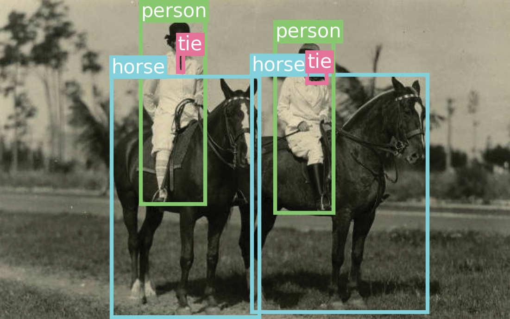
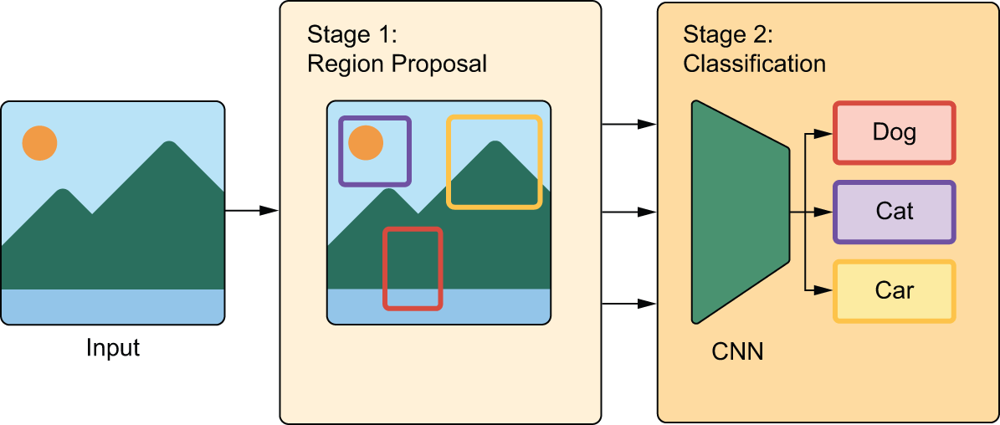
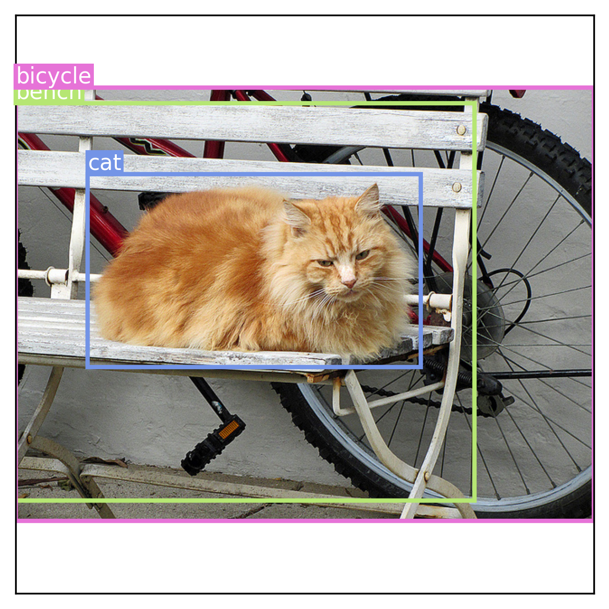
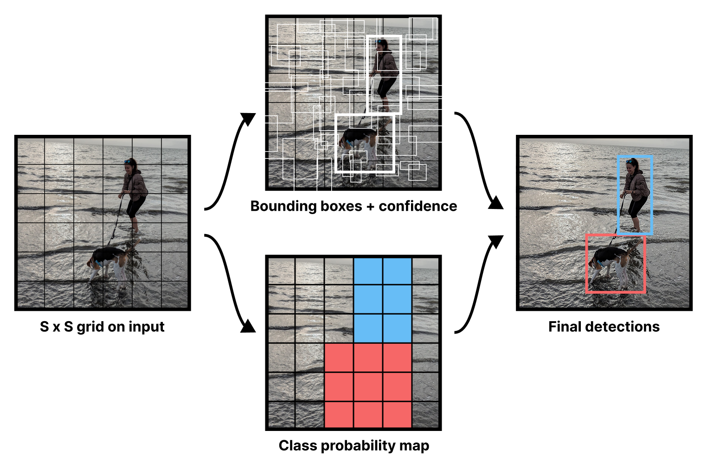
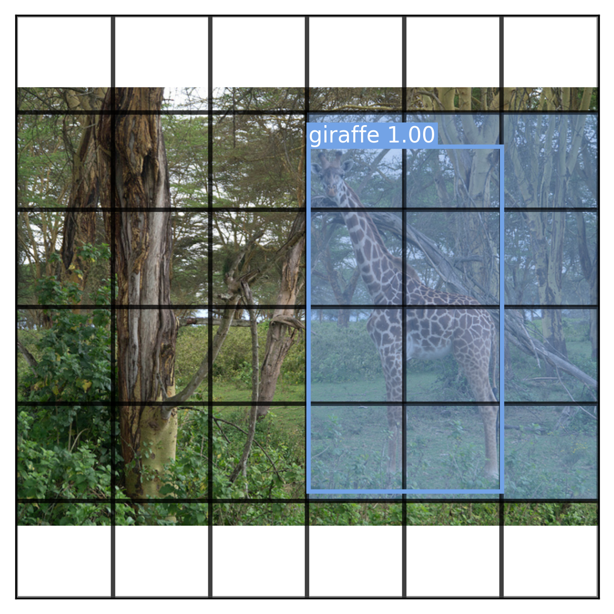
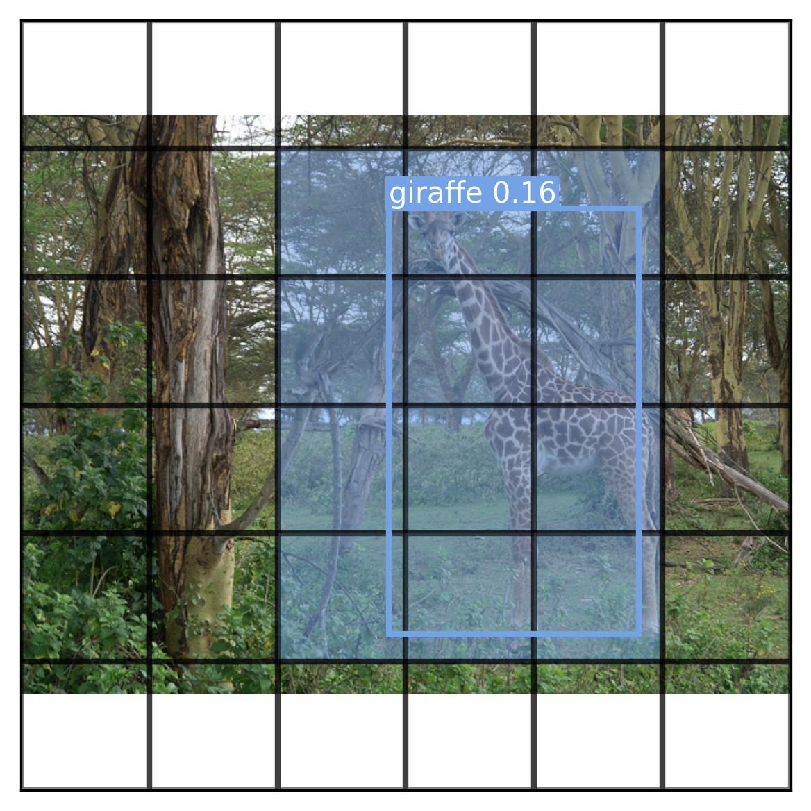
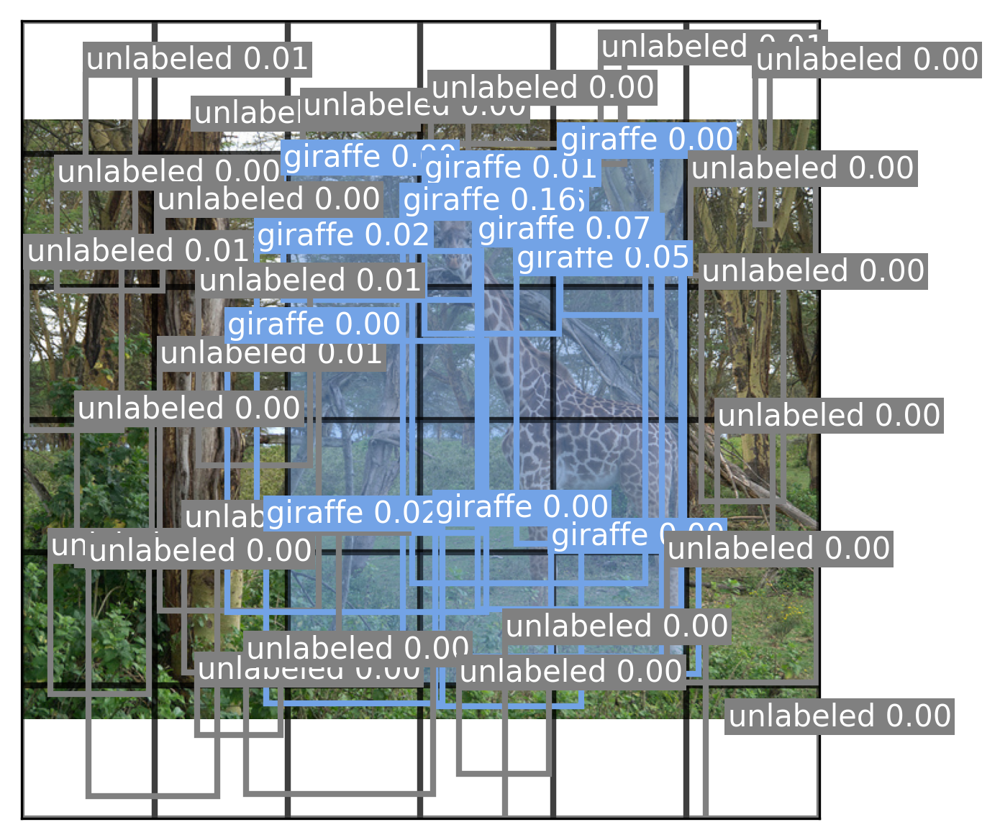
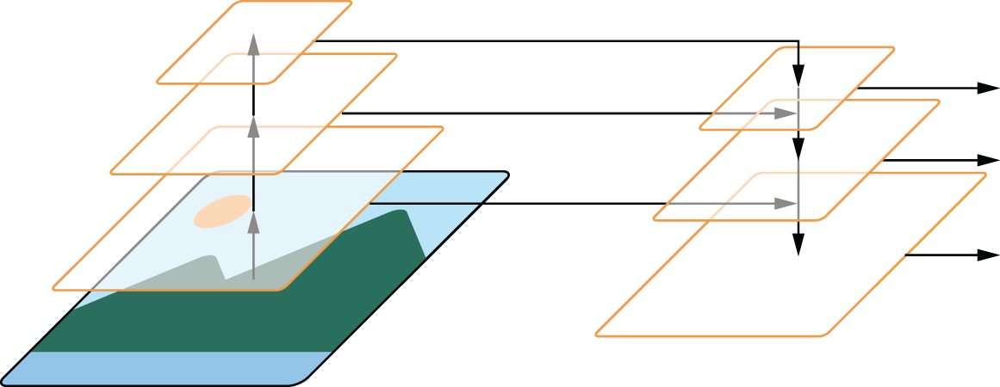
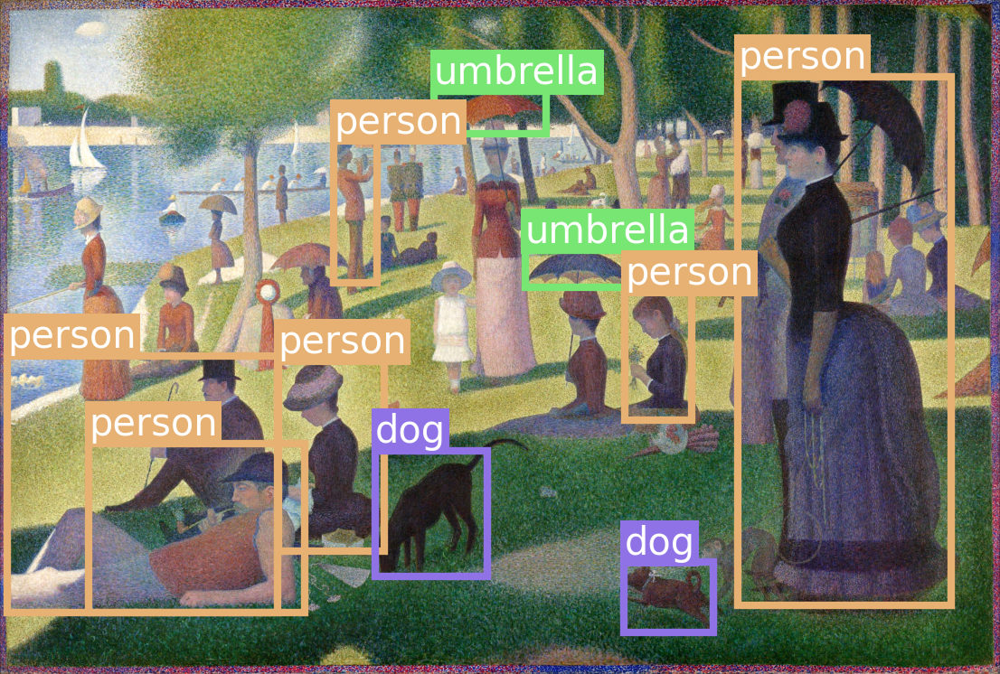

<!-- tabs:start -->

#### **Tiếng Anh (English)**

# Chapter 12: Object detection

This chapter covers

* Understanding the object detection problem
* Two-stage and single-stage object detectors
* Training a simple single-stage detector from scratch
* Using a pretrained object detector

Object detection is all about drawing boxes (called *bounding boxes*)
around objects of interest in a picture (see figure 12.1). This enables you to know
not just which objects are in a picture, but also where they are.
Some of its most common applications are

* *Counting* — Find out how many instances of an object are in an image.
* *Tracking* — Track how objects move in a scene over time by performing object detection on every frame of a movie.
* *Cropping* — Identify the area of an image that contains an object of interest
  to crop it and send a higher-resolution version of the image patch to
  a classifier or an Optical Character Recognition (OCR) model.




[Figure 12.1](#figure-12-1): Object detectors draw boxes around objects in an image and label them.

You might be thinking, if I have a segmentation mask for an object instance,
I can already compute the coordinates of the smallest box that contains the
mask. So couldn’t we just use image segmentation all the time? Do we need object
detection models at all?

Indeed, segmentation is a strict superset of detection. It returns all the
information that could be returned by a detection model — plus a lot more.
This increased wealth of information has a significant computational cost: a
good object detection model will typically run much faster than an image
segmentation model. It also has a data labeling cost: to train a segmentation
model, you need to collect pixel-precise masks, which are much more
time-consuming to produce than the mere bounding boxes required by object
detection models.

As a result, you will always want to use an object detection model if you have
no need for pixel-level information — for instance, if all you want is to count
objects in an image.

## Single-stage vs. two-stage object detectors

There are two broad categories of object detection architectures:

* Two-stage detectors, which first extract region proposals, known as Region-based Convolutional Neural Networks (R-CNN) models
* Single-stage detectors, such as RetinaNet or the You Only Look Once family of models

Here’s how they work.

### Two-stage R-CNN detectors

A region-based ConvNet, or R-CNN model, is a two-stage model. The first stage
takes an image and produces a few thousand partially overlapping bounding
boxes around areas that look object-like. These boxes are called *region
proposals*. This stage isn’t very smart, so at that point we aren’t quite sure
whether the proposed regions do contain objects and, if so, what objects they contain.

That’s the job of the second stage — a ConvNet that looks at each region
proposal and classifies it into a number of predetermined classes, just like the
models you’ve seen in chapter 9 (see figure 12.2). Region proposals that have a low score across
all classes considered are discarded. We are then left with a much smaller set
of boxes, each with a high class-presence score for one particular class.
Finally, bounding boxes around each object are further refined to
eliminate duplicates and make each bounding box as precise as possible.




[Figure 12.2](#figure-12-2): An R-CNN first extracts region proposals and then classifies the proposals with a ConvNet (a CNN).

In early R-CNN versions, the first stage was a *heuristic model* called
*Selective Search* that used some definition of spatial consistency to identify
object-like areas. *Heuristic* is a term you’ll hear quite a lot in machine
learning — it simply means “a bundle of hard-coded rules someone made up.” It’s
usually used in opposition to learned models (where the rules are automatically
derived) or theory-derived models. In later versions of R-CNN, such as
Faster-R-CNN, the box generation stage became a deep learning model, called a
Region Proposal Network.

The two-stage approach of R-CNN works very well in practice, but it’s quite
computationally expensive, most notably because it requires you to classify
thousands of patches — for every single image you process. That makes it
unsuitable for most real-time applications and for embedded systems. My take is
that, in practical applications, you generally don’t ever need a computationally
expensive object detection system like R-CNN because if you’re doing
server-side inference with a beefy GPU, then you’ll probably be better off using a
segmentation model instead, like the Segment Anything model we saw in the previous
chapter. And if you’re resource-constrained, then you’re going to want to use a
more computationally efficient object detection architecture — a single-stage
detector.

### Single-stage detectors

Around 2015, researchers and practitioners began experimenting with using a
single deep learning model to jointly predict bounding box coordinates together
with their labels, an architecture called a *single-stage detector*. The main
families of single-stage detectors are RetinaNet, Single Shot MultiBox
Detectors (SSD), and the You Only Look Once family, abbreviated as YOLO. Yes,
like the meme. That’s on purpose.

Single-stage detectors, especially recent YOLO iterations, boast significantly
faster speeds and greater efficiency than their two-stage counterparts, albeit
with a minor potential tradeoff in accuracy. Nowadays, YOLO is arguably the
most popular object detection model out there, especially when it comes to
real-time applications. There are usually a new version of it that comes out every
year — interestingly, each new version tends to be developed by a separate
organization.

In the next section, we will build a simplified YOLO model from scratch.

## Training a YOLO model from scratch

Overall, building an object detector can be a bit of an undertaking — not that
there’s anything theoretically complex about it. There’s just a lot of code
needed to handle manipulating bounding boxes and predicted output. To keep
things simple, we will recreate the very first YOLO model from 2015.
There’s 12 YOLO versions as of this writing, but the original is a bit
simpler to work with.

### Downloading the COCO dataset

Before we start creating our model, we need data to train with. The COCO dataset
[[1]](#footnote-1),
short for *Common Objects in Context*, is one of the best-known and most
commonly used object detection datasets. It consists of real-world photos from a
number of different sources plus human-created annotations. This includes object
labels, bounding box annotations, and full segmentation masks. We will
disregard the segmentation masks and just use bounding boxes.

Let’s download the 2017 version of the COCO dataset. While not a large dataset
by today’s standards, this 18 GB dataset will be the largest dataset we
use in the book. If you are running the code as you read, this is a good chance
to take a breather.

```python
import keras
import keras_hub

images_path = keras.utils.get_file(
    "coco",
    "http://images.cocodataset.org/zips/train2017.zip",
    extract=True,
)
annotations_path = keras.utils.get_file(
    "annotations",
    "http://images.cocodataset.org/annotations/annotations_trainval2017.zip",
    extract=True,
)
```

[Listing 12.1](#listing-12-1): Downloading the 2017 COCO dataset

We need to do some input massaging before we are ready to use this data. The
first download gives us an unlabeled directory of all the COCO images. The
second download includes all image metadata via a JSON file. COCO associates
each image file with an ID, and each bounding box is paired with one of these
IDs. We need to collate all box and image data together.

Each bounding box comes with `x, y, width, height` pixel coordinates starting at
the top left corner of the image. As we load our data, we can rescale all
bounding box coordinates so they are points in a `[0, 1]` unit square. This will
make it easier to manipulate these boxes without needing to check the size of
each input image.

```python
import json

with open(f"{annotations_path}/annotations/instances_train2017.json", "r") as f:
    annotations = json.load(f)

# Sorts image metadata by ID
images = {image["id"]: image for image in annotations["images"]}

# Converts bounding box to coordinates on a unit square
def scale_box(box, width, height):
    scale = 1.0 / max(width, height)
    x, y, w, h = [v * scale for v in box]
    x += (height - width) * scale / 2 if height > width else 0
    y += (width - height) * scale / 2 if width > height else 0
    return [x, y, w, h]

# Aggregates all bounding box annotations by image ID
metadata = {}
for annotation in annotations["annotations"]:
    id = annotation["image_id"]
    if id not in metadata:
        metadata[id] = {"boxes": [], "labels": []}
    image = images[id]
    box = scale_box(annotation["bbox"], image["width"], image["height"])
    metadata[id]["boxes"].append(box)
    metadata[id]["labels"].append(annotation["category_id"])
    metadata[id]["path"] = images_path + "/train2017/" + image["file_name"]
metadata = list(metadata.values())
```

[Listing 12.2](#listing-12-2): Parsing the COCO data

Let’s take a look at the data we just loaded.

```python
>>> len(metadata)
117266
>>> min([len(x["boxes"]) for x in metadata])
1
>>> max([len(x["boxes"]) for x in metadata])
63
>>> max(max(x["labels"]) for x in metadata) + 1
91
>>> metadata[435]
{"boxes": [[0.12, 0.27, 0.57, 0.33],
  [0.0, 0.15, 0.79, 0.69],
  [0.0, 0.12, 1.0, 0.75]],
 "labels": [17, 15, 2],
 "path": "/root/.keras/datasets/coco/train2017/000000171809.jpg"}
>>> [keras_hub.utils.coco_id_to_name(x) for x in metadata[435]["labels"]]
["cat", "bench", "bicycle"]
```

[Listing 12.3](#listing-12-3): Inspecting the COCO data

We have 117,266 images. Each image can have anywhere from 1 to 63 objects
with an associated bounding box. There are only 91 possible labels for objects,
chosen by the COCO dataset creators.

We can use a KerasHub utility `keras_hub.utils.coco_id_to_name(id)` to map
these integer labels to human-readable names, similar to the utility
we used to decode ImageNet predictions to text labels back in chapter 8.

Let’s visualize an example image to make this a little more concrete. We can
define a function to draw an image with Matplotlib and another function to draw
a labeled bounding box on this image. We will need both of these throughout the
chapter. We can use the HSV colorspace as a simple trick to generate new colors
for each new label we see. By fixing the saturation and brightness of the color
and only updating its hue, we can generate bright new colors that stand out
clearly from our image.

```python
import matplotlib.pyplot as plt
from matplotlib.colors import hsv_to_rgb
from matplotlib.patches import Rectangle

color_map = {0: "gray"}

def label_to_color(label):
    # Uses the golden ratio to generate new hues of a bright color with
    # the HSV colorspace
    if label not in color_map:
        h, s, v = (len(color_map) * 0.618) % 1, 0.5, 0.9
        color_map[label] = hsv_to_rgb((h, s, v))
    return color_map[label]

def draw_box(ax, box, text, color):
    x, y, w, h = box
    ax.add_patch(Rectangle((x, y), w, h, lw=2, ec=color, fc="none"))
    textbox = dict(fc=color, pad=1, ec="none")
    ax.text(x, y, text, c="white", size=10, va="bottom", bbox=textbox)

def draw_image(ax, image):
    # Draws the image on a unit cube with (0, 0) at the top left
    ax.set(xlim=(0, 1), ylim=(1, 0), xticks=[], yticks=[], aspect="equal")
    image = plt.imread(image)
    height, width = image.shape[:2]
    # Pads the image so it fits inside the unit cube
    hpad = (1 - height / width) / 2 if width > height else 0
    wpad = (1 - width / height) / 2 if height > width else 0
    extent = [wpad, 1 - wpad, 1 - hpad, hpad]
    ax.imshow(image, extent=extent)
```

[Listing 12.4](#listing-12-4): Visualizing a COCO image with box annotations

Let’s use our new visualization to look at the sample image[[2]](#footnote-2) we were inspecting
earlier (see figure 12.3):

```python
sample = metadata[435]
ig, ax = plt.subplots(dpi=300)
draw_image(ax, sample["path"])
for box, label in zip(sample["boxes"], sample["labels"]):
    label_name = keras_hub.utils.coco_id_to_name(label)
    draw_box(ax, box, label_name, label_to_color(label))
plt.show()
```





[Figure 12.3](#figure-12-3): YOLO outputs a bounding box prediction and class label for each image region.

While it would be fun to train on all 18 gigabytes of our input data, we want to
keep the examples in this book easily runnable on modest hardware. If we limit
ourselves to only images with four or fewer boxes, we will make our training
problem easier and a halve the data size. Let’s do this and shuffle our data —
the images are grouped by object type, which would be terrible for training:

```python
import random

metadata = list(filter(lambda x: len(x["boxes"]) <= 4, metadata))
random.shuffle(metadata)
```

That’s it for data loading! Let’s start creating our YOLO model.

### Creating a YOLO model

As mentioned previously, the YOLO model is a single stage detector. Rather than first
attempting to identify all candidate objects in a scene and then classifying the
object regions, YOLO will propose bounding boxes and object labels in one go.

Our model will divide an image up into a grid and predict two separate outputs
at each grid location — a bounding box and a class label. In the original
paper by Redmon et al.[[3]](#footnote-3), the model actually
predicted multiple boxes per grid location, but we keep things simple and just
predict one box in each grid square.

Most images will not have objects evenly distributed across a grid, and to
account for this, the model will output a *confidence score* along with each
box, as shown in figure 12.4. We’d like this confidence to be high when an object is detected at a
location, and zero when there’s no object. Most grid locations will have no
object and should report a near-zero confidence.




[Figure 12.4](#figure-12-4): YOLO outputs as visualized in the first YOLO paper

Like many models in computer vision, the YOLO model uses a ConvNet *backbone* to
obtain interesting high-level features for an input image, a concept we first
explored in chapter 8. In their paper, the authors created their own backbone
model and pretrained it with ImageNet for classification. Rather than do this
ourselves, we can instead use KerasHub to load a pretrained backbone.

Instead of using the Xception backbone we’ve used so far in this book, we will
switch to ResNet, a family of models we first mentioned in chapter 9. The
structure is quite similar to Xception, but ResNet uses strides instead of
pooling layers to downsample the image. As we mentioned in chapter 11, strided
convolutions are better when we care about the *spatial location* of the input.

Let’s load up our pretrained model and matching preprocessing (to rescale the
image). We will resize our images to 448 × 448; image input size is quite
important for the object detection task.

```python
image_size = 448

backbone = keras_hub.models.Backbone.from_preset(
    "resnet_50_imagenet",
)
preprocessor = keras_hub.layers.ImageConverter.from_preset(
    "resnet_50_imagenet",
    image_size=(image_size, image_size),
)
```

[Listing 12.5](#listing-12-5): Loading the ResNet model

Next, we can turn our backbone into a detection model by adding new layers for
outputting box and class predictions. The setup proposed in the YOLO paper is
quite simple. Take the output of a ConvNet backbone and feed it through two
densely connected layers with an activation in the middle. Then, split the
output. The first five numbers will be used for bounding box prediction (four
for the box and one for the box confidence). The rest will be used for the
*class probability map* shown in figure 12.4 — a classification prediction for
each grid location over all possible 91 labels.

Let’s write this out.

```python
from keras import layers

grid_size = 6
num_labels = 91

inputs = keras.Input(shape=(image_size, image_size, 3))
x = backbone(inputs)
# Makes our backbone outputs smaller and then flattens the output
# features
x = layers.Conv2D(512, (3, 3), strides=(2, 2))(x)
x = keras.layers.Flatten()(x)
# Passes our flattened feature maps through two densely connected
# layers
x = layers.Dense(2048, activation="relu", kernel_initializer="glorot_normal")(x)
x = layers.Dropout(0.5)(x)
x = layers.Dense(grid_size * grid_size * (num_labels + 5))(x)
# Reshapes outputs to a 6 × 6 grid
x = layers.Reshape((grid_size, grid_size, num_labels + 5))(x)
# Split box and class predictions
box_predictions = x[..., :5]
class_predictions = layers.Activation("softmax")(x[..., 5:])
outputs = {"box": box_predictions, "class": class_predictions}
model = keras.Model(inputs, outputs)
```

[Listing 12.6](#listing-12-6): Attaching a YOLO prediction head

We can get a better sense of the model by looking at the model summary:

```python
>>> model.summary()
Model: "functional_3"
┏━━━━━━━━━━━━━━━━━━━━━━━┳━━━━━━━━━━━━━━━━━━━┳━━━━━━━━━━━━━┳━━━━━━━━━━━━━━━━━━━━┓
┃ Layer (type)          ┃ Output Shape      ┃     Param # ┃ Connected to       ┃
┡━━━━━━━━━━━━━━━━━━━━━━━╇━━━━━━━━━━━━━━━━━━━╇━━━━━━━━━━━━━╇━━━━━━━━━━━━━━━━━━━━┩
│ input_layer_7         │ (None, 448, 448,  │           0 │ -                  │
│ (InputLayer)          │ 3)                │             │                    │
├───────────────────────┼───────────────────┼─────────────┼────────────────────┤
│ res_net_backbone_12   │ (None, 14, 14,    │  23,580,512 │ input_layer_7[0][… │
│ (ResNetBackbone)      │ 2048)             │             │                    │
├───────────────────────┼───────────────────┼─────────────┼────────────────────┤
│ conv2d_3 (Conv2D)     │ (None, 6, 6, 512) │   9,437,696 │ res_net_backbone_… │
├───────────────────────┼───────────────────┼─────────────┼────────────────────┤
│ flatten_3 (Flatten)   │ (None, 18432)     │           0 │ conv2d_3[0][0]     │
├───────────────────────┼───────────────────┼─────────────┼────────────────────┤
│ dense_6 (Dense)       │ (None, 2048)      │  37,750,784 │ flatten_3[0][0]    │
├───────────────────────┼───────────────────┼─────────────┼────────────────────┤
│ dropout_3 (Dropout)   │ (None, 2048)      │           0 │ dense_6[0][0]      │
├───────────────────────┼───────────────────┼─────────────┼────────────────────┤
│ dense_7 (Dense)       │ (None, 3456)      │   7,081,344 │ dropout_3[0][0]    │
├───────────────────────┼───────────────────┼─────────────┼────────────────────┤
│ reshape_3 (Reshape)   │ (None, 6, 6, 96)  │           0 │ dense_7[0][0]      │
├───────────────────────┼───────────────────┼─────────────┼────────────────────┤
│ get_item_7 (GetItem)  │ (None, 6, 6, 91)  │           0 │ reshape_3[0][0]    │
├───────────────────────┼───────────────────┼─────────────┼────────────────────┤
│ get_item_6 (GetItem)  │ (None, 6, 6, 5)   │           0 │ reshape_3[0][0]    │
├───────────────────────┼───────────────────┼─────────────┼────────────────────┤
│ activation_33         │ (None, 6, 6, 91)  │           0 │ get_item_7[0][0]   │
│ (Activation)          │                   │             │                    │
└───────────────────────┴───────────────────┴─────────────┴────────────────────┘
 Total params: 77,850,336 (296.98 MB)
 Trainable params: 77,797,088 (296.77 MB)
 Non-trainable params: 53,248 (208.00 KB)
```

Our backbone outputs have shape `(batch_size, 14, 14, 2048)`. That is 401,408
output floats per image, a bit too many to feed into our dense layers. We
downscale the feature maps with a strided conv layer to
`(batch_size, 6, 6, 512)` with a more manageable 18,432 floats per image.

Next, we can add our two densely connected layers. We flatten the entire feature
map, pass it through a `Dense` with a `relu` activation and then pass it through a
final `Dense` with our exact number of output predictions — 5 for the bounding
box and confidence and 91 for each object class at each grid location.

Finally, we reshape the outputs back to a 6 × 6 grid and split our box and class
predictions. As usual for our classification outputs, we apply a softmax. The
box outputs will need more special consideration; we will cover this later.

Looking good! Note that because we flatten the entire feature map through the
classification layer, every grid detector can use the entire image’s features;
there’s no locality constraint. This is by design — large objects will not stay
contained to a single grid cell.

### Readying the COCO data for the YOLO model

Our model is relatively simple, but we still need to preprocess our inputs to
align them with the prediction grid. Each grid detector will be responsible for
detecting any boxes whose center falls inside the grid box. Our model will
output five floats for the box `(x, y, w, h, confidence)`. The `x` and `y` will
represent the object’s center relative to the bounds of the grid cell (from 0 to
1). The `w` and `h` will represent the object’s size relative to the image size.

We already have the right `w` and `h` values in our training data. However, we
need to translate our `x` and `y` values to and from the grid. Let’s define two
utilities:

```python
def to_grid(box):
    x, y, w, h = box
    cx, cy = (x + w / 2) * grid_size, (y + h / 2) * grid_size
    ix, iy = int(cx), int(cy)
    return (ix, iy), (cx - ix, cy - iy, w, h)

def from_grid(loc, box):
    (xi, yi), (x, y, w, h) = loc, box
    x = (xi + x) / grid_size - w / 2
    y = (yi + y) / grid_size - h / 2
    return (x, y, w, h)
```

Let’s rework our training data so it conforms to this new grid structure. We can
create two arrays as long as our dataset with our grid:

* The first will contain our class probability map. We will mark all grid cells
  that intersect with a bounding box with the correct label. To keep our code
  simple, we won’t worry about overlapping boxes.
* The second will contain the boxes themselves. We will translate all boxes to
  the grid and label the correct grid cell with the coordinates for the box. The
  confidence for an actual box in our label data will always be one, and the
  confidence for all other locations will be zero.

```python
import numpy as np
import math

class_array = np.zeros((len(metadata), grid_size, grid_size))
box_array = np.zeros((len(metadata), grid_size, grid_size, 5))

for index, sample in enumerate(metadata):
    boxes, labels = sample["boxes"], sample["labels"]
    for box, label in zip(boxes, labels):
        (x, y, w, h) = box
        # Finds all grid cells whose center falls inside the box
        left, right = math.floor(x * grid_size), math.ceil((x + w) * grid_size)
        bottom, top = math.floor(y * grid_size), math.ceil((y + h) * grid_size)
        class_array[index, bottom:top, left:right] = label

for index, sample in enumerate(metadata):
    boxes, labels = sample["boxes"], sample["labels"]
    for box, label in zip(boxes, labels):
        # Transforms the box to the grid coordinate system
        (xi, yi), (grid_box) = to_grid(box)
        box_array[index, yi, xi] = [*grid_box, 1.0]
        # Makes sure the class label for the box's center location
        # matches the box
        class_array[index, yi, xi] = label
```

[Listing 12.7](#listing-12-7): Creating the YOLO targets

Let’s visualize our YOLO training data with our box drawing helpers (figure 12.5). We will
draw the entire class activation map over our first input image[[4]](#footnote-4) and add the confidence
score of a box along with its label.

```python
def draw_prediction(image, boxes, classes, cutoff=None):
    fig, ax = plt.subplots(dpi=300)
    draw_image(ax, image)
    # Draws the YOLO output grid and class probability map
    for yi, row in enumerate(classes):
        for xi, label in enumerate(row):
            color = label_to_color(label) if label else "none"
            x, y, w, h = (v / grid_size for v in (xi, yi, 1.0, 1.0))
            r = Rectangle((x, y), w, h, lw=2, ec="black", fc=color, alpha=0.5)
            ax.add_patch(r)
    # Draws all boxes at each grid location above our cutoff
    for yi, row in enumerate(boxes):
        for xi, box in enumerate(row):
            box, confidence = box[:4], box[4]
            if not cutoff or confidence >= cutoff:
                box = from_grid((xi, yi), box)
                label = classes[yi, xi]
                color = label_to_color(label)
                name = keras_hub.utils.coco_id_to_name(label)
                draw_box(ax, box, f"{name} {max(confidence, 0):.2f}", color)
    plt.show()

draw_prediction(metadata[0]["path"], box_array[0], class_array[0], cutoff=1.0)
```

[Listing 12.8](#listing-12-8): Visualizing a YOLO target





[Figure 12.5](#figure-12-5): YOLO outputs a bounding box prediction and class label for each image. region.

Lastly, let’s use `tf.data` to load our image data. We will load our images
from disk, apply our preprocessing, and batch them. We should also split a
validation set to monitor training.

```python
import tensorflow as tf

# Loads and resizes the model with tf.data
def load_image(path):
    x = tf.io.read_file(path)
    x = tf.image.decode_jpeg(x, channels=3)
    return preprocessor(x)

images = tf.data.Dataset.from_tensor_slices([x["path"] for x in metadata])
images = images.map(load_image, num_parallel_calls=8)
labels = {"box": box_array, "class": class_array}
labels = tf.data.Dataset.from_tensor_slices(labels)

# Creates a merged dataset and batches it
dataset = tf.data.Dataset.zip(images, labels).batch(16).prefetch(2)
# Splits off some validation data
val_dataset, train_dataset = dataset.take(500), dataset.skip(500)
```

[Listing 12.9](#listing-12-9): Creating a dataset to train on

With that, our data is ready for training.

This training example shows clearly why a streaming library like `tf.data` is helpful.
Loading all the images in this large dataset in one go would overwhelm our system memory
(remember an image tensor is much larger than a compressed JPEG file). With `tf.data`, we
can load our image data in batch by batch and release the memory when we are
done, only mapping in the particular parts of the dataset we need at a given
moment. The `prefetch(2)` call will cause `tf.data` to keep two batches
buffered and ready before they are used so we don’t interrupt training each
batch to load and resize more images.

### Training the YOLO model

We have our model and our training data ready, but there’s one last element we
need before we can actually run `fit()`: the loss function. Our model outputs
predicted boxes and predicted grid labels. We saw in chapter 7 how we can define
multiple losses for each output — Keras will simply sum the losses together
during training. We can handle the classification loss with
`sparse_categorical_crossentropy` as usual.

The box loss, however, needs some special consideration. The basic loss proposed
by the YOLO authors is fairly simple. They use the sum-squared error of the
difference between the target box parameters and the predicted ones. We will
only compute this error for grid cells with actual boxes in the labeled data.

The tricky part of the loss is the box confidence output. The authors wanted the
confidence output to reflect not just the presence of an object, but also how
good the predicted box is. To create a smooth estimate of how good a box
prediction is, the authors propose using the *Intersection over Union* (IoU)
metric we saw last chapter. If a grid cell is empty, the predicted confidence at
the location should be zero. However, if a grid cell contains an object, we can
use the IoU score between the current box prediction and the actual box as the
target confidence value. This way, as the model becomes better at predicting box
locations, the IoU score and the learned confidence values will go up.

This calls for a custom loss function. We can start be defining a utility to
compute IoU scores for target and predicted boxes.

```python
from keras import ops

# Unpacks a tensor of boxes
def unpack(box):
    return box[..., 0], box[..., 1], box[..., 2], box[..., 3]

# Computes the intersection area between two box tensors
def intersection(box1, box2):
    cx1, cy1, w1, h1 = unpack(box1)
    cx2, cy2, w2, h2 = unpack(box2)
    left = ops.maximum(cx1 - w1 / 2, cx2 - w2 / 2)
    bottom = ops.maximum(cy1 - h1 / 2, cy2 - h2 / 2)
    right = ops.minimum(cx1 + w1 / 2, cx2 + w2 / 2)
    top = ops.minimum(cy1 + h1 / 2, cy2 + h2 / 2)
    return ops.maximum(0.0, right - left) * ops.maximum(0.0, top - bottom)

# Computes the IoU between two box tensors
def intersection_over_union(box1, box2):
    cx1, cy1, w1, h1 = unpack(box1)
    cx2, cy2, w2, h2 = unpack(box2)
    intersection_area = intersection(box1, box2)
    a1 = ops.maximum(w1, 0.0) * ops.maximum(h1, 0.0)
    a2 = ops.maximum(w2, 0.0) * ops.maximum(h2, 0.0)
    union_area = a1 + a2 - intersection_area
    return ops.divide_no_nan(intersection_area, union_area)
```

[Listing 12.10](#listing-12-10): Computing IoU for two boxes

Let’s use this utility to define our custom loss. Redmon et al. propose a
couple of loss scaling tricks to improve the quality of training:

* They scale up the box placement loss by a factor of five, so it becomes a
  more important part of overall training.
* Since most grid cells are empty, they also scale down the confidence loss in
  empty locations by a factor of two. This keeps these zero confidence
  predictions from overwhelming the loss.
* They take the square root of the width and height before computing the
  loss. This is to stop large boxes from mattering disproportionately more than
  small boxes. We will use a `sqrt` function that preserves the sign of the
  input, since our model might predict negative widths and heights at the start
  of training.

Let’s write this out.

```python
def signed_sqrt(x):
    return ops.sign(x) * ops.sqrt(ops.absolute(x) + keras.config.epsilon())

def box_loss(true, pred):
    # Unpacks values
    xy_true, wh_true, conf_true = true[..., :2], true[..., 2:4], true[..., 4:]
    xy_pred, wh_pred, conf_pred = pred[..., :2], pred[..., 2:4], pred[..., 4:]
    # If confidence_true is 0.0, there is no object in this grid cell.
    no_object = conf_true == 0.0
    # Computes box placement errors
    xy_error = ops.square(xy_true - xy_pred)
    wh_error = ops.square(signed_sqrt(wh_true) - signed_sqrt(wh_pred))
    # Computes confidence error
    iou = intersection_over_union(true, pred)
    conf_target = ops.where(no_object, 0.0, ops.expand_dims(iou, -1))
    conf_error = ops.square(conf_target - conf_pred)
    # Concatenates the errors weith scaling hacks
    error = ops.concatenate(
        (
            ops.where(no_object, 0.0, xy_error * 5.0),
            ops.where(no_object, 0.0, wh_error * 5.0),
            ops.where(no_object, conf_error * 0.5, conf_error),
        ),
        axis=-1,
    )
    # Returns one loss value per sample; Keras will sum over the batch.
    return ops.sum(error, axis=(1, 2, 3))
```

[Listing 12.11](#listing-12-11): Defining the YOLO bounding box loss

We are finally ready to start training our YOLO model. Purely to keep this
example short, we will skip over metrics. In a real-world setting, you’d
want quite a few metrics here — such as the accuracy of the model at different
confidence cutoff levels.

```python
model.compile(
    optimizer=keras.optimizers.Adam(2e-4),
    loss={"box": box_loss, "class": "sparse_categorical_crossentropy"},
)
model.fit(
    train_dataset,
    validation_data=val_dataset,
    epochs=4,
)
```

[Listing 12.12](#listing-12-12): Training the YOLO model

Training takes over an hour on the Colab free GPU runtime, and our model is
still undertrained (validation loss is still falling!). Let’s try visualizing an
output from our model (figure 12.6). We will use a low-confidence cutoff, as our model is not
a very good object detector quite yet.

```python
# Rebatches our dataset to get a single sample instead of 16
x, y = next(iter(val_dataset.rebatch(1)))
preds = model.predict(x)
boxes = preds["box"][0]
# Uses argmax to find the most likely label at each grid location
classes = np.argmax(preds["class"][0], axis=-1)
# Loads the image from disk to view it a full size
path = metadata[0]["path"]
draw_prediction(path, boxes, classes, cutoff=0.1)
```

[Listing 12.13](#listing-12-13): Training the YOLO model





[Figure 12.6](#figure-12-6): Predictions for our sample image

We can see our model is starting to understand box locations and class labels,
though it is still not very accurate. Let’s visualize every box predicted by
the model (figure 12.7), even those with zero confidence:

```python
draw_prediction(path, boxes, classes, cutoff=None)
```





[Figure 12.7](#figure-12-7): Every bounding box predicted by the YOLO model

Our model learns very low-confidence values because it has not yet learned to
consistently locate objects in a scene. To further improve the model, we should
try a number of things:

* Train for more epochs
* Use the whole COCO dataset
* Data augmentation (e.g., translating and rotating input images and boxes)
* Improve our class probability map for overlapping boxes
* Predict multiple boxes per grid location using a bigger output grid

All of these would positively affect the model performance and get us closer to
the original YOLO training recipe. However, this example is really just to get a
feel for object detection training — training an accurate COCO detection model
from scratch would take a large amount of compute and time. Instead, to get a
sense of a better-performing detection model, let’s try using a pretrained
object detection model called RetinaNet.

## Using a pretrained RetinaNet detector

RetinaNet is also a single-stage object detector and operates on the same basic
principles as the YOLO model. The biggest conceptual difference between our
model and RetinaNet is that RetinaNet uses its underlying ConvNet differently to
better handle both small and large objects simultaneously.

In our YOLO model, we simply took the final outputs of our ConvNet and used them
to build our object detector. These output features map to large areas on our
input image — as a result, they are not very effective at finding small objects
in the scene.

One option to solve this scale issue would be to directly use the output of
earlier layers in our ConvNet. This would extract high-resolution features that
map to small localized areas of our input image. However, the output of these
early layers is not very *semantically interesting*. It might map to
different types of simple features like edges and curves, but only later in the
ConvNet layers do we start building latent representations for entire objects.

The solution used by RetinaNet is called a feature pyramid network. The final
features from the ConvNet base model are upsampled with progressive
`Conv2DTranspose` layers, just like we saw in the previous chapter. But critically, we also
include *lateral connections* where we sum these upsampled feature maps with the
feature maps of the same size from the original ConvNet. This combines the
semantically interesting, low-resolution features at the end of the ConvNet with
the high-resolution, small-scale features from the beginning of the ConvNet. A
rough sketch of this architecture is shown in figure 12.8.




[Figure 12.8](#figure-12-8): A feature pyramid network creates semantically interesting feature maps at different scales.

Feature pyramid networks can substantially boost performance by building
effective features for both small and large objects in terms of pixel footprint.
Recent versions of YOLO also use the same setup.

Let’s go ahead and try out the RetinaNet model, which was also trained on the
COCO dataset. To make this a little more interesting, let’s try an image that
is out-of-distribution for the model, the Pointillist painting
*A Sunday Afternoon on the Island of La Grande Jatte*.

We can start by downloading the image and converting it to a NumPy array:

```python
url = "https://s3.us-east-1.amazonaws.com/book.keras.io/3e/seurat.jpg"
path = keras.utils.get_file(origin=url)
image = np.array([keras.utils.load_img(path)])
```

Next, let’s download the model and make a prediction. As we did in the previous chapter,
we can use the high-level task API in KerasHub to create an `ObjectDetector`
and use it — preprocessing included.

```python
detector = keras_hub.models.ObjectDetector.from_preset(
    "retinanet_resnet50_fpn_v2_coco",
    bounding_box_format="rel_xywh",
)
predictions = detector.predict(image)
```

[Listing 12.14](#listing-12-14): Creating the ResNet model

You’ll note we pass an extra argument to specify the bounding box format. We can
do this for most Keras models and layers that support bounding boxes. We pass
`"rel_xywh"` to use the same format as we did for the YOLO model, so we can use
the same box-drawing utilities. Here, `rel` stands for relative to the image
size (e.g., from [0, 1]). Let’s inspect the prediction we just made:

```python
>>> [(k, v.shape) for k, v in predictions.items()]
[("boxes", (1, 100, 4)),
 ("confidence", (1, 100)),
 ("labels", (1, 100)),
 ("num_detections", (1,))]
>>> predictions["boxes"][0][0]
array([0.53, 0.00, 0.81, 0.29], dtype=float32)
```

We have four different model outputs: bounding boxes, confidences, labels,
and the total number of detections. This is overall quite similar to our YOLO
model. The model can predict a total of 100 objects for each input model.

Let’s try displaying the prediction with our box drawing utilities (figure 12.9).

```python
fig, ax = plt.subplots(dpi=300)
draw_image(ax, path)
num_detections = predictions["num_detections"][0]
for i in range(num_detections):
    box = predictions["boxes"][0][i]
    label = predictions["labels"][0][i]
    label_name = keras_hub.utils.coco_id_to_name(label)
    draw_box(ax, box, label_name, label_to_color(label))
plt.show()
```

[Listing 12.15](#listing-12-15): Running inference with RetinaNet





[Figure 12.9](#figure-12-9): Predictions on a test image from the RetinaNet model

The RetinaNet model is able to generalize to a pointillist painting
with ease, despite no training on this style of input! This is actually one of
the advantages of single-stage object detectors. Paintings and photographs are
very different at a pixel level but share a similar structure at a high level.
Two-stage detectors like R-CNNs, in contrast, are forced to classify small patches of an input
image in isolation, which is extra difficult when small patches of pixels look
very different than training data. Single-stage detectors can draw on features
from the entire input and are more robust to novel test-time inputs.

With that, you have reached the end of the computer vision section of this book!
We have trained image classifiers, segmenters, and object detectors from scratch.
We’ve developed a good intuition for how ConvNets work, the first major success
of the deep learning era. We aren’t quite done with images yet; you will see
them again in chapter 17 when we start generating image output.

## Summary

* Object detection identifies and locates objects within an image using bounding
  boxes. It’s basically a weaker version of image segmentation, but one that
  can be run much more efficiently.
* There are two primary approaches to object detection:
  + Region-based Convolutional Neural Networks (R-CNNs), which are two-stage
    models that first propose regions of interest and then classify them with
    a ConvNet.
  + Single-stage detectors (like RetinaNet and YOLO), which perform both tasks
    in a single step. Single-stage detectors are generally faster and more
    efficient, making them suitable for real-time applications (e.g.,
    self-driving cars).
* YOLO computes two separate outputs simultaneously during training
  — possible bounding boxes and a class probability map:
  + Each candidate bounding box is paired with a confidence score, which is
    trained to target the *Intersection over Union* of the predicted box and
    the ground truth box.
  + The class probability map classifies different regions of an image as
    belonging to different objects.
* RetinaNet builds on this idea by using a feature pyramid network (FPN), which
  combines features from multiple ConvNet layers to create feature maps at different scales,
  allowing it to more accurately detect objects of different sizes.

#### **Tiếng Việt (Vietnamese)**

# Chương 12: Phát hiện đối tượng

Chương này bao gồm

* Hiểu vấn đề phát hiện đối tượng
* Máy dò đối tượng hai giai đoạn và một giai đoạn
* Đào tạo một máy dò một giai đoạn đơn giản từ đầu
* Sử dụng máy dò đối tượng được đào tạo trước

Phát hiện đối tượng là việc vẽ các hộp (gọi là *hộp giới hạn*) xung quanh các đối tượng quan tâm trong ảnh (xem hình 12.1). Điều này cho phép bạn biết không chỉ những đối tượng nào trong ảnh mà còn biết chúng ở đâu. Một số ứng dụng phổ biến nhất của nó là

* *Đếm* — Tìm hiểu xem có bao nhiêu đối tượng trong một hình ảnh.
* *Theo dõi* — Theo dõi cách các đối tượng di chuyển trong một cảnh theo thời gian bằng cách thực hiện phát hiện đối tượng trên mọi khung hình của phim.
* *Cắt xén* — Xác định khu vực của hình ảnh có chứa đối tượng quan tâm
để cắt nó và gửi phiên bản hình ảnh có độ phân giải cao hơn tới
một bộ phân loại hoặc mô hình Nhận dạng Ký tự Quang học (OCR).


[Figure 12.1](#figure-12-1): Object detectors draw boxes around objects in an image and label them.

Bạn có thể đang nghĩ, nếu tôi có mặt nạ phân đoạn cho một phiên bản đối tượng, tôi có thể tính tọa độ của hộp nhỏ nhất chứa mặt nạ đó. Vì vậy, không phải chúng ta có thể sử dụng phân đoạn hình ảnh mọi lúc sao? Chúng ta có cần các mô hình phát hiện đối tượng không?

Indeed, segmentation is a strict superset of detection. It returns all the information that could be returned by a detection model — plus a lot more. Sự giàu có của thông tin ngày càng tăng này có chi phí tính toán đáng kể: một mô hình phát hiện đối tượng tốt thường sẽ chạy nhanh hơn nhiều so với mô hình phân đoạn hình ảnh. Nó cũng có chi phí ghi nhãn dữ liệu: để đào tạo mô hình phân đoạn, bạn cần thu thập các mặt nạ chính xác đến từng pixel, việc sản xuất này tốn nhiều thời gian hơn so với các hộp giới hạn đơn thuần mà các mô hình phát hiện đối tượng yêu cầu.

Do đó, bạn sẽ luôn muốn sử dụng mô hình phát hiện đối tượng nếu bạn không cần thông tin cấp pixel — ví dụ: nếu tất cả những gì bạn muốn là đếm các đối tượng trong một hình ảnh.

## Máy dò vật thể một giai đoạn và hai giai đoạn

Có hai loại kiến ​​trúc phát hiện đối tượng rộng rãi:

* Trình phát hiện hai giai đoạn, trước tiên trích xuất các đề xuất vùng, được gọi là mô hình Mạng thần kinh chuyển đổi dựa trên khu vực (R-CNN)
* Các trình phát hiện một giai đoạn, chẳng hạn như RetinaNet hoặc dòng mô hình You Only Look Once

Đây là cách họ làm việc.

### Máy dò R-CNN hai giai đoạn

Mô hình ConvNet hoặc R-CNN dựa trên khu vực là mô hình hai giai đoạn. Giai đoạn đầu tiên lấy một hình ảnh và tạo ra vài nghìn hộp giới hạn chồng lên nhau một phần xung quanh các khu vực trông giống vật thể. Những hộp này được gọi là *đề xuất khu vực*. Giai đoạn này không thông minh lắm, vì vậy tại thời điểm đó, chúng tôi không chắc chắn liệu các vùng được đề xuất có chứa các đối tượng hay không và nếu có thì chúng chứa những đối tượng nào.

Đó là công việc của giai đoạn thứ hai — một ConvNet xem xét từng đề xuất khu vực và phân loại nó thành một số lớp được xác định trước, giống như các mô hình bạn đã thấy trong chương 9 (xem hình 12.2). Các đề xuất khu vực có điểm thấp trên tất cả các lớp được xem xét sẽ bị loại bỏ. Sau đó, chúng tôi còn lại một bộ hộp nhỏ hơn nhiều, mỗi hộp có điểm hiện diện cao cho một lớp cụ thể. Cuối cùng, các hộp giới hạn xung quanh mỗi đối tượng được tinh chỉnh thêm để loại bỏ sự trùng lặp và làm cho mỗi hộp giới hạn chính xác nhất có thể.


[Figure 12.2](#figure-12-2): An R-CNN first extracts region proposals and then classifies the proposals with a ConvNet (a CNN).

Trong các phiên bản R-CNN đầu tiên, giai đoạn đầu tiên là *mô hình phỏng đoán* được gọi là *Tìm kiếm có chọn lọc* sử dụng một số định nghĩa về tính nhất quán trong không gian để xác định các khu vực giống đối tượng. *Heuristic* là một thuật ngữ bạn sẽ nghe khá nhiều trong machine learning — nó đơn giản có nghĩa là “một tập hợp các quy tắc được mã hóa cứng do ai đó tạo ra”. Nó thường được sử dụng để đối lập với các mô hình đã học (trong đó các quy tắc được rút ra tự động) hoặc các mô hình bắt nguồn từ lý thuyết. Trong các phiên bản sau của R-CNN, chẳng hạn như Faster-R-CNN, giai đoạn tạo hộp đã trở thành mô hình học sâu, được gọi là Mạng đề xuất khu vực.

Cách tiếp cận hai giai đoạn của R-CNN hoạt động rất tốt trong thực tế, nhưng nó khá tốn kém về mặt tính toán, đáng chú ý nhất là vì nó yêu cầu bạn phải phân loại hàng nghìn bản vá - cho mỗi hình ảnh bạn xử lý. Điều đó làm cho nó không phù hợp với hầu hết các ứng dụng thời gian thực và các hệ thống nhúng. Tôi nghĩ rằng, trong các ứng dụng thực tế, bạn thường không bao giờ cần một hệ thống phát hiện đối tượng đắt tiền về mặt tính toán như R-CNN vì nếu bạn đang thực hiện suy luận phía máy chủ với GPU mạnh thì có lẽ tốt hơn hết bạn nên sử dụng mô hình phân đoạn thay thế, giống như mô hình Segment Anything mà chúng ta đã thấy trong chương trước. Và nếu bạn bị hạn chế về tài nguyên thì bạn sẽ muốn sử dụng kiến ​​trúc phát hiện đối tượng hiệu quả hơn về mặt tính toán - trình phát hiện một giai đoạn.

### Máy dò một tầng

Khoảng năm 2015, các nhà nghiên cứu và học viên bắt đầu thử nghiệm sử dụng một mô hình học sâu duy nhất để cùng nhau dự đoán tọa độ hộp giới hạn cùng với nhãn của chúng, một kiến ​​trúc được gọi là *bộ phát hiện một giai đoạn*. Các dòng chính của máy dò một giai đoạn là RetinaNet, Single Shot MultiBox Detectors (SSD) và dòng You Only Look Once, viết tắt là YOLO. Vâng, giống như meme. Đó là mục đích.

Các máy dò một giai đoạn, đặc biệt là các phiên bản YOLO gần đây, có tốc độ nhanh hơn đáng kể và hiệu quả cao hơn so với các máy dò hai giai đoạn, mặc dù có một sự đánh đổi nhỏ về độ chính xác. Ngày nay, YOLO được cho là mô hình phát hiện đối tượng phổ biến nhất hiện nay, đặc biệt là khi nói đến các ứng dụng thời gian thực. Thường có một phiên bản mới được phát hành hàng năm - điều thú vị là mỗi phiên bản mới có xu hướng được phát triển bởi một tổ chức riêng biệt.

Trong phần tiếp theo, chúng ta sẽ xây dựng một mô hình YOLO đơn giản hóa từ đầu.

## Đào tạo mô hình YOLO từ đầu

Nhìn chung, việc xây dựng một máy dò tìm đối tượng có thể là một công việc hơi khó khăn - không có gì phức tạp về mặt lý thuyết về nó. Chỉ cần rất nhiều mã để xử lý các hộp giới hạn thao tác và đầu ra được dự đoán. Để đơn giản hóa mọi thứ, chúng tôi sẽ tạo lại mô hình YOLO đầu tiên từ năm 2015. Tính đến thời điểm viết bài này, có 12 phiên bản YOLO, nhưng phiên bản gốc đơn giản hơn một chút để làm việc.

### Đang tải xuống tập dữ liệu COCO

Trước khi bắt đầu tạo mô hình, chúng ta cần dữ liệu để huấn luyện. Bộ dữ liệu COCO [[1]](#footnote-1), viết tắt của *Đối tượng chung trong ngữ cảnh*, là một trong những bộ dữ liệu phát hiện đối tượng được biết đến nhiều nhất và được sử dụng phổ biến nhất. Nó bao gồm các bức ảnh trong thế giới thực từ một số nguồn khác nhau cùng với các chú thích do con người tạo ra. Điều này bao gồm nhãn đối tượng, chú thích hộp giới hạn và mặt nạ phân đoạn đầy đủ. Chúng ta sẽ bỏ qua các mặt nạ phân đoạn và chỉ sử dụng các hộp giới hạn.

Hãy tải xuống phiên bản 2017 của bộ dữ liệu COCO. Mặc dù không phải là tập dữ liệu lớn theo tiêu chuẩn ngày nay, nhưng tập dữ liệu 18 GB này sẽ là tập dữ liệu lớn nhất mà chúng tôi sử dụng trong sách. Nếu bạn đang chạy mã khi đọc thì đây là cơ hội tốt để xả hơi.

```python
import keras
import keras_hub

images_path = keras.utils.get_file(
    "coco",
    "http://images.cocodataset.org/zips/train2017.zip",
    extract=True,
)
annotations_path = keras.utils.get_file(
    "annotations",
    "http://images.cocodataset.org/annotations/annotations_trainval2017.zip",
    extract=True,
)
```

[Danh sách 12.1](#listing-12-1): Đang tải xuống tập dữ liệu COCO 2017

Chúng tôi cần thực hiện một số thao tác đầu vào trước khi sẵn sàng sử dụng dữ liệu này. Lần tải xuống đầu tiên cung cấp cho chúng tôi một thư mục không có nhãn chứa tất cả các hình ảnh COCO. Lần tải xuống thứ hai bao gồm tất cả siêu dữ liệu hình ảnh thông qua tệp JSON. COCO liên kết mỗi tệp hình ảnh với một ID và mỗi hộp giới hạn được ghép nối với một trong các ID này. Chúng ta cần đối chiếu tất cả dữ liệu hộp và hình ảnh với nhau.

Mỗi hộp giới hạn đi kèm với tọa độ pixel `x, y, chiều rộng, chiều cao` bắt đầu từ góc trên cùng bên trái của hình ảnh. Khi tải dữ liệu, chúng tôi có thể định lại tỷ lệ tất cả tọa độ hộp giới hạn để chúng là các điểm trong một hình vuông đơn vị `[0, 1]`. Điều này sẽ giúp thao tác với các hộp này dễ dàng hơn mà không cần kiểm tra kích thước của từng ảnh đầu vào.

```python
import json

with open(f"{annotations_path}/annotations/instances_train2017.json", "r") as f:
    annotations = json.load(f)

# Sorts image metadata by ID
images = {image["id"]: image for image in annotations["images"]}

# Converts bounding box to coordinates on a unit square
def scale_box(box, width, height):
    scale = 1.0 / max(width, height)
    x, y, w, h = [v * scale for v in box]
    x += (height - width) * scale / 2 if height > width else 0
    y += (width - height) * scale / 2 if width > height else 0
    return [x, y, w, h]

# Aggregates all bounding box annotations by image ID
metadata = {}
for annotation in annotations["annotations"]:
    id = annotation["image_id"]
    if id not in metadata:
        metadata[id] = {"boxes": [], "labels": []}
    image = images[id]
    box = scale_box(annotation["bbox"], image["width"], image["height"])
    metadata[id]["boxes"].append(box)
    metadata[id]["labels"].append(annotation["category_id"])
    metadata[id]["path"] = images_path + "/train2017/" + image["file_name"]
metadata = list(metadata.values())
```

[Liệt kê 12.2](#listing-12-2): Phân tích cú pháp dữ liệu COCO

Chúng ta hãy xem dữ liệu chúng ta vừa tải.

```python
>>> len(metadata)
117266
>>> min([len(x["boxes"]) for x in metadata])
1
>>> max([len(x["boxes"]) for x in metadata])
63
>>> max(max(x["labels"]) for x in metadata) + 1
91
>>> metadata[435]
{"boxes": [[0.12, 0.27, 0.57, 0.33],
  [0.0, 0.15, 0.79, 0.69],
  [0.0, 0.12, 1.0, 0.75]],
 "labels": [17, 15, 2],
 "path": "/root/.keras/datasets/coco/train2017/000000171809.jpg"}
>>> [keras_hub.utils.coco_id_to_name(x) for x in metadata[435]["labels"]]
["cat", "bench", "bicycle"]
```

[Liệt kê 12.3](#listing-12-3): Kiểm tra dữ liệu COCO

Chúng tôi có 117.266 hình ảnh. Mỗi hình ảnh có thể có từ 1 đến 63 đối tượng với một khung giới hạn liên quan. Chỉ có 91 nhãn có thể có cho các đối tượng do người tạo tập dữ liệu COCO chọn.

Chúng ta có thể sử dụng tiện ích KerasHub `keras_hub.utils.coco_id_to_name(id)` để ánh xạ các nhãn số nguyên này thành tên mà con người có thể đọc được, tương tự như tiện ích mà chúng ta đã sử dụng để giải mã các dự đoán của ImageNet thành nhãn văn bản trong chương 8.

Hãy hình dung một hình ảnh ví dụ để làm cho điều này cụ thể hơn một chút. Chúng ta có thể định nghĩa một hàm để vẽ một hình ảnh bằng Matplotlib và một hàm khác để vẽ một hộp giới hạn có nhãn trên hình ảnh này. Chúng ta sẽ cần cả hai thứ này trong suốt chương này. Chúng ta có thể sử dụng không gian màu HSV như một thủ thuật đơn giản để tạo màu mới cho mỗi nhãn mới mà chúng ta thấy. Bằng cách sửa độ bão hòa và độ sáng của màu và chỉ cập nhật màu sắc của nó, chúng ta có thể tạo ra các màu mới tươi sáng, nổi bật rõ ràng so với hình ảnh của chúng ta.

```python
import matplotlib.pyplot as plt
from matplotlib.colors import hsv_to_rgb
from matplotlib.patches import Rectangle

color_map = {0: "gray"}

def label_to_color(label):
    # Uses the golden ratio to generate new hues of a bright color with
    # the HSV colorspace
    if label not in color_map:
        h, s, v = (len(color_map) * 0.618) % 1, 0.5, 0.9
        color_map[label] = hsv_to_rgb((h, s, v))
    return color_map[label]

def draw_box(ax, box, text, color):
    x, y, w, h = box
    ax.add_patch(Rectangle((x, y), w, h, lw=2, ec=color, fc="none"))
    textbox = dict(fc=color, pad=1, ec="none")
    ax.text(x, y, text, c="white", size=10, va="bottom", bbox=textbox)

def draw_image(ax, image):
    # Draws the image on a unit cube with (0, 0) at the top left
    ax.set(xlim=(0, 1), ylim=(1, 0), xticks=[], yticks=[], aspect="equal")
    image = plt.imread(image)
    height, width = image.shape[:2]
    # Pads the image so it fits inside the unit cube
    hpad = (1 - height / width) / 2 if width > height else 0
    wpad = (1 - width / height) / 2 if height > width else 0
    extent = [wpad, 1 - wpad, 1 - hpad, hpad]
    ax.imshow(image, extent=extent)
```

[Liệt kê 12.4](#listing-12-4): Trực quan hóa hình ảnh COCO với các chú thích hộp

Hãy sử dụng hình ảnh trực quan mới của chúng tôi để xem hình ảnh mẫu[[2]](#footnote-2) mà chúng tôi đã kiểm tra trước đó (xem hình 12.3):

```python
sample = metadata[435]
ig, ax = plt.subplots(dpi=300)
draw_image(ax, sample["path"])
for box, label in zip(sample["boxes"], sample["labels"]):
    label_name = keras_hub.utils.coco_id_to_name(label)
    draw_box(ax, box, label_name, label_to_color(label))
plt.show()
```


[Figure 12.3](#figure-12-3): YOLO outputs a bounding box prediction and class label for each image region.

Mặc dù sẽ rất thú vị khi đào tạo trên tất cả 18 gigabyte dữ liệu đầu vào của chúng tôi, nhưng chúng tôi muốn giữ cho các ví dụ trong cuốn sách này có thể chạy dễ dàng trên phần cứng khiêm tốn. Nếu chúng tôi giới hạn chỉ những hình ảnh có bốn hộp trở xuống, chúng tôi sẽ làm cho vấn đề đào tạo của chúng tôi dễ dàng hơn và giảm một nửa kích thước dữ liệu. Hãy làm điều này và xáo trộn dữ liệu của chúng ta - các hình ảnh được nhóm theo loại đối tượng, điều này sẽ rất tệ cho việc đào tạo:

```python
import random

metadata = list(filter(lambda x: len(x["boxes"]) <= 4, metadata))
random.shuffle(metadata)
```

Thế là xong việc tải dữ liệu! Hãy bắt đầu tạo mô hình YOLO của chúng tôi.

### Tạo mô hình YOLO

Như đã đề cập trước đây, mô hình YOLO là một máy dò giai đoạn đơn. Thay vì trước tiên cố gắng xác định tất cả các đối tượng ứng viên trong một cảnh rồi phân loại các vùng đối tượng, YOLO sẽ đề xuất các hộp giới hạn và nhãn đối tượng trong một lần.

Mô hình của chúng tôi sẽ chia hình ảnh thành một lưới và dự đoán hai đầu ra riêng biệt tại mỗi vị trí lưới - hộp giới hạn và nhãn lớp. Trong bài báo gốc của Redmon và cộng sự.[[3]](#footnote-3), mô hình thực sự đã dự đoán nhiều hộp cho mỗi vị trí lưới, nhưng chúng tôi giữ mọi thứ đơn giản và chỉ dự đoán một hộp trong mỗi ô vuông lưới.

Hầu hết các hình ảnh sẽ không có các đối tượng được phân bổ đều trên một lưới và để giải quyết vấn đề này, mô hình sẽ xuất ra *điểm tin cậy* cùng với mỗi hộp, như minh họa trong hình 12.4. Chúng tôi muốn độ tin cậy này cao khi phát hiện thấy một vật thể tại một vị trí và bằng 0 khi không có vật thể nào. Hầu hết các vị trí lưới sẽ không có đối tượng và sẽ báo cáo độ tin cậy gần như bằng 0.


[Figure 12.4](#figure-12-4): YOLO outputs as visualized in the first YOLO paper

Giống như nhiều mô hình trong thị giác máy tính, mô hình YOLO sử dụng *xương sống* ConvNet để thu được các tính năng cấp cao thú vị cho hình ảnh đầu vào, một khái niệm mà chúng tôi đã khám phá lần đầu tiên trong chương 8. Trong bài viết của mình, các tác giả đã tạo mô hình xương sống của riêng họ và huấn luyện trước nó bằng ImageNet để phân loại. Thay vì tự mình làm việc này, chúng ta có thể sử dụng KerasHub để tải xương sống đã được huấn luyện trước.

Thay vì sử dụng xương sống Xception mà chúng ta đã sử dụng cho đến nay trong cuốn sách này, chúng ta sẽ chuyển sang ResNet, một nhóm mô hình mà chúng ta đã đề cập lần đầu trong chương 9. Cấu trúc khá giống với Xception, nhưng ResNet sử dụng các bước tiến thay vì gộp các lớp để lấy mẫu hình ảnh xuống. Như chúng tôi đã đề cập ở chương 11, phép tích chập từng bước sẽ tốt hơn khi chúng tôi quan tâm đến *vị trí không gian* của đầu vào.

Hãy tải lên mô hình đã được huấn luyện trước của chúng tôi và quá trình tiền xử lý phù hợp (để thay đổi tỷ lệ hình ảnh). Chúng tôi sẽ thay đổi kích thước hình ảnh của mình thành 448 × 448; kích thước đầu vào của hình ảnh khá quan trọng đối với nhiệm vụ phát hiện đối tượng.

```python
image_size = 448

backbone = keras_hub.models.Backbone.from_preset(
    "resnet_50_imagenet",
)
preprocessor = keras_hub.layers.ImageConverter.from_preset(
    "resnet_50_imagenet",
    image_size=(image_size, image_size),
)
```

[Liệt kê 12.5](#listing-12-5): Đang tải mô hình ResNet

Tiếp theo, chúng ta có thể biến xương sống của mình thành một mô hình phát hiện bằng cách thêm các lớp mới để xuất ra các dự đoán về hộp và lớp. Thiết lập được đề xuất trong bài báo YOLO khá đơn giản. Lấy đầu ra của đường trục ConvNet và đưa nó qua hai lớp được kết nối dày đặc với một kích hoạt ở giữa. Sau đó, chia đầu ra. Năm số đầu tiên sẽ được sử dụng để dự đoán hộp giới hạn (bốn số cho hộp và một số cho độ tin cậy của hộp). Phần còn lại sẽ được sử dụng cho *bản đồ xác suất lớp* được hiển thị trong hình 12.4 - dự đoán phân loại cho từng vị trí lưới trên tất cả 91 nhãn có thể có.

Hãy viết điều này ra.

```python
from keras import layers

grid_size = 6
num_labels = 91

inputs = keras.Input(shape=(image_size, image_size, 3))
x = backbone(inputs)
# Makes our backbone outputs smaller and then flattens the output
# features
x = layers.Conv2D(512, (3, 3), strides=(2, 2))(x)
x = keras.layers.Flatten()(x)
# Passes our flattened feature maps through two densely connected
# layers
x = layers.Dense(2048, activation="relu", kernel_initializer="glorot_normal")(x)
x = layers.Dropout(0.5)(x)
x = layers.Dense(grid_size * grid_size * (num_labels + 5))(x)
# Reshapes outputs to a 6 × 6 grid
x = layers.Reshape((grid_size, grid_size, num_labels + 5))(x)
# Split box and class predictions
box_predictions = x[..., :5]
class_predictions = layers.Activation("softmax")(x[..., 5:])
outputs = {"box": box_predictions, "class": class_predictions}
model = keras.Model(inputs, outputs)
```

[Danh sách 12.6](#listing-12-6): Gắn đầu dự đoán YOLO

Chúng ta có thể hiểu rõ hơn về mô hình bằng cách xem tóm tắt mô hình:

```python
>>> model.summary()
Model: "functional_3"
┏━━━━━━━━━━━━━━━━━━━━━━━┳━━━━━━━━━━━━━━━━━━━┳━━━━━━━━━━━━━┳━━━━━━━━━━━━━━━━━━━━┓
┃ Layer (type)          ┃ Output Shape      ┃     Param # ┃ Connected to       ┃
┡━━━━━━━━━━━━━━━━━━━━━━━╇━━━━━━━━━━━━━━━━━━━╇━━━━━━━━━━━━━╇━━━━━━━━━━━━━━━━━━━━┩
│ input_layer_7         │ (None, 448, 448,  │           0 │ -                  │
│ (InputLayer)          │ 3)                │             │                    │
├───────────────────────┼───────────────────┼─────────────┼────────────────────┤
│ res_net_backbone_12   │ (None, 14, 14,    │  23,580,512 │ input_layer_7[0][… │
│ (ResNetBackbone)      │ 2048)             │             │                    │
├───────────────────────┼───────────────────┼─────────────┼────────────────────┤
│ conv2d_3 (Conv2D)     │ (None, 6, 6, 512) │   9,437,696 │ res_net_backbone_… │
├───────────────────────┼───────────────────┼─────────────┼────────────────────┤
│ flatten_3 (Flatten)   │ (None, 18432)     │           0 │ conv2d_3[0][0]     │
├───────────────────────┼───────────────────┼─────────────┼────────────────────┤
│ dense_6 (Dense)       │ (None, 2048)      │  37,750,784 │ flatten_3[0][0]    │
├───────────────────────┼───────────────────┼─────────────┼────────────────────┤
│ dropout_3 (Dropout)   │ (None, 2048)      │           0 │ dense_6[0][0]      │
├───────────────────────┼───────────────────┼─────────────┼────────────────────┤
│ dense_7 (Dense)       │ (None, 3456)      │   7,081,344 │ dropout_3[0][0]    │
├───────────────────────┼───────────────────┼─────────────┼────────────────────┤
│ reshape_3 (Reshape)   │ (None, 6, 6, 96)  │           0 │ dense_7[0][0]      │
├───────────────────────┼───────────────────┼─────────────┼────────────────────┤
│ get_item_7 (GetItem)  │ (None, 6, 6, 91)  │           0 │ reshape_3[0][0]    │
├───────────────────────┼───────────────────┼─────────────┼────────────────────┤
│ get_item_6 (GetItem)  │ (None, 6, 6, 5)   │           0 │ reshape_3[0][0]    │
├───────────────────────┼───────────────────┼─────────────┼────────────────────┤
│ activation_33         │ (None, 6, 6, 91)  │           0 │ get_item_7[0][0]   │
│ (Activation)          │                   │             │                    │
└───────────────────────┴───────────────────┴─────────────┴────────────────────┘
 Total params: 77,850,336 (296.98 MB)
 Trainable params: 77,797,088 (296.77 MB)
 Non-trainable params: 53,248 (208.00 KB)
```

Đầu ra xương sống của chúng tôi có hình dạng `(batch_size, 14, 14, 2048)`. Đó là 401.408 số float đầu ra trên mỗi hình ảnh, hơi quá nhiều để đưa vào các lớp dày đặc của chúng tôi. Chúng tôi thu nhỏ các bản đồ đối tượng địa lý bằng một lớp đối lưu có bước tiến xuống `(batch_size, 6, 6, 512)` với 18.432 hình nổi dễ quản lý hơn trên mỗi hình ảnh.

Tiếp theo, chúng ta có thể thêm hai lớp được kết nối chặt chẽ. Chúng tôi làm phẳng toàn bộ bản đồ tính năng, chuyển nó qua `Dense` với kích hoạt `relu` và sau đó chuyển nó qua `Dense` cuối cùng với số dự đoán đầu ra chính xác của chúng tôi — 5 cho hộp giới hạn và độ tin cậy và 91 cho mỗi lớp đối tượng tại mỗi vị trí lưới.

Cuối cùng, chúng tôi định hình lại các kết quả đầu ra trở lại lưới 6 × 6 và phân chia các dự đoán về hộp và lớp của chúng tôi. Như thường lệ đối với kết quả phân loại của chúng tôi, chúng tôi áp dụng softmax. Các đầu ra của hộp sẽ cần được xem xét đặc biệt hơn; chúng tôi sẽ đề cập đến vấn đề này sau.

Nhìn tốt! Lưu ý rằng vì chúng tôi làm phẳng toàn bộ bản đồ đặc điểm thông qua lớp phân loại nên mọi trình phát hiện lưới đều có thể sử dụng toàn bộ đặc điểm của hình ảnh; không có hạn chế về địa phương. Đây là do thiết kế - các đối tượng lớn sẽ không được chứa trong một ô lưới duy nhất.

### Chuẩn bị dữ liệu COCO cho mô hình YOLO

Mô hình của chúng tôi tương đối đơn giản nhưng chúng tôi vẫn cần xử lý trước thông tin đầu vào để căn chỉnh chúng với lưới dự đoán. Mỗi bộ dò lưới sẽ chịu trách nhiệm phát hiện bất kỳ hộp nào có tâm nằm bên trong hộp lưới. Mô hình của chúng tôi sẽ xuất ra năm số float cho hộp `(x, y, w, h, độ tin cậy)`. `x` và `y` sẽ đại diện cho tâm của đối tượng so với giới hạn của ô lưới (từ 0 đến 1). `w` và `h` sẽ biểu thị kích thước của đối tượng so với kích thước hình ảnh.

Chúng tôi đã có các giá trị `w` và `h` phù hợp trong dữ liệu huấn luyện của mình. Tuy nhiên, chúng ta cần dịch các giá trị `x` và `y` sang và từ lưới. Hãy xác định hai tiện ích:

```python
def to_grid(box):
    x, y, w, h = box
    cx, cy = (x + w / 2) * grid_size, (y + h / 2) * grid_size
    ix, iy = int(cx), int(cy)
    return (ix, iy), (cx - ix, cy - iy, w, h)

def from_grid(loc, box):
    (xi, yi), (x, y, w, h) = loc, box
    x = (xi + x) / grid_size - w / 2
    y = (yi + y) / grid_size - h / 2
    return (x, y, w, h)
```

Hãy làm lại dữ liệu đào tạo của chúng ta để nó phù hợp với cấu trúc lưới mới này. Chúng tôi có thể tạo hai mảng miễn là tập dữ liệu của chúng tôi bằng lưới của chúng tôi:

* Đầu tiên sẽ chứa bản đồ xác suất lớp học của chúng tôi. Chúng tôi sẽ đánh dấu tất cả các ô lưới
giao nhau với một hộp giới hạn có nhãn chính xác. Để giữ mã của chúng tôi
đơn giản, chúng ta sẽ không lo lắng về các hộp chồng chéo.
* Cái thứ hai sẽ chứa các hộp. Chúng tôi sẽ dịch tất cả các hộp sang
lưới và gắn nhãn cho ô lưới chính xác với tọa độ cho hộp. các
độ tin cậy đối với hộp thực tế trong dữ liệu nhãn của chúng tôi sẽ luôn là một và
độ tin cậy cho tất cả các vị trí khác sẽ bằng không.

```python
import numpy as np
import math

class_array = np.zeros((len(metadata), grid_size, grid_size))
box_array = np.zeros((len(metadata), grid_size, grid_size, 5))

for index, sample in enumerate(metadata):
    boxes, labels = sample["boxes"], sample["labels"]
    for box, label in zip(boxes, labels):
        (x, y, w, h) = box
        # Finds all grid cells whose center falls inside the box
        left, right = math.floor(x * grid_size), math.ceil((x + w) * grid_size)
        bottom, top = math.floor(y * grid_size), math.ceil((y + h) * grid_size)
        class_array[index, bottom:top, left:right] = label

for index, sample in enumerate(metadata):
    boxes, labels = sample["boxes"], sample["labels"]
    for box, label in zip(boxes, labels):
        # Transforms the box to the grid coordinate system
        (xi, yi), (grid_box) = to_grid(box)
        box_array[index, yi, xi] = [*grid_box, 1.0]
        # Makes sure the class label for the box's center location
        # matches the box
        class_array[index, yi, xi] = label
```

[Liệt kê 12.7](#listing-12-7): Tạo mục tiêu YOLO

Hãy hình dung dữ liệu đào tạo YOLO của chúng tôi với các công cụ hỗ trợ vẽ hộp (hình 12.5). Chúng tôi sẽ vẽ toàn bộ bản đồ kích hoạt lớp qua hình ảnh đầu vào đầu tiên[[4]](#footnote-4) và thêm điểm tin cậy của hộp cùng với nhãn của nó.

```python
def draw_prediction(image, boxes, classes, cutoff=None):
    fig, ax = plt.subplots(dpi=300)
    draw_image(ax, image)
    # Draws the YOLO output grid and class probability map
    for yi, row in enumerate(classes):
        for xi, label in enumerate(row):
            color = label_to_color(label) if label else "none"
            x, y, w, h = (v / grid_size for v in (xi, yi, 1.0, 1.0))
            r = Rectangle((x, y), w, h, lw=2, ec="black", fc=color, alpha=0.5)
            ax.add_patch(r)
    # Draws all boxes at each grid location above our cutoff
    for yi, row in enumerate(boxes):
        for xi, box in enumerate(row):
            box, confidence = box[:4], box[4]
            if not cutoff or confidence >= cutoff:
                box = from_grid((xi, yi), box)
                label = classes[yi, xi]
                color = label_to_color(label)
                name = keras_hub.utils.coco_id_to_name(label)
                draw_box(ax, box, f"{name} {max(confidence, 0):.2f}", color)
    plt.show()

draw_prediction(metadata[0]["path"], box_array[0], class_array[0], cutoff=1.0)
```

[Danh sách 12.8](#listing-12-8): Trực quan hóa mục tiêu YOLO


[Figure 12.5](#figure-12-5): YOLO outputs a bounding box prediction and class label for each image. region.

Cuối cùng, hãy sử dụng `tf.data` để tải dữ liệu hình ảnh của chúng ta. Chúng tôi sẽ tải hình ảnh của mình từ đĩa, áp dụng quá trình xử lý trước và phân nhóm chúng. Chúng ta cũng nên chia một bộ xác nhận để theo dõi quá trình đào tạo.

```python
import tensorflow as tf

# Loads and resizes the model with tf.data
def load_image(path):
    x = tf.io.read_file(path)
    x = tf.image.decode_jpeg(x, channels=3)
    return preprocessor(x)

images = tf.data.Dataset.from_tensor_slices([x["path"] for x in metadata])
images = images.map(load_image, num_parallel_calls=8)
labels = {"box": box_array, "class": class_array}
labels = tf.data.Dataset.from_tensor_slices(labels)

# Creates a merged dataset and batches it
dataset = tf.data.Dataset.zip(images, labels).batch(16).prefetch(2)
# Splits off some validation data
val_dataset, train_dataset = dataset.take(500), dataset.skip(500)
```

[Liệt kê 12.9](#listing-12-9): Tạo tập dữ liệu để huấn luyện

Cùng với đó, dữ liệu của chúng tôi đã sẵn sàng để đào tạo.

Ví dụ đào tạo này cho thấy rõ lý do tại sao thư viện phát trực tuyến như `tf.data` lại hữu ích. Việc tải tất cả hình ảnh trong tập dữ liệu lớn này cùng một lúc sẽ làm tràn bộ nhớ hệ thống của chúng tôi (hãy nhớ rằng tensor hình ảnh lớn hơn nhiều so với tệp JPEG nén). Với `tf.data`, chúng ta có thể tải dữ liệu hình ảnh của mình theo từng đợt và giải phóng bộ nhớ khi hoàn tất, chỉ ánh xạ trong các phần cụ thể của tập dữ liệu mà chúng ta cần tại một thời điểm nhất định. Lệnh gọi `prefetch(2)` sẽ khiến `tf.data` giữ hai lô được lưu vào bộ đệm và sẵn sàng trước khi chúng được sử dụng để chúng tôi không làm gián đoạn quá trình đào tạo từng lô để tải và thay đổi kích thước nhiều hình ảnh hơn.

### Đào tạo mô hình YOLO

Chúng ta đã chuẩn bị sẵn mô hình và dữ liệu huấn luyện, nhưng có một yếu tố cuối cùng chúng ta cần trước khi có thể thực sự chạy `fit()`: hàm loss. Mô hình của chúng tôi đưa ra các hộp dự đoán và nhãn lưới dự đoán. Chúng ta đã thấy trong chương 7 cách chúng ta có thể xác định nhiều tổn thất cho mỗi đầu ra - Keras sẽ chỉ tổng hợp các tổn thất lại với nhau trong quá trình đào tạo. Chúng ta có thể xử lý việc mất phân loại bằng `sparse_categorical_crossentropy` như thường lệ.

Tuy nhiên, việc mất hộp cần được xem xét đặc biệt. Tổn thất cơ bản được tác giả YOLO đề xuất khá đơn giản. Họ sử dụng sai số tổng bình phương của sự khác biệt giữa các tham số của hộp mục tiêu và các tham số được dự đoán. Chúng tôi sẽ chỉ tính toán lỗi này cho các ô lưới có các ô thực tế trong dữ liệu được gắn nhãn.

Phần khó khăn của trận thua là kết quả đầu ra về độ tin cậy của hộp. Các tác giả muốn kết quả đầu ra có độ tin cậy không chỉ phản ánh sự hiện diện của một vật thể mà còn phản ánh mức độ tốt của chiếc hộp được dự đoán. Để tạo ra một ước tính mượt mà về mức độ dự đoán của hộp, các tác giả đề xuất sử dụng số liệu *Giao nhau trên Liên minh* (IoU) mà chúng ta đã thấy ở chương trước. Nếu ô lưới trống thì độ tin cậy được dự đoán tại vị trí đó sẽ bằng 0. Tuy nhiên, nếu một ô lưới chứa một đối tượng, chúng ta có thể sử dụng điểm IoU giữa dự đoán hộp hiện tại và hộp thực tế làm giá trị độ tin cậy mục tiêu. Bằng cách này, khi mô hình dự đoán vị trí hộp trở nên tốt hơn, điểm IoU và giá trị độ tin cậy đã học sẽ tăng lên.

Điều này đòi hỏi một hàm mất tùy chỉnh. Chúng ta có thể bắt đầu xác định một tiện ích để tính điểm IoU cho các hộp mục tiêu và dự đoán.

```python
from keras import ops

# Unpacks a tensor of boxes
def unpack(box):
    return box[..., 0], box[..., 1], box[..., 2], box[..., 3]

# Computes the intersection area between two box tensors
def intersection(box1, box2):
    cx1, cy1, w1, h1 = unpack(box1)
    cx2, cy2, w2, h2 = unpack(box2)
    left = ops.maximum(cx1 - w1 / 2, cx2 - w2 / 2)
    bottom = ops.maximum(cy1 - h1 / 2, cy2 - h2 / 2)
    right = ops.minimum(cx1 + w1 / 2, cx2 + w2 / 2)
    top = ops.minimum(cy1 + h1 / 2, cy2 + h2 / 2)
    return ops.maximum(0.0, right - left) * ops.maximum(0.0, top - bottom)

# Computes the IoU between two box tensors
def intersection_over_union(box1, box2):
    cx1, cy1, w1, h1 = unpack(box1)
    cx2, cy2, w2, h2 = unpack(box2)
    intersection_area = intersection(box1, box2)
    a1 = ops.maximum(w1, 0.0) * ops.maximum(h1, 0.0)
    a2 = ops.maximum(w2, 0.0) * ops.maximum(h2, 0.0)
    union_area = a1 + a2 - intersection_area
    return ops.divide_no_nan(intersection_area, union_area)
```

[Liệt kê 12.10](#listing-12-10): Tính toán IoU cho hai hộp

Hãy sử dụng tiện ích này để xác định tổn thất tùy chỉnh của chúng tôi. Redmon và cộng sự. đề xuất một số thủ thuật chia tỷ lệ tổn thất nhằm nâng cao chất lượng đào tạo:

* Họ tăng mức độ mất vị trí hộp lên gấp 5 lần, vì vậy nó trở thành một
phần quan trọng hơn của quá trình đào tạo tổng thể.
* Vì hầu hết các ô lưới đều trống nên chúng cũng làm giảm mức độ mất tin cậy trong
vị trí trống theo hệ số hai. Điều này giữ cho sự tự tin bằng không
dự đoán từ sự mất mát áp đảo.
* Họ lấy căn bậc hai của chiều rộng và chiều cao trước khi tính toán
sự mất mát. Điều này nhằm ngăn chặn các hộp lớn có ý nghĩa không tương xứng hơn
những chiếc hộp nhỏ. Chúng ta sẽ sử dụng hàm `sqrt` để giữ nguyên dấu của
đầu vào, vì mô hình của chúng tôi có thể dự đoán chiều rộng và chiều cao âm khi bắt đầu
của đào tạo.

Hãy viết điều này ra.

```python
def signed_sqrt(x):
    return ops.sign(x) * ops.sqrt(ops.absolute(x) + keras.config.epsilon())

def box_loss(true, pred):
    # Unpacks values
    xy_true, wh_true, conf_true = true[..., :2], true[..., 2:4], true[..., 4:]
    xy_pred, wh_pred, conf_pred = pred[..., :2], pred[..., 2:4], pred[..., 4:]
    # If confidence_true is 0.0, there is no object in this grid cell.
    no_object = conf_true == 0.0
    # Computes box placement errors
    xy_error = ops.square(xy_true - xy_pred)
    wh_error = ops.square(signed_sqrt(wh_true) - signed_sqrt(wh_pred))
    # Computes confidence error
    iou = intersection_over_union(true, pred)
    conf_target = ops.where(no_object, 0.0, ops.expand_dims(iou, -1))
    conf_error = ops.square(conf_target - conf_pred)
    # Concatenates the errors weith scaling hacks
    error = ops.concatenate(
        (
            ops.where(no_object, 0.0, xy_error * 5.0),
            ops.where(no_object, 0.0, wh_error * 5.0),
            ops.where(no_object, conf_error * 0.5, conf_error),
        ),
        axis=-1,
    )
    # Returns one loss value per sample; Keras will sum over the batch.
    return ops.sum(error, axis=(1, 2, 3))
```

[Liệt kê 12.11](#listing-12-11): Xác định mất hộp giới hạn YOLO

Cuối cùng chúng tôi đã sẵn sàng để bắt đầu đào tạo mô hình YOLO của mình. Hoàn toàn để giữ cho ví dụ này ngắn gọn, chúng tôi sẽ bỏ qua các số liệu. Trong cài đặt thế giới thực, bạn muốn có khá nhiều số liệu ở đây - chẳng hạn như độ chính xác của mô hình ở các mức giới hạn tin cậy khác nhau.

```python
model.compile(
    optimizer=keras.optimizers.Adam(2e-4),
    loss={"box": box_loss, "class": "sparse_categorical_crossentropy"},
)
model.fit(
    train_dataset,
    validation_data=val_dataset,
    epochs=4,
)
```

[Liệt kê 12.12](#listing-12-12): Huấn luyện mô hình YOLO

Quá trình đào tạo mất hơn một giờ trong thời gian chạy GPU miễn phí của Colab và mô hình của chúng tôi vẫn chưa được đào tạo đầy đủ (mất xác thực vẫn đang giảm!). Hãy thử hình dung kết quả đầu ra từ mô hình của chúng ta (hình 12.6). Chúng tôi sẽ sử dụng ngưỡng có độ tin cậy thấp vì mô hình của chúng tôi chưa phải là một máy dò đối tượng tốt.

```python
# Rebatches our dataset to get a single sample instead of 16
x, y = next(iter(val_dataset.rebatch(1)))
preds = model.predict(x)
boxes = preds["box"][0]
# Uses argmax to find the most likely label at each grid location
classes = np.argmax(preds["class"][0], axis=-1)
# Loads the image from disk to view it a full size
path = metadata[0]["path"]
draw_prediction(path, boxes, classes, cutoff=0.1)
```

[Liệt kê 12.13](#listing-12-13): Huấn luyện mô hình YOLO


[Figure 12.6](#figure-12-6): Predictions for our sample image

Chúng ta có thể thấy mô hình của mình đang bắt đầu hiểu vị trí hộp và nhãn lớp, mặc dù nó vẫn chưa chính xác lắm. Hãy hình dung từng hộp được mô hình dự đoán (hình 12.7), ngay cả những hộp có độ tin cậy bằng 0:

```python
draw_prediction(path, boxes, classes, cutoff=None)
```


[Figure 12.7](#figure-12-7): Every bounding box predicted by the YOLO model

Mô hình của chúng tôi học các giá trị có độ tin cậy rất thấp vì nó chưa học được cách xác định vị trí các đối tượng trong một cảnh một cách nhất quán. Để cải thiện hơn nữa mô hình, chúng ta nên thử một số điều:

* Rèn luyện cho nhiều kỷ nguyên hơn
* Sử dụng toàn bộ tập dữ liệu COCO
* Tăng cường dữ liệu (ví dụ: dịch và xoay hình ảnh và hộp đầu vào)
* Cải thiện bản đồ xác suất lớp học của chúng tôi cho các hộp chồng chéo
* Dự đoán nhiều hộp trên mỗi vị trí lưới bằng lưới đầu ra lớn hơn

Tất cả những điều này sẽ ảnh hưởng tích cực đến hiệu suất của mô hình và đưa chúng ta đến gần hơn với công thức đào tạo YOLO ban đầu. Tuy nhiên, ví dụ này thực sự chỉ để bạn cảm nhận về quá trình đào tạo phát hiện đối tượng - việc đào tạo một mô hình phát hiện COCO chính xác từ đầu sẽ tốn rất nhiều thời gian và tính toán. Thay vào đó, để hiểu mô hình phát hiện hoạt động tốt hơn, hãy thử sử dụng mô hình phát hiện đối tượng được huấn luyện trước có tên RetinaNet.

## Sử dụng trình phát hiện RetinaNet đã được huấn luyện trước

RetinaNet cũng là trình phát hiện đối tượng một giai đoạn và hoạt động dựa trên các nguyên tắc cơ bản giống như mô hình YOLO. Sự khác biệt lớn nhất về mặt khái niệm giữa mô hình của chúng tôi và RetinaNet là RetinaNet sử dụng ConvNet cơ bản của nó một cách khác nhau để xử lý đồng thời tốt hơn cả đối tượng nhỏ và lớn.

Trong mô hình YOLO của chúng tôi, chúng tôi chỉ cần lấy kết quả đầu ra cuối cùng của ConvNet và sử dụng chúng để xây dựng trình phát hiện đối tượng của mình. Các tính năng đầu ra này ánh xạ tới các khu vực rộng lớn trên hình ảnh đầu vào của chúng ta — do đó, chúng không hiệu quả lắm trong việc tìm kiếm các vật thể nhỏ trong cảnh.

Một tùy chọn để giải quyết vấn đề về tỷ lệ này là sử dụng trực tiếp đầu ra của các lớp trước đó trong ConvNet của chúng tôi. Điều này sẽ trích xuất các tính năng có độ phân giải cao ánh xạ tới các vùng cục bộ nhỏ của hình ảnh đầu vào của chúng tôi. Tuy nhiên, đầu ra của những lớp đầu này không *thú vị về mặt ngữ nghĩa* cho lắm. Nó có thể ánh xạ tới các loại tính năng đơn giản khác nhau như các cạnh và đường cong, nhưng chỉ sau này trong các lớp ConvNet, chúng ta mới bắt đầu xây dựng các biểu diễn tiềm ẩn cho toàn bộ đối tượng.

Giải pháp được RetinaNet sử dụng được gọi là mạng kim tự tháp tính năng. Các tính năng cuối cùng từ mô hình cơ sở ConvNet được lấy mẫu lại với các lớp `Conv2DTranspose` lũy tiến, giống như chúng ta đã thấy trong chương trước. Nhưng điều quan trọng là chúng tôi cũng bao gồm *kết nối bên* nơi chúng tôi tổng hợp các bản đồ đối tượng được lấy mẫu lại này với các bản đồ đối tượng có cùng kích thước từ ConvNet ban đầu. Điều này kết hợp các tính năng có độ phân giải thấp, thú vị về mặt ngữ nghĩa ở phần cuối của ConvNet với các tính năng có độ phân giải cao, quy mô nhỏ từ đầu ConvNet. Một bản phác thảo thô của kiến ​​trúc này được thể hiện trong hình 12.8.


[Figure 12.8](#figure-12-8): A feature pyramid network creates semantically interesting feature maps at different scales.

Mạng kim tự tháp tính năng có thể tăng hiệu suất đáng kể bằng cách xây dựng các tính năng hiệu quả cho cả đối tượng nhỏ và lớn về mặt dấu chân pixel. Các phiên bản gần đây của YOLO cũng sử dụng cách thiết lập tương tự.

Hãy tiếp tục và dùng thử mô hình RetinaNet, mô hình này cũng đã được đào tạo trên bộ dữ liệu COCO. Để làm cho điều này thú vị hơn một chút, chúng ta hãy thử một hình ảnh không được phân phối cho người mẫu, bức tranh Pointillist *Một buổi chiều chủ nhật trên đảo La Grande Jatte*.

Chúng ta có thể bắt đầu bằng cách tải xuống hình ảnh và chuyển đổi nó thành mảng NumPy:

```python
url = "https://s3.us-east-1.amazonaws.com/book.keras.io/3e/seurat.jpg"
path = keras.utils.get_file(origin=url)
image = np.array([keras.utils.load_img(path)])
```

Tiếp theo, hãy tải xuống mô hình và đưa ra dự đoán. Như chúng ta đã làm trong chương trước, chúng ta có thể sử dụng API tác vụ cấp cao trong KerasHub để tạo `ObjectDetector` và sử dụng nó - bao gồm cả tiền xử lý.

```python
detector = keras_hub.models.ObjectDetector.from_preset(
    "retinanet_resnet50_fpn_v2_coco",
    bounding_box_format="rel_xywh",
)
predictions = detector.predict(image)
```

[Liệt kê 12.14](#listing-12-14): Tạo mô hình ResNet

Bạn sẽ lưu ý rằng chúng tôi chuyển một đối số bổ sung để chỉ định định dạng hộp giới hạn. Chúng tôi có thể làm điều này cho hầu hết các mô hình và lớp Keras hỗ trợ các hộp giới hạn. Chúng ta chuyển `"rel_xywh"` để sử dụng định dạng giống như chúng ta đã làm cho mô hình YOLO, vì vậy chúng ta có thể sử dụng các tiện ích vẽ hộp tương tự. Ở đây, `rel` là viết tắt của kích thước hình ảnh (ví dụ: từ [0, 1]). Hãy kiểm tra dự đoán mà chúng tôi vừa đưa ra:

```python
>>> [(k, v.shape) for k, v in predictions.items()]
[("boxes", (1, 100, 4)),
 ("confidence", (1, 100)),
 ("labels", (1, 100)),
 ("num_detections", (1,))]
>>> predictions["boxes"][0][0]
array([0.53, 0.00, 0.81, 0.29], dtype=float32)
```

Chúng tôi có bốn kết quả đầu ra mô hình khác nhau: hộp giới hạn, độ tin cậy, nhãn và tổng số lần phát hiện. Nhìn chung, điều này khá giống với mô hình YOLO của chúng tôi. Mô hình có thể dự đoán tổng cộng 100 đối tượng cho mỗi mô hình đầu vào.

Hãy thử hiển thị dự đoán bằng các tiện ích vẽ hộp của chúng tôi (hình 12.9).

```python
fig, ax = plt.subplots(dpi=300)
draw_image(ax, path)
num_detections = predictions["num_detections"][0]
for i in range(num_detections):
    box = predictions["boxes"][0][i]
    label = predictions["labels"][0][i]
    label_name = keras_hub.utils.coco_id_to_name(label)
    draw_box(ax, box, label_name, label_to_color(label))
plt.show()
```

[Danh sách 12.15](#listing-12-15): Chạy suy luận với RetinaNet


[Figure 12.9](#figure-12-9): Predictions on a test image from the RetinaNet model

Mô hình RetinaNet có thể khái quát hóa thành một bức vẽ bằng điểm chấm một cách dễ dàng, mặc dù không được đào tạo về kiểu nhập liệu này! Đây thực sự là một trong những ưu điểm của máy dò vật thể một tầng. Tranh và ảnh rất khác nhau ở cấp độ pixel nhưng có chung cấu trúc ở cấp độ cao. Ngược lại, các máy dò hai giai đoạn như R-CNN buộc phải phân loại các mảng nhỏ của hình ảnh đầu vào một cách tách biệt, điều này cực kỳ khó khăn khi các mảng pixel nhỏ trông rất khác so với dữ liệu huấn luyện. Trình phát hiện một giai đoạn có thể dựa trên các tính năng từ toàn bộ đầu vào và mạnh mẽ hơn đối với các đầu vào thời gian thử nghiệm mới.

Như vậy là bạn đã đi đến cuối phần thị giác máy tính của cuốn sách này! Chúng tôi đã đào tạo các bộ phân loại, phân đoạn và phát hiện đối tượng hình ảnh từ đầu. Chúng tôi đã phát triển trực giác tốt về cách thức hoạt động của ConvNet, thành công lớn đầu tiên của kỷ nguyên học sâu. Chúng tôi vẫn chưa hoàn thành xong việc xử lý hình ảnh; bạn sẽ gặp lại chúng ở chương 17 khi chúng ta bắt đầu tạo đầu ra hình ảnh.

## Bản tóm tắt

* Phát hiện đối tượng xác định và định vị các đối tượng trong ảnh bằng cách sử dụng giới hạn
hộp. Về cơ bản, đây là phiên bản phân đoạn hình ảnh yếu hơn nhưng
có thể được vận hành hiệu quả hơn nhiều.
* Có hai cách tiếp cận chính để phát hiện đối tượng:
+ Mạng thần kinh chuyển đổi dựa trên khu vực (R-CNN), gồm hai giai đoạn
các mô hình đầu tiên đề xuất các vùng quan tâm và sau đó phân loại chúng theo
một ConvNet.
+ Máy dò một giai đoạn (như RetinaNet và YOLO), thực hiện cả hai nhiệm vụ
trong một bước duy nhất. Máy dò một giai đoạn thường nhanh hơn và nhiều hơn nữa
hiệu quả, làm cho chúng phù hợp với các ứng dụng thời gian thực (ví dụ:
xe tự lái).
* YOLO tính toán đồng thời hai đầu ra riêng biệt trong quá trình đào tạo
- các hộp giới hạn có thể có và bản đồ xác suất lớp:
+ Mỗi hộp giới hạn ứng viên được ghép với một điểm tin cậy, đó là
được đào tạo để nhắm mục tiêu *Giao lộ trên Liên minh* của hộp được dự đoán và
hộp sự thật mặt đất.
+ Bản đồ xác suất lớp phân loại các vùng khác nhau của ảnh theo
thuộc các đối tượng khác nhau.
* RetinaNet xây dựng dựa trên ý tưởng này bằng cách sử dụng mạng kim tự tháp tính năng (FPN), mạng này
kết hợp các tính năng từ nhiều lớp ConvNet để tạo bản đồ tính năng ở các tỷ lệ khác nhau,
cho phép nó phát hiện chính xác hơn các vật thể có kích thước khác nhau.

#### **Slide**

<div class="pdf-container" style="margin-bottom: 20px; width: 100%; height: 85vh;">
  <iframe src="TaiLieu/slideDL/Chapter12.pdf#view=FitH" width="100%" height="100%" style="border: none;"></iframe>
</div>

#### ** 🎥 Video **

<iframe src="TaiLieu/Video/Chapter_12/index.html" width="100%" height="600px" style="border: none; border-radius: 8px; box-shadow: 0 4px 12px rgba(0,0,0,0.1);" allowfullscreen></iframe>

#### ** 📝 Bài tập trắc nghiệm **

<iframe src="quizzes/Chapter12/index.html" width="100%" height="800px" style="border: none; border-radius: 8px; box-shadow: 0 4px 12px rgba(0,0,0,0.1);" allowfullscreen></iframe>

#### ** 💻 Luyện tập **

<div class="practice-container" style="background: #f8faff; border: 1px solid #cce0ff; border-radius: 8px; padding: 20px; margin-top: 15px;">
  <div style="display:flex; justify-content:space-between; align-items:center; margin-bottom: 15px;">
    <h3 style="margin:0; color: #1a73e8; display:flex; align-items:center; gap:8px;">🚀 Bài tập Thực hành Jupyter Notebook</h3>
    <div class="lang-toggle" style="display:flex; gap: 5px;">
      <button id="btn-vn" onclick="togglePracticeLang('VN')" style="opacity: 1; cursor:pointer; background:white; border:1px solid #cce0ff; border-radius:4px; padding:5px 10px; font-weight:600; box-shadow: 0 1px 3px rgba(0,0,0,0.1);">🇻🇳 VN</button>
      <button id="btn-en" onclick="togglePracticeLang('EN')" style="opacity: 0.5; cursor:pointer; background:white; border:1px solid #cce0ff; border-radius:4px; padding:5px 10px; font-weight:600; box-shadow: 0 1px 3px rgba(0,0,0,0.1);">🇬🇧 EN</button>
    </div>
  </div>
  <p style="margin-bottom: 15px;">Dưới đây là sổ tay (notebook) chứa mã nguồn Python thực hành cho chương này. Bạn có thể mở trực tiếp trên Google Colab để chạy thử nghiệm, hoặc tải file về máy.</p>
  <ul id="notebook-list-VN" style="display:block; list-style-type: none; padding-left: 0;">
    <li style="margin-bottom: 15px; padding: 15px; background: white; border-radius: 6px; box-shadow: 0 2px 4px rgba(0,0,0,0.05);">
      <strong style="font-size:16px;">Chapter12 Object Detection</strong><br>
      <div style="margin-top: 10px; display: flex; gap: 10px; flex-wrap: wrap;">
        <a href="https://colab.research.google.com/github/tranthanhthangbmt/WebDeepLearning_2026/blob/main/codeJupyterNotebook/deep-learning-with-python-notebooks-master/chapter12_object_detection_VN.ipynb" target="_blank" style="background: #fbbc04; color: #fff; padding: 6px 14px; border-radius: 6px; text-decoration: none; font-size: 14px; font-weight: 600; box-shadow: 0 2px 4px rgba(251,188,4,0.3);">🔥 Mở trên Google Colab</a>
        <a href="codeJupyterNotebook/deep-learning-with-python-notebooks-master/chapter12_object_detection_VN.ipynb" download style="background: #1a73e8; color: white; padding: 6px 14px; border-radius: 6px; text-decoration: none; font-size: 14px; font-weight: 600; box-shadow: 0 2px 4px rgba(26,115,232,0.3);">💾 Tải file .ipynb về máy</a>
      </div>
    </li>
  </ul>
  <ul id="notebook-list-EN" style="display:none; list-style-type: none; padding-left: 0;">
    <li style="margin-bottom: 15px; padding: 15px; background: white; border-radius: 6px; box-shadow: 0 2px 4px rgba(0,0,0,0.05);">
      <strong style="font-size:16px;">Chapter12 Object Detection</strong><br>
      <div style="margin-top: 10px; display: flex; gap: 10px; flex-wrap: wrap;">
        <a href="https://colab.research.google.com/github/tranthanhthangbmt/WebDeepLearning_2026/blob/main/codeJupyterNotebook/deep-learning-with-python-notebooks-master/chapter12_object-detection_EN.ipynb" target="_blank" style="background: #fbbc04; color: #fff; padding: 6px 14px; border-radius: 6px; text-decoration: none; font-size: 14px; font-weight: 600; box-shadow: 0 2px 4px rgba(251,188,4,0.3);">🔥 Mở trên Google Colab</a>
        <a href="codeJupyterNotebook/deep-learning-with-python-notebooks-master/chapter12_object-detection_EN.ipynb" download style="background: #1a73e8; color: white; padding: 6px 14px; border-radius: 6px; text-decoration: none; font-size: 14px; font-weight: 600; box-shadow: 0 2px 4px rgba(26,115,232,0.3);">💾 Tải file .ipynb về máy</a>
      </div>
    </li>
  </ul>
</div>

<!-- tabs:end -->
