<!-- tabs:start -->

#### **Tiếng Anh (English)**

# Chapter 13: Timeseries forecasting

This chapter covers

* An overview of machine learning for timeseries
* Understanding recurrent neural networks (RNNs)
* Applying RNNs to a temperature forecasting example

This chapter tackles timeseries, where temporal order is everything.
We’ll focus on the most common and valuable timeseries task: forecasting.
Using the recent past to predict the near future is a powerful capability,
whether you’re trying to anticipate energy demand, manage inventory, or simply forecast the weather.

## Different kinds of timeseries tasks

A *timeseries* can be any data obtained via measurements at regular intervals,
like the daily price of a stock, the hourly electricity consumption of
a city, or the weekly sales of a store. Timeseries are everywhere, whether we’re
looking at natural phenomena (like seismic activity, the evolution
of fish populations in a river, or the weather at a location) or human
activity patterns (like visitors to a website, a country’s GDP,
or credit card transactions). Unlike the types of data you’ve encountered
so far, working with timeseries involves understanding the *dynamics* of a system
— its periodic cycles, how it trends over time, its regular regime, and its sudden
spikes.

By far, the most common timeseries-related task is *forecasting*:
predicting what happens next in the series. Forecast electricity consumption
a few hours in advance so you can anticipate demand, forecast revenue a few months
in advance so you can plan your budget, forecast the weather a few days in advance
so you can plan your schedule. Forecasting is what this chapter focuses on.
But there’s actually a wide range of other things you can do with timeseries, such as

* *Anomaly detection* — Detect anything unusual happening within a continuous data stream.
  Unusual activity on your corporate network? Might be an attacker.
  Unusual readings on a manufacturing line? Time for a human to go take a look.
  Anomaly detection is typically done via unsupervised learning, because you often don’t
  know what kind of anomaly you’re looking for, and thus you can’t train on specific anomaly examples.
* *Classification* — Assign one or more categorical labels to a timeseries. For instance,
  given the timeseries of activity of a visitor on a website,
  classify whether the visitor is a bot or a human.
* *Event detection* — Identify the occurrence of a specific, expected event within a continuous
  data stream. A particularly useful application is “hotword detection”,
  where a model monitors an audio stream and detects utterances like “OK, Google”
  or “Hey, Alexa.”

In this chapter, you’ll learn about recurrent neural networks (RNNs) and how
to apply them to timeseries forecasting.

## A temperature forecasting example

Throughout this chapter, all of our code examples will target a single problem:
predicting the temperature 24 hours in the future, given a timeseries of
hourly measurements of quantities such as atmospheric pressure and humidity,
recorded over the recent past by a set of sensors on the roof of a building.
As you will see, it’s a fairly challenging problem!

We’ll use this temperature forecasting task to highlight what makes
timeseries data fundamentally different from the kinds of datasets you’ve
encountered so far, to show that densely connected networks and
convolutional networks aren’t well equipped to deal with it, and to demonstrate
a new kind of machine learning technique that really shines on this type of problem:
recurrent neural networks (RNNs).

We’ll work with a weather timeseries dataset recorded at the weather station
at the Max Planck Institute for Biogeochemistry in Jena,
Germany.[[1]](#footnote-1)
In this dataset, 14 different quantities (such as temperature,
atmospheric pressure, humidity, wind direction, and so on)
were recorded every 10 minutes, over several years.
The original data goes back to 2003, but the subset of the
data we’ll download is limited to 2009–2016.

Let’s start by downloading and uncompressing the data:

```python
!wget https://s3.amazonaws.com/keras-datasets/jena_climate_2009_2016.csv.zip
!unzip jena_climate_2009_2016.csv.zip
```

Let’s look at the data.

```python
import os

fname = os.path.join("jena_climate_2009_2016.csv")

with open(fname) as f:
    data = f.read()

lines = data.split("\n")
header = lines[0].split(",")
lines = lines[1:]
print(header)
print(len(lines))
```

[Listing 13.1](#listing-13-1): Inspecting the data of the Jena weather dataset

This outputs a count of 420,551 lines of data (each line is a timestep: a
record of a date and 14 weather-related values), as well as the following
header:

```python
["Date Time",
 "p (mbar)",
 "T (degC)",
 "Tpot (K)",
 "Tdew (degC)",
 "rh (%)",
 "VPmax (mbar)",
 "VPact (mbar)",
 "VPdef (mbar)",
 "sh (g/kg)",
 "H2OC (mmol/mol)",
 "rho (g/m**3)",
 "wv (m/s)",
 "max. wv (m/s)",
 "wd (deg)"]
```

Now, convert all 420,551 lines of data into NumPy arrays: one array for
the temperature (in degrees Celsius), and another one for the rest of the data
— the features we will use to predict future temperatures. Note that we discard
the “Date Time” column.

```python
import numpy as np

temperature = np.zeros((len(lines),))
raw_data = np.zeros((len(lines), len(header) - 1))

for i, line in enumerate(lines):
    values = [float(x) for x in line.split(",")[1:]]
    # We store column 1 in the temperature array.
    temperature[i] = values[1]
    # We store all columns (including the temperature) in the raw_data
    # array.
    raw_data[i, :] = values[:]
```

[Listing 13.2](#listing-13-2): Parsing the data

Figure 13.1 shows the plot of temperature (in degrees Celsius) over time.
On this plot, you can clearly see the yearly periodicity of
temperature — the data spans eight years.

```python
from matplotlib import pyplot as plt

plt.plot(range(len(temperature)), temperature)
```

[Listing 13.3](#listing-13-3): Plotting the temperature timeseries


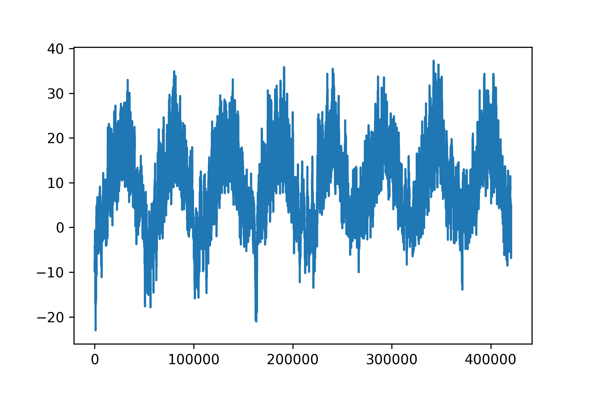


[Figure 13.1](#figure-13-1): Temperature over the full temporal range of the dataset (ºC)

Figure 13.2 shows a more narrow plot of the first 10 days of temperature data. Because the data is recorded every 10 minutes, you get 24 × 6 = 144 data points
per day.

```python
plt.plot(range(1440), temperature[:1440])
```

[Listing 13.4](#listing-13-4): Plotting the first 10 days of the temperature timeseries


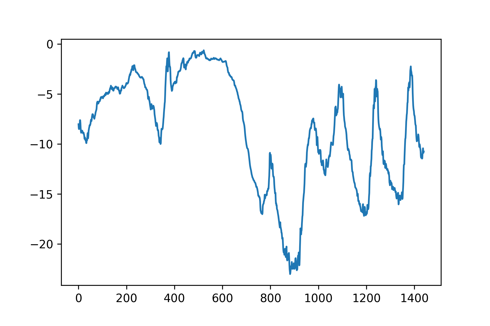


[Figure 13.2](#figure-13-2): Temperature over the first 10 days of the dataset (ºC)

On this plot, you can see daily periodicity, especially evident for the last four
days. Also note that this 10-day period must be coming from a fairly cold
winter month.

Periodicity over multiple timescales is an important and very common property of
timeseries data. Whether you’re looking at the weather, mall parking occupancy,
traffic to a website, sales of a grocery store, or steps logged in a fitness tracker,
you’ll see daily cycles and yearly cycles (human-generated data also tends to feature weekly cycles).
When exploring your data, make sure to look for these patterns.

With our dataset, if you were trying to predict average temperature for the next month given a
few months of past data, the problem would be easy, due to the reliable
year-scale periodicity of the data. But looking at the data over a scale of
days, the temperature looks a lot more chaotic. Is this timeseries predictable
at a daily scale? Let’s find out.

In all our experiments, we’ll use the first 50% of the data for training,
the following 25% for validation, and the last 25% for testing. When working with
timeseries data, it’s important to use validation and test data that is more recent
than the training data because you’re trying to predict the future given the past,
not the reverse, and your validation/test splits should reflect this temporal ordering. Some problems
happen to be considerably simpler if you reverse the time axis!

```python
>>> num_train_samples = int(0.5 * len(raw_data))
>>> num_val_samples = int(0.25 * len(raw_data))
>>> num_test_samples = len(raw_data) - num_train_samples - num_val_samples
>>> print("num_train_samples:", num_train_samples)
>>> print("num_val_samples:", num_val_samples)
>>> print("num_test_samples:", num_test_samples)
num_train_samples: 210225
num_val_samples: 105112
num_test_samples: 105114
```

[Listing 13.5](#listing-13-5): Computing the number of samples for each data split

### Preparing the data

The exact formulation of the problem will be as follows: given data covering
the previous five days and sampled once per hour, can we predict the temperature
in 24 hours?

First, let’s preprocess the data to a format a neural network can ingest.
This is easy: the data is already numerical, so you don’t need to do any vectorization.
But each timeseries in the data is on a different scale
(for example, atmospheric pressure, measured in mbar, is around 1,000, while
H2OC, measured in millimoles per mole, is around 3).
We’ll normalize each timeseries independently so that they all
take small values on a similar scale.
We’re going to use the first 210,225
timesteps as training data, so we’ll compute the mean and standard deviation
only on this fraction of the data.

```python
mean = raw_data[:num_train_samples].mean(axis=0)
raw_data -= mean
std = raw_data[:num_train_samples].std(axis=0)
raw_data /= std
```

[Listing 13.6](#listing-13-6): Normalizing the data

Next, let’s create a `Dataset` object that yields
batches of data from the past five days along with a target temperature 24 hours
in the future. Because the samples in the dataset are highly redundant
(sample `N` and sample `N + 1` will have most of their timesteps in common),
it would be wasteful to explicitly allocate memory for every sample.
Instead, we’ll generate the samples on the fly while only keeping in memory
the original `raw_data` and `temperature` arrays, and nothing more.

We could easily write a Python generator to do this,
but there’s a built-in dataset utility in Keras that does just that
(`timeseries_dataset_from_array()`), so we can save ourselves some work by using it.
You can generally use it for any kind of timeseries forecasting task.

Understanding timeseries\_dataset\_from\_array()

To understand what `timeseries_dataset_from_array()` does, let’s take a look at
a simple example. The general idea is that you provide an array of timeseries data
(the `data` argument), and `timeseries_dataset_from_array` gives you
windows extracted from the original timeseries
(we’ll call them “sequences”).

Let’s say you’re using `data = [0 1 2 3 4 5 6]` and `sequence_length=3`;
then `timeseries_dataset_from_array` will generate the following samples:
`[0 1 2]`, `[1 2 3]`, `[2 3 4]`, `[3 4 5]`, `[4 5 6]`.

You can also pass a `target` array to `timeseries_dataset_from_array()`.
The first entry of the `targets` array should match the desired target
for the first sequence that will be generated from the `data` array. So if you’re
doing timeseries forecasting, simply use as `targets` the same array as for `data`,
offset by some amount.

For instance, with `data = [0 1 2 3 4 5 6 ...]` and `sequence_length=3`, you could create a
dataset to predict the next step in the series by passing
`targets = [3 4 5 6 ...]`. Let’s try it:

```python
import numpy as np
import keras

# Generate an array of sorted integers from 0 to 9.
int_sequence = np.arange(10)
dummy_dataset = keras.utils.timeseries_dataset_from_array(
    # The sequences we generate will be sampled from [0 1 2 3 4 5 6].
    data=int_sequence[:-3],
    # The target for the sequence that starts at data[N] will be data[N
    # + 3].
    targets=int_sequence[3:],
    # The sequences will be 3 steps long.
    sequence_length=3,
    # The sequences will be batched in batches of size 2.
    batch_size=2,
)

for inputs, targets in dummy_dataset:
    for i in range(inputs.shape[0]):
        print([int(x) for x in inputs[i]], int(targets[i]))
```

This bit of code prints the following results:

```python
[0, 1, 2] 3
[1, 2, 3] 4
[2, 3, 4] 5
[3, 4, 5] 6
[4, 5, 6] 7
```

We’ll use `timeseries_dataset_from_array` to
instantiate three datasets: one for training, one for validation,
and one for testing.

We’ll use the following parameter values:

* `sampling_rate = 6` — Observations will be sampled at one data point per hour:
  we will only keep one data point out of six.
* `sequence_length = 120` — Observations will go back five days (120 hours).
* `delay = sampling_rate * (sequence_length + 24 - 1)` — The target for a sequence
  will be the temperature 24 hours after the end of the sequence.
* `start_index = 0` and `end_index = num_train_samples` — For the training dataset, to only
  use the first 50% of the data.
* `start_index = num_train_samples` and `end_index = num_train_samples + num_val_samples` — For the validation dataset,
  to only use the next 25% of the data.
* `start_index = num_train_samples + num_val_samples` — For the test dataset, to use the remaining samples.

```python
sampling_rate = 6
sequence_length = 120
delay = sampling_rate * (sequence_length + 24 - 1)
batch_size = 256

train_dataset = keras.utils.timeseries_dataset_from_array(
    raw_data[:-delay],
    targets=temperature[delay:],
    sampling_rate=sampling_rate,
    sequence_length=sequence_length,
    shuffle=True,
    batch_size=batch_size,
    start_index=0,
    end_index=num_train_samples,
)

val_dataset = keras.utils.timeseries_dataset_from_array(
    raw_data[:-delay],
    targets=temperature[delay:],
    sampling_rate=sampling_rate,
    sequence_length=sequence_length,
    shuffle=True,
    batch_size=batch_size,
    start_index=num_train_samples,
    end_index=num_train_samples + num_val_samples,
)

test_dataset = keras.utils.timeseries_dataset_from_array(
    raw_data[:-delay],
    targets=temperature[delay:],
    sampling_rate=sampling_rate,
    sequence_length=sequence_length,
    shuffle=True,
    batch_size=batch_size,
    start_index=num_train_samples + num_val_samples,
)
```

[Listing 13.7](#listing-13-7): Instantiating datasets for training, validation, and testing

Each dataset yields a tuple `(samples, targets)`, where `samples` is a batch
of 256 samples, each containing 120 consecutive hours of input data,
and `targets` is the corresponding array of 256 target temperatures. Note that
the samples are randomly shuffled, so two consecutive sequences in a batch
(like `samples[0]` and `samples[1]`) aren’t necessarily temporally close.

```python
>>> for samples, targets in train_dataset:
>>>     print("samples shape:", samples.shape)
>>>     print("targets shape:", targets.shape)
>>>     break
samples shape: (256, 120, 14)
targets shape: (256,)
```

[Listing 13.8](#listing-13-8): Inspecting the dataset

### A commonsense, non-machine-learning baseline

Before you start
using black box, deep learning models to solve the temperature prediction
problem, let’s try a simple, commonsense approach. It will serve as a sanity
check, and it will establish a baseline that you’ll have to beat to
demonstrate the usefulness of more advanced, machine learning models. Such
commonsense baselines can be useful when you’re approaching a new problem for
which there is no known solution (yet). A classic example is that of
unbalanced classification tasks, where some classes are much more common than
others. If your dataset contains 90% instances of class A and 10% instances of
class B, then a commonsense approach to the classification task is to always
predict “A” when presented with a new sample. Such a classifier is 90%
accurate overall, and any learning-based approach should therefore beat this
90% score to demonstrate usefulness. Sometimes, such elementary
baselines can prove surprisingly hard to beat.

In this case, the temperature timeseries can safely be assumed to be continuous
(the temperatures tomorrow are likely to be close to the temperatures today)
as well as periodic with a daily period. Thus, a commonsense approach is to
always predict that the temperature 24 hours from now will be equal to the
temperature right now. Let’s evaluate this approach, using the mean absolute
error (MAE) metric, defined as follows:

```python
np.mean(np.abs(preds - targets))
```

Here’s the evaluation loop.

```python
def evaluate_naive_method(dataset):
    total_abs_err = 0.0
    samples_seen = 0
    for samples, targets in dataset:
        # The temperature feature is at column 1, so `samples[:, -1,
        # 1]` is the last temperature measurement in the input
        # sequence. Recall that we normalized our features to retrieve
        # a temperature in Celsius degrees, we need to un-normalize it,
        # by multiplying it by the standard deviation and adding back
        # the mean.
        preds = samples[:, -1, 1] * std[1] + mean[1]
        total_abs_err += np.sum(np.abs(preds - targets))
        samples_seen += samples.shape[0]
    return total_abs_err / samples_seen

print(f"Validation MAE: {evaluate_naive_method(val_dataset):.2f}")
print(f"Test MAE: {evaluate_naive_method(test_dataset):.2f}")
```

[Listing 13.9](#listing-13-9): Computing the commonsense baseline MAE

This commonsense baseline achieves a validation MAE of 2.44 degrees Celsius,
and a test MAE of 2.62 degrees Celsius.
So if you always assume that the temperature 24 hours in the future
will be the same as it is now, you will be off by two and a half degrees on average.
It’s not too bad, but you probably won’t launch a weather forecasting service
based on this heuristic. Now, the game is to use your
knowledge of deep learning to do better.

### Let’s try a basic machine learning model

In the same way
that it’s useful to establish a commonsense baseline before trying
machine learning approaches, it’s useful to try simple, cheap, machine learning
models (such as small, densely connected networks) before looking into
complicated and computationally expensive models such as RNNs. This is the
best way to make sure any further complexity you throw at the problem is
legitimate and delivers real benefits.

Listing 13.10 shows a fully connected model that starts by flattening
the data and then runs it through two `Dense` layers. Note the lack of
activation function on the last `Dense` layer, which is
typical for a regression problem. We use mean squared error (MSE) as the loss,
rather than MAE, because unlike MAE, it’s smooth around zero, a useful property
for gradient descent. We will monitor MAE by adding it as a metric in `compile()`.

```python
import keras
from keras import layers

inputs = keras.Input(shape=(sequence_length, raw_data.shape[-1]))
x = layers.Flatten()(inputs)
x = layers.Dense(16, activation="relu")(x)
outputs = layers.Dense(1)(x)
model = keras.Model(inputs, outputs)

callbacks = [
    # We use a callback to save the best-performing model.
    keras.callbacks.ModelCheckpoint("jena_dense.keras", save_best_only=True)
]
model.compile(optimizer="adam", loss="mse", metrics=["mae"])
history = model.fit(
    train_dataset,
    epochs=10,
    validation_data=val_dataset,
    callbacks=callbacks,
)

# Reloads the best model and evaluates it on the test data
model = keras.models.load_model("jena_dense.keras")
print(f"Test MAE: {model.evaluate(test_dataset)[1]:.2f}")
```

[Listing 13.10](#listing-13-10): Training and evaluating a densely connected model

Let’s display the loss curves for validation and training (see figure 13.3).

```python
import matplotlib.pyplot as plt

loss = history.history["mae"]
val_loss = history.history["val_mae"]
epochs = range(1, len(loss) + 1)
plt.figure()
plt.plot(epochs, loss, "r--", label="Training MAE")
plt.plot(epochs, val_loss, "b", label="Validation MAE")
plt.title("Training and validation MAE")
plt.legend()
plt.show()
```

[Listing 13.11](#listing-13-11): Plotting results


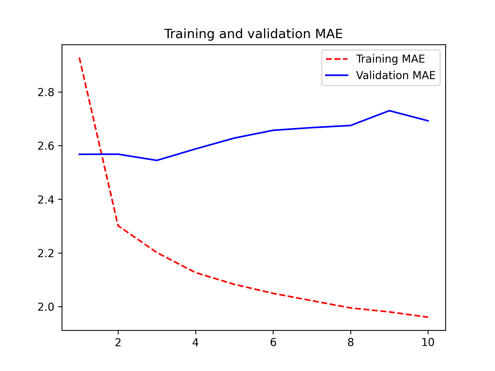


[Figure 13.3](#figure-13-3): Training and validation MAE on the Jena temperature-forecasting task with a simple, densely connected network

Some of the validation losses are close to the no-learning baseline, but not
reliably. This goes to show the merit of having this baseline in the first
place: it turns out to be not easy to outperform. Your common sense contains a
lot of valuable information to which a machine learning model doesn’t have access.

You may wonder, if a simple, well-performing model exists to go from the data
to the targets (the commonsense baseline), why doesn’t the model you’re
training find it and improve on it? Well, the space of models in which you’re
searching for a solution — that is, your hypothesis space — is the space of all
possible two-layer networks with the configuration you defined. The commonsense
heuristic is just one model among millions that can be represented in this
space. It’s like looking for a needle in a haystack. Just because a good solution
technically exists in your hypothesis space doesn’t mean
you’ll be able to find it via gradient descent.

That’s a pretty significant limitation of machine learning in general: unless the
learning algorithm is hardcoded to look for a specific kind of simple model,
it can sometimes fail to find a simple solution to a simple problem.
That’s why using good feature engineering and relevant architecture priors
is essential: you need to be precisely telling your model what it should be
looking for.

### Let’s try a 1D convolutional model

Speaking of using the right architecture priors:
since our input sequences feature daily cycles, perhaps a convolutional model
could work? A temporal ConvNet could reuse the same representations
across different days, much like a spatial ConvNet can reuse the same
representations across different locations in an image.

You already know about the `Conv2D` and `SeparableConv2D` layers,
which see their inputs through small windows that swipe across 2D grids.
There are also 1D and even 3D versions of these layers:
`Conv1D`, `SeparableConv1D`,
and `Conv3D`.[[2]](#footnote-2)
The `Conv1D` layer relies on 1D windows that slide across input sequences,
and the `Conv3D` layer relies on cubic windows that slide across input volumes.

You can thus build 1D ConvNets, strictly analogous to 2D ConvNets. They’re a great
fit for any sequence data that follows the translation invariance assumption
(meaning that if you slide a window over the sequence, the content of the window
should follow the same properties independently of the location of the window).

Let’s try one on our temperature forecasting problem. We’ll pick an initial
window length of 24, so that we look at 24 hours of data at a time (one cycle).
As we downsample the sequences (via `MaxPooling1D` layers), we’ll reduce the window
size accordingly (figure 13.4):

```python
inputs = keras.Input(shape=(sequence_length, raw_data.shape[-1]))
x = layers.Conv1D(8, 24, activation="relu")(inputs)
x = layers.MaxPooling1D(2)(x)
x = layers.Conv1D(8, 12, activation="relu")(x)
x = layers.MaxPooling1D(2)(x)
x = layers.Conv1D(8, 6, activation="relu")(x)
x = layers.GlobalAveragePooling1D()(x)
outputs = layers.Dense(1)(x)
model = keras.Model(inputs, outputs)

callbacks = [
    keras.callbacks.ModelCheckpoint("jena_conv.keras", save_best_only=True)
]
model.compile(optimizer="adam", loss="mse", metrics=["mae"])
history = model.fit(
    train_dataset,
    epochs=10,
    validation_data=val_dataset,
    callbacks=callbacks,
)

model = keras.models.load_model("jena_conv.keras")
print(f"Test MAE: {model.evaluate(test_dataset)[1]:.2f}")
```


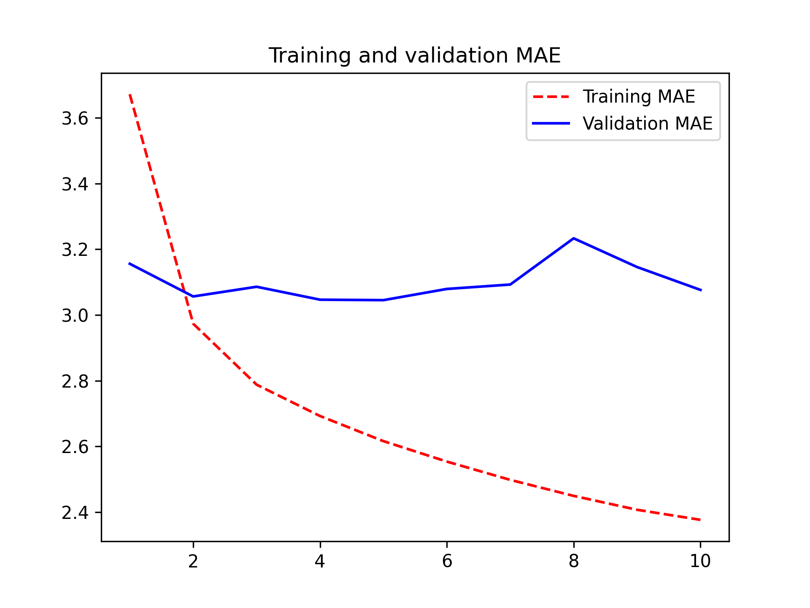


[Figure 13.4](#figure-13-4): Training and validation MAE on the Jena temperature forecasting task with a 1D ConvNet

As it turns out, this model performs even worse than the densely connected one,
only achieving a validation MAE of about 2.9 degrees,
far from the commonsense baseline. What went wrong here? Two things:

* First, weather data doesn’t quite respect the translation invariance assumption.
  While the data does feature daily cycles, data from a morning follows different
  properties than data from an evening or from the middle of the night. Weather data
  is only translation-invariant for a very specific timescale.
* Second, order in our data matters — a lot. The recent past is far more informative
  for predicting the next day’s temperature than data from five days ago. A 1D ConvNet
  is not able to make use of this fact. In particular, our max pooling and global
  average pooling layers are largely destroying order information.

## Recurrent neural networks

Neither the fully connected approach nor the convolutional approach did well,
but that doesn’t mean machine learning isn’t applicable to this problem.
The densely connected approach first flattened the timeseries, which removed the notion
of time from the input data. The convolutional approach treated every segment of the data
in the same way, even applying pooling, which destroyed order information.
Let’s instead look at the data as what it is: a sequence, where causality and order matter.

There’s a family of neural network architectures that were designed
specifically for this use case: recurrent neural networks. Among them,
the Long Short-Term Memory (LSTM) layer in particular has long been very popular.
We’ll see in a minute how these models work — but let’s start by giving the LSTM layer a try.

```python
inputs = keras.Input(shape=(sequence_length, raw_data.shape[-1]))
x = layers.LSTM(16)(inputs)
outputs = layers.Dense(1)(x)
model = keras.Model(inputs, outputs)

callbacks = [
    keras.callbacks.ModelCheckpoint("jena_lstm.keras", save_best_only=True)
]
model.compile(optimizer="adam", loss="mse", metrics=["mae"])
history = model.fit(
    train_dataset,
    epochs=10,
    validation_data=val_dataset,
    callbacks=callbacks,
)

model = keras.models.load_model("jena_lstm.keras")
print("Test MAE: {model.evaluate(test_dataset)[1]:.2f}")
```

[Listing 13.12](#listing-13-12): A simple LSTM-based model

Figure 13.5 shows the results. Much better! We achieve a
validation MAE as low as 2.39 degrees and a test MAE of 2.55 degrees.
The LSTM-based model can finally beat the
commonsense baseline (albeit just by a bit, for now),
demonstrating the value of machine learning on this task.

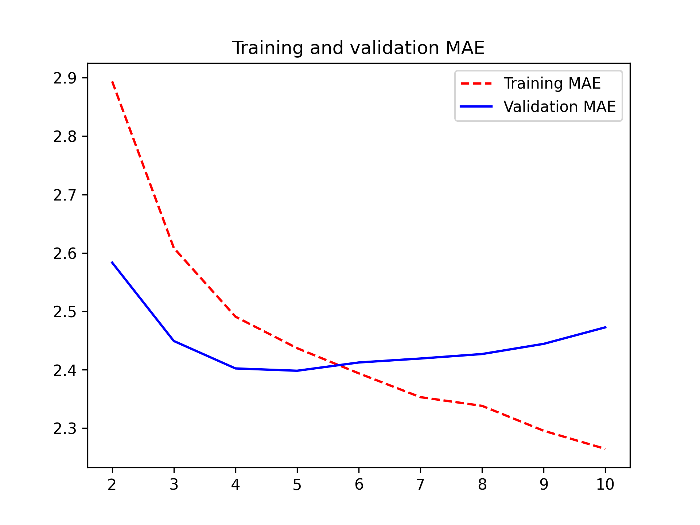


[Figure 13.5](#figure-13-5): Training and validation MAE on the Jena temperature forecasting task with an LSTM-based model. (Note that we omit epoch 1 on this graph because the high training MAE (7.75) at epoch 1 would distort the scale.)

But why did the LSTM model perform markedly better than the densely connected one
or the ConvNet? And how can we further refine the model?
To answer this, let’s take a closer look at recurrent neural networks.

### Understanding recurrent neural networks

A major characteristic of all neural networks
you’ve seen so far, such as densely connected networks and ConvNets, is that
they have no memory. Each input shown to them is processed independently, with
no state kept between inputs. With such networks, to process a
sequence or a temporal series of data points, you have to show the entire
sequence to the network at once: turn it into a single data point. For
instance, this is what we did in the densely connected network example:
we flattened our five days of data into a single large vector and processed it
in one go. Such networks are called *feedforward networks*.

In contrast, as you’re reading the present sentence, you’re processing it word
by word — or rather, eye saccade by eye saccade — while keeping memories of what
came before; this gives you a fluid representation of the meaning conveyed by
this sentence. Biological intelligence processes information incrementally
while maintaining an internal model of what it’s processing, built from past
information and constantly updated as new information comes in.

A *recurrent neural network* (RNN) adopts the same principle,
albeit in an extremely simplified version: it
processes sequences by iterating through the sequence elements and maintaining
a *state* containing information relative to what it has seen so far. In
effect, an RNN is a type of neural network that has an internal *loop* (see
figure 13.6).

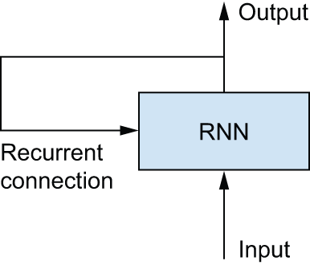


[Figure 13.6](#figure-13-6): A recurrent network: a network with a loop

The state of the RNN is reset between processing two different, independent
sequences (such as two samples in a batch), so you still consider one
sequence to be a single data point: a single input to the network. What changes is
that this data point is no longer processed in a single step; rather, the
network internally loops over sequence elements.

To make these notions of *loop* and *state* clear, let’s implement the forward pass
of a toy RNN. This RNN takes as input a sequence of vectors, which
we’ll encode as a rank-2 tensor of size `(timesteps, input_features)`. It loops
over timesteps, and at each timestep, it considers its current state at `t` and
the input at `t` (of shape `(input_features,)`), and combines them to obtain
the output at `t`. We’ll then set the state for the next step to be this
previous output. For the first timestep, the previous output isn’t defined;
hence, there is no current state. So we’ll initialize the state as an
all-zero vector called the *initial* state of the network.

In pseudocode, this is the RNN.

```python
# The state at t
state_t = 0
# Iterates over sequence elements
for input_t in input_sequence:
    output_t = f(input_t, state_t)
    # The previous output becomes the state for the next iteration.
    state_t = output_t
```

[Listing 13.13](#listing-13-13): Pseudocode RNN

You can even flesh out the function `f`: the transformation of the input and
state into an output will be parameterized by two matrices, `W` and `U`, and a
bias vector. It’s similar to the transformation operated by a densely
connected layer in a feedforward network.

```python
state_t = 0
for input_t in input_sequence:
    output_t = activation(dot(W, input_t) + dot(U, state_t) + b)
    state_t = output_t
```

[Listing 13.14](#listing-13-14): More detailed pseudocode for the RNN

To make these notions absolutely unambiguous, let’s write a naive NumPy
implementation of the forward pass of the simple RNN.

```python
import numpy as np

# Number of timesteps in the input sequence
timesteps = 100
# Dimensionality of the input feature space
input_features = 32
# Dimensionality of the output feature space
output_features = 64
# Input data: random noise for the sake of the example
inputs = np.random.random((timesteps, input_features))
# Initial state: an all-zero vector
state_t = np.zeros((output_features,))
# Creates random weight matrices
W = np.random.random((output_features, input_features))
U = np.random.random((output_features, output_features))
b = np.random.random((output_features,))
successive_outputs = []
# input_t is a vector of shape (input_features,).
for input_t in inputs:
    # Combines the input with the current state (the previous output)
    # to obtain the current output. We use tanh to add nonlinearity (we
    # could use any other activation function).
    output_t = np.tanh(np.dot(W, input_t) + np.dot(U, state_t) + b)
    # Stores this output in a list
    successive_outputs.append(output_t)
    # Updates the state of the network for the next timestep
    state_t = output_t
# The final output is a rank-2 tensor of shape (timesteps,
# output_features).
final_output_sequence = np.concatenate(successive_outputs, axis=0)
```

[Listing 13.15](#listing-13-15): NumPy implementation of a simple RNN

Easy enough: in summary, an RNN is a `for` loop that reuses
quantities computed during the previous iteration of the loop, nothing more.
Of course, there are many different RNNs fitting this definition that you
could build — this example is one of the simplest RNN formulations. RNNs are
characterized by their step function, such as the following function in this
case (see figure 13.7):

```python
output_t = tanh(matmul(input_t, W) + matmul(state_t, U) + b)
```


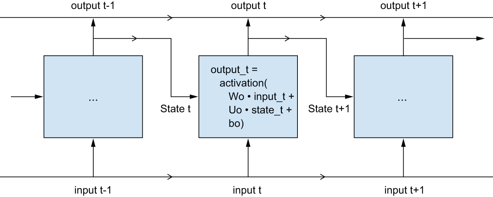


[Figure 13.7](#figure-13-7): A simple RNN, unrolled over time


In this example, the final output is a rank-2 tensor of shape `(timesteps,
output_features)`, where each timestep is the output of the loop at time `t`.
Each timestep `t` in the output tensor contains information about timesteps
`0` to `t` in the input sequence — about the entire past. For this reason, in
many cases, you don’t need this full sequence of outputs; you just need the
last output (`output_t` at the end of the loop), because it already contains
information about the entire sequence.

### A recurrent layer in Keras

The process you just
naively implemented in NumPy corresponds to an actual Keras layer —
the `SimpleRNN` layer.

There is one minor difference: `SimpleRNN` processes batches of sequences, like
all other Keras layers, not a single sequence as in the NumPy example. This
means it takes inputs of shape `(batch_size, timesteps, input_features)`
rather than `(timesteps, input_features)`. When specifying the `shape` argument
of your initial `Input()`, note that you can set the `timesteps` entry
to `None`, which enables your network to process sequences of arbitrary length.

```python
num_features = 14
inputs = keras.Input(shape=(None, num_features))
outputs = layers.SimpleRNN(16)(inputs)
```

[Listing 13.16](#listing-13-16): An RNN layer that can process sequences of any length

This is especially useful if your model is meant to process sequences
of variable length. However, if all of your sequences have the same length,
I recommend specifying a complete input shape, since it enables `model.summary()`
to display output length information, which is always nice,
and it can unlock some performance optimizations (see the note “On RNN runtime performance” later in the chapter).

All recurrent layers in Keras (`SimpleRNN`, `LSTM`, and `GRU`) can be run in two different
modes: they can return either full sequences of successive outputs for each
timestep (a rank-3 tensor of shape `(batch_size, timesteps, output_features)`) or
only the last output for each input sequence (a rank-2 tensor of shape
`(batch_size, output_features)`). These two modes are controlled
by the `return_sequences` constructor argument.
Let’s look at an example that uses `SimpleRNN` and returns only the output at
the last timestep.

```python
>>> num_features = 14
>>> steps = 120
>>> inputs = keras.Input(shape=(steps, num_features))
>>> # Note that return_sequences=False is the default.
>>> outputs = layers.SimpleRNN(16, return_sequences=False)(inputs)
>>> print(outputs.shape)
(None, 16)
```

[Listing 13.17](#listing-13-17): An RNN layer that returns only its last output step

The following example returns the full output sequence.

```python
>>> num_features = 14
>>> steps = 120
>>> inputs = keras.Input(shape=(steps, num_features))
>>> # Sets return_sequences to True
>>> outputs = layers.SimpleRNN(16, return_sequences=True)(inputs)
>>> print(outputs.shape)
(None, 120, 16)
```

[Listing 13.18](#listing-13-18): An RNN layer that returns its full output sequence

It’s sometimes useful to stack several recurrent layers one after the other to increase the representational power of a network. In such a setup,
you have to get all of the intermediate layers to return the full sequence of
outputs.

```python
inputs = keras.Input(shape=(steps, num_features))
x = layers.SimpleRNN(16, return_sequences=True)(inputs)
x = layers.SimpleRNN(16, return_sequences=True)(x)
outputs = layers.SimpleRNN(16)(x)
```

[Listing 13.19](#listing-13-19): Stacking RNN layers

Now, in practice, you’ll rarely work with the `SimpleRNN` layer.
It’s generally too simplistic to be of real use. In particular, `SimpleRNN` has
a major issue: although it should theoretically be able to
retain at time `t` information about inputs seen many timesteps before,
in practice, such long-term dependencies prove impossible to learn. This is due to
the *vanishing gradients problem*, an effect that is similar
to what is observed with non-recurrent networks (feedforward networks) that
are many layers deep: as you keep adding layers to a
network, the network eventually becomes untrainable. The theoretical reasons
for this effect were studied by Hochreiter, Schmidhuber, and Bengio in the
early 1990s.[[3]](#footnote-3)

Thankfully, `SimpleRNN` isn’t the only recurrent layer available in Keras. There are two
others: `LSTM` and `GRU`, which were designed to address these issues.

Let’s consider the `LSTM` layer. The underlying Long Short-Term Memory (LSTM)
algorithm was developed by Hochreiter and Schmidhuber in
1997;[[4]](#footnote-4)
it was the culmination of their research on the vanishing gradients problem.

This layer is a variant of the `SimpleRNN` layer you already know about; it
adds a way to carry information across many timesteps. Imagine a conveyor belt
running parallel to the sequence you’re processing. Information from the
sequence can jump onto the conveyor belt at any point, be transported to a
later timestep, and jump off, intact, when you need it. This is essentially
what LSTM does: it saves information for later, thus preventing older signals
from gradually vanishing during processing.
This should remind you of *residual connections*, which
you learned about in chapter 9: it’s pretty much the same idea.

To understand this process in detail, let’s start from the `SimpleRNN` cell (see figure
13.8). Because you’ll have a lot of weight matrices, index the `W` and `U`
matrices in the cell with the letter `o` (`Wo` and `Uo`) for *output*.


[Figure 13.8](#figure-13-8): The starting point of an `LSTM` layer: a `SimpleRNN`

Let’s add to this picture an additional data flow that carries information
across timesteps. Call its values at different timesteps `Ct`, where *C* stands
for *carry*. This information will have the following effect on the cell: it
will be combined with the input connection and the recurrent connection (via a
dense transformation: a dot product with a weight matrix followed by a bias
add and the application of an activation function), and it will affect the
state being sent to the next timestep (via an activation function and a
multiplication operation). Conceptually, the carry dataflow is a way to
modulate the next output and the next state (see figure 13.9). Simple so far.

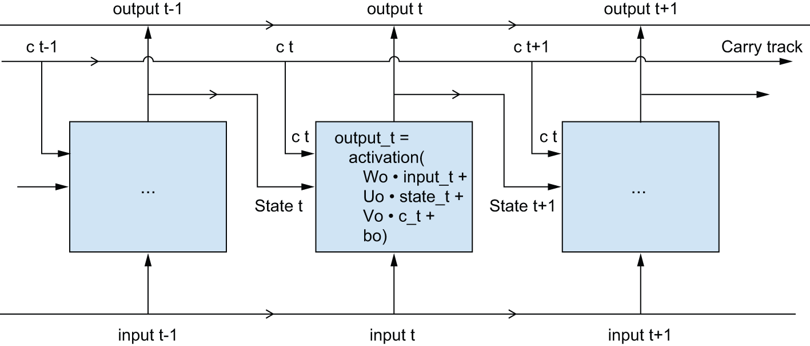


[Figure 13.9](#figure-13-9): Going from a SimpleRNN to an LSTM: adding a carry track

Now the subtlety: the way the next value of the carry dataflow is computed. It
involves three distinct transformations. All three have the form of a
`SimpleRNN` cell:

```python
y = activation(dot(state_t, U) + dot(input_t, W) + b)
```

But all three transformations have their own weight matrices, which you’ll
index with the letters `i`, `f`, and `k`. Here’s what you have so far (it may
seem a bit arbitrary, but bear with me).

```python
output_t = activation(dot(state_t, Uo) + dot(input_t, Wo) + dot(C_t, Vo) + bo)
i_t = activation(dot(state_t, Ui) + dot(input_t, Wi) + bi)
f_t = activation(dot(state_t, Uf) + dot(input_t, Wf) + bf)
k_t = activation(dot(state_t, Uk) + dot(input_t, Wk) + bk)
```

[Listing 13.20](#listing-13-20): Pseudocode details of the LSTM architecture (1/2)

You obtain the new carry state (the next `c_t`) by combining `i_t`, `f_t`, and
`k_t`.

```python
c_t+1 = i_t * k_t + c_t * f_t
```

[Listing 13.21](#listing-13-21): Pseudocode details of the LSTM architecture (2/2)

Add this as shown in figure 13.10. And that’s it. Not so complicated — merely a
tad complex.

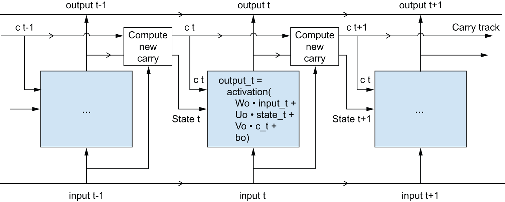


[Figure 13.10](#figure-13-10): Anatomy of an `LSTM`

If you want to get philosophical, you can interpret what each of these
operations is meant to do. For instance, you can say that multiplying `c_t`
and `f_t` is a way to deliberately forget irrelevant information in the carry
dataflow. Meanwhile, `i_t` and `k_t` provide information about the present,
updating the carry track with new information. But at the end of the day,
these interpretations don’t mean much because what these operations
*actually* do is determined by the contents of the weights parameterizing
them, and the weights are learned in an end-to-end fashion, starting over with
each training round, making it impossible to credit this or that operation
with a specific purpose. The specification of an RNN cell (as just described)
determines your hypothesis space — the space in which you’ll search for a good
model configuration during training — but it doesn’t determine what the cell
does; that is up to the cell weights. The same cell with different weights can
be doing very different things. So the combination of operations making up an
RNN cell is better interpreted as a set of *constraints* on your search, not
as a *design* in an engineering sense.

Arguably, the choice of such constraints — the question of
how to implement RNN cells — is better left to optimization algorithms (like
genetic algorithms or reinforcement learning processes) than to human
engineers. In the future, that’s how we’ll build our models. In summary, you
don’t need to understand anything about the specific architecture of an LSTM
cell; as a human, it shouldn’t be your job to understand it. Just keep in mind
what the LSTM cell is meant to do: allow past information to be reinjected
at a later time, thus fighting the vanishing gradients problem.

### Getting the most out of recurrent neural networks

By this point, you’ve learned

* What RNNs are and how they work
* What an LSTM is and why it works better on long sequences than a naive RNN
* How to use Keras RNN layers to process sequence data

Next, we’ll review a number of more advanced features of RNNs, which can help
you get the most out of your deep learning sequence models.
By the end of the section, you’ll know most of what there is
to know about using recurrent networks with Keras.

We’ll cover the following:

* *Recurrent dropout*  — This is a variant of dropout, used to fight overfitting in recurrent layers.
* *Stacking recurrent layers*  — This increases the representational power of
  the model (at the cost of higher computational loads).
* *Bidirectional recurrent layers* — These
  present the same information to a recurrent network in
  different ways, increasing accuracy and mitigating forgetting issues.

We’ll use these techniques to refine our temperature forecasting RNN.

### Using recurrent dropout to fight overfitting

Let’s go back to the LSTM-based model we used earlier in the chapter — our first model
able to beat the commonsense baseline.
If you look at the training and validation curves, it’s evident that the
model is quickly overfitting, despite only having very few units:
the training and validation losses start to diverge
considerably after a few epochs. You’re already familiar with a classic
technique for fighting this phenomenon: dropout, which randomly zeros out
input units of a layer to break happenstance correlations in the
training data that the layer is exposed to. But how to correctly apply dropout
in recurrent networks isn’t a trivial question.

It has long been known that
applying dropout before a recurrent layer hinders learning rather than helping
with regularization. In 2015, Yarin Gal, as part of his PhD thesis on Bayesian
deep learning,[[5]](#footnote-5)
determined the proper way to use dropout with a recurrent network: the same
dropout mask (the same pattern of dropped units) should be applied at every
timestep, instead of a dropout mask that varies randomly from timestep to
timestep. What’s more, to regularize the representations formed by
the recurrent gates of layers such as `GRU` and `LSTM`, a temporally constant
dropout mask should be applied to the inner recurrent activations of the layer
(a recurrent dropout mask). Using the same dropout mask at every timestep
allows the network to properly propagate its learning error through time; a
temporally random dropout mask would disrupt this error signal and be harmful
to the learning process.

Yarin Gal did his research using Keras and helped build this mechanism directly
into Keras recurrent layers. Every recurrent layer in Keras has two
dropout-related arguments: `dropout`, a float specifying the dropout rate for
input units of the layer, and `recurrent_dropout`, specifying the dropout rate
of the recurrent units. Let’s add recurrent dropout to the `LSTM`
layer of our first LSTM example
and see how doing so affects overfitting.

Thanks to dropout, we won’t need to rely as much on network size for regularization,
so we’ll use an `LSTM` layer with twice as many units, which should hopefully be more expressive
(without dropout, this network would have started overfitting right away — try it).
Because networks being regularized with dropout always take much longer to fully converge,
we’ll train the model for five times as many epochs.

```python
inputs = keras.Input(shape=(sequence_length, raw_data.shape[-1]))
x = layers.LSTM(32, recurrent_dropout=0.25)(inputs)
# To regularize the Dense layer, we also add a Dropout layer after the
# LSTM.
x = layers.Dropout(0.5)(x)
outputs = layers.Dense(1)(x)
model = keras.Model(inputs, outputs)

callbacks = [
    keras.callbacks.ModelCheckpoint(
        "jena_lstm_dropout.keras", save_best_only=True
    )
]
model.compile(optimizer="adam", loss="mse", metrics=["mae"])
history = model.fit(
    train_dataset,
    epochs=50,
    validation_data=val_dataset,
    callbacks=callbacks,
)
```

[Listing 13.22](#listing-13-22): Training and evaluating a dropout-regularized LSTM

Figure 13.11 shows the results. Success! We’re no longer overfitting during the
first 20 epochs. We achieve a validation MAE as low as 2.27 degrees
(7% improvement over the no-learning baseline)
and a test MAE of 2.45 degrees (6.5% improvement over the baseline). Not too bad.

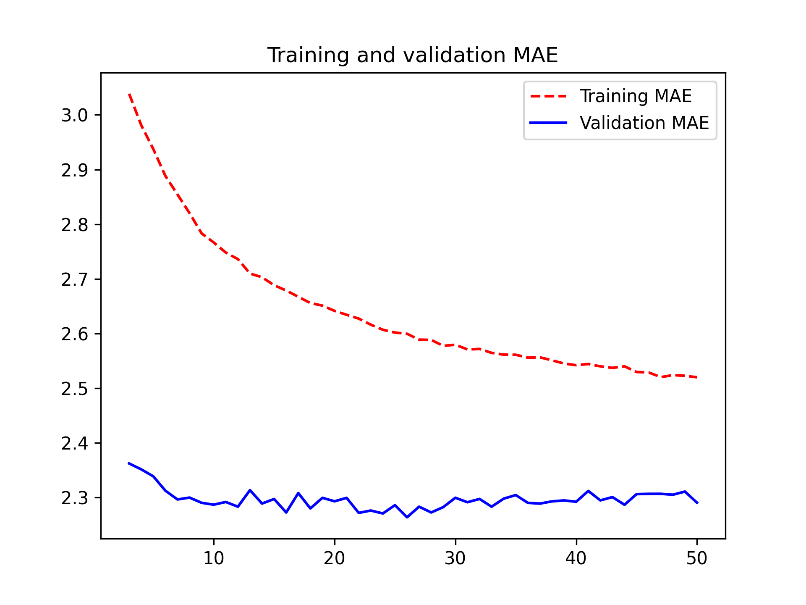


[Figure 13.11](#figure-13-11): Training and validation loss on the Jena temperature forecasting task with a dropout-regularized LSTM


On RNN runtime performance

Recurrent models with very few parameters, like the ones in this chapter, tend
to be significantly faster on a multicore CPU than on GPU because they only
involve small matrix multiplications, and the chain of multiplications
is not well parallelizable due to the presence of a `for` loop. But larger RNNs
can greatly benefit from a GPU runtime.

When using a Keras `LSTM` or `GRU` layer on GPU
with default keyword arguments, your layer will be using
a *cuDNN kernel*,
a highly optimized, low-level, NVIDIA-provided implementation
of the underlying algorithm (we’ve mentioned those in the previous chapter).
As usual, cuDNN kernels are a mixed blessing:
they’re fast, but inflexible — if you try doing anything not supported by
the default kernel, you will suffer a dramatic slowdown, which more or less
forces you stick to what NVIDIA happens to provide. For instance, recurrent
dropout isn’t supported by the LSTM and GRU cuDNN kernels, so adding it
to your layers forces the runtime to fall back to the regular TensorFlow
implementation, which is generally two to five times slower on GPU
(even though its computational cost is the same).

As a way to speed up your RNN layer when you can’t use cuDNN, you can try *unrolling*
it. Unrolling a `for` loop consists of removing the loop and simply in-lining
its content *N* times. In the case of the `for` loop of an RNN, unrolling can
help TensorFlow optimize the underlying computation graph.
However, it will also considerably increase the memory consumption of your RNN
— as such, it’s only viable for relatively small sequences (around 100 steps
or fewer). Also, you can only do this if the number of timesteps in the data
is known in advance by the model (that is, if you pass a `shape` without
any `None` entries to your initial `Input()`). It works like this:

```python
# sequence_length cannot be None.
inputs = keras.Input(shape=(sequence_length, num_features))
# Passes unroll=True to enable unrolling
x = layers.LSTM(32, recurrent_dropout=0.2, unroll=True)(inputs)
```

### Stacking recurrent layers

Because you’re no longer overfitting, but seem to
have hit a performance bottleneck, you should consider increasing the capacity
and expressive power of the network.
Recall the description of the universal machine learning workflow:
it’s generally a good idea to increase the capacity of your model
until overfitting becomes the primary obstacle (assuming you’re already taking
basic steps to mitigate overfitting, such as using dropout). As long as you
aren’t overfitting too badly, you’re likely under capacity.

Increasing network capacity is typically done by increasing the number of units
in the layers or adding more layers. Recurrent layer stacking is a classic way
to build more powerful recurrent networks: for instance, not too long ago
the Google Translate algorithm was powered by a stack of seven large `LSTM`
layers — that’s huge.

To stack recurrent layers on top of each other in Keras, all intermediate
layers should return their full sequence of outputs (a rank-3 tensor) rather than
their output at the last timestep. As you’ve already learned,
this is done by specifying `return_sequences=True`.

In the following example, we’ll try a stack of two dropout-regularized
recurrent layers. For a change, we’ll use `GRU` layers instead of `LSTM`.
A Gated Recurrent Unit (GRU) is very similar to an LSTM —
you can think of it as a slightly simpler,
streamlined version of the LSTM architecture. It was introduced in 2014 by Cho
et al. just when recurrent networks were starting to gain interest anew
in the then-tiny research
community.[[6]](#footnote-6)

```python
inputs = keras.Input(shape=(sequence_length, raw_data.shape[-1]))
x = layers.GRU(32, recurrent_dropout=0.5, return_sequences=True)(inputs)
x = layers.GRU(32, recurrent_dropout=0.5)(x)
x = layers.Dropout(0.5)(x)
outputs = layers.Dense(1)(x)
model = keras.Model(inputs, outputs)

callbacks = [
    keras.callbacks.ModelCheckpoint(
        "jena_stacked_gru_dropout.keras", save_best_only=True
    )
]
model.compile(optimizer="adam", loss="mse", metrics=["mae"])
history = model.fit(
    train_dataset,
    epochs=50,
    validation_data=val_dataset,
    callbacks=callbacks,
)
model = keras.models.load_model("jena_stacked_gru_dropout.keras")
print(f"Test MAE: {model.evaluate(test_dataset)[1]:.2f}")
```

[Listing 13.23](#listing-13-23): Training and evaluating a dropout-regularized, stacked GRU model

Figure 13.12 shows the results. We achieve a test MAE of 2.39 degrees (an 8.8%
improvement over the baseline). You can see that the added layer does improve
the results a bit, though not dramatically. You may be seeing
diminishing returns from increasing network capacity at this point.

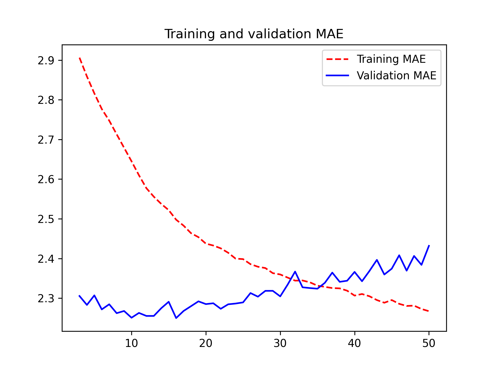


[Figure 13.12](#figure-13-12): Training and validation loss on the Jena temperature forecasting task with a stacked GRU network

### Using bidirectional RNNs

The last technique introduced in
this section is called *bidirectional RNNs*. A bidirectional RNN is a common
RNN variant that can offer greater performance than a regular RNN on certain
tasks. It’s frequently used in natural language processing — you could call it
the Swiss Army knife of deep learning for natural language processing.

RNNs are notably order dependent: they process the timesteps
of their input sequences in order, and shuffling or reversing the timesteps
can completely change the representations the RNN extracts from the sequence.
This is precisely the reason they perform well on problems where order is
meaningful, such as the temperature forecasting problem. A bidirectional RNN
exploits the order sensitivity of RNNs: it consists of using two regular RNNs,
such as the `GRU` and `LSTM` layers you’re already familiar with, each of
which processes the input sequence in one direction (chronologically and
antichronologically), and then merging their representations. By processing a
sequence both ways, a bidirectional RNN can catch patterns that may be
overlooked by a unidirectional RNN.

Remarkably, the fact that the RNN layers in this section have processed
sequences in chronological order (older timesteps first) may have been an
arbitrary decision. At least, it’s a decision we made no attempt to question
so far. Could the RNNs have performed well enough if they processed input
sequences in antichronological order, for instance, newer timesteps first?
Let’s try this in practice and see what happens. All you need to do is write a
variant of the data generator where the input sequences are reverted along the
time dimension (replace the last line with `yield samples[:, ::-1, :],
targets`).

When training the same LSTM-based model that you used in the
first experiment in this section, you would find that such a
reversed-order LSTM strongly underperforms even the commonsense baseline.
This indicates that, in this case, chronological processing is important to the
success of the approach. This makes perfect sense: the underlying `LSTM` layer
will typically be better at remembering the recent past than the distant past,
and, naturally, the more recent weather data points are more
predictive than older data points for the problem (that’s what makes the
commonsense baseline fairly strong). Thus the chronological version of the
layer is bound to outperform the reversed-order version.

However, this
isn’t true for many other problems, including natural language: intuitively,
the importance of a word in understanding a sentence isn’t strongly dependent
on its position in the sentence.
On text data, reversed-order processing works just as
well as chronological processing — you can read text backwards just fine (try it!).
Although word order does matter in understanding language, *which order* you use isn’t
crucial.

Importantly, an RNN trained on reversed sequences will learn
different representations than one trained on the original sequences, much as
you would have different mental models if time flowed backward in the real
world — if you lived a life where you died on your first day and were born on
your last day. In machine learning, representations that are *different* yet
*useful* are always worth exploiting, and the more they differ, the better:
they offer a new angle from which to look at your data, capturing aspects of
the data that were missed by other approaches, and thus they can help boost
performance on a task. This is the intuition behind *ensembling*, a concept
we’ll explore in chapter 18.

A bidirectional RNN exploits this idea to improve on the performance of
chronological-order RNNs. It looks at its input sequence both ways (see figure
13.13), obtaining potentially richer representations and capturing patterns
that may have been missed by the chronological-order version alone.

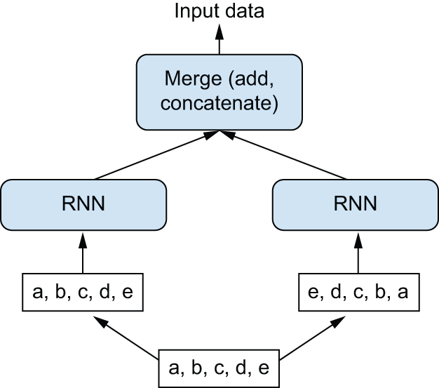


[Figure 13.13](#figure-13-13): How a bidirectional RNN layer works

To instantiate a bidirectional RNN in Keras, you use the `Bidirectional` layer,
which takes as its first argument a recurrent layer instance. `Bidirectional`
creates a second, separate instance of this recurrent layer and uses one
instance for processing the input sequences in chronological order and the
other instance for processing the input sequences in reversed order. You can try
it on our temperature forecasting task.

```python
inputs = keras.Input(shape=(sequence_length, raw_data.shape[-1]))
x = layers.Bidirectional(layers.LSTM(16))(inputs)
outputs = layers.Dense(1)(x)
model = keras.Model(inputs, outputs)

model.compile(optimizer="adam", loss="mse", metrics=["mae"])
history = model.fit(
    train_dataset,
    epochs=10,
    validation_data=val_dataset,
)
```

[Listing 13.24](#listing-13-24): Training and evaluating a bidirectional LSTM

You’ll find that it doesn’t perform as well as the plain `LSTM` layer.
It’s easy to understand why: all the predictive capacity must come from the chronological half of the
network because the antichronological half is known to be severely
underperforming on this task (again, because the recent past matters much more
than the distant past in this case). At the same time, the presence of the
antichronological half doubles the network’s capacity and causes it to start
overfitting much earlier.

However, bidirectional RNNs
are a great fit for text data — or any other kind of data where order matters, yet where
*which* order you use doesn’t matter. In fact, for a while in 2016, bidirectional LSTMs
were considered the state of the art on many natural language processing tasks
(before the rise of the Transformer architecture, which you will learn about
in chapter 15).

## Going even further

There are many other things you could try to improve performance on
the temperature forecasting problem:

* Adjust the number of units in each recurrent layer in the stacked setup, as
  well as the amount of dropout. The current choices are largely arbitrary
  and thus probably suboptimal.
* Adjust the learning rate used by the `Adam` optimizer or try a different optimizer.
* Try using a stack of `Dense` layers as the regressor on top of the recurrent layer,
  instead of a single `Dense` layer.
* Improve the input to the model: try using longer or shorter sequences or
  a different sampling rate, or start doing feature engineering.

As always, deep learning is more an art than a science. We can provide
guidelines that suggest what is likely to work or not work on a given problem,
but, ultimately, every dataset is unique; you’ll have to evaluate different
strategies empirically. There is currently no theory that will tell you in
advance precisely what you should do to optimally solve a problem. You must
iterate.

In our experience, improving on the no-learning baseline by about 10% is likely
the best you can do with this dataset. This isn’t so great, but these results make
sense: while near-future weather is highly predictable if you have access to data from a wide grid
of different locations, it’s not very predictable if you only have measurements
from a single location. The evolution of the weather where you are depends on current weather
patterns in surrounding locations.

Markets and machine learning

Some readers are bound to want to take the techniques we’ve introduced here and
try them on the problem of forecasting the future price of securities on the
stock market (or currency exchange rates, and so on). However, markets have very
different statistical characteristics than natural phenomena such as weather
patterns. When it comes to markets, past performance is *not* a good
predictor of future returns — looking in the rear-view mirror is a bad way to
drive. Machine learning, on the other hand, is applicable to datasets where
the past *is* a good predictor of the future, like weather, electricity consumption,
or foot traffic at a store.

Always remember that all trading is fundamentally *information arbitrage*:
gaining an advantage by using data or insights that other market participants
are missing. Trying to use well-known machine learning techniques and publicly available data
to beat the markets is effectively a dead end, since you won’t have any
information advantage compared to everyone else. You’re likely to waste your time
and resources with nothing to show for it.

## Summary

* As you first learned in chapter 6, when approaching a new problem, it’s good
  to first establish commonsense baselines for your metric of choice. If you
  don’t have a baseline to beat, you can’t tell whether you’re making real
  progress.

* Try simple models before expensive ones, to justify the additional expense.
  Sometimes a simple model will turn out to be your best option.

* When you have data where ordering matters — in particular, for timeseries data —
  *recurrent networks* are a great fit and easily outperform models that first flatten
  the temporal data. The two essential RNN layers available in Keras are the `LSTM`
  layer and the `GRU` layer.

* To use dropout with recurrent networks, you should use a time-constant
  dropout mask and recurrent dropout mask. These are built into Keras recurrent
  layers, so all you have to do is use the `recurrent_dropout`
  arguments of recurrent layers.

* Stacked RNNs provide more representational power than a single RNN layer.
  They’re also much more expensive and thus not always worth it. Although they
  offer clear gains on complex problems (such as machine translation), they may
  not always be relevant to smaller, simpler problems.

#### **Tiếng Việt (Vietnamese)**

# Chương 13: Dự báo chuỗi thời gian

Chương này bao gồm

* Tổng quan về học máy cho chuỗi thời gian
* Hiểu mạng lưới thần kinh tái phát (RNN)
* Áp dụng RNN vào ví dụ dự báo nhiệt độ

Chương này đề cập đến các chuỗi thời gian, trong đó trật tự thời gian là tất cả. Chúng ta sẽ tập trung vào nhiệm vụ chuỗi thời gian phổ biến và có giá trị nhất: dự báo. Sử dụng quá khứ gần đây để dự đoán tương lai gần là một khả năng mạnh mẽ, cho dù bạn đang cố gắng dự đoán nhu cầu năng lượng, quản lý hàng tồn kho hay đơn giản là dự báo thời tiết.

## Các loại nhiệm vụ theo chuỗi thời gian khác nhau

*Chuỗi thời gian* có thể là bất kỳ dữ liệu nào thu được thông qua các phép đo định kỳ, chẳng hạn như giá hàng ngày của một cổ phiếu, mức tiêu thụ điện hàng giờ của một thành phố hoặc doanh số bán hàng hàng tuần của một cửa hàng. Chuỗi thời gian có ở khắp mọi nơi, cho dù chúng ta đang xem xét các hiện tượng tự nhiên (như hoạt động địa chấn, sự phát triển của quần thể cá trên sông hay thời tiết tại một địa điểm) hay mô hình hoạt động của con người (như khách truy cập vào trang web, GDP của quốc gia hoặc giao dịch thẻ tín dụng). Không giống như các loại dữ liệu bạn đã gặp cho đến nay, làm việc với chuỗi thời gian đòi hỏi phải hiểu được *động lực* của một hệ thống — các chu kỳ định kỳ của nó, xu hướng của nó theo thời gian, chế độ đều đặn và các mức đột biến đột ngột của nó.

Cho đến nay, nhiệm vụ phổ biến nhất liên quan đến chuỗi thời gian là *dự báo*: dự đoán điều gì xảy ra tiếp theo trong chuỗi. Dự báo mức tiêu thụ điện trước vài giờ để bạn có thể dự đoán nhu cầu, dự báo doanh thu trước vài tháng để bạn có thể lên kế hoạch ngân sách, dự báo thời tiết trước vài ngày để bạn lên kế hoạch cho lịch trình của mình. Dự báo là nội dung mà chương này tập trung vào. Nhưng thực ra có rất nhiều việc khác bạn có thể làm với chuỗi thời gian, chẳng hạn như

* *Phát hiện bất thường* — Phát hiện bất kỳ điều gì bất thường xảy ra trong luồng dữ liệu liên tục.
Hoạt động bất thường trên mạng công ty của bạn? Có thể là kẻ tấn công.
Các thông số bất thường trên dây chuyền sản xuất? Đã đến lúc con người phải đi xem xét.
Việc phát hiện bất thường thường được thực hiện thông qua học tập không giám sát, bởi vì bạn thường không
biết bạn đang tìm kiếm loại bất thường nào và do đó bạn không thể đào tạo về các ví dụ bất thường cụ thể.
* *Phân loại* — Gán một hoặc nhiều nhãn phân loại cho một chuỗi thời gian. Ví dụ,
dựa trên chuỗi thời gian hoạt động của khách truy cập trên trang web,
phân loại xem khách truy cập là bot hay con người.
* *Phát hiện sự kiện* — Xác định sự xuất hiện của một sự kiện cụ thể, được mong đợi trong một khoảng thời gian liên tục
luồng dữ liệu. Một ứng dụng đặc biệt hữu ích là “phát hiện từ nóng”,
trong đó mô hình giám sát luồng âm thanh và phát hiện những câu nói như “OK, Google”
hoặc “Này, Alexa.”

Trong chương này, bạn sẽ tìm hiểu về mạng thần kinh tái phát (RNN) và cách áp dụng chúng vào dự báo chuỗi thời gian.

## Ví dụ dự báo nhiệt độ

Trong suốt chương này, tất cả các ví dụ mã của chúng tôi sẽ nhắm đến một vấn đề duy nhất: dự đoán nhiệt độ 24 giờ trong tương lai, đưa ra chuỗi thời gian đo lường các đại lượng hàng giờ như áp suất khí quyển và độ ẩm, được ghi lại trong quá khứ gần đây bởi một bộ cảm biến trên nóc tòa nhà. Như bạn sẽ thấy, đây là một vấn đề khá khó khăn!

Chúng tôi sẽ sử dụng nhiệm vụ dự báo nhiệt độ này để làm nổi bật điều khiến dữ liệu chuỗi thời gian khác biệt cơ bản với các loại tập dữ liệu mà bạn đã gặp cho đến nay, để cho thấy rằng các mạng kết nối dày đặc và mạng tích chập không được trang bị tốt để giải quyết vấn đề đó và để chứng minh một loại kỹ thuật máy học mới thực sự giải quyết được loại vấn đề này: mạng thần kinh tái phát (RNN).

Chúng tôi sẽ làm việc với tập dữ liệu chuỗi thời gian thời tiết được ghi lại tại trạm thời tiết tại Viện Hóa sinh học Max Planck ở Jena, Đức.[[1]](#footnote-1) Trong tập dữ liệu này, 14 đại lượng khác nhau (chẳng hạn như nhiệt độ, áp suất khí quyển, độ ẩm, hướng gió, v.v.) được ghi lại 10 phút một lần, trong vài năm. Dữ liệu gốc có từ năm 2003 nhưng tập hợp con dữ liệu chúng tôi sẽ tải xuống bị giới hạn ở năm 2009–2016.

Hãy bắt đầu bằng cách tải xuống và giải nén dữ liệu:

```python
!wget https://s3.amazonaws.com/keras-datasets/jena_climate_2009_2016.csv.zip
!unzip jena_climate_2009_2016.csv.zip
```

Hãy nhìn vào dữ liệu.

```python
import os

fname = os.path.join("jena_climate_2009_2016.csv")

with open(fname) as f:
    data = f.read()

lines = data.split("\n")
header = lines[0].split(",")
lines = lines[1:]
print(header)
print(len(lines))
```

[Danh sách 13.1](#listing-13-1): Kiểm tra dữ liệu của tập dữ liệu thời tiết Jena

Điều này tạo ra tổng số 420.551 dòng dữ liệu (mỗi dòng là một dấu thời gian: bản ghi ngày và 14 giá trị liên quan đến thời tiết), cũng như tiêu đề sau:

```python
["Date Time",
 "p (mbar)",
 "T (degC)",
 "Tpot (K)",
 "Tdew (degC)",
 "rh (%)",
 "VPmax (mbar)",
 "VPact (mbar)",
 "VPdef (mbar)",
 "sh (g/kg)",
 "H2OC (mmol/mol)",
 "rho (g/m**3)",
 "wv (m/s)",
 "max. wv (m/s)",
 "wd (deg)"]
```

Bây giờ, hãy chuyển đổi tất cả 420.551 dòng dữ liệu thành mảng NumPy: một mảng cho nhiệt độ (tính bằng độ C) và một mảng khác cho phần còn lại của dữ liệu — các tính năng mà chúng tôi sẽ sử dụng để dự đoán nhiệt độ trong tương lai. Lưu ý rằng chúng tôi loại bỏ cột “Ngày giờ”.

```python
import numpy as np

temperature = np.zeros((len(lines),))
raw_data = np.zeros((len(lines), len(header) - 1))

for i, line in enumerate(lines):
    values = [float(x) for x in line.split(",")[1:]]
    # We store column 1 in the temperature array.
    temperature[i] = values[1]
    # We store all columns (including the temperature) in the raw_data
    # array.
    raw_data[i, :] = values[:]
```

[Liệt kê 13.2](#listing-13-2): Phân tích cú pháp dữ liệu

Hình 13.1 biểu diễn đồ thị nhiệt độ (tính bằng độ C) theo thời gian. Trên biểu đồ này, bạn có thể thấy rõ chu kỳ hàng năm của nhiệt độ - dữ liệu kéo dài tám năm.

```python
from matplotlib import pyplot as plt

plt.plot(range(len(temperature)), temperature)
```

[Liệt kê 13.3](#listing-13-3): Vẽ đồ thị các chuỗi thời gian nhiệt độ


[Figure 13.1](#figure-13-1): Temperature over the full temporal range of the dataset (ºC)

Hình 13.2 cho thấy một biểu đồ hẹp hơn về dữ liệu nhiệt độ của 10 ngày đầu tiên. Vì dữ liệu được ghi lại cứ sau 10 phút nên bạn nhận được 24 × 6 = 144 điểm dữ liệu mỗi ngày.

```python
plt.plot(range(1440), temperature[:1440])
```

[Danh sách 13.4](#listing-13-4): Vẽ biểu đồ 10 ngày đầu tiên của chuỗi thời gian nhiệt độ


[Figure 13.2](#figure-13-2): Temperature over the first 10 days of the dataset (ºC)

Trên biểu đồ này, bạn có thể thấy tính chu kỳ hàng ngày, đặc biệt rõ ràng trong bốn ngày qua. Cũng lưu ý rằng khoảng thời gian 10 ngày này phải đến từ một tháng mùa đông khá lạnh.

Tính tuần hoàn trên nhiều khoảng thời gian là một đặc tính quan trọng và rất phổ biến của dữ liệu chuỗi thời gian. Cho dù bạn đang xem thời tiết, tỷ lệ sử dụng bãi đậu xe trong trung tâm thương mại, lưu lượng truy cập vào trang web, doanh số bán hàng của cửa hàng tạp hóa hay số bước được ghi vào trình theo dõi thể dục, bạn sẽ thấy chu kỳ hàng ngày và chu kỳ hàng năm (dữ liệu do con người tạo ra cũng có xu hướng mô tả chu kỳ hàng tuần). Khi khám phá dữ liệu của bạn, hãy đảm bảo tìm kiếm các mẫu này.

Với tập dữ liệu của chúng tôi, nếu bạn đang cố gắng dự đoán nhiệt độ trung bình cho tháng tiếp theo dựa trên dữ liệu trong vài tháng trước đó, thì vấn đề sẽ dễ dàng do tính định kỳ theo quy mô năm đáng tin cậy của dữ liệu. Nhưng nhìn vào dữ liệu theo thang ngày, nhiệt độ có vẻ hỗn loạn hơn rất nhiều. Chuỗi thời gian này có thể dự đoán được ở quy mô hàng ngày không? Hãy cùng tìm hiểu.

Trong tất cả các thử nghiệm của mình, chúng tôi sẽ sử dụng 50% dữ liệu đầu tiên để đào tạo, 25% dữ liệu tiếp theo để xác thực và 25% dữ liệu cuối cùng để thử nghiệm. Khi làm việc với dữ liệu chuỗi thời gian, điều quan trọng là phải sử dụng dữ liệu xác thực và kiểm tra mới hơn dữ liệu huấn luyện vì bạn đang cố gắng dự đoán tương lai dựa trên quá khứ chứ không phải ngược lại và việc phân tách xác thực/kiểm tra của bạn sẽ phản ánh thứ tự thời gian này. Một số vấn đề trở nên đơn giản hơn nhiều nếu bạn đảo ngược trục thời gian!

```python
>>> num_train_samples = int(0.5 * len(raw_data))
>>> num_val_samples = int(0.25 * len(raw_data))
>>> num_test_samples = len(raw_data) - num_train_samples - num_val_samples
>>> print("num_train_samples:", num_train_samples)
>>> print("num_val_samples:", num_val_samples)
>>> print("num_test_samples:", num_test_samples)
num_train_samples: 210225
num_val_samples: 105112
num_test_samples: 105114
```

[Liệt kê 13.5](#listing-13-5): Tính số lượng mẫu cho mỗi lần phân chia dữ liệu

### Chuẩn bị dữ liệu

Công thức chính xác của bài toán sẽ như sau: dữ liệu đã cho của 5 ngày trước đó và được lấy mẫu mỗi giờ một lần, liệu chúng ta có thể dự đoán nhiệt độ trong 24 giờ không?

Trước tiên, hãy xử lý trước dữ liệu theo định dạng mà mạng nơ-ron có thể sử dụng. Điều này thật dễ dàng: dữ liệu đã ở dạng số, vì vậy bạn không cần thực hiện bất kỳ thao tác vector hóa nào. Nhưng mỗi chuỗi thời gian trong dữ liệu lại có thang đo khác nhau (ví dụ: áp suất khí quyển, đo bằng mbar, là khoảng 1.000, trong khi H2OC, đo bằng milimol trên mol, là khoảng 3). Chúng tôi sẽ chuẩn hóa từng chuỗi thời gian một cách độc lập để tất cả chúng đều có các giá trị nhỏ trên cùng một tỷ lệ. Chúng tôi sẽ sử dụng 210.225 dấu thời gian đầu tiên làm dữ liệu huấn luyện, vì vậy chúng tôi sẽ chỉ tính giá trị trung bình và độ lệch chuẩn trên phần dữ liệu này.

```python
mean = raw_data[:num_train_samples].mean(axis=0)
raw_data -= mean
std = raw_data[:num_train_samples].std(axis=0)
raw_data /= std
```

[Liệt kê 13.6](#listing-13-6): Chuẩn hóa dữ liệu

Tiếp theo, hãy tạo một đối tượng `Dataset` mang lại các lô dữ liệu trong 5 ngày qua cùng với nhiệt độ mục tiêu trong 24 giờ tới. Bởi vì các mẫu trong tập dữ liệu có tính dư thừa cao (mẫu `N` và mẫu `N + 1` sẽ có hầu hết các dấu thời gian chung), sẽ rất lãng phí nếu phân bổ bộ nhớ rõ ràng cho mỗi mẫu. Thay vào đó, chúng tôi sẽ tạo các mẫu một cách nhanh chóng trong khi chỉ lưu giữ trong bộ nhớ các mảng `raw_data` và `nhiệt độ` ban đầu, không có gì khác.

Chúng ta có thể dễ dàng viết một trình tạo Python để thực hiện việc này, nhưng có một tiện ích tập dữ liệu tích hợp sẵn trong Keras thực hiện điều đó (`timeseries_dataset_from_array()`), vì vậy chúng ta có thể tiết kiệm một số công việc bằng cách sử dụng nó. Nói chung, bạn có thể sử dụng nó cho bất kỳ loại nhiệm vụ dự báo chuỗi thời gian nào.

Hiểu chuỗi thời gian\_dataset\_from\_array()

Để hiểu `timeseries_dataset_from_array()` làm gì, chúng ta hãy xem một ví dụ đơn giản. Ý tưởng chung là bạn cung cấp một mảng dữ liệu chuỗi thời gian (đối số `data`) và `timeseries_dataset_from_array` cung cấp cho bạn các cửa sổ được trích xuất từ ​​chuỗi thời gian ban đầu (chúng tôi sẽ gọi chúng là “chuỗi”).

Giả sử bạn đang sử dụng `data = [0 1 2 3 4 5 6]` và `sequence_length=3`; thì `timeseries_dataset_from_array` sẽ tạo ra các mẫu sau: `[0 1 2]`, `[1 2 3]`, `[2 3 4]`, `[3 4 5]`, `[4 5 6]`.

Bạn cũng có thể chuyển một mảng `target` sang `timeseries_dataset_from_array()`. Mục nhập đầu tiên của mảng `target` phải khớp với mục tiêu mong muốn cho chuỗi đầu tiên sẽ được tạo từ mảng `data`. Vì vậy, nếu bạn đang thực hiện dự báo chuỗi thời gian, chỉ cần sử dụng làm `mục tiêu` cùng một mảng như cho `dữ liệu`, được bù đắp bằng một số lượng.

Ví dụ: với `data = [0 1 2 3 4 5 6 ...]` và `sequence_length=3`, bạn có thể tạo một tập dữ liệu để dự đoán bước tiếp theo trong chuỗi bằng cách chuyển `targets = [3 4 5 6 ...]`. Hãy thử nó:

```python
import numpy as np
import keras

# Generate an array of sorted integers from 0 to 9.
int_sequence = np.arange(10)
dummy_dataset = keras.utils.timeseries_dataset_from_array(
    # The sequences we generate will be sampled from [0 1 2 3 4 5 6].
    data=int_sequence[:-3],
    # The target for the sequence that starts at data[N] will be data[N
    # + 3].
    targets=int_sequence[3:],
    # The sequences will be 3 steps long.
    sequence_length=3,
    # The sequences will be batched in batches of size 2.
    batch_size=2,
)

for inputs, targets in dummy_dataset:
    for i in range(inputs.shape[0]):
        print([int(x) for x in inputs[i]], int(targets[i]))
```

Đoạn mã này in ra kết quả sau:

```python
[0, 1, 2] 3
[1, 2, 3] 4
[2, 3, 4] 5
[3, 4, 5] 6
[4, 5, 6] 7
```

Chúng ta sẽ sử dụng `timeseries_dataset_from_array` để khởi tạo ba tập dữ liệu: một để đào tạo, một để xác thực và một để kiểm tra.

Chúng tôi sẽ sử dụng các giá trị tham số sau:

* `sampling_rate = 6` — Các quan sát sẽ được lấy mẫu tại một điểm dữ liệu mỗi giờ:
chúng tôi sẽ chỉ giữ một điểm dữ liệu trong số sáu điểm.
* `sequence_length = 120` — Các quan sát sẽ lùi lại 5 ngày (120 giờ).
* `delay = samples_rate * (sequence_length + 24 - 1)` — Mục tiêu cho một chuỗi
sẽ là nhiệt độ 24 giờ sau khi kết thúc chuỗi.
* `start_index = 0` và `end_index = num_train_samples` — Đối với tập dữ liệu huấn luyện, chỉ
sử dụng 50% dữ liệu đầu tiên.
* `start_index = num_train_samples` và `end_index = num_train_samples + num_val_samples` — Đối với tập dữ liệu xác thực,
chỉ sử dụng 25% dữ liệu tiếp theo.
* `start_index = num_train_samples + num_val_samples` — Đối với tập dữ liệu thử nghiệm, hãy sử dụng các mẫu còn lại.

```python
sampling_rate = 6
sequence_length = 120
delay = sampling_rate * (sequence_length + 24 - 1)
batch_size = 256

train_dataset = keras.utils.timeseries_dataset_from_array(
    raw_data[:-delay],
    targets=temperature[delay:],
    sampling_rate=sampling_rate,
    sequence_length=sequence_length,
    shuffle=True,
    batch_size=batch_size,
    start_index=0,
    end_index=num_train_samples,
)

val_dataset = keras.utils.timeseries_dataset_from_array(
    raw_data[:-delay],
    targets=temperature[delay:],
    sampling_rate=sampling_rate,
    sequence_length=sequence_length,
    shuffle=True,
    batch_size=batch_size,
    start_index=num_train_samples,
    end_index=num_train_samples + num_val_samples,
)

test_dataset = keras.utils.timeseries_dataset_from_array(
    raw_data[:-delay],
    targets=temperature[delay:],
    sampling_rate=sampling_rate,
    sequence_length=sequence_length,
    shuffle=True,
    batch_size=batch_size,
    start_index=num_train_samples + num_val_samples,
)
```

[Danh sách 13.7](#listing-13-7): Khởi tạo các tập dữ liệu để đào tạo, xác thực và thử nghiệm

Mỗi tập dữ liệu mang lại một bộ dữ liệu `(mẫu, mục tiêu)`, trong đó `mẫu` là một lô gồm 256 mẫu, mỗi mẫu chứa 120 giờ dữ liệu đầu vào liên tục và `mục tiêu` là mảng tương ứng gồm 256 nhiệt độ mục tiêu. Lưu ý rằng các mẫu được xáo trộn ngẫu nhiên, do đó, hai chuỗi liên tiếp trong một lô (như `samples[0]` và `samples[1]`) không nhất thiết phải gần nhau về mặt thời gian.

```python
>>> for samples, targets in train_dataset:
>>>     print("samples shape:", samples.shape)
>>>     print("targets shape:", targets.shape)
>>>     break
samples shape: (256, 120, 14)
targets shape: (256,)
```

[Danh sách 13.8](#listing-13-8): Kiểm tra tập dữ liệu

### Một cơ sở thông thường, không dùng máy học

Trước khi bạn bắt đầu sử dụng hộp đen, mô hình học sâu để giải quyết vấn đề dự đoán nhiệt độ, hãy thử một cách tiếp cận đơn giản, thông thường. Nó sẽ đóng vai trò như một cuộc kiểm tra độ tỉnh táo và nó sẽ thiết lập một đường cơ sở mà bạn sẽ phải vượt qua để chứng minh tính hữu ích của các mô hình học máy tiên tiến hơn. Những đường cơ sở thông thường như vậy có thể hữu ích khi bạn tiếp cận một vấn đề mới mà chưa có giải pháp nào được biết đến. Một ví dụ kinh điển là nhiệm vụ phân loại không cân bằng, trong đó một số lớp phổ biến hơn nhiều so với các lớp khác. Nếu tập dữ liệu của bạn chứa 90% phiên bản thuộc loại A và 10% phiên bản thuộc loại B thì cách tiếp cận thông thường đối với nhiệm vụ phân loại là luôn dự đoán “A” khi được đưa ra một mẫu mới. Một bộ phân loại như vậy có độ chính xác tổng thể là 90% và do đó, bất kỳ phương pháp tiếp cận dựa trên học tập nào cũng phải đánh bại điểm 90% này để chứng minh tính hữu ích. Đôi khi, những đường cơ sở cơ bản như vậy có thể khó bị đánh bại một cách đáng ngạc nhiên.

Trong trường hợp này, chuỗi thời gian nhiệt độ có thể được giả định một cách an toàn là liên tục (nhiệt độ ngày mai có thể gần với nhiệt độ ngày hôm nay) cũng như tuần hoàn với chu kỳ hàng ngày. Vì vậy, một cách tiếp cận thông thường là luôn dự đoán rằng nhiệt độ trong 24 giờ tới sẽ bằng nhiệt độ hiện tại. Hãy đánh giá phương pháp này bằng cách sử dụng chỉ số sai số tuyệt đối trung bình (MAE), được xác định như sau:

```python
np.mean(np.abs(preds - targets))
```

Đây là vòng lặp đánh giá.

```python
def evaluate_naive_method(dataset):
    total_abs_err = 0.0
    samples_seen = 0
    for samples, targets in dataset:
        # The temperature feature is at column 1, so `samples[:, -1,
        # 1]` is the last temperature measurement in the input
        # sequence. Recall that we normalized our features to retrieve
        # a temperature in Celsius degrees, we need to un-normalize it,
        # by multiplying it by the standard deviation and adding back
        # the mean.
        preds = samples[:, -1, 1] * std[1] + mean[1]
        total_abs_err += np.sum(np.abs(preds - targets))
        samples_seen += samples.shape[0]
    return total_abs_err / samples_seen

print(f"Validation MAE: {evaluate_naive_method(val_dataset):.2f}")
print(f"Test MAE: {evaluate_naive_method(test_dataset):.2f}")
```

[Liệt kê 13.9](#listing-13-9): Tính MAE cơ sở thông thường

Đường cơ sở thông thường này đạt được MAE xác thực là 2,44 độ C và MAE thử nghiệm là 2,62 độ C. Vì vậy, nếu bạn luôn cho rằng nhiệt độ trong 24 giờ tới sẽ giống như hiện tại, thì trung bình bạn sẽ giảm đi hai độ rưỡi. Nó không quá tệ, nhưng có thể bạn sẽ không tung ra dịch vụ dự báo thời tiết dựa trên phương pháp phỏng đoán này. Bây giờ, trò chơi là sử dụng kiến ​​thức về deep learning của bạn để làm tốt hơn.

### Hãy thử một mô hình học máy cơ bản

Cũng giống như cách hữu ích khi thiết lập đường cơ sở thông thường trước khi thử các phương pháp học máy, việc thử các mô hình học máy đơn giản, rẻ tiền (chẳng hạn như các mạng nhỏ, được kết nối dày đặc) trước khi xem xét các mô hình phức tạp và đắt tiền về mặt tính toán như RNN cũng rất hữu ích. Đây là cách tốt nhất để đảm bảo rằng mọi vấn đề phức tạp hơn nữa mà bạn đưa ra đều hợp lý và mang lại lợi ích thực sự.

Liệt kê 13.10 cho thấy một mô hình được kết nối đầy đủ bắt đầu bằng cách làm phẳng dữ liệu và sau đó chạy nó qua hai lớp `Dense`. Lưu ý việc thiếu chức năng kích hoạt trên lớp `Dense` cuối cùng, đây là điển hình cho vấn đề hồi quy. Chúng tôi sử dụng sai số bình phương trung bình (MSE) làm tổn thất, thay vì MAE, vì không giống như MAE, nó trơn tru quanh 0, một thuộc tính hữu ích cho việc giảm độ dốc. Chúng tôi sẽ theo dõi MAE bằng cách thêm nó dưới dạng số liệu trong `compile()`.

```python
import keras
from keras import layers

inputs = keras.Input(shape=(sequence_length, raw_data.shape[-1]))
x = layers.Flatten()(inputs)
x = layers.Dense(16, activation="relu")(x)
outputs = layers.Dense(1)(x)
model = keras.Model(inputs, outputs)

callbacks = [
    # We use a callback to save the best-performing model.
    keras.callbacks.ModelCheckpoint("jena_dense.keras", save_best_only=True)
]
model.compile(optimizer="adam", loss="mse", metrics=["mae"])
history = model.fit(
    train_dataset,
    epochs=10,
    validation_data=val_dataset,
    callbacks=callbacks,
)

# Reloads the best model and evaluates it on the test data
model = keras.models.load_model("jena_dense.keras")
print(f"Test MAE: {model.evaluate(test_dataset)[1]:.2f}")
```

[Liệt kê 13.10](#listing-13-10): Huấn luyện và đánh giá một mô hình được kết nối dày đặc

Hãy hiển thị đường cong tổn thất để xác nhận và huấn luyện (xem hình 13.3).

```python
import matplotlib.pyplot as plt

loss = history.history["mae"]
val_loss = history.history["val_mae"]
epochs = range(1, len(loss) + 1)
plt.figure()
plt.plot(epochs, loss, "r--", label="Training MAE")
plt.plot(epochs, val_loss, "b", label="Validation MAE")
plt.title("Training and validation MAE")
plt.legend()
plt.show()
```

[Liệt kê 13.11](#listing-13-11): Vẽ kết quả


[Figure 13.3](#figure-13-3): Training and validation MAE on the Jena temperature-forecasting task with a simple, densely connected network

Một số tổn thất về xác thực gần với mức cơ bản không được học hỏi nhưng không đáng tin cậy. Điều này chứng tỏ giá trị của việc có được đường cơ sở này ngay từ đầu: hóa ra không dễ để vượt trội hơn. Ý thức chung của bạn chứa rất nhiều thông tin có giá trị mà mô hình học máy không có quyền truy cập.

Bạn có thể thắc mắc, nếu tồn tại một mô hình đơn giản, hoạt động tốt để đi từ dữ liệu đến mục tiêu (đường cơ sở thông thường), tại sao mô hình bạn đang đào tạo không tìm ra và cải thiện nó? Chà, không gian của các mô hình mà bạn đang tìm kiếm giải pháp - tức là không gian giả thuyết của bạn - là không gian của tất cả các mạng hai lớp có thể có với cấu hình mà bạn đã xác định. Heuristic thông thường chỉ là một mô hình trong số hàng triệu mô hình có thể được biểu diễn trong không gian này. Nó giống như tìm kim đáy bể. Chỉ vì một giải pháp tốt tồn tại về mặt kỹ thuật trong không gian giả thuyết của bạn không có nghĩa là bạn sẽ có thể tìm thấy nó thông qua việc giảm độ dốc.

Đó là một hạn chế khá đáng kể của học máy nói chung: trừ khi thuật toán học được mã hóa cứng để tìm kiếm một loại mô hình đơn giản cụ thể, đôi khi nó có thể không tìm được giải pháp đơn giản cho một vấn đề đơn giản. Đó là lý do tại sao việc sử dụng kỹ thuật tính năng tốt và kiến ​​trúc phù hợp là điều cần thiết: bạn cần phải cho mô hình của mình biết chính xác những gì nó cần tìm kiếm.

### Hãy thử mô hình tích chập 1D

Nói về việc sử dụng các ưu tiên kiến ​​​​trúc phù hợp: vì chuỗi đầu vào của chúng tôi có chu kỳ hàng ngày, có lẽ một mô hình tích chập có thể hoạt động? ConvNet tạm thời có thể sử dụng lại các biểu diễn giống nhau trong các ngày khác nhau, giống như ConvNet không gian có thể sử dụng lại các biểu diễn giống nhau ở các vị trí khác nhau trong một hình ảnh.

Bạn đã biết về các lớp `Conv2D` và `SeparableConv2D`, các lớp này xem đầu vào của chúng thông qua các cửa sổ nhỏ vuốt qua lưới 2D. Ngoài ra còn có các phiên bản 1D và thậm chí 3D của các lớp này: `Conv1D`, `SeparableConv1D` và `Conv3D`.[[2]](#footnote-2) Lớp `Conv1D` dựa trên các cửa sổ 1D trượt qua các chuỗi đầu vào và lớp `Conv3D` dựa trên các cửa sổ hình khối trượt trên các khối đầu vào.

Do đó, bạn có thể xây dựng ConvNet 1D, tương tự như ConvNet 2D. Chúng rất phù hợp với bất kỳ dữ liệu chuỗi nào tuân theo giả định bất biến dịch thuật (có nghĩa là nếu bạn trượt một cửa sổ qua chuỗi, nội dung của cửa sổ sẽ tuân theo các thuộc tính giống nhau một cách độc lập với vị trí của cửa sổ).

Hãy thử giải quyết vấn đề dự báo nhiệt độ của chúng ta. Chúng tôi sẽ chọn độ dài cửa sổ ban đầu là 24 để chúng tôi xem xét dữ liệu trong 24 giờ mỗi lần (một chu kỳ). Khi chúng tôi lấy mẫu xuống các chuỗi (thông qua các lớp `MaxPooling1D`), chúng tôi sẽ giảm kích thước cửa sổ tương ứng (hình 13.4):

```python
inputs = keras.Input(shape=(sequence_length, raw_data.shape[-1]))
x = layers.Conv1D(8, 24, activation="relu")(inputs)
x = layers.MaxPooling1D(2)(x)
x = layers.Conv1D(8, 12, activation="relu")(x)
x = layers.MaxPooling1D(2)(x)
x = layers.Conv1D(8, 6, activation="relu")(x)
x = layers.GlobalAveragePooling1D()(x)
outputs = layers.Dense(1)(x)
model = keras.Model(inputs, outputs)

callbacks = [
    keras.callbacks.ModelCheckpoint("jena_conv.keras", save_best_only=True)
]
model.compile(optimizer="adam", loss="mse", metrics=["mae"])
history = model.fit(
    train_dataset,
    epochs=10,
    validation_data=val_dataset,
    callbacks=callbacks,
)

model = keras.models.load_model("jena_conv.keras")
print(f"Test MAE: {model.evaluate(test_dataset)[1]:.2f}")
```


[Figure 13.4](#figure-13-4): Training and validation MAE on the Jena temperature forecasting task with a 1D ConvNet

Hóa ra, mô hình này thậm chí còn hoạt động kém hơn mô hình được kết nối dày đặc, chỉ đạt được MAE xác thực khoảng 2,9 độ, khác xa so với đường cơ sở thông thường. Điều gì đã xảy ra ở đây? Hai điều:

* Đầu tiên, dữ liệu thời tiết không hoàn toàn tôn trọng giả định bất biến dịch chuyển.
Mặc dù dữ liệu có tính năng chu kỳ hàng ngày, nhưng dữ liệu từ một buổi sáng lại có các chu kỳ khác nhau.
thuộc tính hơn dữ liệu từ một buổi tối hoặc từ nửa đêm. Dữ liệu thời tiết
chỉ là bất biến dịch trong một khoảng thời gian rất cụ thể.
* Thứ hai, thứ tự trong dữ liệu của chúng tôi rất quan trọng - rất nhiều. Quá khứ gần đây có nhiều thông tin hơn
để dự đoán nhiệt độ ngày hôm sau so với dữ liệu từ năm ngày trước. Mạng chuyển đổi 1D
không thể tận dụng thực tế này. Đặc biệt, tổng hợp tối đa và toàn cầu của chúng tôi
các lớp tổng hợp trung bình phần lớn đang phá hủy thông tin đơn hàng.

## Mạng lưới thần kinh tái phát

Cả cách tiếp cận được kết nối đầy đủ lẫn cách tiếp cận tích chập đều không hiệu quả, nhưng điều đó không có nghĩa là học máy không thể áp dụng được cho vấn đề này. Cách tiếp cận kết nối dày đặc trước tiên đã làm phẳng các chuỗi thời gian, loại bỏ khái niệm thời gian khỏi dữ liệu đầu vào. Cách tiếp cận tích chập xử lý mọi phân đoạn dữ liệu theo cùng một cách, thậm chí áp dụng gộp dữ liệu, làm phá hủy thông tin đơn hàng. Thay vào đó, hãy xem dữ liệu như nó vốn là: một chuỗi, trong đó quan hệ nhân quả và thứ tự là quan trọng.

Có một nhóm kiến ​​trúc mạng thần kinh được thiết kế riêng cho trường hợp sử dụng này: mạng thần kinh tái phát. Trong số đó, lớp Bộ nhớ ngắn hạn dài (LSTM) nói riêng từ lâu đã rất phổ biến. Chúng ta sẽ xem các mô hình này hoạt động như thế nào sau một phút - nhưng hãy bắt đầu bằng cách thử lớp LSTM.

```python
inputs = keras.Input(shape=(sequence_length, raw_data.shape[-1]))
x = layers.LSTM(16)(inputs)
outputs = layers.Dense(1)(x)
model = keras.Model(inputs, outputs)

callbacks = [
    keras.callbacks.ModelCheckpoint("jena_lstm.keras", save_best_only=True)
]
model.compile(optimizer="adam", loss="mse", metrics=["mae"])
history = model.fit(
    train_dataset,
    epochs=10,
    validation_data=val_dataset,
    callbacks=callbacks,
)

model = keras.models.load_model("jena_lstm.keras")
print("Test MAE: {model.evaluate(test_dataset)[1]:.2f}")
```

[Liệt kê 13.12](#listing-13-12): Một mô hình dựa trên LSTM đơn giản

Hình 13.5 thể hiện kết quả. Tốt hơn nhiều! Chúng tôi đạt được MAE xác thực ở mức thấp nhất là 2,39 độ và MAE thử nghiệm là 2,55 độ. Mô hình dựa trên LSTM cuối cùng có thể đánh bại đường cơ sở thông thường (mặc dù hiện tại chỉ là một chút), chứng tỏ giá trị của máy học trong nhiệm vụ này.


[Figure 13.5](#figure-13-5): Training and validation MAE on the Jena temperature forecasting task with an LSTM-based model. (Note that we omit epoch 1 on this graph because the high training MAE (7.75) at epoch 1 would distort the scale.)

Nhưng tại sao mô hình LSTM lại hoạt động tốt hơn rõ rệt so với mô hình được kết nối dày đặc hoặc ConvNet? Và làm thế nào chúng ta có thể tinh chỉnh thêm mô hình? Để trả lời câu hỏi này, chúng ta hãy xem xét kỹ hơn các mạng thần kinh tái phát.

### Hiểu mạng lưới thần kinh tái phát

Đặc điểm chính của tất cả các mạng thần kinh mà bạn đã thấy cho đến nay, chẳng hạn như mạng kết nối dày đặc và ConvNet, là chúng không có bộ nhớ. Mỗi đầu vào hiển thị cho chúng được xử lý độc lập, không có trạng thái nào được giữ giữa các đầu vào. Với các mạng như vậy, để xử lý một chuỗi hoặc một chuỗi điểm dữ liệu tạm thời, bạn phải hiển thị toàn bộ chuỗi cho mạng cùng một lúc: biến nó thành một điểm dữ liệu duy nhất. Ví dụ: đây là những gì chúng tôi đã làm trong ví dụ về mạng được kết nối dày đặc: chúng tôi đã chia dữ liệu trong 5 ngày của mình thành một vectơ lớn duy nhất và xử lý nó trong một lần. Những mạng như vậy được gọi là *mạng tiếp liệu*.

Ngược lại, khi bạn đọc câu hiện tại, bạn đang xử lý nó từng từ một - hay đúng hơn là nhìn từng mắt một - trong khi vẫn lưu giữ những ký ức về những gì xảy ra trước đó; điều này mang lại cho bạn sự thể hiện trôi chảy về ý nghĩa mà câu này truyền tải. Trí tuệ sinh học xử lý thông tin tăng dần trong khi vẫn duy trì mô hình nội bộ về những gì nó đang xử lý, được xây dựng từ thông tin trong quá khứ và được cập nhật liên tục khi có thông tin mới.

*Mạng thần kinh tái phát* (RNN) áp dụng nguyên tắc tương tự, mặc dù ở phiên bản cực kỳ đơn giản: nó xử lý các chuỗi bằng cách lặp qua các thành phần chuỗi và duy trì *trạng thái* chứa thông tin liên quan đến những gì nó đã thấy cho đến nay. Trên thực tế, RNN là một loại mạng thần kinh có *vòng lặp* bên trong (xem hình 13.6).


[Figure 13.6](#figure-13-6): A recurrent network: a network with a loop

Trạng thái của RNN được đặt lại giữa quá trình xử lý hai chuỗi độc lập, khác nhau (chẳng hạn như hai mẫu trong một đợt), do đó bạn vẫn coi một chuỗi là một điểm dữ liệu duy nhất: một đầu vào duy nhất cho mạng. Điều thay đổi là điểm dữ liệu này không còn được xử lý trong một bước nữa; đúng hơn, mạng lặp nội bộ trên các phần tử chuỗi.

Để làm rõ các khái niệm về *vòng lặp* và *trạng thái* này, hãy triển khai quá trình chuyển tiếp của RNN đồ chơi. RNN này lấy đầu vào là một chuỗi vectơ mà chúng tôi sẽ mã hóa dưới dạng tenxơ cấp 2 có kích thước `(timesteps, input_features)`. Nó lặp qua các dấu thời gian và tại mỗi dấu thời gian, nó xem xét trạng thái hiện tại của nó tại `t` và đầu vào tại `t` (có hình dạng `(input_features,)`) và kết hợp chúng để thu được đầu ra tại `t`. Sau đó, chúng tôi sẽ đặt trạng thái cho bước tiếp theo là đầu ra trước đó. Đối với dấu thời gian đầu tiên, đầu ra trước đó không được xác định; do đó, không có trạng thái hiện tại. Vì vậy, chúng ta sẽ khởi tạo trạng thái dưới dạng một vectơ hoàn toàn bằng 0 được gọi là trạng thái *ban đầu* của mạng.

Trong mã giả, đây là RNN.

```python
# The state at t
state_t = 0
# Iterates over sequence elements
for input_t in input_sequence:
    output_t = f(input_t, state_t)
    # The previous output becomes the state for the next iteration.
    state_t = output_t
```

[Danh sách 13.13](#listing-13-13): Mã giả RNN

Bạn thậm chí có thể tạo ra hàm `f`: việc chuyển đổi đầu vào và trạng thái thành đầu ra sẽ được tham số hóa bởi hai ma trận, `W` và `U`, và một vectơ thiên vị. Nó tương tự như quá trình chuyển đổi được thực hiện bởi một lớp được kết nối dày đặc trong mạng tiếp liệu.

```python
state_t = 0
for input_t in input_sequence:
    output_t = activation(dot(W, input_t) + dot(U, state_t) + b)
    state_t = output_t
```

[Danh sách 13.14](#listing-13-14): Mã giả chi tiết hơn cho RNN

Để làm cho những khái niệm này hoàn toàn rõ ràng, hãy viết một cách triển khai NumPy đơn giản về quá trình chuyển tiếp của RNN đơn giản.

```python
import numpy as np

# Number of timesteps in the input sequence
timesteps = 100
# Dimensionality of the input feature space
input_features = 32
# Dimensionality of the output feature space
output_features = 64
# Input data: random noise for the sake of the example
inputs = np.random.random((timesteps, input_features))
# Initial state: an all-zero vector
state_t = np.zeros((output_features,))
# Creates random weight matrices
W = np.random.random((output_features, input_features))
U = np.random.random((output_features, output_features))
b = np.random.random((output_features,))
successive_outputs = []
# input_t is a vector of shape (input_features,).
for input_t in inputs:
    # Combines the input with the current state (the previous output)
    # to obtain the current output. We use tanh to add nonlinearity (we
    # could use any other activation function).
    output_t = np.tanh(np.dot(W, input_t) + np.dot(U, state_t) + b)
    # Stores this output in a list
    successive_outputs.append(output_t)
    # Updates the state of the network for the next timestep
    state_t = output_t
# The final output is a rank-2 tensor of shape (timesteps,
# output_features).
final_output_sequence = np.concatenate(successive_outputs, axis=0)
```

[Danh sách 13.15](#listing-13-15): Triển khai NumPy của một RNN đơn giản

Đủ dễ dàng: tóm lại, RNN là một vòng lặp `for` sử dụng lại số lượng được tính toán trong lần lặp trước của vòng lặp, không có gì hơn. Tất nhiên, có nhiều RNN khác nhau phù hợp với định nghĩa này mà bạn có thể xây dựng - ví dụ này là một trong những công thức RNN đơn giản nhất. RNN được đặc trưng bởi hàm bước của chúng, chẳng hạn như hàm sau trong trường hợp này (xem hình 13.7):

```python
output_t = tanh(matmul(input_t, W) + matmul(state_t, U) + b)
```


[Figure 13.7](#figure-13-7): A simple RNN, unrolled over time


Trong ví dụ này, đầu ra cuối cùng là một tensor cấp 2 có hình dạng `(timesteps, out_features)`, trong đó mỗi dấu thời gian là đầu ra của vòng lặp tại thời điểm `t`. Mỗi dấu thời gian `t` trong tenxơ đầu ra chứa thông tin về dấu thời gian `0` đến `t` trong chuỗi đầu vào - về toàn bộ quá khứ. Vì lý do này, trong nhiều trường hợp, bạn không cần chuỗi đầu ra đầy đủ này; bạn chỉ cần đầu ra cuối cùng (`output_t` ở cuối vòng lặp), vì nó đã chứa thông tin về toàn bộ chuỗi.

### Một lớp lặp lại trong Keras

Quá trình bạn vừa triển khai một cách ngây thơ trong NumPy tương ứng với lớp Keras thực tế - lớp `SimpleRNN`.

Có một điểm khác biệt nhỏ: `SimpleRNN` xử lý hàng loạt chuỗi, giống như tất cả các lớp Keras khác, không phải một chuỗi như trong ví dụ NumPy. Điều này có nghĩa là nó nhận đầu vào có hình dạng `(batch_size, timesteps, input_features)` thay vì `(timesteps, input_features)`. Khi chỉ định đối số `shape` của `Input()` ban đầu của bạn, hãy lưu ý rằng bạn có thể đặt mục nhập `timesteps` thành `None`, điều này cho phép mạng của bạn xử lý các chuỗi có độ dài tùy ý.

```python
num_features = 14
inputs = keras.Input(shape=(None, num_features))
outputs = layers.SimpleRNN(16)(inputs)
```

[Danh sách 13.16](#listing-13-16): Lớp RNN có thể xử lý các chuỗi có độ dài bất kỳ

Điều này đặc biệt hữu ích nếu mô hình của bạn nhằm xử lý các chuỗi có độ dài thay đổi. Tuy nhiên, nếu tất cả các chuỗi của bạn có cùng độ dài, tôi khuyên bạn nên chỉ định một hình dạng đầu vào hoàn chỉnh, vì nó cho phép `model.summary()` hiển thị thông tin về độ dài đầu ra, thông tin này luôn đẹp và có thể mở khóa một số tối ưu hóa hiệu suất (xem ghi chú “Về hiệu suất thời gian chạy RNN” ở phần sau của chương).

Tất cả các lớp lặp lại trong Keras (`SimpleRNN`, `LSTM` và `GRU`) có thể chạy ở hai chế độ khác nhau: chúng có thể trả về chuỗi đầy đủ của các đầu ra liên tiếp cho mỗi dấu thời gian (một tensor cấp 3 có hình dạng `(batch_size, timesteps, out_features)`) hoặc chỉ đầu ra cuối cùng cho mỗi chuỗi đầu vào (một tensor cấp 2 có hình dạng `(batch_size, out_features)`). Hai chế độ này được điều khiển bởi đối số hàm tạo `return_sequences`. Hãy xem một ví dụ sử dụng `SimpleRNN` và chỉ trả về đầu ra ở dấu thời gian cuối cùng.

```python
>>> num_features = 14
>>> steps = 120
>>> inputs = keras.Input(shape=(steps, num_features))
>>> # Note that return_sequences=False is the default.
>>> outputs = layers.SimpleRNN(16, return_sequences=False)(inputs)
>>> print(outputs.shape)
(None, 16)
```

[Liệt kê 13.17](#listing-13-17): Lớp RNN chỉ trả về bước đầu ra cuối cùng của nó

Ví dụ sau trả về chuỗi đầu ra đầy đủ.

```python
>>> num_features = 14
>>> steps = 120
>>> inputs = keras.Input(shape=(steps, num_features))
>>> # Sets return_sequences to True
>>> outputs = layers.SimpleRNN(16, return_sequences=True)(inputs)
>>> print(outputs.shape)
(None, 120, 16)
```

[Liệt kê 13.18](#listing-13-18): Lớp RNN trả về chuỗi đầu ra đầy đủ của nó

Đôi khi, việc xếp chồng nhiều lớp lặp lại lần lượt sẽ rất hữu ích để tăng sức mạnh biểu diễn của mạng. Trong thiết lập như vậy, bạn phải lấy tất cả các lớp trung gian để trả về chuỗi đầu ra đầy đủ.

```python
inputs = keras.Input(shape=(steps, num_features))
x = layers.SimpleRNN(16, return_sequences=True)(inputs)
x = layers.SimpleRNN(16, return_sequences=True)(x)
outputs = layers.SimpleRNN(16)(x)
```

[Danh sách 13.19](#listing-13-19): Xếp chồng các lớp RNN

Trên thực tế, bạn sẽ hiếm khi làm việc với lớp `SimpleRNN`. Nói chung là quá đơn giản để có thể sử dụng thực tế. Đặc biệt, `SimpleRNN` có một vấn đề lớn: mặc dù về mặt lý thuyết nó có thể lưu giữ thông tin `t` về các đầu vào đã thấy nhiều dấu thời gian trước đó, nhưng trên thực tế, những sự phụ thuộc lâu dài như vậy chứng tỏ là không thể học được. Điều này là do *vấn đề về độ dốc biến mất*, một hiệu ứng tương tự như những gì được quan sát thấy với các mạng không lặp lại (mạng tiếp liệu chuyển tiếp) có nhiều lớp sâu: khi bạn tiếp tục thêm các lớp vào mạng, mạng cuối cùng sẽ trở nên không thể huấn luyện được. Lý do lý thuyết cho hiệu ứng này đã được Hochreiter, Schmidhuber và Bengio nghiên cứu vào đầu những năm 1990.[[3]](#footnote-3)

Rất may, `SimpleRNN` không phải là lớp lặp lại duy nhất có sẵn trong Keras. Có hai cái khác: `LSTM` và `GRU`, được thiết kế để giải quyết những vấn đề này.

Hãy xem xét lớp `LSTM`. Thuật toán Bộ nhớ ngắn hạn dài (LSTM) cơ bản được phát triển bởi Hochreiter và Schmidhuber vào năm 1997;[[4]](#footnote-4) đó là đỉnh cao của nghiên cứu của họ về vấn đề gradient biến mất.

Lớp này là một biến thể của lớp `SimpleRNN` mà bạn đã biết; nó bổ sung thêm một cách để truyền thông tin qua nhiều dấu thời gian. Hãy tưởng tượng một băng chuyền chạy song song với trình tự bạn đang xử lý. Thông tin từ trình tự có thể nhảy lên băng chuyền bất kỳ lúc nào, được chuyển đến dấu thời gian sau đó và nhảy ra một cách nguyên vẹn khi bạn cần. Đây thực chất là những gì LSTM thực hiện: nó lưu thông tin cho lần sau, do đó ngăn chặn các tín hiệu cũ biến mất dần trong quá trình xử lý. Điều này sẽ nhắc bạn nhớ đến *các kết nối còn lại* mà bạn đã học ở chương 9: ý tưởng này khá giống nhau.

Để hiểu chi tiết quá trình này, hãy bắt đầu từ ô `SimpleRNN` (xem hình 13.8). Vì bạn sẽ có nhiều ma trận trọng số, hãy lập chỉ mục cho ma trận `W` và `U` trong ô bằng chữ cái `o` (`Wo` và `Uo`) cho *đầu ra*.


[Figure 13.8](#figure-13-8): The starting point of an `LSTM` layer: a `SimpleRNN`

Hãy thêm vào bức tranh này một luồng dữ liệu bổ sung mang thông tin theo các dấu thời gian. Gọi các giá trị của nó ở các dấu thời gian khác nhau là `Ct`, trong đó *C* là viết tắt của *carry*. Thông tin này sẽ có tác dụng sau đối với ô: nó sẽ được kết hợp với kết nối đầu vào và kết nối hồi quy (thông qua một phép biến đổi dày đặc: một tích số chấm với ma trận trọng số theo sau là phép cộng thiên vị và ứng dụng hàm kích hoạt), và nó sẽ ảnh hưởng đến trạng thái được gửi đến dấu thời gian tiếp theo (thông qua hàm kích hoạt và thao tác nhân). Về mặt khái niệm, luồng dữ liệu mang là một cách để điều chỉnh đầu ra tiếp theo và trạng thái tiếp theo (xem hình 13.9). Đơn giản cho đến nay.


[Figure 13.9](#figure-13-9): Going from a SimpleRNN to an LSTM: adding a carry track

Bây giờ là sự tinh tế: cách tính giá trị tiếp theo của luồng dữ liệu mang theo. Nó bao gồm ba sự biến đổi riêng biệt. Cả ba đều có dạng ô `SimpleRNN`:

```python
y = activation(dot(state_t, U) + dot(input_t, W) + b)
```

Nhưng cả ba phép biến đổi đều có ma trận trọng số riêng mà bạn sẽ lập chỉ mục bằng các chữ cái `i`, `f` và `k`. Đây là những gì bạn có cho đến nay (có vẻ hơi tùy tiện, nhưng hãy kiên nhẫn).

```python
output_t = activation(dot(state_t, Uo) + dot(input_t, Wo) + dot(C_t, Vo) + bo)
i_t = activation(dot(state_t, Ui) + dot(input_t, Wi) + bi)
f_t = activation(dot(state_t, Uf) + dot(input_t, Wf) + bf)
k_t = activation(dot(state_t, Uk) + dot(input_t, Wk) + bk)
```

[Danh sách 13.20](#listing-13-20): Chi tiết mã giả của kiến ​​trúc LSTM (1/2)

Bạn có được trạng thái mang mới (`c_t` tiếp theo) bằng cách kết hợp `i_t`, `f_t` và `k_t`.

```python
c_t+1 = i_t * k_t + c_t * f_t
```

[Danh sách 13.21](#listing-13-21): Chi tiết mã giả của kiến ​​trúc LSTM (2/2)

Thêm phần này như thể hiện trong hình 13.10. Và thế là xong. Không quá phức tạp - chỉ phức tạp một chút.


[Figure 13.10](#figure-13-10): Anatomy of an `LSTM`

Nếu bạn muốn hiểu triết học, bạn có thể giải thích ý nghĩa của từng thao tác này. Ví dụ: bạn có thể nói rằng nhân `c_t` và `f_t` là một cách để cố tình quên thông tin không liên quan trong luồng dữ liệu mang theo. Trong khi đó, `i_t` và `k_t` cung cấp thông tin về hiện tại, cập nhật thông tin mới cho đường dẫn. Nhưng xét cho cùng, những cách diễn giải này không có nhiều ý nghĩa bởi vì những gì các hoạt động này *thực sự* làm được xác định bởi nội dung của các trọng số tham số hóa chúng và các trọng số được học theo kiểu từ đầu đến cuối, bắt đầu lại với mỗi vòng đào tạo, khiến không thể ghi nhận hoạt động này hoặc hoạt động kia với một mục đích cụ thể. Đặc điểm kỹ thuật của ô RNN (như vừa mô tả) xác định không gian giả thuyết của bạn - không gian mà bạn sẽ tìm kiếm cấu hình mô hình tốt trong quá trình đào tạo - nhưng nó không xác định ô đó làm gì; đó là tùy thuộc vào trọng lượng tế bào. Cùng một ô có trọng lượng khác nhau có thể làm những việc rất khác nhau. Vì vậy, sự kết hợp của các hoạt động tạo nên một ô RNN tốt hơn nên được hiểu là một tập hợp các *ràng buộc* đối với tìm kiếm của bạn chứ không phải là một *thiết kế* theo nghĩa kỹ thuật.

Có thể cho rằng, việc lựa chọn các ràng buộc như vậy - câu hỏi về cách triển khai các tế bào RNN - tốt hơn nên giao cho các thuật toán tối ưu hóa (như thuật toán di truyền hoặc quy trình học tăng cường) hơn là cho các kỹ sư con người. Trong tương lai, đó là cách chúng tôi sẽ xây dựng mô hình của mình. Tóm lại, bạn không cần phải hiểu gì về kiến ​​trúc cụ thể của ô LSTM; là một con người, công việc của bạn không phải là hiểu nó. Chỉ cần ghi nhớ mục đích của ô LSTM: cho phép thông tin trong quá khứ được đưa lại sau đó, do đó giải quyết được vấn đề biến mất độ dốc.

### Tận dụng tối đa mạng lưới thần kinh tái phát

Đến thời điểm này, bạn đã học được

* RNN là gì và chúng hoạt động như thế nào
* LSTM là gì và tại sao nó hoạt động tốt hơn trên các chuỗi dài so với RNN đơn giản
* Cách sử dụng các lớp Keras RNN để xử lý dữ liệu chuỗi

Tiếp theo, chúng tôi sẽ xem xét một số tính năng nâng cao hơn của RNN, những tính năng này có thể giúp bạn tận dụng tối đa các mô hình trình tự học sâu của mình. Đến cuối phần này, bạn sẽ biết hầu hết những điều cần biết về cách sử dụng mạng lặp lại với Keras.

Chúng tôi sẽ đề cập đến những điều sau:

* *Bỏ học định kỳ*  — Đây là một biến thể của bỏ học, được sử dụng để chống lại tình trạng trang bị quá mức trong các lớp lặp lại.
* *Xếp chồng các lớp lặp lại*  — Điều này làm tăng sức mạnh biểu diễn của
mô hình (với chi phí tải tính toán cao hơn).
* *Các lớp tái phát hai chiều* — Những lớp này
trình bày thông tin tương tự cho một mạng định kỳ trong
nhiều cách khác nhau, tăng độ chính xác và giảm thiểu vấn đề quên.

Chúng tôi sẽ sử dụng những kỹ thuật này để tinh chỉnh RNN dự báo nhiệt độ của mình.

### Sử dụng tình trạng bỏ học thường xuyên để chống lại việc trang bị quá mức

Hãy quay lại mô hình dựa trên LSTM mà chúng tôi đã sử dụng trước đó trong chương - mô hình đầu tiên của chúng tôi có thể vượt qua đường cơ sở thông thường. Nếu bạn nhìn vào các đường cong huấn luyện và xác nhận, thì rõ ràng là mô hình nhanh chóng bị quá mức, mặc dù chỉ có rất ít đơn vị: tổn thất trong quá trình huấn luyện và xác nhận bắt đầu phân kỳ đáng kể sau một vài kỷ nguyên. Bạn đã quen thuộc với một kỹ thuật cổ điển để chống lại hiện tượng này: bỏ học, loại bỏ ngẫu nhiên các đơn vị đầu vào của một lớp để phá vỡ các mối tương quan ngẫu nhiên trong dữ liệu huấn luyện mà lớp đó tiếp xúc. Nhưng làm thế nào để áp dụng chính xác tình trạng bỏ học trong các mạng lặp lại không phải là một câu hỏi tầm thường.

Từ lâu, người ta đã biết rằng việc áp dụng dropout trước lớp lặp lại sẽ cản trở việc học hơn là giúp chính quy hóa. Vào năm 2015, Yarin Gal, trong khuôn khổ luận án Tiến sĩ về học sâu Bayes,[[5]](#footnote-5) đã xác định cách thích hợp để sử dụng dropout với mạng lặp lại: nên áp dụng cùng một mặt nạ dropout (cùng một mẫu đơn vị bị loại bỏ) ở mọi bước thời gian, thay vì một mặt nạ dropout thay đổi ngẫu nhiên theo từng dấu thời gian. Hơn nữa, để chính quy hóa các biểu diễn được hình thành bởi các cổng hồi quy của các lớp chẳng hạn như `GRU` và `LSTM`, nên áp dụng mặt nạ loại bỏ liên tục theo thời gian cho các kích hoạt tái diễn bên trong của lớp (mặt nạ loại bỏ định kỳ). Việc sử dụng cùng một mặt nạ bỏ học ở mỗi bước thời gian cho phép mạng truyền bá lỗi học của nó một cách chính xác theo thời gian; mặt nạ bỏ học ngẫu nhiên tạm thời sẽ làm gián đoạn tín hiệu lỗi này và có hại cho quá trình học tập.

Yarin Gal đã thực hiện nghiên cứu của mình bằng cách sử dụng Keras và giúp xây dựng cơ chế này trực tiếp vào các lớp lặp lại của Keras. Mỗi lớp lặp lại trong Keras có hai đối số liên quan đến bỏ học: `dropout`, một float chỉ định tỷ lệ bỏ học cho các đơn vị đầu vào của lớp và `recurrent_dropout`, chỉ định tỷ lệ bỏ học của các đơn vị lặp lại. Hãy thêm tình trạng bỏ học định kỳ vào lớp `LSTM` của ví dụ LSTM đầu tiên của chúng tôi và xem việc làm đó ảnh hưởng như thế nào đến việc trang bị quá mức.

Nhờ bỏ học, chúng tôi sẽ không cần phải phụ thuộc nhiều vào kích thước mạng để chính quy hóa, vì vậy, chúng tôi sẽ sử dụng lớp `LSTM` với số lượng đơn vị gấp đôi, hy vọng điều này sẽ mang tính biểu cảm hơn (nếu không bỏ học, mạng này sẽ bắt đầu trang bị quá mức ngay lập tức - hãy thử). Vì các mạng được chuẩn hóa với tình trạng bỏ mạng luôn mất nhiều thời gian hơn để hội tụ hoàn toàn nên chúng tôi sẽ huấn luyện mô hình với số kỷ nguyên nhiều gấp năm lần.

```python
inputs = keras.Input(shape=(sequence_length, raw_data.shape[-1]))
x = layers.LSTM(32, recurrent_dropout=0.25)(inputs)
# To regularize the Dense layer, we also add a Dropout layer after the
# LSTM.
x = layers.Dropout(0.5)(x)
outputs = layers.Dense(1)(x)
model = keras.Model(inputs, outputs)

callbacks = [
    keras.callbacks.ModelCheckpoint(
        "jena_lstm_dropout.keras", save_best_only=True
    )
]
model.compile(optimizer="adam", loss="mse", metrics=["mae"])
history = model.fit(
    train_dataset,
    epochs=50,
    validation_data=val_dataset,
    callbacks=callbacks,
)
```

[Danh sách 13.22](#listing-13-22): Đào tạo và đánh giá LSTM được chính quy hóa bỏ học

Hình 13.11 thể hiện kết quả. Thành công! Chúng tôi không còn trang bị quá mức trong 20 kỷ nguyên đầu tiên nữa. Chúng tôi đạt được MAE xác thực ở mức thấp nhất là 2,27 độ (cải thiện 7% so với mức cơ bản không học tập) và MAE thử nghiệm là 2,45 độ (cải thiện 6,5% so với mức cơ bản). Không quá tệ.


[Figure 13.11](#figure-13-11): Training and validation loss on the Jena temperature forecasting task with a dropout-regularized LSTM


Về hiệu suất thời gian chạy RNN

Các mô hình lặp lại có rất ít tham số, như các mô hình trong chương này, có xu hướng nhanh hơn đáng kể trên CPU đa lõi so với trên GPU vì chúng chỉ liên quan đến phép nhân ma trận nhỏ và chuỗi phép nhân không thể song song hóa tốt do sự hiện diện của vòng lặp `for`. Nhưng RNN lớn hơn có thể được hưởng lợi rất nhiều từ thời gian chạy GPU.

Khi sử dụng lớp Keras `LSTM` hoặc `GRU` trên GPU với các đối số từ khóa mặc định, lớp của bạn sẽ sử dụng *cuDNN kernel*, một cách triển khai thuật toán cơ bản được tối ưu hóa cao, cấp độ thấp do NVIDIA cung cấp (chúng tôi đã đề cập đến những thuật toán đó trong chương trước). Như thường lệ, hạt nhân cuDNN là một điều may mắn lẫn lộn: chúng nhanh nhưng không linh hoạt - nếu bạn thử làm bất cứ điều gì không được hạt nhân mặc định hỗ trợ, bạn sẽ bị chậm đáng kể, điều này ít nhiều buộc bạn phải tuân theo những gì NVIDIA tình cờ cung cấp. Ví dụ: tình trạng bỏ học định kỳ không được hạt nhân LSTM và GRU cuDNN hỗ trợ, do đó, việc thêm nó vào các lớp của bạn sẽ buộc thời gian chạy quay trở lại triển khai TensorFlow thông thường, thường chậm hơn hai đến năm lần trên GPU (mặc dù chi phí tính toán của nó là như nhau).

Để tăng tốc lớp RNN khi không thể sử dụng cuDNN, bạn có thể thử *hủy đăng ký* nó. Việc hủy cuộn vòng lặp `for` bao gồm việc loại bỏ vòng lặp và chỉ nội nội dung của nó *N* lần. Trong trường hợp vòng lặp `for` của RNN, việc hủy đăng ký có thể giúp TensorFlow tối ưu hóa biểu đồ tính toán cơ bản. Tuy nhiên, nó cũng sẽ làm tăng đáng kể mức tiêu thụ bộ nhớ của RNN của bạn — do đó, nó chỉ khả thi đối với các chuỗi tương đối nhỏ (khoảng 100 bước trở xuống). Ngoài ra, bạn chỉ có thể thực hiện việc này nếu mô hình đã biết trước số lượng dấu thời gian trong dữ liệu (nghĩa là nếu bạn chuyển một `hình dạng` mà không có bất kỳ mục nhập `None` nào cho `Đầu vào()` ban đầu của bạn). Nó hoạt động như thế này:

```python
# sequence_length cannot be None.
inputs = keras.Input(shape=(sequence_length, num_features))
# Passes unroll=True to enable unrolling
x = layers.LSTM(32, recurrent_dropout=0.2, unroll=True)(inputs)
```

### Xếp chồng các lớp lặp lại

Vì bạn không còn trang bị quá mức nhưng dường như đã gặp phải nút thắt cổ chai về hiệu suất, nên bạn nên cân nhắc việc tăng dung lượng và khả năng biểu đạt của mạng. Hãy nhớ lại mô tả về quy trình học máy phổ quát: nói chung, bạn nên tăng công suất cho mô hình của mình cho đến khi việc trang bị quá mức trở thành trở ngại chính (giả sử bạn đã thực hiện các bước cơ bản để giảm thiểu việc trang bị quá mức, chẳng hạn như sử dụng bỏ học). Miễn là bạn không trang bị quá mức, có khả năng là bạn đang ở dưới mức năng lực.

Việc tăng dung lượng mạng thường được thực hiện bằng cách tăng số lượng đơn vị trong các lớp hoặc thêm nhiều lớp hơn. Xếp chồng lớp lặp lại là một cách cổ điển để xây dựng các mạng lặp lại mạnh mẽ hơn: ví dụ: cách đây không lâu, thuật toán Google Dịch được hỗ trợ bởi một chồng gồm bảy lớp `LSTM` lớn - rất lớn.

Để xếp chồng các lớp lặp lại lên nhau trong Keras, tất cả các lớp trung gian phải trả về chuỗi đầu ra đầy đủ của chúng (một tenxơ cấp 3) thay vì đầu ra của chúng ở dấu thời gian cuối cùng. Như bạn đã biết, việc này được thực hiện bằng cách chỉ định `return_sequences=True`.

Trong ví dụ sau, chúng tôi sẽ thử xếp chồng hai lớp lặp lại được điều chỉnh loại bỏ. Để thay đổi, chúng tôi sẽ sử dụng các lớp `GRU` thay vì `LSTM`. Đơn vị tái phát có cổng (GRU) rất giống với LSTM — bạn có thể coi nó như một phiên bản đơn giản hơn, hợp lý hơn một chút của kiến ​​trúc LSTM. Nó được giới thiệu vào năm 2014 bởi Cho et al. ngay khi các mạng lặp lại bắt đầu thu hút được sự quan tâm một lần nữa trong cộng đồng nghiên cứu nhỏ bé lúc bấy giờ.[[6]](#footnote-6)

```python
inputs = keras.Input(shape=(sequence_length, raw_data.shape[-1]))
x = layers.GRU(32, recurrent_dropout=0.5, return_sequences=True)(inputs)
x = layers.GRU(32, recurrent_dropout=0.5)(x)
x = layers.Dropout(0.5)(x)
outputs = layers.Dense(1)(x)
model = keras.Model(inputs, outputs)

callbacks = [
    keras.callbacks.ModelCheckpoint(
        "jena_stacked_gru_dropout.keras", save_best_only=True
    )
]
model.compile(optimizer="adam", loss="mse", metrics=["mae"])
history = model.fit(
    train_dataset,
    epochs=50,
    validation_data=val_dataset,
    callbacks=callbacks,
)
model = keras.models.load_model("jena_stacked_gru_dropout.keras")
print(f"Test MAE: {model.evaluate(test_dataset)[1]:.2f}")
```

[Danh sách 13.23](#listing-13-23): Đào tạo và đánh giá mô hình GRU xếp chồng, được chính quy hóa bỏ học

Hình 13.12 thể hiện kết quả. Chúng tôi đạt được MAE thử nghiệm là 2,39 độ (cải thiện 8,8% so với mức cơ bản). Bạn có thể thấy rằng lớp được thêm vào sẽ cải thiện kết quả một chút, mặc dù không đáng kể. Bạn có thể thấy lợi nhuận giảm dần từ việc tăng dung lượng mạng vào thời điểm này.


[Figure 13.12](#figure-13-12): Training and validation loss on the Jena temperature forecasting task with a stacked GRU network

### Sử dụng RNN hai chiều

Kỹ thuật cuối cùng được giới thiệu trong phần này được gọi là *RNN hai chiều*. RNN hai chiều là một biến thể RNN phổ biến có thể mang lại hiệu suất cao hơn RNN thông thường trong một số tác vụ nhất định. Nó thường được sử dụng trong xử lý ngôn ngữ tự nhiên - bạn có thể gọi nó là con dao học sâu của quân đội Thụy Sĩ để xử lý ngôn ngữ tự nhiên.

RNN phụ thuộc vào thứ tự một cách đáng chú ý: chúng xử lý các dấu thời gian của chuỗi đầu vào theo thứ tự và việc xáo trộn hoặc đảo ngược dấu thời gian có thể thay đổi hoàn toàn cách biểu diễn mà RNN trích xuất từ ​​chuỗi. Đây chính xác là lý do chúng hoạt động tốt trong các bài toán mà trật tự có ý nghĩa, chẳng hạn như bài toán dự báo nhiệt độ. RNN hai chiều khai thác độ nhạy thứ tự của RNN: nó bao gồm việc sử dụng hai RNN thông thường, chẳng hạn như các lớp `GRU` và `LSTM` mà bạn đã quen thuộc, mỗi lớp xử lý chuỗi đầu vào theo một hướng (theo trình tự thời gian và ngược thời gian), sau đó hợp nhất các biểu diễn của chúng. Bằng cách xử lý chuỗi theo cả hai cách, RNN hai chiều có thể nắm bắt các mẫu mà RNN một chiều có thể bỏ qua.

Đáng chú ý, thực tế là các lớp RNN trong phần này đã xử lý các chuỗi theo thứ tự thời gian (dấu thời gian cũ hơn trước) có thể là một quyết định tùy ý. Ít nhất, đó là một quyết định mà chúng tôi chưa từng cố gắng đặt câu hỏi cho đến nay. Liệu RNN có thể hoạt động đủ tốt nếu chúng xử lý các chuỗi đầu vào theo thứ tự ngược thời gian, chẳng hạn như các dấu thời gian mới hơn trước không? Hãy thử điều này trong thực tế và xem điều gì sẽ xảy ra. Tất cả những gì bạn cần làm là viết một biến thể của trình tạo dữ liệu trong đó các chuỗi đầu vào được hoàn nguyên theo chiều thời gian (thay dòng cuối cùng bằng `mẫu năng suất[:, ::-1, :], target`).

Khi đào tạo cùng một mô hình dựa trên LSTM mà bạn đã sử dụng trong thử nghiệm đầu tiên trong phần này, bạn sẽ thấy rằng LSTM thứ tự đảo ngược như vậy hoạt động kém hơn nhiều ngay cả với đường cơ sở thông thường. Điều này chỉ ra rằng, trong trường hợp này, việc xử lý theo trình tự thời gian rất quan trọng đối với sự thành công của phương pháp này. Điều này hoàn toàn hợp lý: lớp `LSTM` bên dưới thường sẽ ghi nhớ quá khứ gần đây tốt hơn so với quá khứ xa xôi và, một cách tự nhiên, các điểm dữ liệu thời tiết gần đây có tính dự đoán cao hơn các điểm dữ liệu cũ hơn cho vấn đề (đó là điều khiến đường cơ sở thông thường khá mạnh). Do đó, phiên bản theo trình tự thời gian của lớp chắc chắn sẽ hoạt động tốt hơn phiên bản có thứ tự đảo ngược.

Tuy nhiên, điều này không đúng đối với nhiều vấn đề khác, bao gồm cả ngôn ngữ tự nhiên: về mặt trực giác, tầm quan trọng của một từ trong việc hiểu câu không phụ thuộc nhiều vào vị trí của nó trong câu. Trên dữ liệu văn bản, xử lý theo thứ tự đảo ngược hoạt động giống như xử lý theo trình tự thời gian - bạn có thể đọc ngược văn bản tốt (hãy thử xem!). Mặc dù trật tự từ đóng vai trò quan trọng trong việc hiểu ngôn ngữ, nhưng *thứ tự* bạn sử dụng không quan trọng.

Điều quan trọng là, một RNN được đào tạo về các chuỗi đảo ngược sẽ học các cách biểu diễn khác với RNN được đào tạo về các chuỗi ban đầu, giống như bạn sẽ có các mô hình tinh thần khác nếu thời gian chảy ngược trong thế giới thực - nếu bạn sống một cuộc sống mà bạn chết vào ngày đầu tiên và được sinh ra vào ngày cuối cùng của bạn. Trong học máy, các cách trình bày *khác biệt* nhưng *hữu ích* luôn đáng để khai thác và chúng càng khác nhau thì càng tốt: chúng đưa ra một góc nhìn mới để xem xét dữ liệu của bạn, nắm bắt các khía cạnh của dữ liệu mà các phương pháp khác đã bỏ qua và do đó chúng có thể giúp tăng hiệu suất thực hiện một nhiệm vụ. Đây là trực giác đằng sau *tập hợp*, một khái niệm mà chúng ta sẽ khám phá trong chương 18.

RNN hai chiều khai thác ý tưởng này để cải thiện hiệu suất của RNN theo thứ tự thời gian. Nó xem xét trình tự đầu vào của nó theo cả hai cách (xem hình 13.13), thu được các biểu diễn có khả năng phong phú hơn và nắm bắt các mẫu mà chỉ riêng phiên bản theo thứ tự thời gian có thể đã bỏ qua.


[Figure 13.13](#figure-13-13): How a bidirectional RNN layer works

Để khởi tạo RNN hai chiều trong Keras, bạn sử dụng lớp `Bidirectional`, lớp này lấy đối số đầu tiên là một thể hiện của lớp lặp lại. `Bidirectional` tạo một phiên bản thứ hai, riêng biệt của lớp lặp lại này và sử dụng một phiên bản để xử lý các chuỗi đầu vào theo thứ tự thời gian và phiên bản còn lại để xử lý các chuỗi đầu vào theo thứ tự đảo ngược. Bạn có thể thử nó trong nhiệm vụ dự báo nhiệt độ của chúng tôi.

```python
inputs = keras.Input(shape=(sequence_length, raw_data.shape[-1]))
x = layers.Bidirectional(layers.LSTM(16))(inputs)
outputs = layers.Dense(1)(x)
model = keras.Model(inputs, outputs)

model.compile(optimizer="adam", loss="mse", metrics=["mae"])
history = model.fit(
    train_dataset,
    epochs=10,
    validation_data=val_dataset,
)
```

[Danh sách 13.24](#listing-13-24): Đào tạo và đánh giá LSTM hai chiều

Bạn sẽ thấy rằng nó không hoạt động tốt như lớp `LSTM` đơn giản. Thật dễ hiểu tại sao: tất cả khả năng dự đoán phải đến từ nửa theo thời gian của mạng vì nửa phản thời gian được biết là hoạt động kém hiệu quả trong nhiệm vụ này (một lần nữa, vì quá khứ gần đây quan trọng hơn nhiều so với quá khứ xa xôi trong trường hợp này). Đồng thời, sự hiện diện của một nửa phản thời gian sẽ tăng gấp đôi công suất của mạng và khiến nó bắt đầu quá khớp sớm hơn nhiều.

Tuy nhiên, RNN hai chiều rất phù hợp với dữ liệu văn bản — hoặc bất kỳ loại dữ liệu nào khác có thứ tự quan trọng, tuy nhiên thứ tự *bạn sử dụng* nào không quan trọng. Trên thực tế, trong một thời gian vào năm 2016, LSTM hai chiều được coi là công nghệ tiên tiến trong nhiều tác vụ xử lý ngôn ngữ tự nhiên (trước sự ra đời của kiến ​​trúc Transformer mà bạn sẽ tìm hiểu trong chương 15).

## Đi xa hơn nữa

Có nhiều cách khác mà bạn có thể thử để cải thiện hiệu suất của vấn đề dự báo nhiệt độ:

* Điều chỉnh số lượng đơn vị trong mỗi lớp lặp lại trong thiết lập xếp chồng, như
cũng như số lượng bỏ học. Các lựa chọn hiện tại phần lớn là tùy ý
và do đó có lẽ là dưới mức tối ưu.
* Điều chỉnh tốc độ học tập được trình tối ưu hóa `Adam` sử dụng hoặc thử một trình tối ưu hóa khác.
* Hãy thử sử dụng một chồng các lớp `Dense` làm bộ hồi quy ở trên cùng của lớp lặp lại,
thay vì một lớp `Dense` duy nhất.
* Cải thiện đầu vào của mô hình: thử sử dụng các chuỗi dài hơn hoặc ngắn hơn hoặc
tốc độ lấy mẫu khác hoặc bắt đầu thực hiện kỹ thuật tính năng.

Như mọi khi, học sâu là một nghệ thuật hơn là một khoa học. Chúng tôi có thể cung cấp các hướng dẫn gợi ý điều gì có thể hiệu quả hoặc không hiệu quả đối với một vấn đề nhất định, nhưng cuối cùng, mỗi tập dữ liệu đều là duy nhất; bạn sẽ phải đánh giá các chiến lược khác nhau theo kinh nghiệm. Hiện tại không có lý thuyết nào cho bạn biết trước chính xác bạn nên làm gì để giải quyết vấn đề một cách tối ưu. Bạn phải lặp đi lặp lại.

Theo kinh nghiệm của chúng tôi, việc cải thiện khoảng 10% trên cơ sở không học tập có thể là điều tốt nhất bạn có thể làm với tập dữ liệu này. Điều này không quá tuyệt vời nhưng những kết quả này có ý nghĩa: mặc dù thời tiết trong tương lai gần rất dễ dự đoán nếu bạn có quyền truy cập vào dữ liệu từ nhiều vị trí khác nhau, nhưng sẽ không thể dự đoán được nếu bạn chỉ có số đo từ một vị trí duy nhất. Diễn biến thời tiết nơi bạn ở phụ thuộc vào kiểu thời tiết hiện tại ở các địa điểm xung quanh.

Thị trường và học máy

Một số độc giả chắc chắn muốn áp dụng các kỹ thuật mà chúng tôi đã giới thiệu ở đây và thử chúng trong vấn đề dự báo giá chứng khoán trong tương lai trên thị trường chứng khoán (hoặc tỷ giá hối đoái, v.v.). Tuy nhiên, thị trường có những đặc điểm thống kê rất khác so với các hiện tượng tự nhiên như kiểu thời tiết. Khi nói đến thị trường, hiệu suất trong quá khứ *không phải* là một yếu tố dự báo tốt về lợi nhuận trong tương lai - nhìn vào gương chiếu hậu là một cách lái xe tồi. Mặt khác, học máy có thể áp dụng cho các tập dữ liệu trong đó quá khứ *là* một yếu tố dự đoán tốt về tương lai, như thời tiết, mức tiêu thụ điện hoặc lượng người qua lại tại cửa hàng.

Hãy luôn nhớ rằng tất cả giao dịch về cơ bản đều là *arbitrage thông tin*: đạt được lợi thế bằng cách sử dụng dữ liệu hoặc hiểu biết sâu sắc mà những người tham gia thị trường khác đang thiếu. Cố gắng sử dụng các kỹ thuật máy học nổi tiếng và dữ liệu có sẵn công khai để đánh bại thị trường thực sự là một ngõ cụt vì bạn sẽ không có bất kỳ lợi thế thông tin nào so với những người khác. Bạn có thể lãng phí thời gian và nguồn lực của mình mà không thu được kết quả gì.

## Bản tóm tắt

* Như bạn đã học lần đầu ở chương 6, khi tiếp cận một vấn đề mới, điều tốt nhất là
trước tiên hãy thiết lập các đường cơ sở thông thường cho thước đo mà bạn lựa chọn. Nếu bạn
không có đường cơ sở để đánh bại, bạn không thể biết liệu mình có thành công hay không
tiến triển.

* Hãy thử những mẫu đơn giản trước những mẫu đắt tiền để bù đắp cho chi phí bổ sung.
Đôi khi một mô hình đơn giản sẽ là lựa chọn tốt nhất của bạn.

* Khi bạn có dữ liệu trong đó thứ tự đóng vai trò quan trọng — đặc biệt là đối với dữ liệu chuỗi thời gian —
*mạng lặp lại* là những mô hình rất phù hợp và dễ dàng hoạt động tốt hơn những mô hình làm phẳng lần đầu
dữ liệu tạm thời. Hai lớp RNN thiết yếu có sẵn trong Keras là `LSTM`
lớp và lớp `GRU`.

* Để sử dụng tính năng bỏ học với các mạng lặp lại, bạn nên sử dụng hằng số thời gian
mặt nạ bỏ học và mặt nạ bỏ học tái phát. Chúng được tích hợp vào Keras định kỳ
các lớp, vì vậy tất cả những gì bạn phải làm là sử dụng `recurrent_dropout`
đối số của các lớp lặp lại.

* Các RNN xếp chồng cung cấp nhiều sức mạnh biểu diễn hơn một lớp RNN đơn lẻ.
Chúng cũng đắt hơn nhiều và do đó không phải lúc nào cũng có giá trị. Mặc dù họ
mang lại lợi ích rõ ràng cho các vấn đề phức tạp (chẳng hạn như dịch máy), chúng có thể
không phải lúc nào cũng phù hợp với những vấn đề nhỏ hơn, đơn giản hơn.

#### **Slide**

<div class="pdf-container" style="margin-bottom: 20px; width: 100%; height: 85vh;">
  <iframe src="TaiLieu/slideDL/Chapter13.pdf#view=FitH" width="100%" height="100%" style="border: none;"></iframe>
</div>

#### ** 💻 Luyện tập **

<div class="practice-container" style="background: #f8faff; border: 1px solid #cce0ff; border-radius: 8px; padding: 20px; margin-top: 15px;">
  <div style="display:flex; justify-content:space-between; align-items:center; margin-bottom: 15px;">
    <h3 style="margin:0; color: #1a73e8; display:flex; align-items:center; gap:8px;">🚀 Bài tập Thực hành Jupyter Notebook</h3>
    <div class="lang-toggle" style="display:flex; gap: 5px;">
      <button id="btn-vn" onclick="togglePracticeLang('VN')" style="opacity: 1; cursor:pointer; background:white; border:1px solid #cce0ff; border-radius:4px; padding:5px 10px; font-weight:600; box-shadow: 0 1px 3px rgba(0,0,0,0.1);">🇻🇳 VN</button>
      <button id="btn-en" onclick="togglePracticeLang('EN')" style="opacity: 0.5; cursor:pointer; background:white; border:1px solid #cce0ff; border-radius:4px; padding:5px 10px; font-weight:600; box-shadow: 0 1px 3px rgba(0,0,0,0.1);">🇬🇧 EN</button>
    </div>
  </div>
  <p style="margin-bottom: 15px;">Dưới đây là sổ tay (notebook) chứa mã nguồn Python thực hành cho chương này. Bạn có thể mở trực tiếp trên Google Colab để chạy thử nghiệm, hoặc tải file về máy.</p>
  <ul id="notebook-list-VN" style="display:block; list-style-type: none; padding-left: 0;">
    <li style="margin-bottom: 15px; padding: 15px; background: white; border-radius: 6px; box-shadow: 0 2px 4px rgba(0,0,0,0.05);">
      <strong style="font-size:16px;">Chapter13 Timeseries Forecasting</strong><br>
      <div style="margin-top: 10px; display: flex; gap: 10px; flex-wrap: wrap;">
        <a href="https://colab.research.google.com/github/tranthanhthangbmt/WebDeepLearning_2026/blob/main/codeJupyterNotebook/deep-learning-with-python-notebooks-master/chapter13_timeseries_forecasting_VN.ipynb" target="_blank" style="background: #fbbc04; color: #fff; padding: 6px 14px; border-radius: 6px; text-decoration: none; font-size: 14px; font-weight: 600; box-shadow: 0 2px 4px rgba(251,188,4,0.3);">🔥 Mở trên Google Colab</a>
        <a href="codeJupyterNotebook/deep-learning-with-python-notebooks-master/chapter13_timeseries_forecasting_VN.ipynb" download style="background: #1a73e8; color: white; padding: 6px 14px; border-radius: 6px; text-decoration: none; font-size: 14px; font-weight: 600; box-shadow: 0 2px 4px rgba(26,115,232,0.3);">💾 Tải file .ipynb về máy</a>
      </div>
    </li>
  </ul>
  <ul id="notebook-list-EN" style="display:none; list-style-type: none; padding-left: 0;">
    <li style="margin-bottom: 15px; padding: 15px; background: white; border-radius: 6px; box-shadow: 0 2px 4px rgba(0,0,0,0.05);">
      <strong style="font-size:16px;">Chapter13 Timeseries Forecasting</strong><br>
      <div style="margin-top: 10px; display: flex; gap: 10px; flex-wrap: wrap;">
        <a href="https://colab.research.google.com/github/tranthanhthangbmt/WebDeepLearning_2026/blob/main/codeJupyterNotebook/deep-learning-with-python-notebooks-master/chapter13_timeseries-forecasting_EN.ipynb" target="_blank" style="background: #fbbc04; color: #fff; padding: 6px 14px; border-radius: 6px; text-decoration: none; font-size: 14px; font-weight: 600; box-shadow: 0 2px 4px rgba(251,188,4,0.3);">🔥 Mở trên Google Colab</a>
        <a href="codeJupyterNotebook/deep-learning-with-python-notebooks-master/chapter13_timeseries-forecasting_EN.ipynb" download style="background: #1a73e8; color: white; padding: 6px 14px; border-radius: 6px; text-decoration: none; font-size: 14px; font-weight: 600; box-shadow: 0 2px 4px rgba(26,115,232,0.3);">💾 Tải file .ipynb về máy</a>
      </div>
    </li>
  </ul>
</div>


#### ** 🎥 Video **

<iframe src="TaiLieu/Video/Chapter_13/index.html" width="100%" height="600px" style="border: none; border-radius: 8px; box-shadow: 0 4px 12px rgba(0,0,0,0.1);" allowfullscreen></iframe>

#### ** 📝 Bài tập Trắc nghiệm **

<iframe src="quizzes/Chapter13/index.html" style="width: 100%; min-height: 700px; border: none; border-radius: 8px; box-shadow: 0 4px 12px rgba(0,0,0,0.15);"></iframe>

<!-- tabs:end -->
