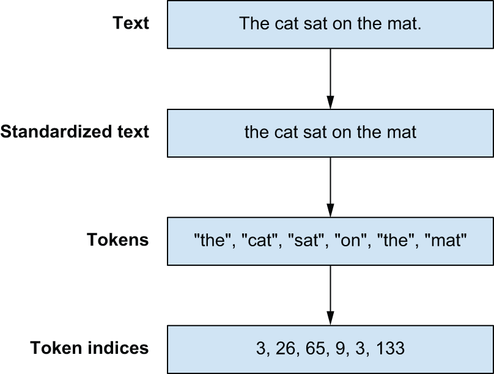
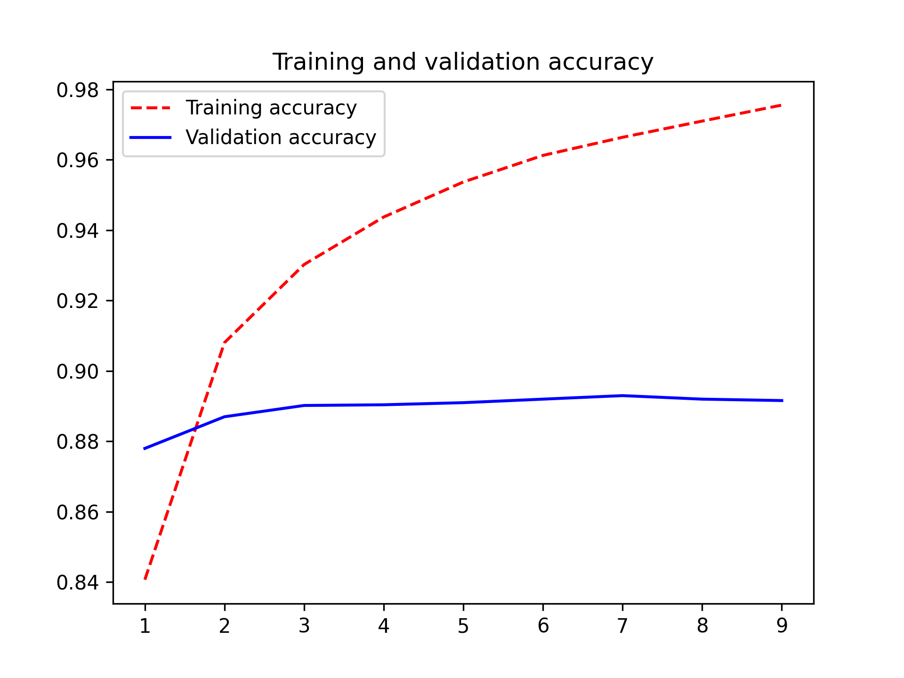
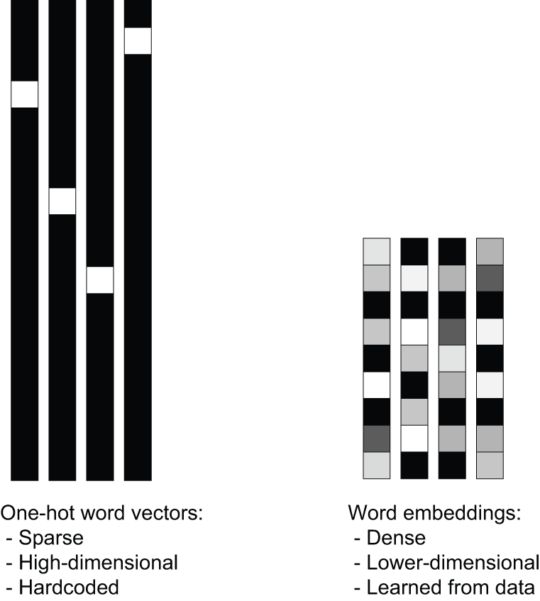
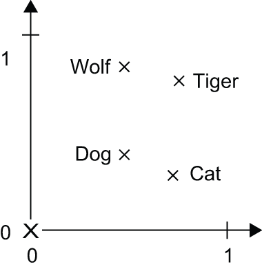
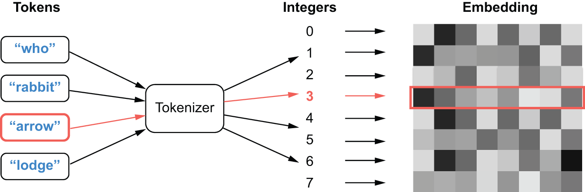
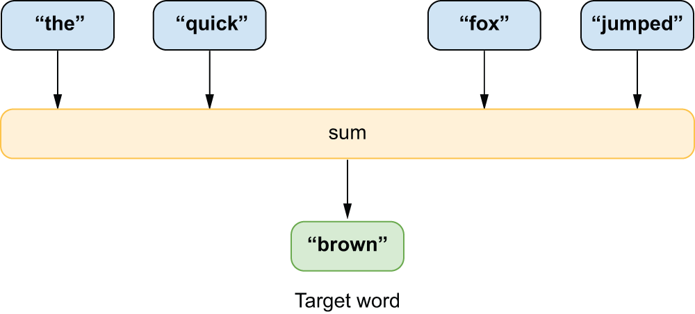

<!-- tabs:start -->

#### **Tiếng Anh (English)**

# Chapter 14: Text classification

This chapter covers

* An introduction to the field of natural language processing (NLP)
* Preprocessing text input into numeric input
* Building simple text classification models

This chapter will lay the foundation for working with text input that we will
build on in the next two chapters of this book. By the end of this chapter, you
will be able to build a simple text classifier in a number of different ways.
This will set the stage for building more complicated models, like the
Transformer, in the next chapter.

## A brief history of natural language processing

In computer science, we refer to human languages, like English or Mandarin, as
“natural” languages to distinguish them from languages that were designed for
machines, like LISP, Assembly, and XML. Every machine language was designed: its
starting point was an engineer writing down a set of formal rules to describe
what statements you can make and what they mean. The rules came first, and
people only started using the language once the rule set was complete. With
human language, it’s the reverse: usage comes first, and rules arise later.
Natural language was shaped by an evolutionary process, much like biological
organisms — that’s what makes it “natural.” Its “rules,” like the grammar of
English, were formalized after the fact and are often ignored or broken by its
users. As a result, while machine-readable language is highly structured and
rigorous, natural language is messy — ambiguous, chaotic, sprawling, and
constantly in flux.

Computer scientists have long fixated on the potential of systems that can
ingest or produce natural language. Language, particularly written text,
underpins most of our communications and cultural production. Centuries of human
knowledge are stored via text; the internet is mostly text, and even our
thoughts are based on language! The practice of using computers to interpret and
manipulate language is called natural language processing, or NLP for
short. It was first proposed as a field of study immediately following World War
II, where some thought we could view understanding language as a form of “code
cracking,” where natural language is the “code” used to transmit information.

In the early days of the field, many people naively thought that you could write
down the “rule set of English,” much like one can write down the rule set of
LISP. In the early 1950s, researchers at IBM and Georgetown demonstrated a
system that could translate Russian into English. The system used a grammar with
six hardcoded rules and a lookup table with a couple of hundred elements (words and
suffixes) to translate 60 handpicked Russian sentences accurately. The goal was
to drum up excitement and funding for machine translation, and in that sense, it
was a huge success. Despite the limited nature of the demo, the authors claimed
that within five years, translation would be a solved problem. Funding poured in
for the better part of a decade. However, generalizing such a system proved to
be maddeningly difficult. Words change their meaning dramatically depending on
context. Any grammar rules needed countless exceptions. Developing a program
that could shine on a few handpicked examples was simple enough, but building a
robust system that could compete with human translators was another matter. An
influential US report a decade later picked apart the lack of progress, and
funding dried up.

Despite these setbacks and repeated swings from excitement to disillusionment,
handcrafted rules held out as the dominant approach well into the 1990s. The
problems were obvious, but there was simply no viable alternative to writing
down symbolic rules to describe grammar. However, as faster computers and
greater quantities of data became available in the late 1980s, research began to
head in a new direction. When you find yourself building systems that are big
piles of ad hoc rules, as a clever engineer, you’re likely to start asking,
“Could I use a corpus of data to automate the process of finding these rules?
Could I search for the rules within some rule space, instead of having to come
up with them myself?” And just like that, you’ve graduated to doing machine
learning.

In the late 1980s, we started seeing machine learning approaches to
natural language processing. The earliest ones were based on decision trees —
the intent was literally to automate the development of the kind of if/then/else
rules of hardcoded language systems. Then, statistical approaches started
gaining speed, starting with logistic regression. Over time, learned parametric
models took over, and linguistics came to be seen by some as a hindrance when
baked directly into a model. Frederick Jelinek, an early speech recognition
researcher, joked in the 1990s, “Every time I fire a linguist, the performance
of the speech recognizer goes up.”

Much as computer vision is pattern recognition applied to pixels, the modern
field of NLP is all about pattern recognition
applied to words in text. There’s no shortage of practical applications:

* Given the text of an email, what is the probability that it is spam? (*text
  classification*)
* Given an English sentence, what is the most likely Russian translation?
  (*translation*)
* Given an incomplete sentence, what word will likely come next? (*language
  modeling*)

The text-processing models you will train in this book won’t possess a
human-like understanding of language; rather, they simply look for statistical
regularities in their input data, which turns out to be sufficient to perform
well on a wide array of real-world tasks.

In the last decade, NLP researchers and practitioners have discovered just how
shockingly effective it can be to learn the answer to narrow statistical
questions about text. In the 2010s, researchers began applying LSTM models to text,
dramatically increasing the number of parameters in NLP models and the compute
resources required to train them. The results were encouraging — LSTMs could
generalize to unseen examples with far greater accuracy than previous
approaches, but they eventually hit limits. LSTMs struggled to track
dependencies in long chains of text with many sentences and paragraphs, and
compared to computer vision models, they were slow and unwieldy to train.

Toward the end of the 2010s, researchers at Google discovered a new
architecture called the Transformer that solved many scalability issues plaguing
LSTMs. As long as you increased the size of a model and its training data
together, Transformers appeared to perform more and more accurately. Better yet,
the computations needed for training a Transformer could be effectively
parallelized, even for long sequences. If you doubled the number of machines
doing training, you could roughly halve the time you need to wait for a result.

The discovery of the Transformer architecture, along with
ever-faster GPUs and CPUs, has led to a dramatic explosion of investment and interest in
NLP models over the past few years. Chat systems like ChatGPT have captivated
public attention with their ability to produce fluent and natural text on
seemingly arbitrary topics and questions. The raw text used to train these models is
a significant portion of all written language available on the internet, and the
compute to train individual models can cost tens of millions of dollars. Some
hype is worth cutting down to size — these are pattern recognition machines.
Despite our persistent human tendency to find intelligence in “things that
talk,” these models copy and synthesize training data in a way that is wholly
distinct (and much less efficient!) than human intelligence. However, it is also
fair to say that the emergence of complex behaviors from incredibly simple
“guess the missing word” training setups has been one of the most shocking
empirical results in the last decade of machine learning.

In the following three chapters, we will look at a range of techniques for
machine learning with text data. We will skip discussion of the hardcoded
linguistic features that prevailed until the 1990s, but we will look at everything
from running logistic regressions for classifying text to training LSTMs for
machine translation. We will closely examine the Transformer model and discuss
what makes it so scalable and effective at generalizing in the text domain.
Let’s dig in.

## Preparing text data

Let’s consider an English sentence:

```python
The quick brown fox jumped over the lazy dog.
```

There is an obvious blocker before we can start applying any of the deep
learning techniques of previous chapters — our input is not numeric! Before
beginning any modeling, we need to translate the written word into tensors of
numbers. Unlike images, which have a relatively natural numeric representation,
you could build a numeric representation of text in several ways.

A simple approach would be to borrow from standard text file formats for text and use
something like an ASCII encoding. We could chop the input into a sequence of
characters and assign each a unique index. Another intuitive approach would be
building a representation based on words, first breaking sentences apart on all
spaces and punctuation and then mapping each word to a unique numeric
representation.

These are both good approaches to try, and in general, all text preprocessing
will include a *splitting* step, where text is split into small individual
units, called *tokens*. A powerful tool for splitting text is regular
expressions, which can flexibly match patterns of characters in text.

Let’s look at how to use a regular expression to split a string into a sequence
of characters. The most basic regex we can apply is `"."`, which matches any
character in the input text:

```python
import regex as re

def split_chars(text):
    return re.findall(r".", text)
```

We can apply the function to our example input string:

```python
>>> chars = split_chars("The quick brown fox jumped over the lazy dog.")
>>> chars[:12]
["T", "h", "e", " ", "q", "u", "i", "c", "k", " ", "b", "r"]
```

Regex can easily be applied to split our text into words instead. The `"[\w]+"`
regular expression will grab consecutive non-whitespace characters, and the
`"[.,!?;]"` can match the punctuation marks between the brackets. We can combine
the two to achieve a regular expression that splits each word and punctuation mark
into a token:

```python
def split_words(text):
    return re.findall(r"[\w]+|[.,!?;]", text)
```

Here’s what it does to a test sentence:

```python
>>> split_words("The quick brown fox jumped over the dog.")
["The", "quick", "brown", "fox", "jumped", "over", "the", "dog", "."]
```

Splitting takes us from a single string to a token sequence, but we still need
to transform our string tokens into numeric inputs. By far the most common
approach is to map each token to a unique integer index, often called
*indexing* our input. This is a flexible and reversible representation of our
tokenized input that can work with a wide range of modeling approaches. Later
on, we can decide how to map from token indices into a latent space ingested by
the model.

For character tokens, we could use ASCII lookups to index each token — for
example, `ord('A') → 65` and `ord('z') → 122`. However, this can scale poorly
when you start to consider other languages — there are over a million
characters in the Unicode specification! A more robust technique is to build a
mapping from specific tokens in our training data to indices that occur in the
data we care about, which in NLP is called a *vocabulary*. This has the nice
property of working for word-level tokens as easily as for character-level tokens.

Let’s take a look at how we might use a vocabulary to transform text.
We will build a simple Python dictionary that maps tokens to indices,
split our input into tokens, and finally index our tokens:

```python
vocabulary = {
    "[UNK]": 0,
    "the": 1,
    "quick": 2,
    "brown": 3,
    "fox": 4,
    "jumped": 5,
    "over": 6,
    "dog": 7,
    ".": 8,
}
words = split_words("The quick brown fox jumped over the lazy dog.")
indices = [vocabulary.get(word, 0) for word in words]
```

This outputs the following:

```python
[0, 2, 3, 4, 5, 6, 1, 0, 7, 8]
```

We introduce a special token called `"[UNK]"` to our vocabulary, which
represents a token that is unknown to the vocabulary. This way, we can index all
input we come across, even if some terms only occur in our test data. In the
previous example `"lazy"` maps to the `"[UNK]"` index 0, as it was not included in
our vocabulary.

With these simple text transformations, we are well on our way to building a
text preprocessing pipeline. However, there is one more common type of text
manipulation we should consider — standardization.

Consider these two sentences:

* “sunset came. i was staring at the Mexico sky. Isnt nature splendid??”
* “Sunset came; I stared at the México sky. Isn’t nature splendid?”

They are very similar — in fact, they are almost identical. Yet, if you were to
convert them to indices as previously described, you would end up with very
different representations because “i” and “I” are two distinct characters,
“Mexico” and “México” are two distinct words, “isnt” isn’t “isn’t,” and so on. A
machine learning model doesn’t know a priori that “i” and “I” are the same
letter, that “é” is an “e” with an accent, or that “staring” and “stared” are
two forms of the same verb. *Standardizing* text is a basic form of feature
engineering that aims to erase encoding differences that you don’t want your
model to have to deal with. It’s not exclusive to machine learning, either — you’d
have to do the same thing if you were building a search engine.

One simple and widespread standardization scheme is to convert to lowercase and
remove punctuation characters. Our two sentences would become

* “sunset came i was staring at the mexico sky isnt nature splendid”
* “sunset came i stared at the méxico sky isnt nature splendid”

Much closer already. We could get even closer if we removed accent marks on all
characters.

There’s a lot you can do with standardization, and it used to be one of the most
critical areas to improve model performance. For many decades in NLP, it was
common practice to use regular expressions to attempt to map words to a common
root (e.g. “tired” → “tire” and “trophies” → “trophy”), called *stemming* or
*lemmatization*. But as models have grown more expressive, this type of
standardization tends to do more harm than good. The tense and plurality of a
word are necessary signals to its meaning. For the larger models used today,
most standardization is as light as possible — for example, converting all inputs
to a standard character encoding before further processing.

With standardization, we have now seen three distinct stages for preprocessing text (figure 14.1):

1. *Standardization* — Where we normalize input with basic text-to-text
   transformations
2. *Splitting* — Where we split our text into sequences of *tokens*
3. *Indexing* — Where we map our tokens to indices using a *vocabulary*




[Figure 14.1](#figure-14-1): The text preprocessing pipeline

People often refer to the entire process as *tokenization*, and to an object
that maps text to sequence of token indices as a *tokenizer*. Let’s try
building a few.

### Character and word tokenization

To start, let’s build a character-level tokenizer that maps each character in an
input string to an integer. To keep things simple, we will use only one
standardization step — we lowercase all input.

```python
class CharTokenizer:
    def __init__(self, vocabulary):
        self.vocabulary = vocabulary
        self.unk_id = vocabulary["[UNK]"]

    def standardize(self, inputs):
        return inputs.lower()

    def split(self, inputs):
        return re.findall(r".", inputs)

    def index(self, tokens):
        return [self.vocabulary.get(t, self.unk_id) for t in tokens]

    def __call__(self, inputs):
        inputs = self.standardize(inputs)
        tokens = self.split(inputs)
        indices = self.index(tokens)
        return indices
```

[Listing 14.1](#listing-14-1): A basic character-level tokenizer

Pretty simple. Before using this, we also need to build a function that computes
a vocabulary of tokens based on some input text. Rather than simply mapping all
characters to a unique index, let’s give ourselves the ability to limit our
vocabulary size to only the most common tokens in our input data. When we get
into the modeling side of things, limiting the vocabulary size will be an
important way to limit the number of parameters in a model.

```python
import collections

def compute_char_vocabulary(inputs, max_size):
    char_counts = collections.Counter()
    for x in inputs:
        x = x.lower()
        tokens = re.findall(r".", x)
        char_counts.update(tokens)
    vocabulary = ["[UNK]"]
    most_common = char_counts.most_common(max_size - len(vocabulary))
    for token, count in most_common:
        vocabulary.append(token)
    return dict((token, i) for i, token in enumerate(vocabulary))
```

[Listing 14.2](#listing-14-2): Computing a character-level vocabulary

We can now do the same for a word-level tokenizer. We can use the same code as
our character-level tokenizer with a different splitting step.

```python
class WordTokenizer:
    def __init__(self, vocabulary):
        self.vocabulary = vocabulary
        self.unk_id = vocabulary["[UNK]"]

    def standardize(self, inputs):
        return inputs.lower()

    def split(self, inputs):
        return re.findall(r"[\w]+|[.,!?;]", inputs)

    def index(self, tokens):
        return [self.vocabulary.get(t, self.unk_id) for t in tokens]

    def __call__(self, inputs):
        inputs = self.standardize(inputs)
        tokens = self.split(inputs)
        indices = self.index(tokens)
        return indices
```

[Listing 14.3](#listing-14-3): A basic word-level tokenizer

We can also substitute this new split rule into our vocabulary function.

```python
def compute_word_vocabulary(inputs, max_size):
    word_counts = collections.Counter()
    for x in inputs:
        x = x.lower()
        tokens = re.findall(r"[\w]+|[.,!?;]", x)
        word_counts.update(tokens)
    vocabulary = ["[UNK]"]
    most_common = word_counts.most_common(max_size - len(vocabulary))
    for token, count in most_common:
        vocabulary.append(token)
    return dict((token, i) for i, token in enumerate(vocabulary))
```

[Listing 14.4](#listing-14-4): Computing a word-level vocabulary

Let’s try out our tokenizers on some real-world input — the full text of *Moby
Dick* by Herman Melville. We will first build a vocabulary for both tokenizers
and then use it to tokenize some text:

```python
import keras

filename = keras.utils.get_file(
    origin="https://www.gutenberg.org/files/2701/old/moby10b.txt",
)
moby_dick = list(open(filename, "r"))

vocabulary = compute_char_vocabulary(moby_dick, max_size=100)
char_tokenizer = CharTokenizer(vocabulary)
```

Let’s inspect what our character-level tokenizer has computed:

```python
>>> print("Vocabulary length:", len(vocabulary))
Vocabulary length: 64
>>> print("Vocabulary start:", list(vocabulary.keys())[:10])
Vocabulary start: ["[UNK]", " ", "e", "t", "a", "o", "n", "i", "s", "h"]
>>> print("Vocabulary end:", list(vocabulary.keys())[-10:])
Vocabulary end: ["@", "$", "%", "#", "=", "~", "&", "+", "<", ">"]
>>> print("Line length:", len(char_tokenizer(
...    "Call me Ishmael. Some years ago--never mind how long precisely."
... )))
Line length: 63
```

Now what about the word-level tokenizer?

```python
vocabulary = compute_word_vocabulary(moby_dick, max_size=2_000)
word_tokenizer = WordTokenizer(vocabulary)
```

We can print out the same data for our word-level tokenizer:

```python
>>> print("Vocabulary length:", len(vocabulary))
Vocabulary length: 2000
>>> print("Vocabulary start:", list(vocabulary.keys())[:5])
Vocabulary start: ["[UNK]", ",", "the", ".", "of"]
>>> print("Vocabulary end:", list(vocabulary.keys())[-5:])
Vocabulary end: ["tambourine", "subtle", "perseus", "elevated", "repose"]
>>> print("Line length:", len(word_tokenizer(
...    "Call me Ishmael. Some years ago--never mind how long precisely."
... )))
Line length: 13
```

We can already see some of the strengths and weaknesses of both tokenization
techniques. A character-level tokenizer needs only 64 vocabulary terms to cover
the entire book but will encode each input as a very long sequence. A word-level
tokenizer quickly fills a 2,000-term vocabulary (you would need a dictionary
with 17,000 terms to index every word in the book!), but the outputs of the
word-level tokenizer are much shorter.

As machine learning practitioners have scaled models up with more and more data
and parameters, the downsides of both word and character tokenization have
become apparent. The “compression” offered by word-level tokenization turns out
to be very important — it allows feeding longer sequences into a model.
However, if you attempt to build a word-level vocabulary for a large dataset
(today, you might see a dataset with trillions of words), you would have an
unworkably large vocabulary with hundreds of millions of terms. If you
aggressively restrict your word-level vocabulary size, you will encode a lot of
text to the `"[UNK]"` token, throwing out valuable information.

These issues have led to the rise in popularity of a third type of tokenization,
called *subword tokenization*, which attempts to bridge the gap between word- and
character-level approaches.

### Subword tokenization

Subword tokenization aims to combine the best of both character- and
word-level encoding techniques. We want the `WordTokenizer`’s ability to produce
concise output and the `CharTokenizer`’s ability to encode a wide range of
inputs with a small vocabulary.

We can think of the search for the ideal tokenizer as the hunt for an ideal
compression of the input data. Reducing token length compresses the overall
length of our examples. A small vocabulary reduces the number of bytes we would
need to represent each token. If we achieve both, we will be able to feed short,
information-rich sequences to our deep learning model.

This analogy between compression and tokenization was not always obvious, but it
turns out to be powerful. One of the most practically effective tricks found in
the last decade of NLP research was repurposing a 1990s algorithm for lossless
compression called *byte-pair encoding*[[1]](#footnote-1) for tokenization. It is used by
ChatGPT and many other models to this day. In this section, we will build a
tokenizer that uses the byte-pair encoding algorithm.

The idea with byte-pair encoding is to start with a basic vocabulary of
characters and progressively “merge” common pairings into longer and longer
sequences of characters. Let’s say we start with the following input text:

```python
data = [
    "the quick brown fox",
    "the slow brown fox",
    "the quick brown foxhound",
]
```

Like the `WordTokenizer`, we will start by computing word counts for all
the words in the text. As we create our dictionary of word counts, we will split
all our text into characters and join the characters with a space. This will
make it easier to consider pairs of characters in our next step.

```python
def count_and_split_words(data):
    counts = collections.Counter()
    for line in data:
        line = line.lower()
        for word in re.findall(r"[\w]+|[.,!?;]", line):
            chars = re.findall(r".", word)
            split_word = " ".join(chars)
            counts[split_word] += 1
    return dict(counts)

counts = count_and_split_words(data)
```

[Listing 14.5](#listing-14-5): Initializing state for the byte-pair encoding algorithm

Let’s try this out on our data:

```python
>>> counts
{"t h e": 3,
 "q u i c k": 2,
 "b r o w n": 3,
 "f o x": 2,
 "s l o w": 1,
 "f o x h o u n d": 1}
```

To apply byte-pair encoding to our split word counts, we will find two
characters and merge them into a new symbol. We consider all pairs of
characters in all words and only merge the most common one we find. In the previous
example, the most common character pair is `("o", "w")`, in both the word
`"brown"` (which occurs three times in our data) and `"slow"` (which occurs once). We
combine this pair into a new symbol `"ow"` and merge all occurrences of `"o
w"`.

Then we continue, counting pairs and merging pairs, except now `"ow"` will be a
single unit that could merge with, say, `"l"` to form `"low"`. By progressively
merging the most frequent symbol pair, we build up a vocabulary of larger and
larger subwords.

Let’s try this out on our toy dataset.

```python
def count_pairs(counts):
    pairs = collections.Counter()
    for word, freq in counts.items():
        symbols = word.split()
        for pair in zip(symbols[:-1], symbols[1:]):
            pairs[pair] += freq
    return pairs

def merge_pair(counts, first, second):
    # Matches an unmerged pair
    split = re.compile(f"(?<!\S){first} {second}(?!\S)")
    # Replaces all occurances with a merged version
    merged = f"{first}{second}"
    return {split.sub(merged, word): count for word, count in counts.items()}

for i in range(10):
    pairs = count_pairs(counts)
    first, second = max(pairs, key=pairs.get)
    counts = merge_pair(counts, first, second)
    print(list(counts.keys()))
```

[Listing 14.6](#listing-14-6): Running a few steps of byte-pair merging

Here’s what we get:

```python
["t h e", "q u i c k", "b r ow n", "f o x", "s l ow", "f o x h o u n d"]
["th e", "q u i c k", "b r ow n", "f o x", "s l ow", "f o x h o u n d"]
["the", "q u i c k", "b r ow n", "f o x", "s l ow", "f o x h o u n d"]
["the", "q u i c k", "br ow n", "f o x", "s l ow", "f o x h o u n d"]
["the", "q u i c k", "brow n", "f o x", "s l ow", "f o x h o u n d"]
["the", "q u i c k", "brown", "f o x", "s l ow", "f o x h o u n d"]
["the", "q u i c k", "brown", "fo x", "s l ow", "fo x h o u n d"]
["the", "q u i c k", "brown", "fox", "s l ow", "fox h o u n d"]
["the", "qu i c k", "brown", "fox", "s l ow", "fox h o u n d"]
["the", "qui c k", "brown", "fox", "s l ow", "fox h o u n d"]
```

We can see how common words are merged entirely, whereas less common words are
only partially merged.

We can now extend this to a full function for computing a byte-pair encoding
vocabulary. We start our vocabulary with all characters found in the input text,
and we will progressively add merged symbols (larger and larger subwords) to our
vocabulary until it reaches our desired length. We also keep a separate
dictionary of our merge rules, including a rank order in which we applied them.
Next, we will see how to use these merge rules to tokenize new input text.

```python
def compute_sub_word_vocabulary(dataset, vocab_size):
    counts = count_and_split_words(dataset)

    char_counts = collections.Counter()
    for word in counts:
        for char in word.split():
            char_counts[char] += counts[word]
    most_common = char_counts.most_common()
    vocab = ["[UNK]"] + [char for char, freq in most_common]
    merges = []

    while len(vocab) < vocab_size:
        pairs = count_pairs(counts)
        if not pairs:
            break
        first, second = max(pairs, key=pairs.get)
        counts = merge_pair(counts, first, second)
        vocab.append(f"{first}{second}")
        merges.append(f"{first} {second}")

    vocab = dict((token, index) for index, token in enumerate(vocab))
    merges = dict((token, rank) for rank, token in enumerate(merges))
    return vocab, merges
```

[Listing 14.7](#listing-14-7): Computing a byte-pair encoding vocabulary

Let’s build a `SubWordTokenizer` that applies our merge rules to tokenize new
input text. The `standardize()` and `index()` steps can stay the same as the
`WordTokenizer`, with all changes coming in the `split()` method.

In our splitting step, we first split all input into words, then split all words
into characters, and finally apply our learned merge rules to the split
characters. What is left are subwords — tokens that may be entire words,
partial words, or simple characters, depending on the input word’s frequency in
our training data. These subwords are tokens in our output.

```python
class SubWordTokenizer:
    def __init__(self, vocabulary, merges):
        self.vocabulary = vocabulary
        self.merges = merges
        self.unk_id = vocabulary["[UNK]"]

    def standardize(self, inputs):
        return inputs.lower()

    def bpe_merge(self, word):
        while True:
            # Matches all symbol pairs in the text
            pairs = re.findall(r"(?<!\S)\S+ \S+(?!\S)", word, overlapped=True)
            if not pairs:
                break
            # We apply merge rules in "rank" order. More frequent pairs
            # are merged first.
            best = min(pairs, key=lambda pair: self.merges.get(pair, 1e9))
            if best not in self.merges:
                break
            first, second = best.split()
            split = re.compile(f"(?<!\S){first} {second}(?!\S)")
            merged = f"{first}{second}"
            word = split.sub(merged, word)
        return word

    def split(self, inputs):
        tokens = []
        # Split words
        for word in re.findall(r"[\w]+|[.,!?;]", inputs):
            # Joins all characters with a space
            word = " ".join(re.findall(r".", word))
            # Applies byte-pair encoding merge rules
            word = self.bpe_merge(word)
            tokens.extend(word.split())
        return tokens

    def index(self, tokens):
        return [self.vocabulary.get(t, self.unk_id) for t in tokens]

    def __call__(self, inputs):
        inputs = self.standardize(inputs)
        tokens = self.split(inputs)
        indices = self.index(tokens)
        return indices
```

[Listing 14.8](#listing-14-8): A byte-pair encoding tokenizer

Let’s try out our tokenizer on the full text of *Moby Dick*:

```python
vocabulary, merges = compute_sub_word_vocabulary(moby_dick, 2_000)
sub_word_tokenizer = SubWordTokenizer(vocabulary, merges)
```

We can take a look at our vocabulary and try a test sentence on our tokenizer,
as we did with `WordTokenizer` and `CharTokenizer`:

```python
>>> print("Vocabulary length:", len(vocabulary))
Vocabulary length: 2000
>>> print("Vocabulary start:", list(vocabulary.keys())[:10])
Vocabulary start: ["[UNK]", "e", "t", "a", "o", "n", "i", "s", "h", "r"]
>>> print("Vocabulary end:", list(vocabulary.keys())[-7:])
Vocabulary end: ["bright", "pilot", "sco", "ben", "dem", "gale", "ilo"]
>>> print("Line length:", len(sub_word_tokenizer(
...    "Call me Ishmael. Some years ago--never mind how long precisely."
... )))
Line length: 16
```

The `SubWordTokenizer` has a slightly longer length for our test sentence than
the `WordTokenizer` (16 versus 13 tokens), but unlike the `WordTokenizer`, it
can tokenize every word in *Moby Dick* without using the `"[UNK]"` token. The
vocabulary contains every character in our source text, so the worst-case
performance will be tokenizing a word into individual characters. We have
achieved a short *average* token length while handling rare words with a small
vocabulary. This is the advantage of subword tokenizers.

You might notice that running this code is noticeably slower than the word and
character tokenizers; it takes about a minute on our reference hardware. Learning
merge rules is much more complex than simply counting the words in an input
dataset. While this is a downside to subword tokenization, it is rarely an
important concern in practice. You only need to learn a vocabulary once per
model, and the cost of learning a subword vocabulary is generally negligible
compared to model training.

We have now seen three separate approaches for tokenizing input. Now that we can
translate from text to numeric input, we can move on to training a model.

One final note on tokenization — while it is quite important to understand how
tokenizers work, it is rarely the case that you will need to build one yourself.
Keras comes with utilities for tokenizing text input, as do most deep learning
frameworks. For the rest of the chapter, we will make use of the built-in
functionality in Keras for tokenization.

Which tokenization technique should I use?

When approaching a new text-modeling problem, one of the first questions you
will need to answer is how to tokenize your input. As we will see at the end of
this chapter, the question is trivial for a given pretrained model. You have to
preserve the exact tokenization used during pretraining or throw out the useful
representations of input tokens contained in the model weights.

If you are building a model from scratch, you can tailor your tokenization to
the problem at hand. In general, the compression offered by word and subword
tokenizers is too important to pass up. The shorter the length of your inputs on
average, the better a model will be able to track long-range dependencies in the
text, improving its overall performance. This has made subword the dominantly
popular choice for modern language models. They can handle rare or misspelled
words without inflating token length for common inputs.

However, there is no one-size-fits-all approach. Some problems in NLP, such as
spelling correction, might benefit from low-level character tokenization of
input text. On the other hand, a word-level approach is both simple to work with
and easily understandable — each model input corresponds to a word a human would
read. This would make ranking tokens by importance to a prediction easy to
interpret.

We will use all three types of tokenizers throughout the text chapters of this
book.

## Sets vs. sequences

How a machine learning model should represent individual tokens is a relatively
uncontroversial question: they’re categorical features (values from a predefined
set), and we know how to handle those. They should be encoded as dimensions in a
feature space or as category vectors (token vectors in this case). A much more
problematic question, however, is how to encode the ordering of tokens in text.

The problem of order in natural language is an interesting one: unlike the steps
of a timeseries, words in a sentence don’t have a natural, canonical order.
Different languages order similar words in very different ways. For instance,
the sentence structure of English is quite different from that of Japanese. Even
within a given language, you can typically say the same thing in different ways by
reshuffling the words a bit. If you were to fully randomize the words in a short
sentence, you could still sometimes figure out what it was saying — though, in
many cases, significant ambiguity would arise. Order is clearly important, but
its relationship to meaning isn’t straightforward.

How to represent word order is the pivotal question from which different kinds
of NLP architectures spring. The simplest thing you could do is discard order
and treat text as an unordered set of words — this gives you bag-of-words models.
You could also decide that words should be processed strictly in the order in
which they appear, one at a time, like steps in a timeseries — you could then
use the recurrent models from the previous chapter. Finally, a hybrid approach
is also possible: the Transformer architecture is technically order-agnostic,
yet it injects word-position information into the representations it processes,
which enables it to simultaneously look at different parts of a sentence (unlike
RNNs) while still being order-aware. Because they take into account word order,
both RNNs and Transformers are called *sequence models*.

Historically, most early applications of machine learning to NLP just involved
bag-of-words models that discarded sequence data. Interest in sequence models only
started rising in 2015, with the rebirth of RNNs. Today,
both approaches remain relevant. Let’s see how they work and when to use
which.

We will demonstrate each approach on a well-known text classification benchmark:
the IMDb movie review sentiment-classification dataset. In chapters 4 and 5, you
worked with a prevectorized version of the IMDb dataset; now let’s process the
raw IMDb text data, just like you would do when approaching a new
text-classification problem in the real world.

### Loading the IMDb classification dataset

To begin, let’s download and extract our dataset.

```python
import os, pathlib, shutil, random

zip_path = keras.utils.get_file(
    origin="https://ai.stanford.edu/~amaas/data/sentiment/aclImdb_v1.tar.gz",
    fname="imdb",
    extract=True,
)

imdb_extract_dir = pathlib.Path(zip_path) / "aclImdb"
```

[Listing 14.9](#listing-14-9): Downloading the IMDb movie review dataset

Let’s list out our directory structure:

```python
>>> for path in imdb_extract_dir.glob("*/*"):
...     if path.is_dir():
...         print(path)
~/.keras/datasets/aclImdb/train/pos
~/.keras/datasets/aclImdb/train/unsup
~/.keras/datasets/aclImdb/train/neg
~/.keras/datasets/aclImdb/test/pos
~/.keras/datasets/aclImdb/test/neg
```

We can see both a train and test set with positive and negative examples. Movie
reviews with a low user rating on the IMDb site were sorted into the `neg/`
directory and those with a high rating into the `pos/` directory. We can also
see an `unsup/` directory, which is short for unsupervised. These are reviews
deliberately left unlabeled by the dataset creator; they could be negative or
positive reviews.

Let’s look at the content of a few of these text files. Whether you’re working
with text or image data, remember to inspect what your data looks like before
you dive into modeling. It will ground your intuition about what your model is
actually doing.

```python
>>> print(open(imdb_extract_dir / "train" / "pos" / "4077_10.txt", "r").read())
I first saw this back in the early 90s on UK TV, i did like it then but i missed
the chance to tape it, many years passed but the film always stuck with me and i
lost hope of seeing it TV again, the main thing that stuck with me was the end,
the hole castle part really touched me, its easy to watch, has a great story,
great music, the list goes on and on, its OK me saying how good it is but
everyone will take there own best bits away with them once they have seen it,
yes the animation is top notch and beautiful to watch, it does show its age in a
very few parts but that has now become part of it beauty, i am so glad it has
came out on DVD as it is one of my top 10 films of all time. Buy it or rent it
just see it, best viewing is at night alone with drink and food in reach so you
don't have to stop the film.<br /><br />Enjoy
```

[Listing 14.10](#listing-14-10): Previewing a single IMDb review

Before we begin tokenizing our input text, we will make a copy of our training
data with a few important modifications. We can ignore the unsupervised reviews
for now and create a separate validation set to monitor our accuracy while
training. We do this by splitting 20% of the training text files into a new
directory.

```python
train_dir = pathlib.Path("imdb_train")
test_dir = pathlib.Path("imdb_test")
val_dir = pathlib.Path("imdb_val")

# Moves the test data unaltered
shutil.copytree(imdb_extract_dir / "test", test_dir)

# Splits the training data into a train set and a validation set
val_percentage = 0.2
for category in ("neg", "pos"):
    src_dir = imdb_extract_dir / "train" / category
    src_files = os.listdir(src_dir)
    random.Random(1337).shuffle(src_files)
    num_val_samples = int(len(src_files) * val_percentage)

    os.makedirs(val_dir / category)
    for file in src_files[:num_val_samples]:
        shutil.copy(src_dir / file, val_dir / category / file)
    os.makedirs(train_dir / category)
    for file in src_files[num_val_samples:]:
        shutil.copy(src_dir / file, train_dir / category / file)
```

[Listing 14.11](#listing-14-11): Splitting validation from the IMDb dataset

We are now ready to load the data. Remember how, in chapter 8, we used the
`image_dataset_from_directory` utility to create a `Dataset` of images and their
labels for a directory structure? You can do the exact same thing for text files
using the `text_dataset_from_directory` utility. Let’s create three `Dataset`
objects for training, validation, and testing.

```python
from keras.utils import text_dataset_from_directory

batch_size = 32
train_ds = text_dataset_from_directory(train_dir, batch_size=batch_size)
val_ds = text_dataset_from_directory(val_dir, batch_size=batch_size)
test_ds = text_dataset_from_directory(test_dir, batch_size=batch_size)
```

[Listing 14.12](#listing-14-12): Loading the IMDb dataset for use with Keras

Originally we had 25,000 training and testing examples each, and after our
validation split, we have 20,000 reviews to train on and 5,000 for validation.
Let’s try learning something from this data.

## Set models

The simplest approach we can take regarding the ordering of tokens in text is to
discard it. We still tokenize our input reviews normally as a sequence of token
IDs, but immediately after tokenization, we convert the entire training example to a
set — a simple unordered “bag” of tokens that are either present or absent in a
movie review.

The idea here is to use these sets to build a very simple model that assigns a
weight to every individual word in a review. The presence of the word
`"terrible"` would probably (though not always) indicate a bad review, and
`"riveting"` might indicate a good review. We can build a small model that can
learn these weights — called a bag-of-words model.

For example, let’s say you had a simple input sentence and vocabulary:

```python
"this movie made me cry"

{"[UNK]": 0, "movie": 1, "film": 2, "made": 3, "laugh": 4, "cry": 5}
```

We would tokenize this tiny review as

```python
[0, 1, 3, 0, 5]
```

Discarding order, we can turn this into a set of token IDs:

```python
{0, 1, 3, 5}
```

Finally, we could use a multi-hot encoding to transform the set to a fixed-sized
vector with the same length as a vocabulary:

```python
[1, 1, 0, 1, 0, 1]
```

The 0 in the fifth position here means the word `"laugh"` is absent in our review,
and the 1 in the sixth position means `"cry"` is present. This simple encoding of
our input review can be used directly to train a model.

### Training a bag-of-words model

To do this text processing in code, it would be easy enough to extend our
`WordTokenizer` from earlier in the chapter. An even easier solution is to use
the `TextVectorization` layer built into Keras. The `TextVectorization` handles
word and character tokenization and comes with several additional features,
including multi-hot encoding of the layer output.

The `TextVectorization` layer, like many preprocessing layers in Keras, has an
`adapt()` method to learn a layer state from input data. In the case of
`TextVectorization`, `adapt()` will learn a vocabulary for a dataset on the fly
by iterating over an input dataset. Let’s use it to tokenize and encode our
input data. We will build a vocabulary of 20,000 words, a good starting place
for text classification problems.

```python
from keras import layers

max_tokens = 20_000
text_vectorization = layers.TextVectorization(
    max_tokens=max_tokens,
    # Learns a word-level vocabulary
    split="whitespace",
    output_mode="multi_hot",
)
train_ds_no_labels = train_ds.map(lambda x, y: x)
text_vectorization.adapt(train_ds_no_labels)

bag_of_words_train_ds = train_ds.map(
    lambda x, y: (text_vectorization(x), y), num_parallel_calls=8
)
bag_of_words_val_ds = val_ds.map(
    lambda x, y: (text_vectorization(x), y), num_parallel_calls=8
)
bag_of_words_test_ds = test_ds.map(
    lambda x, y: (text_vectorization(x), y), num_parallel_calls=8
)
```

[Listing 14.13](#listing-14-13): Applying a bag-of-words encoding to the IMDb reviews

Let’s look a single batch of our preprocessed input data:

```python
>>> x, y = next(bag_of_words_train_ds.as_numpy_iterator())
>>> x.shape
(32, 20000)
>>> y.shape
(32, 1)
```

You can see that after preprocessing, each sample in our batch is converted into
a vector of 20,000 numbers, each tracking the presence or absence of a
vocabulary term.

Next, we can train a very simple linear model. We will save our model-building
code as a function so we can use it again later.

```python
def build_linear_classifier(max_tokens, name):
    inputs = keras.Input(shape=(max_tokens,))
    outputs = layers.Dense(1, activation="sigmoid")(inputs)
    model = keras.Model(inputs, outputs, name=name)
    model.compile(
        optimizer="adam",
        loss="binary_crossentropy",
        metrics=["accuracy"],
    )
    return model

model = build_linear_classifier(max_tokens, "bag_of_words_classifier")
```

[Listing 14.14](#listing-14-14): Building a bag-of-words regression model

Let’s take a look at our model’s summary:

```python
>>> model.summary()
Model: "bag_of_words_classifier"
┏━━━━━━━━━━━━━━━━━━━━━━━━━━━━━━━━━━━┳━━━━━━━━━━━━━━━━━━━━━━━━━━┳━━━━━━━━━━━━━━━┓
┃ Layer (type)                      ┃ Output Shape             ┃       Param # ┃
┡━━━━━━━━━━━━━━━━━━━━━━━━━━━━━━━━━━━╇━━━━━━━━━━━━━━━━━━━━━━━━━━╇━━━━━━━━━━━━━━━┩
│ input_layer (InputLayer)          │ (None, 20000)            │             0 │
├───────────────────────────────────┼──────────────────────────┼───────────────┤
│ dense (Dense)                     │ (None, 1)                │        20,001 │
└───────────────────────────────────┴──────────────────────────┴───────────────┘
 Total params: 20,001 (78.13 KB)
 Trainable params: 20,001 (78.13 KB)
 Non-trainable params: 0 (0.00 B)
```

This model is dead simple. We have only 20,001 parameters, one for each word in
our vocabulary and one for a bias term. Let’s train it. We’ll add on the
`EarlyStopping` callback first covered in chapter 7, which will automatically
stop when training when the validation loss stops improving and restore weights
from the best epoch.

```python
early_stopping = keras.callbacks.EarlyStopping(
    monitor="val_loss",
    restore_best_weights=True,
    patience=2,
)
history = model.fit(
    bag_of_words_train_ds,
    validation_data=bag_of_words_val_ds,
    epochs=10,
    callbacks=[early_stopping],
)
```

[Listing 14.15](#listing-14-15): Training the bag-of-words regression model

Our model trains in much less than a minute, which is unsurprising given its
size. The tokenization and encoding of our input is actually quite a bit more
expensive than updating our model parameters. Let’s plot the model accuracy (figure 14.2):

```python
import matplotlib.pyplot as plt

accuracy = history.history["accuracy"]
val_accuracy = history.history["val_accuracy"]
epochs = range(1, len(accuracy) + 1)

plt.plot(epochs, accuracy, "r--", label="Training accuracy")
plt.plot(epochs, val_accuracy, "b", label="Validation accuracy")
plt.title("Training and validation accuracy")
plt.legend()
plt.show()
```





[Figure 14.2](#figure-14-2): Training and validation metrics for our bag of words model

We can see that validation performance levels off rather than significantly
declining; our model is so simple it cannot really overfit. Let’s try evaluating
it on our test set.

```python
>>> test_loss, test_acc = model.evaluate(bag_of_words_test_ds)
>>> test_acc
0.88388
```

[Listing 14.16](#listing-14-16): Evaluating the bag-of-words regression model

We can correctly predict the sentiment of a review 88% of the time with a
training job light enough that it could run efficiently on a single CPU.

It is worth noting our choice of word tokenization in this example. The reason
to avoid character-level tokenization here is pretty obvious — a “bag” of all
characters in a movie review will tell you very little about its content.
Subword tokenization with a large enough vocabulary would be a good choice, but
there is little need for it here. Since the model we are training is so small,
it’s convenient to use a vocabulary that is quick to train and have our weights
correspond to actual English words.

Preprocessing text efficiently

In all applied machine learning, the speed and efficiency of preprocessing are
important concerns. A faster program is always desirable, but this becomes more
urgent when the cost of accelerators (GPUs and TPUs) is so high. You want to
avoid letting expensive GPUs idle while you preprocess your input!

Text preprocessing is unique because it must always run on a CPU. GPUs strictly
handle numeric inputs, so all tokenization must happen before your GPU’s train
step. One option is to precompute your tokenized input — tokenization does not
depend on model weights, so you could tokenize all input text files and resave
them as integer sequences before starting training. However, this is not always
practical. Tokenizing text on the fly allows for more rapid experimentation. If
you are running inference on an unseen example, there is no way to precompute
the tokenized input; you need to tokenize and run a forward pass in rapid
succession.

The name of the game when preprocessing text input on the fly is to be “fast
enough.” You want to ensure your expensive GPUs always have a new batch of
preprocessed data to ingest. If you do that, the GPU is the bottleneck, and
there is nothing to gain by improving your tokenization speed.

We’ve seen `tf.data` in previous chapters, and an important reason we use it is
that the library is designed to avoid the CPU becoming a bottleneck for a GPU or TPU. We use it
throughout this chapter — `keras.utils.text_dataset_from_directory()` will load
a `tf.data.Dataset`, and `map()` will transform our input data, for example, by
applying a `TextVectorization` layer. `tf.data` works by running text
preprocessing in parallel multiple CPU cores, which is generally sufficient to
avoid bottlenecking accelerators during a training run.

It is important to note that the code in this chapter is still multi-backend (in
fact, we generated the outputs for this chapter using Jax). You can use
`tf.data` with PyTorch, JAX, or TensorFlow itself — Keras will automatically
convert input Tensors to the correct format for a given backend.

### Training a bigram model

Of course, we can intuitively guess that discarding all word order is very
reductive because even atomic concepts can be expressed via multiple words: the
term “United States” conveys a concept that is quite distinct from the meaning
of the words “states” and “united” taken separately. A movie that is “not bad”
and a movie that is “bad” should probably get different sentiment scores.

Therefore, it is usually a good idea to inject some knowledge of local word
ordering into a model, even for these simple set-based models we are currently
building. One easy way to do that is to consider *bigrams* — a term for two
tokens that appear consecutively in the input text. Given our example “this
movie made me cry,” `{"this", "movie", "made", "me", "cry"}` is the set of all
word *unigrams* in the input, and `{"this movie", "movie made", "made me", "me
cry"}` is the set of all bigrams. The bag-of-words model we just trained
could equivalently be called a unigram model, and the term *n-gram* refers to
an ordered sequence of *n* tokens for any *n*.

To add bigrams to our model, we want to consider the frequency of all bigrams
while building our vocabulary. We could do this in two ways: by creating a
vocabulary of only bigrams or by allowing both bigrams and unigrams to compete
for space in the same vocabulary. For the latter case, the term `"United
States"` will be included in our vocabulary before `"ventriloquism"` if it
occurs more frequently in the input text.

Again, we could build this by extending our `WordTokenizer` from earlier in the
chapter, but there is no need. `TextVectorization` provides this out of the box.
We will train a slightly larger vocabulary to account for the presence of
bigrams, `adapt()` a new vocabulary, and multi-hot encode output vectors
including bigrams.

```python
max_tokens = 30_000
text_vectorization = layers.TextVectorization(
    max_tokens=max_tokens,
    # Learns a word-level vocabulary
    split="whitespace",
    output_mode="multi_hot",
    # Considers all unigrams and bigrams
    ngrams=2,
)
text_vectorization.adapt(train_ds_no_labels)

bigram_train_ds = train_ds.map(
    lambda x, y: (text_vectorization(x), y), num_parallel_calls=8
)
bigram_val_ds = val_ds.map(
    lambda x, y: (text_vectorization(x), y), num_parallel_calls=8
)
bigram_test_ds = test_ds.map(
    lambda x, y: (text_vectorization(x), y), num_parallel_calls=8
)
```

[Listing 14.17](#listing-14-17): Applying a bigram encoding to the IMDb reviews

Let’s examine a batch of our preprocessed input again:

```python
>>> x, y = next(bigram_train_ds.as_numpy_iterator())
>>> x.shape
(32, 30000)
```

If we look at a small subsection of our vocabulary, we can see both unigram and
bigram terms:

```python
>>> text_vectorization.get_vocabulary()[100:108]
["in a", "most", "him", "dont", "it was", "one of", "for the", "made"]
```

With our new encoding for our input data, we can train a linear model unaltered
from before.

```python
model = build_linear_classifier(max_tokens, "bigram_classifier")
model.fit(
    bigram_train_ds,
    validation_data=bigram_val_ds,
    epochs=10,
    callbacks=[early_stopping],
)
```

[Listing 14.18](#listing-14-18): Training the bigram regression model

This model will be slightly larger than our bag-of words models (30,001
parameters instead of 20,001 parameters), but it still trains in about the same
amount of time. How did it do?

```python
>>> test_loss, test_acc = model.evaluate(bigram_test_ds)
>>> test_acc
0.90116
```

[Listing 14.19](#listing-14-19): Evaluating the bigram regression model

We’re now getting 90% test accuracy, a noticeable improvement!

We could improve this number even further by considering trigrams (triplets of
words), although beyond trigrams, the problem quickly becomes intractable. The
space of possible 4-grams of words in the English language is immense, and the
problem grows exponentially as sequences get longer and longer. You would need
an immense vocabulary to provide decent coverage of 4-grams, and your model
would lose its ability to generalize, simply memorizing entire snippets of
sentences with weights attached. To robustly consider longer-ordered text
sequences, we will need more advanced modeling techniques.

## Sequence models

Our last two models indicated that sequence information is important. We
improved a basic linear model by adding features with some info on local word
order.

However, this was done by manually engineering input features, and we can see
how the approach will only scale up to a local ordering of just a few words. As
is often the case in deep learning, rather than attempting to build these
features ourselves, we should expose the model to the raw word sequence and let
it directly learn positional dependencies between tokens.

Models that ingest a complete token sequence are called, simply enough,
*sequence models*. We have a few choices for architecture here. We
could build an RNN model as we just did for timeseries modeling. We could build
a 1D ConvNet, similar to our image processing models, but convolving filters
over a single sequence dimension. And as we will dig into in the next chapter,
we can build a Transformer.

Before taking on any of these approaches, we must preprocess our inputs into
ordered sequences. We want an integer sequence of token IDs, as we saw in the
tokenization portion of this chapter, but with one additional wrinkle to handle.
When we run computations on a batch of inputs, we want all inputs to be
rectangular so all calculations can be effectively parallelized across the batch
on a GPU. However, tokenized inputs will almost always have varying lengths.
IMDb movie reviews range from just a few sentences to multiple paragraphs, with
varying word counts.

To accommodate this fact, we can truncate our input sequences or “pad” them with
another special token `"[PAD]"`, similar to the `"[UNK]"` token we used earlier.
For example, given two input sentences and a desired length of eight

```python
"the quick brown fox jumped over the lazy dog"

"the slow brown badger"
```

we would tokenize to the integer IDs for the following tokens:

```python
["the", "quick", "brown", "fox", "jumped", "over", "the", "lazy"]
["the", "slow", "brown", "badger", "[PAD]", "[PAD]", "[PAD]", "[PAD]"]
```

This will allow our batch computation to proceed much faster, although we will
need to be careful with our padding tokens to ensure they do not affect the
quality of our model predictions.

To keep a manageable input size, we can truncate our IMDb reviews after the first
600 words. This is a reasonable choice, since the average review length is 233
words, and only 5% of reviews are longer than 600 words. Once again, we can use
the `TextVecotorization` layer, which has an option for padding or truncating
inputs and includes a `"[PAD]"` at index zero of the learned vocabulary.

```python
max_length = 600
max_tokens = 30_000
text_vectorization = layers.TextVectorization(
    max_tokens=max_tokens,
    # Learns a word-level vocabulary
    split="whitespace",
    # Outputs a integer sequence of token IDs
    output_mode="int",
    # Pads and truncates to 600 tokens
    output_sequence_length=max_length,
)
text_vectorization.adapt(train_ds_no_labels)

sequence_train_ds = train_ds.map(
    lambda x, y: (text_vectorization(x), y), num_parallel_calls=8
)
sequence_val_ds = val_ds.map(
    lambda x, y: (text_vectorization(x), y), num_parallel_calls=8
)
sequence_test_ds = test_ds.map(
    lambda x, y: (text_vectorization(x), y), num_parallel_calls=8
)
```

[Listing 14.20](#listing-14-20): Padding IMDb reviews to a fixed sequence length

Let’s take a look at a single input batch:

```python
>>> x, y = next(sequence_test_ds.as_numpy_iterator())
>>> x.shape
(32, 600)
>>> x
array([[   11,    29,     7, ...,     0,     0,     0],
       [  132,   115,    35, ...,     0,     0,     0],
       [ 1825,     3, 25819, ...,     0,     0,     0],
       ...,
       [    4,   576,    56, ...,     0,     0,     0],
       [   30,   203,     4, ...,     0,     0,     0],
       [ 5104,     1,    14, ...,     0,     0,     0]])
```

Each batch has the shape `(batch_size, sequence_length)` after preprocessing,
and almost all training samples have a number of 0s for padding at the end.

### Training a recurrent model

Let’s try training an LSTM. As we saw in the previous chapter, LSTMs can work
efficiently with sequence data. Before we can apply it, we still need to map our
token ID *integers* into floating-point data ingestible by a `Dense` layer.

The most straightforward approach is to *one-hot* our input IDs, similar to the
multi-hot encoding we did for an entire sequence. Each token will become a
long vector with all 0s and a single 1 at the index of the token in our
vocabulary. Let’s build a layer to one-hot encode our input sequence.

```python
from keras import ops

class OneHotEncoding(keras.Layer):
    def __init__(self, depth, **kwargs):
        super().__init__(**kwargs)
        self.depth = depth

    def call(self, inputs):
        # Flattens the inputs
        flat_inputs = ops.reshape(ops.cast(inputs, "int"), [-1])
        # Builds an identity matrix with all possible one-hot vectors
        one_hot_vectors = ops.eye(self.depth)
        # Uses our input token IDs to gather the correct vector for
        # each token
        outputs = ops.take(one_hot_vectors, flat_inputs, axis=0)
        # Unflattens the output
        return ops.reshape(outputs, ops.shape(inputs) + (self.depth,))

one_hot_encoding = OneHotEncoding(max_tokens)
```

[Listing 14.21](#listing-14-21): Building a one-hot encoding layer with Keras ops

Let’s try this layer out on a single input batch:

```python
>>> x, y = next(sequence_train_ds.as_numpy_iterator())
>>> one_hot_encoding(x).shape
(32, 600, 30000)
```

We can build this layer directly into a model and use a bidirectional LSTM to
allow information to propagate both forward and backward along the token
sequence. Later, when we look at generation, we will see the need for
unidirectional sequence models (where a token state only depends on the token
state before it). For classification tasks, a bidirectional LSTM is a good fit.

Let’s build our model.

```python
hidden_dim = 64
inputs = keras.Input(shape=(max_length,), dtype="int32")
x = one_hot_encoding(inputs)
x = layers.Bidirectional(layers.LSTM(hidden_dim))(x)
x = layers.Dropout(0.5)(x)
outputs = layers.Dense(1, activation="sigmoid")(x)
model = keras.Model(inputs, outputs, name="lstm_with_one_hot")
model.compile(
    optimizer="adam",
    loss="binary_crossentropy",
    metrics=["accuracy"],
)
```

[Listing 14.22](#listing-14-22): Building an LSTM sequence model

We can take a look at our model summary to get a sense of our parameter count:

```python
>>> model.summary()
Model: "lstm_with_one_hot"
┏━━━━━━━━━━━━━━━━━━━━━━━━━━━━━━━━━━━┳━━━━━━━━━━━━━━━━━━━━━━━━━━┳━━━━━━━━━━━━━━━┓
┃ Layer (type)                      ┃ Output Shape             ┃       Param # ┃
┡━━━━━━━━━━━━━━━━━━━━━━━━━━━━━━━━━━━╇━━━━━━━━━━━━━━━━━━━━━━━━━━╇━━━━━━━━━━━━━━━┩
│ input_layer_2 (InputLayer)        │ (None, 600)              │             0 │
├───────────────────────────────────┼──────────────────────────┼───────────────┤
│ one_hot_encoding (OneHotEncoding) │ (None, 600, 30000)       │             0 │
├───────────────────────────────────┼──────────────────────────┼───────────────┤
│ bidirectional (Bidirectional)     │ (None, 128)              │    15,393,280 │
├───────────────────────────────────┼──────────────────────────┼───────────────┤
│ dropout (Dropout)                 │ (None, 128)              │             0 │
├───────────────────────────────────┼──────────────────────────┼───────────────┤
│ dense_2 (Dense)                   │ (None, 1)                │           129 │
└───────────────────────────────────┴──────────────────────────┴───────────────┘
 Total params: 15,393,409 (58.72 MB)
 Trainable params: 15,393,409 (58.72 MB)
 Non-trainable params: 0 (0.00 B)
```

This is quite the step up in size from the unigram and bigram models. At
about 15 million parameters, this is one of the larger models we have trained
in the book so far, with only a single LSTM layer. Let’s trying training the
model.

```python
model.fit(
    sequence_train_ds,
    validation_data=sequence_val_ds,
    epochs=10,
    callbacks=[early_stopping],
)
```

[Listing 14.23](#listing-14-23): Training the LSTM sequence model

How does it perform?

```python
>>> test_loss, test_acc = model.evaluate(sequence_test_ds)
>>> test_acc
0.84811
```

[Listing 14.24](#listing-14-24): Evaluating the LSTM sequence model

This model works, but it trains very slowly, especially compared to the
lightweight model of the previous section. That’s because our inputs are quite
large: each input sample is encoded as a matrix of size `(600, 30000)` (600
words per sample, 30,000 possible words). That is 18,000,000 floating-point
numbers for a single movie review! Our bidirectional LSTM has a lot of work to
do. In addition to being slow, the model only gets to 84% test accuracy — it
doesn’t perform nearly as well as our very fast set-based models.

Clearly, using one-hot encoding to turn words into vectors, which was the
simplest thing we could do, wasn’t a great idea. There’s a better way — word
embeddings.

### Understanding word embeddings

When you encode something via one-hot encoding, you’re making a feature
engineering decision. You’re injecting into your model a fundamental assumption
about the structure of your feature space. That assumption is that the different
tokens you’re encoding are all independent from each other: indeed, one-hot
vectors are all orthogonal to one another. In the case of words, that assumption
is clearly wrong. Words form a structured space: they share information with
each other. The words “movie” and “film” are interchangeable in most sentences,
so the vector that represents “movie” should not be orthogonal to the vector
that represents “film” — they should be the same vector, or close enough.

To get more abstract, the geometric relationship between two-word vectors should
reflect the semantic relationship between these words. For instance, in a
reasonable word vector space, you would expect synonyms to be embedded into
similar word vectors, and in general, you would expect the geometric distance
(such as the cosine distance or L2 distance) between any two-word vectors to
relate to the “semantic distance” between the associated words. Words that mean
different things should lie far away from each other, whereas related words
should be closer.

Word embeddings are vector representations of words that achieve precisely this:
they map human language into a structured geometric space.

Whereas the vectors obtained through one-hot encoding are binary, sparse (mostly
made of zeros), and very high-dimensional (the same dimensionality as the number
of words in the vocabulary), word embeddings are low-dimensional floating-point
vectors (that is, dense vectors, as opposed to sparse vectors); see figure 14.3.
It’s common to see word embeddings that are 256-dimensional, 512-dimensional, or
1,024-dimensional when dealing with very large vocabularies. On the other hand,
one-hot encoding words generally leads to vectors that are 30,000-dimensional in
the case of our current vocabulary. So word embeddings pack more information
into far fewer dimensions.




[Figure 14.3](#figure-14-3): Word representations obtained from one-hot encoding or hashing are sparse, high-dimensional, and hardcoded. Word embeddings are dense, relatively low-dimensional, and learned from data.

Besides being dense representations, word embeddings are also structured
representations, and their structure is learned from data. Similar words get
embedded in close locations, and further, specific directions in the embedding
space are meaningful. To make this clearer, let’s look at a concrete example. In
figure 14.4, four words are embedded on a 2D plane: cat, dog, wolf, and tiger.
With the vector representations we chose here, some semantic relationships
between these words can be encoded as geometric transformations. For instance,
the same vector allows us to go from cat to tiger and from dog to wolf: this
vector could be interpreted as the “from pet to wild animal” vector. Similarly,
another vector lets us go from dog to cat and from wolf to tiger, which could be
interpreted as a “from canine to feline” vector.




[Figure 14.4](#figure-14-4): A toy example of a word-embedding space

In real-world word-embedding spaces, typical examples of meaningful geometric
transformations are “gender” vectors and “plural” vectors. For instance, by
adding a “female” vector to the vector “king,” we obtain the vector “queen.” By
adding a “plural” vector, we obtain “kings.” Word-embedding spaces typically
feature thousands of such interpretable and potentially useful vectors.

Let’s look at how to use such an embedding space in practice.

### Using a word embedding

Is there an ideal word-embedding space that perfectly maps human language and
can be used for any NPL task? Possibly, but we have yet
to compute anything of the sort. Also, there is no single human language we
could attempt to map — there are many different languages, and they aren’t
isomorphic to one another because a language is the reflection of a specific
culture and a particular context. More pragmatically, what makes a good
word-embedding space depends heavily on your task: the perfect word-embedding
space for an English-language movie review sentiment-analysis model may look
different from the ideal embedding space for an English-language legal document
classification model because the importance of certain semantic relationships
varies from task to task.

It’s thus reasonable to learn a new embedding space with every new task.
Fortunately, backpropagation makes this easy, and Keras makes it even easier.
It’s about learning the weights of the Keras `Embedding` layer.

The `Embedding` layer is best understood as a dictionary that maps integer
indices (which stand for specific words) to dense vectors. It takes integers as
input, looks them up in an internal dictionary, and returns the associated
vectors. It’s effectively a dictionary lookup (see figure 14.5).




[Figure 14.5](#figure-14-5): An `Embedding` layer acts as a dictionary mapping ints to floating point vectors.

The `Embedding` layer takes as input a rank-2 tensor with shape `(batch_size,
sequence_length)`, where each entry is a sequence of integers. The layer returns
a floating-point tensor of shape `(batch_size, sequence_length,
embedding_size)`.

When you instantiate an `Embedding` layer, its weights (its internal dictionary of
token vectors) are initially random, just as with any other layer. During
training, these word vectors are gradually adjusted via backpropagation,
structuring the space into something the downstream model can exploit. Once
fully trained, the embedding space will show a lot of structure — a kind of
structure specialized for the specific problem for which you’re training your
model.

Let’s build a model with an `Embedding` layer and benchmark it on our task.

```python
hidden_dim = 64
inputs = keras.Input(shape=(max_length,), dtype="int32")
x = keras.layers.Embedding(
    input_dim=max_tokens,
    output_dim=hidden_dim,
    mask_zero=True,
)(inputs)
x = keras.layers.Bidirectional(keras.layers.LSTM(hidden_dim))(x)
x = keras.layers.Dropout(0.5)(x)
outputs = keras.layers.Dense(1, activation="sigmoid")(x)
model = keras.Model(inputs, outputs, name="lstm_with_embedding")
model.compile(
    optimizer="adam",
    loss="binary_crossentropy",
    metrics=["accuracy"],
)
```

[Listing 14.25](#listing-14-25): Building an LSTM sequence model with an `Embedding` layer

The first two arguments to the `Embedding` layer are fairly straightforward.
`input_dim` sets the total range of possible values for the integer inputs to
the layer — that is, how many possible keys are there in our dictionary lookup.
`output_dim` sets the dimensionality of the output vector we look up — that is,
the dimensionality of our structured vector space for words.

The third argument, `mask_zero=True`, is a little more subtle. This argument
tells Keras which inputs in our sequence are `"[PAD]"` tokens, so we can *mask*
these entries later in the model.

Remember that when preprocessing our sequence input, we might add a lot of
padding tokens to our original input so that a token sequence might look like:

```python
["the", "movie", "was", "awful", "[PAD]", "[PAD]", "[PAD]", "[PAD]"]
```

All of those padding tokens will be first embedded and then fed into the `LSTM`
layer. This means the last representation we receive from the `LSTM` cell might
contain the results of processing the `"[PAD]"` token representation over and
over recurrently. We are not very interested in the learned `LSTM`
representation for the last `"[PAD]"` token in the previous sequence. Instead, we
are interested in the representation of `"awful"`, the last non-padding token.
Or, put equivalently, we want to mask all of the `"[PAD]"` tokens so that they
do not affect our final output prediction.

`mask_zero=True` is simply a shorthand to easily do such masking in Keras with
the `Embedding` layer. Keras will mark all elements in our sequence that
initially contained a zero value, where zero is assumed to be the token ID for
the `"[PAD]"` token. This mask will be used internally by the `LSTM` layer.
Instead of outputting the last learned representation for the whole sequence, it
will output the last non-masked representation.

This form of masking is *implicit* and easy to use, but you can always be
explicit about which items in a sequence you would like to mask if the need
arises. The `LSTM` layer takes an optional `mask` call argument, for explicit or
custom masking.

Before we train this new model, let’s take a look at the model summary:

```python
>>> model.summary()
Model: "lstm_with_embedding"
┏━━━━━━━━━━━━━━━━━━━━━━━┳━━━━━━━━━━━━━━━━━━━┳━━━━━━━━━━━━━┳━━━━━━━━━━━━━━━━━━━━┓
┃ Layer (type)          ┃ Output Shape      ┃     Param # ┃ Connected to       ┃
┡━━━━━━━━━━━━━━━━━━━━━━━╇━━━━━━━━━━━━━━━━━━━╇━━━━━━━━━━━━━╇━━━━━━━━━━━━━━━━━━━━┩
│ input_layer_3         │ (None, 600)       │           0 │ -                  │
│ (InputLayer)          │                   │             │                    │
├───────────────────────┼───────────────────┼─────────────┼────────────────────┤
│ embedding (Embedding) │ (None, 600, 64)   │   1,920,000 │ input_layer_6[0][… │
├───────────────────────┼───────────────────┼─────────────┼────────────────────┤
│ not_equal (NotEqual)  │ (None, 600)       │           0 │ input_layer_6[0][… │
├───────────────────────┼───────────────────┼─────────────┼────────────────────┤
│ bidirectional_1       │ (None, 128)       │      66,048 │ embedding[0][0],   │
│ (Bidirectional)       │                   │             │ not_equal[0][0]    │
├───────────────────────┼───────────────────┼─────────────┼────────────────────┤
│ dropout_1 (Dropout)   │ (None, 128)       │           0 │ bidirectional_2[0… │
├───────────────────────┼───────────────────┼─────────────┼────────────────────┤
│ dense_3 (Dense)       │ (None, 1)         │         129 │ dropout_2[0][0]    │
└───────────────────────┴───────────────────┴─────────────┴────────────────────┘
 Total params: 1,986,177 (7.58 MB)
 Trainable params: 1,986,177 (7.58 MB)
 Non-trainable params: 0 (0.00 B)
```

We have reduced the number of parameters for our one-hot-encoded LSTM model
from 15 million to 2 million. Let’s train and evaluate the model.

```python
>>> model.fit(
...     sequence_train_ds,
...     validation_data=sequence_val_ds,
...     epochs=10,
...     callbacks=[early_stopping],
... )
>>> test_loss, test_acc = model.evaluate(sequence_test_ds)
>>> test_acc
0.8443599939346313
```

[Listing 14.26](#listing-14-26): Training and evaluating the LSTM with an `Embedding` layer

With the embedding, we have reduced both our training time and model size by an
order of magnitude. A learned embedding is clearly far more efficient than
one-hot encoding our input.

However, the LSTM’s overall performance did not change. Accuracy was stubbornly
around 84%, still a far cry from the bag-of-words and bigram models. Does this
mean that a “structured embedding space” for input tokens is not that
practically useful? Or is it not useful for text classification tasks?

Quite the contrary, a well-trained token embedding space can dramatically
improve the practical performance ceiling of a model like this. The issue in
this particular case is with our training setup. We lack enough data in our
20,000 review examples to effectively train a good word embedding. By the end of
our 10 training epochs, our train set accuracy has cracked 99%. Our model has
begun to overfit and memorize our input, and it turns out it is doing so well
before we have learned an optimal set of word embeddings for the task at hand.

For cases like this, we can turn to *pretraining*. Rather than training our
word embedding jointly with the classification task, we can train it separately,
on more data, without the need for positive and negative review labels. Let’s
take a look.

Augmenting text data

After seeing the importance of data augmentation for computer vision problems,
you might wonder if we can do the same for text. The short answer is yes, you
can, although it is not nearly as effective in the text domain.

Basic text augmentation techniques look for basic edits we can make to input
text that might help make our model more robust. For example, we might randomly
delete or swap the position of words in a sentence, so the sentence “The rain in Spain
falls mainly on the plain” becomes “The rain Spain falls plain on the
mainly.” Training your model on such edited inputs can make it robust to typos
and grammar mistakes.

However, this example also concisely shows the big pitfall with text
augmentation — it is easy to alter the meaning of an input example
unintentionally. Unlike image data, where you can crop, rotate, and adjust color
levels on a picture of a cat and still have a recognizable cat on the other end,
language is order-dependent and highly sensitive to tiny changes. A sentence with two words
swapped might mean the opposite of the input sentence. Some augmentation
techniques seek to solve this by replacing words from a table of known synonyms,
but this, too, can be brittle if we choose the incorrect meaning of a word.
These issues have kept text augmentation from being widespread in practice. It
is usually a better idea to seek more text examples than to sink time into text
augmentation techniques.

Generative models, which we will see in the coming chapters, are beginning to
offer a new form of text augmentation that can alleviate these pain points. By
generating outputs from a model that has learned how to produce consistent and
coherent text, we can create completely unseen inputs that plausibly resemble
our input data. This poses its own challenges but opens up a new frontier for
text augmentation on problems where data is particularly sparse and challenging
to collect.

### Pretraining a word embedding

The last decade of rapid advancement in NLP has coincided with the rise of
*pretraining* as the dominant approach for text modeling problems. Once we
move past simple set-based regression models to sequence models with millions or
even billions of parameters, text models become incredibly data-hungry. We are
usually limited by our ability to find labeled examples for a particular problem
in the text domain.

The idea is to devise an unsupervised task to train model
parameters that do not need labeled data. Pretraining data can be text in a
similar domain to our final task, or even just arbitrary text in the languages
we are interested in working with. Pretraining allows us to learn general
patterns in language, effectively priming our model before we specialize it to
the final task we are interested in.

Word embeddings were one of the first big successes with text pretraining, and we
will show how to pretrain a word embedding in this section. Remember the
`unsup/` directory we ignored in our IMDb dataset preparation? It contains another 25,000
reviews — the same size as our training data. We will combine all our training
data together and show how to pretrain the parameters of an `Embedding` layer
with an unsupervised task.

One of the most straightforward setups for training a word embedding is called
the Continuous Bag of Words (CBOW) model[[2]](#footnote-2). The idea is
to slide a window over all the text in a dataset, where we continuously attempt
to guess a missing word based on the words that appear to its direct right and
left (figure 14.6).
For example, if our “bag” of surrounding words contained the words “sail,”
“wave,” and “mast,” we might guess that the middle word is “boat” or “ocean.”




[Figure 14.6](#figure-14-6): The Continuous Bag of Words predicts a word based on its surrounding context with a shallow neural network.

In our particular IMDb classification problem, we are interested in “priming”
the word embedding of the LSTM model we just trained. We can reuse the
`TextVectorization` vocabulary we computed earlier. All we are trying to do here
is to learn a good 64-dimensional vector for each word in this vocabulary.

We can create a new `TextVectorization` layer with the same vocabulary that does
not truncate or pad input. We will preprocess the output tokens of this layer by
sliding a context window across our text.

```python
imdb_vocabulary = text_vectorization.get_vocabulary()
tokenize_no_padding = keras.layers.TextVectorization(
    vocabulary=imdb_vocabulary,
    split="whitespace",
    output_mode="int",
)
```

[Listing 14.27](#listing-14-27): Removing padding from our `TextVectorization` preprocessing layer

To preprocess our data, we will slide a window across our training data,
creating “bags” of nine consecutive tokens. Then, we use the middle word as our
label and the remaining eight words as an unordered context to predict our
label.

To do this, we will again use `tf.data` to preprocess our inputs, although this
choice does not limit the backend we use for actual model training.

```python
import tensorflow as tf

# Words to the left or right of label
context_size = 4
# Total window size
window_size = 9

def window_data(token_ids):
    num_windows = tf.maximum(tf.size(token_ids) - context_size * 2, 0)
    windows = tf.range(window_size)[None, :]
    windows = windows + tf.range(num_windows)[:, None]
    windowed_tokens = tf.gather(token_ids, windows)
    return tf.data.Dataset.from_tensor_slices(windowed_tokens)

def split_label(window):
    left = window[:context_size]
    right = window[context_size + 1 :]
    bag = tf.concat((left, right), axis=0)
    label = window[4]
    return bag, label

# Uses all training data, including the unsup/ directory
dataset = keras.utils.text_dataset_from_directory(
    imdb_extract_dir / "train", batch_size=None
)
# Drops label
dataset = dataset.map(lambda x, y: x, num_parallel_calls=8)
# Tokenizes
dataset = dataset.map(tokenize_no_padding, num_parallel_calls=8)
# Creates context windows
dataset = dataset.interleave(window_data, cycle_length=8, num_parallel_calls=8)
# Splits middle wonder into a label
dataset = dataset.map(split_label, num_parallel_calls=8)
```

[Listing 14.28](#listing-14-28): Preprocessing our IMDb data for pretraining a CBOW model

After preprocessing, we can see that we have eight integer token IDs as context
paired with a single token ID label.

The model we train with this data is exceedingly simple. We will use an
`Embedding` layer to embed all context tokens and a `GlobalAveragePooling1D` to
compute the average embedding of our “bag” of context tokens. Then, we use that
average embedding to predict the value of our middle label token.

That’s it! By repeatedly refining our embedding space so that we are good at
predicting a word based on nearby word embeddings, we learn a rich embedding of
tokens used in movie reviews.

```python
hidden_dim = 64
inputs = keras.Input(shape=(2 * context_size,))
cbow_embedding = layers.Embedding(
    max_tokens,
    hidden_dim,
)
x = cbow_embedding(inputs)
x = layers.GlobalAveragePooling1D()(x)
outputs = layers.Dense(max_tokens, activation="sigmoid")(x)
cbow_model = keras.Model(inputs, outputs)
cbow_model.compile(
    optimizer="adam",
    loss="sparse_categorical_crossentropy",
    metrics=["sparse_categorical_accuracy"],
)
```

[Listing 14.29](#listing-14-29): Building a CBOW model


```python
>>> cbow_model.summary()
Model: "functional_1"
┏━━━━━━━━━━━━━━━━━━━━━━━━━━━━━━━━━━━┳━━━━━━━━━━━━━━━━━━━━━━━━━━┳━━━━━━━━━━━━━━━┓
┃ Layer (type)                      ┃ Output Shape             ┃       Param # ┃
┡━━━━━━━━━━━━━━━━━━━━━━━━━━━━━━━━━━━╇━━━━━━━━━━━━━━━━━━━━━━━━━━╇━━━━━━━━━━━━━━━┩
│ input_layer_4 (InputLayer)        │ (None, 8)                │             0 │
├───────────────────────────────────┼──────────────────────────┼───────────────┤
│ embedding_1 (Embedding)           │ (None, 8, 64)            │     1,920,000 │
├───────────────────────────────────┼──────────────────────────┼───────────────┤
│ global_average_pooling1d_2        │ (None, 64)               │             0 │
│ (GlobalAveragePooling1D)          │                          │               │
├───────────────────────────────────┼──────────────────────────┼───────────────┤
│ dense_4 (Dense)                   │ (None, 30000)            │     1,950,000 │
└───────────────────────────────────┴──────────────────────────┴───────────────┘
 Total params: 3,870,000 (14.76 MB)
 Trainable params: 3,870,000 (14.76 MB)
 Non-trainable params: 0 (0.00 B)
```

Because our model is so simple, we can use a large batch size to speed up
training without worrying about memory constraints.

We will also call `cache()` on this batched dataset so that we store the entire
preprocessed dataset in memory rather than recomputing it each epoch. This is
because for this very simple model, we are bottlenecked on preprocessing rather
than training. That is, it is slower to tokenize our text and compute sliding
windows on the CPU than to update our model parameters on the GPU.

In such cases, saving your preprocessed outputs in memory or on disk is usually
a good idea. You will notice how our later epochs are more than three times
faster than the first. This is thanks to the cache of preprocessed training
data.

```python
dataset = dataset.batch(1024).cache()
cbow_model.fit(dataset, epochs=4)
```

[Listing 14.30](#listing-14-30): Training the CBOW model

At the end of training, we are able to guess the middle word around 12% of the
time based solely on the neighboring eight words. This may not sound like a great
result, but given that we have 30,000 words to guess from each time, this is
actually a reasonable accuracy score.

Let’s use this word embedding to improve the performance of our LSTM model.

### Using the pretrained embedding for classification

Now that we have trained a new word embedding, applying it to our LSTM model is
simple. First, we create the model precisely as we did before.

```python
inputs = keras.Input(shape=(max_length,))
lstm_embedding = layers.Embedding(
    input_dim=max_tokens,
    output_dim=hidden_dim,
    mask_zero=True,
)
x = lstm_embedding(inputs)
x = layers.Bidirectional(layers.LSTM(hidden_dim))(x)
x = layers.Dropout(0.5)(x)
outputs = layers.Dense(1, activation="sigmoid")(x)
model = keras.Model(inputs, outputs, name="lstm_with_cbow")
```

[Listing 14.31](#listing-14-31): Building another LSTM sequence model with an `Embedding` layer

Then, we apply our embedding weights from the CBOW embedding layer to the LSTM
embedding layer. This effectively acts as a new and better initializer for
the roughly 2 million embedding parameters in the LSTM model.

```python
lstm_embedding.embeddings.assign(cbow_embedding.embeddings)
```

[Listing 14.32](#listing-14-32): Reusing the CBOW embedding to prime the LSTM model

With that, we can compile and train our LSTM model as normal.

```python
model.compile(
    optimizer="adam",
    loss="binary_crossentropy",
    metrics=["accuracy"],
)
model.fit(
    sequence_train_ds,
    validation_data=sequence_val_ds,
    epochs=10,
    callbacks=[early_stopping],
)
```

[Listing 14.33](#listing-14-33): Training the LSTM model with a pretrained embedding.

Let’s evaluate our LSTM model.

```python
>>> test_loss, test_acc = model.evaluate(sequence_test_ds)
>>> test_acc
0.89139
```

[Listing 14.34](#listing-14-34): Evaluating the LSTM model with a pretrained embedding

With the pretrained embedding weights, we have boosted our LSTM performance to
roughly the same as our set-based models. We do slightly better than the unigram
model and slightly worse than the bigram model.

This may seem like a bit of a letdown after all the work we put in. Is learning
on the entire sequence, with order information, just a bad idea? The problem is
that we are *still data-constrained* for our final LSTM model. The model is
expressive and powerful enough that with enough movie reviews, we would easily
outperform set-based approaches, but we need a lot more training on *ordered
data* before our model’s performance ceiling is reached.

This is an easily solvable problem with enough compute resources. In the next
chapter, we will cover the transformer model. The model is slightly better at
learning dependencies across longer token sequences, but most critically, these
models are often trained on large amounts of English text, including all word
order information. This allows the model to learn, roughly speaking, a
statistical form of the grammatical patterns that govern language. These types
of statistical patterns around word order are precisely why our current LSTM
model is too data-constrained to learn effectively.

However, as we move on to large, more advanced models that will push the limits
of text-classification performance, it is worth pointing out that simple
set-based regression approaches like our bigram model give you a lot of “bang
for your buck.” Set-based models are lightning-fast and can contain just a few
thousand parameters, a far cry from the billion-parameter large language models
that dominate the news today.

If you are working in an environment where compute is limited and you can
sacrifice some accuracy, set-based models can often be the most cost-effective
approach.

## Summary

* All text modeling problems involve a preprocessing step where text is broken up
  and transformed to integer data, called *tokenization*.
* Tokenization can be divided into three steps: *standardization*,
  *splitting*, and *indexing*. Standardization normalizes text, splitting
  breaks text up into tokens, and indexing assigns each token a unique integer
  ID.
* There are three main types of tokenization: *character*, *word*, and
  *subword* tokenization. With an expressive-enough model and sufficient training
  data, the *subword* tokenization is usually the most effective.
* NLP models differ primarily in handling the order of input tokens:
  + *Set models* discard most order information and learn simple and fast
    models based solely on the presence or absence of tokens in the input.
    *Bigram* or *trigram* models consider the presence or absence of two or
    three consecutive tokens. Set models are incredibly fast to train and deploy.
  + *Sequence models* attempt to learn with the ordered sequence of tokens in
    the input data. Sequence models need large amounts of data to learn
    effectively.
* An *embedding* is an efficient way to transform token IDs into a learned
  latent space. Embeddings can be trained normally with gradient descent.
* *Pretraining* is critical for sequence models as a way to get around the
  data-hungry nature of these models. During *pretraining*, an unsupervised
  task allows models to learn from large amounts of unlabeled
  text data. The learned parameters can then be transferred to a downstream
  task.

#### **Tiếng Việt (Vietnamese)**

# Chương 14: Phân loại văn bản

Chương này bao gồm

* Giới thiệu về lĩnh vực xử lý ngôn ngữ tự nhiên (NLP)
* Xử lý trước việc nhập văn bản thành đầu vào số
* Xây dựng mô hình phân loại văn bản đơn giản

Chương này sẽ đặt nền tảng để làm việc với kiểu nhập văn bản mà chúng ta sẽ xây dựng trong hai chương tiếp theo của cuốn sách này. Đến cuối chương này, bạn sẽ có thể xây dựng một bộ phân loại văn bản đơn giản theo một số cách khác nhau. Điều này sẽ tạo tiền đề cho việc xây dựng các mô hình phức tạp hơn, như Transformer, trong chương tiếp theo.

## Tóm tắt lịch sử xử lý ngôn ngữ tự nhiên

Trong khoa học máy tính, chúng tôi coi ngôn ngữ của con người, như tiếng Anh hoặc tiếng Quan Thoại, là ngôn ngữ “tự nhiên” để phân biệt chúng với các ngôn ngữ được thiết kế cho máy móc, như LISP, Assembly và XML. Mọi ngôn ngữ máy đều được thiết kế: điểm khởi đầu của nó là một kỹ sư viết ra một bộ quy tắc chính thức để mô tả những tuyên bố bạn có thể đưa ra và ý nghĩa của chúng. Các quy tắc được đặt lên hàng đầu và mọi người chỉ bắt đầu sử dụng ngôn ngữ sau khi bộ quy tắc hoàn tất. Với ngôn ngữ của con người thì ngược lại: việc sử dụng đến trước và các quy tắc xuất hiện sau. Ngôn ngữ tự nhiên được hình thành bởi một quá trình tiến hóa, giống như các sinh vật sinh học - đó là điều khiến nó trở nên “tự nhiên”. “Các quy tắc” của nó, giống như ngữ pháp tiếng Anh, đã được chính thức hóa sau thực tế và thường bị người dùng bỏ qua hoặc vi phạm. Kết quả là, trong khi ngôn ngữ máy đọc được có cấu trúc cao và chặt chẽ, thì ngôn ngữ tự nhiên lại lộn xộn - mơ hồ, hỗn loạn, ngổn ngang và liên tục thay đổi.

Các nhà khoa học máy tính từ lâu đã quan tâm đến tiềm năng của các hệ thống có thể tiếp thu hoặc tạo ra ngôn ngữ tự nhiên. Ngôn ngữ, đặc biệt là văn bản viết, là nền tảng của hầu hết hoạt động giao tiếp và sản xuất văn hóa của chúng ta. Tri thức nhân loại hàng thế kỷ được lưu giữ qua văn bản; Internet chủ yếu là văn bản và thậm chí suy nghĩ của chúng ta cũng dựa trên ngôn ngữ! Việc sử dụng máy tính để diễn giải và thao tác ngôn ngữ được gọi là xử lý ngôn ngữ tự nhiên hay gọi tắt là NLP. Nó lần đầu tiên được đề xuất như một lĩnh vực nghiên cứu ngay sau Thế chiến thứ hai, nơi một số người cho rằng chúng ta có thể xem việc hiểu ngôn ngữ như một dạng “bẻ khóa mã”, trong đó ngôn ngữ tự nhiên là “mật mã” được sử dụng để truyền tải thông tin.

Trong những ngày đầu của lĩnh vực này, nhiều người ngây thơ nghĩ rằng bạn có thể viết ra “bộ quy tắc của tiếng Anh”, giống như người ta có thể viết ra bộ quy tắc của LISP. Đầu những năm 1950, các nhà nghiên cứu tại IBM và Georgetown đã trình diễn một hệ thống có thể dịch tiếng Nga sang tiếng Anh. Hệ thống đã sử dụng một ngữ pháp với sáu quy tắc được mã hóa cứng và một bảng tra cứu với vài trăm thành phần (từ và hậu tố) để dịch chính xác 60 câu tiếng Nga được chọn lọc cẩn thận. Mục đích là để khơi dậy sự phấn khích và tài trợ cho dịch máy, và theo nghĩa đó, đó là một thành công lớn. Bất chấp tính chất hạn chế của bản demo, các tác giả tuyên bố rằng trong vòng 5 năm, vấn đề dịch thuật sẽ được giải quyết. Nguồn tài trợ đã đổ vào trong suốt một thập kỷ. Tuy nhiên, việc khái quát hóa một hệ thống như vậy tỏ ra cực kỳ khó khăn. Các từ thay đổi ý nghĩa một cách đáng kể tùy thuộc vào ngữ cảnh. Bất kỳ quy tắc ngữ pháp nào cũng cần vô số ngoại lệ. Việc phát triển một chương trình có thể sử dụng một vài ví dụ được chọn lọc kỹ lưỡng là đủ đơn giản, nhưng việc xây dựng một hệ thống mạnh mẽ có thể cạnh tranh với các dịch giả của con người lại là một vấn đề khác. Một báo cáo có ảnh hưởng của Hoa Kỳ một thập kỷ sau đó đã chỉ ra sự thiếu tiến bộ và nguồn tài trợ cạn kiệt.

Bất chấp những thất bại này và những thay đổi lặp đi lặp lại từ phấn khích đến vỡ mộng, các quy tắc thủ công vẫn được coi là cách tiếp cận chủ đạo cho đến tận những năm 1990. Các vấn đề đều hiển nhiên, nhưng đơn giản là không có giải pháp thay thế khả thi nào cho việc viết ra các quy tắc biểu tượng để mô tả ngữ pháp. Tuy nhiên, khi máy tính nhanh hơn và lượng dữ liệu lớn hơn xuất hiện vào cuối những năm 1980, nghiên cứu bắt đầu đi theo một hướng mới. Khi bạn thấy mình đang xây dựng các hệ thống chứa rất nhiều quy tắc đặc biệt, với tư cách là một kỹ sư thông minh, bạn có thể bắt đầu hỏi: "Tôi có thể sử dụng một kho dữ liệu để tự động hóa quá trình tìm kiếm các quy tắc này không? Tôi có thể tìm kiếm các quy tắc trong một số không gian quy tắc thay vì phải tự mình nghĩ ra chúng không?" Và cứ như thế, bạn đã hoàn thành công việc học máy.

Vào cuối những năm 1980, chúng ta bắt đầu thấy các phương pháp học máy để xử lý ngôn ngữ tự nhiên. Những cái đầu tiên dựa trên cây quyết định - mục đích thực sự là tự động hóa việc phát triển các loại quy tắc if/then/else của hệ thống ngôn ngữ được mã hóa cứng. Sau đó, các phương pháp thống kê bắt đầu tăng tốc, bắt đầu bằng hồi quy logistic. Theo thời gian, các mô hình tham số đã học đã chiếm ưu thế và ngôn ngữ học bị một số người coi là trở ngại khi đưa trực tiếp vào mô hình. Frederick Jelinek, một nhà nghiên cứu về nhận dạng giọng nói thời kỳ đầu, đã nói đùa vào những năm 1990 rằng: “Mỗi lần tôi sa thải một nhà ngôn ngữ học, hiệu suất của bộ nhận dạng giọng nói lại tăng lên”.

Giống như thị giác máy tính là nhận dạng mẫu được áp dụng cho pixel, lĩnh vực NLP hiện đại hoàn toàn là về nhận dạng mẫu được áp dụng cho các từ trong văn bản. Không thiếu những ứng dụng thực tế:

* Với nội dung của một email, xác suất nó là thư rác là bao nhiêu? (*chữ
phân loại*)
* Cho một câu tiếng Anh, bản dịch tiếng Nga có khả năng nhất là gì?
(*dịch*)
* Với một câu chưa hoàn chỉnh, từ nào sẽ xuất hiện tiếp theo? (*ngôn ngữ
làm người mẫu*)

Các mô hình xử lý văn bản mà bạn đào tạo trong cuốn sách này sẽ không có được sự hiểu biết về ngôn ngữ như con người; thay vào đó, họ chỉ đơn giản tìm kiếm các quy luật thống kê trong dữ liệu đầu vào của mình, hóa ra là đủ để thực hiện tốt một loạt các nhiệm vụ trong thế giới thực.

Trong thập kỷ qua, các nhà nghiên cứu và thực hành NLP đã phát hiện ra hiệu quả đáng kinh ngạc của việc tìm hiểu câu trả lời cho các câu hỏi thống kê thu hẹp về văn bản. Vào những năm 2010, các nhà nghiên cứu bắt đầu áp dụng mô hình LSTM vào văn bản, tăng đáng kể số lượng tham số trong mô hình NLP và tài nguyên tính toán cần thiết để đào tạo chúng. Kết quả thật đáng khích lệ - LSTM có thể khái quát hóa các ví dụ chưa từng thấy với độ chính xác cao hơn nhiều so với các phương pháp trước đây, nhưng cuối cùng chúng cũng đạt đến giới hạn. LSTM gặp khó khăn trong việc theo dõi các phần phụ thuộc trong chuỗi văn bản dài với nhiều câu và đoạn văn, đồng thời so với các mô hình thị giác máy tính, chúng rất chậm và khó huấn luyện.

Vào cuối những năm 2010, các nhà nghiên cứu tại Google đã phát hiện ra một kiến ​​trúc mới có tên Transformer giúp giải quyết nhiều vấn đề về khả năng mở rộng đang gây khó khăn cho LSTM. Miễn là bạn tăng kích thước của một mô hình và dữ liệu huấn luyện của nó cùng nhau, Transformers dường như hoạt động ngày càng chính xác hơn. Tốt hơn nữa, các tính toán cần thiết để huấn luyện Transformer có thể được thực hiện song song một cách hiệu quả, ngay cả đối với các chuỗi dài. Nếu bạn tăng gấp đôi số lượng máy đang thực hiện đào tạo, bạn có thể giảm gần một nửa thời gian chờ đợi kết quả.

Việc phát hiện ra kiến ​​trúc Transformer, cùng với GPU và CPU ngày càng nhanh hơn, đã dẫn đến sự bùng nổ mạnh mẽ về đầu tư và sự quan tâm đến các mô hình NLP trong vài năm qua. Các hệ thống trò chuyện như ChatGPT đã thu hút sự chú ý của công chúng nhờ khả năng tạo ra văn bản trôi chảy và tự nhiên về các chủ đề và câu hỏi dường như độc đoán. Văn bản thô được sử dụng để đào tạo các mô hình này là một phần đáng kể của tất cả ngôn ngữ viết có sẵn trên internet và việc tính toán để đào tạo các mô hình riêng lẻ có thể tiêu tốn hàng chục triệu đô la. Một số sự cường điệu đáng để cắt giảm kích thước - đây là những cỗ máy nhận dạng mẫu. Bất chấp xu hướng dai dẳng của con người là tìm kiếm trí thông minh trong “những thứ biết nói”, những mô hình này vẫn sao chép và tổng hợp dữ liệu huấn luyện theo cách hoàn toàn khác biệt (và kém hiệu quả hơn nhiều!) so với trí thông minh của con người. Tuy nhiên, cũng công bằng mà nói rằng sự xuất hiện của các hành vi phức tạp từ các thiết lập đào tạo “đoán từ còn thiếu” cực kỳ đơn giản là một trong những kết quả thực nghiệm gây sốc nhất trong thập kỷ qua của học máy.

Trong ba chương sau, chúng ta sẽ xem xét một loạt các kỹ thuật học máy với dữ liệu văn bản. Chúng ta sẽ bỏ qua phần thảo luận về các đặc điểm ngôn ngữ được mã hóa cứng phổ biến cho đến những năm 1990, nhưng chúng ta sẽ xem xét mọi thứ từ chạy hồi quy logistic để phân loại văn bản đến đào tạo LSTM cho dịch máy. Chúng ta sẽ xem xét kỹ lưỡng mô hình Transformer và thảo luận điều gì khiến nó có khả năng mở rộng và hiệu quả trong việc khái quát hóa trong miền văn bản. Hãy tìm hiểu sâu hơn.

## Chuẩn bị dữ liệu văn bản

Hãy xem xét một câu tiếng Anh:

```python
The quick brown fox jumped over the lazy dog.
```

Rõ ràng có một rào cản trước khi chúng ta có thể bắt đầu áp dụng bất kỳ kỹ thuật học sâu nào của các chương trước - đầu vào của chúng ta không phải là số! Trước khi bắt đầu bất kỳ mô hình nào, chúng ta cần dịch từ viết thành các tensor số. Không giống như hình ảnh có cách trình bày bằng số tương đối tự nhiên, bạn có thể xây dựng cách trình bày văn bản bằng số theo nhiều cách.

Một cách tiếp cận đơn giản là mượn các định dạng tệp văn bản tiêu chuẩn cho văn bản và sử dụng thứ gì đó như mã hóa ASCII. Chúng ta có thể cắt đầu vào thành một chuỗi ký tự và gán cho mỗi ký tự một chỉ mục duy nhất. Một cách tiếp cận trực quan khác là xây dựng cách trình bày dựa trên các từ, trước tiên hãy chia các câu theo tất cả dấu cách và dấu câu, sau đó ánh xạ từng từ thành một cách trình bày bằng số duy nhất.

Đây đều là những cách tiếp cận tốt để thử và nói chung, tất cả quá trình xử lý trước văn bản sẽ bao gồm bước *tách*, trong đó văn bản được chia thành các đơn vị nhỏ riêng lẻ, được gọi là *mã thông báo*. Một công cụ mạnh mẽ để phân tách văn bản là các biểu thức chính quy, có thể khớp linh hoạt các mẫu ký tự trong văn bản.

Hãy xem cách sử dụng biểu thức chính quy để chia chuỗi thành một chuỗi ký tự. Regex cơ bản nhất mà chúng ta có thể áp dụng là `"."`, khớp với bất kỳ ký tự nào trong văn bản đầu vào:

```python
import regex as re

def split_chars(text):
    return re.findall(r".", text)
```

Chúng ta có thể áp dụng hàm này cho chuỗi đầu vào mẫu của mình:

```python
>>> chars = split_chars("The quick brown fox jumped over the lazy dog.")
>>> chars[:12]
["T", "h", "e", " ", "q", "u", "i", "c", "k", " ", "b", "r"]
```

Thay vào đó, có thể dễ dàng áp dụng Regex để chia văn bản của chúng ta thành các từ. Biểu thức chính quy `"[\w]+"` sẽ lấy các ký tự không phải khoảng trắng liên tiếp và `"[.,!?;]"` có thể khớp với các dấu chấm câu giữa các dấu ngoặc. Chúng ta có thể kết hợp cả hai để đạt được một biểu thức chính quy chia từng từ và dấu chấm câu thành một mã thông báo:

```python
def split_words(text):
    return re.findall(r"[\w]+|[.,!?;]", text)
```

Đây là những gì nó làm với một câu kiểm tra:

```python
>>> split_words("The quick brown fox jumped over the dog.")
["The", "quick", "brown", "fox", "jumped", "over", "the", "dog", "."]
```

Việc tách chuỗi sẽ đưa chúng ta từ một chuỗi đơn thành một chuỗi mã thông báo, nhưng chúng ta vẫn cần chuyển mã thông báo chuỗi thành đầu vào số. Cho đến nay, cách tiếp cận phổ biến nhất là ánh xạ từng mã thông báo tới một chỉ mục số nguyên duy nhất, thường được gọi là *lập chỉ mục* đầu vào của chúng tôi. Đây là cách thể hiện linh hoạt và có thể đảo ngược của đầu vào được mã hóa của chúng tôi, có thể hoạt động với nhiều phương pháp lập mô hình. Sau này, chúng ta có thể quyết định cách ánh xạ từ các chỉ mục mã thông báo vào không gian tiềm ẩn được mô hình sử dụng.

Đối với mã thông báo ký tự, chúng ta có thể sử dụng tra cứu ASCII để lập chỉ mục cho từng mã thông báo — ví dụ: `ord('A') → 65` và `ord('z') → 122`. Tuy nhiên, điều này có thể không hiệu quả khi bạn bắt đầu xem xét các ngôn ngữ khác — có hơn một triệu ký tự trong đặc tả Unicode! Một kỹ thuật mạnh mẽ hơn là xây dựng ánh xạ từ các mã thông báo cụ thể trong dữ liệu đào tạo của chúng tôi đến các chỉ mục xuất hiện trong dữ liệu mà chúng tôi quan tâm, mà trong NLP được gọi là *từ vựng*. Điều này có đặc tính tốt là làm việc với các mã thông báo cấp độ từ một cách dễ dàng như đối với các mã thông báo cấp ký tự.

Chúng ta hãy xem cách chúng ta có thể sử dụng từ vựng để chuyển đổi văn bản. Chúng tôi sẽ xây dựng một từ điển Python đơn giản để ánh xạ các mã thông báo thành các chỉ mục, chia dữ liệu đầu vào của chúng tôi thành các mã thông báo và cuối cùng lập chỉ mục các mã thông báo của chúng tôi:

```python
vocabulary = {
    "[UNK]": 0,
    "the": 1,
    "quick": 2,
    "brown": 3,
    "fox": 4,
    "jumped": 5,
    "over": 6,
    "dog": 7,
    ".": 8,
}
words = split_words("The quick brown fox jumped over the lazy dog.")
indices = [vocabulary.get(word, 0) for word in words]
```

Điều này xuất ra như sau:

```python
[0, 2, 3, 4, 5, 6, 1, 0, 7, 8]
```

Chúng tôi giới thiệu một mã thông báo đặc biệt có tên `"[UNK]"` vào vốn từ vựng của chúng tôi, mã này đại diện cho một mã thông báo chưa được biết đến trong từ vựng. Bằng cách này, chúng tôi có thể lập chỉ mục tất cả thông tin đầu vào mà chúng tôi gặp, ngay cả khi một số thuật ngữ chỉ xuất hiện trong dữ liệu thử nghiệm của chúng tôi. Trong ví dụ trước `"lazy"` ánh xạ tới chỉ mục `"[UNK]"` 0, vì nó không có trong từ vựng của chúng ta.

Với những chuyển đổi văn bản đơn giản này, chúng tôi đang trên đường xây dựng quy trình tiền xử lý văn bản. Tuy nhiên, có một loại thao tác văn bản phổ biến hơn mà chúng ta nên xem xét - tiêu chuẩn hóa.

Hãy xem xét hai câu sau:

* "hoàng hôn đã đến. Tôi đang ngắm nhìn bầu trời Mexico. Thiên nhiên thật tuyệt vời phải không?"
* "Hoàng hôn đã đến, tôi nhìn lên bầu trời México. Thiên nhiên thật tuyệt vời phải không?"

Chúng rất giống nhau - trên thực tế, chúng gần như giống hệt nhau. Tuy nhiên, nếu bạn chuyển đổi chúng thành các chỉ mục như được mô tả trước đây, bạn sẽ có các cách biểu thị rất khác nhau vì “i” và “I” là hai ký tự riêng biệt, “Mexico” và “México” là hai từ riêng biệt, “isnt” không phải là “is’t”, v.v. Mô hình học máy không biết tiên nghiệm rằng “i” và “I” là cùng một chữ cái, “é” là “e” có trọng âm hoặc “nhìn chằm chằm” và “nhìn chằm chằm” là hai dạng của cùng một động từ. *Chuẩn hóa* văn bản là một dạng cơ bản của kỹ thuật tính năng nhằm xóa bỏ những khác biệt về mã hóa mà bạn không muốn mô hình của mình gặp phải. Nó cũng không dành riêng cho học máy - bạn sẽ phải làm điều tương tự nếu bạn đang xây dựng một công cụ tìm kiếm.

Một sơ đồ tiêu chuẩn hóa đơn giản và phổ biến là chuyển đổi sang chữ thường và loại bỏ các ký tự dấu chấm câu. Hai câu của chúng ta sẽ trở thành

* “hoàng hôn đã đến, tôi đang ngắm nhìn bầu trời Mexico, thiên nhiên thật tuyệt vời phải không?”
* “hoàng hôn đã đến tôi nhìn chằm chằm vào bầu trời Mexico, thiên nhiên thật tuyệt vời phải không?”

Gần hơn nhiều rồi. Chúng ta có thể tiến gần hơn nữa nếu loại bỏ dấu trọng âm trên tất cả các ký tự.

Bạn có thể làm rất nhiều điều với việc tiêu chuẩn hóa và nó từng là một trong những lĩnh vực quan trọng nhất để cải thiện hiệu suất của mô hình. Trong nhiều thập kỷ trong NLP, thông lệ là sử dụng các biểu thức chính quy để cố gắng ánh xạ các từ tới một gốc chung (ví dụ: “mệt mỏi” → “tire” và “trophies” → “trophy”), được gọi là *bắt nguồn* hoặc *từ vựng*. Nhưng khi các mô hình ngày càng biểu cảm hơn, kiểu tiêu chuẩn hóa này có xu hướng gây hại nhiều hơn là có lợi. Sự căng thẳng và số nhiều của một từ là những tín hiệu cần thiết cho ý nghĩa của nó. Đối với các mô hình lớn hơn được sử dụng ngày nay, hầu hết quá trình tiêu chuẩn hóa đều nhẹ nhàng nhất có thể — ví dụ: chuyển đổi tất cả đầu vào sang mã hóa ký tự tiêu chuẩn trước khi xử lý thêm.

Với việc tiêu chuẩn hóa, giờ đây chúng ta đã thấy ba giai đoạn riêng biệt trong quá trình tiền xử lý văn bản (hình 14.1):

1. *Tiêu chuẩn hóa* — Nơi chúng tôi chuẩn hóa dữ liệu nhập bằng các chuyển đổi văn bản thành văn bản cơ bản 2. *Chia tách* — Nơi chúng tôi chia văn bản thành các chuỗi *mã thông báo* 3. *Lập chỉ mục* — Nơi chúng tôi ánh xạ mã thông báo của mình tới các chỉ mục bằng cách sử dụng *từ vựng*


[Figure 14.1](#figure-14-1): The text preprocessing pipeline

Mọi người thường gọi toàn bộ quá trình là *mã thông báo* và tới một đối tượng ánh xạ văn bản tới chuỗi chỉ mục mã thông báo dưới dạng *mã thông báo*. Hãy thử xây dựng một vài.

### Mã thông báo ký tự và từ

Để bắt đầu, hãy xây dựng một mã thông báo cấp ký tự để ánh xạ từng ký tự trong chuỗi đầu vào thành một số nguyên. Để đơn giản hóa mọi thứ, chúng tôi sẽ chỉ sử dụng một bước tiêu chuẩn hóa — chúng tôi viết thường tất cả dữ liệu đầu vào.

```python
class CharTokenizer:
    def __init__(self, vocabulary):
        self.vocabulary = vocabulary
        self.unk_id = vocabulary["[UNK]"]

    def standardize(self, inputs):
        return inputs.lower()

    def split(self, inputs):
        return re.findall(r".", inputs)

    def index(self, tokens):
        return [self.vocabulary.get(t, self.unk_id) for t in tokens]

    def __call__(self, inputs):
        inputs = self.standardize(inputs)
        tokens = self.split(inputs)
        indices = self.index(tokens)
        return indices
```

[Liệt kê 14.1](#listing-14-1): Trình mã thông báo cấp ký tự cơ bản

Khá đơn giản. Trước khi sử dụng tính năng này, chúng ta cũng cần xây dựng một hàm tính toán từ vựng của các mã thông báo dựa trên một số văn bản đầu vào. Thay vì chỉ ánh xạ tất cả các ký tự vào một chỉ mục duy nhất, hãy tự tạo cho mình khả năng giới hạn kích thước từ vựng của chúng ta chỉ ở những mã thông báo phổ biến nhất trong dữ liệu đầu vào của chúng ta. Khi chúng ta đi sâu vào khía cạnh mô hình hóa của mọi thứ, việc giới hạn kích thước từ vựng sẽ là một cách quan trọng để hạn chế số lượng tham số trong một mô hình.

```python
import collections

def compute_char_vocabulary(inputs, max_size):
    char_counts = collections.Counter()
    for x in inputs:
        x = x.lower()
        tokens = re.findall(r".", x)
        char_counts.update(tokens)
    vocabulary = ["[UNK]"]
    most_common = char_counts.most_common(max_size - len(vocabulary))
    for token, count in most_common:
        vocabulary.append(token)
    return dict((token, i) for i, token in enumerate(vocabulary))
```

[Liệt kê 14.2](#listing-14-2): Tính toán từ vựng ở cấp độ ký tự

Bây giờ chúng ta có thể làm điều tương tự đối với trình mã thông báo cấp độ từ. Chúng tôi có thể sử dụng cùng một mã với mã thông báo cấp ký tự của mình với một bước phân tách khác.

```python
class WordTokenizer:
    def __init__(self, vocabulary):
        self.vocabulary = vocabulary
        self.unk_id = vocabulary["[UNK]"]

    def standardize(self, inputs):
        return inputs.lower()

    def split(self, inputs):
        return re.findall(r"[\w]+|[.,!?;]", inputs)

    def index(self, tokens):
        return [self.vocabulary.get(t, self.unk_id) for t in tokens]

    def __call__(self, inputs):
        inputs = self.standardize(inputs)
        tokens = self.split(inputs)
        indices = self.index(tokens)
        return indices
```

[Liệt kê 14.3](#listing-14-3): Trình mã thông báo cấp độ từ cơ bản

Chúng ta cũng có thể thay thế quy tắc phân chia mới này vào chức năng từ vựng của mình.

```python
def compute_word_vocabulary(inputs, max_size):
    word_counts = collections.Counter()
    for x in inputs:
        x = x.lower()
        tokens = re.findall(r"[\w]+|[.,!?;]", x)
        word_counts.update(tokens)
    vocabulary = ["[UNK]"]
    most_common = word_counts.most_common(max_size - len(vocabulary))
    for token, count in most_common:
        vocabulary.append(token)
    return dict((token, i) for i, token in enumerate(vocabulary))
```

[Liệt kê 14.4](#listing-14-4): Tính toán từ vựng ở cấp độ từ

Hãy thử dùng thử mã thông báo của chúng tôi trên một số thông tin đầu vào trong thế giới thực — toàn văn *Moby Dick* của Herman Melville. Trước tiên, chúng tôi sẽ xây dựng vốn từ vựng cho cả hai mã thông báo và sau đó sử dụng nó để mã hóa một số văn bản:

```python
import keras

filename = keras.utils.get_file(
    origin="https://www.gutenberg.org/files/2701/old/moby10b.txt",
)
moby_dick = list(open(filename, "r"))

vocabulary = compute_char_vocabulary(moby_dick, max_size=100)
char_tokenizer = CharTokenizer(vocabulary)
```

Hãy kiểm tra xem mã thông báo cấp ký tự của chúng tôi đã tính toán những gì:

```python
>>> print("Vocabulary length:", len(vocabulary))
Vocabulary length: 64
>>> print("Vocabulary start:", list(vocabulary.keys())[:10])
Vocabulary start: ["[UNK]", " ", "e", "t", "a", "o", "n", "i", "s", "h"]
>>> print("Vocabulary end:", list(vocabulary.keys())[-10:])
Vocabulary end: ["@", "$", "%", "#", "=", "~", "&", "+", "<", ">"]
>>> print("Line length:", len(char_tokenizer(
...    "Call me Ishmael. Some years ago--never mind how long precisely."
... )))
Line length: 63
```

Bây giờ, còn mã thông báo cấp độ từ thì sao?

```python
vocabulary = compute_word_vocabulary(moby_dick, max_size=2_000)
word_tokenizer = WordTokenizer(vocabulary)
```

Chúng tôi có thể in ra cùng một dữ liệu cho trình mã thông báo cấp độ từ của mình:

```python
>>> print("Vocabulary length:", len(vocabulary))
Vocabulary length: 2000
>>> print("Vocabulary start:", list(vocabulary.keys())[:5])
Vocabulary start: ["[UNK]", ",", "the", ".", "of"]
>>> print("Vocabulary end:", list(vocabulary.keys())[-5:])
Vocabulary end: ["tambourine", "subtle", "perseus", "elevated", "repose"]
>>> print("Line length:", len(word_tokenizer(
...    "Call me Ishmael. Some years ago--never mind how long precisely."
... )))
Line length: 13
```

Chúng ta đã có thể thấy một số điểm mạnh và điểm yếu của cả hai kỹ thuật mã thông báo. Trình mã thông báo cấp ký tự chỉ cần 64 thuật ngữ từ vựng để bao quát toàn bộ cuốn sách nhưng sẽ mã hóa từng đầu vào thành một chuỗi rất dài. Trình mã hóa cấp độ từ nhanh chóng lấp đầy từ vựng 2.000 thuật ngữ (bạn sẽ cần một từ điển có 17.000 thuật ngữ để lập chỉ mục cho mỗi từ trong sách!), nhưng kết quả đầu ra của trình mã hóa cấp độ từ ngắn hơn nhiều.

Khi những người thực hành học máy mở rộng mô hình với ngày càng nhiều dữ liệu và tham số, nhược điểm của cả mã thông báo từ và ký tự đã trở nên rõ ràng. Việc “nén” được cung cấp bởi mã thông báo cấp độ từ hóa ra lại rất quan trọng - nó cho phép đưa các chuỗi dài hơn vào mô hình. Tuy nhiên, nếu bạn cố gắng xây dựng vốn từ vựng ở cấp độ từ cho một tập dữ liệu lớn (ngày nay, bạn có thể thấy một tập dữ liệu có hàng nghìn tỷ từ), bạn sẽ có một vốn từ vựng lớn đến mức không thể sử dụng được với hàng trăm triệu thuật ngữ. Nếu bạn hạn chế quá mức kích thước từ vựng ở cấp độ từ của mình, bạn sẽ mã hóa rất nhiều văn bản thành mã thông báo `"[UNK]"`, làm mất đi thông tin có giá trị.

Những vấn đề này đã dẫn đến sự phổ biến của loại mã thông báo thứ ba, được gọi là *mã thông báo từ phụ*, cố gắng thu hẹp khoảng cách giữa các cách tiếp cận cấp độ từ và cấp độ ký tự.

### Mã hóa từ phụ

Mã hóa từ phụ nhằm mục đích kết hợp tốt nhất cả kỹ thuật mã hóa cấp độ ký tự và cấp độ từ. Chúng tôi muốn khả năng của `WordTokenizer` tạo ra đầu ra ngắn gọn và khả năng của `CharTokenizer` mã hóa nhiều loại đầu vào với vốn từ vựng nhỏ.

Chúng ta có thể coi việc tìm kiếm mã thông báo lý tưởng giống như việc tìm kiếm cách nén lý tưởng cho dữ liệu đầu vào. Việc giảm độ dài mã thông báo sẽ nén độ dài tổng thể của các ví dụ của chúng tôi. Một vốn từ vựng nhỏ sẽ làm giảm số byte mà chúng ta cần để biểu diễn mỗi mã thông báo. Nếu đạt được cả hai, chúng tôi sẽ có thể cung cấp các chuỗi ngắn, giàu thông tin vào mô hình học sâu của mình.

Sự tương tự giữa nén và mã thông báo này không phải lúc nào cũng rõ ràng, nhưng hóa ra nó rất mạnh mẽ. Một trong những thủ thuật hiệu quả thực tế nhất được tìm thấy trong thập kỷ nghiên cứu NLP vừa qua là sử dụng lại thuật toán nén không mất dữ liệu của những năm 1990 được gọi là *mã hóa cặp byte*[[1]](#footnote-1) cho mã thông báo. Nó được ChatGPT và nhiều mô hình khác sử dụng cho đến ngày nay. Trong phần này, chúng tôi sẽ xây dựng trình mã thông báo sử dụng thuật toán mã hóa cặp byte.

Ý tưởng của mã hóa cặp byte là bắt đầu với vốn từ vựng cơ bản về các ký tự và dần dần “hợp nhất” các cặp phổ biến thành các chuỗi ký tự ngày càng dài hơn. Giả sử chúng ta bắt đầu với văn bản đầu vào sau:

```python
data = [
    "the quick brown fox",
    "the slow brown fox",
    "the quick brown foxhound",
]
```

Giống như `WordTokenizer`, chúng tôi sẽ bắt đầu bằng cách tính số từ cho tất cả các từ trong văn bản. Khi tạo từ điển đếm từ, chúng tôi sẽ chia tất cả văn bản thành các ký tự và nối các ký tự bằng dấu cách. Điều này sẽ giúp việc xem xét các cặp ký tự trong bước tiếp theo của chúng ta dễ dàng hơn.

```python
def count_and_split_words(data):
    counts = collections.Counter()
    for line in data:
        line = line.lower()
        for word in re.findall(r"[\w]+|[.,!?;]", line):
            chars = re.findall(r".", word)
            split_word = " ".join(chars)
            counts[split_word] += 1
    return dict(counts)

counts = count_and_split_words(data)
```

[Danh sách 14.5](#listing-14-5): Trạng thái khởi tạo cho thuật toán mã hóa cặp byte

Hãy thử điều này trên dữ liệu của chúng tôi:

```python
>>> counts
{"t h e": 3,
 "q u i c k": 2,
 "b r o w n": 3,
 "f o x": 2,
 "s l o w": 1,
 "f o x h o u n d": 1}
```

Để áp dụng mã hóa cặp byte cho số từ được phân tách, chúng ta sẽ tìm hai ký tự và hợp nhất chúng thành một ký hiệu mới. Chúng tôi xem xét tất cả các cặp ký tự trong tất cả các từ và chỉ hợp nhất ký tự phổ biến nhất mà chúng tôi tìm thấy. Trong ví dụ trước, cặp ký tự phổ biến nhất là `("o", "w")`, trong cả từ `"nâu"` (xuất hiện ba lần trong dữ liệu của chúng tôi) và `"slow"` (xảy ra một lần). Chúng ta kết hợp cặp này thành một ký hiệu mới `"ow"` và hợp nhất tất cả các lần xuất hiện của `"o w"`.

Sau đó, chúng ta tiếp tục đếm các cặp và hợp nhất các cặp, ngoại trừ bây giờ `"ow"` sẽ là một đơn vị duy nhất có thể hợp nhất với, chẳng hạn như `"l"` để tạo thành `"thấp"`. Bằng cách dần dần hợp nhất cặp ký hiệu thường gặp nhất, chúng ta xây dựng vốn từ vựng gồm các từ phụ ngày càng lớn hơn.

Hãy thử điều này trên tập dữ liệu đồ chơi của chúng tôi.

```python
def count_pairs(counts):
    pairs = collections.Counter()
    for word, freq in counts.items():
        symbols = word.split()
        for pair in zip(symbols[:-1], symbols[1:]):
            pairs[pair] += freq
    return pairs

def merge_pair(counts, first, second):
    # Matches an unmerged pair
    split = re.compile(f"(?<!\S){first} {second}(?!\S)")
    # Replaces all occurances with a merged version
    merged = f"{first}{second}"
    return {split.sub(merged, word): count for word, count in counts.items()}

for i in range(10):
    pairs = count_pairs(counts)
    first, second = max(pairs, key=pairs.get)
    counts = merge_pair(counts, first, second)
    print(list(counts.keys()))
```

[Liệt kê 14.6](#listing-14-6): Chạy một vài bước hợp nhất cặp byte

Đây là những gì chúng tôi nhận được:

```python
["t h e", "q u i c k", "b r ow n", "f o x", "s l ow", "f o x h o u n d"]
["th e", "q u i c k", "b r ow n", "f o x", "s l ow", "f o x h o u n d"]
["the", "q u i c k", "b r ow n", "f o x", "s l ow", "f o x h o u n d"]
["the", "q u i c k", "br ow n", "f o x", "s l ow", "f o x h o u n d"]
["the", "q u i c k", "brow n", "f o x", "s l ow", "f o x h o u n d"]
["the", "q u i c k", "brown", "f o x", "s l ow", "f o x h o u n d"]
["the", "q u i c k", "brown", "fo x", "s l ow", "fo x h o u n d"]
["the", "q u i c k", "brown", "fox", "s l ow", "fox h o u n d"]
["the", "qu i c k", "brown", "fox", "s l ow", "fox h o u n d"]
["the", "qui c k", "brown", "fox", "s l ow", "fox h o u n d"]
```

Chúng ta có thể thấy các từ phổ biến được hợp nhất hoàn toàn như thế nào, trong khi các từ ít phổ biến hơn chỉ được hợp nhất một phần.

Bây giờ chúng ta có thể mở rộng chức năng này thành một hàm đầy đủ để tính toán từ vựng mã hóa cặp byte. Chúng tôi bắt đầu từ vựng của mình với tất cả các ký tự được tìm thấy trong văn bản đầu vào và chúng tôi sẽ dần dần thêm các ký hiệu hợp nhất (các từ phụ ngày càng lớn hơn) vào từ vựng của mình cho đến khi nó đạt được độ dài mong muốn. Chúng tôi cũng giữ một từ điển riêng về các quy tắc hợp nhất của mình, bao gồm thứ tự xếp hạng mà chúng tôi áp dụng chúng. Tiếp theo, chúng ta sẽ xem cách sử dụng các quy tắc hợp nhất này để mã hóa văn bản đầu vào mới.

```python
def compute_sub_word_vocabulary(dataset, vocab_size):
    counts = count_and_split_words(dataset)

    char_counts = collections.Counter()
    for word in counts:
        for char in word.split():
            char_counts[char] += counts[word]
    most_common = char_counts.most_common()
    vocab = ["[UNK]"] + [char for char, freq in most_common]
    merges = []

    while len(vocab) < vocab_size:
        pairs = count_pairs(counts)
        if not pairs:
            break
        first, second = max(pairs, key=pairs.get)
        counts = merge_pair(counts, first, second)
        vocab.append(f"{first}{second}")
        merges.append(f"{first} {second}")

    vocab = dict((token, index) for index, token in enumerate(vocab))
    merges = dict((token, rank) for rank, token in enumerate(merges))
    return vocab, merges
```

[Liệt kê 14.7](#listing-14-7): Tính toán từ vựng mã hóa cặp byte

Hãy xây dựng một `SubWordTokenizer` áp dụng các quy tắc hợp nhất của chúng tôi để mã hóa văn bản đầu vào mới. Các bước `standardize()` và `index()` có thể giữ nguyên như `WordTokenizer`, với tất cả các thay đổi xảy ra trong phương thức `split()`.

Trong bước tách của chúng tôi, trước tiên chúng tôi chia tất cả dữ liệu đầu vào thành các từ, sau đó chia tất cả các từ thành các ký tự và cuối cùng áp dụng các quy tắc hợp nhất đã học của chúng tôi cho các ký tự được tách. Những gì còn lại là các từ phụ - mã thông báo có thể là toàn bộ từ, một phần từ hoặc ký tự đơn giản, tùy thuộc vào tần suất của từ đầu vào trong dữ liệu huấn luyện của chúng tôi. Những từ phụ này là mã thông báo trong đầu ra của chúng tôi.

```python
class SubWordTokenizer:
    def __init__(self, vocabulary, merges):
        self.vocabulary = vocabulary
        self.merges = merges
        self.unk_id = vocabulary["[UNK]"]

    def standardize(self, inputs):
        return inputs.lower()

    def bpe_merge(self, word):
        while True:
            # Matches all symbol pairs in the text
            pairs = re.findall(r"(?<!\S)\S+ \S+(?!\S)", word, overlapped=True)
            if not pairs:
                break
            # We apply merge rules in "rank" order. More frequent pairs
            # are merged first.
            best = min(pairs, key=lambda pair: self.merges.get(pair, 1e9))
            if best not in self.merges:
                break
            first, second = best.split()
            split = re.compile(f"(?<!\S){first} {second}(?!\S)")
            merged = f"{first}{second}"
            word = split.sub(merged, word)
        return word

    def split(self, inputs):
        tokens = []
        # Split words
        for word in re.findall(r"[\w]+|[.,!?;]", inputs):
            # Joins all characters with a space
            word = " ".join(re.findall(r".", word))
            # Applies byte-pair encoding merge rules
            word = self.bpe_merge(word)
            tokens.extend(word.split())
        return tokens

    def index(self, tokens):
        return [self.vocabulary.get(t, self.unk_id) for t in tokens]

    def __call__(self, inputs):
        inputs = self.standardize(inputs)
        tokens = self.split(inputs)
        indices = self.index(tokens)
        return indices
```

[Danh sách 14.8](#listing-14-8): Trình mã thông báo mã hóa cặp byte

Hãy thử dùng thử mã thông báo của chúng tôi trên toàn bộ văn bản của *Moby Dick*:

```python
vocabulary, merges = compute_sub_word_vocabulary(moby_dick, 2_000)
sub_word_tokenizer = SubWordTokenizer(vocabulary, merges)
```

Chúng ta có thể xem từ vựng của mình và thử một câu kiểm tra trên tokenizer, như chúng ta đã làm với `WordTokenizer` và `CharTokenizer`:

```python
>>> print("Vocabulary length:", len(vocabulary))
Vocabulary length: 2000
>>> print("Vocabulary start:", list(vocabulary.keys())[:10])
Vocabulary start: ["[UNK]", "e", "t", "a", "o", "n", "i", "s", "h", "r"]
>>> print("Vocabulary end:", list(vocabulary.keys())[-7:])
Vocabulary end: ["bright", "pilot", "sco", "ben", "dem", "gale", "ilo"]
>>> print("Line length:", len(sub_word_tokenizer(
...    "Call me Ishmael. Some years ago--never mind how long precisely."
... )))
Line length: 16
```

`SubWordTokenizer` có độ dài câu kiểm tra của chúng tôi dài hơn một chút so với `WordTokenizer` (16 so với 13 mã thông báo), nhưng không giống như `WordTokenizer`, nó có thể mã hóa mọi từ trong *Moby Dick* mà không cần sử dụng mã thông báo `"[UNK]"`. Từ vựng chứa mọi ký tự trong văn bản nguồn của chúng tôi, vì vậy hiệu suất trong trường hợp xấu nhất sẽ mã hóa một từ thành các ký tự riêng lẻ. Chúng tôi đã đạt được độ dài mã thông báo *trung bình* ngắn trong khi xử lý các từ hiếm có vốn từ vựng nhỏ. Đây là lợi thế của mã thông báo phụ.

Bạn có thể nhận thấy rằng việc chạy mã này chậm hơn đáng kể so với các mã thông báo từ và ký tự; phải mất khoảng một phút trên phần cứng tham chiếu của chúng tôi. Việc học các quy tắc hợp nhất phức tạp hơn nhiều so với việc chỉ đếm các từ trong tập dữ liệu đầu vào. Mặc dù đây là một nhược điểm của việc mã hóa từ phụ nhưng nó hiếm khi là mối quan tâm quan trọng trong thực tế. Bạn chỉ cần học từ vựng một lần cho mỗi mô hình và chi phí học từ vựng phụ thường không đáng kể so với đào tạo mô hình.

Hiện tại, chúng tôi đã thấy ba cách tiếp cận riêng biệt để mã hóa đầu vào. Bây giờ chúng ta có thể dịch từ văn bản sang đầu vào số, chúng ta có thể chuyển sang đào tạo mô hình.

Một lưu ý cuối cùng về mã thông báo - mặc dù điều quan trọng là phải hiểu cách thức hoạt động của mã thông báo, nhưng hiếm khi bạn cần phải tự mình xây dựng một mã thông báo. Keras đi kèm với các tiện ích để mã hóa dữ liệu nhập văn bản, cũng như hầu hết các khung học sâu. Trong phần còn lại của chương, chúng tôi sẽ sử dụng chức năng tích hợp sẵn trong Keras để mã hóa.

Tôi nên sử dụng kỹ thuật token hóa nào?

Khi tiếp cận một vấn đề về lập mô hình văn bản mới, một trong những câu hỏi đầu tiên bạn cần trả lời là làm thế nào để mã hóa thông tin đầu vào của bạn. Như chúng ta sẽ thấy ở cuối chương này, câu hỏi này không quan trọng đối với một mô hình được huấn luyện trước nhất định. Bạn phải bảo toàn mã thông báo chính xác được sử dụng trong quá trình đào tạo trước hoặc loại bỏ các biểu diễn hữu ích của mã thông báo đầu vào có trong trọng số mô hình.

Nếu bạn đang xây dựng một mô hình từ đầu, bạn có thể điều chỉnh mã thông báo của mình cho phù hợp với vấn đề hiện tại. Nói chung, khả năng nén được cung cấp bởi các mã thông báo từ và từ phụ là quá quan trọng để có thể bỏ qua. Trung bình, độ dài đầu vào của bạn càng ngắn thì mô hình sẽ có thể theo dõi các phần phụ thuộc tầm xa trong văn bản càng tốt, cải thiện hiệu suất tổng thể của nó. Điều này đã làm cho từ phụ trở thành sự lựa chọn phổ biến nhất cho các mô hình ngôn ngữ hiện đại. Họ có thể xử lý các từ hiếm hoặc sai chính tả mà không tăng độ dài mã thông báo cho các đầu vào thông thường.

Tuy nhiên, không có cách tiếp cận nào phù hợp cho tất cả. Một số vấn đề trong NLP, chẳng hạn như sửa lỗi chính tả, có thể được hưởng lợi từ việc mã hóa ký tự cấp thấp của văn bản đầu vào. Mặt khác, cách tiếp cận cấp độ từ vừa đơn giản để làm việc vừa dễ hiểu - mỗi đầu vào của mô hình tương ứng với một từ mà con người sẽ đọc. Điều này sẽ làm cho các mã thông báo xếp hạng theo tầm quan trọng đối với dự đoán trở nên dễ dàng diễn giải.

Chúng tôi sẽ sử dụng cả ba loại mã thông báo trong suốt các chương văn bản của cuốn sách này.

## Bộ so với trình tự

Cách một mô hình học máy thể hiện các mã thông báo riêng lẻ là một câu hỏi tương đối không gây tranh cãi: chúng là các tính năng phân loại (các giá trị từ một tập hợp được xác định trước) và chúng tôi biết cách xử lý các tính năng đó. Chúng phải được mã hóa dưới dạng các thứ nguyên trong không gian đặc trưng hoặc dưới dạng vectơ danh mục (vectơ mã thông báo trong trường hợp này). Tuy nhiên, một câu hỏi rắc rối hơn nhiều là làm thế nào để mã hóa thứ tự các mã thông báo trong văn bản.

Vấn đề về trật tự trong ngôn ngữ tự nhiên là một vấn đề thú vị: không giống như các bước của chuỗi thời gian, các từ trong câu không có trật tự tự nhiên, chuẩn mực. Các ngôn ngữ khác nhau sắp xếp các từ tương tự theo những cách rất khác nhau. Ví dụ, cấu trúc câu của tiếng Anh khá khác so với tiếng Nhật. Ngay cả trong một ngôn ngữ nhất định, bạn thường có thể nói điều tương tự theo nhiều cách khác nhau bằng cách xáo trộn lại các từ một chút. Nếu bạn sắp xếp ngẫu nhiên hoàn toàn các từ trong một câu ngắn, đôi khi bạn vẫn có thể hiểu được nó đang nói gì - tuy nhiên, trong nhiều trường hợp, sự mơ hồ đáng kể sẽ nảy sinh. Trật tự rõ ràng là quan trọng, nhưng mối quan hệ của nó với ý nghĩa không hề đơn giản.

Làm thế nào để thể hiện thứ tự từ là câu hỏi then chốt mà từ đó các loại kiến ​​​​trúc NLP khác nhau xuất hiện. Điều đơn giản nhất bạn có thể làm là loại bỏ thứ tự và coi văn bản như một tập hợp các từ không có thứ tự - điều này mang lại cho bạn các mô hình túi từ. Bạn cũng có thể quyết định rằng các từ phải được xử lý nghiêm ngặt theo thứ tự xuất hiện của chúng, từng từ một, giống như các bước trong chuỗi thời gian - sau đó bạn có thể sử dụng các mô hình lặp lại từ chương trước. Cuối cùng, cũng có thể áp dụng một cách tiếp cận kết hợp: kiến ​​trúc Transformer không phụ thuộc vào trật tự về mặt kỹ thuật, tuy nhiên, nó đưa thông tin vị trí từ vào các biểu diễn mà nó xử lý, cho phép nó xem xét đồng thời các phần khác nhau của câu (không giống như RNN) trong khi vẫn nhận biết được thứ tự. Vì chúng tính đến thứ tự từ nên cả RNN và Transformers đều được gọi là *mô hình trình tự*.

Trong lịch sử, hầu hết các ứng dụng ban đầu của học máy cho NLP chỉ liên quan đến các mô hình túi từ loại bỏ dữ liệu trình tự. Sự quan tâm đến các mô hình trình tự chỉ bắt đầu tăng lên vào năm 2015, với sự tái sinh của RNN. Ngày nay, cả hai cách tiếp cận vẫn còn phù hợp. Hãy xem chúng hoạt động như thế nào và khi nào nên sử dụng cái nào.

Chúng tôi sẽ trình bày từng cách tiếp cận trên một tiêu chuẩn phân loại văn bản nổi tiếng: tập dữ liệu phân loại tình cảm đánh giá phim IMDb. Trong chương 4 và 5, bạn đã làm việc với phiên bản đã được vector hóa trước của tập dữ liệu IMDb; bây giờ hãy xử lý dữ liệu văn bản IMDb thô, giống như bạn sẽ làm khi tiếp cận một vấn đề phân loại văn bản mới trong thế giới thực.

### Đang tải tập dữ liệu phân loại IMDb

Để bắt đầu, hãy tải xuống và trích xuất tập dữ liệu của chúng tôi.

```python
import os, pathlib, shutil, random

zip_path = keras.utils.get_file(
    origin="https://ai.stanford.edu/~amaas/data/sentiment/aclImdb_v1.tar.gz",
    fname="imdb",
    extract=True,
)

imdb_extract_dir = pathlib.Path(zip_path) / "aclImdb"
```

[Danh sách 14.9](#listing-14-9): Đang tải xuống tập dữ liệu đánh giá phim IMDb

Hãy liệt kê cấu trúc thư mục của chúng tôi:

```python
>>> for path in imdb_extract_dir.glob("*/*"):
...     if path.is_dir():
...         print(path)
~/.keras/datasets/aclImdb/train/pos
~/.keras/datasets/aclImdb/train/unsup
~/.keras/datasets/aclImdb/train/neg
~/.keras/datasets/aclImdb/test/pos
~/.keras/datasets/aclImdb/test/neg
```

Chúng ta có thể thấy cả tập huấn luyện và tập kiểm tra với các ví dụ tích cực và tiêu cực. Các bài đánh giá phim có xếp hạng người dùng thấp trên trang IMDb được sắp xếp vào thư mục `neg/` và những phim có xếp hạng cao vào thư mục `pos/`. Chúng ta cũng có thể thấy thư mục `unsup/`, viết tắt của unsupervised. Đây là những đánh giá được người tạo tập dữ liệu cố tình không gắn nhãn; chúng có thể là những đánh giá tiêu cực hoặc tích cực.

Chúng ta hãy xem nội dung của một vài tệp văn bản này. Cho dù bạn đang làm việc với dữ liệu văn bản hay hình ảnh, hãy nhớ kiểm tra xem dữ liệu của bạn trông như thế nào trước khi bắt tay vào lập mô hình. Nó sẽ tạo cơ sở cho trực giác của bạn về những gì mô hình của bạn thực sự đang làm.

```python
>>> print(open(imdb_extract_dir / "train" / "pos" / "4077_10.txt", "r").read())
I first saw this back in the early 90s on UK TV, i did like it then but i missed
the chance to tape it, many years passed but the film always stuck with me and i
lost hope of seeing it TV again, the main thing that stuck with me was the end,
the hole castle part really touched me, its easy to watch, has a great story,
great music, the list goes on and on, its OK me saying how good it is but
everyone will take there own best bits away with them once they have seen it,
yes the animation is top notch and beautiful to watch, it does show its age in a
very few parts but that has now become part of it beauty, i am so glad it has
came out on DVD as it is one of my top 10 films of all time. Buy it or rent it
just see it, best viewing is at night alone with drink and food in reach so you
don't have to stop the film.<br /><br />Enjoy
```

[Danh sách 14.10](#listing-14-10): Xem trước một bài đánh giá IMDb

Trước khi bắt đầu mã hóa văn bản đầu vào của mình, chúng tôi sẽ tạo một bản sao dữ liệu đào tạo với một số sửa đổi quan trọng. Hiện tại, chúng tôi có thể bỏ qua các đánh giá không được giám sát và tạo một bộ xác thực riêng để theo dõi độ chính xác của chúng tôi trong quá trình đào tạo. Chúng tôi thực hiện điều này bằng cách chia 20% tệp văn bản đào tạo vào một thư mục mới.

```python
train_dir = pathlib.Path("imdb_train")
test_dir = pathlib.Path("imdb_test")
val_dir = pathlib.Path("imdb_val")

# Moves the test data unaltered
shutil.copytree(imdb_extract_dir / "test", test_dir)

# Splits the training data into a train set and a validation set
val_percentage = 0.2
for category in ("neg", "pos"):
    src_dir = imdb_extract_dir / "train" / category
    src_files = os.listdir(src_dir)
    random.Random(1337).shuffle(src_files)
    num_val_samples = int(len(src_files) * val_percentage)

    os.makedirs(val_dir / category)
    for file in src_files[:num_val_samples]:
        shutil.copy(src_dir / file, val_dir / category / file)
    os.makedirs(train_dir / category)
    for file in src_files[num_val_samples:]:
        shutil.copy(src_dir / file, train_dir / category / file)
```

[Danh sách 14.11](#listing-14-11): Tách xác thực khỏi tập dữ liệu IMDb

Bây giờ chúng ta đã sẵn sàng để tải dữ liệu. Hãy nhớ rằng, trong chương 8, chúng ta đã sử dụng tiện ích `image_dataset_from_directory` để tạo một `Bộ dữ liệu` gồm các hình ảnh và nhãn của chúng cho cấu trúc thư mục? Bạn có thể thực hiện điều tương tự đối với các tệp văn bản bằng tiện ích `text_dataset_from_directory`. Hãy tạo ba đối tượng `Dataset` để đào tạo, xác thực và kiểm tra.

```python
from keras.utils import text_dataset_from_directory

batch_size = 32
train_ds = text_dataset_from_directory(train_dir, batch_size=batch_size)
val_ds = text_dataset_from_directory(val_dir, batch_size=batch_size)
test_ds = text_dataset_from_directory(test_dir, batch_size=batch_size)
```

[Danh sách 14.12](#listing-14-12): Đang tải tập dữ liệu IMDb để sử dụng với Keras

Ban đầu, chúng tôi có 25.000 ví dụ đào tạo và thử nghiệm, sau khi phân tách xác thực, chúng tôi có 20.000 đánh giá để đào tạo và 5.000 đánh giá để xác thực. Hãy thử học điều gì đó từ dữ liệu này.

## Đặt mô hình

Cách tiếp cận đơn giản nhất mà chúng ta có thể thực hiện liên quan đến thứ tự các mã thông báo trong văn bản là loại bỏ nó. Chúng tôi vẫn mã hóa các đánh giá đầu vào của mình một cách bình thường dưới dạng một chuỗi ID mã thông báo, nhưng ngay sau khi mã hóa, chúng tôi chuyển đổi toàn bộ ví dụ đào tạo thành một tập hợp — một “túi” mã thông báo không có thứ tự đơn giản hiện diện hoặc vắng mặt trong quá trình đánh giá phim.

Ý tưởng ở đây là sử dụng những bộ này để xây dựng một mô hình rất đơn giản nhằm gán trọng số cho từng từ riêng lẻ trong bài đánh giá. Sự hiện diện của từ `"khủng khiếp"` có thể (mặc dù không phải luôn luôn) cho thấy một đánh giá xấu và "hấp dẫn"` có thể cho thấy một đánh giá tốt. Chúng ta có thể xây dựng một mô hình nhỏ có thể học các trọng số này - được gọi là mô hình túi từ.

Ví dụ: giả sử bạn có một câu đầu vào và từ vựng đơn giản:

```python
"this movie made me cry"

{"[UNK]": 0, "movie": 1, "film": 2, "made": 3, "laugh": 4, "cry": 5}
```

Chúng tôi sẽ mã hóa đánh giá nhỏ này như

```python
[0, 1, 3, 0, 5]
```

Loại bỏ thứ tự, chúng ta có thể biến điều này thành một bộ ID mã thông báo:

```python
{0, 1, 3, 5}
```

Cuối cùng, chúng ta có thể sử dụng mã hóa multi-hot để chuyển đổi tập hợp thành một vectơ có kích thước cố định có cùng độ dài với từ vựng:

```python
[1, 1, 0, 1, 0, 1]
```

Số 0 ở vị trí thứ năm ở đây có nghĩa là từ `"cười"` không có trong đánh giá của chúng tôi và số 1 ở vị trí thứ sáu có nghĩa là có "khóc"`. Mã hóa đơn giản này của đánh giá đầu vào của chúng tôi có thể được sử dụng trực tiếp để đào tạo mô hình.

### Đào tạo mô hình túi từ

Để thực hiện việc xử lý văn bản này bằng mã, thật dễ dàng để mở rộng `WordTokenizer` của chúng ta từ phần trước của chương. Một giải pháp thậm chí còn dễ dàng hơn là sử dụng lớp `TextVectorization` được tích hợp trong Keras. `TextVectorization` xử lý mã thông báo từ và ký tự, đồng thời đi kèm với một số tính năng bổ sung, bao gồm mã hóa đa điểm của đầu ra lớp.

Lớp `TextVectorization`, giống như nhiều lớp tiền xử lý trong Keras, có phương thức `adapt()` để tìm hiểu trạng thái lớp từ dữ liệu đầu vào. Trong trường hợp `TextVectorization`, `adapt()` sẽ học từ vựng cho một tập dữ liệu một cách nhanh chóng bằng cách lặp lại một tập dữ liệu đầu vào. Hãy sử dụng nó để mã hóa và mã hóa dữ liệu đầu vào của chúng tôi. Chúng ta sẽ xây dựng vốn từ vựng 20.000 từ, khởi đầu tốt cho các bài toán phân loại văn bản.

```python
from keras import layers

max_tokens = 20_000
text_vectorization = layers.TextVectorization(
    max_tokens=max_tokens,
    # Learns a word-level vocabulary
    split="whitespace",
    output_mode="multi_hot",
)
train_ds_no_labels = train_ds.map(lambda x, y: x)
text_vectorization.adapt(train_ds_no_labels)

bag_of_words_train_ds = train_ds.map(
    lambda x, y: (text_vectorization(x), y), num_parallel_calls=8
)
bag_of_words_val_ds = val_ds.map(
    lambda x, y: (text_vectorization(x), y), num_parallel_calls=8
)
bag_of_words_test_ds = test_ds.map(
    lambda x, y: (text_vectorization(x), y), num_parallel_calls=8
)
```

[Danh sách 14.13](#listing-14-13): Áp dụng mã hóa túi từ cho các bài đánh giá IMDb

Hãy xem một loạt dữ liệu đầu vào được xử lý trước của chúng tôi:

```python
>>> x, y = next(bag_of_words_train_ds.as_numpy_iterator())
>>> x.shape
(32, 20000)
>>> y.shape
(32, 1)
```

Bạn có thể thấy rằng sau khi xử lý trước, mỗi mẫu trong lô của chúng tôi được chuyển đổi thành một vectơ gồm 20.000 số, mỗi mẫu theo dõi sự hiện diện hay vắng mặt của một thuật ngữ từ vựng.

Tiếp theo, chúng ta có thể huấn luyện một mô hình tuyến tính rất đơn giản. Chúng tôi sẽ lưu mã xây dựng mô hình của mình dưới dạng một hàm để có thể sử dụng lại sau này.

```python
def build_linear_classifier(max_tokens, name):
    inputs = keras.Input(shape=(max_tokens,))
    outputs = layers.Dense(1, activation="sigmoid")(inputs)
    model = keras.Model(inputs, outputs, name=name)
    model.compile(
        optimizer="adam",
        loss="binary_crossentropy",
        metrics=["accuracy"],
    )
    return model

model = build_linear_classifier(max_tokens, "bag_of_words_classifier")
```

[Liệt kê 14.14](#listing-14-14): Xây dựng mô hình hồi quy túi từ

Chúng ta hãy xem tóm tắt mô hình của chúng tôi:

```python
>>> model.summary()
Model: "bag_of_words_classifier"
┏━━━━━━━━━━━━━━━━━━━━━━━━━━━━━━━━━━━┳━━━━━━━━━━━━━━━━━━━━━━━━━━┳━━━━━━━━━━━━━━━┓
┃ Layer (type)                      ┃ Output Shape             ┃       Param # ┃
┡━━━━━━━━━━━━━━━━━━━━━━━━━━━━━━━━━━━╇━━━━━━━━━━━━━━━━━━━━━━━━━━╇━━━━━━━━━━━━━━━┩
│ input_layer (InputLayer)          │ (None, 20000)            │             0 │
├───────────────────────────────────┼──────────────────────────┼───────────────┤
│ dense (Dense)                     │ (None, 1)                │        20,001 │
└───────────────────────────────────┴──────────────────────────┴───────────────┘
 Total params: 20,001 (78.13 KB)
 Trainable params: 20,001 (78.13 KB)
 Non-trainable params: 0 (0.00 B)
```

Mô hình này rất đơn giản. Chúng tôi chỉ có 20.001 tham số, một tham số cho mỗi từ trong từ vựng của chúng tôi và một tham số cho thuật ngữ sai lệch. Hãy huấn luyện nó. Chúng tôi sẽ thêm vào lệnh gọi lại `EarlyStopping` lần đầu tiên được đề cập trong chương 7, lệnh này sẽ tự động dừng khi đào tạo khi tổn thất xác thực ngừng cải thiện và khôi phục trọng số từ kỷ nguyên tốt nhất.

```python
early_stopping = keras.callbacks.EarlyStopping(
    monitor="val_loss",
    restore_best_weights=True,
    patience=2,
)
history = model.fit(
    bag_of_words_train_ds,
    validation_data=bag_of_words_val_ds,
    epochs=10,
    callbacks=[early_stopping],
)
```

[Danh sách 14.15](#listing-14-15): Huấn luyện mô hình hồi quy túi từ

Mô hình của chúng tôi đào tạo trong vòng chưa đầy một phút, điều này không có gì đáng ngạc nhiên với kích thước của nó. Việc mã hóa và mã hóa đầu vào của chúng tôi thực sự đắt hơn một chút so với việc cập nhật các tham số mô hình của chúng tôi. Hãy vẽ đồ thị độ chính xác của mô hình (hình 14.2):

```python
import matplotlib.pyplot as plt

accuracy = history.history["accuracy"]
val_accuracy = history.history["val_accuracy"]
epochs = range(1, len(accuracy) + 1)

plt.plot(epochs, accuracy, "r--", label="Training accuracy")
plt.plot(epochs, val_accuracy, "b", label="Validation accuracy")
plt.title("Training and validation accuracy")
plt.legend()
plt.show()
```


[Figure 14.2](#figure-14-2): Training and validation metrics for our bag of words model

Chúng ta có thể thấy rằng mức hiệu suất xác thực giảm đi thay vì giảm đáng kể; mô hình của chúng tôi quá đơn giản nên không thể thực sự phù hợp được. Hãy thử đánh giá nó trên tập thử nghiệm của chúng tôi.

```python
>>> test_loss, test_acc = model.evaluate(bag_of_words_test_ds)
>>> test_acc
0.88388
```

[Danh sách 14.16](#listing-14-16): Đánh giá mô hình hồi quy túi từ

Chúng tôi có thể dự đoán chính xác cảm xúc của một bài đánh giá trong 88% thời gian với công việc đào tạo đủ nhẹ để có thể chạy hiệu quả trên một CPU.

Điều đáng chú ý là sự lựa chọn mã thông báo từ của chúng tôi trong ví dụ này. Lý do để tránh mã hóa cấp độ nhân vật ở đây khá rõ ràng - một “túi” gồm tất cả các nhân vật trong bài đánh giá phim sẽ cho bạn biết rất ít về nội dung của nó. Mã thông báo từ phụ với vốn từ vựng đủ lớn sẽ là một lựa chọn tốt, nhưng ở đây không cần nhiều đến nó. Vì mô hình mà chúng tôi đang đào tạo rất nhỏ nên sẽ thuận tiện khi sử dụng từ vựng được đào tạo nhanh và có trọng số tương ứng với các từ tiếng Anh thực tế.

Xử lý trước văn bản hiệu quả

Trong tất cả các ứng dụng học máy, tốc độ và hiệu quả của quá trình tiền xử lý là mối quan tâm quan trọng. Một chương trình nhanh hơn luôn là điều mong muốn, nhưng điều này trở nên cấp bách hơn khi chi phí của bộ tăng tốc (GPU và TPU) quá cao. Bạn muốn tránh để các GPU đắt tiền không hoạt động trong khi xử lý trước dữ liệu đầu vào của mình!

Tiền xử lý văn bản là duy nhất vì nó phải luôn chạy trên CPU. GPU xử lý nghiêm ngặt các dữ liệu đầu vào dạng số, do đó, tất cả quá trình mã thông báo phải diễn ra trước bước đào tạo của GPU. Một tùy chọn là tính toán trước dữ liệu đầu vào được mã hóa của bạn — quá trình mã hóa không phụ thuộc vào trọng số mô hình, do đó bạn có thể mã hóa tất cả các tệp văn bản đầu vào và lưu lại chúng dưới dạng chuỗi số nguyên trước khi bắt đầu đào tạo. Tuy nhiên, điều này không phải lúc nào cũng thực tế. Việc mã hóa văn bản một cách nhanh chóng cho phép thử nghiệm nhanh hơn. Nếu bạn đang chạy suy luận trên một ví dụ chưa được nhìn thấy thì không có cách nào để tính toán trước dữ liệu đầu vào được mã hóa; bạn cần mã hóa và thực hiện chuyển tiếp nhanh chóng.

Tên của trò chơi khi xử lý trước thao tác nhập văn bản nhanh chóng là phải “đủ nhanh”. Bạn muốn đảm bảo các GPU đắt tiền của mình luôn có một loạt dữ liệu mới được xử lý trước để xử lý. Nếu bạn làm điều đó, GPU sẽ là nút thắt cổ chai và bạn sẽ không thu được gì bằng cách cải thiện tốc độ mã thông báo của mình.

Chúng ta đã thấy `tf.data` trong các chương trước và lý do quan trọng khiến chúng ta sử dụng nó là thư viện được thiết kế để tránh việc CPU trở thành nút thắt cổ chai đối với GPU hoặc TPU. Chúng tôi sử dụng nó trong suốt chương này - `keras.utils.text_dataset_from_directory()` sẽ tải một `tf.data.Dataset` và `map()` sẽ chuyển đổi dữ liệu đầu vào của chúng tôi, chẳng hạn như bằng cách áp dụng lớp `TextVectorization`. `tf.data` hoạt động bằng cách chạy tiền xử lý văn bản song song trên nhiều lõi CPU, điều này thường đủ để tránh tắc nghẽn bộ tăng tốc trong quá trình đào tạo.

Điều quan trọng cần lưu ý là mã trong chương này vẫn là đa phụ trợ (trên thực tế, chúng tôi đã tạo đầu ra cho chương này bằng Jax). Bạn có thể sử dụng `tf.data` với chính PyTorch, JAX hoặc TensorFlow - Keras sẽ tự động chuyển đổi các Tensor đầu vào sang định dạng chính xác cho một chương trình phụ trợ nhất định.

### Đào tạo mô hình bigram

Tất nhiên, bằng trực giác, chúng ta có thể đoán rằng việc loại bỏ tất cả trật tự từ là rất rút gọn vì ngay cả các khái niệm nguyên tử cũng có thể được diễn đạt bằng nhiều từ: thuật ngữ “Hoa Kỳ” truyền tải một khái niệm hoàn toàn khác biệt với ý nghĩa của các từ “các bang” và “thống nhất” nếu xét riêng lẻ. Một bộ phim “không tệ” và một bộ phim “tệ” có lẽ sẽ nhận được điểm cảm tính khác nhau.

Do đó, thông thường nên đưa một số kiến ​​thức về thứ tự từ cục bộ vào một mô hình, ngay cả đối với các mô hình dựa trên tập hợp đơn giản mà chúng tôi hiện đang xây dựng này. Một cách dễ dàng để làm điều đó là xem xét *bigrams* — một thuật ngữ chỉ hai mã thông báo xuất hiện liên tiếp trong văn bản đầu vào. Lấy ví dụ của chúng ta “bộ phim này làm tôi khóc,” `{"this", "movie", "made", "me", "cry"}` là tập hợp tất cả các từ *unigrams* trong đầu vào và `{"this movie", "movie made", "made me", "me cry"}` là tập hợp tất cả các bigram. Mô hình túi từ mà chúng ta vừa đào tạo có thể được gọi tương đương là mô hình unigram và thuật ngữ *n-gram* đề cập đến một chuỗi có thứ tự các mã thông báo *n* cho bất kỳ *n* nào.

Để thêm bigram vào mô hình của chúng tôi, chúng tôi muốn xem xét tần suất của tất cả các bigram trong khi xây dựng vốn từ vựng của mình. Chúng ta có thể làm điều này theo hai cách: bằng cách tạo ra một từ vựng chỉ gồm các bigram hoặc bằng cách cho phép cả bigram và unigram cạnh tranh để giành không gian trong cùng một từ vựng. Đối với trường hợp sau, thuật ngữ `"Hoa Kỳ"` sẽ được đưa vào từ vựng của chúng ta trước `"nói tiếng bụng"` nếu nó xuất hiện thường xuyên hơn trong văn bản đầu vào.

Một lần nữa, chúng ta có thể xây dựng điều này bằng cách mở rộng `WordTokenizer` từ phần trước của chương, nhưng không cần thiết. `TextVectorization` cung cấp tính năng này ngay lập tức. Chúng tôi sẽ đào tạo vốn từ vựng lớn hơn một chút để giải thích cho sự hiện diện của bigram, `adapt()` một từ vựng mới và các vectơ đầu ra mã hóa đa điểm bao gồm cả bigram.

```python
max_tokens = 30_000
text_vectorization = layers.TextVectorization(
    max_tokens=max_tokens,
    # Learns a word-level vocabulary
    split="whitespace",
    output_mode="multi_hot",
    # Considers all unigrams and bigrams
    ngrams=2,
)
text_vectorization.adapt(train_ds_no_labels)

bigram_train_ds = train_ds.map(
    lambda x, y: (text_vectorization(x), y), num_parallel_calls=8
)
bigram_val_ds = val_ds.map(
    lambda x, y: (text_vectorization(x), y), num_parallel_calls=8
)
bigram_test_ds = test_ds.map(
    lambda x, y: (text_vectorization(x), y), num_parallel_calls=8
)
```

[Danh sách 14.17](#listing-14-17): Áp dụng mã hóa bigram cho các bài đánh giá IMDb

Hãy cùng kiểm tra lại một loạt dữ liệu đầu vào được xử lý trước của chúng tôi:

```python
>>> x, y = next(bigram_train_ds.as_numpy_iterator())
>>> x.shape
(32, 30000)
```

Nếu chúng ta nhìn vào một phần nhỏ trong từ vựng của mình, chúng ta có thể thấy cả thuật ngữ unigram và bigram:

```python
>>> text_vectorization.get_vocabulary()[100:108]
["in a", "most", "him", "dont", "it was", "one of", "for the", "made"]
```

Với mã hóa mới cho dữ liệu đầu vào, chúng tôi có thể huấn luyện một mô hình tuyến tính không thay đổi so với trước đây.

```python
model = build_linear_classifier(max_tokens, "bigram_classifier")
model.fit(
    bigram_train_ds,
    validation_data=bigram_val_ds,
    epochs=10,
    callbacks=[early_stopping],
)
```

[Danh sách 14.18](#listing-14-18): Huấn luyện mô hình hồi quy bigram

Mô hình này sẽ lớn hơn một chút so với các mô hình túi từ của chúng tôi (30.001 tham số thay vì 20.001 tham số), nhưng nó vẫn đào tạo trong khoảng thời gian tương tự. Nó đã làm như thế nào?

```python
>>> test_loss, test_acc = model.evaluate(bigram_test_ds)
>>> test_acc
0.90116
```

[Listing 14.19](#listing-14-19): Đánh giá mô hình hồi quy bigram

Hiện chúng tôi đã đạt được độ chính xác của bài kiểm tra là 90%, một sự cải thiện đáng chú ý!

Chúng ta có thể cải thiện con số này hơn nữa bằng cách xem xét bát quái (bộ ba từ), mặc dù ngoài bát quái, vấn đề nhanh chóng trở nên khó giải quyết. Không gian của 4 gram từ có thể có trong tiếng Anh là vô cùng lớn và vấn đề sẽ tăng theo cấp số nhân khi các chuỗi ngày càng dài hơn. Bạn sẽ cần một vốn từ vựng khổng lồ để cung cấp mức độ bao phủ 4 gram phù hợp và mô hình của bạn sẽ mất khả năng khái quát hóa, chỉ cần ghi nhớ toàn bộ đoạn câu có kèm theo trọng số. Để xem xét một cách chắc chắn các chuỗi văn bản có thứ tự dài hơn, chúng ta sẽ cần các kỹ thuật lập mô hình nâng cao hơn.

## Mô hình trình tự

Hai mô hình cuối cùng của chúng tôi chỉ ra rằng thông tin trình tự rất quan trọng. Chúng tôi đã cải thiện mô hình tuyến tính cơ bản bằng cách thêm các tính năng cùng với một số thông tin về thứ tự từ cục bộ.

Tuy nhiên, điều này được thực hiện bằng cách thiết kế các tính năng đầu vào theo cách thủ công và chúng ta có thể thấy cách tiếp cận này sẽ chỉ mở rộng theo thứ tự cục bộ chỉ một vài từ. Như thường lệ trong học sâu, thay vì cố gắng tự mình xây dựng các tính năng này, chúng ta nên đưa mô hình ra chuỗi từ thô và để nó trực tiếp tìm hiểu sự phụ thuộc vị trí giữa các mã thông báo.

Các mô hình sử dụng một chuỗi mã thông báo hoàn chỉnh được gọi một cách đơn giản là *mô hình trình tự*. Chúng tôi có một vài lựa chọn cho kiến ​​trúc ở đây. Chúng ta có thể xây dựng mô hình RNN giống như chúng ta vừa làm đối với mô hình chuỗi thời gian. Chúng tôi có thể xây dựng ConvNet 1D, tương tự như các mô hình xử lý hình ảnh của chúng tôi, nhưng kết hợp các bộ lọc theo một chiều chuỗi duy nhất. Và như chúng ta sẽ tìm hiểu sâu hơn trong chương tiếp theo, chúng ta có thể chế tạo một Máy biến áp.

Trước khi thực hiện bất kỳ phương pháp nào trong số này, chúng ta phải xử lý trước dữ liệu đầu vào của mình thành các trình tự có thứ tự. Chúng ta muốn một chuỗi số nguyên các ID mã thông báo, như chúng ta đã thấy trong phần mã thông báo của chương này, nhưng có thêm một điểm cần xử lý. Khi chạy tính toán trên một loạt đầu vào, chúng tôi muốn tất cả đầu vào đều có dạng hình chữ nhật để tất cả các phép tính có thể được song song một cách hiệu quả trên lô trên GPU. Tuy nhiên, đầu vào được mã hóa hầu như sẽ luôn có độ dài khác nhau. Các bài đánh giá phim trên IMDb chỉ bao gồm từ vài câu đến nhiều đoạn văn với số lượng từ khác nhau.

Để phù hợp với thực tế này, chúng tôi có thể cắt bớt các chuỗi đầu vào của mình hoặc “đệm” chúng bằng một mã thông báo đặc biệt khác `"[PAD]"`, tương tự như mã thông báo `"[UNK]"` mà chúng tôi đã sử dụng trước đó. Ví dụ: đưa ra hai câu đầu vào và độ dài mong muốn là tám

```python
"the quick brown fox jumped over the lazy dog"

"the slow brown badger"
```

chúng tôi sẽ mã hóa các ID số nguyên cho các mã thông báo sau:

```python
["the", "quick", "brown", "fox", "jumped", "over", "the", "lazy"]
["the", "slow", "brown", "badger", "[PAD]", "[PAD]", "[PAD]", "[PAD]"]
```

Điều này sẽ cho phép tính toán hàng loạt của chúng tôi tiến hành nhanh hơn nhiều, mặc dù chúng tôi sẽ cần phải cẩn thận với mã thông báo đệm để đảm bảo chúng không ảnh hưởng đến chất lượng dự đoán mô hình của chúng tôi.

Để duy trì kích thước đầu vào có thể quản lý được, chúng tôi có thể cắt bớt các bài đánh giá IMDb của mình sau 600 từ đầu tiên. Đây là một lựa chọn hợp lý, vì độ dài trung bình của bài đánh giá là 233 từ và chỉ có 5% bài đánh giá dài hơn 600 từ. Một lần nữa, chúng ta có thể sử dụng lớp `TextVecotorization`, lớp này có tùy chọn đệm hoặc cắt bớt đầu vào và bao gồm `"[PAD]"` ở chỉ số 0 của từ vựng đã học.

```python
max_length = 600
max_tokens = 30_000
text_vectorization = layers.TextVectorization(
    max_tokens=max_tokens,
    # Learns a word-level vocabulary
    split="whitespace",
    # Outputs a integer sequence of token IDs
    output_mode="int",
    # Pads and truncates to 600 tokens
    output_sequence_length=max_length,
)
text_vectorization.adapt(train_ds_no_labels)

sequence_train_ds = train_ds.map(
    lambda x, y: (text_vectorization(x), y), num_parallel_calls=8
)
sequence_val_ds = val_ds.map(
    lambda x, y: (text_vectorization(x), y), num_parallel_calls=8
)
sequence_test_ds = test_ds.map(
    lambda x, y: (text_vectorization(x), y), num_parallel_calls=8
)
```

[Danh sách 14.20](#listing-14-20): Đệm các bài đánh giá IMDb vào một độ dài chuỗi cố định

Chúng ta hãy xem xét một lô đầu vào:

```python
>>> x, y = next(sequence_test_ds.as_numpy_iterator())
>>> x.shape
(32, 600)
>>> x
array([[   11,    29,     7, ...,     0,     0,     0],
       [  132,   115,    35, ...,     0,     0,     0],
       [ 1825,     3, 25819, ...,     0,     0,     0],
       ...,
       [    4,   576,    56, ...,     0,     0,     0],
       [   30,   203,     4, ...,     0,     0,     0],
       [ 5104,     1,    14, ...,     0,     0,     0]])
```

Mỗi lô có hình dạng `(batch_size, Sequence_length)` sau khi xử lý trước và hầu như tất cả các mẫu đào tạo đều có số 0 để đệm ở cuối.

### Đào tạo một mô hình định kỳ

Hãy thử đào tạo một LSTM. Như chúng ta đã thấy ở chương trước, LSTM có thể hoạt động hiệu quả với dữ liệu tuần tự. Trước khi có thể áp dụng nó, chúng tôi vẫn cần ánh xạ các *số nguyên* ID mã thông báo của mình vào dữ liệu dấu phẩy động mà lớp `Dense` có thể nhập được.

Cách tiếp cận đơn giản nhất là *one-hot* ID đầu vào của chúng tôi, tương tự như mã hóa multi-hot mà chúng tôi đã thực hiện cho toàn bộ chuỗi. Mỗi mã thông báo sẽ trở thành một vectơ dài có tất cả các số 0 và một số 1 duy nhất ở chỉ mục của mã thông báo trong vốn từ vựng của chúng ta. Hãy xây dựng một lớp để mã hóa một lần chuỗi đầu vào của chúng ta.

```python
from keras import ops

class OneHotEncoding(keras.Layer):
    def __init__(self, depth, **kwargs):
        super().__init__(**kwargs)
        self.depth = depth

    def call(self, inputs):
        # Flattens the inputs
        flat_inputs = ops.reshape(ops.cast(inputs, "int"), [-1])
        # Builds an identity matrix with all possible one-hot vectors
        one_hot_vectors = ops.eye(self.depth)
        # Uses our input token IDs to gather the correct vector for
        # each token
        outputs = ops.take(one_hot_vectors, flat_inputs, axis=0)
        # Unflattens the output
        return ops.reshape(outputs, ops.shape(inputs) + (self.depth,))

one_hot_encoding = OneHotEncoding(max_tokens)
```

[Danh sách 14.21](#listing-14-21): Xây dựng một lớp mã hóa nóng với các hoạt động của Keras

Hãy thử lớp này trên một lô đầu vào:

```python
>>> x, y = next(sequence_train_ds.as_numpy_iterator())
>>> one_hot_encoding(x).shape
(32, 600, 30000)
```

Chúng ta có thể xây dựng lớp này trực tiếp thành mô hình và sử dụng LSTM hai chiều để cho phép thông tin truyền cả tiến và lùi dọc theo chuỗi mã thông báo. Sau này, khi xem xét việc tạo, chúng ta sẽ thấy sự cần thiết của các mô hình trình tự một chiều (trong đó trạng thái mã thông báo chỉ phụ thuộc vào trạng thái mã thông báo trước nó). Đối với các nhiệm vụ phân loại, LSTM hai chiều là phù hợp.

Hãy xây dựng mô hình của chúng tôi.

```python
hidden_dim = 64
inputs = keras.Input(shape=(max_length,), dtype="int32")
x = one_hot_encoding(inputs)
x = layers.Bidirectional(layers.LSTM(hidden_dim))(x)
x = layers.Dropout(0.5)(x)
outputs = layers.Dense(1, activation="sigmoid")(x)
model = keras.Model(inputs, outputs, name="lstm_with_one_hot")
model.compile(
    optimizer="adam",
    loss="binary_crossentropy",
    metrics=["accuracy"],
)
```

[Liệt kê 14.22](#listing-14-22): Xây dựng mô hình trình tự LSTM

Chúng ta có thể xem tóm tắt mô hình của mình để hiểu về số lượng tham số:

```python
>>> model.summary()
Model: "lstm_with_one_hot"
┏━━━━━━━━━━━━━━━━━━━━━━━━━━━━━━━━━━━┳━━━━━━━━━━━━━━━━━━━━━━━━━━┳━━━━━━━━━━━━━━━┓
┃ Layer (type)                      ┃ Output Shape             ┃       Param # ┃
┡━━━━━━━━━━━━━━━━━━━━━━━━━━━━━━━━━━━╇━━━━━━━━━━━━━━━━━━━━━━━━━━╇━━━━━━━━━━━━━━━┩
│ input_layer_2 (InputLayer)        │ (None, 600)              │             0 │
├───────────────────────────────────┼──────────────────────────┼───────────────┤
│ one_hot_encoding (OneHotEncoding) │ (None, 600, 30000)       │             0 │
├───────────────────────────────────┼──────────────────────────┼───────────────┤
│ bidirectional (Bidirectional)     │ (None, 128)              │    15,393,280 │
├───────────────────────────────────┼──────────────────────────┼───────────────┤
│ dropout (Dropout)                 │ (None, 128)              │             0 │
├───────────────────────────────────┼──────────────────────────┼───────────────┤
│ dense_2 (Dense)                   │ (None, 1)                │           129 │
└───────────────────────────────────┴──────────────────────────┴───────────────┘
 Total params: 15,393,409 (58.72 MB)
 Trainable params: 15,393,409 (58.72 MB)
 Non-trainable params: 0 (0.00 B)
```

Đây là một bước tiến lớn về kích thước so với các mô hình unigram và bigram. Với khoảng 15 triệu tham số, đây là một trong những mô hình lớn hơn mà chúng tôi đã đào tạo trong sách cho đến nay, chỉ có một lớp LSTM duy nhất. Hãy thử đào tạo mô hình.

```python
model.fit(
    sequence_train_ds,
    validation_data=sequence_val_ds,
    epochs=10,
    callbacks=[early_stopping],
)
```

[Liệt kê 14.23](#listing-14-23): Huấn luyện mô hình trình tự LSTM

Nó hoạt động như thế nào?

```python
>>> test_loss, test_acc = model.evaluate(sequence_test_ds)
>>> test_acc
0.84811
```

[Liệt kê 14.24](#listing-14-24): Đánh giá mô hình trình tự LSTM

Mô hình này hoạt động nhưng nó đào tạo rất chậm, đặc biệt là so với mô hình nhẹ của phần trước. Đó là vì đầu vào của chúng tôi khá lớn: mỗi mẫu đầu vào được mã hóa dưới dạng ma trận có kích thước `(600, 30000)` (600 từ mỗi mẫu, có thể có 30.000 từ). Đó là 18.000.000 số dấu phẩy động cho một bài đánh giá phim! LSTM hai chiều của chúng tôi có rất nhiều việc phải làm. Ngoài việc chậm, mô hình chỉ đạt độ chính xác kiểm tra ở mức 84% — nó không hoạt động tốt như các mô hình dựa trên tập hợp rất nhanh của chúng tôi.

Rõ ràng, việc sử dụng mã hóa một lần để biến các từ thành vectơ, vốn là điều đơn giản nhất mà chúng tôi có thể làm, không phải là một ý tưởng hay. Có một cách tốt hơn - nhúng từ.

### Hiểu cách nhúng từ

Khi bạn mã hóa thứ gì đó thông qua mã hóa một lần, bạn đang đưa ra quyết định về kỹ thuật tính năng. Bạn đang đưa vào mô hình của mình một giả định cơ bản về cấu trúc của không gian đặc trưng của bạn. Giả định đó là các mã thông báo khác nhau mà bạn đang mã hóa đều độc lập với nhau: thực tế, các vectơ một điểm nóng đều trực giao với nhau. Trong trường hợp từ ngữ, giả định đó rõ ràng là sai. Các từ tạo thành một không gian có cấu trúc: chúng chia sẻ thông tin với nhau. Các từ “phim” và “phim” có thể hoán đổi cho nhau trong hầu hết các câu, do đó vectơ đại diện cho “phim” không được trực giao với vectơ đại diện cho “phim” — chúng phải là cùng một vectơ hoặc đủ gần.

Để trừu tượng hơn, mối quan hệ hình học giữa các vectơ hai từ sẽ phản ánh mối quan hệ ngữ nghĩa giữa các từ này. Ví dụ: trong một không gian vectơ từ hợp lý, bạn sẽ mong đợi các từ đồng nghĩa được nhúng vào các vectơ từ tương tự và nói chung, bạn sẽ mong đợi khoảng cách hình học (chẳng hạn như khoảng cách cosine hoặc khoảng cách L2) giữa bất kỳ vectơ hai từ nào có liên quan đến “khoảng cách ngữ nghĩa” giữa các từ liên quan. Những từ có nghĩa khác nhau nên nằm cách xa nhau, trong khi những từ liên quan nên ở gần nhau hơn.

Việc nhúng từ là cách biểu diễn vectơ của các từ đạt được chính xác điều này: chúng ánh xạ ngôn ngữ của con người vào một không gian hình học có cấu trúc.

Trong khi các vectơ thu được thông qua mã hóa one-hot là nhị phân, thưa thớt (chủ yếu được tạo bằng số 0) và có chiều rất cao (cùng chiều với số lượng từ trong từ vựng), việc nhúng từ là các vectơ dấu phẩy động có chiều thấp (nghĩa là các vectơ dày đặc, trái ngược với vectơ thưa thớt); xem hình 14.3. Người ta thường thấy các phần nhúng từ có kích thước 256 chiều, 512 chiều hoặc 1.024 chiều khi xử lý các từ vựng rất lớn. Mặt khác, các từ mã hóa một lần thường dẫn đến các vectơ có 30.000 chiều trong trường hợp từ vựng hiện tại của chúng ta. Vì vậy, việc nhúng từ sẽ đóng gói nhiều thông tin hơn vào ít kích thước hơn.


[Figure 14.3](#figure-14-3): Word representations obtained from one-hot encoding or hashing are sparse, high-dimensional, and hardcoded. Word embeddings are dense, relatively low-dimensional, and learned from data.

Ngoài việc là các cách biểu diễn dày đặc, các từ nhúng còn là các cách biểu diễn có cấu trúc và cấu trúc của chúng được học từ dữ liệu. Các từ tương tự được nhúng ở các vị trí gần nhau và hơn nữa, các hướng cụ thể trong không gian nhúng đều có ý nghĩa. Để làm rõ điều này, chúng ta hãy xem một ví dụ cụ thể. Trong hình 14.4, bốn từ được nhúng trên mặt phẳng 2D: mèo, chó, sói và hổ. Với các biểu diễn vectơ mà chúng tôi đã chọn ở đây, một số mối quan hệ ngữ nghĩa giữa các từ này có thể được mã hóa dưới dạng các phép biến đổi hình học. Ví dụ, cùng một vectơ cho phép chúng ta chuyển từ mèo sang hổ và từ chó sang sói: vectơ này có thể được hiểu là vectơ “từ thú cưng đến động vật hoang dã”. Tương tự, một vectơ khác cho phép chúng ta chuyển từ chó sang mèo và từ sói sang hổ, có thể được hiểu là vectơ “từ chó sang mèo”.


[Figure 14.4](#figure-14-4): A toy example of a word-embedding space

Trong các không gian nhúng từ trong thế giới thực, các ví dụ điển hình về các phép biến đổi hình học có ý nghĩa là vectơ “giới tính” và vectơ “số nhiều”. Ví dụ: bằng cách thêm vectơ “nữ” vào vectơ “vua”, chúng ta thu được vectơ “nữ hoàng”. Bằng cách thêm một vectơ “số nhiều”, chúng ta thu được “các vị vua”. Các không gian nhúng từ thường có hàng nghìn vectơ có thể giải thích được và có khả năng hữu ích như vậy.

Hãy xem cách sử dụng không gian nhúng như vậy trong thực tế.

### Sử dụng từ nhúng

Có không gian nhúng từ lý tưởng nào có thể ánh xạ hoàn hảo ngôn ngữ của con người và có thể được sử dụng cho bất kỳ nhiệm vụ NPL nào không? Có thể, nhưng chúng tôi vẫn chưa tính toán được bất cứ điều gì tương tự. Ngoài ra, chúng tôi không thể cố gắng lập bản đồ một ngôn ngữ duy nhất của con người - có nhiều ngôn ngữ khác nhau và chúng không đồng hình với nhau vì ngôn ngữ là sự phản ánh của một nền văn hóa cụ thể và một bối cảnh cụ thể. Thực tế hơn, điều gì tạo nên một không gian nhúng từ tốt phụ thuộc rất nhiều vào nhiệm vụ của bạn: không gian nhúng từ hoàn hảo cho mô hình phân tích tình cảm đánh giá phim bằng tiếng Anh có thể trông khác với không gian nhúng lý tưởng cho mô hình phân loại tài liệu pháp lý bằng tiếng Anh vì tầm quan trọng của các mối quan hệ ngữ nghĩa nhất định khác nhau tùy theo nhiệm vụ.

Do đó, thật hợp lý khi tìm hiểu một không gian nhúng mới với mỗi nhiệm vụ mới. May mắn thay, lan truyền ngược khiến việc này trở nên dễ dàng và Keras thậm chí còn khiến việc này trở nên dễ dàng hơn. Đó là về việc tìm hiểu các trọng số của lớp `Embedding` của Keras.

Lớp `Embedding` được hiểu rõ nhất là một từ điển ánh xạ các chỉ số số nguyên (viết tắt của các từ cụ thể) thành các vectơ dày đặc. Nó lấy các số nguyên làm đầu vào, tra cứu chúng trong từ điển nội bộ và trả về các vectơ liên quan. Đó thực sự là một công cụ tra cứu từ điển (xem hình 14.5).


[Figure 14.5](#figure-14-5): An `Embedding` layer acts as a dictionary mapping ints to floating point vectors.

Lớp `Nhúng` lấy đầu vào là một tensor hạng 2 có hình dạng `(batch_size, Sequence_length)`, trong đó mỗi mục nhập là một chuỗi các số nguyên. Lớp này trả về một tenxơ dấu phẩy động có hình dạng `(batch_size, Sequence_length, embedding_size)`.

Khi bạn khởi tạo một lớp `Nhúng`, các trọng số của nó (từ điển bên trong của các vectơ mã thông báo) ban đầu là ngẫu nhiên, giống như với bất kỳ lớp nào khác. Trong quá trình huấn luyện, các vectơ từ này dần dần được điều chỉnh thông qua lan truyền ngược, cấu trúc không gian thành thứ mà mô hình hạ nguồn có thể khai thác. Sau khi được đào tạo đầy đủ, không gian nhúng sẽ hiển thị rất nhiều cấu trúc - một loại cấu trúc chuyên biệt cho vấn đề cụ thể mà bạn đang đào tạo mô hình của mình.

Hãy xây dựng một mô hình với lớp `Nhúng` và đánh giá nó cho nhiệm vụ của chúng ta.

```python
hidden_dim = 64
inputs = keras.Input(shape=(max_length,), dtype="int32")
x = keras.layers.Embedding(
    input_dim=max_tokens,
    output_dim=hidden_dim,
    mask_zero=True,
)(inputs)
x = keras.layers.Bidirectional(keras.layers.LSTM(hidden_dim))(x)
x = keras.layers.Dropout(0.5)(x)
outputs = keras.layers.Dense(1, activation="sigmoid")(x)
model = keras.Model(inputs, outputs, name="lstm_with_embedding")
model.compile(
    optimizer="adam",
    loss="binary_crossentropy",
    metrics=["accuracy"],
)
```

[Danh sách 14.25](#listing-14-25): Xây dựng mô hình chuỗi LSTM với lớp `Embedding`

Hai đối số đầu tiên của lớp `Embedding` khá đơn giản. `input_dim` đặt tổng phạm vi các giá trị có thể có cho các đầu vào số nguyên cho lớp — nghĩa là có bao nhiêu khóa có thể có trong tra cứu từ điển của chúng ta. `output_dim` đặt thứ nguyên của vectơ đầu ra mà chúng ta tra cứu — tức là thứ nguyên của không gian vectơ có cấu trúc cho các từ.

Đối số thứ ba, `mask_zero=True`, tinh tế hơn một chút. Đối số này cho Keras biết đầu vào nào trong chuỗi của chúng ta là mã thông báo `"[PAD]"`, vì vậy chúng ta có thể *che dấu* những mục nhập này sau này trong mô hình.

Hãy nhớ rằng khi xử lý trước đầu vào chuỗi, chúng tôi có thể thêm nhiều mã thông báo đệm vào đầu vào ban đầu để chuỗi mã thông báo có thể trông như sau:

```python
["the", "movie", "was", "awful", "[PAD]", "[PAD]", "[PAD]", "[PAD]"]
```

Tất cả các mã thông báo đệm đó sẽ được nhúng trước tiên và sau đó được đưa vào lớp `LSTM`. Điều này có nghĩa là biểu diễn cuối cùng mà chúng tôi nhận được từ ô `LSTM` có thể chứa kết quả xử lý lặp đi lặp lại biểu diễn mã thông báo `"[PAD]"`. Chúng tôi không quan tâm lắm đến cách biểu diễn `LSTM` đã học cho mã thông báo `"[PAD]"` cuối cùng trong chuỗi trước đó. Thay vào đó, chúng tôi quan tâm đến việc biểu diễn `"khủng khiếp"`, mã thông báo không có phần đệm cuối cùng. Hoặc nói một cách tương đương, chúng tôi muốn che giấu tất cả các mã thông báo `"[PAD]"` để chúng không ảnh hưởng đến dự đoán đầu ra cuối cùng của chúng tôi.

`mask_zero=True` chỉ đơn giản là một cách viết tắt để dễ dàng thực hiện việc tạo mặt nạ như vậy trong Keras với lớp `Embedding`. Keras sẽ đánh dấu tất cả các phần tử trong chuỗi của chúng tôi mà ban đầu chứa giá trị 0, trong đó số 0 được coi là ID mã thông báo cho mã thông báo `"[PAD]"`. Mặt nạ này sẽ được sử dụng nội bộ bởi lớp `LSTM`. Thay vì xuất ra biểu diễn đã học cuối cùng cho toàn bộ chuỗi, nó sẽ xuất ra biểu diễn không bị che cuối cùng.

Hình thức che giấu này là *ngầm* và dễ sử dụng, nhưng bạn luôn có thể nêu rõ những mục nào trong trình tự mà bạn muốn che giấu nếu có nhu cầu. Lớp `LSTM` nhận một đối số lệnh gọi `mask` tùy chọn, để tạo mặt nạ rõ ràng hoặc tùy chỉnh.

Trước khi đào tạo mô hình mới này, chúng ta hãy xem tóm tắt mô hình:

```python
>>> model.summary()
Model: "lstm_with_embedding"
┏━━━━━━━━━━━━━━━━━━━━━━━┳━━━━━━━━━━━━━━━━━━━┳━━━━━━━━━━━━━┳━━━━━━━━━━━━━━━━━━━━┓
┃ Layer (type)          ┃ Output Shape      ┃     Param # ┃ Connected to       ┃
┡━━━━━━━━━━━━━━━━━━━━━━━╇━━━━━━━━━━━━━━━━━━━╇━━━━━━━━━━━━━╇━━━━━━━━━━━━━━━━━━━━┩
│ input_layer_3         │ (None, 600)       │           0 │ -                  │
│ (InputLayer)          │                   │             │                    │
├───────────────────────┼───────────────────┼─────────────┼────────────────────┤
│ embedding (Embedding) │ (None, 600, 64)   │   1,920,000 │ input_layer_6[0][… │
├───────────────────────┼───────────────────┼─────────────┼────────────────────┤
│ not_equal (NotEqual)  │ (None, 600)       │           0 │ input_layer_6[0][… │
├───────────────────────┼───────────────────┼─────────────┼────────────────────┤
│ bidirectional_1       │ (None, 128)       │      66,048 │ embedding[0][0],   │
│ (Bidirectional)       │                   │             │ not_equal[0][0]    │
├───────────────────────┼───────────────────┼─────────────┼────────────────────┤
│ dropout_1 (Dropout)   │ (None, 128)       │           0 │ bidirectional_2[0… │
├───────────────────────┼───────────────────┼─────────────┼────────────────────┤
│ dense_3 (Dense)       │ (None, 1)         │         129 │ dropout_2[0][0]    │
└───────────────────────┴───────────────────┴─────────────┴────────────────────┘
 Total params: 1,986,177 (7.58 MB)
 Trainable params: 1,986,177 (7.58 MB)
 Non-trainable params: 0 (0.00 B)
```

Chúng tôi đã giảm số lượng tham số cho mô hình LSTM được mã hóa một lần nóng từ 15 triệu xuống còn 2 triệu. Hãy đào tạo và đánh giá mô hình.

```python
>>> model.fit(
...     sequence_train_ds,
...     validation_data=sequence_val_ds,
...     epochs=10,
...     callbacks=[early_stopping],
... )
>>> test_loss, test_acc = model.evaluate(sequence_test_ds)
>>> test_acc
0.8443599939346313
```

[Danh sách 14.26](#listing-14-26): Đào tạo và đánh giá LSTM bằng lớp `Nhúng`

Với việc nhúng, chúng tôi đã giảm đáng kể cả thời gian đào tạo và kích thước mô hình. Việc nhúng đã học rõ ràng hiệu quả hơn nhiều so với việc mã hóa một lần đầu vào của chúng tôi.

Tuy nhiên, hiệu suất tổng thể của LSTM không thay đổi. Độ chính xác vẫn ở mức khoảng 84%, vẫn còn kém xa so với các mô hình túi từ và bigram. Phải chăng điều này có nghĩa là “không gian nhúng có cấu trúc” cho mã thông báo đầu vào không thực sự hữu ích? Hoặc nó không hữu ích cho các nhiệm vụ phân loại văn bản?

Ngược lại, không gian nhúng mã thông báo được đào tạo tốt có thể cải thiện đáng kể mức trần hiệu suất thực tế của một mô hình như thế này. Vấn đề trong trường hợp cụ thể này là ở thiết lập đào tạo của chúng tôi. Chúng tôi thiếu đủ dữ liệu trong 20.000 ví dụ đánh giá để đào tạo cách nhúng từ tốt một cách hiệu quả. Vào cuối 10 kỷ nguyên huấn luyện, độ chính xác của đoàn tàu của chúng tôi đã đạt 99%. Mô hình của chúng tôi đã bắt đầu phù hợp quá mức và ghi nhớ dữ liệu đầu vào của chúng tôi, và hóa ra nó đang hoạt động rất tốt trước khi chúng tôi học được một bộ từ nhúng tối ưu cho nhiệm vụ hiện tại.

Đối với những trường hợp như thế này, chúng ta có thể chuyển sang *đào tạo trước*. Thay vì huấn luyện việc nhúng từ cùng với nhiệm vụ phân loại, chúng tôi có thể huấn luyện nó một cách riêng biệt, trên nhiều dữ liệu hơn mà không cần nhãn đánh giá tích cực và tiêu cực. Chúng ta hãy xem xét.

Tăng cường dữ liệu văn bản

Sau khi thấy tầm quan trọng của việc tăng cường dữ liệu đối với các vấn đề về thị giác máy tính, bạn có thể tự hỏi liệu chúng ta có thể làm điều tương tự đối với văn bản hay không. Câu trả lời ngắn gọn là có, bạn có thể làm được, mặc dù nó gần như không hiệu quả bằng trong lĩnh vực văn bản.

Các kỹ thuật tăng cường văn bản cơ bản tìm kiếm các chỉnh sửa cơ bản mà chúng tôi có thể thực hiện đối với văn bản đầu vào có thể giúp mô hình của chúng tôi mạnh mẽ hơn. Ví dụ: chúng ta có thể xóa hoặc hoán đổi ngẫu nhiên vị trí của các từ trong câu, do đó câu “The rain in Spain fallschủ yếu trên đồng bằng” trở thành “The rain Spain falls plain on thechủ yếu”. Việc đào tạo mô hình của bạn về các dữ liệu đầu vào được chỉnh sửa như vậy có thể giúp mô hình tránh được lỗi chính tả và ngữ pháp.

Tuy nhiên, ví dụ này cũng cho thấy một cách ngắn gọn cạm bẫy lớn của việc tăng cường văn bản - rất dễ vô tình thay đổi ý nghĩa của ví dụ đầu vào. Không giống như dữ liệu hình ảnh, nơi bạn có thể cắt, xoay và điều chỉnh mức độ màu trên ảnh một con mèo mà vẫn có một con mèo có thể nhận dạng được ở đầu bên kia, ngôn ngữ phụ thuộc vào thứ tự và rất nhạy cảm với những thay đổi nhỏ. Một câu có hai từ hoán đổi có thể có nghĩa ngược lại với câu đầu vào. Một số kỹ thuật tăng cường tìm cách giải quyết vấn đề này bằng cách thay thế các từ trong một bảng gồm các từ đồng nghĩa đã biết, nhưng điều này cũng có thể dễ vỡ nếu chúng ta chọn nghĩa sai của một từ. Những vấn đề này đã khiến việc tăng cường văn bản không được phổ biến rộng rãi trong thực tế. Thông thường, bạn nên tìm kiếm nhiều ví dụ văn bản hơn là dành thời gian cho các kỹ thuật tăng cường văn bản.

Các mô hình sáng tạo mà chúng ta sẽ thấy trong các chương tới đang bắt đầu đưa ra một hình thức tăng cường văn bản mới có thể làm giảm bớt những điểm khó khăn này. Bằng cách tạo ra kết quả đầu ra từ một mô hình đã học cách tạo ra văn bản nhất quán và mạch lạc, chúng ta có thể tạo ra những đầu vào hoàn toàn vô hình và giống với dữ liệu đầu vào của chúng ta một cách hợp lý. Điều này đặt ra những thách thức riêng nhưng mở ra một biên giới mới cho việc tăng cường văn bản cho các vấn đề trong đó dữ liệu đặc biệt thưa thớt và khó thu thập.

### Đào tạo trước cách nhúng từ

Thập kỷ tiến bộ nhanh chóng gần đây của NLP đã trùng hợp với sự nổi lên của *đào tạo trước* như một cách tiếp cận chủ đạo cho các vấn đề về mô hình hóa văn bản. Khi chúng ta chuyển từ các mô hình hồi quy dựa trên tập hợp đơn giản sang các mô hình trình tự với hàng triệu hoặc thậm chí hàng tỷ tham số, các mô hình văn bản sẽ trở nên ngốn dữ liệu vô cùng. Chúng ta thường bị hạn chế bởi khả năng tìm các ví dụ được gắn nhãn cho một vấn đề cụ thể trong miền văn bản.

Ý tưởng là đưa ra một nhiệm vụ không giám sát để huấn luyện các tham số mô hình không cần dữ liệu được dán nhãn. Dữ liệu huấn luyện trước có thể là văn bản trong một miền tương tự với nhiệm vụ cuối cùng của chúng tôi hoặc thậm chí chỉ là văn bản tùy ý bằng các ngôn ngữ mà chúng tôi muốn làm việc. Đào tạo trước cho phép chúng tôi tìm hiểu các mẫu chung trong ngôn ngữ, chuẩn bị một cách hiệu quả cho mô hình của chúng tôi trước khi chuyên môn hóa nó cho nhiệm vụ cuối cùng mà chúng tôi quan tâm.

Việc nhúng từ là một trong những thành công lớn đầu tiên với quá trình đào tạo trước văn bản và chúng tôi sẽ trình bày cách đào tạo trước việc nhúng từ trong phần này. Bạn có nhớ thư mục `unsup/` mà chúng tôi đã bỏ qua khi chuẩn bị tập dữ liệu IMDb không? Nó chứa 25.000 đánh giá khác — có cùng kích thước với dữ liệu đào tạo của chúng tôi. Chúng tôi sẽ kết hợp tất cả dữ liệu đào tạo của mình lại với nhau và chỉ ra cách huấn luyện trước các tham số của lớp `Nhúng` với một nhiệm vụ không được giám sát.

Một trong những thiết lập đơn giản nhất để huấn luyện cách nhúng từ được gọi là mô hình Túi từ liên tục (CBOW)[[2]](#footnote-2). Ý tưởng là trượt một cửa sổ qua tất cả văn bản trong tập dữ liệu, trong đó chúng tôi liên tục cố gắng đoán một từ bị thiếu dựa trên các từ xuất hiện ở bên phải và bên trái của nó (hình 14.6). Ví dụ: nếu “túi” các từ xung quanh của chúng ta chứa các từ “buồm”, “sóng” và “cột buồm”, chúng ta có thể đoán rằng từ ở giữa là “thuyền” hoặc “đại dương”.


[Figure 14.6](#figure-14-6): The Continuous Bag of Words predicts a word based on its surrounding context with a shallow neural network.

Trong vấn đề phân loại IMDb cụ thể của chúng tôi, chúng tôi quan tâm đến việc “mồi” việc nhúng từ của mô hình LSTM mà chúng tôi vừa đào tạo. Chúng ta có thể sử dụng lại từ vựng `TextVectorization` mà chúng ta đã tính toán trước đó. Tất cả những gì chúng tôi đang cố gắng làm ở đây là học một vectơ 64 chiều phù hợp cho mỗi từ trong từ vựng này.

Chúng ta có thể tạo một lớp `TextVectorization` mới với cùng một từ vựng không cắt bớt hoặc đệm đầu vào. Chúng tôi sẽ xử lý trước mã thông báo đầu ra của lớp này bằng cách trượt cửa sổ ngữ cảnh trên văn bản của chúng tôi.

```python
imdb_vocabulary = text_vectorization.get_vocabulary()
tokenize_no_padding = keras.layers.TextVectorization(
    vocabulary=imdb_vocabulary,
    split="whitespace",
    output_mode="int",
)
```

[Danh sách 14.27](#listing-14-27): Xóa phần đệm khỏi lớp tiền xử lý `TextVectorization` của chúng tôi

Để xử lý trước dữ liệu của chúng tôi, chúng tôi sẽ trượt một cửa sổ qua dữ liệu đào tạo của mình, tạo các “túi” gồm chín mã thông báo liên tiếp. Sau đó, chúng tôi sử dụng từ ở giữa làm nhãn và tám từ còn lại làm ngữ cảnh không có thứ tự để dự đoán nhãn của chúng tôi.

Để làm điều này, chúng ta sẽ lại sử dụng `tf.data` để xử lý trước dữ liệu đầu vào của mình, mặc dù lựa chọn này không giới hạn phần phụ trợ mà chúng ta sử dụng để đào tạo mô hình thực tế.

```python
import tensorflow as tf

# Words to the left or right of label
context_size = 4
# Total window size
window_size = 9

def window_data(token_ids):
    num_windows = tf.maximum(tf.size(token_ids) - context_size * 2, 0)
    windows = tf.range(window_size)[None, :]
    windows = windows + tf.range(num_windows)[:, None]
    windowed_tokens = tf.gather(token_ids, windows)
    return tf.data.Dataset.from_tensor_slices(windowed_tokens)

def split_label(window):
    left = window[:context_size]
    right = window[context_size + 1 :]
    bag = tf.concat((left, right), axis=0)
    label = window[4]
    return bag, label

# Uses all training data, including the unsup/ directory
dataset = keras.utils.text_dataset_from_directory(
    imdb_extract_dir / "train", batch_size=None
)
# Drops label
dataset = dataset.map(lambda x, y: x, num_parallel_calls=8)
# Tokenizes
dataset = dataset.map(tokenize_no_padding, num_parallel_calls=8)
# Creates context windows
dataset = dataset.interleave(window_data, cycle_length=8, num_parallel_calls=8)
# Splits middle wonder into a label
dataset = dataset.map(split_label, num_parallel_calls=8)
```

[Danh sách 14.28](#listing-14-28): Xử lý trước dữ liệu IMDb của chúng tôi để huấn luyện trước mô hình CBOW

Sau khi xử lý trước, chúng ta có thể thấy rằng chúng ta có tám ID mã thông báo số nguyên làm bối cảnh được ghép nối với một nhãn ID mã thông báo duy nhất.

Mô hình chúng tôi đào tạo với dữ liệu này cực kỳ đơn giản. Chúng tôi sẽ sử dụng lớp `Nhúng` để nhúng tất cả mã thông báo ngữ cảnh và `GlobalAveragePooling1D` để tính toán mức nhúng trung bình của “túi” mã thông báo ngữ cảnh của chúng tôi. Sau đó, chúng tôi sử dụng mức nhúng trung bình đó để dự đoán giá trị của mã thông báo nhãn giữa.

Thế thôi! Bằng cách liên tục tinh chỉnh không gian nhúng để có thể dự đoán tốt một từ dựa trên các từ nhúng gần đó, chúng tôi học được cách nhúng mã thông báo phong phú được sử dụng trong các bài đánh giá phim.

```python
hidden_dim = 64
inputs = keras.Input(shape=(2 * context_size,))
cbow_embedding = layers.Embedding(
    max_tokens,
    hidden_dim,
)
x = cbow_embedding(inputs)
x = layers.GlobalAveragePooling1D()(x)
outputs = layers.Dense(max_tokens, activation="sigmoid")(x)
cbow_model = keras.Model(inputs, outputs)
cbow_model.compile(
    optimizer="adam",
    loss="sparse_categorical_crossentropy",
    metrics=["sparse_categorical_accuracy"],
)
```

[Liệt kê 14.29](#listing-14-29): Xây dựng mô hình CBOW


```python
>>> cbow_model.summary()
Model: "functional_1"
┏━━━━━━━━━━━━━━━━━━━━━━━━━━━━━━━━━━━┳━━━━━━━━━━━━━━━━━━━━━━━━━━┳━━━━━━━━━━━━━━━┓
┃ Layer (type)                      ┃ Output Shape             ┃       Param # ┃
┡━━━━━━━━━━━━━━━━━━━━━━━━━━━━━━━━━━━╇━━━━━━━━━━━━━━━━━━━━━━━━━━╇━━━━━━━━━━━━━━━┩
│ input_layer_4 (InputLayer)        │ (None, 8)                │             0 │
├───────────────────────────────────┼──────────────────────────┼───────────────┤
│ embedding_1 (Embedding)           │ (None, 8, 64)            │     1,920,000 │
├───────────────────────────────────┼──────────────────────────┼───────────────┤
│ global_average_pooling1d_2        │ (None, 64)               │             0 │
│ (GlobalAveragePooling1D)          │                          │               │
├───────────────────────────────────┼──────────────────────────┼───────────────┤
│ dense_4 (Dense)                   │ (None, 30000)            │     1,950,000 │
└───────────────────────────────────┴──────────────────────────┴───────────────┘
 Total params: 3,870,000 (14.76 MB)
 Trainable params: 3,870,000 (14.76 MB)
 Non-trainable params: 0 (0.00 B)
```

Bởi vì mô hình của chúng tôi rất đơn giản nên chúng tôi có thể sử dụng kích thước lô lớn để tăng tốc độ đào tạo mà không phải lo lắng về hạn chế bộ nhớ.

Chúng tôi cũng sẽ gọi `cache()` trên tập dữ liệu theo đợt này để lưu trữ toàn bộ tập dữ liệu được xử lý trước trong bộ nhớ thay vì tính toán lại mỗi kỷ nguyên. Điều này là do đối với mô hình rất đơn giản này, chúng tôi gặp khó khăn trong quá trình tiền xử lý thay vì đào tạo. Nghĩa là, việc mã hóa văn bản của chúng tôi và tính toán các cửa sổ trượt trên CPU sẽ chậm hơn so với việc cập nhật các tham số mô hình của chúng tôi trên GPU.

Trong những trường hợp như vậy, việc lưu các kết quả đầu ra đã được xử lý trước vào bộ nhớ hoặc trên đĩa thường là một ý tưởng hay. Bạn sẽ nhận thấy các kỷ nguyên sau này của chúng ta nhanh hơn gấp ba lần so với kỷ nguyên đầu tiên. Điều này là nhờ vào bộ đệm của dữ liệu đào tạo được xử lý trước.

```python
dataset = dataset.batch(1024).cache()
cbow_model.fit(dataset, epochs=4)
```

[Liệt kê 14.30](#listing-14-30): Huấn luyện mô hình CBOW

Khi kết thúc quá trình đào tạo, chúng tôi có thể đoán từ ở giữa khoảng 12% thời gian chỉ dựa trên 8 từ liền kề. Đây có vẻ không phải là một kết quả tuyệt vời nhưng vì chúng tôi có 30.000 từ để đoán mỗi lần nên đây thực sự là một điểm chính xác hợp lý.

Hãy sử dụng cách nhúng từ này để cải thiện hiệu suất của mô hình LSTM của chúng tôi.

### Sử dụng phương pháp nhúng đã được huấn luyện trước để phân loại

Bây giờ chúng ta đã đào tạo cách nhúng từ mới, việc áp dụng nó vào mô hình LSTM của chúng ta rất đơn giản. Đầu tiên, chúng ta tạo mô hình chính xác như chúng ta đã làm trước đây.

```python
inputs = keras.Input(shape=(max_length,))
lstm_embedding = layers.Embedding(
    input_dim=max_tokens,
    output_dim=hidden_dim,
    mask_zero=True,
)
x = lstm_embedding(inputs)
x = layers.Bidirectional(layers.LSTM(hidden_dim))(x)
x = layers.Dropout(0.5)(x)
outputs = layers.Dense(1, activation="sigmoid")(x)
model = keras.Model(inputs, outputs, name="lstm_with_cbow")
```

[Danh sách 14.31](#listing-14-31): Xây dựng một mô hình chuỗi LSTM khác với lớp `Embedding`

Sau đó, chúng tôi áp dụng các trọng số nhúng của mình từ lớp nhúng CBOW cho lớp nhúng LSTM. Điều này hoạt động hiệu quả như một công cụ khởi tạo mới và tốt hơn cho khoảng 2 triệu tham số nhúng trong mô hình LSTM.

```python
lstm_embedding.embeddings.assign(cbow_embedding.embeddings)
```

[Liệt kê 14.32](#listing-14-32): Sử dụng lại tính năng nhúng CBOW để làm cơ sở cho mô hình LSTM

Cùng với đó, chúng ta có thể biên dịch và huấn luyện mô hình LSTM của mình như bình thường.

```python
model.compile(
    optimizer="adam",
    loss="binary_crossentropy",
    metrics=["accuracy"],
)
model.fit(
    sequence_train_ds,
    validation_data=sequence_val_ds,
    epochs=10,
    callbacks=[early_stopping],
)
```

[Liệt kê 14.33](#listing-14-33): Huấn luyện mô hình LSTM bằng cách nhúng được huấn luyện trước.

Hãy đánh giá mô hình LSTM của chúng tôi.

```python
>>> test_loss, test_acc = model.evaluate(sequence_test_ds)
>>> test_acc
0.89139
```

[Liệt kê 14.34](#listing-14-34): Đánh giá mô hình LSTM bằng cách nhúng được huấn luyện trước

Với trọng số nhúng được huấn luyện trước, chúng tôi đã tăng hiệu suất LSTM của mình lên gần giống như các mô hình dựa trên tập hợp của chúng tôi. Chúng tôi làm tốt hơn một chút so với mô hình unigram và kém hơn một chút so với mô hình bigram.

Điều này có vẻ hơi thất vọng sau tất cả công việc chúng tôi đã thực hiện. Việc học trên toàn bộ trình tự, với thông tin về thứ tự, có phải là một ý tưởng tồi không? Vấn đề là chúng tôi *vẫn bị hạn chế về dữ liệu* đối với mô hình LSTM cuối cùng của mình. Mô hình này đủ biểu cảm và mạnh mẽ để với đủ các bài đánh giá phim, chúng tôi sẽ dễ dàng thực hiện tốt hơn các phương pháp tiếp cận dựa trên tập hợp, nhưng chúng tôi cần đào tạo nhiều hơn về *dữ liệu được đặt hàng* trước khi đạt đến mức trần hiệu suất của mô hình.

Đây là một vấn đề dễ giải quyết với đủ tài nguyên máy tính. Trong chương tiếp theo chúng ta sẽ đề cập đến mô hình máy biến áp. Mô hình này tốt hơn một chút trong việc học các phần phụ thuộc trên các chuỗi mã thông báo dài hơn, nhưng quan trọng nhất là các mô hình này thường được đào tạo trên một lượng lớn văn bản tiếng Anh, bao gồm tất cả thông tin về thứ tự từ. Điều này cho phép mô hình học, nói một cách đại khái, một dạng thống kê của các mẫu ngữ pháp chi phối ngôn ngữ. Những kiểu mẫu thống kê xung quanh thứ tự từ này chính xác là lý do tại sao mô hình LSTM hiện tại của chúng tôi quá hạn chế về dữ liệu để học một cách hiệu quả.

Tuy nhiên, khi chúng tôi chuyển sang các mô hình lớn, tiên tiến hơn sẽ đẩy lùi các giới hạn về hiệu suất phân loại văn bản, cần chỉ ra rằng các phương pháp hồi quy dựa trên tập hợp đơn giản như mô hình bigram của chúng tôi mang lại cho bạn rất nhiều lợi ích. Các mô hình dựa trên tập hợp có tốc độ nhanh như chớp và chỉ có thể chứa vài nghìn tham số, khác xa so với các mô hình ngôn ngữ lớn hàng tỷ tham số đang thống trị tin tức hiện nay.

Nếu bạn đang làm việc trong môi trường có khả năng tính toán bị hạn chế và bạn có thể phải hy sinh một số độ chính xác, thì các mô hình dựa trên tập hợp thường có thể là cách tiếp cận hiệu quả nhất về mặt chi phí.

## Bản tóm tắt

* Tất cả các vấn đề về mô hình hóa văn bản đều liên quan đến bước tiền xử lý trong đó văn bản được chia nhỏ
và chuyển đổi thành dữ liệu số nguyên, được gọi là *mã thông báo*.
* Quá trình mã hóa có thể được chia thành ba bước: *chuẩn hóa*,
*tách* và *lập chỉ mục*. Tiêu chuẩn hóa chuẩn hóa văn bản, chia tách
chia văn bản thành các mã thông báo và việc lập chỉ mục sẽ gán cho mỗi mã thông báo một số nguyên duy nhất
NHẬN DẠNG.
* Có ba loại mã thông báo chính: *ký tự*, *từ* và
*từ phụ* mã thông báo. Với một mô hình đủ biểu cảm và đào tạo đầy đủ
data, mã thông báo *subword* thường hiệu quả nhất.
* Các mô hình NLP khác nhau chủ yếu ở cách xử lý thứ tự các mã thông báo đầu vào:
+ *Đặt mô hình* loại bỏ hầu hết thông tin đặt hàng và tìm hiểu đơn giản và nhanh chóng
các mô hình chỉ dựa trên sự hiện diện hay vắng mặt của mã thông báo trong đầu vào.
Các mô hình *Bigram* hoặc *trigram* xem xét sự hiện diện hay vắng mặt của hai hoặc
ba mã thông báo liên tiếp. Các mô hình tập hợp được đào tạo và triển khai cực kỳ nhanh chóng.
+ *Mô hình trình tự* cố gắng học theo trình tự sắp xếp các mã thông báo trong
dữ liệu đầu vào. Các mô hình trình tự cần lượng lớn dữ liệu để tìm hiểu
có hiệu quả.
* *nhúng* là một cách hiệu quả để chuyển đổi ID mã thông báo thành
không gian tiềm ẩn. Các phần nhúng có thể được huấn luyện bình thường bằng cách giảm độ dốc.
* *Đào tạo trước* rất quan trọng đối với các mô hình trình tự như một cách để vượt qua
bản chất đói dữ liệu của các mô hình này. Trong *đào tạo trước*, một quá trình không được giám sát
nhiệm vụ cho phép các mô hình học hỏi từ một lượng lớn dữ liệu chưa được gắn nhãn
dữ liệu văn bản. Các tham số đã học sau đó có thể được chuyển xuống hạ lưu
nhiệm vụ.

#### **Slide**

<div class="pdf-container" style="margin-bottom: 20px; width: 100%; height: 85vh;">
  <iframe src="TaiLieu/slideDL/Chapter14.pdf#view=FitH" width="100%" height="100%" style="border: none;"></iframe>
</div>

#### ** 🎥 Video **

<div class="video-mobile-wrapper">
<iframe src="TaiLieu/Video/Chapter_14/index.html" width="100%" height="600px" style="border: none; border-radius: 8px; box-shadow: 0 4px 12px rgba(0,0,0,0.1);" allowfullscreen></iframe>
</div>

#### ** 📝 Bài tập Trắc nghiệm **

<iframe src="quizzes/Chapter14/index.html" style="width: 100%; min-height: 700px; border: none; border-radius: 8px; box-shadow: 0 4px 12px rgba(0,0,0,0.15);"></iframe>

#### ** 💻 Luyện tập **

<div class="practice-container" style="background: #f8faff; border: 1px solid #cce0ff; border-radius: 8px; padding: 20px; margin-top: 15px;">
  <div style="display:flex; justify-content:space-between; align-items:center; margin-bottom: 15px;">
    <h3 style="margin:0; color: #1a73e8; display:flex; align-items:center; gap:8px;">🚀 Bài tập Thực hành Jupyter Notebook</h3>
    <div class="lang-toggle" style="display:flex; gap: 5px;">
      <button id="btn-vn" onclick="togglePracticeLang('VN')" style="opacity: 1; cursor:pointer; background:white; border:1px solid #cce0ff; border-radius:4px; padding:5px 10px; font-weight:600; box-shadow: 0 1px 3px rgba(0,0,0,0.1);">🇻🇳 VN</button>
      <button id="btn-en" onclick="togglePracticeLang('EN')" style="opacity: 0.5; cursor:pointer; background:white; border:1px solid #cce0ff; border-radius:4px; padding:5px 10px; font-weight:600; box-shadow: 0 1px 3px rgba(0,0,0,0.1);">🇬🇧 EN</button>
    </div>
  </div>
  <p style="margin-bottom: 15px;">Dưới đây là sổ tay (notebook) chứa mã nguồn Python thực hành cho chương này. Bạn có thể mở trực tiếp trên Google Colab để chạy thử nghiệm, hoặc tải file về máy.</p>
  <ul id="notebook-list-VN" style="display:block; list-style-type: none; padding-left: 0;">
    <li style="margin-bottom: 15px; padding: 15px; background: white; border-radius: 6px; box-shadow: 0 2px 4px rgba(0,0,0,0.05);">
      <strong style="font-size:16px;">Chapter14 Text Classification</strong><br>
      <div style="margin-top: 10px; display: flex; gap: 10px; flex-wrap: wrap;">
        <a href="https://colab.research.google.com/github/tranthanhthangbmt/WebDeepLearning_2026/blob/main/codeJupyterNotebook/deep-learning-with-python-notebooks-master/chapter14_text_classification_VN.ipynb" target="_blank" style="background: #fbbc04; color: #fff; padding: 6px 14px; border-radius: 6px; text-decoration: none; font-size: 14px; font-weight: 600; box-shadow: 0 2px 4px rgba(251,188,4,0.3);">🔥 Mở trên Google Colab</a>
        <a href="codeJupyterNotebook/deep-learning-with-python-notebooks-master/chapter14_text_classification_VN.ipynb" download style="background: #1a73e8; color: white; padding: 6px 14px; border-radius: 6px; text-decoration: none; font-size: 14px; font-weight: 600; box-shadow: 0 2px 4px rgba(26,115,232,0.3);">💾 Tải file .ipynb về máy</a>
      </div>
    </li>
  </ul>
  <ul id="notebook-list-EN" style="display:none; list-style-type: none; padding-left: 0;">
    <li style="margin-bottom: 15px; padding: 15px; background: white; border-radius: 6px; box-shadow: 0 2px 4px rgba(0,0,0,0.05);">
      <strong style="font-size:16px;">Chapter14 Text Classification</strong><br>
      <div style="margin-top: 10px; display: flex; gap: 10px; flex-wrap: wrap;">
        <a href="https://colab.research.google.com/github/tranthanhthangbmt/WebDeepLearning_2026/blob/main/codeJupyterNotebook/deep-learning-with-python-notebooks-master/chapter14_text-classification_EN.ipynb" target="_blank" style="background: #fbbc04; color: #fff; padding: 6px 14px; border-radius: 6px; text-decoration: none; font-size: 14px; font-weight: 600; box-shadow: 0 2px 4px rgba(251,188,4,0.3);">🔥 Mở trên Google Colab</a>
        <a href="codeJupyterNotebook/deep-learning-with-python-notebooks-master/chapter14_text-classification_EN.ipynb" download style="background: #1a73e8; color: white; padding: 6px 14px; border-radius: 6px; text-decoration: none; font-size: 14px; font-weight: 600; box-shadow: 0 2px 4px rgba(26,115,232,0.3);">💾 Tải file .ipynb về máy</a>
      </div>
    </li>
  </ul>
</div>

<!-- tabs:end -->
