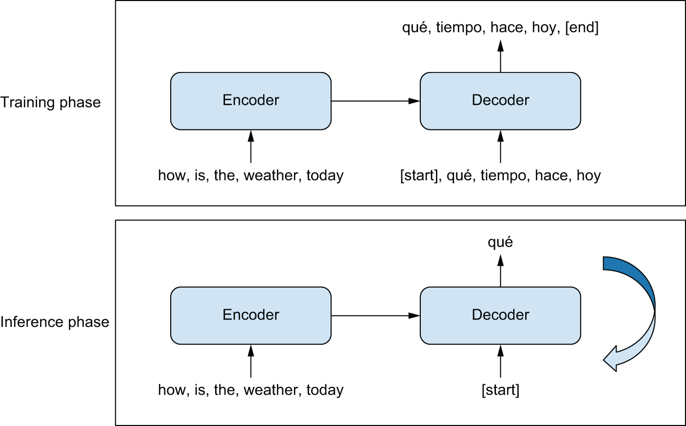
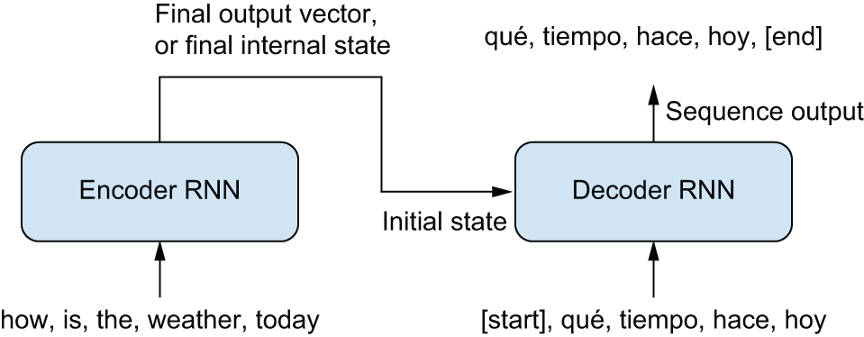
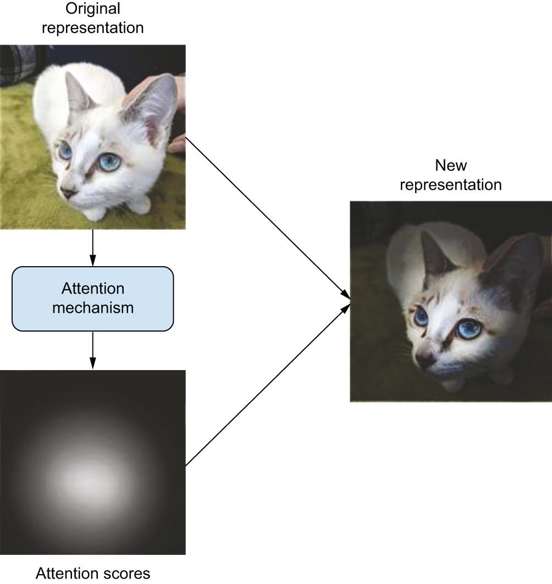
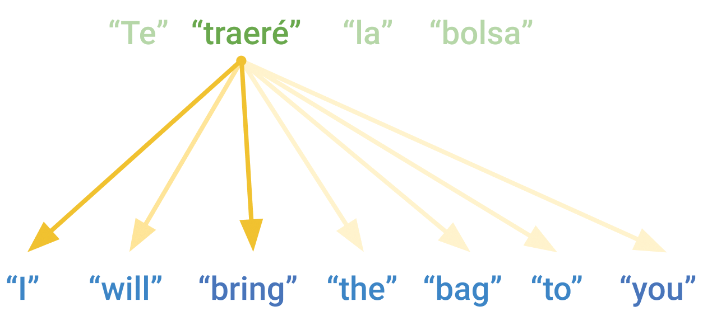
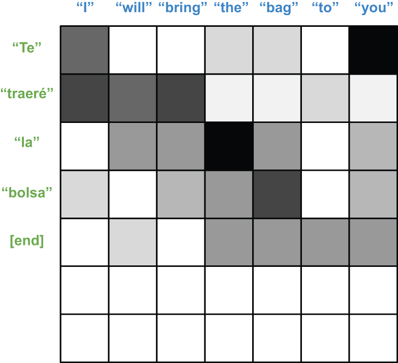
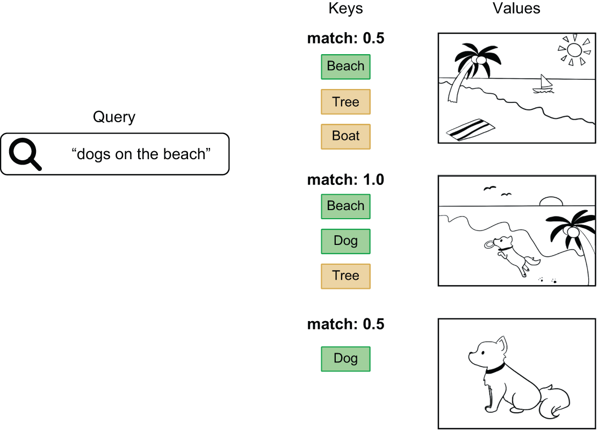
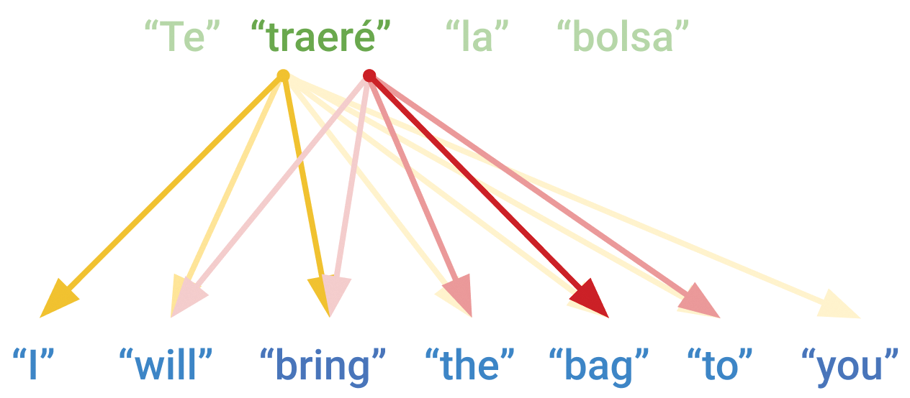
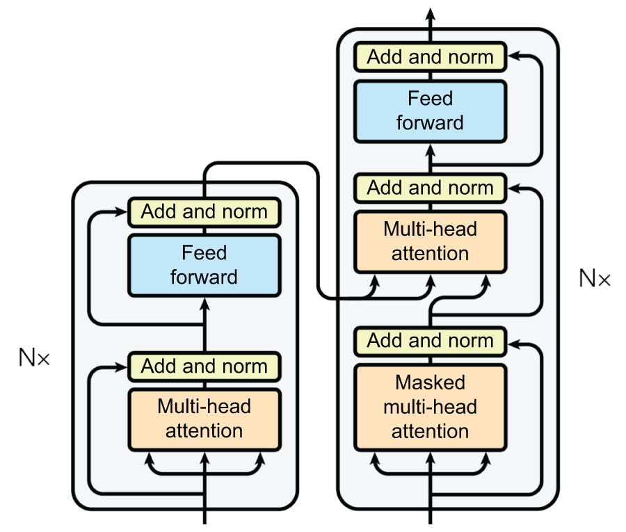

<!-- tabs:start -->

#### **Tiếng Anh (English)**

# Chapter 15: Language models and the Transformer

This chapter covers

* How to generate text with a deep learning model
* Training a model to translate from English to Spanish
* The Transformer, a powerful architecture for text modeling problems

With the basics of text preprocessing and modeling covered in the previous chapter,
this chapter will tackle some more involved language problems such as machine
translation. We will build up a solid intuition for the Transformer model that
powers products like ChatGPT and has helped trigger a wave of investment in natural language processing (NLP).

## The language model

In the previous chapter, we learned how to convert text data to numeric inputs,
and we used this numeric representation to classify movie reviews. However, text
classification is, in many ways, a uniquely simple problem. We only need to
output a single floating-point number for binary classification and, at worst,
*N* numbers for *N*-way classification.

What about other text-based tasks like question answering or translation? For
many real-world problems, we are interested in a model that can generate a
text output for a given input. Just like we needed tokenizers and embeddings to
help us handle text on the *way in* to a model, we must build up some techniques
before we can produce text on the *way out*.

We don’t need to start from scratch here; we can continue to use the idea of an
integer sequence as a natural numeric representation for text. In the previous
chapter, we covered *tokenizing* a string, where we split inputs into tokens and
map each token to an int. We can *detokenize* a sequence by proceeding in
reverse — map ints back to string tokens and join them together. With this
approach, our problem becomes building a model that can predict an integer
sequence of tokens.

The simplest option to consider might be to train a direct classifier over the
space of all possible output integer sequences, but some back-of-the-envelope
math will quickly show this is intractable. With a vocabulary of 20,000 words,
there are 20,000 ^ 4, or 160 quadrillion possible 4-word sequences, and
fewer atoms in the universe than possible 20-word sequences. Attempting to
represent every output sequence as a unique classifier output would overwhelm
compute resources no matter how we design our model.

A practical approach for making such a prediction problem feasible is to build a
model that only predicts a single token output at a time. A *language model*
is a model that, in its simplest form, learns a straightforward but deep
probability distribution: `p(token|past tokens)`. Given a sequence of all tokens
observed up to a point, a language model will attempt to output a probability
distribution over all possible tokens that could come next. A 20,000-word
vocabulary means the model needs only predict 20,000 outputs, but by
*repeatedly* predicting the next token, we will have built a model that can
generate a long sequence of text.

Let’s make this more concrete by building a simple language model that predicts
the next character in a sequence of characters. We will train a small model that
can output Shakespeare-like text.

### Training a Shakespeare language model

To begin, we can download a collection of some of Shakespeare’s plays and
sonnets.

```python
import keras

filename = keras.utils.get_file(
    origin=(
        "https://storage.googleapis.com/download.tensorflow.org/"
        "data/shakespeare.txt"
    ),
)
shakespeare = open(filename, "r").read()
```

[Listing 15.1](#listing-15-1): Downloading an abbreviated collection of Shakespeare’s work

Let’s take a look at some of the data:

```python
>>> shakespeare[:250]
First Citizen:
Before we proceed any further, hear me speak.

All:
Speak, speak.

First Citizen:
You are all resolved rather to die than to famish?

All:
Resolved. resolved.

First Citizen:
First, you know Caius Marcius is chief enemy to the people.
```

To build a *language model* from this input, we will need to massage our
source text. First, we will split our data into equal-length chunks that we can
batch and use for model training, much as we did for weather measurements in the
timeseries chapter. Because we will be using a character-level tokenizer here,
we can do this chunking directly on the string input. A 100-character string
will map to a 100-integer sequence.

We will also split each input into two separate feature and label sequences,
with each label sequence simply being the input sequence offset by a single
character.

```python
import tensorflow as tf

# The chunk size we will use during training. We only train on
# sequences of 100 characters at a time.
sequence_length = 100

def split_input(input, sequence_length):
    for i in range(0, len(input), sequence_length):
        yield input[i : i + sequence_length]

features = list(split_input(shakespeare[:-1], sequence_length))
labels = list(split_input(shakespeare[1:], sequence_length))
dataset = tf.data.Dataset.from_tensor_slices((features, labels))
```

[Listing 15.2](#listing-15-2): Splitting text into chunks for language model training

Let’s look at an `(x, y)` input sample. Our label at each position in the
sequence is the next character in the sequence:

```python
>>> x, y = next(dataset.as_numpy_iterator())
>>> x[:50], y[:50]
(b"First Citizen:\nBefore we proceed any further, hear",
 b"irst Citizen:\nBefore we proceed any further, hear ")
```

To map this input to a sequence of integers, we can again use the
`TextVectorization` layer we saw in the last chapter. To learn a character-level
vocabulary instead of a word-level vocabulary, we can change our `split`
argument. Rather than the default `"whitespace"` splitting, we instead split by
`"character"`. We will do no standardization here — to keep things simple, we
will preserve case and pass punctuation through unaltered.

```python
from keras import layers

tokenizer = layers.TextVectorization(
    standardize=None,
    split="character",
    output_sequence_length=sequence_length,
)
tokenizer.adapt(dataset.map(lambda text, labels: text))
```

[Listing 15.3](#listing-15-3): Learning a character-level vocabulary with the `TextVectorization` layer

Let’s inspect the vocabulary:

```python
>>> vocabulary_size = tokenizer.vocabulary_size()
>>> vocabulary_size
67
```

We need only 67 characters to handle the full source text.

Next, we can apply our tokenization layer to our input text. And finally, we can
shuffle, batch, and cache our dataset so we don’t need to recompute it every
epoch:

```python
dataset = dataset.map(
    lambda features, labels: (tokenizer(features), tokenizer(labels)),
    num_parallel_calls=8,
)
training_data = dataset.shuffle(10_000).batch(64).cache()
```

With that, we are ready to start modeling.

To build our simple language model, we want to predict the probability of a
character given all past characters. Of all the modeling possibilities we have
seen so far in this book, an RNN is the most natural fit, as the recurrent state
of each cell allows the model to propagate information about past characters
when predicting the label of the current character. We can also use an `Embedding`, as we saw in the previous chapter, to embed each
input character as a unique 256-dimensional vector.

We will use only a single recurrent layer to keep this model small and easy to
train. Any recurrent layer would do here, but to keep things simple, we will use
a `GRU`, which is fast and has a simpler internal state than an `LSTM`.

```python
embedding_dim = 256
hidden_dim = 1024

inputs = layers.Input(shape=(sequence_length,), dtype="int", name="token_ids")
x = layers.Embedding(vocabulary_size, embedding_dim)(inputs)
x = layers.GRU(hidden_dim, return_sequences=True)(x)
x = layers.Dropout(0.1)(x)
# Outputs a probability distribution over all potential tokens in our
# vocabulary
outputs = layers.Dense(vocabulary_size, activation="softmax")(x)
model = keras.Model(inputs, outputs)
```

[Listing 15.4](#listing-15-4): Building a miniature language model

Let’s take a look at our model summary:

```python
>>> model.summary()
Model: "functional"
┏━━━━━━━━━━━━━━━━━━━━━━━━━━━━━━━━━━━┳━━━━━━━━━━━━━━━━━━━━━━━━━━┳━━━━━━━━━━━━━━━┓
┃ Layer (type)                      ┃ Output Shape             ┃       Param # ┃
┡━━━━━━━━━━━━━━━━━━━━━━━━━━━━━━━━━━━╇━━━━━━━━━━━━━━━━━━━━━━━━━━╇━━━━━━━━━━━━━━━┩
│ token_ids (InputLayer)            │ (None, 100)              │             0 │
├───────────────────────────────────┼──────────────────────────┼───────────────┤
│ embedding (Embedding)             │ (None, 100, 256)         │        17,152 │
├───────────────────────────────────┼──────────────────────────┼───────────────┤
│ gru (GRU)                         │ (None, 100, 1024)        │     3,938,304 │
├───────────────────────────────────┼──────────────────────────┼───────────────┤
│ dropout (Dropout)                 │ (None, 100, 1024)        │             0 │
├───────────────────────────────────┼──────────────────────────┼───────────────┤
│ dense (Dense)                     │ (None, 100, 67)          │        68,675 │
└───────────────────────────────────┴──────────────────────────┴───────────────┘
 Total params: 4,024,131 (15.35 MB)
 Trainable params: 4,024,131 (15.35 MB)
 Non-trainable params: 0 (0.00 B)
```

This model outputs a softmax probability for every possible character in our
vocabulary, and we will `compile()` it with a crossentropy loss. Note that our
model is still training on a classification problem, it’s just that we will make
one classification prediction for every token in our sequence. For our batch of
64 samples with 100 characters each, we will predict 6,400 individual labels.
Loss and accuracy metrics reported by Keras during training will be averaged
first across each sequence and, second, across each batch.

Let’s go ahead and train our language model.

```python
model.compile(
    optimizer="adam",
    loss="sparse_categorical_crossentropy",
    metrics=["sparse_categorical_accuracy"],
)
model.fit(training_data, epochs=20)
```

[Listing 15.5](#listing-15-5): Training a miniature language model

After 20 epochs, our model can eventually predict the next character in our
input sequences around 70% of the time.

### Generating Shakespeare

Now that we have trained a model that can predict the next *individual* tokens
with some accuracy, we would like to use it to extrapolate an entire predicted
sequence. We can do this by calling the model in a loop, where the model’s
predicted output at one time step becomes the model’s input at the next time
step. A model built for this kind of feedback loop is sometimes called an
*autoregressive* model.

To run such a loop, we need to perform a slight surgery on the model we just
trained. During training, our model handled only a fixed sequence length of 100
tokens, and the `GRU` cell’s state was handled implicitly when calling the
layer. During generation, we would like to predict a single output token at a
time and explicitly output the state of the `GRU`’s cell. We need to propagate
that state, which contains all information the model has encoded about past
input characters, the next time we call the model.

Let’s make a model that handles a single input character at a time and allows
explicitly passing the RNN state. Because this model will have the same
computational structure, with slightly modified inputs and outputs, we can
assign weights from one model to another.

```python
# Creates a model that receives and outputs the RNN state
inputs = keras.Input(shape=(1,), dtype="int", name="token_ids")
input_state = keras.Input(shape=(hidden_dim,), name="state")

x = layers.Embedding(vocabulary_size, embedding_dim)(inputs)
x, output_state = layers.GRU(hidden_dim, return_state=True)(
    x, initial_state=input_state
)
outputs = layers.Dense(vocabulary_size, activation="softmax")(x)
generation_model = keras.Model(
    inputs=(inputs, input_state),
    outputs=(outputs, output_state),
)
# Copies the parameters from the original model
generation_model.set_weights(model.get_weights())
```

[Listing 15.6](#listing-15-6): Modifying the language model for autoregressive inference

With this, we can call the model to predict an output sequence in a loop. Before
we do, we will make explicit lookup tables so we switch from characters to
integers and choose a *prompt* — a snippet of text we will feed as input to the
model before we begin predicting new tokens:

```python
tokens = tokenizer.get_vocabulary()
token_ids = range(vocabulary_size)
char_to_id = dict(zip(tokens, token_ids))
id_to_char = dict(zip(token_ids, tokens))

prompt = """
KING RICHARD III:
"""
```

To begin generation, we first need to “prime” the internal state of the GRU with
our prompt. To do this, we will feed the prompt into the model one token at a
time. This will compute the exact RNN state the model would see if this prompt
had been encountered during training.

When we feed the very last character of the prompt into the model, our state
output will capture information about the entire prompt sequence. We can save
the final output prediction to later select the first character of our generated
response.

```python
input_ids = [char_to_id[c] for c in prompt]
state = keras.ops.zeros(shape=(1, hidden_dim))
for token_id in input_ids:
    inputs = keras.ops.expand_dims([token_id], axis=0)
    # Feeds the prompt character by character to update state
    predictions, state = generation_model.predict((inputs, state), verbose=0)
```

[Listing 15.7](#listing-15-7): Using a fixed prompt to compute a language model’s starting state

Now we are ready to let the model predict a new output sequence. In a loop, up
to a desired length, we will continually select the most likely next character
predicted by the model, feed that to the model, and persist the new RNN state.
In this way, we can predict an entire sequence, a token at time.

```python
import numpy as np

generated_ids = []
max_length = 250
# Generates characters one by one, computing a new state each iteration
for i in range(max_length):
    # The next character is the output index with the highest
    # probability.
    next_char = int(np.argmax(predictions, axis=-1)[0])
    generated_ids.append(next_char)
    inputs = keras.ops.expand_dims([next_char], axis=0)
    predictions, state = generation_model.predict((inputs, state), verbose=0)
```

[Listing 15.8](#listing-15-8): Predicting with the language model a token at a time

Let’s convert our output integer sequence to a string to see what the model
predicted. To *detokenize* our input, we simply map all token IDs to strings and
join them together:

```python
output = "".join([id_to_char[token_id] for token_id in generated_ids])
print(prompt + output)
```

We get the following output:

```python
KING RICHARD III:
Stay, men! hear me speak.

FRIAR LAURENCE:
Thou wouldst have done thee here that he hath made for them?

BUCKINGHAM:
What straight shall stop his dismal threatening son,
Thou bear them both. Here comes the king;
Though I be good to put a wife to him,
```

We have yet to produce the next great tragedy, but this is not terrible for two
minutes of training on a minimal dataset. The goal of this toy example is to
show the power of the language model setup. We trained the model on the narrow
problem of guessing a single character at a time but still use it for a much
broader problem, generating an open-ended, Shakespearean-like text response.

It’s important to notice that this training setup only works because a recurrent
neural network only passes information forward in the sequence. If you’d like,
try replacing the `GRU` layer with a `Bidirectional(GRU(...))`. The
training accuracy will zoom to above 99% immediately, and generation will stop
working entirely. During training, our model sees the entire sequence each train
step. If we “cheat” by letting information from the next token in the sequence
affect the current token’s prediction, we’ve made our problem trivially easy.

This *language modeling* setup is fundamental to countless problems in the
text domain. It is also somewhat unique compared to other modeling problems we
have seen so far in this book. We cannot simply call `model.predict()` to get
the desired output. There is an entire loop, and a nontrivial amount of logic,
that exists only at inference time! The looping of state in the RNN cell happens
for both training and inference, but at no point during training do we feed a
model’s predicted labels back into itself as input.

## Sequence-to-sequence learning

Let’s take the language model idea and extend it to tackle an important
problem — machine translation. Translation belongs to a class of modeling
problems often called *sequence-to-sequence* modeling (or *seq2seq* if you are
trying to save keystrokes). We seek to build a model that can take in a source
text as a fixed input sequence and generate the translated text sequence as a
result. Question answering is another classic sequence-to-sequence problem.

The general template behind sequence-to-sequence models is described in figure
15.1. During training, the following happens:

* An encoder model turns the source sequence into an intermediate representation.
* A decoder is trained using the language modeling setup we saw previously. It will
  recursively predict the next token in the target sequence by looking at all
  previous target tokens *and* our encoder’s representation of the source
  sequence.

During inference, we don’t have access to the target sequence — we’re trying to
predict it from scratch. We will generate it one token at a time, just as we did
with our Shakespeare generator:

* We obtain the encoded source sequence from the encoder.
* The decoder starts by looking at the encoded source sequence as well as an
  initial “seed” token (such as the string `"[start]"`) and uses them to
  predict the first real token in the sequence.
* The predicted sequence so far is fed back into the decoder, in a loop, until
  it generates a stop token (such as the string `"[end]"`).




[Figure 15.1](#figure-15-1): Sequence-to-sequence learning: the source sequence is processed by the encoder and is then sent to the decoder. The decoder looks at the target sequence so far and predicts the target sequence offset by one step in the future. During inference, we generate one target token at a time and feed it back into the decoder.

Let’s build a sequence-to-sequence translation model.

### English-to-Spanish translation

We’ll be working with an English-to-Spanish translation dataset. Let’s download
it:

```python
import pathlib

zip_path = keras.utils.get_file(
    origin=(
        "http://storage.googleapis.com/download.tensorflow.org/data/spa-eng.zip"
    ),
    fname="spa-eng",
    extract=True,
)
text_path = pathlib.Path(zip_path) / "spa-eng" / "spa.txt"
```

The text file contains one example per line: an English sentence, followed by a
tab character, followed by the corresponding Spanish sentence. Let’s parse this
file:

```python
with open(text_path) as f:
    lines = f.read().split("\n")[:-1]
text_pairs = []
for line in lines:
    english, spanish = line.split("\t")
    spanish = "[start] " + spanish + " [end]"
    text_pairs.append((english, spanish))
```

Our `text_pairs` look like this:

```python
>>> import random
>>> random.choice(text_pairs)
("Who is in this room?", "[start] ¿Quién está en esta habitación? [end]")
```

Let’s shuffle them and split them into the usual training, validation, and test
sets:

```python
import random

random.shuffle(text_pairs)
val_samples = int(0.15 * len(text_pairs))
train_samples = len(text_pairs) - 2 * val_samples
train_pairs = text_pairs[:train_samples]
val_pairs = text_pairs[train_samples : train_samples + val_samples]
test_pairs = text_pairs[train_samples + val_samples :]
```

Next, let’s prepare two separate `TextVectorization` layers: one for English and
one for Spanish. We’re going to need to customize the way strings are
preprocessed:

* We need to preserve the `"[start]"` and `"[end]"` tokens that we’ve inserted.
  By default, the characters `[` and `]` would be stripped, but we want to keep
  them around so we can distinguish the word `"start"` from the start token
  `"[start]"`.
* Punctuation is different from language to language! In the Spanish
  `TextVectorization` layer, if we’re going to strip punctuation characters, we
  need to also strip the character `¿`.

Note that for a non-toy translation model, we would treat punctuation characters
as separate tokens rather than stripping them since we would want to be able to
generate correctly punctuated sentences. In our case, for simplicity, we’ll get
rid of all punctuation.

```python
import string
import re

strip_chars = string.punctuation + "¿"
strip_chars = strip_chars.replace("[", "")
strip_chars = strip_chars.replace("]", "")

def custom_standardization(input_string):
    lowercase = tf.strings.lower(input_string)
    return tf.strings.regex_replace(
        lowercase, f"[{re.escape(strip_chars)}]", ""
    )

vocab_size = 15000
sequence_length = 20

english_tokenizer = layers.TextVectorization(
    max_tokens=vocab_size,
    output_mode="int",
    output_sequence_length=sequence_length,
)
spanish_tokenizer = layers.TextVectorization(
    max_tokens=vocab_size,
    output_mode="int",
    output_sequence_length=sequence_length + 1,
    standardize=custom_standardization,
)
train_english_texts = [pair[0] for pair in train_pairs]
train_spanish_texts = [pair[1] for pair in train_pairs]
english_tokenizer.adapt(train_english_texts)
spanish_tokenizer.adapt(train_spanish_texts)
```

[Listing 15.9](#listing-15-9): Learning token vocabularies for English and Spanish text

Finally, we can turn our data into a `tf.data` pipeline. We want it to return a
tuple `(inputs, target, sample_weights)` where `inputs` is a dict with two keys,
`"english"` (the tokenized English sentence) and `"spanish"` (the tokenized
Spanish sentence), and `target` is the Spanish sentence offset by one step
ahead. `sample_weights` here will be used to tell Keras which labels to use when
calculating our loss and metrics. Our output translations are not all equal in
length, and some of our label sequences will be padded with zeros. We only care
about predictions for non-zero labels that represent actual translated text.

This matches the “off by one” label set up in the generation model we just
built, with the addition of the fixed encoder inputs, which will be handled
separately in our model.

```python
batch_size = 64

def format_dataset(eng, spa):
    eng = english_tokenizer(eng)
    spa = spanish_tokenizer(spa)
    features = {"english": eng, "spanish": spa[:, :-1]}
    labels = spa[:, 1:]
    sample_weights = labels != 0
    return features, labels, sample_weights

def make_dataset(pairs):
    eng_texts, spa_texts = zip(*pairs)
    eng_texts = list(eng_texts)
    spa_texts = list(spa_texts)
    dataset = tf.data.Dataset.from_tensor_slices((eng_texts, spa_texts))
    dataset = dataset.batch(batch_size)
    dataset = dataset.map(format_dataset, num_parallel_calls=4)
    return dataset.shuffle(2048).cache()

train_ds = make_dataset(train_pairs)
val_ds = make_dataset(val_pairs)
```

[Listing 15.10](#listing-15-10): Tokenizing and preparing the Translation data

Here’s what our dataset outputs look like:

```python
>>> inputs, targets, sample_weights = next(iter(train_ds))
>>> print(inputs["english"].shape)
(64, 20)
>>> print(inputs["spanish"].shape)
(64, 20)
>>> print(targets.shape)
(64, 20)
>>> print(sample_weights.shape)
(64, 20)
```

The data is now ready — time to build some models.

### Sequence-to-sequence learning with RNNs

Before we try the twin encoder/decoder setup we previously mentioned, let’s think
through simpler options. The easiest, naive way to use RNNs to turn one sequence
into another is to keep the output of the RNN at each time step and predict an
output token from it. In Keras, it would look like this:

```python
inputs = keras.Input(shape=(sequence_length,), dtype="int32")
x = layers.Embedding(input_dim=vocab_size, output_dim=128)(inputs)
x = layers.LSTM(32, return_sequences=True)(x)
outputs = layers.Dense(vocab_size, activation="softmax")(x)
model = keras.Model(inputs, outputs)
```

However, there is a critical issue with this approach. Due to the step-by-step
nature of RNNs, the model will only look at tokens `0...N` in the source
sequence to predict token `N` in the target sequence. Consider translating the
sentence, “I will bring the bag to you.” In Spanish, that would be “Te traeré
la bolsa,” where “Te,” the first word of the translation, corresponds to “you”
in the English source text. There’s simply no way to output the first word of
the translation without seeing the last word of the source English text!

If you’re a human translator, you’d start by reading the entire source sentence
before beginning to translate it. This is especially important if you’re dealing
with languages with wildly different word ordering. And that’s precisely what
standard sequence-to-sequence models do. In a proper sequence-to-sequence setup
(see figure 15.2), you would first use an encoder RNN to turn the entire source
sequence into a single representation of the source text. This could be the last
output of the RNN or, alternatively, its final internal state vectors. We can
use this representation as the initial state of a decoder RNN in the language
model setup instead of an initial state of zeros, which we used in our
Shakespeare generator. This decoder learns to predict the next word of the
Spanish translation given the current word of the translation, with all
information about the English sequence coming from that initial RNN state.




[Figure 15.2](#figure-15-2): A sequence-to-sequence RNN: an RNN encoder is used to produce a vector that encodes the entire source sequence, which is used as the initial state for an RNN decoder.

Let’s implement this in Keras, with GRU-based encoders and decoders. We can
start with just the encoder. Since we will not actually be predicting tokens in
the encoder sequence, we don’t have to worry about “cheating” by letting the model
pass information from the end of the sequence to positions at the beginning.
In fact, this is a good idea, as we want a rich representation of the source
sequence. We can achieve this with a `Bidirectional` layer.

```python
embed_dim = 256
hidden_dim = 1024

source = keras.Input(shape=(None,), dtype="int32", name="english")
x = layers.Embedding(vocab_size, embed_dim, mask_zero=True)(source)
rnn_layer = layers.GRU(hidden_dim)
rnn_layer = layers.Bidirectional(rnn_layer, merge_mode="sum")
encoder_output = rnn_layer(x)
```

[Listing 15.11](#listing-15-11): Building a sequence-to-sequence encoder

Next, let’s add the decoder — a simple `GRU` layer that takes as its initial state
the encoded source sentence. On top of it, we add a `Dense` layer that produces
a probability distribution over the Spanish vocabulary for each output step.
Here, we want to predict the next tokens based only on what came before, so a
`Bidirectional` RNN would break training by making the loss function trivially
easy.

```python
target = keras.Input(shape=(None,), dtype="int32", name="spanish")
x = layers.Embedding(vocab_size, embed_dim, mask_zero=True)(target)
rnn_layer = layers.GRU(hidden_dim, return_sequences=True)
x = rnn_layer(x, initial_state=encoder_output)
x = layers.Dropout(0.5)(x)
# Predicts the next word of the translation, given the current word
target_predictions = layers.Dense(vocab_size, activation="softmax")(x)
seq2seq_rnn = keras.Model([source, target], target_predictions)
```

[Listing 15.12](#listing-15-12): Building a sequence-to-sequence decoder

Let’s take a look at the seq2seq model in full:

```python
>>> seq2seq_rnn.summary()
Model: "functional_1"
┏━━━━━━━━━━━━━━━━━━━━━━━┳━━━━━━━━━━━━━━━━━━━┳━━━━━━━━━━━━━┳━━━━━━━━━━━━━━━━━━━━┓
┃ Layer (type)          ┃ Output Shape      ┃     Param # ┃ Connected to       ┃
┡━━━━━━━━━━━━━━━━━━━━━━━╇━━━━━━━━━━━━━━━━━━━╇━━━━━━━━━━━━━╇━━━━━━━━━━━━━━━━━━━━┩
│ english (InputLayer)  │ (None, None)      │           0 │ -                  │
├───────────────────────┼───────────────────┼─────────────┼────────────────────┤
│ spanish (InputLayer)  │ (None, None)      │           0 │ -                  │
├───────────────────────┼───────────────────┼─────────────┼────────────────────┤
│ embedding_1           │ (None, None, 256) │   3,840,000 │ english[0][0]      │
│ (Embedding)           │                   │             │                    │
├───────────────────────┼───────────────────┼─────────────┼────────────────────┤
│ not_equal (NotEqual)  │ (None, None)      │           0 │ english[0][0]      │
├───────────────────────┼───────────────────┼─────────────┼────────────────────┤
│ embedding_2           │ (None, None, 256) │   3,840,000 │ spanish[0][0]      │
│ (Embedding)           │                   │             │                    │
├───────────────────────┼───────────────────┼─────────────┼────────────────────┤
│ bidirectional         │ (None, 1024)      │   7,876,608 │ embedding_1[0][0], │
│ (Bidirectional)       │                   │             │ not_equal[0][0]    │
├───────────────────────┼───────────────────┼─────────────┼────────────────────┤
│ gru_2 (GRU)           │ (None, None,      │   3,938,304 │ embedding_2[0][0], │
│                       │ 1024)             │             │ bidirectional[0][… │
├───────────────────────┼───────────────────┼─────────────┼────────────────────┤
│ dropout_1 (Dropout)   │ (None, None,      │           0 │ gru_2[0][0]        │
│                       │ 1024)             │             │                    │
├───────────────────────┼───────────────────┼─────────────┼────────────────────┤
│ dense_1 (Dense)       │ (None, None,      │  15,375,000 │ dropout_1[0][0]    │
│                       │ 15000)            │             │                    │
└───────────────────────┴───────────────────┴─────────────┴────────────────────┘
 Total params: 34,869,912 (133.02 MB)
 Trainable params: 34,869,912 (133.02 MB)
 Non-trainable params: 0 (0.00 B)
```

Our model and data are both ready. We can now begin training our translation
model:

```python
seq2seq_rnn.compile(
    optimizer="adam",
    loss="sparse_categorical_crossentropy",
    weighted_metrics=["accuracy"],
)
seq2seq_rnn.fit(train_ds, epochs=15, validation_data=val_ds)
```

We picked accuracy as a crude way to monitor validation set performance during
training. We get to 65% accuracy: on average, the model correctly predicts the
next word in the Spanish sentence 65% of the time. However, in practice,
next-token accuracy isn’t a great metric for machine translation models, in
particular because it makes the assumption that the correct target tokens from
`0` to `N` are already known when predicting token `N + 1`. In reality, during
inference, you’re generating the target sentence from scratch, and you can’t
rely on previously generated tokens being 100% correct. When working on a
real-world machine translation system, metrics must be more carefully designed.
There are standard metrics, such as a BLEU score, that measure the similarity
of the machine-translated text to a set of high-quality reference translations
and can tolerate slightly misaligned sequences.

At last, let’s use our model for inference. We’ll pick a few sentences in the
test set and check how our model translates them. We’ll start from the seed
token `"[start]"` and feed it into the decoder model, together with the
encoded English source sentence. We’ll retrieve a next-token prediction, and
we’ll re-inject it into the decoder repeatedly, sampling one new target token at
each iteration, until we get to `"[end]"` or reach the maximum sentence length.

```python
import numpy as np

spa_vocab = spanish_tokenizer.get_vocabulary()
spa_index_lookup = dict(zip(range(len(spa_vocab)), spa_vocab))

def generate_translation(input_sentence):
    tokenized_input_sentence = english_tokenizer([input_sentence])
    decoded_sentence = "[start]"
    for i in range(sequence_length):
        tokenized_target_sentence = spanish_tokenizer([decoded_sentence])
        inputs = [tokenized_input_sentence, tokenized_target_sentence]
        next_token_predictions = seq2seq_rnn.predict(inputs, verbose=0)
        sampled_token_index = np.argmax(next_token_predictions[0, i, :])
        sampled_token = spa_index_lookup[sampled_token_index]
        decoded_sentence += " " + sampled_token
        if sampled_token == "[end]":
            break
    return decoded_sentence

test_eng_texts = [pair[0] for pair in test_pairs]
for _ in range(5):
    input_sentence = random.choice(test_eng_texts)
    print("-")
    print(input_sentence)
    print(generate_translation(input_sentence))
```

[Listing 15.13](#listing-15-13): Generating translations with a seq2seq RNN

The exact translations will vary from run to run, as the final model weights
will depend on the random initializations of our weights and the random
shuffling of our input data. Here’s what we got:

```python
-
You know that.
[start] tú lo sabes [end]
-
"Thanks." "You're welcome."
[start] gracias tú [UNK] [end]
-
The prisoner was set free yesterday.
[start] el plan fue ayer a un atasco [end]
-
I will tell you tomorrow.
[start] te lo voy mañana a decir [end]
-
I think they're happy.
[start] yo creo que son felices [end]
```

Our model works decently well for a toy model, although it still makes many basic
mistakes.

Note that this inference setup, while very simple, is inefficient, since we
reprocess the entire source sentence and the entire generated target sentence
every time we sample a new word. In a practical application, you’d want to be
careful not to recompute any state that has not changed. All we really need to
predict a new token in the decoder is the current token and the previous RNN
state, which we could cache before each loop iteration.

There are many ways this toy model could be improved. We could use a deep stack
of recurrent layers for both the encoder and the decoder, we could try other RNN
layers like `LSTM`, and so on. Beyond such tweaks, however, the RNN approach to
sequence-to-sequence learning has a few fundamental limitations:

* The source sequence representation has to be held entirely in the encoder
  state vector, which significantly limits the size and complexity of the
  sentences you can translate.
* RNNs have trouble dealing with very long sequences since they tend to
  progressively forget about the past — by the time you’ve reached the 100th token
  in either sequence, little information remains about the start of the
  sequence.

Recurrent neural networks dominated sequence-to-sequence learning in the
mid-2010s. Google Translate circa 2017 was powered by a stack of seven large
`LSTM` layers in a setup similar to what we just created. However, these
limitations of RNNs eventually led to researchers developing a new style of
sequence model, called the Transformer.

## The Transformer architecture

In 2017, Vaswani et al. introduced the Transformer architecture in the seminal
paper “Attention Is All You Need.”[[1]](#footnote-1) The
authors were working on translation systems like the one we just built, and the
critical discovery is right in the title. As it turned out, a simple mechanism
called *attention* can be used to construct powerful sequence models that
don’t feature recurrent layers at all. The idea of attention was not new and
had been used in NLP systems for a couple of years when they published. But the
idea that attention was so useful it could be the *only* mechanism used to pass
information across a sequence was quite surprising at the time.

This finding unleashed nothing short of a revolution in natural language
processing — and beyond. Attention has fast become one of the most influential
ideas in deep learning. In this section, you’ll get an in-depth explanation of
how it works and why it has proven so effective for sequence modeling. We’ll
then use attention to rebuild our English-to-Spanish translation model.

So, with all that as build-up, what exactly is attention? And how does it offer
a replacement for the recurrent neural networks we have used so far?

Attention was actually developed as a way to augment an RNN model like the one
we just built. Researchers noticed that while RNNs excelled at modeling
dependencies in a local neighborhood, they struggled with recall as sequences
got longer. Say you were building a system to answer questions about a source
document. If the document length got too long, RNN results would get plain bad,
a far cry from human performance.

As a thought experiment, imagine using this book to build a weather prediction
model. If you had enough time, you might read the entire book cover to cover,
but when you actually implemented your model, you would pay special attention to
just the timeseries chapters. Even within a chapter, you might find specific
code samples and explanations you would refer to often. On the other hand, you
would not be particularly worried about the details of image convolutions as you
worked on your code. The overall word count of this book is well over 100,000,
far beyond any sequence length we have tackled, but humans can be *selective*
and *contextual* in how we pull information from text.

RNNs, on the other hand, lack any mechanism to refer back to a previous section
of a sequence directly. All information must, by design, be passed through an
RNN cell’s internal state in a loop, through *every* position in a sequence.
It’s a bit like finishing this book, closing it, and trying to implement that
weather prediction model entirely from memory.
The idea with attention is to build a mechanism by which a neural network can
give more weight to some part of a sequence and less weight to others
contextually, depending on the current input being processed (figure 15.3).




[Figure 15.3](#figure-15-3): The general concept of attention in deep learning: input features get assigned attention scores, which can be used to inform the next representation of the input.


What is Einsum notation?

In machine learning codebases, you will frequently see little snippets that look
like this: `np.einsum('ij,jk->ik', a, b)`. This is called *Einsum notation*, short
for Einstein summation notation. Once you learn to read them, they can
be a clear way to write complex array operations. You will see them frequently
in Transformer code for this reason.

The idea with an Einsum equation is to represent each axis of an input with a
unique letter. For example, you could represent a rank-3 input as `ijk`. Then,
you write an equation with any number of inputs and a single output
`input1,input2->output`. The rules of this equation are as follows:

* For any repeated letters across inputs, multiply values along these axes
  together. The size of these dimensions should match.
* For any letters in the input but not the output, sum over these axes so they
  do not appear in the returned array.
* Output axes can be returned in any order.

This gets much clearer if we take a look at some examples:

```python
# Transposes
np.einsum("ij->ji")
# matmul
np.einsum("ij,jk->ik")
# matmuls a list of matrices against a single matrix
np.einsum("hij,jk->hik")
# Dot-product
np.einsum("i,i->")
# Element-wise multiplication
np.einsum("ijk,ijk->ijk")
# Element-wise multiplies and sums everything.
np.einsum("ijk,ijk->")
```

In Keras, you can use einsums in two ways. `keras.ops.einsum` is a drop-in
replacement for `np.einsum`, and `keras.layers.EinsumDense` is a `Dense` layer
where the `matmul` is replaced by an `einsum` operation.

### Dot-product attention

Let’s revisit our translation RNN and try to add the notion of selective
attention. Consider predicting just a single token. After passing the `source`
and `target` sequences through our `GRU` layers, we will have a vector
representing the target token we are about to predict and a sequence of vectors
representing each word in the source text.

With attention, our goal is to give the model a way to *score* every single
vector in our source sequence based on its *relevance* to the current word we
are trying to predict (figure 15.4). If the vector representation of a source token has a high
score, we consider it particularly important; if not, we care less about it. For
now, let’s assume we have this function `score(target_vector, source_vector)`.




[Figure 15.4](#figure-15-4): Attention assigns a relevance score to each vector in a source for each vector in a target sequence.

For attention to work well, we want to avoid passing information about important
tokens through a loop potentially as long as our combined source and target
sequence length — this is where RNNs start to fail. A simple way to do this is to
take a weighted sum of all the source vectors based on this score we will
compute. It would also be convenient if the sum of all attention scores for a
given target were 1, as this would give our weighted sum a predictable
magnitude. We can achieve this by running the scores through a `softmax` function —
something like this, in NumPy pseudocode:

```python
scores = [score(target, source) for source in sources]
scores = softmax(scores)
combined = np.sum(scores * sources)
```

But how should we compute this relevance score? When researchers first worked
with attention, this question was a big topic of inquiry. It turns out that one of
the most straightforward approaches is best. We can use a dot-product as a
simple measure of the distance between target and source vectors. If the source
and target vectors are close together, we assume that means the source token is
relevant to our prediction. At the end of this chapter, we will examine why this
assumption makes intuitive sense.

Let’s update our pseudocode. We can make our snippet more complete by handling
the entire target sequence at once — it will be equivalent to running our
previous snippet in a loop for each token in the target sequence. When both
`target` and `source` are sequences, the attention scores will be a matrix. Each
row represents how much a target word will value a source word in the weighted
sum (see figure 15.5). We will use the Einsum notation as a convenient way to
write the dot-product and weighted sum:

```python
def dot_product_attention(target, source):
    # Takes the dot-product between all target and source vectors,
    # where b = batch size, t = target length, s = source length, and d
    # = vector size
    scores = np.einsum("btd,bsd->bts", target, source)
    scores = softmax(scores, axis=-1)
    # Computes a weighted sum of all source vectors for each target
    # vector
    return np.einsum("bts,bsd->btd", scores, source)

dot_product_attention(target, source)
```





[Figure 15.5](#figure-15-5): When both target and source are sequences, attention scores are a 2D matrix. Each row shows the attention scores for the word we are trying to predict (in green).

We can make the *hypothesis space* of this attention mechanism much richer if we
give the model parameters to control the attention score. If we project both
source and target vectors with `Dense` layers, the model can find a good
shared space where source vectors are close to target vectors if they help the
overall prediction quality. Similarly, we should allow the model to project the
source vectors into an entirely separate space before they are combined and once
again after the summation.

We can also adopt a slightly different naming for inputs that has become
standard in the field. What we just wrote is roughly summarized as
`sum(score(target, source) * source)`. We will write this equivalently with
different input names as `sum(score(query, key) * value)`. This three-argument
version is more general — in rare cases, you might not want to use the same
vector to score your source inputs as you use to sum your source inputs.

The terminology comes from search engines and recommender systems. Imagine a
search tool to look up photos in a database — the “query” is your search term,
the “keys” are photo tags you use to match with the query, and finally, the
“values” are the photos themselves (figure 15.6). The attention mechanism we are building is
roughly analogous to this sort of lookup.




[Figure 15.6](#figure-15-6): Retrieving images from a database: the *query* is compared to a set of *keys*, and the match scores are used to rank *values* (images).

Let’s update our pseudocode, so we have a parameterized attention using our new
terminology:

```python
query_dense = layers.Dense(dim)
key_dense = layers.Dense(dim)
value_dense = layers.Dense(dim)
output_dense = layers.Dense(dim)

def parameterized_attention(query, key, value):
    query = query_dense(query)
    key = key_dense(key)
    value = value_dense(value)
    scores = np.einsum("btd,bsd->bts", query, key)
    scores = softmax(scores, axis=-1)
    outputs = np.einsum("bts,bsd->btd", scores, value)
    return output_dense(outputs)

parameterized_attention(query=target, key=source, value=source)
```

This block is a perfectly functional attention mechanism! We just wrote a
function that will allow the model to pull information from anywhere in the
source sequence, contextually, depending on the target word we are decoding.

The “Attention is all you need” authors made two more changes to our
mechanism through trial and error. The first is a simple scaling factor. When
input vectors get long, the dot-product scores can get quite large, which can
affect the stability of our softmax gradients. The fix is simple: we can scale
down our softmax scores slightly. Scaling by the square root of the vector
length works well for any vector size.

The other has to do with the expressivity of the attention mechanism. The
softmax sum we are doing is powerful — it allows a direct connection across
distant parts of a sequence. But the summation is also blunt: if the model tries
to attend to too many tokens at once, the interesting features of individual
source tokens will get “washed out” in the combined representation. A simple
trick that works well is to do this attention operation several times for the
same sequence, with several different attention *heads* running the same
computation with different parameters:

```python
query_dense = [layers.Dense(head_dim) for i in range(num_heads)]
key_dense = [layers.Dense(head_dim) for i in range(num_heads)]
value_dense = [layers.Dense(head_dim) for i in range(num_heads)]
output_dense = layers.Dense(head_dim * num_heads)

def multi_head_attention(query, key, value):
    head_outputs = []
    for i in range(num_heads):
        query = query_dense[i](query)
        key = key_dense[i](key)
        value = value_dense[i](value)
        scores = np.einsum("btd,bsd->bts", target, source)
        scores = softmax(scores / math.sqrt(head_dim), axis=-1)
        head_output = np.einsum("bts,bsd->btd", scores, source)
        head_outputs.append(head_output)
    outputs = ops.concatenate(head_outputs, axis=-1)
    return output_dense(outputs)

multi_head_attention(query=target, key=source, value=source)
```

By projecting the query and key differently, one head might learn to match the
subject of the source sentence, while another head might attend to punctuation.
This multi-headed attention avoids the limitation of needing to combine the
entire source sequence with a single softmax sum (figure 15.7).




[Figure 15.7](#figure-15-7): Multi-headed attention allows each target word to attend to different parts of the source sequence in separate partitions of the eventual output vector.

Of course, in practice, you would want to write this code as a reusable layer.
Here, Keras has you covered. We can recreate our previous code with the
`MultiHeadAttention` layer as follows:

```python
multi_head_attention = keras.layers.MultiHeadAttention(
    num_heads=num_heads,
    head_dim=head_dim,
)
multi_head_attention(query=target, key=source, value=source)
```

### Transformer encoder block

One way to use the `MultiHeadAttention` layer would be to add it to our existing
RNN translation model. We could pass the sequence output from our encoder and
decoder into an attention layer and use its output to update our target sequence
before prediction. Attention would allow the model to handle long-range
dependencies in text that the `GRU` layer will struggle with. This does, in
fact, improve an RNN model’s capabilities and is how attention was first used in
the mid-2010s.

However, the authors of “Attention is all you need” realized you could go
further and use attention as a general mechanism for handling all sequence
data in a model. Although so far we have only looked at attention as a way to
handle information passing between two sequences, you could also use attention
as a way to let a sequence attend to itself:

```python
multi_head_attention(key=source, value=source, query=source)
```

This is called *self-attention*, and it is quite powerful. With self-attention,
each token can attend to every token in its own sequence, including itself,
allowing the model to learn a representation of the word in context.

Consider an example sentence: “The train left the station on time.” Now,
consider one word in the sentence: “station.” What kind of station are we
talking about? Could it be a radio station? Maybe the International Space
Station? With self-attention, the model could learn to give a high attention
score to the pair of “station” and “train,” summing the vector used to represent
“train” into the representation of the word “station.”

Self-attention gives the model an effective way to go from representing a word
in a vacuum to representing a word conditioned on all other tokens that appear
in the sequence. This sounds a lot like what an RNN is supposed to do. Can we
just go ahead and replace our RNN layers with `MultiHeadAttention`?

Almost! But not quite; we still need an essential ingredient for any deep neural
network — a nonlinear activation function. The `MultiHeadAttention` layer
combines linear projections of every element in a source sequence, but that’s
it. In a sense, it’s a very expressive pooling operation. Consider, in the
extreme case, a token length of one. In this case, the attention score matrix is
always a single one, and the entire layer boils down to a linear projection of
the source sequence, with no nonlinearities. You could stack 100 attention
layers together and still be able to simplify the entire computation to a single
matrix multiplication! That’s a real problem with the expressiveness of our
model.

At some point, all recurrent cells pass the input vector for each token through
a dense projection and apply an activation function; we need a plan for
something similar. The authors of “Attention is all you need” decided to add
this back in the simplest way possible — stacking a feedforward network of two
dense layers with an activation in the middle. Attention passes information
across the sequence, and the feedforward network updates the representation of
individual sequence items.

We are ready to start building a Transformer model. Let’s start by replacing the
encoder of our translation model. We will use self-attention to pass
information along the source sequence of English words. We will also add in two
things we learned to be particularly important when building ConvNets back in
chapter 9, *normalization* and \_residual connections.

```python
class TransformerEncoder(keras.Layer):
    def __init__(self, hidden_dim, intermediate_dim, num_heads):
        super().__init__()
        key_dim = hidden_dim // num_heads
        # Self-attention layers
        self.self_attention = layers.MultiHeadAttention(num_heads, key_dim)
        self.self_attention_layernorm = layers.LayerNormalization()
        # Feedforward layers
        self.feed_forward_1 = layers.Dense(intermediate_dim, activation="relu")
        self.feed_forward_2 = layers.Dense(hidden_dim)
        self.feed_forward_layernorm = layers.LayerNormalization()

    def call(self, source, source_mask):
        # Self-attention computation
        residual = x = source
        mask = source_mask[:, None, :]
        x = self.self_attention(query=x, key=x, value=x, attention_mask=mask)
        x = x + residual
        x = self.self_attention_layernorm(x)
        # Feedforward computation
        residual = x
        x = self.feed_forward_1(x)
        x = self.feed_forward_2(x)
        x = x + residual
        x = self.feed_forward_layernorm(x)
        return x
```

[Listing 15.14](#listing-15-14): A Transformer encoder block

You’ll note that the normalization layers we’re using here aren’t
`BatchNormalization` layers like those we’ve used in image models. That’s
because `BatchNormalization` doesn’t work well for sequence data. Instead, we’re
using the `LayerNormalization` layer, which normalizes each sequence
independently from other sequences in the batch — like this, in NumPy-like
pseudocode:

```python
# Input shape: (batch_size, sequence_length, embedding_dim)
def layer_normalization(batch_of_sequences):
    # To compute mean and variance, we only pool data over the last
    # axis.
    mean = np.mean(batch_of_sequences, keepdims=True, axis=-1)
    variance = np.var(batch_of_sequences, keepdims=True, axis=-1)
    return (batch_of_sequences - mean) / variance
```

Compare to `BatchNormalization` (during training):

```python
# Input shape: (batch_size, height, width, channels)
def batch_normalization(batch_of_images):
    # Pools data over the batch axis (axis 0), which creates
    # interactions between samples in a batch
    mean = np.mean(batch_of_images, keepdims=True, axis=(0, 1, 2))
    variance = np.var(batch_of_images, keepdims=True, axis=(0, 1, 2))
    return (batch_of_images - mean) / variance
```

While `BatchNormalization` collects information from many samples to obtain
accurate statistics for the feature means and variances, `LayerNormalization`
pools data within each sequence separately, which is more appropriate for
sequence data.

We also pass a new input to the `MultiHeadAttention` layer called
`attention_mask`. This Boolean tensor input will be broadcast to the same shape
as our attention scores `(batch_size, target_length, source_length)`. When set,
it will zero the attention score in specific locations, stopping the source
tokens at these locations from being used in the attention calculation. We will
use this to prevent any token in the sequence from attending to padding tokens,
which contain no information. Our encoder layer takes a `source_mask` input that
will mark all the non-padding tokens in our inputs and upranks it to shape
`(batch_size, 1, source_length)` to use as an `attention_mask`.

Note that the input and outputs of this layer have the same shape, so encoder
blocks can be stacked on top of each other, building a progressively more
expressive representation of the input English sentence.

### Transformer decoder block

Next up is the decoder block. This layer will be almost identical to the encoder
block, except we want the decoder to use the encoder output sequence as an
input. To do this, we can use attention twice. We first apply a
self-attention layer like our encoder, which allows each position in the
target sequence to use information from other target positions. We then add
another `MultiHeadAttention` layer, which receives both the source and target
sequence as input. We will call this attention layer *cross-attention* as it
brings information across the encoder and decoder.

```python
class TransformerDecoder(keras.Layer):
    def __init__(self, hidden_dim, intermediate_dim, num_heads):
        super().__init__()
        key_dim = hidden_dim // num_heads
        # Self-attention layers
        self.self_attention = layers.MultiHeadAttention(num_heads, key_dim)
        self.self_attention_layernorm = layers.LayerNormalization()
        # Cross-attention layers
        self.cross_attention = layers.MultiHeadAttention(num_heads, key_dim)
        self.cross_attention_layernorm = layers.LayerNormalization()
        # Feedforward layers
        self.feed_forward_1 = layers.Dense(intermediate_dim, activation="relu")
        self.feed_forward_2 = layers.Dense(hidden_dim)
        self.feed_forward_layernorm = layers.LayerNormalization()

    def call(self, target, source, source_mask):
        # Self-attention computation
        residual = x = target
        x = self.self_attention(query=x, key=x, value=x, use_causal_mask=True)
        x = x + residual
        x = self.self_attention_layernorm(x)
        # Cross-attention computation
        residual = x
        mask = source_mask[:, None, :]
        x = self.cross_attention(
            query=x, key=source, value=source, attention_mask=mask
        )
        x = x + residual
        x = self.cross_attention_layernorm(x)
        # Feedforward computation
        residual = x
        x = self.feed_forward_1(x)
        x = self.feed_forward_2(x)
        x = x + residual
        x = self.feed_forward_layernorm(x)
        return x
```

[Listing 15.15](#listing-15-15): A Transformer decoder block

Our decoder layer takes in both a `target` and `source`. Like with the
`TransformerEncoder`, we take in a `source_mask` that marks the location of all
padding in the source input (`True` for non-padding, `False` for padding) and use it as an `attention_mask` for the cross-attention layer.

For the decoder’s self-attention layer, we need a different type of attention
mask. Recall that when we built our RNN decoder, we avoided using a `Bidirectional`
RNN. If we had used one, the model would be able to cheat by seeing the label it was
trying to predict as a feature! Attention is inherently
bidirectional; in self-attention, any token position in the target sequence
can attend to any other position. Without special care, our model will learn to
pass the next token in the sequence as the current label and will have no
ability to generate novel translations.

We can achieve one-directional information flow with a special “causal”
attention mask. Let’s say we pass an attention mask with ones in the
lower-triangular section like this:

```python
[
    [1, 0, 0, 0, 0],
    [1, 1, 0, 0, 0],
    [1, 1, 1, 0, 0],
    [1, 1, 1, 1, 0],
    [1, 1, 1, 1, 1],
]
```

Each row `i` can be read as a mask for attention for the target token at position `i`. In
the first row, the first token can only attend to itself. In the second row, the
second token can attend to both the first and second tokens, and so forth. This
gives us the same effect as our RNN layer, where information can only propagate
forward in the sequence, not backward. In Keras, you can specify this
lower-triangular mask simply by passing `use_casual_mask` to the
`MultiHeadAttention` layer when calling it.
Figure 15.8 shows a visual representation of the layers in both the encoder
and decoder layers, when stacked into a Transformer model.




[Figure 15.8](#figure-15-8): A visual representation of the computations for both `TransformerEncoder` and `TransformerDecoder` blocks

### Sequence-to-sequence learning with a Transformer

Let’s try putting this all together. We will use the same basic setup as our RNN
model, replacing the `GRU` layers with our `TransformerEncoder` and
`TransformerDecoder`. We will use `256` as the embedding size throughout the model,
except in the feedforward block. In the feedforward
block, we scale up the embedding size to `2048` before nonlinearity and scale back
to the model’s hidden size afterward. This large intermediate dimension works
well in practice.

```python
hidden_dim = 256
intermediate_dim = 2048
num_heads = 8

source = keras.Input(shape=(None,), dtype="int32", name="english")
x = layers.Embedding(vocab_size, hidden_dim)(source)
encoder_output = TransformerEncoder(hidden_dim, intermediate_dim, num_heads)(
    source=x,
    source_mask=source != 0,
)

target = keras.Input(shape=(None,), dtype="int32", name="spanish")
x = layers.Embedding(vocab_size, hidden_dim)(target)
x = TransformerDecoder(hidden_dim, intermediate_dim, num_heads)(
    target=x,
    source=encoder_output,
    source_mask=source != 0,
)
x = layers.Dropout(0.5)(x)
target_predictions = layers.Dense(vocab_size, activation="softmax")(x)
transformer = keras.Model([source, target], target_predictions)
```

[Listing 15.16](#listing-15-16): Building a Transformer model

Let’s take a look at the summary of our Transformer model:

```python
>>> transformer.summary()
Model: "functional_3"
┏━━━━━━━━━━━━━━━━━━━━━━━┳━━━━━━━━━━━━━━━━━━━┳━━━━━━━━━━━━━┳━━━━━━━━━━━━━━━━━━━━┓
┃ Layer (type)          ┃ Output Shape      ┃     Param # ┃ Connected to       ┃
┡━━━━━━━━━━━━━━━━━━━━━━━╇━━━━━━━━━━━━━━━━━━━╇━━━━━━━━━━━━━╇━━━━━━━━━━━━━━━━━━━━┩
│ english (InputLayer)  │ (None, None)      │           0 │ -                  │
├───────────────────────┼───────────────────┼─────────────┼────────────────────┤
│ embedding_5           │ (None, None, 256) │   3,840,000 │ english[0][0]      │
│ (Embedding)           │                   │             │                    │
├───────────────────────┼───────────────────┼─────────────┼────────────────────┤
│ not_equal_4           │ (None, None)      │           0 │ english[0][0]      │
│ (NotEqual)            │                   │             │                    │
├───────────────────────┼───────────────────┼─────────────┼────────────────────┤
│ spanish (InputLayer)  │ (None, None)      │           0 │ -                  │
├───────────────────────┼───────────────────┼─────────────┼────────────────────┤
│ transformer_encoder_1 │ (None, None, 256) │   1,315,072 │ embedding_5[0][0], │
│ (TransformerEncoder)  │                   │             │ not_equal_4[0][0]  │
├───────────────────────┼───────────────────┼─────────────┼────────────────────┤
│ not_equal_5           │ (None, None)      │           0 │ english[0][0]      │
│ (NotEqual)            │                   │             │                    │
├───────────────────────┼───────────────────┼─────────────┼────────────────────┤
│ embedding_6           │ (None, None, 256) │   3,840,000 │ spanish[0][0]      │
│ (Embedding)           │                   │             │                    │
├───────────────────────┼───────────────────┼─────────────┼────────────────────┤
│ transformer_decoder_1 │ (None, None, 256) │   1,578,752 │ transformer_encod… │
│ (TransformerDecoder)  │                   │             │ not_equal_5[0][0], │
│                       │                   │             │ embedding_6[0][0]  │
├───────────────────────┼───────────────────┼─────────────┼────────────────────┤
│ dropout_9 (Dropout)   │ (None, None, 256) │           0 │ transformer_decod… │
├───────────────────────┼───────────────────┼─────────────┼────────────────────┤
│ dense_11 (Dense)      │ (None, None,      │   3,855,000 │ dropout_9[0][0]    │
│                       │ 15000)            │             │                    │
└───────────────────────┴───────────────────┴─────────────┴────────────────────┘
 Total params: 14,428,824 (55.04 MB)
 Trainable params: 14,428,824 (55.04 MB)
 Non-trainable params: 0 (0.00 B)
```

Our model has almost exactly the same structure as the `GRU` translation model we
trained earlier, with attention now substituting for recurrent layers as the
mechanism to pass information across the sequence. Let’s try training the model:

```python
transformer.compile(
    optimizer="adam",
    loss="sparse_categorical_crossentropy",
    weighted_metrics=["accuracy"],
)
transformer.fit(train_ds, epochs=15, validation_data=val_ds)
```

After training, we get to about 58% accuracy: on average, the model correctly
predicts the next word in the Spanish sentence 58% of the time. Something is off
here. Training is worse than the RNN model by 7 percentage points. Either
this Transformer architecture is not what it was hyped up to be, or we missed
something in our implementation. Can you spot what it is?

This section is ostensibly about sequence models. In the previous chapter, we saw
how vital word order could be to meaning. And yet, the Transformer we just
built wasn’t a sequence model at all. Did you notice? It’s composed of dense
layers that process sequence tokens independently of each other and an
attention layer that looks at the tokens as a set. You could change the order of
the tokens in a sequence, and you’d get identical pairwise attention scores and
the same context-aware representations. If you were to rearrange every word in
every English source sentence completely, the model wouldn’t notice, and you’d
still get the same accuracy. Attention is a set-processing mechanism, focused on
the relationships between pairs of sequence elements — it’s blind to whether these
elements occur at the beginning, at the end, or in the middle of a sequence. So
why do we say that Transformer is a sequence model? And how could it possibly be
suitable for machine translation if it doesn’t look at word order?

For RNNs, we relied on the layer’s *computation* to be order aware. In the case
of the Transformer, we instead inject positional information directly into our
embedded sequence itself. This is called a *positional embedding.* Let’s take a
look.

### Embedding positional information

The idea behind a positional embedding is very simple: to give the model access to
word order information, we will add the word’s position in the sentence to each
word embedding. Our input word embeddings will have two components: the usual
word vector, which represents the word independently of any specific context,
and a position vector, which represents the position of the word in the current
sentence. Hopefully, the model will then figure out how to best use this
additional information.

The most straightforward scheme to add position information would be
concatenating each word’s position to its embedding vector. You’d add a
“position” axis to the vector and fill it with `0` for the first word in the
sequence, `1` for the second, and so on.

However, that may not be ideal because the positions can potentially be very
large integers, which will disrupt the range of values in the embedding vector.
As you know, neural networks don’t like very large input values or discrete
input distributions.

The “Attention is all you need” authors used an interesting trick to encode word
positions: they added to the word embeddings a vector containing values in the
range `[-1, 1]` that varied cyclically depending on the position (they used cosine
functions to achieve this). This trick offers a way to uniquely characterize any
integer in a large range via a vector of small values. It’s clever, but it turns
out we can do something simpler and more effective: we’ll learn positional
embedding vectors the same way we learn to embed word indices. We’ll then
add our positional embeddings to the corresponding word embeddings to
obtain a position-aware word embedding. This is called a *positional
embedding*. Let’s implement it.

```python
from keras import ops

class PositionalEmbedding(keras.Layer):
    def __init__(self, sequence_length, input_dim, output_dim):
        super().__init__()
        self.token_embeddings = layers.Embedding(input_dim, output_dim)
        self.position_embeddings = layers.Embedding(sequence_length, output_dim)

    def call(self, inputs):
        # Computes incrementing positions [0, 1, 2...] for each
        # sequence in the batch
        positions = ops.cumsum(ops.ones_like(inputs), axis=-1) - 1
        embedded_tokens = self.token_embeddings(inputs)
        embedded_positions = self.position_embeddings(positions)
        return embedded_tokens + embedded_positions
```

[Listing 15.17](#listing-15-17): A learned position embedding layer

We would use this `PositionalEmbedding` layer just like a regular `Embedding` layer.
Let’s see it in action as we try training our Transformer for a second time.

```python
hidden_dim = 256
intermediate_dim = 2056
num_heads = 8

source = keras.Input(shape=(None,), dtype="int32", name="english")
x = PositionalEmbedding(sequence_length, vocab_size, hidden_dim)(source)
encoder_output = TransformerEncoder(hidden_dim, intermediate_dim, num_heads)(
    source=x,
    source_mask=source != 0,
)

target = keras.Input(shape=(None,), dtype="int32", name="spanish")
x = PositionalEmbedding(sequence_length, vocab_size, hidden_dim)(target)
x = TransformerDecoder(hidden_dim, intermediate_dim, num_heads)(
    target=x,
    source=encoder_output,
    source_mask=source != 0,
)
x = layers.Dropout(0.5)(x)
target_predictions = layers.Dense(vocab_size, activation="softmax")(x)
transformer = keras.Model([source, target], target_predictions)
```

[Listing 15.18](#listing-15-18): Building a Transformer model with positional embeddings

With the positional embedding now added to our model, let’s try training again:

```python
transformer.compile(
    optimizer="adam",
    loss="sparse_categorical_crossentropy",
    weighted_metrics=["accuracy"],
)
transformer.fit(train_ds, epochs=30, validation_data=val_ds)
```

With positional information back in the model, things went much better. We
achieved a 67% accuracy when guessing the next word. It’s a noticeable
improvement from the `GRU` model, and that’s all the more impressive when you
consider that this model has half the parameters of the GRU counterpart.

There’s one other important thing to notice about this training run. Training is
noticeably faster than the RNN — each epoch takes about a third of the time.
This would be true even if we matched parameter count with the RNN model, and it
is a side effect of getting rid of the looped state passing of our `GRU` layers.
With attention, there is no looping computation to handle during training,
meaning that on a GPU or TPU, we can handle the entire attention computation in
one go. This makes the `Transformer` quicker to train on accelerators.

Let’s rerun generation with our newly trained `Transformer`. We can use the same
code as we did for our RNN sampling.

```python
import numpy as np

spa_vocab = spanish_tokenizer.get_vocabulary()
spa_index_lookup = dict(zip(range(len(spa_vocab)), spa_vocab))

def generate_translation(input_sentence):
    tokenized_input_sentence = english_tokenizer([input_sentence])
    decoded_sentence = "[start]"
    for i in range(sequence_length):
        tokenized_target_sentence = spanish_tokenizer([decoded_sentence])
        tokenized_target_sentence = tokenized_target_sentence[:, :-1]
        inputs = [tokenized_input_sentence, tokenized_target_sentence]
        next_token_predictions = transformer.predict(inputs, verbose=0)
        sampled_token_index = np.argmax(next_token_predictions[0, i, :])
        sampled_token = spa_index_lookup[sampled_token_index]
        decoded_sentence += " " + sampled_token
        if sampled_token == "[end]":
            break
    return decoded_sentence

test_eng_texts = [pair[0] for pair in test_pairs]
for _ in range(5):
    input_sentence = random.choice(test_eng_texts)
    print("-")
    print(input_sentence)
    print(generate_translation(input_sentence))
```

[Listing 15.19](#listing-15-19): Generating translations with a Transformer

Running the generation code, we get the following output:

```python
-
The resemblance between these two men is uncanny.
[start] el parecido entre estos cantantes de dos hombres son asombrosa [end]
-
I'll see you at the library tomorrow.
[start] te veré en la biblioteca mañana [end]
-
Do you know how to ride a bicycle?
[start] sabes montar en bici [end]
-
Tom didn't want to do their dirty work.
[start] tom no quería hacer su trabajo [end]
-
Is he back already?
[start] ya ha vuelto [end]
```

Subjectively, the Transformer performs significantly better than the GRU-based
translation model. It’s still a toy model, but it’s a better toy model.

The Transformer is a powerful architecture that has laid the basis for an
explosion of interest in text-processing models. It’s also fairly complex, as
deep learning models go. After seeing all of these implementation details, one
might reasonably protest that this all seems quite arbitrary. There are so many
small details to take on faith. How could we possibly know this choice and
configuration of layers is optimal?

The answer is simple — it’s not. Over the years, a number of improvements have
been proposed to the Transformer architecture by making changes to attention,
normalization, and positional embeddings. Many new models in research today are
replacing attention altogether with something less computationally complex as
sequence lengths get very long. Eventually, perhaps by the time you are reading
this book, something will have supplanted the Transformer as the dominant
architecture used for language modeling.

There’s a lot we can learn from the Transformer that will stand the test of
time. At the end of this chapter, we will discuss what makes the Transformer so
effective. But it’s worth remembering that, as a whole, the field of machine learning
moves empirically. Attention grew out of an attempt to augment RNNs, and after
years of guessing and checking by a ton of people, it gave rise to the Transformer.
There is little reason to think this process is done playing out.

## Classification with a pretrained Transformer

After “Attention is all you need,” people started to notice how far Transformer
training could scale, especially compared to models that had come before. As we
just mentioned, one big plus was that the model is faster to train than RNNs. No
more loops during training, which is always good when working with a GPU or TPU.

It is also a very data hungry model architecture. We actually got a little taste
of this in the last section. While our RNN translation model plateaued in
validation performance after 5 or so epochs, the Transformer model was still
improving its validation score after 30 epochs of training.

These observations prompted many to try scaling up the Transformer with more
data, layers, and parameters — with great results. This caused a distinctive
shift in the field toward large pretrained models that can cost millions to
train but perform noticeably better on a wide range of problems in the text
domain.

For our last code example in the text section, we will revisit our IMDb
text-classification problem, this time with a pretrained Transformer model.

### Pretraining a Transformer encoder

One of the first pretrained Transformers to become popular in NLP was called
BERT, short for Bidirectional Encoder Representations from
Transformers[[2]](#footnote-2). The paper and model were released a year
after “Attention Is All You Need.” The model structure was exactly the same as
the encoder part of the translation Transformer we just built. This encoder
model is *bidirectional* in that every position in the sequence can attend to
positions in front of and behind it. This means it’s a good model for
computing a rich representation of input text, but not a model meant to run
generation in a loop.

BERT was trained in sizes between 100 million and 300 million parameters, much
bigger than the 14 million parameter Transformer we just trained. This meant the
model needed a lot of training data to perform well. To achieve this, the
authors used a riff on the classic language modeling setup called *masked
language modeling*. To pretrain the model, we take a sequence of text and
replace about 15% of the tokens with a special `[MASK]` token. The model will
attempt to predict the original masked token values during training. While the
classic language model, sometimes called a *causal language model*, attempts to
predict `p(token|past tokens)`, the masked language model attempts to predict
`p(token|surrounding tokens)`.

This training setup is unsupervised. You don’t need any labels about the text
you feed in; for any text sequence, you can easily choose some random tokens and
mask them out. That made it easy for the authors to find a large amount of text
data needed to train models of this size. For the most part, they pulled from
Wikipedia as a source.

Using pretrained word embeddings was already common practice when BERT was
released — we saw this ourselves in the last chapter. But pretraining an entire
Transformer gave something much more powerful — the ability to compute a word
embedding for a word in the *context* of the words around it. And the
Transformer allowed doing this at a scale and quality that were unheard of at
the time.

The authors of BERT took this model, pretrained on a huge amount of text, and
specialized it to achieve state-of-the-art results on several NLP benchmarks at
the time. This marked a distinctive shift in the field toward using very large,
pretrained models, often with only a small amount of fine-tuning. Let’s try this
out.

### Loading a pretrained Transformer

Instead of using BERT here, let’s use a follow-up model called
RoBERTa[[3]](#footnote-3), short for Robustly Optimized BERT. RoBERTa
made some minor simplifications to BERT’s architecture, but most notably used
more training data to improve performance. BERT used 16 GB of English language
text, mainly from Wikipedia. The RoBERTa authors used 160 GB of text from all
over the web. It’s estimated that RoBERTa cost a few hundred thousand dollars to
train at the time. Because of this extra training data, the model performs
noticeably better for an equivalent overall parameter count.

To use a pretrained model we will need a few things:

* *A matching tokenizer* — Used with the pretrained model itself. Any text must be
  tokenized in the same way as during pretraining. If the words of our IMDb
  reviews map to different token indices than they would have during
  pretraining, we cannot use the learned representations of each token in
  the model.
* *A matching model architecture* — To use the pretrained model, we need to
  recreate the math used internally by the model for pretraining exactly.
* *The pretrained weights* — These weights were created by training the model
  for about a day on 1,024 GPUs and billions of input words.

Recreating the tokenizer and architecture code ourselves would not be too hard.
The model internals almost exactly match the `TransformerEncoder` we built
previously. However, matching a model implementation is a time-consuming process, and
as we have done earlier in this book, we can instead use the KerasHub
library to access pretrained model implementations for Keras.

Let’s use KerasHub to load a RoBERTa tokenizer and model. We can use the
special constructor `from_preset()` to load a pretrained model’s
weights, configuration, and tokenizer assets from disk. We will load
RoBERTa’s base model, which is the smallest of the few pretrained checkpoints
released with the RoBERTa paper.

```python
import keras_hub

tokenizer = keras_hub.models.Tokenizer.from_preset("roberta_base_en")
backbone = keras_hub.models.Backbone.from_preset("roberta_base_en")
```

[Listing 15.20](#listing-15-20): Loading the RoBERTa pretrained model with KerasHub

The `Tokenizer` maps from text to sequences of integers, as we would
expect. Remember the `SubWordTokenizer` we built in the last chapter? RoBERTa’s
tokenizer is almost the same as that tokenizer, with minor tweaks to handle
Unicode characters from any language.

Given the size of RoBERTa’s pretraining dataset, subword tokenization is a
must. Using a character-level tokenizer would make input sequences way too long,
making the model much more expensive to train. Using a word-level tokenizer
would require a massive vocabulary to attempt to cover all the distinct words in
the millions of documents of text used from across the web. Getting good
coverage of words would blow up our vocabulary size and make the `Embedding`
layer at the front of the Transformer unworkably large. Using a subword
tokenizer allows the model to handle any word with only a 50,000-term vocabulary:

```python
>>> tokenizer("The quick brown fox")
Array([  133,  2119,  6219, 23602], dtype=int32)
```

What is this `Backbone` we just loaded?
We saw in chapter 8 that a `backbone` is a term often used in computer vision for a network that maps from
input images to a latent space — basically a vision model without a head for
making predictions. In KerasHub, a backbone refers to any pretrained model that
is not yet specialized for a task. The model we just loaded takes in an input
sequence and embeds it to an output sequence with shape `(batch_size,
sequence_length, 768)`, but it’s not set up for a particular loss function. You
could use it for any number of downstream tasks — classifying sentences,
identifying text spans with certain information, identifying parts of speech,
etc.

Next, we will attach a classification head to this backbone that specializes
it for our IMDb review classification fine-tuning. You can think of this as
attaching different heads to a screwdriver: a Phillips head for one task, a flat
head for another.

Let’s take a look at our backbone. We loaded the *smallest* variant of RoBERTa
here, but it still has 124 million parameters, which is the biggest model we
have used in this book:

```python
>>> backbone.summary()
Model: "roberta_backbone"
┏━━━━━━━━━━━━━━━━━━━━━━━┳━━━━━━━━━━━━━━━━━━━┳━━━━━━━━━━━━━┳━━━━━━━━━━━━━━━━━━━━┓
┃ Layer (type)          ┃ Output Shape      ┃     Param # ┃ Connected to       ┃
┡━━━━━━━━━━━━━━━━━━━━━━━╇━━━━━━━━━━━━━━━━━━━╇━━━━━━━━━━━━━╇━━━━━━━━━━━━━━━━━━━━┩
│ token_ids             │ (None, None)      │           0 │ -                  │
│ (InputLayer)          │                   │             │                    │
├───────────────────────┼───────────────────┼─────────────┼────────────────────┤
│ embeddings            │ (None, None, 768) │  38,996,736 │ token_ids[0][0]    │
│ (TokenAndPositionEmb… │                   │             │                    │
├───────────────────────┼───────────────────┼─────────────┼────────────────────┤
│ embeddings_layer_norm │ (None, None, 768) │       1,536 │ embeddings[0][0]   │
│ (LayerNormalization)  │                   │             │                    │
├───────────────────────┼───────────────────┼─────────────┼────────────────────┤
│ embeddings_dropout    │ (None, None, 768) │           0 │ embeddings_layer_… │
│ (Dropout)             │                   │             │                    │
├───────────────────────┼───────────────────┼─────────────┼────────────────────┤
│ padding_mask          │ (None, None)      │           0 │ -                  │
│ (InputLayer)          │                   │             │                    │
├───────────────────────┼───────────────────┼─────────────┼────────────────────┤
│ transformer_layer_0   │ (None, None, 768) │   7,087,872 │ embeddings_dropou… │
│ (TransformerEncoder)  │                   │             │ padding_mask[0][0] │
├───────────────────────┼───────────────────┼─────────────┼────────────────────┤
│ transformer_layer_1   │ (None, None, 768) │   7,087,872 │ transformer_layer… │
│ (TransformerEncoder)  │                   │             │ padding_mask[0][0] │
├───────────────────────┼───────────────────┼─────────────┼────────────────────┤
│ ...                   │ ...               │ ...         │ ...                │
├───────────────────────┼───────────────────┼─────────────┼────────────────────┤
│ transformer_layer_11  │ (None, None, 768) │   7,087,872 │ transformer_layer… │
│ (TransformerEncoder)  │                   │             │ padding_mask[0][0] │
└───────────────────────┴───────────────────┴─────────────┴────────────────────┘
 Total params: 124,052,736 (473.22 MB)
 Trainable params: 124,052,736 (473.22 MB)
 Non-trainable params: 0 (0.00 B)
```

RoBERTa uses 12 Transformer encoder layers stacked on top of each other. That’s
a big step up from our translation model!

### Preprocessing IMDb movie reviews

We can reuse the IMDb loading code we used in chapter 14 unchanged. This
will download the movie review data to a `train_dir` and `test_dir` and split a
validation dataset into a `val_dir`:

```python
from keras.utils import text_dataset_from_directory

batch_size = 16
train_ds = text_dataset_from_directory(train_dir, batch_size=batch_size)
val_ds = text_dataset_from_directory(val_dir, batch_size=batch_size)
test_ds = text_dataset_from_directory(test_dir, batch_size=batch_size)
```

After loading, we once again have a training set of 20,000 movie reviews and a
validation set of 5,000 movie reviews.

Before fine-tuning our classification model, we must tokenize our movie reviews
with the RoBERTa tokenizer we loaded. During pretraining, RoBERTa used a
specific form of “packing” tokens into a sequence, similar to what we did for
our translation model. Each sequence would begin with an `<s>` token, end with an
`</s>` token, and be followed by any number of `<pad>` tokens like this:

```python
[
    ["<s>", "the", "quick", "brown", "fox", "jumped", ".", "</s>"],
    ["<s>", "the", "panda", "slept", ".", "</s>", "<pad>", "<pad>"],
]
```

It’s important to match the token ordering used for pretraining as closely as
possible; the model will train more quickly and accurately if we do. KerasHub
provides a layer for this type of token packing called the `StartEndPacker`. The
layer appends start, end, and padding tokens, trimming long sequences to a given
sequence length if necessary. Let’s use it along with our tokenizer.

```python
def preprocess(text, label):
    packer = keras_hub.layers.StartEndPacker(
        sequence_length=512,
        start_value=tokenizer.start_token_id,
        end_value=tokenizer.end_token_id,
        pad_value=tokenizer.pad_token_id,
        return_padding_mask=True,
    )
    token_ids, padding_mask = packer(tokenizer(text))
    return {"token_ids": token_ids, "padding_mask": padding_mask}, label

preprocessed_train_ds = train_ds.map(preprocess)
preprocessed_val_ds = val_ds.map(preprocess)
preprocessed_test_ds = test_ds.map(preprocess)
```

[Listing 15.21](#listing-15-21): Preprocessing IMDb movie reviews with RoBERTa’s tokenizer

Let’s take a look at a single preprocessed batch:

```python
>>> next(iter(preprocessed_train_ds))
({"token_ids": <tf.Tensor: shape=(16, 512), dtype=int32, numpy=
  array([[   0,  713,   56, ...,    1,    1,    1],
         [   0, 1121,    5, ...,  101,   24,    2],
         [   0,  713, 1569, ...,    1,    1,    1],
         ...,
         [   0,  100, 3996, ...,    1,    1,    1],
         [   0,  100,   64, ..., 4655,  101,    2],
         [   0,  734,    8, ...,    1,    1,    1]], dtype=int32)>,
  "padding_mask": <tf.Tensor: shape=(16, 512), dtype=bool, numpy=
  array([[ True,  True,  True, ..., False, False, False],
         [ True,  True,  True, ...,  True,  True,  True],
         [ True,  True,  True, ..., False, False, False],
         ...,
         [ True,  True,  True, ..., False, False, False],
         [ True,  True,  True, ...,  True,  True,  True],
         [ True,  True,  True, ..., False, False, False]])>},
 <tf.Tensor: shape=(16,), dtype=int32, numpy=array([0, 1, ...], dtype=int32)>)
```

With our inputs preprocessed, we are ready to start fine-tuning our model.

Where does pretraining data come from?

Transformers are data-hungry models. They perform better the more input you
throw at them at a scale previously unseen in deep learning. The original
Transformer was trained on translation data with many millions of tokens. Not
long after, Transformers were trained with billions, and today, trillions of
tokens. That’s a lot of written words.

So where does all this data come from? The answer has changed over time, but
the short answer is the internet. Another answer is that this has increasingly
become a secret. Companies will often not release the exact data they have used
to train a model or describe the precise mixture of data sources used during
training.

We can take a look at some pretraining datasets over time:

* The very first Transformer trained on a well-known English-German
  translation dataset with 4 million sentence pairs.
* BERT used a dump of English Wikipedia plus a dataset containing 7,000
  self-published books.
* GPT2, a precursor to ChatGPT, scraped a dataset by following outgoing links
  from Reddit.
* The latest version of Llama, a pretrained Transformer released by Meta, is
  trained on “15 trillion tokens of data from publicly available sources.” It is
  becoming increasingly common to leave the precise composition of data vague.

In the next chapter, we will see how important the exact mixture of pretraining
data sources can be. When possible, it is always good to pay close attention to
where a model’s data came from, as it will shape the biases and performance of
the model.

### Fine-tuning a pretrained Transformer

Before we fine-tune our backbone to predict movie reviews, we need to update it
so it outputs a binary classification label. The backbone outputs an entire
sequence with shape `(batch_size, sequence_length, 768)`, where each
768-dimensional vector represents an input word in the context of its
surrounding words. Before predicting a label, we must condense this sequence to
a single vector per sample.

One option would be to do mean pooling or max pooling across the whole sequence,
computing an average of all token vectors. What works slightly better is simply
using the first token’s representation as the pooled value. This is due to the
nature of the attention in our model — the first position in the final encoder
layer will be able to attend to all other positions in the sequence and pull
information from them. So rather than pooling information with something coarse,
like taking an average, attention allows us to pool information *contextually*
across the sequence.

Let’s now add a classification head to our backbone. We will also add one final
`Dense` projection with a nonlinearity before generating an output prediction.

```python
inputs = backbone.input
x = backbone(inputs)
# Uses the hidden representation of the first token
x = x[:, 0, :]
x = layers.Dropout(0.1)(x)
x = layers.Dense(768, activation="relu")(x)
x = layers.Dropout(0.1)(x)
outputs = layers.Dense(1, activation="sigmoid")(x)
classifier = keras.Model(inputs, outputs)
```

[Listing 15.22](#listing-15-22): Extending the base RoBERTa model for classification

With that, we are ready to fine-tune and evaluate the model on the IMDb dataset.

```python
classifier.compile(
    optimizer=keras.optimizers.Adam(5e-5),
    loss="binary_crossentropy",
    metrics=["accuracy"],
)
classifier.fit(
    preprocessed_train_ds,
    validation_data=preprocessed_val_ds,
)
```

[Listing 15.23](#listing-15-23): Training the RoBERTa classification model

Finally, let’s evaluate the trained model:

```python
>>> classifier.evaluate(preprocessed_test_ds)
[0.168127179145813, 0.9366399645805359]
```

In just a single epoch of training, our model reached 93%, a noticeable
improvement from the 90% ceiling we hit in our last chapter. Of course, this is
a far more expensive model to use than the simple bigram classifier we built
previously, but there are clear benefits to using such a large model. And this
is all with the smaller size of the RoBERTa model. Using the larger 300 million
parameter model, we could achieve an accuracy of over 95%.

## What makes the Transformer effective?

In 2013, at Google, Tomas Mikolov and his colleagues noticed something remarkable. They were
building a pretrained embedding called “Word2Vec,” similar to the Continuous Bag of Words (CBOW) embedding
we built in the last chapter. Much like our CBOW model, their training objective
sought to turn correlation relationships between words into distance
relationships in the embedding space: a vector was associated with each word in
a vocabulary, and the vectors were optimized so that the dot-product (cosine
proximity) between vectors representing frequently co-occurring words would be
closer to 1, while the dot-product between vectors representing rarely
co-occurring words would be closer to 0.

They found that the resulting embedding space did much more than capture
semantic similarity. It featured some form of emergent learning — a sort of
“word arithmetic.” A vector existed in the space that you could add to many male
nouns to obtain a point that would land close to its female equivalent, as in
`V(king) - V(man) + V(woman) = V(queen)`, a gender vector. This was quite
surprising; the model had not been trained for this in any explicit way. There
seemed to be dozens of such magic vectors — a plural vector, a vector to go
from wild animals’ names to their closest pet equivalent, etc.

Fast-forward about 10 years — we are now in the age of large, pretrained
Transformer models. On the surface, these models couldn’t seem any further from
the primitive Word2Vec model. A Transformer can generate perfectly fluent
language — a feat Word2Vec was entirely incapable of. As we will see in the next
chapter, such models can seem knowledgeable about virtually any topic. And yet,
they actually have a lot in common with good old Word2Vec.

Both models seek to embed tokens (words or subwords) in a vector space. Both
rely on the same fundamental principle to learn this space: tokens that appear
together end up close in the embedding space. The distance function used to
compare tokens is cosine distance in both cases. Even the dimensionality of the
embedding space is similar: a vector with somewhere between 1,000 and 10,000
dimensions to represent each word.

At this point, you might interject: A Transformer is trained to predict missing
words in a sequence, not to group tokens in an embedding space. How does the
language model loss function relate to Word2Vec’s objective of maximizing the
dot-product between co-occurring tokens? The answer is the attention mechanism.

Attention is, by far, the most critical component in the Transformer architecture.
It’s a mechanism for learning a new token embedding space by linearly
recombining token embeddings from some prior space, in weighted combinations
that give greater importance to tokens that are already “closer” to each other
(i.e., that have a higher dot-product). It will tend to pull together the
vectors of already close tokens, resulting over time in a space where token
correlation relationships turn into embedding proximity relationships (in terms
of cosine distance). Transformers work by learning a series of incrementally
refined embedding spaces, each based on recombining elements from the previous
one.

Attention provides Transformers with two crucial properties:

* The embedding spaces they learn are semantically continuous — that is, moving a
  bit in an embedding space only changes the human-facing meaning of the
  corresponding tokens by a bit. The Word2Vec space also exhibited this
  property.
* The embedding spaces they learn are semantically interpolative — that is, taking
  the intermediate point between two points in an embedding space produces a
  point representing the “intermediate meaning” between the corresponding
  tokens. This comes from the fact that each new embedding space is built by
  interpolating between vectors from the previous space.

This is not entirely unlike the way the brain learns. The key learning principle
in the brain is Hebbian learning — in short, “neurons that fire together, wire
together.” Correlation relationships between neural firing events (which may
represent actions or perceptual inputs) are turned into proximity relationships
in the brain network, just like the Transformer and Word2Vec turn correlation
relationships into vector proximity relationships. Both are maps of a space of
information.

Of course, there are significant differences between Word2Vec and the
Transformer. Word2Vec was not designed for generative text sampling. A
Transformer can get far bigger and can encode vastly more complex
transformations. The thing is, Word2Vec is very much a toy model: it is to
today’s language models as a logistic regression on MNIST pixels is to
state-of-the-art computer vision models. The fundamental principles are
mostly the same, but the toy model lacks any meaningful representation power.
Word2Vec wasn’t even a deep neural network — it had a shallow, single-layer
architecture. Meanwhile, today’s Transformer models have the highest
representation power of any model anyone has ever trained — they feature dozens
of stacked attention and feedforward layers, and their parameter count ranges in
the billions.

Like with Word2Vec, the Transformer learns useful semantic functions as a
by-product of organizing tokens into a vector space. But thanks to this
increased representation power and a much more refined autoregressive
optimization objective, we’re no longer confined to linear transformations like
a gender vector or a plural vector. Transformers can store arbitrarily
complex vector functions — so complex, in fact, that it would be more accurate
to refer to them as vector programs rather than functions.

Word2Vec enabled you to do basic things like `plural(cat) → cats` or
`male_to_female(king) → queen`. Meanwhile, a large Transformer model can do pure
magic — things like `write_this_in_style_of_shakespeare("...your poem...") →
"...new poem..."`. And a single model can contain millions of such programs.

You can see a Transformer as analogous to a database: it stores information you
can retrieve via the tokens you pass in. But there are two important differences
between a Transformer and a database.

The first difference is that a Transformer is a continuous, interpolative kind
of database. Instead of being stored as a set of discrete entries, your data is
stored as a vector space — a curve. You can move around on the curve (it’s
semantically continuous, as we discussed) to explore nearby, related points. And
you can interpolate on the curve between different data points to find their
in-between. This means that you can retrieve a lot more from your database than
you put into it — although not all of it will be accurate or meaningful.
Interpolation can lead to generalization, but it can also lead to
hallucinations — a significant problem facing the generative language models
trained today.

The second difference is that a Transformer doesn’t just contain data. For
models like RoBERTa, trained on hundreds of thousands of documents scraped from
the internet, there is a lot of data: facts, places, people, dates, things, and
relationships. But it’s also — perhaps primarily — a database of programs.

They’re different from the kind of programs you’re used to dealing with, mind
you. These are not like Python programs — series of symbolic statements
processing data step by step. Instead, these vector programs are highly
nonlinear functions that map the latent embedding space unto itself, analogous
to Word2Vec’s magic vectors, but far more complex.

In the next chapter, we will push Transformer models to an entirely new scale.
Models will use billions of parameters and train on trillions of words. Output
from these models can often feel like magic — like an intelligent operator
sitting inside our model and pulling the strings. But it’s important to remember
that these models are fundamentally interpolative — thanks to attention, they
learn an interpolative embedding space for a significant chunk of all text
written in the English language. Wandering this embedding space can lead to
interesting, unexpected generalizations, but it cannot synthesize something
fundamentally new with anything close to genuine, human-level intelligence.

## Summary

* A *language model* is a model that learns a specific probability
  distribution — `p(token|past tokens)`:
  + Language models have broad applications, but the most important is that you
    can generate text by calling them in a loop, where the output token at one
    time step becomes the input token in the next.
  + A *masked language model* learns a related probability distribution
    `p(tokens|surrounding tokens)` and can be helpful for classifying text and
    individual tokens.
  + A *sequence-to-sequence language model* learns to predict the next token
    given both past tokens in a target sequence and an entirely separate, fixed
    source sequence. Sequence-to-sequence models are useful for problems like
    translation and question answering.
  + A sequence-to-sequence model usually has two separate components. An
    *encoder* computes a representation of the source sequence, and a *decoder*
    takes this representation as input and predicts the next token in a target
    sequence based on past tokens.
* *Attention* is a mechanism that allows a model to pull information from
  anywhere in a sequence selectively based on the context of the token
  currently being processed:
  + Attention avoids the problems RNNs have with long-range dependencies in
    text.
  + Attention works by taking the dot-product of two vectors to compute an
    attention score. Vectors near each other in an embedding space will be
    summed together in the attention mechanism.
* The *Transformer* is a sequence modeling architecture that uses attention as
  the only mechanism to pass information across a sequence:
  + The Transformer works by stacking blocks of alternating attention and
    two-layer feedforward networks.
  + The Transformer can scale to many parameters and lots of training data while
    still improving accuracy in the language modeling problem.
  + Unlike RNNs, the Transformer involves no sequence-length loops at training
    time, making the model much easier to train in parallel across many
    machines.
  + A Transformer encoder uses bidirectional attention to build a rich
    representation of a sequence.
  + A Transformer decoder uses causal attention to predict the next word in a
    language model setup.

#### **Tiếng Việt (Vietnamese)**

# Chương 15: Mô hình ngôn ngữ và Transformer

Chương này bao gồm

* Cách tạo văn bản bằng mô hình deep learning
* Đào tạo mô hình dịch từ tiếng Anh sang tiếng Tây Ban Nha
* Transformer, một kiến ​​trúc mạnh mẽ cho các vấn đề về mô hình hóa văn bản

Với những kiến ​​thức cơ bản về tiền xử lý văn bản và mô hình hóa được đề cập trong chương trước, chương này sẽ giải quyết một số vấn đề ngôn ngữ liên quan hơn như dịch máy. Chúng tôi sẽ xây dựng trực giác vững chắc cho mô hình Transformer hỗ trợ các sản phẩm như ChatGPT và đã giúp kích hoạt làn sóng đầu tư vào xử lý ngôn ngữ tự nhiên (NLP).

## Mô hình ngôn ngữ

Trong chương trước, chúng ta đã học cách chuyển đổi dữ liệu văn bản thành đầu vào số và chúng ta đã sử dụng cách biểu diễn số này để phân loại các bài đánh giá phim. Tuy nhiên, theo nhiều cách, phân loại văn bản là một vấn đề đơn giản. Chúng ta chỉ cần xuất ra một số dấu phẩy động duy nhất để phân loại nhị phân và tệ nhất là các số *N* cho phân loại *N*-way.

Còn các tác vụ dựa trên văn bản khác như trả lời câu hỏi hoặc dịch thuật thì sao? Đối với nhiều vấn đề trong thế giới thực, chúng ta quan tâm đến một mô hình có thể tạo ra đầu ra văn bản cho một đầu vào nhất định. Giống như chúng ta cần mã thông báo và phần nhúng để giúp chúng ta xử lý văn bản trên *đường vào* vào một mô hình, chúng ta phải xây dựng một số kỹ thuật trước khi có thể tạo văn bản trên *đường ra*.

Chúng ta không cần phải bắt đầu lại từ đầu ở đây; chúng ta có thể tiếp tục sử dụng ý tưởng về dãy số nguyên làm cách biểu diễn số tự nhiên cho văn bản. Trong chương trước, chúng ta đã đề cập đến việc *mã hóa* một chuỗi, trong đó chúng ta chia đầu vào thành các mã thông báo và ánh xạ từng mã thông báo thành một int. Chúng ta có thể *giải mã* một chuỗi bằng cách tiến hành ngược lại - ánh xạ int trở lại mã thông báo chuỗi và nối chúng lại với nhau. Với cách tiếp cận này, vấn đề của chúng ta trở thành việc xây dựng một mô hình có thể dự đoán một chuỗi số nguyên các mã thông báo.

Tùy chọn đơn giản nhất cần xem xét có thể là huấn luyện một bộ phân loại trực tiếp trên không gian của tất cả các chuỗi số nguyên đầu ra có thể có, nhưng một số phép toán tổng quát sẽ nhanh chóng cho thấy điều này là khó thực hiện. Với vốn từ vựng 20.000 từ, có thể có 20.000^4, hay 160 triệu triệu chuỗi 4 từ, và số nguyên tử trong vũ trụ ít hơn so với chuỗi 20 từ có thể có. Việc cố gắng biểu diễn mọi chuỗi đầu ra dưới dạng đầu ra của bộ phân loại duy nhất sẽ sử dụng quá nhiều tài nguyên tính toán cho dù chúng ta thiết kế mô hình của mình như thế nào.

Một cách tiếp cận thực tế để làm cho vấn đề dự đoán như vậy trở nên khả thi là xây dựng một mô hình chỉ dự đoán một đầu ra mã thông báo duy nhất tại một thời điểm. *Mô hình ngôn ngữ* là một mô hình, ở dạng đơn giản nhất, học cách phân bổ xác suất đơn giản nhưng sâu sắc: `p(mã thông báo|mã thông báo quá khứ)`. Đưa ra một chuỗi tất cả các mã thông báo được quan sát cho đến một điểm, mô hình ngôn ngữ sẽ cố gắng đưa ra phân phối xác suất trên tất cả các mã thông báo có thể xảy ra tiếp theo. Vốn từ vựng 20.000 từ có nghĩa là mô hình chỉ cần dự đoán 20.000 kết quả đầu ra, nhưng bằng cách *lặp đi lặp lại* dự đoán mã thông báo tiếp theo, chúng tôi sẽ xây dựng được một mô hình có thể tạo ra một chuỗi văn bản dài.

Hãy làm điều này cụ thể hơn bằng cách xây dựng một mô hình ngôn ngữ đơn giản để dự đoán ký tự tiếp theo trong chuỗi ký tự. Chúng ta sẽ huấn luyện một mô hình nhỏ có thể xuất ra văn bản giống Shakespeare.

### Đào tạo mô hình ngôn ngữ Shakespeare

Để bắt đầu, chúng ta có thể tải xuống bộ sưu tập một số vở kịch và bài sonnet của Shakespeare.

```python
import keras

filename = keras.utils.get_file(
    origin=(
        "https://storage.googleapis.com/download.tensorflow.org/"
        "data/shakespeare.txt"
    ),
)
shakespeare = open(filename, "r").read()
```

[Liệt kê 15.1](#listing-15-1): Tải xuống bộ sưu tập viết tắt tác phẩm của Shakespeare

Chúng ta hãy xem một số dữ liệu:

```python
>>> shakespeare[:250]
First Citizen:
Before we proceed any further, hear me speak.

All:
Speak, speak.

First Citizen:
You are all resolved rather to die than to famish?

All:
Resolved. resolved.

First Citizen:
First, you know Caius Marcius is chief enemy to the people.
```

Để xây dựng một *mô hình ngôn ngữ* từ đầu vào này, chúng ta sẽ cần phải chỉnh sửa văn bản nguồn của mình. Đầu tiên, chúng ta sẽ chia dữ liệu của mình thành các đoạn có độ dài bằng nhau để có thể phân nhóm và sử dụng cho việc huấn luyện mô hình, giống như cách chúng ta đã làm đối với các phép đo thời tiết trong chương về chuỗi thời gian. Bởi vì chúng tôi sẽ sử dụng trình mã thông báo cấp ký tự ở đây nên chúng tôi có thể thực hiện việc phân đoạn này trực tiếp trên đầu vào chuỗi. Chuỗi 100 ký tự sẽ ánh xạ tới chuỗi 100 số nguyên.

Chúng tôi cũng sẽ chia mỗi đầu vào thành hai chuỗi tính năng và nhãn riêng biệt, trong đó mỗi chuỗi nhãn chỉ đơn giản là chuỗi đầu vào được bù bằng một ký tự đơn.

```python
import tensorflow as tf

# The chunk size we will use during training. We only train on
# sequences of 100 characters at a time.
sequence_length = 100

def split_input(input, sequence_length):
    for i in range(0, len(input), sequence_length):
        yield input[i : i + sequence_length]

features = list(split_input(shakespeare[:-1], sequence_length))
labels = list(split_input(shakespeare[1:], sequence_length))
dataset = tf.data.Dataset.from_tensor_slices((features, labels))
```

[Liệt kê 15.2](#listing-15-2): Chia văn bản thành các đoạn để đào tạo mô hình ngôn ngữ

Hãy xem xét mẫu đầu vào `(x, y)`. Nhãn của chúng tôi tại mỗi vị trí trong chuỗi là ký tự tiếp theo trong chuỗi:

```python
>>> x, y = next(dataset.as_numpy_iterator())
>>> x[:50], y[:50]
(b"First Citizen:\nBefore we proceed any further, hear",
 b"irst Citizen:\nBefore we proceed any further, hear ")
```

Để ánh xạ đầu vào này thành một chuỗi các số nguyên, chúng ta có thể sử dụng lại lớp `TextVectorization` mà chúng ta đã thấy trong chương trước. Để học từ vựng ở cấp độ ký tự thay vì từ vựng ở cấp độ từ, chúng ta có thể thay đổi đối số `split` của mình. Thay vì chia `"khoảng trắng"` mặc định, chúng tôi chia theo `"ký tự"`. Chúng tôi sẽ không tiêu chuẩn hóa ở đây — để giữ mọi thứ đơn giản, chúng tôi sẽ giữ nguyên kiểu chữ và chuyển dấu câu mà không thay đổi.

```python
from keras import layers

tokenizer = layers.TextVectorization(
    standardize=None,
    split="character",
    output_sequence_length=sequence_length,
)
tokenizer.adapt(dataset.map(lambda text, labels: text))
```

[Danh sách 15.3](#listing-15-3): Học từ vựng ở cấp độ ký tự với lớp `TextVectorization`

Hãy kiểm tra từ vựng:

```python
>>> vocabulary_size = tokenizer.vocabulary_size()
>>> vocabulary_size
67
```

Chúng tôi chỉ cần 67 ký tự để xử lý toàn bộ văn bản nguồn.

Tiếp theo, chúng ta có thể áp dụng lớp mã thông báo cho văn bản đầu vào của mình. Và cuối cùng, chúng ta có thể xáo trộn, phân nhóm và lưu vào bộ nhớ đệm tập dữ liệu của mình để không cần phải tính toán lại mỗi kỷ nguyên:

```python
dataset = dataset.map(
    lambda features, labels: (tokenizer(features), tokenizer(labels)),
    num_parallel_calls=8,
)
training_data = dataset.shuffle(10_000).batch(64).cache()
```

Với điều đó, chúng tôi đã sẵn sàng để bắt đầu làm mô hình.

Để xây dựng mô hình ngôn ngữ đơn giản, chúng tôi muốn dự đoán xác suất của một ký tự dựa trên tất cả các ký tự trong quá khứ. Trong tất cả các khả năng lập mô hình mà chúng ta đã thấy trong cuốn sách này, RNN là phù hợp tự nhiên nhất, vì trạng thái lặp lại của mỗi ô cho phép mô hình truyền thông tin về các ký tự trong quá khứ khi dự đoán nhãn của ký tự hiện tại. Chúng ta cũng có thể sử dụng `Embedding`, như chúng ta đã thấy trong chương trước, để nhúng từng ký tự đầu vào dưới dạng một vectơ 256 chiều duy nhất.

Chúng tôi sẽ chỉ sử dụng một lớp lặp lại duy nhất để giữ cho mô hình này nhỏ và dễ huấn luyện. Ở đây, bất kỳ lớp lặp lại nào cũng có thể thực hiện được, nhưng để đơn giản hóa mọi thứ, chúng tôi sẽ sử dụng `GRU`, lớp này nhanh và có trạng thái bên trong đơn giản hơn `LSTM`.

```python
embedding_dim = 256
hidden_dim = 1024

inputs = layers.Input(shape=(sequence_length,), dtype="int", name="token_ids")
x = layers.Embedding(vocabulary_size, embedding_dim)(inputs)
x = layers.GRU(hidden_dim, return_sequences=True)(x)
x = layers.Dropout(0.1)(x)
# Outputs a probability distribution over all potential tokens in our
# vocabulary
outputs = layers.Dense(vocabulary_size, activation="softmax")(x)
model = keras.Model(inputs, outputs)
```

[Liệt kê 15.4](#listing-15-4): Xây dựng mô hình ngôn ngữ thu nhỏ

Chúng ta hãy xem tóm tắt mô hình của chúng tôi:

```python
>>> model.summary()
Model: "functional"
┏━━━━━━━━━━━━━━━━━━━━━━━━━━━━━━━━━━━┳━━━━━━━━━━━━━━━━━━━━━━━━━━┳━━━━━━━━━━━━━━━┓
┃ Layer (type)                      ┃ Output Shape             ┃       Param # ┃
┡━━━━━━━━━━━━━━━━━━━━━━━━━━━━━━━━━━━╇━━━━━━━━━━━━━━━━━━━━━━━━━━╇━━━━━━━━━━━━━━━┩
│ token_ids (InputLayer)            │ (None, 100)              │             0 │
├───────────────────────────────────┼──────────────────────────┼───────────────┤
│ embedding (Embedding)             │ (None, 100, 256)         │        17,152 │
├───────────────────────────────────┼──────────────────────────┼───────────────┤
│ gru (GRU)                         │ (None, 100, 1024)        │     3,938,304 │
├───────────────────────────────────┼──────────────────────────┼───────────────┤
│ dropout (Dropout)                 │ (None, 100, 1024)        │             0 │
├───────────────────────────────────┼──────────────────────────┼───────────────┤
│ dense (Dense)                     │ (None, 100, 67)          │        68,675 │
└───────────────────────────────────┴──────────────────────────┴───────────────┘
 Total params: 4,024,131 (15.35 MB)
 Trainable params: 4,024,131 (15.35 MB)
 Non-trainable params: 0 (0.00 B)
```

Mô hình này đưa ra xác suất softmax cho mọi ký tự có thể có trong từ vựng của chúng ta và chúng ta sẽ `biên dịch()` nó với sự mất mát entropy chéo. Lưu ý rằng mô hình của chúng tôi vẫn đang đào tạo về vấn đề phân loại, chỉ là chúng tôi sẽ đưa ra một dự đoán phân loại cho mọi mã thông báo trong chuỗi của mình. Đối với lô 64 mẫu với mỗi mẫu 100 ký tự, chúng tôi sẽ dự đoán 6.400 nhãn riêng lẻ. Các số liệu về độ mất mát và độ chính xác được Keras báo cáo trong quá trình đào tạo sẽ được tính trung bình đầu tiên trên mỗi chuỗi và thứ hai là trên mỗi đợt.

Hãy tiếp tục và đào tạo mô hình ngôn ngữ của chúng ta.

```python
model.compile(
    optimizer="adam",
    loss="sparse_categorical_crossentropy",
    metrics=["sparse_categorical_accuracy"],
)
model.fit(training_data, epochs=20)
```

[Liệt kê 15.5](#listing-15-5): Huấn luyện mô hình ngôn ngữ thu nhỏ

Sau 20 kỷ nguyên, mô hình của chúng tôi cuối cùng có thể dự đoán ký tự tiếp theo trong chuỗi đầu vào của chúng tôi với tỷ lệ khoảng 70%.

### Tạo Shakespeare

Bây giờ chúng tôi đã đào tạo một mô hình có thể dự đoán các mã thông báo *riêng lẻ* tiếp theo với độ chính xác nhất định, chúng tôi muốn sử dụng mô hình đó để ngoại suy toàn bộ chuỗi được dự đoán. Chúng ta có thể thực hiện điều này bằng cách gọi mô hình theo vòng lặp, trong đó đầu ra được dự đoán của mô hình ở một bước sẽ trở thành đầu vào của mô hình ở bước thời gian tiếp theo. Mô hình được xây dựng cho loại vòng phản hồi này đôi khi được gọi là mô hình *tự hồi quy*.

Để chạy một vòng lặp như vậy, chúng ta cần thực hiện một thao tác nhỏ trên mô hình mà chúng ta vừa đào tạo. Trong quá trình đào tạo, mô hình của chúng tôi chỉ xử lý độ dài chuỗi cố định là 100 mã thông báo và trạng thái của ô `GRU` được xử lý ngầm khi gọi lớp. Trong quá trình tạo, chúng tôi muốn dự đoán mỗi lần một mã thông báo đầu ra và xuất ra trạng thái rõ ràng của ô `GRU`. Chúng ta cần truyền bá trạng thái đó, trạng thái chứa tất cả thông tin mà mô hình đã mã hóa về các ký tự đầu vào trong quá khứ, vào lần tiếp theo chúng ta gọi mô hình.

Hãy tạo một mô hình xử lý một ký tự đầu vào tại một thời điểm và cho phép chuyển trạng thái RNN một cách rõ ràng. Bởi vì mô hình này sẽ có cấu trúc tính toán giống nhau, với đầu vào và đầu ra được sửa đổi một chút, chúng ta có thể gán trọng số từ mô hình này sang mô hình khác.

```python
# Creates a model that receives and outputs the RNN state
inputs = keras.Input(shape=(1,), dtype="int", name="token_ids")
input_state = keras.Input(shape=(hidden_dim,), name="state")

x = layers.Embedding(vocabulary_size, embedding_dim)(inputs)
x, output_state = layers.GRU(hidden_dim, return_state=True)(
    x, initial_state=input_state
)
outputs = layers.Dense(vocabulary_size, activation="softmax")(x)
generation_model = keras.Model(
    inputs=(inputs, input_state),
    outputs=(outputs, output_state),
)
# Copies the parameters from the original model
generation_model.set_weights(model.get_weights())
```

[Liệt kê 15.6](#listing-15-6): Sửa đổi mô hình ngôn ngữ cho suy luận tự hồi quy

Với điều này, chúng ta có thể gọi mô hình để dự đoán chuỗi đầu ra trong một vòng lặp. Trước khi thực hiện, chúng tôi sẽ tạo các bảng tra cứu rõ ràng để chuyển từ ký tự sang số nguyên và chọn *lời nhắc* — một đoạn văn bản mà chúng tôi sẽ cung cấp làm đầu vào cho mô hình trước khi bắt đầu dự đoán mã thông báo mới:

```python
tokens = tokenizer.get_vocabulary()
token_ids = range(vocabulary_size)
char_to_id = dict(zip(tokens, token_ids))
id_to_char = dict(zip(token_ids, tokens))

prompt = """
KING RICHARD III:
"""
```

Để bắt đầu tạo, trước tiên chúng tôi cần “chuẩn bị” trạng thái bên trong của GRU bằng lời nhắc của chúng tôi. Để thực hiện việc này, chúng tôi sẽ đưa từng lời nhắc vào mô hình một mã thông báo. Điều này sẽ tính toán trạng thái RNN chính xác mà mô hình sẽ xem liệu lời nhắc này có gặp phải trong quá trình đào tạo hay không.

Khi chúng tôi đưa ký tự cuối cùng của lời nhắc vào mô hình, đầu ra trạng thái của chúng tôi sẽ nắm bắt thông tin về toàn bộ chuỗi lời nhắc. Chúng ta có thể lưu dự đoán đầu ra cuối cùng để sau này chọn ký tự đầu tiên của phản hồi được tạo.

```python
input_ids = [char_to_id[c] for c in prompt]
state = keras.ops.zeros(shape=(1, hidden_dim))
for token_id in input_ids:
    inputs = keras.ops.expand_dims([token_id], axis=0)
    # Feeds the prompt character by character to update state
    predictions, state = generation_model.predict((inputs, state), verbose=0)
```

[Liệt kê 15.7](#listing-15-7): Sử dụng dấu nhắc cố định để tính toán trạng thái bắt đầu của mô hình ngôn ngữ

Bây giờ chúng ta đã sẵn sàng để mô hình dự đoán một chuỗi đầu ra mới. Trong một vòng lặp, với độ dài mong muốn, chúng tôi sẽ liên tục chọn ký tự tiếp theo có khả năng xảy ra nhất được mô hình dự đoán, đưa ký tự đó vào mô hình và duy trì trạng thái RNN mới. Bằng cách này, chúng ta có thể dự đoán toàn bộ chuỗi, một mã thông báo tại một thời điểm.

```python
import numpy as np

generated_ids = []
max_length = 250
# Generates characters one by one, computing a new state each iteration
for i in range(max_length):
    # The next character is the output index with the highest
    # probability.
    next_char = int(np.argmax(predictions, axis=-1)[0])
    generated_ids.append(next_char)
    inputs = keras.ops.expand_dims([next_char], axis=0)
    predictions, state = generation_model.predict((inputs, state), verbose=0)
```

[Danh sách 15.8](#listing-15-8): Dự đoán bằng mô hình ngôn ngữ một mã thông báo tại một thời điểm

Hãy chuyển đổi chuỗi số nguyên đầu ra của chúng ta thành một chuỗi để xem mô hình dự đoán điều gì. Để *giải mã* thông tin đầu vào, chúng tôi chỉ cần ánh xạ tất cả ID mã thông báo thành chuỗi và nối chúng lại với nhau:

```python
output = "".join([id_to_char[token_id] for token_id in generated_ids])
print(prompt + output)
```

Chúng tôi nhận được kết quả đầu ra sau:

```python
KING RICHARD III:
Stay, men! hear me speak.

FRIAR LAURENCE:
Thou wouldst have done thee here that he hath made for them?

BUCKINGHAM:
What straight shall stop his dismal threatening son,
Thou bear them both. Here comes the king;
Though I be good to put a wife to him,
```

Chúng tôi vẫn chưa tạo ra thảm kịch lớn tiếp theo, nhưng điều này không có gì khủng khiếp nếu chỉ luyện tập hai phút trên một tập dữ liệu tối thiểu. Mục tiêu của ví dụ đồ chơi này là thể hiện sức mạnh của việc thiết lập mô hình ngôn ngữ. Chúng tôi đã đào tạo mô hình về vấn đề hẹp là đoán một ký tự tại một thời điểm nhưng vẫn sử dụng nó cho một vấn đề rộng hơn nhiều, tạo ra phản hồi văn bản có kết thúc mở, giống như Shakespearean.

Điều quan trọng cần lưu ý là thiết lập đào tạo này chỉ hoạt động vì mạng nơ-ron hồi quy chỉ truyền thông tin về phía trước theo trình tự. Nếu bạn muốn, hãy thử thay thế lớp `GRU` bằng `Bidirectional(GRU(...))`. Độ chính xác của quá trình huấn luyện sẽ tăng lên trên 99% ngay lập tức và quá trình tạo sẽ ngừng hoạt động hoàn toàn. Trong quá trình đào tạo, mô hình của chúng tôi nhìn thấy toàn bộ trình tự ở mỗi bước tàu. Nếu chúng ta “gian lận” bằng cách để thông tin từ mã thông báo tiếp theo trong chuỗi ảnh hưởng đến dự đoán của mã thông báo hiện tại, thì chúng ta đã làm cho vấn đề của mình trở nên dễ dàng một cách tầm thường.

Thiết lập *mô hình hóa ngôn ngữ* này là nền tảng cho vô số vấn đề trong miền văn bản. Nó cũng khá độc đáo so với các bài toán lập mô hình khác mà chúng ta đã thấy trong cuốn sách này. Chúng ta không thể đơn giản gọi `model.predict()` để có được kết quả mong muốn. Có toàn bộ vòng lặp và một lượng logic khổng lồ chỉ tồn tại ở thời điểm suy luận! Vòng lặp trạng thái trong ô RNN xảy ra cho cả quá trình đào tạo và suy luận, nhưng trong quá trình đào tạo, chúng tôi không đưa các nhãn được dự đoán của mô hình trở lại chính nó làm đầu vào.

## Học theo trình tự

Hãy lấy ý tưởng về mô hình ngôn ngữ và mở rộng nó để giải quyết một vấn đề quan trọng - dịch máy. Bản dịch thuộc về một lớp các vấn đề về lập mô hình thường được gọi là lập mô hình *trình tự nối tiếp chuỗi* (hoặc *seq2seq* nếu bạn đang cố gắng lưu các lần nhấn phím). Chúng tôi tìm cách xây dựng một mô hình có thể lấy văn bản nguồn làm chuỗi đầu vào cố định và kết quả là tạo ra chuỗi văn bản đã dịch. Trả lời câu hỏi là một vấn đề theo trình tự cổ điển khác.

Mẫu chung đằng sau các mô hình tuần tự được mô tả trong hình 15.1. Trong quá trình đào tạo, điều sau đây xảy ra:

* Mô hình bộ mã hóa biến chuỗi nguồn thành biểu diễn trung gian.
* Bộ giải mã được huấn luyện bằng cách sử dụng thiết lập mô hình hóa ngôn ngữ mà chúng ta đã thấy trước đây. Nó sẽ
dự đoán đệ quy mã thông báo tiếp theo trong chuỗi mục tiêu bằng cách xem xét tất cả
mã thông báo mục tiêu trước đó *và* sự thể hiện nguồn của bộ mã hóa của chúng tôi
sự liên tiếp.

Trong quá trình suy luận, chúng tôi không có quyền truy cập vào chuỗi mục tiêu - chúng tôi đang cố gắng dự đoán nó từ đầu. Chúng tôi sẽ tạo từng mã thông báo một lần, giống như chúng tôi đã làm với trình tạo Shakespeare của mình:

* Chúng tôi thu được chuỗi nguồn được mã hóa từ bộ mã hóa.
* Bộ giải mã bắt đầu bằng cách xem xét chuỗi nguồn được mã hóa cũng như
mã thông báo “hạt giống” ban đầu (chẳng hạn như chuỗi `"[bắt đầu]"`) và sử dụng chúng để
dự đoán mã thông báo thực đầu tiên trong chuỗi.
* Trình tự dự đoán cho đến nay được đưa trở lại bộ giải mã, theo một vòng lặp, cho đến khi
nó tạo ra một mã thông báo dừng (chẳng hạn như chuỗi `"[end]"`).


[Figure 15.1](#figure-15-1): Sequence-to-sequence learning: the source sequence is processed by the encoder and is then sent to the decoder. The decoder looks at the target sequence so far and predicts the target sequence offset by one step in the future. During inference, we generate one target token at a time and feed it back into the decoder.

Hãy xây dựng mô hình dịch theo trình tự.

### Bản dịch tiếng Anh sang tiếng Tây Ban Nha

Chúng tôi sẽ làm việc với tập dữ liệu dịch từ tiếng Anh sang tiếng Tây Ban Nha. Hãy tải xuống:

```python
import pathlib

zip_path = keras.utils.get_file(
    origin=(
        "http://storage.googleapis.com/download.tensorflow.org/data/spa-eng.zip"
    ),
    fname="spa-eng",
    extract=True,
)
text_path = pathlib.Path(zip_path) / "spa-eng" / "spa.txt"
```

Tệp văn bản chứa một ví dụ trên mỗi dòng: một câu tiếng Anh, theo sau là ký tự tab, theo sau là câu tiếng Tây Ban Nha tương ứng. Hãy phân tích tập tin này:

```python
with open(text_path) as f:
    lines = f.read().split("\n")[:-1]
text_pairs = []
for line in lines:
    english, spanish = line.split("\t")
    spanish = "[start] " + spanish + " [end]"
    text_pairs.append((english, spanish))
```

`text_pairs` của chúng tôi trông như thế này:

```python
>>> import random
>>> random.choice(text_pairs)
("Who is in this room?", "[start] ¿Quién está en esta habitación? [end]")
```

Hãy xáo trộn chúng và chia chúng thành các tập huấn luyện, xác thực và kiểm tra thông thường:

```python
import random

random.shuffle(text_pairs)
val_samples = int(0.15 * len(text_pairs))
train_samples = len(text_pairs) - 2 * val_samples
train_pairs = text_pairs[:train_samples]
val_pairs = text_pairs[train_samples : train_samples + val_samples]
test_pairs = text_pairs[train_samples + val_samples :]
```

Tiếp theo, hãy chuẩn bị hai lớp `TextVectorization` riêng biệt: một cho tiếng Anh và một cho tiếng Tây Ban Nha. Chúng ta sẽ cần tùy chỉnh cách xử lý trước các chuỗi:

* Chúng ta cần giữ lại các mã thông báo `"[bắt đầu]"` và `"[kết thúc]"` mà chúng ta đã chèn.
Theo mặc định, các ký tự `[` và `]` sẽ bị loại bỏ, nhưng chúng tôi muốn giữ lại
chúng xung quanh để chúng ta có thể phân biệt từ `"bắt đầu"` với mã thông báo bắt đầu
`"[bắt đầu]"`.
* Dấu câu là khác nhau từ ngôn ngữ này sang ngôn ngữ khác! trong tiếng Tây Ban Nha
Lớp `TextVectorization`, nếu định loại bỏ các ký tự dấu chấm câu, chúng ta
cũng cần phải loại bỏ ký tự `¿`.

Lưu ý rằng đối với mô hình dịch không phải đồ chơi, chúng tôi sẽ coi các ký tự dấu câu là các mã thông báo riêng biệt thay vì loại bỏ chúng vì chúng tôi muốn có thể tạo các câu có dấu câu chính xác. Trong trường hợp của chúng tôi, để đơn giản, chúng tôi sẽ loại bỏ tất cả dấu câu.

```python
import string
import re

strip_chars = string.punctuation + "¿"
strip_chars = strip_chars.replace("[", "")
strip_chars = strip_chars.replace("]", "")

def custom_standardization(input_string):
    lowercase = tf.strings.lower(input_string)
    return tf.strings.regex_replace(
        lowercase, f"[{re.escape(strip_chars)}]", ""
    )

vocab_size = 15000
sequence_length = 20

english_tokenizer = layers.TextVectorization(
    max_tokens=vocab_size,
    output_mode="int",
    output_sequence_length=sequence_length,
)
spanish_tokenizer = layers.TextVectorization(
    max_tokens=vocab_size,
    output_mode="int",
    output_sequence_length=sequence_length + 1,
    standardize=custom_standardization,
)
train_english_texts = [pair[0] for pair in train_pairs]
train_spanish_texts = [pair[1] for pair in train_pairs]
english_tokenizer.adapt(train_english_texts)
spanish_tokenizer.adapt(train_spanish_texts)
```

[Danh sách 15.9](#listing-15-9): Học từ vựng mã thông báo cho văn bản tiếng Anh và tiếng Tây Ban Nha

Cuối cùng, chúng ta có thể biến dữ liệu của mình thành một đường dẫn `tf.data`. Chúng tôi muốn nó trả về một bộ `(inputs, target, sample_weights)` trong đó `inputs` là một lệnh có hai khóa, `"tiếng Anh"` (câu tiếng Anh được mã hóa) và `"tiếng Tây Ban Nha"` (câu tiếng Tây Ban Nha được mã hóa) và `target` là câu tiếng Tây Ban Nha được bù trước một bước. `sample_weights` ở đây sẽ được sử dụng để cho Keras biết nhãn nào sẽ được sử dụng khi tính toán tổn thất và số liệu của chúng tôi. Các bản dịch đầu ra của chúng tôi không phải tất cả đều có độ dài bằng nhau và một số chuỗi nhãn của chúng tôi sẽ được đệm bằng số không. Chúng tôi chỉ quan tâm đến các dự đoán cho các nhãn khác 0 đại diện cho văn bản được dịch thực tế.

Điều này khớp với nhãn “tắt một” được thiết lập trong mô hình thế hệ mà chúng tôi vừa tạo, với việc bổ sung các đầu vào bộ mã hóa cố định, sẽ được xử lý riêng trong mô hình của chúng tôi.

```python
batch_size = 64

def format_dataset(eng, spa):
    eng = english_tokenizer(eng)
    spa = spanish_tokenizer(spa)
    features = {"english": eng, "spanish": spa[:, :-1]}
    labels = spa[:, 1:]
    sample_weights = labels != 0
    return features, labels, sample_weights

def make_dataset(pairs):
    eng_texts, spa_texts = zip(*pairs)
    eng_texts = list(eng_texts)
    spa_texts = list(spa_texts)
    dataset = tf.data.Dataset.from_tensor_slices((eng_texts, spa_texts))
    dataset = dataset.batch(batch_size)
    dataset = dataset.map(format_dataset, num_parallel_calls=4)
    return dataset.shuffle(2048).cache()

train_ds = make_dataset(train_pairs)
val_ds = make_dataset(val_pairs)
```

[Danh sách 15.10](#listing-15-10): Mã hóa và chuẩn bị dữ liệu Dịch

Đây là kết quả đầu ra của tập dữ liệu của chúng tôi trông như thế nào:

```python
>>> inputs, targets, sample_weights = next(iter(train_ds))
>>> print(inputs["english"].shape)
(64, 20)
>>> print(inputs["spanish"].shape)
(64, 20)
>>> print(targets.shape)
(64, 20)
>>> print(sample_weights.shape)
(64, 20)
```

Dữ liệu hiện đã sẵn sàng - đã đến lúc xây dựng một số mô hình.

### Học theo trình tự với RNN

Trước khi thử thiết lập bộ mã hóa/giải mã kép mà chúng tôi đã đề cập trước đây, hãy suy nghĩ về các tùy chọn đơn giản hơn. Cách đơn giản và đơn giản nhất để sử dụng RNN để biến chuỗi này thành chuỗi khác là giữ đầu ra của RNN ở mỗi bước thời gian và dự đoán mã thông báo đầu ra từ chuỗi đó. Trong Keras, nó sẽ trông như thế này:

```python
inputs = keras.Input(shape=(sequence_length,), dtype="int32")
x = layers.Embedding(input_dim=vocab_size, output_dim=128)(inputs)
x = layers.LSTM(32, return_sequences=True)(x)
outputs = layers.Dense(vocab_size, activation="softmax")(x)
model = keras.Model(inputs, outputs)
```

Tuy nhiên, có một vấn đề nghiêm trọng với cách tiếp cận này. Do tính chất từng bước của RNN, mô hình sẽ chỉ xem xét các mã thông báo `0...N` trong chuỗi nguồn để dự đoán mã thông báo `N` trong chuỗi đích. Hãy thử dịch câu “Tôi sẽ mang túi cho bạn”. Trong tiếng Tây Ban Nha, đó sẽ là “Te traeré la bolsa,” trong đó “Te,” từ đầu tiên của bản dịch, tương ứng với “bạn” trong văn bản nguồn tiếng Anh. Đơn giản là không có cách nào để xuất ra từ đầu tiên của bản dịch mà không nhìn thấy từ cuối cùng của văn bản tiếng Anh nguồn!

Nếu bạn là người dịch, bạn sẽ bắt đầu bằng cách đọc toàn bộ câu nguồn trước khi bắt đầu dịch. Điều này đặc biệt quan trọng nếu bạn đang xử lý các ngôn ngữ có thứ tự từ cực kỳ khác nhau. Và đó chính xác là những gì các mô hình tuần tự tiêu chuẩn thực hiện. Trong thiết lập tuần tự phù hợp (xem hình 15.2), trước tiên bạn sẽ sử dụng bộ mã hóa RNN để biến toàn bộ chuỗi nguồn thành một bản trình bày duy nhất của văn bản nguồn. Đây có thể là đầu ra cuối cùng của RNN hoặc các vectơ trạng thái bên trong cuối cùng của nó. Chúng ta có thể sử dụng biểu diễn này làm trạng thái ban đầu của bộ giải mã RNN trong thiết lập mô hình ngôn ngữ thay vì trạng thái ban đầu là số 0 mà chúng ta đã sử dụng trong trình tạo Shakespeare của mình. Bộ giải mã này học cách dự đoán từ tiếp theo của bản dịch tiếng Tây Ban Nha dựa trên từ hiện tại của bản dịch, với tất cả thông tin về chuỗi tiếng Anh đến từ trạng thái RNN ban đầu đó.


[Figure 15.2](#figure-15-2): A sequence-to-sequence RNN: an RNN encoder is used to produce a vector that encodes the entire source sequence, which is used as the initial state for an RNN decoder.

Hãy triển khai điều này trong Keras, với bộ mã hóa và giải mã dựa trên GRU. Chúng ta có thể bắt đầu chỉ với bộ mã hóa. Vì chúng tôi sẽ không thực sự dự đoán mã thông báo trong chuỗi bộ mã hóa nên chúng tôi không phải lo lắng về việc “gian lận” bằng cách để mô hình chuyển thông tin từ cuối chuỗi đến vị trí ở đầu. Trên thực tế, đây là một ý tưởng hay vì chúng ta muốn có một sự thể hiện phong phú về chuỗi nguồn. Chúng ta có thể đạt được điều này với lớp `Bidirectional`.

```python
embed_dim = 256
hidden_dim = 1024

source = keras.Input(shape=(None,), dtype="int32", name="english")
x = layers.Embedding(vocab_size, embed_dim, mask_zero=True)(source)
rnn_layer = layers.GRU(hidden_dim)
rnn_layer = layers.Bidirectional(rnn_layer, merge_mode="sum")
encoder_output = rnn_layer(x)
```

[Liệt kê 15.11](#listing-15-11): Xây dựng bộ mã hóa tuần tự

Tiếp theo, hãy thêm bộ giải mã - một lớp `GRU` đơn giản lấy câu nguồn được mã hóa làm trạng thái ban đầu. Ngoài ra, chúng tôi thêm lớp `Dense` để tạo ra phân bố xác suất theo từ vựng tiếng Tây Ban Nha cho mỗi bước đầu ra. Ở đây, chúng tôi muốn dự đoán các mã thông báo tiếp theo chỉ dựa trên những gì có trước đó, do đó, RNN `Hai chiều` sẽ phá vỡ quá trình đào tạo bằng cách làm cho chức năng mất mát trở nên dễ dàng một cách dễ dàng.

```python
target = keras.Input(shape=(None,), dtype="int32", name="spanish")
x = layers.Embedding(vocab_size, embed_dim, mask_zero=True)(target)
rnn_layer = layers.GRU(hidden_dim, return_sequences=True)
x = rnn_layer(x, initial_state=encoder_output)
x = layers.Dropout(0.5)(x)
# Predicts the next word of the translation, given the current word
target_predictions = layers.Dense(vocab_size, activation="softmax")(x)
seq2seq_rnn = keras.Model([source, target], target_predictions)
```

[Liệt kê 15.12](#listing-15-12): Xây dựng bộ giải mã tuần tự

Chúng ta hãy xem đầy đủ mô hình seq2seq:

```python
>>> seq2seq_rnn.summary()
Model: "functional_1"
┏━━━━━━━━━━━━━━━━━━━━━━━┳━━━━━━━━━━━━━━━━━━━┳━━━━━━━━━━━━━┳━━━━━━━━━━━━━━━━━━━━┓
┃ Layer (type)          ┃ Output Shape      ┃     Param # ┃ Connected to       ┃
┡━━━━━━━━━━━━━━━━━━━━━━━╇━━━━━━━━━━━━━━━━━━━╇━━━━━━━━━━━━━╇━━━━━━━━━━━━━━━━━━━━┩
│ english (InputLayer)  │ (None, None)      │           0 │ -                  │
├───────────────────────┼───────────────────┼─────────────┼────────────────────┤
│ spanish (InputLayer)  │ (None, None)      │           0 │ -                  │
├───────────────────────┼───────────────────┼─────────────┼────────────────────┤
│ embedding_1           │ (None, None, 256) │   3,840,000 │ english[0][0]      │
│ (Embedding)           │                   │             │                    │
├───────────────────────┼───────────────────┼─────────────┼────────────────────┤
│ not_equal (NotEqual)  │ (None, None)      │           0 │ english[0][0]      │
├───────────────────────┼───────────────────┼─────────────┼────────────────────┤
│ embedding_2           │ (None, None, 256) │   3,840,000 │ spanish[0][0]      │
│ (Embedding)           │                   │             │                    │
├───────────────────────┼───────────────────┼─────────────┼────────────────────┤
│ bidirectional         │ (None, 1024)      │   7,876,608 │ embedding_1[0][0], │
│ (Bidirectional)       │                   │             │ not_equal[0][0]    │
├───────────────────────┼───────────────────┼─────────────┼────────────────────┤
│ gru_2 (GRU)           │ (None, None,      │   3,938,304 │ embedding_2[0][0], │
│                       │ 1024)             │             │ bidirectional[0][… │
├───────────────────────┼───────────────────┼─────────────┼────────────────────┤
│ dropout_1 (Dropout)   │ (None, None,      │           0 │ gru_2[0][0]        │
│                       │ 1024)             │             │                    │
├───────────────────────┼───────────────────┼─────────────┼────────────────────┤
│ dense_1 (Dense)       │ (None, None,      │  15,375,000 │ dropout_1[0][0]    │
│                       │ 15000)            │             │                    │
└───────────────────────┴───────────────────┴─────────────┴────────────────────┘
 Total params: 34,869,912 (133.02 MB)
 Trainable params: 34,869,912 (133.02 MB)
 Non-trainable params: 0 (0.00 B)
```

Mô hình và dữ liệu của chúng tôi đều đã sẵn sàng. Bây giờ chúng ta có thể bắt đầu đào tạo mô hình dịch thuật của mình:

```python
seq2seq_rnn.compile(
    optimizer="adam",
    loss="sparse_categorical_crossentropy",
    weighted_metrics=["accuracy"],
)
seq2seq_rnn.fit(train_ds, epochs=15, validation_data=val_ds)
```

Chúng tôi đã chọn độ chính xác làm cách thô sơ để theo dõi hiệu suất của bộ xác thực trong quá trình đào tạo. Chúng tôi đạt độ chính xác lên tới 65%: trung bình, mô hình dự đoán chính xác từ tiếp theo trong câu tiếng Tây Ban Nha với tỷ lệ 65%. Tuy nhiên, trên thực tế, độ chính xác của mã thông báo tiếp theo không phải là thước đo tuyệt vời cho các mô hình dịch máy, đặc biệt vì nó đưa ra giả định rằng mã thông báo mục tiêu chính xác từ `0` đến `N` đã được biết khi dự đoán mã thông báo `N + 1`. Trên thực tế, trong quá trình suy luận, bạn đang tạo câu mục tiêu từ đầu và bạn không thể tin rằng mã thông báo được tạo trước đó là chính xác 100%. Khi làm việc trên hệ thống dịch máy trong thế giới thực, các số liệu phải được thiết kế cẩn thận hơn. Có các số liệu tiêu chuẩn, chẳng hạn như điểm BLEU, đo lường mức độ tương tự của văn bản được dịch bằng máy với một tập hợp các bản dịch tham chiếu chất lượng cao và có thể chấp nhận các trình tự hơi sai lệch.

Cuối cùng, hãy sử dụng mô hình của chúng tôi để suy luận. Chúng tôi sẽ chọn một vài câu trong bộ kiểm tra và kiểm tra xem mô hình của chúng tôi dịch chúng như thế nào. Chúng ta sẽ bắt đầu từ mã thông báo gốc `"[bắt đầu]"` và đưa nó vào mô hình bộ giải mã, cùng với câu nguồn tiếng Anh được mã hóa. Chúng tôi sẽ truy xuất dự đoán mã thông báo tiếp theo và sẽ đưa nó vào bộ giải mã nhiều lần, lấy mẫu một mã thông báo mục tiêu mới ở mỗi lần lặp, cho đến khi chúng tôi đạt đến `"[kết thúc]"` hoặc đạt đến độ dài câu tối đa.

```python
import numpy as np

spa_vocab = spanish_tokenizer.get_vocabulary()
spa_index_lookup = dict(zip(range(len(spa_vocab)), spa_vocab))

def generate_translation(input_sentence):
    tokenized_input_sentence = english_tokenizer([input_sentence])
    decoded_sentence = "[start]"
    for i in range(sequence_length):
        tokenized_target_sentence = spanish_tokenizer([decoded_sentence])
        inputs = [tokenized_input_sentence, tokenized_target_sentence]
        next_token_predictions = seq2seq_rnn.predict(inputs, verbose=0)
        sampled_token_index = np.argmax(next_token_predictions[0, i, :])
        sampled_token = spa_index_lookup[sampled_token_index]
        decoded_sentence += " " + sampled_token
        if sampled_token == "[end]":
            break
    return decoded_sentence

test_eng_texts = [pair[0] for pair in test_pairs]
for _ in range(5):
    input_sentence = random.choice(test_eng_texts)
    print("-")
    print(input_sentence)
    print(generate_translation(input_sentence))
```

[Danh sách 15.13](#listing-15-13): Tạo bản dịch bằng seq2seq RNN

Các bản dịch chính xác sẽ khác nhau tùy theo từng lần chạy, vì trọng số mô hình cuối cùng sẽ phụ thuộc vào việc khởi tạo ngẫu nhiên các trọng số của chúng tôi và sự xáo trộn ngẫu nhiên của dữ liệu đầu vào của chúng tôi. Đây là những gì chúng tôi có:

```python
-
You know that.
[start] tú lo sabes [end]
-
"Thanks." "You're welcome."
[start] gracias tú [UNK] [end]
-
The prisoner was set free yesterday.
[start] el plan fue ayer a un atasco [end]
-
I will tell you tomorrow.
[start] te lo voy mañana a decir [end]
-
I think they're happy.
[start] yo creo que son felices [end]
```

Mô hình của chúng tôi hoạt động khá tốt đối với một mô hình đồ chơi, mặc dù nó vẫn mắc nhiều lỗi cơ bản.

Lưu ý rằng cách thiết lập suy luận này tuy rất đơn giản nhưng lại không hiệu quả vì chúng ta xử lý lại toàn bộ câu nguồn và toàn bộ câu đích được tạo ra mỗi khi chúng ta lấy mẫu một từ mới. Trong ứng dụng thực tế, bạn cần cẩn thận để không tính toán lại bất kỳ trạng thái nào chưa thay đổi. Tất cả những gì chúng ta thực sự cần để dự đoán mã thông báo mới trong bộ giải mã là mã thông báo hiện tại và trạng thái RNN trước đó mà chúng ta có thể lưu vào bộ đệm trước mỗi lần lặp vòng lặp.

Có nhiều cách để cải thiện mô hình đồ chơi này. Chúng ta có thể sử dụng một chồng sâu các lớp lặp lại cho cả bộ mã hóa và bộ giải mã, chúng ta có thể thử các lớp RNN khác như `LSTM`, v.v. Tuy nhiên, ngoài những điều chỉnh như vậy, cách tiếp cận RNN đối với việc học theo trình tự có một số hạn chế cơ bản:

* Việc biểu diễn chuỗi nguồn phải được giữ hoàn toàn trong bộ mã hóa
vectơ trạng thái, điều này hạn chế đáng kể kích thước và độ phức tạp của
câu bạn có thể dịch.
* RNN gặp khó khăn khi xử lý các chuỗi rất dài vì chúng có xu hướng
dần dần quên đi quá khứ - vào thời điểm bạn đạt đến mã thông báo thứ 100
trong cả hai trình tự, vẫn còn rất ít thông tin về sự bắt đầu của
sự liên tiếp.

Mạng lưới thần kinh tái phát thống trị việc học theo trình tự vào giữa những năm 2010. Google Dịch vào khoảng năm 2017 được hỗ trợ bởi một chồng bảy lớp `LSTM` lớn trong một thiết lập tương tự như những gì chúng tôi vừa tạo. Tuy nhiên, những hạn chế này của RNN cuối cùng đã khiến các nhà nghiên cứu phát triển một kiểu mô hình trình tự mới, được gọi là Transformer.

## Kiến trúc máy biến áp

Năm 2017, Vaswani và cộng sự. đã giới thiệu kiến ​​trúc Transformer trong bài báo chuyên đề “Sự chú ý là tất cả những gì bạn cần.”[[1]](#footnote-1) Các tác giả đang làm việc trên các hệ thống dịch thuật giống như hệ thống chúng tôi vừa xây dựng và khám phá quan trọng này nằm ngay trong tiêu đề. Hóa ra, một cơ chế đơn giản được gọi là *chú ý* có thể được sử dụng để xây dựng các mô hình trình tự mạnh mẽ mà hoàn toàn không có các lớp lặp lại. Ý tưởng về sự chú ý không phải là mới và đã được sử dụng trong các hệ thống NLP trong vài năm khi chúng được xuất bản. Nhưng ý tưởng cho rằng sự chú ý rất hữu ích có thể là cơ chế *duy nhất* được sử dụng để truyền thông tin qua một chuỗi là điều khá đáng ngạc nhiên vào thời điểm đó.

Phát hiện này đã mở ra một cuộc cách mạng trong xử lý ngôn ngữ tự nhiên — và hơn thế nữa. Sự chú ý đã nhanh chóng trở thành một trong những ý tưởng có ảnh hưởng nhất trong học sâu. Trong phần này, bạn sẽ nhận được lời giải thích sâu sắc về cách thức hoạt động của nó và lý do tại sao nó lại được chứng minh là rất hiệu quả đối với mô hình hóa trình tự. Sau đó, chúng tôi sẽ chú ý xây dựng lại mô hình dịch từ tiếng Anh sang tiếng Tây Ban Nha.

Vì vậy, với tất cả những điều đó được xây dựng, sự chú ý chính xác là gì? Và nó cung cấp sự thay thế như thế nào cho các mạng thần kinh định kỳ mà chúng ta đã sử dụng cho đến nay?

Sự chú ý thực sự được phát triển như một cách để tăng cường mô hình RNN giống như mô hình chúng tôi vừa xây dựng. Các nhà nghiên cứu nhận thấy rằng mặc dù RNN xuất sắc trong việc lập mô hình các phần phụ thuộc ở một vùng lân cận địa phương, nhưng chúng lại gặp khó khăn trong việc thu hồi khi các chuỗi dài hơn. Giả sử bạn đang xây dựng một hệ thống để trả lời các câu hỏi về tài liệu nguồn. Nếu độ dài tài liệu quá dài, kết quả RNN sẽ trở nên tồi tệ, khác xa so với hiệu suất của con người.

Như một thử nghiệm tư duy, hãy tưởng tượng bạn sử dụng cuốn sách này để xây dựng mô hình dự báo thời tiết. Nếu có đủ thời gian, bạn có thể đọc hết cuốn sách này đến trang khác, nhưng khi thực sự triển khai mô hình của mình, bạn sẽ đặc biệt chú ý đến các chương về chuỗi thời gian. Ngay cả trong một chương, bạn có thể tìm thấy các mẫu mã cụ thể và phần giải thích mà bạn thường xuyên tham khảo. Mặt khác, bạn sẽ không đặc biệt lo lắng về các chi tiết phức tạp của hình ảnh khi bạn làm việc trên mã của mình. Tổng số từ của cuốn sách này là hơn 100.000, vượt xa bất kỳ độ dài chuỗi nào mà chúng tôi đã giải quyết, nhưng con người có thể *chọn lọc* và *ngữ cảnh* trong cách chúng tôi lấy thông tin từ văn bản.

Mặt khác, RNN thiếu bất kỳ cơ chế nào để tham chiếu trực tiếp đến phần trước của chuỗi. Theo thiết kế, tất cả thông tin phải được chuyển qua trạng thái bên trong của ô RNN theo một vòng lặp, qua *mọi* vị trí trong một chuỗi. Nó giống như việc đọc xong cuốn sách này, đóng nó lại và cố gắng thực hiện mô hình dự báo thời tiết đó hoàn toàn bằng trí nhớ. Ý tưởng đáng chú ý là xây dựng một cơ chế trong đó mạng lưới thần kinh có thể gán nhiều trọng số hơn cho một phần nào đó của chuỗi và ít trọng số hơn cho các phần khác theo ngữ cảnh, tùy thuộc vào đầu vào hiện tại đang được xử lý (hình 15.3).


[Figure 15.3](#figure-15-3): The general concept of attention in deep learning: input features get assigned attention scores, which can be used to inform the next representation of the input.


Ký hiệu Einsum là gì?

Trong cơ sở mã học máy, bạn sẽ thường xuyên thấy các đoạn mã nhỏ trông như thế này: `np.einsum('ij,jk->ik', a, b)`. Đây được gọi là *ký hiệu Einsum*, viết tắt của ký hiệu tổng Einstein. Sau khi bạn học cách đọc chúng, chúng có thể là một cách rõ ràng để viết các phép toán mảng phức tạp. Bạn sẽ thấy chúng thường xuyên trong mã Transformer vì lý do này.

Ý tưởng của phương trình Einsum là biểu diễn mỗi trục của đầu vào bằng một chữ cái duy nhất. Ví dụ: bạn có thể biểu thị đầu vào hạng 3 là `ijk`. Sau đó, bạn viết một phương trình với số lượng đầu vào bất kỳ và một đầu ra duy nhất `input1,input2->output`. Các quy tắc của phương trình này như sau:

* Đối với bất kỳ chữ cái lặp lại nào trên các đầu vào, hãy nhân các giá trị dọc theo các trục này
cùng nhau. Kích thước của các kích thước này phải phù hợp.
* Đối với bất kỳ chữ cái nào ở đầu vào nhưng không có ở đầu ra, hãy tính tổng các trục này sao cho chúng
không xuất hiện trong mảng trả về.
* Trục đầu ra có thể được trả về theo bất kỳ thứ tự nào.

Điều này sẽ rõ ràng hơn nhiều nếu chúng ta xem xét một số ví dụ:

```python
# Transposes
np.einsum("ij->ji")
# matmul
np.einsum("ij,jk->ik")
# matmuls a list of matrices against a single matrix
np.einsum("hij,jk->hik")
# Dot-product
np.einsum("i,i->")
# Element-wise multiplication
np.einsum("ijk,ijk->ijk")
# Element-wise multiplies and sums everything.
np.einsum("ijk,ijk->")
```

Trong Keras, bạn có thể sử dụng einsums theo hai cách. `keras.ops.einsum` là một sự thay thế tùy ý cho `np.einsum` và `keras.layers.EinsumDense` là một lớp `Dense` trong đó `matmul` được thay thế bằng thao tác `einsum`.

### Chú ý đến sản phẩm chấm

Hãy xem lại bản dịch RNN của chúng tôi và cố gắng thêm khái niệm về sự chú ý có chọn lọc. Hãy xem xét dự đoán chỉ một mã thông báo duy nhất. Sau khi chuyển các chuỗi `source` và `target` qua các lớp `GRU` của chúng ta, chúng ta sẽ có một vectơ biểu thị mã thông báo mục tiêu mà chúng ta sắp dự đoán và một chuỗi các vectơ biểu thị từng từ trong văn bản nguồn.

Với sự chú ý, mục tiêu của chúng tôi là cung cấp cho mô hình một cách để *chấm điểm* từng vectơ đơn lẻ trong chuỗi nguồn dựa trên *mức độ liên quan* của nó với từ hiện tại mà chúng tôi đang cố gắng dự đoán (hình 15.4). Nếu biểu diễn vectơ của mã thông báo nguồn có điểm cao thì chúng tôi coi nó đặc biệt quan trọng; nếu không, chúng ta ít quan tâm đến nó hơn. Bây giờ, giả sử chúng ta có hàm này `score(target_vector, source_vector)`.


[Figure 15.4](#figure-15-4): Attention assigns a relevance score to each vector in a source for each vector in a target sequence.

Để sự chú ý hoạt động tốt, chúng tôi muốn tránh chuyển thông tin về các mã thông báo quan trọng thông qua một vòng lặp có khả năng miễn là độ dài chuỗi nguồn và đích kết hợp của chúng tôi - đây là lúc RNN bắt đầu thất bại. Một cách đơn giản để làm điều này là lấy tổng có trọng số của tất cả các vectơ nguồn dựa trên điểm số này mà chúng ta sẽ tính toán. Cũng sẽ thuận tiện nếu tổng của tất cả các điểm chú ý cho một mục tiêu nhất định là 1, vì điều này sẽ mang lại cho tổng trọng số của chúng ta một độ lớn có thể dự đoán được. Chúng ta có thể đạt được điều này bằng cách chạy điểm thông qua hàm `softmax` - đại loại như thế này, trong mã giả NumPy:

```python
scores = [score(target, source) for source in sources]
scores = softmax(scores)
combined = np.sum(scores * sources)
```

Nhưng chúng ta nên tính điểm phù hợp này như thế nào? Khi các nhà nghiên cứu lần đầu tiên làm việc với sự chú ý, câu hỏi này là một chủ đề nghiên cứu lớn. Hóa ra một trong những cách tiếp cận đơn giản nhất lại là cách tốt nhất. Chúng ta có thể sử dụng tích số chấm như một thước đo đơn giản về khoảng cách giữa vectơ đích và vectơ nguồn. Nếu vectơ nguồn và vectơ đích gần nhau, chúng tôi cho rằng điều đó có nghĩa là mã thông báo nguồn có liên quan đến dự đoán của chúng tôi. Ở cuối chương này, chúng ta sẽ xem xét lý do tại sao giả định này có ý nghĩa trực quan.

Hãy cập nhật mã giả của chúng tôi. Chúng tôi có thể làm cho đoạn mã của mình hoàn thiện hơn bằng cách xử lý toàn bộ chuỗi mục tiêu cùng một lúc - việc này sẽ tương đương với việc chạy đoạn mã trước đó của chúng tôi trong một vòng lặp cho mỗi mã thông báo trong chuỗi mục tiêu. Khi cả `đích` và `nguồn` đều là các chuỗi, điểm chú ý sẽ là một ma trận. Mỗi hàng biểu thị giá trị của một từ mục tiêu đối với một từ nguồn trong tổng trọng số (xem hình 15.5). Chúng ta sẽ sử dụng ký hiệu Einsum như một cách thuận tiện để viết tích số chấm và tổng có trọng số:

```python
def dot_product_attention(target, source):
    # Takes the dot-product between all target and source vectors,
    # where b = batch size, t = target length, s = source length, and d
    # = vector size
    scores = np.einsum("btd,bsd->bts", target, source)
    scores = softmax(scores, axis=-1)
    # Computes a weighted sum of all source vectors for each target
    # vector
    return np.einsum("bts,bsd->btd", scores, source)

dot_product_attention(target, source)
```


[Figure 15.5](#figure-15-5): When both target and source are sequences, attention scores are a 2D matrix. Each row shows the attention scores for the word we are trying to predict (in green).

Chúng ta có thể làm cho *không gian giả thuyết* của cơ chế chú ý này trở nên phong phú hơn nhiều nếu chúng ta đưa ra các tham số mô hình để kiểm soát điểm chú ý. Nếu chúng ta chiếu cả vectơ nguồn và vectơ đích bằng các lớp `Dense`, mô hình có thể tìm thấy một không gian chia sẻ tốt trong đó vectơ nguồn gần với vectơ đích nếu chúng giúp nâng cao chất lượng dự đoán tổng thể. Tương tự, chúng ta nên cho phép mô hình chiếu các vectơ nguồn vào một không gian hoàn toàn riêng biệt trước khi chúng được kết hợp và một lần nữa sau khi tính tổng.

Chúng tôi cũng có thể áp dụng cách đặt tên hơi khác cho các đầu vào đã trở thành tiêu chuẩn trong trường. Những gì chúng ta vừa viết được tóm tắt đại khái là `sum(score(target, source) * source)`. Chúng ta sẽ viết điều này tương tự với các tên đầu vào khác nhau là `sum(score(query, key) * value)`. Phiên bản ba đối số này tổng quát hơn — trong một số ít trường hợp, bạn có thể không muốn sử dụng cùng một vectơ để tính điểm đầu vào nguồn khi bạn sử dụng để tính tổng đầu vào nguồn của mình.

Thuật ngữ này xuất phát từ các công cụ tìm kiếm và hệ thống gợi ý. Hãy tưởng tượng một công cụ tìm kiếm để tra cứu ảnh trong cơ sở dữ liệu - “truy vấn” là cụm từ tìm kiếm của bạn, “khóa” là thẻ ảnh bạn sử dụng để khớp với truy vấn và cuối cùng, “giá trị” chính là các bức ảnh (hình 15.6). Cơ chế chú ý mà chúng tôi đang xây dựng gần giống với kiểu tra cứu này.


[Figure 15.6](#figure-15-6): Retrieving images from a database: the *query* is compared to a set of *keys*, and the match scores are used to rank *values* (images).

Hãy cập nhật mã giả của chúng tôi để chúng tôi thu hút sự chú ý được tham số hóa bằng cách sử dụng thuật ngữ mới:

```python
query_dense = layers.Dense(dim)
key_dense = layers.Dense(dim)
value_dense = layers.Dense(dim)
output_dense = layers.Dense(dim)

def parameterized_attention(query, key, value):
    query = query_dense(query)
    key = key_dense(key)
    value = value_dense(value)
    scores = np.einsum("btd,bsd->bts", query, key)
    scores = softmax(scores, axis=-1)
    outputs = np.einsum("bts,bsd->btd", scores, value)
    return output_dense(outputs)

parameterized_attention(query=target, key=source, value=source)
```

Khối này là một cơ chế chú ý có chức năng hoàn hảo! Chúng tôi vừa viết một hàm cho phép mô hình lấy thông tin từ bất kỳ đâu trong chuỗi nguồn, theo ngữ cảnh, tùy thuộc vào từ mục tiêu mà chúng tôi đang giải mã.

Các tác giả “Chú ý là tất cả những gì bạn cần” đã thực hiện thêm hai thay đổi đối với cơ chế của chúng tôi thông qua quá trình thử và sai. Đầu tiên là một hệ số tỷ lệ đơn giản. Khi vectơ đầu vào dài, điểm tích số chấm có thể khá lớn, điều này có thể ảnh hưởng đến độ ổn định của độ dốc softmax của chúng tôi. Cách khắc phục rất đơn giản: chúng tôi có thể giảm điểm softmax xuống một chút. Chia tỷ lệ theo căn bậc hai của chiều dài vectơ hoạt động tốt với mọi kích thước vectơ.

Điều còn lại liên quan đến tính biểu cảm của cơ chế chú ý. Tổng softmax mà chúng tôi đang thực hiện rất mạnh mẽ - nó cho phép kết nối trực tiếp qua các phần ở xa của chuỗi. Nhưng kết luận cũng rất thẳng thắn: nếu mô hình cố gắng xử lý quá nhiều mã thông báo cùng một lúc, các tính năng thú vị của mã thông báo nguồn riêng lẻ sẽ bị “xóa bỏ” trong biểu diễn kết hợp. Một thủ thuật đơn giản có hiệu quả là thực hiện thao tác chú ý này nhiều lần cho cùng một chuỗi, với một số *đầu* chú ý khác nhau chạy cùng một phép tính với các tham số khác nhau:

```python
query_dense = [layers.Dense(head_dim) for i in range(num_heads)]
key_dense = [layers.Dense(head_dim) for i in range(num_heads)]
value_dense = [layers.Dense(head_dim) for i in range(num_heads)]
output_dense = layers.Dense(head_dim * num_heads)

def multi_head_attention(query, key, value):
    head_outputs = []
    for i in range(num_heads):
        query = query_dense[i](query)
        key = key_dense[i](key)
        value = value_dense[i](value)
        scores = np.einsum("btd,bsd->bts", target, source)
        scores = softmax(scores / math.sqrt(head_dim), axis=-1)
        head_output = np.einsum("bts,bsd->btd", scores, source)
        head_outputs.append(head_output)
    outputs = ops.concatenate(head_outputs, axis=-1)
    return output_dense(outputs)

multi_head_attention(query=target, key=source, value=source)
```

Bằng cách chiếu truy vấn và khóa khác nhau, một cái đầu có thể học cách khớp chủ đề của câu nguồn, trong khi một cái đầu khác có thể chú ý đến dấu câu. Sự chú ý nhiều đầu này tránh được giới hạn cần kết hợp toàn bộ chuỗi nguồn với một tổng softmax duy nhất (hình 15.7).


[Figure 15.7](#figure-15-7): Multi-headed attention allows each target word to attend to different parts of the source sequence in separate partitions of the eventual output vector.

Tất nhiên, trong thực tế, bạn sẽ muốn viết mã này dưới dạng lớp có thể tái sử dụng. Ở đây, Keras đã bảo vệ bạn. Chúng ta có thể tạo lại mã trước đó bằng lớp `MultiHeadAttention` như sau:

```python
multi_head_attention = keras.layers.MultiHeadAttention(
    num_heads=num_heads,
    head_dim=head_dim,
)
multi_head_attention(query=target, key=source, value=source)
```

### Khối mã hóa máy biến áp

Một cách để sử dụng lớp `MultiHeadAttention` là thêm nó vào mô hình dịch RNN hiện có của chúng tôi. Chúng tôi có thể chuyển đầu ra chuỗi từ bộ mã hóa và bộ giải mã của mình vào lớp chú ý và sử dụng đầu ra của nó để cập nhật chuỗi mục tiêu trước khi dự đoán. Sự chú ý sẽ cho phép mô hình xử lý các phần phụ thuộc tầm xa trong văn bản mà lớp `GRU` sẽ gặp khó khăn. Trên thực tế, điều này cải thiện khả năng của mô hình RNN và là mức độ chú ý được sử dụng lần đầu tiên vào giữa những năm 2010.

Tuy nhiên, tác giả của “Chú ý là tất cả những gì bạn cần” nhận ra rằng bạn có thể tiến xa hơn và sử dụng chú ý như một cơ chế chung để xử lý tất cả dữ liệu trình tự trong một mô hình. Mặc dù cho đến nay chúng ta chỉ xem sự chú ý như một cách để xử lý thông tin truyền qua giữa hai chuỗi, nhưng bạn cũng có thể sử dụng sự chú ý như một cách để một chuỗi tự xử lý:

```python
multi_head_attention(key=source, value=source, query=source)
```

Điều này được gọi là *tự chú ý* và nó khá mạnh mẽ. Với khả năng tự chú ý, mỗi mã thông báo có thể tham gia vào mọi mã thông báo theo trình tự riêng của nó, bao gồm cả chính nó, cho phép mô hình tìm hiểu cách thể hiện của từ trong ngữ cảnh.

Hãy xem xét một câu ví dụ: “Tàu rời ga đúng giờ”. Bây giờ, hãy xem xét một từ trong câu: “trạm”. Chúng ta đang nói về loại trạm nào? Nó có thể là một đài phát thanh? Có lẽ là Trạm vũ trụ quốc tế? Với khả năng tự chú ý, mô hình có thể học cách cho điểm chú ý cao cho cặp “ga” và “tàu”, tổng vectơ được sử dụng để biểu thị “tàu” thành cách biểu thị từ “ga”.

Sự tự chú ý mang lại cho mô hình một cách hiệu quả để đi từ việc thể hiện một từ trong chân không sang việc thể hiện một từ được điều chỉnh dựa trên tất cả các mã thông báo khác xuất hiện trong chuỗi. Điều này nghe rất giống những gì RNN phải làm. Chúng ta có thể tiếp tục và thay thế các lớp RNN của mình bằng `MultiHeadAttention` không?

Hầu hết! Nhưng không hẳn; chúng ta vẫn cần một thành phần thiết yếu cho bất kỳ mạng lưới thần kinh sâu nào - hàm kích hoạt phi tuyến. Lớp `MultiHeadAttention` kết hợp các phép chiếu tuyến tính của mọi phần tử trong một chuỗi nguồn, nhưng chỉ có vậy thôi. Theo một nghĩa nào đó, đó là một hoạt động tổng hợp rất biểu cảm. Trong trường hợp cực đoan, hãy xem xét độ dài mã thông báo là một. Trong trường hợp này, ma trận điểm chú ý luôn là một ma trận duy nhất và toàn bộ lớp sẽ chuyển thành hình chiếu tuyến tính của chuỗi nguồn, không có phi tuyến tính. Bạn có thể xếp chồng 100 lớp chú ý lại với nhau mà vẫn có thể đơn giản hóa toàn bộ phép tính thành một phép nhân ma trận đơn! Đó thực sự là một vấn đề với tính biểu cảm của mô hình của chúng tôi.

Tại một thời điểm nào đó, tất cả các ô lặp lại chuyển vectơ đầu vào cho mỗi mã thông báo thông qua một phép chiếu dày đặc và áp dụng chức năng kích hoạt; chúng ta cần một kế hoạch cho điều gì đó tương tự. Các tác giả của “Chú ý là tất cả những gì bạn cần” đã quyết định bổ sung lại tính năng này theo cách đơn giản nhất có thể - xếp chồng một mạng lưới chuyển tiếp gồm hai lớp dày đặc với một kích hoạt ở giữa. Sự chú ý chuyển thông tin qua trình tự và mạng chuyển tiếp cập nhật cách trình bày các mục trình tự riêng lẻ.

Chúng ta đã sẵn sàng bắt đầu xây dựng mô hình Transformer. Hãy bắt đầu bằng cách thay thế bộ mã hóa của mô hình dịch thuật của chúng tôi. Chúng ta sẽ sử dụng khả năng tự chú ý để truyền thông tin dọc theo chuỗi nguồn của các từ tiếng Anh. Chúng tôi cũng sẽ bổ sung thêm hai điều mà chúng tôi đã học được là đặc biệt quan trọng khi xây dựng ConvNet ở chương 9, *chuẩn hóa* và \_residual results.

```python
class TransformerEncoder(keras.Layer):
    def __init__(self, hidden_dim, intermediate_dim, num_heads):
        super().__init__()
        key_dim = hidden_dim // num_heads
        # Self-attention layers
        self.self_attention = layers.MultiHeadAttention(num_heads, key_dim)
        self.self_attention_layernorm = layers.LayerNormalization()
        # Feedforward layers
        self.feed_forward_1 = layers.Dense(intermediate_dim, activation="relu")
        self.feed_forward_2 = layers.Dense(hidden_dim)
        self.feed_forward_layernorm = layers.LayerNormalization()

    def call(self, source, source_mask):
        # Self-attention computation
        residual = x = source
        mask = source_mask[:, None, :]
        x = self.self_attention(query=x, key=x, value=x, attention_mask=mask)
        x = x + residual
        x = self.self_attention_layernorm(x)
        # Feedforward computation
        residual = x
        x = self.feed_forward_1(x)
        x = self.feed_forward_2(x)
        x = x + residual
        x = self.feed_forward_layernorm(x)
        return x
```

[Danh sách 15.14](#listing-15-14): Khối bộ mã hóa Máy biến áp

Bạn sẽ lưu ý rằng các lớp chuẩn hóa mà chúng tôi đang sử dụng ở đây không phải là các lớp `BatchN normalization` giống như các lớp chúng tôi đã sử dụng trong các mô hình hình ảnh. Đó là vì `BatchNormalization` không hoạt động tốt đối với dữ liệu chuỗi. Thay vào đó, chúng tôi đang sử dụng lớp `LayerNormalization`, lớp này chuẩn hóa từng chuỗi một cách độc lập với các chuỗi khác trong lô - như thế này, trong mã giả giống NumPy:

```python
# Input shape: (batch_size, sequence_length, embedding_dim)
def layer_normalization(batch_of_sequences):
    # To compute mean and variance, we only pool data over the last
    # axis.
    mean = np.mean(batch_of_sequences, keepdims=True, axis=-1)
    variance = np.var(batch_of_sequences, keepdims=True, axis=-1)
    return (batch_of_sequences - mean) / variance
```

So sánh với `BatchNormalization` (trong quá trình đào tạo):

```python
# Input shape: (batch_size, height, width, channels)
def batch_normalization(batch_of_images):
    # Pools data over the batch axis (axis 0), which creates
    # interactions between samples in a batch
    mean = np.mean(batch_of_images, keepdims=True, axis=(0, 1, 2))
    variance = np.var(batch_of_images, keepdims=True, axis=(0, 1, 2))
    return (batch_of_images - mean) / variance
```

Trong khi `BatchNormalization` thu thập thông tin từ nhiều mẫu để có được số liệu thống kê chính xác về phương tiện và phương sai của đối tượng, thì `LayerNormalization` gộp dữ liệu trong từng chuỗi riêng biệt, phù hợp hơn cho dữ liệu chuỗi.

Chúng tôi cũng chuyển một đầu vào mới cho lớp `MultiHeadAttention` được gọi là `attention_mask`. Đầu vào tensor Boolean này sẽ được phát theo hình dạng giống như điểm chú ý của chúng tôi `(batch_size, target_length, source_length)`. Khi được đặt, điểm chú ý sẽ bằng 0 ở các vị trí cụ thể, ngăn việc sử dụng mã thông báo nguồn tại các vị trí này trong tính toán chú ý. Chúng tôi sẽ sử dụng điều này để ngăn bất kỳ mã thông báo nào trong chuỗi tham dự vào các mã thông báo đệm không chứa thông tin. Lớp bộ mã hóa của chúng tôi lấy đầu vào `source_mask` sẽ đánh dấu tất cả các mã thông báo không đệm trong đầu vào của chúng tôi và nâng cấp nó thành hình dạng `(batch_size, 1, source_length)` để sử dụng làm `attention_mask`.

Lưu ý rằng đầu vào và đầu ra của lớp này có hình dạng giống nhau, do đó, các khối mã hóa có thể được xếp chồng lên nhau, tạo nên cách trình bày câu tiếng Anh đầu vào ngày càng biểu cảm hơn.

### Khối giải mã máy biến áp

Tiếp theo là khối giải mã. Lớp này sẽ gần giống với khối mã hóa, ngoại trừ việc chúng ta muốn bộ giải mã sử dụng chuỗi đầu ra của bộ mã hóa làm đầu vào. Để làm điều này, chúng ta có thể sử dụng sự chú ý hai lần. Trước tiên, chúng tôi áp dụng lớp tự chú ý giống như bộ mã hóa của mình, lớp này cho phép mỗi vị trí trong chuỗi mục tiêu sử dụng thông tin từ các vị trí mục tiêu khác. Sau đó, chúng tôi thêm một lớp `MultiHeadAttention` khác, lớp này nhận cả chuỗi nguồn và chuỗi đích làm đầu vào. Chúng tôi sẽ gọi lớp chú ý này là *chú ý chéo* vì nó mang thông tin qua bộ mã hóa và bộ giải mã.

```python
class TransformerDecoder(keras.Layer):
    def __init__(self, hidden_dim, intermediate_dim, num_heads):
        super().__init__()
        key_dim = hidden_dim // num_heads
        # Self-attention layers
        self.self_attention = layers.MultiHeadAttention(num_heads, key_dim)
        self.self_attention_layernorm = layers.LayerNormalization()
        # Cross-attention layers
        self.cross_attention = layers.MultiHeadAttention(num_heads, key_dim)
        self.cross_attention_layernorm = layers.LayerNormalization()
        # Feedforward layers
        self.feed_forward_1 = layers.Dense(intermediate_dim, activation="relu")
        self.feed_forward_2 = layers.Dense(hidden_dim)
        self.feed_forward_layernorm = layers.LayerNormalization()

    def call(self, target, source, source_mask):
        # Self-attention computation
        residual = x = target
        x = self.self_attention(query=x, key=x, value=x, use_causal_mask=True)
        x = x + residual
        x = self.self_attention_layernorm(x)
        # Cross-attention computation
        residual = x
        mask = source_mask[:, None, :]
        x = self.cross_attention(
            query=x, key=source, value=source, attention_mask=mask
        )
        x = x + residual
        x = self.cross_attention_layernorm(x)
        # Feedforward computation
        residual = x
        x = self.feed_forward_1(x)
        x = self.feed_forward_2(x)
        x = x + residual
        x = self.feed_forward_layernorm(x)
        return x
```

[Danh sách 15.15](#listing-15-15): Khối giải mã Transformer

Lớp giải mã của chúng tôi nhận cả `đích` và `nguồn`. Giống như `TransformerEncode`, chúng tôi lấy `source_mask` đánh dấu vị trí của tất cả phần đệm trong đầu vào nguồn (`True` cho phần không có phần đệm, `False` cho phần đệm) và sử dụng nó làm `attention_mask` cho lớp chú ý chéo.

Đối với lớp tự chú ý của bộ giải mã, chúng ta cần một loại mặt nạ chú ý khác. Hãy nhớ lại rằng khi xây dựng bộ giải mã RNN, chúng tôi đã tránh sử dụng RNN `Hai chiều`. Nếu chúng tôi đã sử dụng một cái, mô hình sẽ có thể gian lận bằng cách nhìn thấy nhãn mà nó đang cố gắng dự đoán dưới dạng một tính năng! Sự chú ý vốn có hai chiều; trong sự tự chú ý, bất kỳ vị trí mã thông báo nào trong chuỗi mục tiêu đều có thể tham dự vào bất kỳ vị trí nào khác. Nếu không có sự quan tâm đặc biệt, mô hình của chúng tôi sẽ học cách chuyển mã thông báo tiếp theo trong chuỗi làm nhãn hiện tại và sẽ không có khả năng tạo các bản dịch mới.

Chúng ta có thể đạt được luồng thông tin một chiều bằng mặt nạ chú ý “nhân quả” đặc biệt. Giả sử chúng ta chuyển mặt nạ chú ý với các mặt nạ ở phần hình tam giác phía dưới như thế này:

```python
[
    [1, 0, 0, 0, 0],
    [1, 1, 0, 0, 0],
    [1, 1, 1, 0, 0],
    [1, 1, 1, 1, 0],
    [1, 1, 1, 1, 1],
]
```

Mỗi hàng `i` có thể được đọc dưới dạng mặt nạ để chú ý đến mã thông báo mục tiêu ở vị trí `i`. Ở hàng đầu tiên, mã thông báo đầu tiên chỉ có thể tham gia vào chính nó. Ở hàng thứ hai, mã thông báo thứ hai có thể tham dự cả mã thông báo thứ nhất và thứ hai, v.v. Điều này mang lại cho chúng ta hiệu ứng tương tự như lớp RNN của chúng ta, trong đó thông tin chỉ có thể truyền đi theo trình tự chứ không thể truyền ngược lại. Trong Keras, bạn có thể chỉ định mặt nạ hình tam giác thấp hơn này chỉ bằng cách chuyển `use_casual_mask` tới lớp `MultiHeadAttention` khi gọi nó. Hình 15.8 hiển thị biểu diễn trực quan của các lớp trong cả lớp bộ mã hóa và bộ giải mã, khi được xếp chồng lên nhau trong mô hình Transformer.


[Figure 15.8](#figure-15-8): A visual representation of the computations for both `TransformerEncoder` and `TransformerDecoder` blocks

### Học theo trình tự với Transformer

Hãy thử kết hợp tất cả những thứ này lại với nhau. Chúng tôi sẽ sử dụng thiết lập cơ bản tương tự như mô hình RNN của chúng tôi, thay thế các lớp `GRU` bằng `TransformerEncode` và `TransformerDecoding`. Chúng tôi sẽ sử dụng `256` làm kích thước nhúng trong toàn bộ mô hình, ngoại trừ trong khối tiếp liệu. Trong khối tiếp liệu tiếp theo, chúng tôi tăng tỷ lệ kích thước nhúng lên `2048` trước phi tuyến tính và quay lại kích thước ẩn của mô hình sau đó. Kích thước trung gian lớn này hoạt động tốt trong thực tế.

```python
hidden_dim = 256
intermediate_dim = 2048
num_heads = 8

source = keras.Input(shape=(None,), dtype="int32", name="english")
x = layers.Embedding(vocab_size, hidden_dim)(source)
encoder_output = TransformerEncoder(hidden_dim, intermediate_dim, num_heads)(
    source=x,
    source_mask=source != 0,
)

target = keras.Input(shape=(None,), dtype="int32", name="spanish")
x = layers.Embedding(vocab_size, hidden_dim)(target)
x = TransformerDecoder(hidden_dim, intermediate_dim, num_heads)(
    target=x,
    source=encoder_output,
    source_mask=source != 0,
)
x = layers.Dropout(0.5)(x)
target_predictions = layers.Dense(vocab_size, activation="softmax")(x)
transformer = keras.Model([source, target], target_predictions)
```

[Liệt kê 15.16](#listing-15-16): Xây dựng mô hình Máy biến áp

Chúng ta hãy xem tóm tắt về mô hình Transformer của chúng tôi:

```python
>>> transformer.summary()
Model: "functional_3"
┏━━━━━━━━━━━━━━━━━━━━━━━┳━━━━━━━━━━━━━━━━━━━┳━━━━━━━━━━━━━┳━━━━━━━━━━━━━━━━━━━━┓
┃ Layer (type)          ┃ Output Shape      ┃     Param # ┃ Connected to       ┃
┡━━━━━━━━━━━━━━━━━━━━━━━╇━━━━━━━━━━━━━━━━━━━╇━━━━━━━━━━━━━╇━━━━━━━━━━━━━━━━━━━━┩
│ english (InputLayer)  │ (None, None)      │           0 │ -                  │
├───────────────────────┼───────────────────┼─────────────┼────────────────────┤
│ embedding_5           │ (None, None, 256) │   3,840,000 │ english[0][0]      │
│ (Embedding)           │                   │             │                    │
├───────────────────────┼───────────────────┼─────────────┼────────────────────┤
│ not_equal_4           │ (None, None)      │           0 │ english[0][0]      │
│ (NotEqual)            │                   │             │                    │
├───────────────────────┼───────────────────┼─────────────┼────────────────────┤
│ spanish (InputLayer)  │ (None, None)      │           0 │ -                  │
├───────────────────────┼───────────────────┼─────────────┼────────────────────┤
│ transformer_encoder_1 │ (None, None, 256) │   1,315,072 │ embedding_5[0][0], │
│ (TransformerEncoder)  │                   │             │ not_equal_4[0][0]  │
├───────────────────────┼───────────────────┼─────────────┼────────────────────┤
│ not_equal_5           │ (None, None)      │           0 │ english[0][0]      │
│ (NotEqual)            │                   │             │                    │
├───────────────────────┼───────────────────┼─────────────┼────────────────────┤
│ embedding_6           │ (None, None, 256) │   3,840,000 │ spanish[0][0]      │
│ (Embedding)           │                   │             │                    │
├───────────────────────┼───────────────────┼─────────────┼────────────────────┤
│ transformer_decoder_1 │ (None, None, 256) │   1,578,752 │ transformer_encod… │
│ (TransformerDecoder)  │                   │             │ not_equal_5[0][0], │
│                       │                   │             │ embedding_6[0][0]  │
├───────────────────────┼───────────────────┼─────────────┼────────────────────┤
│ dropout_9 (Dropout)   │ (None, None, 256) │           0 │ transformer_decod… │
├───────────────────────┼───────────────────┼─────────────┼────────────────────┤
│ dense_11 (Dense)      │ (None, None,      │   3,855,000 │ dropout_9[0][0]    │
│                       │ 15000)            │             │                    │
└───────────────────────┴───────────────────┴─────────────┴────────────────────┘
 Total params: 14,428,824 (55.04 MB)
 Trainable params: 14,428,824 (55.04 MB)
 Non-trainable params: 0 (0.00 B)
```

Mô hình của chúng tôi có cấu trúc gần như giống hệt với mô hình dịch `GRU` mà chúng tôi đã đào tạo trước đó, với sự chú ý hiện thay thế các lớp lặp lại làm cơ chế truyền thông tin qua chuỗi. Hãy thử đào tạo mô hình:

```python
transformer.compile(
    optimizer="adam",
    loss="sparse_categorical_crossentropy",
    weighted_metrics=["accuracy"],
)
transformer.fit(train_ds, epochs=15, validation_data=val_ds)
```

Sau khi đào tạo, chúng tôi đạt độ chính xác khoảng 58%: trung bình, mô hình dự đoán chính xác từ tiếp theo trong câu tiếng Tây Ban Nha với tỷ lệ 58%. Có gì đó không ổn ở đây. Quá trình đào tạo kém hơn mô hình RNN 7 điểm phần trăm. Kiến trúc Transformer này không như những gì nó được quảng cáo hoặc chúng tôi đã bỏ sót điều gì đó trong quá trình triển khai. Bạn có thể nhận ra nó là gì không?

Phần này bề ngoài là về các mô hình trình tự. Trong chương trước, chúng ta đã thấy trật tự từ quan trọng như thế nào đối với ý nghĩa. Chưa hết, Transformer mà chúng tôi vừa chế tạo hoàn toàn không phải là một mô hình trình tự. Bạn có để ý không? Nó bao gồm các lớp dày đặc xử lý các mã thông báo chuỗi độc lập với nhau và một lớp chú ý xem các mã thông báo dưới dạng một tập hợp. Bạn có thể thay đổi thứ tự của các mã thông báo theo trình tự và bạn sẽ nhận được điểm chú ý theo cặp giống hệt nhau và cách biểu diễn nhận biết ngữ cảnh giống nhau. Nếu bạn sắp xếp lại hoàn toàn từng từ trong mỗi câu nguồn tiếng Anh, mô hình sẽ không nhận thấy và bạn vẫn nhận được độ chính xác như nhau. Sự chú ý là một cơ chế xử lý tập hợp, tập trung vào mối quan hệ giữa các cặp phần tử của chuỗi - không biết các phần tử này xuất hiện ở đầu, cuối hay ở giữa chuỗi. Vậy tại sao chúng ta nói Transformer là mô hình trình tự? Và làm sao nó có thể phù hợp với dịch máy nếu nó không nhìn vào thứ tự từ?

Đối với RNN, chúng tôi dựa vào *tính toán* của lớp để nhận biết thứ tự. Trong trường hợp của Transformer, thay vào đó, chúng tôi đưa thông tin vị trí trực tiếp vào chính chuỗi được nhúng của mình. Đây được gọi là *nhúng theo vị trí.* Hãy cùng xem.

### Nhúng thông tin vị trí

Ý tưởng đằng sau việc nhúng vị trí rất đơn giản: để cung cấp cho mô hình quyền truy cập vào thông tin thứ tự từ, chúng tôi sẽ thêm vị trí của từ trong câu vào mỗi từ nhúng. Phần nhúng từ đầu vào của chúng tôi sẽ có hai thành phần: vectơ từ thông thường, biểu thị từ độc lập với bất kỳ ngữ cảnh cụ thể nào và vectơ vị trí, biểu thị vị trí của từ trong câu hiện tại. Hy vọng rằng mô hình sau đó sẽ tìm ra cách sử dụng tốt nhất thông tin bổ sung này.

Lược đồ đơn giản nhất để thêm thông tin vị trí sẽ là nối vị trí của mỗi từ với vectơ nhúng của nó. Bạn sẽ thêm trục "vị trí" vào vectơ và điền nó bằng `0` cho từ đầu tiên trong chuỗi, `1` cho từ thứ hai, v.v.

Tuy nhiên, điều đó có thể không lý tưởng vì các vị trí có thể là số nguyên rất lớn, điều này sẽ phá vỡ phạm vi giá trị trong vectơ nhúng. Như bạn đã biết, mạng nơ-ron không thích các giá trị đầu vào quá lớn hoặc các phân phối đầu vào rời rạc.

Tác giả cuốn “Chú ý là tất cả những gì bạn cần” đã sử dụng một thủ thuật thú vị để mã hóa vị trí từ: họ thêm vào từ nhúng một vectơ chứa các giá trị trong phạm vi `[-1, 1]` thay đổi theo chu kỳ tùy thuộc vào vị trí (họ đã sử dụng hàm cosine để đạt được điều này). Thủ thuật này cung cấp một cách để mô tả duy nhất bất kỳ số nguyên nào trong phạm vi lớn thông qua vectơ có giá trị nhỏ. Thật thông minh, nhưng hóa ra chúng ta có thể làm điều gì đó đơn giản và hiệu quả hơn: chúng ta sẽ học các vectơ nhúng vị trí giống như cách chúng ta học cách nhúng các chỉ mục từ. Sau đó, chúng tôi sẽ thêm các phần nhúng vị trí của mình vào các phần nhúng từ tương ứng để có được phần nhúng từ nhận biết vị trí. Đây được gọi là *nhúng theo vị trí*. Hãy thực hiện nó.

```python
from keras import ops

class PositionalEmbedding(keras.Layer):
    def __init__(self, sequence_length, input_dim, output_dim):
        super().__init__()
        self.token_embeddings = layers.Embedding(input_dim, output_dim)
        self.position_embeddings = layers.Embedding(sequence_length, output_dim)

    def call(self, inputs):
        # Computes incrementing positions [0, 1, 2...] for each
        # sequence in the batch
        positions = ops.cumsum(ops.ones_like(inputs), axis=-1) - 1
        embedded_tokens = self.token_embeddings(inputs)
        embedded_positions = self.position_embeddings(positions)
        return embedded_tokens + embedded_positions
```

[Danh sách 15.17](#listing-15-17): Lớp nhúng vị trí đã học

Chúng ta sẽ sử dụng lớp `PositionalEmbedding` này giống như lớp `Embedding` thông thường. Hãy cùng xem nó hoạt động như thế nào khi chúng ta thử huấn luyện Transformer của mình lần thứ hai.

```python
hidden_dim = 256
intermediate_dim = 2056
num_heads = 8

source = keras.Input(shape=(None,), dtype="int32", name="english")
x = PositionalEmbedding(sequence_length, vocab_size, hidden_dim)(source)
encoder_output = TransformerEncoder(hidden_dim, intermediate_dim, num_heads)(
    source=x,
    source_mask=source != 0,
)

target = keras.Input(shape=(None,), dtype="int32", name="spanish")
x = PositionalEmbedding(sequence_length, vocab_size, hidden_dim)(target)
x = TransformerDecoder(hidden_dim, intermediate_dim, num_heads)(
    target=x,
    source=encoder_output,
    source_mask=source != 0,
)
x = layers.Dropout(0.5)(x)
target_predictions = layers.Dense(vocab_size, activation="softmax")(x)
transformer = keras.Model([source, target], target_predictions)
```

[Danh sách 15.18](#listing-15-18): Xây dựng mô hình Máy biến áp với các phần nhúng vị trí

Với tính năng nhúng vị trí hiện đã được thêm vào mô hình của chúng tôi, hãy thử đào tạo lại:

```python
transformer.compile(
    optimizer="adam",
    loss="sparse_categorical_crossentropy",
    weighted_metrics=["accuracy"],
)
transformer.fit(train_ds, epochs=30, validation_data=val_ds)
```

Với thông tin vị trí được đưa trở lại mô hình, mọi thứ trở nên tốt hơn nhiều. Chúng tôi đạt được độ chính xác 67% khi đoán từ tiếp theo. Đó là một cải tiến đáng chú ý so với mô hình `GRU` và điều đó càng ấn tượng hơn khi bạn cho rằng mô hình này có một nửa các tham số của đối tác GRU.

Có một điều quan trọng khác cần lưu ý về đợt huấn luyện này. Quá trình đào tạo nhanh hơn đáng kể so với RNN — mỗi kỷ nguyên mất khoảng một phần ba thời gian. Điều này sẽ đúng ngay cả khi chúng tôi khớp số lượng tham số với mô hình RNN và đó là tác dụng phụ của việc loại bỏ trạng thái lặp đi qua các lớp `GRU` của chúng tôi. Với sự chú ý, không có tính toán lặp lại nào để xử lý trong quá trình đào tạo, nghĩa là trên GPU hoặc TPU, chúng ta có thể xử lý toàn bộ tính toán sự chú ý trong một lần. Điều này làm cho `Transformer` huấn luyện trên máy gia tốc nhanh hơn.

Hãy chạy lại thế hệ với `Transformer` mới được đào tạo của chúng tôi. Chúng tôi có thể sử dụng mã giống như chúng tôi đã làm để lấy mẫu RNN.

```python
import numpy as np

spa_vocab = spanish_tokenizer.get_vocabulary()
spa_index_lookup = dict(zip(range(len(spa_vocab)), spa_vocab))

def generate_translation(input_sentence):
    tokenized_input_sentence = english_tokenizer([input_sentence])
    decoded_sentence = "[start]"
    for i in range(sequence_length):
        tokenized_target_sentence = spanish_tokenizer([decoded_sentence])
        tokenized_target_sentence = tokenized_target_sentence[:, :-1]
        inputs = [tokenized_input_sentence, tokenized_target_sentence]
        next_token_predictions = transformer.predict(inputs, verbose=0)
        sampled_token_index = np.argmax(next_token_predictions[0, i, :])
        sampled_token = spa_index_lookup[sampled_token_index]
        decoded_sentence += " " + sampled_token
        if sampled_token == "[end]":
            break
    return decoded_sentence

test_eng_texts = [pair[0] for pair in test_pairs]
for _ in range(5):
    input_sentence = random.choice(test_eng_texts)
    print("-")
    print(input_sentence)
    print(generate_translation(input_sentence))
```

[Danh sách 15.19](#listing-15-19): Tạo bản dịch bằng Transformer

Chạy mã tạo, chúng ta nhận được kết quả đầu ra sau:

```python
-
The resemblance between these two men is uncanny.
[start] el parecido entre estos cantantes de dos hombres son asombrosa [end]
-
I'll see you at the library tomorrow.
[start] te veré en la biblioteca mañana [end]
-
Do you know how to ride a bicycle?
[start] sabes montar en bici [end]
-
Tom didn't want to do their dirty work.
[start] tom no quería hacer su trabajo [end]
-
Is he back already?
[start] ya ha vuelto [end]
```

Về mặt chủ quan, Transformer hoạt động tốt hơn đáng kể so với mô hình dịch thuật dựa trên GRU. Nó vẫn là một mô hình đồ chơi, nhưng nó là một mô hình đồ chơi tốt hơn.

Transformer là một kiến ​​trúc mạnh mẽ đã đặt cơ sở cho sự bùng nổ mối quan tâm về các mô hình xử lý văn bản. Nó cũng khá phức tạp giống như các mô hình học sâu. Sau khi xem tất cả các chi tiết triển khai này, người ta có thể phản đối một cách hợp lý rằng tất cả điều này có vẻ khá độc đoán. Có rất nhiều chi tiết nhỏ liên quan đến đức tin. Làm thế nào chúng ta có thể biết được sự lựa chọn và cấu hình các lớp này là tối ưu?

Câu trả lời rất đơn giản - không phải vậy. Trong những năm qua, một số cải tiến đã được đề xuất cho kiến ​​trúc Transformer bằng cách thực hiện các thay đổi về chú ý, chuẩn hóa và nhúng vị trí. Nhiều mô hình nghiên cứu mới ngày nay đang thay thế hoàn toàn sự chú ý bằng một thứ gì đó ít phức tạp hơn về mặt tính toán vì độ dài chuỗi ngày càng dài. Cuối cùng, có lẽ vào thời điểm bạn đọc cuốn sách này, thứ gì đó sẽ thay thế Transformer trở thành kiến ​​trúc thống trị được sử dụng cho mô hình hóa ngôn ngữ.

Có rất nhiều điều chúng ta có thể học được từ Transformer sẽ đứng vững trước thử thách của thời gian. Ở cuối chương này, chúng ta sẽ thảo luận điều gì làm cho Transformer trở nên hiệu quả đến vậy. Nhưng cần nhớ rằng, nhìn chung, lĩnh vực học máy chuyển động theo kinh nghiệm. Sự chú ý bắt nguồn từ nỗ lực tăng cường RNN, và sau nhiều năm phỏng đoán và kiểm tra bởi rất nhiều người, nó đã tạo ra Transformer. Có rất ít lý do để nghĩ rằng quá trình này đã hoàn tất.

## Phân loại bằng máy biến áp đã huấn luyện trước

Sau “Tất cả những gì bạn cần là sự chú ý”, mọi người bắt đầu nhận thấy việc đào tạo Transformer có thể mở rộng đến mức nào, đặc biệt là so với các mô hình trước đó. Như chúng tôi vừa đề cập, một điểm cộng lớn là mô hình này được đào tạo nhanh hơn RNN. Không còn vòng lặp trong quá trình đào tạo, điều này luôn tốt khi làm việc với GPU hoặc TPU.

Nó cũng là một kiến ​​trúc mô hình rất đói dữ liệu. Chúng tôi thực sự đã hiểu được một chút về điều này trong phần cuối cùng. Mặc dù mô hình dịch RNN của chúng tôi đạt được hiệu suất xác thực sau khoảng 5 kỷ nguyên, nhưng mô hình Transformer vẫn cải thiện điểm xác thực sau 30 kỷ nguyên đào tạo.

Những quan sát này đã thôi thúc nhiều người thử mở rộng quy mô Transformer với nhiều dữ liệu, lớp và thông số hơn — với kết quả tuyệt vời. Điều này gây ra sự thay đổi đặc biệt trong lĩnh vực này hướng tới các mô hình được đào tạo trước lớn có thể tốn hàng triệu đô la để đào tạo nhưng hoạt động tốt hơn đáng kể đối với nhiều vấn đề trong miền văn bản.

Đối với ví dụ mã cuối cùng của chúng tôi trong phần văn bản, chúng tôi sẽ xem lại vấn đề phân loại văn bản IMDb của mình, lần này là với mô hình Transformer được huấn luyện trước.

### Huấn luyện trước bộ mã hóa Transformer

Một trong những Máy biến áp được đào tạo trước đầu tiên trở nên phổ biến trong NLP được gọi là BERT, viết tắt của Đại diện bộ mã hóa hai chiều từ Máy biến áp[[2]](#footnote-2). Giấy và mô hình được phát hành một năm sau “Chú ý là tất cả những gì bạn cần”. Cấu trúc mô hình hoàn toàn giống với phần mã hóa của Transformer dịch thuật mà chúng ta vừa xây dựng. Mô hình bộ mã hóa này *hai chiều* trong đó mọi vị trí trong chuỗi đều có thể tham gia vào các vị trí phía trước và phía sau nó. Điều này có nghĩa là đây là một mô hình tốt để tính toán cách trình bày văn bản đầu vào phong phú, nhưng không phải là mô hình để chạy quá trình tạo trong một vòng lặp.

BERT đã được huấn luyện với kích thước từ 100 triệu đến 300 triệu tham số, lớn hơn rất nhiều so với Transformer 14 triệu tham số mà chúng tôi vừa đào tạo. Điều này có nghĩa là mô hình cần rất nhiều dữ liệu huấn luyện để hoạt động tốt. Để đạt được điều này, các tác giả đã sử dụng một đoạn trích trong thiết lập mô hình ngôn ngữ cổ điển được gọi là *mô hình ngôn ngữ đeo mặt nạ*. Để huấn luyện trước mô hình, chúng tôi lấy một chuỗi văn bản và thay thế khoảng 15% mã thông báo bằng mã thông báo `[MASK]` đặc biệt. Mô hình sẽ cố gắng dự đoán các giá trị mã thông báo được che giấu ban đầu trong quá trình đào tạo. Trong khi mô hình ngôn ngữ cổ điển, đôi khi được gọi là *mô hình ngôn ngữ nhân quả*, cố gắng dự đoán `p(mã thông báo|mã thông báo quá khứ)`, thì mô hình ngôn ngữ ẩn lại cố gắng dự đoán `p(mã thông báo|mã thông báo xung quanh)`.

Thiết lập đào tạo này không được giám sát. Bạn không cần bất kỳ nhãn nào về văn bản bạn nạp vào; đối với bất kỳ chuỗi văn bản nào, bạn có thể dễ dàng chọn một số mã thông báo ngẫu nhiên và che giấu chúng. Điều đó giúp các tác giả dễ dàng tìm thấy một lượng lớn dữ liệu văn bản cần thiết để đào tạo các mô hình có kích thước này. Phần lớn, họ lấy từ Wikipedia làm nguồn.

Sử dụng các từ nhúng được đào tạo trước đã là cách làm phổ biến khi BERT được phát hành - chúng ta đã thấy điều này trong chương trước. Nhưng việc đào tạo trước toàn bộ Transformer đã mang lại thứ gì đó mạnh mẽ hơn nhiều — khả năng tính toán một từ nhúng cho một từ trong *ngữ cảnh* của các từ xung quanh nó. Và Transformer đã cho phép thực hiện điều này với quy mô và chất lượng chưa từng có vào thời điểm đó.

Các tác giả của BERT đã sử dụng mô hình này, được đào tạo trước trên một lượng lớn văn bản và chuyên môn hóa nó để đạt được kết quả hiện đại trên một số điểm chuẩn NLP vào thời điểm đó. Điều này đánh dấu một sự thay đổi đặc biệt trong lĩnh vực này theo hướng sử dụng các mô hình rất lớn, được huấn luyện trước, thường chỉ cần tinh chỉnh một chút. Hãy thử điều này.

### Đang tải một máy biến áp đã được huấn luyện trước

Thay vì sử dụng BERT ở đây, hãy sử dụng mô hình tiếp theo có tên RoBERTa[[3]](#footnote-3), viết tắt của BERT được tối ưu hóa mạnh mẽ. RoBERTa đã thực hiện một số đơn giản hóa nhỏ đối với kiến ​​trúc của BERT, nhưng đáng chú ý nhất là sử dụng nhiều dữ liệu đào tạo hơn để cải thiện hiệu suất. BERT sử dụng 16 GB văn bản tiếng Anh, chủ yếu từ Wikipedia. Các tác giả RoBERTa đã sử dụng 160 GB văn bản từ khắp nơi trên web. Người ta ước tính rằng RoBERTa tốn vài trăm nghìn đô la để đào tạo vào thời điểm đó. Nhờ có dữ liệu huấn luyện bổ sung này, mô hình hoạt động tốt hơn đáng kể với tổng số tham số tổng thể tương đương.

Để sử dụng một mô hình được đào tạo trước, chúng ta sẽ cần một số điều:

* *Một mã thông báo phù hợp* — Được sử dụng với chính mô hình được đào tạo trước. Bất kỳ văn bản nào cũng phải
được token hóa theo cách tương tự như trong quá trình đào tạo trước. Nếu những lời của IMDb của chúng tôi
bản đồ đánh giá tới các chỉ số mã thông báo khác nhau hơn những gì chúng có trong
huấn luyện trước, chúng tôi không thể sử dụng các biểu diễn đã học của từng mã thông báo trong
mô hình.
* *Cấu trúc mô hình phù hợp* — Để sử dụng mô hình được đào tạo trước, chúng ta cần
tạo lại toán học được mô hình sử dụng nội bộ để đào tạo trước một cách chính xác.
* *Trọng số được huấn luyện trước* — Những trọng số này được tạo bằng cách huấn luyện mô hình
trong khoảng một ngày trên 1.024 GPU và hàng tỷ từ đầu vào.

Việc tự mình tạo lại mã thông báo và mã kiến ​​trúc sẽ không quá khó. Phần bên trong của mô hình gần như khớp chính xác với `TransformerEncode` mà chúng tôi đã tạo trước đó. Tuy nhiên, việc so sánh việc triển khai mô hình là một quá trình tốn thời gian và như chúng tôi đã thực hiện trước đó trong cuốn sách này, thay vào đó, chúng tôi có thể sử dụng thư viện KerasHub để truy cập các triển khai mô hình được huấn luyện trước cho Keras.

Hãy sử dụng KerasHub để tải mô hình và mã thông báo RoBERTa. Chúng ta có thể sử dụng hàm tạo đặc biệt `from_preset()` để tải trọng số, cấu hình và nội dung mã thông báo của mô hình được huấn luyện trước từ đĩa. Chúng tôi sẽ tải mô hình cơ sở của RoBERTa, đây là mô hình nhỏ nhất trong số ít điểm kiểm tra được huấn luyện trước được phát hành cùng với bài báo RoBERTa.

```python
import keras_hub

tokenizer = keras_hub.models.Tokenizer.from_preset("roberta_base_en")
backbone = keras_hub.models.Backbone.from_preset("roberta_base_en")
```

[Danh sách 15.20](#listing-15-20): Đang tải mô hình được huấn luyện trước RoBERTa bằng KerasHub

`Tokenizer` ánh xạ từ văn bản sang chuỗi số nguyên, như chúng ta mong đợi. Bạn còn nhớ `SubWordTokenizer` mà chúng ta đã tạo ở chương trước không? Trình mã thông báo của RoBERTa gần giống với mã thông báo đó, với các chỉnh sửa nhỏ để xử lý các ký tự Unicode từ bất kỳ ngôn ngữ nào.

Với kích thước của tập dữ liệu tiền huấn luyện của RoBERTa, việc mã hóa từ phụ là điều bắt buộc. Việc sử dụng mã thông báo cấp ký tự sẽ khiến chuỗi đầu vào quá dài, khiến việc đào tạo mô hình trở nên tốn kém hơn nhiều. Việc sử dụng trình mã hóa cấp độ từ sẽ yêu cầu vốn từ vựng khổng lồ để cố gắng bao quát tất cả các từ riêng biệt trong hàng triệu tài liệu văn bản được sử dụng trên web. Việc bao quát tốt các từ sẽ làm tăng kích thước vốn từ vựng của chúng ta và làm cho lớp `Embedding` ở phía trước Transformer lớn đến mức không thể hoạt động được. Việc sử dụng mã thông báo từ phụ cho phép mô hình xử lý bất kỳ từ nào chỉ với vốn từ vựng 50.000 thuật ngữ:

```python
>>> tokenizer("The quick brown fox")
Array([  133,  2119,  6219, 23602], dtype=int32)
```

`Backbone` chúng ta vừa tải này là gì? Chúng ta đã thấy trong chương 8 rằng `backbone` là một thuật ngữ thường được sử dụng trong thị giác máy tính để chỉ một mạng ánh xạ từ hình ảnh đầu vào đến không gian tiềm ẩn - về cơ bản là một mô hình thị giác không có đầu để đưa ra dự đoán. Trong KerasHub, xương sống đề cập đến bất kỳ mô hình được đào tạo trước nào chưa được chuyên môn hóa cho một tác vụ. Mô hình chúng ta vừa tải lấy một chuỗi đầu vào và nhúng nó vào một chuỗi đầu ra có hình dạng `(batch_size, Sequence_length, 768)`, nhưng nó không được thiết lập cho một hàm mất mát cụ thể. Bạn có thể sử dụng nó cho bất kỳ nhiệm vụ tiếp theo nào - phân loại câu, xác định các khoảng văn bản với thông tin nhất định, xác định các phần của lời nói, v.v.

Tiếp theo, chúng tôi sẽ gắn một đầu phân loại vào xương sống này để chuyên biệt hóa nó cho việc tinh chỉnh phân loại đánh giá IMDb của chúng tôi. Bạn có thể coi điều này giống như việc gắn các đầu khác nhau vào một tuốc nơ vít: đầu Phillips cho một nhiệm vụ, đầu phẳng cho nhiệm vụ khác.

Chúng ta hãy nhìn vào xương sống của chúng tôi. Chúng tôi đã tải biến thể *nhỏ nhất* của RoBERTa tại đây nhưng nó vẫn có 124 triệu tham số, đây là mô hình lớn nhất mà chúng tôi đã sử dụng trong cuốn sách này:

```python
>>> backbone.summary()
Model: "roberta_backbone"
┏━━━━━━━━━━━━━━━━━━━━━━━┳━━━━━━━━━━━━━━━━━━━┳━━━━━━━━━━━━━┳━━━━━━━━━━━━━━━━━━━━┓
┃ Layer (type)          ┃ Output Shape      ┃     Param # ┃ Connected to       ┃
┡━━━━━━━━━━━━━━━━━━━━━━━╇━━━━━━━━━━━━━━━━━━━╇━━━━━━━━━━━━━╇━━━━━━━━━━━━━━━━━━━━┩
│ token_ids             │ (None, None)      │           0 │ -                  │
│ (InputLayer)          │                   │             │                    │
├───────────────────────┼───────────────────┼─────────────┼────────────────────┤
│ embeddings            │ (None, None, 768) │  38,996,736 │ token_ids[0][0]    │
│ (TokenAndPositionEmb… │                   │             │                    │
├───────────────────────┼───────────────────┼─────────────┼────────────────────┤
│ embeddings_layer_norm │ (None, None, 768) │       1,536 │ embeddings[0][0]   │
│ (LayerNormalization)  │                   │             │                    │
├───────────────────────┼───────────────────┼─────────────┼────────────────────┤
│ embeddings_dropout    │ (None, None, 768) │           0 │ embeddings_layer_… │
│ (Dropout)             │                   │             │                    │
├───────────────────────┼───────────────────┼─────────────┼────────────────────┤
│ padding_mask          │ (None, None)      │           0 │ -                  │
│ (InputLayer)          │                   │             │                    │
├───────────────────────┼───────────────────┼─────────────┼────────────────────┤
│ transformer_layer_0   │ (None, None, 768) │   7,087,872 │ embeddings_dropou… │
│ (TransformerEncoder)  │                   │             │ padding_mask[0][0] │
├───────────────────────┼───────────────────┼─────────────┼────────────────────┤
│ transformer_layer_1   │ (None, None, 768) │   7,087,872 │ transformer_layer… │
│ (TransformerEncoder)  │                   │             │ padding_mask[0][0] │
├───────────────────────┼───────────────────┼─────────────┼────────────────────┤
│ ...                   │ ...               │ ...         │ ...                │
├───────────────────────┼───────────────────┼─────────────┼────────────────────┤
│ transformer_layer_11  │ (None, None, 768) │   7,087,872 │ transformer_layer… │
│ (TransformerEncoder)  │                   │             │ padding_mask[0][0] │
└───────────────────────┴───────────────────┴─────────────┴────────────────────┘
 Total params: 124,052,736 (473.22 MB)
 Trainable params: 124,052,736 (473.22 MB)
 Non-trainable params: 0 (0.00 B)
```

RoBERTa sử dụng 12 lớp mã hóa Transformer xếp chồng lên nhau. Đó là một bước tiến lớn so với mô hình dịch thuật của chúng tôi!

### Xử lý trước các bài đánh giá phim IMDb

Chúng ta có thể sử dụng lại mã tải IMDb mà chúng ta đã sử dụng ở chương 14 không thay đổi. Thao tác này sẽ tải dữ liệu đánh giá phim xuống `train_dir` và `test_dir` và chia tập dữ liệu xác thực thành `val_dir`:

```python
from keras.utils import text_dataset_from_directory

batch_size = 16
train_ds = text_dataset_from_directory(train_dir, batch_size=batch_size)
val_ds = text_dataset_from_directory(val_dir, batch_size=batch_size)
test_ds = text_dataset_from_directory(test_dir, batch_size=batch_size)
```

Sau khi tải, một lần nữa chúng ta có tập huấn luyện gồm 20.000 bài đánh giá phim và tập xác thực gồm 5.000 bài đánh giá phim.

Trước khi tinh chỉnh mô hình phân loại của mình, chúng tôi phải mã hóa các bài đánh giá phim của mình bằng mã thông báo RoBERTa mà chúng tôi đã tải. Trong quá trình đào tạo trước, RoBERTa đã sử dụng một dạng mã thông báo “đóng gói” cụ thể thành một chuỗi, tương tự như những gì chúng tôi đã làm cho mô hình dịch thuật của mình. Mỗi chuỗi sẽ bắt đầu bằng mã thông báo `<s>`, kết thúc bằng mã thông báo `</s>` và theo sau là bất kỳ số lượng mã thông báo `<pad>` nào như thế này:

```python
[
    ["<s>", "the", "quick", "brown", "fox", "jumped", ".", "</s>"],
    ["<s>", "the", "panda", "slept", ".", "</s>", "<pad>", "<pad>"],
]
```

Điều quan trọng là phải khớp thứ tự mã thông báo được sử dụng để đào tạo trước càng chặt chẽ càng tốt; mô hình sẽ đào tạo nhanh hơn và chính xác hơn nếu chúng ta làm như vậy. KerasHub cung cấp một lớp cho kiểu đóng gói mã thông báo này được gọi là `StartEndPacker`. Lớp này gắn thêm các mã thông báo bắt đầu, kết thúc và đệm, cắt các chuỗi dài thành độ dài chuỗi nhất định nếu cần. Hãy sử dụng nó cùng với tokenizer của chúng tôi.

```python
def preprocess(text, label):
    packer = keras_hub.layers.StartEndPacker(
        sequence_length=512,
        start_value=tokenizer.start_token_id,
        end_value=tokenizer.end_token_id,
        pad_value=tokenizer.pad_token_id,
        return_padding_mask=True,
    )
    token_ids, padding_mask = packer(tokenizer(text))
    return {"token_ids": token_ids, "padding_mask": padding_mask}, label

preprocessed_train_ds = train_ds.map(preprocess)
preprocessed_val_ds = val_ds.map(preprocess)
preprocessed_test_ds = test_ds.map(preprocess)
```

[Danh sách 15.21](#listing-15-21): Xử lý trước các bài đánh giá phim IMDb bằng mã thông báo của RoBERTa

Chúng ta hãy xem xét một lô được xử lý trước:

```python
>>> next(iter(preprocessed_train_ds))
({"token_ids": <tf.Tensor: shape=(16, 512), dtype=int32, numpy=
  array([[   0,  713,   56, ...,    1,    1,    1],
         [   0, 1121,    5, ...,  101,   24,    2],
         [   0,  713, 1569, ...,    1,    1,    1],
         ...,
         [   0,  100, 3996, ...,    1,    1,    1],
         [   0,  100,   64, ..., 4655,  101,    2],
         [   0,  734,    8, ...,    1,    1,    1]], dtype=int32)>,
  "padding_mask": <tf.Tensor: shape=(16, 512), dtype=bool, numpy=
  array([[ True,  True,  True, ..., False, False, False],
         [ True,  True,  True, ...,  True,  True,  True],
         [ True,  True,  True, ..., False, False, False],
         ...,
         [ True,  True,  True, ..., False, False, False],
         [ True,  True,  True, ...,  True,  True,  True],
         [ True,  True,  True, ..., False, False, False]])>},
 <tf.Tensor: shape=(16,), dtype=int32, numpy=array([0, 1, ...], dtype=int32)>)
```

Với đầu vào đã được xử lý trước, chúng tôi đã sẵn sàng bắt đầu tinh chỉnh mô hình của mình.

Dữ liệu đào tạo trước đến từ đâu?

Máy biến áp là mô hình đói dữ liệu. Chúng hoạt động tốt hơn khi bạn đưa vào chúng nhiều dữ liệu đầu vào hơn ở quy mô chưa từng thấy trong học sâu. Transformer ban đầu được đào tạo về dữ liệu dịch thuật với hàng triệu token. Không lâu sau, Transformers đã được đào tạo với hàng tỷ và ngày nay là hàng nghìn tỷ token. Đó là rất nhiều từ được viết.

Vậy tất cả dữ liệu này đến từ đâu? Câu trả lời đã thay đổi theo thời gian, nhưng câu trả lời ngắn gọn nhất chính là internet. Một câu trả lời khác là điều này ngày càng trở thành một bí mật. Các công ty thường không công bố dữ liệu chính xác mà họ đã sử dụng để đào tạo mô hình hoặc mô tả sự kết hợp chính xác của các nguồn dữ liệu được sử dụng trong quá trình đào tạo.

Chúng ta có thể xem qua một số tập dữ liệu huấn luyện trước theo thời gian:

* Transformer đầu tiên được đào tạo bằng tiếng Anh-Đức nổi tiếng
tập dữ liệu dịch thuật với 4 triệu cặp câu.
* BERT đã sử dụng một kho Wikipedia tiếng Anh cộng với một tập dữ liệu chứa 7.000
sách tự xuất bản.
* GPT2, tiền thân của ChatGPT, đã loại bỏ tập dữ liệu bằng cách đi theo các liên kết gửi đi
từ Reddit.
* Phiên bản mới nhất của Llama, một Transformer đã được huấn luyện trước do Meta phát hành, là
được đào tạo về “15 nghìn tỷ mã thông báo dữ liệu từ các nguồn có sẵn công khai”. Đó là
ngày càng trở nên phổ biến khiến cho thành phần chính xác của dữ liệu trở nên mơ hồ.

Trong chương tiếp theo, chúng ta sẽ thấy tầm quan trọng của việc kết hợp chính xác các nguồn dữ liệu tiền huấn luyện. Khi có thể, bạn nên chú ý kỹ đến nguồn gốc của dữ liệu của mô hình, vì nó sẽ định hình các thành kiến ​​và hiệu suất của mô hình.

### Tinh chỉnh máy biến áp đã được huấn luyện trước

Trước khi tinh chỉnh khung chính để dự đoán đánh giá phim, chúng tôi cần cập nhật nó để nó xuất ra nhãn phân loại nhị phân. Xương sống xuất ra toàn bộ chuỗi có hình dạng `(batch_size, Sequence_length, 768)`, trong đó mỗi vectơ 768 chiều biểu thị một từ đầu vào trong ngữ cảnh của các từ xung quanh nó. Trước khi dự đoán nhãn, chúng ta phải cô đọng chuỗi này thành một vectơ duy nhất cho mỗi mẫu.

Một tùy chọn sẽ là thực hiện gộp trung bình hoặc gộp tối đa trên toàn bộ chuỗi, tính trung bình của tất cả các vectơ mã thông báo. Điều hoạt động tốt hơn một chút chỉ đơn giản là sử dụng biểu diễn của mã thông báo đầu tiên làm giá trị gộp. Điều này là do bản chất của sự chú ý trong mô hình của chúng tôi - vị trí đầu tiên trong lớp mã hóa cuối cùng sẽ có thể tham dự tất cả các vị trí khác trong chuỗi và lấy thông tin từ chúng. Vì vậy, thay vì gộp thông tin với thứ gì đó thô thiển, chẳng hạn như lấy giá trị trung bình, sự chú ý cho phép chúng ta gộp thông tin *theo ngữ cảnh* trong toàn bộ chuỗi.

Bây giờ chúng ta hãy thêm phần đầu phân loại vào xương sống của chúng ta. Chúng tôi cũng sẽ thêm một phép chiếu `Dense` cuối cùng có tính phi tuyến trước khi tạo dự đoán đầu ra.

```python
inputs = backbone.input
x = backbone(inputs)
# Uses the hidden representation of the first token
x = x[:, 0, :]
x = layers.Dropout(0.1)(x)
x = layers.Dense(768, activation="relu")(x)
x = layers.Dropout(0.1)(x)
outputs = layers.Dense(1, activation="sigmoid")(x)
classifier = keras.Model(inputs, outputs)
```

[Danh sách 15.22](#listing-15-22): Mở rộng mô hình RoBERTa cơ sở để phân loại

Cùng với đó, chúng tôi sẵn sàng tinh chỉnh và đánh giá mô hình trên tập dữ liệu IMDb.

```python
classifier.compile(
    optimizer=keras.optimizers.Adam(5e-5),
    loss="binary_crossentropy",
    metrics=["accuracy"],
)
classifier.fit(
    preprocessed_train_ds,
    validation_data=preprocessed_val_ds,
)
```

[Danh sách 15.23](#listing-15-23): Huấn luyện mô hình phân loại RoBERTa

Cuối cùng, hãy đánh giá mô hình được đào tạo:

```python
>>> classifier.evaluate(preprocessed_test_ds)
[0.168127179145813, 0.9366399645805359]
```

Chỉ trong một giai đoạn đào tạo duy nhất, mô hình của chúng tôi đã đạt được 93%, một sự cải thiện đáng chú ý so với mức trần 90% mà chúng tôi đã đạt được trong chương trước. Tất nhiên, sử dụng mô hình này đắt hơn nhiều so với mô hình phân loại bigram đơn giản mà chúng tôi đã xây dựng trước đây, nhưng có những lợi ích rõ ràng khi sử dụng một mô hình lớn như vậy. Và tất cả đều có kích thước nhỏ hơn của mô hình RoBERTa. Sử dụng mô hình tham số 300 triệu lớn hơn, chúng tôi có thể đạt được độ chính xác trên 95%.

## Điều gì làm cho Transformer có hiệu quả?

Vào năm 2013, tại Google, Tomas Mikolov và các đồng nghiệp đã nhận thấy một điều đáng chú ý. Họ đang xây dựng một phần nhúng được đào tạo trước có tên là “Word2Vec”, tương tự như phần nhúng Túi từ liên tục (CBOW) mà chúng tôi đã xây dựng trong chương trước. Giống như mô hình CBOW của chúng tôi, mục tiêu đào tạo của họ đã tìm cách biến mối quan hệ tương quan giữa các từ thành mối quan hệ khoảng cách trong không gian nhúng: một vectơ được liên kết với mỗi từ trong từ vựng và các vectơ được tối ưu hóa sao cho tích số chấm (độ gần cosin) giữa các vectơ biểu thị các từ thường xuyên xuất hiện cùng nhau sẽ gần bằng 1, trong khi tích số chấm giữa các vectơ biểu thị các từ hiếm khi xuất hiện cùng nhau sẽ gần bằng 0.

Họ phát hiện ra rằng không gian nhúng thu được còn làm được nhiều việc hơn là chỉ nắm bắt được sự tương đồng về ngữ nghĩa. Nó mô tả một số hình thức học tập mới nổi - một loại “số học từ”. Một vectơ tồn tại trong không gian mà bạn có thể thêm vào nhiều danh từ nam để đạt được điểm gần với giá trị tương đương với nữ của nó, như trong `V(king) - V(man) + V(woman) = V(queen)`, một vectơ giới tính. Điều này khá ngạc nhiên; mô hình chưa được đào tạo cho việc này theo bất kỳ cách rõ ràng nào. Dường như có hàng tá vectơ ma thuật như vậy - vectơ số nhiều, vectơ đi từ tên của các loài động vật hoang dã đến tên vật nuôi gần nhất của chúng, v.v.

Chuyển tiếp nhanh khoảng 10 năm - chúng ta hiện đang ở thời đại của các mẫu Transformer cỡ lớn, đã được huấn luyện trước. Nhìn bề ngoài, những mô hình này có vẻ không khác gì mô hình Word2Vec nguyên thủy. Transformer có thể tạo ra ngôn ngữ hoàn toàn trôi chảy - một điều mà Word2Vec hoàn toàn không có khả năng làm được. Như chúng ta sẽ thấy trong chương tiếp theo, những mô hình như vậy dường như có kiến ​​thức về hầu hết mọi chủ đề. Chưa hết, chúng thực sự có nhiều điểm chung với Word2Vec cũ.

Cả hai mô hình đều tìm cách nhúng mã thông báo (từ hoặc từ phụ) vào không gian vectơ. Cả hai đều dựa trên cùng một nguyên tắc cơ bản để tìm hiểu không gian này: các mã thông báo xuất hiện cùng nhau sẽ ở gần trong không gian nhúng. Hàm khoảng cách được sử dụng để so sánh các mã thông báo là khoảng cách cosine trong cả hai trường hợp. Ngay cả chiều của không gian nhúng cũng tương tự: một vectơ có khoảng từ 1.000 đến 10.000 chiều để biểu thị mỗi từ.

Tại thời điểm này, bạn có thể xen vào: Transformer được đào tạo để dự đoán các từ còn thiếu trong một chuỗi chứ không phải nhóm các mã thông báo trong một không gian nhúng. Chức năng mất mô hình ngôn ngữ liên quan như thế nào đến mục tiêu tối đa hóa sản phẩm chấm giữa các mã thông báo đồng xuất hiện của Word2Vec? Câu trả lời là cơ chế chú ý.

Cho đến nay, sự chú ý là thành phần quan trọng nhất trong kiến ​​trúc Transformer. Đó là một cơ chế để tìm hiểu không gian nhúng mã thông báo mới bằng cách kết hợp tuyến tính các lần nhúng mã thông báo từ một số không gian trước đó, theo các kết hợp có trọng số mang lại tầm quan trọng lớn hơn cho các mã thông báo đã “gần” nhau hơn (tức là có tích số chấm cao hơn). Nó sẽ có xu hướng tập hợp các vectơ của các mã thông báo đã đóng lại với nhau, dẫn đến theo thời gian trong một không gian nơi các mối quan hệ tương quan mã thông báo chuyển thành các mối quan hệ gần gũi nhúng (về khoảng cách cosine). Máy biến áp hoạt động bằng cách học một loạt không gian nhúng được tinh chỉnh tăng dần, mỗi không gian dựa trên việc kết hợp lại các phần tử từ không gian trước đó.

Sự chú ý cung cấp cho Transformers hai đặc tính quan trọng:

* Các không gian nhúng mà họ học có tính liên tục về mặt ngữ nghĩa - nghĩa là di chuyển một
bit trong không gian nhúng chỉ làm thay đổi ý nghĩa của con người đối với
mã thông báo tương ứng một chút. Không gian Word2Vec cũng thể hiện điều này
tài sản.
* Các không gian nhúng mà họ học có tính nội suy về mặt ngữ nghĩa - nghĩa là lấy
điểm trung gian giữa hai điểm trong không gian nhúng tạo ra một
điểm thể hiện “ý nghĩa trung gian” giữa các từ tương ứng
mã thông báo. Điều này xuất phát từ thực tế là mỗi không gian nhúng mới được xây dựng bởi
nội suy giữa các vectơ từ không gian trước đó.

Điều này không hoàn toàn khác với cách não học. Nguyên tắc học tập quan trọng trong não là học tiếng Do Thái - nói tóm lại là “các tế bào thần kinh hoạt động cùng nhau, kết nối với nhau”. Mối quan hệ tương quan giữa các sự kiện kích hoạt thần kinh (có thể đại diện cho hành động hoặc đầu vào nhận thức) được chuyển thành mối quan hệ lân cận trong mạng não, giống như Transformer và Word2Vec biến mối quan hệ tương quan thành mối quan hệ lân cận vectơ. Cả hai đều là bản đồ của một không gian thông tin.

Tất nhiên, có sự khác biệt đáng kể giữa Word2Vec và Transformer. Word2Vec không được thiết kế để lấy mẫu văn bản tổng quát. Máy biến áp có thể lớn hơn nhiều và có thể mã hóa các phép biến đổi phức tạp hơn rất nhiều. Vấn đề là, Word2Vec rất giống một mô hình đồ chơi: đối với các mô hình ngôn ngữ ngày nay, nó giống như một hồi quy logistic trên các pixel MNIST đối với các mô hình thị giác máy tính hiện đại. Các nguyên tắc cơ bản gần như giống nhau, nhưng mô hình đồ chơi thiếu sức mạnh biểu đạt có ý nghĩa. Word2Vec thậm chí còn không phải là một mạng lưới thần kinh sâu - nó có kiến ​​trúc một lớp nông. Trong khi đó, các mô hình Transformer ngày nay có khả năng biểu diễn cao nhất so với bất kỳ mô hình nào mà bất kỳ mô hình nào từng được đào tạo — chúng có hàng chục lớp chú ý và chuyển tiếp được xếp chồng lên nhau, đồng thời số lượng tham số của chúng lên tới hàng tỷ.

Giống như Word2Vec, Transformer học các hàm ngữ nghĩa hữu ích như một sản phẩm phụ của việc sắp xếp các mã thông báo vào không gian vectơ. Nhưng nhờ sức mạnh biểu diễn tăng lên này và mục tiêu tối ưu hóa tự hồi quy tinh tế hơn nhiều, chúng ta không còn bị giới hạn trong các phép biến đổi tuyến tính như vectơ giới tính hoặc vectơ số nhiều. Máy biến áp có thể lưu trữ các hàm vectơ phức tạp tùy ý - trên thực tế, phức tạp đến mức sẽ chính xác hơn nếu gọi chúng là chương trình vectơ thay vì hàm.

Word2Vec cho phép bạn thực hiện những việc cơ bản như `số nhiều(mèo) → mèo` hoặc `male_to_female(king) → queen`. Trong khi đó, một mô hình Transformer lớn có thể thực hiện những phép thuật thuần túy — những thứ như `write_this_in_style_of_shakespeare("...bài thơ của bạn...") → "...bài thơ mới..."`. Và một mô hình duy nhất có thể chứa hàng triệu chương trình như vậy.

Bạn có thể thấy Transformer tương tự như một cơ sở dữ liệu: nó lưu trữ thông tin bạn có thể truy xuất thông qua các mã thông báo bạn chuyển vào. Nhưng có hai điểm khác biệt quan trọng giữa Transformer và cơ sở dữ liệu.

Sự khác biệt đầu tiên là Transformer là một loại cơ sở dữ liệu nội suy liên tục. Thay vì được lưu trữ dưới dạng một tập hợp các mục riêng biệt, dữ liệu của bạn được lưu trữ dưới dạng không gian vectơ - một đường cong. Bạn có thể di chuyển xung quanh đường cong (nó liên tục về mặt ngữ nghĩa, như chúng ta đã thảo luận) để khám phá các điểm liên quan, lân cận. Và bạn có thể nội suy trên đường cong giữa các điểm dữ liệu khác nhau để tìm điểm ở giữa của chúng. Điều này có nghĩa là bạn có thể truy xuất nhiều thông tin từ cơ sở dữ liệu hơn những gì bạn đưa vào đó — mặc dù không phải tất cả thông tin đó đều chính xác hoặc có ý nghĩa. Nội suy có thể dẫn đến khái quát hóa, nhưng nó cũng có thể dẫn đến ảo giác - một vấn đề quan trọng mà các mô hình ngôn ngữ tạo sinh được đào tạo ngày nay phải đối mặt.

Điểm khác biệt thứ hai là Transformer không chỉ chứa dữ liệu. Đối với những mô hình như RoBERTa, được đào tạo trên hàng trăm nghìn tài liệu được thu thập từ internet, có rất nhiều dữ liệu: sự kiện, địa điểm, con người, ngày tháng, sự vật và các mối quan hệ. Nhưng nó cũng - có lẽ chủ yếu - là cơ sở dữ liệu về các chương trình.

Bạn nhớ nhé, chúng khác với loại chương trình bạn thường sử dụng. Đây không giống như các chương trình Python - một loạt các câu lệnh tượng trưng xử lý dữ liệu theo từng bước. Thay vào đó, các chương trình vectơ này là các hàm phi tuyến tính cao, ánh xạ không gian nhúng tiềm ẩn vào chính nó, tương tự như các vectơ ma thuật của Word2Vec, nhưng phức tạp hơn nhiều.

Trong chương tiếp theo, chúng tôi sẽ đẩy các mô hình Transformer lên một tầm cao mới. Các mô hình sẽ sử dụng hàng tỷ tham số và huấn luyện hàng nghìn tỷ từ. Đầu ra từ những mô hình này thường có thể mang lại cảm giác giống như một phép thuật — giống như một người vận hành thông minh ngồi bên trong mô hình của chúng ta và giật dây. Nhưng điều quan trọng cần nhớ là các mô hình này về cơ bản là nội suy - nhờ sự chú ý, chúng học được không gian nhúng nội suy cho một đoạn đáng kể của tất cả văn bản được viết bằng tiếng Anh. Việc lang thang trong không gian nhúng này có thể dẫn đến những khái quát hóa thú vị, bất ngờ, nhưng nó không thể tổng hợp thứ gì đó mới về cơ bản với bất kỳ thứ gì gần với trí thông minh thực sự ở cấp độ con người.

## Bản tóm tắt

* *Mô hình ngôn ngữ* là mô hình học một xác suất cụ thể
phân phối — `p(mã thông báo|mã thông báo quá khứ)`:
+ Mô hình ngôn ngữ có ứng dụng rộng rãi nhưng quan trọng nhất là bạn
có thể tạo văn bản bằng cách gọi chúng trong một vòng lặp, trong đó mã thông báo đầu ra ở một
bước thời gian sẽ trở thành mã thông báo đầu vào ở bước tiếp theo.
+ Một *mô hình ngôn ngữ đeo mặt nạ* học phân bố xác suất liên quan
`p(mã thông báo|mã thông báo xung quanh)` và có thể hữu ích cho việc phân loại văn bản và
token riêng lẻ.
+ Một *mô hình ngôn ngữ tuần tự* học cách dự đoán mã thông báo tiếp theo
được cung cấp cả các mã thông báo quá khứ trong một chuỗi mục tiêu và một mã thông báo cố định, hoàn toàn riêng biệt
trình tự nguồn. Các mô hình tuần tự rất hữu ích cho các vấn đề như
dịch và trả lời câu hỏi.
+ Mô hình tuần tự thường có hai thành phần riêng biệt. MỘT
*bộ mã hóa* tính toán cách trình bày chuỗi nguồn và *bộ giải mã*
lấy biểu diễn này làm đầu vào và dự đoán mã thông báo tiếp theo trong mục tiêu
trình tự dựa trên các token trong quá khứ.
* *Chú ý* là một cơ chế cho phép mô hình lấy thông tin từ
bất cứ nơi nào trong một chuỗi có chọn lọc dựa trên ngữ cảnh của mã thông báo
hiện đang được xử lý:
+ Sự chú ý tránh được các vấn đề mà RNN gặp phải với sự phụ thuộc tầm xa trong
chữ.
+ Sự chú ý hoạt động bằng cách lấy tích vô hướng của hai vectơ để tính một
điểm chú ý. Các vectơ gần nhau trong không gian nhúng sẽ là
được tổng hợp lại với nhau trong cơ chế chú ý.
* *Transformer* là một kiến ​​trúc mô hình hóa trình tự sử dụng sự chú ý như
cơ chế duy nhất để truyền thông tin qua một chuỗi:
+ Máy biến áp hoạt động bằng cách xếp chồng các khối chú ý và
mạng truyền thẳng hai lớp.
+ Transformer có thể mở rộng theo nhiều tham số và nhiều dữ liệu huấn luyện trong khi
vẫn cải thiện độ chính xác trong bài toán mô hình hóa ngôn ngữ.
+ Không giống như RNN, Transformer không có vòng lặp có độ dài chuỗi khi huấn luyện
thời gian, làm cho mô hình dễ dàng huấn luyện song song trên nhiều
máy móc.
+ Bộ mã hóa Transformer sử dụng sự chú ý hai chiều để xây dựng sự phong phú
biểu diễn của một trình tự.
+ Bộ giải mã Transformer sử dụng sự chú ý nhân quả để dự đoán từ tiếp theo trong
thiết lập mô hình ngôn ngữ

#### **Slide**

<div class="pdf-container" style="margin-bottom: 20px; width: 100%; height: 85vh;">
  <iframe src="TaiLieu/slideDL/Chapter15.pdf#view=FitH" width="100%" height="100%" style="border: none;"></iframe>
</div>

#### ** 💻 Luyện tập **

<div class="practice-container" style="background: #f8faff; border: 1px solid #cce0ff; border-radius: 8px; padding: 20px; margin-top: 15px;">
  <h3 style="margin-top:0; color: #1a73e8; display:flex; align-items:center; gap:8px;">🚀 Bài tập Thực hành Jupyter Notebook</h3>
  <p>Dưới đây là sổ tay (notebook) chứa mã nguồn Python thực hành cho chương này. Bạn có thể mở trực tiếp trên Google Colab để chạy thử nghiệm, hoặc tải file về máy.</p>
  <ul style="list-style-type: none; padding-left: 0;">
    <li style="margin-bottom: 15px; padding: 15px; background: white; border-radius: 6px; box-shadow: 0 2px 4px rgba(0,0,0,0.05);">
      <strong style="font-size:16px;">Language Models And The Transformer</strong><br>
      <div style="margin-top: 10px; display: flex; gap: 10px; flex-wrap: wrap;">
        <a href="https://colab.research.google.com/github/tranthanhthangbmt/WebDeepLearning_2026/blob/main/TaiLieu/NotebookJupyter/chapter15_language-models-and-the-transformer.ipynb" target="_blank" style="background: #fbbc04; color: #fff; padding: 6px 14px; border-radius: 6px; text-decoration: none; font-size: 14px; font-weight: 600; box-shadow: 0 2px 4px rgba(251,188,4,0.3);">🔥 Mở trên Google Colab</a>
        <a href="TaiLieu/NotebookJupyter/chapter15_language-models-and-the-transformer.ipynb" download style="background: #1a73e8; color: white; padding: 6px 14px; border-radius: 6px; text-decoration: none; font-size: 14px; font-weight: 600; box-shadow: 0 2px 4px rgba(26,115,232,0.3);">💾 Tải file .ipynb về máy</a>
      </div>
    </li>
  </ul>
</div>

<!-- tabs:end -->
