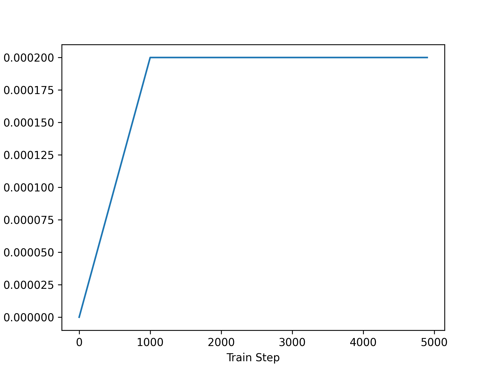
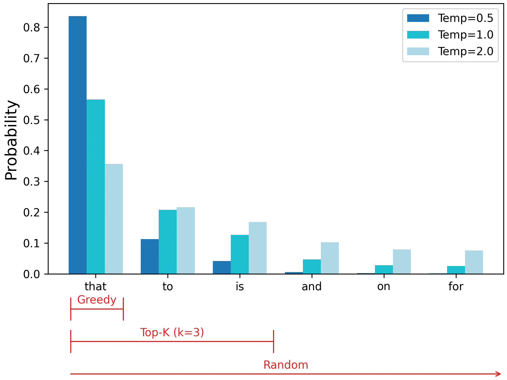
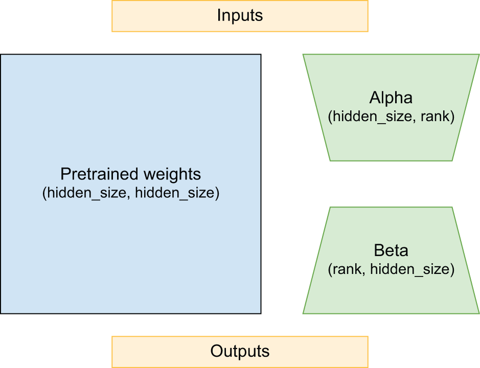
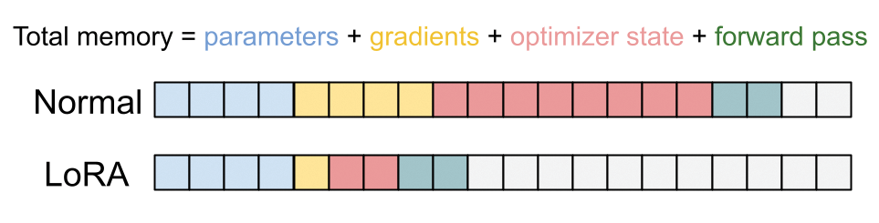
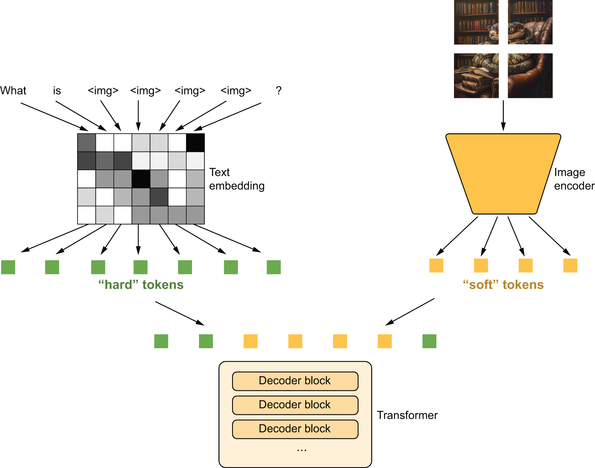
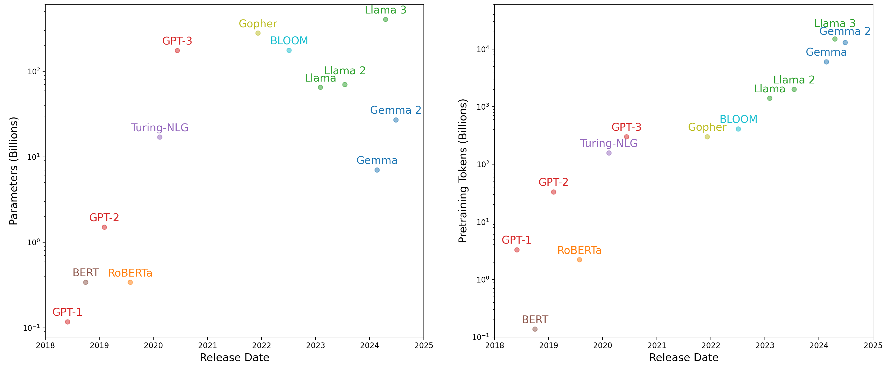

<!-- tabs:start -->

#### **Tiếng Anh (English)**

# Chapter 16: Text generation

This chapter covers

* A brief history of generative modeling
* Training a miniature GPT model from scratch
* Using a pretrained Transformer model to build a chatbot
* Building a multimodal model that can describe images in natural language

When I first claimed that in a not-so-distant future, most of the cultural
content we consume would be created with substantial help from AIs, I was met
with utter disbelief, even from long-time machine learning practitioners. That
was in 2014. Fast-forward a decade, and that disbelief had receded at an
incredible speed. Generative AI tools are now common additions to word processors,
image editors, and development environments. Prestigious awards are going out
to literature and art created with generative models — to considerable
controversy and debate.[[1]](#footnote-1) It no longer
feels like science fiction to consider a world where AI and artistic endeavors
are often intertwined.

In any practical sense, AI is nowhere close to rivaling human screenwriters,
painters, or composers. But replacing humans need not, and should not, be the point.
In many fields, but especially in creative ones, people will use AI to augment
their capabilities — more augmented intelligence than artificial intelligence.

Much of artistic creation consists of pattern recognition and technical
skill. Our perceptual modalities, language, and artwork all have statistical
structure, and deep learning models excel at learning this structure.
Machine learning models can learn the statistical latent spaces of images, music,
and stories, and they can then sample from these spaces, creating new artworks
with characteristics similar to those the model has seen in its training data.
Such sampling is hardly an act of artistic creation in itself — it’s a mere
mathematical operation. Only our interpretation, as human spectators, gives
meaning to what the model generates. But in the hands of a skilled artist,
algorithmic generation can be steered to become meaningful — and beautiful.
Latent space sampling can become a brush that empowers the artist, augments our
creative affordances, and expands the space of what we can imagine.
It can even make artistic creation more accessible by eliminating the need
for technical skill and practice — setting up a new medium of pure expression,
factoring art apart from craft.


[Figure 16.1](#figure-16-1): An image generated with the generative image software Midjourney. The prompt was “A hand-drawn, sci-fi landscape of residents living in a building shaped like a red letter K.”

Iannis Xenakis, a visionary pioneer of electronic and algorithmic music,
beautifully expressed this same idea in the 1960s, in the context of the
application of automation technology to music
composition:[[2]](#footnote-2)

> Freed from tedious calculations, the composer is able to devote himself to the
> general problems that the new musical form poses and to explore the nooks and
> crannies of this form while modifying the values of the input data. For
> example, he may test all instrumental combinations from soloists to chamber
> orchestras, to large orchestras. With the aid of electronic computers the
> composer becomes a sort of pilot: he presses the buttons, introduces
> coordinates, and supervises the controls of a cosmic vessel sailing in the
> space of sound, across sonic constellations and galaxies that he could
> formerly glimpse only as a distant dream.

The potential for generative AI extends well beyond artistic endeavors. In
many professions, people create content where pattern recognition is even
more apparent: think of summarizing large documents, transcribing speech,
editing for typos, or flagging common mistakes in code. These rote tasks play
directly to the strengths of deep learning approaches. There is a lot to
consider regarding how we choose to deploy AI in the workplace — with real
societal implications.

In the following two chapters, we will explore the potential of deep learning to
assist with creation. We will learn to curate latent spaces in text and image
domains and pull new content from these spaces. We will start with text, scaling
up the idea of a language model we first worked with in the last chapter. These
*large language models*, or *LLMs* for short, are behind digital assistants
like ChatGPT and a quickly growing list of real-world applications.

## A brief history of sequence generation

Until quite recently, the idea of generating sequences from a model was
a niche subtopic within machine learning — generative recurrent
networks only began to hit the mainstream in 2016. However, these
techniques have a fairly long history, starting with the development of the LSTM
algorithm in 1997.

In 2002, Douglas Eck applied LSTM to music generation for the first time, with
promising results. Eck became a researcher at Google Brain, and in 2016, he
started a new research group called Magenta, which focused on applying modern
deep learning techniques to produce engaging music. Sometimes, good ideas take
15 years to get started.

In the late 2000s and early 2010s, Alex Graves pioneered the use of recurrent
networks for new types of sequence data generation. In particular, some see his
2013 work on applying recurrent mixture density networks to generate human-like
handwriting using timeseries of pen positions as a turning point. Graves left a
commented-out remark hidden in a 2013 LaTeX file uploaded to the preprint server
arXiv: “Generating sequential data is the closest computers get to dreaming.”
This work and the notion of machines that dream were significant inspirations
when I started developing Keras.

In 2018, a year after the “Attention Is All You Need” paper we discussed in the last chapter, a group of
researchers at an organization called OpenAI put out a new paper “Improving
Language Understanding by Generative Pre-Training.”[[3]](#footnote-3)
They combined a few ingredients:

* Unsupervised pretraining of a language model — essentially training a model
  to “guess the next token” in a sequence, as we did with our Shakespeare generator in
  chapter 15
* The Transformer architecture
* Textual data on various topics via thousands of self-published books

The authors showed that such a pretrained model could be fine-tuned to achieve
state-of-the-art performance on a wide array of text classification tasks —
from gauging the similarity of two sentences to answering a multiple-choice
question. They called the pretrained model *GPT*, short for Generative
Pretrained Transformer.

GPT didn’t come with any modeling or training advancements. What was interesting
about the results was that such a general training setup could beat out more
involved techniques across a number of tasks. There was no complex text
normalization, no need to customize the model architecture or training data per
benchmark, just a lot of pretraining data and compute.

In the following years, OpenAI set about scaling this idea with a single-minded
focus. The model architecture changed only slightly. Over four years, OpenAI
released three versions of GPT, scaling up as follows:

* Released in 2018, GPT-1 had 117 million parameters and was trained on 1
  billion tokens.
* Released in 2019, GPT-2 had 1.5 billion parameters and was trained on more
  than 10 billion tokens.
* Released in 2020, GPT-3 had 175 billion parameters and was trained on
  somewhere around half a trillion tokens.

The language modeling setup enabled each of these models to generate text, and
the developers at OpenAI noticed that with each leap in scale, the quality of
this generative output shot up substantially.

With GPT-1, the model’s generative capabilities were mostly a by-product of its
pretraining and not the primary focus. They evaluated the model by fine-tuning
it with an extra dense layer for classification, as we did with RoBERTa in the
last chapter.

With GPT-2, the authors noticed that you could prompt the model with a few
examples of a task and generate quality output without any fine-tuning. For
instance, you could prompt the model with the following to receive a French
translation of the word cheese:

```python
Translate English to French:

sea otter => loutre de mer
peppermint => menthe poivrée
plush giraffe => peluche girafe
cheese =>
```

This type of setup is called *few-shot learning*, where you attempt to teach a
model a new problem with only a handful of supervised examples — too few for
standard gradient descent.

With GPT-3, examples weren’t always necessary. You could prompt the model with a
simple text description of the problem and the input and often get quality results:

```python
Translate English to French:

cheese =>
```

GPT-3 was still plagued by fundamental issues that have yet to be solved. LLMs
“hallucinate” often — their output can veer from accurate to completely false
with zero indication. They’re extremely sensitive to prompt phrasing, with
seemingly minor prompt rewording triggering large jumps up or down in
performance. And they cannot adapt to problems that weren’t extensively featured
in their training data.

However, the generative output from GPT-3 was good enough that the model became
the basis for ChatGPT — the first widespread, consumer-facing generative model.
In the months and years since, ChatGPT has sparked a deluge of investment and
interest in building LLMs and finding new use cases for them. In the next
section, we will make a miniature GPT model of our own to better understand how
such a model works, what it can do, and where it fails.

## Training a mini-GPT

To begin pretraining our mini-GPT, we will need a lot of text data. GPT-1 used a
dataset called BooksCorpus, which contained a number of free, self-published
books added to the dataset without the explicit permission of the authors. The
dataset has since been taken down by its publishers.

We will use a more recent pretraining dataset called the “Colossal Clean Crawled
Corpus” (C4), released by Google in 2020. At 750 GB, it’s far bigger than we
could reasonably train on for a book example, so we will use less than 1%
of the overall corpus.

Let’s start by downloading and extracting our data:

```python
import keras
import pathlib

extract_dir = keras.utils.get_file(
    fname="mini-c4",
    origin=(
        "https://hf.co/datasets/mattdangerw/mini-c4/resolve/main/mini-c4.zip"
    ),
    extract=True,
)
extract_dir = pathlib.Path(extract_dir) / "mini-c4"
```

[Listing 16.1](#listing-16-1): Downloading a portion of the C4 dataset


Running the code in this chapter

Generative language models are big and take a lot of compute to run. While we’ve
taken pains to make the code in this chapter accessible, this is still the most
compute-intensive chapter in this book.

If you’d like, you can run everything on the free Colab GPU runtime (a T4 GPU as
of this writing), but be prepared to wait! This mini-GPT example will take about
6 hours to train, and you will need to restart your Colab runtime in the middle
of the notebook to free up GPU memory before loading a larger pretrained model.
A larger GPU will make quicker work of these examples; we developed this example
on an A100, which can run this chapter’s code end-to-end in a little over an
hour.

You can always read through the expensive `fit()` calls and edit down the number
of training steps for quick experimentation. And if you are running this a few
years down the line, there is a good chance these examples are mere child’s play
to modern hardware!

We have 50 shards of text data, each with about 75 MB of raw text. Each
line contains a document in the crawl with newlines escaped. Let’s look at a
document in our first shard:

```python
>>> with open(extract_dir / "shard0.txt", "r") as f:
>>>     print(f.readline().replace("\\n", "\n")[:100])
Beginners BBQ Class Taking Place in Missoula!
Do you want to get better at making delicious BBQ? You
```

We will need to preprocess a lot of data to run pretraining for an LLM, even a
miniature one like the one we are training. Using a fast tokenization routine to
preprocess our source documents into integer tokens can simplify our lives.

We will use SentencePiece, a library for subword tokenization of text data. The
actual tokenization technique is the same as the byte-pair encoding tokenization
we built ourselves in chapter 14, but the library is written in C++ for speed
and adds a `detokenize()` function that will reverse integers to strings and
join them together. We will use a premade vocabulary with 32,000 vocabulary
terms stored in a particular format needed by the SentencePiece library.

As in the last chapter, we can use the KerasHub library to access some extra
functions for working with large language models. KerasHub wraps the
SentencePiece library as a Keras layer. Let’s try it out.

```python
import keras_hub
import numpy as np

vocabulary_file = keras.utils.get_file(
    origin="https://hf.co/mattdangerw/spiece/resolve/main/vocabulary.proto",
)
tokenizer = keras_hub.tokenizers.SentencePieceTokenizer(vocabulary_file)
```

[Listing 16.2](#listing-16-2): Downloading a SentencePiece vocabulary and instantiating a tokenizer

We can use this tokenizer to map from text to int sequences bidirectionally:

```python
>>> tokenizer.tokenize("The quick brown fox.")
array([  450,  4996, 17354,  1701, 29916, 29889], dtype=int32)
>>> tokenizer.detokenize([450, 4996, 17354, 1701, 29916, 29889])
"The quick brown fox."
```

Let’s use this layer to tokenize our input text and then use `tf.data` to window
our input into sequences of length 256.

When training GPT, the developers chose to keep things simple and make no
attempt to keep document boundaries from occurring in the middle of a sample.
Instead, they marked a document boundary with a special `<|endoftext|>` token.
We will do the same here. Once again, we will use `tf.data` for the input data
pipeline and train with any backend.

We will load each file shard individually and interleave the output data into a
single dataset. This keeps our data loading fast, and we don’t need to worry
about text lining up across sample boundaries — each is independent. With
interleaving, each processor on our CPU can read and tokenize a separate file
simultaneously.

```python
import tensorflow as tf

batch_size = 64
sequence_length = 256
suffix = np.array([tokenizer.token_to_id("<|endoftext|>")])

def read_file(filename):
    ds = tf.data.TextLineDataset(filename)
    # Restores newlines
    ds = ds.map(lambda x: tf.strings.regex_replace(x, r"\\n", "\n"))
    # Tokenizes data
    ds = ds.map(tokenizer, num_parallel_calls=8)
    # Adds the <|endoftext|> token
    return ds.map(lambda x: tf.concat([x, suffix], -1))

files = [str(file) for file in extract_dir.glob("*.txt")]
ds = tf.data.Dataset.from_tensor_slices(files)
# Combines our file shards into a single dataset
ds = ds.interleave(read_file, cycle_length=32, num_parallel_calls=32)
# Windows tokens into even samples of 256 tokens
ds = ds.rebatch(sequence_length + 1, drop_remainder=True)
# Splits labels, offset by one
ds = ds.map(lambda x: (x[:-1], x[1:]))
ds = ds.batch(batch_size).prefetch(8)
```

[Listing 16.3](#listing-16-3): Preprocessing text input for Transformer pretraining

As we first did in chapter 8, we will end our `tf.data` pipeline with a call to
`prefetch()`. This will make sure we always have some batches loaded onto our
GPU and ready for the model.

We have 58,746 batches. You could count this yourself if you would like — the
line `ds.reduce(0, lambda c, _: c + 1)` will iterate over the entire dataset and
increment a counter. But simply tokenizing a dataset of this size will take a
few minutes on a decently fast CPU.

At 64 samples per batch and 256 tokens per sample, this is just under a billion
tokens of data. Let’s split off 500 batches as a quick validation set, and we
are ready to start pretraining:

```python
num_batches = 58746
num_val_batches = 500
num_train_batches = num_batches - num_val_batches
val_ds = ds.take(num_val_batches).repeat()
train_ds = ds.skip(num_val_batches).repeat()
```

### Building the model

The original GPT model simplifies the sequence-to-sequence Transformer we saw in
the last chapter. Rather than take in a source and target sequence with an
encoder and decoder, as we did for our translation model, the GPT approach does
away with the encoder entirely and only uses the decoder. This means that
information can only travel from left to right in a sequence.

This was an interesting bet on the part of the GPT developers. A decoder-only model
can still handle sequence-to-sequence problems like question-answering. However,
rather than feeding in the question and answer as separate inputs, we must
combine both into a single sequence to feed it to our model. So, unlike the
original Transformer, the question tokens would not be handled any differently
than answer tokens. All tokens are embedded into the same latent space with the
same set of parameters.

The other consequence of this approach is that the information flow is no longer
bidirectional, even for input sequences. Given an input, such as “Where is the
capital of France?”, the learned representation of the word “Where” cannot
attend to the words “capital” and “France” in the attention layer. This limits
the expressivity of the model but has a massive advantage in terms of simplicity
of pretraining. We don’t need to curate datasets with pairs of inputs and
outputs; everything can be a single sequence. We can train on any text we can
find on the internet at a massive scale.

Let’s copy the `TransformerDecoder` from chapter 15 but remove the
cross-attention layer, which allowed the decoder to attend to the encoder
sequence. We will also make one minor change, adding dropout after the attention
and feedforward blocks. In chapter 15, we only used a single Transformer layer
in our encoder and decoder, so we could get away with only using a single
dropout layer at the end of our entire model. For our GPT model, we will stack
quite a few layers, so adding dropout within each decoder layer is important to
prevent overfitting.

```python
from keras import layers

class TransformerDecoder(keras.Layer):
    def __init__(self, hidden_dim, intermediate_dim, num_heads):
        super().__init__()
        key_dim = hidden_dim // num_heads
        # Self-attention layers
        self.self_attention = layers.MultiHeadAttention(
            num_heads, key_dim, dropout=0.1
        )
        self.self_attention_layernorm = layers.LayerNormalization()
        # Feedforward layers
        self.feed_forward_1 = layers.Dense(intermediate_dim, activation="relu")
        self.feed_forward_2 = layers.Dense(hidden_dim)
        self.feed_forward_layernorm = layers.LayerNormalization()
        self.dropout = layers.Dropout(0.1)

    def call(self, inputs):
        # Self-attention computation
        residual = x = inputs
        x = self.self_attention(query=x, key=x, value=x, use_causal_mask=True)
        x = self.dropout(x)
        x = x + residual
        x = self.self_attention_layernorm(x)
        # Feedforward computation
        residual = x
        x = self.feed_forward_1(x)
        x = self.feed_forward_2(x)
        x = self.dropout(x)
        x = x + residual
        x = self.feed_forward_layernorm(x)
        return x
```

[Listing 16.4](#listing-16-4): A Transformer decoder block without cross-attention

Next, we can copy the `PositionalEmbedding` layer from chapter 15. Recall that
this layer gives us a simple way to learn an embedding for each position in a
sequence and combine that with our token embeddings.

There’s a neat trick we can employ here to save some GPU memory. The biggest
weights in a Transformer model are the input token embeddings and output dense
prediction layer because they deal with our vocabulary space. The token
embedding weight has shape `(vocab_size, hidden_dim)` to embed every possible
token. Our output projection has shape `(hidden_dim, vocab_size)` to make a
floating-point prediction for every possible token.

We can actually tie these two weight matrices together. To compute our model’s
final predictions, we will multiply our hidden states by the transpose of our
token embedding matrix. You can very much think of our final projection as a
“reverse embedding.” It maps from hidden space to token space, whereas an
embedding maps from token space to hidden space. It turns out that using the
same weights for this input and output projection is a good idea.

Adding this to our `PositionalEmbedding` is simple; we will just add a `reverse`
argument to the `call` method, which computes the projection by the transpose of the token
embedding.

```python
from keras import ops

class PositionalEmbedding(keras.Layer):
    def __init__(self, sequence_length, input_dim, output_dim):
        super().__init__()
        self.token_embeddings = layers.Embedding(input_dim, output_dim)
        self.position_embeddings = layers.Embedding(sequence_length, output_dim)

    def call(self, inputs, reverse=False):
        if reverse:
            token_embeddings = self.token_embeddings.embeddings
            return ops.matmul(inputs, ops.transpose(token_embeddings))
        positions = ops.cumsum(ops.ones_like(inputs), axis=-1) - 1
        embedded_tokens = self.token_embeddings(inputs)
        embedded_positions = self.position_embeddings(positions)
        return embedded_tokens + embedded_positions
```

[Listing 16.5](#listing-16-5): A positional embedding layer that can reverse a text embedding

Let’s build our model. We will stack eight decoder layers into a single “mini”
GPT model.

We will also turn on a Keras setting called *mixed precision* to speed up
training. This will allow Keras to run some of the model’s computations much
faster by sacrificing some numerical fidelity. For now, this will remain a
little mysterious, but a full explanation is waiting in chapter 18.

```python
# Enables mixed precision (see chapter 18)
keras.config.set_dtype_policy("mixed_float16")

vocab_size = tokenizer.vocabulary_size()
hidden_dim = 512
intermediate_dim = 2056
num_heads = 8
num_layers = 8

inputs = keras.Input(shape=(None,), dtype="int32", name="inputs")
embedding = PositionalEmbedding(sequence_length, vocab_size, hidden_dim)
x = embedding(inputs)
x = layers.LayerNormalization()(x)
for i in range(num_layers):
    x = TransformerDecoder(hidden_dim, intermediate_dim, num_heads)(x)
outputs = embedding(x, reverse=True)
mini_gpt = keras.Model(inputs, outputs)
```

[Listing 16.6](#listing-16-6): Creating a mini-GPT functional model

This model has 41 million parameters, which is large for models in this book but
quite small compared to most LLMs today, which range from a couple of billion to
trillions of parameters.

### Pretraining the model

Training a large Transformer is famously finicky — the model is sensitive to
initializations of parameters and choice of optimizer. When many Transformer
layers are stacked, it is easy to suffer from exploding gradients, where
parameters update too quickly and our loss function does not converge. A trick
that works well is to linearly ease into a full learning rate over a number of
warmup steps, so our initial updates to our model parameters are small. This is
easy to implement in Keras with a `LearningRateSchedule`.

```python
class WarmupSchedule(keras.optimizers.schedules.LearningRateSchedule):
    def __init__(self):
        # Peak learning rate
        self.rate = 2e-4
        self.warmup_steps = 1_000.0

    def __call__(self, step):
        step = ops.cast(step, dtype="float32")
        scale = ops.minimum(step / self.warmup_steps, 1.0)
        return self.rate * scale
```

[Listing 16.7](#listing-16-7): Defining a custom learning rate schedule

We can plot our learning rate over time to make sure it is what we expect (figure 16.2):

```python
import matplotlib.pyplot as plt

schedule = WarmupSchedule()
x = range(0, 5_000, 100)
y = [ops.convert_to_numpy(schedule(step)) for step in x]
plt.plot(x, y)
plt.xlabel("Train Step")
plt.ylabel("Learning Rate")
plt.show()
```





[Figure 16.2](#figure-16-2): Warmup makes our updates to model parameters smaller at the beginning of training and can help with stability.

We will train our model using one pass over our 1 billion tokens, split across
eight epochs so we can occasionally check our validation set loss and accuracy.

We are training a miniature version of GPT, using 3× fewer parameters
than GPT-1 and 100× fewer overall training steps. But despite this being two
orders of magnitude cheaper to train than the smallest GPT model, this call to
`fit()` will be the most computationally expensive training run in the entire
book. If you are running the code as you read, set things off and take a
breather!

```python
num_epochs = 8
# Set these to a lower value if you don't want to wait for training.
steps_per_epoch = num_train_batches // num_epochs
validation_steps = num_val_batches

mini_gpt.compile(
    optimizer=keras.optimizers.Adam(schedule),
    loss=keras.losses.SparseCategoricalCrossentropy(from_logits=True),
    metrics=["accuracy"],
)
mini_gpt.fit(
    train_ds,
    validation_data=val_ds,
    epochs=num_epochs,
    steps_per_epoch=steps_per_epoch,
    validation_steps=validation_steps,
)
```

[Listing 16.8](#listing-16-8): Training the mini-GPT model


What is a logit?

As we compile our model, you will notice a new value for the loss
`SparseCategoricalCrossentropy(from_logits=True)`. What is a logit?

The output projection at the end of our transformer model does not contain the
usual `softmax` activation. You can think of this output as a bunch of
“unnormalized log probabilities” for each token. If you exponentiate each output
value and normalize all values to sum to 1 (this is all the `softmax` function
does), you will get a probability value. A common term for an “unnormalized log
probability” is a *logit*, and logits can be easier to work with when
generating text, as we will see in the next section.

Keras gives you a choice of where to apply the `softmax` function. For
classification problems, you can either use a `softmax` as the last activation of
the model and output probabilities or move the `softmax` into the loss function
and output logits. To do the latter, you should pass
`SparseCategoricalCrossentropy(from_logits=True)` as a classification loss.

After training, our model can predict the next token in a sequence about 36% of
the time on our validation set, though such a metric is just a crude heuristic.

Note that our model is undertrained. Our validation loss will continue to tick
down after each epoch, which is unsurprising given that we used a hundred times
fewer training steps than GPT-1. Training for longer would be a great idea, but we
would need both time and money to pay for compute.

Let’s play around with our mini-GPT model.

### Generative decoding

To sample some output from our model, we can follow the approach we used to
generate Shakespeare or Spanish translations in chapter 15. We feed a prompt of
fixed tokens into the model. For each position in the input sequence, the model
outputs a probability distribution over the entire vocabulary for the next
token. By selecting the most likely next token at the last location, adding it
to our sequence, and then repeating this process, we are able to generate a new
sequence, one token at a time.

```python
def generate(prompt, max_length=64):
    tokens = list(ops.convert_to_numpy(tokenizer(prompt)))
    prompt_length = len(tokens)
    for _ in range(max_length - prompt_length):
        prediction = mini_gpt(ops.convert_to_numpy([tokens]))
        prediction = ops.convert_to_numpy(prediction[0, -1])
        tokens.append(np.argmax(prediction).item())
    return tokenizer.detokenize(tokens)
```

[Listing 16.9](#listing-16-9): A simple generation function for the mini-GPT model

Let’s try this out with a text prompt:

```python
>>> prompt = "A piece of advice"
>>> generate(prompt)
A piece of advice, and the best way to get a feel for yourself is to get a sense
of what you are doing.
If you are a business owner, you can get a sense of what you are doing. You can
get a sense of what you are doing, and you can get a sense of what
```

The first thing you will notice when running this is that it takes minutes to
complete. That’s a bit puzzling. We predicted about 200,000 tokens a second on
our reference hardware during training. The generative loop may add time, but a
minute delay is much too slow. What happened?
The biggest reason for our slowness, at least on the Jax and TensorFlow
backends, is that we are running an uncompiled computation.

Every time you run `fit()` or `predict()`, Keras compiles the computation that
runs on each batch of data. All the `keras.ops` used will be lifted out of
Python and heavily optimized by the backend framework. It’s slow for one batch
but massively faster for each subsequent call. However, when we directly call
the model as we did previously, the backend framework will need to run the forward
pass live and unoptimized at each step.

The easy solution here is to lean on `predict()`. With `predict()`, Keras will
handle compilation for us, but there is one important gotcha to watch out for.
When TensorFlow or Jax compiles a function, it will do so for a specific input
shape. With a known shape, the backend can optimize for particular hardware,
knowing exactly how many individual processor instructions make up a tensor
operation. But in our generation function, we call our model with a sequence
that changes shape after each prediction. This would trigger recompilation each
time we call `predict()`.

Instead, we can avoid recompiling the `predict()` function if we pad our input
so that our sequence is always the same length. Let’s try that out.

```python
def compiled_generate(prompt, max_length=64):
    tokens = list(ops.convert_to_numpy(tokenizer(prompt)))
    prompt_length = len(tokens)
    # Pads tokens to the full sequence length
    tokens = tokens + [0] * (max_length - prompt_length)
    for i in range(prompt_length, max_length):
        prediction = mini_gpt.predict(np.array([tokens]), verbose=0)
        prediction = prediction[0, i - 1]
        tokens[i] = np.argmax(prediction).item()
    return tokenizer.detokenize(tokens)
```

[Listing 16.10](#listing-16-10): A compiled generation function for the mini-GPT model

Let’s see how fast this new function is:

```python
>>> import timeit
>>> tries = 10
>>> timeit.timeit(lambda: compiled_generate(prompt), number=tries) / tries
0.4866470648999893
```

Our generation call went from minutes to less than a second with compilation.
That is quite an improvement.

Cached generation

There’s still one more major inefficiency in the generation function we just
built. Can you spot it?

Each time we call our model, we call it for an *entire sequence* and then throw
away everything but the predictions for a single position. This is wasteful
— our sequence only changes by a single token between generation steps. When we
did generation with an RNN in chapter 15, we could keep around our RNN state
and only compute outputs for a single token at each step. This state vector
contained all the information the model needed about the past sequence.
Transformers that use a causal attention, like GPT, actually have a similar
notion of state.

If we think through the entire model we just built, you’ll note that attention
is the *only* place the model passes information from position to position.
The feedforward blocks of a transformer only modify the hidden representation of
each token position in isolation.

Inside attention, we incorporate information about past tokens through the `key`
and `value` vectors. For a given `query` at a position, we compute attention
scores by dotting the `query` with all previous `key` vectors and combining all
previous `value` vectors. These `key` and `value` vectors never change for past
tokens in the sequence — past input is fixed, and the causal mask prevents the
Transformer from “looking ahead” to future tokens. So if we cache all `key` and
`value` vectors, at each layer of the Transformer, we have the equivalent of an
RNN’s state. We can use it to compute Transformer outputs for a single position
at a time.

Implementing this is a bit clunky, as it involves saving and reusing
intermediate arrays from every attention layer in the Transformer, but it’s
important. Your model inputs can go from being as long as the maximum length of
your output to being a single token in length. If you are generating a sequence
that is thousands of tokens long, caching can amount to a thousandfold speedup!
Any efficient implementation of generative sampling will include `key` and
`value` caching.

### Sampling strategies

Another obvious problem with our generative output is that our model often
repeats itself. On our particular training run, the model repeats the group of
words “get a sense of what you are doing” over and over.

This isn’t so much a bug as it’s a direct consequence of our training
objective. Our model is trying to predict the most likely next token in a
sequence across about a billion words on many, many topics. If there’s no
obvious choice for where a sequence of text should head next, an effective
strategy is to guess common words or repeated patterns of words. Unsurprisingly,
our model learns to do this during training almost immediately. If you were to
stop training our model very early on, it would likely generate the word `"the"`
incessantly, as `"the"` is the most common word in the English language.

During our generative loop, we have always chosen the most likely predicted
token in our model’s output. But our output is not just a single predicted
toke; it is a probability distribution across all 32,000 tokens in our
vocabulary.

Using the most likely output at each generation step is called *greedy search*.
It’s the most straightforward approach to using model predictions, but it is
hardly the only one. If we instead add some randomness to the process, we can
explore the probability distribution learned by the model more broadly. This can
keep us from getting stuck in loops of high-probability token sequences.

Let’s try this out. We can start by refactoring our generation function so that
we can pass a function that maps from a model’s predictions to a choice for the
next token. We will call this our *sampling strategy*:

```python
def compiled_generate(prompt, sample_fn, max_length=64):
    tokens = list(ops.convert_to_numpy(tokenizer(prompt)))
    prompt_length = len(tokens)
    tokens = tokens + [0] * (max_length - prompt_length)
    for i in range(prompt_length, max_length):
        prediction = mini_gpt.predict(np.array([tokens]), verbose=0)
        prediction = prediction[0, i - 1]
        next_token = ops.convert_to_numpy(sample_fn(prediction))
        tokens[i] = np.array(next_token).item()
    return tokenizer.detokenize(tokens)
```

Now we can write our greedy search as a simple function we pass to
`compiled_generate()`:

```python
def greedy_search(preds):
    return ops.argmax(preds)

compiled_generate(prompt, greedy_search)
```

The Transformer outputs define a categorical distribution where each token has
a certain probability of being output at each time step. Instead of just
choosing the most likely token, we could sample this distribution directly.
`keras.random.categorical()` will pass our predictions through a softmax
function to get a probability distribution and then randomly sample it. Let’s
try it out:

```python
def random_sample(preds, temperature=1.0):
    preds = preds / temperature
    return keras.random.categorical(preds[None, :], num_samples=1)[0]
```


```python
>>> compiled_generate(prompt, random_sample)
A piece of advice, just read my knees and stick with getables and a hello to me.
However, the bar napkin doesn't last as long. I happen to be waking up close and
pull it up as I wanted too and I still get it, really, shouldn't be a reaction
```

Our outputs are more diverse, and the model no longer gets stuck in loops. But
our sampling is now exploring too much; the output jumps around wildly without
any continuity.

You’ll notice we added a parameter called `temperature`. We can use this
to sharpen or widen our probability distribution so our sampling explores our
distribution less or more.

If we pass a low temperature, we will make all logits larger before the softmax
function, which makes our most likely output even more likely. If we pass a high
temperature, our logits will be smaller before the softmax, and our probability
distribution will be more spread out. Let’s try this out a few times to see how this
affects our sampling:

```python
>>> from functools import partial
>>> compiled_generate(prompt, partial(random_sample, temperature=2.0))
A piece of advice tran writes using ignore unnecessary pivot - come without
introdu accounts indicugelâ per\u3000divuren sendSolisżsilen om transparent
Gill Guide pover integer song arrays coding\u3000LIST**…Allow index criteria
Draw Reference Ex artifactincluding lib tak Br basunker increases entirelytembre
AnyкаTextView cardinal spiritual heavenToen
>>> compiled_generate(prompt, partial(random_sample, temperature=0.8))
A piece of advice I wrote about the same thing today. I have been a writer for
two years now. I am writing this blog and I just wrote about it. I am writing
this blog and it was really interesting. I have been writing about the book and
I have read many things about my life.
The
>>> compiled_generate(prompt, partial(random_sample, temperature=0.2))
A piece of advice, and a lot of people are saying that they have to be careful
about the way they think about it.
I think it's a good idea to have a good understanding of the way you think about
it.
I think it's a good idea to have a good understanding of the
```

At a high temperature, our outputs no longer resemble English, settling on
seemingly random tokens. At a low temperature, our model behavior starts to
resemble greedy search, repeating certain patterns of text over and over.

Another popular technique for shaping our distribution is restricting our sampling
to a set of the most likely tokens. This is called *top-k sampling*, where K is
the number of candidates you should explore. Figure 16.3 shows how top-k
sampling strikes a middle ground between greedy and random approaches.




[Figure 16.3](#figure-16-3): Greedy, top-k, and random sampling strategies shown on the same probability distribution

Let’s try this out in code. We can use `keras.ops.top_k` to find the top K
elements of an array:

```python
def top_k(preds, k=5, temperature=1.0):
    preds = preds / temperature
    top_preds, top_indices = ops.top_k(preds, k=k, sorted=False)
    choice = keras.random.categorical(top_preds[None, :], num_samples=1)[0]
    return ops.take_along_axis(top_indices, choice, axis=-1)
```

We can try a few different variations of top-k to see how it affects sampling:

```python
>>> compiled_generate(prompt, partial(top_k, k=5))
A piece of advice that I can't help it. I'm not going to be able to do anything
for a few months, but I'm trying to get a little better. It's a little too much.
I have a few other questions on this site, but I'm sure I
>>> compiled_generate(prompt, partial(top_k, k=20))
A piece of advice and guidance from the Audi Bank in 2015. With all the above,
it's not just a bad idea, but it's very good to see that is going to be a great
year for you in 2017.
That's really going to
```

Passing a top-k cutoff is different than temperature sampling. Passing a low
temperature makes likely tokens more likely, but it does not rule any token out.
top-k sampling zeros out the probability of anything outside the K candidates.
You can combine the two, for example, sampling the top five candidates with a
temperature of 0.5:

```python
>>> compiled_generate(prompt, partial(top_k, k=5, temperature=0.5))
A piece of advice that you can use to get rid of the problem.
The first thing you need to do is to get the job done. It is important that you
have a plan that will help you get rid of it.
The first thing you need to do is to get rid of the problem yourself.
```

A sampling strategy is an important control when generating text, and there are
many more approaches. For example, beam search is a technique that heuristically
explores multiple chains of predicted tokens by keeping a fixed number of
“beams” (different chains of predicted tokens) to explore at each timestep.

With top-k sampling, our model generates something closer to plausible English
text, but there is little apparent utility to such output. This fits with the
results of GPT-1. For the initial GPT paper, the generated output was more of a
curiosity, and state-of-the-art results were only achieved by fine-tuning
classification models. Our mini-GPT is far less trained than GPT-1.

To reach the scale of generative LLMs today, we’d need to increase our parameter
count by at least 100× and our train step count by at least 1,000×. If we did, we
would see the same leaps in quality observed by OpenAI with GPT. And we could do
it! The training recipe we used previously is the exact blueprint used by everyone
training LLMs today. The only missing pieces are a very large compute budget and
some tricks for training across multiple machines that we will cover in chapter
18.

For a more practical approach, we will transition to using a pretrained model.
This will allow us to explore the behavior of an LLM at today’s scale.

## Using a pretrained LLM

Now that we’ve trained a mini-language model from scratch, let’s try using a
billion-parameter pretrained model and see what it can do. Given how
prohibitively expensive pretraining a Transformer can be, most of the industry
has centered around using pretrained models developed by a relatively short list
of companies. This is not purely a cost concern but also an environmental one
— generative model training is now making up a large percentage of the total data center
power consumption of large tech companies.

Meta published some environmental data on Llama 2, an LLM it published in
2023. It’s a good bit smaller than GPT-3, but it needed an estimated 1.3 million
kilowatt hours of electricity to train — the daily power usage of about 45,000
American households. If every organization using an LLM ran pretraining
themselves, the scale of energy use would be a noticeable percentage of global
energy consumption.

Let’s play around with a pretrained generative model from Google called Gemma.
We will use the third version of the Gemma model, which was released to the
public in 2025. To keep the examples in this book accessible, we will use the
smallest variation of Gemma available, which clocks in at almost exactly 1
billion parameters. This “small” model was trained on roughly 2 trillion tokens
of pretraining data — 2,000 times more tokens than the mini-GPT we just trained!

### Text generation with the Gemma model

To load this pretrained model, we can use KerasHub, as we have done in previous
chapters.

Accessing Gemma weights

If you are running the code for this chapter yourself, you will need to accept a
Terms of Use for the Gemma models before you can download the weights. The
model weights are stored on Kaggle, and we can use the `kagglehub` API to log in
as we did in chapter 8. Before we do, you will need to do two things:

1. Go to <https://www.kaggle.com/models/keras/gemma3>, and accept the Gemma Terms
   of Use at the top of the page.
2. Go to <https://www.kaggle.com/settings>, and generate a Kaggle API Key (if you
   did not already do this in chapter 8).

With that, we can use our API key to authenticate with Kaggle from our notebook:

```python
import kagglehub

kagglehub.login()
```

As LLMs become increasingly powerful, terms of service like this are becoming
more and more common. The Gemma terms of use prohibit using the model for
things like generating spam or hate speech.


```python
gemma_lm = keras_hub.models.CausalLM.from_preset(
    "gemma3_1b",
    dtype="float32",
)
```

[Listing 16.11](#listing-16-11): Instantiating a pretrained LLM with KerasHub

`CausalLM` is another example of the high-level task API, much like the
`ImageClassifier` and `ImageSegmenter` tasks we used earlier in the book. The
`CausalLM` task will combine a tokenizer and correctly initialized architecture
into a single Keras model. KerasHub will load the Gemma weights into a
correctly initialized architecture and load a matching tokenizer for the pretrained
weights.

Let’s take a look at the Gemma model summary:

```python
>>> gemma_lm.summary()
Preprocessor: "gemma3_causal_lm_preprocessor"
┏━━━━━━━━━━━━━━━━━━━━━━━━━━━━━━━━━━━━━━━━━━━━━━┳━━━━━━━━━━━━━━━━━━━━━━━━━━━━━━━┓
┃ Layer (type)                                 ┃                        Config ┃
┡━━━━━━━━━━━━━━━━━━━━━━━━━━━━━━━━━━━━━━━━━━━━━━╇━━━━━━━━━━━━━━━━━━━━━━━━━━━━━━━┩
│ gemma3_tokenizer (Gemma3Tokenizer)           │           Vocab size: 262,144 │
└──────────────────────────────────────────────┴───────────────────────────────┘
Model: "gemma3_causal_lm"
┏━━━━━━━━━━━━━━━━━━━━━━━┳━━━━━━━━━━━━━━━━━━━┳━━━━━━━━━━━━━┳━━━━━━━━━━━━━━━━━━━━┓
┃ Layer (type)          ┃ Output Shape      ┃     Param # ┃ Connected to       ┃
┡━━━━━━━━━━━━━━━━━━━━━━━╇━━━━━━━━━━━━━━━━━━━╇━━━━━━━━━━━━━╇━━━━━━━━━━━━━━━━━━━━┩
│ padding_mask          │ (None, None)      │           0 │ -                  │
│ (InputLayer)          │                   │             │                    │
├───────────────────────┼───────────────────┼─────────────┼────────────────────┤
│ token_ids             │ (None, None)      │           0 │ -                  │
│ (InputLayer)          │                   │             │                    │
├───────────────────────┼───────────────────┼─────────────┼────────────────────┤
│ gemma3_backbone       │ (None, None,      │ 999,885,952 │ padding_mask[0][0… │
│ (Gemma3Backbone)      │ 1152)             │             │ token_ids[0][0]    │
├───────────────────────┼───────────────────┼─────────────┼────────────────────┤
│ token_embedding       │ (None, None,      │ 301,989,888 │ gemma3_backbone[0… │
│ (ReversibleEmbedding) │ 262144)           │             │                    │
└───────────────────────┴───────────────────┴─────────────┴────────────────────┘
 Total params: 999,885,952 (3.72 GB)
 Trainable params: 999,885,952 (3.72 GB)
 Non-trainable params: 0 (0.00 B)
```

Rather than implementing a generation routine ourselves, we can simplify our
lives by using the `generate()` function that comes as part of the `CausalLM`
class. This `generate()` function can be compiled with different sampling
strategies, as we explored in the previous section:

```python
>>> gemma_lm.compile(sampler="greedy")
>>> gemma_lm.generate("A piece of advice", max_length=40)
A piece of advice from a former student of mine:

<blockquote>"I'm not sure if you've heard of it, but I've been told that the
best way to learn
>>> gemma_lm.generate("How can I make brownies?", max_length=40)
How can I make brownies?

[User 0001]

I'm trying to make brownies for my son's birthday party. I've never made
brownies before.
```

We can notice a few things right off the bat. First, the output is much more
coherent than our mini-GPT model. It would be hard to distinguish this text from
much of the training data in the C4 dataset. Second, the output is still not
that useful. The model will generate vaguely plausible text, but what you could
do with it is unclear.

As we saw with the mini-GPT example, this is not so much a bug as a consequence
of our pretraining objective. The Gemma model was trained with the same “guess
the next word” objective we used for mini-GPT, which means it’s effectively a
fancy autocomplete for the internet. It will just keep rattling off the most
probable word in its single sequence as if your prompt was a snippet of text
found in a random document on the web.

One way to change our output is to prompt the model with a longer input that
makes it obvious which type of output we are looking for. For example, if we
prompt the Gemma model with the beginning two sentences of a brownie recipe, we
get more helpful output:

```python
>>> gemma_lm.generate(
>>>     "The following brownie recipe is easy to make in just a few "
>>>     "steps.\n\nYou can start by",
>>>     max_length=40,
>>> )
The following brownie recipe is easy to make in just a few steps.

You can start by melting the butter and sugar in a saucepan over medium heat.

Then add the eggs and vanilla extract
```

Though it’s tempting when working with a model that can “talk” to imagine it
interpreting our prompt in some sort of human, conversational way, nothing of
the sort is going on here. We have just constructed a prompt for which an actual
brownie recipe is a more likely continuation than mimicking someone posting on a
forum asking for baking help.

You can go much further in constructing prompts. You might prompt a model with
some natural language instructions of the role it is supposed to fill, for
example, `"You are a large language model that gives short, helpful answers to
people's questions."` Or you might feed the model a prompt containing a long
list of harmful topics that should not be included in any generated responses.

If this all sounds a bit hand-wavy and hard to control, that’s a good
assessment. Attempting to visit different parts of a model’s distribution
through prompting is often useful, but predicting how a model will respond to a
given prompt is very difficult.

Another well-documented problem faced by LLMs is hallucinations. A model will
always say something — there is always a most-likely next token to a given
sequence. Finding locations in our LLM distribution that have
no grounding in actual fact is easy:

```python
>>> gemma_lm.generate(
>>>     "Tell me about the 542nd president of the United States.",
>>>     max_length=40,
>>> )
Tell me about the 542nd president of the United States.

The 542nd president of the United States was James A. Garfield.
```

Of course, this is utter nonsense, but the model could not find a more likely way
to complete this prompt.

Hallucinations and uncontrollable output are fundamental problems with language
models. If there is a silver bullet, we have yet to find it. However, one
approach that helps immensely is to further fine-tune a model with examples of
the specific types of generative outputs you would like.

In the specific case of wanting to build a chatbot that can follow
instructions, this type of training is called *instruction fine-tuning*. Let’s
try some instruction fine-tuning with Gemma to make it a lot more useful as a
conversation partner.

### Instruction fine-tuning

Instruction fine-tuning involves feeding the model input/output pairs — a user
instruction followed by a model response. We combine these into a single
sequence that becomes new training data for the model. To make it clear during
training when an instruction or response ends, we can add special markers like
`"[instruction]"` and `"[response]"` directly to the combined sequence. The
precise markup will not matter much as long as it is consistent.

We can use the combined sequence as regular training data, with the same “guess
the next word” loss we used to pretrain an LLM. By doing further training with
examples containing desired responses, we are essentially bending the model’s
output in the direction we want. We won’t be learning a latent space for
language here; that’s already been done over trillions of tokens of pretraining.
We are simply nudging the learned representation a bit to control the tone and
content of the output.

To begin, we will need a dataset of instruction-response pairs. Training
chatbots is a hot topic, so there are many datasets made specifically for this
purpose. We will use a dataset made public by the company Databricks. Employees
contributed to a dataset of 15,000 instructions and handwritten responses. Let’s
download it and join the data into a single sequence.

```python
import json

PROMPT_TEMPLATE = """"[instruction]\n{}[end]\n[response]\n"""
RESPONSE_TEMPLATE = """{}[end]"""

dataset_path = keras.utils.get_file(
    origin=(
        "https://hf.co/datasets/databricks/databricks-dolly-15k/"
        "resolve/main/databricks-dolly-15k.jsonl"
    ),
)
data = {"prompts": [], "responses": []}
with open(dataset_path) as file:
    for line in file:
        features = json.loads(line)
        if features["context"]:
            continue
        data["prompts"].append(PROMPT_TEMPLATE.format(features["instruction"]))
        data["responses"].append(RESPONSE_TEMPLATE.format(features["response"]))
```

[Listing 16.12](#listing-16-12): Loading an instruction fine-tuning dataset

Note that some examples have additional context — textual information related
to the instruction. To keep things simple for now, we will discard those
examples.

Let’s take a look at a single element in our dataset:

```python
>>> data["prompts"][0]
[instruction]
Which is a species of fish? Tope or Rope[end]
[response]

>>> data["responses"][0]
Tope[end]
```

Our prompt template gives our examples a predictable structure. Although Gemma is
not a sequence-to-sequence model like our English-to-Spanish translator, we can
still use it in a sequence-to-sequence setting by training on prompts like this
and only generating the output after the `"[response]"` marker.

Let’s make a `tf.data.Dataset` and split some validation data:

```python
ds = tf.data.Dataset.from_tensor_slices(data).shuffle(2000).batch(2)
val_ds = ds.take(100)
train_ds = ds.skip(100)
```

The `CausalLM` we loaded from the KerasHub library is a high-level object
for end-to-end causal language modeling. It wraps two objects: a `preprocessor`
layer, which preprocesses text input, and a `backbone` model, which contains the
numerics of the model forward pass.

Preprocessing is included by default in high-level Keras functions like `fit()`
and `predict()`. But let’s run our preprocessing on a single batch so we can
better see what it is doing:

```python
>>> preprocessor = gemma_lm.preprocessor
>>> preprocessor.sequence_length = 512
>>> batch = next(iter(train_ds))
>>> x, y, sample_weight = preprocessor(batch)
>>> x["token_ids"].shape
(2, 512)
>>> x["padding_mask"].shape
(2, 512)
>>> y.shape
(2, 512)
>>> sample_weight.shape
(2, 512)
```

The preprocessor layer will pad all inputs to a fixed length and compute a
padding mask to track which token ID inputs are just padded zeros. The
`sample_weight` tensor allows us to only compute a loss value for our response
tokens. We don’t really care about the loss for the user prompt; it is fixed,
and we definitely don’t want to compute the loss for the zero padding we just
added.

If we print a snippet of our token IDs and labels, we can see that this is
the regular language model setup, where each label is the next token value:

```python
>>> x["token_ids"][0, :5], y[0, :5]
(Array([     2,  77074,  22768, 236842,    107], dtype=int32),
 Array([ 77074,  22768, 236842,    107,  24249], dtype=int32))
```

### Low-Rank Adaptation (LoRA)

If we ran `fit()` right now on a Colab GPU with 16 GB of device memory, we would
quickly trigger an out of memory error. But we’ve already loaded the model and
run generation, so why would we run out of memory now?

Our 1-billion-parameter model takes up about 3.7 GB of memory. You can see it
in our previous model summary. The `Adam` optimizer we have been using will need to
track three extra floating-point numbers for *each* parameter — the actual
gradients, a velocity value, and a momentum value. All told, it comes out to 15 GB
just for the weights and optimizer state. We also need a few gigabytes of memory
to keep track of intermediate values in the forward pass of the model, but we
have none left to spare. Running `fit()` would crash on the first train step.
This is a common problem when training LLMs. Because these models have large
parameter counts, the throughput of your GPUs and CPUs is a secondary concern to
fitting the model on accelerator memory.

We’ve seen earlier in this book how we can freeze certain parts of a model
during fine-tuning. What we did not mention is that this will save a lot of
memory! We do not need to track any optimizer variables for frozen parameters —
they will never update. This allows us to save a lot of space on an accelerator.

Researchers have experimented extensively with freezing different parameters in
a Transformer model during fine-tuning, and it turns out, perhaps intuitively,
that the most important weights to leave unfrozen are in the attention
mechanism. But our attention layers still have hundreds of millions of
parameters. Can we do even better?

In 2021, researchers at Microsoft proposed a technique called LoRA, short for
*Low-Rank Adaptation of Large Language Models*, specifically to solve this
memory issue[[4]](#footnote-4). To explain
it, let’s imagine a simple linear projection layer:

```python
class Linear(keras.Layer):
    def __init__(self, input_dim, output_dim):
        super().__init__()
        self.kernel = self.add_weight(shape=(input_dim, output_dim))

    def call(self, inputs):
        return ops.matmul(inputs, self.kernel)
```

The LoRA paper proposes freezing the `kernel` matrix and adding a new “low rank”
decomposition of the kernel projection. This decomposition has two new
projection matrices, `alpha` and `beta`, which project to and from an inner
`rank`. Let’s take a look:

```python
class LoraLinear(keras.Layer):
    def __init__(self, input_dim, output_dim, rank):
        super().__init__()
        self.kernel = self.add_weight(
            shape=(input_dim, output_dim), trainable=False
        )
        self.alpha = self.add_weight(shape=(input_dim, rank))
        self.beta = self.add_weight(shape=(rank, output_dim))

    def call(self, inputs):
        frozen = ops.matmul(inputs, self.kernel)
        update = ops.matmul(ops.matmul(inputs, self.alpha), self.beta)
        return frozen + update
```

If our `kernel` is shape 2048 × 2048, that is 4,194,304 frozen
parameters. But if we keep the `rank` low, say, 8, we will have only 32,768
parameters for the low-rank decomposition. This update will not have the same
expressive power as the original kernel; at the narrow middle point, the entire
update must be represented as eight floats. But during LLM fine-tuning, you no
longer need the expressive power you needed during pretraining (figure 16.4).




[Figure 16.4](#figure-16-4): The low-rank kernel decomposition contains far fewer parameters than the kernel itself.

The LoRA authors suggest freezing the entire Transformer and adding LoRA weights
to only the query and key projections in the attention layer. Let’s try that
out. KerasHub models have a built-in method for LoRA training.

```python
gemma_lm.backbone.enable_lora(rank=8)
```

[Listing 16.13](#listing-16-13): Enabling LoRA training for a KerasHub model


Customizing LoRA training

The `enable_lora()` method is also available on individual `Dense` layers. We
could equivalently write the previous call a little more verbosely by iterating
through the layers of the Transformer:

```python
# Sets all layers to not be trainable
gemma_lm.backbone.trainable = False
for i in range(gemma_lm.backbone.num_layers):
    # Makes key and query projections trainable and enables LoRA
    layer = gemma_lm.backbone.get_layer(f"decoder_block_{i}")
    layer.attention.key_dense.trainable = True
    layer.attention.key_dense.enable_lora(rank=8)
    layer.attention.query_dense.trainable = True
    layer.attention.query_dense.enable_lora(rank=8)
```

With this approach, we could add more trainable parameters earlier or later in
the model and also add LoRA to the value projection.

Let’s look at our model summary again:

```python
>>> gemma_lm.summary()
Preprocessor: "gemma3_causal_lm_preprocessor"
┏━━━━━━━━━━━━━━━━━━━━━━━━━━━━━━━━━━━━━━━━━━━━━━┳━━━━━━━━━━━━━━━━━━━━━━━━━━━━━━━┓
┃ Layer (type)                                 ┃                        Config ┃
┡━━━━━━━━━━━━━━━━━━━━━━━━━━━━━━━━━━━━━━━━━━━━━━╇━━━━━━━━━━━━━━━━━━━━━━━━━━━━━━━┩
│ gemma3_tokenizer (Gemma3Tokenizer)           │           Vocab size: 262,144 │
└──────────────────────────────────────────────┴───────────────────────────────┘
Model: "gemma3_causal_lm"
┏━━━━━━━━━━━━━━━━━━━━━━━┳━━━━━━━━━━━━━━━━━━━┳━━━━━━━━━━━━━┳━━━━━━━━━━━━━━━━━━━━┓
┃ Layer (type)          ┃ Output Shape      ┃     Param # ┃ Connected to       ┃
┡━━━━━━━━━━━━━━━━━━━━━━━╇━━━━━━━━━━━━━━━━━━━╇━━━━━━━━━━━━━╇━━━━━━━━━━━━━━━━━━━━┩
│ padding_mask          │ (None, None)      │           0 │ -                  │
│ (InputLayer)          │                   │             │                    │
├───────────────────────┼───────────────────┼─────────────┼────────────────────┤
│ token_ids             │ (None, None)      │           0 │ -                  │
│ (InputLayer)          │                   │             │                    │
├───────────────────────┼───────────────────┼─────────────┼────────────────────┤
│ gemma3_backbone       │ (None, None,      │ 1,001,190,… │ padding_mask[0][0… │
│ (Gemma3Backbone)      │ 1152)             │             │ token_ids[0][0]    │
├───────────────────────┼───────────────────┼─────────────┼────────────────────┤
│ token_embedding       │ (None, None,      │ 301,989,888 │ gemma3_backbone[0… │
│ (ReversibleEmbedding) │ 262144)           │             │                    │
└───────────────────────┴───────────────────┴─────────────┴────────────────────┘
 Total params: 1,001,190,528 (3.73 GB)
 Trainable params: 1,304,576 (4.98 MB)
 Non-trainable params: 999,885,952 (3.72 GB)
```

Although our model parameters still occupy 3.7 GB of space, our trainable
parameters now use only 5 MB of data — a thousandfold decrease! This can take
our optimizer state from many gigabytes to just megabytes on the GPU (figure 16.5).




[Figure 16.5](#figure-16-5): LoRA greatly reduces the memory we need for gradients and optimizer states.

With this optimization in place, we are at last ready to instruction-tune our
Gemma model. Let’s give it a go.

```python
gemma_lm.compile(
    loss=keras.losses.SparseCategoricalCrossentropy(from_logits=True),
    optimizer=keras.optimizers.Adam(5e-5),
    weighted_metrics=[keras.metrics.SparseCategoricalAccuracy()],
)
gemma_lm.fit(train_ds, validation_data=val_ds, epochs=1)
```

[Listing 16.14](#listing-16-14): Fine-tuning a pretrained LLM

After training, we get to 55% accuracy when guessing the next word in our
model’s response. That’s a huge jump from the 35% accuracy of our mini-GPT
model. This shows the power of a larger model and more extensive pretraining.

Did our fine-tuning make our model better at following directions? Let’s give it
a try:

```python
>>> gemma_lm.generate(
...     "[instruction]\nHow can I make brownies?[end]\n"
...     "[response]\n",
...     max_length=512,
... )
[instruction]
How can I make brownies?[end]
[response]
You can make brownies by mixing together 1 cup of flour, 1 cup of sugar, 1/2
cup of butter, 1/2 cup of milk, 1/2 cup of chocolate chips, and 1/2 cup of
chocolate chips. Then, you can bake it in a 9x13 pan for 30 minutes at 350
degrees Fahrenheit. You can also add a little bit of vanilla extract to the
batter to make it taste better.[end]
>>> gemma_lm.generate(
...     "[instruction]\nWhat is a proper noun?[end]\n"
...     "[response]\n",
...     max_length=512,
... )
[instruction]
What is a proper noun?[end]
[response]
A proper noun is a word that refers to a specific person, place, or thing.
Proper nouns are usually capitalized and are used to identify specific
individuals, places, or things. Proper nouns are often used in formal writing
and are often used in titles, such as "The White House" or "The Eiffel Tower."
Proper nouns are also used in titles of books, movies, and other works of
literature.[end]
```

Much better. Our model will now respond to questions, instead of trying to
simply carry on the thought of the prompt text.

Have we solved the hallucination problem?

```python
>>> gemma_lm.generate(
...     "[instruction]\nWho is the 542nd president of the United States?[end]\n"
...     "[response]\n",
...     max_length=512,
... )
[instruction]
Who is the 542nd president of the United States?[end]
[response]
The 542nd president of the United States was James A. Garfield.[end]
```

Not at all. However, we could still use instruction tuning to make some inroads
here. A common technique is to train the model on a lot of instruction/response
pairs where the desired response is `"I don't know"` or `"As a language model, I
cannot help you with that"`. This can train the model to avoid attempting to
answer specific topics where it would often give poor-quality results.

## Going further with LLMs

We have now trained a GPT model from scratch and fine-tuned a language model
into our very own chatbot. However, we are just scratching the surface of LLM
research today. In this section, we will cover a non-exhaustive list of
extensions and improvements to the basic “autocomplete the internet” language
modeling setup.

### Reinforcement Learning with Human Feedback (RLHF)

The type of instruction fine-tuning we just did is often called *supervised
fine-tuning*. It is *supervised* because we are curating, by hand, a list of
example prompts and responses we want from the model.

Any need to manually write text examples will almost always become a bottleneck
— such data is slow and expensive to come by. Moreover, this approach will be
limited by the human performance ceiling on the instruction-following task. If
we want to do better than human performance in a chatbot-like experience, we
cannot rely on manually written output to supervise LLM training.

The real problem we are trying to optimize is our preference for certain
responses over others. With a large enough sample of people, this preference
problem is perfectly defined, but figuring out how to translate from “our
preferences” to a loss function we could use to compute gradients is quite
tricky. This is what *Reinforcement Learning with Human Feedback*, or
*RLHF*, attempts to solve.

The first step in RLHF fine-tuning is exactly what we did in the last section —
supervised fine-tuning with handwritten prompts and responses. This gets us to a
good baseline performance; we now need to improve on this baseline. To this end,
we will build a *reward model* that can act as a proxy for human preference. We
can gather a large number of prompts and responses to these prompts. Some of these
responses can be handwritten; the model can write others. Responses could even
be written by other chatbot LLMs. We then need to get human evaluators to rank
these responses by preference. Given a prompt and several potential responses,
an evaluator’s task is to rank them from most helpful to least helpful. Such
data collection is expensive and slow, but still faster than writing all the
desired responses by hand.

We can use this ranked preference dataset to build the reward model, which takes
in a prompt-response pair and outputs a single floating-point value. The higher
the value, the better the response. This reward model is usually another,
smaller Transformer. Instead of predicting the next token, it reads a whole
sequence and outputs a single float — a rating for a given response.

We can then use this reward model to tune our model further, using a
reinforcement learning setup. We won’t get too deep into the details of
reinforcement learning in this book, but don’t be too intimidated by the term —
it refers to any training setup where a deep learning model learns by making
predictions (called *actions*) and getting feedback on that output (called
*rewards*). In short, a model’s own predictions become its training data.

In our case, the action is simply generating a response to an input prompt,
like we have been doing above with the `generate()` function. The reward is
simply applying a separate regression model to that string output. Here’s a
simple example in pseudocode.

```python
for prompts in dataset:
    # Takes an action
    responses = model.generate(prompts)
    # Receives a reward
    rewards = reward_model.predict(responses)
    good_responses = []
    for response, score in zip(responses, rewards):
        if score > cutoff:
            good_responses.append(response)
    # Updates the model parameters. We do not update the reward model.
    model.fit(good_responses)
```

[Listing 16.15](#listing-16-15): Pseudocode for the simplest possible RLHF algorithm

In this simple example, we filter our generated responses with a reward cutoff,
and simply treat the “good” output as new training data for more supervised
fine-tuning like we just did in the last section. In practice, you will usually
not discard your bad responses but rather use specialized gradient update
algorithms to steer your model’s parameters using all responses and rewards.
After all, a bad response gives a good signal on what not to do. OpenAI originally
described RLHF in a 2022 paper[[5]](#footnote-5) and used this training setup to go from
GPT-3’s initial pretrained parameters to the first version of ChatGPT.

An advantage of this setup is that it can be iterative. You can take this newly
trained model, generate new and improved responses to prompts, rank these
responses by human preference, and train a new and improved reward model.

#### Using a chatbot trained with RLHF

We can make this more concrete by trying a model trained with this form of
iterative preference tuning. Since building chatbots is the “killer app” for
large Transformer models, it is common practice for companies that release
pretrained models like Gemma to release specialized “instruction-tuned”
versions, built just for chat. Let’s try loading one now. This will be a
4-billion-parameter model, quadruple the size of the model we just loaded and
the largest model we will use in this book:

```python
gemma_lm = keras_hub.models.CausalLM.from_preset(
    "gemma3_instruct_4b",
    dtype="bfloat16",
)
```

[Listing 16.16](#listing-16-16): Loading an instruction-tuned Gemma variant


Choosing a dtype for large models

You might have noticed we passed `dtype="float32"` when creating our Gemma model
the first time and `dtype="bfloat16"` now. What is going on?

For models like Gemma with more than a billion parameters, the number of bytes
used for each floating-point number is an important consideration. When you are
training a model, it is often a good idea to use 32 bits (4 bytes) per
parameter. 32-bit floats can represent very small values, which can help keep
training gradients stable. Here we aren’t doing any training, so we pass
`bfloat16`, which uses only 2 bytes per parameter. We don’t need to worry about
gradient stability, and we will save many gigabytes of memory by using a lower
precision.

There’s a detailed discussion of floating-point precision coming up in chapter
18.

Like the earlier Gemma model we fine-tuned ourselves, this instruction-tuned
checkpoint comes with a specific template for formatting its input. Again, the
exact text does not matter, what is important is that our prompt template
matches what was used to tune the model:

```python
PROMPT_TEMPLATE = """<start_of_turn>user
{}<end_of_turn>
<start_of_turn>model
"""
```

Let’s try asking it a question:

```python
>>> prompt = "Why can't you assign values in Jax tensors? Be brief!"
>>> gemma_lm.generate(PROMPT_TEMPLATE.format(prompt), max_length=512)
<start_of_turn>user
Why can't you assign values in Jax tensors? Be brief!<end_of_turn>
<start_of_turn>model
Jax tensors are designed for efficient automatic differentiation. Directly
assigning values disrupts this process, making it difficult to track gradients
correctly. Instead, Jax uses operations to modify tensor values, preserving the
differentiation pipeline.<end_of_turn>
```

This 4-billion-parameter model was first pretrained on 14 trillion tokens of
text and then extensively fine-tuned to make it more helpful when answering
questions. Some of this tuning was done with supervised fine-tuning like we did
in the previous section, some with RLHF as we covered in this section, and some
with still other techniques — like using an even larger model as a “teacher” to
guide training. The increase in ability to do question-answering is easily
noticeable.

Let’s try this model on the prompt that has been giving us trouble with
hallucinations:

```python
>>> prompt = "Who is the 542nd president of the United States?"
>>> gemma_lm.generate(PROMPT_TEMPLATE.format(prompt), max_length=512)
<start_of_turn>user
Who is the 542nd president of the United States?<end_of_turn>
<start_of_turn>model
This is a trick question! As of today, November 2, 2023, the United States has
only had 46 presidents. There hasn't been a 542nd president yet. 😊 

You're playing with a very large number!<end_of_turn>
```

This more capable model refuses to take the bait. This is not the result of a
new modeling technique, but rather the result of extensive training on trick
questions like this one with responses like the one we just received. In fact,
you can see clearly here why removing hallucinations can be a bit like playing
whack-a-mole — even though it refused to hallucinate a US president, the model
now manages to make up today’s date.

### Multimodal LLMs

One obvious chatbot extension is the ability to handle new modalities of input.
An assistant that can respond to audio input and process images would be far
more useful than one that can only operate on text.

Extending a Transformer to different modalities can be done in a conceptually
simple way. The Transformer is not a text-specific model; it’s a highly
effective model for *learning patterns in sequence data*. If we can figure out
how to coerce other data types into a sequence representation, we can feed this
sequence into a Transformer and train with it.

In fact, the Gemma model we just loaded does just that. The model comes with a
separate 420-million-parameter image encoder that cuts an input image into 256
patches and encodes each patch as a vector with the same dimensionality as
Gemma’s hidden transformer dimension. Each image will be embedded as a `(256,
2560)` sequence. Because 2560 is the hidden dimensionality of the Gemma
Transformer model, this image representation can simply be spliced into our text
sequence after the token embedding layer. You can think of it like 256 special
tokens representing the image, where each `(1, 2560)` vector is sometimes called
a “soft token” (figure 16.6). Unlike our normal “hard tokens,” where each token ID can only
take on a fixed number of possible vectors in our token embedding matrix, these
image soft tokens can take on any vector value output by the vision encoder.




[Figure 16.6](#figure-16-6): Handling image input by splicing text tokens and soft image tokens together

Let’s load an image to see how this works in a little more detail (figure 16.7):

```python
import matplotlib.pyplot as plt

image_url = (
    "https://github.com/mattdangerw/keras-nlp-scripts/"
    "blob/main/learned-python.png?raw=true"
)
image_path = keras.utils.get_file(origin=image_url)

image = np.array(keras.utils.load_img(image_path))
plt.axis("off")
plt.imshow(image)
plt.show()
```


[Figure 16.7](#figure-16-7): A test image for the Gemma model

We can use Gemma to ask some questions about this image:

```python
>>> # Limits the maximum input size of the model
>>> gemma_lm.preprocessor.max_images_per_prompt = 1
>>> gemma_lm.preprocessor.sequence_length = 512
>>> prompt = "What is going on in this image? Be concise!<start_of_image>"
>>> gemma_lm.generate({
...     "prompts": PROMPT_TEMPLATE.format(prompt),
...     "images": [image],
... })
<start_of_turn>user
What is going on in this image? Be concise!

<start_of_image>

<end_of_turn>
<start_of_turn>model
A snake wearing glasses is sitting in a leather armchair, surrounded by a large
bookshelf, and reading a book. It's a whimsical, slightly surreal image.
<end_of_turn>
>>> prompt = "What is the snake wearing?<start_of_image>"
>>> gemma_lm.generate({
...     "prompts": PROMPT_TEMPLATE.format(prompt),
...     "images": [image],
... })
<start_of_turn>user
What is the snake wearing?

<start_of_image>

<end_of_turn>
<start_of_turn>model
The snake is wearing a pair of glasses! They are red-framed and perched on its
head.<end_of_turn>
```

Each of our input prompts contains the special token `<start_of_image>`. This
is turned into 256 placeholder values in our input sequence, which, in turn, is
replaced with the soft tokens representing our image.

Training for a multimodal model like this is quite similar to regular LLM
pretraining and fine-tuning. Usually, you would want to first pretrain your
image encoder separately, like we first did in Chapter 8 of this book. Then you
can simply do the same basic “guess the next word” pretraining and also feed in mixed
image and text content combined into a single sequence. Our transformer would
not be trained to output image soft tokens; we would simply zero the
loss at these image token locations.

It might seem almost magical that we can simply add image data to an LLM, but
when we consider the power of the sequence model we’re working with, it’s really
quite an expected result. We’ve taken a Transformer, recast our image input as
sequence data, and done a lot of extra training. The model can preserve the
original language model’s ability to ingest and produce text while learning to
also embed images in the Transformer’s latent space.

#### Foundation models

As LLMs venture into different modalities, the “large language model” moniker
can become a bit misleading. They *do* model language, but also images, audio,
maybe even structured data. In the next chapter, we will see a distinct
architecture, called *diffusion models*, that works quite differently in terms of
underlying structure but has a similar feel — they too are trained on massive
amounts of data at “internet scale” with a self-supervised loss.

An umbrella term for models like this is *foundation models*. More
specifically, a foundation model is any model that is trained on broad data
(generally using self-supervision at scale) that can be fine-tuned to a wide
range of downstream tasks.

In general, you can think of a foundation model as learning to *reconstruct*
data pulled from large swaths of the internet, given a partial representation of
it. While LLMs are the first and best-known of these models, there are many
others. The hallmarks of a foundation model are the self-supervised learning
objective (a reconstruction loss) and the fact that these models are not
specialized to a single task and can be used for a number of downstream
purposes.

This is an important and striking shift that has happened quite recently in
the long history of machine learning. Rather than training a model from scratch
on your individual dataset, you will often be better off using a foundation
model to get a rich representation of your input (whether it’s images, text, or
something else) and then specialize that model for your final downstream task.
Of course, this comes with the downside of needing to run large models with
billions of parameters, so it’s hardly a fit for all real-world applications of
machine learning.

### Retrieval Augmented Generation (RAG)

Sticking extra information in the prompt is not just helpful in handling image
data; it can be a general way to extend the capabilities of an LLM. One notable
example is when using an LLM for search. If we naively compare an LLM to a
search engine, it has a couple of fatal flaws:

* An LLM will occasionally make things up. It will output false “facts” that
  were not present in the training data but could be interpolated from the
  training data. This information can range from misleading to dangerous.
* An LLM’s knowledge of the world has a cutoff date — at best, the date the
  model was pretrained. Training an LLM is quite expensive, and it is not
  feasible to train continuously on new data. So at some arbitrary point in
  time, an LLM’s knowledge of the world will just stop.

No one wants to use a search engine that can only tell you about things that
happened six months ago. But if we think of an LLM as more like “conversational
software” that can handle any sequence data in a prompt, what if we instead used
the model as the interface to information retrieved by more traditional search?
That’s the idea behind *retrieval-augmented generation* or *RAG*.

RAG works by taking an initial user question and doing some form of a query to
pull in additional text context. This query can be to a database, a search
engine, or anything that can give further information on the question asked by a
user. This extra information is then added straight into the prompt. For
example, you might construct a prompt like this:

```python
Use the following pieces of context to answer the question.
Question: What are some good ways to improve sleep?
Context: {text from a medical journal on improving sleep}
Answer:
```

A common approach for looking up relevant information is to use a *vector
database*. To build a vector database, you can use an LLM, or any model, to embed
a series of source documents as vectors. The document text will be stored in the
database, with the embedding vector used as a key. During retrieval, an LLM can
again be used to embed the user query as a vector. The vector database is
responsible for searching for key vectors close to the query vector and for
surfacing the corresponding text. This might sound a lot like the attention
mechanism itself — recall that the terms “query,” “key,” and “value” actually
came from database systems.

Surfacing information to assist with generation does a few things:

* It gives you an obvious way to work around the cutoff date of the model.
* It allows the model to access private data. Companies might want to use an
  LLM trained on public data to serve as an interface to information stored
  privately.
* It can help factually ground the model. There is no silver bullet that stops
  hallucinations entirely, but an LLM is much less likely to make up facts on a
  topic if presented with correct context about the subject in a prompt.

### “Reasoning” models

For years since the first LLMs, researchers have struggled with the well-known
fact that these models were abysmal at math problems and logic puzzles. A model might
give a perfect response to a problem directly in its training data, but
substitute a few names or numbers in the prompt, and it would become evident that
the model had no grasp on what it was trying to solve. For many problems in
natural language processing, LLMs gave an easy recipe for progress: increase the
amount of training data, increase some benchmark score. Grade school math
problems, however, defied progress.

In 2023, researchers from Google noticed that if you prompted the model with a
few examples of “showing your work” on a math problem — as in literally writing
out the steps like you would on a homework assignment — the model would start to
do the same. As the model mimicked writing out intermediate steps, it would
actually do far better at reaching the correct solution by attending to its own
output. They called this “chain-of-thought” prompting, and the name stuck.
Another group of researchers noticed that you didn’t even need examples; you
could simply prompt the model with the phrase “Let’s think step by step”
and get better output.

Since these discoveries, there has been heavy interest in directly training LLMs
to get better at chain-of-thought reasoning. Models like OpenAI’s o1 and
DeepSeek’s r1 have made headlines by showing significant strides in math and
coding problems by training a model to “think out loud” on difficult questions.

The approach for this chain-of-thought fine-tuning is very similar to RLHF. We
will first train the model on a few supervised examples of “showing your work”
on a math problem and arriving at a correct answer. Next, we will prompt the
model with a new math question and check whether the model got the final answer
correct. Finally, we use these new generated outputs to further tune the model’s
weights.

Let’s try this out with the Gemma model. We can write out our own word problem
and turn on random sampling so we get a somewhat random response each time:

```python
prompt = """Judy wrote a 2-page letter to 3 friends twice a week for 3 months.
How many letters did she write?
Be brief, and add "ANSWER:" before your final answer."""

# Turns on random sampling to get a diverse range of outputs
gemma_lm.compile(sampler="random")
```

Let’s try generating a couple of responses:

```python
>>> gemma_lm.generate(PROMPT_TEMPLATE.format(prompt))
<start_of_turn>user
Judy wrote a 2-page letter to 3 friends twice a week for 3 months.
How many letters did she write?
Be brief, and add "ANSWER:" before your final answer.<end_of_turn>
<start_of_turn>model
Here's how to solve the problem:

* **Letters per week:** 3 friends * 2 letters/week = 6 letters/week
* **Letters per month:** 6 letters/week * 4 weeks/month = 24 letters/month
* **Letters in 3 months:** 24 letters/month * 3 months = 72 letters
* **Total letters:** 72 letters * 2 = 144 letters

ANSWER: 144<end_of_turn>
>>> gemma_lm.generate(PROMPT_TEMPLATE.format(prompt))
<start_of_turn>user
Judy wrote a 2-page letter to 3 friends twice a week for 3 months.
How many letters did she write?
Be brief, and add "ANSWER:" before your final answer.<end_of_turn>
<start_of_turn>model
Here's how to solve the problem:

* **Letters per week:** 3 friends * 2 letters/week = 6 letters/week
* **Letters per month:** 6 letters/week * 4 weeks/month = 24 letters/month
* **Total letters:** 24 letters/month * 3 months = 72 letters

ANSWER: 72<end_of_turn>
```

In the first attempt, our model was hung up on the superfluous detail that each
letter has two pages. In the second attempt, the model gets the problem right.
This instruction-tuned Gemma model we are working with has already been tuned on
math problems like this; you would not get nearly as good results from the
“untuned” Gemma model from the last section.

We could extend this idea to a very simple form of chain-of-thought training:

1. Collect a bunch of basic math and reasoning problems and desired answers.
2. Generate (with some randomness) a number of responses.
3. Find all the responses with a correct answer via string parsing. You can
   prompt the model to use a specific text marker for the final answer as we did
   previously.
4. Run supervised fine-tuning on correct responses, including all the
   intermediate output.
5. Repeat!

The previously described process is a reinforcement learning algorithm. Our answer checking acts as the
*environment*, and the generated outputs are the *actions* the model uses to
learn. As with RLHF, in practice you would use a more complex gradient update
step to use information from all responses (even the incorrect ones), but the
basic principle is the same.

The same idea is being used to improve LLM performance in other domains that
have obvious, verifiable answers to text prompts. Coding is an important one —
you can prompt the LLM to output code and then actually run the code to test
the quality of the response.

In all these domains, one trend is clear — as a model learns to solve more difficult
questions, the model will spend more and more time “showing its work” before
reaching a final answer. You can think of this as the model learning to *search*
over its own output of potential solutions. We will discuss this idea further
in the final chapter of the book.

## Where are LLMs heading next?

Given the trajectory of LLMs discussed at the beginning of this chapter, it may
seem obvious where LLMs will be heading. More parameters! Even better
performance! In a general sense, that’s probably correct, but our trajectory
might not be quite so linear.

If you have a fixed budget for pretraining, say, a million dollars, you can
roughly think of it as buying you a fixed amount of compute or floating-point
operations (flops). You can either spend those flops on training with more data
or training a bigger model. Recent research has pointed out that GPT-3, at 175
billion parameters, was way too big for its computing budget. Training a smaller
model on more data would have led to better model performance. So recently,
model sizes have trended flatter while data sizes have trended up.

This doesn’t mean that scaling will stop — more computing power *does*
generally lead to better LLM performance, and we have yet to see signs of an
asymptote where next token prediction performance levels off. Companies are
continuing to invest billions of dollars in scaling LLMs and seeing what new
capabilities emerge.

Figure 16.8 shows details for some of the major LLMs released from 2018 to 2025. We
can note that while the total number of tokens used for pretraining has climbed
steadily and massively, model parameter counts have varied substantially since
GPT-3. In part, this is because we now know GPT-3 was undertrained, but it is also
for a more practical reason. When deploying a model, it’s often worth it to
sacrifice performance for a smaller model that fits on cheaper hardware. A
really good model won’t help very much if it’s prohibitively expensive to run.




[Figure 16.8](#figure-16-8): LLM parameter counts (left) and pretraining dataset sizes (right) over time. Many recent proprietary LLMs (e.g., GPT-4 and Gemini) are not included because model details have not been disclosed.

There’s another reason we might not be able to just scale up these models
thoughtlessly: we are starting to run out of pretraining data! Tech companies
are starting to have trouble finding more high-quality, public, human-written
content to throw at pretraining. Models are even starting to “eat their own
tail” by training on a significant portion of content created by other LLMs,
which runs into a whole other host of concerns. This is one of the reasons
reinforcement learning is getting a lot of attention recently. If you can create
a difficult, self-contained *environment* that generates new problems for an LLM
to attempt, you will have found a way to continue training using the model’s own
output — no need to scrounge the web for more morsels of quality text.

None of the solutions we touched on will be a silver bullet for the issues
facing LLMs. At the end of the day, the fundamental problem remains that LLMs
are wildly inefficient at learning compared to humans. Model capabilities only
come from training on many orders of magnitude more text than people will read
in their lifetimes. As scaling LLMs continues, so too will more fundamental
research in how to make models that can learn quickly with limited data.

Still, LLMs represent the ability to build fluent natural language interfaces,
and that alone will bring about a massive shift in what we can accomplish with
computing devices. In this chapter, we have laid out the basic recipe that many LLMs use
to achieve these capabilities.

## Summary

* Large language models, or LLMs, are the combination of a few key
  ingredients:
  + The Transformer architecture
  + A language modeling task (predicting the next token based on past tokens)
  + A large amount of unlabeled text data
* An LLM learns a probability distribution for predicting individual tokens.
  This can be combined with a sampling strategy to generate a long string of
  text. There are many popular ways to sample text:
  + *Greedy search* takes the most likely predicted token at each generation
    step.
  + *Random sampling* directly samples the predicted categorical distribution over
    all tokens.
  + *Top-k sampling* restricts the categorical distribution to the top set of
    K candidates.
* LLMs use billions of parameters and are trained on trillions of words of text.
* LLM output is unreliable, and all LLMs will occasionally hallucinate factually
  incorrect information.
* LLMs can be fine-tuned to follow instructions in a chat dialog. This type of
  fine-tuning is called *instruction fine-tuning*:
  + The simplest form of instruction fine-tuning involves directly training the
    model on instruction and response pairs.
  + More advanced forms of instruction fine-tuning involve reinforcement
    learning.
* The most common resource bottleneck when working with LLMs is accelerator
  memory.
* LoRA is a technique to reduce memory usage by freezing most Transformer
  parameters and only updating a low-rank decomposition of attention
  projection weights.
* LLMs can input or output data from different modalities if you can figure out
  how to frame these inputs or outputs as sequences in a sequence prediction
  problem.
* A *foundation model* is a general term for models of any modality
  trained using self-supervision for a wide range of downstream tasks.

#### **Tiếng Việt (Vietnamese)**

# Chương 16: Tạo văn bản

Chương này bao gồm

* Sơ lược về lịch sử của mô hình tổng quát
* Đào tạo mô hình GPT thu nhỏ từ đầu
* Sử dụng mô hình Transformer đã được huấn luyện trước để xây dựng chatbot
* Xây dựng mô hình đa phương thức có thể mô tả hình ảnh bằng ngôn ngữ tự nhiên

Khi tôi lần đầu tiên tuyên bố rằng trong một tương lai không xa, hầu hết nội dung văn hóa mà chúng ta sử dụng sẽ được tạo ra với sự trợ giúp đáng kể từ AI, tôi đã hoàn toàn không tin tưởng, ngay cả từ những người thực hành học máy lâu năm. Đó là vào năm 2014. Một thập kỷ trôi qua nhanh chóng, sự hoài nghi đó đã giảm đi với tốc độ đáng kinh ngạc. Các công cụ AI sáng tạo hiện là những bổ sung phổ biến cho trình xử lý văn bản, trình chỉnh sửa hình ảnh và môi trường phát triển. Các giải thưởng danh giá đang được trao cho văn học và nghệ thuật được tạo ra bằng các mô hình sáng tạo — dẫn đến những tranh cãi và tranh luận đáng kể.[[1]](#footnote-1) Việc coi một thế giới nơi AI và nỗ lực nghệ thuật thường gắn liền với nhau không còn giống như khoa học viễn tưởng nữa.

Trong bất kỳ ý nghĩa thực tế nào, AI không thể sánh ngang với các nhà biên kịch, họa sĩ hoặc nhà soạn nhạc của con người. Nhưng việc thay thế con người không cần thiết và không nên là vấn đề quan trọng. Trong nhiều lĩnh vực, đặc biệt là trong lĩnh vực sáng tạo, mọi người sẽ sử dụng AI để nâng cao khả năng của mình - trí tuệ tăng cường hơn trí tuệ nhân tạo.

Phần lớn sáng tạo nghệ thuật bao gồm nhận dạng mẫu và kỹ năng kỹ thuật. Các phương thức nhận thức, ngôn ngữ và tác phẩm nghệ thuật của chúng ta đều có cấu trúc thống kê và các mô hình học sâu vượt trội trong việc học cấu trúc này. Các mô hình học máy có thể tìm hiểu các không gian tiềm ẩn thống kê của hình ảnh, âm nhạc và câu chuyện, sau đó chúng có thể lấy mẫu từ những không gian này, tạo ra các tác phẩm nghệ thuật mới có đặc điểm tương tự như những đặc điểm mà mô hình đã thấy trong dữ liệu đào tạo của nó. Bản thân việc lấy mẫu như vậy hầu như không phải là một hành động sáng tạo nghệ thuật - nó chỉ là một phép toán đơn thuần. Chỉ có cách giải thích của chúng tôi, với tư cách là khán giả, mới mang lại ý nghĩa cho những gì mô hình tạo ra. Nhưng dưới bàn tay của một nghệ sĩ lành nghề, thế hệ thuật toán có thể được điều khiển để trở nên có ý nghĩa — và đẹp đẽ. Lấy mẫu không gian tiềm ẩn có thể trở thành một cây bút vẽ trao quyền cho nghệ sĩ, tăng khả năng sáng tạo của chúng ta và mở rộng không gian của những gì chúng ta có thể tưởng tượng. Nó thậm chí có thể làm cho việc sáng tạo nghệ thuật trở nên dễ tiếp cận hơn bằng cách loại bỏ nhu cầu về kỹ năng kỹ thuật và thực hành - thiết lập một phương tiện biểu đạt thuần túy mới, tách nghệ thuật ra khỏi thủ công.


[Figure 16.1](#figure-16-1): An image generated with the generative image software Midjourney. The prompt was “A hand-drawn, sci-fi landscape of residents living in a building shaped like a red letter K.”

Iannis Xenakis, người tiên phong có tầm nhìn xa trông rộng về âm nhạc điện tử và thuật toán, đã thể hiện rất hay ý tưởng này vào những năm 1960, trong bối cảnh ứng dụng công nghệ tự động hóa vào sáng tác âm nhạc:[[2]](#footnote-2)

> Thoát khỏi những tính toán tẻ nhạt, nhà soạn nhạc có thể cống hiến hết mình cho
> những vấn đề chung mà hình thức âm nhạc mới đặt ra cũng như việc khám phá những ngóc ngách và
> các vết nứt ở dạng này trong khi sửa đổi các giá trị của dữ liệu đầu vào. Vì
> Ví dụ, anh ta có thể thử tất cả các cách kết hợp nhạc cụ từ nghệ sĩ độc tấu đến thính phòng.
> dàn nhạc, cho đến dàn nhạc lớn. Với sự trợ giúp của máy tính điện tử,
> nhà soạn nhạc trở thành một loại phi công: anh ta nhấn nút, giới thiệu
> phối hợp và giám sát việc điều khiển tàu vũ trụ đi trong
> không gian âm thanh, xuyên qua các chòm sao và thiên hà âm thanh mà anh ấy có thể
> trước đây chỉ thoáng qua như một giấc mơ xa vời.

Tiềm năng của AI có tính sáng tạo vượt xa những nỗ lực về mặt nghệ thuật. Trong nhiều ngành nghề, mọi người tạo ra nội dung mà khả năng nhận dạng mẫu thậm chí còn rõ ràng hơn: nghĩ đến việc tóm tắt các tài liệu lớn, chép lại lời nói, chỉnh sửa lỗi chính tả hoặc gắn cờ các lỗi phổ biến trong mã. Những nhiệm vụ thuộc lòng này phát huy trực tiếp điểm mạnh của phương pháp học sâu. Có rất nhiều điều cần cân nhắc về cách chúng ta chọn triển khai AI tại nơi làm việc - với những tác động xã hội thực sự.

Trong hai chương sau, chúng ta sẽ khám phá tiềm năng của deep learning để hỗ trợ sáng tạo. Chúng ta sẽ học cách quản lý các không gian tiềm ẩn trong miền văn bản và hình ảnh, đồng thời lấy nội dung mới từ các không gian này. Chúng ta sẽ bắt đầu với văn bản, mở rộng ý tưởng về mô hình ngôn ngữ mà chúng ta đã làm việc lần đầu ở chương trước. Những *mô hình ngôn ngữ lớn* hay gọi tắt là *LLM* này đứng đằng sau các trợ lý kỹ thuật số như ChatGPT và danh sách các ứng dụng trong thế giới thực đang phát triển nhanh chóng.

## Sơ lược về lịch sử tạo trình tự

Cho đến gần đây, ý tưởng tạo chuỗi từ một mô hình vẫn là một chủ đề phụ thích hợp trong học máy - mạng lặp lại tổng quát chỉ bắt đầu trở thành xu hướng chủ đạo vào năm 2016. Tuy nhiên, các kỹ thuật này có lịch sử khá lâu dài, bắt đầu từ sự phát triển của thuật toán LSTM vào năm 1997.

Năm 2002, Douglas Eck lần đầu tiên áp dụng LSTM vào sản xuất âm nhạc và thu được kết quả đầy hứa hẹn. Eck trở thành nhà nghiên cứu tại Google Brain và vào năm 2016, anh thành lập một nhóm nghiên cứu mới có tên Magenta, tập trung vào việc áp dụng các kỹ thuật học sâu hiện đại để tạo ra âm nhạc hấp dẫn. Đôi khi, những ý tưởng hay phải mất 15 năm mới bắt đầu.

Vào cuối những năm 2000 và đầu những năm 2010, Alex Graves đã đi tiên phong trong việc sử dụng mạng lặp lại cho các kiểu tạo dữ liệu chuỗi mới. Đặc biệt, một số người coi công trình năm 2013 của ông về việc áp dụng mạng mật độ hỗn hợp lặp lại để tạo ra chữ viết tay giống con người bằng cách sử dụng chuỗi thời gian của các vị trí bút như một bước ngoặt. Graves đã để lại một nhận xét ẩn trong tệp LaTeX 2013 được tải lên máy chủ in trước arXiv: “Tạo dữ liệu tuần tự là điều gần nhất mà máy tính có thể mơ ước”. Công việc này và ý tưởng về những cỗ máy biết mơ là nguồn cảm hứng quan trọng khi tôi bắt đầu phát triển Keras.

Vào năm 2018, một năm sau bài viết “Tất cả những gì bạn cần là sự chú ý” mà chúng ta đã thảo luận ở chương trước, một nhóm các nhà nghiên cứu tại tổ chức có tên OpenAI đã đưa ra một bài báo mới “Cải thiện khả năng hiểu ngôn ngữ bằng cách đào tạo trước khi sáng tạo”.[[3]](#footnote-3) Họ đã kết hợp một số thành phần:

* Đào tạo trước không giám sát một mô hình ngôn ngữ - về cơ bản là đào tạo một mô hình
để “đoán mã thông báo tiếp theo” theo trình tự, như chúng tôi đã làm với trình tạo Shakespeare trong
chương 15
* Kiến trúc máy biến áp
* Dữ liệu văn bản về các chủ đề khác nhau thông qua hàng ngàn cuốn sách tự xuất bản

Các tác giả đã chỉ ra rằng một mô hình được đào tạo trước như vậy có thể được tinh chỉnh để đạt được hiệu suất cao nhất trên một loạt các nhiệm vụ phân loại văn bản - từ việc đánh giá sự giống nhau của hai câu đến trả lời một câu hỏi trắc nghiệm. Họ gọi mô hình được huấn luyện trước là *GPT*, viết tắt của Generative Pretraining Transformer.

GPT không đi kèm với bất kỳ cải tiến nào về mô hình hóa hoặc đào tạo. Điều thú vị về kết quả là thiết lập đào tạo chung như vậy có thể đánh bại nhiều kỹ thuật liên quan hơn trong một số nhiệm vụ. Không có quá trình chuẩn hóa văn bản phức tạp, không cần tùy chỉnh kiến ​​trúc mô hình hoặc dữ liệu huấn luyện theo điểm chuẩn, chỉ cần rất nhiều dữ liệu huấn luyện trước và tính toán.

Trong những năm tiếp theo, OpenAI bắt đầu mở rộng ý tưởng này với mục tiêu duy nhất. Kiến trúc mô hình chỉ thay đổi một chút. Trong bốn năm, OpenAI đã phát hành ba phiên bản GPT, mở rộng quy mô như sau:

* Ra mắt năm 2018, GPT-1 có 117 triệu thông số và được đào tạo trên 1
tỷ token.
* Được phát hành vào năm 2019, GPT-2 có 1,5 tỷ thông số và được đào tạo về hơn
hơn 10 tỷ token.
* Ra mắt năm 2020, GPT-3 có 175 tỷ thông số và được đào tạo về
đâu đó khoảng nửa nghìn tỷ token.

Thiết lập mô hình ngôn ngữ cho phép mỗi mô hình này tạo ra văn bản và các nhà phát triển tại OpenAI nhận thấy rằng với mỗi bước nhảy vọt về quy mô, chất lượng của sản phẩm tạo ra này tăng lên đáng kể.

Với GPT-1, khả năng tổng hợp của mô hình chủ yếu là sản phẩm phụ của quá trình đào tạo trước chứ không phải là trọng tâm chính. Họ đánh giá mô hình bằng cách tinh chỉnh nó bằng một lớp dày đặc hơn để phân loại, như chúng tôi đã làm với RoBERTa trong chương trước.

Với GPT-2, các tác giả nhận thấy rằng bạn có thể nhắc mô hình bằng một vài ví dụ về nhiệm vụ và tạo ra kết quả chất lượng mà không cần tinh chỉnh. Ví dụ: bạn có thể nhắc mô hình có nội dung sau nhận bản dịch tiếng Pháp của từ pho mát:

```python
Translate English to French:

sea otter => loutre de mer
peppermint => menthe poivrée
plush giraffe => peluche girafe
cheese =>
```

Kiểu thiết lập này được gọi là *học trong vài lần*, trong đó bạn cố gắng dạy cho mô hình một vấn đề mới chỉ với một số ví dụ được giám sát — quá ít để giảm độ dốc tiêu chuẩn.

Với GPT-3, không phải lúc nào cũng cần có ví dụ. Bạn có thể nhắc mô hình bằng một đoạn mô tả văn bản đơn giản về vấn đề cũng như thông tin đầu vào và thường nhận được kết quả chất lượng:

```python
Translate English to French:

cheese =>
```

GPT-3 vẫn còn gặp khó khăn bởi các vấn đề cơ bản vẫn chưa được giải quyết. LLM thường xuyên “gây ảo giác” - đầu ra của chúng có thể chuyển từ chính xác sang sai hoàn toàn mà không có dấu hiệu nào. Chúng cực kỳ nhạy cảm với cách diễn đạt lời nhắc, với việc diễn đạt lại lời nhắc dường như rất nhỏ sẽ khiến hiệu suất tăng hoặc giảm đáng kể. Và họ không thể thích ứng với những vấn đề không được đề cập rộng rãi trong dữ liệu đào tạo của họ.

Tuy nhiên, đầu ra tổng quát từ GPT-3 đủ tốt để mô hình này trở thành nền tảng cho ChatGPT — mô hình tổng quát đầu tiên hướng tới người tiêu dùng. Trong nhiều tháng và nhiều năm kể từ đó, ChatGPT đã thu hút rất nhiều khoản đầu tư và sự quan tâm đến việc xây dựng LLM cũng như tìm kiếm các trường hợp sử dụng mới cho chúng. Trong phần tiếp theo, chúng tôi sẽ tạo một mô hình GPT thu nhỏ của riêng mình để hiểu rõ hơn về cách thức hoạt động của mô hình đó, những gì nó có thể làm và lỗi ở đâu.

## Đào tạo mini-GPT

Để bắt đầu đào tạo trước mini-GPT, chúng tôi sẽ cần rất nhiều dữ liệu văn bản. GPT-1 đã sử dụng tập dữ liệu có tên BooksCorpus, trong đó có một số sách tự xuất bản miễn phí được thêm vào tập dữ liệu mà không có sự cho phép rõ ràng của tác giả. Tập dữ liệu này đã bị các nhà xuất bản của nó gỡ xuống.

Chúng tôi sẽ sử dụng tập dữ liệu huấn luyện trước gần đây hơn có tên là “Colossal Clean Crawled Corpus” (C4), do Google phát hành vào năm 2020. Với 750 GB, nó lớn hơn nhiều so với mức chúng tôi có thể đào tạo một cách hợp lý cho một ví dụ về sách, vì vậy chúng tôi sẽ sử dụng ít hơn 1% tổng thể.

Hãy bắt đầu bằng cách tải xuống và trích xuất dữ liệu của chúng tôi:

```python
import keras
import pathlib

extract_dir = keras.utils.get_file(
    fname="mini-c4",
    origin=(
        "https://hf.co/datasets/mattdangerw/mini-c4/resolve/main/mini-c4.zip"
    ),
    extract=True,
)
extract_dir = pathlib.Path(extract_dir) / "mini-c4"
```

[Liệt kê 16.1](#listing-16-1): Đang tải xuống một phần của tập dữ liệu C4


Chạy mã trong chương này

Các mô hình ngôn ngữ sáng tạo có kích thước lớn và cần nhiều tính toán để chạy. Mặc dù chúng tôi đã nỗ lực làm cho mã trong chương này có thể truy cập được nhưng đây vẫn là chương sử dụng nhiều tính toán nhất trong cuốn sách này.

Nếu muốn, bạn có thể chạy mọi thứ trên thời gian chạy GPU Colab miễn phí (GPU T4 tại thời điểm viết bài này), nhưng hãy chuẩn bị chờ đợi! Ví dụ về GPT mini này sẽ mất khoảng 6 giờ để huấn luyện và bạn sẽ cần khởi động lại thời gian chạy Colab ngay giữa sổ ghi chép để giải phóng bộ nhớ GPU trước khi tải mô hình được huấn luyện trước lớn hơn. GPU lớn hơn sẽ thực hiện các ví dụ này nhanh hơn; chúng tôi đã phát triển ví dụ này trên A100, có thể chạy mã của chương này từ đầu đến cuối trong hơn một giờ.

Bạn luôn có thể đọc qua các lệnh gọi `fit()` đắt tiền và chỉnh sửa số bước đào tạo để thử nghiệm nhanh. Và nếu bạn đang chạy nó trong vài năm tới, rất có thể những ví dụ này chỉ là trò chơi trẻ con với phần cứng hiện đại!

Chúng tôi có 50 phân đoạn dữ liệu văn bản, mỗi phân đoạn có khoảng 75 MB văn bản thô. Mỗi dòng chứa một tài liệu trong quá trình thu thập thông tin với các dòng mới được thoát. Hãy xem một tài liệu trong phân đoạn đầu tiên của chúng tôi:

```python
>>> with open(extract_dir / "shard0.txt", "r") as f:
>>>     print(f.readline().replace("\\n", "\n")[:100])
Beginners BBQ Class Taking Place in Missoula!
Do you want to get better at making delicious BBQ? You
```

Chúng tôi sẽ cần xử lý trước rất nhiều dữ liệu để chạy đào tạo trước cho LLM, thậm chí là dữ liệu thu nhỏ giống như dữ liệu chúng tôi đang đào tạo. Việc sử dụng quy trình mã hóa nhanh để xử lý trước tài liệu nguồn của chúng tôi thành mã thông báo số nguyên có thể đơn giản hóa cuộc sống của chúng tôi.

Chúng tôi sẽ sử dụng SentencePiece, một thư viện để mã hóa từ khóa phụ cho dữ liệu văn bản. Kỹ thuật mã hóa thực tế cũng giống như kỹ thuật mã hóa mã hóa cặp byte mà chúng tôi đã tự xây dựng trong chương 14, nhưng thư viện được viết bằng C++ để tăng tốc và thêm hàm `detokenize()` để đảo ngược các số nguyên thành chuỗi và nối chúng lại với nhau. Chúng tôi sẽ sử dụng từ vựng có sẵn với 32.000 thuật ngữ từ vựng được lưu trữ ở định dạng cụ thể mà thư viện SentencePiece cần.

Như trong chương trước, chúng ta có thể sử dụng thư viện KerasHub để truy cập một số chức năng bổ sung để làm việc với các mô hình ngôn ngữ lớn. KerasHub bao bọc thư viện SentencePiece dưới dạng lớp Keras. Hãy thử nó.

```python
import keras_hub
import numpy as np

vocabulary_file = keras.utils.get_file(
    origin="https://hf.co/mattdangerw/spiece/resolve/main/vocabulary.proto",
)
tokenizer = keras_hub.tokenizers.SentencePieceTokenizer(vocabulary_file)
```

[Liệt kê 16.2](#listing-16-2): Tải xuống từ vựng SentencePiece và khởi tạo trình mã thông báo

Chúng ta có thể sử dụng mã thông báo này để ánh xạ từ chuỗi văn bản sang chuỗi int theo hai chiều:

```python
>>> tokenizer.tokenize("The quick brown fox.")
array([  450,  4996, 17354,  1701, 29916, 29889], dtype=int32)
>>> tokenizer.detokenize([450, 4996, 17354, 1701, 29916, 29889])
"The quick brown fox."
```

Hãy sử dụng lớp này để mã hóa văn bản đầu vào của chúng tôi và sau đó sử dụng `tf.data` để chuyển dữ liệu đầu vào của chúng tôi thành các chuỗi có độ dài 256.

Khi đào tạo GPT, các nhà phát triển đã chọn giữ mọi thứ đơn giản và không cố gắng giữ ranh giới tài liệu không xảy ra ở giữa mẫu. Thay vào đó, họ đánh dấu ranh giới tài liệu bằng mã thông báo `<|endoftext|>` đặc biệt. Chúng tôi sẽ làm điều tương tự ở đây. Một lần nữa, chúng ta sẽ sử dụng `tf.data` cho đường dẫn dữ liệu đầu vào và huấn luyện với bất kỳ phần phụ trợ nào.

Chúng tôi sẽ tải từng phân đoạn tệp riêng lẻ và xen kẽ dữ liệu đầu ra vào một tập dữ liệu duy nhất. Điều này giúp dữ liệu của chúng tôi tải nhanh và chúng tôi không cần lo lắng về việc văn bản xếp hàng dọc theo các ranh giới mẫu — mỗi văn bản đều độc lập. Với tính năng xen kẽ, mỗi bộ xử lý trên CPU của chúng tôi có thể đọc và mã hóa đồng thời một tệp riêng biệt.

```python
import tensorflow as tf

batch_size = 64
sequence_length = 256
suffix = np.array([tokenizer.token_to_id("<|endoftext|>")])

def read_file(filename):
    ds = tf.data.TextLineDataset(filename)
    # Restores newlines
    ds = ds.map(lambda x: tf.strings.regex_replace(x, r"\\n", "\n"))
    # Tokenizes data
    ds = ds.map(tokenizer, num_parallel_calls=8)
    # Adds the <|endoftext|> token
    return ds.map(lambda x: tf.concat([x, suffix], -1))

files = [str(file) for file in extract_dir.glob("*.txt")]
ds = tf.data.Dataset.from_tensor_slices(files)
# Combines our file shards into a single dataset
ds = ds.interleave(read_file, cycle_length=32, num_parallel_calls=32)
# Windows tokens into even samples of 256 tokens
ds = ds.rebatch(sequence_length + 1, drop_remainder=True)
# Splits labels, offset by one
ds = ds.map(lambda x: (x[:-1], x[1:]))
ds = ds.batch(batch_size).prefetch(8)
```

[Liệt kê 16.3](#listing-16-3): Xử lý trước kiểu nhập văn bản để huấn luyện trước Máy biến áp

Như chúng ta đã làm lần đầu trong chương 8, chúng ta sẽ kết thúc quy trình `tf.data` bằng lệnh gọi `prefetch()`. Điều này sẽ đảm bảo rằng chúng tôi luôn có một số lô được tải vào GPU của mình và sẵn sàng cho mô hình.

Chúng tôi có 58.746 lô. Bạn có thể tự mình đếm số này nếu muốn — dòng `ds.reduce(0, lambda c, _: c + 1)` sẽ lặp lại toàn bộ tập dữ liệu và tăng một bộ đếm. Nhưng chỉ cần mã hóa một tập dữ liệu có kích thước này sẽ mất vài phút trên CPU có tốc độ khá nhanh.

Với 64 mẫu mỗi lô và 256 mã thông báo mỗi mẫu, đây chỉ là dưới một tỷ mã thông báo dữ liệu. Hãy tách 500 lô thành một bộ xác thực nhanh và chúng tôi sẵn sàng bắt đầu đào tạo trước:

```python
num_batches = 58746
num_val_batches = 500
num_train_batches = num_batches - num_val_batches
val_ds = ds.take(num_val_batches).repeat()
train_ds = ds.skip(num_val_batches).repeat()
```

### Xây dựng mô hình

Mô hình GPT ban đầu đơn giản hóa Biến áp theo trình tự mà chúng ta đã thấy ở chương trước. Thay vì sử dụng chuỗi nguồn và đích bằng bộ mã hóa và bộ giải mã, như chúng tôi đã làm với mô hình dịch thuật của mình, phương pháp GPT loại bỏ hoàn toàn bộ mã hóa và chỉ sử dụng bộ giải mã. Điều này có nghĩa là thông tin chỉ có thể truyền từ trái sang phải theo một trình tự.

Đây là một vụ cá cược thú vị của các nhà phát triển GPT. Mô hình chỉ có bộ giải mã vẫn có thể xử lý các vấn đề theo trình tự như trả lời câu hỏi. Tuy nhiên, thay vì cung cấp câu hỏi và câu trả lời dưới dạng đầu vào riêng biệt, chúng ta phải kết hợp cả hai thành một chuỗi duy nhất để cung cấp cho mô hình của mình. Vì vậy, không giống như Transformer ban đầu, mã thông báo câu hỏi sẽ không được xử lý khác với mã thông báo câu trả lời. Tất cả các mã thông báo được nhúng vào cùng một không gian tiềm ẩn với cùng một bộ tham số.

Hậu quả khác của phương pháp này là luồng thông tin không còn hai chiều nữa, ngay cả đối với các chuỗi đầu vào. Với một đầu vào, chẳng hạn như “Thủ đô của Pháp ở đâu?”, cách biểu diễn đã học của từ “Ở đâu” không thể liên quan đến các từ “thủ đô” và “Pháp” trong lớp chú ý. Điều này hạn chế tính biểu cảm của mô hình nhưng có lợi thế lớn về tính đơn giản của việc huấn luyện trước. Chúng tôi không cần sắp xếp các tập dữ liệu với các cặp đầu vào và đầu ra; mọi thứ có thể là một chuỗi duy nhất. Chúng tôi có thể đào tạo trên bất kỳ văn bản nào chúng tôi có thể tìm thấy trên internet ở quy mô lớn.

Hãy sao chép `TransformerDecode` từ chương 15 nhưng loại bỏ lớp chú ý chéo, lớp này cho phép bộ giải mã tham gia vào chuỗi bộ mã hóa. Chúng tôi cũng sẽ thực hiện một thay đổi nhỏ, thêm phần bỏ học sau các khối chú ý và chuyển tiếp. Trong chương 15, chúng tôi chỉ sử dụng một lớp Transformer duy nhất trong bộ mã hóa và bộ giải mã của mình, vì vậy chúng tôi có thể chỉ sử dụng một lớp bỏ học duy nhất ở cuối toàn bộ mô hình của mình. Đối với mô hình GPT của chúng tôi, chúng tôi sẽ xếp chồng khá nhiều lớp, vì vậy việc thêm phần bỏ học trong mỗi lớp bộ giải mã là rất quan trọng để ngăn chặn việc trang bị quá mức.

```python
from keras import layers

class TransformerDecoder(keras.Layer):
    def __init__(self, hidden_dim, intermediate_dim, num_heads):
        super().__init__()
        key_dim = hidden_dim // num_heads
        # Self-attention layers
        self.self_attention = layers.MultiHeadAttention(
            num_heads, key_dim, dropout=0.1
        )
        self.self_attention_layernorm = layers.LayerNormalization()
        # Feedforward layers
        self.feed_forward_1 = layers.Dense(intermediate_dim, activation="relu")
        self.feed_forward_2 = layers.Dense(hidden_dim)
        self.feed_forward_layernorm = layers.LayerNormalization()
        self.dropout = layers.Dropout(0.1)

    def call(self, inputs):
        # Self-attention computation
        residual = x = inputs
        x = self.self_attention(query=x, key=x, value=x, use_causal_mask=True)
        x = self.dropout(x)
        x = x + residual
        x = self.self_attention_layernorm(x)
        # Feedforward computation
        residual = x
        x = self.feed_forward_1(x)
        x = self.feed_forward_2(x)
        x = self.dropout(x)
        x = x + residual
        x = self.feed_forward_layernorm(x)
        return x
```

[Liệt kê 16.4](#listing-16-4): Khối giải mã Transformer không có sự chú ý chéo

Tiếp theo, chúng ta có thể sao chép lớp `PositionalEmbedding` từ chương 15. Hãy nhớ rằng lớp này cung cấp cho chúng ta một cách đơn giản để tìm hiểu cách nhúng cho từng vị trí trong một chuỗi và kết hợp điều đó với các phần nhúng mã thông báo của chúng ta.

Có một thủ thuật hay mà chúng ta có thể sử dụng ở đây để tiết kiệm bộ nhớ GPU. Trọng số lớn nhất trong mô hình Transformer là các phần nhúng mã thông báo đầu vào và lớp dự đoán dày đặc đầu ra vì chúng xử lý không gian từ vựng của chúng ta. Trọng lượng nhúng mã thông báo có hình dạng `(vocab_size, Hidden_dim)` để nhúng mọi mã thông báo có thể. Phép chiếu đầu ra của chúng tôi có hình dạng `(hidden_dim, vocab_size)` để đưa ra dự đoán dấu phẩy động cho mọi mã thông báo có thể.

Chúng ta thực sự có thể liên kết hai ma trận trọng số này lại với nhau. Để tính toán các dự đoán cuối cùng của mô hình, chúng tôi sẽ nhân các trạng thái ẩn của mình với phép chuyển vị của ma trận nhúng mã thông báo. Bạn có thể nghĩ rất nhiều về phép chiếu cuối cùng của chúng tôi là “nhúng ngược”. Nó ánh xạ từ không gian ẩn sang không gian mã thông báo, trong khi nhúng bản đồ từ không gian mã thông báo sang không gian ẩn. Hóa ra việc sử dụng cùng trọng số cho phép chiếu đầu vào và đầu ra này là một ý tưởng hay.

Việc thêm phần này vào `PositionalEmbedding` của chúng tôi rất đơn giản; chúng ta sẽ chỉ thêm một đối số `reverse` vào phương thức `call`, phương thức này tính toán phép chiếu bằng cách hoán vị của việc nhúng mã thông báo.

```python
from keras import ops

class PositionalEmbedding(keras.Layer):
    def __init__(self, sequence_length, input_dim, output_dim):
        super().__init__()
        self.token_embeddings = layers.Embedding(input_dim, output_dim)
        self.position_embeddings = layers.Embedding(sequence_length, output_dim)

    def call(self, inputs, reverse=False):
        if reverse:
            token_embeddings = self.token_embeddings.embeddings
            return ops.matmul(inputs, ops.transpose(token_embeddings))
        positions = ops.cumsum(ops.ones_like(inputs), axis=-1) - 1
        embedded_tokens = self.token_embeddings(inputs)
        embedded_positions = self.position_embeddings(positions)
        return embedded_tokens + embedded_positions
```

[Danh sách 16.5](#listing-16-5): Lớp nhúng vị trí có thể đảo ngược việc nhúng văn bản

Hãy xây dựng mô hình của chúng tôi. Chúng tôi sẽ xếp tám lớp giải mã thành một mô hình GPT “mini” duy nhất.

Chúng tôi cũng sẽ bật cài đặt Keras có tên là *độ chính xác hỗn hợp* để tăng tốc độ đào tạo. Điều này sẽ cho phép Keras chạy một số tính toán của mô hình nhanh hơn nhiều bằng cách hy sinh một số độ trung thực về mặt số học. Hiện tại, điều này vẫn còn hơi bí ẩn, nhưng lời giải thích đầy đủ đang chờ đợi ở chương 18.

```python
# Enables mixed precision (see chapter 18)
keras.config.set_dtype_policy("mixed_float16")

vocab_size = tokenizer.vocabulary_size()
hidden_dim = 512
intermediate_dim = 2056
num_heads = 8
num_layers = 8

inputs = keras.Input(shape=(None,), dtype="int32", name="inputs")
embedding = PositionalEmbedding(sequence_length, vocab_size, hidden_dim)
x = embedding(inputs)
x = layers.LayerNormalization()(x)
for i in range(num_layers):
    x = TransformerDecoder(hidden_dim, intermediate_dim, num_heads)(x)
outputs = embedding(x, reverse=True)
mini_gpt = keras.Model(inputs, outputs)
```

[Liệt kê 16.6](#listing-16-6): Tạo mô hình chức năng mini-GPT

Mô hình này có 41 triệu tham số, con số này lớn đối với các mô hình trong cuốn sách này nhưng khá nhỏ so với hầu hết các LLM hiện nay, có phạm vi từ vài tỷ đến hàng nghìn tỷ tham số.

### Đào tạo trước mô hình

Việc huấn luyện một Transformer lớn nổi tiếng là rất khó - mô hình này rất nhạy cảm với việc khởi tạo các tham số và lựa chọn trình tối ưu hóa. Khi nhiều lớp Transformer được xếp chồng lên nhau, rất dễ xảy ra tình trạng bùng nổ độ dốc, nơi các tham số cập nhật quá nhanh và hàm mất mát của chúng ta không hội tụ. Một thủ thuật hoạt động hiệu quả là dễ dàng tuyến tính hóa thành tốc độ học tập đầy đủ qua một số bước khởi động, do đó, những cập nhật ban đầu cho các tham số mô hình của chúng tôi là rất nhỏ. Điều này rất dễ thực hiện trong Keras với `LearningRateSchedule`.

```python
class WarmupSchedule(keras.optimizers.schedules.LearningRateSchedule):
    def __init__(self):
        # Peak learning rate
        self.rate = 2e-4
        self.warmup_steps = 1_000.0

    def __call__(self, step):
        step = ops.cast(step, dtype="float32")
        scale = ops.minimum(step / self.warmup_steps, 1.0)
        return self.rate * scale
```

[Liệt kê 16.7](#listing-16-7): Xác định lịch trình tốc độ học tập tùy chỉnh

Chúng ta có thể vẽ biểu đồ tốc độ học tập của mình theo thời gian để đảm bảo đó là những gì chúng ta mong đợi (hình 16.2):

```python
import matplotlib.pyplot as plt

schedule = WarmupSchedule()
x = range(0, 5_000, 100)
y = [ops.convert_to_numpy(schedule(step)) for step in x]
plt.plot(x, y)
plt.xlabel("Train Step")
plt.ylabel("Learning Rate")
plt.show()
```


[Figure 16.2](#figure-16-2): Warmup makes our updates to model parameters smaller at the beginning of training and can help with stability.

Chúng tôi sẽ đào tạo mô hình của mình bằng cách sử dụng một lần vượt qua 1 tỷ mã thông báo, chia thành 8 kỷ nguyên để đôi khi chúng tôi có thể kiểm tra độ mất và độ chính xác của bộ xác thực.

Chúng tôi đang đào tạo một phiên bản thu nhỏ của GPT, sử dụng ít tham số hơn 3× so với GPT-1 và ít hơn 100× các bước đào tạo tổng thể. Nhưng mặc dù việc đào tạo này rẻ hơn hai bậc so với mô hình GPT nhỏ nhất, lệnh gọi `fit()` này sẽ là quá trình đào tạo tốn kém nhất về mặt tính toán trong toàn bộ cuốn sách. Nếu bạn đang chạy mã khi đọc, hãy tắt mọi thứ và nghỉ ngơi!

```python
num_epochs = 8
# Set these to a lower value if you don't want to wait for training.
steps_per_epoch = num_train_batches // num_epochs
validation_steps = num_val_batches

mini_gpt.compile(
    optimizer=keras.optimizers.Adam(schedule),
    loss=keras.losses.SparseCategoricalCrossentropy(from_logits=True),
    metrics=["accuracy"],
)
mini_gpt.fit(
    train_ds,
    validation_data=val_ds,
    epochs=num_epochs,
    steps_per_epoch=steps_per_epoch,
    validation_steps=validation_steps,
)
```

[Danh sách 16.8](#listing-16-8): Huấn luyện mô hình mini-GPT


Nhật ký là gì?

Khi chúng tôi biên dịch mô hình của mình, bạn sẽ nhận thấy một giá trị mới cho phần mất `SparseCategoricalCrossentropy(from_logits=True)`. Nhật ký là gì?

Hình chiếu đầu ra ở cuối mô hình máy biến áp của chúng tôi không chứa kích hoạt `softmax` thông thường. Bạn có thể coi kết quả đầu ra này là một loạt “xác suất nhật ký không chuẩn hóa” cho mỗi mã thông báo. Nếu bạn lũy thừa từng giá trị đầu ra và chuẩn hóa tất cả các giá trị thành tổng thành 1 (đây là tất cả những gì hàm `softmax` thực hiện), bạn sẽ nhận được một giá trị xác suất. Thuật ngữ phổ biến cho “xác suất nhật ký không chuẩn hóa” là *logit* và nhật ký có thể dễ dàng xử lý hơn khi tạo văn bản, như chúng ta sẽ thấy trong phần tiếp theo.

Keras cho bạn lựa chọn nơi áp dụng hàm `softmax`. Đối với các vấn đề phân loại, bạn có thể sử dụng `softmax` làm lần kích hoạt cuối cùng của mô hình và xác suất đầu ra hoặc di chuyển `softmax` vào hàm mất mát và ghi nhật ký đầu ra. Để thực hiện việc sau, bạn nên chuyển `SparseCategoricalCrossentropy(from_logits=True)` dưới dạng mất phân loại.

Sau khi đào tạo, mô hình của chúng tôi có thể dự đoán mã thông báo tiếp theo theo trình tự khoảng 36% thời gian trên bộ xác thực của chúng tôi, mặc dù số liệu như vậy chỉ là một phương pháp phỏng đoán thô sơ.

Lưu ý rằng mô hình của chúng tôi chưa được đào tạo đầy đủ. Mất xác thực của chúng tôi sẽ tiếp tục giảm dần sau mỗi kỷ nguyên, điều này không có gì đáng ngạc nhiên vì chúng tôi đã sử dụng các bước đào tạo ít hơn hàng trăm lần so với GPT-1. Đào tạo lâu hơn sẽ là một ý tưởng tuyệt vời, nhưng chúng ta sẽ cần cả thời gian và tiền bạc để chi trả cho việc tính toán.

Hãy cùng khám phá mô hình GPT mini của chúng tôi.

### Giải mã sáng tạo

Để lấy mẫu một số kết quả đầu ra từ mô hình của chúng tôi, chúng tôi có thể làm theo cách tiếp cận mà chúng tôi đã sử dụng để tạo ra các bản dịch Shakespeare hoặc tiếng Tây Ban Nha trong chương 15. Chúng tôi đưa một dấu nhắc về các mã thông báo cố định vào mô hình. Đối với mỗi vị trí trong chuỗi đầu vào, mô hình đưa ra phân bố xác suất trên toàn bộ từ vựng cho mã thông báo tiếp theo. Bằng cách chọn mã thông báo tiếp theo có khả năng xảy ra nhất ở vị trí cuối cùng, thêm mã thông báo đó vào chuỗi của chúng tôi và sau đó lặp lại quy trình này, chúng tôi có thể tạo chuỗi mới, mỗi lần một mã thông báo.

```python
def generate(prompt, max_length=64):
    tokens = list(ops.convert_to_numpy(tokenizer(prompt)))
    prompt_length = len(tokens)
    for _ in range(max_length - prompt_length):
        prediction = mini_gpt(ops.convert_to_numpy([tokens]))
        prediction = ops.convert_to_numpy(prediction[0, -1])
        tokens.append(np.argmax(prediction).item())
    return tokenizer.detokenize(tokens)
```

[Danh sách 16.9](#listing-16-9): Hàm tạo đơn giản cho mô hình mini-GPT

Hãy thử điều này với lời nhắc văn bản:

```python
>>> prompt = "A piece of advice"
>>> generate(prompt)
A piece of advice, and the best way to get a feel for yourself is to get a sense
of what you are doing.
If you are a business owner, you can get a sense of what you are doing. You can
get a sense of what you are doing, and you can get a sense of what
```

Điều đầu tiên bạn sẽ nhận thấy khi chạy chương trình này là phải mất vài phút để hoàn thành. Điều đó hơi khó hiểu. Chúng tôi đã dự đoán khoảng 200.000 mã thông báo mỗi giây trên phần cứng tham chiếu của chúng tôi trong quá trình đào tạo. Vòng lặp tổng quát có thể thêm thời gian, nhưng độ trễ một phút là quá chậm. Chuyện gì đã xảy ra thế? Lý do lớn nhất dẫn đến sự chậm chạp của chúng tôi, ít nhất là trên phần phụ trợ Jax và TensorFlow, là vì chúng tôi đang chạy một tính toán chưa được biên dịch.

Mỗi khi bạn chạy `fit()` hoặc `predict()`, Keras sẽ biên dịch phép tính chạy trên từng lô dữ liệu. Tất cả `keras.ops` được sử dụng sẽ được loại bỏ khỏi Python và được tối ưu hóa mạnh mẽ bởi khung phụ trợ. Nó chậm đối với một đợt nhưng nhanh hơn rất nhiều đối với mỗi cuộc gọi tiếp theo. Tuy nhiên, khi chúng ta gọi trực tiếp mô hình như đã làm trước đây, khung phụ trợ sẽ cần chạy chuyển tiếp trực tiếp và không được tối ưu hóa ở mỗi bước.

Giải pháp dễ dàng ở đây là dựa vào `predict()`. Với `predict()`, Keras sẽ xử lý việc biên dịch cho chúng ta, nhưng có một điều quan trọng cần lưu ý. Khi TensorFlow hoặc Jax biên dịch một hàm, nó sẽ làm như vậy đối với một hình dạng đầu vào cụ thể. Với hình dạng đã biết, phần phụ trợ có thể tối ưu hóa cho phần cứng cụ thể, biết chính xác có bao nhiêu lệnh của bộ xử lý riêng lẻ tạo nên một thao tác tensor. Nhưng trong hàm tạo, chúng tôi gọi mô hình của mình bằng một chuỗi thay đổi hình dạng sau mỗi lần dự đoán. Điều này sẽ kích hoạt quá trình biên dịch lại mỗi lần chúng ta gọi `predict()`.

Thay vào đó, chúng ta có thể tránh biên dịch lại hàm `predict()` nếu chúng ta đệm đầu vào để chuỗi của chúng ta luôn có cùng độ dài. Hãy thử điều đó.

```python
def compiled_generate(prompt, max_length=64):
    tokens = list(ops.convert_to_numpy(tokenizer(prompt)))
    prompt_length = len(tokens)
    # Pads tokens to the full sequence length
    tokens = tokens + [0] * (max_length - prompt_length)
    for i in range(prompt_length, max_length):
        prediction = mini_gpt.predict(np.array([tokens]), verbose=0)
        prediction = prediction[0, i - 1]
        tokens[i] = np.argmax(prediction).item()
    return tokenizer.detokenize(tokens)
```

[Danh sách 16.10](#listing-16-10): Hàm tạo được biên dịch cho mô hình mini-GPT

Hãy xem chức năng mới này nhanh như thế nào:

```python
>>> import timeit
>>> tries = 10
>>> timeit.timeit(lambda: compiled_generate(prompt), number=tries) / tries
0.4866470648999893
```

Cuộc gọi thế hệ của chúng tôi đã kéo dài từ vài phút xuống chưa đầy một giây nhờ quá trình tổng hợp. Đó là một sự cải tiến khá lớn.

Tạo bộ nhớ đệm

Vẫn còn một điểm kém hiệu quả lớn nữa trong hàm tạo mà chúng ta vừa xây dựng. Bạn có thể nhận ra nó?

Mỗi lần chúng tôi gọi mô hình của mình, chúng tôi gọi nó cho một *toàn bộ chuỗi* và sau đó loại bỏ mọi thứ trừ những dự đoán cho một vị trí duy nhất. Điều này thật lãng phí — trình tự của chúng tôi chỉ thay đổi một mã thông báo duy nhất giữa các bước tạo. Khi tạo RNN ở chương 15, chúng ta có thể giữ trạng thái RNN của mình và chỉ tính toán kết quả đầu ra cho một mã thông báo duy nhất ở mỗi bước. Vectơ trạng thái này chứa tất cả thông tin mà mô hình cần về chuỗi quá khứ. Các máy biến áp sử dụng sự chú ý nhân quả, như GPT, thực sự có khái niệm tương tự về trạng thái.

Nếu chúng ta xem xét toàn bộ mô hình mà chúng ta vừa xây dựng, bạn sẽ lưu ý rằng sự chú ý là nơi *duy nhất* mà mô hình truyền thông tin từ vị trí này sang vị trí khác. Các khối tiếp liệu của máy biến áp chỉ sửa đổi biểu diễn ẩn của từng vị trí mã thông báo một cách riêng biệt.

Sự chú ý bên trong, chúng tôi kết hợp thông tin về các mã thông báo trong quá khứ thông qua các vectơ `key` và `value`. Đối với một `truy vấn` nhất định tại một vị trí, chúng tôi tính điểm chú ý bằng cách chấm `truy vấn` đó với tất cả vectơ `khóa` trước đó và kết hợp tất cả vectơ `giá trị` trước đó. Các vectơ `key` và `value` này không bao giờ thay đổi đối với các mã thông báo trong quá khứ trong chuỗi - đầu vào trong quá khứ là cố định và mặt nạ nhân quả ngăn Máy biến áp “nhìn về phía trước” tới các mã thông báo trong tương lai. Vì vậy, nếu chúng ta lưu trữ tất cả các vectơ `key` và `value` ở mỗi lớp của Transformer, chúng ta có trạng thái tương đương với trạng thái của RNN. Chúng ta có thể sử dụng nó để tính toán đầu ra của Máy biến áp cho một vị trí tại một thời điểm.

Việc triển khai tính năng này hơi phức tạp vì nó liên quan đến việc lưu và sử dụng lại các mảng trung gian từ mọi lớp chú ý trong Transformer, nhưng điều này rất quan trọng. Đầu vào mô hình của bạn có thể chuyển từ độ dài bằng độ dài tối đa của đầu ra thành độ dài một mã thông báo. Nếu bạn đang tạo một chuỗi dài hàng nghìn mã thông báo, bộ nhớ đệm có thể tăng tốc gấp hàng nghìn lần! Bất kỳ việc triển khai lấy mẫu tổng quát nào một cách hiệu quả sẽ bao gồm bộ nhớ đệm `key` và `value`.

### Chiến lược lấy mẫu

Một vấn đề rõ ràng khác với sản lượng sáng tạo của chúng tôi là mô hình của chúng tôi thường lặp lại. Trong quá trình đào tạo cụ thể của chúng tôi, mô hình lặp đi lặp lại nhóm từ “hiểu được những gì bạn đang làm”.

Đây không hẳn là một lỗi vì nó là hậu quả trực tiếp từ mục tiêu đào tạo của chúng tôi. Mô hình của chúng tôi đang cố gắng dự đoán mã thông báo tiếp theo có khả năng xảy ra nhất trong một chuỗi khoảng một tỷ từ về nhiều chủ đề. Nếu không có sự lựa chọn rõ ràng về vị trí tiếp theo của chuỗi văn bản, thì một chiến lược hiệu quả là đoán các từ phổ biến hoặc các mẫu từ lặp lại. Không có gì đáng ngạc nhiên khi mô hình của chúng tôi học cách làm điều này trong quá trình đào tạo gần như ngay lập tức. Nếu bạn ngừng đào tạo mô hình của chúng tôi từ rất sớm, nó có thể sẽ liên tục tạo ra từ `"the"`, vì `"the"` là từ phổ biến nhất trong tiếng Anh.

Trong vòng lặp tổng quát, chúng tôi luôn chọn mã thông báo được dự đoán có khả năng xảy ra nhất trong đầu ra của mô hình. Nhưng đầu ra của chúng tôi không chỉ là một mã thông báo dự đoán duy nhất; đó là sự phân bổ xác suất trên tất cả 32.000 mã thông báo trong vốn từ vựng của chúng tôi.

Việc sử dụng kết quả có khả năng xảy ra nhất ở mỗi bước tạo được gọi là *tìm kiếm tham lam*. Đó là cách tiếp cận đơn giản nhất để sử dụng các dự đoán mô hình nhưng hầu như không phải là cách duy nhất. Thay vào đó, nếu chúng ta thêm một số tính ngẫu nhiên vào quy trình, chúng ta có thể khám phá phân bố xác suất mà mô hình đã học được một cách rộng rãi hơn. Điều này có thể giúp chúng ta không bị mắc kẹt trong các vòng lặp của chuỗi mã thông báo có xác suất cao.

Hãy thử điều này. Chúng ta có thể bắt đầu bằng cách tái cấu trúc hàm tạo để có thể chuyển hàm ánh xạ từ dự đoán của mô hình sang lựa chọn cho mã thông báo tiếp theo. Chúng tôi sẽ gọi đây là *chiến lược lấy mẫu*:

```python
def compiled_generate(prompt, sample_fn, max_length=64):
    tokens = list(ops.convert_to_numpy(tokenizer(prompt)))
    prompt_length = len(tokens)
    tokens = tokens + [0] * (max_length - prompt_length)
    for i in range(prompt_length, max_length):
        prediction = mini_gpt.predict(np.array([tokens]), verbose=0)
        prediction = prediction[0, i - 1]
        next_token = ops.convert_to_numpy(sample_fn(prediction))
        tokens[i] = np.array(next_token).item()
    return tokenizer.detokenize(tokens)
```

Bây giờ chúng ta có thể viết tìm kiếm tham lam của mình dưới dạng một hàm đơn giản mà chúng ta chuyển đến `compiled_generate()`:

```python
def greedy_search(preds):
    return ops.argmax(preds)

compiled_generate(prompt, greedy_search)
```

Các đầu ra của Máy biến áp xác định sự phân phối theo phân loại trong đó mỗi mã thông báo có xác suất xuất ra nhất định ở mỗi bước thời gian. Thay vì chỉ chọn mã thông báo có khả năng nhất, chúng tôi có thể lấy mẫu phân phối này trực tiếp. `keras.random.categorical()` sẽ chuyển dự đoán của chúng tôi thông qua hàm softmax để có được phân bố xác suất và sau đó lấy mẫu ngẫu nhiên. Hãy thử nó:

```python
def random_sample(preds, temperature=1.0):
    preds = preds / temperature
    return keras.random.categorical(preds[None, :], num_samples=1)[0]
```


```python
>>> compiled_generate(prompt, random_sample)
A piece of advice, just read my knees and stick with getables and a hello to me.
However, the bar napkin doesn't last as long. I happen to be waking up close and
pull it up as I wanted too and I still get it, really, shouldn't be a reaction
```

Kết quả đầu ra của chúng tôi đa dạng hơn và mô hình không còn bị mắc kẹt trong các vòng lặp nữa. Nhưng việc lấy mẫu của chúng tôi hiện đang khám phá quá nhiều; đầu ra nhảy lung tung mà không có bất kỳ sự liên tục nào.

Bạn sẽ nhận thấy chúng tôi đã thêm một tham số gọi là `nhiệt độ`. Chúng ta có thể sử dụng điều này để làm sắc nét hoặc mở rộng phân bố xác suất của mình để việc lấy mẫu khám phá phân bố của chúng ta ít hơn hoặc nhiều hơn.

Nếu chúng tôi vượt qua nhiệt độ thấp, chúng tôi sẽ làm cho tất cả các log lớn hơn trước hàm softmax, điều này làm cho kết quả có khả năng xảy ra nhất của chúng tôi thậm chí còn cao hơn. Nếu chúng ta vượt qua nhiệt độ cao, log của chúng ta sẽ nhỏ hơn trước softmax và phân bố xác suất của chúng ta sẽ trải rộng hơn. Hãy thử điều này một vài lần để xem điều này ảnh hưởng như thế nào đến việc lấy mẫu của chúng tôi:

```python
>>> from functools import partial
>>> compiled_generate(prompt, partial(random_sample, temperature=2.0))
A piece of advice tran writes using ignore unnecessary pivot - come without
introdu accounts indicugelâ per\u3000divuren sendSolisżsilen om transparent
Gill Guide pover integer song arrays coding\u3000LIST**…Allow index criteria
Draw Reference Ex artifactincluding lib tak Br basunker increases entirelytembre
AnyкаTextView cardinal spiritual heavenToen
>>> compiled_generate(prompt, partial(random_sample, temperature=0.8))
A piece of advice I wrote about the same thing today. I have been a writer for
two years now. I am writing this blog and I just wrote about it. I am writing
this blog and it was really interesting. I have been writing about the book and
I have read many things about my life.
The
>>> compiled_generate(prompt, partial(random_sample, temperature=0.2))
A piece of advice, and a lot of people are saying that they have to be careful
about the way they think about it.
I think it's a good idea to have a good understanding of the way you think about
it.
I think it's a good idea to have a good understanding of the
```

Ở nhiệt độ cao, kết quả đầu ra của chúng tôi không còn giống tiếng Anh nữa, giải quyết các mã thông báo dường như ngẫu nhiên. Ở nhiệt độ thấp, hành vi mô hình của chúng tôi bắt đầu giống với tìm kiếm tham lam, lặp đi lặp lại một số mẫu văn bản nhất định.

Một kỹ thuật phổ biến khác để định hình phân phối của chúng tôi là giới hạn việc lấy mẫu của chúng tôi ở một tập hợp các mã thông báo có khả năng xảy ra nhất. Đây được gọi là *lấy mẫu top-k*, trong đó K là số lượng ứng viên bạn nên khám phá. Hình 16.3 cho thấy cách lấy mẫu top-k tạo ra điểm trung gian giữa các phương pháp tham lam và ngẫu nhiên.


[Figure 16.3](#figure-16-3): Greedy, top-k, and random sampling strategies shown on the same probability distribution

Hãy thử điều này trong mã. Chúng ta có thể sử dụng `keras.ops.top_k` để tìm K phần tử hàng đầu của một mảng:

```python
def top_k(preds, k=5, temperature=1.0):
    preds = preds / temperature
    top_preds, top_indices = ops.top_k(preds, k=k, sorted=False)
    choice = keras.random.categorical(top_preds[None, :], num_samples=1)[0]
    return ops.take_along_axis(top_indices, choice, axis=-1)
```

Chúng ta có thể thử một vài biến thể khác nhau của top-k để xem nó ảnh hưởng như thế nào đến việc lấy mẫu:

```python
>>> compiled_generate(prompt, partial(top_k, k=5))
A piece of advice that I can't help it. I'm not going to be able to do anything
for a few months, but I'm trying to get a little better. It's a little too much.
I have a few other questions on this site, but I'm sure I
>>> compiled_generate(prompt, partial(top_k, k=20))
A piece of advice and guidance from the Audi Bank in 2015. With all the above,
it's not just a bad idea, but it's very good to see that is going to be a great
year for you in 2017.
That's really going to
```

Việc vượt qua ngưỡng top-k khác với việc lấy mẫu nhiệt độ. Việc vượt qua nhiệt độ thấp làm cho các mã thông báo có khả năng xảy ra cao hơn, nhưng nó không loại trừ bất kỳ mã thông báo nào. lấy mẫu top-k loại bỏ xác suất của bất kỳ điều gì nằm ngoài K ứng cử viên. Bạn có thể kết hợp cả hai, ví dụ: lấy mẫu năm ứng cử viên hàng đầu với nhiệt độ 0,5:

```python
>>> compiled_generate(prompt, partial(top_k, k=5, temperature=0.5))
A piece of advice that you can use to get rid of the problem.
The first thing you need to do is to get the job done. It is important that you
have a plan that will help you get rid of it.
The first thing you need to do is to get rid of the problem yourself.
```

Chiến lược lấy mẫu là một biện pháp kiểm soát quan trọng khi tạo văn bản và có nhiều cách tiếp cận khác. Ví dụ: tìm kiếm chùm tia là một kỹ thuật khám phá theo phương pháp phỏng đoán nhiều chuỗi mã thông báo được dự đoán bằng cách giữ một số lượng “chùm” cố định (các chuỗi mã thông báo dự đoán khác nhau) để khám phá ở mỗi dấu thời gian.

Với việc lấy mẫu top-k, mô hình của chúng tôi tạo ra thứ gì đó gần giống với văn bản tiếng Anh hợp lý hơn, nhưng có rất ít tiện ích rõ ràng cho kết quả đầu ra đó. Điều này phù hợp với kết quả của GPT-1. Đối với bài báo GPT ban đầu, kết quả đầu ra được tạo ra gây tò mò nhiều hơn và các kết quả tiên tiến nhất chỉ đạt được nhờ các mô hình phân loại tinh chỉnh. GPT mini của chúng tôi được đào tạo ít hơn nhiều so với GPT-1.

Để đạt được quy mô LLM tổng quát ngày nay, chúng tôi cần tăng số lượng tham số lên ít nhất 100× và số bước tàu của chúng tôi lên ít nhất 1.000×. Nếu làm như vậy, chúng ta sẽ thấy những bước nhảy vọt tương tự về chất lượng mà OpenAI quan sát được với GPT. Và chúng tôi có thể làm được điều đó! Công thức đào tạo mà chúng tôi sử dụng trước đây chính là kế hoạch chi tiết chính xác được mọi người đào tạo LLM ngày nay sử dụng. Phần còn thiếu duy nhất là ngân sách tính toán rất lớn và một số thủ thuật để đào tạo trên nhiều máy mà chúng tôi sẽ đề cập trong chương 18.

Để có cách tiếp cận thực tế hơn, chúng tôi sẽ chuyển sang sử dụng mô hình được đào tạo trước. Điều này sẽ cho phép chúng tôi khám phá hành vi của LLM ở quy mô ngày nay.

## Sử dụng LLM đã được đào tạo trước

Bây giờ chúng ta đã đào tạo một mô hình ngôn ngữ nhỏ từ đầu, hãy thử sử dụng mô hình được đào tạo trước một tỷ tham số và xem nó có thể làm gì. Do việc đào tạo trước một Máy biến áp có thể cực kỳ tốn kém nên hầu hết ngành đều tập trung vào việc sử dụng các mô hình được đào tạo trước được phát triển bởi một danh sách tương đối ngắn các công ty. Đây không chỉ là mối lo ngại về chi phí mà còn là vấn đề về môi trường - đào tạo mô hình tổng quát hiện đang chiếm một tỷ lệ lớn trong tổng mức tiêu thụ điện năng của trung tâm dữ liệu của các công ty công nghệ lớn.

Meta đã công bố một số dữ liệu về môi trường trên Llama 2, một LLM được xuất bản vào năm 2023. Nó nhỏ hơn một chút so với GPT-3, nhưng nó cần khoảng 1,3 triệu kilowatt giờ điện để đào tạo - lượng điện sử dụng hàng ngày của khoảng 45.000 hộ gia đình Mỹ. Nếu mọi tổ chức sử dụng LLM đều tự đào tạo trước thì quy mô sử dụng năng lượng sẽ là một tỷ lệ phần trăm đáng chú ý trong mức tiêu thụ năng lượng toàn cầu.

Hãy cùng thử nghiệm một mô hình sinh sản đã được đào tạo trước của Google có tên là Gemma. Chúng tôi sẽ sử dụng phiên bản thứ ba của mô hình Gemma, được phát hành ra công chúng vào năm 2025. Để giúp các ví dụ trong cuốn sách này có thể truy cập được, chúng tôi sẽ sử dụng biến thể nhỏ nhất hiện có của Gemma, có gần như chính xác 1 tỷ tham số. Mô hình “nhỏ” này đã được đào tạo trên khoảng 2 nghìn tỷ mã thông báo dữ liệu tiền đào tạo - gấp 2.000 lần mã thông báo so với mini-GPT mà chúng tôi vừa đào tạo!

### Tạo văn bản với mô hình Gemma

Để tải mô hình được huấn luyện trước này, chúng ta có thể sử dụng KerasHub, như đã làm trong các chương trước.

Truy cập trọng lượng Gemma

Nếu bạn đang tự mình chạy mã cho chương này, bạn sẽ cần phải chấp nhận Điều khoản sử dụng cho các mô hình Gemma trước khi có thể tải trọng lượng xuống. Trọng số mô hình được lưu trữ trên Kaggle và chúng ta có thể sử dụng API `kagglehub` để đăng nhập như chúng ta đã làm trong chương 8. Trước khi thực hiện, bạn sẽ cần thực hiện hai việc:

1. Truy cập <https://www.kaggle.com/models/keras/gemma3> và chấp nhận Điều khoản sử dụng của Gemma ở đầu trang. 2. Truy cập <https://www.kaggle.com/settings> và tạo Khóa API Kaggle (nếu bạn chưa làm điều này trong chương 8).

Cùng với đó, chúng tôi có thể sử dụng khóa API để xác thực bằng Kaggle từ sổ ghi chép của mình:

```python
import kagglehub

kagglehub.login()
```

Khi LLM ngày càng trở nên mạnh mẽ, các điều khoản dịch vụ như thế này ngày càng trở nên phổ biến. Điều khoản sử dụng của Gemma cấm sử dụng mô hình cho những mục đích như tạo thư rác hoặc lời nói căm thù.


```python
gemma_lm = keras_hub.models.CausalLM.from_preset(
    "gemma3_1b",
    dtype="float32",
)
```

[Danh sách 16.11](#listing-16-11): Khởi tạo LLM được đào tạo trước bằng KerasHub

`CausalLM` là một ví dụ khác về API tác vụ cấp cao, giống như các tác vụ `ImageClassifier` và `ImageSegmenter` mà chúng ta đã sử dụng trước đó trong cuốn sách. Tác vụ `CausalLM` sẽ kết hợp trình mã thông báo và kiến ​​trúc được khởi tạo chính xác thành một mô hình Keras duy nhất. KerasHub sẽ tải các trọng số Gemma vào một kiến ​​trúc được khởi tạo chính xác và tải một mã thông báo phù hợp cho các trọng số đã được huấn luyện trước.

Chúng ta hãy xem tóm tắt mô hình Gemma:

```python
>>> gemma_lm.summary()
Preprocessor: "gemma3_causal_lm_preprocessor"
┏━━━━━━━━━━━━━━━━━━━━━━━━━━━━━━━━━━━━━━━━━━━━━━┳━━━━━━━━━━━━━━━━━━━━━━━━━━━━━━━┓
┃ Layer (type)                                 ┃                        Config ┃
┡━━━━━━━━━━━━━━━━━━━━━━━━━━━━━━━━━━━━━━━━━━━━━━╇━━━━━━━━━━━━━━━━━━━━━━━━━━━━━━━┩
│ gemma3_tokenizer (Gemma3Tokenizer)           │           Vocab size: 262,144 │
└──────────────────────────────────────────────┴───────────────────────────────┘
Model: "gemma3_causal_lm"
┏━━━━━━━━━━━━━━━━━━━━━━━┳━━━━━━━━━━━━━━━━━━━┳━━━━━━━━━━━━━┳━━━━━━━━━━━━━━━━━━━━┓
┃ Layer (type)          ┃ Output Shape      ┃     Param # ┃ Connected to       ┃
┡━━━━━━━━━━━━━━━━━━━━━━━╇━━━━━━━━━━━━━━━━━━━╇━━━━━━━━━━━━━╇━━━━━━━━━━━━━━━━━━━━┩
│ padding_mask          │ (None, None)      │           0 │ -                  │
│ (InputLayer)          │                   │             │                    │
├───────────────────────┼───────────────────┼─────────────┼────────────────────┤
│ token_ids             │ (None, None)      │           0 │ -                  │
│ (InputLayer)          │                   │             │                    │
├───────────────────────┼───────────────────┼─────────────┼────────────────────┤
│ gemma3_backbone       │ (None, None,      │ 999,885,952 │ padding_mask[0][0… │
│ (Gemma3Backbone)      │ 1152)             │             │ token_ids[0][0]    │
├───────────────────────┼───────────────────┼─────────────┼────────────────────┤
│ token_embedding       │ (None, None,      │ 301,989,888 │ gemma3_backbone[0… │
│ (ReversibleEmbedding) │ 262144)           │             │                    │
└───────────────────────┴───────────────────┴─────────────┴────────────────────┘
 Total params: 999,885,952 (3.72 GB)
 Trainable params: 999,885,952 (3.72 GB)
 Non-trainable params: 0 (0.00 B)
```

Thay vì tự mình triển khai quy trình tạo, chúng ta có thể đơn giản hóa cuộc sống của mình bằng cách sử dụng hàm `generate()` nằm trong lớp `CausalLM`. Hàm `generate()` này có thể được biên dịch bằng các chiến lược lấy mẫu khác nhau, như chúng ta đã khám phá trong phần trước:

```python
>>> gemma_lm.compile(sampler="greedy")
>>> gemma_lm.generate("A piece of advice", max_length=40)
A piece of advice from a former student of mine:

<blockquote>"I'm not sure if you've heard of it, but I've been told that the
best way to learn
>>> gemma_lm.generate("How can I make brownies?", max_length=40)
How can I make brownies?

[User 0001]

I'm trying to make brownies for my son's birthday party. I've never made
brownies before.
```

Chúng ta có thể nhận thấy một số điều ngay lập tức. Đầu tiên, đầu ra mạch lạc hơn nhiều so với mô hình GPT mini của chúng tôi. Thật khó để phân biệt văn bản này với phần lớn dữ liệu huấn luyện trong bộ dữ liệu C4. Thứ hai, đầu ra vẫn không hữu ích. Mô hình sẽ tạo ra văn bản có vẻ hợp lý nhưng bạn chưa rõ bạn có thể làm gì với nó.

Như chúng ta đã thấy với ví dụ mini-GPT, đây không phải là một lỗi quá lớn do mục tiêu đào tạo trước của chúng tôi. Mô hình Gemma được đào tạo với cùng mục tiêu “đoán từ tiếp theo” mà chúng tôi đã sử dụng cho mini-GPT, có nghĩa là đây thực sự là một tính năng tự động hoàn thành thú vị dành cho Internet. Nó sẽ tiếp tục đọc ra từ có khả năng xảy ra nhất trong một chuỗi duy nhất như thể lời nhắc của bạn là một đoạn văn bản được tìm thấy trong một tài liệu ngẫu nhiên trên web.

Một cách để thay đổi đầu ra của chúng ta là nhắc mô hình có đầu vào dài hơn để làm rõ loại đầu ra mà chúng ta đang tìm kiếm. Ví dụ: nếu chúng ta nhắc mô hình Gemma bằng hai câu đầu của công thức bánh hạnh nhân, chúng ta sẽ nhận được kết quả hữu ích hơn:

```python
>>> gemma_lm.generate(
>>>     "The following brownie recipe is easy to make in just a few "
>>>     "steps.\n\nYou can start by",
>>>     max_length=40,
>>> )
The following brownie recipe is easy to make in just a few steps.

You can start by melting the butter and sugar in a saucepan over medium heat.

Then add the eggs and vanilla extract
```

Mặc dù thật hấp dẫn khi làm việc với một mô hình có thể “nói chuyện” để tưởng tượng nó diễn giải lời nhắc của chúng ta theo một cách trò chuyện, con người nào đó, nhưng không có điều gì tương tự đang diễn ra ở đây. Chúng tôi vừa xây dựng lời nhắc trong đó công thức làm bánh hạnh nhân thực tế có nhiều khả năng sẽ tiếp tục hơn là bắt chước ai đó đăng bài trên diễn đàn yêu cầu trợ giúp làm bánh.

Bạn có thể tiến xa hơn nữa trong việc xây dựng lời nhắc. Bạn có thể nhắc mô hình bằng một số hướng dẫn bằng ngôn ngữ tự nhiên về vai trò mà nó phải đảm nhiệm, ví dụ: `"Bạn là một mô hình ngôn ngữ lớn đưa ra những câu trả lời ngắn gọn, hữu ích cho câu hỏi của mọi người."` Hoặc bạn có thể cung cấp cho mô hình một lời nhắc chứa một danh sách dài các chủ đề có hại không nên đưa vào bất kỳ câu trả lời nào được tạo ra.

Nếu tất cả điều này nghe có vẻ hơi gợn sóng và khó kiểm soát thì đó là một đánh giá tốt. Cố gắng truy cập các phần khác nhau trong phân phối của mô hình thông qua lời nhắc thường hữu ích, nhưng việc dự đoán cách mô hình sẽ phản hồi với một lời nhắc nhất định là rất khó.

Một vấn đề được ghi chép rõ ràng khác mà LLM phải đối mặt là ảo giác. Một mô hình sẽ luôn nói điều gì đó - luôn có mã thông báo tiếp theo có khả năng xảy ra nhất đối với một chuỗi nhất định. Thật dễ dàng để tìm các vị trí trong phân phối LLM của chúng tôi mà không có căn cứ trên thực tế:

```python
>>> gemma_lm.generate(
>>>     "Tell me about the 542nd president of the United States.",
>>>     max_length=40,
>>> )
Tell me about the 542nd president of the United States.

The 542nd president of the United States was James A. Garfield.
```

Tất nhiên, điều này hoàn toàn vô nghĩa, nhưng mô hình không thể tìm ra cách nào khả thi hơn để hoàn thành lời nhắc này.

Ảo giác và đầu ra không kiểm soát được là những vấn đề cơ bản của mô hình ngôn ngữ. Nếu có viên đạn bạc thì chúng ta vẫn chưa tìm thấy nó. Tuy nhiên, một cách tiếp cận giúp ích rất nhiều là tinh chỉnh thêm mô hình bằng các ví dụ về các loại đầu ra tổng quát cụ thể mà bạn muốn.

Trong trường hợp cụ thể là muốn xây dựng một chatbot có thể làm theo hướng dẫn, loại hình đào tạo này được gọi là *tinh chỉnh hướng dẫn*. Hãy thử tinh chỉnh một số hướng dẫn với Gemma để làm cho nó hữu ích hơn rất nhiều với tư cách là đối tác trò chuyện.

### Hướng dẫn tinh chỉnh

Tinh chỉnh hướng dẫn bao gồm việc cung cấp các cặp đầu vào/đầu ra của mô hình - hướng dẫn người dùng theo sau là phản hồi của mô hình. Chúng tôi kết hợp những thứ này thành một chuỗi duy nhất để trở thành dữ liệu huấn luyện mới cho mô hình. Để làm rõ trong quá trình đào tạo khi một hướng dẫn hoặc phản hồi kết thúc, chúng ta có thể thêm các điểm đánh dấu đặc biệt như `"[hướng dẫn]"` và `"[phản hồi]"` trực tiếp vào chuỗi kết hợp. Việc đánh dấu chính xác sẽ không quan trọng lắm miễn là nó nhất quán.

Chúng tôi có thể sử dụng chuỗi kết hợp làm dữ liệu đào tạo thông thường, với cùng một lỗi “đoán từ tiếp theo” mà chúng tôi đã sử dụng để huấn luyện trước LLM. Bằng cách đào tạo thêm với các ví dụ chứa phản hồi mong muốn, về cơ bản, chúng tôi đang điều chỉnh kết quả đầu ra của mô hình theo hướng chúng tôi muốn. Chúng ta sẽ không học về không gian tiềm ẩn cho ngôn ngữ ở đây; điều đó đã được thực hiện qua hàng nghìn tỷ token đào tạo trước. Chúng tôi chỉ đơn giản là nâng cao cách biểu diễn đã học một chút để kiểm soát âm sắc và nội dung đầu ra.

Để bắt đầu, chúng ta sẽ cần một tập dữ liệu gồm các cặp lệnh-phản hồi. Đào tạo chatbot là một chủ đề nóng nên có rất nhiều bộ dữ liệu được tạo riêng cho mục đích này. Chúng tôi sẽ sử dụng tập dữ liệu do công ty Databricks công bố. Nhân viên đã đóng góp vào bộ dữ liệu gồm 15.000 hướng dẫn và phản hồi viết tay. Hãy tải xuống và nối dữ liệu thành một chuỗi duy nhất.

```python
import json

PROMPT_TEMPLATE = """"[instruction]\n{}[end]\n[response]\n"""
RESPONSE_TEMPLATE = """{}[end]"""

dataset_path = keras.utils.get_file(
    origin=(
        "https://hf.co/datasets/databricks/databricks-dolly-15k/"
        "resolve/main/databricks-dolly-15k.jsonl"
    ),
)
data = {"prompts": [], "responses": []}
with open(dataset_path) as file:
    for line in file:
        features = json.loads(line)
        if features["context"]:
            continue
        data["prompts"].append(PROMPT_TEMPLATE.format(features["instruction"]))
        data["responses"].append(RESPONSE_TEMPLATE.format(features["response"]))
```

[Liệt kê 16.12](#listing-16-12): Đang tải tập dữ liệu tinh chỉnh lệnh

Lưu ý rằng một số ví dụ có ngữ cảnh bổ sung - thông tin văn bản liên quan đến hướng dẫn. Để giữ mọi thứ đơn giản bây giờ, chúng tôi sẽ loại bỏ những ví dụ đó.

Chúng ta hãy xem xét một yếu tố trong tập dữ liệu của chúng tôi:

```python
>>> data["prompts"][0]
[instruction]
Which is a species of fish? Tope or Rope[end]
[response]

>>> data["responses"][0]
Tope[end]
```

Mẫu lời nhắc của chúng tôi cung cấp cho các ví dụ của chúng tôi một cấu trúc có thể dự đoán được. Mặc dù Gemma không phải là mô hình theo trình tự như trình dịch từ tiếng Anh sang tiếng Tây Ban Nha của chúng tôi, nhưng chúng tôi vẫn có thể sử dụng nó trong cài đặt theo trình tự bằng cách đào tạo về các lời nhắc như thế này và chỉ tạo đầu ra sau điểm đánh dấu `"[phản hồi]"`.

Hãy tạo một `tf.data.Dataset` và phân chia một số dữ liệu xác thực:

```python
ds = tf.data.Dataset.from_tensor_slices(data).shuffle(2000).batch(2)
val_ds = ds.take(100)
train_ds = ds.skip(100)
```

`CausalLM` mà chúng tôi đã tải từ thư viện KerasHub là một đối tượng cấp cao để lập mô hình ngôn ngữ nhân quả từ đầu đến cuối. Nó bao bọc hai đối tượng: một lớp `tiền xử lý`, xử lý trước việc nhập văn bản và một mô hình `xương sống`, chứa các số của quá trình chuyển tiếp mô hình.

Theo mặc định, tiền xử lý được bao gồm trong các hàm Keras cấp cao như `fit()` và `predict()`. Nhưng hãy chạy quá trình tiền xử lý trên một đợt duy nhất để chúng ta có thể thấy rõ hơn nó đang làm gì:

```python
>>> preprocessor = gemma_lm.preprocessor
>>> preprocessor.sequence_length = 512
>>> batch = next(iter(train_ds))
>>> x, y, sample_weight = preprocessor(batch)
>>> x["token_ids"].shape
(2, 512)
>>> x["padding_mask"].shape
(2, 512)
>>> y.shape
(2, 512)
>>> sample_weight.shape
(2, 512)
```

Lớp tiền xử lý sẽ đệm tất cả các đầu vào theo một độ dài cố định và tính toán mặt nạ đệm để theo dõi đầu vào ID mã thông báo nào chỉ là các số 0 được đệm. Tenxơ `sample_weight` cho phép chúng tôi chỉ tính giá trị tổn thất cho mã thông báo phản hồi của mình. Chúng tôi không thực sự quan tâm đến việc mất lời nhắc của người dùng; nó đã được sửa và chúng tôi chắc chắn không muốn tính toán tổn thất cho phần đệm bằng 0 mà chúng tôi vừa thêm vào.

Nếu chúng tôi in một đoạn ID và nhãn mã thông báo, chúng tôi có thể thấy rằng đây là thiết lập mô hình ngôn ngữ thông thường, trong đó mỗi nhãn là giá trị mã thông báo tiếp theo:

```python
>>> x["token_ids"][0, :5], y[0, :5]
(Array([     2,  77074,  22768, 236842,    107], dtype=int32),
 Array([ 77074,  22768, 236842,    107,  24249], dtype=int32))
```

### Thích ứng cấp thấp (LoRA)

Nếu chạy `fit()` ngay bây giờ trên GPU Colab có bộ nhớ thiết bị 16 GB, thì chúng tôi sẽ nhanh chóng gây ra lỗi hết bộ nhớ. Nhưng chúng ta đã tải mô hình và chạy thế hệ rồi, vậy tại sao bây giờ chúng ta lại hết bộ nhớ?

Mô hình 1 tỷ tham số của chúng tôi chiếm khoảng 3,7 GB bộ nhớ. Bạn có thể thấy nó trong bản tóm tắt mô hình trước đây của chúng tôi. Trình tối ưu hóa `Adam` mà chúng tôi đang sử dụng sẽ cần theo dõi thêm ba số dấu phẩy động cho tham số *mỗi* — độ dốc thực tế, giá trị vận tốc và giá trị động lượng. Tất cả đã nói, nó có dung lượng lên tới 15 GB chỉ dành cho trạng thái trọng lượng và trình tối ưu hóa. Chúng tôi cũng cần một vài gigabyte bộ nhớ để theo dõi các giá trị trung gian trong quá trình chuyển tiếp của mô hình, nhưng chúng tôi không còn gì để dự phòng. Chạy `fit()` sẽ gặp sự cố ở bước tàu đầu tiên. Đây là một vấn đề thường gặp khi đào tạo LLM. Vì những mô hình này có số lượng tham số lớn nên thông lượng của GPU và CPU của bạn là mối quan tâm thứ yếu để lắp mô hình vào bộ nhớ tăng tốc.

Chúng ta đã thấy ở phần trước trong cuốn sách này cách chúng ta có thể cố định một số phần nhất định của mô hình trong quá trình tinh chỉnh. Điều chúng tôi chưa đề cập đến là điều này sẽ tiết kiệm rất nhiều bộ nhớ! Chúng tôi không cần theo dõi bất kỳ biến tối ưu hóa nào cho các tham số cố định — chúng sẽ không bao giờ cập nhật. Điều này cho phép chúng tôi tiết kiệm rất nhiều không gian trên máy gia tốc.

Các nhà nghiên cứu đã thử nghiệm rộng rãi việc đóng băng các tham số khác nhau trong mô hình Máy biến áp trong quá trình tinh chỉnh và hóa ra, có lẽ bằng trực giác, trọng số quan trọng nhất để không đóng băng nằm ở cơ chế chú ý. Nhưng các lớp chú ý của chúng ta vẫn có hàng trăm triệu tham số. Chúng ta có thể làm tốt hơn nữa không?

Vào năm 2021, các nhà nghiên cứu tại Microsoft đã đề xuất một kỹ thuật có tên LoRA, viết tắt của *Thích ứng cấp độ thấp của các mô hình ngôn ngữ lớn*, đặc biệt để giải quyết vấn đề bộ nhớ này[[4]](#footnote-4). Để giải thích điều đó, hãy tưởng tượng một lớp chiếu tuyến tính đơn giản:

```python
class Linear(keras.Layer):
    def __init__(self, input_dim, output_dim):
        super().__init__()
        self.kernel = self.add_weight(shape=(input_dim, output_dim))

    def call(self, inputs):
        return ops.matmul(inputs, self.kernel)
```

Bài báo LoRA đề xuất đóng băng ma trận `kernel` và thêm một phân tách “thứ hạng thấp” mới của phép chiếu hạt nhân. Sự phân tách này có hai ma trận chiếu mới, `alpha` và `beta`, chiếu tới và từ một `xếp hạng` bên trong. Chúng ta hãy xem:

```python
class LoraLinear(keras.Layer):
    def __init__(self, input_dim, output_dim, rank):
        super().__init__()
        self.kernel = self.add_weight(
            shape=(input_dim, output_dim), trainable=False
        )
        self.alpha = self.add_weight(shape=(input_dim, rank))
        self.beta = self.add_weight(shape=(rank, output_dim))

    def call(self, inputs):
        frozen = ops.matmul(inputs, self.kernel)
        update = ops.matmul(ops.matmul(inputs, self.alpha), self.beta)
        return frozen + update
```

Nếu `kernel` của chúng ta có hình dạng 2048 × 2048, thì đó là 4.194.304 tham số cố định. Nhưng nếu chúng ta giữ `thứ hạng` ở mức thấp, chẳng hạn như 8, thì chúng ta sẽ chỉ có 32.768 tham số cho việc phân tách thứ hạng thấp. Bản cập nhật này sẽ không có sức mạnh biểu đạt như hạt nhân gốc; tại điểm giữa hẹp, toàn bộ bản cập nhật phải được biểu diễn dưới dạng tám số float. Nhưng trong quá trình tinh chỉnh LLM, bạn không còn cần khả năng biểu đạt cần thiết trong quá trình huấn luyện trước nữa (hình 16.4).


[Figure 16.4](#figure-16-4): The low-rank kernel decomposition contains far fewer parameters than the kernel itself.

Các tác giả LoRA đề xuất đóng băng toàn bộ Transformer và chỉ thêm các trọng số LoRA vào truy vấn và các phép chiếu chính trong lớp chú ý. Hãy thử điều đó. Các mô hình KerasHub có phương pháp đào tạo LoRA tích hợp sẵn.

```python
gemma_lm.backbone.enable_lora(rank=8)
```

[Danh sách 16.13](#listing-16-13): Kích hoạt đào tạo LoRA cho mô hình KerasHub


Tùy chỉnh đào tạo LoRA

Phương thức `enable_lora()` cũng có sẵn trên các lớp `Dense` riêng lẻ. Tương tự, chúng ta có thể viết lệnh gọi trước đó chi tiết hơn một chút bằng cách lặp qua các lớp của Transformer:

```python
# Sets all layers to not be trainable
gemma_lm.backbone.trainable = False
for i in range(gemma_lm.backbone.num_layers):
    # Makes key and query projections trainable and enables LoRA
    layer = gemma_lm.backbone.get_layer(f"decoder_block_{i}")
    layer.attention.key_dense.trainable = True
    layer.attention.key_dense.enable_lora(rank=8)
    layer.attention.query_dense.trainable = True
    layer.attention.query_dense.enable_lora(rank=8)
```

Với phương pháp này, chúng tôi có thể thêm nhiều tham số có thể huấn luyện sớm hơn hoặc muộn hơn trong mô hình và cũng có thể thêm LoRA vào phép chiếu giá trị.

Hãy xem lại tóm tắt mô hình của chúng tôi một lần nữa:

```python
>>> gemma_lm.summary()
Preprocessor: "gemma3_causal_lm_preprocessor"
┏━━━━━━━━━━━━━━━━━━━━━━━━━━━━━━━━━━━━━━━━━━━━━━┳━━━━━━━━━━━━━━━━━━━━━━━━━━━━━━━┓
┃ Layer (type)                                 ┃                        Config ┃
┡━━━━━━━━━━━━━━━━━━━━━━━━━━━━━━━━━━━━━━━━━━━━━━╇━━━━━━━━━━━━━━━━━━━━━━━━━━━━━━━┩
│ gemma3_tokenizer (Gemma3Tokenizer)           │           Vocab size: 262,144 │
└──────────────────────────────────────────────┴───────────────────────────────┘
Model: "gemma3_causal_lm"
┏━━━━━━━━━━━━━━━━━━━━━━━┳━━━━━━━━━━━━━━━━━━━┳━━━━━━━━━━━━━┳━━━━━━━━━━━━━━━━━━━━┓
┃ Layer (type)          ┃ Output Shape      ┃     Param # ┃ Connected to       ┃
┡━━━━━━━━━━━━━━━━━━━━━━━╇━━━━━━━━━━━━━━━━━━━╇━━━━━━━━━━━━━╇━━━━━━━━━━━━━━━━━━━━┩
│ padding_mask          │ (None, None)      │           0 │ -                  │
│ (InputLayer)          │                   │             │                    │
├───────────────────────┼───────────────────┼─────────────┼────────────────────┤
│ token_ids             │ (None, None)      │           0 │ -                  │
│ (InputLayer)          │                   │             │                    │
├───────────────────────┼───────────────────┼─────────────┼────────────────────┤
│ gemma3_backbone       │ (None, None,      │ 1,001,190,… │ padding_mask[0][0… │
│ (Gemma3Backbone)      │ 1152)             │             │ token_ids[0][0]    │
├───────────────────────┼───────────────────┼─────────────┼────────────────────┤
│ token_embedding       │ (None, None,      │ 301,989,888 │ gemma3_backbone[0… │
│ (ReversibleEmbedding) │ 262144)           │             │                    │
└───────────────────────┴───────────────────┴─────────────┴────────────────────┘
 Total params: 1,001,190,528 (3.73 GB)
 Trainable params: 1,304,576 (4.98 MB)
 Non-trainable params: 999,885,952 (3.72 GB)
```

Mặc dù các tham số mô hình của chúng tôi vẫn chiếm 3,7 GB dung lượng nhưng các tham số có thể huấn luyện của chúng tôi hiện chỉ sử dụng 5 MB dữ liệu - giảm một nghìn lần! Điều này có thể đưa trạng thái tối ưu hóa của chúng tôi từ nhiều gigabyte xuống chỉ megabyte trên GPU (hình 16.5).


[Figure 16.5](#figure-16-5): LoRA greatly reduces the memory we need for gradients and optimizer states.

Với sự tối ưu hóa này, cuối cùng chúng tôi đã sẵn sàng hướng dẫn điều chỉnh mô hình Gemma của mình. Hãy thử xem.

```python
gemma_lm.compile(
    loss=keras.losses.SparseCategoricalCrossentropy(from_logits=True),
    optimizer=keras.optimizers.Adam(5e-5),
    weighted_metrics=[keras.metrics.SparseCategoricalAccuracy()],
)
gemma_lm.fit(train_ds, validation_data=val_ds, epochs=1)
```

[Liệt kê 16.14](#listing-16-14): Tinh chỉnh LLM đã được huấn luyện trước

Sau khi đào tạo, chúng tôi đạt độ chính xác lên tới 55% khi đoán từ tiếp theo trong phản hồi của mô hình. Đó là một bước nhảy vọt so với độ chính xác 35% của mô hình GPT mini của chúng tôi. Điều này cho thấy sức mạnh của một mô hình lớn hơn và quá trình đào tạo trước rộng rãi hơn.

Việc tinh chỉnh của chúng tôi có làm cho mô hình của chúng tôi tốt hơn theo hướng dẫn không? Hãy thử xem:

```python
>>> gemma_lm.generate(
...     "[instruction]\nHow can I make brownies?[end]\n"
...     "[response]\n",
...     max_length=512,
... )
[instruction]
How can I make brownies?[end]
[response]
You can make brownies by mixing together 1 cup of flour, 1 cup of sugar, 1/2
cup of butter, 1/2 cup of milk, 1/2 cup of chocolate chips, and 1/2 cup of
chocolate chips. Then, you can bake it in a 9x13 pan for 30 minutes at 350
degrees Fahrenheit. You can also add a little bit of vanilla extract to the
batter to make it taste better.[end]
>>> gemma_lm.generate(
...     "[instruction]\nWhat is a proper noun?[end]\n"
...     "[response]\n",
...     max_length=512,
... )
[instruction]
What is a proper noun?[end]
[response]
A proper noun is a word that refers to a specific person, place, or thing.
Proper nouns are usually capitalized and are used to identify specific
individuals, places, or things. Proper nouns are often used in formal writing
and are often used in titles, such as "The White House" or "The Eiffel Tower."
Proper nouns are also used in titles of books, movies, and other works of
literature.[end]
```

Tốt hơn nhiều. Mô hình của chúng tôi bây giờ sẽ trả lời các câu hỏi, thay vì cố gắng chỉ tiếp tục suy nghĩ về văn bản gợi ý.

Chúng ta đã giải quyết được vấn đề ảo giác chưa?

```python
>>> gemma_lm.generate(
...     "[instruction]\nWho is the 542nd president of the United States?[end]\n"
...     "[response]\n",
...     max_length=512,
... )
[instruction]
Who is the 542nd president of the United States?[end]
[response]
The 542nd president of the United States was James A. Garfield.[end]
```

Không có gì. Tuy nhiên, chúng tôi vẫn có thể sử dụng tính năng điều chỉnh lệnh để thực hiện một số bước đột phá ở đây. Một kỹ thuật phổ biến là huấn luyện mô hình trên nhiều cặp hướng dẫn/phản hồi trong đó phản hồi mong muốn là `"Tôi không biết"` hoặc `"Là một mô hình ngôn ngữ, tôi không thể giúp bạn điều đó"`. Điều này có thể huấn luyện mô hình để tránh cố gắng trả lời các chủ đề cụ thể mà thường cho kết quả kém chất lượng.

## Tiến xa hơn với LLM

Hiện tại, chúng tôi đã đào tạo mô hình GPT từ đầu và tinh chỉnh mô hình ngôn ngữ thành chatbot của riêng mình. Tuy nhiên, ngày nay chúng ta chỉ mới khám phá bề nổi của nghiên cứu LLM. Trong phần này, chúng tôi sẽ đề cập đến danh sách chưa đầy đủ các tiện ích mở rộng và cải tiến đối với thiết lập mô hình ngôn ngữ “tự động hoàn thành trên Internet” cơ bản.

### Học tập tăng cường với phản hồi của con người (RLHF)

Loại tinh chỉnh lệnh mà chúng ta vừa thực hiện thường được gọi là *tinh chỉnh có giám sát*. Nó được *giám sát* vì chúng tôi đang tuyển chọn thủ công một danh sách các lời nhắc mẫu và câu trả lời mà chúng tôi muốn từ mô hình.

Mọi nhu cầu viết ví dụ văn bản theo cách thủ công hầu như sẽ luôn trở thành nút thắt cổ chai - việc thu thập dữ liệu như vậy rất chậm và tốn kém. Hơn nữa, cách tiếp cận này sẽ bị giới hạn bởi mức trần hiệu suất của con người đối với nhiệm vụ làm theo hướng dẫn. Nếu chúng tôi muốn đạt được hiệu suất tốt hơn con người trong trải nghiệm giống như chatbot, chúng tôi không thể dựa vào đầu ra được viết thủ công để giám sát quá trình đào tạo LLM.

Vấn đề thực sự mà chúng tôi đang cố gắng tối ưu hóa là việc chúng tôi ưu tiên những phản hồi nhất định hơn những phản hồi khác. Với một mẫu người đủ lớn, vấn đề ưu tiên này được xác định một cách hoàn hảo, nhưng việc tìm ra cách chuyển từ “sở thích của chúng tôi” sang hàm mất mát mà chúng tôi có thể sử dụng để tính toán độ dốc là khá khó khăn. Đây là điều *Học tăng cường với phản hồi của con người* hoặc *RLHF* cố gắng giải quyết.

Bước đầu tiên trong quá trình tinh chỉnh RLHF chính xác là những gì chúng tôi đã làm trong phần trước - tinh chỉnh có giám sát với các lời nhắc và phản hồi viết tay. Điều này giúp chúng tôi đạt được hiệu suất cơ bản tốt; bây giờ chúng tôi cần cải thiện cơ sở này. Để đạt được mục tiêu này, chúng tôi sẽ xây dựng một *mô hình phần thưởng* có thể hoạt động như một đại diện cho sở thích của con người. Chúng tôi có thể thu thập một số lượng lớn lời nhắc và phản hồi cho những lời nhắc này. Một số phản hồi này có thể được viết tay; mô hình có thể viết người khác. Phản hồi thậm chí có thể được viết bởi các LLM chatbot khác. Sau đó, chúng tôi cần nhờ những người đánh giá con người xếp hạng những phản hồi này theo mức độ ưu tiên. Đưa ra lời nhắc và một số phản hồi tiềm năng, nhiệm vụ của người đánh giá là xếp hạng chúng từ hữu ích nhất đến ít hữu ích nhất. Việc thu thập dữ liệu như vậy tốn kém và chậm, nhưng vẫn nhanh hơn việc viết tay tất cả các phản hồi mong muốn.

Chúng ta có thể sử dụng tập dữ liệu ưu tiên được xếp hạng này để xây dựng mô hình phần thưởng, mô hình này lấy một cặp phản hồi nhanh chóng và xuất ra một giá trị dấu phẩy động duy nhất. Giá trị càng cao thì phản hồi càng tốt. Mô hình phần thưởng này thường là một Transformer khác, nhỏ hơn. Thay vì dự đoán mã thông báo tiếp theo, nó đọc toàn bộ chuỗi và xuất ra một số float duy nhất - xếp hạng cho một phản hồi nhất định.

Sau đó, chúng tôi có thể sử dụng mô hình phần thưởng này để điều chỉnh mô hình của mình hơn nữa bằng cách sử dụng thiết lập học tập tăng cường. Chúng ta sẽ không đi sâu vào chi tiết về học tăng cường trong cuốn sách này, nhưng đừng quá lo lắng về thuật ngữ này — nó đề cập đến bất kỳ thiết lập đào tạo nào trong đó mô hình học sâu học bằng cách đưa ra dự đoán (được gọi là *hành động*) và nhận phản hồi về kết quả đầu ra đó (được gọi là *phần thưởng*). Nói tóm lại, những dự đoán của chính mô hình sẽ trở thành dữ liệu huấn luyện của nó.

Trong trường hợp của chúng ta, hành động này chỉ đơn giản là tạo ra phản hồi cho lời nhắc đầu vào, giống như chúng ta đã làm ở trên với hàm `generate()`. Phần thưởng chỉ đơn giản là áp dụng một mô hình hồi quy riêng cho đầu ra chuỗi đó. Đây là một ví dụ đơn giản về mã giả.

```python
for prompts in dataset:
    # Takes an action
    responses = model.generate(prompts)
    # Receives a reward
    rewards = reward_model.predict(responses)
    good_responses = []
    for response, score in zip(responses, rewards):
        if score > cutoff:
            good_responses.append(response)
    # Updates the model parameters. We do not update the reward model.
    model.fit(good_responses)
```

[Danh sách 16.15](#listing-16-15): Mã giả cho thuật toán RLHF đơn giản nhất có thể

Trong ví dụ đơn giản này, chúng tôi lọc các phản hồi được tạo bằng giới hạn phần thưởng và chỉ coi kết quả đầu ra “tốt” là dữ liệu đào tạo mới để tinh chỉnh có giám sát hơn như chúng tôi vừa làm trong phần trước. Trong thực tế, bạn thường sẽ không loại bỏ các phản hồi xấu của mình mà sử dụng các thuật toán cập nhật độ dốc chuyên dụng để điều khiển các tham số mô hình của bạn bằng cách sử dụng tất cả các phản hồi và phần thưởng. Suy cho cùng, một phản hồi không tốt sẽ là tín hiệu tốt về những việc không nên làm. OpenAI ban đầu mô tả RLHF trong một bài báo năm 2022[[5]](#footnote-5) và sử dụng thiết lập đào tạo này để chuyển từ các tham số được đào tạo trước ban đầu của GPT-3 sang phiên bản đầu tiên của ChatGPT.

Ưu điểm của thiết lập này là nó có thể lặp lại. Bạn có thể sử dụng mô hình mới được đào tạo này, tạo phản hồi mới và cải tiến cho các lời nhắc, xếp hạng các phản hồi này theo sở thích của con người và đào tạo mô hình phần thưởng mới và cải tiến.

#### Sử dụng chatbot được đào tạo với RLHF

Chúng ta có thể làm điều này cụ thể hơn bằng cách thử một mô hình được đào tạo với hình thức điều chỉnh sở thích lặp đi lặp lại này. Vì việc xây dựng chatbot là “ứng dụng tuyệt vời” cho các mô hình Transformer lớn nên thông thường các công ty phát hành các mô hình được đào tạo trước như Gemma sẽ phát hành các phiên bản “điều chỉnh theo hướng dẫn” chuyên biệt, được xây dựng chỉ để trò chuyện. Hãy thử tải một cái ngay bây giờ. Đây sẽ là mô hình có 4 tỷ tham số, gấp bốn lần kích thước của mô hình chúng ta vừa tải và là mô hình lớn nhất mà chúng ta sẽ sử dụng trong cuốn sách này:

```python
gemma_lm = keras_hub.models.CausalLM.from_preset(
    "gemma3_instruct_4b",
    dtype="bfloat16",
)
```

[Liệt kê 16.16](#listing-16-16): Đang tải một biến thể Gemma được điều chỉnh theo hướng dẫn


Chọn dtype cho các mô hình lớn

Bạn có thể nhận thấy chúng tôi đã chuyển `dtype="float32"` khi tạo mô hình Gemma lần đầu tiên và `dtype="bfloat16"` bây giờ. Chuyện gì đang xảy ra vậy?

Đối với các mô hình như Gemma có hơn một tỷ tham số, số byte được sử dụng cho mỗi số dấu phẩy động là một yếu tố quan trọng cần cân nhắc. Khi bạn đang huấn luyện một mô hình, bạn nên sử dụng 32 bit (4 byte) cho mỗi tham số. Số float 32 bit có thể biểu thị các giá trị rất nhỏ, điều này có thể giúp giữ cho độ dốc huấn luyện ổn định. Ở đây chúng tôi không thực hiện bất kỳ khóa đào tạo nào, vì vậy chúng tôi chuyển `bfloat16`, chỉ sử dụng 2 byte cho mỗi tham số. Chúng ta không cần phải lo lắng về độ ổn định của độ dốc và chúng ta sẽ tiết kiệm được nhiều gigabyte bộ nhớ bằng cách sử dụng độ chính xác thấp hơn.

Sẽ có phần thảo luận chi tiết về độ chính xác của dấu phẩy động ở chương 18.

Giống như mô hình Gemma trước đó mà chúng tôi đã tự tinh chỉnh, điểm kiểm tra được điều chỉnh theo hướng dẫn này đi kèm với một mẫu cụ thể để định dạng đầu vào của nó. Một lần nữa, văn bản chính xác không quan trọng, điều quan trọng là mẫu lời nhắc của chúng tôi khớp với nội dung được sử dụng để điều chỉnh mô hình:

```python
PROMPT_TEMPLATE = """<start_of_turn>user
{}<end_of_turn>
<start_of_turn>model
"""
```

Hãy thử hỏi nó một câu hỏi:

```python
>>> prompt = "Why can't you assign values in Jax tensors? Be brief!"
>>> gemma_lm.generate(PROMPT_TEMPLATE.format(prompt), max_length=512)
<start_of_turn>user
Why can't you assign values in Jax tensors? Be brief!<end_of_turn>
<start_of_turn>model
Jax tensors are designed for efficient automatic differentiation. Directly
assigning values disrupts this process, making it difficult to track gradients
correctly. Instead, Jax uses operations to modify tensor values, preserving the
differentiation pipeline.<end_of_turn>
```

Mô hình 4 tỷ tham số này lần đầu tiên được huấn luyện trước trên 14 nghìn tỷ mã thông báo văn bản, sau đó được tinh chỉnh rộng rãi để giúp mô hình trở nên hữu ích hơn khi trả lời các câu hỏi. Một số điều chỉnh này được thực hiện bằng tinh chỉnh có giám sát giống như chúng tôi đã làm trong phần trước, một số điều chỉnh bằng RLHF như chúng tôi đã đề cập trong phần này và một số điều chỉnh bằng các kỹ thuật khác - như sử dụng một mô hình thậm chí còn lớn hơn làm “giáo viên” để hướng dẫn đào tạo. Sự gia tăng khả năng trả lời câu hỏi là điều dễ nhận thấy.

Hãy thử mô hình này theo lời nhắc đã gây rắc rối cho chúng ta với ảo giác:

```python
>>> prompt = "Who is the 542nd president of the United States?"
>>> gemma_lm.generate(PROMPT_TEMPLATE.format(prompt), max_length=512)
<start_of_turn>user
Who is the 542nd president of the United States?<end_of_turn>
<start_of_turn>model
This is a trick question! As of today, November 2, 2023, the United States has
only had 46 presidents. There hasn't been a 542nd president yet. 😊 

You're playing with a very large number!<end_of_turn>
```

Mô hình có khả năng hơn này từ chối cắn câu. Đây không phải là kết quả của một kỹ thuật lập mô hình mới mà là kết quả của quá trình đào tạo chuyên sâu về các câu hỏi mẹo như câu hỏi này với những câu trả lời giống như câu hỏi mà chúng tôi vừa nhận được. Trên thực tế, ở đây bạn có thể thấy rõ lý do tại sao việc loại bỏ ảo giác có thể hơi giống trò chơi đập chuột - mặc dù nó từ chối gây ảo giác cho một tổng thống Mỹ, nhưng mô hình hiện đã cố gắng bù đắp cho ngày hôm nay.

### LLM đa phương thức

Một phần mở rộng rõ ràng của chatbot là khả năng xử lý các phương thức đầu vào mới. Một trợ lý có thể phản hồi âm thanh đầu vào và xử lý hình ảnh sẽ hữu ích hơn nhiều so với trợ lý chỉ có thể hoạt động trên văn bản.

Việc mở rộng Máy biến áp sang các phương thức khác nhau có thể được thực hiện theo cách đơn giản về mặt khái niệm. Transformer không phải là một mô hình dành riêng cho văn bản; đó là một mô hình có hiệu quả cao để *học các mẫu trong dữ liệu trình tự*. Nếu chúng ta có thể tìm ra cách ép buộc các loại dữ liệu khác thành một biểu diễn chuỗi, chúng ta có thể đưa chuỗi này vào Transformer và huấn luyện với nó.

Trên thực tế, mô hình Gemma mà chúng tôi vừa tải thực hiện được điều đó. Mô hình này đi kèm với một bộ mã hóa hình ảnh 420 triệu tham số riêng biệt giúp cắt hình ảnh đầu vào thành 256 bản vá và mã hóa mỗi bản vá dưới dạng một vectơ có cùng chiều với chiều biến áp ẩn của Gemma. Mỗi hình ảnh sẽ được nhúng dưới dạng chuỗi `(256, 2560)`. Bởi vì 2560 là chiều ẩn của mô hình Máy biến áp Gemma, nên biểu diễn hình ảnh này có thể được ghép đơn giản vào chuỗi văn bản của chúng tôi sau lớp nhúng mã thông báo. Bạn có thể hình dung nó giống như 256 mã thông báo đặc biệt đại diện cho hình ảnh, trong đó mỗi vectơ `(1, 2560)` đôi khi được gọi là “mã thông báo mềm” (hình 16.6). Không giống như “mã thông báo cứng” thông thường của chúng tôi, trong đó mỗi ID mã thông báo chỉ có thể nhận một số vectơ cố định có thể có trong ma trận nhúng mã thông báo của chúng tôi, các mã thông báo mềm hình ảnh này có thể nhận bất kỳ đầu ra giá trị vectơ nào bằng bộ mã hóa tầm nhìn.


[Figure 16.6](#figure-16-6): Handling image input by splicing text tokens and soft image tokens together

Hãy tải một hình ảnh để xem cách thức hoạt động chi tiết hơn một chút (hình 16.7):

```python
import matplotlib.pyplot as plt

image_url = (
    "https://github.com/mattdangerw/keras-nlp-scripts/"
    "blob/main/learned-python.png?raw=true"
)
image_path = keras.utils.get_file(origin=image_url)

image = np.array(keras.utils.load_img(image_path))
plt.axis("off")
plt.imshow(image)
plt.show()
```


[Figure 16.7](#figure-16-7): A test image for the Gemma model

Chúng ta có thể sử dụng Gemma để đặt một số câu hỏi về hình ảnh này:

```python
>>> # Limits the maximum input size of the model
>>> gemma_lm.preprocessor.max_images_per_prompt = 1
>>> gemma_lm.preprocessor.sequence_length = 512
>>> prompt = "What is going on in this image? Be concise!<start_of_image>"
>>> gemma_lm.generate({
...     "prompts": PROMPT_TEMPLATE.format(prompt),
...     "images": [image],
... })
<start_of_turn>user
What is going on in this image? Be concise!

<start_of_image>

<end_of_turn>
<start_of_turn>model
A snake wearing glasses is sitting in a leather armchair, surrounded by a large
bookshelf, and reading a book. It's a whimsical, slightly surreal image.
<end_of_turn>
>>> prompt = "What is the snake wearing?<start_of_image>"
>>> gemma_lm.generate({
...     "prompts": PROMPT_TEMPLATE.format(prompt),
...     "images": [image],
... })
<start_of_turn>user
What is the snake wearing?

<start_of_image>

<end_of_turn>
<start_of_turn>model
The snake is wearing a pair of glasses! They are red-framed and perched on its
head.<end_of_turn>
```

Mỗi lời nhắc nhập liệu của chúng tôi đều chứa mã thông báo đặc biệt `<start_of_image>`. Điều này được chuyển thành 256 giá trị giữ chỗ trong chuỗi đầu vào của chúng tôi, lần lượt được thay thế bằng các mã thông báo mềm đại diện cho hình ảnh của chúng tôi.

Việc đào tạo cho một mô hình đa phương thức như thế này khá giống với quá trình đào tạo trước và tinh chỉnh LLM thông thường. Thông thường, trước tiên bạn sẽ muốn huấn luyện riêng bộ mã hóa hình ảnh của mình, giống như chúng tôi đã làm lần đầu trong Chương 8 của cuốn sách này. Sau đó, bạn có thể chỉ cần thực hiện thao tác đào tạo trước "đoán từ tiếp theo" cơ bản tương tự và cũng có thể cung cấp nội dung văn bản và hình ảnh hỗn hợp được kết hợp thành một chuỗi duy nhất. Máy biến áp của chúng tôi sẽ không được đào tạo để xuất mã thông báo mềm hình ảnh; chúng tôi chỉ đơn giản là sẽ giảm tổn thất tại các vị trí mã thông báo hình ảnh này.

Có vẻ gần như kỳ diệu khi chúng ta có thể chỉ cần thêm dữ liệu hình ảnh vào LLM, nhưng khi xem xét sức mạnh của mô hình trình tự mà chúng ta đang làm việc, đó thực sự là một kết quả được mong đợi. Chúng tôi đã sử dụng Transformer, viết lại hình ảnh đầu vào của mình dưới dạng dữ liệu chuỗi và thực hiện nhiều khóa đào tạo bổ sung. Mô hình có thể duy trì khả năng nhập và tạo văn bản của mô hình ngôn ngữ gốc trong khi học cách nhúng hình ảnh vào không gian tiềm ẩn của Transformer.

#### Mô hình nền móng

Khi LLM tham gia vào các phương thức khác nhau, biệt danh “mô hình ngôn ngữ lớn” có thể gây hiểu nhầm một chút. Họ *làm* mô hình hóa ngôn ngữ, cũng như hình ảnh, âm thanh, thậm chí có thể là dữ liệu có cấu trúc. Trong chương tiếp theo, chúng ta sẽ thấy một kiến ​​trúc riêng biệt, được gọi là *mô hình khuếch tán*, hoạt động hoàn toàn khác về mặt cấu trúc cơ bản nhưng có cảm giác tương tự — chúng cũng được đào tạo về lượng dữ liệu khổng lồ ở “quy mô internet” với tổn thất tự giám sát.

Thuật ngữ chung cho các mô hình như thế này là *mô hình nền tảng*. Cụ thể hơn, mô hình nền tảng là bất kỳ mô hình nào được đào tạo trên dữ liệu rộng (thường sử dụng tính năng tự giám sát trên quy mô lớn) có thể được tinh chỉnh cho phù hợp với nhiều nhiệm vụ tiếp theo.

Nói chung, bạn có thể coi mô hình nền tảng là việc học cách *tái tạo* dữ liệu được lấy từ một lượng lớn dữ liệu trên Internet, được thể hiện một phần của nó. Mặc dù LLM là mô hình đầu tiên và nổi tiếng nhất trong số các mô hình này, nhưng vẫn còn nhiều mô hình khác. Điểm nổi bật của mô hình nền tảng là mục tiêu học tập tự giám sát (mất khả năng tái thiết) và thực tế là các mô hình này không chuyên biệt cho một nhiệm vụ duy nhất và có thể được sử dụng cho một số mục đích tiếp theo.

Đây là một sự thay đổi quan trọng và nổi bật đã xảy ra khá gần đây trong lịch sử lâu dài của học máy. Thay vì đào tạo một mô hình từ đầu trên tập dữ liệu riêng lẻ của bạn, tốt hơn hết bạn nên sử dụng mô hình nền tảng để có được sự trình bày phong phú về đầu vào của mình (cho dù đó là hình ảnh, văn bản hay thứ gì khác) và sau đó chuyên môn hóa mô hình đó cho nhiệm vụ cuối cùng của bạn. Tất nhiên, điều này đi kèm với nhược điểm là cần chạy các mô hình lớn với hàng tỷ tham số, do đó, nó khó có thể phù hợp với tất cả các ứng dụng học máy trong thế giới thực.

### Truy xuất thế hệ tăng cường (RAG)

Việc đưa thêm thông tin vào lời nhắc không chỉ hữu ích trong việc xử lý dữ liệu hình ảnh; nó có thể là một cách chung để mở rộng khả năng của LLM. Một ví dụ đáng chú ý là khi sử dụng LLM để tìm kiếm. Nếu chúng ta so sánh LLM với một công cụ tìm kiếm một cách ngây thơ thì nó có một số sai sót nghiêm trọng:

* LLM đôi khi sẽ tạo ra mọi thứ. Nó sẽ đưa ra những “sự thật” sai lệch rằng
không có trong dữ liệu huấn luyện nhưng có thể được nội suy từ
dữ liệu huấn luyện. Thông tin này có thể từ sai lệch đến nguy hiểm.
* Kiến thức của LLM về thế giới có một ngày giới hạn - tốt nhất là ngày
mô hình đã được huấn luyện trước. Đào tạo LLM khá tốn kém và không phải vậy.
khả thi để đào tạo liên tục trên dữ liệu mới. Vì vậy tại một số điểm tùy ý trong
theo thời gian, kiến ​​thức về thế giới của LLM sẽ dừng lại.

Không ai muốn sử dụng một công cụ tìm kiếm chỉ có thể cho bạn biết về những điều đã xảy ra sáu tháng trước. Nhưng nếu chúng ta coi LLM giống như “phần mềm hội thoại” hơn có thể xử lý bất kỳ dữ liệu trình tự nào trong một dấu nhắc, thì điều gì sẽ xảy ra nếu thay vào đó chúng ta sử dụng mô hình này làm giao diện cho thông tin được truy xuất bằng cách tìm kiếm truyền thống hơn? Đó là ý tưởng đằng sau *thế hệ tăng cường truy xuất* hoặc *RAG*.

RAG hoạt động bằng cách lấy câu hỏi ban đầu của người dùng và thực hiện một số dạng truy vấn để lấy ngữ cảnh văn bản bổ sung. Truy vấn này có thể đến cơ sở dữ liệu, công cụ tìm kiếm hoặc bất kỳ thứ gì có thể cung cấp thêm thông tin về câu hỏi mà người dùng yêu cầu. Thông tin bổ sung này sau đó được thêm thẳng vào lời nhắc. Ví dụ: bạn có thể tạo một lời nhắc như thế này:

```python
Use the following pieces of context to answer the question.
Question: What are some good ways to improve sleep?
Context: {text from a medical journal on improving sleep}
Answer:
```

Cách tiếp cận phổ biến để tra cứu thông tin liên quan là sử dụng *cơ sở dữ liệu vectơ*. Để xây dựng cơ sở dữ liệu vectơ, bạn có thể sử dụng LLM hoặc bất kỳ mô hình nào để nhúng một loạt tài liệu nguồn dưới dạng vectơ. Văn bản tài liệu sẽ được lưu trữ trong cơ sở dữ liệu, với vectơ nhúng được sử dụng làm khóa. Trong quá trình truy xuất, LLM lại có thể được sử dụng để nhúng truy vấn của người dùng dưới dạng vectơ. Cơ sở dữ liệu vectơ chịu trách nhiệm tìm kiếm các vectơ khóa gần với vectơ truy vấn và hiển thị văn bản tương ứng. Điều này nghe có vẻ rất giống cơ chế chú ý - hãy nhớ lại rằng các thuật ngữ “truy vấn”, “khóa” và “giá trị” thực sự đến từ các hệ thống cơ sở dữ liệu.

Việc hiển thị thông tin để hỗ trợ việc tạo thực hiện một số điều:

* Nó cung cấp cho bạn một cách rõ ràng để xử lý ngày giới hạn của mô hình.
* Nó cho phép mô hình truy cập dữ liệu riêng tư. Các công ty có thể muốn sử dụng một
LLM được đào tạo về dữ liệu công cộng để làm giao diện cho thông tin được lưu trữ
riêng tư.
* Nó có thể giúp tạo nền tảng thực tế cho mô hình. Không có viên đạn bạc nào dừng lại
hoàn toàn là ảo giác, nhưng LLM ít có khả năng tạo nên sự thật trên cơ sở
chủ đề nếu được trình bày đúng ngữ cảnh về chủ đề trong lời nhắc.

### Các mô hình “lý luận”

Trong nhiều năm kể từ những LLM đầu tiên, các nhà nghiên cứu đã phải vật lộn với một thực tế nổi tiếng là những mô hình này rất kém trong các bài toán và câu đố logic. Một mô hình có thể đưa ra phản hồi hoàn hảo cho một vấn đề trực tiếp trong dữ liệu huấn luyện của nó, nhưng thay thế một vài tên hoặc số trong dấu nhắc và rõ ràng là mô hình đó không hiểu nó đang cố gắng giải quyết điều gì. Đối với nhiều vấn đề trong xử lý ngôn ngữ tự nhiên, LLM đã đưa ra một công thức dễ dàng để tiến bộ: tăng lượng dữ liệu đào tạo, tăng một số điểm chuẩn. Tuy nhiên, các bài toán cấp lớp lại không đạt được tiến bộ.

Vào năm 2023, các nhà nghiên cứu của Google nhận thấy rằng nếu bạn nhắc mô hình bằng một vài ví dụ về “hiển thị bài làm của bạn” về một bài toán - như viết ra các bước theo nghĩa đen giống như cách bạn làm bài tập về nhà - thì mô hình sẽ bắt đầu thực hiện tương tự. Khi mô hình bắt chước việc viết ra các bước trung gian, nó thực sự sẽ làm tốt hơn nhiều trong việc đạt được giải pháp chính xác bằng cách chú ý đến kết quả đầu ra của chính nó. Họ gọi đây là sự nhắc nhở “chuỗi suy nghĩ” và cái tên đó vẫn được giữ nguyên. Một nhóm nhà nghiên cứu khác nhận thấy rằng bạn thậm chí không cần ví dụ; bạn có thể chỉ cần nhắc mô hình bằng cụm từ “Hãy suy nghĩ từng bước một” và nhận được kết quả đầu ra tốt hơn.

Kể từ những khám phá này, đã có sự quan tâm lớn đến việc đào tạo trực tiếp LLM để cải thiện khả năng suy luận theo chuỗi suy nghĩ. Các mô hình như o1 của OpenAI và r1 của DeepSeek đã gây chú ý khi cho thấy những bước tiến đáng kể trong các bài toán và mã hóa bằng cách đào tạo một mô hình để “suy nghĩ rõ ràng” về những câu hỏi khó.

Cách tiếp cận để tinh chỉnh chuỗi suy nghĩ này rất giống với RLHF. Trước tiên, chúng tôi sẽ huấn luyện mô hình về một số ví dụ được giám sát về việc “trình bày bài làm của bạn” về một bài toán và đi đến câu trả lời đúng. Tiếp theo, chúng tôi sẽ nhắc mô hình bằng một câu hỏi toán học mới và kiểm tra xem mô hình có trả lời cuối cùng đúng hay không. Cuối cùng, chúng tôi sử dụng những kết quả đầu ra mới được tạo này để điều chỉnh thêm trọng số của mô hình.

Hãy thử điều này với mô hình Gemma. Chúng ta có thể viết ra vấn đề chữ của riêng mình và bật lấy mẫu ngẫu nhiên để mỗi lần nhận được phản hồi hơi ngẫu nhiên:

```python
prompt = """Judy wrote a 2-page letter to 3 friends twice a week for 3 months.
How many letters did she write?
Be brief, and add "ANSWER:" before your final answer."""

# Turns on random sampling to get a diverse range of outputs
gemma_lm.compile(sampler="random")
```

Hãy thử tạo ra một vài phản hồi:

```python
>>> gemma_lm.generate(PROMPT_TEMPLATE.format(prompt))
<start_of_turn>user
Judy wrote a 2-page letter to 3 friends twice a week for 3 months.
How many letters did she write?
Be brief, and add "ANSWER:" before your final answer.<end_of_turn>
<start_of_turn>model
Here's how to solve the problem:

* **Letters per week:** 3 friends * 2 letters/week = 6 letters/week
* **Letters per month:** 6 letters/week * 4 weeks/month = 24 letters/month
* **Letters in 3 months:** 24 letters/month * 3 months = 72 letters
* **Total letters:** 72 letters * 2 = 144 letters

ANSWER: 144<end_of_turn>
>>> gemma_lm.generate(PROMPT_TEMPLATE.format(prompt))
<start_of_turn>user
Judy wrote a 2-page letter to 3 friends twice a week for 3 months.
How many letters did she write?
Be brief, and add "ANSWER:" before your final answer.<end_of_turn>
<start_of_turn>model
Here's how to solve the problem:

* **Letters per week:** 3 friends * 2 letters/week = 6 letters/week
* **Letters per month:** 6 letters/week * 4 weeks/month = 24 letters/month
* **Total letters:** 24 letters/month * 3 months = 72 letters

ANSWER: 72<end_of_turn>
```

Trong lần thử đầu tiên, mô hình của chúng tôi đã dừng lại ở chi tiết thừa là mỗi chữ cái có hai trang. Trong lần thử thứ hai, mô hình đã giải quyết đúng vấn đề. Mô hình Gemma được điều chỉnh theo hướng dẫn mà chúng tôi đang làm việc này đã được điều chỉnh cho các bài toán như thế này; bạn sẽ không nhận được kết quả gần như tốt từ mô hình Gemma “không được điều chỉnh” ở phần trước.

Chúng ta có thể mở rộng ý tưởng này thành một hình thức đào tạo theo chuỗi suy nghĩ rất đơn giản:

1. Thu thập một loạt các bài toán cơ bản và các câu trả lời mong muốn. 2. Tạo (với một số ngẫu nhiên) một số phản hồi. 3. Tìm tất cả các câu trả lời có câu trả lời đúng thông qua phân tích chuỗi. Bạn có thể nhắc mô hình sử dụng điểm đánh dấu văn bản cụ thể cho câu trả lời cuối cùng như chúng tôi đã làm trước đây. 4. Chạy tinh chỉnh có giám sát trên các phản hồi chính xác, bao gồm tất cả đầu ra trung gian. 5. Lặp lại!

Quá trình được mô tả trước đây là một thuật toán học tăng cường. Việc kiểm tra câu trả lời của chúng tôi đóng vai trò là *môi trường* và kết quả đầu ra được tạo ra là *hành động* mà mô hình sử dụng để tìm hiểu. Giống như RLHF, trong thực tế, bạn sẽ sử dụng bước cập nhật độ dốc phức tạp hơn để sử dụng thông tin từ tất cả các phản hồi (ngay cả những phản hồi không chính xác), nhưng nguyên tắc cơ bản là giống nhau.

Ý tưởng tương tự đang được sử dụng để cải thiện hiệu suất LLM trong các lĩnh vực khác có câu trả lời rõ ràng, có thể kiểm chứng cho lời nhắc bằng văn bản. Mã hóa là một yếu tố quan trọng — bạn có thể nhắc LLM xuất mã và sau đó thực sự chạy mã để kiểm tra chất lượng phản hồi.

Trong tất cả các lĩnh vực này, có một xu hướng rõ ràng - khi một mô hình học cách giải những câu hỏi khó hơn, mô hình sẽ ngày càng dành nhiều thời gian hơn để “thể hiện công việc của mình” trước khi đi đến câu trả lời cuối cùng. Bạn có thể coi đây là mô hình đang học cách *tìm kiếm* các giải pháp tiềm năng đầu ra của chính nó. Chúng ta sẽ thảo luận sâu hơn về ý tưởng này trong chương cuối cùng của cuốn sách.

## LLM sẽ hướng tới đâu tiếp theo?

Với quỹ đạo của LLM được thảo luận ở đầu chương này, có vẻ rõ ràng LLM sẽ hướng tới đâu. Nhiều thông số hơn! Hiệu suất thậm chí còn tốt hơn! Nói một cách tổng quát, điều đó có thể đúng, nhưng quỹ đạo của chúng ta có thể không tuyến tính như vậy.

Nếu bạn có một ngân sách cố định cho việc đào tạo trước, chẳng hạn như một triệu đô la, thì bạn có thể coi đó là việc mua cho bạn một lượng cố định các phép toán tính toán hoặc dấu phẩy động (flops). Bạn có thể dành những thất bại đó để đào tạo với nhiều dữ liệu hơn hoặc đào tạo một mô hình lớn hơn. Nghiên cứu gần đây đã chỉ ra rằng GPT-3, với 175 tỷ thông số, là quá lớn so với ngân sách tính toán của nó. Huấn luyện một mô hình nhỏ hơn với nhiều dữ liệu hơn sẽ mang lại hiệu suất mô hình tốt hơn. Vì vậy, gần đây, kích thước mô hình có xu hướng phẳng hơn trong khi kích thước dữ liệu có xu hướng tăng lên.

Điều này không có nghĩa là việc mở rộng quy mô sẽ dừng lại — sức mạnh tính toán nhiều hơn *thường* thường dẫn đến hiệu suất LLM tốt hơn và chúng tôi vẫn chưa thấy dấu hiệu của đường tiệm cận trong đó hiệu suất dự đoán mã thông báo tiếp theo sẽ giảm. Các công ty đang tiếp tục đầu tư hàng tỷ đô la vào việc mở rộng LLM và xem những khả năng mới nào xuất hiện.

Hình 16.8 hiển thị thông tin chi tiết về một số LLM chính được phát hành từ năm 2018 đến năm 2025. Chúng ta có thể lưu ý rằng mặc dù tổng số mã thông báo được sử dụng để đào tạo trước đã tăng đều đặn và ồ ạt, nhưng số lượng tham số mô hình đã thay đổi đáng kể kể từ GPT-3. Điều này một phần là do hiện tại chúng tôi biết GPT-3 đã được đào tạo chưa đầy đủ, nhưng đó cũng là vì một lý do thực tế hơn. Khi triển khai một mô hình, việc hy sinh hiệu năng cho một mô hình nhỏ hơn phù hợp với phần cứng rẻ hơn thường là điều đáng làm. Một mô hình thực sự tốt sẽ không giúp ích nhiều nếu vận hành nó quá tốn kém.


[Figure 16.8](#figure-16-8): LLM parameter counts (left) and pretraining dataset sizes (right) over time. Many recent proprietary LLMs (e.g., GPT-4 and Gemini) are not included because model details have not been disclosed.

Có một lý do khác khiến chúng tôi không thể mở rộng quy mô các mô hình này một cách thiếu suy nghĩ: chúng tôi đang bắt đầu cạn kiệt dữ liệu huấn luyện trước! Các công ty công nghệ đang bắt đầu gặp khó khăn trong việc tìm kiếm thêm nội dung chất lượng cao, công khai, do con người viết để phục vụ cho quá trình đào tạo trước. Các người mẫu thậm chí còn bắt đầu “tự ăn cái đuôi của mình” bằng cách đào tạo về một phần nội dung đáng kể do các LLM khác tạo ra, điều này gây ra một loạt mối lo ngại khác. Đây là một trong những lý do khiến việc học tăng cường đang nhận được nhiều sự chú ý trong thời gian gần đây. Nếu bạn có thể tạo một *môi trường* khó khăn, khép kín để tạo ra các vấn đề mới cho LLM thử, thì bạn sẽ tìm ra cách để tiếp tục đào tạo bằng cách sử dụng kết quả đầu ra của chính mô hình đó — không cần phải lùng sục trên web để tìm thêm nhiều văn bản chất lượng.

Không có giải pháp nào mà chúng tôi đề cập đến sẽ là viên đạn bạc cho các vấn đề mà LLM phải đối mặt. Cuối cùng, vấn đề cơ bản vẫn là LLM cực kỳ kém hiệu quả trong việc học so với con người. Khả năng của mô hình chỉ đến từ việc đào tạo về nhiều văn bản có cường độ lớn hơn mức mà mọi người sẽ đọc trong đời. Khi LLM mở rộng quy mô tiếp tục, thì nghiên cứu cơ bản hơn về cách tạo ra các mô hình có thể học nhanh chóng với dữ liệu hạn chế cũng sẽ tiếp tục.

Tuy nhiên, LLM thể hiện khả năng xây dựng các giao diện ngôn ngữ tự nhiên trôi chảy và chỉ điều đó thôi cũng sẽ mang lại sự thay đổi lớn về những gì chúng ta có thể đạt được với các thiết bị máy tính. Trong chương này, chúng tôi đã đưa ra công thức cơ bản mà nhiều LLM sử dụng để đạt được những khả năng này.

## Bản tóm tắt

* Các mô hình ngôn ngữ lớn, hay LLM, là sự kết hợp của một số
thành phần:
+ Cấu trúc máy biến áp
+ Nhiệm vụ mô hình hóa ngôn ngữ (dự đoán mã thông báo tiếp theo dựa trên mã thông báo trong quá khứ)
+ Một lượng lớn dữ liệu văn bản chưa được gắn nhãn
* LLM học cách phân phối xác suất để dự đoán các mã thông báo riêng lẻ.
Điều này có thể được kết hợp với chiến lược lấy mẫu để tạo ra một chuỗi dài
chữ. Có nhiều cách phổ biến để lấy mẫu văn bản:
+ *Tìm kiếm tham lam* lấy mã thông báo được dự đoán có khả năng xảy ra nhất ở mỗi thế hệ
bước chân.
+ *Lấy mẫu ngẫu nhiên* lấy mẫu trực tiếp phân bố phân loại được dự đoán trên
tất cả các token.
+ *Lấy mẫu Top-k* hạn chế phân phối phân loại cho tập hợp trên cùng của
ứng viên K.
* LLM sử dụng hàng tỷ tham số và được đào tạo trên hàng nghìn tỷ từ văn bản.
* Đầu ra LLM không đáng tin cậy và tất cả các LLM đôi khi sẽ gây ảo giác về mặt thực tế.
thông tin không chính xác.
* LLM có thể được tinh chỉnh để làm theo hướng dẫn trong hộp thoại trò chuyện. Loại này
tinh chỉnh được gọi là *tinh chỉnh hướng dẫn*:
+ Hình thức tinh chỉnh hướng dẫn đơn giản nhất là đào tạo trực tiếp các
mô hình theo cặp lệnh và phản hồi.
+ Các hình thức tinh chỉnh hướng dẫn nâng cao hơn bao gồm việc củng cố
học hỏi.
* Nút thắt tài nguyên phổ biến nhất khi làm việc với LLM là máy gia tốc
ký ức.
* LoRA là một kỹ thuật nhằm giảm mức sử dụng bộ nhớ bằng cách đóng băng hầu hết các Transformer
các tham số và chỉ cập nhật phân rã sự chú ý ở cấp độ thấp
trọng lượng chiếu.
* LLM có thể nhập hoặc xuất dữ liệu từ các phương thức khác nhau nếu bạn có thể tìm ra
cách đóng khung các đầu vào hoặc đầu ra này thành các chuỗi trong dự đoán trình tự
vấn đề.
* *Mô hình nền tảng* là thuật ngữ chung cho các mô hình thuộc bất kỳ phương thức nào
được đào tạo cách sử dụng tính năng tự giám sát cho một loạt các nhiệm vụ tiếp theo.

#### **Slide**

<div class="pdf-container" style="margin-bottom: 20px; width: 100%; height: 85vh;">
  <iframe src="TaiLieu/slideDL/Chapter16.pdf#view=FitH" width="100%" height="100%" style="border: none;"></iframe>
</div>

#### ** 💻 Luyện tập **

<div class="practice-container" style="background: #f8faff; border: 1px solid #cce0ff; border-radius: 8px; padding: 20px; margin-top: 15px;">
  <h3 style="margin-top:0; color: #1a73e8; display:flex; align-items:center; gap:8px;">🚀 Bài tập Thực hành Jupyter Notebook</h3>
  <p>Dưới đây là sổ tay (notebook) chứa mã nguồn Python thực hành cho chương này. Bạn có thể mở trực tiếp trên Google Colab để chạy thử nghiệm, hoặc tải file về máy.</p>
  <ul style="list-style-type: none; padding-left: 0;">
    <li style="margin-bottom: 15px; padding: 15px; background: white; border-radius: 6px; box-shadow: 0 2px 4px rgba(0,0,0,0.05);">
      <strong style="font-size:16px;">Text Generation</strong><br>
      <div style="margin-top: 10px; display: flex; gap: 10px; flex-wrap: wrap;">
        <a href="https://colab.research.google.com/github/tranthanhthangbmt/WebDeepLearning_2026/blob/main/TaiLieu/NotebookJupyter/chapter16_text-generation.ipynb" target="_blank" style="background: #fbbc04; color: #fff; padding: 6px 14px; border-radius: 6px; text-decoration: none; font-size: 14px; font-weight: 600; box-shadow: 0 2px 4px rgba(251,188,4,0.3);">🔥 Mở trên Google Colab</a>
        <a href="TaiLieu/NotebookJupyter/chapter16_text-generation.ipynb" download style="background: #1a73e8; color: white; padding: 6px 14px; border-radius: 6px; text-decoration: none; font-size: 14px; font-weight: 600; box-shadow: 0 2px 4px rgba(26,115,232,0.3);">💾 Tải file .ipynb về máy</a>
      </div>
    </li>
  </ul>
</div>

<!-- tabs:end -->
