<!-- tabs:start -->

#### **Tiếng Anh (English)**

# Chapter 17: Image generation

This chapter covers

* Variational autoencoders
* Diffusion models
* Using a pretrained text-to-image model
* Exploring the latent image spaces learned by text-to-image models

The most popular and successful application of creative AI today is image generation:
learning latent visual spaces and sampling from them to create entirely new pictures,
interpolated from real ones — pictures of imaginary people, imaginary places,
imaginary cats and dogs, and so on.

## Deep learning for image generation

In this section and the next, we’ll review some high-level concepts pertaining to
image generation, alongside implementation details relative to two of the main
techniques in this domain: *variational autoencoders* (VAEs)
and *diffusion models*.
Do note that the techniques we present here aren’t specific to images — you could
develop latent spaces of sound or music using similar models — but
in practice, the most interesting results so far have been obtained with pictures,
and that’s what we focus on here.

### Sampling from latent spaces of images

The key idea of image generation is to develop a
low-dimensional *latent space* of representations (which, like everything else
in deep learning, is a vector space)
where any point can be mapped to a “valid” image: an image that looks like the real thing.
The module capable of realizing this mapping, taking as input a latent point and
outputting an image (a grid of pixels), is usually called a *generator*,
or sometimes a *decoder*. Once such a latent space has
been learned, you can sample points from it, and,
by mapping them back to image space, generate images that have never
been seen before (see figure 17.1) — the in-betweens of the training images.

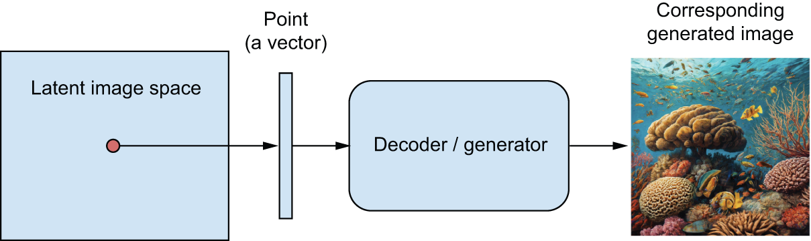


[Figure 17.1](#figure-17-1): Using a latent vector space to sample new images

Further, *text-conditioning* makes it possible to map a space of prompts in natural language
to the latent space (see figure 17.2), making it possible to do
*language-guided image generation* — generating pictures that correspond to a text description.
This category of models is called *text-to-image* models.

Interpolating between many training images in the latent space enables such models to generate
infinite combinations of visual concepts, including many that no one had explicitly
come up with before. A horse riding a bike on the moon? You got it.
This makes image generation a powerful brush for creative-minded people to play with.

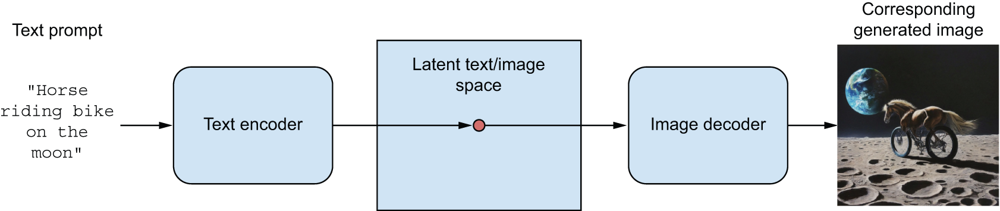


[Figure 17.2](#figure-17-2): Language-guided image generation

Of course, there are still challenges to overcome.
Like with all deep learning models, the latent space doesn’t encode a consistent
model of the physical world, so you might occasionally see hands with extra fingers,
incoherent lighting, or garbled objects.
The coherence of generated images is still an area of active research.
In the case of figure 17.2,
despite having seen tens of thousands of images of people riding bikes,
the model doesn’t understand in a human sense what it means to ride a bike
— concepts like pedaling, steering, or maintaining upright balance.
That’s why your bike-riding horse is unlikely to get depicted pedaling
with its hind legs in a believable manner, the way a human artist would draw it.

There’s a range of different strategies for learning such latent spaces of
image representations, each with its own characteristics.
The most common types of image generation models are

* Diffusion models
* Variational autoencoders (VAEs)
* Generative adversarial networks (GANs)

While previous editions of this book covered GANs,
they have gradually fallen out of fashion in recent years
and have been all but replaced by diffusion models.
In this edition, we’ll cover both VAEs and diffusion models
and we will skip GANs. In the models we’ll build ourselves,
we’ll focus on unconditioned image generation — sampling images from a latent space
without text conditioning. However, you will also learn how to use a pretrained text-to-image model
and how to explore its latent space.

### Variational autoencoders

VAEs, simultaneously discovered by Kingma and Welling in
December 2013[[1]](#footnote-1)
and Rezende, Mohamed, and Wierstra in
January 2014,[[2]](#footnote-2)
are a kind of generative model that’s
especially appropriate for the task of image editing via concept vectors.
They’re a kind of *autoencoder* — a type of network that aims to encode an
input to a low dimensional latent space and then decode it back — that mixes
ideas from deep learning with Bayesian inference.

VAEs have been around for over a decade, but they remain relevant to this day
and continue to be used in recent research.
While VAEs will never be the first choice for generating high-fidelity images
— where diffusion models excel —
they remain an important tool in the deep learning toolbox,
particularly when interpretability, control over the latent space,
and data reconstruction capabilities are crucial. It’s also your first contact
with the concept of the autoencoder, which is useful to know about.
VAEs beautifully illustrate the core idea behind this class of models.

A classical image autoencoder takes an image, maps it to a latent vector space
via an encoder module, and then decodes it back to an output with the same
dimensions as the original image, via a decoder module (see figure 17.3). It’s
then trained by using as target data the *same images* as the input images,
meaning the autoencoder learns to reconstruct the original inputs. By imposing
various constraints on the code (the output of the encoder), you can get the
autoencoder to learn more or less interesting latent representations of the
data. Most commonly, you’ll constrain the code to be low-dimensional and
sparse (mostly zeros), in which case the encoder acts as a way to compress the
input data into fewer bits of information.

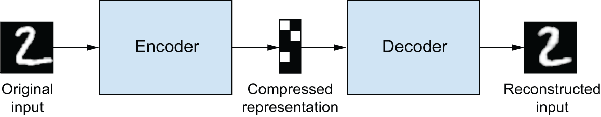


[Figure 17.3](#figure-17-3): An autoencoder: mapping an input `x` to a compressed representation and then decoding it back as `x'`

In practice, such classical autoencoders don’t lead to particularly useful or
nicely structured latent spaces. They’re not much good at compression either.
For these reasons, they have largely fallen out of fashion. VAEs, however,
augment autoencoders with a little bit of statistical magic that forces them
to learn continuous, highly structured latent spaces. They have turned out to
be a powerful tool for image generation.

A VAE, instead of compressing its input image into a fixed code in the latent
space, turns the image into the parameters of a statistical distribution: a
mean and a variance. Essentially, this means we’re assuming the input image
has been generated by a statistical process, and that the randomness of this
process should be taken into account during encoding and decoding. The VAE
then uses the mean and variance parameters to randomly sample one element of
the distribution, and decodes that element back to the original input (see
figure 17.4). The stochasticity of this process improves robustness and forces
the latent space to encode meaningful representations everywhere: every point
sampled in the latent space is decoded to a valid output.

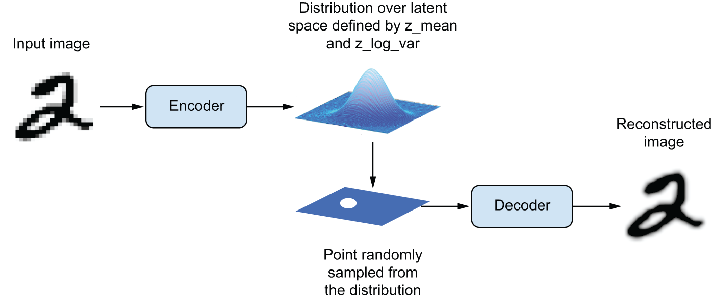


[Figure 17.4](#figure-17-4): A VAE maps an image to two vectors, `z_mean` and `z_log_sigma`, which define a probability distribution over the latent space, used to sample a latent point to decode.

In technical terms, here’s how a VAE works:

1. An encoder module turns the input sample `input_img` into two parameters in
   a latent space of representations, `z_mean` and `z_log_variance`.
2. You randomly sample a point `z` from the latent normal distribution that’s
   assumed to generate the input image, via
   `z = z_mean + exp(z_log_variance) * epsilon`, where `epsilon`
   is a random tensor of small values.
3. A decoder module maps this point in the latent space back to the original
   input image.

Because `epsilon` is random, the process ensures that every point that’s close
to the latent location where you encoded `input_img` (`z-mean`) can be decoded
to something similar to `input_img`, thus forcing the latent space to be
continuously meaningful. Any two close points in the latent space will decode
to highly similar images. Continuity, combined with the low dimensionality of
the latent space, forces every direction in the latent space to encode a
meaningful axis of variation of the data, making the latent space very
structured and thus highly suitable to manipulation via concept vectors.

The parameters of a VAE are trained via two loss functions:
a *reconstruction loss* that forces the decoded samples to match the initial inputs,
and a *regularization loss* that helps learn
well-rounded latent distributions and reduces overfitting to the training data.
Schematically, the process looks like this:

```python
# Encodes the input into a mean and variance parameter
z_mean, z_log_variance = encoder(input_img)
# Draws a latent point using a small random epsilon
z = z_mean + exp(z_log_variance) * epsilon
# Decodes z back to an image
reconstructed_img = decoder(z)
# Instantiates the autoencoder model, which maps an input image to its
# reconstruction
model = Model(input_img, reconstructed_img)
```

You can then train the model using the reconstruction loss and the
regularization loss. For the regularization loss, we
typically use an expression (the Kullback–Leibler divergence)
meant to nudge the distribution of the encoder output
toward a well-rounded normal distribution centered around 0.
This provides the encoder with a sensible assumption about the structure
of the latent space it’s modeling.

Now let’s see what implementing a VAE looks like in practice!

### Implementing a VAE with Keras

We’re going to be implementing a VAE that can generate MNIST digits.
It’s going to have three parts:

* An encoder network that turns a real image into a mean and a variance
  in the latent space
* A sampling layer that takes such a mean and variance and uses them to sample a
  random point from the latent space
* A decoder network that turns points from the latent space back into images

The following listing shows the encoder network you’ll use, mapping images to
the parameters of a probability distribution over the latent space. It’s a
simple ConvNet that maps the input image `x` to two vectors, `z_mean` and
`z_log_var`. One important detail is that we use strides for downsampling
feature maps, instead of max pooling. The last time we did this was in the
image segmentation example of chapter 11. Recall that, in general, strides
are preferable to max pooling for any model that cares about *information location* —
that is, *where* stuff is in the image — and this one does,
since it will have to produce an image encoding
that can be used to reconstruct a valid image.

```python
import keras
from keras import layers

# Dimensionality of the latent space: a 2D plane
latent_dim = 2

image_inputs = keras.Input(shape=(28, 28, 1))
x = layers.Conv2D(32, 3, activation="relu", strides=2, padding="same")(
    image_inputs
)
x = layers.Conv2D(64, 3, activation="relu", strides=2, padding="same")(x)
x = layers.Flatten()(x)
x = layers.Dense(16, activation="relu")(x)
# The input image ends up being encoded into these two parameters.
z_mean = layers.Dense(latent_dim, name="z_mean")(x)
z_log_var = layers.Dense(latent_dim, name="z_log_var")(x)
encoder = keras.Model(image_inputs, [z_mean, z_log_var], name="encoder")
```

[Listing 17.1](#listing-17-1): VAE encoder network

Its summary looks like this:

```python
>>> encoder.summary()
Model: "encoder"
┏━━━━━━━━━━━━━━━━━━━━━━━┳━━━━━━━━━━━━━━━━━━━┳━━━━━━━━━━━━━┳━━━━━━━━━━━━━━━━━━━━┓
┃ Layer (type)          ┃ Output Shape      ┃     Param # ┃ Connected to       ┃
┡━━━━━━━━━━━━━━━━━━━━━━━╇━━━━━━━━━━━━━━━━━━━╇━━━━━━━━━━━━━╇━━━━━━━━━━━━━━━━━━━━┩
│ input_layer           │ (None, 28, 28, 1) │           0 │ -                  │
│ (InputLayer)          │                   │             │                    │
├───────────────────────┼───────────────────┼─────────────┼────────────────────┤
│ conv2d (Conv2D)       │ (None, 14, 14,    │         320 │ input_layer[0][0]  │
│                       │ 32)               │             │                    │
├───────────────────────┼───────────────────┼─────────────┼────────────────────┤
│ conv2d_1 (Conv2D)     │ (None, 7, 7, 64)  │      18,496 │ conv2d[0][0]       │
├───────────────────────┼───────────────────┼─────────────┼────────────────────┤
│ flatten (Flatten)     │ (None, 3136)      │           0 │ conv2d_1[0][0]     │
├───────────────────────┼───────────────────┼─────────────┼────────────────────┤
│ dense (Dense)         │ (None, 16)        │      50,192 │ flatten[0][0]      │
├───────────────────────┼───────────────────┼─────────────┼────────────────────┤
│ z_mean (Dense)        │ (None, 2)         │          34 │ dense[0][0]        │
├───────────────────────┼───────────────────┼─────────────┼────────────────────┤
│ z_log_var (Dense)     │ (None, 2)         │          34 │ dense[0][0]        │
└───────────────────────┴───────────────────┴─────────────┴────────────────────┘
 Total params: 69,076 (269.83 KB)
 Trainable params: 69,076 (269.83 KB)
 Non-trainable params: 0 (0.00 B)
```

Next is the code for using `z_mean` and `z_log_var`, the parameters of the
statistical distribution assumed to have produced `input_img`, to generate a
latent space point `z`.

```python
from keras import ops

class Sampler(keras.Layer):
    def __init__(self, **kwargs):
        super().__init__(**kwargs)
        # We need a seed generator to use functions from keras.random
        # in call().
        self.seed_generator = keras.random.SeedGenerator()
        self.built = True

    def call(self, z_mean, z_log_var):
        batch_size = ops.shape(z_mean)[0]
        z_size = ops.shape(z_mean)[1]
        epsilon = keras.random.normal(
            # Draws a batch of random normal vectors
            (batch_size, z_size), seed=self.seed_generator
        )
        # Applies the VAE sampling formula
        return z_mean + ops.exp(0.5 * z_log_var) * epsilon
```

[Listing 17.2](#listing-17-2): Latent space sampling layer

The following listing shows the decoder implementation. We reshape the vector
`z` to the dimensions of an image and then use a few convolution layers to
obtain a final image output that has the same dimensions as the original
`input_img`.

```python
# Input where we'll feed z
latent_inputs = keras.Input(shape=(latent_dim,))
# Produces the same number of coefficients we had at the level of the
# Flatten layer in the encoder
x = layers.Dense(7 * 7 * 64, activation="relu")(latent_inputs)
# Reverts the Flatten layer of the encoder
x = layers.Reshape((7, 7, 64))(x)
# Reverts the Conv2D layers of the encoder
x = layers.Conv2DTranspose(64, 3, activation="relu", strides=2, padding="same")(
    x
)
x = layers.Conv2DTranspose(32, 3, activation="relu", strides=2, padding="same")(
    x
)
# The output ends up with shape (28, 28, 1).
decoder_outputs = layers.Conv2D(1, 3, activation="sigmoid", padding="same")(x)
decoder = keras.Model(latent_inputs, decoder_outputs, name="decoder")
```

[Listing 17.3](#listing-17-3): VAE decoder network, mapping latent space points to images

Its summary looks like this:

```python
>>> decoder.summary()
Model: "decoder"
┏━━━━━━━━━━━━━━━━━━━━━━━━━━━━━━━━━━━┳━━━━━━━━━━━━━━━━━━━━━━━━━━┳━━━━━━━━━━━━━━━┓
┃ Layer (type)                      ┃ Output Shape             ┃       Param # ┃
┡━━━━━━━━━━━━━━━━━━━━━━━━━━━━━━━━━━━╇━━━━━━━━━━━━━━━━━━━━━━━━━━╇━━━━━━━━━━━━━━━┩
│ input_layer_1 (InputLayer)        │ (None, 2)                │             0 │
├───────────────────────────────────┼──────────────────────────┼───────────────┤
│ dense_1 (Dense)                   │ (None, 3136)             │         9,408 │
├───────────────────────────────────┼──────────────────────────┼───────────────┤
│ reshape (Reshape)                 │ (None, 7, 7, 64)         │             0 │
├───────────────────────────────────┼──────────────────────────┼───────────────┤
│ conv2d_transpose                  │ (None, 14, 14, 64)       │        36,928 │
│ (Conv2DTranspose)                 │                          │               │
├───────────────────────────────────┼──────────────────────────┼───────────────┤
│ conv2d_transpose_1                │ (None, 28, 28, 32)       │        18,464 │
│ (Conv2DTranspose)                 │                          │               │
├───────────────────────────────────┼──────────────────────────┼───────────────┤
│ conv2d_2 (Conv2D)                 │ (None, 28, 28, 1)        │           289 │
└───────────────────────────────────┴──────────────────────────┴───────────────┘
 Total params: 65,089 (254.25 KB)
 Trainable params: 65,089 (254.25 KB)
 Non-trainable params: 0 (0.00 B)
```

Now, let’s create the VAE model itself. This is your first example of a model
that isn’t doing supervised learning (an autencoder is an example of *self-supervised*
learning because it uses its inputs as targets). Whenever you depart
from classic supervised learning, it’s common to subclass the `Model` class
and implement a custom `train_step()` to specify the new training logic,
a workflow you’ve learned about in chapter 7. We could easily do that here,
but a downside of this technique is that the `train_step()` contents
must be backend specific — you’d use `GradientTape` with TensorFlow, you’d use `loss.backward()`
with PyTorch, and so on. A simpler way to customize your training logic is to just
implement the `compute_loss()` method instead and keep the default `train_step()`.
`compute_loss()` is the key bit of differentiable logic called by the built-in `train_step()`.
Since it doesn’t involve direct manipulation of gradients, it’s easy to keep it backend agnostic.

Its signature is as follows:

`compute_loss(x, y, y_pred, sample_weight=None, training=True)`

where `x` is the model’s input; `y` is the model’s target (in our case, it is `None` since the dataset
we use only has inputs, no targets); and `y_pred` is the output of `call()` — the model’s predictions. In any supervised
training workflow, you’d compute the loss based on `y` and `y_pred`. In our case,
since `y` is `None` and `y_pred` contains the latent parameters, we’ll compute
the loss using `x` (the original input) and the `reconstruction` derived from `y_pred`.

The method must return a scalar, the loss value to be minimized.
You can also use `compute_loss()` to update the state of your metrics,
which is something we’ll want to do in our case.

Now, let’s write our VAE with a custom `compute_loss()` method. It works with all
backends with no code changes!

```python
class VAE(keras.Model):
    def __init__(self, encoder, decoder, **kwargs):
        super().__init__(**kwargs)
        self.encoder = encoder
        self.decoder = decoder
        self.sampler = Sampler()
        # We'll use these metrics to keep track of the loss averages
        # over each epoch.
        self.reconstruction_loss_tracker = keras.metrics.Mean(
            name="reconstruction_loss"
        )
        self.kl_loss_tracker = keras.metrics.Mean(name="kl_loss")

    def call(self, inputs):
        return self.encoder(inputs)

    def compute_loss(self, x, y, y_pred, sample_weight=None, training=True):
        # Argument x is the model's input.
        original = x
        # Argument y_pred is the output of call().
        z_mean, z_log_var = y_pred
        # This is our reconstructed image.
        reconstruction = self.decoder(self.sampler(z_mean, z_log_var))

        # We sum the reconstruction loss over the spatial dimensions
        # (axes 1 and 2) and take its mean over the batch dimension.
        reconstruction_loss = ops.mean(
            ops.sum(
                keras.losses.binary_crossentropy(x, reconstruction), axis=(1, 2)
            )
        )
        # Adds the regularization term (Kullback–Leibler divergence)
        kl_loss = -0.5 * (
            1 + z_log_var - ops.square(z_mean) - ops.exp(z_log_var)
        )
        total_loss = reconstruction_loss + ops.mean(kl_loss)

        # Updates the state of our loss-tracking metrics
        self.reconstruction_loss_tracker.update_state(reconstruction_loss)
        self.kl_loss_tracker.update_state(kl_loss)
        return total_loss
```

[Listing 17.4](#listing-17-4): VAE model with custom `compute_loss()` method

Finally, you’re ready to instantiate and train the model on MNIST digits.
Because `compute_loss()` already takes care of the loss, you don’t specify an external loss at
compile time (`loss=None`), which, in turn, means you won’t pass target data
during training (as you can see, you only pass `x_train` to the model in `fit`).

```python
import numpy as np

(x_train, _), (x_test, _) = keras.datasets.mnist.load_data()
# We train on all MNIST digits, so we concatenate the training and test
# samples.
mnist_digits = np.concatenate([x_train, x_test], axis=0)
mnist_digits = np.expand_dims(mnist_digits, -1).astype("float32") / 255

vae = VAE(encoder, decoder)
# We don't pass a loss argument in compile(), since the loss is already
# part of the train_step().
vae.compile(optimizer=keras.optimizers.Adam())
# We don't pass targets in fit(), since train_step() doesn't expect
# any.
vae.fit(mnist_digits, epochs=30, batch_size=128)
```

[Listing 17.5](#listing-17-5): Training the VAE

Once the model is trained, you can use the `decoder`
network to turn arbitrary latent space vectors into images.

```python
import matplotlib.pyplot as plt

# We'll display a grid of 30 × 30 digits (900 digits total).
n = 30
digit_size = 28
figure = np.zeros((digit_size * n, digit_size * n))

# Samples points linearly on a 2D grid
grid_x = np.linspace(-1, 1, n)
grid_y = np.linspace(-1, 1, n)[::-1]

# Iterates over grid locations
for i, yi in enumerate(grid_y):
    for j, xi in enumerate(grid_x):
        # For each location, samples a digit and adds it to our figure
        z_sample = np.array([[xi, yi]])
        x_decoded = vae.decoder.predict(z_sample)
        digit = x_decoded[0].reshape(digit_size, digit_size)
        figure[
            i * digit_size : (i + 1) * digit_size,
            j * digit_size : (j + 1) * digit_size,
        ] = digit

plt.figure(figsize=(15, 15))
start_range = digit_size // 2
end_range = n * digit_size + start_range
pixel_range = np.arange(start_range, end_range, digit_size)
sample_range_x = np.round(grid_x, 1)
sample_range_y = np.round(grid_y, 1)
plt.xticks(pixel_range, sample_range_x)
plt.yticks(pixel_range, sample_range_y)
plt.xlabel("z[0]")
plt.ylabel("z[1]")
plt.axis("off")
plt.imshow(figure, cmap="Greys_r")
```

[Listing 17.6](#listing-17-6): Sampling a grid of points from the 2D latent space and decoding them to images

The grid of sampled digits (see figure 17.5) shows a completely continuous
distribution of the different digit classes, with one digit morphing into
another as you follow a path through latent space. Specific directions in this
space have a meaning: for example, there’s a direction for “four-ness,”
“one-ness,” and so on.

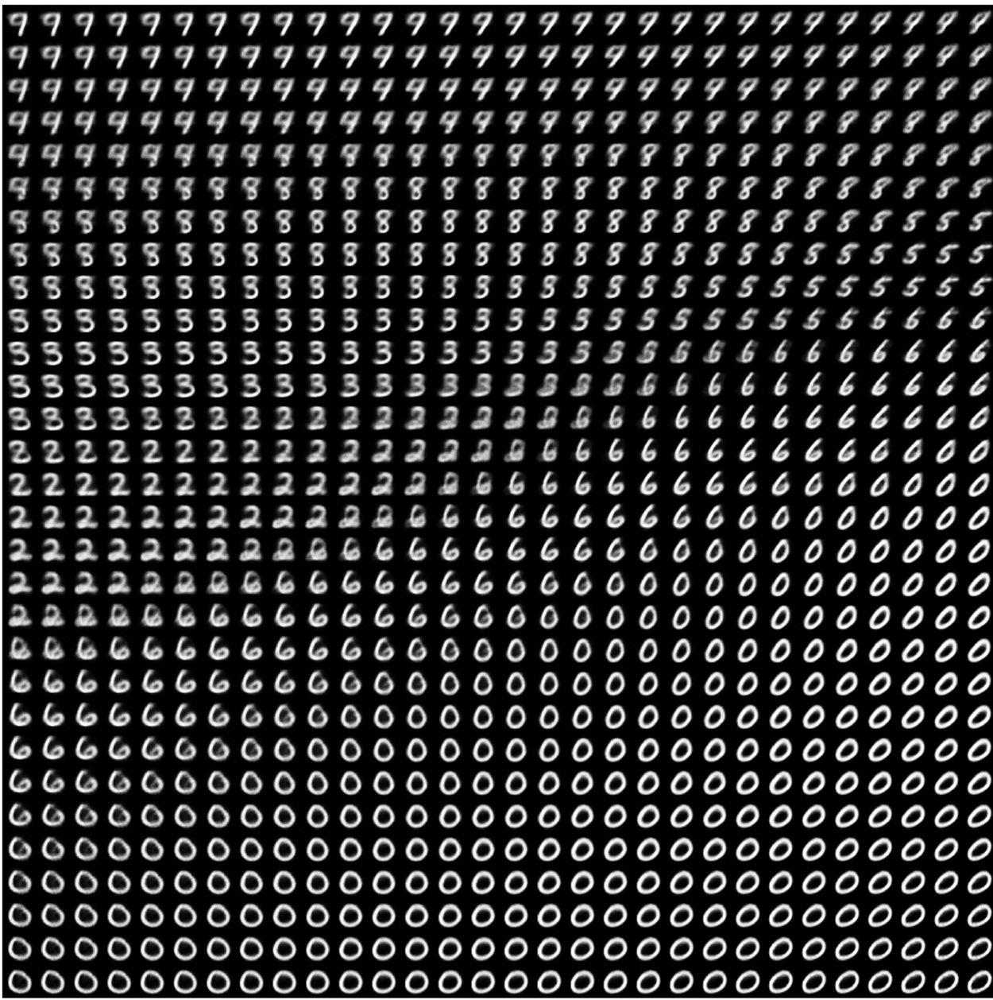


[Figure 17.5](#figure-17-5): Grid of digits decoded from the latent space

In the next section, we’ll cover in detail another major tool for generating
images: diffusion models, the architecture behind nearly all commercial image generation
services today.

## Diffusion models

A long-standing application of autoencoders has been *denoising*: feeding into a model
an input that features a small amount of noise — for instance, a low-quality JPEG image —
and getting back a cleaned-up version of the same input. This is the one task that autoencoders excel at.
In the late 2010s, this idea gave rise to very successful *image super-resolution* models,
capable of taking in low-resolution, potentially noisy images and outputting high-quality, high-resolution versions
of them (see figure 17.6). Such models have been shipped as part of every major smartphone camera app for the past few years.

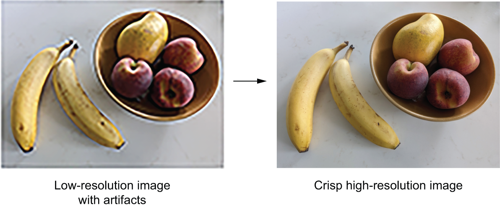


[Figure 17.6](#figure-17-6): Image super-resolution

Of course, these models aren’t magically recovering lost details hidden in the input,
like in the “enhance” scene from *Blade Runner* (1982).
Rather, they’re making educated guesses about what the image should look like
— they’re *hallucinating* a cleaned-up, higher-resolution version of what you give them.
This can potentially lead to funny mishaps.
For instance, with some AI-enhanced cameras, you can take a picture of something that looks
vaguely moon-like (such as a printout of a severely blurred moon image),
and you will get in your camera roll a crisp picture of the moon’s craters.
A lot of detail that simply wasn’t present in the printout gets straight-up hallucinated by the camera,
because the super-resolution model it uses is overfitted to moon photography images.
So, unlike Rick Deckard, definitely don’t use this technique for forensics!

Early successes in image denoising led researchers to an arresting idea:
since you can use an autoencoder to remove a small amount
of noise from an image, surely it would be possible to repeat the process
multiple times in a loop to remove a large amount of noise.
Ultimately, could you denoise an image made out of *pure noise*?

As it turns out, yes, you can. By doing this, you can effectively hallucinate
brand new images out of nothing, like in figure 17.7.
This is the key insight behind diffusion models, which should more accurately
be called *reverse diffusion* models, since “diffusion” refers to the process
of gradually adding noise to an image until it disperses into nothing.

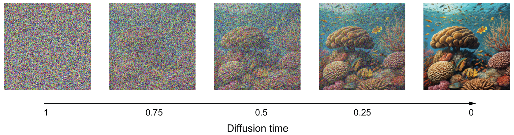


[Figure 17.7](#figure-17-7): Reverse diffusion: turning pure noise into an image via repeated denoising

A diffusion model is essentially a denoising autoencoder in a loop, capable
of turning pure noise into sharp, realistic imagery.
You may know this poetic quote from Michelangelo,
“Every block of stone has a statue inside it and it is the task of the sculptor to discover it” —
well, every square of white noise has an image inside it,
and it is the task of the diffusion model to discover it.

Now, let’s build one with Keras.

### The Oxford Flowers dataset

The dataset we’re going to use is the Oxford Flowers dataset (<https://www.robots.ox.ac.uk/~vgg/data/flowers/102/>),
a collection of 8,189 images of flowers that belong to 102 different species.

Let’s get the dataset archive and extract it:

```python
import os

fpath = keras.utils.get_file(
    origin="https://www.robots.ox.ac.uk/~vgg/data/flowers/102/102flowers.tgz",
    extract=True,
)
```

`fpath` is now the local path to the extracted directory.
The images are contained in the `jpg` subdirectory there.
Let’s turn them into an iterable dataset using `image_dataset_from_directory()`.

We need to resize our images to a fixed size,
but we don’t want to distort their aspect ratio since
this would negatively affect the quality of our generated images,
so we use the `crop_to_aspect_ratio` option to extract
maximally large undistorted crops of the right size (128 × 128):

```python
batch_size = 32
image_size = 128
images_dir = os.path.join(fpath, "jpg")
dataset = keras.utils.image_dataset_from_directory(
    images_dir,
    # We won't need the labels, just the images.
    labels=None,
    image_size=(image_size, image_size),
    # Crops images when resizing them to preserve their aspect ratio
    crop_to_aspect_ratio=True,
)
dataset = dataset.rebatch(
    # We'd like all batches to have the same size, so we drop the last
    # (irregular) batch.
    batch_size,
    drop_remainder=True,
)
```

Here’s an example image (figure 17.8):

```python
from matplotlib import pyplot as plt

for batch in dataset:
    img = batch.numpy()[0]
    break
plt.imshow(img.astype("uint8"))
```


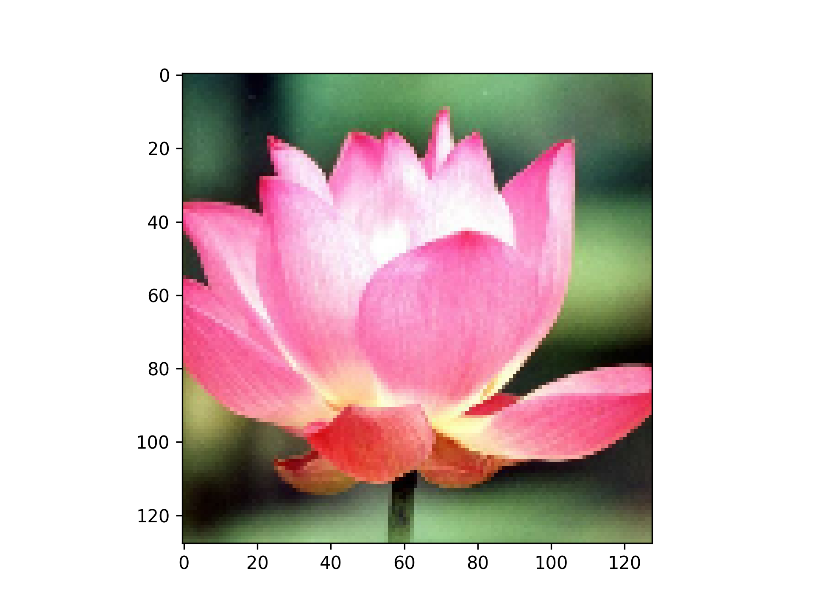


[Figure 17.8](#figure-17-8): An example image from the Oxford Flowers dataset

### A U-Net denoising autoencoder

The same denoising model gets reused across each iteration of the diffusion denoising process,
erasing a little bit of noise each time.
To make the job of the model easier,
we tell it how much noise it is supposed to extract for a given input image — that’s
the `noise_rates` input. Rather than outputting a denoised image,
we make our model output a predicted noise mask, which
we can subtract from the input to denoise it.

For our denoising model, we’re going to use a U-Net —
a kind of ConvNet originally developed for image segmentation. It looks like
figure 17.9.

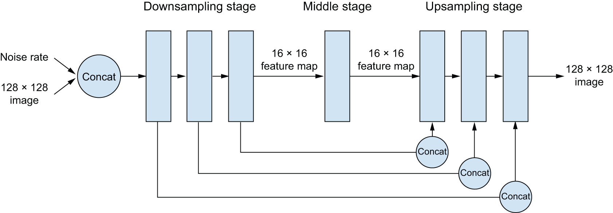


[Figure 17.9](#figure-17-9): Our U-Net-style denoising autoencoder architecture

This architecture features three stages:

1. A *downsampling stage*, made of several blocks
   of convolution layers, where the inputs get downsampled from
   their original 128 × 128 size down to a much smaller size (in our case, 16 × 16).
2. A *middle stage*, where the feature map has a constant size.
3. An *upsampling stage*, where the feature map get upsampled back to 128 × 128.

There is a 1:1 mapping between the blocks of the downsampling and upsampling stages:
each upsampling block is the inverse of a downsampling block. Importantly, the model
features concatenative residual connections going from each downsampling block to the
corresponding upsampling block. These connections help avoid loss of image detail information across
the successive downsampling and upsampling operations.

Let’s assemble the model using the Functional API:

```python
# Utility function to apply a block of layers with a residual
# connection
def residual_block(x, width):
    input_width = x.shape[3]
    if input_width == width:
        residual = x
    else:
        residual = layers.Conv2D(width, 1)(x)
    x = layers.BatchNormalization(center=False, scale=False)(x)
    x = layers.Conv2D(width, 3, padding="same", activation="swish")(x)
    x = layers.Conv2D(width, 3, padding="same")(x)
    x = x + residual
    return x

def get_model(image_size, widths, block_depth):
    noisy_images = keras.Input(shape=(image_size, image_size, 3))
    noise_rates = keras.Input(shape=(1, 1, 1))

    x = layers.Conv2D(widths[0], 1)(noisy_images)
    n = layers.UpSampling2D(image_size, interpolation="nearest")(noise_rates)
    x = layers.Concatenate()([x, n])

    skips = []
    # Dowsampling stage
    for width in widths[:-1]:
        for _ in range(block_depth):
            x = residual_block(x, width)
            skips.append(x)
        x = layers.AveragePooling2D(pool_size=2)(x)

    # Middle stage
    for _ in range(block_depth):
        x = residual_block(x, widths[-1])

    # Upsampling stage
    for width in reversed(widths[:-1]):
        x = layers.UpSampling2D(size=2, interpolation="bilinear")(x)
        for _ in range(block_depth):
            x = layers.Concatenate()([x, skips.pop()])
            x = residual_block(x, width)

    # We set the kernel initializer for the last layer to "zeros,"
    # making the model predict only zeros after initialization (that
    # is, our default assumption before training is "no noise").
    pred_noise_masks = layers.Conv2D(3, 1, kernel_initializer="zeros")(x)

    # Creates the functional model
    return keras.Model([noisy_images, noise_rates], pred_noise_masks)
```

You would instantiate the model with something like
`get_model(image_size=128, widths=[32, 64, 96, 128], block_depth=2)`.
The `widths` argument is a list containing the `Conv2D` layer sizes for each successive
downsampling or upsampling stage. We typically want the layers to get bigger
as we downsample the inputs (going from 32 to 128 units here) and then get smaller as as upsample
(from 128 back to 32 here).

### The concepts of diffusion time and diffusion schedule

The diffusion process is a series of steps in which we apply our denoising autoencoder to erase a small amount of noise from an image, starting with a pure-noise image, and ending with a pure-signal image. The index of the current step in the loop is called the *diffusion time* (see figure 17.7). In our case, we’ll use a continuous value between 1 and 0
for this index — a value of 1 indicates the start of the process, where the amount of noise is maximal and the amount of signal is minimal,
and a value of 0 indicates the end of the process, where the image is almost all signal and no noise.

The relationship between the current diffusion time and the amount of noise and signal present in the image is called the *diffusion schedule*. In our experiment, we’re going to use a cosine schedule to smoothly transition from a high signal rate (low noise) at the beginning to a low signal rate (high noise) at the end of the diffusion process.

```python
def diffusion_schedule(
    diffusion_times,
    min_signal_rate=0.02,
    max_signal_rate=0.95,
):
    start_angle = ops.cast(ops.arccos(max_signal_rate), "float32")
    end_angle = ops.cast(ops.arccos(min_signal_rate), "float32")
    diffusion_angles = start_angle + diffusion_times * (end_angle - start_angle)
    signal_rates = ops.cos(diffusion_angles)
    noise_rates = ops.sin(diffusion_angles)
    return noise_rates, signal_rates
```

[Listing 17.7](#listing-17-7): The diffusion schedule

This `diffusion_schedule()` function takes as input a `diffusion_times` tensor,
which represents the progression of the diffusion process
and returns the corresponding `noise_rates` and `signal_rates` tensors.
These rates will be used to guide the denoising process.
The logic behind using a cosine schedule is to maintain the relationship `noise_rates ** 2 + signal_rates ** 2 == 1` (see figure 17.10).

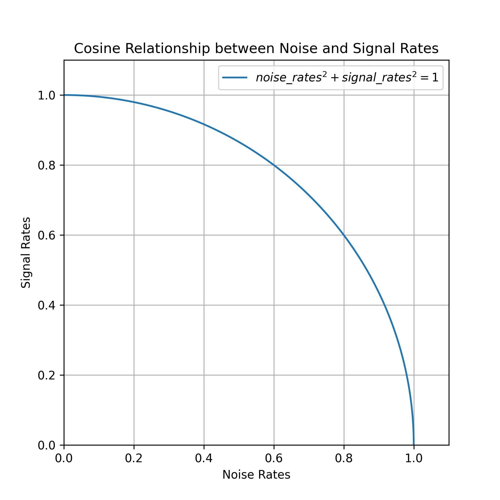


[Figure 17.10](#figure-17-10): Cosine relationship between noise rates and signal rates

Let’s plot how this function maps diffusion times (between 0 and 1) to specific noise rates and signal rates (see figure 17.11):

```python
diffusion_times = ops.arange(0.0, 1.0, 0.01)
noise_rates, signal_rates = diffusion_schedule(diffusion_times)

# These lines are only necessary if you're using PyTorch, in which case
# tensor conversion to NumPy is no longer trivial.
diffusion_times = ops.convert_to_numpy(diffusion_times)
noise_rates = ops.convert_to_numpy(noise_rates)
signal_rates = ops.convert_to_numpy(signal_rates)

plt.plot(diffusion_times, noise_rates, label="Noise rate")
plt.plot(diffusion_times, signal_rates, label="Signal rate")

plt.xlabel("Diffusion time")
plt.legend()
```


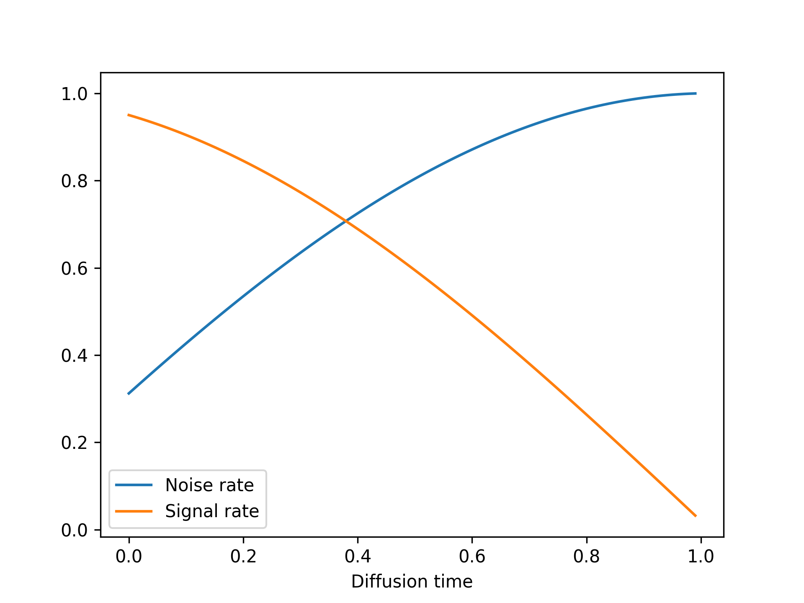


[Figure 17.11](#figure-17-11): Our cosine diffusion schedule

### The training process

Let’s create a `DiffusionModel` class to implement the training procedure.
It’s going to have our denoising autoencoder as one of its attributes.
We’re also going to need a couple more things:

* *A loss function* — We’ll use mean absolute error as our loss, that is to say `mean(abs(real_noise_mask - predicted_noise_mask))`.
* *An image normalization layer* — The noise we’ll add to the images will have unit variance and zero mean, so we’d like
  our images to be normalized as such too, for the value range of the noise to match the value range of the images.

Let’s start by writing the model constructor:

```python
class DiffusionModel(keras.Model):
    def __init__(self, image_size, widths, block_depth, **kwargs):
        super().__init__(**kwargs)
        self.image_size = image_size
        self.denoising_model = get_model(image_size, widths, block_depth)
        self.seed_generator = keras.random.SeedGenerator()
        # Our loss function
        self.loss = keras.losses.MeanAbsoluteError()
        # We'll use this to normalize input images.
        self.normalizer = keras.layers.Normalization()
```

The first method we’re going to need is the denoising method. It simply
calls the denoising model to retrieve a predicted noise mask, and it
uses it to reconstruct a denoised image:

```python
    def denoise(self, noisy_images, noise_rates, signal_rates):
        # Calls the denoising model
        pred_noise_masks = self.denoising_model([noisy_images, noise_rates])
        # Reconstructs the predicted clean image
        pred_images = (
            noisy_images - noise_rates * pred_noise_masks
        ) / signal_rates
        return pred_images, pred_noise_masks
```

Next comes the training logic. This is the most important part!
Like in the VAE example, we’re going to implement a custom `compute_loss()`
method to keep our model backend agnostic. Of course, if you are set on using one
specific backend, you could also write a custom `train_step()` with the exact same logic in it,
plus the backend-specific logic for gradient computation and weight updates.

Since `compute_loss()` receives as input the output of `call()`, we’re going
to put the denoising forward pass in `call()`. Our `call()` takes a batch of clean input images
and applies the following steps:

1. Normalizes the images
2. Samples random diffusion times (the denoising model needs to be trained on the full spectrum of diffusion times)
3. Computes corresponding noise rates and signal rates (using the diffusion schedule)
4. Adds random noise to the clean images (based on the computed noise rates and signal rates)
5. Denoises the images

It returns

* The predicted denoised images
* The predicted noise masks
* The actual noise masks it applied

These last two quantities are then used in `compute_loss()` to compute the loss of the model
on the noise mask prediction task:

```python
    def call(self, images):
        images = self.normalizer(images)
        # Samples random noise masks
        noise_masks = keras.random.normal(
            (batch_size, self.image_size, self.image_size, 3),
            seed=self.seed_generator,
        )
        # Samples random diffusion times
        diffusion_times = keras.random.uniform(
            (batch_size, 1, 1, 1),
            minval=0.0,
            maxval=1.0,
            seed=self.seed_generator,
        )
        noise_rates, signal_rates = diffusion_schedule(diffusion_times)
        # Adds noise to the images
        noisy_images = signal_rates * images + noise_rates * noise_masks
        # Denoises them
        pred_images, pred_noise_masks = self.denoise(
            noisy_images, noise_rates, signal_rates
        )
        return pred_images, pred_noise_masks, noise_masks

    def compute_loss(self, x, y, y_pred, sample_weight=None, training=True):
        _, pred_noise_masks, noise_masks = y_pred
        return self.loss(noise_masks, pred_noise_masks)
```

### The generation process

Finally, let’s implement the image generation process.
We start from pure random noise, and we repeatedly apply the `denoise()` method
until we get high-signal, low-noise images.

```python
    def generate(self, num_images, diffusion_steps):
        noisy_images = keras.random.normal(
            # Starts from pure noise
            (num_images, self.image_size, self.image_size, 3),
            seed=self.seed_generator,
        )
        step_size = 1.0 / diffusion_steps
        for step in range(diffusion_steps):
            # Computes appropriate noise rates and signal rates
            diffusion_times = ops.ones((num_images, 1, 1, 1)) - step * step_size
            noise_rates, signal_rates = diffusion_schedule(diffusion_times)
            # Calls denoising model
            pred_images, pred_noises = self.denoise(
                noisy_images, noise_rates, signal_rates
            )
            # Prepares noisy images for the next iteration
            next_diffusion_times = diffusion_times - step_size
            next_noise_rates, next_signal_rates = diffusion_schedule(
                next_diffusion_times
            )
            noisy_images = (
                next_signal_rates * pred_images + next_noise_rates * pred_noises
            )
        # Denormalizes images so their values fit between 0 and 255
        images = (
            self.normalizer.mean + pred_images * self.normalizer.variance**0.5
        )
        return ops.clip(images, 0.0, 255.0)
```

### Visualizing results with a custom callback

We don’t have a proper metric to judge the quality of our generated images, so you’re going to want
to visualize the generated images yourself over the course of training to judge if your model is getting somewhere.
An easy way to do this is with a custom callback. The following callback uses the `generate()` method at the
end of each epoch to display a 3 × 6 grid of generated images:

```python
class VisualizationCallback(keras.callbacks.Callback):
    def __init__(self, diffusion_steps=20, num_rows=3, num_cols=6):
        self.diffusion_steps = diffusion_steps
        self.num_rows = num_rows
        self.num_cols = num_cols

    def on_epoch_end(self, epoch=None, logs=None):
        generated_images = self.model.generate(
            num_images=self.num_rows * self.num_cols,
            diffusion_steps=self.diffusion_steps,
        )

        plt.figure(figsize=(self.num_cols * 2.0, self.num_rows * 2.0))
        for row in range(self.num_rows):
            for col in range(self.num_cols):
                i = row * self.num_cols + col
                plt.subplot(self.num_rows, self.num_cols, i + 1)
                img = ops.convert_to_numpy(generated_images[i]).astype("uint8")
                plt.imshow(img)
                plt.axis("off")
        plt.tight_layout()
        plt.show()
        plt.close()
```

### It’s go time!

It’s finally time to train our diffusion model on the Oxford Flowers dataset.
Let’s instantiate the model:

```python
model = DiffusionModel(image_size, widths=[32, 64, 96, 128], block_depth=2)
# Computes the mean and variance necessary to perform normalization —
# don't forget it!
model.normalizer.adapt(dataset)
```

We’re going to use `AdamW` as our optimizer, with a few neat options enabled to help stabilize training
and improve the quality of the generated images:

* *Learning rate decay* — We gradually reduce the learning rate during training, via an `InverseTimeDecay` schedule.
* *Exponential moving average of model weights* — Also known as Polyak averaging.
  This technique maintains a running average of the model’s weights during training.
  Every 100 batches, we overwrite the model’s weights with this averaged set of weights.
  This helps stabilize the model’s representations in scenarios where the loss landscape is noisy.

The code is

```python
model.compile(
    optimizer=keras.optimizers.AdamW(
        # Configures the learning rate decay schedule
        learning_rate=keras.optimizers.schedules.InverseTimeDecay(
            initial_learning_rate=1e-3,
            decay_steps=1000,
            decay_rate=0.1,
        ),
        # Turns on Polyak averaging
        use_ema=True,
        # Configures how often to overwrite the model's weights with
        # their exponential moving average
        ema_overwrite_frequency=100,
    ),
)
```

Let’s fit the model. We’ll use our `VisualizationCallback` callback to plot examples of generated images
after each epoch, and we’ll save the model’s weights with the `ModelCheckpoint` callback:

```python
model.fit(
    dataset,
    epochs=100,
    callbacks=[
        VisualizationCallback(),
        keras.callbacks.ModelCheckpoint(
            filepath="diffusion_model.weights.h5",
            save_weights_only=True,
            save_best_only=True,
        ),
    ],
)
```

If you’re running on Colab, you might run into the error, “Buffered data was truncated after reaching the output size limit.”
This happens because the logs of `fit()` include images, which take up a lot of space, whereas the allowed output for a single notebook cell
is limited. To get around the problem, you can simply chain five `model.fit(..., epochs=20)` calls, in five successive cells.
This is equivalent to a single `fit(..., epochs=100)` call.

After 100 epochs (which takes about 90 minutes on a T4, the free Colab GPU), we get pretty generative flowers like these (see figure 17.12).

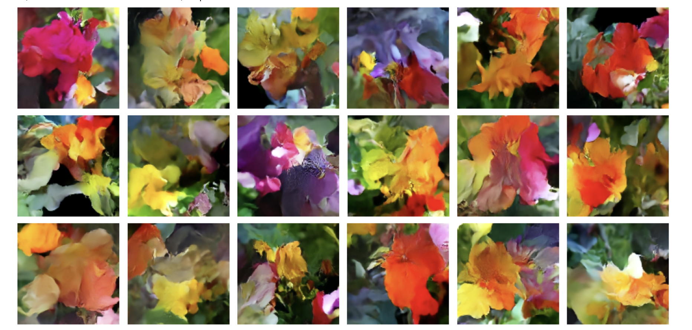


[Figure 17.12](#figure-17-12): Examples of generated flowers

You can keep training for even longer and get increasingly realistic results.

So that’s how image generation with diffusion works! Now, the next step to unlock their potential is
to add *text conditioning*, which would result in a text-to-image model, capable
of producing images that match a given text caption.

## Text-to-image models

We can use the same basic diffusion process to create a model that maps text
input to image output. To do this we need to take a pretrained text encoder
(think a transformer encoder like RoBERTa from chapter 15) that can map text to
vectors in a continuous embedding space. Then we can train a diffusion model on
`(prompt, image)` pairs, where each prompt is a short, textual description of
the input image.

We can handle the image input in the same way as we did previously, mapping noisy
input to a denoised output that progressively approaches our input image.
Critically, we can extend this setup by also passing the embedded text prompt to
the denoising model. So rather than our denoising model simply taking in a
`noisy_images` input, our model will take two inputs: `noisy_images` and
`text_embeddings`. This gives a leg up on the flower denoiser we trained
previously. Instead of learning to remove noise from an image without any additional
information, the model gets to use a textual representation of the final image
to help guide the denoising process.

After training is when things get a bit more fun. Because we have trained a
model that can map pure noise to images *conditioned on* a vector
representation of some text, we can now pass in pure noise and a never-before-seen
prompt and denoise it into an image for our prompt.

Let’s try this out. We won’t actually train one of these models from scratch in
this book — you have all the ingredients you need, but it’s quite expensive and
time consuming to train a text-to-image diffusion model that works well.
Instead, we will play with a popular pretrained model in KerasHub called Stable
Diffusion (figure 17.13). Stable Diffusion is made by a company named Stability AI that
specializes in making open models for image and video generation. We can use the
third version of their image generation model in KerasHub with just a couple of
lines of code:

```python
import keras_hub

height, width = 512, 512
task = keras_hub.models.TextToImage.from_preset(
    "stable_diffusion_3_medium",
    image_shape=(height, width, 3),
    # A trick to keep memory usage down. More details in chapter 18.
    dtype="float16",
)
prompt = "A NASA astraunaut riding an origami elephant in New York City"
task.generate(prompt)
```

[Listing 17.8](#listing-17-8): Creating a Stable Diffusion text-to-image model


[Figure 17.13](#figure-17-13): An example output from our Stable Diffusion model

Like the `CausalLM` task we covered last chapter, the `TextToImage` task is a
high-level class for performing image generation conditioned on text input. It
wraps tokenization and the diffusion process into a high-level generate call.

The Stable Diffusion model actually adds a second “negative prompt” to its
model, which can be used to steer the diffusion process away from certain text
inputs. There’s nothing magic here. To add a negative prompt, you could simply
train a model on triplets: `(image, positive_prompt, negative_prompt)`, where
the positive prompt is a description of the image, and the negative prompt is
a series of words that do not describe the image. By feeding the positive and
negative text embedding to the denoiser, the denoiser will learn to steer the
noise toward images that match the positive prompt and away from images that
match the negative prompt (figure 17.14). Let’s try removing the color blue from our input:

```python
task.generate(
    {
        "prompts": prompt,
        "negative_prompts": "blue color",
    }
)
```


[Figure 17.14](#figure-17-14): Using a negative prompt to steer the model away from the color blue


Visual artifacts in the Stable Diffusion output

You will notice plenty of visual artifacts in our Stable Diffusion output if
you look closely. Notably, our second elephant has duplicated tusks!

Some of this is unavoidable when using diffusion models. Figuring out how to
truly draw a human in a space suit sitting on an elephant made of paper would
require some understanding of anatomy and physics that our model lacks. The
model will always try its best to interpolate an output based on its training
data, but it doesn’t have any real understanding of the objects it is attempting
to represent.

However, there is another factor that is easily fixable: we are using the less
powerful version of Stable Diffusion 3. The “medium” model we are using is the
smallest one released by Stability AI and uses about 3 billion parameters in
total. There is a larger 9-billion parameter model available that would produce
substantially higher-quality images with fewer visual artifacts. We do not use it
simply to keep the code example in this book accessible — 9 billion parameters
need a lot of RAM!

Like the `generate()` method for text models we used in the last chapter, we have a few
additional parameters we can pass to control the generation process. Let’s try
passing a variable number of diffusion steps to our model to see the denoising
process in action (figure 17.15):

```python
import numpy as np
from PIL import Image

def display(images):
    return Image.fromarray(np.concatenate(images, axis=1))

display([task.generate(prompt, num_steps=x) for x in [5, 10, 15, 20, 25]])
```


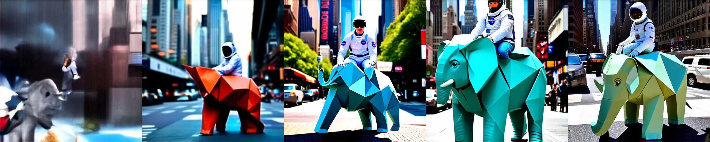


[Figure 17.15](#figure-17-15): Controlling the number of diffusion steps

### Exploring the latent space of a text-to-image model

There is probably no better way to see the interpolative nature of deep neural
networks than text diffusion models. The text encoder used by our model will
learn a smooth, low-dimensional manifold to represent our input prompts. It’s
continuous, meaning we have learned a space where we can walk from the text
representation of one prompt to another, and each intermediate point will have
semantic meaning. We can couple that with our diffusion process to morph between
two images by simply describing each end state with a text prompt.

Before we can do this, we will need to break up our high-level `generate()`
function into its constituent parts. Let’s try that out.

```python
from keras import random

def get_text_embeddings(prompt):
    token_ids = task.preprocessor.generate_preprocess([prompt])
    # We don't care about negative prompts here, but the model expects
    # them.
    negative_token_ids = task.preprocessor.generate_preprocess([""])
    return task.backbone.encode_text_step(token_ids, negative_token_ids)

def denoise_with_text_embeddings(embeddings, num_steps=28, guidance_scale=7.0):
    # Creates pure noise to denoise into an image
    latents = random.normal((1, height // 8, width // 8, 16))
    for step in range(num_steps):
        latents = task.backbone.denoise_step(
            latents,
            embeddings,
            step,
            num_steps,
            guidance_scale,
        )
    return task.backbone.decode_step(latents)[0]

# Rescales our images back to [0, 255]
def scale_output(x):
    x = ops.convert_to_numpy(x)
    x = np.clip((x + 1.0) / 2.0, 0.0, 1.0)
    return np.round(x * 255.0).astype("uint8")

embeddings = get_text_embeddings(prompt)
image = denoise_with_text_embeddings(embeddings)
scale_output(image)
```

[Listing 17.9](#listing-17-9): Breaking down the `generate()` function

Our generation process has three distinct steps:

1. First, we take our prompts, tokenize them, and embed them with our text
   encoder.
2. Second, we take our text embeddings and pure noise and progressively
   “denoise” the noise into an image. This is the same as the flower model we
   just built.
3. Lastly, we map our model outputs, which are from `[-1, 1]` back to `[0, 255]`
   so we can render the image.

One thing to note here is that our text embeddings actually contain four
separate tensors:

```python
>>> [x.shape for x in embeddings]
[(1, 154, 4096), (1, 154, 4096), (1, 2048), (1, 2048)]
```

Rather than only passing the final, embedded text vector to the denoising model,
the Stable Diffusion authors chose to pass both the final output vector and the
last representation of the entire token sequence learned by the text encoder. This
effectively gives our denoising model more information to work with. The authors
do this for both the positive and negative prompts, so we have a total of four
tensors here:

* The positive prompt’s encoder sequence
* The negative prompt’s encoder sequence
* The positive prompt’s encoder vector
* The negative prompt’s encoder vector

With our `generate()` function decomposed, we can now try walking the latent
space between two text prompts. To do so, let’s build a function to interpolate
between the text embeddings outputted by the model.

```python
from keras import ops

def slerp(t, v1, v2):
    v1, v2 = ops.cast(v1, "float32"), ops.cast(v2, "float32")
    v1_norm = ops.linalg.norm(ops.ravel(v1))
    v2_norm = ops.linalg.norm(ops.ravel(v2))
    dot = ops.sum(v1 * v2 / (v1_norm * v2_norm))
    theta_0 = ops.arccos(dot)
    sin_theta_0 = ops.sin(theta_0)
    theta_t = theta_0 * t
    sin_theta_t = ops.sin(theta_t)
    s0 = ops.sin(theta_0 - theta_t) / sin_theta_0
    s1 = sin_theta_t / sin_theta_0
    return s0 * v1 + s1 * v2

def interpolate_text_embeddings(e1, e2, start=0, stop=1, num=10):
    embeddings = []
    for t in np.linspace(start, stop, num):
        embeddings.append(
            (
                # The second and fourth text embeddings are for the
                # negative prompt, which we do not use.
                slerp(t, e1[0], e2[0]),
                e1[1],
                slerp(t, e1[2], e2[2]),
                e1[3],
            )
        )
    return embeddings
```

[Listing 17.10](#listing-17-10): A function to interpolate text embeddings

You’ll notice we use a special interpolation function called `slerp` to walk
between our text embeddings. This is short for *spherical linear interpolation*
— it’s a function that has been used in computer graphics for decades to
interpolate points on a sphere.

Don’t worry too much about the math; it’s not important for our example, but it
is important to understand the motivation. If we imagine our text manifold as a
sphere and our two prompts as random points on that sphere, directly linearly
interpolating between these two points would land us inside the sphere. We would
no longer be on its surface. We would like to stay on the surface of the smooth
manifold learned by our text embedding — that’s where embedding points have
meaning for our denoising model. See figure 17.16.

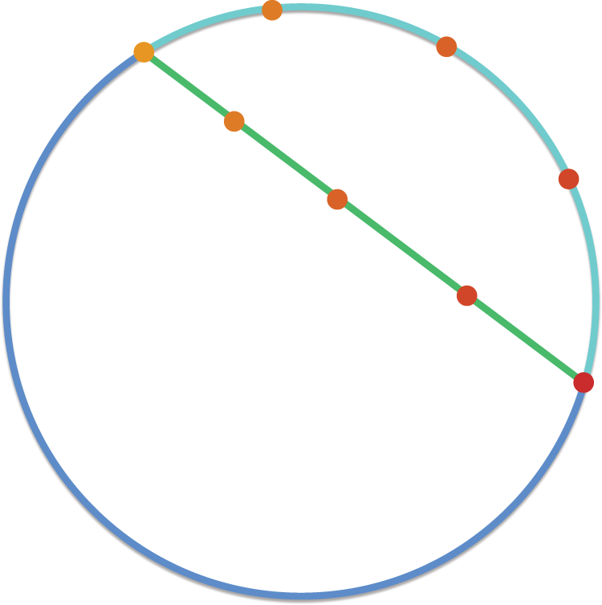


[Figure 17.16](#figure-17-16): Spherical interpolation keeps us close to the surface of our manifold.

Of course, the manifold learned by our text embedding model is not actually
spherical. But it’s a smooth surface of numbers all with the same rough
magnitude — it is *sphere-like*, and interpolating as if we were on a sphere is
a better approximation than interpolating as if we were on a line.

With our interpolation defined, let’s try walking between the text embeddings
for two prompts and generating an image at each interpolated output. We will run
our slerp function from 0.5 to 0.6 (out of 0 to 1) to zoom in on the middle of
the interpolation right when the “morph” becomes visually obvious (figure 17.17):

```python
prompt1 = "A friendly dog looking up in a field of flowers"
prompt2 = "A horrifying, tentacled creature hovering over a field of flowers"
e1 = get_text_embeddings(prompt1)
e2 = get_text_embeddings(prompt2)

images = []
# Zooms in to the middle of the overall interpolation from [0, 1]
for et in interpolate_text_embeddings(e1, e2, start=0.5, stop=0.6, num=9):
    image = denoise_with_text_embeddings(et)
    images.append(scale_output(image))
display(images)
```


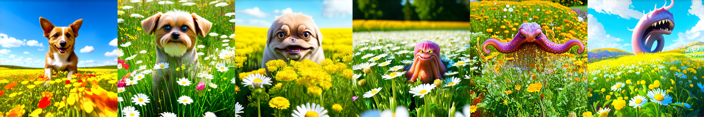


[Figure 17.17](#figure-17-17): Interpolating between two prompts and generating outputs

This might feel like magic the first time you try it, but there’s nothing magic
about it — interpolation is fundamental to the way deep neural networks learn.
This will be the last substantive model we work with in the book, and it’s a
great visual metaphor to end with. Deep neural networks are interpolation
machines; they map complex, real-world probability distributions to
low-dimensional manifolds. We can exploit this fact even for input as complex as
human language and output as complex as natural images.

## Summary

* Image generation with deep learning is done by learning latent spaces that
  capture statistical information about a dataset of images. By sampling and
  decoding points from the latent space, you can generate never-before-seen
  images. There are three major tools to do this: VAEs, diffusion models, and
  GANs.

* VAEs result in highly structured, continuous latent representations. For this
  reason, they work well for doing all sorts of image editing in latent space:
  face swapping, turning a frowning face into a smiling face, and so on. They
  also work nicely for doing latent space–based animations, such as animating a
  walk along a cross section of the latent space, showing a starting image
  slowly morphing into different images in a continuous way.

* Diffusion models result in very realistic outputs and are the dominant method
  of image generation today. They work by repeatedly denoising an image,
  starting from pure noise. They can easily be conditioned on text captions to create text-to-image models.

* Stable Diffusion 3 is a state-of-the-art pretrained text-to-image model that
  you can use to create highly realistic images of your own.

* The visual latent space learned by such text-to-image diffusion models is
  fundamentally interpolative. You can see this by interpolating between the
  text embeddings used as inputs to the diffusion process and achieving a smooth
  interpolation between images as output.

#### **Tiếng Việt (Vietnamese)**

# Chương 17: Tạo hình ảnh

Chương này bao gồm

* Bộ mã hóa tự động biến đổi
* Mô hình khuếch tán
* Sử dụng mô hình chuyển văn bản thành hình ảnh được đào tạo trước
* Khám phá các không gian hình ảnh tiềm ẩn được học bằng các mô hình chuyển văn bản thành hình ảnh

Ứng dụng phổ biến và thành công nhất của AI sáng tạo hiện nay là tạo hình ảnh: tìm hiểu các không gian thị giác tiềm ẩn và lấy mẫu từ chúng để tạo ra những bức ảnh hoàn toàn mới, được nội suy từ những bức ảnh thực - hình ảnh về người tưởng tượng, địa điểm tưởng tượng, mèo và chó tưởng tượng, v.v.

## Học sâu để tạo hình ảnh

Trong phần này và phần tiếp theo, chúng tôi sẽ xem xét một số khái niệm cấp cao liên quan đến việc tạo hình ảnh, cùng với các chi tiết triển khai liên quan đến hai kỹ thuật chính trong miền này: *bộ mã hóa tự động biến thiên* (VAE) và *mô hình khuếch tán*. Xin lưu ý rằng các kỹ thuật chúng tôi trình bày ở đây không dành riêng cho hình ảnh - bạn có thể phát triển các không gian âm thanh hoặc âm nhạc tiềm ẩn bằng cách sử dụng các mô hình tương tự - nhưng trên thực tế, các kết quả thú vị nhất cho đến nay đều thu được bằng hình ảnh và đó là điều chúng tôi tập trung vào đây.

### Lấy mẫu từ không gian tiềm ẩn của hình ảnh

Ý tưởng chính của việc tạo hình ảnh là phát triển một *không gian tiềm ẩn* có chiều thấp của các biểu diễn (giống như mọi thứ khác trong học sâu, là không gian vectơ) trong đó bất kỳ điểm nào cũng có thể được ánh xạ tới một hình ảnh “hợp lệ”: một hình ảnh trông giống như thật. Mô-đun có khả năng thực hiện ánh xạ này, lấy điểm tiềm ẩn đầu vào và xuất ra hình ảnh (lưới pixel), thường được gọi là *trình tạo* hoặc đôi khi là *bộ giải mã*. Khi một không gian tiềm ẩn như vậy đã được học, bạn có thể lấy mẫu các điểm từ nó và bằng cách ánh xạ chúng trở lại không gian hình ảnh, tạo ra các hình ảnh chưa từng thấy trước đây (xem hình 17.1) - phần ở giữa của các hình ảnh huấn luyện.


[Figure 17.1](#figure-17-1): Using a latent vector space to sample new images

Hơn nữa, *điều hòa văn bản* giúp có thể ánh xạ một không gian lời nhắc trong ngôn ngữ tự nhiên tới không gian tiềm ẩn (xem hình 17.2), giúp có thể thực hiện *tạo hình ảnh hướng dẫn bằng ngôn ngữ* — tạo ra các hình ảnh tương ứng với mô tả văn bản. Loại mô hình này được gọi là mô hình *chuyển văn bản thành hình ảnh*.

Việc nội suy giữa nhiều hình ảnh huấn luyện trong không gian tiềm ẩn cho phép các mô hình như vậy tạo ra sự kết hợp vô hạn các khái niệm trực quan, bao gồm nhiều tổ hợp mà trước đây chưa ai nghĩ ra một cách rõ ràng. Một con ngựa đi xe đạp trên mặt trăng? Bạn hiểu rồi. Điều này làm cho việc tạo hình ảnh trở thành một công cụ mạnh mẽ dành cho những người có đầu óc sáng tạo.


[Figure 17.2](#figure-17-2): Language-guided image generation

Tất nhiên, vẫn còn những thách thức cần vượt qua. Giống như tất cả các mô hình học sâu, không gian tiềm ẩn không mã hóa một mô hình nhất quán của thế giới vật chất, do đó, đôi khi bạn có thể nhìn thấy những bàn tay có thêm ngón tay, ánh sáng không mạch lạc hoặc các vật thể bị cắt xén. Sự gắn kết của các hình ảnh được tạo ra vẫn là một lĩnh vực đang được nghiên cứu tích cực. Trong trường hợp của hình 17.2, mặc dù đã xem hàng chục nghìn hình ảnh người đi xe đạp, nhưng theo con người, mô hình này không hiểu ý nghĩa của việc đi xe đạp - các khái niệm như đạp, lái hoặc duy trì thăng bằng thẳng đứng. Đó là lý do tại sao con ngựa cưỡi xe đạp của bạn khó có thể được miêu tả đang đạp bằng hai chân sau một cách đáng tin cậy, theo cách mà một nghệ sĩ con người vẽ nó.

Có một loạt các chiến lược khác nhau để tìm hiểu các không gian biểu diễn hình ảnh tiềm ẩn như vậy, mỗi chiến lược đều có những đặc điểm riêng. Các loại mô hình tạo hình ảnh phổ biến nhất là

* Mô hình khuếch tán
* Bộ mã hóa tự động biến đổi (VAE)
* Mạng đối thủ sáng tạo (GAN)

Mặc dù các ấn bản trước của cuốn sách này đề cập đến GAN nhưng chúng đã dần trở nên lỗi thời trong những năm gần đây và gần như bị thay thế bởi các mô hình phổ biến. Trong ấn bản này, chúng tôi sẽ đề cập đến cả VAE và mô hình khuếch tán và chúng tôi sẽ bỏ qua GAN. Trong các mô hình mà chúng tôi sẽ tự xây dựng, chúng tôi sẽ tập trung vào việc tạo hình ảnh vô điều kiện - lấy mẫu hình ảnh từ một không gian tiềm ẩn mà không cần điều chỉnh văn bản. Tuy nhiên, bạn cũng sẽ tìm hiểu cách sử dụng mô hình chuyển văn bản thành hình ảnh được đào tạo trước và cách khám phá không gian tiềm ẩn của nó.

### Bộ mã hóa tự động biến thể

VAE, được phát hiện đồng thời bởi Kingma và Welling vào tháng 12 năm 2013[[1]](#footnote-1) và Rezende, Mohamed và Wierstra vào tháng 1 năm 2014,[[2]](#footnote-2) là một loại mô hình tổng quát đặc biệt thích hợp cho nhiệm vụ chỉnh sửa hình ảnh thông qua vectơ khái niệm. Chúng là một loại *bộ mã hóa tự động* — một loại mạng nhằm mục đích mã hóa đầu vào thành không gian tiềm ẩn có chiều thấp và sau đó giải mã lại — kết hợp các ý tưởng từ học sâu với suy luận Bayes.

VAE đã tồn tại hơn một thập kỷ nhưng chúng vẫn còn phù hợp cho đến ngày nay và tiếp tục được sử dụng trong các nghiên cứu gần đây. Mặc dù VAE sẽ không bao giờ là lựa chọn đầu tiên để tạo ra hình ảnh có độ trung thực cao - trong đó các mô hình khuếch tán vượt trội - nhưng chúng vẫn là một công cụ quan trọng trong hộp công cụ học sâu, đặc biệt khi khả năng diễn giải, kiểm soát không gian tiềm ẩn và khả năng tái tạo dữ liệu là rất quan trọng. Đây cũng là lần đầu tiên bạn tiếp xúc với khái niệm về bộ mã hóa tự động, điều này rất hữu ích khi biết về nó. VAE minh họa rất đẹp ý tưởng cốt lõi đằng sau lớp mô hình này.

Bộ mã hóa tự động hình ảnh cổ điển lấy một hình ảnh, ánh xạ nó tới không gian vectơ tiềm ẩn thông qua mô-đun bộ mã hóa và sau đó giải mã nó trở lại đầu ra có cùng kích thước với hình ảnh gốc, thông qua mô-đun giải mã (xem hình 17.3). Sau đó, nó được huấn luyện bằng cách sử dụng *hình ảnh giống nhau* làm dữ liệu mục tiêu, nghĩa là bộ mã hóa tự động học cách tái tạo lại các hình ảnh đầu vào ban đầu. Bằng cách áp đặt các ràng buộc khác nhau trên mã (đầu ra của bộ mã hóa), bạn có thể khiến bộ mã hóa tự động tìm hiểu các cách biểu diễn dữ liệu tiềm ẩn ít nhiều thú vị. Thông thường nhất, bạn sẽ hạn chế mã ở mức ít chiều và thưa thớt (chủ yếu là số 0), trong trường hợp đó, bộ mã hóa hoạt động như một cách để nén dữ liệu đầu vào thành ít bit thông tin hơn.


[Figure 17.3](#figure-17-3): An autoencoder: mapping an input `x` to a compressed representation and then decoding it back as `x'`

Trong thực tế, các bộ mã hóa tự động cổ điển như vậy không dẫn đến không gian tiềm ẩn có cấu trúc độc đáo hoặc hữu ích đặc biệt. Họ cũng không giỏi nén lắm. Vì những lý do này, chúng phần lớn đã lỗi thời. Tuy nhiên, VAE tăng cường bộ mã hóa tự động bằng một chút phép thuật thống kê buộc chúng phải tìm hiểu các không gian tiềm ẩn có cấu trúc cao, liên tục. Chúng hóa ra là một công cụ mạnh mẽ để tạo ra hình ảnh.

VAE, thay vì nén hình ảnh đầu vào của nó thành một mã cố định trong không gian tiềm ẩn, biến hình ảnh thành các tham số của phân phối thống kê: giá trị trung bình và phương sai. Về cơ bản, điều này có nghĩa là chúng tôi giả định hình ảnh đầu vào đã được tạo bởi một quy trình thống kê và tính ngẫu nhiên của quy trình này phải được tính đến trong quá trình mã hóa và giải mã. Sau đó, VAE sử dụng các tham số trung bình và phương sai để lấy mẫu ngẫu nhiên một phần tử của phân phối và giải mã phần tử đó trở lại đầu vào ban đầu (xem hình 17.4). Tính ngẫu nhiên của quá trình này cải thiện độ bền và buộc không gian tiềm ẩn mã hóa các biểu diễn có ý nghĩa ở mọi nơi: mọi điểm được lấy mẫu trong không gian tiềm ẩn được giải mã thành đầu ra hợp lệ.


[Figure 17.4](#figure-17-4): A VAE maps an image to two vectors, `z_mean` and `z_log_sigma`, which define a probability distribution over the latent space, used to sample a latent point to decode.

Về mặt kỹ thuật, đây là cách VAE hoạt động:

1. Mô-đun bộ mã hóa biến mẫu đầu vào `input_img` thành hai tham số trong không gian biểu diễn tiềm ẩn, `z_mean` và `z_log_variance`. 2. Bạn lấy mẫu ngẫu nhiên một điểm `z` từ phân phối chuẩn tiềm ẩn được giả định là tạo ra hình ảnh đầu vào, thông qua `z = z_mean + exp(z_log_variance) * epsilon`, trong đó `epsilon` là một tenxơ ngẫu nhiên có các giá trị nhỏ. 3. Mô-đun giải mã ánh xạ điểm này trong không gian tiềm ẩn trở lại hình ảnh đầu vào ban đầu.

Vì `epsilon` là ngẫu nhiên nên quy trình đảm bảo rằng mọi điểm gần với vị trí tiềm ẩn nơi bạn mã hóa `input_img` (`z-mean`) đều có thể được giải mã thành nội dung tương tự như `input_img`, do đó buộc không gian tiềm ẩn phải liên tục có ý nghĩa. Bất kỳ hai điểm gần nhau nào trong không gian tiềm ẩn sẽ giải mã thành các hình ảnh rất giống nhau. Tính liên tục, kết hợp với tính chiều thấp của không gian tiềm ẩn, buộc mọi hướng trong không gian tiềm ẩn phải mã hóa một trục biến đổi có ý nghĩa của dữ liệu, làm cho không gian tiềm ẩn có cấu trúc rất chặt chẽ và do đó rất phù hợp để thao tác thông qua các vectơ khái niệm.

Các tham số của VAE được huấn luyện thông qua hai hàm mất: một *tổn thất tái tạo* buộc các mẫu được giải mã phải khớp với đầu vào ban đầu và một *tổn thất chính quy hóa* giúp tìm hiểu các phân bố tiềm ẩn toàn diện và giảm việc khớp quá mức cho dữ liệu huấn luyện. Theo sơ đồ, quá trình này trông như thế này:

```python
# Encodes the input into a mean and variance parameter
z_mean, z_log_variance = encoder(input_img)
# Draws a latent point using a small random epsilon
z = z_mean + exp(z_log_variance) * epsilon
# Decodes z back to an image
reconstructed_img = decoder(z)
# Instantiates the autoencoder model, which maps an input image to its
# reconstruction
model = Model(input_img, reconstructed_img)
```

Sau đó, bạn có thể huấn luyện mô hình bằng cách sử dụng tổn thất tái thiết và tổn thất chính quy. Đối với tổn thất chính quy, chúng tôi thường sử dụng một biểu thức (phân kỳ Kullback–Leibler) nhằm thúc đẩy phân phối đầu ra của bộ mã hóa theo phân phối chuẩn tròn trịa tập trung quanh 0. Điều này cung cấp cho bộ mã hóa một giả định hợp lý về cấu trúc của không gian tiềm ẩn mà nó đang lập mô hình.

Bây giờ hãy xem việc triển khai VAE trong thực tế sẽ như thế nào!

### Triển khai VAE với Keras

Chúng tôi sẽ triển khai VAE có thể tạo các chữ số MNIST. Nó sẽ có ba phần:

* Mạng mã hóa biến hình ảnh thực thành giá trị trung bình và phương sai
trong không gian tiềm ẩn
* Lớp lấy mẫu lấy giá trị trung bình và phương sai như vậy và sử dụng chúng để lấy mẫu
điểm ngẫu nhiên từ không gian tiềm ẩn
* Mạng giải mã biến các điểm từ không gian tiềm ẩn thành hình ảnh

Danh sách sau đây hiển thị mạng bộ mã hóa mà bạn sẽ sử dụng, ánh xạ hình ảnh tới các tham số phân bố xác suất trên không gian tiềm ẩn. Đó là một ConvNet đơn giản ánh xạ hình ảnh đầu vào `x` thành hai vectơ, `z_mean` và `z_log_var`. Một chi tiết quan trọng là chúng tôi sử dụng các bước tiến để lấy mẫu bản đồ đối tượng địa lý, thay vì tổng hợp tối đa. Lần cuối cùng chúng ta thực hiện điều này là trong ví dụ về phân đoạn hình ảnh của chương 11. Hãy nhớ lại rằng, nói chung, các bước tiến được ưu tiên hơn là gộp tối đa cho bất kỳ mô hình nào quan tâm đến *vị trí thông tin* — tức là *nơi* nội dung có trong hình ảnh — và điều này đúng như vậy, vì nó sẽ phải tạo ra một mã hóa hình ảnh có thể được sử dụng để tái tạo lại một hình ảnh hợp lệ.

```python
import keras
from keras import layers

# Dimensionality of the latent space: a 2D plane
latent_dim = 2

image_inputs = keras.Input(shape=(28, 28, 1))
x = layers.Conv2D(32, 3, activation="relu", strides=2, padding="same")(
    image_inputs
)
x = layers.Conv2D(64, 3, activation="relu", strides=2, padding="same")(x)
x = layers.Flatten()(x)
x = layers.Dense(16, activation="relu")(x)
# The input image ends up being encoded into these two parameters.
z_mean = layers.Dense(latent_dim, name="z_mean")(x)
z_log_var = layers.Dense(latent_dim, name="z_log_var")(x)
encoder = keras.Model(image_inputs, [z_mean, z_log_var], name="encoder")
```

[Danh sách 17.1](#listing-17-1): Mạng bộ mã hóa VAE

Tóm tắt của nó trông như thế này:

```python
>>> encoder.summary()
Model: "encoder"
┏━━━━━━━━━━━━━━━━━━━━━━━┳━━━━━━━━━━━━━━━━━━━┳━━━━━━━━━━━━━┳━━━━━━━━━━━━━━━━━━━━┓
┃ Layer (type)          ┃ Output Shape      ┃     Param # ┃ Connected to       ┃
┡━━━━━━━━━━━━━━━━━━━━━━━╇━━━━━━━━━━━━━━━━━━━╇━━━━━━━━━━━━━╇━━━━━━━━━━━━━━━━━━━━┩
│ input_layer           │ (None, 28, 28, 1) │           0 │ -                  │
│ (InputLayer)          │                   │             │                    │
├───────────────────────┼───────────────────┼─────────────┼────────────────────┤
│ conv2d (Conv2D)       │ (None, 14, 14,    │         320 │ input_layer[0][0]  │
│                       │ 32)               │             │                    │
├───────────────────────┼───────────────────┼─────────────┼────────────────────┤
│ conv2d_1 (Conv2D)     │ (None, 7, 7, 64)  │      18,496 │ conv2d[0][0]       │
├───────────────────────┼───────────────────┼─────────────┼────────────────────┤
│ flatten (Flatten)     │ (None, 3136)      │           0 │ conv2d_1[0][0]     │
├───────────────────────┼───────────────────┼─────────────┼────────────────────┤
│ dense (Dense)         │ (None, 16)        │      50,192 │ flatten[0][0]      │
├───────────────────────┼───────────────────┼─────────────┼────────────────────┤
│ z_mean (Dense)        │ (None, 2)         │          34 │ dense[0][0]        │
├───────────────────────┼───────────────────┼─────────────┼────────────────────┤
│ z_log_var (Dense)     │ (None, 2)         │          34 │ dense[0][0]        │
└───────────────────────┴───────────────────┴─────────────┴────────────────────┘
 Total params: 69,076 (269.83 KB)
 Trainable params: 69,076 (269.83 KB)
 Non-trainable params: 0 (0.00 B)
```

Tiếp theo là mã để sử dụng `z_mean` và `z_log_var`, các tham số của phân bố thống kê được cho là đã tạo ra `input_img`, để tạo ra một điểm không gian tiềm ẩn `z`.

```python
from keras import ops

class Sampler(keras.Layer):
    def __init__(self, **kwargs):
        super().__init__(**kwargs)
        # We need a seed generator to use functions from keras.random
        # in call().
        self.seed_generator = keras.random.SeedGenerator()
        self.built = True

    def call(self, z_mean, z_log_var):
        batch_size = ops.shape(z_mean)[0]
        z_size = ops.shape(z_mean)[1]
        epsilon = keras.random.normal(
            # Draws a batch of random normal vectors
            (batch_size, z_size), seed=self.seed_generator
        )
        # Applies the VAE sampling formula
        return z_mean + ops.exp(0.5 * z_log_var) * epsilon
```

[Danh sách 17.2](#listing-17-2): Lớp lấy mẫu không gian tiềm ẩn

Danh sách sau đây cho thấy việc triển khai bộ giải mã. Chúng tôi định hình lại vectơ `z` theo kích thước của hình ảnh và sau đó sử dụng một vài lớp chập để thu được đầu ra hình ảnh cuối cùng có cùng kích thước với `input_img` ban đầu.

```python
# Input where we'll feed z
latent_inputs = keras.Input(shape=(latent_dim,))
# Produces the same number of coefficients we had at the level of the
# Flatten layer in the encoder
x = layers.Dense(7 * 7 * 64, activation="relu")(latent_inputs)
# Reverts the Flatten layer of the encoder
x = layers.Reshape((7, 7, 64))(x)
# Reverts the Conv2D layers of the encoder
x = layers.Conv2DTranspose(64, 3, activation="relu", strides=2, padding="same")(
    x
)
x = layers.Conv2DTranspose(32, 3, activation="relu", strides=2, padding="same")(
    x
)
# The output ends up with shape (28, 28, 1).
decoder_outputs = layers.Conv2D(1, 3, activation="sigmoid", padding="same")(x)
decoder = keras.Model(latent_inputs, decoder_outputs, name="decoder")
```

[Danh sách 17.3](#listing-17-3): Mạng bộ giải mã VAE, ánh xạ các điểm không gian tiềm ẩn tới hình ảnh

Tóm tắt của nó trông như thế này:

```python
>>> decoder.summary()
Model: "decoder"
┏━━━━━━━━━━━━━━━━━━━━━━━━━━━━━━━━━━━┳━━━━━━━━━━━━━━━━━━━━━━━━━━┳━━━━━━━━━━━━━━━┓
┃ Layer (type)                      ┃ Output Shape             ┃       Param # ┃
┡━━━━━━━━━━━━━━━━━━━━━━━━━━━━━━━━━━━╇━━━━━━━━━━━━━━━━━━━━━━━━━━╇━━━━━━━━━━━━━━━┩
│ input_layer_1 (InputLayer)        │ (None, 2)                │             0 │
├───────────────────────────────────┼──────────────────────────┼───────────────┤
│ dense_1 (Dense)                   │ (None, 3136)             │         9,408 │
├───────────────────────────────────┼──────────────────────────┼───────────────┤
│ reshape (Reshape)                 │ (None, 7, 7, 64)         │             0 │
├───────────────────────────────────┼──────────────────────────┼───────────────┤
│ conv2d_transpose                  │ (None, 14, 14, 64)       │        36,928 │
│ (Conv2DTranspose)                 │                          │               │
├───────────────────────────────────┼──────────────────────────┼───────────────┤
│ conv2d_transpose_1                │ (None, 28, 28, 32)       │        18,464 │
│ (Conv2DTranspose)                 │                          │               │
├───────────────────────────────────┼──────────────────────────┼───────────────┤
│ conv2d_2 (Conv2D)                 │ (None, 28, 28, 1)        │           289 │
└───────────────────────────────────┴──────────────────────────┴───────────────┘
 Total params: 65,089 (254.25 KB)
 Trainable params: 65,089 (254.25 KB)
 Non-trainable params: 0 (0.00 B)
```

Bây giờ, hãy tạo mô hình VAE. Đây là ví dụ đầu tiên của bạn về một mô hình không thực hiện quá trình học có giám sát (bộ mã hóa tự động là một ví dụ về việc học *tự giám sát* vì nó sử dụng đầu vào làm mục tiêu). Bất cứ khi nào bạn rời khỏi phương pháp học có giám sát cổ điển, bạn thường phải phân lớp lớp `Model` và triển khai một `train_step()` tùy chỉnh để chỉ định logic đào tạo mới, một quy trình làm việc mà bạn đã học trong chương 7. Chúng ta có thể dễ dàng thực hiện điều đó ở đây, nhưng nhược điểm của kỹ thuật này là nội dung `train_step()` phải dành riêng cho chương trình phụ trợ — bạn sẽ sử dụng `GradientTape` với TensorFlow, bạn sẽ sử dụng `loss.backward()` với PyTorch, v.v. Một cách đơn giản hơn để tùy chỉnh logic huấn luyện của bạn là chỉ triển khai phương thức `compute_loss()` và giữ nguyên `train_step()` mặc định. `compute_loss()` là bit chính của logic vi phân được gọi bởi `train_step()` tích hợp. Vì nó không liên quan đến việc thao tác trực tiếp các gradient nên dễ dàng giữ nó ở phần phụ trợ bất khả tri.

Chữ ký của nó như sau:

`compute_loss(x, y, y_pred, sample_weight=None, Training=True)`

trong đó `x` là đầu vào của mô hình; `y` là mục tiêu của mô hình (trong trường hợp của chúng tôi là `Không` vì tập dữ liệu chúng tôi sử dụng chỉ có đầu vào, không có mục tiêu); và `y_pred` là đầu ra của `call()` — dự đoán của mô hình. Trong bất kỳ quy trình đào tạo có giám sát nào, bạn sẽ tính toán tổn thất dựa trên `y` và `y_pred`. Trong trường hợp của chúng tôi, vì `y` là `None` và `y_pred` chứa các tham số tiềm ẩn, nên chúng tôi sẽ tính toán tổn thất bằng cách sử dụng `x` (đầu vào ban đầu) và `tái thiết` bắt nguồn từ `y_pred`.

Phương thức phải trả về một giá trị vô hướng, giá trị mất mát phải được giảm thiểu. Bạn cũng có thể sử dụng `compute_loss()` để cập nhật trạng thái số liệu của mình, đây là điều chúng tôi muốn thực hiện trong trường hợp của mình.

Bây giờ, hãy viết VAE của chúng ta bằng phương thức `compute_loss()` tùy chỉnh. Nó hoạt động với tất cả các chương trình phụ trợ mà không cần thay đổi mã!

```python
class VAE(keras.Model):
    def __init__(self, encoder, decoder, **kwargs):
        super().__init__(**kwargs)
        self.encoder = encoder
        self.decoder = decoder
        self.sampler = Sampler()
        # We'll use these metrics to keep track of the loss averages
        # over each epoch.
        self.reconstruction_loss_tracker = keras.metrics.Mean(
            name="reconstruction_loss"
        )
        self.kl_loss_tracker = keras.metrics.Mean(name="kl_loss")

    def call(self, inputs):
        return self.encoder(inputs)

    def compute_loss(self, x, y, y_pred, sample_weight=None, training=True):
        # Argument x is the model's input.
        original = x
        # Argument y_pred is the output of call().
        z_mean, z_log_var = y_pred
        # This is our reconstructed image.
        reconstruction = self.decoder(self.sampler(z_mean, z_log_var))

        # We sum the reconstruction loss over the spatial dimensions
        # (axes 1 and 2) and take its mean over the batch dimension.
        reconstruction_loss = ops.mean(
            ops.sum(
                keras.losses.binary_crossentropy(x, reconstruction), axis=(1, 2)
            )
        )
        # Adds the regularization term (Kullback–Leibler divergence)
        kl_loss = -0.5 * (
            1 + z_log_var - ops.square(z_mean) - ops.exp(z_log_var)
        )
        total_loss = reconstruction_loss + ops.mean(kl_loss)

        # Updates the state of our loss-tracking metrics
        self.reconstruction_loss_tracker.update_state(reconstruction_loss)
        self.kl_loss_tracker.update_state(kl_loss)
        return total_loss
```

[Danh sách 17.4](#listing-17-4): Mô hình VAE với phương thức `compute_loss()` tùy chỉnh

Cuối cùng, bạn đã sẵn sàng khởi tạo và huấn luyện mô hình trên các chữ số MNIST. Vì `compute_loss()` đã xử lý phần mất mát nên bạn không chỉ định phần mất mát bên ngoài tại thời điểm biên dịch (`loss=None`), điều này có nghĩa là bạn sẽ không chuyển dữ liệu mục tiêu trong quá trình đào tạo (như bạn có thể thấy, bạn chỉ chuyển `x_train` cho mô hình trong `fit`).

```python
import numpy as np

(x_train, _), (x_test, _) = keras.datasets.mnist.load_data()
# We train on all MNIST digits, so we concatenate the training and test
# samples.
mnist_digits = np.concatenate([x_train, x_test], axis=0)
mnist_digits = np.expand_dims(mnist_digits, -1).astype("float32") / 255

vae = VAE(encoder, decoder)
# We don't pass a loss argument in compile(), since the loss is already
# part of the train_step().
vae.compile(optimizer=keras.optimizers.Adam())
# We don't pass targets in fit(), since train_step() doesn't expect
# any.
vae.fit(mnist_digits, epochs=30, batch_size=128)
```

[Danh sách 17.5](#listing-17-5): Đào tạo VAE

Sau khi mô hình được đào tạo, bạn có thể sử dụng mạng `bộ giải mã` để biến các vectơ không gian tiềm ẩn tùy ý thành hình ảnh.

```python
import matplotlib.pyplot as plt

# We'll display a grid of 30 × 30 digits (900 digits total).
n = 30
digit_size = 28
figure = np.zeros((digit_size * n, digit_size * n))

# Samples points linearly on a 2D grid
grid_x = np.linspace(-1, 1, n)
grid_y = np.linspace(-1, 1, n)[::-1]

# Iterates over grid locations
for i, yi in enumerate(grid_y):
    for j, xi in enumerate(grid_x):
        # For each location, samples a digit and adds it to our figure
        z_sample = np.array([[xi, yi]])
        x_decoded = vae.decoder.predict(z_sample)
        digit = x_decoded[0].reshape(digit_size, digit_size)
        figure[
            i * digit_size : (i + 1) * digit_size,
            j * digit_size : (j + 1) * digit_size,
        ] = digit

plt.figure(figsize=(15, 15))
start_range = digit_size // 2
end_range = n * digit_size + start_range
pixel_range = np.arange(start_range, end_range, digit_size)
sample_range_x = np.round(grid_x, 1)
sample_range_y = np.round(grid_y, 1)
plt.xticks(pixel_range, sample_range_x)
plt.yticks(pixel_range, sample_range_y)
plt.xlabel("z[0]")
plt.ylabel("z[1]")
plt.axis("off")
plt.imshow(figure, cmap="Greys_r")
```

[Liệt kê 17.6](#listing-17-6): Lấy mẫu lưới các điểm từ không gian tiềm ẩn 2D và giải mã chúng thành hình ảnh

Lưới các chữ số được lấy mẫu (xem hình 17.5) hiển thị sự phân bố hoàn toàn liên tục của các lớp chữ số khác nhau, với một chữ số biến thành chữ số khác khi bạn đi theo một đường đi qua không gian tiềm ẩn. Các hướng cụ thể trong không gian này đều có ý nghĩa: ví dụ: có một hướng cho “tứ chất”, “nhất nhất”, v.v.


[Figure 17.5](#figure-17-5): Grid of digits decoded from the latent space

Trong phần tiếp theo, chúng tôi sẽ đề cập chi tiết đến một công cụ chính khác để tạo hình ảnh: mô hình khuếch tán, kiến ​​trúc đằng sau gần như tất cả các dịch vụ tạo hình ảnh thương mại hiện nay.

## Mô hình khuếch tán

Một ứng dụng lâu đời của bộ mã hóa tự động đã *khử nhiễu*: đưa vào mô hình một đầu vào có một lượng nhiễu nhỏ — ví dụ: hình ảnh JPEG chất lượng thấp — và lấy lại phiên bản đã được làm sạch của chính đầu vào đó. Đây là một nhiệm vụ mà bộ mã hóa tự động thực hiện xuất sắc. Vào cuối những năm 2010, ý tưởng này đã tạo ra các mô hình *hình ảnh siêu phân giải* rất thành công, có khả năng chụp những hình ảnh có độ phân giải thấp, có khả năng bị nhiễu và xuất ra các phiên bản có độ phân giải cao, chất lượng cao của chúng (xem hình 17.6). Những mẫu như vậy đã được xuất xưởng như một phần của mọi ứng dụng camera trên điện thoại thông minh lớn trong vài năm qua.


[Figure 17.6](#figure-17-6): Image super-resolution

Tất nhiên, những mô hình này không khôi phục một cách kỳ diệu các chi tiết bị mất ẩn trong đầu vào, giống như trong cảnh “nâng cao” từ *Blade Runner* (1982). Đúng hơn, họ đang đưa ra những phỏng đoán có căn cứ về hình ảnh sẽ trông như thế nào - họ đang *ảo giác* một phiên bản đã được làm sạch, có độ phân giải cao hơn của những gì bạn cung cấp cho họ. Điều này có thể dẫn đến những rủi ro hài hước. Ví dụ: với một số máy ảnh được cải tiến AI, bạn có thể chụp ảnh một thứ gì đó trông hơi giống mặt trăng (chẳng hạn như bản in của hình ảnh mặt trăng bị mờ nghiêm trọng) và bạn sẽ nhận được trong máy ảnh của mình một bức ảnh sắc nét về các miệng hố của mặt trăng. Rất nhiều chi tiết không có trong bản in sẽ bị máy ảnh tạo ra ảo giác do mô hình siêu phân giải mà nó sử dụng đã quá phù hợp với các bức ảnh chụp mặt trăng. Vì vậy, không giống như Rick Deckard, tuyệt đối không sử dụng kỹ thuật này cho việc điều tra!

Những thành công ban đầu trong việc khử nhiễu hình ảnh đã khiến các nhà nghiên cứu nảy ra một ý tưởng hấp dẫn: vì bạn có thể sử dụng bộ mã hóa tự động để loại bỏ một lượng nhiễu nhỏ khỏi hình ảnh, nên chắc chắn có thể lặp lại quá trình này nhiều lần trong một vòng lặp để loại bỏ một lượng nhiễu lớn. Cuối cùng, bạn có thể khử nhiễu một hình ảnh được tạo ra từ *nhiễu thuần* không?

Hóa ra, có, bạn có thể. Bằng cách này, bạn có thể tạo ra ảo giác một cách hiệu quả những hình ảnh hoàn toàn mới từ hư vô, như trong hình 17.7. Đây là thông tin chuyên sâu quan trọng đằng sau các mô hình khuếch tán, mà chính xác hơn nên được gọi là mô hình *khuếch tán ngược*, vì "khuếch tán" đề cập đến quá trình thêm dần nhiễu vào hình ảnh cho đến khi nó phân tán thành không có gì.


[Figure 17.7](#figure-17-7): Reverse diffusion: turning pure noise into an image via repeated denoising

Mô hình khuếch tán về cơ bản là một bộ mã hóa tự động khử nhiễu trong một vòng lặp, có khả năng biến tiếng ồn thuần túy thành hình ảnh sắc nét, chân thực. Bạn có thể biết câu nói đầy chất thơ này của Michelangelo, “Mỗi khối đá đều có một bức tượng bên trong và nhiệm vụ của nhà điêu khắc là khám phá ra nó” - à, mỗi ô vuông nhiễu trắng đều có một hình ảnh bên trong và nhiệm vụ của mô hình khuếch tán là khám phá ra nó.

Bây giờ, hãy xây dựng một cái với Keras.

### Bộ dữ liệu Oxford Flowers

Tập dữ liệu chúng tôi sắp sử dụng là tập dữ liệu Oxford Flowers (<https://www.robots.ox.ac.uk/~vgg/data/flowers/102/>), một bộ sưu tập gồm 8.189 hình ảnh về các loài hoa thuộc 102 loài khác nhau.

Hãy lấy kho lưu trữ dữ liệu và giải nén nó:

```python
import os

fpath = keras.utils.get_file(
    origin="https://www.robots.ox.ac.uk/~vgg/data/flowers/102/102flowers.tgz",
    extract=True,
)
```

`fpath` bây giờ là đường dẫn cục bộ tới thư mục được giải nén. Các hình ảnh được chứa trong thư mục con `jpg` ở đó. Hãy biến chúng thành một tập dữ liệu có thể lặp lại bằng cách sử dụng `image_dataset_from_directory()`.

Chúng tôi cần thay đổi kích thước hình ảnh của mình thành một kích thước cố định, nhưng chúng tôi không muốn làm biến dạng tỷ lệ khung hình của chúng vì điều này sẽ ảnh hưởng tiêu cực đến chất lượng hình ảnh được tạo ra, vì vậy chúng tôi sử dụng tùy chọn `crop_to_aspect_ratio` để trích xuất các phần cắt lớn nhất không bị biến dạng ở kích thước phù hợp (128 × 128):

```python
batch_size = 32
image_size = 128
images_dir = os.path.join(fpath, "jpg")
dataset = keras.utils.image_dataset_from_directory(
    images_dir,
    # We won't need the labels, just the images.
    labels=None,
    image_size=(image_size, image_size),
    # Crops images when resizing them to preserve their aspect ratio
    crop_to_aspect_ratio=True,
)
dataset = dataset.rebatch(
    # We'd like all batches to have the same size, so we drop the last
    # (irregular) batch.
    batch_size,
    drop_remainder=True,
)
```

Đây là một hình ảnh ví dụ (hình 17.8):

```python
from matplotlib import pyplot as plt

for batch in dataset:
    img = batch.numpy()[0]
    break
plt.imshow(img.astype("uint8"))
```


[Figure 17.8](#figure-17-8): An example image from the Oxford Flowers dataset

### Bộ mã hóa tự động khử nhiễu U-Net

Mô hình khử nhiễu tương tự được sử dụng lại trong mỗi lần lặp lại của quá trình khử nhiễu khuếch tán, mỗi lần loại bỏ một chút nhiễu. Để làm cho công việc của mô hình trở nên dễ dàng hơn, chúng tôi cho nó biết mức độ nhiễu cần trích xuất cho một hình ảnh đầu vào nhất định - đó là đầu vào `noise_rates`. Thay vì xuất ra một hình ảnh đã được khử nhiễu, chúng tôi tạo ra mô hình của mình một mặt nạ nhiễu dự đoán mà chúng tôi có thể trừ khỏi đầu vào để khử nhiễu.

Đối với mô hình khử nhiễu, chúng tôi sẽ sử dụng U-Net - một loại ConvNet ban đầu được phát triển để phân đoạn hình ảnh. Nó trông giống như hình 17.9.


[Figure 17.9](#figure-17-9): Our U-Net-style denoising autoencoder architecture

Kiến trúc này có ba giai đoạn:

1. Một *giai đoạn lấy mẫu xuống*, được tạo thành từ một số khối lớp chập, trong đó đầu vào được lấy mẫu xuống từ kích thước 128 × 128 ban đầu xuống kích thước nhỏ hơn nhiều (trong trường hợp của chúng tôi là 16 × 16). 2. *Giai đoạn giữa*, trong đó bản đồ đặc trưng có kích thước không đổi. 3. Một *giai đoạn lấy mẫu*, trong đó bản đồ tính năng được lấy mẫu trở lại 128 × 128.

Có một ánh xạ 1:1 giữa các khối của giai đoạn lấy mẫu xuống và lấy mẫu lên: mỗi khối lấy mẫu lên là nghịch đảo của khối lấy mẫu xuống. Điều quan trọng là mô hình có các kết nối dư nối nhau đi từ mỗi khối lấy mẫu xuống đến khối lấy mẫu tương ứng. Những kết nối này giúp tránh mất thông tin chi tiết hình ảnh trong các hoạt động lấy mẫu xuống và lấy mẫu lên liên tiếp.

Hãy lắp ráp mô hình bằng API chức năng:

```python
# Utility function to apply a block of layers with a residual
# connection
def residual_block(x, width):
    input_width = x.shape[3]
    if input_width == width:
        residual = x
    else:
        residual = layers.Conv2D(width, 1)(x)
    x = layers.BatchNormalization(center=False, scale=False)(x)
    x = layers.Conv2D(width, 3, padding="same", activation="swish")(x)
    x = layers.Conv2D(width, 3, padding="same")(x)
    x = x + residual
    return x

def get_model(image_size, widths, block_depth):
    noisy_images = keras.Input(shape=(image_size, image_size, 3))
    noise_rates = keras.Input(shape=(1, 1, 1))

    x = layers.Conv2D(widths[0], 1)(noisy_images)
    n = layers.UpSampling2D(image_size, interpolation="nearest")(noise_rates)
    x = layers.Concatenate()([x, n])

    skips = []
    # Dowsampling stage
    for width in widths[:-1]:
        for _ in range(block_depth):
            x = residual_block(x, width)
            skips.append(x)
        x = layers.AveragePooling2D(pool_size=2)(x)

    # Middle stage
    for _ in range(block_depth):
        x = residual_block(x, widths[-1])

    # Upsampling stage
    for width in reversed(widths[:-1]):
        x = layers.UpSampling2D(size=2, interpolation="bilinear")(x)
        for _ in range(block_depth):
            x = layers.Concatenate()([x, skips.pop()])
            x = residual_block(x, width)

    # We set the kernel initializer for the last layer to "zeros,"
    # making the model predict only zeros after initialization (that
    # is, our default assumption before training is "no noise").
    pred_noise_masks = layers.Conv2D(3, 1, kernel_initializer="zeros")(x)

    # Creates the functional model
    return keras.Model([noisy_images, noise_rates], pred_noise_masks)
```

Bạn sẽ khởi tạo mô hình với nội dung như `get_model(image_size=128, widths=[32, 64, 96, 128], block_deep=2)`. Đối số `widths` là một danh sách chứa các kích thước lớp `Conv2D` cho từng giai đoạn lấy mẫu xuống hoặc lấy mẫu lên liên tiếp. Chúng tôi thường muốn các lớp lớn hơn khi chúng tôi giảm mẫu đầu vào (từ 32 xuống 128 đơn vị ở đây) và sau đó nhỏ hơn khi lấy mẫu lên (từ 128 trở lại 32 ở đây).

### Khái niệm về thời gian khuếch tán và lịch trình khuếch tán

Quá trình khuếch tán là một chuỗi các bước trong đó chúng tôi áp dụng bộ mã hóa tự động khử nhiễu để xóa một lượng nhiễu nhỏ khỏi hình ảnh, bắt đầu bằng hình ảnh có nhiễu thuần và kết thúc bằng hình ảnh có tín hiệu thuần. Chỉ số của bước hiện tại trong vòng lặp được gọi là *thời gian khuếch tán* (xem hình 17.7). Trong trường hợp của chúng tôi, chúng tôi sẽ sử dụng giá trị liên tục từ 1 đến 0 cho chỉ mục này - giá trị 1 biểu thị sự bắt đầu của quá trình, trong đó lượng nhiễu là tối đa và lượng tín hiệu là tối thiểu và giá trị 0 cho biết sự kết thúc của quá trình, trong đó hình ảnh gần như hoàn toàn là tín hiệu và không có nhiễu.

Mối quan hệ giữa thời gian khuếch tán hiện tại với lượng nhiễu và tín hiệu có trong ảnh được gọi là *lịch trình khuếch tán*. Trong thử nghiệm của chúng tôi, chúng tôi sẽ sử dụng lịch trình cosine để chuyển đổi suôn sẻ từ tốc độ tín hiệu cao (độ nhiễu thấp) ở đầu sang tốc độ tín hiệu thấp (độ nhiễu cao) ở cuối quá trình khuếch tán.

```python
def diffusion_schedule(
    diffusion_times,
    min_signal_rate=0.02,
    max_signal_rate=0.95,
):
    start_angle = ops.cast(ops.arccos(max_signal_rate), "float32")
    end_angle = ops.cast(ops.arccos(min_signal_rate), "float32")
    diffusion_angles = start_angle + diffusion_times * (end_angle - start_angle)
    signal_rates = ops.cos(diffusion_angles)
    noise_rates = ops.sin(diffusion_angles)
    return noise_rates, signal_rates
```

[Liệt kê 17.7](#listing-17-7): Lịch trình phổ biến

Hàm `diffusion_schedule()` này lấy đầu vào là tensor `diffusion_times`, đại diện cho tiến trình của quá trình khuếch tán và trả về tensor `noise_rates` và `signal_rates` tương ứng. Những tỷ lệ này sẽ được sử dụng để hướng dẫn quá trình khử nhiễu. Logic đằng sau việc sử dụng biểu đồ cosine là để duy trì mối quan hệ `noise_rates ** 2 + signal_rates ** 2 == 1` (xem hình 17.10).


[Figure 17.10](#figure-17-10): Cosine relationship between noise rates and signal rates

Hãy vẽ đồ thị cách hàm này ánh xạ thời gian khuếch tán (trong khoảng từ 0 đến 1) tới tốc độ nhiễu và tốc độ tín hiệu cụ thể (xem hình 17.11):

```python
diffusion_times = ops.arange(0.0, 1.0, 0.01)
noise_rates, signal_rates = diffusion_schedule(diffusion_times)

# These lines are only necessary if you're using PyTorch, in which case
# tensor conversion to NumPy is no longer trivial.
diffusion_times = ops.convert_to_numpy(diffusion_times)
noise_rates = ops.convert_to_numpy(noise_rates)
signal_rates = ops.convert_to_numpy(signal_rates)

plt.plot(diffusion_times, noise_rates, label="Noise rate")
plt.plot(diffusion_times, signal_rates, label="Signal rate")

plt.xlabel("Diffusion time")
plt.legend()
```


[Figure 17.11](#figure-17-11): Our cosine diffusion schedule

### Quá trình đào tạo

Hãy tạo một lớp `DiffusionModel` để triển khai quy trình đào tạo. Nó sẽ có bộ mã hóa tự động khử nhiễu của chúng tôi như một trong những thuộc tính của nó. Chúng ta cũng sẽ cần thêm một vài thứ nữa:

* *Hàm mất mát* — Chúng tôi sẽ sử dụng sai số tuyệt đối trung bình làm mất mát của mình, nghĩa là `mean(abs(real_noise_mask - dự đoán_noise_mask))`.
* *Lớp chuẩn hóa hình ảnh* — Nhiễu mà chúng tôi thêm vào hình ảnh sẽ có phương sai đơn vị và giá trị trung bình bằng 0, vì vậy chúng tôi muốn
hình ảnh của chúng tôi cũng được chuẩn hóa như vậy để phạm vi giá trị của nhiễu khớp với phạm vi giá trị của hình ảnh.

Hãy bắt đầu bằng cách viết hàm tạo mô hình:

```python
class DiffusionModel(keras.Model):
    def __init__(self, image_size, widths, block_depth, **kwargs):
        super().__init__(**kwargs)
        self.image_size = image_size
        self.denoising_model = get_model(image_size, widths, block_depth)
        self.seed_generator = keras.random.SeedGenerator()
        # Our loss function
        self.loss = keras.losses.MeanAbsoluteError()
        # We'll use this to normalize input images.
        self.normalizer = keras.layers.Normalization()
```

Phương pháp đầu tiên chúng ta cần là phương pháp khử nhiễu. Nó chỉ đơn giản gọi mô hình khử nhiễu để truy xuất mặt nạ nhiễu dự đoán và sử dụng nó để tái tạo lại hình ảnh đã khử nhiễu:

```python
    def denoise(self, noisy_images, noise_rates, signal_rates):
        # Calls the denoising model
        pred_noise_masks = self.denoising_model([noisy_images, noise_rates])
        # Reconstructs the predicted clean image
        pred_images = (
            noisy_images - noise_rates * pred_noise_masks
        ) / signal_rates
        return pred_images, pred_noise_masks
```

Tiếp theo là logic đào tạo. Đây là phần quan trọng nhất! Giống như trong ví dụ về VAE, chúng ta sẽ triển khai một phương thức `compute_loss()` tùy chỉnh để duy trì tính bất khả tri của phần phụ trợ mô hình của chúng ta. Tất nhiên, nếu bạn bắt đầu sử dụng một chương trình phụ trợ cụ thể, bạn cũng có thể viết một `train_step()` tùy chỉnh với logic tương tự trong đó, cộng với logic dành riêng cho chương trình phụ trợ để tính toán độ dốc và cập nhật trọng số.

Vì `compute_loss()` nhận đầu vào là đầu ra của `call()`, nên chúng ta sẽ đặt chuyển tiếp khử nhiễu vào `call()`. `call()` của chúng tôi lấy một loạt hình ảnh đầu vào rõ ràng và áp dụng các bước sau:

1. Chuẩn hóa hình ảnh 2. Lấy mẫu thời gian khuếch tán ngẫu nhiên (mô hình khử nhiễu cần được huấn luyện trên toàn bộ phổ thời gian khuếch tán) 3. Tính toán tốc độ nhiễu và tốc độ tín hiệu tương ứng (sử dụng lịch khuếch tán) 4. Thêm nhiễu ngẫu nhiên vào hình ảnh sạch (dựa trên tốc độ nhiễu và tốc độ tín hiệu được tính toán) 5. Khử nhiễu hình ảnh

Nó trở lại

* Các hình ảnh khử nhiễu được dự đoán
* Mặt nạ tiếng ồn dự đoán
* Mặt nạ tiếng ồn thực tế được áp dụng

Sau đó, hai đại lượng cuối cùng này được sử dụng trong `compute_loss()` để tính toán tổn thất của mô hình trong nhiệm vụ dự đoán mặt nạ nhiễu:

```python
    def call(self, images):
        images = self.normalizer(images)
        # Samples random noise masks
        noise_masks = keras.random.normal(
            (batch_size, self.image_size, self.image_size, 3),
            seed=self.seed_generator,
        )
        # Samples random diffusion times
        diffusion_times = keras.random.uniform(
            (batch_size, 1, 1, 1),
            minval=0.0,
            maxval=1.0,
            seed=self.seed_generator,
        )
        noise_rates, signal_rates = diffusion_schedule(diffusion_times)
        # Adds noise to the images
        noisy_images = signal_rates * images + noise_rates * noise_masks
        # Denoises them
        pred_images, pred_noise_masks = self.denoise(
            noisy_images, noise_rates, signal_rates
        )
        return pred_images, pred_noise_masks, noise_masks

    def compute_loss(self, x, y, y_pred, sample_weight=None, training=True):
        _, pred_noise_masks, noise_masks = y_pred
        return self.loss(noise_masks, pred_noise_masks)
```

### Quá trình thế hệ

Cuối cùng, hãy thực hiện quy trình tạo hình ảnh. Chúng tôi bắt đầu từ nhiễu ngẫu nhiên thuần túy và liên tục áp dụng phương pháp `khử nhiễu()` cho đến khi nhận được hình ảnh có tín hiệu cao, nhiễu thấp.

```python
    def generate(self, num_images, diffusion_steps):
        noisy_images = keras.random.normal(
            # Starts from pure noise
            (num_images, self.image_size, self.image_size, 3),
            seed=self.seed_generator,
        )
        step_size = 1.0 / diffusion_steps
        for step in range(diffusion_steps):
            # Computes appropriate noise rates and signal rates
            diffusion_times = ops.ones((num_images, 1, 1, 1)) - step * step_size
            noise_rates, signal_rates = diffusion_schedule(diffusion_times)
            # Calls denoising model
            pred_images, pred_noises = self.denoise(
                noisy_images, noise_rates, signal_rates
            )
            # Prepares noisy images for the next iteration
            next_diffusion_times = diffusion_times - step_size
            next_noise_rates, next_signal_rates = diffusion_schedule(
                next_diffusion_times
            )
            noisy_images = (
                next_signal_rates * pred_images + next_noise_rates * pred_noises
            )
        # Denormalizes images so their values fit between 0 and 255
        images = (
            self.normalizer.mean + pred_images * self.normalizer.variance**0.5
        )
        return ops.clip(images, 0.0, 255.0)
```

### Trực quan hóa kết quả bằng lệnh gọi lại tùy chỉnh

Chúng tôi không có số liệu thích hợp để đánh giá chất lượng hình ảnh được tạo của chúng tôi, vì vậy, bạn sẽ muốn tự mình hình dung các hình ảnh được tạo trong quá trình đào tạo để đánh giá xem mô hình của bạn có đạt được thành tựu gì không. Một cách dễ dàng để thực hiện việc này là sử dụng lệnh gọi lại tùy chỉnh. Lệnh gọi lại sau đây sử dụng phương thức `generate()` ở cuối mỗi kỷ nguyên để hiển thị lưới 3 × 6 hình ảnh được tạo:

```python
class VisualizationCallback(keras.callbacks.Callback):
    def __init__(self, diffusion_steps=20, num_rows=3, num_cols=6):
        self.diffusion_steps = diffusion_steps
        self.num_rows = num_rows
        self.num_cols = num_cols

    def on_epoch_end(self, epoch=None, logs=None):
        generated_images = self.model.generate(
            num_images=self.num_rows * self.num_cols,
            diffusion_steps=self.diffusion_steps,
        )

        plt.figure(figsize=(self.num_cols * 2.0, self.num_rows * 2.0))
        for row in range(self.num_rows):
            for col in range(self.num_cols):
                i = row * self.num_cols + col
                plt.subplot(self.num_rows, self.num_cols, i + 1)
                img = ops.convert_to_numpy(generated_images[i]).astype("uint8")
                plt.imshow(img)
                plt.axis("off")
        plt.tight_layout()
        plt.show()
        plt.close()
```

### Đã đến lúc rồi!

Cuối cùng cũng đến lúc đào tạo mô hình khuếch tán của chúng ta trên bộ dữ liệu Oxford Flowers. Hãy khởi tạo mô hình:

```python
model = DiffusionModel(image_size, widths=[32, 64, 96, 128], block_depth=2)
# Computes the mean and variance necessary to perform normalization —
# don't forget it!
model.normalizer.adapt(dataset)
```

Chúng tôi sẽ sử dụng `AdamW` làm trình tối ưu hóa, với một số tùy chọn gọn gàng được kích hoạt để giúp ổn định quá trình đào tạo và cải thiện chất lượng của hình ảnh được tạo:

* *Giảm tốc độ học tập* — Chúng tôi giảm dần tốc độ học tập trong quá trình đào tạo, thông qua lịch trình `InverseTimeDecay`.
* *Trung bình di chuyển theo cấp số nhân của trọng số mô hình* — Còn được gọi là tính trung bình của Polyak.
Kỹ thuật này duy trì mức trung bình của trọng lượng của mô hình trong quá trình đào tạo.
Cứ sau 100 đợt, chúng tôi ghi đè trọng số của mô hình bằng tập trọng số trung bình này.
Điều này giúp ổn định cách trình bày của mô hình trong các tình huống trong đó bối cảnh mất mát ồn ào.

Mã là

```python
model.compile(
    optimizer=keras.optimizers.AdamW(
        # Configures the learning rate decay schedule
        learning_rate=keras.optimizers.schedules.InverseTimeDecay(
            initial_learning_rate=1e-3,
            decay_steps=1000,
            decay_rate=0.1,
        ),
        # Turns on Polyak averaging
        use_ema=True,
        # Configures how often to overwrite the model's weights with
        # their exponential moving average
        ema_overwrite_frequency=100,
    ),
)
```

Hãy phù hợp với mô hình. Chúng tôi sẽ sử dụng lệnh gọi lại `VisualizationCallback` để vẽ các ví dụ về hình ảnh được tạo sau mỗi kỷ nguyên và chúng tôi sẽ lưu trọng số của mô hình bằng lệnh gọi lại `ModelCheckpoint`:

```python
model.fit(
    dataset,
    epochs=100,
    callbacks=[
        VisualizationCallback(),
        keras.callbacks.ModelCheckpoint(
            filepath="diffusion_model.weights.h5",
            save_weights_only=True,
            save_best_only=True,
        ),
    ],
)
```

Nếu đang chạy trên Colab, bạn có thể gặp phải lỗi "Dữ liệu đệm đã bị cắt bớt sau khi đạt đến giới hạn kích thước đầu ra". Điều này xảy ra vì nhật ký của `fit()` bao gồm hình ảnh, chiếm nhiều dung lượng, trong khi đầu ra được phép cho một ô sổ tay bị hạn chế. Để giải quyết vấn đề, bạn chỉ cần xâu chuỗi năm lệnh gọi `model.fit(..., epochs=20)` trong năm ô liên tiếp. Điều này tương đương với một lệnh gọi `fit(..., epochs=100)`.

Sau 100 kỷ nguyên (mất khoảng 90 phút trên T4, GPU Colab miễn phí), chúng ta sẽ có được những bông hoa có sức sinh sản khá lớn như thế này (xem hình 17.12).


[Figure 17.12](#figure-17-12): Examples of generated flowers

Bạn có thể tiếp tục tập luyện lâu hơn và nhận được kết quả ngày càng thực tế hơn.

Vì vậy, đó là cách tạo hình ảnh với sự khuếch tán hoạt động! Bây giờ, bước tiếp theo để khai thác tiềm năng của chúng là thêm *điều hòa văn bản*, điều này sẽ tạo ra mô hình chuyển văn bản thành hình ảnh, có khả năng tạo ra hình ảnh khớp với chú thích văn bản nhất định.

## Mô hình chuyển văn bản thành hình ảnh

Chúng ta có thể sử dụng quy trình khuếch tán cơ bản tương tự để tạo mô hình ánh xạ đầu vào văn bản với đầu ra hình ảnh. Để làm điều này, chúng ta cần sử dụng một bộ mã hóa văn bản đã được huấn luyện trước (hãy nghĩ đến bộ mã hóa biến áp như RoBERTa ở chương 15) có thể ánh xạ văn bản thành vectơ trong một không gian nhúng liên tục. Sau đó, chúng ta có thể huấn luyện mô hình khuếch tán theo cặp `(dấu nhắc, hình ảnh)`, trong đó mỗi dấu nhắc là một mô tả văn bản ngắn gọn về hình ảnh đầu vào.

Chúng ta có thể xử lý đầu vào hình ảnh theo cách tương tự như chúng ta đã làm trước đây, ánh xạ đầu vào nhiễu thành đầu ra đã được khử nhiễu dần dần tiếp cận hình ảnh đầu vào của chúng ta. Điều quan trọng là chúng ta có thể mở rộng thiết lập này bằng cách chuyển lời nhắc văn bản được nhúng sang mô hình khử nhiễu. Vì vậy, thay vì mô hình khử nhiễu của chúng tôi chỉ nhận đầu vào `noisy_images`, mô hình của chúng tôi sẽ nhận hai đầu vào: `noisy_images` và `text_embeddings`. Điều này giúp cải thiện khả năng khử nhiễu hoa mà chúng tôi đã đào tạo trước đây. Thay vì học cách loại bỏ nhiễu khỏi hình ảnh mà không có bất kỳ thông tin bổ sung nào, mô hình sẽ sử dụng cách trình bày văn bản của hình ảnh cuối cùng để giúp hướng dẫn quá trình khử nhiễu.

Sau khi tập luyện là lúc mọi thứ trở nên vui vẻ hơn một chút. Bởi vì chúng tôi đã đào tạo một mô hình có thể ánh xạ nhiễu thuần túy thành hình ảnh *dựa trên* biểu diễn vectơ của một số văn bản, giờ đây chúng tôi có thể chuyển nhiễu thuần túy và lời nhắc chưa từng thấy trước đây và khử nhiễu nó thành hình ảnh cho lời nhắc của chúng tôi.

Hãy thử điều này. Chúng tôi thực sự sẽ không đào tạo một trong những mô hình này từ đầu trong cuốn sách này - bạn có tất cả các thành phần bạn cần, nhưng sẽ khá tốn kém và mất thời gian để đào tạo một mô hình khuếch tán văn bản thành hình ảnh hoạt động tốt. Thay vào đó, chúng ta sẽ chơi với một mô hình được đào tạo trước phổ biến trong KerasHub có tên là Khuếch tán ổn định (hình 17.13). Stable Diffusion được sản xuất bởi một công ty có tên Stability AI, chuyên tạo ra các mô hình mở để tạo hình ảnh và video. Chúng ta có thể sử dụng phiên bản thứ ba của mô hình tạo hình ảnh của họ trong KerasHub chỉ với một vài dòng mã:

```python
import keras_hub

height, width = 512, 512
task = keras_hub.models.TextToImage.from_preset(
    "stable_diffusion_3_medium",
    image_shape=(height, width, 3),
    # A trick to keep memory usage down. More details in chapter 18.
    dtype="float16",
)
prompt = "A NASA astraunaut riding an origami elephant in New York City"
task.generate(prompt)
```

[Liệt kê 17.8](#listing-17-8): Tạo mô hình chuyển văn bản thành hình ảnh Khuếch tán ổn định


[Figure 17.13](#figure-17-13): An example output from our Stable Diffusion model

Giống như tác vụ `CausalLM` mà chúng ta đã đề cập ở chương trước, tác vụ `TextToImage` là một lớp cấp cao để thực hiện tạo hình ảnh dựa trên việc nhập văn bản. Nó gói gọn quá trình mã hóa và quá trình phổ biến thành một cuộc gọi tạo cấp cao.

Mô hình Khuếch tán ổn định thực sự bổ sung thêm “dấu nhắc tiêu cực” thứ hai vào mô hình của nó, mô hình này có thể được sử dụng để điều khiển quá trình khuếch tán tránh xa các kiểu nhập văn bản nhất định. Không có gì kỳ diệu ở đây. Để thêm dấu nhắc phủ định, bạn có thể chỉ cần huấn luyện mô hình theo bộ ba: `(hình ảnh, dấu nhắc dương bản, dấu nhắc âm bản)`, trong đó dấu nhắc khẳng định là mô tả về hình ảnh và dấu nhắc phủ định là một chuỗi các từ không mô tả hình ảnh. Bằng cách đưa văn bản tích cực và tiêu cực được nhúng vào bộ khử nhiễu, bộ khử nhiễu sẽ học cách điều khiển nhiễu về phía các hình ảnh phù hợp với dấu nhắc tích cực và tránh xa các hình ảnh khớp với dấu nhắc tiêu cực (hình 17.14). Hãy thử loại bỏ màu xanh lam khỏi đầu vào của chúng tôi:

```python
task.generate(
    {
        "prompts": prompt,
        "negative_prompts": "blue color",
    }
)
```


[Figure 17.14](#figure-17-14): Using a negative prompt to steer the model away from the color blue


Tạo tác trực quan ở đầu ra Khuếch tán ổn định

Bạn sẽ nhận thấy nhiều tạo tác trực quan trong đầu ra Khuếch tán ổn định của chúng tôi nếu bạn quan sát kỹ. Đáng chú ý là con voi thứ hai của chúng ta có hai chiếc ngà!

Một số điều này là không thể tránh khỏi khi sử dụng mô hình khuếch tán. Việc tìm ra cách vẽ thực sự một con người trong bộ đồ vũ trụ ngồi trên một con voi làm bằng giấy sẽ đòi hỏi một số hiểu biết về giải phẫu và vật lý mà mô hình của chúng tôi còn thiếu. Mô hình sẽ luôn cố gắng hết sức để nội suy đầu ra dựa trên dữ liệu huấn luyện của nó, nhưng nó không có bất kỳ hiểu biết thực sự nào về các đối tượng mà nó đang cố gắng thể hiện.

Tuy nhiên, có một yếu tố khác có thể dễ dàng khắc phục: chúng tôi đang sử dụng phiên bản Stable Diffusion 3 kém mạnh mẽ hơn. Mô hình “trung bình” mà chúng tôi đang sử dụng là mô hình nhỏ nhất do Stability AI phát hành và sử dụng tổng cộng khoảng 3 tỷ tham số. Có sẵn một mô hình tham số 9 tỷ lớn hơn sẽ tạo ra hình ảnh chất lượng cao hơn đáng kể với ít hiện vật thị giác hơn. Chúng tôi không sử dụng nó chỉ để giữ cho mã ví dụ trong cuốn sách này có thể truy cập được - 9 tỷ tham số cần rất nhiều RAM!

Giống như phương thức `generate()` cho các mô hình văn bản mà chúng ta đã sử dụng trong chương trước, chúng ta có một vài tham số bổ sung mà chúng ta có thể chuyển để kiểm soát quá trình tạo. Hãy thử chuyển một số bước khuếch tán khác nhau sang mô hình của chúng ta để xem quá trình khử nhiễu đang hoạt động (hình 17.15):

```python
import numpy as np
from PIL import Image

def display(images):
    return Image.fromarray(np.concatenate(images, axis=1))

display([task.generate(prompt, num_steps=x) for x in [5, 10, 15, 20, 25]])
```


[Figure 17.15](#figure-17-15): Controlling the number of diffusion steps

### Khám phá không gian tiềm ẩn của mô hình chuyển văn bản thành hình ảnh

Có lẽ không có cách nào tốt hơn để thấy bản chất nội suy của mạng lưới thần kinh sâu hơn các mô hình khuếch tán văn bản. Bộ mã hóa văn bản được mô hình của chúng tôi sử dụng sẽ học một đa tạp mượt mà, có chiều thấp để thể hiện các lời nhắc đầu vào của chúng tôi. Nó liên tục, có nghĩa là chúng ta đã học được một không gian nơi chúng ta có thể đi từ cách trình bày văn bản của lời nhắc này sang lời nhắc khác và mỗi điểm trung gian sẽ có ý nghĩa ngữ nghĩa. Chúng ta có thể kết hợp điều đó với quá trình khuếch tán của mình để biến đổi giữa hai hình ảnh bằng cách mô tả đơn giản từng trạng thái kết thúc bằng một dấu nhắc văn bản.

Trước khi có thể làm điều này, chúng ta cần chia hàm `generate()` cấp cao thành các phần cấu thành của nó. Hãy thử điều đó.

```python
from keras import random

def get_text_embeddings(prompt):
    token_ids = task.preprocessor.generate_preprocess([prompt])
    # We don't care about negative prompts here, but the model expects
    # them.
    negative_token_ids = task.preprocessor.generate_preprocess([""])
    return task.backbone.encode_text_step(token_ids, negative_token_ids)

def denoise_with_text_embeddings(embeddings, num_steps=28, guidance_scale=7.0):
    # Creates pure noise to denoise into an image
    latents = random.normal((1, height // 8, width // 8, 16))
    for step in range(num_steps):
        latents = task.backbone.denoise_step(
            latents,
            embeddings,
            step,
            num_steps,
            guidance_scale,
        )
    return task.backbone.decode_step(latents)[0]

# Rescales our images back to [0, 255]
def scale_output(x):
    x = ops.convert_to_numpy(x)
    x = np.clip((x + 1.0) / 2.0, 0.0, 1.0)
    return np.round(x * 255.0).astype("uint8")

embeddings = get_text_embeddings(prompt)
image = denoise_with_text_embeddings(embeddings)
scale_output(image)
```

[Liệt kê 17.9](#listing-17-9): Chia nhỏ hàm `generate()`

Quá trình tạo của chúng tôi có ba bước riêng biệt:

1. Trước tiên, chúng tôi lấy lời nhắc, mã hóa chúng và nhúng chúng bằng bộ mã hóa văn bản của chúng tôi. 2. Thứ hai, chúng tôi lấy phần nhúng văn bản và nhiễu thuần túy rồi "khử nhiễu" dần dần thành hình ảnh. Điều này cũng giống như mô hình bông hoa chúng ta vừa làm. 3. Cuối cùng, chúng tôi ánh xạ các đầu ra mô hình của mình, từ `[-1, 1]` quay lại `[0, 255]` để chúng tôi có thể hiển thị hình ảnh.

Một điều cần lưu ý ở đây là phần nhúng văn bản của chúng tôi thực sự chứa bốn tensor riêng biệt:

```python
>>> [x.shape for x in embeddings]
[(1, 154, 4096), (1, 154, 4096), (1, 2048), (1, 2048)]
```

Thay vì chỉ chuyển vectơ văn bản được nhúng cuối cùng sang mô hình khử nhiễu, các tác giả Khuếch tán ổn định đã chọn chuyển cả vectơ đầu ra cuối cùng và biểu diễn cuối cùng của toàn bộ chuỗi mã thông báo mà bộ mã hóa văn bản đã học được. Điều này mang lại hiệu quả cho mô hình khử nhiễu của chúng tôi nhiều thông tin hơn để làm việc. Các tác giả làm điều này cho cả lời nhắc tích cực và tiêu cực, vì vậy chúng tôi có tổng cộng bốn tensor ở đây:

* Trình tự mã hóa của dấu nhắc tích cực
* Trình tự mã hóa của dấu nhắc phủ định
* Vectơ mã hóa dấu nhắc tích cực
* Vectơ mã hóa dấu nhắc âm

Với hàm `generate()` đã được phân tách, giờ đây chúng ta có thể thử di chuyển khoảng trống tiềm ẩn giữa hai lời nhắc văn bản. Để làm như vậy, hãy xây dựng một hàm để nội suy giữa các phần nhúng văn bản do mô hình xuất ra.

```python
from keras import ops

def slerp(t, v1, v2):
    v1, v2 = ops.cast(v1, "float32"), ops.cast(v2, "float32")
    v1_norm = ops.linalg.norm(ops.ravel(v1))
    v2_norm = ops.linalg.norm(ops.ravel(v2))
    dot = ops.sum(v1 * v2 / (v1_norm * v2_norm))
    theta_0 = ops.arccos(dot)
    sin_theta_0 = ops.sin(theta_0)
    theta_t = theta_0 * t
    sin_theta_t = ops.sin(theta_t)
    s0 = ops.sin(theta_0 - theta_t) / sin_theta_0
    s1 = sin_theta_t / sin_theta_0
    return s0 * v1 + s1 * v2

def interpolate_text_embeddings(e1, e2, start=0, stop=1, num=10):
    embeddings = []
    for t in np.linspace(start, stop, num):
        embeddings.append(
            (
                # The second and fourth text embeddings are for the
                # negative prompt, which we do not use.
                slerp(t, e1[0], e2[0]),
                e1[1],
                slerp(t, e1[2], e2[2]),
                e1[3],
            )
        )
    return embeddings
```

[Danh sách 17.10](#listing-17-10): Một hàm để nội suy các phần nhúng văn bản

Bạn sẽ nhận thấy rằng chúng tôi sử dụng một hàm nội suy đặc biệt được gọi là `slerp` để di chuyển giữa các phần nhúng văn bản của chúng tôi. Đây là viết tắt của *nội suy tuyến tính hình cầu* — đó là một hàm đã được sử dụng trong đồ họa máy tính trong nhiều thập kỷ để nội suy các điểm trên hình cầu.

Đừng lo lắng quá nhiều về môn toán; nó không quan trọng đối với ví dụ của chúng tôi, nhưng điều quan trọng là phải hiểu được động cơ. Nếu chúng ta tưởng tượng văn bản của chúng ta đa dạng như một hình cầu và hai lời nhắc của chúng ta là các điểm ngẫu nhiên trên hình cầu đó, thì việc nội suy tuyến tính trực tiếp giữa hai điểm này sẽ đưa chúng ta vào bên trong hình cầu. Chúng ta sẽ không còn ở trên bề mặt của nó nữa. Chúng tôi muốn duy trì bề mặt của đa tạp mượt mà đã học được bằng cách nhúng văn bản của chúng tôi - đó là nơi mà các điểm nhúng có ý nghĩa đối với mô hình khử nhiễu của chúng tôi. Xem hình 17.16.


[Figure 17.16](#figure-17-16): Spherical interpolation keeps us close to the surface of our manifold.

Tất nhiên, sự đa dạng được học bằng mô hình nhúng văn bản của chúng tôi không thực sự có dạng hình cầu. Nhưng đó là một bề mặt nhẵn của các số có cùng độ lớn - nó *giống hình cầu* và phép nội suy như thể chúng ta đang ở trên một hình cầu là một phép tính gần đúng tốt hơn so với việc nội suy như thể chúng ta đang ở trên một đường thẳng.

Với phép nội suy của chúng tôi đã được xác định, hãy thử di chuyển giữa các phần nhúng văn bản cho hai lời nhắc và tạo hình ảnh ở mỗi đầu ra được nội suy. Chúng ta sẽ chạy hàm slerp từ 0,5 đến 0,6 (trong số 0 đến 1) để phóng to phần giữa của phép nội suy ngay khi “hình thái” trở nên rõ ràng (hình 17.17):

```python
prompt1 = "A friendly dog looking up in a field of flowers"
prompt2 = "A horrifying, tentacled creature hovering over a field of flowers"
e1 = get_text_embeddings(prompt1)
e2 = get_text_embeddings(prompt2)

images = []
# Zooms in to the middle of the overall interpolation from [0, 1]
for et in interpolate_text_embeddings(e1, e2, start=0.5, stop=0.6, num=9):
    image = denoise_with_text_embeddings(et)
    images.append(scale_output(image))
display(images)
```


[Figure 17.17](#figure-17-17): Interpolating between two prompts and generating outputs

Điều này có thể giống như phép thuật trong lần đầu tiên bạn thử, nhưng không có gì kỳ diệu về nó cả — phép nội suy là nền tảng cho cách học của mạng lưới thần kinh sâu. Đây sẽ là mô hình thực chất cuối cùng mà chúng tôi sử dụng trong cuốn sách và đó là một phép ẩn dụ trực quan tuyệt vời để kết thúc. Mạng lưới thần kinh sâu là những cỗ máy nội suy; họ ánh xạ các phân bố xác suất phức tạp trong thế giới thực tới các đa tạp có chiều thấp. Chúng ta có thể khai thác thực tế này ngay cả đối với đầu vào phức tạp như ngôn ngữ của con người và đầu ra phức tạp như hình ảnh tự nhiên.

## Bản tóm tắt

* Việc tạo hình ảnh bằng deep learning được thực hiện bằng cách học các không gian tiềm ẩn
nắm bắt thông tin thống kê về một tập dữ liệu hình ảnh. Bằng cách lấy mẫu và
giải mã các điểm từ không gian tiềm ẩn, bạn có thể tạo ra những điểm chưa từng thấy trước đây
hình ảnh. Có ba công cụ chính để thực hiện việc này: VAE, mô hình khuếch tán và
GAN.

* VAE tạo ra các biểu diễn tiềm ẩn liên tục, có cấu trúc cao. Vì điều này
lý do, chúng hoạt động tốt để thực hiện tất cả các loại chỉnh sửa hình ảnh trong không gian tiềm ẩn:
hoán đổi khuôn mặt, biến khuôn mặt cau có thành khuôn mặt tươi cười, v.v. Họ
cũng hoạt động tốt để thực hiện các hoạt ảnh dựa trên không gian tiềm ẩn, chẳng hạn như tạo hoạt ảnh cho một
đi dọc theo mặt cắt ngang của không gian tiềm ẩn, hiển thị hình ảnh bắt đầu
từ từ biến thành những hình ảnh khác nhau một cách liên tục.

* Các mô hình khuếch tán mang lại kết quả đầu ra rất thực tế và là phương pháp chiếm ưu thế
của việc tạo ra hình ảnh ngày nay. Chúng hoạt động bằng cách liên tục khử nhiễu một hình ảnh,
bắt đầu từ tiếng ồn thuần túy. Chúng có thể dễ dàng được điều chỉnh dựa trên chú thích văn bản để tạo mô hình chuyển văn bản thành hình ảnh.

* Stable Diffusion 3 là mô hình chuyển văn bản thành hình ảnh được đào tạo trước tiên tiến nhất
bạn có thể sử dụng để tạo ra những hình ảnh có độ chân thực cao của riêng mình.

* Không gian tiềm ẩn thị giác được học bởi các mô hình khuếch tán văn bản thành hình ảnh như vậy là
về cơ bản là nội suy. Bạn có thể thấy điều này bằng cách nội suy giữa
phần nhúng văn bản được sử dụng làm đầu vào cho quá trình phổ biến và đạt được sự mượt mà
nội suy giữa các hình ảnh làm đầu ra.

#### **Slide**

<div class="pdf-container" style="margin-bottom: 20px; width: 100%; height: 85vh;">
  <iframe src="TaiLieu/slideDL/Chapter17.pdf" width="100%" height="100%" style="border: none;"></iframe>
</div>

#### ** 💻 Luyện tập **

<div class="practice-container" style="background: #f8faff; border: 1px solid #cce0ff; border-radius: 8px; padding: 20px; margin-top: 15px;">
  <h3 style="margin-top:0; color: #1a73e8; display:flex; align-items:center; gap:8px;">🚀 Bài tập Thực hành Jupyter Notebook</h3>
  <p>Dưới đây là sổ tay (notebook) chứa mã nguồn Python thực hành cho chương này. Bạn có thể mở trực tiếp trên Google Colab để chạy thử nghiệm, hoặc tải file về máy.</p>
  <ul style="list-style-type: none; padding-left: 0;">
    <li style="margin-bottom: 15px; padding: 15px; background: white; border-radius: 6px; box-shadow: 0 2px 4px rgba(0,0,0,0.05);">
      <strong style="font-size:16px;">Image Generation</strong><br>
      <div style="margin-top: 10px; display: flex; gap: 10px; flex-wrap: wrap;">
        <a href="https://colab.research.google.com/github/tranthanhthangbmt/WebDeepLearning_2026/blob/main/TaiLieu/NotebookJupyter/chapter17_image-generation.ipynb" target="_blank" style="background: #fbbc04; color: #fff; padding: 6px 14px; border-radius: 6px; text-decoration: none; font-size: 14px; font-weight: 600; box-shadow: 0 2px 4px rgba(251,188,4,0.3);">🔥 Mở trên Google Colab</a>
        <a href="TaiLieu/NotebookJupyter/chapter17_image-generation.ipynb" download style="background: #1a73e8; color: white; padding: 6px 14px; border-radius: 6px; text-decoration: none; font-size: 14px; font-weight: 600; box-shadow: 0 2px 4px rgba(26,115,232,0.3);">💾 Tải file .ipynb về máy</a>
      </div>
    </li>
  </ul>
</div>

<!-- tabs:end -->
