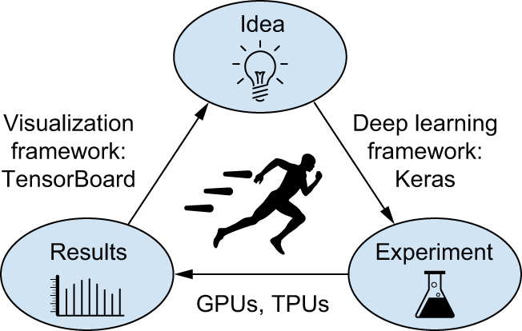
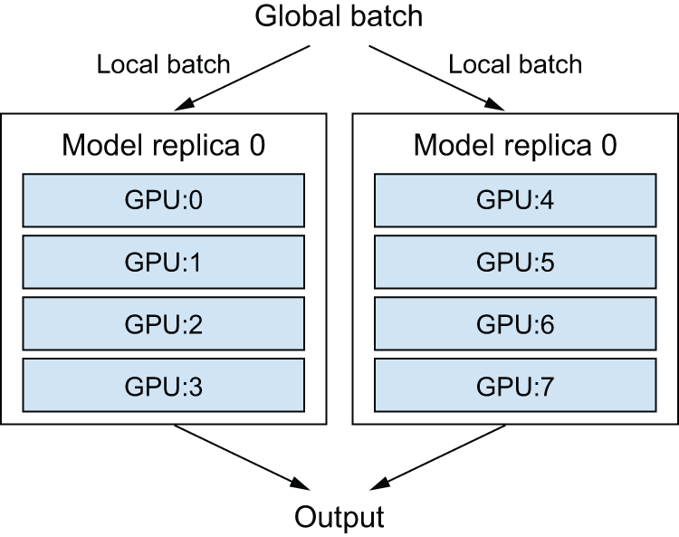
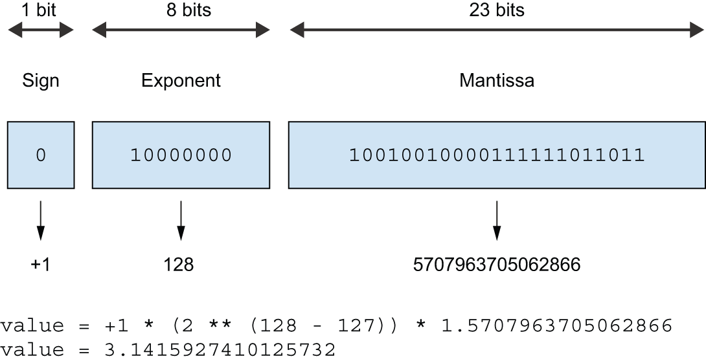

<!-- tabs:start -->

#### **Tiếng Anh (English)**

# Chapter 18: Best practices for the real world

This chapter covers

* Hyperparameter tuning
* Model ensembling
* Training Keras models on multiple GPUs or on TPU
* Mixed-precision training
* Quantization

You’ve come quite far since the beginning of this book. You can now
train image classification models, image segmentation models, models for
classification or regression on vector data, timeseries forecasting models,
text classification models, sequence-to-sequence models, and even generative
models for text and images. You’ve got all the bases covered.

However, your models so far have all been trained at a small scale
— on small datasets, with a single GPU — and they generally
haven’t reached the best achievable performance on each dataset we’ve looked at.
This book is, after all, an introductory book. If you are to go out into the real world
and achieve state-of-the-art results on brand new problems, there’s still
a bit of a chasm that you’ll need to cross.

This chapter is about bridging that gap and giving you the best practices
you’ll need as you go from machine learning student to a fully fledged machine learning
engineer. We’ll review essential techniques for systematically improving model
performance: hyperparameter tuning and model ensembling. Then we’ll look at how you can
speed up and scale up model training, with multi-GPU and TPU training, mixed precision,
and quantization.

## Getting the most out of your models

Blindly trying out different architecture configurations works well enough
if you just need something that works okay. In this section, we’ll go
beyond “works okay” to “works great and wins machine learning competitions”
via a quick guide to a set of must-know techniques for building state-of-the-art
deep learning models.

### Hyperparameter optimization

When building a deep learning model, you have to make many
seemingly arbitrary decisions: How many layers should you stack? How many
units or filters should go in each layer? Should you use `relu` as an activation,
or a different function? Should you use `BatchNormalization` after a given
layer? How much dropout should you use? And so on. These architecture-level
parameters are called *hyperparameters* to distinguish them from the
*parameters* of a model, which are trained via backpropagation.

In practice, experienced machine learning engineers and researchers build
intuition over time as to what works and what doesn’t when it comes to these
choices — they develop hyperparameter-tuning skills. But there are no formal
rules. If you want to get to the very limit of what can be achieved on a given
task, you can’t be content with such arbitrary choices.
Your initial decisions are almost always suboptimal, even if you have very good
intuition. You can refine your choices by tweaking them by hand and retraining
the model repeatedly — that’s what machine learning engineers and researchers
spend most of their time doing. But it shouldn’t be your job as a human to
fiddle with hyperparameters all day — that is better left to a machine.

Thus, you need to explore the space of possible decisions automatically and
systematically in a principled way. You need to search the architecture space
and find the best-performing ones empirically. That’s what the field of
automatic hyperparameter optimization is about: it’s an entire field of
research, and an important one.

The process of optimizing hyperparameters typically looks like this:

1. Choose a set of hyperparameters (automatically).
2. Build the corresponding model.
3. Fit it to your training data, and measure performance on the
   validation data.
4. Choose the next set of hyperparameters to try (automatically).
5. Repeat.
6. Eventually, measure performance on your test data.

The key to this process is the algorithm that analyzes the relationship between
validation performance and various hyperparameter values to choose the next set of
hyperparameters to evaluate. Many different techniques are possible: Bayesian
optimization, genetic algorithms, simple random search, and so on.

Training the weights of a model is relatively easy: you compute a loss function
on a mini-batch of data and then use backpropagation to move the
weights in the right direction. Updating hyperparameters, on the other hand,
presents unique challenges. Consider that

* The hyperparameter space is typically made of discrete decisions and thus
  isn’t continuous or differentiable. Hence, you typically can’t do gradient
  descent in hyperparameter space. Instead, you must rely on gradient-free
  optimization techniques, which, naturally, are far less efficient than gradient
  descent.
* Computing the feedback signal of this optimization process
  (does this set of hyperparameters lead to a
  high-performing model on this task?) can be extremely expensive: it requires
  creating and training a new model from scratch on your dataset.
* The feedback signal may be noisy: if a training run performs 0.2% better, is that because
  of a better model configuration or because you got lucky with the initial weight values?

Thankfully, there’s a tool that makes hyperparameter tuning simpler: KerasTuner.
Let’s check it out.

#### Using KerasTuner

Let’s start by installing KerasTuner:

```python
!pip install keras-tuner -q
```

The key idea that KerasTuner is built upon is to let you
replace hardcoded hyperparameter values, such as `units=32`, with a range
of possible choices,
such as `Int(name="units", min_value=16, max_value=64, step=16)`. The
set of such choices in a given model is called the *search space*
of the hyperparameter tuning process.

To specify a search space, define a model-building function (see the next listing).
It takes an `hp` argument, from which you can sample hyperparameter ranges,
and it returns a compiled Keras model.

```python
import keras
from keras import layers

def build_model(hp):
    # Sample hyperparameter values from the hp object. After sampling,
    # these values (such as the "units" variable here) are just regular
    # Python constants.
    units = hp.Int(name="units", min_value=16, max_value=64, step=16)
    model = keras.Sequential(
        [
            layers.Dense(units, activation="relu"),
            layers.Dense(10, activation="softmax"),
        ]
    )
    # Different kinds of hyperparameters are available: Int, Float,
    # Boolean, Choice.
    optimizer = hp.Choice(name="optimizer", values=["rmsprop", "adam"])
    model.compile(
        optimizer=optimizer,
        loss="sparse_categorical_crossentropy",
        metrics=["accuracy"],
    )
    # The function returns a compiled model.
    return model
```

[Listing 18.1](#listing-18-1): A KerasTuner model-building function

If you want to adopt a more modular and configurable approach to model-building,
you can also subclass the `HyperModel` class and define a `build` method.

```python
import keras_tuner as kt

class SimpleMLP(kt.HyperModel):
    # Thanks to the object-oriented approach, we can configure model
    # constants as constructor arguments (instead of hardcoding them in
    # the model-building function).
    def __init__(self, num_classes):
        self.num_classes = num_classes

    # The build method is identical to our prior build_model standalone
    # function.
    def build(self, hp):
        units = hp.Int(name="units", min_value=16, max_value=64, step=16)
        model = keras.Sequential(
            [
                layers.Dense(units, activation="relu"),
                layers.Dense(self.num_classes, activation="softmax"),
            ]
        )
        optimizer = hp.Choice(name="optimizer", values=["rmsprop", "adam"])
        model.compile(
            optimizer=optimizer,
            loss="sparse_categorical_crossentropy",
            metrics=["accuracy"],
        )
        return model

hypermodel = SimpleMLP(num_classes=10)
```

[Listing 18.2](#listing-18-2): A KerasTuner `HyperModel`

The next step is to define a “tuner.” Schematically, you can think of a tuner as
a `for` loop, which will repeatedly

* Pick a set of hyperparameter values
* Call the model-building function with these values to create a model
* Train the model and record its metrics

KerasTuner has several built-in tuners available — `RandomSearch`, `BayesianOptimization`, and
`Hyperband`. Let’s try `BayesianOptimization`, a tuner that attempts
to make smart predictions for which new hyperparameter values are likely to perform
best given the outcome of previous choices:

```python
tuner = kt.BayesianOptimization(
    # Specifies the model-building function (or hypermodel instance)
    build_model,
    # Specifies the metric that the tuner will seek to optimize. Always
    # specify validation metrics, since the goal of the search process
    # is to find models that generalize!
    objective="val_accuracy",
    # Maximum number of different model configurations ("trials") to
    # try before ending the search
    max_trials=20,
    # To reduce metrics variance, you can train the same model multiple
    # times and average the results. executions_per_trial is how many
    # training rounds (executions) to run for each model configuration
    # (trial).
    executions_per_trial=2,
    # Where to store search logs
    directory="mnist_kt_test",
    # Whether to overwrite data in the directory to start a new search.
    # Set this to True if you've modified the model-building function
    # or to False to resume a previously started search with the same
    # model-building function.
    overwrite=True,
)
```

You can display an overview of the search space via `search_space_summary()`:

```python
>>> tuner.search_space_summary()
Search space summary
Default search space size: 2
units (Int)
{"default": None,
 "conditions": [],
 "min_value": 128,
 "max_value": 1024,
 "step": 128,
 "sampling": None}
optimizer (Choice)
{"default": "rmsprop",
 "conditions": [],
 "values": ["rmsprop", "adam"],
 "ordered": False}
```


Objective maximization and minimization

For built-in metrics (like accuracy, in our case),
the *direction* of the metric (accuracy should be maximized,
but a loss should be minimized) is inferred by KerasTuner. However,
for a custom metric, you should specify it yourself, like this:

```python
objective = kt.Objective(
    # The metric's name, as found in epoch logs
    name="val_accuracy",
    # The metric's desired direction: "min" or "max"
    direction="max",
)
tuner = kt.BayesianOptimization(
    build_model,
    objective=objective,
    ...
)
```

Finally, let’s launch the search. Don’t forget to pass validation data
and make sure not to use your test set as validation data — otherwise,
you’d quickly start overfitting to your test data, and you wouldn’t be able
to trust your test metrics anymore:

```python
(x_train, y_train), (x_test, y_test) = keras.datasets.mnist.load_data()
x_train = x_train.reshape((-1, 28 * 28)).astype("float32") / 255
x_test = x_test.reshape((-1, 28 * 28)).astype("float32") / 255
# Reserves these for later
x_train_full = x_train[:]
y_train_full = y_train[:]
# Sets aside a validation set
num_val_samples = 10000
x_train, x_val = x_train[:-num_val_samples], x_train[-num_val_samples:]
y_train, y_val = y_train[:-num_val_samples], y_train[-num_val_samples:]
callbacks = [
    # Uses a large number of epochs (you don't know in advance how many
    # epochs each model will need) and uses an EarlyStopping callback
    # to stop training when you start overfitting
    keras.callbacks.EarlyStopping(monitor="val_loss", patience=5),
]
# This takes the same arguments as fit() (it simply passes them down to
# fit() for each new model).
tuner.search(
    x_train,
    y_train,
    batch_size=128,
    epochs=100,
    validation_data=(x_val, y_val),
    callbacks=callbacks,
    verbose=2,
)
```

The previous example will run in just a few minutes since we’re only looking at
a few possible choices and we’re training on MNIST.
However, with a typical search space and dataset, you’ll often find yourself letting the hyperparameter search run overnight
or even over several days. If your search process crashes, you can always restart
it — just specify `overwrite=False` in the tuner so that it can resume from
the trial logs stored on disk.

Once the search is complete, you can query the best hyperparameter configurations,
which you can use to create high-performing models that you can then retrain.

```python
top_n = 4
# Returns a list of HyperParameters objects, which you can pass to the
# model-building function
best_hps = tuner.get_best_hyperparameters(top_n)
```

[Listing 18.3](#listing-18-3): Querying the best hyperparameter configurations

Usually, when retraining these models,
you may want to include the validation data as part of the training data
since you won’t be making any further hyperparameter changes, and thus you will no longer
be evaluating performance on the validation data. In our example, we’d train
these final models on the totality of the original MNIST training data,
without reserving a validation set.

Before we can train on the full training data, though, there’s one last parameter
we need to settle: the optimal number of epochs to train for. Typically,
you’ll want to train the new models for longer than you did during the search:
using an aggressive `patience` value in the `EarlyStopping` callback saves
time during the search, but may lead to underfitted models. Just use the
validation set to find the best epoch:

```python
def get_best_epoch(hp):
    model = build_model(hp)
    callbacks = [
        keras.callbacks.EarlyStopping(
            # Note the very high patience value.
            monitor="val_loss", mode="min", patience=10
        )
    ]
    history = model.fit(
        x_train,
        y_train,
        validation_data=(x_val, y_val),
        epochs=100,
        batch_size=128,
        callbacks=callbacks,
    )
    val_loss_per_epoch = history.history["val_loss"]
    best_epoch = val_loss_per_epoch.index(min(val_loss_per_epoch)) + 1
    print(f"Best epoch: {best_epoch}")
    return best_epoch
```

And finally, train on the full dataset for just a bit longer than this epoch count,
since you’re training on more data — 20% more, in this case:

```python
def get_best_trained_model(hp):
    best_epoch = get_best_epoch(hp)
    model = build_model(hp)
    model.fit(
        x_train_full, y_train_full, batch_size=128, epochs=int(best_epoch * 1.2)
    )
    return model

best_models = []
for hp in best_hps:
    model = get_best_trained_model(hp)
    model.evaluate(x_test, y_test)
    best_models.append(model)
```

If you’re not worried about slightly underperforming, there’s a
shortcut you can take: just use the tuner to reload the top-performing models
with the best weights saved during the hyperparameter search, without
retraining new models from scratch:

```python
best_models = tuner.get_best_models(top_n)
```


One important issue to keep in mind when doing automatic hyperparameter
optimization at scale is validation-set overfitting. Because you’re updating
hyperparameters based on a signal that is computed using your validation data,
you’re effectively training them on the validation data, and thus, they will
quickly overfit to the validation data. Always keep this in mind.

#### The art of crafting the right search space

Overall, hyperparameter optimization is a powerful technique that is an
absolute requirement to get to state-of-the-art models on any task or to win
machine learning competitions. Think about it: once upon a time, people
handcrafted the features that went into shallow machine learning models. That
was very suboptimal. Now deep learning automates the task of
hierarchical feature engineering — features are learned using a feedback signal,
not hand-tuned, and that’s the way it should be. In the same way, you
shouldn’t handcraft your model architectures; you should optimize them in a
principled way.

However, doing hyperparameter tuning is not a replacement for being familiar
with model architecture best practices: search spaces grow combinatorially
with the number of choices, so it would be far too expensive to turn everything
into a hyperparameter and let the tuner sort it out.
You need to be smart about designing the right search space.
Hyperparameter tuning is automation, not magic: you use it to automate
experiments that you would otherwise have run by hand, but you still need
to handpick experiment configurations that have the potential to yield good metrics.

The good news: by using hyperparameter tuning, the
configuration decisions you have to make graduate from micro-decisions (What number of
units do I pick for this layer?) to higher-level architecture decisions (Should I
use residual connections throughout this model?). And while micro-decisions
are specific to a certain model and a certain dataset, higher-level decisions
generalize better across different tasks and datasets: for instance,
pretty much every image classification problem can be solved via the same
sort of search space template.

Following this logic, KerasTuner attempts to provide *premade search spaces*
that are relevant to broad categories of problems — such as image classification.
Just add data, run the search, and get a pretty good model. You can
try the hypermodels `kt.applications.HyperXception` and `kt.applications.HyperResNet`,
which are effectively tunable versions of Keras Applications models.

### Model ensembling

Another powerful technique for obtaining the best
possible results on a task is *model ensembling*. Ensembling consists of
pooling together the predictions of a set of different models to produce
better predictions. If you look at machine learning competitions — in
particular, on Kaggle — you’ll see that the winners use very large ensembles of
models that inevitably beat any single model, no matter how good.

Ensembling relies on the assumption that different well-performing models trained
independently are likely to be good for different reasons: each model looks
at slightly different aspects of the data to make its predictions, getting
part of the “truth” but not all of it. You may be familiar with the ancient
parable of the blind men and the elephant: a group of blind men come across an
elephant for the first time and try to understand what the elephant is by
touching it. Each man touches a different part of the elephant’s body — just one
part, such as the trunk or a leg. Then the men describe to each other what an
elephant is: “It’s like a snake,” “Like a pillar or a tree,” and so on. The
blind men are essentially machine learning models trying to understand the
manifold of the training data, each from its own perspective, using its own
assumptions (provided by the unique architecture of the model and the unique
random weight initialization). Each of them gets part of the truth of the
data, but not the whole truth. By pooling their perspectives together, you can
get a far more accurate description of the data. The elephant is a combination
of parts: no single blind man gets it quite right, but interviewed
together, they can tell a fairly accurate story.

Let’s use classification as an example. The easiest way to pool the predictions
of a set of classifiers (to *ensemble the classifiers*) is to average their
predictions at inference time:

```python
# Uses four different models to compute initial predictions
preds_a = model_a.predict(x_val)
preds_b = model_b.predict(x_val)
preds_c = model_c.predict(x_val)
preds_d = model_d.predict(x_val)
# This new prediction array should be more accurate than any of the
# initial ones.
final_preds = 0.25 * (preds_a + preds_b + preds_c + preds_d)
```

However, this will work only if the classifiers are more or less equally good.
If one of them is significantly worse than the others, the final predictions may not be
as good as the best classifier of the group.

A smarter way to ensemble classifiers is to do a weighted average, where the
weights are learned on the validation data — typically, the better classifiers
are given a higher weight, and the worse classifiers are given a lower weight.
To search for a good set of ensembling weights, you can use random search or a
simple optimization algorithm, such as the Nelder-Mead algorithm:

```python
preds_a = model_a.predict(x_val)
preds_b = model_b.predict(x_val)
preds_c = model_c.predict(x_val)
preds_d = model_d.predict(x_val)
# These weights (0.5, 0.25, 0.1, 0.15) are assumed to be learned
# empirically.
final_preds = 0.5 * preds_a + 0.25 * preds_b + 0.1 * preds_c + 0.15 * preds_d
```

There are many possible variants: you can do an average of an exponential of
the predictions, for instance. In general, a simple weighted average with
weights optimized on the validation data provides a very strong baseline.

The key to making ensembling work is the *diversity* of the set of classifiers.
Diversity is strength. If all the blind men only touched the elephant’s trunk,
they would agree that elephants are like snakes, and they would forever stay
ignorant of the truth of the elephant. Diversity is what makes ensembling
work. In machine learning terms, if all of your models are biased in the same
way, then your ensemble will retain this same bias. If your models are
*biased in different ways*, the biases will cancel each other out,
and the ensemble will be more robust and more accurate.

For this reason, you should ensemble models that are *as good as possible*
while being *as different as possible*. This typically means using very
different architectures or even different brands of machine learning
approaches. One thing that is largely not worth doing is ensembling the same
network trained several times independently, from different random
initializations. If the only difference between your models is their random
initialization and the order in which they were exposed to the training data,
then your ensemble will be low in diversity and will provide only a tiny
improvement over any single model.

One thing I have found to work well in practice — but that doesn’t generalize to
every problem domain — is the use of an ensemble of tree-based methods (such as
random forests or gradient-boosted trees) and deep neural networks. In 2014,
Andrei Kolev and I took fourth place in the Higgs Boson decay
detection challenge on Kaggle (www.kaggle.com/c/higgs-boson) using an ensemble
of various tree models and deep neural networks. Remarkably,
one of the models in the ensemble originated
from a different method than the others (it was a regularized greedy forest)
and had a significantly worse score than the others. Unsurprisingly, it was
assigned a small weight in the ensemble. But to our surprise, it turned out to
improve the overall ensemble by a large factor because it was so different
from every other model: it provided information that the other models didn’t
have access to. That’s precisely the point of ensembling. It’s not so much
about how good your best model is; it’s about the diversity of your set of
candidate models.

## Scaling up model training with multiple devices

Recall the “loop of progress” concept we introduced in chapter 7:
the *quality* of your ideas is a function of how many refinement cycles they’ve been through (figure 18.1).
And the speed at which you can iterate on an idea is a function of how fast
you can set up an experiment, how fast you can run that experiment,
and, finally, how well you can analyze the resulting data.




[Figure 18.1](#figure-18-1): The loop of progress

As you develop your expertise in the Keras API, how fast you can
code up your deep learning experiments will cease to be the bottleneck
of this progress cycle. The next bottleneck will become the speed at which you can
train your models. Fast training infrastructure means that you can get
your results back in 10 or 15 minutes and, hence, that you can go through dozens of
iterations every day. Faster training directly improves the *quality*
of your deep learning solutions.

In this section, you’ll learn about how to scale up your training runs by using multiple GPUs or TPUs.

### Multi-GPU training

While GPUs are getting more powerful every year,
deep learning models are also getting increasingly larger,
requiring ever more computational resources. Training on a single GPU
puts a hard bound on how fast you can move. The solution? You could simply add
more GPUs and start doing *multi-GPU distributed training*.

There are two ways to distribute computation across multiple devices:
*data parallelism* and *model parallelism*.

With data parallelism, a single model gets replicated
on multiple devices or multiple machines. Each of the model replicas processes
different batches of data, and then they merge their results.

With model parallelism, different parts of a single model run on different
devices, processing a single batch of data together at the same time.
This works best with models that have a naturally parallel architecture,
such as models that feature multiple branches. In practice, model parallelism is only used in the case of models that
are too large to fit on any single device: it isn’t used as a way to speed
up training of regular models but as a way to train larger models.

Then, of course, you can also mix both data parallelism and model parallelism:
a single model can be split across multiple devices (e.g., 4), and that split model can
be replicated across multiple groups of devices (e.g., twice, for a total of 2 \* 4 = 8 devices used).

Let’s see how that works in detail.

#### Data parallelism: Replicating your model on each GPU

Data parallelism is the most common form of distributed training.
It operates on a simple principle: divide and conquer.
Each GPU receives a copy of the entire model, called a *replica*.
Incoming batches of data are split into *N*
sub-batches, which are processed by one model replica each, in parallel.
This is why it’s called *data parallelism*: different samples (data points)
are processed in parallel.
For instance, with two GPUs, a batch of size 128 would be split into two sub-batches of size 64,
which would be processed by two model replicas. Then

* *In inference* — We would retrieve the predictions for each sub-batch and concatenate them to obtain
  the predictions for the full batch.
* *In training* — We would retrieve the gradients for each sub-batch, average them, and update
  all model replicas based on the gradient average. The state of the model would then be the same as if you
  had trained it on the full batch of 128 samples. This is called *synchronous* training,
  since all replicas are kept in sync — their weights have the same value at all times.
  Nonsynchronous alternatives exist,
  but they are less efficient and aren’t used anymore in practice.

Data parallelism is a simple and highly scalable way to train your models faster.
If you get more devices, just increase your batch size, and your training throughput increases accordingly.
It has one limitation, though: it requires your model to be able to fit into one of your devices.
However, it is now common to train foundation models that have tens of billions of parameters, which wouldn’t
fit on any single GPU.

#### Model parallelism: Splitting your model across multiple GPUs

That’s where *model parallelism* comes in. While data parallelism works by splitting
your batches of data into sub-batches and processing the sub-batches in parallel, model parallelism
works by splitting your model into submodels and running each one on a different device — in parallel.
For instance, consider the following model.

```python
model = keras.Sequential(
    [
        keras.layers.Input(shape=(16000,)),
        keras.layers.Dense(64000, activation="relu"),
        keras.layers.Dense(8000, activation="sigmoid"),
    ]
)
```

[Listing 18.4](#listing-18-4): A large densely connected model

Each sample has 16,000 features and gets classified into 8,000 potentially overlapping categories
by two `Dense` layers. Those are large layers — the first one has about 1 billion parameters,
and the last one has about 512 million parameters. If you’re working with two small devices,
you won’t be able to use data parallelism, since you can’t fit the model on a single device.
What you can do is *split* a single instance of the model across multiple devices. This is often called
*sharding* or *partitioning* a model.
There are two main ways to split a model across devices: horizontal partitioning and vertical partitioning.

In horizontal partitioning, each device processes different layers of the model.
For example, in the previous model, one GPU would handle the first `Dense` layer, and the other one would handle the second `Dense` layer.
The main drawback of this approach is that it can introduce communication overhead.
For example, the output of the first layer needs to be copied to the second device
before it can be processed by the second layer. This can become a bottleneck, especially if the output of the first layer is large
— you’d risk keeping your GPUs idle.

In vertical partitioning, each layer is split across all available devices. Since layers are usually implemented in terms of
`matmul` or `convolution` operations, which are highly parallelizable,
this strategy is easy to implement in practice and is almost always the best fit for large models.
For example, in the previous model, you could split the kernel and bias of the first `Dense` layer into two halves
so that each device only receives a kernel of shape `(16000, 32000)` (split along its last axis) and a bias of shape
`(32000,)`. You’d compute `matmul(inputs, kernel) + bias` with this half-kernel and half-bias for each device,
and you’d merge the two outputs by concatenating them like this:

```python
half_kernel_0 = kernel[:, :32000]
half_bias_0 = bias[:32000]

half_kernel_1 = kernel[:, 32000:]
half_bias_1 = bias[32000:]

with keras.device("gpu:0"):
    half_output_0 = keras.ops.matmul(inputs, half_kernel_0) + half_bias_0

with keras.device("gpu:1"):
    half_output_1 = keras.ops.matmul(inputs, half_kernel_1) + half_bias_1
```

In reality, you will want to mix data parallelism and model parallelism. You will split your model across, say, four devices, and you will replicate
that split model across multiple groups of two devices — let’s say two — each processing one sub-batch of data in parallel. You will then have two replicas, each running on four devices, for a total of eight devices used (figure 18.2).




[Figure 18.2](#figure-18-2): Distributing a model across eight devices: two model replicas, each handled by a group of four devices

### Distributed training in practice

Now let’s see how to implement these concepts in practice.
We will only cover the JAX backend, as it is the most performant
and most scalable of the various Keras backends, by a mile. If you’re doing
any kind of large-scale distributed training and you aren’t using JAX, you’re making a mistake
— and wasting your dollars burning way more compute than you actually need.

#### Getting your hands on two or more GPUs

First, you need to get access to several GPUs. As of now,
Google Colab only lets you use a single GPU, so you will need to do one of two things:

* Acquire two to eight GPUs, mount them on a single machine (it will require a beefy power supply),
  and install CUDA drivers, cuDNN, etc. For most people, this isn’t the best option.
* Rent a multi-GPU virtual machine (VM) on Google Cloud, Azure, or AWS. You’ll be able to use
  VM images with pre-installed drivers and software, and you’ll have very little
  setup overhead. This is likely the best option for anyone who isn’t training models 24/7.

We won’t cover the details of how to spin up multi-GPU cloud VMs because such
instructions would be relatively short-lived, and this information is
readily available online.

#### Using data parallelism with JAX

Using data parallelism with Keras and JAX is very simple: before building your model, just
add the following line of code:

```python
keras.distribution.set_distribution(keras.distribution.DataParallel())
```

That’s it.

If you want more granular control, you can specify which devices you want to use. You can list
available devices via

```python
keras.distribution.list_devices()
```

It will return a list of strings — the names of your devices, such as `"gpu:0"`, `"gpu:1"`, and so on.
You can then pass these to the `DataParallel` constructor:

```python
keras.distribution.set_distribution(
    keras.distribution.DataParallel(["gpu:0", "gpu:1"])
)
```

In an ideal world, training on *N* GPUs would result in a speedup of factor *N*.
In practice, however, distribution introduces some overhead — in particular,
merging the weight deltas originating from different devices takes some time.
The effective speedup you get is a function of the number of GPUs used:

* With two GPUs, the speedup stays close to 2×.
* With four, the speedup is around 3.8×.
* With eight, it’s around 7.3×.

This assumes that you’re using a large-enough global batch size to keep
each GPU utilized at full capacity. If your batch size is too small, the local
batch size won’t be enough to keep your GPUs busy.

#### Using model parallelism with JAX

Keras also provides powerful tools for fully customizing how you want to do distributed training,
including model parallel training and any mixture of data parallel and model parallel training you can imagine.
Let’s dive in.

##### The DeviceMesh API

First, you need to understand the concept of a *device mesh*.
A device mesh is simply a grid of devices. Consider this example, with eight GPUs:

```python
gpu:0   |   gpu:4
--------|---------
gpu:1   |   gpu:5
--------|---------
gpu:2   |   gpu:6
--------|---------
gpu:3   |   gpu:7
```

The big idea is to separate devices into groups, organized along axes. Typically, one axis will be responsible
for data parallelism, and one axis will be responsible for model parallelism (like in figure 18.2, your devices form a grid,
where the horizontal axis handles data parallelism and the vertical axis handles model parallelism).

A device mesh doesn’t have to be 2D — it could be any shape you want. In practice, however, you will only ever see
1D and 2D meshes.

Let’s make a 2 × 4 device mesh in Keras:

```python
device_mesh = keras.distribution.DeviceMesh(
    # We assume eight devices, organized as a 2 × 4 grid.
    shape=(2, 4),
    # It's convenient to give your axes meaningful names!
    axis_names=["data", "model"],
)
```

Mind you, you can also explicitly specify the devices you want to use:

```python
devices = [f"gpu:{i}" for i in range(8)]
device_mesh = keras.distribution.DeviceMesh(
    shape=(2, 4),
    axis_names=["data", "model"],
    devices=devices,
)
```

As you may have guessed from the `axis_names` argument, we intend to use
the devices along axis 0 for data parallelism
and the devices along axis 1 for model parallelism. Since there are two devices along
axis 0 and four along axis 1, we’ll split our model’s computation across four GPUs,
and we’ll make two copies of our split model, running each copy on a different sub-batch of data
in parallel.

Now that we have our mesh, we need to tell
Keras how to split different pieces of computation across our devices.
For that, we’ll use the `LayoutMap` API.

##### The LayoutMap API

To specify where different bits of computation should take place, we use *variables*
as our frame of reference. We will split or replicate variables across our devices,
and we will let the compiler move all computation associated with that part of the variable
to the corresponding device.

Consider a variable. Its shape is, let’s say, `(32, 64)`. There are two things you could do with this variable:

* You could *replicate it* (copy it) across an axis of your mesh so each device along that axis sees the same value.
* You could *shard it* (split it) across an axis of your mesh — for instance, you could shard it into four chunks of
  shape `(32, 16)` — so that each device along that axis sees one different chunk.

Now, do note that our variable has two dimensions. Importantly, “sharding” or “replicating” are decisions
that you can make independently for each dimension of the variable.

The API you will use to tell Keras about such decisions is the `LayoutMap` class.
A `LayoutMap` is similar to a dictionary. It maps model variables
(for instance, the kernel variable of the first dense layer in your model)
to a bit of information about how that variable should be replicated or sharded over a device mesh.
Specifically, it maps a *variable path*
to a tuple that has as many entries as your variable has dimensions,
where each entry specifies what to do with that variable dimension.
It looks like this:

```python
{
    # None means "replicate the variable along this dimension."
    "sequential/dense_1/kernel": (None, "model"),
    # "model" means "shard the variable along this dimension across the
    # devices of the model axis of the device mesh."
    "sequential/dense_1/bias": ("model",),
    ...
}
```

This is the first time you encountered the concept of a *variable path* — it is simply
a string identifier that looks like `"sequential/dense_1/kernel"`. It’s a useful way to
refer to a variable without keeping a handle on the actual variable instance.

Here’s how you can print the paths for all variables in a model:

```python
for v in model.variables:
    print(v.path)
```

On the example model from listing 18.4, here’s what we get:

```python
sequential/dense/kernel
sequential/dense/bias
sequential/dense_1/kernel
sequential/dense_1/bias
```

Now let’s shard and replicate these variables. In the case of a simple model like this one,
your go-to rule of thumb for variable sharding should be as follows:

* Shard the last dimension of the variable along the `"model"` mesh axis.
* Leave all other dimensions as replicated.

Simple enough, right? Like this:

```python
layout_map = keras.distribution.LayoutMap(device_mesh)
layout_map["sequential/dense/kernel"] = (None, "model")
layout_map["sequential/dense/bias"] = ("model",)
layout_map["sequential/dense_1/kernel"] = (None, "model")
layout_map["sequential/dense_1/bias"] = ("model",)
```

Finally, we tell Keras to refer to this sharding layout when instantiating the variables
by setting the distribution configuration like this:

```python
model_parallel = keras.distribution.ModelParallel(
    layout_map=layout_map,
    # This argument tells Keras to use the mesh axis named "data" for
    # data parallelism.
    batch_dim_name="data",
)
keras.distribution.set_distribution(model_parallel)
```

Once the distribution configuration is set, you can create your model and `fit()` it.
No other part of your code changes — your model definition code is the same, and your training code is the same.
That’s true whether you’re using built-in APIs like `fit()` and `evaluate()` or your own training logic.
Assuming that you have the right `LayoutMap` for your variables,
the little code snippets you just saw are enough to distribute computation for any large language model training run — it scales
to as many devices as you have available and arbitrary model sizes.

To check how your variables were sharded, you can inspect the `variable.value.sharding` property, like this:

```python
>>> model.layers[0].kernel.value.sharding
NamedSharding(
    mesh=Mesh("data": 2, "model": 4),
    spec=PartitionSpec(None, "model")
)
```

You can even visualize it via the JAX utility `jax.debug.visualize_sharding`:

```python
import jax

value = model.layers[0].kernel.value
jax.debug.visualize_sharding(value.shape, value.sharding)
```


tf.data performance tips

When doing distributed training, always provide your data as a `tf.data.Dataset` object
to guarantee best performance (passing your data as NumPy arrays also works since
those get converted to `Dataset` objects by `fit()`).
You should also make sure to use
data prefetching: before passing the dataset to `fit()`, call
`dataset.prefetch(buffer_size)`. If you aren’t sure what buffer size to pick,
try the `dataset.prefetch(tf.data.AUTOTUNE)` option, which will pick a buffer
size for you.

### TPU training

Beyond just GPUs, there is generally a trend in the deep learning world
toward moving workflows to increasingly specialized hardware designed specifically for
deep learning workflows; such single-purpose chips are known as ASICs (application-specific integrated circuits).
Various companies big and small are working on new chips, but today the most prominent
effort along these lines is Google’s Tensor Processing Unit (TPU),
which is available on Google Cloud and via Google Colab.

Training on TPU does involve jumping through some hoops. But it’s worth the extra work:
TPUs are really, really fast. Training on a TPU v2 (available on Colab) will typically be 15× faster than
training a NVIDIA P100 GPU. For most models,
TPU training ends up being 3× more cost-effective than GPU training on average.

You can actually use TPU v2 for free in Colab. In the Colab menu,
under the Runtime tab, in the Change Runtime Type option,
you’ll notice that you have access to a TPU runtime in addition to the GPU
runtime. For more serious training runs, Google Cloud also makes available
TPU v3 through v5, which are even faster.

When running Keras code with the JAX backend on a TPU-enabled notebook,
you don’t need anything more than calling `keras.distribution.set_distribution(distribution)`
with a `DataParallel` or `ModelParallel` distribution instance to start using
your TPU cores. Make sure to call it before creating your model!

Because TPUs can process batches of data extremely quickly,
the speed at which you can read data from Google Cloud Storage (GCS) can easily become a bottleneck.
If your dataset is small enough, you should keep it in the memory of the virtual machine.
You can do so by calling `dataset.cache()` on your `tf.data.Dataset` instance.
That way, the data will only be read from GCS once.

#### Using step fusing to improve TPU utilization

Because a TPU has a lot of compute power available, you need to train with
very large batches to keep the TPU cores busy. For small models, the batch
size required can get extraordinarily large — upward of 10,000 samples per batch.
When working with enormous batches, you should make sure to increase your
optimizer learning rate accordingly: you’re going to be making fewer updates
to your weights, but each update will be more accurate (since the gradients are computed
using more data points); hence, you should move the weights by a greater magnitude
with each update.

There is, however, a simple trick you can use to keep reasonably sized
batches while maintaining full TPU utilization: *step fusing*. The idea
is to run multiple steps of training during each TPU execution step. Basically,
do more work in between two roundtrips from the virtual machine memory to the TPU. To do this,
simply specify the `steps_per_execution` argument in `compile()` — for instance,
`steps_per_execution=8` to run eight steps of training during each TPU execution.
For small models that are underutilizing the TPU, this can result in a dramatic
speedup:

```python
model.compile(..., steps_per_execution=8)
```

## Speeding up training and inference with lower-precision computation

What if I told you there’s a simple technique you could use to speed up training and inference
of almost any model by up to 2×, basically for free? It seems too good to be true,
and yet, such a trick does exist.
To understand how it works, first, we need to take a look at the notion
of “precision” in computer science.

#### Understanding floating-point precision

Precision is to numbers what resolution is to images.
Because computers can only process 1s and 0s, any number seen by a computer
has to be encoded as a binary string.
For instance, you may be familiar with `uint8` integers,
which are integers encoded on eight bits: `00000000` represents `0` in `uint8`, and
`11111111` represents 255. To represent integers beyond 255, you’d need to add
more bits — eight isn’t enough. Most integers are stored on 32 bits,
with which we can represent signed integers ranging from −2147483648 to 2147483647.

Floating-point numbers are the same. In mathematics, real numbers form a continuous
axis: there’s an infinite number of points in between any two numbers.
You can always zoom in on the axis of reals. In computer science, this isn’t true:
there’s only a finite number of intermediate points between 3 and 4, for instance.
How many? Well, it depends on the *precision* you’re working with: the number of bits you’re using
to store a number. You can only zoom up to a certain resolution.

There are three levels of precision you’d typically use:

* Half precision, or `float16`, where numbers are stored on 16 bits
* Single precision, or `float32`, where numbers are stored on 32 bits
* Double precision, or `float64`, where numbers are stored on 64 bits

You could even go up to `float8`, as you’ll see in a bit.

On floating-point encoding

A counterintuitive fact about floating-point numbers is
that representable numbers are not uniformly distributed.
Larger numbers have lower precision: there’s the same number of representable
values between `2 ** N` and `2 ** (N + 1)` as there is between 1 and 2,
for any *N*.

That’s because floating-point numbers are encoded
in three parts — the sign, the significant value (called the *mantissa*), and
the exponent in the form

`{sign} * (2 ** ({exponent} - 127)) * 1.{mantissa}`

For example, figure 18.3 demonstrates how you would encode the closest `float32` value approximating
Pi:




[Figure 18.3](#figure-18-3): The number Pi encoded in single precision via a sign bit, an integer exponent, and an integer mantissa

For this reason, the numerical error incurred when converting a number to
its floating-point representation can vary wildly depending on the exact value
considered, and the error tends to get larger for numbers with a large absolute value.

The way to think about the resolution of floating-point numbers is in terms
of the smallest distance between two arbitrary numbers that you’ll be able to safely
process. In single precision, that’s around 1e-7. In double precision, that’s around
1e-16. And in half precision, it’s only 1e-3.

#### Float16 inference

Every model you’ve seen in this book so far has used single-precision numbers: it stored
its state as `float32` weight variables and ran its computations on `float32` inputs.
That’s enough precision to run the forward and backwards pass of a model
without losing any information — in particular when it comes to small gradient updates
(recall that the typically learning rate is 1e-3, and it’s pretty common to see
weight updates on the order of 1e-6).

Modern GPUs and TPUs feature specialized hardware that
can run 16-bit operations much faster and using less memory
than equivalent 32-bit operations. By using these lower-precision operations
whenever possible, you can speed up training on those devices by a significant
factor. You can set the default floating point precision to `float16`
in Keras via

```python
import keras

keras.config.set_dtype_policy("float16")
```

Note that this should be done before you define your model. Doing this will net you a nice
speedup for model inference, for instance, via `model.predict()`. You should expect a nearly 2× speed boost on GPU and TPU.

There’s also an alternative to `float16` that works better on some devices, in particular TPUs: `bfloat16`.
`bfloat16` is also a 16-bit precision floating-point type, but it differs from `float16` in its structure:
it uses 8 exponent bits instead of 5, and 7 mantissa bits instead of 10 (see table 18.1). This means it can
cover a much wider range of values, but it has a lower “resolution” over this range.
Some devices are better optimized for `bfloat16` compared to `float16`, so it can be a good idea to try both before settling for the option
that turns out to be the fastest.

| dtype | `float16` | `bfloat16` |
| --- | --- | --- |
| Exponent bits | 5 | 8 |
| Mantissa bits | 10 | 7 |
| Sign bits | 1 | 1 |

[Table 18.1](#table-18-1): Difference between `float16` and `bfloat16`

#### Mixed-precision training

Setting your default float precision to 16 bits is a great way to speed up inference.
Now, when it comes to training, there’s a significant complication.
The gradient descent process wouldn’t run smoothly in `float16` or `bfloa16`, since we couldn’t represent
small gradient updates of around 1e-5 or 1e-6, which are quite common.

You can, however, use a hybrid approach: that’s what *mixed-precision training* is about.
The idea is to use 16-bit computation in places where precision
isn’t an issue, while working with 32-bit values in other places to maintain
numerical stability — in particular, when handling gradients and variable updates.
By maintaining the precision-sensitive parts of
the model in full precision, you can get most of the speed benefits of 16-bit computation
without meaningfully impacting model quality.

You can turn on mixed precision like this:

```python
import keras

keras.config.set_dtype_policy("mixed_float16")
```

Typically, most of the forward pass of the model will be done in `float16`
(with the exception of numerically unstable operations like softmax),
while the weights of the model will be stored and updated in `float32`. Your `float16` gradients
will be cast to `float32` before updating the `float32` variables.

Keras layers have a `variable_dtype` and a `compute_dtype` attribute. By default,
both of these are set to `float32`. When you turn on mixed precision, the
`compute_dtype` of most layers switches to `float16`. As a result, those layer will cast their
inputs to `float16` and will perform their computation in `float16`
(using half-precision copies of the weights). However, since their `variable_dtype`
is still `float32`, their weights will be able to receive accurate `float32` updates
from the optimizer, as opposed to half-precision updates.

Some operations may be numerically unstable in `float16` (in particular,
softmax and crossentropy). If you need to opt out of mixed precision
for a specific layer, just pass the argument `dtype="float32"` to the
constructor of this layer.

#### Using loss scaling with mixed precision

During training, gradients can become very small. When using mixed precision, your gradients remain in `float16` (same as the forward pass).
As a result, the limited range of representable numbers can cause small gradients to be rounded down to zero.
This prevents the model from learning effectively.

Gradient values are proportional to the loss value, so to encourage gradients to be larger, a
simple trick is to multiply the loss by a large scalar factor. Your gradients will then
be much less likely to get rounded to zero.

Keras makes this easy. If you want to use a fixed loss scaling factor, you can simply pass a `loss_scale_factor` argument to your optimizer
like this:

```python
optimizer = keras.optimizers.Adam(learning_rate=1e-3, loss_scale_factor=10)
```

If you would like for the optimizer to automatically figure out the right scaling factor, you can also use the `LossScaleOptimizer` wrapper:

```python
optimizer = keras.optimizers.LossScaleOptimizer(
    keras.optimizers.Adam(learning_rate=1e-3)
)
```

Using `LossScaleOptimizer` is usually your best option: the right scaling value can change over the course of training!

#### Beyond mixed precision: float8 training

If running your forward pass in 16-bit precision yields such neat performance benefits, you might want to ask: Could we go even lower?
What about 8-bit precision? Four bits, maybe? Two bits? The answer is, it’s complicated.

Mixed precision training using `float16` in the forward pass is that last level of precision that “just works” — `float16` precision
has enough bits to represent all intermediate tensors (except for gradient updates, which is why we use `float32` for those).
This is no longer true if you go down to `float8` precision: you are simply losing too much information.
It is still possible to use `float8` in some computations, but this requires you to make considerable modifications to your forward pass.
You will *not* be able to simply set your `compute_dtype` to `float8` and run.

The Keras framework provides a built-in implementation for `float8` training. Because it specifically targets Transformer use cases,
it only covers a restricted set of layers: `Dense`, `EinsumDense` (the version of `Dense` that is used by the `MultiHeadAttention` layer),
and `Embedding` layers. The way it works is not simple — it keeps track of past activation values to rescale activations at each step so as to utilize the full range of values representable in `float8`. It also needs to override part of the backward pass to do the same with gradient values.

Importantly, this added overhead has a computational cost. If your model is too small or if your GPU isn’t powerful enough, that cost will exceed the benefits of
doing certain operations in `float8`, and you will see a slowdown instead of a speedup. `float8` training is only viable for very large models (typically over 5B parameters) and large, recent GPUs such as the NVDIA H100. `float8` is rarely used in practice, except in foundation model training runs.

### Faster inference with quantization

Running inference in `float16` — or even `float8` — will result in a nice speedup for your models. But there’s also another trick
you can use: *`int8` quantization*. The big idea is to take an already trained model with weights in `float32` and convert these weights
to a lower-precision dtype (typically `int8`) while preserving the numerical correctness of the forward pass as much as possible.

If you want to implement quantization from scratch, the math is simple: the general idea is to scale all `matmul` input tensors by a certain factor so that their coefficients fit in the range representable with `int8`, which is `[-127, 127]` — a total of 256 possible values. After scaling the inputs, you cast them to `int8` and perform the `matmul` operation in `int8` precision, which should be quite a bit faster than `float16`. Finally, you cast the output back to `float32`, and you divide it by the product of the input scaling factors. Since `matmul` is a linear operation, this final unscaling cancels out the initial scaling, and you should get the same output as if you used the original values — any loss of accuracy only comes from the value rounding that happens when you cast the inputs to `int8`.

Let’s make this concrete with an example. Let’s say you want to perform `matmul(x, kernel)`, with the following values:

```python
from keras import ops

x = ops.array([[0.1, 0.9], [1.2, -0.8]])
kernel = ops.array([[-0.1, -2.2], [1.1, 0.7]])
```

If you were to naively cast these values to `int8` without scaling first, that would be very destructive — for instance, your `x` would become `[[0, 0], [1, 0]]`. So let’s apply the “abs-max” scaling scheme, which spreads out the values of each tensor across the `[-127, 127]` range:

```python
def abs_max_quantize(value):
    # Max of absolute value of the tensor
    abs_max = ops.max(ops.abs(value), keepdims=True)
    # Scale is max of int range divided by max of tensor (1e-7 is to
    # avoid dividing by 0).
    scale = ops.divide(127, abs_max + 1e-7)
    # Scales the value
    scaled_value = value * scale
    # Rounding and clipping first is more accurate than directly
    # casting.
    scaled_value = ops.clip(ops.round(scaled_value), -127, 127)
    # Casts to int8
    scaled_value = ops.cast(scaled_value, dtype="int8")
    return scaled_value, scale

int_x, x_scale = abs_max_quantize(x)
int_kernel, kernel_scale = abs_max_quantize(kernel)
```

Now we can perform a faster `matmul` and unscale the output:

```python
int_y = ops.matmul(int_x, int_kernel)
y = ops.cast(int_y, dtype="float32") / (x_scale * kernel_scale)
```

How accurate is it? Let’s compare our `y` with the output of the `float32` `matmul`:

```python
>>> y
array([[ 0.9843736,  0.3933239],
       [-1.0151455, -3.1965137]])
>>> ops.matmul(x, kernel)
array([[ 0.98      ,  0.40999997],
       [-1.        , -3.2       ]])
```

Pretty accurate! For a large `matmul`, doing this will save you a lot of compute, since `int8` computation can be considerably faster than even `float16` computation,
and you only had to add fairly fast elementwise ops to the computation graphs — `abs`, `max`, `clip`, `cast`, `divide`, `multiply`.

Now, of course, I don’t expect you to ever implement quantization by hand — that would be tremendously impractical. Similarly to `float8`, `int8` quantization
is built directly into specific Keras layers: `Dense`, `EinsumDense`, and `Embedding`. This unlocks `int8` inference support for any Transformer-based model.
Here’s how to use it with any Keras model that includes such layers:

```python
# Instantiates a model (or any quantizable layer)
model = ...
# Boom!
model.quantize("int8")
# Now predict() and call() will run (partially) in int8!
predictions = model.predict(...)
```

## Summary

* You can use hyperparameter tuning and KerasTuner to automate the tedium out
  of finding the best model configuration. But be mindful of validation-set overfitting!
* An ensemble of diverse models can often significantly improve the quality of your predictions.
* To further scale your workflows, you can use *data parallelism* to train a model on multiple devices, as
  long as the model is small enough to fit on a single device.
* For larger models, you can also use *model parallelism* to split your model’s variables and computation
  across several devices.
* You can speed up model training on GPUs or TPUs by turning on mixed precision — you’ll generally get
  a nice speed boost at virtually no cost.
* You can also speed up inference by using `float16` precision or even `int8` quantization.

#### **Tiếng Việt (Vietnamese)**

# Chương 18: Những phương pháp thực hành tốt nhất cho thế giới thực

Chương này bao gồm

* Điều chỉnh siêu tham số
* Tổ hợp mô hình
* Đào tạo các mô hình Keras trên nhiều GPU hoặc trên TPU
* Đào tạo có độ chính xác hỗn hợp
* Lượng tử hóa

Bạn đã tiến khá xa kể từ đầu cuốn sách này. Giờ đây, bạn có thể huấn luyện các mô hình phân loại hình ảnh, mô hình phân đoạn hình ảnh, mô hình phân loại hoặc hồi quy trên dữ liệu vectơ, mô hình dự báo chuỗi thời gian, mô hình phân loại văn bản, mô hình theo trình tự và thậm chí cả mô hình tổng quát cho văn bản và hình ảnh. Bạn đã có tất cả các cơ sở được bảo hiểm.

Tuy nhiên, các mô hình của bạn cho đến nay đều đã được đào tạo ở quy mô nhỏ — trên các tập dữ liệu nhỏ, với một GPU duy nhất — và nhìn chung chúng chưa đạt được hiệu suất tốt nhất có thể đạt được trên mỗi tập dữ liệu mà chúng tôi đã xem xét. Cuối cùng, cuốn sách này là một cuốn sách giới thiệu. Nếu bạn muốn bước ra ngoài thế giới thực và đạt được những kết quả tiên tiến nhất cho những vấn đề hoàn toàn mới, thì vẫn còn một chút vực thẳm mà bạn cần phải vượt qua.

Chương này nói về việc thu hẹp khoảng cách đó và cung cấp cho bạn những phương pháp thực hành tốt nhất mà bạn cần khi từ một sinh viên học máy trở thành một kỹ sư học máy chính thức. Chúng tôi sẽ xem xét các kỹ thuật thiết yếu để cải thiện hiệu suất mô hình một cách có hệ thống: điều chỉnh siêu tham số và kết hợp mô hình. Sau đó, chúng ta sẽ xem cách bạn có thể tăng tốc và mở rộng quy mô đào tạo mô hình bằng đào tạo đa GPU và TPU, độ chính xác hỗn hợp và lượng tử hóa.

## Tận dụng tối đa các mô hình của bạn

Việc thử mù quáng các cấu hình kiến ​​trúc khác nhau sẽ hoạt động đủ tốt nếu bạn chỉ cần thứ gì đó hoạt động ổn. Trong phần này, chúng ta sẽ đi xa hơn “hoạt động ổn” để “hoạt động tốt và giành chiến thắng trong các cuộc thi học máy” thông qua hướng dẫn nhanh về một tập hợp các kỹ thuật cần biết để xây dựng các mô hình học sâu hiện đại.

### Tối ưu hóa siêu tham số

Khi xây dựng một mô hình deep learning, bạn phải đưa ra nhiều quyết định dường như tùy tiện: Bạn nên xếp chồng bao nhiêu lớp? Có bao nhiêu đơn vị hoặc bộ lọc nên có trong mỗi lớp? Bạn nên sử dụng `relu` làm chức năng kích hoạt hay chức năng khác? Bạn có nên sử dụng `BatchNormalization` sau một lớp nhất định không? Bạn nên sử dụng bao nhiêu lần bỏ học? Và vân vân. Các tham số cấp độ kiến ​​trúc này được gọi là *siêu tham số* để phân biệt chúng với *tham số* của một mô hình, được đào tạo thông qua lan truyền ngược.

Trong thực tế, các kỹ sư và nhà nghiên cứu máy học có kinh nghiệm dần dần xây dựng trực giác về điều gì hiệu quả và điều gì không khi đưa ra những lựa chọn này - họ phát triển các kỹ năng điều chỉnh siêu tham số. Nhưng không có quy tắc chính thức. Nếu bạn muốn đạt đến giới hạn cuối cùng của những gì có thể đạt được trong một nhiệm vụ nhất định, bạn không thể hài lòng với những lựa chọn tùy tiện như vậy. Những quyết định ban đầu của bạn hầu như luôn ở mức dưới mức tối ưu, ngay cả khi bạn có trực giác rất tốt. Bạn có thể tinh chỉnh các lựa chọn của mình bằng cách điều chỉnh chúng bằng tay và đào tạo lại mô hình nhiều lần - đó là điều mà các kỹ sư và nhà nghiên cứu máy học dành phần lớn thời gian để làm. Nhưng công việc của bạn với tư cách là một con người không phải là phải loay hoay với các siêu tham số cả ngày - điều đó tốt hơn nên để cho máy móc thực hiện.

Vì vậy, bạn cần khám phá không gian của các quyết định khả thi một cách tự động và có hệ thống theo cách có nguyên tắc. Bạn cần tìm kiếm không gian kiến ​​trúc và tìm ra những kiến ​​trúc hoạt động tốt nhất theo kinh nghiệm. Đó chính là nội dung của lĩnh vực tối ưu hóa siêu tham số tự động: đó là toàn bộ lĩnh vực nghiên cứu và là một lĩnh vực quan trọng.

Quá trình tối ưu hóa siêu tham số thường trông như thế này:

1. Chọn một bộ siêu tham số (tự động). 2. Xây dựng mô hình tương ứng. 3. Điều chỉnh nó phù hợp với dữ liệu đào tạo của bạn và đo lường hiệu suất trên dữ liệu xác thực. 4. Chọn bộ siêu tham số tiếp theo để thử (tự động). 5. Lặp lại. 6. Cuối cùng, đo lường hiệu suất trên dữ liệu thử nghiệm của bạn.

Chìa khóa của quá trình này là thuật toán phân tích mối quan hệ giữa hiệu suất xác thực và các giá trị siêu tham số khác nhau để chọn bộ siêu tham số tiếp theo để đánh giá. Có thể áp dụng nhiều kỹ thuật khác nhau: tối ưu hóa Bayes, thuật toán di truyền, tìm kiếm ngẫu nhiên đơn giản, v.v.

Việc huấn luyện các trọng số của một mô hình tương đối dễ dàng: bạn tính toán hàm mất mát trên một lô dữ liệu nhỏ và sau đó sử dụng lan truyền ngược để di chuyển các trọng số theo đúng hướng. Mặt khác, việc cập nhật siêu tham số đặt ra những thách thức đặc biệt. Hãy xem xét điều đó

* Không gian siêu tham số thường được tạo ra từ các quyết định rời rạc và do đó
không liên tục hoặc khả vi. Do đó, bạn thường không thể thực hiện chuyển màu
đi xuống trong không gian siêu tham số. Thay vào đó, bạn phải dựa vào gradient-free
các kỹ thuật tối ưu hóa, tất nhiên, kém hiệu quả hơn nhiều so với độ dốc
đi xuống.
* Tính toán tín hiệu phản hồi của quá trình tối ưu hóa này
(tập hợp các siêu tham số này có dẫn đến một
mô hình có hiệu suất cao trong nhiệm vụ này?) có thể cực kỳ tốn kém: nó đòi hỏi
tạo và đào tạo mô hình mới từ đầu trên tập dữ liệu của bạn.
* Tín hiệu phản hồi có thể bị nhiễu: nếu quá trình huấn luyện hoạt động tốt hơn 0,2% thì đó là vì
về cấu hình mô hình tốt hơn hay vì bạn gặp may mắn với các giá trị trọng lượng ban đầu?

Rất may, có một công cụ giúp việc điều chỉnh siêu tham số trở nên đơn giản hơn: KerasTuner. Hãy kiểm tra nó.

#### Sử dụng KerasTuner

Hãy bắt đầu bằng cách cài đặt KerasTuner:

```python
!pip install keras-tuner -q
```

Ý tưởng chính mà KerasTuner được xây dựng dựa trên đó là cho phép bạn thay thế các giá trị siêu tham số được mã hóa cứng, chẳng hạn như `units=32`, bằng một loạt các lựa chọn có thể có, chẳng hạn như `Int(name="units", min_value=16, max_value=64, step=16)`. Tập hợp các lựa chọn như vậy trong một mô hình nhất định được gọi là *không gian tìm kiếm* của quá trình điều chỉnh siêu tham số.

Để chỉ định không gian tìm kiếm, hãy xác định hàm xây dựng mô hình (xem danh sách tiếp theo). Nó nhận một đối số `hp`, từ đó bạn có thể lấy mẫu các phạm vi siêu tham số và nó trả về một mô hình Keras đã biên dịch.

```python
import keras
from keras import layers

def build_model(hp):
    # Sample hyperparameter values from the hp object. After sampling,
    # these values (such as the "units" variable here) are just regular
    # Python constants.
    units = hp.Int(name="units", min_value=16, max_value=64, step=16)
    model = keras.Sequential(
        [
            layers.Dense(units, activation="relu"),
            layers.Dense(10, activation="softmax"),
        ]
    )
    # Different kinds of hyperparameters are available: Int, Float,
    # Boolean, Choice.
    optimizer = hp.Choice(name="optimizer", values=["rmsprop", "adam"])
    model.compile(
        optimizer=optimizer,
        loss="sparse_categorical_crossentropy",
        metrics=["accuracy"],
    )
    # The function returns a compiled model.
    return model
```

[Liệt kê 18.1](#listing-18-1): Hàm xây dựng mô hình KerasTuner

Nếu bạn muốn áp dụng cách tiếp cận mô-đun và có thể định cấu hình hơn để xây dựng mô hình, bạn cũng có thể phân lớp lớp `HyperModel` và xác định phương thức `build`.

```python
import keras_tuner as kt

class SimpleMLP(kt.HyperModel):
    # Thanks to the object-oriented approach, we can configure model
    # constants as constructor arguments (instead of hardcoding them in
    # the model-building function).
    def __init__(self, num_classes):
        self.num_classes = num_classes

    # The build method is identical to our prior build_model standalone
    # function.
    def build(self, hp):
        units = hp.Int(name="units", min_value=16, max_value=64, step=16)
        model = keras.Sequential(
            [
                layers.Dense(units, activation="relu"),
                layers.Dense(self.num_classes, activation="softmax"),
            ]
        )
        optimizer = hp.Choice(name="optimizer", values=["rmsprop", "adam"])
        model.compile(
            optimizer=optimizer,
            loss="sparse_categorical_crossentropy",
            metrics=["accuracy"],
        )
        return model

hypermodel = SimpleMLP(num_classes=10)
```

[Danh sách 18.2](#listing-18-2): KerasTuner `HyperModel`

Bước tiếp theo là xác định một “bộ điều chỉnh”. Về mặt sơ đồ, bạn có thể coi bộ điều chỉnh như một vòng lặp `for`, nó sẽ lặp đi lặp lại

* Chọn một tập hợp các giá trị siêu tham số
* Gọi hàm xây dựng mô hình với các giá trị này để tạo mô hình
* Huấn luyện mô hình và ghi lại số liệu của nó

KerasTuner có sẵn một số bộ điều chỉnh tích hợp sẵn — `RandomSearch`, `BayesianOptimization` và `Hyperband`. Hãy thử `BayesianOptimization`, một công cụ điều chỉnh cố gắng đưa ra các dự đoán thông minh về những giá trị siêu tham số mới có khả năng hoạt động tốt nhất dựa trên kết quả của các lựa chọn trước đó:

```python
tuner = kt.BayesianOptimization(
    # Specifies the model-building function (or hypermodel instance)
    build_model,
    # Specifies the metric that the tuner will seek to optimize. Always
    # specify validation metrics, since the goal of the search process
    # is to find models that generalize!
    objective="val_accuracy",
    # Maximum number of different model configurations ("trials") to
    # try before ending the search
    max_trials=20,
    # To reduce metrics variance, you can train the same model multiple
    # times and average the results. executions_per_trial is how many
    # training rounds (executions) to run for each model configuration
    # (trial).
    executions_per_trial=2,
    # Where to store search logs
    directory="mnist_kt_test",
    # Whether to overwrite data in the directory to start a new search.
    # Set this to True if you've modified the model-building function
    # or to False to resume a previously started search with the same
    # model-building function.
    overwrite=True,
)
```

Bạn có thể hiển thị tổng quan về không gian tìm kiếm thông qua `search_space_summary()`:

```python
>>> tuner.search_space_summary()
Search space summary
Default search space size: 2
units (Int)
{"default": None,
 "conditions": [],
 "min_value": 128,
 "max_value": 1024,
 "step": 128,
 "sampling": None}
optimizer (Choice)
{"default": "rmsprop",
 "conditions": [],
 "values": ["rmsprop", "adam"],
 "ordered": False}
```


Tối đa hóa và tối thiểu hóa mục tiêu

Đối với các số liệu tích hợp (như độ chính xác, trong trường hợp của chúng tôi), *hướng* của số liệu (độ chính xác phải được tối đa hóa nhưng độ mất mát phải được giảm thiểu) được KerasTuner suy ra. Tuy nhiên, đối với số liệu tùy chỉnh, bạn nên tự chỉ định số liệu đó, như sau:

```python
objective = kt.Objective(
    # The metric's name, as found in epoch logs
    name="val_accuracy",
    # The metric's desired direction: "min" or "max"
    direction="max",
)
tuner = kt.BayesianOptimization(
    build_model,
    objective=objective,
    ...
)
```

Cuối cùng, hãy bắt đầu tìm kiếm. Đừng quên chuyển dữ liệu xác thực và đảm bảo không sử dụng bộ thử nghiệm làm dữ liệu xác thực - nếu không, bạn sẽ nhanh chóng bắt đầu trang bị quá mức cho dữ liệu thử nghiệm của mình và bạn sẽ không thể tin tưởng vào số liệu thử nghiệm của mình nữa:

```python
(x_train, y_train), (x_test, y_test) = keras.datasets.mnist.load_data()
x_train = x_train.reshape((-1, 28 * 28)).astype("float32") / 255
x_test = x_test.reshape((-1, 28 * 28)).astype("float32") / 255
# Reserves these for later
x_train_full = x_train[:]
y_train_full = y_train[:]
# Sets aside a validation set
num_val_samples = 10000
x_train, x_val = x_train[:-num_val_samples], x_train[-num_val_samples:]
y_train, y_val = y_train[:-num_val_samples], y_train[-num_val_samples:]
callbacks = [
    # Uses a large number of epochs (you don't know in advance how many
    # epochs each model will need) and uses an EarlyStopping callback
    # to stop training when you start overfitting
    keras.callbacks.EarlyStopping(monitor="val_loss", patience=5),
]
# This takes the same arguments as fit() (it simply passes them down to
# fit() for each new model).
tuner.search(
    x_train,
    y_train,
    batch_size=128,
    epochs=100,
    validation_data=(x_val, y_val),
    callbacks=callbacks,
    verbose=2,
)
```

Ví dụ trước sẽ chỉ chạy trong vài phút vì chúng ta chỉ xem xét một số lựa chọn khả thi và chúng ta đang đào tạo về MNIST. Tuy nhiên, với không gian tìm kiếm và tập dữ liệu thông thường, bạn sẽ thường thấy mình để quá trình tìm kiếm siêu tham số chạy qua đêm hoặc thậm chí trong vài ngày. Nếu quá trình tìm kiếm của bạn gặp sự cố, bạn luôn có thể khởi động lại nó — chỉ cần chỉ định `overwrite=False` trong bộ điều chỉnh để quá trình tìm kiếm có thể tiếp tục từ nhật ký dùng thử được lưu trên đĩa.

Sau khi tìm kiếm hoàn tất, bạn có thể truy vấn các cấu hình siêu tham số tốt nhất mà bạn có thể sử dụng để tạo các mô hình hiệu suất cao mà sau đó bạn có thể đào tạo lại.

```python
top_n = 4
# Returns a list of HyperParameters objects, which you can pass to the
# model-building function
best_hps = tuner.get_best_hyperparameters(top_n)
```

[Danh sách 18.3](#listing-18-3): Truy vấn các cấu hình siêu tham số tốt nhất

Thông thường, khi đào tạo lại các mô hình này, bạn có thể muốn đưa dữ liệu xác thực vào làm một phần của dữ liệu huấn luyện vì bạn sẽ không thực hiện bất kỳ thay đổi siêu tham số nào nữa và do đó bạn sẽ không còn đánh giá hiệu suất trên dữ liệu xác thực nữa. Trong ví dụ của chúng tôi, chúng tôi sẽ huấn luyện các mô hình cuối cùng này dựa trên tổng thể dữ liệu huấn luyện MNIST ban đầu mà không cần đặt trước bộ xác thực.

Tuy nhiên, trước khi chúng ta có thể huấn luyện trên toàn bộ dữ liệu huấn luyện, có một tham số cuối cùng mà chúng ta cần giải quyết: số lượng kỷ nguyên tối ưu để huấn luyện. Thông thường, bạn sẽ muốn huấn luyện các mô hình mới lâu hơn thời gian bạn đã làm trong quá trình tìm kiếm: sử dụng giá trị `kiên nhẫn` tích cực trong lệnh gọi lại `EarlyStopping` giúp tiết kiệm thời gian trong quá trình tìm kiếm nhưng có thể dẫn đến các mô hình không được trang bị đầy đủ. Chỉ cần sử dụng bộ xác thực để tìm kỷ nguyên tốt nhất:

```python
def get_best_epoch(hp):
    model = build_model(hp)
    callbacks = [
        keras.callbacks.EarlyStopping(
            # Note the very high patience value.
            monitor="val_loss", mode="min", patience=10
        )
    ]
    history = model.fit(
        x_train,
        y_train,
        validation_data=(x_val, y_val),
        epochs=100,
        batch_size=128,
        callbacks=callbacks,
    )
    val_loss_per_epoch = history.history["val_loss"]
    best_epoch = val_loss_per_epoch.index(min(val_loss_per_epoch)) + 1
    print(f"Best epoch: {best_epoch}")
    return best_epoch
```

Và cuối cùng, đào tạo trên toàn bộ tập dữ liệu chỉ lâu hơn một chút so với số kỷ nguyên này, vì bạn đang đào tạo trên nhiều dữ liệu hơn - trong trường hợp này là nhiều hơn 20%:

```python
def get_best_trained_model(hp):
    best_epoch = get_best_epoch(hp)
    model = build_model(hp)
    model.fit(
        x_train_full, y_train_full, batch_size=128, epochs=int(best_epoch * 1.2)
    )
    return model

best_models = []
for hp in best_hps:
    model = get_best_trained_model(hp)
    model.evaluate(x_test, y_test)
    best_models.append(model)
```

Nếu bạn không lo lắng về việc hoạt động kém một chút, thì bạn có thể thực hiện một lối tắt: chỉ cần sử dụng bộ điều chỉnh để tải lại các mô hình hoạt động tốt nhất với trọng số tốt nhất được lưu trong quá trình tìm kiếm siêu tham số mà không cần đào tạo lại các mô hình mới từ đầu:

```python
best_models = tuner.get_best_models(top_n)
```


Một vấn đề quan trọng cần lưu ý khi thực hiện tối ưu hóa siêu tham số tự động trên quy mô lớn là việc trang bị quá mức thiết lập xác thực. Vì bạn đang cập nhật siêu tham số dựa trên tín hiệu được tính toán bằng dữ liệu xác thực của mình nên bạn đang đào tạo chúng một cách hiệu quả về dữ liệu xác thực và do đó, chúng sẽ nhanh chóng phù hợp với dữ liệu xác thực. Hãy luôn ghi nhớ điều này.

#### Nghệ thuật tạo ra không gian tìm kiếm phù hợp

Nhìn chung, tối ưu hóa siêu tham số là một kỹ thuật mạnh mẽ và là yêu cầu tuyệt đối để có được các mô hình hiện đại trong bất kỳ nhiệm vụ nào hoặc để giành chiến thắng trong các cuộc thi học máy. Hãy nghĩ về điều này: ngày xưa, người ta đã chế tạo thủ công các tính năng để đưa vào các mô hình học máy nông cạn. Điều đó rất tối ưu. Giờ đây, deep learning tự động hóa nhiệm vụ kỹ thuật tính năng phân cấp - các tính năng được học bằng tín hiệu phản hồi chứ không phải điều chỉnh bằng tay và đó là cách nó phải như vậy. Theo cách tương tự, bạn không nên tạo ra các kiến ​​trúc mô hình của mình một cách thủ công; bạn nên tối ưu hóa chúng một cách có nguyên tắc.

Tuy nhiên, việc điều chỉnh siêu tham số không phải là sự thay thế cho việc làm quen với các phương pháp hay nhất về kiến ​​trúc mô hình: không gian tìm kiếm phát triển kết hợp với số lượng lựa chọn, do đó sẽ quá tốn kém nếu biến mọi thứ thành siêu tham số và để bộ điều chỉnh sắp xếp nó. Bạn cần phải thông minh trong việc thiết kế không gian tìm kiếm phù hợp. Điều chỉnh siêu tham số là tự động hóa, không phải ma thuật: bạn sử dụng nó để tự động hóa các thử nghiệm mà lẽ ra bạn phải chạy bằng tay, nhưng bạn vẫn cần chọn các cấu hình thử nghiệm có tiềm năng mang lại số liệu tốt.

Tin vui: bằng cách sử dụng điều chỉnh siêu tham số, các quyết định về cấu hình mà bạn phải thực hiện sẽ chuyển từ các quyết định vi mô (Tôi chọn bao nhiêu đơn vị cho lớp này?) tới các quyết định kiến ​​trúc cấp cao hơn (Tôi có nên sử dụng các kết nối còn lại trong toàn bộ mô hình này không?). Và mặc dù các quyết định vi mô dành riêng cho một mô hình nhất định và một tập dữ liệu nhất định, các quyết định cấp cao hơn sẽ khái quát hóa tốt hơn trên các tác vụ và tập dữ liệu khác nhau: ví dụ: hầu như mọi vấn đề phân loại hình ảnh đều có thể được giải quyết thông qua cùng một loại mẫu không gian tìm kiếm.

Theo logic này, KerasTuner cố gắng cung cấp *không gian tìm kiếm được tạo sẵn* có liên quan đến nhiều loại vấn đề — chẳng hạn như phân loại hình ảnh. Chỉ cần thêm dữ liệu, chạy tìm kiếm và có được một mô hình khá tốt. Bạn có thể thử siêu mô hình `kt.applications.HyperXception` và `kt.applications.HyperResNet`, đây là những phiên bản có thể điều chỉnh hiệu quả của các mô hình Ứng dụng Keras.

### Tổ hợp mô hình

Một kỹ thuật mạnh mẽ khác để đạt được kết quả tốt nhất có thể cho một nhiệm vụ là *tập hợp mô hình*. Việc kết hợp bao gồm việc tổng hợp các dự đoán của một tập hợp các mô hình khác nhau để tạo ra các dự đoán tốt hơn. Nếu bạn xem các cuộc thi học máy - đặc biệt là trên Kaggle - bạn sẽ thấy rằng những người chiến thắng sử dụng một nhóm mô hình rất lớn chắc chắn sẽ đánh bại bất kỳ mô hình đơn lẻ nào, dù tốt đến đâu.

Việc kết hợp dựa trên giả định rằng các mô hình hoạt động tốt khác nhau được đào tạo độc lập có khả năng tốt vì những lý do khác nhau: mỗi mô hình xem xét các khía cạnh hơi khác nhau của dữ liệu để đưa ra dự đoán, nhận được một phần “sự thật” nhưng không phải tất cả. Có thể bạn đã quen với câu chuyện ngụ ngôn cổ về người mù và con voi: một nhóm người mù lần đầu tiên nhìn thấy một con voi và cố gắng hiểu con voi là gì bằng cách chạm vào nó. Mỗi người chạm vào một bộ phận khác nhau trên cơ thể con voi - chỉ một bộ phận, chẳng hạn như vòi hoặc chân. Sau đó, những người đàn ông mô tả cho nhau con voi là gì: “Nó giống như một con rắn”, “Như một cái cột hay một cái cây”, v.v. Những người mù về cơ bản là các mô hình học máy đang cố gắng hiểu sự đa dạng của dữ liệu huấn luyện, mỗi dữ liệu theo quan điểm riêng, sử dụng các giả định riêng (được cung cấp bởi kiến ​​trúc độc đáo của mô hình và khởi tạo trọng số ngẫu nhiên duy nhất). Mỗi người trong số họ nhận được một phần sự thật của dữ liệu, nhưng không phải toàn bộ sự thật. Bằng cách tổng hợp các quan điểm của họ lại với nhau, bạn có thể có được mô tả dữ liệu chính xác hơn nhiều. Con voi là sự kết hợp của nhiều bộ phận: không một người mù nào hiểu đúng hoàn toàn, nhưng khi được phỏng vấn cùng nhau, họ có thể kể một câu chuyện khá chính xác.

Hãy sử dụng phân loại làm ví dụ. Cách dễ nhất để gộp các dự đoán của một tập hợp các bộ phân loại (để *tập hợp các bộ phân loại*) là tính trung bình các dự đoán của chúng tại thời điểm suy luận:

```python
# Uses four different models to compute initial predictions
preds_a = model_a.predict(x_val)
preds_b = model_b.predict(x_val)
preds_c = model_c.predict(x_val)
preds_d = model_d.predict(x_val)
# This new prediction array should be more accurate than any of the
# initial ones.
final_preds = 0.25 * (preds_a + preds_b + preds_c + preds_d)
```

Tuy nhiên, điều này sẽ chỉ hoạt động nếu các bộ phân loại ít nhiều tốt như nhau. Nếu một trong số chúng tệ hơn đáng kể so với những cái còn lại, thì dự đoán cuối cùng có thể không tốt bằng bộ phân loại tốt nhất của nhóm.

Một cách thông minh hơn để tập hợp các bộ phân loại là tính trung bình có trọng số, trong đó các trọng số được học trên dữ liệu xác thực - thông thường, các bộ phân loại tốt hơn sẽ có trọng số cao hơn và các bộ phân loại kém hơn sẽ có trọng số thấp hơn. Để tìm kiếm một tập hợp trọng số tốt, bạn có thể sử dụng tìm kiếm ngẫu nhiên hoặc thuật toán tối ưu hóa đơn giản, chẳng hạn như thuật toán Nelder-Mead:

```python
preds_a = model_a.predict(x_val)
preds_b = model_b.predict(x_val)
preds_c = model_c.predict(x_val)
preds_d = model_d.predict(x_val)
# These weights (0.5, 0.25, 0.1, 0.15) are assumed to be learned
# empirically.
final_preds = 0.5 * preds_a + 0.25 * preds_b + 0.1 * preds_c + 0.15 * preds_d
```

Có nhiều biến thể có thể xảy ra: chẳng hạn, bạn có thể thực hiện tính trung bình theo cấp số nhân của các dự đoán. Nói chung, mức trung bình có trọng số đơn giản với các trọng số được tối ưu hóa trên dữ liệu xác thực sẽ cung cấp một đường cơ sở rất chắc chắn.

Chìa khóa để thực hiện công việc tổng hợp là *sự đa dạng* của tập hợp các bộ phân loại. Sự đa dạng là sức mạnh. Nếu tất cả những người mù chỉ sờ vào vòi voi thì họ sẽ đồng ý rằng voi giống như rắn và họ sẽ mãi mãi không biết sự thật về con voi. Sự đa dạng là điều khiến cho việc tổng hợp có hiệu quả. Theo thuật ngữ học máy, nếu tất cả các mô hình của bạn đều có độ lệch theo cùng một cách, thì tập hợp của bạn sẽ giữ nguyên độ lệch này. Nếu các mô hình của bạn *có thành kiến ​​theo những cách khác nhau*, thì các thành kiến ​​sẽ triệt tiêu lẫn nhau và tổng thể sẽ mạnh mẽ hơn và chính xác hơn.

Vì lý do này, bạn nên tập hợp các mô hình *tốt nhất có thể* trong khi *càng khác biệt càng tốt*. Điều này thường có nghĩa là sử dụng các kiến ​​trúc rất khác nhau hoặc thậm chí các nhãn hiệu tiếp cận học máy khác nhau. Một điều phần lớn không đáng làm là tập hợp cùng một mạng được đào tạo nhiều lần một cách độc lập, từ các lần khởi tạo ngẫu nhiên khác nhau. Nếu sự khác biệt duy nhất giữa các mô hình của bạn là khởi tạo ngẫu nhiên và thứ tự chúng được tiếp xúc với dữ liệu huấn luyện, thì tập hợp của bạn sẽ có độ đa dạng thấp và sẽ chỉ mang lại một cải tiến nhỏ so với bất kỳ mô hình đơn lẻ nào.

Một điều tôi thấy hoạt động tốt trong thực tế - nhưng điều đó không khái quát cho mọi miền vấn đề - là việc sử dụng một tập hợp các phương pháp dựa trên cây (chẳng hạn như rừng ngẫu nhiên hoặc cây tăng cường độ dốc) và mạng lưới thần kinh sâu. Vào năm 2014, Andrei Kolev và tôi đã giành vị trí thứ tư trong thử thách phát hiện sự phân rã Higgs Boson trên Kaggle (www.kaggle.com/c/higgs-boson) bằng cách sử dụng một tập hợp các mô hình cây khác nhau và mạng lưới thần kinh sâu. Đáng chú ý, một trong những mô hình trong nhóm có nguồn gốc từ một phương pháp khác với những mô hình khác (đó là một khu rừng tham lam được chuẩn hóa) và có điểm kém hơn đáng kể so với những mô hình khác. Không có gì đáng ngạc nhiên khi nó được giao một trọng lượng nhỏ trong quần thể. Nhưng thật ngạc nhiên, hóa ra nó lại cải thiện tổng thể một cách đáng kể vì nó quá khác biệt so với mọi mô hình khác: nó cung cấp thông tin mà các mô hình khác không có quyền truy cập. Đó chính xác là điểm của sự hòa hợp. Vấn đề không phải là mô hình tốt nhất của bạn tốt như thế nào; đó là về sự đa dạng của tập hợp các mô hình ứng cử viên của bạn.

## Mở rộng quy mô đào tạo mô hình với nhiều thiết bị

Hãy nhớ lại khái niệm “vòng tiến triển” mà chúng tôi đã giới thiệu trong chương 7: *chất lượng* ý tưởng của bạn phụ thuộc vào số chu kỳ sàng lọc mà chúng đã trải qua (hình 18.1). Và tốc độ bạn có thể lặp lại một ý tưởng phụ thuộc vào tốc độ bạn có thể thiết lập một thử nghiệm, tốc độ bạn có thể chạy thử nghiệm đó và cuối cùng là bạn có thể phân tích dữ liệu kết quả tốt đến mức nào.


[Figure 18.1](#figure-18-1): The loop of progress

Khi bạn phát triển kiến ​​thức chuyên môn của mình về API Keras, tốc độ bạn có thể mã hóa các thử nghiệm deep learning của mình sẽ không còn là điểm nghẽn của chu trình tiến bộ này. Nút thắt tiếp theo sẽ là tốc độ bạn có thể huấn luyện các mô hình của mình. Cơ sở hạ tầng đào tạo nhanh có nghĩa là bạn có thể nhận được kết quả sau 10 hoặc 15 phút và do đó, bạn có thể thực hiện hàng chục lần lặp lại mỗi ngày. Đào tạo nhanh hơn trực tiếp cải thiện *chất lượng* các giải pháp học sâu của bạn.

Trong phần này, bạn sẽ tìm hiểu về cách mở rộng quy mô hoạt động đào tạo của mình bằng cách sử dụng nhiều GPU hoặc TPU.

### Đào tạo đa GPU

Trong khi GPU ngày càng mạnh hơn mỗi năm thì các mô hình học sâu cũng ngày càng lớn hơn, đòi hỏi nhiều tài nguyên tính toán hơn bao giờ hết. Việc đào tạo trên một GPU duy nhất đặt ra giới hạn chặt chẽ về tốc độ bạn có thể di chuyển. Giải pháp? Bạn có thể chỉ cần thêm nhiều GPU hơn và bắt đầu thực hiện *đào tạo phân phối đa GPU*.

Có hai cách để phân phối tính toán trên nhiều thiết bị: *song song dữ liệu* và *song song mô hình*.

Với tính song song dữ liệu, một mô hình duy nhất sẽ được sao chép trên nhiều thiết bị hoặc nhiều máy. Mỗi bản sao mô hình xử lý các lô dữ liệu khác nhau và sau đó chúng hợp nhất các kết quả của chúng.

Với tính song song của mô hình, các phần khác nhau của một mô hình chạy trên các thiết bị khác nhau, xử lý một loạt dữ liệu cùng một lúc. Điều này hoạt động tốt nhất với các mô hình có kiến ​​trúc song song tự nhiên, chẳng hạn như các mô hình có nhiều nhánh. Trong thực tế, song song mô hình chỉ được sử dụng trong trường hợp các mô hình quá lớn để vừa với bất kỳ thiết bị nào: nó không được sử dụng như một cách để tăng tốc độ đào tạo các mô hình thông thường mà là một cách để đào tạo các mô hình lớn hơn.

Tất nhiên, sau đó, bạn cũng có thể kết hợp cả song song dữ liệu và song song mô hình: một mô hình duy nhất có thể được phân chia trên nhiều thiết bị (ví dụ: 4) và mô hình phân tách đó có thể được sao chép trên nhiều nhóm thiết bị (ví dụ: hai lần, với tổng số 2 \* 4 = 8 thiết bị được sử dụng).

Hãy xem cách nó hoạt động chi tiết.

#### Song song dữ liệu: Sao chép mô hình của bạn trên mỗi GPU

Song song dữ liệu là hình thức đào tạo phân tán phổ biến nhất. Nó hoạt động theo một nguyên tắc đơn giản: chia để trị. Mỗi GPU nhận được một bản sao của toàn bộ mô hình, được gọi là *bản sao*. Các lô dữ liệu đến được chia thành các lô phụ *N*, được xử lý song song bởi một bản sao mô hình. Đây là lý do tại sao nó được gọi là *song song dữ liệu*: các mẫu (điểm dữ liệu) khác nhau được xử lý song song. Ví dụ: với hai GPU, một lô có kích thước 128 sẽ được chia thành hai lô nhỏ có kích thước 64, sẽ được xử lý bởi hai bản sao mô hình. Sau đó

* *Trong suy luận* — Chúng tôi sẽ truy xuất các dự đoán cho từng lô phụ và ghép chúng lại để có được
dự đoán cho toàn bộ lô.
* *Đang đào tạo* — Chúng tôi sẽ truy xuất độ dốc cho từng lô phụ, tính trung bình cho chúng và cập nhật
tất cả các bản sao mô hình dựa trên độ dốc trung bình. Trạng thái của mô hình khi đó sẽ giống như khi bạn
đã huấn luyện nó trên toàn bộ 128 mẫu. Đây được gọi là đào tạo *đồng bộ*,
vì tất cả các bản sao được giữ đồng bộ - trọng số của chúng luôn có cùng giá trị.
Các lựa chọn thay thế không đồng bộ tồn tại,
nhưng chúng kém hiệu quả hơn và không còn được sử dụng trong thực tế nữa.

Song song dữ liệu là một cách đơn giản và có khả năng mở rộng cao để huấn luyện mô hình của bạn nhanh hơn. Nếu bạn nhận được nhiều thiết bị hơn, chỉ cần tăng quy mô lô và thông lượng đào tạo của bạn sẽ tăng tương ứng. Tuy nhiên, nó có một hạn chế: nó yêu cầu kiểu máy của bạn phải vừa với một trong các thiết bị của bạn. Tuy nhiên, hiện nay việc đào tạo các mô hình nền tảng có hàng chục tỷ tham số không phù hợp với bất kỳ GPU nào là điều phổ biến.

#### Song song mô hình: Chia mô hình của bạn trên nhiều GPU

Đó là lúc *song song mô hình* xuất hiện. Trong khi tính song song của dữ liệu hoạt động bằng cách chia các lô dữ liệu của bạn thành các lô phụ và xử lý song song các lô phụ, thì song song mô hình hoạt động bằng cách chia mô hình của bạn thành các mô hình con và chạy từng mô hình trên một thiết bị khác nhau — song song. Ví dụ, hãy xem xét mô hình sau đây.

```python
model = keras.Sequential(
    [
        keras.layers.Input(shape=(16000,)),
        keras.layers.Dense(64000, activation="relu"),
        keras.layers.Dense(8000, activation="sigmoid"),
    ]
)
```

[Liệt kê 18.4](#listing-18-4): Một mô hình lớn được kết nối dày đặc

Mỗi mẫu có 16.000 tính năng và được phân loại thành 8.000 danh mục có khả năng chồng chéo nhau bởi hai lớp `Dense`. Đó là những lớp lớn - lớp đầu tiên có khoảng 1 tỷ tham số và lớp cuối cùng có khoảng 512 triệu tham số. Nếu bạn đang làm việc với hai thiết bị nhỏ, bạn sẽ không thể sử dụng tính năng song song dữ liệu vì bạn không thể điều chỉnh mô hình trên một thiết bị. Những gì bạn có thể làm là *tách* một phiên bản duy nhất của mô hình trên nhiều thiết bị. Điều này thường được gọi là *phân chia* hoặc *phân vùng* một mô hình. Có hai cách chính để phân chia mô hình trên các thiết bị: phân vùng ngang và phân vùng dọc.

Trong phân vùng ngang, mỗi thiết bị xử lý các lớp khác nhau của mô hình. Ví dụ: trong mô hình trước đó, một GPU sẽ xử lý lớp `Dense` đầu tiên và GPU còn lại sẽ xử lý lớp `Dense` thứ hai. Hạn chế chính của phương pháp này là nó có thể gây ra chi phí liên lạc. Ví dụ: đầu ra của lớp đầu tiên cần được sao chép sang thiết bị thứ hai trước khi lớp thứ hai có thể xử lý. Điều này có thể trở thành nút thắt cổ chai, đặc biệt nếu đầu ra của lớp đầu tiên lớn — bạn có nguy cơ khiến GPU của mình không hoạt động.

Trong phân vùng dọc, mỗi lớp được chia trên tất cả các thiết bị có sẵn. Vì các lớp thường được triển khai theo các phép toán `matmul` hoặc `tích chập`, có khả năng song song hóa cao, nên chiến lược này dễ thực hiện trong thực tế và hầu như luôn phù hợp nhất cho các mô hình lớn. Ví dụ: trong mô hình trước, bạn có thể chia hạt nhân và độ lệch của lớp `Dense` đầu tiên thành hai nửa để mỗi thiết bị chỉ nhận được một hạt nhân có hình dạng `(16000, 32000)` (chia dọc theo trục cuối cùng của nó) và độ lệch có hình dạng `(32000,)`. Bạn sẽ tính toán `matmul(inputs, kernel) + Bias` với nửa hạt nhân và nửa độ lệch này cho mỗi thiết bị và bạn sẽ hợp nhất hai đầu ra bằng cách ghép chúng lại như thế này:

```python
half_kernel_0 = kernel[:, :32000]
half_bias_0 = bias[:32000]

half_kernel_1 = kernel[:, 32000:]
half_bias_1 = bias[32000:]

with keras.device("gpu:0"):
    half_output_0 = keras.ops.matmul(inputs, half_kernel_0) + half_bias_0

with keras.device("gpu:1"):
    half_output_1 = keras.ops.matmul(inputs, half_kernel_1) + half_bias_1
```

Trong thực tế, bạn sẽ muốn kết hợp song song dữ liệu và song song mô hình. Ví dụ: bạn sẽ chia mô hình của mình thành bốn thiết bị và bạn sẽ sao chép mô hình phân tách đó trên nhiều nhóm gồm hai thiết bị — giả sử là hai — mỗi nhóm xử lý song song một lô dữ liệu phụ. Sau đó, bạn sẽ có hai bản sao, mỗi bản chạy trên bốn thiết bị, với tổng số tám thiết bị được sử dụng (hình 18.2).


[Figure 18.2](#figure-18-2): Distributing a model across eight devices: two model replicas, each handled by a group of four devices

### Đào tạo phân tán trong thực tế

Bây giờ hãy xem cách triển khai những khái niệm này trong thực tế. Chúng tôi sẽ chỉ đề cập đến phần phụ trợ JAX, vì đây là phần phụ trợ có hiệu suất cao nhất và có khả năng mở rộng cao nhất trong số các phần phụ trợ khác nhau của Keras, tính đến một dặm. Nếu bạn đang thực hiện bất kỳ loại hình đào tạo phân tán quy mô lớn nào và không sử dụng JAX, thì bạn đang mắc sai lầm — và lãng phí tiền của bạn khi đốt nhiều máy tính hơn mức bạn thực sự cần.

#### Bắt tay vào sử dụng hai hoặc nhiều GPU

Trước tiên, bạn cần có quyền truy cập vào một số GPU. Hiện tại, Google Colab chỉ cho phép bạn sử dụng một GPU duy nhất, vì vậy bạn sẽ cần thực hiện một trong hai điều sau:

* Mua hai đến tám GPU, gắn chúng vào một máy duy nhất (nó sẽ yêu cầu nguồn điện mạnh),
và cài đặt trình điều khiển CUDA, cuDNN, v.v. Đối với hầu hết mọi người, đây không phải là lựa chọn tốt nhất.
* Thuê máy ảo (VM) nhiều GPU trên Google Cloud, Azure hoặc AWS. Bạn sẽ có thể sử dụng
Hình ảnh VM với trình điều khiển và phần mềm được cài đặt sẵn và bạn sẽ có rất ít
chi phí thiết lập. Đây có thể là lựa chọn tốt nhất cho những ai không đào tạo người mẫu 24/7.

Chúng tôi sẽ không trình bày chi tiết về cách tạo máy ảo đám mây nhiều GPU vì những hướng dẫn như vậy sẽ tương đối ngắn hạn và thông tin này có sẵn trực tuyến.

#### Sử dụng song song dữ liệu với JAX

Sử dụng song song dữ liệu với Keras và JAX rất đơn giản: trước khi xây dựng mô hình của bạn, chỉ cần thêm dòng mã sau:

```python
keras.distribution.set_distribution(keras.distribution.DataParallel())
```

Thế thôi.

Nếu muốn kiểm soát chi tiết hơn, bạn có thể chỉ định thiết bị nào bạn muốn sử dụng. Bạn có thể liệt kê các thiết bị có sẵn thông qua

```python
keras.distribution.list_devices()
```

Nó sẽ trả về một danh sách các chuỗi — tên thiết bị của bạn, chẳng hạn như `"gpu:0"`, `"gpu:1"`, v.v. Sau đó, bạn có thể chuyển chúng tới hàm tạo `DataParallel`:

```python
keras.distribution.set_distribution(
    keras.distribution.DataParallel(["gpu:0", "gpu:1"])
)
```

Trong thế giới lý tưởng, việc đào tạo trên GPU *N* sẽ giúp tăng tốc hệ số *N*. Tuy nhiên, trên thực tế, hoạt động phân phối phát sinh một số chi phí - đặc biệt, việc hợp nhất các delta trọng số bắt nguồn từ các thiết bị khác nhau sẽ mất một thời gian. Khả năng tăng tốc hiệu quả mà bạn nhận được phụ thuộc vào số lượng GPU được sử dụng:

* Với hai GPU, tốc độ tăng tốc vẫn ở mức gần 2×.
* Với bốn, tốc độ tăng lên là khoảng 3,8×.
* Với 8 thì nó là khoảng 7,3×.

Điều này giả định rằng bạn đang sử dụng kích thước lô toàn cầu đủ lớn để giữ cho mỗi GPU được sử dụng hết công suất. Nếu kích thước lô của bạn quá nhỏ thì kích thước lô cục bộ sẽ không đủ để khiến GPU của bạn bận rộn.

#### Sử dụng mô hình song song với JAX

Keras cũng cung cấp các công cụ mạnh mẽ để tùy chỉnh hoàn toàn cách bạn muốn thực hiện đào tạo phân tán, bao gồm đào tạo song song mô hình và bất kỳ sự kết hợp nào giữa đào tạo song song dữ liệu và mô hình song song mà bạn có thể tưởng tượng. Hãy đi sâu vào.

##### API DeviceMesh

Trước tiên, bạn cần hiểu khái niệm về *lưới thiết bị*. Lưới thiết bị chỉ đơn giản là một lưới các thiết bị. Hãy xem xét ví dụ này với tám GPU:

```python
gpu:0   |   gpu:4
--------|---------
gpu:1   |   gpu:5
--------|---------
gpu:2   |   gpu:6
--------|---------
gpu:3   |   gpu:7
```

Ý tưởng lớn là tách các thiết bị thành các nhóm, được sắp xếp theo trục. Thông thường, một trục sẽ chịu trách nhiệm về song song dữ liệu và một trục sẽ chịu trách nhiệm về song song mô hình (như trong hình 18.2, thiết bị của bạn tạo thành một lưới, trong đó trục ngang xử lý song song dữ liệu và trục dọc xử lý song song mô hình).

Lưới thiết bị không nhất thiết phải là 2D — nó có thể là bất kỳ hình dạng nào bạn muốn. Tuy nhiên, trong thực tế, bạn sẽ chỉ nhìn thấy lưới 1D và 2D.

Hãy tạo lưới thiết bị 2 × 4 trong Keras:

```python
device_mesh = keras.distribution.DeviceMesh(
    # We assume eight devices, organized as a 2 × 4 grid.
    shape=(2, 4),
    # It's convenient to give your axes meaningful names!
    axis_names=["data", "model"],
)
```

Xin lưu ý, bạn cũng có thể chỉ định rõ ràng các thiết bị bạn muốn sử dụng:

```python
devices = [f"gpu:{i}" for i in range(8)]
device_mesh = keras.distribution.DeviceMesh(
    shape=(2, 4),
    axis_names=["data", "model"],
    devices=devices,
)
```

Như bạn có thể đoán từ đối số `axis_names`, chúng tôi dự định sử dụng các thiết bị dọc theo trục 0 cho song song dữ liệu và các thiết bị dọc theo trục 1 cho song song mô hình. Vì có hai thiết bị dọc theo trục 0 và bốn thiết bị dọc theo trục 1 nên chúng tôi sẽ chia tính toán của mô hình cho bốn GPU và chúng tôi sẽ tạo hai bản sao của mô hình phân tách, chạy song song từng bản sao trên một lô dữ liệu phụ khác nhau.

Bây giờ chúng ta đã có lưới, chúng ta cần chỉ cho Keras cách phân chia các phần tính toán khác nhau trên các thiết bị của mình. Để làm được điều đó, chúng tôi sẽ sử dụng API `LayoutMap`.

##### API Bản đồ bố cục

Để chỉ định vị trí diễn ra các bit tính toán khác nhau, chúng tôi sử dụng *biến* làm hệ quy chiếu. Chúng tôi sẽ phân chia hoặc sao chép các biến trên các thiết bị của mình và chúng tôi sẽ cho phép trình biên dịch di chuyển tất cả tính toán liên quan đến phần biến đó sang thiết bị tương ứng.

Hãy xem xét một biến. Hình dạng của nó là, giả sử, `(32, 64)`. Có hai điều bạn có thể làm với biến này:

* Bạn có thể *sao chép nó* (sao chép nó) trên một trục của lưới để mỗi thiết bị dọc theo trục đó nhìn thấy cùng một giá trị.
* Bạn có thể *phân chia nó* (tách nó) theo một trục của lưới — ví dụ: bạn có thể chia nó thành bốn phần
hình dạng `(32, 16)` — sao cho mỗi thiết bị dọc theo trục đó nhìn thấy một đoạn khác nhau.

Bây giờ, hãy lưu ý rằng biến của chúng tôi có hai chiều. Điều quan trọng là “phân chia” hoặc “sao chép” là những quyết định mà bạn có thể đưa ra một cách độc lập cho từng chiều của biến.

API bạn sẽ sử dụng để thông báo cho Keras về những quyết định như vậy là lớp `LayoutMap`. `LayoutMap` tương tự như một từ điển. Nó ánh xạ các biến mô hình (ví dụ: biến kernel của lớp dày đặc đầu tiên trong mô hình của bạn) tới một chút thông tin về cách biến đó sẽ được sao chép hoặc phân chia trên lưới thiết bị. Cụ thể, nó ánh xạ một *đường dẫn biến* tới một bộ dữ liệu có số mục nhập bằng với số thứ nguyên của biến của bạn, trong đó mỗi mục nhập chỉ định những việc cần làm với thứ nguyên biến đó. Nó trông như thế này:

```python
{
    # None means "replicate the variable along this dimension."
    "sequential/dense_1/kernel": (None, "model"),
    # "model" means "shard the variable along this dimension across the
    # devices of the model axis of the device mesh."
    "sequential/dense_1/bias": ("model",),
    ...
}
```

Đây là lần đầu tiên bạn gặp khái niệm về *đường dẫn biến* — nó chỉ đơn giản là một mã định danh chuỗi trông giống như `"sequential/dense_1/kernel"`. Đó là một cách hữu ích để tham chiếu đến một biến mà không cần xử lý phiên bản biến thực tế.

Đây là cách bạn có thể in đường dẫn cho tất cả các biến trong mô hình:

```python
for v in model.variables:
    print(v.path)
```

Trên mô hình ví dụ từ danh sách 18.4, đây là những gì chúng tôi nhận được:

```python
sequential/dense/kernel
sequential/dense/bias
sequential/dense_1/kernel
sequential/dense_1/bias
```

Bây giờ hãy chia nhỏ và sao chép các biến này. Trong trường hợp mô hình đơn giản như mô hình này, quy tắc chung của bạn cho việc phân chia có thể thay đổi phải như sau:

* Phân chia kích thước cuối cùng của biến dọc theo trục lưới `"model".
* Để lại tất cả các kích thước khác như được nhân rộng.

Đủ đơn giản phải không? Như thế này:

```python
layout_map = keras.distribution.LayoutMap(device_mesh)
layout_map["sequential/dense/kernel"] = (None, "model")
layout_map["sequential/dense/bias"] = ("model",)
layout_map["sequential/dense_1/kernel"] = (None, "model")
layout_map["sequential/dense_1/bias"] = ("model",)
```

Cuối cùng, chúng tôi yêu cầu Keras tham khảo bố cục phân đoạn này khi khởi tạo các biến bằng cách đặt cấu hình phân phối như thế này:

```python
model_parallel = keras.distribution.ModelParallel(
    layout_map=layout_map,
    # This argument tells Keras to use the mesh axis named "data" for
    # data parallelism.
    batch_dim_name="data",
)
keras.distribution.set_distribution(model_parallel)
```

Sau khi cấu hình phân phối được đặt, bạn có thể tạo mô hình của mình và `fit()` nó. Không có phần nào khác trong mã của bạn thay đổi - mã định nghĩa mô hình của bạn giống nhau và mã đào tạo của bạn giống nhau. Điều đó đúng cho dù bạn đang sử dụng các API tích hợp như `fit()` và `evaluate()` hay logic đào tạo của riêng bạn. Giả sử rằng bạn có `LayoutMap` phù hợp cho các biến của mình, các đoạn mã nhỏ bạn vừa thấy đủ để phân phối tính toán cho bất kỳ hoạt động đào tạo mô hình ngôn ngữ lớn nào — nó mở rộng theo nhiều thiết bị mà bạn có và kích thước mô hình tùy ý.

Để kiểm tra xem các biến của bạn được phân chia như thế nào, bạn có thể kiểm tra thuộc tính `variable.value.shending`, như sau:

```python
>>> model.layers[0].kernel.value.sharding
NamedSharding(
    mesh=Mesh("data": 2, "model": 4),
    spec=PartitionSpec(None, "model")
)
```

Bạn thậm chí có thể hình dung nó thông qua tiện ích JAX `jax.debug.visualize_shending`:

```python
import jax

value = model.layers[0].kernel.value
jax.debug.visualize_sharding(value.shape, value.sharding)
```


mẹo về hiệu suất tf.data

Khi thực hiện đào tạo phân tán, hãy luôn cung cấp dữ liệu của bạn dưới dạng đối tượng `tf.data.Dataset` để đảm bảo hiệu suất tốt nhất (truyền dữ liệu của bạn dưới dạng mảng NumPy cũng hoạt động vì chúng được chuyển đổi thành đối tượng `Dataset` bởi `fit()`). Bạn cũng nên đảm bảo sử dụng tính năng tìm nạp trước dữ liệu: trước khi chuyển tập dữ liệu tới `fit()`, hãy gọi `dataset.prefetch(buffer_size)`. Nếu bạn không chắc nên chọn kích thước bộ đệm nào, hãy thử tùy chọn `dataset.prefetch(tf.data.AUTOTUNE)`, tùy chọn này sẽ chọn kích thước bộ đệm cho bạn.

### đào tạo TPU

Ngoài GPU, nhìn chung có xu hướng trong thế giới deep learning hướng tới việc chuyển các quy trình làm việc sang phần cứng ngày càng chuyên biệt được thiết kế dành riêng cho quy trình làm việc deep learning; những con chip đơn mục đích như vậy được gọi là ASIC (mạch tích hợp dành riêng cho ứng dụng). Nhiều công ty lớn và nhỏ khác nhau đang nghiên cứu các chip mới, nhưng ngày nay, nỗ lực nổi bật nhất trong lĩnh vực này là Bộ xử lý Tensor (TPU) của Google, có sẵn trên Google Cloud và thông qua Google Colab.

Việc đào tạo về TPU liên quan đến việc nhảy qua một số vòng. Nhưng điều đó đáng để làm thêm: TPU thực sự rất nhanh. Quá trình đào tạo trên TPU v2 (có sẵn trên Colab) thường nhanh hơn 15 lần so với đào tạo GPU NVIDIA P100. Đối với hầu hết các kiểu máy, đào tạo bằng TPU trung bình tiết kiệm chi phí hơn gấp 3 lần so với đào tạo bằng GPU.

Bạn thực sự có thể sử dụng TPU v2 miễn phí trong Colab. Trong menu Colab, trong tab Thời gian chạy, trong tùy chọn Thay đổi loại thời gian chạy, bạn sẽ nhận thấy rằng bạn có quyền truy cập vào thời gian chạy TPU ngoài thời gian chạy GPU. Đối với các hoạt động đào tạo nghiêm túc hơn, Google Cloud cũng cung cấp TPU v3 đến v5, thậm chí còn nhanh hơn.

Khi chạy mã Keras với chương trình phụ trợ JAX trên máy tính xách tay hỗ trợ TPU, bạn không cần gì hơn ngoài việc gọi `keras.distribution.set_distribution(distribution)` bằng phiên bản phân phối `DataParallel` hoặc `ModelParallel` để bắt đầu sử dụng lõi TPU của mình. Hãy nhớ gọi nó trước khi tạo mô hình của bạn!

Vì TPU có thể xử lý hàng loạt dữ liệu cực kỳ nhanh chóng nên tốc độ bạn có thể đọc dữ liệu từ Google Cloud Storage (GCS) có thể dễ dàng trở thành nút cổ chai. Nếu tập dữ liệu của bạn đủ nhỏ, bạn nên giữ nó trong bộ nhớ của máy ảo. Bạn có thể làm như vậy bằng cách gọi `dataset.cache()` trên phiên bản `tf.data.Dataset` của mình. Bằng cách đó, dữ liệu sẽ chỉ được đọc từ GCS một lần.

#### Sử dụng phương pháp kết hợp từng bước để cải thiện việc sử dụng TPU

Vì TPU có sẵn rất nhiều sức mạnh tính toán nên bạn cần huấn luyện với số lượng rất lớn để giữ cho lõi TPU luôn bận rộn. Đối với các mô hình nhỏ, kích thước lô yêu cầu có thể cực kỳ lớn - lên tới 10.000 mẫu mỗi lô. Khi làm việc với các lô lớn, bạn nên đảm bảo tăng tốc độ học của trình tối ưu hóa cho phù hợp: bạn sẽ thực hiện ít cập nhật hơn cho trọng số của mình, nhưng mỗi lần cập nhật sẽ chính xác hơn (vì độ dốc được tính toán bằng cách sử dụng nhiều điểm dữ liệu hơn); do đó, bạn nên di chuyển trọng số lớn hơn sau mỗi lần cập nhật.

Tuy nhiên, có một thủ thuật đơn giản mà bạn có thể sử dụng để giữ các lô có kích thước hợp lý trong khi vẫn duy trì mức sử dụng TPU tối đa: *nung chảy từng bước*. Ý tưởng là chạy nhiều bước đào tạo trong mỗi bước thực hiện TPU. Về cơ bản, thực hiện nhiều công việc hơn giữa hai vòng từ bộ nhớ máy ảo đến TPU. Để thực hiện việc này, chỉ cần chỉ định đối số `steps_per_execution` trong `compile()` — ví dụ: `steps_per_execution=8` để chạy tám bước đào tạo trong mỗi lần thực thi TPU. Đối với các mẫu máy nhỏ không sử dụng đúng mức TPU, điều này có thể dẫn đến tốc độ tăng tốc đáng kể:

```python
model.compile(..., steps_per_execution=8)
```

## Tăng tốc độ đào tạo và suy luận với tính toán có độ chính xác thấp hơn

Điều gì sẽ xảy ra nếu tôi nói với bạn rằng có một kỹ thuật đơn giản mà bạn có thể sử dụng để tăng tốc độ đào tạo và suy luận của hầu hết mọi mô hình lên tới 2×, về cơ bản là miễn phí? Có vẻ như quá tốt để có thể trở thành sự thật, tuy nhiên, một mánh khóe như vậy vẫn tồn tại. Để hiểu cách thức hoạt động của nó, trước tiên, chúng ta cần xem xét khái niệm “độ chính xác” trong khoa học máy tính.

#### Hiểu độ chính xác của dấu phẩy động

Độ chính xác là những con số, độ phân giải là gì đối với hình ảnh. Bởi vì máy tính chỉ có thể xử lý số 1 và 0 nên bất kỳ số nào mà máy tính nhìn thấy đều phải được mã hóa dưới dạng chuỗi nhị phân. Ví dụ: bạn có thể quen thuộc với các số nguyên `uint8`, là các số nguyên được mã hóa trên 8 bit: `00000000` đại diện cho `0` trong `uint8` và `11111111` đại diện cho 255. Để biểu thị các số nguyên ngoài 255, bạn cần thêm nhiều bit hơn — 8 bit là không đủ. Hầu hết các số nguyên được lưu trữ trên 32 bit, nhờ đó chúng ta có thể biểu diễn các số nguyên có dấu trong khoảng từ −2147483648 đến 2147483647.

Số dấu phẩy động giống nhau. Trong toán học, các số thực tạo thành một trục liên tục: có vô số điểm nằm giữa hai số bất kỳ. Bạn luôn có thể phóng to trục số thực. Trong khoa học máy tính, điều này không đúng: chẳng hạn, chỉ có một số hữu hạn các điểm trung gian giữa 3 và 4. Bao nhiêu? Chà, điều đó phụ thuộc vào *độ chính xác* mà bạn đang làm việc: số bit bạn đang sử dụng để lưu trữ một số. Bạn chỉ có thể phóng to đến một độ phân giải nhất định.

Có ba mức độ chính xác mà bạn thường sử dụng:

* Độ chính xác một nửa, hay `float16`, trong đó số được lưu trữ trên 16 bit
* Độ chính xác đơn hoặc `float32`, trong đó các số được lưu trữ trên 32 bit
* Độ chính xác kép, hay `float64`, trong đó số được lưu trữ trên 64 bit

Bạn thậm chí có thể lên tới `float8`, như bạn sẽ thấy sau đây.

Về mã hóa dấu phẩy động

Một thực tế phản trực giác về số dấu phẩy động là các số có thể biểu diễn không được phân bố đồng đều. Các số lớn hơn có độ chính xác thấp hơn: có cùng số giá trị có thể biểu thị giữa `2 ** N` và `2 ** (N + 1)` cũng như từ 1 đến 2, đối với bất kỳ *N* nào.

Đó là vì các số có dấu phẩy động được mã hóa thành ba phần — dấu, giá trị có nghĩa (được gọi là *mantissa*) và số mũ ở dạng

`{dấu} * (2 ** ({số mũ} - 127)) * 1.{mantissa}`

Ví dụ: hình 18.3 minh họa cách bạn mã hóa giá trị `float32` gần nhất với Pi:


[Figure 18.3](#figure-18-3): The number Pi encoded in single precision via a sign bit, an integer exponent, and an integer mantissa

Vì lý do này, lỗi số phát sinh khi chuyển đổi một số sang biểu diễn dấu phẩy động có thể rất khác nhau tùy thuộc vào giá trị chính xác được xem xét và lỗi có xu hướng lớn hơn đối với các số có giá trị tuyệt đối lớn.

Cách nghĩ về độ phân giải của số dấu phẩy động là xét đến khoảng cách nhỏ nhất giữa hai số tùy ý mà bạn có thể xử lý một cách an toàn. Ở độ chính xác đơn, đó là khoảng 1e-7. Với độ chính xác gấp đôi, đó là khoảng 1e-16. Và với độ chính xác một nửa, nó chỉ là 1e-3.

#### Suy luận Float16

Mọi mô hình bạn thấy trong cuốn sách này cho đến nay đều sử dụng các số có độ chính xác đơn: nó lưu trữ trạng thái của mình dưới dạng các biến trọng số `float32` và chạy tính toán trên đầu vào `float32`. Độ chính xác đó đủ để chạy tiến và lùi của một mô hình mà không làm mất bất kỳ thông tin nào - đặc biệt là khi cập nhật độ dốc nhỏ (hãy nhớ rằng tốc độ học tập thông thường là 1e-3 và khá phổ biến khi thấy các cập nhật trọng số theo thứ tự 1e-6).

GPU và TPU hiện đại có phần cứng chuyên dụng có thể chạy các hoạt động 16 bit nhanh hơn nhiều và sử dụng ít bộ nhớ hơn so với các hoạt động 32 bit tương đương. Bằng cách sử dụng các thao tác có độ chính xác thấp hơn này bất cứ khi nào có thể, bạn có thể tăng tốc độ đào tạo trên các thiết bị đó lên một mức đáng kể. Bạn có thể đặt độ chính xác của dấu phẩy động mặc định thành `float16` trong Keras thông qua

```python
import keras

keras.config.set_dtype_policy("float16")
```

Lưu ý rằng điều này nên được thực hiện trước khi bạn xác định mô hình của mình. Làm điều này sẽ giúp bạn tăng tốc độ suy luận mô hình, chẳng hạn như thông qua `model.predict()`. Bạn sẽ mong đợi tốc độ tăng gần gấp 2 lần trên GPU và TPU.

Ngoài ra còn có một giải pháp thay thế cho `float16` hoạt động tốt hơn trên một số thiết bị, đặc biệt là TPU: `bfloat16`. `bfloat16` cũng là loại dấu phẩy động chính xác 16-bit, nhưng nó khác với `float16` về cấu trúc: nó sử dụng 8 bit số mũ thay vì 5 và 7 bit mantissa thay vì 10 (xem bảng 18.1). Điều này có nghĩa là nó có thể bao phủ phạm vi giá trị rộng hơn nhiều, nhưng nó có “độ phân giải” thấp hơn trong phạm vi này. Một số thiết bị được tối ưu hóa tốt hơn cho `bfloat16` so với `float16`, vì vậy, bạn nên thử cả hai trước khi quyết định chọn tùy chọn có vẻ nhanh nhất.

| dtype | `phao16` | `bfloat16` | | --- | --- | --- | | Bit số mũ | 5 | 8 | | bit Mantissa | 10 | 7 | | Bit ký hiệu | 1 | 1 |

[Bảng 18.1](#table-18-1): Sự khác biệt giữa `float16` và `bfloat16`

#### Đào tạo có độ chính xác hỗn hợp

Đặt độ chính xác float mặc định của bạn thành 16 bit là một cách tuyệt vời để tăng tốc độ suy luận. Bây giờ, khi nói đến việc đào tạo, có một vấn đề phức tạp đáng kể. Quá trình giảm độ dốc sẽ không chạy trơn tru trong `float16` hoặc `bfloa16`, vì chúng tôi không thể biểu thị các cập nhật độ dốc nhỏ khoảng 1e-5 hoặc 1e-6, khá phổ biến.

Tuy nhiên, bạn có thể sử dụng phương pháp kết hợp: đó là nội dung của *đào tạo có độ chính xác hỗn hợp*. Ý tưởng là sử dụng tính toán 16 bit ở những nơi mà độ chính xác không phải là vấn đề, đồng thời làm việc với các giá trị 32 bit ở những nơi khác để duy trì độ ổn định về số — đặc biệt là khi xử lý độ dốc và cập nhật biến. Bằng cách duy trì độ chính xác hoàn toàn của các phần nhạy cảm với độ chính xác của mô hình, bạn có thể nhận được hầu hết lợi ích về tốc độ của tính toán 16 bit mà không ảnh hưởng đáng kể đến chất lượng mô hình.

Bạn có thể bật độ chính xác hỗn hợp như thế này:

```python
import keras

keras.config.set_dtype_policy("mixed_float16")
```

Thông thường, hầu hết quá trình chuyển tiếp của mô hình sẽ được thực hiện trong `float16` (ngoại trừ các hoạt động không ổn định về mặt số lượng như softmax), trong khi trọng số của mô hình sẽ được lưu trữ và cập nhật trong `float32`. Độ dốc `float16` của bạn sẽ được chuyển thành `float32` trước khi cập nhật các biến `float32`.

Các lớp Keras có thuộc tính `variable_dtype` và `compute_dtype`. Theo mặc định, cả hai đều được đặt thành `float32`. Khi bạn bật độ chính xác hỗn hợp, `compute_dtype` của hầu hết các lớp sẽ chuyển sang `float16`. Kết quả là, lớp đó sẽ truyền đầu vào của chúng thành `float16` và sẽ thực hiện tính toán của chúng trong `float16` (sử dụng các bản sao trọng số có độ chính xác một nửa). Tuy nhiên, vì `variable_dtype` của chúng vẫn là `float32`, trọng số của chúng sẽ có thể nhận được các bản cập nhật `float32` chính xác từ trình tối ưu hóa, trái ngược với các bản cập nhật có độ chính xác một nửa.

Một số thao tác có thể không ổn định về mặt số lượng trong `float16` (đặc biệt là softmax và crossentropy). Nếu bạn cần chọn không tham gia độ chính xác hỗn hợp cho một lớp cụ thể, chỉ cần chuyển đối số `dtype="float32"` cho hàm tạo của lớp này.

#### Sử dụng tỷ lệ tổn thất với độ chính xác hỗn hợp

Trong quá trình huấn luyện, độ dốc có thể trở nên rất nhỏ. Khi sử dụng độ chính xác hỗn hợp, độ chuyển màu của bạn vẫn ở mức `float16` (giống như chuyển tiếp). Kết quả là, phạm vi giới hạn của các số có thể biểu thị có thể khiến các gradient nhỏ bị làm tròn xuống 0. Điều này ngăn cản mô hình học tập hiệu quả.

Các giá trị gradient tỷ lệ thuận với giá trị tổn thất, do đó, để khuyến khích gradient lớn hơn, một thủ thuật đơn giản là nhân tổn thất với hệ số vô hướng lớn. Độ dốc của bạn sau đó sẽ ít có khả năng được làm tròn về 0.

Keras làm cho việc này trở nên dễ dàng. Nếu muốn sử dụng hệ số chia tỷ lệ tổn thất cố định, bạn chỉ cần chuyển đối số `loss_scale_factor` cho trình tối ưu hóa của mình như thế này:

```python
optimizer = keras.optimizers.Adam(learning_rate=1e-3, loss_scale_factor=10)
```

Nếu bạn muốn trình tối ưu hóa tự động tìm ra hệ số tỷ lệ phù hợp, bạn cũng có thể sử dụng trình bao bọc `LossScaleOptimizer`:

```python
optimizer = keras.optimizers.LossScaleOptimizer(
    keras.optimizers.Adam(learning_rate=1e-3)
)
```

Sử dụng `LossScaleOptimizer` thường là lựa chọn tốt nhất của bạn: giá trị chia tỷ lệ phù hợp có thể thay đổi trong quá trình đào tạo!

#### Ngoài độ chính xác hỗn hợp: đào tạo float8

Nếu việc chạy chuyển tiếp của bạn ở độ chính xác 16 bit mang lại lợi ích về hiệu suất rõ ràng như vậy, bạn có thể muốn hỏi: Chúng ta có thể đi thấp hơn nữa không? Còn độ chính xác 8 bit thì sao? Có lẽ là bốn bit? Hai bit? Câu trả lời là, nó phức tạp.

Huấn luyện độ chính xác kết hợp sử dụng `float16` trong quá trình chuyển tiếp là mức độ chính xác cuối cùng “chỉ hoạt động” - độ chính xác `float16` có đủ bit để biểu thị tất cả các tensor trung gian (ngoại trừ cập nhật độ dốc, đó là lý do tại sao chúng tôi sử dụng `float32` cho những cái đó). Điều này không còn đúng nếu bạn giảm độ chính xác xuống `float8`: đơn giản là bạn đang mất quá nhiều thông tin. Bạn vẫn có thể sử dụng `float8` trong một số phép tính, nhưng điều này đòi hỏi bạn phải thực hiện những sửa đổi đáng kể đối với thẻ chuyển tiếp của mình. Bạn sẽ *không* có thể chỉ cần đặt `compute_dtype` của mình thành `float8` và chạy.

Khung Keras cung cấp triển khai tích hợp cho đào tạo `float8`. Vì nó nhắm mục tiêu cụ thể đến các trường hợp sử dụng Transformer nên nó chỉ bao gồm một nhóm lớp bị hạn chế: `Dense`, `EinsumDense` (phiên bản của `Dense` được sử dụng bởi lớp `MultiHeadAttention`) và `Embedding`. Cách thức hoạt động của nó không đơn giản — nó theo dõi các giá trị kích hoạt trong quá khứ để thay đổi kích thước kích hoạt ở mỗi bước nhằm sử dụng đầy đủ các giá trị có thể biểu thị trong `float8`. Nó cũng cần ghi đè một phần của đường truyền ngược để thực hiện tương tự với các giá trị độ dốc.

Điều quan trọng là chi phí bổ sung này có chi phí tính toán. Nếu mô hình của bạn quá nhỏ hoặc nếu GPU của bạn không đủ mạnh thì chi phí đó sẽ vượt quá lợi ích khi thực hiện một số thao tác nhất định trong `float8` và bạn sẽ thấy tốc độ chậm lại thay vì tăng tốc. Việc đào tạo `float8` chỉ khả thi đối với các mô hình rất lớn (thường có thông số trên 5B) và các GPU lớn, mới ra mắt như NVDIA H100. `float8` hiếm khi được sử dụng trong thực tế, ngoại trừ trong các đợt đào tạo mô hình nền tảng.

### Suy luận nhanh hơn với lượng tử hóa

Chạy suy luận trong `float16` — hoặc thậm chí `float8` — sẽ giúp mô hình của bạn tăng tốc đáng kể. Nhưng cũng có một thủ thuật khác mà bạn có thể sử dụng: *`int8` lượng tử hóa*. Ý tưởng lớn là sử dụng một mô hình đã được đào tạo với các trọng số trong `float32` và chuyển đổi các trọng số này thành một loại dtype có độ chính xác thấp hơn (thường là `int8`) trong khi vẫn duy trì độ chính xác về số của chuyển tiếp càng nhiều càng tốt.

Nếu bạn muốn triển khai lượng tử hóa từ đầu, thì phép toán rất đơn giản: ý tưởng chung là chia tỷ lệ tất cả các tensor đầu vào `matmul` theo một hệ số nhất định sao cho các hệ số của chúng khớp với phạm vi có thể biểu thị bằng `int8`, tức là `[-127, 127]` — tổng cộng 256 giá trị có thể có. Sau khi chia tỷ lệ đầu vào, bạn chuyển chúng thành `int8` và thực hiện thao tác `matmul` với độ chính xác `int8`, thao tác này sẽ nhanh hơn một chút so với `float16`. Cuối cùng, bạn chuyển kết quả đầu ra trở lại `float32` và chia nó cho tích của các hệ số tỷ lệ đầu vào. Vì `matmul` là một phép toán tuyến tính nên việc bỏ tỷ lệ cuối cùng này sẽ loại bỏ tỷ lệ ban đầu và bạn sẽ nhận được kết quả đầu ra giống như khi bạn sử dụng các giá trị ban đầu — mọi sự mất đi độ chính xác chỉ đến từ việc làm tròn giá trị xảy ra khi bạn truyền dữ liệu đầu vào vào `int8`.

Hãy làm cho điều này cụ thể hơn bằng một ví dụ. Giả sử bạn muốn thực hiện `matmul(x, kernel)`, với các giá trị sau:

```python
from keras import ops

x = ops.array([[0.1, 0.9], [1.2, -0.8]])
kernel = ops.array([[-0.1, -2.2], [1.1, 0.7]])
```

Nếu bạn chuyển các giá trị này thành `int8` một cách ngây thơ mà không chia tỷ lệ trước, điều đó sẽ rất có hại — ví dụ: `x` của bạn sẽ trở thành `[[0, 0], [1, 0]]`. Vì vậy, hãy áp dụng sơ đồ chia tỷ lệ “abs-max”, trải rộng các giá trị của từng tensor trên phạm vi `[-127, 127]`:

```python
def abs_max_quantize(value):
    # Max of absolute value of the tensor
    abs_max = ops.max(ops.abs(value), keepdims=True)
    # Scale is max of int range divided by max of tensor (1e-7 is to
    # avoid dividing by 0).
    scale = ops.divide(127, abs_max + 1e-7)
    # Scales the value
    scaled_value = value * scale
    # Rounding and clipping first is more accurate than directly
    # casting.
    scaled_value = ops.clip(ops.round(scaled_value), -127, 127)
    # Casts to int8
    scaled_value = ops.cast(scaled_value, dtype="int8")
    return scaled_value, scale

int_x, x_scale = abs_max_quantize(x)
int_kernel, kernel_scale = abs_max_quantize(kernel)
```

Bây giờ chúng ta có thể thực hiện `matmul` nhanh hơn và bỏ tỷ lệ đầu ra:

```python
int_y = ops.matmul(int_x, int_kernel)
y = ops.cast(int_y, dtype="float32") / (x_scale * kernel_scale)
```

Độ chính xác của nó là bao nhiêu? Hãy so sánh `y` của chúng tôi với đầu ra của `float32` `matmul`:

```python
>>> y
array([[ 0.9843736,  0.3933239],
       [-1.0151455, -3.1965137]])
>>> ops.matmul(x, kernel)
array([[ 0.98      ,  0.40999997],
       [-1.        , -3.2       ]])
```

Khá chính xác! Đối với một `matmul` lớn, thực hiện điều này sẽ giúp bạn tiết kiệm rất nhiều công sức tính toán, vì tính toán `int8` có thể nhanh hơn đáng kể so với tính toán `float16` và bạn chỉ phải thêm các thao tác theo từng phần tử khá nhanh vào biểu đồ tính toán — `abs`, `max`, `clip`, `cast`, `divide`, `multiply`.

Tất nhiên, bây giờ, tôi không mong đợi bạn thực hiện lượng tử hóa bằng tay - điều đó cực kỳ phi thực tế. Tương tự như `float8`, lượng tử hóa `int8` được tích hợp trực tiếp vào các lớp Keras cụ thể: `Dense`, `EinsumDense` và `Embedding`. Điều này mở khóa hỗ trợ suy luận `int8` cho mọi mô hình dựa trên Transformer. Đây là cách sử dụng nó với bất kỳ mô hình Keras nào bao gồm các lớp như vậy:

```python
# Instantiates a model (or any quantizable layer)
model = ...
# Boom!
model.quantize("int8")
# Now predict() and call() will run (partially) in int8!
predictions = model.predict(...)
```

## Bản tóm tắt

* Bạn có thể sử dụng tính năng điều chỉnh siêu tham số và KerasTuner để tự động loại bỏ sự nhàm chán
việc tìm kiếm cấu hình mô hình tốt nhất. Nhưng hãy lưu ý đến việc xác thực quá mức!
* Một tập hợp các mô hình đa dạng thường có thể cải thiện đáng kể chất lượng dự đoán của bạn.
* Để mở rộng quy mô công việc của mình hơn nữa, bạn có thể sử dụng *song song dữ liệu* để huấn luyện mô hình trên nhiều thiết bị, như
miễn là mô hình đủ nhỏ để vừa trên một thiết bị.
* Đối với các mô hình lớn hơn, bạn cũng có thể sử dụng *mô hình song song* để phân chia các biến và tính toán của mô hình
trên một số thiết bị.
* Bạn có thể tăng tốc độ đào tạo mô hình trên GPU hoặc TPU bằng cách bật độ chính xác hỗn hợp — thông thường bạn sẽ nhận được
tăng tốc độ tốt mà hầu như không mất phí.
* Bạn cũng có thể tăng tốc độ suy luận bằng cách sử dụng độ chính xác `float16` hoặc thậm chí lượng tử hóa `int8`.

#### **Slide**

<div class="pdf-container" style="margin-bottom: 20px; width: 100%; height: 85vh;">
  <iframe src="TaiLieu/slideDL/Chapter18.pdf" width="100%" height="100%" style="border: none;"></iframe>
</div>

#### ** 💻 Luyện tập **

<div class="practice-container" style="background: #f8faff; border: 1px solid #cce0ff; border-radius: 8px; padding: 20px; margin-top: 15px;">
  <h3 style="margin-top:0; color: #1a73e8; display:flex; align-items:center; gap:8px;">🚀 Bài tập Thực hành Jupyter Notebook</h3>
  <p>Dưới đây là sổ tay (notebook) chứa mã nguồn Python thực hành cho chương này. Bạn có thể mở trực tiếp trên Google Colab để chạy thử nghiệm, hoặc tải file về máy.</p>
  <ul style="list-style-type: none; padding-left: 0;">
    <li style="margin-bottom: 15px; padding: 15px; background: white; border-radius: 6px; box-shadow: 0 2px 4px rgba(0,0,0,0.05);">
      <strong style="font-size:16px;">Best Practices For The Real World</strong><br>
      <div style="margin-top: 10px; display: flex; gap: 10px; flex-wrap: wrap;">
        <a href="https://colab.research.google.com/github/tranthanhthangbmt/WebDeepLearning_2026/blob/main/TaiLieu/NotebookJupyter/chapter18_best-practices-for-the-real-world.ipynb" target="_blank" style="background: #fbbc04; color: #fff; padding: 6px 14px; border-radius: 6px; text-decoration: none; font-size: 14px; font-weight: 600; box-shadow: 0 2px 4px rgba(251,188,4,0.3);">🔥 Mở trên Google Colab</a>
        <a href="TaiLieu/NotebookJupyter/chapter18_best-practices-for-the-real-world.ipynb" download style="background: #1a73e8; color: white; padding: 6px 14px; border-radius: 6px; text-decoration: none; font-size: 14px; font-weight: 600; box-shadow: 0 2px 4px rgba(26,115,232,0.3);">💾 Tải file .ipynb về máy</a>
      </div>
    </li>
  </ul>
</div>

<!-- tabs:end -->
