<!-- tabs:start -->

#### **Tiếng Anh (English)**

# Chapter 19: The future of AI

This chapter covers

* The limitations of deep learning
* The nature of intelligence
* What’s missing from current approaches
* What the future might look like

To use a tool appropriately, you should not only understand what it *can* do but
also be aware of what it *can’t* do. I’m going to present an overview of some key limitations of deep learning.
Then, I’ll offer some speculative thoughts about the future evolution of AI
and what it would take to get to human-level general intelligence.
This should be especially interesting to you if you’d like to get into fundamental research.

## The limitations of deep learning

There are infinitely many things you can do with deep learning.
But deep learning can’t do *everything*.
To use a tool well, you should be aware of its limitations, not just its strengths.
So where does deep learning fall short?

### Deep learning models struggle to adapt to novelty

Deep learning models are big, parametric curves fitted to large datasets.
That’s the source of their power — they’re easy to train,
and they scale really well, both in terms of model size and dataset size.
But that’s also a source of significant weaknesses. Curve fitting has inherent limitations.

First and foremost, a parametric curve is only capable of information storage — it’s a kind of *database*.
Recall our discussion of Transformers as an “interpolative database” from chapter 15?
Second, crucially, this database is *static*.
The model’s parameters are determined during a distinct “training time” phase.
Afterward, these parameters are frozen, and this fixed version
is used during “inference time” for making predictions on new data.

The only thing you can do with a static database is
information retrieval. And that’s exactly what deep learning models excel at:
recognizing or generating patterns highly similar to those encountered during training.
The flip side is that they are inherently poor at *adaptation*.
The database is backward-looking —
it fits past data but can’t handle a changing future.
At inference time, you’d better hope that the situations the model faces
are part of the training data distribution, because otherwise,
the model will break down. A model trained on ImageNet
will classify a leopard-print sofa as an actual leopard,
for instance — sofas were not part of its training data.

This also applies to the largest of generative models.
In recent years, the rise of large language models (LLMs) and their application to programming assistance and
reasoning-like problems has provided extensive empirical proof of this. Despite frequent claims that
LLMs can perform *in-context learning* to pick up new skills from just a few examples, there is
overwhelming evidence that what they’re actually doing is fetching vector functions they’ve memorized
during training and reapplying them to the task at hand. By learning to do next-token prediction across
a web-sized text dataset, an LLM has collected millions of potentially useful
mini text-processing programs, and it can easily
be prompted into reusing them on a new problem.
But show it something that has no direct equivalent in its training data,
and it’s helpless.

Take a look at the puzzle in figure 19.1.
Did you figure out the solution? Good. It’s not very hard, is it?
But today, no state-of-the-art LLM or vision-language model can do this
because this particular problem doesn’t directly map to anything
they’ve seen at training time — even after having been trained on the entire internet and then some.
An LLM’s ability to solve a given problem has nothing to do with problem complexity,
and everything to do with *familiarity* — they will break their teeth
on any sufficiently novel problem, no matter how simple.

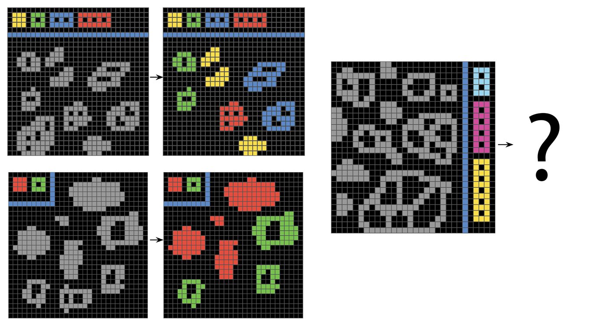

[Figure 19.1](#figure-19-1): An easy yet novel puzzle

This failure mode even applies to tiny variations of
a pattern that an LLM encountered many times in its training data.
For instance, for a few months after the release of ChatGPT, if you asked it,
“What’s heavier, 10 kilos of steel or one kilo of feathers?,”
it would answer that they weigh the same. That’s because the question
“What’s heavier, one kilo of steel or one kilo of feathers?”
is found many times on the internet — as a trick question.
The right answer, of course, is that they both weigh the same,
so the GPT model would just repeat the answer it had memorized
without paying any attention to the actual numbers in the query, or what the query really *meant*.
Similarly, LLMs struggle to adapt to variations of the Monty Hall problem
(see figure 19.2) and will tend to always output the
canonical answer to the puzzle, which they’ve seen many times during training,
regardless of whether it makes sense in context.

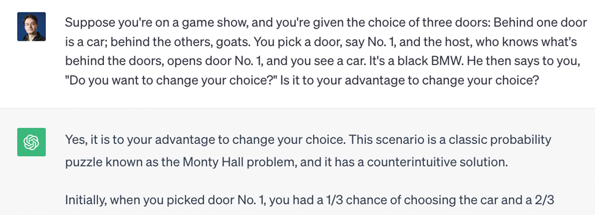

[Figure 19.2](#figure-19-2): A variation of the Monty Hall problem

To note, these specific prompts were patched later on by special-casing them.
Today, there are over 25,000 people who are employed
full time to provide training data for LLMs by
reviewing failure cases and suggesting better answers.
LLM maintenance is a constant game of whack-a-mole
where failing prompts are patched one at a time,
without addressing the more general underlying issue.
Even already patched prompts will still fail if you make small changes to them!

### Deep learning models are highly sensitive to phrasing and other distractors

A closely related problem is the extreme sensitivity of
deep learning models to how their input is presented.
For instance, image models are affected by *adversarial examples*, which are samples
fed to a deep learning network that are designed to trick the model into
misclassifying them. You’re already aware that it’s possible to
do gradient ascent in input space to generate inputs that maximize the
activation of some ConvNet filter — this is the basis of the
filter visualization technique introduced in chapter 10.

Similarly, through gradient ascent, you can
slightly modify an image to maximize the class prediction for a given
class. By taking a picture of a panda and adding to it a gibbon gradient, we
can get a neural network to classify the panda as a gibbon (see figure 19.3).
This evidences both the brittleness of these models and the deep difference
between their input-to-output mapping and our human perception.

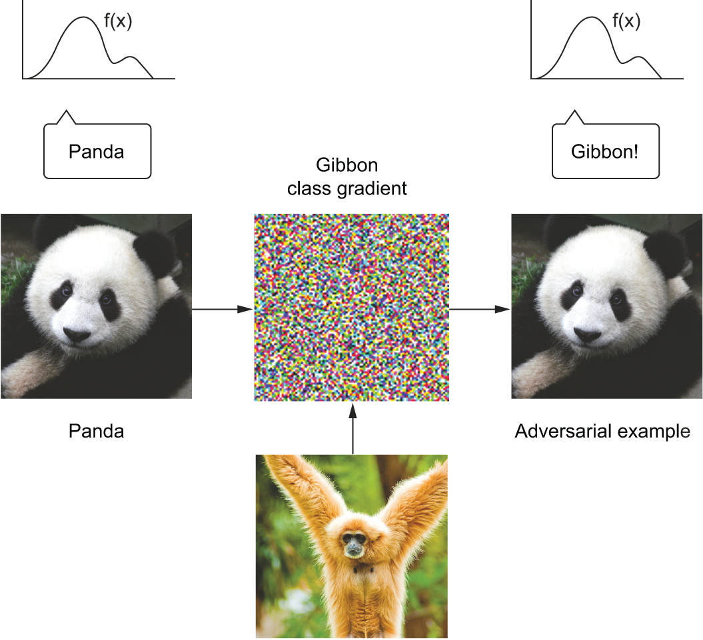

[Figure 19.3](#figure-19-3): An adversarial example: imperceptible changes in an image can upend a model’s classification of the image.

Similarly, LLMs suffer from an extremely high sensitivity to minor details in their prompts.
Innocuous prompt modifications, such as changing place and people’s names in a text paragraph or
variable names in a block of code, can significantly degrade LLM performance.
Consider the well-known *Alice in Wonderland* riddle[[1]](#footnote-1):

“Alice has N brothers and she also has M sisters. How
many sisters does Alice’s brother have?”

The answer, of course, is *M* + 1 (Alice’s sisters plus Alice herself).
For an LLM, asking the question with values commonly found in
online instances of the riddle (like *N* = 3 and *M* = 2) will generally
result in the correct answer, but try tweaking
the values of *M* and *N*, and you will quickly get incorrect answers.

This oversensitivity to phrasing has given rise to the concept of *prompt engineering*.
Prompt engineering is the art of formulating LLM prompts in a way that maximizes performance on a task.
For instance, it turns out that adding the instruction “Please think step by step” to a prompt
that involves reasoning can significantly boost performance.
The term *prompt engineering* is a very optimistic framing
of the underlying issue: “Your models are better than you know!
You just need to use them right!”
A more negative framing would be to point out that
for any query that seems to work, there’s a range of minor changes
that have the potential to tank performance.
To what extent do LLMs understand something if you can break their
understanding with simple rewordings?

What’s behind this phenomenon is that an LLM is a big parametric curve —
a medium for storing knowledge and programs where you can interpolate between any two objects
to produce infinitely many intermediate objects.
Your prompt is a way to address a particular location of the database: if you ask,
“How do you sort a list in Python? Answer like a pirate,”
that’s a kind of database lookup, where you first retrieve a piece of knowledge
(how to sort a list in Python) and
then retrieve and execute a style transfer program (“Answer like a pirate”).

Since the knowledge and programs indexed by the LLM
are interpolative, you can *move around in latent space* to explore nearby locations.
A slightly different prompt, like “Explain Python list sorting, but answer like a buccaneer”
would still have pointed to a very similar location in the database,
resulting in an answer that would be pretty close but not quite identical.
There are thousands of variations you could have used, each resulting
in a similar yet slightly different answer.
And that’s why prompt engineering is needed.
There is no a priori reason for your first, naive prompt to be optimal for your task.
The LLM is not going to understand what you meant and then perform it in the best possible way —
it’s merely going to fetch the program that your prompt points to,
among many possible locations you could have landed on.

Prompt engineering is the process of searching through latent space to find the lookup query
that seems to perform best on your target task by trial and error. It’s no different
from trying different keywords when doing a Google search.
If LLMs actually understood what you asked them, there would be no need for this search process,
since the amount of information conveyed about your target task does not change whether your prompt uses
the word “rewrite” instead of “rephrase” or whether you prefix your prompt with “Think step by step.”
Never assume that the LLM “gets it” the first time — keep in mind that your prompt is but an address
in an infinite ocean of programs,
all memorized as a by-product of learning to complete an enormous amount of token sequences.

### Deep learning models struggle to learn generalizable programs

The problem with deep learning models isn’t just that they’re
limited to blindly reapplying patterns they’ve memorized at training time
or that they’re highly sensitive to how their input is presented.
Even if you just need to query and apply a well-known program, and you
know exactly how to address this program in latent space,
you still face a major issue: the programs memorized by deep learning
models often don’t generalize well. They will work for some
input values and fail for some other input values. This is especially true
for programs that encode any kind of discrete logic.

Consider the problem of adding two numbers, represented
as character sequences — like “4 3 5 7 + 8 9 3 6.” Try training
a Transformer on hundreds of thousands of such digit pairs:
you will reach a very high accuracy. Very high, but not
100% — you will keep regularly seeing incorrect answers,
because the Transformer doesn’t manage to encode the exact addition
algorithm (you know, the one you learned in primary school).
It is instead guessing the output by interpolating between the data points
it has seen at training time.

This applies to state-of-the-art LLMs, too — at least those
that weren’t explicitly hardcoded to execute snippets like “4357 + 8936” in Python
to provide the right answer.
They’ve seen enough examples of digit addition that they can add numbers,
but they only have about 70% accuracy — quite underwhelming.
Further, their accuracy is strongly dependent on *which* digits
are being added, with more common digits leading to higher accuracy.

The reason why a deep learning model does not end up learning
an exact addition algorithm even after seeing millions of examples
is that it is just *a static chain of simple, continuous geometric transformations*
mapping one vector space into another.
That is a good fit for perceptual pattern recognition,
but it’s a very poor fit for encoding any sort of step-by-step discrete logic,
such as concepts like place value or carrying over.
All it can do is map one data manifold X into another manifold Y, assuming the existence
of a learnable continuous transform from X to Y. A deep learning model can be
interpreted as a kind of program, but inversely,
*most programs can’t be expressed as deep-learning models*.
For most tasks, either there exists no
corresponding neural network of reasonable size that solves the task or, even if one exists,
it may not be *learnable*: the corresponding geometric transform may be far
too complex, or there may not be appropriate data available to learn it.

### The risk of anthropomorphizing machine-learning models

Our own understanding of images, sounds, and
language is grounded in our sensorimotor experience as humans.
Machine learning models have no access to such experiences and thus can’t
understand their inputs in a human-relatable way.
By feeding a large number of training examples into our models,
we get them to learn a geometric transform that maps data to human concepts on a specific set of examples, but
this mapping is a simplistic sketch of the original model in our minds — the one
developed from our experience as embodied agents. It’s like a dim image in a
mirror (see figure 19.4). The models you create will take any shortcut available
to fit their training data.

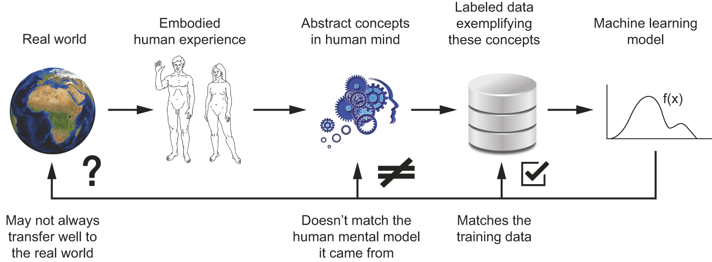

[Figure 19.4](#figure-19-4): Current machine-learning models: like a dim image in a mirror

One real risk with contemporary AI is misinterpreting what deep learning models do and
overestimating their abilities. A fundamental feature of humans is our
*theory of mind*: our tendency to project intentions, beliefs, and knowledge on the
things around us. Drawing a smiley face on a rock suddenly makes it “happy” — in
our minds. Applied to deep learning, this means that when we train models capable
of using language, we’re led to believe that the model “understands” the contents of
the word sequences they generate just the way we do. Then we’re surprised when any
slight departure from the patterns present in the training data causes
the model to generate completely absurd answers.

As a machine learning practitioner, always be mindful of this and never fall
into the trap of believing that neural networks understand the task they
perform — they don’t, at least not in a way that would make sense to us. They
were trained on a different, far narrower task than the one we wanted to teach
them: that of mapping training inputs to training targets, point by point.
Show them anything that deviates from their training data, and they will break
in absurd ways.

## Scale isn’t all you need

Could we just keep scaling our models to overcome the limitations of deep learning?
Is *scale* all we need? This has long been the prevailing narrative in the field, one that was especially prominent in early 2023,
during peak LLM hype. Back then, GPT-4 had just been released, and it was essentially a scaled-up version of GPT-3: more parameters,
more training data. Its significantly improved performance seemed to suggest that you could just keep going
— that there could be a GPT-5 that would simply be more of the same and from which artificial general intelligence (AGI) would spontaneously emerge.

Proponents of this view would point to “scaling laws” as evidence.
Scaling laws are an empirical relationship observed between the size
of a deep learning model (as well as the size of its training dataset)
and its performance on specific tasks. They suggest that increasing
the size of a model reliably leads to better performance in a predictable manner.
But the key thing that scaling law enthusiasts are missing
is that the benchmarks they’re using to measure “performance”
are effectively memorization tests, the kind we like to give university students.
LLMs perform well on these tests by memorizing
the answers, and naturally, cramming more questions and more answers
into the models improves their performance accordingly.

The reality is that scaling up our models hasn’t led to any progress on the issues
I’ve listed so far in these pages —
inability to adapt to novelty, oversensitivity to phrasing, and the inability to infer generalizable programs
for reasoning problems — because these issues are inherent to curve fitting, the paradigm
of deep learning. I started pointing out these problems in 2017,
and we’re still struggling with them today — with models
that are now four or five orders of magnitude larger and more knowledgeable.
We have not made any progress on these problems because *the models we’re using are still the same*.
They’ve been the same for over seven years — they’re still
parametric curves fitted to a dataset via gradient descent,
and they’re still using the Transformer architecture.

Scaling up current deep learning techniques by stacking more layers and using
more training data won’t solve the fundamental problems of deep learning:

* Deep-learning models are limited to using interpolative programs they memorize at training time.
  They are not able, on their own, to synthesize brand-new programs at inference time
  to adapt to substantially novel situations.
* Even within known situations, these interpolative programs suffer from generalization issues,
  which lead to oversensitivity to phrasing and confounder features.
* Deep learning models are limited in what they can represent, and most of the programs you may wish
  to learn can’t be expressed as a continuous geometric morphing of a data
  manifold. This is true in particular of algorithmic reasoning tasks.

Let’s take a closer look at what separates biological intelligence from the deep learning approach.

### Automatons vs. intelligent agents

There are fundamental differences between the straightforward geometric morphing from input to
output that deep learning models do and the way humans think and learn. It
isn’t just the fact that humans learn by themselves from embodied experience
instead of being presented with explicit training examples. The human brain is
an entirely different beast compared to a differentiable parametric function.

Let’s zoom out a little bit and ask, What’s the purpose of intelligence?
Why did it arise in the first place? We can only speculate, but we can make
fairly informed speculations. We can start by looking at brains — the organ
that produces intelligence. Brains are an evolutionary adaptation
— a mechanism developed incrementally over hundreds of millions of years,
via random trial and error guided by natural selection, that dramatically
expanded the ability of organisms to adapt to their environment.
Brains originally appeared more than half a billion years ago
as a way to *store and execute behavioral programs*. Behavioral programs
are just sets of instructions that make an organism reactive to its environment:
“If this happens, then do that.” They link the organism’s sensory inputs
to its motor controls. In the beginning, brains would have served to hardcode behavioral programs
(as neural connectivity patterns), which would allow an organism to react appropriately to
its sensory input. This is the way insect brains still work — flies, ants, *C. elegans* (see figure 19.5), etc.
Because the original “source code” of these programs was DNA,
which would get decoded as neural connectivity patterns, evolution was suddenly able
to *search over behavior space* in a largely unbounded way — a major evolutionary shift.

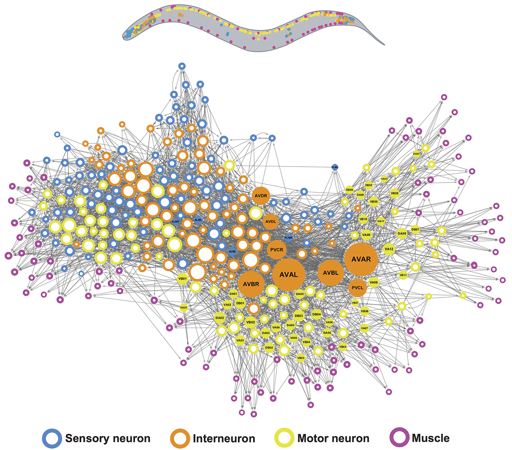

[Figure 19.5](#figure-19-5): The brain network of the *C. elegans* worm: a behavioral automaton “programmed” by natural evolution. Figure created by Emma Towlson (from “Network control principles predict neuron function in the Caenorhabditis elegans connectome,” Yan et al., *Nature*, Oct. 2017).

Evolution was the programmer, and brains were computers carefully executing the code
evolution gave them. Because neural connectivity is a very general computing substrate,
the sensorimotor space of all brain-enabled species could suddenly start
undergoing a dramatic expansion. Eyes, ears, mandibles, 4 legs, 24 legs
— as long as you have a brain, evolution will kindly figure out for you behavioral
programs that make good use of these. Brains can handle any modality,
or combination of modalities, you throw at them.

Now, mind you, these early brains weren’t exactly intelligent per se. They were very much
*automatons*: they would merely execute behavioral programs hardcoded in the organism’s
DNA. They could only be described as intelligent in the same sense that
a thermostat is “intelligent.” Or a list-sorting program. Or a trained
deep neural network (of the artificial kind). This is an important distinction,
so let’s look at it carefully: What’s the difference between
automatons and actual intelligent agents?

### Local generalization vs. extreme generalization

The field of AI has long suffered from conflating the notions of *intelligence* and *automation*.
An automation system (or automaton) is static, crafted to accomplish specific things in a specific
context — “If this, then that” — while an intelligent agent can adapt on the fly
to novel, unexpected situations. When an automaton is exposed to something
that doesn’t match what it was “programmed” to do (whether we’re talking about
human-written programs, evolution-generated programs, or the implicit programming
process of fitting a model on a training dataset), it will fail.

Meanwhile, intelligent agents, like us humans, will use their fluid intelligence to find a way forward.
How do you tell the difference between a student who has memorized
the past three years of exam questions but has no understanding of the subject
and one who actually understands the material? You give them a brand-new problem.

Humans are capable of far more than mapping immediate stimuli to immediate
responses as a deep network or an insect would. We can assemble on-the-fly complex,
abstract models of our current situation, of ourselves, and of other people,
and can use these models to anticipate different possible futures and perform
long-term planning. We can quickly adapt to unexpected situations and pick up new
skills after just a little bit of practice.

This ability to use *abstraction* and *reasoning* to handle experiences
we weren’t prepared for is the defining characteristic of human cognition. I call it
*extreme generalization*: an ability to adapt to novel, never-before-experienced
situations using little data or even no new data at all.
This capability is key to the intelligence displayed by humans and advanced animals.

This stands in sharp contrast with what automaton-like systems do.
A very rigid automaton wouldn’t feature any generalization at all; it would be incapable
of handling anything that it wasn’t precisely told about in advance. A Python dict,
or a basic question-answering program implemented as hardcoded if-then-else statements
would fall into this category. Deep nets do slightly better: they can successfully process inputs that deviate
a bit from what they’re familiar with, which is precisely what makes them useful.
Our dogs-versus-cats model from chapter 8 could classify cat or dog pictures it had
not seen before, as long as they were close enough to what it was trained on.
However, deep nets are limited to what I call
*local generalization* (see figure 19.6): the mapping from inputs to outputs performed
by a deep net quickly stops making sense as inputs start deviating
from what the net saw at training time. Deep nets can only generalize to
*known unknowns*, to factors of variation that were anticipated during model
development and that are extensively featured in the training data,
such as different camera angles or lighting conditions for pet pictures.
That’s because deep nets generalize via interpolation on a manifold (remember chapter 5):
any factor of variation in their input space needs to be captured by the manifold they learn.
That’s why basic data augmentation is so helpful in improving deep net generalization.
Unlike humans, these models have no ability to improvise in the face of
situations for which little or no data is available.

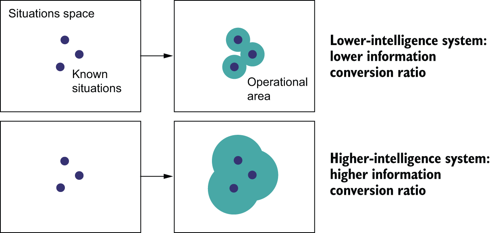

[Figure 19.6](#figure-19-6): Local generalization vs. extreme generalization

Consider, for instance, the problem of
learning the appropriate launch parameters to get a rocket to land on the
moon. If you used a deep net for this task and trained it using supervised
learning or reinforcement learning, you’d have to feed it tens of thousands or even
millions of launch trials: you’d need to expose it to a *dense sampling* of
the input space for it to learn a reliable
mapping from input space to output space. In contrast, as humans, we can use
our power of abstraction to come up with physical models — rocket science — and
derive an exact solution that will land the rocket on the moon in one or a few
trials. Similarly, if you developed a deep net controlling a human body and
you wanted it to learn to safely navigate a city without getting hit by cars,
the net would have to die many thousands of times in various situations until
it could infer that cars are dangerous and develop appropriate avoidance
behaviors. Dropped into a new city, the net would have to relearn most of what
it knows. On the other hand, humans are able to learn safe behaviors without
having to die even once — again, thanks to our power of abstract modeling of
novel situations.

### The purpose of intelligence

This distinction between highly adaptable intelligent agents and rigid automatons
leads us back to brain evolution.
Why did brains — originally a mere medium for natural evolution to develop behavioral automatons —
eventually turn intelligent? Like every significant evolutionary milestone, it happened
because natural selection constraints encouraged it to happen.

Brains are responsible for behavior generation.
If the set of situations an organism had to face was mostly static and known in advance,
behavior generation would be an easy problem: evolution would just figure out
the correct behaviors via random trial and error and hardcode them into the organism’s DNA.
This first stage of brain evolution — brains as automatons — would already be optimal.
However, crucially, as organism complexity — and alongside it, environmental complexity —
kept increasing, the situations animals had to deal with became much more dynamic and
more unpredictable. A day in your life, if you look closely, is unlike any
day you’ve ever experienced and unlike any day ever experienced by any of
your evolutionary ancestors. You need to be able to face unknown and surprising situations constantly.
There is no way for evolution to find and hardcode
as DNA the sequence of behaviors you’ve been executing to successfully navigate
your day since you woke up a few hours ago. It has to be generated on the fly every day.

The brain, as a good behavior-generation engine, simply adapted to fit this need.
It optimized for adaptability and generality themselves, rather than merely optimizing
for fitness to a fixed set of situations. This shift likely occurred multiple
times throughout evolutionary history, resulting in highly intelligent animals
in very distant evolutionary branches — apes, octopuses, ravens, and more.
Intelligence is an answer to challenges presented by complex, dynamic ecosystems.

That’s the nature of intelligence:
it is the ability to efficiently use the information at your disposal
to produce successful behavior in the face of an uncertain, ever-changing future.
What Descartes calls “understanding” is the key to this remarkable capability:
the power to mine your past experience to develop modular, reusable abstractions
that can be quickly repurposed to handle novel situations and achieve extreme
generalization.

### Climbing the spectrum of generalization

As a crude caricature, you could summarize the evolutionary history of biological intelligence
as a slow climb up the *spectrum of generalization*. It started with automaton-like
brains that could only perform local generalization. Over time, evolution
started producing organisms capable of increasingly broader generalization
that could thrive in ever-more complex and variable environments.
Eventually, in the past few million years — an instant in evolutionary terms —
certain hominin species started trending toward an implementation
of biological intelligence capable of extreme generalization,
precipitating the start of the Anthropocene and forever changing the history
of life on Earth.

The progress of AI over the past 70 years bears striking similarities to this evolution.
Early AI systems were pure automatons, like the ELIZA chat program from the 1960s,
or SHRDLU:[[2]](#footnote-2),
a 1970 AI capable of manipulating simple objects from natural language
commands. In the 1990s and 2000s, we saw the rise of machine learning
systems capable of local generalization that could deal with some level of uncertainty and novelty.
In the 2010s, deep learning further expanded the
local generalization power of these systems by enabling engineers to use
much larger datasets and much more expressive models.

Today, we may be on the cusp of the next evolutionary step.
We are moving toward systems that achieve *broad generalization*,
which I define as the ability to deal with *unknown unknowns* within a single broad
domain of tasks (including situations the system was not trained to handle and
that its creators could not have anticipated).
Examples are a self-driving car capable of safely dealing with any situation
you throw at it or a domestic robot that could pass the “Woz test of intelligence” —
entering a random kitchen and making a cup of coffee:[[3]](#footnote-3).
By combining deep learning and painstakingly handcrafted abstract models of the
world, we’re already making visible progress toward these goals.

However, the deep learning paradigm has remained limited to cognitive automation:
The “intelligence” label in “artificial intelligence” has been a category error. It would
be more accurate to call our field “artificial cognition,” with “cognitive automation”
and “artificial intelligence” being two nearly independent subfields within it.
In this subdivision, AI would be a greenfield
where almost everything remains to be discovered.

Now, I don’t mean to diminish the achievements of deep learning.
Cognitive automation is incredibly useful, and the way deep learning models
are capable of automating tasks from exposure to data alone
represents an especially powerful form of cognitive automation,
far more practical and versatile than explicit programming.
Doing this well is a game changer for essentially every industry.
But it’s still a long way from human (or animal) intelligence.
Our models, so far,
can only perform local generalization:
they map space X to space Y via a smooth geometric transform learned from
a dense sampling of X-to-Y data points, and any disruption within spaces
X or Y invalidates this mapping. They can only generalize to
new situations that stay similar to past data, whereas human cognition is
capable of extreme generalization, quickly adapting to radically novel
situations and planning for long-term future situations.

## How to build intelligence

So far, you’ve learned that there’s a lot more to intelligence than
the sort of latent manifold interpolation that deep learning does.
But what, then, do we need to start building real intelligence? What are the
core pieces that are currently eluding us?

### The kaleidoscope hypothesis

Intelligence is the ability to use your past experience (and innate prior knowledge)
to face novel, unexpected future situations. Now, if the future you had to face
was *truly novel* — sharing no common ground with anything you’ve seen before —
you’d be unable to react to it, no matter how intelligent you are.

Intelligence works because nothing is ever truly without precedent.
When we encounter something new, we’re able to make sense of it by drawing
analogies to our past experience and articulating it in terms of the abstract concepts
we’ve collected over time.
A person from the 17th century seeing a jet plane for the first time might describe it as a large,
loud metal bird that doesn’t flap its wings. A car? That’s a horseless carriage.
If you’re trying to teach physics to a grade schooler, you can explain how
electricity is like water in a pipe or how spacetime is like a rubber sheet
getting distorted by heavy objects.

Besides such clear-cut, explicit analogies, we’re constantly
making smaller, implicit analogies — every second, with every thought.
Analogies are how we navigate life. Shopping at a new supermarket? You’ll find your
way by relating it to similar stores you’ve been to. Talking to someone new?
They’ll remind you of a few people you’ve met before.
Even seemingly random patterns, like the shape of clouds,
instantly evoke in us vivid images — an elephant, a ship, a fish.

These analogies aren’t just in our minds, either: physical reality itself is full of
isomorphisms. Electromagnetism is analogous to gravity. Animals are all structurally
similar to each other, due to shared origins. Silica crystals are similar to ice
crystals. And so on.

I call this the *kaleidoscope hypothesis*: our experience of the world seems to feature incredible
complexity and never-ending novelty, but everything in this sea of complexity
is similar to everything else. The number of *unique atoms of meaning* that you need
to describe the universe you live in is relatively small, and everything around you is
a recombination of these atoms: a few seeds, endless variation, much like what goes on inside a kaleidoscope, where a few glass beads are
reflected by a system of mirrors to produce rich, seemingly endless patterns (see figure 19.7).

[Figure 19.7](#figure-19-7): A kaleidoscope produces rich (yet repetitive) patterns from just a few beads of colored glass.

### The essence of intelligence: Abstraction acquisition and recombination

Intelligence is the ability to mine your experience to identify these atoms
of meaning that can seemingly be reused across many different situations — the core beads of the kaleidoscope.
Once extracted, they’re called *abstractions*. Whenever you encounter a new situation,
you make sense of it by recombining on the fly abstractions from your collections,
to weave a brand new “model” adapted to the situation.

This process consists of two key parts:

* *Abstraction acquisition* — Efficiently extracting compact, reusable abstractions from a stream of experience or data.
  This involves identifying underlying structures, principles, or invariants.
* *On-the-fly recombination* — Efficiently selecting and recombining these abstractions in novel ways to model new problems and situations,
  even ones far removed from past experience.

The emphasis on *efficiency* is crucial. How intelligent you are is determined by how efficiently you can acquire good abstractions from limited experience and how efficiently you can recombine them to navigate uncertainty and novelty. If you need hundreds of thousands of hours of practice to acquire a skill, you are not very intelligent. If you need to enumerate every possible move on the chess board to find the best one, you are not very intelligent.

And that’s the source of the two main issues with the classic deep learning paradigm:

* These models are completely missing on-the-fly recombination. They do a decent job at acquiring abstractions at training time, via gradient descent,
  but by design they have zero ability to recombine what they know at test time. They behave like a static abstract database, limited purely to retrieval.
  They’re missing half of the picture — the most important half.
* They’re terribly inefficient. Gradient descent requires vast amounts of data to distill neat abstractions — many orders of magnitude more data than humans.

So how can we move beyond these limitations?

### The importance of setting the right target

Biological intelligence was the answer to a question asked by nature. Likewise, if we
want to develop true AI, first, we need to be asking the right questions.
Ultimately, the capabilities of AI systems reflect the objectives they were designed and optimized for.

An effect you see constantly in systems design is the *shortcut rule*:
if you focus on optimizing one success metric, you will achieve your goal,
but at the expense of everything in the system that wasn’t covered by
your success metric. You end up taking every available shortcut toward the goal.
Your creations are shaped by the incentives you give yourself.

You see this often in machine learning competitions.
In 2009, Netflix ran a challenge that promised a $1 million prize to the
team that would achieve the highest score on a movie recommendation task.
It ended up never using the system created by the winning team because
it was way too complex and compute intensive. The winners had optimized for
prediction accuracy alone — what they were incentivized to achieve — at the expense
of every other desirable characteristic of the system: inference cost, maintainability,
explainability. The shortcut rule holds true in most Kaggle competitions as well
— the models produced by Kaggle winners can rarely, if ever, be used in production.

The shortcut rule has been everywhere in AI over the past few decades.
In the 1970s, psychologist and computer science pioneer Allen Newell, concerned
that his field wasn’t making any meaningful progress toward a proper theory
of cognition, proposed a new grand goal for AI: chess playing. The rationale
was that playing chess, in humans, seemed to involve — perhaps even require —
capabilities such as perception, reasoning and analysis, memory and study from books,
and so on. Surely, if we could build a chess-playing machine, it would have to feature
these attributes as well. Right?

Over two decades later, the dream came true: in 1997, IBM’s Deep Blue beat Gary Kasparov, the
best chess player in the world. Researchers had then to contend with the fact that
creating a chess-champion AI had taught them little about human intelligence.
The A-star algorithm at the heart of Deep Blue wasn’t a model of the human brain
and couldn’t generalize to tasks other than similar board games.
It turned out it was easier to build an AI that could only play chess
than to build an artificial mind — so that’s the shortcut researchers took.

So far, *the driving success metric of the field of AI has been to solve specific tasks*,
from chess to Go, from MNIST classification to ImageNet,
from high school math tests to the bar exam.
Consequently, the history of
the field has been defined by a series of “successes” where
*we figured out how to solve these tasks without featuring any intelligence*.

If that sounds like a surprising statement, keep in mind
that human-like intelligence isn’t characterized by skill at any particular task — rather,
it is the ability to adapt to novelty to efficiently acquire new skills and master
never-before-seen tasks.
By fixing the task, you make it possible to provide an arbitrarily precise
description of what needs to be done — either via hardcoding human-provided knowledge
or by supplying humongous amounts of data. You make it
possible for engineers to “buy” more skill for their AI by just adding data
or adding hardcoded knowledge, without increasing the generalization power of the AI (see figure 19.8).
If you have near-infinite training data, even a very crude algorithm like nearest-neighbor
search can play video games with superhuman skill. Likewise, if you have a near-infinite
amount of human-written if-then-else statements — that is, until you make a small change to the rules
of the game, the kind a human could adapt to instantly — that will require the unintelligent
system to be retrained or rebuilt from scratch.

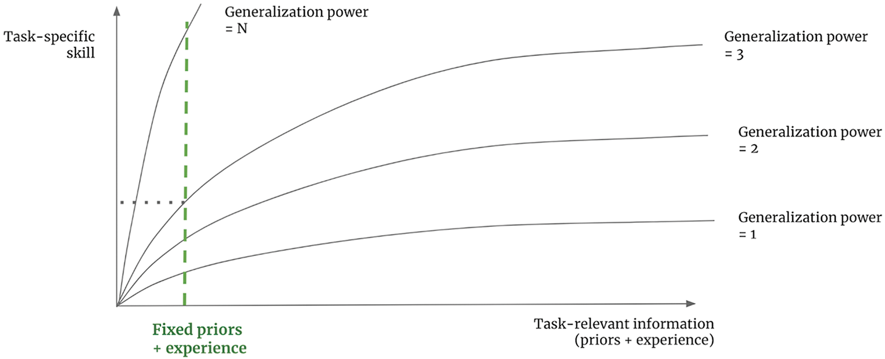

[Figure 19.8](#figure-19-8): A low-generalization system can achieve arbitrary skill at a fixed task given unlimited task-specific information.

In short, by fixing the task, you remove the need to handle uncertainty and novelty,
and since the nature of intelligence is the ability
to handle uncertainty and novelty, you’re effectively removing the need for intelligence.
And because it’s always easier to find a unintelligent solution to a specific task
than to solve the general problem of intelligence,
that’s the shortcut you will take 100% of the time.
Humans can use their general intelligence to acquire skills
at any new task, but in reverse, there is no path from a collection of task-specific
skills to general intelligence.

### A new target: On-the-fly adaptation

To make AI actually intelligent and give it the ability
to deal with the incredible variability and ever-changing nature of the real world,
first, we need to move away from seeking
to achieve *task-specific skill* and, instead, start targeting generalization power
itself. We need new metrics of progress that will help us develop increasingly
intelligent systems: metrics that will point in the right direction and that will
give us an actionable feedback signal.
As long as we set our goal to be “create a model that solves task X,”
the shortcut rule will apply, and we’ll end up with a model that does X, period.

In my view, intelligence can be precisely quantified as an *efficiency ratio*:
the conversion ratio between the *amount of relevant information* you have available about the world
(which could be either past experience or innate prior knowledge) and your *future operating area*,
the set of novel situations where you will be able to produce appropriate behavior
(you can view this as your *skill set*). A more intelligent agent
will be able to handle a broader set of future tasks and situations using a smaller amount of
past experience. To measure such a ratio, you just need to fix the information available to your system
— its experience and its prior knowledge — and measure its performance on a set of reference
situations or tasks that are known to be sufficiently different from what the system
has had access to. Trying to maximize this ratio should lead you toward intelligence.
Crucially, to avoid cheating, you’re going to need to make sure
to test the system only on tasks it wasn’t programmed or trained to handle —
in fact, you need tasks that the *creators of the system could not have anticipated*.

In 2018 and 2019, I developed a benchmark dataset called the
*Abstraction & Reasoning Corpus for Artificial General Intelligence (ARC-AGI)*:[[4]](#footnote-4)
that seeks to capture this definition of intelligence.
ARC-AGI is meant to be approachable by both machines and humans, and it
looks very similar to human IQ tests, such as Raven’s progressive matrices.
At test time, you’ll see a series of “tasks.” Each task is explained via
three or four “examples” that take the form of an input grid and a corresponding
output grid (see figure 19.9). You’ll then be given a brand-new input grid,
and you’ll have three tries to produce the correct output grid, before moving
on to the next task.

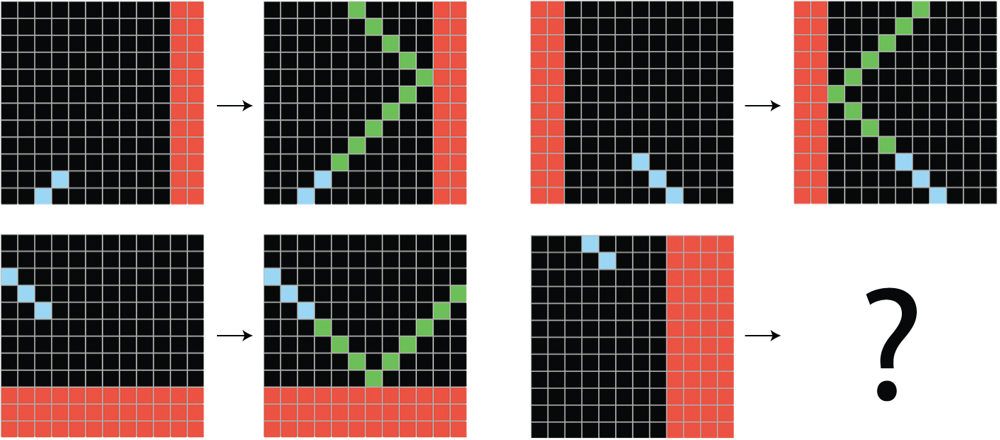

[Figure 19.9](#figure-19-9): An ARC-AGI task: the nature of the task is demonstrated by a couple of input-output pair examples. Provided with a new input, you must construct the corresponding output.

Compared to IQ tests, two things are unique about ARC-AGI. First,
ARC seeks to measure generalization power
by only testing you on tasks you’ve never seen before.
That means that ARC-AGI is *a game you can’t practice for*, at least in theory:
the tasks you will get tested on will have their
own unique logic that you will have to understand on the fly.
You can’t just memorize specific strategies from past tasks.

In addition, ARC-AGI tries to control for the *prior knowledge* that you bring
to the test. You never approach a new problem entirely from scratch —
you bring to it preexisting skills and information.
ARC-AGI makes the assumption that all test takers should
start from the set of knowledge priors, called *Core Knowledge priors*,
which represent the knowledge systems humans are born with.
Unlike an IQ test, ARC-AGI tasks will never involve acquired knowledge,
like English sentences, for instance.

### ARC Prize

In 2024, to accelerate progress toward AI systems capable of the kind of fluid abstraction and reasoning measured by ARC-AGI,
I partnered with Mike Knoop to establish the nonprofit ARC Prize Foundation.
The foundation runs a yearly competition, with a substantial prize pool (over $1 million in its 2024 iteration)
to incentivize researchers to develop AI that can solve ARC-AGI and thus display genuine fluid intelligence.

The ARC-AGI benchmark has proven remarkably resistant to the prevailing deep learning scaling paradigm.
Most other benchmarks have saturated quickly in the age of LLMs. That’s because they can be hacked via memorization, whereas ARC-AGI is designed to be resistant to it.
From 2019, when ARC-AGI was first released, to 2025, base LLMs underwent a roughly 50,000× scale-up — from, say, GPT-2 (2019) to GPT-4.5 (2025),
but their performance on the 2019 version of ARC-AGI only went from 0% to around 10%. Given that you, reader, would easily score above 95%,
that isn’t very good.

If you scale up your system by 50,000× and you’re still not making meaningful progress, that’s like a big warning sign telling you that you need to try new ideas.
Simply making models bigger or training them on more data has not unlocked the kind of fluid intelligence that ARC-AGI requires.
ARC-AGI was clearly showing that on-the-fly recombination capabilities are necessary to tackle reasoning.

### The test-time adaptation era

In 2024, everything changed. That year saw a major narrative shift — one that was partly catalyzed by ARC Prize.
The prevailing “Scale is all you need” story that was a bedrock dogma of 2023 started giving way to “Actually, we need on-the-fly recombination.”
The results of the competition, announced in December 2024, were illuminating: the leading solutions did not emerge from simply scaling existing deep learning architectures.
They all used some form of test-time adaptation (TTA) — either test-time search or test-time training.

TTA refers to methods where the AI system performs active reasoning or learning during the test itself,
using the specific problem information provided — the key component that was missing from the classic deep learning paradigm.

There are several ways to implement test-time adaptation:

* *Test-time training* — The model adjusts some of its parameters based on the examples given in the test task, using gradient descent.
* *Search methods* — The system searches through many possible reasoning steps or potential solutions at test time to find the best one.
  This could be done in natural language (chain-of-thought synthesis) or in a space of symbolic, verifiable programs (program synthesis).

These TTA approaches allow AI systems to be more flexible and handle novelty better than static models. Every single top entry in ARC Prize 2024 used them.

Shortly following the competition’s conclusion, in late December 2024, OpenAI previewed its o3 test-time reasoning model and used ARC-AGI to showcase its unprecedented capabilities.
Using considerable test-time compute resources, this model achieved scores of 76% at a cost of about $200 per task, and 88% at a cost of over $20,000 per task,
surpassing the nominal human baseline. For the very first time, we were seeing an AI model that showed signs of genuine fluid intelligence.
This breakthrough opened the floodgates of a new wave of interest and investment in similar techniques — the test-time adaptation era had begun.
Importantly, ARC-AGI was one of the only benchmarks at the time that provided a clear signal that a major paradigm shift was underway.

### ARC-AGI 2

Does that mean AGI is solved? Was o3 as intelligent as a human?

Not quite. First, while o3’s performance was a landmark achievement, it came at a tremendous cost — tens of thousands of dollars of compute per ARC-AGI puzzle.
Intelligence isn’t just about capability; it’s fundamentally about efficiency. Brute-forcing the solution space given enormous compute is a shortcut that makes all kinds of tasks
possible without requiring intelligence. In principle, you could even solve ARC-AGI by simply walking down the tree of every possible solution program and testing each one until you find one that works on the demonstration pairs. The o3 results, impressive as they were, felt more like cracking a code with a supercomputer than a display of nimble, human-like fluid reasoning.
The entire point of intelligence is to achieve results with the least amount of resources possible.

Second, we found that o3 was still stumped by many tasks that humans found very easy (like the one in figure 19.10). This strongly suggests that o3 wasn’t quite human-level yet.
Here’s the thing — the 2019 version of ARC-AGI was intended to be easy. It was essentially a binary test of fluid intelligence: either you have no fluid intelligence,
like all base LLMs, in which case you score near zero, or you do display some genuine fluid intelligence, in which case you immediately score extremely high, like any human — or o3.
There wasn’t much room in between. It was clear that the benchmark needed to evolve alongside the AI capabilities it was designed to measure.
There was a need for a new ARC-AGI version that was less brute-forcible and that could better differentiate between systems possessing varying levels of fluid reasoning ability,
up to human-level fluid intelligence. Good news: we had been working on one since 2022.

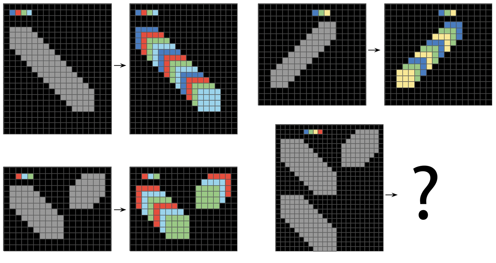

[Figure 19.10](#figure-19-10): Example of a task that couldn’t be solved by o3 on the highest compute settings (over $20,000 per task)

And so, in March 2025, the ARC Prize Foundation introduced ARC-AGI-2. It kept the exact same format as the first version but significantly improved the task content.
The new iteration was designed to raise the bar, incorporating tasks that demand more complex reasoning chains and are inherently more resistant to exhaustive search methods.
The goal was to create a benchmark where computational efficiency becomes a more critical factor for success, pushing systems toward more genuinely intelligent, efficient strategies rather than simply exploring billions of possibilities. While most ARC-AGI-1 tasks could be solved almost instantaneously by a human without requiring much cognitive effort, all tasks in ARC-AGI-2 require some amount of deliberate thinking (see figure 19.11) — for instance, the average time for task completion among human test takers in our experiments was 5 minutes.

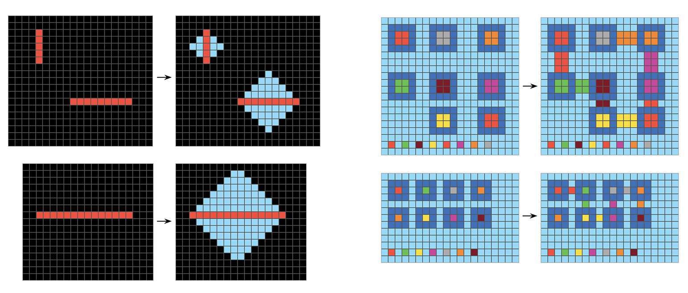

[Figure 19.11](#figure-19-11): Typical ARC-AGI-1 task (left) vs. typical ARC-AGI-2 task (right)

The initial AI testing results on ARC-AGI 2 were sobering: even o3 struggled significantly with this new set of challenges, its scores plummeting back into the low double digits when constrained to reasonable computational budgets. As for base LLMs? Their performance on ARC-AGI-2 was effectively back at 0% — fitting, as base LLMs don’t possess fluid intelligence.
The challenge of building AI with truly efficient, human-like fluid intelligence is still far from solved. We’re going to need something beyond current TTA techniques.

## The missing ingredients: Search and symbols

What would it take to fully solve ARC-AGI, in particular version 2?
Hopefully, this challenge will get you thinking.
That’s the entire point of ARC-AGI: to give you a goal of a different kind,
that will nudge you in a new direction — hopefully, a productive direction.
Now, let’s take a quick look at the key ingredients you’re going to need
if you want to answer the call.

I’ve said that intelligence consists of two components: *abstraction acquisition* and *abstraction recombination*.
They are tightly coupled — what *kind* of abstractions you manipulate determines
how, and how well, you can recombine them.
Deep learning models only manipulate abstractions stored via parametric curves,
fitted via gradient descent. Could there be a better way?

### The two poles of abstraction

Abstraction acquisition starts with *comparing things to one another*.
Crucially, there are two distinct ways to compare things, from which arise
two different kinds of abstraction and two modes of thinking, each better suited
to a different kind of problem.
Together, these two poles of abstraction form the basis for all of our thoughts.

The first way to relate things to each other is *similarity comparison*,
which gives rise to *value-centric analogies*. The second way is *exact structural match*,
which gives rise to *program-centric analogies* (or structure-centric analogies).
In both cases, you start from *instances* of a thing, and you merge together
related instances to produce an *abstraction* that captures the common
elements of the underlying instances. What varies is how you tell that two instances
are related and how you merge instances into abstractions.
Let’s take a close look at each type.

#### Value-centric analogy

Let’s say you come across a number of different beetles in your backyard,
belonging to multiple species. You’ll notice similarities between them. Some will
be more similar to one another, and some will be less similar: the notion of similarity is implicitly
a smooth, continuous *distance function* that defines a latent manifold where your instances live.
Once you’ve seen enough beetles, you can start clustering more similar instances together
and merging them into a set of *prototypes* that captures the shared visual features
of each cluster (figure 19.12). These prototypes are abstract: they don’t look like any specific
instance you’ve seen, although they encodes properties that are common across all of them.
When you encounter a new beetle, you won’t need to compare it to
every single beetle you’ve seen before to know what to do with it.
You can simply compare it to your handful of prototypes to find the
closest prototype — the beetle’s *category* — and use it
to make useful predictions: Is the beetle likely to bite you? Will it eat your apples?

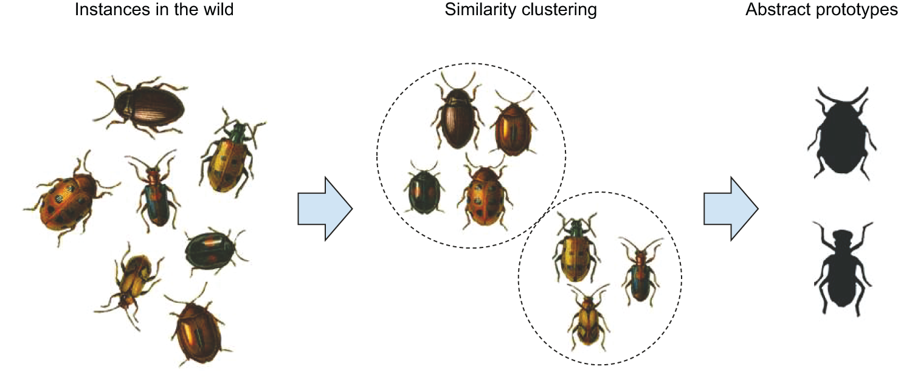

[Figure 19.12](#figure-19-12): Value-centric analogy relates instances via a continuous notion of similarity to obtain abstract prototypes.

Does this sound familiar? It’s pretty much a description of what unsupervised machine learning
(such as the K-means clustering algorithm) does. In general, all of modern
machine learning, unsupervised or not, works by learning latent manifolds that
describe a space of instances, encoded via prototypes. (Remember the ConvNet features
you visualized in chapter 10? They were visual prototypes.)
Value-centric analogy is the kind of analogy-making that enables
deep learning models to perform local generalization.

It’s also what many of your own cognitive abilities run on. As a human, you perform
value-centric analogies all the time. It’s the type of abstraction that underlies
*pattern recognition*, *perception*, and *intuition*. If you can do a task without thinking about it,
you’re heavily relying on value-centric analogies. If you’re watching a movie and
you start subconsciously categorizing the different characters into “types,”
that’s value-centric abstraction.

#### Program-centric analogy

Crucially, there’s more to cognition than the kind of
immediate, approximate, intuitive categorization that value-centric analogy enables.
There’s another type of abstraction-generation mechanism, slower, exact,
deliberate: program-centric (or structure-centric) analogy.

In software engineering, you often write different functions or classes
that seem to have a lot in common. When you notice these redundancies, you start
asking, Could there be a more abstract function that performs the same job that
could be reused twice? Could there be an abstract base class that both of your
classes could inherit from? The definition of abstraction you’re using here
corresponds to program-centric analogy. You’re not trying to compare your
classes and functions by *how similar* they look, the way you’d compare two human faces,
via an implicit distance function. Rather, you’re interested in whether
there are *parts* of them that have *exactly the same structure*.
You’re looking for what is called a *subgraph isomorphism* (see figure 19.13): programs can be
represented as graphs of operators, and you’re trying to find subgraphs (program subsets)
that are exactly shared across your different programs.

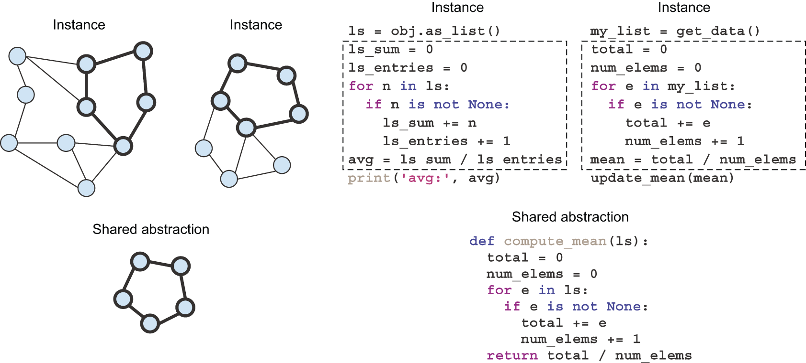

[Figure 19.13](#figure-19-13): Program-centric analogy identifies and isolates isomorphic substructures across different instances.

This kind of analogy-making via exact structural match within different discrete structures
isn’t at all exclusive to specialized fields like computer science, or mathematics — you’re constantly using
it without noticing. It underlies *reasoning*, *planning*, and the general concept of
*rigor* (as opposed to intuition). Any time you’re thinking about objects
connected to each other by a discrete network of relationships (rather than a continuous
similarity function), you’re using program-centric analogies.

### Cognition as a combination of both kinds of abstraction

Table 19.1 compares these two poles of abstraction side by side.

| Value-centric abstraction | Program-centric abstraction |
| --- | --- |
| Relates things by distance | Relates things by exact structural match |
| Continuous, grounded in geometry. | Discrete, grounded in topology |
| Produces abstractions by “averaging” instances into “prototypes” | Produces abstractions by isolating isomorphic substructures across instances |
| Underlies perception and intuition | Underlies reasoning and planning |
| Immediate, fuzzy, approximative | Slow, exact, rigorous |
| Requires a lot of experience to produce reliable results | Experience efficient: can operate on as few as two instances |

[Table 19.1](#table-19-1): The two poles of abstraction

Everything we do, everything we think, is a combination of these two types of
abstraction. You’d be hard pressed to find tasks that only involve one
of the two. Even a seemingly “pure perception” task, like recognizing objects
in a scene, involves a fair amount of implicit reasoning about the relationships
between the objects you’re looking at.
And even a seemingly “pure reasoning” task, like finding the proof of a
mathematical theorem, involves a good amount of intuition. When a mathematician
puts their pen to the paper, they’ve already got a fuzzy vision of the direction
in which they’re going. The discrete reasoning steps they take to get to the
destination are guided by high-level intuition.

These two poles are complementary, and it’s their interleaving that enables
extreme generalization. No mind could be complete without both of them.

### Why deep learning isn’t a complete answer to abstraction generation

Deep learning is very good at encoding value-centric abstraction, but it has basically no ability
to generate program-centric abstraction. Human-like intelligence is a tight interleaving of both types,
so we’re literally missing half of what we need — arguably the most important half.

Now, here’s a caveat. So far, I’ve presented each type of abstraction
as entirely separate from the other — opposite, even. In practice, however,
they’re more of a spectrum: to an extent, you could do reasoning
by embedding discrete programs in continuous manifolds — just like you
may fit a polynomial function through any set of discrete points,
as long as you have enough coefficients.
And inversely, you could use discrete programs to emulate continuous distance functions
— after all, when you’re doing linear algebra on a computer, you’re working with continuous
spaces, entirely via discrete programs that operate on 1s and 0s.

However, there are clearly types of problems that are better suited to one or the other.
Try to train a deep learning model to sort a list of five numbers, for instance.
With the right architecture, it’s not impossible, but it’s an exercise in frustration.
You’ll need a massive amount of training data to make it happen — and even then,
the model will still make occasional mistakes when presented with new numbers.
And if you want to start sorting lists of 10 numbers instead, you’ll need to
completely retrain the model — on even more data. Meanwhile, writing a sorting
algorithm in Python takes just a few lines, and the resulting program, once
validated on a couple more examples, will work every time on lists of any size.
That’s pretty strong generalization: going from a couple of demonstration examples
and test examples to a program that can successfully process literally any list of numbers.

In reverse, perception problems are a terrible fit for discrete reasoning processes. Try to
write a pure-Python program to classify MNIST digits, without using any machine learning technique:
you’re in for a ride. You’ll find yourself painstakingly coding functions
that can detect the number of closed loops in a digit,
the coordinates of the center of mass of a digit, and so on.
After thousands of lines of code, you might achieve 90% test accuracy. In this
case, fitting a parametric model is much simpler; it can better utilize
the large amount of data that’s available, and it achieves much more robust results.
If you have lots of data and you’re faced with a problem where the manifold hypothesis applies,
go with deep learning.

For this reason, it’s unlikely that we’ll see the rise
of an approach that would reduce reasoning problems to manifold interpolation or
that would reduce perception problems to discrete reasoning.
The way forward in AI is to develop a unified framework that incorporates *both*
types of abstraction generation.

### An alternative approach to AI: Program synthesis

Until 2024, AI systems capable of genuine discrete reasoning were all hardcoded by
human programmers — for instance, software that relies on search algorithms,
graph manipulation, and formal logic. In the test-time adaptation (TTA) era, this is finally starting to change.
A branch of TTA that is especially promising is *program synthesis* — a field that is
still very niche today, but that I expect to take off in a big way over the next few decades.

Program synthesis consists of automatically generating simple
programs by using a search algorithm (possibly genetic search, as in *genetic programming*)
to explore a large space of possible programs (see figure 19.14). The search stops
when a program is found that matches the required specifications, often
provided as a set of input-output pairs. This is highly reminiscent of machine
learning: given training data provided as input-output pairs, we find a
program that matches inputs to outputs and can generalize to new inputs.
The difference is that instead of learning parameter values in a hardcoded program
(a neural network), we generate source code via a discrete search process (see table 19.2).

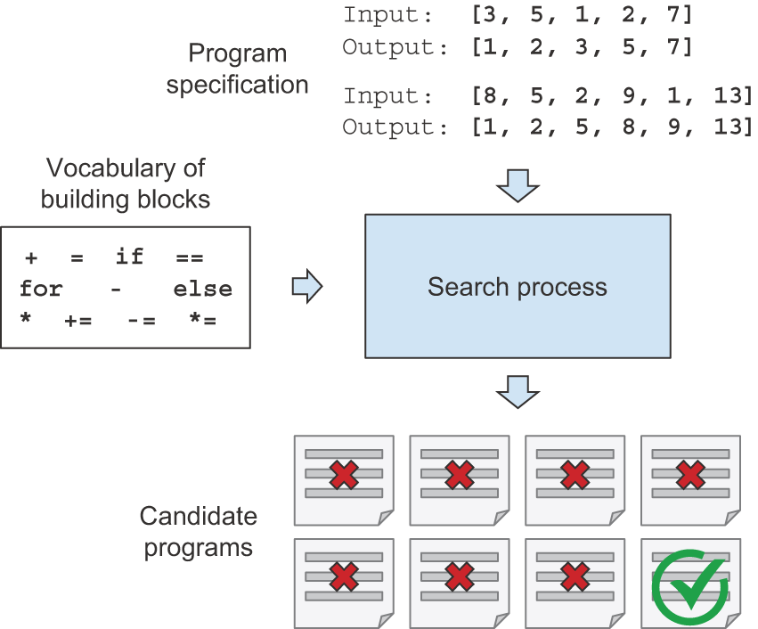

[Figure 19.14](#figure-19-14): A schematic view of program synthesis: given a program specification and a set of building blocks, a search process assembles the building blocks into candidate programs, which are then tested against the specification. The search continues until a valid program is found.

| Machine learning | Program synthesis |
| --- | --- |
| Model: differentiable parametric function | Model: graph of operators from a programming language |
| Engine: gradient descent | Engine: discrete search (such as genetic search) |
| Requires a lot of data to produce reliable results | Data efficient: can work with a couple of training examples |

[Table 19.2](#table-19-2): Machine learning vs. program synthesis

Program synthesis is how we’re going to add program-centric abstraction
capabilities to our AI systems. It’s the missing piece of the puzzle.

### Blending deep learning and program synthesis

Of course, deep learning isn’t going anywhere. Program synthesis isn’t its replacement;
it is its complement. It’s the hemisphere that has been so far missing from our artificial brains.
We’re going to be using both, in combination. There are two major ways this will take place:

* Developing systems that integrate both deep learning modules and discrete algorithmic modules
* Using deep learning to make the program search process itself more efficient

Let’s review each of these possible avenues.

#### Integrating deep learning modules and algorithmic modules into hybrid systems

Today, many of the most powerful AI systems are hybrid: they use both deep learning
models and handcrafted symbol-manipulation programs.
In DeepMind’s AlphaGo, for example, most
of the intelligence on display is designed and hardcoded by human programmers
(such as Monte Carlo Tree Search). Learning from data happens only in
specialized submodules (value networks and policy networks).
Or consider the Waymo self-driving car: it’s able to handle
a large variety of situations because it maintains a model of the world around it
— a literal 3D model — full of assumptions hardcoded by human engineers.
This model is constantly updated via deep learning perception modules (powered by Keras) that interface it
with the surroundings of the car.

For both of these systems — AlphaGo and self-driving vehicles — the combination
of human-created discrete programs and learned continuous models is what unlocks
a level of performance that would be impossible with either approach in isolation,
such as an end-to-end deep net or a piece of software without machine learning elements.
So far, the discrete algorithmic elements of such hybrid systems are painstakingly
hardcoded by human engineers. But in the future, such systems may be fully learned,
with no human involvement.

What will this look like? Consider a well-known type of network: recurrent neural networks (RNNs).
It’s important to note that RNNs have slightly fewer limitations than
feedforward networks. That’s because RNNs are a bit more than mere geometric
transformations: they’re geometric transformations *repeatedly applied inside a `for` loop*.
The temporal `for` loop is itself hardcoded by human
developers: it’s a built-in assumption of the network. Naturally, RNNs are
still extremely limited in what they can represent, primarily because each
step they perform is a differentiable geometric transformation, and they carry
information from step to step via points in a continuous geometric space
(state vectors). Now imagine a neural network that’s augmented in a similar
way with programming primitives but instead of a single hardcoded `for` loop
with hardcoded continuous-space memory, the network includes a large
set of programming primitives that the model is free to manipulate to expand
its processing function, such as `if` branches, `while` statements, variable
creation, disk storage for long-term memory, sorting operators, advanced data
structures (such as lists, graphs, and hash tables), and many more. The space
of programs that such a network could represent would be far broader than what
can be represented with current deep learning models, and some of these
programs could achieve superior generalization power. Importantly, such
programs will not be differentiable end to end, although specific modules will
remain differentiable, and thus will need to be generated via a combination
of discrete program search and gradient descent.

We’ll move away from having, on one hand, hardcoded algorithmic intelligence
(handcrafted software) and, on the other hand, learned geometric intelligence
(deep learning). Instead, we’ll have a blend of formal algorithmic modules
that provide reasoning and abstraction capabilities and geometric modules
that provide informal intuition and pattern-recognition capabilities (figure 19.15). The
entire system will be learned with little or no human involvement.
This should dramatically expand the scope of problems that can be solved with machine
learning — the space of programs that we can generate automatically, given
appropriate training data. Systems like AlphaGo — or even RNNs — can be seen as a prehistoric
ancestor of such hybrid algorithmic-geometric models.

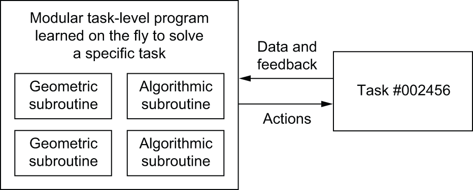

[Figure 19.15](#figure-19-15): A learned program relying on both geometric primitives (pattern recognition, intuition) and algorithmic primitives (reasoning, search, memory)

#### Using deep learning to guide program search

Today, program synthesis faces a major obstacle: it’s tremendously inefficient.
To caricature, typical program synthesis techniques work by trying every possible program in a
search space until it finds one that matches the specification provided.
As the complexity of a program specification increases, or as the vocabulary
of primitives used to write programs expands, the program search process runs
into what’s known as *combinatorial explosion*: the set of possible programs
to consider grows very fast, in fact, much faster than merely exponentially fast.
As a result, today, program synthesis can only be used to generate very short programs.
You’re not going to be generating a new OS for your computer anytime soon.

To move forward, we’re going to need to make program synthesis efficient
by bringing it closer to the way humans write software. When you open your editor
to code up a script, you’re not thinking about every possible program you could
potentially write. You only have in mind a handful of possible approaches:
you can use your understanding of the problem and your past experience to drastically
cut through the space of possible options to consider.

Deep learning can help program synthesis do the same:
although each specific program we’d like to generate might be
a fundamentally discrete object that performs non-interpolative data manipulation,
evidence so far indicates that *the space of all useful programs* may look a lot like
a continuous manifold. That means that a deep learning model that has been trained on
millions of successful program-generation episodes might start to develop solid
*intuition* about the *path through program space* that the search process
should take to go from a specification to the corresponding program — just like
a software engineer might have immediate intuition about the overall architecture
of the script they’re about to write and about the intermediate functions and classes
they should use as stepping stones on the way to the goal.

Remember that human reasoning is heavily guided by value-centric abstraction —
that is, by pattern recognition and intuition. The same should be true of program synthesis.
I expect the general approach of guiding program search via learned heuristics
to see increasing research interest over the next 10 to 20 years.

### Modular component recombination and lifelong learning

If models become more complex and are built
on top of richer algorithmic primitives, then this increased complexity will
require higher reuse between tasks, rather than training a new model from
scratch every time we have a new task or a new dataset. Many datasets don’t
contain enough information for us to develop a new, complex model from
scratch, and it will be necessary to use information from previously
encountered datasets (much as you don’t learn English from scratch every time
you open a new book — that would be impossible). Training models from scratch on
every new task is also inefficient due to the large overlap between the
current tasks and previously encountered tasks.

With modern foundation models, we’re starting to move closer to a world
where AI systems possess enormous amounts of acquired knowledge and skills
and can bring them to bear on whatever comes their way.
But LLMs are missing a key ingredient: recombination. LLMs are very good at fetching and reapplying memorized
functions, but they’re not yet able to recombine those functions on the fly
into brand-new programs adapted to the situation at hand.
They are, in fact, entirely incapable of performing function composition,
as investigated in a recent paper by Dziri et al.[[5]](#footnote-5).
What’s more, the kind of functions they learn aren’t sufficiently abstract or modular,
making them a poor fit
for recombination in the first place.
Remember how we pointed out that LLMs have low accuracy in adding large integers?
You probably wouldn’t want to build your next codebase on top of such brittle functions.

To solve *compositional generalization*, we’re going to need to
reuse robust *program components* like the functions and classes found
in human programming languages. These components will be evolved
specifically for modular reuse in a new context —
unlike the patterns that LLMs memorize.
And our AIs will recombine them on the fly to synthesize new programs
adapted to the current task. Crucially, libraries of such reusable components will
be built through the cumulative experience of all instances of our AIs and
will then be accessible by all in perpetuity.
Any single problem encountered by our AIs would only need to be solved once
— making them constantly self-improving.

Think of the process of software development today: once an engineer solves a
specific problem (HTTP queries in Python, for instance), they package it as an
abstract, reusable library, accessible by anyone on the planet. Engineers who face a similar problem in the future
will be able to search for existing libraries, download one, and use it in
their own project. In a similar way, in the future, meta-learning systems will
be able to assemble new programs by sifting through a global library of
high-level reusable blocks. When the system finds itself developing similar
program subroutines for several different tasks, it can come up with an
*abstract*, reusable version of the subroutine and store it in the global
library (see figure 19.16). These subroutines can be either geometric
(deep learning modules with pretrained representations) or algorithmic (closer
to the libraries that contemporary software engineers manipulate).

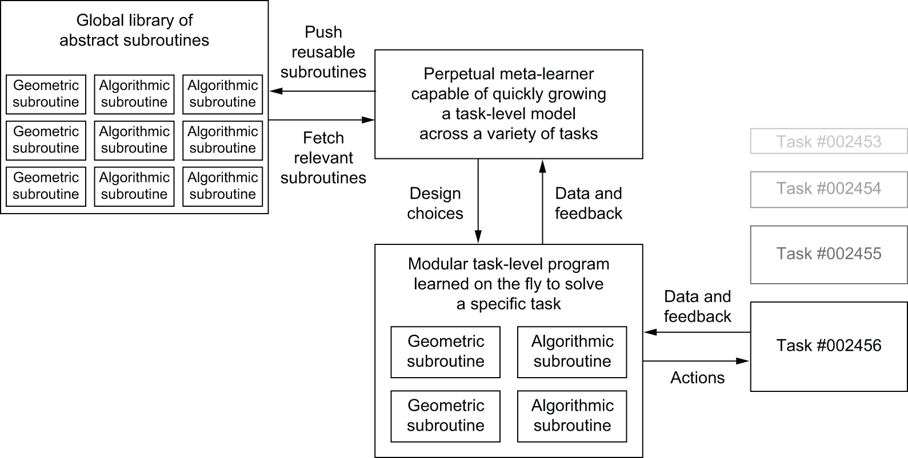

[Figure 19.16](#figure-19-16): A meta-learner capable of quickly developing task-specific models using reusable primitives (both algorithmic and geometric), thus achieving extreme generalization

### The long-term vision

In short, here’s my long-term vision for AI:

* Models will be more like programs and will have capabilities that go far
  beyond the continuous geometric transformations of the input data we currently
  work with. These programs will arguably be much closer to the abstract mental
  models that humans maintain about their surroundings and themselves, and they
  will be capable of stronger generalization due to their rich algorithmic
  nature.

* In particular, models will blend *algorithmic modules* providing formal
  reasoning, search, and abstraction capabilities with *geometric modules*
  providing informal intuition and pattern-recognition capabilities.
  This will achieve a blend of value-centric and program-centric abstraction.
  AlphaGo or self-driving cars
  (systems that required a lot of manual software engineering and human-made
  design decisions) provide an early example of what such a blend of symbolic
  and geometric AI could look like.

* Such models will be *grown* automatically rather than hardcoded by human
  engineers, using modular parts stored in a global library of reusable
  subroutines — a library evolved by learning high-performing models on thousands
  of previous tasks and datasets. As frequent problem-solving patterns are
  identified by the meta-learning system, they will be turned into reusable
  subroutines — much like functions and classes in software engineering — and added
  to the global library.

* The process that searches over possible combinations of subroutines to
  grow new models will be a discrete search process (program synthesis), but it
  will be heavily guided by a form of *program-space intuition* provided by
  deep learning.

* This global subroutine library and associated model-growing system will be able to
  achieve some form of human-like *extreme generalization*: given a new task or
  situation, the system will be able to assemble a new working model appropriate
  for the task using very little data, thanks to rich program-like primitives
  that generalize well, and extensive experience with similar tasks. In the same
  way, humans can quickly learn to play a complex new video game if they have
  experience with many previous games because the models derived from this
  previous experience are abstract and program-like, rather than a basic mapping
  between stimuli and action.

This perpetually learning model-growing system can be interpreted as
an *artificial general intelligence* (AGI). But don’t expect any
singularitarian robot apocalypse to ensue: that’s pure fantasy, coming from a
long series of profound misunderstandings of both intelligence and technology.
Such a critique, however, doesn’t belong in this book.

#### **Tiếng Việt (Vietnamese)**

# Chương 19: Tương lai của AI

Chương này bao gồm

* Những hạn chế của học sâu
* Bản chất của trí thông minh
* Những gì còn thiếu trong các phương pháp tiếp cận hiện tại
* Tương lai có thể trông như thế nào

Để sử dụng một công cụ một cách thích hợp, bạn không chỉ phải hiểu những gì nó *có thể* làm mà còn phải biết những gì nó *không thể* làm. Tôi sẽ trình bày tổng quan về một số hạn chế chính của học sâu. Sau đó, tôi sẽ đưa ra một số suy đoán về sự phát triển trong tương lai của AI và những gì cần có để đạt được trí thông minh tổng quát ở cấp độ con người. Điều này sẽ đặc biệt thú vị với bạn nếu bạn muốn tham gia vào nghiên cứu cơ bản.

## Những hạn chế của học sâu

Có vô số điều bạn có thể làm với deep learning. Nhưng học sâu không thể làm được *mọi thứ*. Để sử dụng tốt một công cụ, bạn nên nhận thức được những hạn chế của nó chứ không chỉ điểm mạnh của nó. Vậy học sâu còn thiếu sót ở đâu?

### Các mô hình học sâu đấu tranh để thích ứng với sự mới lạ

Các mô hình học sâu là các đường cong tham số lớn, phù hợp với các tập dữ liệu lớn. Đó là nguồn sức mạnh của chúng - chúng dễ đào tạo và mở rộng quy mô rất tốt, cả về kích thước mô hình và kích thước tập dữ liệu. Nhưng đó cũng là nguồn gốc của những điểm yếu đáng kể. Việc lắp đường cong có những hạn chế cố hữu.

Đầu tiên và quan trọng nhất, đường cong tham số chỉ có khả năng lưu trữ thông tin — đó là một loại *cơ sở dữ liệu*. Bạn có nhớ cuộc thảo luận của chúng ta về Transformers như một “cơ sở dữ liệu nội suy” ở chương 15 không? Thứ hai, điều quan trọng là cơ sở dữ liệu này *tĩnh*. Các tham số của mô hình được xác định trong giai đoạn “thời gian huấn luyện” riêng biệt. Sau đó, các tham số này được cố định và phiên bản cố định này được sử dụng trong “thời gian suy luận” để đưa ra dự đoán về dữ liệu mới.

Điều duy nhất bạn có thể làm với cơ sở dữ liệu tĩnh là truy xuất thông tin. Và đó chính xác là điều mà các mô hình deep learning vượt trội: nhận biết hoặc tạo ra các mẫu rất giống với những mẫu gặp phải trong quá trình đào tạo. Mặt trái của nó là họ vốn đã kém khả năng *thích ứng*. Cơ sở dữ liệu có tính chất lạc hậu — nó phù hợp với dữ liệu trong quá khứ nhưng không thể xử lý được một tương lai đang thay đổi. Tại thời điểm suy luận, tốt hơn hết bạn nên hy vọng rằng các tình huống mà mô hình gặp phải là một phần của quá trình phân phối dữ liệu huấn luyện, vì nếu không, mô hình sẽ bị hỏng. Ví dụ: một mô hình được đào tạo trên ImageNet sẽ phân loại một chiếc ghế sofa có họa tiết da báo là một con báo thực sự - ghế sofa không nằm trong dữ liệu đào tạo của nó.

Điều này cũng áp dụng cho các mô hình tổng quát lớn nhất. Trong những năm gần đây, sự nổi lên của các mô hình ngôn ngữ lớn (LLM) và ứng dụng của chúng vào hỗ trợ lập trình và các vấn đề tương tự như lý luận đã cung cấp bằng chứng thực nghiệm sâu rộng về điều này. Bất chấp những tuyên bố thường xuyên rằng LLM có thể thực hiện *học trong ngữ cảnh* để tiếp thu các kỹ năng mới chỉ từ một vài ví dụ, có bằng chứng rõ ràng rằng những gì họ thực sự đang làm là tìm nạp các hàm vectơ mà họ đã ghi nhớ trong quá trình đào tạo và áp dụng lại chúng vào nhiệm vụ trước mắt. Bằng cách học cách thực hiện dự đoán mã thông báo tiếp theo trên tập dữ liệu văn bản có kích thước web, LLM đã thu thập hàng triệu chương trình xử lý văn bản nhỏ hữu ích tiềm năng và có thể dễ dàng được nhắc sử dụng lại chúng cho một vấn đề mới. Nhưng hãy cho nó xem thứ gì đó không có giá trị tương đương trực tiếp trong dữ liệu huấn luyện của nó và nó sẽ bất lực.

Hãy xem câu đố ở hình 19.1. Bạn đã tìm ra giải pháp? Tốt. Nó không khó lắm phải không? Nhưng ngày nay, không có LLM hoặc mô hình ngôn ngữ tầm nhìn hiện đại nào có thể làm được điều này bởi vì vấn đề cụ thể này không ánh xạ trực tiếp tới bất kỳ điều gì họ đã thấy trong thời gian đào tạo - ngay cả sau khi đã được đào tạo trên toàn bộ internet và sau đó một số. Khả năng giải quyết một vấn đề nhất định của LLM không liên quan gì đến độ phức tạp của vấn đề mà mọi thứ đều liên quan đến *sự quen thuộc* - họ sẽ bẻ gãy răng mình trước bất kỳ vấn đề đủ mới lạ nào, cho dù đơn giản đến đâu.

[Figure 19.1](#figure-19-1): An easy yet novel puzzle

Chế độ lỗi này thậm chí còn áp dụng cho các biến thể nhỏ của mẫu mà LLM gặp phải nhiều lần trong dữ liệu huấn luyện của nó. Ví dụ: trong vài tháng sau khi phát hành ChatGPT, nếu bạn hỏi nó: “Cái gì nặng hơn, 10 kg thép hay 1 kg lông vũ?”, nó sẽ trả lời rằng chúng nặng như nhau. Đó là bởi vì câu hỏi “Một kg thép hay một kg lông vũ, cái gì nặng hơn?” được tìm thấy nhiều lần trên internet - như một câu hỏi mẹo. Tất nhiên, câu trả lời đúng là cả hai đều có trọng lượng như nhau, vì vậy mô hình GPT sẽ chỉ lặp lại câu trả lời mà nó đã ghi nhớ mà không chú ý đến các con số thực tế trong truy vấn hoặc truy vấn thực sự *có nghĩa* là gì. Tương tự, LLM gặp khó khăn trong việc thích ứng với các biến thể của bài toán Monty Hall (xem hình 19.2) và sẽ có xu hướng luôn đưa ra câu trả lời chuẩn cho câu đố mà họ đã thấy nhiều lần trong quá trình đào tạo, bất kể nó có hợp lý trong ngữ cảnh hay không.

[Figure 19.2](#figure-19-2): A variation of the Monty Hall problem

Cần lưu ý, những lời nhắc cụ thể này sau đó đã được vá bằng cách đặt chúng vào vỏ đặc biệt. Ngày nay, có hơn 25.000 người làm việc toàn thời gian để cung cấp dữ liệu đào tạo cho LLM bằng cách xem xét các trường hợp thất bại và đề xuất câu trả lời tốt hơn. Bảo trì LLM là một trò chơi liên tục, trong đó các lời nhắc lỗi được vá lần lượt mà không giải quyết được vấn đề cơ bản tổng quát hơn. Ngay cả những lời nhắc đã được vá vẫn sẽ không thành công nếu bạn thực hiện những thay đổi nhỏ đối với chúng!

### Các mô hình học sâu rất nhạy cảm với cách diễn đạt và các yếu tố gây phân tâm khác

Một vấn đề liên quan chặt chẽ là độ nhạy cực cao của các mô hình học sâu đối với cách trình bày đầu vào của chúng. Ví dụ: các mô hình hình ảnh bị ảnh hưởng bởi *các ví dụ đối nghịch*, là các mẫu được cung cấp cho mạng học sâu được thiết kế để đánh lừa mô hình phân loại sai chúng. Bạn đã biết rằng có thể thực hiện tăng dần độ dốc trong không gian đầu vào để tạo đầu vào giúp tối đa hóa việc kích hoạt một số bộ lọc ConvNet - đây là cơ sở của kỹ thuật trực quan hóa bộ lọc được giới thiệu trong chương 10.

Tương tự, thông qua việc tăng độ dốc, bạn có thể sửa đổi một chút hình ảnh để tối đa hóa dự đoán lớp cho một lớp nhất định. Bằng cách chụp ảnh một con gấu trúc và thêm vào nó một gradient vượn, chúng ta có thể có được một mạng lưới thần kinh để phân loại gấu trúc là vượn (xem hình 19.3). Điều này chứng tỏ cả tính dễ vỡ của các mô hình này và sự khác biệt sâu sắc giữa ánh xạ đầu vào đến đầu ra của chúng và nhận thức của con người chúng ta.

[Figure 19.3](#figure-19-3): An adversarial example: imperceptible changes in an image can upend a model’s classification of the image.

Tương tự, LLM có độ nhạy cực cao đối với các chi tiết nhỏ trong lời nhắc của chúng. Những sửa đổi nhanh chóng vô hại, chẳng hạn như thay đổi địa điểm và tên người trong đoạn văn bản hoặc tên biến trong một khối mã, có thể làm giảm đáng kể hiệu suất LLM. Hãy xem xét câu đố *Alice ở xứ sở thần tiên* nổi tiếng[[1]](#footnote-1):

"Alice có N anh em trai và cô ấy cũng có M chị em gái. Anh trai của Alice có bao nhiêu chị em gái?"

Tất nhiên, câu trả lời là *M* + 1 (chị em của Alice và chính Alice). Đối với LLM, việc đặt câu hỏi với các giá trị thường thấy trong các phiên bản câu đố trực tuyến (như *N* = 3 và *M* = 2) thường sẽ dẫn đến câu trả lời đúng, nhưng hãy thử điều chỉnh các giá trị của *M* và *N* và bạn sẽ nhanh chóng nhận được câu trả lời sai.

Sự nhạy cảm quá mức đối với cách diễn đạt này đã làm nảy sinh khái niệm *kỹ thuật nhanh chóng*. Kỹ thuật nhắc nhở là nghệ thuật xây dựng các lời nhắc LLM theo cách tối đa hóa hiệu suất của một nhiệm vụ. Ví dụ: hóa ra việc thêm hướng dẫn “Hãy suy nghĩ từng bước” vào lời nhắc liên quan đến lý luận có thể tăng hiệu suất đáng kể. Thuật ngữ *kỹ thuật nhanh chóng* là cách diễn đạt rất lạc quan về vấn đề cơ bản: "Các mô hình của bạn tốt hơn những gì bạn biết! Bạn chỉ cần sử dụng chúng đúng cách!" Một cách diễn đạt tiêu cực hơn sẽ là chỉ ra rằng đối với bất kỳ truy vấn nào có vẻ hiệu quả, sẽ có một loạt thay đổi nhỏ có khả năng ảnh hưởng đến hiệu suất. LLM hiểu điều gì đó ở mức độ nào nếu bạn có thể phá vỡ sự hiểu biết của họ bằng cách diễn đạt lại đơn giản?

Điều đằng sau hiện tượng này là LLM là một đường cong tham số lớn - một phương tiện để lưu trữ kiến ​​thức và chương trình mà bạn có thể nội suy giữa hai đối tượng bất kỳ để tạo ra vô số đối tượng trung gian. Lời nhắc của bạn là một cách để giải quyết một vị trí cụ thể của cơ sở dữ liệu: nếu bạn hỏi, "Làm thế nào để bạn sắp xếp một danh sách trong Python? Hãy trả lời như một tên cướp biển", đó là một kiểu tra cứu cơ sở dữ liệu, trong đó trước tiên bạn truy xuất một phần kiến ​​thức (cách sắp xếp danh sách trong Python), sau đó truy xuất và thực thi một chương trình chuyển kiểu ("Trả lời như một tên cướp biển").

Vì kiến ​​thức và chương trình được LLM lập chỉ mục là nội suy nên bạn có thể *di chuyển trong không gian tiềm ẩn* để khám phá các địa điểm lân cận. Một lời nhắc hơi khác, chẳng hạn như “Giải thích cách sắp xếp danh sách Python, nhưng trả lời như một kẻ khai thác mật ong” vẫn sẽ chỉ đến một vị trí rất giống nhau trong cơ sở dữ liệu, dẫn đến một câu trả lời khá gần nhưng không hoàn toàn giống nhau. Có hàng nghìn biến thể mà bạn có thể sử dụng, mỗi biến thể sẽ dẫn đến một câu trả lời tương tự nhưng hơi khác một chút. Và đó là lý do tại sao cần có kỹ thuật nhanh chóng. Không có lý do tiên nghiệm nào để lời nhắc ngây thơ đầu tiên của bạn trở nên tối ưu cho nhiệm vụ của bạn. LLM sẽ không hiểu ý của bạn và sau đó thực hiện nó theo cách tốt nhất có thể - nó chỉ tìm nạp chương trình mà lời nhắc của bạn trỏ tới, trong số nhiều vị trí có thể mà bạn có thể đã đến.

Kỹ thuật nhắc nhở là quá trình tìm kiếm trong không gian tiềm ẩn để tìm truy vấn tra cứu có vẻ hoạt động tốt nhất cho nhiệm vụ mục tiêu của bạn bằng cách thử và sai. Nó không khác gì việc thử các từ khóa khác nhau khi thực hiện tìm kiếm trên Google. Nếu LLM thực sự hiểu những gì bạn hỏi họ thì sẽ không cần quá trình tìm kiếm này vì lượng thông tin được truyền tải về nhiệm vụ mục tiêu của bạn không thay đổi cho dù lời nhắc của bạn sử dụng từ “viết lại” thay vì “viết lại” hay liệu bạn có thêm tiền tố “Hãy suy nghĩ từng bước” vào lời nhắc của mình hay không. Đừng bao giờ cho rằng LLM “hiểu được” ngay lần đầu tiên - hãy nhớ rằng lời nhắc của bạn chỉ là một địa chỉ trong vô số chương trình, tất cả đều được ghi nhớ như một sản phẩm phụ của quá trình học cách hoàn thành một lượng lớn chuỗi mã thông báo.

### Các mô hình học sâu gặp khó khăn trong việc học các chương trình có tính khái quát

Vấn đề với các mô hình học sâu không chỉ là chúng bị giới hạn trong việc áp dụng lại một cách mù quáng các mẫu mà chúng đã ghi nhớ trong thời gian đào tạo hoặc chúng rất nhạy cảm với cách trình bày đầu vào của chúng. Ngay cả khi bạn chỉ cần truy vấn và áp dụng một chương trình phổ biến và biết chính xác cách giải quyết chương trình này trong không gian tiềm ẩn, bạn vẫn phải đối mặt với một vấn đề lớn: các chương trình được ghi nhớ bởi các mô hình học sâu thường không khái quát hóa tốt. Chúng sẽ hoạt động với một số giá trị đầu vào và không hoạt động đối với một số giá trị đầu vào khác. Điều này đặc biệt đúng đối với các chương trình mã hóa bất kỳ loại logic rời rạc nào.

Hãy xem xét vấn đề cộng hai số, được biểu diễn dưới dạng chuỗi ký tự - như “4 3 5 7 + 8 9 3 6”. Hãy thử huấn luyện Transformer trên hàng trăm nghìn cặp chữ số như vậy: bạn sẽ đạt được độ chính xác rất cao. Rất cao, nhưng không phải 100% - bạn sẽ thường xuyên nhìn thấy các câu trả lời sai vì Transformer không quản lý để mã hóa thuật toán cộng chính xác (bạn biết đấy, thuật toán bạn đã học ở trường tiểu học). Thay vào đó, nó đoán kết quả đầu ra bằng cách nội suy giữa các điểm dữ liệu mà nó đã thấy tại thời điểm đào tạo.

Điều này cũng áp dụng cho các LLM hiện đại - ít nhất là những LLM không được mã hóa cứng rõ ràng để thực thi các đoạn mã như “4357 + 8936” trong Python để đưa ra câu trả lời đúng. Họ đã xem đủ các ví dụ về phép cộng chữ số để có thể cộng số, nhưng chúng chỉ đạt độ chính xác khoảng 70% - khá kém. Hơn nữa, độ chính xác của chúng phụ thuộc rất nhiều vào *chữ số* nào đang được thêm vào, với nhiều chữ số phổ biến hơn sẽ dẫn đến độ chính xác cao hơn.

Lý do tại sao một mô hình deep learning không học được một thuật toán cộng chính xác ngay cả sau khi xem hàng triệu ví dụ là vì nó chỉ là *một chuỗi tĩnh gồm các phép biến đổi hình học đơn giản, liên tục* ánh xạ một không gian vectơ này sang một không gian vectơ khác. Điều đó rất phù hợp để nhận dạng mẫu nhận thức, nhưng lại rất kém phù hợp để mã hóa bất kỳ loại logic rời rạc từng bước nào, chẳng hạn như các khái niệm như giá trị vị trí hoặc chuyển tiếp. Tất cả những gì nó có thể làm là ánh xạ một đa tạp dữ liệu X vào một đa tạp Y khác, giả sử sự tồn tại của một phép biến đổi liên tục có thể học được từ X sang Y. Mô hình học sâu có thể được hiểu là một loại chương trình, nhưng ngược lại, *hầu hết các chương trình không thể được biểu diễn dưới dạng mô hình học sâu*. Đối với hầu hết các nhiệm vụ, hoặc không tồn tại mạng thần kinh tương ứng có kích thước hợp lý để giải quyết nhiệm vụ hoặc ngay cả khi có tồn tại, nó cũng có thể không *có thể học được*: phép biến đổi hình học tương ứng có thể quá phức tạp hoặc có thể không có sẵn dữ liệu thích hợp để tìm hiểu nó.

### Rủi ro của việc nhân cách hóa các mô hình học máy

Sự hiểu biết của chúng ta về hình ảnh, âm thanh và ngôn ngữ dựa trên trải nghiệm cảm giác vận động của chúng ta với tư cách là con người. Các mô hình học máy không có quyền truy cập vào những trải nghiệm như vậy và do đó không thể hiểu được đầu vào của chúng theo cách phù hợp với con người. Bằng cách đưa một số lượng lớn các ví dụ đào tạo vào các mô hình của mình, chúng tôi giúp họ học một phép biến đổi hình học để ánh xạ dữ liệu tới các khái niệm của con người trên một tập hợp ví dụ cụ thể, nhưng ánh xạ này là một bản phác thảo đơn giản của mô hình ban đầu trong tâm trí chúng ta - mô hình được phát triển từ kinh nghiệm của chúng ta với tư cách là các tác nhân hiện thân. Nó giống như một hình ảnh mờ trong gương (xem hình 19.4). Các mô hình bạn tạo sẽ sử dụng bất kỳ phím tắt nào có sẵn để phù hợp với dữ liệu đào tạo của chúng.

[Figure 19.4](#figure-19-4): Current machine-learning models: like a dim image in a mirror

Một rủi ro thực sự với AI hiện đại là hiểu sai chức năng của các mô hình deep learning và đánh giá quá cao khả năng của chúng. Một đặc điểm cơ bản của con người là *lý thuyết về tâm trí*: xu hướng thể hiện ý định, niềm tin và kiến ​​thức về những thứ xung quanh chúng ta. Vẽ một khuôn mặt cười trên một tảng đá bỗng khiến nó “hạnh phúc” - trong tâm trí chúng ta. Áp dụng cho học sâu, điều này có nghĩa là khi đào tạo các mô hình có khả năng sử dụng ngôn ngữ, chúng ta sẽ tin rằng mô hình đó “hiểu” nội dung của chuỗi từ mà chúng tạo ra giống như cách chúng ta hiểu. Sau đó, chúng tôi rất ngạc nhiên khi bất kỳ sự khác biệt nhỏ nào so với các mẫu có trong dữ liệu huấn luyện đều khiến mô hình tạo ra các câu trả lời hoàn toàn vô lý.

Là một người thực hành học máy, hãy luôn lưu ý đến điều này và đừng bao giờ rơi vào cái bẫy tin rằng mạng lưới thần kinh hiểu nhiệm vụ mà chúng thực hiện - ít nhất là không theo cách có ý nghĩa đối với chúng ta. Họ được đào tạo về một nhiệm vụ khác, hẹp hơn nhiều so với nhiệm vụ mà chúng tôi muốn dạy họ: đó là sắp xếp các đầu vào đào tạo cho phù hợp với mục tiêu đào tạo, từng điểm một. Cho họ xem bất cứ điều gì khác với dữ liệu huấn luyện của họ và họ sẽ phá vỡ theo những cách vô lý.

## Quy mô không phải là tất cả những gì bạn cần

Chúng ta có thể tiếp tục mở rộng quy mô mô hình của mình để khắc phục những hạn chế của học sâu không? *quy mô* có phải là tất cả những gì chúng ta cần không? Đây từ lâu đã trở thành câu chuyện phổ biến trong lĩnh vực này, đặc biệt nổi bật vào đầu năm 2023, trong thời kỳ LLM cường điệu nhất. Hồi đó, GPT-4 mới được phát hành và về cơ bản nó là phiên bản mở rộng của GPT-3: nhiều thông số hơn, nhiều dữ liệu huấn luyện hơn. Hiệu suất được cải thiện đáng kể của nó dường như gợi ý rằng bạn có thể tiếp tục - rằng có thể có GPT-5 đơn giản giống như vậy hơn và từ đó trí tuệ nhân tạo chung (AGI) sẽ tự phát xuất hiện.

Những người ủng hộ quan điểm này sẽ lấy “luật mở rộng quy mô” làm bằng chứng. Quy luật tỷ lệ là mối quan hệ thực nghiệm được quan sát giữa quy mô của mô hình học sâu (cũng như quy mô của tập dữ liệu huấn luyện) và hiệu suất của nó đối với các nhiệm vụ cụ thể. Họ cho rằng việc tăng kích thước của mô hình một cách đáng tin cậy sẽ dẫn đến hiệu suất tốt hơn theo cách có thể dự đoán được. Nhưng điều quan trọng mà những người đam mê luật thang đo đang thiếu là các tiêu chuẩn mà họ đang sử dụng để đo lường “hiệu suất” chính là những bài kiểm tra ghi nhớ hiệu quả, loại bài kiểm tra mà chúng tôi muốn đưa ra cho sinh viên đại học. LLM thực hiện tốt các bài kiểm tra này bằng cách ghi nhớ các câu trả lời và một cách tự nhiên, việc nhồi nhét nhiều câu hỏi và nhiều câu trả lời hơn vào các mô hình sẽ cải thiện hiệu suất của chúng tương ứng.

Thực tế là việc mở rộng các mô hình của chúng tôi không dẫn đến bất kỳ tiến bộ nào về các vấn đề mà tôi đã liệt kê cho đến nay trên các trang này — không có khả năng thích ứng với tính mới, quá nhạy cảm với cách diễn đạt và không có khả năng suy ra các chương trình có tính tổng quát cho các vấn đề lý luận — bởi vì những vấn đề này vốn có trong việc điều chỉnh đường cong, mô hình của học sâu. Tôi đã bắt đầu chỉ ra những vấn đề này vào năm 2017 và chúng tôi vẫn đang phải vật lộn với chúng cho đến ngày nay - với các mô hình hiện lớn hơn bốn hoặc năm bậc độ lớn và hiểu biết nhiều hơn. Chúng tôi chưa đạt được bất kỳ tiến triển nào về những vấn đề này vì *các mô hình chúng tôi đang sử dụng vẫn giống nhau*. Chúng đã giống nhau trong hơn bảy năm - chúng vẫn là các đường cong tham số phù hợp với tập dữ liệu thông qua việc giảm độ dốc và chúng vẫn đang sử dụng kiến ​​trúc Transformer.

Mở rộng các kỹ thuật deep learning hiện tại bằng cách xếp chồng nhiều lớp hơn và sử dụng nhiều dữ liệu huấn luyện hơn sẽ không giải quyết được các vấn đề cơ bản của deep learning:

* Các mô hình học sâu bị giới hạn trong việc sử dụng các chương trình nội suy mà chúng ghi nhớ trong thời gian đào tạo.
Họ không thể tự mình tổng hợp các chương trình hoàn toàn mới tại thời điểm suy luận
để thích ứng với những tình huống thực sự mới lạ.
* Ngay cả trong những tình huống đã biết, các chương trình nội suy này vẫn gặp phải các vấn đề khái quát hóa,
dẫn đến sự quá nhạy cảm với các đặc điểm diễn đạt và gây nhiễu.
* Các mô hình học sâu bị giới hạn về những gì chúng có thể thể hiện và hầu hết các chương trình mà bạn có thể mong muốn
để học không thể được biểu diễn dưới dạng biến đổi hình học liên tục của dữ liệu
đa dạng. Điều này đúng đặc biệt với các nhiệm vụ lý luận thuật toán.

Chúng ta hãy xem xét kỹ hơn những gì phân biệt trí thông minh sinh học với phương pháp học sâu.

### Máy tự động và tác nhân thông minh

Có những khác biệt cơ bản giữa sự biến đổi hình học đơn giản từ đầu vào đến đầu ra mà các mô hình học sâu thực hiện và cách con người suy nghĩ và học hỏi. Thực tế không chỉ là con người tự học từ kinh nghiệm được thể hiện thay vì được đưa ra các ví dụ đào tạo rõ ràng. Bộ não con người là một con quái vật hoàn toàn khác so với một hàm tham số khả vi.

Hãy phóng to ra một chút và hỏi, Mục đích của trí thông minh là gì? Tại sao nó lại phát sinh ngay từ đầu? Chúng ta chỉ có thể suy đoán, nhưng chúng ta có thể đưa ra những suy đoán khá sáng suốt. Chúng ta có thể bắt đầu bằng việc nhìn vào bộ não - cơ quan tạo ra trí thông minh. Bộ não là một sự thích nghi tiến hóa - một cơ chế được phát triển tăng dần qua hàng trăm triệu năm, thông qua thử nghiệm và sai sót ngẫu nhiên được hướng dẫn bởi chọn lọc tự nhiên, giúp mở rộng đáng kể khả năng thích ứng với môi trường của sinh vật. Bộ não ban đầu xuất hiện cách đây hơn nửa tỷ năm như một cách để *lưu trữ và thực hiện các chương trình hành vi*. Các chương trình hành vi chỉ là những tập hợp hướng dẫn khiến sinh vật phản ứng với môi trường của nó: “Nếu điều này xảy ra, thì hãy làm điều kia”. Chúng liên kết các đầu vào cảm giác của sinh vật với các điều khiển vận động của nó. Ban đầu, bộ não sẽ phục vụ cho các chương trình hành vi mã hóa cứng (dưới dạng mô hình kết nối thần kinh), cho phép sinh vật phản ứng thích hợp với đầu vào giác quan của nó. Đây là cách bộ não côn trùng vẫn hoạt động - ruồi, kiến, *C. elegans* (xem hình 19.5), v.v. Bởi vì “mã nguồn” ban đầu của các chương trình này là DNA, mã này sẽ được giải mã dưới dạng các mẫu kết nối thần kinh, nên quá trình tiến hóa đột nhiên có thể *tìm kiếm trong không gian hành vi* theo một cách gần như không giới hạn - một sự thay đổi tiến hóa lớn.

[Figure 19.5](#figure-19-5): The brain network of the *C. elegans* worm: a behavioral automaton “programmed” by natural evolution. Figure created by Emma Towlson (from “Network control principles predict neuron function in the Caenorhabditis elegans connectome,” Yan et al., *Nature*, Oct. 2017).

Evolution là người lập trình, và bộ não là những chiếc máy tính thực thi cẩn thận đoạn mã mà tiến hóa đã giao cho chúng. Bởi vì kết nối thần kinh là một nền tảng tính toán rất chung chung nên không gian cảm biến vận động của tất cả các loài có khả năng hoạt động bằng não có thể đột nhiên bắt đầu trải qua quá trình mở rộng đáng kể. Mắt, tai, hàm dưới, 4 chân, 24 chân - miễn là bạn có bộ não, quá trình tiến hóa sẽ tử tế tìm ra cho bạn những chương trình hành vi tận dụng tốt những thứ này. Bộ não có thể xử lý bất kỳ phương thức nào hoặc sự kết hợp của các phương thức mà bạn ném vào chúng.

Bây giờ, xin lưu ý bạn, những bộ não thời kỳ đầu này thực chất không thông minh chút nào. Chúng rất giống *người máy*: chúng chỉ thực hiện các chương trình hành vi được mã hóa cứng trong DNA của sinh vật. Chúng chỉ có thể được mô tả là thông minh theo nghĩa tương tự như máy điều nhiệt là “thông minh”. Hoặc một chương trình sắp xếp danh sách. Hoặc một mạng lưới thần kinh sâu được đào tạo (thuộc loại nhân tạo). Đây là một điểm khác biệt quan trọng, vì vậy chúng ta hãy xem xét kỹ: Sự khác biệt giữa máy tự động và tác nhân thông minh thực tế là gì?

### Khái quát hóa cục bộ và khái quát hóa cực độ

Lĩnh vực AI từ lâu đã phải chịu đựng sự nhầm lẫn giữa các khái niệm *trí thông minh* và *tự động hóa*. Một hệ thống tự động hóa (hoặc máy tự động) là tĩnh, được chế tạo để thực hiện những việc cụ thể trong một bối cảnh cụ thể — “Nếu cái này thì cái kia” — trong khi một tác nhân thông minh có thể thích ứng nhanh chóng với những tình huống mới lạ, bất ngờ. Khi một máy tự động tiếp xúc với thứ gì đó không khớp với những gì nó được “lập trình” để làm (cho dù chúng ta đang nói về các chương trình do con người viết, các chương trình do tiến hóa tạo ra hay quy trình lập trình ngầm để điều chỉnh một mô hình trên tập dữ liệu huấn luyện), nó sẽ thất bại.

Trong khi đó, những đặc vụ thông minh, giống như con người chúng ta, sẽ sử dụng trí thông minh linh hoạt của mình để tìm ra con đường phía trước. Làm thế nào để bạn phân biệt được sự khác biệt giữa một học sinh đã ghi nhớ câu hỏi thi trong ba năm qua nhưng không hiểu bài và một học sinh thực sự hiểu tài liệu? Bạn đưa ra cho họ một vấn đề hoàn toàn mới.

Con người có khả năng làm được nhiều việc hơn là lập bản đồ các kích thích tức thời tới các phản ứng tức thời như một mạng lưới sâu hoặc một con côn trùng. Chúng ta có thể tập hợp nhanh chóng các mô hình phức tạp, trừu tượng về tình hình hiện tại của chúng ta, của bản thân và của người khác, đồng thời có thể sử dụng các mô hình này để dự đoán những tương lai khác nhau có thể xảy ra và thực hiện lập kế hoạch dài hạn. Chúng ta có thể nhanh chóng thích ứng với những tình huống bất ngờ và tiếp thu những kỹ năng mới chỉ sau một thời gian luyện tập.

Khả năng sử dụng *trừu tượng* và *lý luận* để xử lý những trải nghiệm mà chúng ta chưa chuẩn bị trước là đặc điểm xác định nhận thức của con người. Tôi gọi nó là *sự khái quát hóa cực độ*: khả năng thích ứng với những tình huống mới lạ, chưa từng có trước đây bằng cách sử dụng ít dữ liệu hoặc thậm chí không có dữ liệu mới nào cả. Khả năng này là chìa khóa cho trí thông minh của con người và động vật tiên tiến.

Điều này trái ngược hoàn toàn với những gì các hệ thống giống như máy tự động thực hiện. Một máy tự động rất cứng nhắc sẽ không có bất kỳ khái quát nào cả; nó sẽ không có khả năng xử lý bất cứ điều gì mà nó không được thông báo trước một cách chính xác. Một câu lệnh Python hoặc một chương trình trả lời câu hỏi cơ bản được triển khai dưới dạng các câu lệnh if-then-else được mã hóa cứng sẽ thuộc loại này. Lưới sâu hoạt động tốt hơn một chút: chúng có thể xử lý thành công các đầu vào khác một chút so với những gì chúng quen thuộc, đó chính xác là điều khiến chúng trở nên hữu ích. Mô hình chó và mèo của chúng ta ở chương 8 có thể phân loại các hình ảnh về mèo hoặc chó mà nó chưa từng thấy trước đây, miễn là chúng đủ gần với những gì nó được huấn luyện. Tuy nhiên, lưới sâu bị giới hạn ở cái mà tôi gọi là *tổng quát hóa cục bộ* (xem hình 19.6): việc ánh xạ từ đầu vào đến đầu ra do lưới sâu thực hiện nhanh chóng không còn ý nghĩa nữa khi đầu vào bắt đầu sai lệch so với những gì mạng nhìn thấy tại thời điểm huấn luyện. Lưới sâu chỉ có thể khái quát hóa thành *những ẩn số đã biết*, cho các yếu tố biến đổi đã được dự đoán trong quá trình phát triển mô hình và được mô tả rộng rãi trong dữ liệu huấn luyện, chẳng hạn như các góc máy ảnh hoặc điều kiện ánh sáng khác nhau cho ảnh thú cưng. Đó là bởi vì deep net khái quát hóa thông qua phép nội suy trên một đa tạp (hãy nhớ chương 5): bất kỳ yếu tố biến đổi nào trong không gian đầu vào của chúng đều cần phải được nắm bắt bởi đa tạp mà chúng học được. Đó là lý do tại sao việc tăng cường dữ liệu cơ bản lại rất hữu ích trong việc cải thiện khả năng khái quát hóa mạng sâu. Không giống như con người, những mô hình này không có khả năng ứng biến khi đối mặt với các tình huống có ít hoặc không có dữ liệu.

[Figure 19.6](#figure-19-6): Local generalization vs. extreme generalization

Ví dụ, hãy xem xét vấn đề tìm hiểu các thông số phóng thích hợp để đưa một tên lửa hạ cánh xuống mặt trăng. Nếu bạn sử dụng deep net cho nhiệm vụ này và huấn luyện nó bằng cách sử dụng phương pháp học có giám sát hoặc học tăng cường, thì bạn sẽ phải cung cấp cho nó hàng chục nghìn hoặc thậm chí hàng triệu lần chạy thử: bạn cần cho nó tiếp xúc với một *mẫu dày đặc* của không gian đầu vào để nó học cách ánh xạ đáng tin cậy từ không gian đầu vào đến không gian đầu ra. Ngược lại, với tư cách là con người, chúng ta có thể sử dụng khả năng trừu tượng của mình để đưa ra các mô hình vật lý - khoa học tên lửa - và tìm ra giải pháp chính xác giúp đưa tên lửa lên mặt trăng trong một hoặc một vài thử nghiệm. Tương tự, nếu bạn phát triển một mạng lưới sâu điều khiển cơ thể con người và bạn muốn nó học cách di chuyển trong thành phố một cách an toàn mà không bị ô tô đâm, mạng sẽ phải ngừng hoạt động hàng nghìn lần trong nhiều tình huống khác nhau cho đến khi nó có thể suy ra rằng ô tô là nguy hiểm và phát triển các hành vi tránh né thích hợp. Khi rơi vào một thành phố mới, mạng sẽ phải học lại hầu hết những gì nó biết. Mặt khác, con người có thể học các hành vi an toàn mà không cần phải chết dù chỉ một lần - một lần nữa, nhờ vào khả năng mô hình hóa trừu tượng các tình huống mới lạ của chúng ta.

### Mục đích của trí thông minh

Sự khác biệt giữa các tác nhân thông minh có khả năng thích ứng cao và các máy tự động cứng nhắc đưa chúng ta quay trở lại quá trình tiến hóa não bộ. Tại sao bộ não - ban đầu chỉ là phương tiện để tiến hóa tự nhiên phát triển các máy tự động hóa hành vi - cuối cùng lại trở nên thông minh? Giống như mọi cột mốc tiến hóa quan trọng khác, nó xảy ra do những hạn chế của chọn lọc tự nhiên đã khuyến khích nó xảy ra.

Bộ não chịu trách nhiệm tạo ra hành vi. Nếu tập hợp các tình huống mà sinh vật phải đối mặt hầu hết là tĩnh và được biết trước, thì việc tạo ra hành vi sẽ là một vấn đề dễ dàng: quá trình tiến hóa sẽ chỉ tìm ra các hành vi đúng thông qua thử và sai ngẫu nhiên rồi mã hóa chúng vào DNA của sinh vật. Giai đoạn đầu tiên của quá trình tiến hóa não bộ - bộ não như những người máy - sẽ là giai đoạn tối ưu. Tuy nhiên, điều quan trọng nhất là khi độ phức tạp của sinh vật - và cùng với đó là độ phức tạp của môi trường - không ngừng tăng lên, các tình huống mà động vật phải đối phó trở nên năng động hơn và khó lường hơn nhiều. Một ngày trong cuộc đời bạn, nếu bạn nhìn kỹ, sẽ không giống bất kỳ ngày nào bạn từng trải qua và không giống bất kỳ ngày nào mà tổ tiên tiến hóa của bạn từng trải qua. Bạn cần có khả năng liên tục đối mặt với những tình huống chưa biết và đáng ngạc nhiên. Không có cách nào để quá trình tiến hóa tìm ra và mã hóa chuỗi hành vi mà bạn đã thực hiện thành DNA để điều hướng thành công một ngày của mình kể từ khi bạn thức dậy vài giờ trước. Nó phải được tạo ra nhanh chóng mỗi ngày.

Bộ não, như một cỗ máy tạo ra hành vi tốt, chỉ đơn giản là thích nghi để phù hợp với nhu cầu này. Nó đã tối ưu hóa khả năng thích ứng và tính tổng quát, thay vì chỉ tối ưu hóa sự phù hợp cho một loạt tình huống cố định. Sự thay đổi này có thể đã xảy ra nhiều lần trong suốt lịch sử tiến hóa, dẫn đến sự ra đời của những loài động vật cực kỳ thông minh ở các nhánh tiến hóa rất xa - vượn, bạch tuộc, quạ, v.v. Trí thông minh là câu trả lời cho những thách thức do hệ sinh thái năng động, phức tạp đặt ra.

Đó là bản chất của trí thông minh: đó là khả năng sử dụng hiệu quả thông tin theo ý của bạn để tạo ra hành vi thành công khi đối mặt với một tương lai không chắc chắn và luôn thay đổi. Điều mà Descartes gọi là “sự hiểu biết” chính là chìa khóa cho khả năng vượt trội này: khả năng khai thác kinh nghiệm trong quá khứ của bạn để phát triển những khái niệm trừu tượng mang tính mô-đun, có thể tái sử dụng và có thể nhanh chóng được sử dụng lại để xử lý các tình huống mới và đạt được mức độ khái quát hóa cao.

### Leo lên phổ khái quát

Là một bức tranh biếm họa thô thiển, bạn có thể tóm tắt lịch sử tiến hóa của trí thông minh sinh học như một cuộc leo thang chậm rãi trên *phổ khái quát hóa*. Nó bắt đầu với những bộ não giống như máy tự động chỉ có thể thực hiện việc khái quát hóa cục bộ. Theo thời gian, quá trình tiến hóa bắt đầu tạo ra những sinh vật có khả năng khái quát hóa ngày càng rộng hơn, có thể phát triển mạnh trong những môi trường ngày càng phức tạp và biến đổi. Cuối cùng, trong vài triệu năm qua - một thời điểm trong thuật ngữ tiến hóa - một số loài hominin nhất định bắt đầu có xu hướng triển khai trí thông minh sinh học có khả năng khái quát hóa cực độ, thúc đẩy sự khởi đầu của Anthropocene và thay đổi mãi mãi lịch sử sự sống trên Trái đất.

Sự tiến bộ của AI trong 70 năm qua có những điểm tương đồng nổi bật với sự phát triển này. Các hệ thống AI ban đầu là các máy tự động thuần túy, như chương trình trò chuyện ELIZA từ những năm 1960 hoặc SHRDLU:[[2]](#footnote-2), một AI năm 1970 có khả năng thao tác các đối tượng đơn giản từ các lệnh ngôn ngữ tự nhiên. Trong những năm 1990 và 2000, chúng ta đã chứng kiến ​​​​sự trỗi dậy của các hệ thống máy học có khả năng khái quát hóa cục bộ có thể giải quyết một số mức độ không chắc chắn và mới lạ. Trong những năm 2010, học sâu đã mở rộng hơn nữa sức mạnh tổng quát hóa cục bộ của các hệ thống này bằng cách cho phép các kỹ sư sử dụng các bộ dữ liệu lớn hơn và các mô hình biểu cảm hơn nhiều.

Ngày nay, chúng ta có thể đang ở trên đỉnh của bước tiến hóa tiếp theo. Chúng tôi đang hướng tới các hệ thống đạt được *khái quát hóa rộng rãi*, mà tôi xác định là khả năng xử lý các *ẩn số chưa xác định* trong một phạm vi nhiệm vụ rộng duy nhất (bao gồm các tình huống mà hệ thống không được đào tạo để xử lý và những người tạo ra nó không thể lường trước được). Ví dụ như một chiếc ô tô tự lái có khả năng xử lý an toàn trong mọi tình huống mà bạn gặp phải hoặc một robot gia đình có thể vượt qua “Bài kiểm tra trí thông minh của Woz” — vào một căn bếp ngẫu nhiên và pha một tách cà phê:[[3]](#footnote-3). Bằng cách kết hợp học sâu và các mô hình trừu tượng được làm thủ công tỉ mỉ của thế giới, chúng tôi đã đạt được tiến bộ rõ rệt hướng tới những mục tiêu này.

Tuy nhiên, mô hình học sâu vẫn bị giới hạn trong tự động hóa nhận thức: Nhãn “trí thông minh” trong “trí tuệ nhân tạo” là một lỗi về danh mục. Sẽ chính xác hơn nếu gọi lĩnh vực của chúng tôi là “nhận thức nhân tạo”, với “tự động hóa nhận thức” và “trí tuệ nhân tạo” là hai trường con gần như độc lập trong đó. Trong phân khu này, AI sẽ là một cánh đồng xanh, nơi hầu hết mọi thứ vẫn chưa được khám phá.

Bây giờ, tôi không có ý làm giảm thành tựu của deep learning. Tự động hóa nhận thức cực kỳ hữu ích và cách các mô hình học sâu có khả năng tự động hóa các nhiệm vụ chỉ từ việc tiếp xúc với dữ liệu thể hiện một hình thức tự động hóa nhận thức đặc biệt mạnh mẽ, thực tế và linh hoạt hơn nhiều so với lập trình rõ ràng. Thực hiện tốt điều này về cơ bản sẽ là yếu tố thay đổi cuộc chơi cho mọi ngành. Nhưng vẫn còn một chặng đường dài so với trí thông minh của con người (hoặc động vật). Cho đến nay, các mô hình của chúng tôi chỉ có thể thực hiện khái quát hóa cục bộ: chúng ánh xạ không gian X sang không gian Y thông qua một phép biến đổi hình học mượt mà được học từ việc lấy mẫu dày đặc các điểm dữ liệu X đến Y và bất kỳ sự gián đoạn nào trong không gian X hoặc Y đều làm mất hiệu lực ánh xạ này. Họ chỉ có thể khái quát hóa những tình huống mới giống với dữ liệu trong quá khứ, trong khi nhận thức của con người có khả năng khái quát hóa cực độ, nhanh chóng thích ứng với những tình huống hoàn toàn mới lạ và lập kế hoạch cho những tình huống dài hạn trong tương lai.

## Cách xây dựng trí thông minh

Cho đến nay, bạn đã biết rằng trí thông minh còn có nhiều thứ hơn là kiểu nội suy đa dạng tiềm ẩn mà học sâu thực hiện. Nhưng vậy thì chúng ta cần phải làm gì để bắt đầu xây dựng trí thông minh thực sự? Những phần cốt lõi hiện đang lẩn tránh chúng ta là gì?

### Giả thuyết kính vạn hoa

Trí thông minh là khả năng sử dụng kinh nghiệm trong quá khứ của bạn (và kiến ​​thức bẩm sinh) để đối mặt với những tình huống mới lạ, bất ngờ trong tương lai. Bây giờ, nếu tương lai bạn phải đối mặt là *thực sự mới lạ* — không có điểm chung với bất kỳ điều gì bạn đã thấy trước đây — bạn sẽ không thể phản ứng với nó, cho dù bạn thông minh đến đâu.

Trí thông minh có tác dụng vì không có gì thực sự không có tiền lệ. Khi gặp điều gì đó mới mẻ, chúng ta có thể hiểu nó bằng cách rút ra những điểm tương đồng với trải nghiệm trong quá khứ của mình và diễn đạt nó theo những khái niệm trừu tượng mà chúng ta đã thu thập được theo thời gian. Một người ở thế kỷ 17 lần đầu tiên nhìn thấy một chiếc máy bay phản lực có thể mô tả nó như một con chim kim loại to lớn, ồn ào và không vỗ cánh. Một chiếc ô tô? Đó là một cỗ xe không có ngựa kéo. Nếu bạn đang cố gắng dạy vật lý cho một học sinh tiểu học, bạn có thể giải thích điện giống như nước trong ống như thế nào hoặc không thời gian giống như một tấm cao su bị biến dạng bởi các vật nặng.

Bên cạnh những phép loại suy rõ ràng, rõ ràng như vậy, chúng ta không ngừng tạo ra những phép loại suy nhỏ hơn, ẩn ý hơn - từng giây, với mọi suy nghĩ. Sự tương tự là cách chúng ta điều hướng cuộc sống. Mua sắm ở một siêu thị mới? Bạn sẽ tìm thấy con đường của mình bằng cách liên hệ nó với các cửa hàng tương tự mà bạn đã từng đến. Nói chuyện với người mới? Họ sẽ khiến bạn nhớ đến một số người bạn đã gặp trước đây. Ngay cả những hình mẫu có vẻ ngẫu nhiên, như hình dạng của những đám mây, ngay lập tức gợi lên trong chúng ta những hình ảnh sống động - một con voi, một con tàu, một con cá.

Những sự tương tự này không chỉ xuất hiện trong tâm trí chúng ta: bản thân thực tế vật lý cũng chứa đầy những sự đồng hình. Điện từ tương tự như trọng lực. Tất cả các loài động vật đều có cấu trúc tương tự nhau do có chung nguồn gốc. Tinh thể silica tương tự như tinh thể băng. Và vân vân.

Tôi gọi đây là *giả thuyết kính vạn hoa*: trải nghiệm của chúng ta về thế giới dường như đặc trưng bởi sự phức tạp đáng kinh ngạc và sự mới lạ không bao giờ kết thúc, nhưng mọi thứ trong biển cả phức tạp này đều giống với mọi thứ khác. Số lượng *các nguyên tử ý nghĩa duy nhất* mà bạn cần để mô tả vũ trụ nơi bạn đang sống tương đối ít, và mọi thứ xung quanh bạn là sự kết hợp lại của những nguyên tử này: một vài hạt giống, sự biến đổi vô tận, giống như những gì diễn ra bên trong kính vạn hoa, trong đó một vài hạt thủy tinh được phản chiếu bởi một hệ thống gương để tạo ra những hình mẫu phong phú, dường như vô tận (xem hình 19.7).

[Figure 19.7](#figure-19-7): A kaleidoscope produces rich (yet repetitive) patterns from just a few beads of colored glass.

### Bản chất của trí thông minh: Tiếp thu trừu tượng và tái kết hợp

Trí thông minh là khả năng khai thác kinh nghiệm của bạn để xác định những nguyên tử ý nghĩa này dường như có thể được sử dụng lại trong nhiều tình huống khác nhau - những hạt cốt lõi của kính vạn hoa. Sau khi được trích xuất, chúng được gọi là *tóm tắt*. Bất cứ khi nào bạn gặp phải một tình huống mới, bạn sẽ hiểu nó bằng cách kết hợp lại nhanh chóng các phần trừu tượng từ bộ sưu tập của mình để tạo ra một “mô hình” hoàn toàn mới phù hợp với tình huống đó.

Quá trình này bao gồm hai phần chính:

* *Thu thập sự trừu tượng* - Trích xuất hiệu quả các phần trừu tượng nhỏ gọn, có thể tái sử dụng từ luồng trải nghiệm hoặc dữ liệu.
Điều này liên quan đến việc xác định các cấu trúc, nguyên tắc hoặc bất biến cơ bản.
* *Tái hợp nhanh chóng* — Lựa chọn và kết hợp lại một cách hiệu quả các khái niệm trừu tượng này theo những cách mới để mô hình hóa các vấn đề và tình huống mới,
ngay cả những điều khác xa với kinh nghiệm trong quá khứ.

Việc nhấn mạnh vào *hiệu quả* là rất quan trọng. Mức độ thông minh của bạn được quyết định bởi mức độ hiệu quả mà bạn có thể thu được những điều trừu tượng tốt từ kinh nghiệm hạn chế và mức độ hiệu quả mà bạn có thể kết hợp lại chúng để điều hướng sự không chắc chắn và mới lạ. Nếu bạn cần hàng trăm nghìn giờ luyện tập để có được một kỹ năng thì bạn không thông minh lắm. Nếu bạn cần liệt kê mọi nước đi có thể có trên bàn cờ để tìm ra nước đi tốt nhất thì bạn không thông minh lắm.

Và đó là nguồn gốc của hai vấn đề chính với mô hình deep learning cổ điển:

* Những mô hình này hoàn toàn thiếu sự tái hợp nhanh chóng. Họ làm rất tốt việc thu được những thông tin trừu tượng trong thời gian đào tạo, thông qua việc giảm độ dốc,
nhưng theo thiết kế, họ không có khả năng kết hợp lại những gì họ biết vào thời điểm kiểm tra. Chúng hoạt động giống như một cơ sở dữ liệu trừu tượng tĩnh, hoàn toàn bị giới hạn trong việc truy xuất.
Họ đang thiếu một nửa bức tranh - nửa quan trọng nhất.
* Chúng cực kỳ kém hiệu quả. Giảm dần độ dốc yêu cầu một lượng lớn dữ liệu để chắt lọc sự trừu tượng gọn gàng - nhiều dữ liệu có cường độ lớn hơn con người.

Vậy làm thế nào chúng ta có thể vượt qua những hạn chế này?

### Tầm quan trọng của việc đặt mục tiêu phù hợp

Trí thông minh sinh học là câu trả lời cho câu hỏi mà thiên nhiên đặt ra. Tương tự như vậy, nếu muốn phát triển AI thực sự, trước tiên, chúng ta cần đặt những câu hỏi phù hợp. Cuối cùng, khả năng của hệ thống AI phản ánh các mục tiêu mà chúng được thiết kế và tối ưu hóa.

Hiệu ứng mà bạn thường thấy trong thiết kế hệ thống là *quy tắc tắt*: ​​nếu bạn tập trung vào việc tối ưu hóa một chỉ số thành công, bạn sẽ đạt được mục tiêu của mình nhưng phải trả giá bằng mọi thứ trong hệ thống không nằm trong chỉ số thành công của bạn. Cuối cùng, bạn phải sử dụng mọi lối tắt có sẵn để đạt được mục tiêu. Sự sáng tạo của bạn được định hình bởi những động lực mà bạn dành cho chính mình.

Bạn thấy điều này thường xuyên trong các cuộc thi học máy. Năm 2009, Netflix thực hiện một thử thách hứa hẹn giải thưởng 1 triệu đô la cho đội đạt được điểm cao nhất trong nhiệm vụ giới thiệu phim. Cuối cùng, họ không bao giờ sử dụng hệ thống do đội chiến thắng tạo ra vì nó quá phức tạp và đòi hỏi nhiều tính toán. Những người chiến thắng chỉ tối ưu hóa độ chính xác của dự đoán - điều mà họ được khuyến khích đạt được - bất chấp mọi đặc tính mong muốn khác của hệ thống: chi phí suy luận, khả năng bảo trì, khả năng giải thích. Quy tắc tắt cũng đúng trong hầu hết các cuộc thi Kaggle - các mô hình do người chiến thắng Kaggle sản xuất hiếm khi được sử dụng trong sản xuất.

Quy tắc tắt đã xuất hiện khắp mọi nơi trong AI trong vài thập kỷ qua. Vào những năm 1970, nhà tâm lý học và nhà tiên phong về khoa học máy tính Allen Newell lo ngại rằng lĩnh vực của ông không đạt được bất kỳ tiến bộ có ý nghĩa nào đối với một lý thuyết nhận thức đúng đắn, đã đề xuất một mục tiêu lớn mới cho AI: chơi cờ. Lý do cơ bản là việc chơi cờ ở con người dường như liên quan đến - thậm chí có thể đòi hỏi - những khả năng như nhận thức, lý luận và phân tích, trí nhớ và nghiên cứu từ sách, v.v. Chắc chắn, nếu chúng ta có thể chế tạo một cỗ máy chơi cờ, nó cũng phải có những đặc tính này. Phải?

Hơn hai thập kỷ sau, giấc mơ đã thành hiện thực: năm 1997, Deep Blue của IBM đã đánh bại Gary Kasparov, kỳ thủ cờ vua giỏi nhất thế giới. Sau đó, các nhà nghiên cứu phải đối mặt với thực tế là việc tạo ra AI vô địch cờ vua đã dạy cho họ rất ít về trí thông minh của con người. Thuật toán A-star cốt lõi của Deep Blue không phải là mô hình của bộ não con người và không thể khái quát hóa cho các nhiệm vụ khác ngoài các trò chơi board tương tự. Hóa ra việc xây dựng một AI chỉ có thể chơi cờ dễ dàng hơn so với việc xây dựng trí tuệ nhân tạo - vì vậy đó là con đường tắt mà các nhà nghiên cứu đã sử dụng.

Cho đến nay, *thước đo thành công thúc đẩy lĩnh vực AI là giải quyết các nhiệm vụ cụ thể*, từ cờ vua đến cờ vây, từ phân loại MNIST đến ImageNet, từ bài kiểm tra toán trung học đến kỳ thi luật. Do đó, lịch sử của lĩnh vực này đã được xác định bởi một loạt “thành công” trong đó *chúng tôi đã tìm ra cách giải quyết những nhiệm vụ này mà không cần đưa ra bất kỳ thông tin trí tuệ nào*.

Nếu điều đó nghe có vẻ đáng ngạc nhiên, hãy nhớ rằng trí thông minh của con người không được đặc trưng bởi kỹ năng ở bất kỳ nhiệm vụ cụ thể nào - đúng hơn, đó là khả năng thích ứng với sự mới lạ để tiếp thu các kỹ năng mới một cách hiệu quả và thành thạo các nhiệm vụ chưa từng thấy trước đây. Bằng cách sửa chữa nhiệm vụ, bạn có thể cung cấp mô tả chính xác tùy ý về những gì cần phải làm - thông qua mã hóa kiến ​​thức do con người cung cấp hoặc bằng cách cung cấp lượng dữ liệu khổng lồ. Bạn giúp các kỹ sư có thể “mua” thêm kỹ năng cho AI của họ bằng cách chỉ thêm dữ liệu hoặc thêm kiến ​​thức được mã hóa cứng mà không làm tăng khả năng khái quát hóa của AI (xem hình 19.8). Nếu bạn có dữ liệu huấn luyện gần như vô hạn, ngay cả một thuật toán rất thô sơ như tìm kiếm hàng xóm gần nhất cũng có thể chơi trò chơi điện tử với kỹ năng siêu phàm. Tương tự như vậy, nếu bạn có gần như vô số câu lệnh if-then-else do con người viết ra - tức là cho đến khi bạn thực hiện một thay đổi nhỏ đối với quy tắc của trò chơi, loại mà con người có thể thích nghi ngay lập tức - thì điều đó sẽ yêu cầu hệ thống kém thông minh phải được đào tạo lại hoặc xây dựng lại từ đầu.

[Figure 19.8](#figure-19-8): A low-generalization system can achieve arbitrary skill at a fixed task given unlimited task-specific information.

Nói tóm lại, bằng cách sửa chữa nhiệm vụ, bạn loại bỏ nhu cầu xử lý sự không chắc chắn và tính mới, và vì bản chất của trí thông minh là khả năng xử lý sự không chắc chắn và tính mới, nên bạn đang loại bỏ nhu cầu về trí thông minh một cách hiệu quả. Và bởi vì việc tìm ra một giải pháp không thông minh cho một nhiệm vụ cụ thể luôn dễ dàng hơn là giải quyết vấn đề chung về trí thông minh, đó là con đường tắt mà bạn sẽ sử dụng 100% thời gian. Con người có thể sử dụng trí thông minh chung của mình để đạt được các kỹ năng ở bất kỳ nhiệm vụ mới nào, nhưng ngược lại, không có con đường nào từ tập hợp các kỹ năng dành riêng cho nhiệm vụ đến trí thông minh chung.

### Mục tiêu mới: Thích ứng nhanh chóng

Để làm cho AI thực sự thông minh và cung cấp cho nó khả năng đối phó với tính chất biến đổi đáng kinh ngạc và luôn thay đổi của thế giới thực, trước tiên, chúng ta cần tránh xa việc tìm cách đạt được *kỹ năng dành riêng cho nhiệm vụ* và thay vào đó, hãy bắt đầu nhắm mục tiêu vào sức mạnh khái quát hóa của chính nó. Chúng ta cần những thước đo tiến độ mới giúp chúng ta phát triển các hệ thống ngày càng thông minh: những thước đo sẽ đi đúng hướng và sẽ cho chúng ta tín hiệu phản hồi có thể hành động được. Miễn là chúng ta đặt mục tiêu là “tạo một mô hình giải quyết được nhiệm vụ X”, thì quy tắc tắt sẽ được áp dụng và chúng ta sẽ kết thúc với một mô hình thực hiện được X.

Theo quan điểm của tôi, trí thông minh có thể được định lượng chính xác dưới dạng *tỷ lệ hiệu quả*: tỷ lệ chuyển đổi giữa *lượng thông tin liên quan* bạn có sẵn về thế giới (có thể là kinh nghiệm trong quá khứ hoặc kiến ​​thức bẩm sinh trước đó) và *khu vực hoạt động trong tương lai* của bạn, tập hợp các tình huống mới mà bạn sẽ có thể tạo ra hành vi phù hợp (bạn có thể xem đây là *bộ kỹ năng* của mình). Một tác nhân thông minh hơn sẽ có thể xử lý một loạt các nhiệm vụ và tình huống trong tương lai bằng cách sử dụng ít kinh nghiệm trong quá khứ hơn. Để đo tỷ lệ như vậy, bạn chỉ cần sửa thông tin có sẵn cho hệ thống của mình - kinh nghiệm và kiến ​​thức trước đó của nó - và đo lường hiệu suất của nó trên một tập hợp các tình huống hoặc nhiệm vụ tham chiếu được biết là đủ khác biệt so với những gì hệ thống đã có quyền truy cập. Cố gắng tối đa hóa tỷ lệ này sẽ giúp bạn đạt được trí thông minh. Điều quan trọng là, để tránh gian lận, bạn cần đảm bảo chỉ kiểm tra hệ thống đối với những nhiệm vụ mà hệ thống không được lập trình hoặc đào tạo để xử lý — trên thực tế, bạn cần những nhiệm vụ mà *những người tạo ra hệ thống không thể lường trước được*.

Trong năm 2018 và 2019, tôi đã phát triển một tập dữ liệu chuẩn có tên là *Bản tóm tắt và lý luận cho trí tuệ nhân tạo tổng hợp (ARC-AGI)*:[[4]](#footnote-4) nhằm tìm cách nắm bắt định nghĩa này về trí thông minh. ARC-AGI có nghĩa là cả máy móc và con người đều có thể tiếp cận được và nó trông rất giống với các bài kiểm tra IQ của con người, chẳng hạn như ma trận lũy tiến của Raven. Vào thời gian kiểm tra, bạn sẽ thấy một loạt “nhiệm vụ”. Mỗi nhiệm vụ được giải thích thông qua ba hoặc bốn “ví dụ” có dạng lưới đầu vào và lưới đầu ra tương ứng (xem hình 19.9). Sau đó, bạn sẽ nhận được một lưới đầu vào hoàn toàn mới và bạn sẽ có ba lần thử để tạo ra lưới đầu ra chính xác trước khi chuyển sang nhiệm vụ tiếp theo.

[Figure 19.9](#figure-19-9): An ARC-AGI task: the nature of the task is demonstrated by a couple of input-output pair examples. Provided with a new input, you must construct the corresponding output.

So với các bài kiểm tra IQ, có hai điều đặc biệt ở ARC-AGI. Đầu tiên, ARC tìm cách đo lường khả năng khái quát hóa bằng cách chỉ kiểm tra bạn về những nhiệm vụ bạn chưa từng thấy trước đây. Điều đó có nghĩa là ARC-AGI là *một trò chơi mà bạn không thể luyện tập*, ít nhất là về mặt lý thuyết: các nhiệm vụ bạn sẽ được kiểm tra sẽ có logic riêng mà bạn sẽ phải hiểu ngay lập tức. Bạn không thể chỉ ghi nhớ các chiến lược cụ thể từ các nhiệm vụ trước đây.

Ngoài ra, ARC-AGI cố gắng kiểm soát *kiến thức trước* mà bạn mang vào bài kiểm tra. Bạn không bao giờ tiếp cận một vấn đề mới hoàn toàn từ đầu - bạn sử dụng những kỹ năng và thông tin có sẵn vào đó. ARC-AGI đưa ra giả định rằng tất cả những người làm bài kiểm tra nên bắt đầu từ tập hợp các kiến ​​thức tiên nghiệm, được gọi là *Các kiến ​​thức cốt lõi*, đại diện cho hệ thống kiến ​​thức mà con người sinh ra đã có. Không giống như bài kiểm tra IQ, các nhiệm vụ ARC-AGI sẽ không bao giờ liên quan đến kiến ​​thức thu được, chẳng hạn như các câu tiếng Anh.

### Giải thưởng ARC

Vào năm 2024, để đẩy nhanh tiến độ hướng tới các hệ thống AI có khả năng trừu tượng hóa và suy luận linh hoạt được đo lường bởi ARC-AGI, tôi đã hợp tác với Mike Knoop để thành lập Tổ chức Giải thưởng ARC phi lợi nhuận. Quỹ tổ chức một cuộc thi hàng năm với tổng giải thưởng đáng kể (hơn 1 triệu đô la trong lần lặp lại năm 2024) để khuyến khích các nhà nghiên cứu phát triển AI có thể giải quyết ARC-AGI và do đó hiển thị trí thông minh linh hoạt thực sự.

Điểm chuẩn ARC-AGI đã được chứng minh là có khả năng chống chọi đáng kể với mô hình mở rộng quy mô học tập sâu hiện hành. Hầu hết các điểm chuẩn khác đã bão hòa nhanh chóng trong thời đại LLM. Đó là bởi vì chúng có thể bị tấn công thông qua khả năng ghi nhớ, trong khi ARC-AGI được thiết kế để chống lại điều đó. Từ năm 2019, khi ARC-AGI được phát hành lần đầu tiên đến năm 2025, các LLM cơ sở đã trải qua quá trình mở rộng quy mô khoảng 50.000× — chẳng hạn như từ GPT-2 (2019) lên GPT-4.5 (2025), nhưng hiệu suất của chúng trên phiên bản ARC-AGI 2019 chỉ tăng từ 0% lên khoảng 10%. Cho rằng bạn, người đọc, có thể dễ dàng đạt điểm trên 95%, điều đó không tốt lắm.

Nếu bạn mở rộng quy mô hệ thống của mình lên 50.000 × mà bạn vẫn không đạt được tiến bộ đáng kể thì đó giống như một dấu hiệu cảnh báo lớn cho bạn biết rằng bạn cần thử những ý tưởng mới. Việc chỉ tạo ra các mô hình lớn hơn hoặc đào tạo chúng trên nhiều dữ liệu hơn vẫn chưa mở ra được loại trí thông minh linh hoạt mà ARC-AGI yêu cầu. ARC-AGI đã cho thấy rõ ràng rằng khả năng tái hợp nhanh chóng là cần thiết để giải quyết vấn đề suy luận.

### Thời đại thích ứng với thời gian thử nghiệm

Vào năm 2024, mọi thứ đã thay đổi. Năm đó chứng kiến ​​một sự thay đổi lớn về cách kể chuyện - một sự thay đổi được xúc tác một phần bởi Giải thưởng ARC. Câu chuyện phổ biến “Quy mô là tất cả những gì bạn cần” vốn là một giáo điều nền tảng của năm 2023 đã bắt đầu nhường chỗ cho “Thực ra, chúng ta cần sự tái hợp nhanh chóng”. Kết quả của cuộc thi, được công bố vào tháng 12 năm 2024, đã làm sáng tỏ: các giải pháp hàng đầu không xuất hiện chỉ từ việc mở rộng quy mô các kiến ​​trúc học sâu hiện có. Tất cả họ đều sử dụng một số hình thức thích ứng với thời gian kiểm tra (TTA) - tìm kiếm trong thời gian kiểm tra hoặc đào tạo trong thời gian kiểm tra.

TTA đề cập đến các phương pháp trong đó hệ thống AI thực hiện việc suy luận hoặc học tập tích cực trong quá trình kiểm tra, sử dụng thông tin vấn đề cụ thể được cung cấp — thành phần chính còn thiếu trong mô hình học sâu cổ điển.

Có một số cách để thực hiện điều chỉnh thời gian thử nghiệm:

* *Huấn luyện trong thời gian thử nghiệm* — Mô hình điều chỉnh một số tham số dựa trên các ví dụ được đưa ra trong nhiệm vụ thử nghiệm, sử dụng phương pháp giảm độ dốc.
* *Phương pháp tìm kiếm* — Hệ thống tìm kiếm thông qua nhiều bước suy luận khả thi hoặc giải pháp tiềm năng tại thời điểm thử nghiệm để tìm ra giải pháp tốt nhất.
Điều này có thể được thực hiện bằng ngôn ngữ tự nhiên (tổng hợp chuỗi suy nghĩ) hoặc trong không gian của các chương trình mang tính biểu tượng, có thể kiểm chứng được (tổng hợp chương trình).

Các phương pháp TTA này cho phép hệ thống AI linh hoạt hơn và xử lý tính mới tốt hơn so với các mô hình tĩnh. Mọi mục hàng đầu trong Giải thưởng ARC 2024 đều sử dụng chúng.

Ngay sau khi cuộc thi kết thúc, vào cuối tháng 12 năm 2024, OpenAI đã xem trước mô hình lý luận về thời gian thử nghiệm o3 của mình và sử dụng ARC-AGI để thể hiện những khả năng chưa từng có của mình. Bằng cách sử dụng đáng kể các tài nguyên điện toán trong thời gian thử nghiệm, mô hình này đã đạt được điểm số 76% với chi phí khoảng 200 USD cho mỗi nhiệm vụ và 88% với chi phí trên 20.000 USD cho mỗi nhiệm vụ, vượt qua mức cơ bản danh nghĩa của con người. Lần đầu tiên, chúng ta nhìn thấy một mô hình AI có dấu hiệu của trí thông minh linh hoạt thực sự. Bước đột phá này đã mở ra làn sóng quan tâm và đầu tư mới vào các kỹ thuật tương tự - kỷ nguyên thích ứng trong thời gian thử nghiệm đã bắt đầu. Điều quan trọng là, ARC-AGI là một trong những tiêu chuẩn duy nhất vào thời điểm đó cung cấp tín hiệu rõ ràng rằng một sự thay đổi mô hình lớn đang diễn ra.

### ARC-AGI 2

Điều đó có nghĩa là AGI đã được giải quyết? O3 có thông minh như con người không?

Không hẳn. Đầu tiên, mặc dù hiệu suất của o3 là ​​một thành tựu mang tính bước ngoặt nhưng nó lại có chi phí rất lớn - hàng chục nghìn đô la tính toán cho mỗi câu đố ARC-AGI. Trí thông minh không chỉ ở khả năng; về cơ bản nó là về hiệu quả. Việc ép buộc không gian giải pháp với lượng điện toán khổng lồ là một lối tắt giúp thực hiện tất cả các loại nhiệm vụ mà không cần đến trí thông minh. Về nguyên tắc, bạn thậm chí có thể giải quyết ARC-AGI bằng cách chỉ cần xem sơ đồ cây của mọi chương trình giải pháp khả thi và thử nghiệm từng chương trình cho đến khi bạn tìm thấy chương trình phù hợp với các cặp trình diễn. Các kết quả của o3, dù rất ấn tượng, nhưng lại có cảm giác giống như việc giải mã bằng siêu máy tính hơn là một màn trình diễn khả năng suy luận trôi chảy, nhanh nhẹn giống con người. Toàn bộ quan điểm của trí thông minh là đạt được kết quả với lượng nguồn lực ít nhất có thể.

Thứ hai, chúng tôi nhận thấy rằng o3 vẫn còn gặp khó khăn với nhiều nhiệm vụ mà con người cho là rất dễ dàng (như nhiệm vụ trong hình 19.10). Điều này cho thấy rõ ràng rằng o3 vẫn chưa đạt đến trình độ con người. Vấn đề là đây - phiên bản 2019 của ARC-AGI được thiết kế để dễ dàng sử dụng. Về cơ bản, nó là một bài kiểm tra nhị phân về trí thông minh linh hoạt: hoặc bạn không có trí thông minh linh hoạt, giống như tất cả các LLM cơ bản, trong trường hợp đó bạn đạt điểm gần bằng 0 hoặc bạn thể hiện một số trí thông minh linh hoạt thực sự, trong trường hợp đó bạn ngay lập tức đạt điểm cực cao, giống như bất kỳ con người nào - hoặc o3. Không có nhiều chỗ ở giữa. Rõ ràng là tiêu chuẩn cần phải phát triển cùng với khả năng AI mà nó được thiết kế để đo lường. Cần có một phiên bản ARC-AGI mới ít cưỡng bức hơn và có thể phân biệt rõ hơn giữa các hệ thống sở hữu các cấp độ khả năng suy luận linh hoạt khác nhau, cho đến trí thông minh linh hoạt ở cấp độ con người. Tin tốt: chúng tôi đã làm việc trên một dự án này từ năm 2022.

[Figure 19.10](#figure-19-10): Example of a task that couldn’t be solved by o3 on the highest compute settings (over $20,000 per task)

Và vì vậy, vào tháng 3 năm 2025, Quỹ Giải thưởng ARC đã giới thiệu ARC-AGI-2. Nó giữ nguyên định dạng giống như phiên bản đầu tiên nhưng cải thiện đáng kể nội dung nhiệm vụ. Phiên bản mới được thiết kế để nâng cao tiêu chuẩn, kết hợp các nhiệm vụ đòi hỏi chuỗi suy luận phức tạp hơn và vốn có khả năng chống lại các phương pháp tìm kiếm toàn diện hơn. Mục tiêu là tạo ra một chuẩn mực trong đó hiệu quả tính toán trở thành yếu tố quan trọng hơn để thành công, thúc đẩy các hệ thống hướng tới các chiến lược thực sự thông minh, hiệu quả hơn thay vì chỉ đơn giản là khám phá hàng tỷ khả năng. Mặc dù hầu hết các nhiệm vụ ARC-AGI-1 có thể được con người giải quyết gần như ngay lập tức mà không cần nhiều nỗ lực nhận thức, nhưng tất cả các nhiệm vụ trong ARC-AGI-2 đều yêu cầu một mức độ suy nghĩ có chủ ý (xem hình 19.11) — ví dụ: thời gian trung bình để hoàn thành nhiệm vụ của những người tham gia kiểm tra là con người trong các thử nghiệm của chúng tôi là 5 phút.

[Figure 19.11](#figure-19-11): Typical ARC-AGI-1 task (left) vs. typical ARC-AGI-2 task (right)

Kết quả thử nghiệm AI ban đầu trên ARC-AGI 2 thật đáng kinh ngạc: ngay cả o3 cũng phải vật lộn đáng kể với loạt thử thách mới này, điểm số của nó giảm mạnh xuống mức thấp hai chữ số khi bị giới hạn ở ngân sách tính toán hợp lý. Đối với LLM cơ sở? Hiệu suất của họ trên ARC-AGI-2 đã trở lại mức 0% một cách hiệu quả - phù hợp, vì LLM cơ bản không có trí thông minh linh hoạt. Thách thức trong việc xây dựng AI với trí thông minh linh hoạt thực sự hiệu quả, giống con người vẫn chưa được giải quyết. Chúng ta sẽ cần thứ gì đó vượt xa các kỹ thuật TTA hiện tại.

## Các thành phần còn thiếu: Tìm kiếm và ký hiệu

Cần làm gì để giải quyết triệt để ARC-AGI, đặc biệt là phiên bản 2? Hy vọng rằng thử thách này sẽ khiến bạn phải suy nghĩ. Đó là toàn bộ quan điểm của ARC-AGI: mang đến cho bạn một mục tiêu thuộc loại khác, điều đó sẽ thúc đẩy bạn đi theo một hướng mới - hy vọng là một hướng hiệu quả. Bây giờ, hãy xem nhanh những thành phần chính mà bạn sẽ cần nếu muốn trả lời cuộc gọi.

Tôi đã nói rằng trí thông minh bao gồm hai thành phần: *thu thập trừu tượng* và *tái hợp trừu tượng*. Chúng được liên kết chặt chẽ - *loại* trừu tượng nào bạn thao tác sẽ xác định cách thức và mức độ bạn có thể kết hợp lại chúng. Các mô hình học sâu chỉ thao tác các phần trừu tượng được lưu trữ thông qua các đường cong tham số, được trang bị thông qua việc giảm độ dốc. Có thể có cách nào tốt hơn?

### Hai cực của sự trừu tượng

Việc tiếp thu sự trừu tượng bắt đầu bằng việc *so sánh mọi thứ với nhau*. Điều quan trọng là có hai cách riêng biệt để so sánh mọi thứ, từ đó nảy sinh hai kiểu trừu tượng khác nhau và hai cách suy nghĩ, mỗi cách phù hợp hơn với một loại vấn đề khác nhau. Cùng với nhau, hai cực trừu tượng này tạo thành nền tảng cho mọi suy nghĩ của chúng ta.

Cách đầu tiên để liên hệ mọi thứ với nhau là *so sánh sự tương đồng*, điều này dẫn đến *sự so sánh tập trung vào giá trị*. Cách thứ hai là *khớp cấu trúc chính xác*, dẫn đến *sự tương tự lấy chương trình làm trung tâm* (hoặc sự tương tự lấy cấu trúc làm trung tâm). Trong cả hai trường hợp, bạn bắt đầu từ *phiên bản* của một sự vật và bạn hợp nhất các phiên bản liên quan với nhau để tạo ra một *sự trừu tượng* nắm bắt các phần tử chung của các phiên bản cơ bản. Điều khác nhau là cách bạn cho biết hai trường hợp có liên quan với nhau và cách bạn hợp nhất các trường hợp thành các phần trừu tượng. Chúng ta hãy xem xét kỹ từng loại.

#### Sự tương tự tập trung vào giá trị

Giả sử bạn bắt gặp một số loài bọ khác nhau ở sân sau của bạn, thuộc nhiều loài. Bạn sẽ nhận thấy sự tương đồng giữa chúng. Một số sẽ giống nhau hơn và một số sẽ ít giống nhau hơn: khái niệm về sự giống nhau hoàn toàn là một *hàm khoảng cách* mượt mà, liên tục xác định một đa tạp tiềm ẩn nơi các phiên bản của bạn tồn tại. Khi bạn đã thấy đủ số bọ, bạn có thể bắt đầu phân cụm nhiều trường hợp tương tự lại với nhau và hợp nhất chúng thành một tập hợp *nguyên mẫu* để nắm bắt các đặc điểm hình ảnh chung của mỗi cụm (hình 19.12). Những nguyên mẫu này rất trừu tượng: chúng không giống bất kỳ trường hợp cụ thể nào mà bạn từng thấy, mặc dù chúng mã hóa các thuộc tính chung trên tất cả chúng. Khi gặp một con bọ mới, bạn sẽ không cần phải so sánh nó với từng con bọ bạn từng thấy trước đây để biết phải làm gì với nó. Bạn có thể chỉ cần so sánh nó với một số nguyên mẫu của mình để tìm ra nguyên mẫu gần nhất — *danh mục* của bọ — và sử dụng nó để đưa ra những dự đoán hữu ích: Bọ cánh cứng có khả năng cắn bạn không? Nó sẽ ăn táo của bạn?

[Figure 19.12](#figure-19-12): Value-centric analogy relates instances via a continuous notion of similarity to obtain abstract prototypes.

Điều này nghe có quen không? Nó gần như mô tả những gì máy học không giám sát (chẳng hạn như thuật toán phân cụm K-mean) thực hiện. Nói chung, tất cả công nghệ học máy hiện đại, dù có hay không có giám sát, đều hoạt động bằng cách học các đa tạp tiềm ẩn mô tả một không gian các trường hợp, được mã hóa thông qua các nguyên mẫu. (Hãy nhớ các tính năng ConvNet mà bạn đã hình dung trong chương 10? Chúng là các nguyên mẫu trực quan.) Sự tương tự tập trung vào giá trị là kiểu tạo ra sự tương tự cho phép các mô hình học sâu thực hiện khái quát hóa cục bộ.

Đó cũng là điều mà nhiều khả năng nhận thức của bạn vận hành. Là một con người, bạn luôn luôn thực hiện các phép loại suy lấy giá trị làm trung tâm. Đó là kiểu trừu tượng làm nền tảng cho *nhận dạng mẫu*, *nhận thức* và *trực giác*. Nếu bạn có thể thực hiện một nhiệm vụ mà không cần suy nghĩ về nó thì bạn đang dựa rất nhiều vào sự so sánh lấy giá trị làm trung tâm. Nếu bạn đang xem một bộ phim và bắt đầu phân loại các nhân vật khác nhau thành “loại” trong tiềm thức, thì đó là sự trừu tượng lấy giá trị làm trung tâm.

#### Sự tương tự tập trung vào chương trình

Điều quan trọng là nhận thức có nhiều thứ hơn là kiểu phân loại trực quan, gần đúng, ngay lập tức mà phép loại suy lấy giá trị làm trung tâm cho phép. Có một loại cơ chế tạo trừu tượng khác, chậm hơn, chính xác, có chủ ý: tương tự lấy chương trình làm trung tâm (hoặc lấy cấu trúc làm trung tâm).

Trong công nghệ phần mềm, bạn thường viết các hàm hoặc lớp khác nhau mà dường như có nhiều điểm chung. Khi nhận thấy những điểm dư thừa này, bạn bắt đầu hỏi, Liệu có hàm nào trừu tượng hơn có thể thực hiện cùng một công việc mà có thể được sử dụng lại hai lần không? Có thể có một lớp cơ sở trừu tượng mà cả hai lớp của bạn có thể kế thừa từ đó không? Định nghĩa về tính trừu tượng mà bạn đang sử dụng ở đây tương ứng với sự tương tự lấy chương trình làm trung tâm. Bạn không cố gắng so sánh các lớp và hàm của mình bằng cách *chúng trông giống nhau* như thế nào, cách bạn so sánh hai khuôn mặt người, thông qua hàm khoảng cách ngầm định. Đúng hơn, bạn quan tâm đến việc liệu có *bộ phận* nào trong số chúng có *cấu trúc giống hệt nhau* hay không. Bạn đang tìm kiếm cái được gọi là *đẳng cấu đồ thị con* (xem hình 19.13): các chương trình có thể được biểu diễn dưới dạng đồ thị của các toán tử và bạn đang cố gắng tìm các đồ thị con (tập hợp con chương trình) được chia sẻ chính xác trên các chương trình khác nhau của bạn.

[Figure 19.13](#figure-19-13): Program-centric analogy identifies and isolates isomorphic substructures across different instances.

Kiểu tạo ra sự tương tự này thông qua sự khớp cấu trúc chính xác trong các cấu trúc riêng biệt khác nhau hoàn toàn không dành riêng cho các lĩnh vực chuyên ngành như khoa học máy tính hoặc toán học - bạn liên tục sử dụng nó mà không nhận thấy. Nó làm cơ sở cho *lý luận*, *lập kế hoạch* và khái niệm chung về *sự nghiêm ngặt* (ngược lại với trực giác). Bất cứ khi nào bạn nghĩ về các đối tượng được kết nối với nhau bằng một mạng lưới các mối quan hệ rời rạc (chứ không phải là một chức năng tương tự liên tục), bạn đang sử dụng các phép loại suy lấy chương trình làm trung tâm.

### Nhận thức như sự kết hợp của cả hai loại trừu tượng

Bảng 19.1 so sánh hai cực trừu tượng này cạnh nhau.

| Trừu tượng tập trung vào giá trị | Trừu tượng lấy chương trình làm trung tâm | | --- | --- | | Liên hệ mọi thứ theo khoảng cách | Liên hệ mọi thứ bằng cách khớp cấu trúc chính xác | | Liên tục, có căn cứ về hình học. | Rời rạc, dựa trên cấu trúc liên kết | | Tạo ra sự trừu tượng bằng cách “tính trung bình” các trường hợp thành “nguyên mẫu” | Tạo ra sự trừu tượng bằng cách cô lập các cấu trúc con đẳng cấu giữa các phiên bản | | Làm nền tảng cho nhận thức và trực giác | Làm nền tảng cho lý luận và lập kế hoạch | | Ngay lập tức, mờ, gần đúng | Chậm, chính xác, chặt chẽ | | Yêu cầu nhiều kinh nghiệm để cho ra kết quả đáng tin cậy | Trải nghiệm hiệu quả: có thể hoạt động trên ít nhất hai trường hợp |

[Bảng 19.1](#table-19-1): Hai cực của sự trừu tượng

Mọi thứ chúng ta làm, mọi thứ chúng ta nghĩ đều là sự kết hợp của hai kiểu trừu tượng này. Bạn sẽ khó tìm được nhiệm vụ chỉ liên quan đến một trong hai. Ngay cả một nhiệm vụ có vẻ “nhận thức thuần túy”, chẳng hạn như nhận dạng các vật thể trong một khung cảnh, cũng liên quan đến rất nhiều lý do ngầm về mối quan hệ giữa các vật thể mà bạn đang nhìn. Và ngay cả một nhiệm vụ có vẻ “lý luận thuần túy”, như tìm ra bằng chứng của một định lý toán học, cũng liên quan đến trực giác. Khi một nhà toán học đặt bút lên giấy, họ đã có một tầm nhìn mờ nhạt về hướng đi mà họ sẽ đi. Các bước suy luận riêng biệt mà họ thực hiện để đi đến đích được hướng dẫn bởi trực giác cấp cao.

Hai cực này bổ sung cho nhau và sự đan xen của chúng cho phép khái quát hóa cực độ. Không có tâm trí nào có thể hoàn thiện nếu không có cả hai.

### Tại sao học sâu không phải là câu trả lời hoàn chỉnh cho việc tạo ra sự trừu tượng

Học sâu rất giỏi trong việc mã hóa sự trừu tượng lấy giá trị làm trung tâm, nhưng về cơ bản nó không có khả năng tạo ra sự trừu tượng lấy chương trình làm trung tâm. Trí thông minh giống con người là sự kết hợp chặt chẽ của cả hai loại, vì vậy chúng ta thực sự đang thiếu một nửa những gì chúng ta cần - được cho là nửa quan trọng nhất.

Bây giờ, đây là một lời cảnh báo. Cho đến nay, tôi đã trình bày từng loại trừu tượng hoàn toàn tách biệt với loại kia - thậm chí là ngược lại. Tuy nhiên, trong thực tế, chúng giống một phổ hơn: ở một mức độ nào đó, bạn có thể suy luận bằng cách nhúng các chương trình rời rạc vào các đa tạp liên tục - giống như bạn có thể khớp một hàm đa thức thông qua bất kỳ tập hợp điểm rời rạc nào, miễn là bạn có đủ hệ số. Và ngược lại, bạn có thể sử dụng các chương trình rời rạc để mô phỏng các hàm khoảng cách liên tục - xét cho cùng, khi bạn làm đại số tuyến tính trên máy tính, bạn đang làm việc với các không gian liên tục, hoàn toàn thông qua các chương trình rời rạc hoạt động trên các số 1 và 0.

Tuy nhiên, rõ ràng có những loại vấn đề phù hợp hơn với loại vấn đề này hay loại vấn đề khác. Ví dụ, hãy thử đào tạo một mô hình học sâu để sắp xếp danh sách năm số. Với kiến ​​trúc phù hợp, điều đó không phải là không thể, nhưng đó là một bài tập gây thất vọng. Bạn sẽ cần một lượng lớn dữ liệu huấn luyện để biến điều đó thành hiện thực - và thậm chí sau đó, mô hình đôi khi vẫn sẽ mắc lỗi khi đưa ra các con số mới. Và thay vào đó, nếu bạn muốn bắt đầu sắp xếp danh sách gồm 10 số, bạn sẽ cần đào tạo lại hoàn toàn mô hình — trên nhiều dữ liệu hơn nữa. Trong khi đó, việc viết một thuật toán sắp xếp bằng Python chỉ mất vài dòng và chương trình kết quả, sau khi được xác thực trên một vài ví dụ khác, sẽ hoạt động mọi lúc trên các danh sách có kích thước bất kỳ. Đó là sự khái quát hóa khá mạnh mẽ: đi từ một vài ví dụ trình diễn và ví dụ thử nghiệm đến một chương trình có thể xử lý thành công bất kỳ danh sách số nào.

Ngược lại, các vấn đề về nhận thức lại cực kỳ phù hợp với các quá trình suy luận rời rạc. Hãy thử viết một chương trình Python thuần túy để phân loại các chữ số MNIST mà không sử dụng bất kỳ kỹ thuật học máy nào: bạn đã sẵn sàng. Bạn sẽ thấy mình phải viết mã một cách tỉ mỉ các hàm có thể phát hiện số vòng khép kín trong một chữ số, tọa độ khối tâm của một chữ số, v.v. Sau hàng nghìn dòng mã, bạn có thể đạt được độ chính xác khi kiểm tra là 90%. Trong trường hợp này, việc điều chỉnh mô hình tham số đơn giản hơn nhiều; nó có thể sử dụng tốt hơn lượng lớn dữ liệu có sẵn và đạt được kết quả chắc chắn hơn nhiều. Nếu bạn có nhiều dữ liệu và gặp phải vấn đề áp dụng giả thuyết đa tạp, hãy học sâu.

Vì lý do này, khó có khả năng chúng ta sẽ thấy sự xuất hiện của một cách tiếp cận có thể chuyển các vấn đề lý luận thành phép nội suy đa dạng hoặc sẽ chuyển các vấn đề về nhận thức thành lý luận rời rạc. Con đường phía trước trong AI là phát triển một khung thống nhất kết hợp *cả hai* kiểu tạo trừu tượng.

### Một cách tiếp cận khác cho AI: Tổng hợp chương trình

Cho đến năm 2024, các hệ thống AI có khả năng suy luận rời rạc thực sự đều được lập trình viên con người mã hóa cứng - ví dụ: phần mềm dựa trên thuật toán tìm kiếm, thao tác đồ thị và logic hình thức. Trong kỷ nguyên thích ứng với thời gian thử nghiệm (TTA), điều này cuối cùng cũng bắt đầu thay đổi. Một nhánh của TTA đặc biệt hứa hẹn là *tổng hợp chương trình* - một lĩnh vực ngày nay vẫn còn rất nhỏ nhưng tôi kỳ vọng sẽ phát triển mạnh mẽ trong vài thập kỷ tới.

Tổng hợp chương trình bao gồm việc tự động tạo ra các chương trình đơn giản bằng cách sử dụng thuật toán tìm kiếm (có thể là tìm kiếm di truyền, như trong *lập trình di truyền*) để khám phá một không gian rộng lớn các chương trình khả thi (xem hình 19.14). Việc tìm kiếm dừng lại khi tìm thấy một chương trình phù hợp với các thông số kỹ thuật được yêu cầu, thường được cung cấp dưới dạng một tập hợp các cặp đầu vào-đầu ra. Điều này rất gợi nhớ đến học máy: với dữ liệu đào tạo được cung cấp dưới dạng cặp đầu vào-đầu ra, chúng tôi tìm thấy một chương trình khớp đầu vào với đầu ra và có thể khái quát hóa thành đầu vào mới. Sự khác biệt là thay vì học các giá trị tham số trong một chương trình được mã hóa cứng (mạng thần kinh), chúng tôi tạo mã nguồn thông qua quy trình tìm kiếm rời rạc (xem bảng 19.2).

[Figure 19.14](#figure-19-14): A schematic view of program synthesis: given a program specification and a set of building blocks, a search process assembles the building blocks into candidate programs, which are then tested against the specification. The search continues until a valid program is found.

| Học máy | Chương trình tổng hợp | | --- | --- | | Model: hàm tham số khả vi | Model: đồ thị các toán tử trong ngôn ngữ lập trình | | Động cơ: giảm độ dốc | Công cụ: tìm kiếm rời rạc (chẳng hạn như tìm kiếm di truyền) | | Yêu cầu nhiều dữ liệu để tạo ra kết quả đáng tin cậy | Dữ liệu hiệu quả: có thể hoạt động với một vài ví dụ đào tạo |

[Bảng 19.2](#table-19-2): Học máy và tổng hợp chương trình

Tổng hợp chương trình là cách chúng tôi sẽ bổ sung các khả năng trừu tượng lấy chương trình làm trung tâm vào hệ thống AI của mình. Đó là mảnh ghép còn thiếu của câu đố.

### Kết hợp học sâu và tổng hợp chương trình

Tất nhiên, học sâu sẽ không đi đến đâu cả. Tổng hợp chương trình không phải là sự thay thế của nó; nó là sự bổ sung của nó. Đó là bán cầu đã bị thiếu trong bộ não nhân tạo của chúng ta. Chúng tôi sẽ sử dụng kết hợp cả hai. Có hai cách chính để điều này sẽ diễn ra:

* Phát triển hệ thống tích hợp cả mô-đun deep learning và mô-đun thuật toán rời rạc
* Sử dụng deep learning để làm cho quá trình tìm kiếm chương trình hiệu quả hơn

Hãy xem xét từng con đường có thể.

#### Tích hợp các mô-đun học sâu và mô-đun thuật toán vào các hệ thống lai

Ngày nay, nhiều hệ thống AI mạnh mẽ nhất là hệ thống lai: chúng sử dụng cả mô hình deep learning và các chương trình xử lý biểu tượng thủ công. Ví dụ, trong AlphaGo của DeepMind, hầu hết trí thông minh được hiển thị đều được thiết kế và mã hóa cứng bởi các lập trình viên con người (chẳng hạn như Monte Carlo Tree Search). Việc học từ dữ liệu chỉ diễn ra trong các mô-đun con chuyên biệt (mạng giá trị và mạng chính sách). Hoặc hãy xem xét chiếc xe tự lái Waymo: nó có thể xử lý rất nhiều tình huống vì nó duy trì mô hình của thế giới xung quanh - một mô hình 3D theo đúng nghĩa đen - chứa đầy các giả định được các kỹ sư con người mã hóa cứng. Mô hình này được cập nhật liên tục thông qua các mô-đun nhận thức học sâu (do Keras cung cấp) giao tiếp với môi trường xung quanh ô tô.

Đối với cả hai hệ thống này - AlphaGo và xe tự lái - sự kết hợp giữa các chương trình riêng biệt do con người tạo ra và các mô hình liên tục được học là điều sẽ mở ra mức hiệu suất không thể đạt được với một trong hai phương pháp tiếp cận riêng biệt, chẳng hạn như mạng sâu từ đầu đến cuối hoặc một phần mềm không có các yếu tố học máy. Cho đến nay, các yếu tố thuật toán riêng biệt của các hệ thống lai như vậy vẫn được các kỹ sư con người mã hóa cứng một cách tỉ mỉ. Nhưng trong tương lai, những hệ thống như vậy có thể được học hoàn toàn mà không cần sự tham gia của con người.

Điều này sẽ trông như thế nào? Hãy xem xét một loại mạng nổi tiếng: mạng thần kinh tái phát (RNN). Điều quan trọng cần lưu ý là RNN có ít hạn chế hơn một chút so với mạng chuyển tiếp. Đó là bởi vì RNN không chỉ đơn thuần là các phép biến đổi hình học: chúng là các phép biến đổi hình học *được áp dụng nhiều lần bên trong vòng lặp `for`*. Vòng lặp `for` tạm thời được các nhà phát triển con người mã hóa cứng: đó là một giả định tích hợp sẵn của mạng. Đương nhiên, RNN vẫn còn rất hạn chế về những gì chúng có thể biểu diễn, chủ yếu vì mỗi bước chúng thực hiện là một phép biến đổi hình học khả vi và chúng mang thông tin từ bước này sang bước khác qua các điểm trong một không gian hình học liên tục (vectơ trạng thái). Bây giờ hãy tưởng tượng một mạng nơ-ron được tăng cường theo cách tương tự với các nguyên tắc lập trình nhưng thay vì một vòng lặp `for` được mã hóa cứng duy nhất với bộ nhớ không gian liên tục được mã hóa cứng, mạng bao gồm một tập hợp lớn các nguyên tắc lập trình mà mô hình có thể tự do thao tác để mở rộng chức năng xử lý của nó, chẳng hạn như các nhánh `if`, câu lệnh `while`, tạo biến, lưu trữ đĩa cho bộ nhớ dài hạn, toán tử sắp xếp, cấu trúc dữ liệu nâng cao (chẳng hạn như danh sách, đồ thị và bảng băm), v.v. Không gian của các chương trình mà một mạng như vậy có thể đại diện sẽ rộng hơn nhiều so với những gì có thể được thể hiện bằng các mô hình học sâu hiện tại và một số chương trình này có thể đạt được khả năng khái quát hóa vượt trội. Điều quan trọng là các chương trình như vậy sẽ không thể phân biệt được từ đầu đến cuối, mặc dù các mô-đun cụ thể sẽ vẫn có khả năng phân biệt và do đó sẽ cần được tạo thông qua sự kết hợp giữa tìm kiếm chương trình rời rạc và giảm dần độ dốc.

Chúng ta sẽ tránh xa việc một mặt có trí thông minh thuật toán được mã hóa cứng (phần mềm thủ công) và mặt khác là trí thông minh hình học học được (học sâu). Thay vào đó, chúng ta sẽ có sự kết hợp giữa các mô-đun thuật toán hình thức cung cấp khả năng suy luận và trừu tượng cũng như các mô-đun hình học cung cấp khả năng trực giác và nhận dạng mẫu không chính thức (hình 19.15). Toàn bộ hệ thống sẽ được học với rất ít hoặc không có sự tham gia của con người. Điều này sẽ mở rộng đáng kể phạm vi các vấn đề có thể được giải quyết bằng học máy - không gian của các chương trình mà chúng ta có thể tạo tự động, với dữ liệu đào tạo phù hợp. Các hệ thống như AlphaGo - hay thậm chí RNN - có thể được coi là tổ tiên thời tiền sử của các mô hình hình học-thuật toán lai như vậy.

[Figure 19.15](#figure-19-15): A learned program relying on both geometric primitives (pattern recognition, intuition) and algorithmic primitives (reasoning, search, memory)

#### Sử dụng deep learning để hướng dẫn tìm kiếm chương trình

Ngày nay, việc tổng hợp chương trình phải đối mặt với một trở ngại lớn: nó cực kỳ kém hiệu quả. Để biếm họa, các kỹ thuật tổng hợp chương trình điển hình hoạt động bằng cách thử mọi chương trình có thể có trong không gian tìm kiếm cho đến khi tìm thấy chương trình phù hợp với đặc điểm kỹ thuật được cung cấp. Khi độ phức tạp của đặc tả chương trình tăng lên hoặc khi vốn từ vựng cơ bản được sử dụng để viết chương trình mở rộng, quá trình tìm kiếm chương trình sẽ đi đến cái được gọi là *bùng nổ tổ hợp*: trên thực tế, tập hợp các chương trình có thể cần xem xét sẽ phát triển rất nhanh, nhanh hơn nhiều so với chỉ nhanh theo cấp số nhân. Kết quả là ngày nay, tổng hợp chương trình chỉ có thể được sử dụng để tạo ra các chương trình rất ngắn. Bạn sẽ không sớm tạo ra một hệ điều hành mới cho máy tính của mình.

Để tiến về phía trước, chúng ta cần làm cho việc tổng hợp chương trình trở nên hiệu quả hơn bằng cách đưa nó đến gần hơn với cách con người viết phần mềm. Khi bạn mở trình soạn thảo của mình để viết mã tập lệnh, bạn không nghĩ đến mọi chương trình khả thi mà bạn có thể viết. Bạn chỉ có trong đầu một số cách tiếp cận khả thi: bạn có thể sử dụng sự hiểu biết của mình về vấn đề và kinh nghiệm trong quá khứ của mình để cắt giảm đáng kể khoảng trống của các lựa chọn khả thi cần xem xét.

Học sâu có thể giúp tổng hợp chương trình thực hiện điều tương tự: mặc dù mỗi chương trình cụ thể mà chúng tôi muốn tạo có thể là một đối tượng cơ bản riêng biệt thực hiện thao tác dữ liệu không nội suy, bằng chứng cho đến nay chỉ ra rằng *không gian của tất cả các chương trình hữu ích* có thể trông rất giống một đa tạp liên tục. Điều đó có nghĩa là một mô hình học sâu đã được đào tạo trên hàng triệu tập tạo chương trình thành công có thể bắt đầu phát triển *trực giác* vững chắc về *đường dẫn xuyên không gian chương trình* mà quá trình tìm kiếm cần thực hiện để đi từ đặc tả đến chương trình tương ứng — giống như một kỹ sư phần mềm có thể có trực giác ngay lập tức về kiến ​​trúc tổng thể của tập lệnh mà họ sắp viết cũng như về các hàm và lớp trung gian mà họ nên sử dụng làm bước đệm trên đường đến mục tiêu.

Hãy nhớ rằng lý luận của con người được hướng dẫn chủ yếu bởi sự trừu tượng lấy giá trị làm trung tâm - nghĩa là bằng nhận dạng khuôn mẫu và trực giác. Điều tương tự cũng đúng với việc tổng hợp chương trình. Tôi hy vọng cách tiếp cận chung về hướng dẫn tìm kiếm chương trình thông qua phương pháp phỏng đoán đã học sẽ nhận thấy mối quan tâm nghiên cứu ngày càng tăng trong vòng 10 đến 20 năm tới.

### Tái kết hợp thành phần mô-đun và học tập suốt đời

Nếu các mô hình trở nên phức tạp hơn và được xây dựng dựa trên các thuật toán nguyên thủy phong phú hơn thì độ phức tạp tăng lên này sẽ yêu cầu tái sử dụng cao hơn giữa các nhiệm vụ, thay vì đào tạo một mô hình mới từ đầu mỗi khi chúng ta có một nhiệm vụ mới hoặc một tập dữ liệu mới. Nhiều bộ dữ liệu không chứa đủ thông tin để chúng tôi phát triển một mô hình mới, phức tạp từ đầu và sẽ cần phải sử dụng thông tin từ các bộ dữ liệu đã gặp trước đó (giống như việc bạn không học tiếng Anh từ đầu mỗi khi mở một cuốn sách mới - điều đó là không thể). Các mô hình đào tạo từ đầu cho mọi nhiệm vụ mới cũng không hiệu quả do có sự chồng chéo lớn giữa các nhiệm vụ hiện tại và các nhiệm vụ gặp phải trước đây.

Với các mô hình nền tảng hiện đại, chúng ta đang bắt đầu tiến gần hơn đến một thế giới nơi các hệ thống AI sở hữu lượng kiến ​​thức và kỹ năng khổng lồ có được và có thể giúp chúng xử lý bất cứ điều gì xảy ra theo cách của chúng. Nhưng LLM đang thiếu một thành phần quan trọng: tái hợp. LLM rất giỏi trong việc tìm nạp và áp dụng lại các chức năng đã ghi nhớ, nhưng chúng chưa thể kết hợp lại các chức năng đó một cách nhanh chóng thành các chương trình hoàn toàn mới phù hợp với tình huống hiện tại. Trên thực tế, chúng hoàn toàn không có khả năng thực hiện việc hợp thành hàm, như đã được nghiên cứu trong một bài báo gần đây của Dziri và cộng sự.[[5]](#footnote-5). Hơn nữa, loại chức năng mà họ học không đủ trừu tượng hoặc mô-đun, khiến chúng không phù hợp để kết hợp lại ngay từ đầu. Hãy nhớ cách chúng tôi chỉ ra rằng LLM có độ chính xác thấp khi cộng các số nguyên lớn? Bạn có thể sẽ không muốn xây dựng cơ sở mã tiếp theo của mình dựa trên các hàm dễ vỡ như vậy.

Để giải quyết *khái quát hóa thành phần*, chúng ta sẽ cần sử dụng lại *các thành phần chương trình* mạnh mẽ như các hàm và lớp có trong ngôn ngữ lập trình của con người. Các thành phần này sẽ được phát triển đặc biệt để tái sử dụng mô-đun trong bối cảnh mới — không giống như các mẫu mà LLM ghi nhớ. Và AI của chúng tôi sẽ kết hợp lại chúng một cách nhanh chóng để tổng hợp các chương trình mới phù hợp với nhiệm vụ hiện tại. Điều quan trọng là các thư viện gồm các thành phần có thể tái sử dụng như vậy sẽ được xây dựng thông qua trải nghiệm tích lũy của tất cả các phiên bản AI của chúng tôi và sau đó tất cả mọi người sẽ có thể truy cập được vĩnh viễn. Bất kỳ vấn đề nào mà AI của chúng tôi gặp phải sẽ chỉ cần được giải quyết một lần - khiến chúng không ngừng tự cải thiện.

Hãy nghĩ về quá trình phát triển phần mềm ngày nay: khi một kỹ sư giải quyết một vấn đề cụ thể (ví dụ: truy vấn HTTP bằng Python), họ sẽ đóng gói nó dưới dạng một thư viện trừu tượng, có thể tái sử dụng và bất kỳ ai trên hành tinh cũng có thể truy cập được. Các kỹ sư gặp phải vấn đề tương tự trong tương lai sẽ có thể tìm kiếm các thư viện hiện có, tải xuống và sử dụng nó trong dự án của riêng họ. Theo cách tương tự, trong tương lai, các hệ thống siêu học tập sẽ có thể tập hợp các chương trình mới bằng cách sàng lọc qua thư viện toàn cầu gồm các khối có thể tái sử dụng cấp cao. Khi hệ thống nhận thấy chính nó đang phát triển các chương trình con tương tự cho một số tác vụ khác nhau, nó có thể đưa ra một phiên bản *trừu tượng*, có thể sử dụng lại của chương trình con và lưu trữ nó trong thư viện chung (xem hình 19.16). Các chương trình con này có thể là hình học (mô-đun học sâu với các biểu diễn được đào tạo trước) hoặc thuật toán (gần với các thư viện mà các kỹ sư phần mềm hiện đại thao tác).

[Figure 19.16](#figure-19-16): A meta-learner capable of quickly developing task-specific models using reusable primitives (both algorithmic and geometric), thus achieving extreme generalization

### Tầm nhìn dài hạn

Nói tóm lại, đây là tầm nhìn dài hạn của tôi đối với AI:

* Các mô hình sẽ giống các chương trình hơn và sẽ có khả năng tiến xa hơn
ngoài những biến đổi hình học liên tục của dữ liệu đầu vào mà chúng ta hiện đang
làm việc với. Những chương trình này được cho là sẽ gần gũi hơn với trí tuệ trừu tượng
những mô hình mà con người duy trì về môi trường xung quanh và về bản thân họ, và họ
sẽ có khả năng khái quát hóa mạnh mẽ hơn nhờ thuật toán phong phú của chúng
thiên nhiên.

* Đặc biệt, các mô hình sẽ kết hợp *mô-đun thuật toán* cung cấp hình thức
khả năng suy luận, tìm kiếm và trừu tượng với *mô-đun hình học*
cung cấp trực giác không chính thức và khả năng nhận dạng mẫu.
Điều này sẽ đạt được sự kết hợp giữa tính trừu tượng lấy giá trị làm trung tâm và lấy chương trình làm trung tâm.
AlphaGo hay xe tự lái
(các hệ thống đòi hỏi nhiều kỹ thuật phần mềm thủ công và do con người tạo ra
quyết định thiết kế) cung cấp một ví dụ ban đầu về sự pha trộn giữa biểu tượng
và AI hình học có thể trông như thế nào.

* Những mô hình như vậy sẽ được *phát triển* một cách tự động thay vì được con người mã hóa cứng
các kỹ sư, sử dụng các bộ phận mô-đun được lưu trữ trong thư viện toàn cầu có thể tái sử dụng
chương trình con - một thư viện được phát triển bằng cách học các mô hình hiệu suất cao trên hàng nghìn
của các tác vụ và tập dữ liệu trước đó. Vì các mô hình giải quyết vấn đề thường xuyên được
được hệ thống siêu học tập xác định, chúng sẽ được chuyển thành dạng có thể sử dụng lại được
các chương trình con - giống như các hàm và lớp trong công nghệ phần mềm - và được thêm vào
vào thư viện toàn cầu.

* Quá trình tìm kiếm trên các tổ hợp chương trình con có thể có để
phát triển các mô hình mới sẽ là một quá trình tìm kiếm riêng biệt (tổng hợp chương trình), nhưng nó
sẽ được hướng dẫn chặt chẽ bởi một dạng *trực giác không gian chương trình* do
học sâu.

* Thư viện chương trình con toàn cầu này và hệ thống phát triển mô hình liên quan sẽ có thể
đạt được một số dạng *khá tổng quát hóa cực độ* giống con người: được giao một nhiệm vụ mới hoặc
Trong tình huống đó, hệ thống sẽ có thể lắp ráp một mô hình làm việc mới phù hợp
cho nhiệm vụ sử dụng rất ít dữ liệu, nhờ vào các nguyên hàm phong phú giống như chương trình
có khả năng khái quát tốt và có nhiều kinh nghiệm với các nhiệm vụ tương tự. Trong cùng một
Bằng cách này, con người có thể nhanh chóng học cách chơi một trò chơi điện tử mới phức tạp nếu họ có
trải nghiệm với nhiều trò chơi trước đó vì các mô hình bắt nguồn từ trò chơi này
trải nghiệm trước đây mang tính trừu tượng và giống như chương trình, thay vì ánh xạ cơ bản
giữa kích thích và hành động.

Hệ thống phát triển mô hình học tập không ngừng này có thể được hiểu là *trí tuệ tổng hợp nhân tạo* (AGI). Nhưng đừng mong đợi bất kỳ ngày tận thế robot độc nhất nào sẽ xảy ra: đó chỉ là tưởng tượng thuần túy, xuất phát từ một chuỗi dài những hiểu lầm sâu sắc về cả trí tuệ và công nghệ. Tuy nhiên, lời phê bình như vậy không thuộc về cuốn sách này.

#### **Slide**

  <iframe src="TaiLieu/slideDL/Chapter19.pdf#view=FitH" width="100%" height="100%" style="border: none;"></iframe>

#### ** 🎥 Video **

<iframe src="TaiLieu/Video/Chapter_19/index.html" width="100%" height="600px" style="border: none; border-radius: 8px; box-shadow: 0 4px 12px rgba(0,0,0,0.1);" allowfullscreen></iframe>

<!-- tabs:end -->
